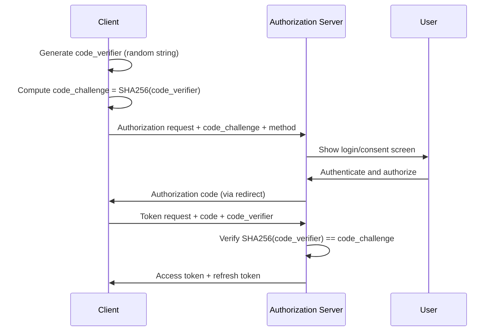

# What Is PKCE and Why Does It Matter for OAuth Security

Author: [nawazdhandala](https://github.com/nawazdhandala)

Tags: OAuth, Security, PKCE, Authentication, Authorization

Description: An explanation of Proof Key for Code Exchange (PKCE) in OAuth 2.0, how it prevents authorization code interception attacks, and when to use it.

---

OAuth 2.0 has been the standard for delegated authorization on the web for over a decade. But the original spec had a blind spot: it assumed that every client application could keep a secret. Mobile apps, single-page applications, and CLI tools cannot. That assumption opened the door to a specific class of attack called authorization code interception. PKCE (pronounced "pixy") was designed to close it.

## The Problem with the Standard Authorization Code Flow

In the classic OAuth 2.0 authorization code flow, a client application redirects the user to the authorization server, the user authenticates, and the server sends back an authorization code via a redirect URI. The client then exchanges that code for an access token by calling the token endpoint with the code and a client secret.

For server-side applications, this works well. The client secret never leaves the server. But for public clients like mobile apps and browser-based SPAs, there is no safe place to store a client secret. Anyone who can decompile the app or inspect network traffic can extract it.

Without a client secret, an attacker who intercepts the authorization code can exchange it for an access token before the legitimate client does. On mobile platforms, this interception can happen through malicious apps registering the same custom URL scheme, or through compromised inter-process communication channels.

## How PKCE Works

PKCE adds a dynamic, one-time secret to each authorization request. Instead of relying on a static client secret, the client generates a fresh cryptographic challenge for every authentication attempt.

Here is the flow:



The process has three key components:

**Code Verifier**: A cryptographically random string between 43 and 128 characters, generated by the client for each authorization request. This value is kept secret and never sent over the front channel.

**Code Challenge**: A transformed version of the code verifier. The recommended transformation is SHA-256 hashing followed by base64url encoding. A plain method exists but should only be used when the client cannot perform SHA-256.

**Code Challenge Method**: Either `S256` (recommended) or `plain`, indicating how the challenge was derived from the verifier.

## Generating the Code Verifier and Challenge

The following example shows how to generate these values in Node.js.

```javascript
// Generate a cryptographically random code verifier
// Must be between 43 and 128 characters, using unreserved URI characters
const crypto = require('crypto');

function generateCodeVerifier() {
  // 32 bytes gives us 43 base64url characters
  return crypto.randomBytes(32)
    .toString('base64url');
}

function generateCodeChallenge(verifier) {
  // SHA-256 hash the verifier and base64url encode it
  return crypto.createHash('sha256')
    .update(verifier)
    .digest('base64url');
}

const codeVerifier = generateCodeVerifier();
const codeChallenge = generateCodeChallenge(codeVerifier);

console.log('Verifier:', codeVerifier);
console.log('Challenge:', codeChallenge);
```

And the equivalent in Python:

```python
import secrets
import hashlib
import base64

# Generate a random 32-byte verifier and encode as base64url
code_verifier = secrets.token_urlsafe(32)

# Hash the verifier with SHA-256 and base64url encode the digest
digest = hashlib.sha256(code_verifier.encode('ascii')).digest()
code_challenge = base64.urlsafe_b64encode(digest).rstrip(b'=').decode('ascii')

print(f"Verifier: {code_verifier}")
print(f"Challenge: {code_challenge}")
```

## Why Interception Fails with PKCE

The security guarantee of PKCE relies on a simple principle: even if an attacker intercepts the authorization code, they cannot exchange it for a token without the original code verifier.

The authorization code travels through the front channel (browser redirects, custom URL schemes) where it can be intercepted. But the code verifier only travels through the back channel (a direct HTTPS request from client to authorization server). The attacker would need both the authorization code and the code verifier to get a token. Since the code challenge is a one-way hash, knowing the challenge does not help recover the verifier.

Here is what the token exchange request looks like:

```http
POST /oauth/token HTTP/1.1
Host: auth.example.com
Content-Type: application/x-www-form-urlencoded

grant_type=authorization_code
&code=AUTHORIZATION_CODE_HERE
&redirect_uri=https://app.example.com/callback
&client_id=my-app-client-id
&code_verifier=THE_ORIGINAL_RANDOM_STRING
```

The authorization server computes `SHA256(code_verifier)`, compares it to the stored `code_challenge` from the initial request, and only issues tokens if they match.

## When to Use PKCE

The short answer: always. The longer answer involves some context.

PKCE was originally specified in RFC 7636 as a mechanism for public clients. But the OAuth 2.1 draft specification makes PKCE mandatory for all clients, including confidential ones. The reasoning is straightforward. PKCE provides an additional layer of defense even when a client secret is present. It protects against authorization code injection attacks where a stolen code from one session is replayed in another.

**Mobile applications** must use PKCE. There is no way around this. App store review guidelines from both Apple and Google expect modern OAuth implementations.

**Single-page applications** should use PKCE with the authorization code flow. The implicit flow, which was once recommended for SPAs, is now deprecated in OAuth 2.1.

**Server-side web applications** benefit from PKCE as defense-in-depth. Even though they have a client secret, PKCE prevents code injection attacks that a client secret alone cannot stop.

**CLI tools and desktop applications** fall into the same category as mobile apps. They are public clients that cannot safely store secrets.

## Common Implementation Mistakes

**Using the plain method instead of S256**: The plain method sends the code verifier as the challenge without hashing. If the authorization request is intercepted (which is the threat model we are defending against), the attacker gets the verifier directly. Always use S256.

**Reusing code verifiers across requests**: Each authorization attempt needs a fresh verifier. Reusing them defeats the purpose of a one-time challenge.

**Storing the code verifier insecurely**: On mobile platforms, the verifier should be stored in memory or in secure storage (Keychain on iOS, EncryptedSharedPreferences on Android). Writing it to plain shared preferences or local storage negates the security benefit.

**Not validating the challenge method on the server**: Authorization servers must reject requests that omit the code challenge method or use an unsupported one. Falling back to plain silently is a security risk.

## PKCE and the Death of the Implicit Flow

Before PKCE became widespread, SPAs commonly used the implicit flow, where the authorization server returned tokens directly in the URL fragment. This was considered acceptable because fragments are not sent to the server in HTTP requests.

But fragments are accessible to JavaScript running on the same page, they appear in browser history, and they can leak through referrer headers. The implicit flow also could not issue refresh tokens, forcing applications into awkward patterns like hidden iframes for silent token renewal.

PKCE made the authorization code flow safe for public clients, eliminating the need for the implicit flow entirely. OAuth 2.1 formalizes this by removing the implicit grant type from the specification.

## Testing Your PKCE Implementation

A quick way to verify your implementation is to make the token request with an incorrect code verifier. The authorization server should reject it with an `invalid_grant` error.

```javascript
// Deliberately use the wrong verifier to confirm the server validates it
// This should return an error response with "invalid_grant"
const wrongVerifier = generateCodeVerifier(); // different from the one used in the auth request

const params = new URLSearchParams({
  grant_type: 'authorization_code',
  code: authorizationCode,
  redirect_uri: 'https://app.example.com/callback',
  client_id: 'my-app-client-id',
  code_verifier: wrongVerifier  // this will not match the original challenge
});

const response = await fetch('https://auth.example.com/oauth/token', {
  method: 'POST',
  body: params
});

// Should be 400 with error: "invalid_grant"
console.log(await response.json());
```

If the server returns tokens with a mismatched verifier, the PKCE validation is not working correctly.

## Summary

PKCE is a straightforward addition to the authorization code flow that closes a real vulnerability. It does not require any user interaction changes, adds minimal complexity to client implementations, and is supported by every major identity provider including Auth0, Okta, Google, Microsoft, and AWS Cognito. If you are building any OAuth integration today, use PKCE regardless of whether your client is public or confidential. The OAuth 2.1 specification will require it anyway, and there is no downside to adopting it now.
