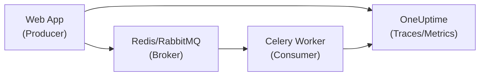

# How to Monitor Celery Workers with OpenTelemetry and OneUptime

Author: [nawazdhandala](https://www.github.com/nawazdhandala)

Tags: Python, Celery, OpenTelemetry, Monitoring, OneUptime, Distributed Tracing, Background Jobs, Redis

Description: Learn how to monitor Celery workers with OpenTelemetry and OneUptime. This guide covers distributed tracing, task metrics, and alerting for reliable background job processing.

---

> Celery workers run in the background, making issues hard to spot until they become critical. OpenTelemetry with OneUptime provides visibility into task execution, queue depth, and worker health. Stop flying blind with your background jobs.

Background jobs fail silently. Proper monitoring catches problems before they impact users.

---

## Overview



---

## Installation

Install the required packages for Celery with Redis backend and OpenTelemetry instrumentation:

```bash
pip install celery[redis] opentelemetry-api opentelemetry-sdk \
    opentelemetry-exporter-otlp-proto-http \
    opentelemetry-instrumentation-celery \
    prometheus-client
```

---

## Basic Celery Instrumentation

### Configure OpenTelemetry

The following module sets up OpenTelemetry tracing and metrics for your Celery workers, configuring exporters to send telemetry data to OneUptime:

```python
# telemetry.py
import os
from opentelemetry import trace, metrics
from opentelemetry.sdk.trace import TracerProvider
from opentelemetry.sdk.trace.export import BatchSpanProcessor
from opentelemetry.exporter.otlp.proto.http.trace_exporter import OTLPSpanExporter
from opentelemetry.sdk.metrics import MeterProvider
from opentelemetry.sdk.metrics.export import PeriodicExportingMetricReader
from opentelemetry.exporter.otlp.proto.http.metric_exporter import OTLPMetricExporter
from opentelemetry.sdk.resources import Resource, SERVICE_NAME
from opentelemetry.instrumentation.celery import CeleryInstrumentor

def setup_telemetry(service_name: str = "celery-worker"):
    """Configure OpenTelemetry for Celery"""

    # Create a resource that identifies this service in traces and metrics
    resource = Resource.create({
        SERVICE_NAME: service_name,
        "deployment.environment": os.getenv("ENVIRONMENT", "production"),
        "service.version": os.getenv("APP_VERSION", "1.0.0")
    })

    # Get OneUptime endpoint and authentication token from environment
    endpoint = os.getenv("ONEUPTIME_ENDPOINT", "https://otlp.oneuptime.com")
    token = os.getenv("ONEUPTIME_TOKEN")
    headers = {"Authorization": f"Bearer {token}"}

    # Configure the tracer provider with OTLP exporter for distributed tracing
    trace_provider = TracerProvider(resource=resource)
    trace_provider.add_span_processor(
        BatchSpanProcessor(
            OTLPSpanExporter(
                endpoint=f"{endpoint}/v1/traces",
                headers=headers
            )
        )
    )
    trace.set_tracer_provider(trace_provider)

    # Configure the meter provider for metrics collection
    # Metrics are exported every 60 seconds (60000ms)
    metric_reader = PeriodicExportingMetricReader(
        OTLPMetricExporter(
            endpoint=f"{endpoint}/v1/metrics",
            headers=headers
        ),
        export_interval_millis=60000
    )
    meter_provider = MeterProvider(
        resource=resource,
        metric_readers=[metric_reader]
    )
    metrics.set_meter_provider(meter_provider)

    # Automatically instrument Celery to capture task spans
    CeleryInstrumentor().instrument()

    return trace.get_tracer(__name__)
```

### Celery Application

This module creates the Celery application with telemetry enabled and configures it for reliable task processing:

```python
# celery_app.py
from celery import Celery
import os
from telemetry import setup_telemetry

# Initialize telemetry before creating the Celery app
# This ensures all tasks are automatically traced
tracer = setup_telemetry("celery-worker")

# Create the Celery application with Redis as broker and result backend
app = Celery(
    'tasks',
    broker=os.getenv('CELERY_BROKER_URL', 'redis://localhost:6379/0'),
    backend=os.getenv('CELERY_RESULT_BACKEND', 'redis://localhost:6379/0')
)

# Configure Celery for reliability and security
app.conf.update(
    # Use JSON serialization for safety (avoids pickle vulnerabilities)
    task_serializer='json',
    accept_content=['json'],
    result_serializer='json',
    # Use UTC for consistent timestamps across distributed systems
    timezone='UTC',
    enable_utc=True,
    # Acknowledge tasks only after completion (prevents task loss on worker crash)
    task_acks_late=True,
    # Fetch one task at a time for fair distribution across workers
    worker_prefetch_multiplier=1
)
```

---

## Task Instrumentation

### Automatic Tracing

With Celery instrumentation enabled, all tasks are automatically traced without any code changes:

```python
# tasks.py
from celery_app import app
import logging

logger = logging.getLogger(__name__)

@app.task(bind=True)
def process_order(self, order_id: str):
    """Process an order - automatically traced by OpenTelemetry instrumentation"""
    logger.info(f"Processing order {order_id}")

    # Each of these function calls becomes part of the task's trace
    # The instrumentation automatically captures timing and errors
    order = fetch_order(order_id)
    validate_order(order)
    fulfill_order(order)

    logger.info(f"Order {order_id} processed successfully")
    return {"status": "completed", "order_id": order_id}
```

### Custom Spans Within Tasks

For more granular visibility, create custom spans to trace specific operations within your tasks:

```python
# tasks.py
from opentelemetry import trace
from celery_app import app

# Get a tracer instance for creating custom spans
tracer = trace.get_tracer(__name__)

@app.task(bind=True)
def process_payment(self, payment_id: str, amount: float):
    """Process payment with custom spans for each step"""

    # Create a span for payment validation
    # Spans help identify which step is slow or failing
    with tracer.start_as_current_span("validate_payment") as span:
        # Add attributes to provide context in traces
        span.set_attribute("payment.id", payment_id)
        span.set_attribute("payment.amount", amount)
        validation = validate_payment(payment_id)

    # Create a span for the actual charge operation
    with tracer.start_as_current_span("charge_card") as span:
        span.set_attribute("payment.id", payment_id)
        result = charge_customer(payment_id, amount)
        # Record the transaction ID for correlation with payment provider
        span.set_attribute("transaction.id", result.transaction_id)

    # Create a span for sending confirmation to customer
    with tracer.start_as_current_span("send_confirmation") as span:
        send_receipt(payment_id, result.transaction_id)

    return {"payment_id": payment_id, "status": "completed"}
```

---

## Custom Metrics

### Task Metrics

Define custom metrics to track task execution patterns and queue health:

```python
# metrics.py
from opentelemetry import metrics

# Get a meter instance for creating metrics
meter = metrics.get_meter(__name__)

# Counter for tracking the number of tasks started
# Counters only increase - perfect for counting events
task_started = meter.create_counter(
    name="celery.task.started",
    description="Number of tasks started",
    unit="1"
)

# Counter for successfully completed tasks
task_completed = meter.create_counter(
    name="celery.task.completed",
    description="Number of tasks completed",
    unit="1"
)

# Counter for failed tasks - helps identify problematic task types
task_failed = meter.create_counter(
    name="celery.task.failed",
    description="Number of tasks failed",
    unit="1"
)

# Histogram for tracking task execution time distribution
# Useful for identifying slow tasks and setting SLOs
task_duration = meter.create_histogram(
    name="celery.task.duration",
    description="Task execution duration",
    unit="ms"
)

# Observable gauge for monitoring queue depth
# The callback function is called periodically to collect current values
queue_depth = meter.create_observable_gauge(
    name="celery.queue.depth",
    description="Number of messages in queue",
    callbacks=[get_queue_depth]
)

def get_queue_depth(options):
    """Callback to get current queue depth from Redis broker"""
    import redis
    r = redis.from_url(os.getenv('CELERY_BROKER_URL'))

    # Check depth of each queue and yield observations with queue labels
    for queue in ['celery', 'high', 'low']:
        depth = r.llen(queue)
        yield metrics.Observation(
            depth,
            {"queue": queue}
        )
```

### Instrumented Task Decorator

Create a reusable decorator that automatically adds metrics to any Celery task:

```python
# instrumented_tasks.py
import time
import functools
from celery_app import app
from metrics import task_started, task_completed, task_failed, task_duration

def instrumented_task(**task_kwargs):
    """Decorator that adds metrics to Celery tasks automatically"""

    def decorator(func):
        @app.task(bind=True, **task_kwargs)
        @functools.wraps(func)
        def wrapper(self, *args, **kwargs):
            task_name = func.__name__
            labels = {"task": task_name}

            # Record task start and capture start time for duration calculation
            task_started.add(1, labels)
            start_time = time.time()

            try:
                # Execute the actual task function
                result = func(self, *args, **kwargs)
                # Record successful completion
                task_completed.add(1, labels)
                return result

            except Exception as e:
                # Record failure with error type for debugging
                task_failed.add(1, {**labels, "error_type": type(e).__name__})
                raise

            finally:
                # Always record duration, even on failure
                duration = (time.time() - start_time) * 1000  # Convert to milliseconds
                task_duration.record(duration, labels)

        return wrapper
    return decorator

# Usage example - the decorator handles all metrics automatically
@instrumented_task(max_retries=3)
def process_data(self, data_id: str):
    """Task with automatic metrics collection"""
    return process(data_id)
```

---

## Worker Health Monitoring

### Health Check Endpoint

Create a Flask application that exposes health check endpoints for your Celery workers:

```python
# worker_health.py
from flask import Flask, jsonify
from celery_app import app as celery_app
import redis
import os

health_app = Flask(__name__)

@health_app.route("/health")
def health():
    """Worker health check endpoint for load balancers and orchestration platforms"""
    # Run multiple health checks
    checks = {
        "broker": check_broker(),
        "worker": check_worker_responding()
    }

    # Aggregate results - healthy only if all checks pass
    status = "healthy" if all(checks.values()) else "unhealthy"
    code = 200 if status == "healthy" else 503

    return jsonify({
        "status": status,
        "checks": checks
    }), code

def check_broker():
    """Check Redis/broker connectivity by sending a ping command"""
    try:
        r = redis.from_url(os.getenv('CELERY_BROKER_URL'))
        r.ping()
        return True
    except:
        return False

def check_worker_responding():
    """Check if Celery workers are responding to control commands"""
    try:
        inspect = celery_app.control.inspect()
        # active() returns dict of active tasks per worker, None if no workers
        active = inspect.active()
        return active is not None
    except:
        return False

@health_app.route("/metrics")
def metrics_endpoint():
    """Expose Prometheus metrics for scraping"""
    from prometheus_client import generate_latest, CONTENT_TYPE_LATEST
    return generate_latest(), 200, {"Content-Type": CONTENT_TYPE_LATEST}
```

### Run Health Server Alongside Worker

Run a background health check server in the same process as the Celery worker:

```python
# run_worker.py
import threading
from worker_health import health_app
from celery_app import app

def start_health_server():
    """Start health check server in background thread"""
    # Run Flask in threaded mode to handle multiple health check requests
    health_app.run(host="0.0.0.0", port=8080, threaded=True)

if __name__ == "__main__":
    # Start health server in a daemon thread (will exit when main thread exits)
    health_thread = threading.Thread(target=start_health_server, daemon=True)
    health_thread.start()

    # Start Celery worker in the main thread
    app.worker_main(['worker', '--loglevel=info'])
```

---

## Distributed Tracing Across Services

### Context Propagation from Web App

When a web application queues a Celery task, the trace context is automatically propagated:

```python
# web_app.py (FastAPI producer)
from fastapi import FastAPI
from opentelemetry import trace
from opentelemetry.propagate import inject
from tasks import process_order

app = FastAPI()
tracer = trace.get_tracer(__name__)

@app.post("/orders")
async def create_order(order_data: dict):
    """Create order and queue for processing with trace context"""

    with tracer.start_as_current_span("create_order") as span:
        # Create order in database
        order = create_order_record(order_data)
        span.set_attribute("order.id", order.id)

        # Queue task - CeleryInstrumentor automatically propagates trace context
        # The Celery task will be a child span of this create_order span
        process_order.delay(order.id)

        return {"order_id": order.id, "status": "queued"}
```

### Context in Celery Task

The Celery task receives and continues the trace from the producer:

```python
# tasks.py
from opentelemetry import trace
from celery_app import app

tracer = trace.get_tracer(__name__)

@app.task(bind=True)
def process_order(self, order_id: str):
    """Process order - receives trace context from producer automatically"""

    # The current span is a child of the producer's span
    # This creates an end-to-end trace from API request through task completion
    current_span = trace.get_current_span()
    current_span.set_attribute("order.id", order_id)

    # Create child spans for each processing step
    with tracer.start_as_current_span("fetch_order"):
        order = get_order(order_id)

    with tracer.start_as_current_span("process_items"):
        for item in order.items:
            process_item(item)

    with tracer.start_as_current_span("send_notification"):
        notify_customer(order)

    return {"order_id": order_id, "status": "completed"}
```

---

## Signal-Based Monitoring

### Celery Signals for Events

Use Celery signals to capture task lifecycle events and record metrics:

```python
# signals.py
from celery.signals import (
    task_prerun, task_postrun, task_failure,
    task_retry, worker_ready, worker_shutdown
)
from opentelemetry import trace, metrics
import logging
import time

logger = logging.getLogger(__name__)
meter = metrics.get_meter(__name__)

# Create metrics for task lifecycle events
task_attempts = meter.create_counter("celery.task.attempts")
retry_counter = meter.create_counter("celery.task.retries")

# Store start times for duration calculation
task_start_times = {}

@task_prerun.connect
def task_prerun_handler(task_id, task, args, kwargs, **kw):
    """Called before task execution - record start time and increment counter"""
    task_start_times[task_id] = time.time()
    task_attempts.add(1, {"task": task.name})

    logger.info(f"Task starting", extra={
        "task_id": task_id,
        "task_name": task.name
    })

@task_postrun.connect
def task_postrun_handler(task_id, task, args, kwargs, retval, state, **kw):
    """Called after task execution - log duration and state"""
    # Calculate duration, defaulting to 0 if start time not found
    duration = time.time() - task_start_times.pop(task_id, time.time())

    logger.info(f"Task completed", extra={
        "task_id": task_id,
        "task_name": task.name,
        "state": state,
        "duration_ms": duration * 1000
    })

@task_failure.connect
def task_failure_handler(task_id, exception, args, kwargs, traceback, einfo, **kw):
    """Called on task failure - log error details for debugging"""
    logger.error(f"Task failed", extra={
        "task_id": task_id,
        "error": str(exception),
        "error_type": type(exception).__name__
    }, exc_info=True)

@task_retry.connect
def task_retry_handler(request, reason, einfo, **kw):
    """Called when task is retried - track retry count for identifying flaky tasks"""
    retry_counter.add(1, {"task": request.task})

    logger.warning(f"Task retrying", extra={
        "task_id": request.id,
        "task_name": request.task,
        "reason": str(reason),
        "retry_count": request.retries
    })

@worker_ready.connect
def worker_ready_handler(sender, **kw):
    """Called when worker is ready to accept tasks"""
    logger.info("Celery worker ready", extra={
        "hostname": sender.hostname
    })

@worker_shutdown.connect
def worker_shutdown_handler(sender, **kw):
    """Called when worker shuts down - useful for cleanup and alerting"""
    logger.info("Celery worker shutting down", extra={
        "hostname": sender.hostname
    })
```

---

## Queue Depth Monitoring

Monitor queue sizes and worker count to detect backlogs and capacity issues:

```python
# queue_monitor.py
import redis
import os
from opentelemetry import metrics
import time
import threading

meter = metrics.get_meter(__name__)

# Observable gauge for queue sizes - callbacks are invoked during metric collection
queue_size = meter.create_observable_gauge(
    name="celery.queue.size",
    description="Number of tasks in queue",
    callbacks=[observe_queue_size]
)

# Observable gauge for active worker count
active_workers = meter.create_observable_gauge(
    name="celery.workers.active",
    description="Number of active workers",
    callbacks=[observe_active_workers]
)

def observe_queue_size(options):
    """Observe queue sizes across all configured queues"""
    r = redis.from_url(os.getenv('CELERY_BROKER_URL'))

    # Check multiple queues with different priorities
    queues = ['celery', 'high', 'default', 'low']
    for queue in queues:
        # llen returns the length of a Redis list (queue)
        size = r.llen(queue)
        yield metrics.Observation(size, {"queue": queue})

def observe_active_workers(options):
    """Observe the number of active Celery workers"""
    from celery_app import app

    try:
        inspect = app.control.inspect()
        # stats() returns info about each worker
        stats = inspect.stats()
        if stats:
            yield metrics.Observation(len(stats), {})
        else:
            yield metrics.Observation(0, {})
    except:
        # Return 0 if unable to connect to broker
        yield metrics.Observation(0, {})
```

---

## Production Configuration

### Docker Compose

Deploy a complete Celery setup with Redis broker and monitoring:

```yaml
# docker-compose.yml
version: '3.8'

services:
  redis:
    image: redis:7-alpine
    ports:
      - "6379:6379"

  web:
    build: .
    environment:
      - CELERY_BROKER_URL=redis://redis:6379/0
      - ONEUPTIME_ENDPOINT=https://otlp.oneuptime.com
      - ONEUPTIME_TOKEN=${ONEUPTIME_TOKEN}
      - SERVICE_NAME=web-app
    depends_on:
      - redis

  celery-worker:
    build: .
    command: celery -A celery_app worker --loglevel=info
    environment:
      - CELERY_BROKER_URL=redis://redis:6379/0
      - ONEUPTIME_ENDPOINT=https://otlp.oneuptime.com
      - ONEUPTIME_TOKEN=${ONEUPTIME_TOKEN}
      - SERVICE_NAME=celery-worker
    depends_on:
      - redis
    healthcheck:
      test: ["CMD", "celery", "-A", "celery_app", "inspect", "ping"]
      interval: 30s
      timeout: 10s
      retries: 3

  celery-beat:
    build: .
    command: celery -A celery_app beat --loglevel=info
    environment:
      - CELERY_BROKER_URL=redis://redis:6379/0
      - ONEUPTIME_ENDPOINT=https://otlp.oneuptime.com
      - ONEUPTIME_TOKEN=${ONEUPTIME_TOKEN}
      - SERVICE_NAME=celery-beat
    depends_on:
      - redis
```

### Kubernetes Deployment

Deploy Celery workers in Kubernetes with proper health checks and resource limits:

```yaml
# celery-worker-deployment.yaml
apiVersion: apps/v1
kind: Deployment
metadata:
  name: celery-worker
spec:
  replicas: 3
  selector:
    matchLabels:
      app: celery-worker
  template:
    metadata:
      labels:
        app: celery-worker
    spec:
      containers:
      - name: worker
        image: myapp:latest
        command: ["celery", "-A", "celery_app", "worker", "--loglevel=info"]
        env:
        - name: CELERY_BROKER_URL
          valueFrom:
            secretKeyRef:
              name: celery-secrets
              key: broker-url
        - name: ONEUPTIME_ENDPOINT
          value: "https://otlp.oneuptime.com"
        - name: ONEUPTIME_TOKEN
          valueFrom:
            secretKeyRef:
              name: oneuptime-secrets
              key: token
        resources:
          requests:
            memory: "256Mi"
            cpu: "250m"
          limits:
            memory: "512Mi"
            cpu: "500m"
        livenessProbe:
          exec:
            command: ["celery", "-A", "celery_app", "inspect", "ping", "-t", "10"]
          initialDelaySeconds: 30
          periodSeconds: 60
```

---

## Best Practices

1. **Instrument all tasks** - use automatic instrumentation
2. **Monitor queue depth** - alert on backlog
3. **Track task duration** - identify slow tasks
4. **Log with context** - include task_id and trace_id
5. **Health checks** - for orchestration platforms
6. **Separate metrics** - per queue and task type

---

## Conclusion

Monitoring Celery with OpenTelemetry and OneUptime provides complete visibility into background job processing. Key takeaways:

- **Automatic instrumentation** traces task execution
- **Custom metrics** track queue health
- **Distributed tracing** connects web requests to tasks
- **Alerting** catches problems early

---

*Need to monitor your Celery workers? [OneUptime](https://oneuptime.com) provides comprehensive monitoring for background job systems with queue depth tracking and failure alerting.*
