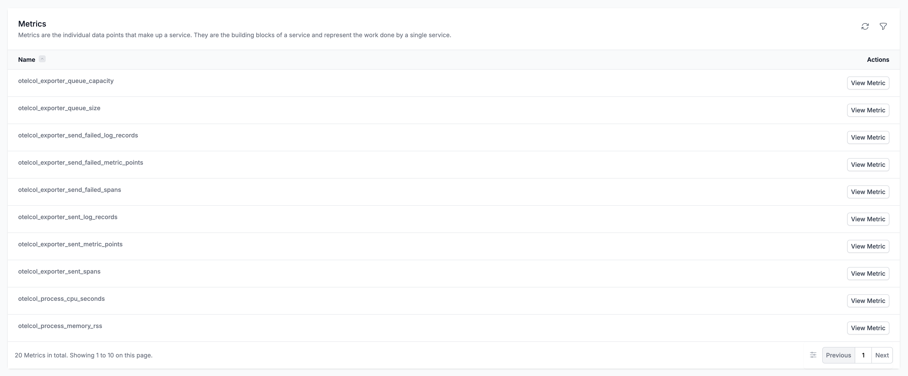
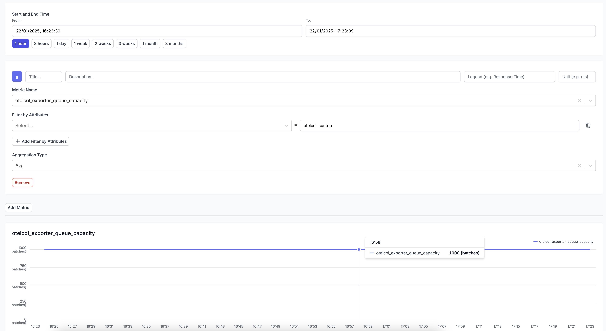

# How to collect internal metrics from OpenTelemetry Collector?

Author: [devneelpatel](https://www.github.com/devneelpatel)

Tags: OpenTelemetry

Description: Learn how to collect internal metrics from the OpenTelemetry Collector to monitor its performance and troubleshoot issues effectively.

### Why collect internal metrics from OpenTelemetry Collector?

Monitoring the performance of the OpenTelemetry Collector is crucial to ensure that it is functioning correctly and handling the data efficiently. By collecting internal metrics from the Collector, you can gain insights into its resource usage, throughput, latency, and other key performance indicators. This data can help you identify bottlenecks, troubleshoot issues, and optimize the configuration of the Collector.

### How to collect internal metrics from OpenTelemetry Collector?

The OpenTelemetry Collector provides a built-in metrics pipeline that can be used to collect internal metrics. To enable this feature, you need to configure the Collector to export metrics to a backend of your choice. In this example, we will use [OneUptime](https://oneuptime.com) as a backend to collect and analyze the metrics.

Here's how you can configure the OpenTelemetry Collector to collect internal metrics:

**Add the following configuration to the `config.yaml` file of the OpenTelemetry Collector:**

```yaml
# This is how your service section should look like
service:
  telemetry:
     metrics:
      readers:
        - periodic:
            exporter:
              # You can use any supported exporter here. 
              # In this example, we are using the OTLP HTTP exporter.
              otlp:
                protocol: http/protobuf
                # In this case we use the OneUptime backend, but you can use any other backend that supports OTLP.
                endpoint: https://oneuptime.com/otlp
                # For more information on YOUR_ONEUPTIME_TOKEN, please refer to the OneUptime documentation here: https://oneuptime.com/docs/telemetry/open-telemetry
                headers:
                 x-oneuptime-token: YOUR_ONEUPTIME_TOKEN
```

Please restart the OpenTelemetry Collector after making these changes to the configuration file.

This is how OpenTelemetry Metrics will look like in OneUptime:

These are some of the metrics expored by the OpenTelemetry Collector:



Here's how one of the metrics looks like in OneUptime:




### Some things to be aware of:

- You can use any backend that supports the OpenTelemetry Protocol (OTLP) to collect and analyze the metrics. [OneUptime](https://oneuptime.com) is just an example. We also run a SaaS service so you dont have to worry about setting up and maintaining your own monitoring infrastructure.

Happy monitoring and debugging!

**Related Reading:**

- [How to increase the size of the sending queue in OpenTelemetry Collector?](https://oneuptime.com/blog/post/2025-01-20-increase-size-of-open-telemetry-collector-queue/view)
- [How to reduce noise in OpenTelemetry? Keep What Matters, Drop the Rest.](https://oneuptime.com/blog/post/2025-08-25-how-to-reduce-noise-in-opentelemetry/view)
- [What are metrics in OpenTelemetry: A Complete Guide](https://oneuptime.com/blog/post/2025-08-26-what-are-metrics-in-opentelemetry/view)