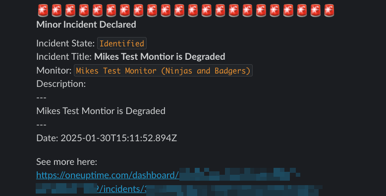

# Integrating OneUptime and Slack (and probably Teams)

Author: [mikepearce](https://github.com/MikePearce)

Tags: Workflows, Slack, Components, JSON

Description: Learn how to use workflows to send messages to Slack when incidents are created or updated.

## Getting Alerted

A very common use-case for alerting people to incidents is sending them into Slack. Less common is sending them into Teams, but it's still largely the same process. We spend most of our day working with our peers and colleagues in Slack. There's a million and one Slack plugins and bots that alert you to meetings, company comms or whose turn it is to make the tea.

So why not get the fear inducing incident alerts there too?

## A muppets guide to getting the right data out of OneUptime and into Slack.

### Step 1: Create the Incident Trigger Workflow

1. You'll want to create workflow and select the `On Create Incident` trigger.
2. In the "Selected Fields" box, add the following JSON configuration. This tells the workflow which incident fields to retrieve and make available for your Slack message. Each field maps to data from the incident object:

```json
{
    "monitors": {
      "name": true          // Get the name of affected monitors
    },
    "currentIncidentState": {
        "name": true        // Get the current state (Identified, Acknowledged, etc.)
    },
    "incidentSeverity": {
        "name": true        // Get severity level (Critical, High, Medium, Low)
    },
    "createdAt": true,      // Timestamp when incident was created
    "title": true,          // Incident title
    "description": true,    // Incident description
    "_id": true,            // Unique incident ID (used for building URLs)
    "projectId": true       // Project ID (used for building URLs)
}
```

### Step 2: Configure the Slack Component

3. Next, select the `Send Message to Slack` component.
4. Fill in the "Slack Incoming Webhook URL" with your Slack bot webhook (if you haven't got one of those, watch this video [Connect OneUptime to Slack using Workflows](https://www.youtube.com/watch?v=k1-reCQTZnM))
5. In the "Message Text" box, add the following Slack message template. This uses double curly braces `{{}}` to reference the incident data from the trigger component. The format uses Slack's mrkdwn syntax for formatting:

```
🚨🚨🚨🚨🚨🚨🚨🚨🚨🚨🚨🚨🚨🚨🚨🚨🚨🚨🚨🚨🚨🚨
*{{local.components.incident-on-create-1.returnValues.model.incidentSeverity.name}} Declared*

Incident State: `{{local.components.incident-on-create-1.returnValues.model.currentIncidentState.name}}`
Incident Title: *{{local.components.incident-on-create-1.returnValues.model.title}}*
Date: {{local.components.incident-on-create-1.returnValues.model.createdAt.value}}
Monitor: `{{local.components.incident-on-create-1.returnValues.model.monitors[0].name}}`

Description: 
---
{{local.components.incident-on-create-1.returnValues.model.description}}
---

👀 See more here: 
https://oneuptime.com/dashboard/{{local.components.incident-on-create-1.returnValues.model.projectId.value}}/incidents/{{local.components.incident-on-create-1.returnValues.model._id}} 
```

6. Make sure you connect all the components with the drag and drop connectors.

## In Slack

It will look like this in Slack:



Obviously you can change how it looks, move stuff around and whatnot. If you're a Slack bot pro, you can probably even create buttons to Acknowledge or Resolve requests.

## Updating Slack with incident status changes

Your incidents will auto-resolve themselves when the monitor goes back into an operational state, or someone clicks 'Acknowledge' in the interface. You can also get these pushed into Slack with the following workflow configuration.

### Step 1: Create the State Change Workflow

1. Create a new workflow and set the trigger as `On Create Incident State Timeline` (yeah, it's not the most obvious name - it fires whenever an incident's state changes).
2. In the "Select Fields" box in the trigger, add the following JSON configuration. This retrieves the state change details and related incident information:

```json
{
    "createdAt": true,        // When the state change occurred
    "incident": {
      "title": true           // Get the incident title for context
    },
    "incidentState": {
      "name": true            // The new state (Acknowledged, Resolved, etc.)
    },
    "_id": true,              // State timeline entry ID
    "rootCause": true,        // Reason for the state change
    "createdByUser": true     // Who made the change (if applicable)
}
```

### Step 2: Add Conditional Logic (Optional)

3. Now, if you don't want to have the `Identified` incident status appear (which you may not, as the first workflow will post the incident and this one will also post it), then add an `If/Else` component and put `{{local.components.incident-state-timeline-on-create-1.returnValues.model.incidentState.name}}` in the "Input 1" box, `Equal To` in the "Operator" and `Identified` in the "Input 2 box". Hit save.

4. Connect the trigger to `If/Else` (if you added it)

### Step 3: Configure the Slack Update Message

5. Add a `Send Message to Slack` component, add the same Slack webhook as before, and the following message template in the "Message Text" box. This template formats the state change notification with all relevant details:

```
  🚨🚨🚨🚨🚨🚨🚨🚨🚨🚨🚨🚨🚨🚨🚨🚨🚨🚨🚨🚨🚨🚨
*[{{local.components.incident-state-timeline-on-create-1.returnValues.model.incident.title}}] State Changed!*

New State: `{{local.components.incident-state-timeline-on-create-1.returnValues.model.incidentState.name}}`
Date: {{local.components.incident-state-timeline-on-create-1.returnValues.model.createdAt.value}}
Incident Title: {{local.components.incident-state-timeline-on-create-1.returnValues.model.incident.title}}

Cause of change:
---
 {{local.components.incident-state-timeline-on-create-1.returnValues.model.rootCause}}
---

👀 See more here: 
https://oneuptime.com/dashboard/{{local.components.incident-state-timeline-on-create-1.returnValues.model.projectId.value}}/incidents/{{local.components.incident-state-timeline-on-create-1.returnValues.model._id}} 

```

6. Connect the `No` part of the `If/Else` component to the Slack component.
7. Now you'll get updates to the incident posted to the Slack channel too. Hurrah

## Connecting to Teams...

.. is exactly the, but replace the Slack component with the Teams one.

**Related Reading:**

- [Introducing the OneUptime Terraform Provider: Infrastructure as Code for Complete Observability](https://oneuptime.com/blog/post/2025-07-01-introducing-terraform-provider-for-oneuptime/view)
- [Introducing OneUptime MCP Server: Bringing AI-Native Observability to Your Workflow](https://oneuptime.com/blog/post/2025-07-01-oneuptime-mcp-server-ai-observability/view)
- [OneUptime Embraces Open Standards: Complete OpenAPI 3.0 Specification Now Available](https://oneuptime.com/blog/post/2025-07-01-oneuptime-openapi-specification-open-standards/view)