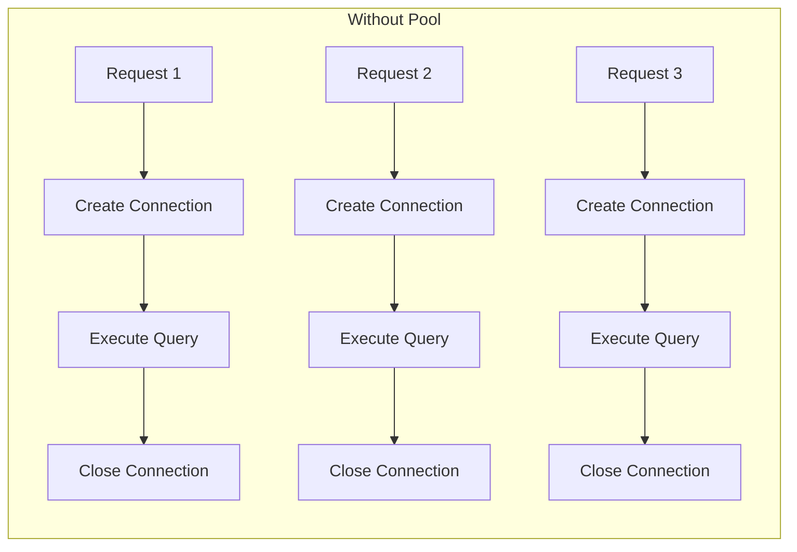
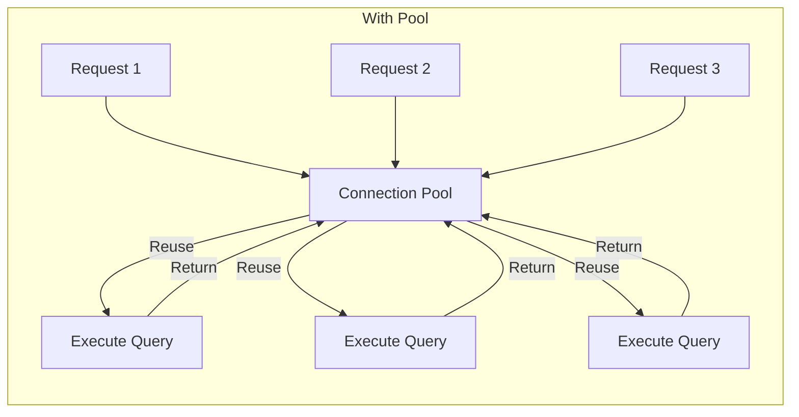
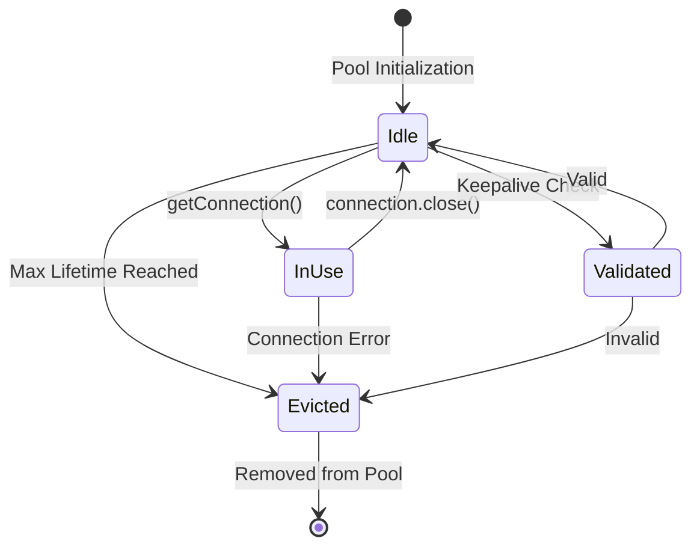
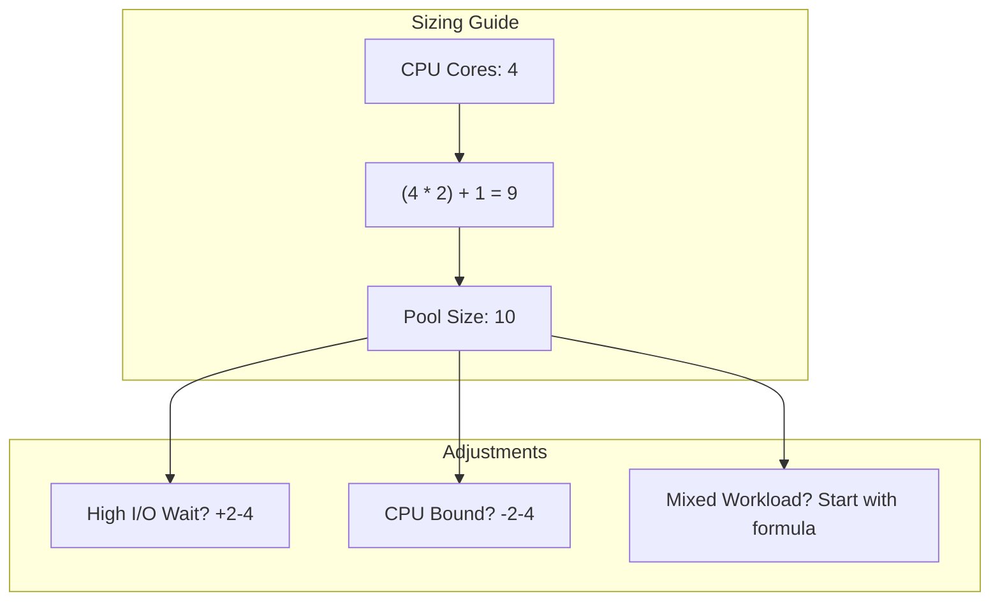
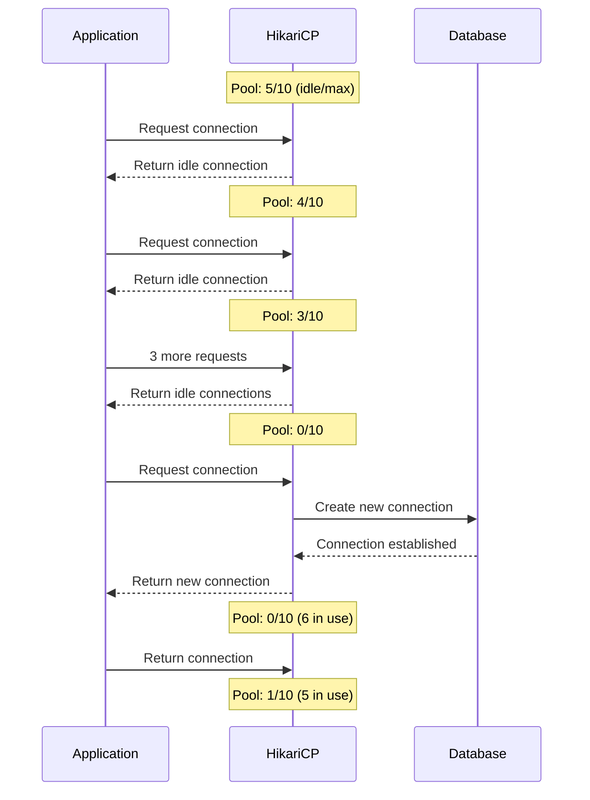
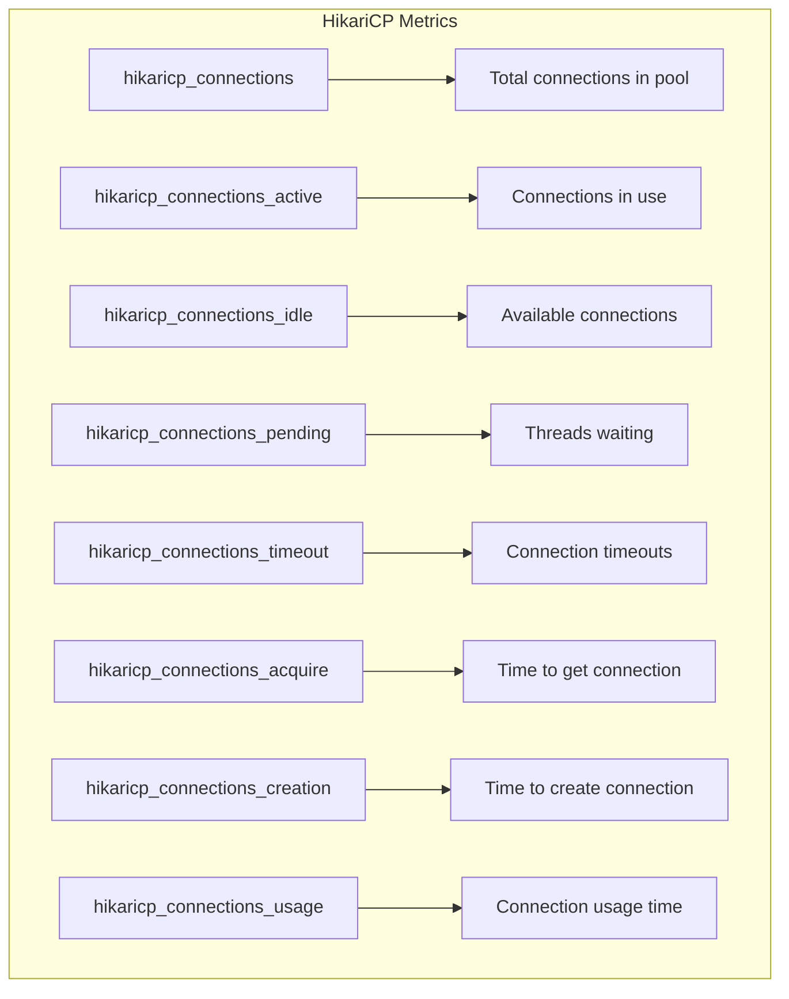

# How to Configure HikariCP Connection Pooling

Author: [nawazdhandala](https://www.github.com/nawazdhandala)

Tags: Java, HikariCP, Connection Pooling, Database, Spring Boot, Performance

Description: Learn how to configure HikariCP for optimal database connection pooling in Java applications. This guide covers pool sizing, timeout settings, and monitoring with Spring Boot.

---

> Database connections are expensive. Each connection requires a TCP handshake, authentication, memory allocation, and resource initialization. HikariCP solves this by maintaining a pool of ready-to-use connections, dramatically improving application performance and reliability.

HikariCP (Japanese for "light") is the default connection pool in Spring Boot and is known for its speed, reliability, and minimal overhead. It consistently outperforms other connection pools in benchmarks while using fewer resources.

---

## Understanding Connection Pooling

Before diving into configuration, let's understand why connection pooling matters:





Without pooling, each database operation requires creating and destroying a connection. With pooling, connections are reused, eliminating the overhead of connection establishment.

### Connection Lifecycle

Understanding the connection lifecycle helps you configure HikariCP correctly:



Key states:
- **Idle**: Connection is available in the pool
- **InUse**: Connection is borrowed by application code
- **Validated**: Connection is being checked for validity
- **Evicted**: Connection is removed from the pool

---

## Getting Started

### Dependencies

For Spring Boot applications, HikariCP is included by default with the JDBC starter:

```xml
<!-- pom.xml -->
<dependencies>
    <!-- Spring Boot JDBC - includes HikariCP -->
    <dependency>
        <groupId>org.springframework.boot</groupId>
        <artifactId>spring-boot-starter-jdbc</artifactId>
    </dependency>
    
    <!-- Or Spring Data JPA - also includes HikariCP -->
    <dependency>
        <groupId>org.springframework.boot</groupId>
        <artifactId>spring-boot-starter-data-jpa</artifactId>
    </dependency>
    
    <!-- PostgreSQL driver -->
    <dependency>
        <groupId>org.postgresql</groupId>
        <artifactId>postgresql</artifactId>
        <scope>runtime</scope>
    </dependency>
    
    <!-- Actuator for metrics -->
    <dependency>
        <groupId>org.springframework.boot</groupId>
        <artifactId>spring-boot-starter-actuator</artifactId>
    </dependency>
    
    <!-- Micrometer for Prometheus metrics -->
    <dependency>
        <groupId>io.micrometer</groupId>
        <artifactId>micrometer-registry-prometheus</artifactId>
    </dependency>
</dependencies>
```

For standalone Java applications:

```xml
<!-- pom.xml - Standalone -->
<dependencies>
    <!-- HikariCP -->
    <dependency>
        <groupId>com.zaxxer</groupId>
        <artifactId>HikariCP</artifactId>
        <version>5.1.0</version>
    </dependency>
    
    <!-- PostgreSQL driver -->
    <dependency>
        <groupId>org.postgresql</groupId>
        <artifactId>postgresql</artifactId>
        <version>42.7.2</version>
    </dependency>
</dependencies>
```

For Gradle:

```groovy
// build.gradle
dependencies {
    // Spring Boot JDBC - includes HikariCP
    implementation 'org.springframework.boot:spring-boot-starter-jdbc'
    
    // PostgreSQL driver
    runtimeOnly 'org.postgresql:postgresql'
    
    // Actuator for metrics
    implementation 'org.springframework.boot:spring-boot-starter-actuator'
    
    // Prometheus metrics
    implementation 'io.micrometer:micrometer-registry-prometheus'
}
```

---

## Basic Configuration

### Spring Boot Configuration

Configure HikariCP in `application.yml`:

```yaml
# application.yml
spring:
  datasource:
    # Connection URL
    url: jdbc:postgresql://localhost:5432/myapp
    username: ${DB_USERNAME:postgres}
    password: ${DB_PASSWORD:postgres}
    driver-class-name: org.postgresql.Driver
    
    # HikariCP specific settings
    hikari:
      # Pool sizing
      minimum-idle: 5              # Minimum connections to keep idle
      maximum-pool-size: 20        # Maximum connections in the pool
      
      # Timeouts
      connection-timeout: 30000    # Wait for connection (30 seconds)
      idle-timeout: 600000         # Close idle connections after 10 minutes
      max-lifetime: 1800000        # Max connection age (30 minutes)
      keepalive-time: 300000       # Keepalive interval (5 minutes)
      
      # Validation
      validation-timeout: 5000     # Validation query timeout (5 seconds)
      
      # Pool name for metrics
      pool-name: MyAppPool
      
      # Auto-commit behavior
      auto-commit: true
      
      # Connection test query (optional - driver-specific)
      # connection-test-query: SELECT 1
      
      # Leak detection (development only)
      leak-detection-threshold: 60000  # 60 seconds
```

### Standalone Java Configuration

For non-Spring applications, configure HikariCP programmatically:

```java
// config/DataSourceConfig.java
package com.example.config;

import com.zaxxer.hikari.HikariConfig;
import com.zaxxer.hikari.HikariDataSource;

import javax.sql.DataSource;

public class DataSourceConfig {

    public static DataSource createDataSource() {
        // Create HikariCP configuration
        HikariConfig config = new HikariConfig();
        
        // Basic connection settings
        config.setJdbcUrl("jdbc:postgresql://localhost:5432/myapp");
        config.setUsername(System.getenv("DB_USERNAME"));
        config.setPassword(System.getenv("DB_PASSWORD"));
        config.setDriverClassName("org.postgresql.Driver");
        
        // Pool sizing - crucial for performance
        config.setMinimumIdle(5);           // Keep 5 connections ready
        config.setMaximumPoolSize(20);      // Allow up to 20 connections
        
        // Timeout settings
        config.setConnectionTimeout(30000);  // 30 seconds to get connection
        config.setIdleTimeout(600000);       // 10 minutes idle before close
        config.setMaxLifetime(1800000);      // 30 minutes max age
        config.setKeepaliveTime(300000);     // 5 minute keepalive
        
        // Validation settings
        config.setValidationTimeout(5000);   // 5 second validation timeout
        
        // Pool identification
        config.setPoolName("MyAppPool");
        
        // Auto-commit default
        config.setAutoCommit(true);
        
        // PostgreSQL-specific optimizations
        config.addDataSourceProperty("cachePrepStmts", "true");
        config.addDataSourceProperty("prepStmtCacheSize", "250");
        config.addDataSourceProperty("prepStmtCacheSqlLimit", "2048");
        config.addDataSourceProperty("useServerPrepStmts", "true");
        
        // Create and return the data source
        return new HikariDataSource(config);
    }
}
```

---

## Pool Sizing Guidelines

Getting the pool size right is critical. Too small and requests queue up; too large and you waste resources and potentially overload the database.

### The Formula

A good starting point for pool size:

```
connections = ((core_count * 2) + effective_spindle_count)
```

For SSDs, the spindle count is effectively 1. For most applications:



### Pool Size Configuration Examples

```yaml
# application.yml - Development
spring:
  datasource:
    hikari:
      # Small pool for development
      minimum-idle: 2
      maximum-pool-size: 5
      pool-name: DevPool
```

```yaml
# application.yml - Production (4-core server)
spring:
  datasource:
    hikari:
      # Formula: (4 * 2) + 1 = 9, round to 10
      minimum-idle: 5
      maximum-pool-size: 10
      pool-name: ProdPool
```

```yaml
# application.yml - High-throughput API (8-core server)
spring:
  datasource:
    hikari:
      # Formula: (8 * 2) + 1 = 17, round to 20
      minimum-idle: 10
      maximum-pool-size: 20
      pool-name: HighThroughputPool
```

### Connection Flow Under Load



---

## Timeout Configuration

Proper timeout configuration prevents resource exhaustion and helps identify issues quickly.

### Connection Timeout

How long to wait before giving up on getting a connection:

```yaml
# application.yml
spring:
  datasource:
    hikari:
      # Maximum time to wait for a connection from pool
      # Too short: Throws errors during brief spikes
      # Too long: Requests queue up, poor user experience
      connection-timeout: 30000  # 30 seconds (default)
```

### Idle Timeout

How long a connection can sit idle before being closed:

```yaml
# application.yml
spring:
  datasource:
    hikari:
      # Remove idle connections after this time
      # Must be less than max-lifetime
      # Set to 0 to disable (connections never removed due to idle)
      idle-timeout: 600000  # 10 minutes (default)
```

### Maximum Lifetime

Maximum age of a connection before forced retirement:

```yaml
# application.yml
spring:
  datasource:
    hikari:
      # Force close connections after this time
      # Should be less than database's wait_timeout
      # Prevents using stale connections after network issues
      max-lifetime: 1800000  # 30 minutes (default)
```

### Keepalive Time

Prevent connections from going stale:

```yaml
# application.yml
spring:
  datasource:
    hikari:
      # Send keepalive queries to idle connections
      # Prevents firewall/proxy from closing connections
      # Must be less than idle-timeout and max-lifetime
      keepalive-time: 300000  # 5 minutes
```

### Timeout Relationship Diagram

```mermaid
gantt
    title Connection Timeout Relationships
    dateFormat X
    axisFormat %s
    
    section Connection Life
    keepalive-time (300s)     :a1, 0, 300
    keepalive-time (300s)     :a2, 300, 600
    idle-timeout (600s)       :crit, a3, 0, 600
    max-lifetime (1800s)      :active, a4, 0, 1800
```



---

## Advanced Configuration

### Spring Boot Java Configuration

For more control, configure HikariCP programmatically:

```java
// config/HikariConfig.java
package com.example.config;

import com.zaxxer.hikari.HikariDataSource;
import org.springframework.boot.context.properties.ConfigurationProperties;
import org.springframework.context.annotation.Bean;
import org.springframework.context.annotation.Configuration;
import org.springframework.context.annotation.Primary;

import javax.sql.DataSource;

@Configuration
public class HikariConfiguration {

    @Bean
    @Primary
    @ConfigurationProperties("spring.datasource.hikari")
    public HikariDataSource dataSource() {
        HikariDataSource dataSource = new HikariDataSource();
        
        // Basic settings
        dataSource.setJdbcUrl("jdbc:postgresql://localhost:5432/myapp");
        dataSource.setUsername(System.getenv("DB_USERNAME"));
        dataSource.setPassword(System.getenv("DB_PASSWORD"));
        
        // Pool configuration
        dataSource.setMinimumIdle(5);
        dataSource.setMaximumPoolSize(20);
        
        // Timeouts
        dataSource.setConnectionTimeout(30000);
        dataSource.setIdleTimeout(600000);
        dataSource.setMaxLifetime(1800000);
        dataSource.setKeepaliveTime(300000);
        
        // Validation
        dataSource.setValidationTimeout(5000);
        
        // Pool name for metrics identification
        dataSource.setPoolName("PrimaryPool");
        
        // Register for JMX monitoring
        dataSource.setRegisterMbeans(true);
        
        return dataSource;
    }
}
```

### Multiple DataSource Configuration

For applications connecting to multiple databases:

```java
// config/MultiDataSourceConfig.java
package com.example.config;

import com.zaxxer.hikari.HikariDataSource;
import org.springframework.beans.factory.annotation.Qualifier;
import org.springframework.boot.context.properties.ConfigurationProperties;
import org.springframework.context.annotation.Bean;
import org.springframework.context.annotation.Configuration;
import org.springframework.context.annotation.Primary;

import javax.sql.DataSource;

@Configuration
public class MultiDataSourceConfig {

    // Primary database - main application data
    @Bean
    @Primary
    @ConfigurationProperties("spring.datasource.primary.hikari")
    public HikariDataSource primaryDataSource() {
        HikariDataSource dataSource = new HikariDataSource();
        dataSource.setPoolName("PrimaryPool");
        return dataSource;
    }

    // Secondary database - analytics or reporting
    @Bean
    @ConfigurationProperties("spring.datasource.secondary.hikari")
    public HikariDataSource secondaryDataSource() {
        HikariDataSource dataSource = new HikariDataSource();
        dataSource.setPoolName("SecondaryPool");
        // Smaller pool for reporting queries
        dataSource.setMaximumPoolSize(5);
        return dataSource;
    }

    // Read replica - for read-heavy workloads
    @Bean
    @ConfigurationProperties("spring.datasource.replica.hikari")
    public HikariDataSource replicaDataSource() {
        HikariDataSource dataSource = new HikariDataSource();
        dataSource.setPoolName("ReplicaPool");
        dataSource.setReadOnly(true);
        return dataSource;
    }
}
```

Corresponding configuration:

```yaml
# application.yml
spring:
  datasource:
    primary:
      hikari:
        jdbc-url: jdbc:postgresql://primary.db.example.com:5432/app
        username: ${PRIMARY_DB_USER}
        password: ${PRIMARY_DB_PASS}
        maximum-pool-size: 20
        pool-name: PrimaryPool
    
    secondary:
      hikari:
        jdbc-url: jdbc:postgresql://analytics.db.example.com:5432/analytics
        username: ${ANALYTICS_DB_USER}
        password: ${ANALYTICS_DB_PASS}
        maximum-pool-size: 5
        pool-name: AnalyticsPool
    
    replica:
      hikari:
        jdbc-url: jdbc:postgresql://replica.db.example.com:5432/app
        username: ${REPLICA_DB_USER}
        password: ${REPLICA_DB_PASS}
        maximum-pool-size: 15
        read-only: true
        pool-name: ReplicaPool
```

---

## Database-Specific Optimizations

### PostgreSQL Configuration

```yaml
# application.yml - PostgreSQL optimized
spring:
  datasource:
    hikari:
      jdbc-url: jdbc:postgresql://localhost:5432/myapp
      
      # PostgreSQL performance tuning
      data-source-properties:
        # Enable prepared statement caching
        preparedStatementCacheQueries: 256
        preparedStatementCacheSizeMiB: 5
        
        # Enable binary transfer mode for better performance
        binaryTransfer: true
        
        # Socket timeout (prevents hanging connections)
        socketTimeout: 30
        
        # Connection timeout for establishing connection
        connectTimeout: 10
        
        # TCP keepalive
        tcpKeepAlive: true
```

### MySQL Configuration

```yaml
# application.yml - MySQL optimized
spring:
  datasource:
    hikari:
      jdbc-url: jdbc:mysql://localhost:3306/myapp?useSSL=true&serverTimezone=UTC
      
      data-source-properties:
        # Enable prepared statement caching
        cachePrepStmts: true
        prepStmtCacheSize: 250
        prepStmtCacheSqlLimit: 2048
        
        # Use server-side prepared statements
        useServerPrepStmts: true
        
        # Rewrite batched statements for better performance
        rewriteBatchedStatements: true
        
        # Cache result set metadata
        cacheResultSetMetadata: true
        cacheServerConfiguration: true
        
        # Connection attributes for monitoring
        connectionAttributes: ApplicationName:MyApp
```

### Oracle Configuration

```yaml
# application.yml - Oracle optimized
spring:
  datasource:
    hikari:
      jdbc-url: jdbc:oracle:thin:@//localhost:1521/ORCL
      
      data-source-properties:
        # Oracle-specific optimizations
        oracle.jdbc.implicitStatementCacheSize: 100
        oracle.jdbc.defaultRowPrefetch: 50
        
        # Network settings
        oracle.net.CONNECT_TIMEOUT: 10000
        oracle.jdbc.ReadTimeout: 30000
```

---

## Connection Validation

HikariCP validates connections before handing them to your application. Proper validation prevents errors from reaching your business logic.

### Validation Configuration

```yaml
# application.yml
spring:
  datasource:
    hikari:
      # Time to wait for validation query to succeed
      validation-timeout: 5000  # 5 seconds
      
      # Optional: Custom validation query
      # Most drivers support Connection.isValid() - use it instead
      # connection-test-query: SELECT 1
```

### Custom Health Check

```java
// health/DatabaseHealthCheck.java
package com.example.health;

import com.zaxxer.hikari.HikariDataSource;
import com.zaxxer.hikari.HikariPoolMXBean;
import lombok.RequiredArgsConstructor;
import lombok.extern.slf4j.Slf4j;
import org.springframework.boot.actuate.health.Health;
import org.springframework.boot.actuate.health.HealthIndicator;
import org.springframework.stereotype.Component;

import javax.sql.DataSource;
import java.sql.Connection;
import java.sql.SQLException;

@Slf4j
@Component
@RequiredArgsConstructor
public class DatabaseHealthCheck implements HealthIndicator {

    private final DataSource dataSource;

    @Override
    public Health health() {
        try {
            // Get pool metrics
            HikariDataSource hikariDataSource = (HikariDataSource) dataSource;
            HikariPoolMXBean poolMXBean = hikariDataSource.getHikariPoolMXBean();
            
            // Test actual connectivity
            try (Connection conn = dataSource.getConnection()) {
                if (conn.isValid(5)) {
                    return Health.up()
                        .withDetail("pool", hikariDataSource.getPoolName())
                        .withDetail("activeConnections", poolMXBean.getActiveConnections())
                        .withDetail("idleConnections", poolMXBean.getIdleConnections())
                        .withDetail("totalConnections", poolMXBean.getTotalConnections())
                        .withDetail("threadsAwaitingConnection", 
                            poolMXBean.getThreadsAwaitingConnection())
                        .build();
                }
            }
            
            return Health.down()
                .withDetail("error", "Connection validation failed")
                .build();
                
        } catch (SQLException e) {
            log.error("Database health check failed", e);
            return Health.down()
                .withException(e)
                .build();
        }
    }
}
```

---

## Monitoring and Metrics

### Enabling Prometheus Metrics

HikariCP exposes metrics through Micrometer automatically when using Spring Boot:

```yaml
# application.yml
management:
  endpoints:
    web:
      exposure:
        include: health, metrics, prometheus
  metrics:
    export:
      prometheus:
        enabled: true
    tags:
      application: myapp
```

### Key Metrics to Monitor



### Prometheus Metrics Reference

```
# HELP hikaricp_connections Total connections
# TYPE hikaricp_connections gauge
hikaricp_connections{pool="MyAppPool"} 10

# HELP hikaricp_connections_active Active connections
# TYPE hikaricp_connections_active gauge
hikaricp_connections_active{pool="MyAppPool"} 3

# HELP hikaricp_connections_idle Idle connections
# TYPE hikaricp_connections_idle gauge
hikaricp_connections_idle{pool="MyAppPool"} 7

# HELP hikaricp_connections_pending Pending thread count
# TYPE hikaricp_connections_pending gauge
hikaricp_connections_pending{pool="MyAppPool"} 0

# HELP hikaricp_connections_timeout Connection timeout total
# TYPE hikaricp_connections_timeout counter
hikaricp_connections_timeout_total{pool="MyAppPool"} 0

# HELP hikaricp_connections_acquire_seconds Connection acquisition time
# TYPE hikaricp_connections_acquire_seconds summary
hikaricp_connections_acquire_seconds{pool="MyAppPool",quantile="0.99"} 0.001
```

### Custom Metrics Dashboard

```java
// metrics/HikariMetricsReporter.java
package com.example.metrics;

import com.zaxxer.hikari.HikariDataSource;
import com.zaxxer.hikari.HikariPoolMXBean;
import io.micrometer.core.instrument.Gauge;
import io.micrometer.core.instrument.MeterRegistry;
import lombok.extern.slf4j.Slf4j;
import org.springframework.scheduling.annotation.Scheduled;
import org.springframework.stereotype.Component;

import javax.sql.DataSource;

@Slf4j
@Component
public class HikariMetricsReporter {

    private final HikariPoolMXBean poolMXBean;
    private final String poolName;

    public HikariMetricsReporter(DataSource dataSource, MeterRegistry registry) {
        HikariDataSource hikariDataSource = (HikariDataSource) dataSource;
        this.poolMXBean = hikariDataSource.getHikariPoolMXBean();
        this.poolName = hikariDataSource.getPoolName();
        
        // Register custom gauges
        Gauge.builder("db.pool.utilization", this, 
            HikariMetricsReporter::getPoolUtilization)
            .tag("pool", poolName)
            .description("Pool utilization percentage")
            .register(registry);
    }

    // Calculate pool utilization percentage
    private double getPoolUtilization() {
        int total = poolMXBean.getTotalConnections();
        if (total == 0) return 0.0;
        return (double) poolMXBean.getActiveConnections() / total * 100;
    }

    // Log pool status periodically
    @Scheduled(fixedRate = 60000)  // Every minute
    public void logPoolStatus() {
        log.info("Pool [{}] - Active: {}, Idle: {}, Total: {}, Waiting: {}",
            poolName,
            poolMXBean.getActiveConnections(),
            poolMXBean.getIdleConnections(),
            poolMXBean.getTotalConnections(),
            poolMXBean.getThreadsAwaitingConnection());
    }
}
```

### Grafana Dashboard Queries

```promql
# Pool utilization rate
hikaricp_connections_active{pool="MyAppPool"} / 
hikaricp_connections{pool="MyAppPool"} * 100

# Connection wait time (p99)
hikaricp_connections_acquire_seconds{pool="MyAppPool",quantile="0.99"}

# Connection creation rate
rate(hikaricp_connections_creation_seconds_count{pool="MyAppPool"}[5m])

# Timeout rate (should be 0)
rate(hikaricp_connections_timeout_total{pool="MyAppPool"}[5m])

# Threads waiting for connections (alert if > 0 for extended period)
hikaricp_connections_pending{pool="MyAppPool"}
```

---

## Connection Leak Detection

Connection leaks occur when application code fails to close connections. HikariCP can detect these leaks.

### Enable Leak Detection

```yaml
# application.yml
spring:
  datasource:
    hikari:
      # Log warning if connection not returned within this time
      # Set to 0 to disable (production may want this disabled)
      leak-detection-threshold: 60000  # 60 seconds
```

### What Leak Detection Reports

When a leak is detected, HikariCP logs a stack trace showing where the connection was borrowed:

```
[HikariPool-1 housekeeper] WARN com.zaxxer.hikari.pool.ProxyLeakTask - 
Connection leak detection triggered for connection org.postgresql.jdbc.PgConnection@12345,
stack trace follows:
java.lang.Exception: Apparent connection leak detected
    at com.zaxxer.hikari.HikariDataSource.getConnection(HikariDataSource.java:85)
    at com.example.service.UserService.findUsers(UserService.java:42)
    at com.example.controller.UserController.getUsers(UserController.java:28)
```

### Common Leak Patterns

```java
// BAD: Connection leak - connection never closed
public List<User> findUsersLeaky() throws SQLException {
    Connection conn = dataSource.getConnection();  // Leak!
    PreparedStatement stmt = conn.prepareStatement("SELECT * FROM users");
    ResultSet rs = stmt.executeQuery();
    // Missing: conn.close()
    return mapResults(rs);
}

// GOOD: Using try-with-resources
public List<User> findUsersSafe() throws SQLException {
    try (Connection conn = dataSource.getConnection();
         PreparedStatement stmt = conn.prepareStatement("SELECT * FROM users");
         ResultSet rs = stmt.executeQuery()) {
        return mapResults(rs);
    }
    // Connection automatically closed
}

// GOOD: Using Spring's JdbcTemplate
public List<User> findUsersSpring() {
    return jdbcTemplate.query(
        "SELECT * FROM users",
        (rs, rowNum) -> new User(rs.getLong("id"), rs.getString("name"))
    );
    // Connection management handled by Spring
}
```

---

## Production Best Practices

### Environment-Specific Configuration

```yaml
# application.yml - Base configuration
spring:
  datasource:
    hikari:
      pool-name: ${spring.application.name}-pool
      auto-commit: true
      
---
# application-dev.yml
spring:
  config:
    activate:
      on-profile: dev
  datasource:
    hikari:
      minimum-idle: 2
      maximum-pool-size: 5
      leak-detection-threshold: 60000
      
---
# application-prod.yml  
spring:
  config:
    activate:
      on-profile: prod
  datasource:
    hikari:
      minimum-idle: 10
      maximum-pool-size: 20
      leak-detection-threshold: 0  # Disabled in production
      register-mbeans: true
```

### Graceful Shutdown

Configure proper shutdown to drain connections:

```java
// config/GracefulShutdown.java
package com.example.config;

import com.zaxxer.hikari.HikariDataSource;
import lombok.RequiredArgsConstructor;
import lombok.extern.slf4j.Slf4j;
import org.springframework.context.event.ContextClosedEvent;
import org.springframework.context.event.EventListener;
import org.springframework.stereotype.Component;

import javax.sql.DataSource;
import java.util.concurrent.TimeUnit;

@Slf4j
@Component
@RequiredArgsConstructor
public class GracefulShutdown {

    private final DataSource dataSource;

    @EventListener(ContextClosedEvent.class)
    public void onShutdown() {
        if (dataSource instanceof HikariDataSource hikariDataSource) {
            log.info("Closing HikariCP pool: {}", hikariDataSource.getPoolName());
            
            // Wait for active connections to complete
            int maxWaitSeconds = 30;
            int waited = 0;
            
            while (hikariDataSource.getHikariPoolMXBean().getActiveConnections() > 0 
                   && waited < maxWaitSeconds) {
                try {
                    log.info("Waiting for {} active connections to complete...",
                        hikariDataSource.getHikariPoolMXBean().getActiveConnections());
                    TimeUnit.SECONDS.sleep(1);
                    waited++;
                } catch (InterruptedException e) {
                    Thread.currentThread().interrupt();
                    break;
                }
            }
            
            hikariDataSource.close();
            log.info("HikariCP pool closed");
        }
    }
}
```

### Connection Pool Sizing Based on Load

```java
// service/DynamicPoolSizer.java
package com.example.service;

import com.zaxxer.hikari.HikariDataSource;
import com.zaxxer.hikari.HikariPoolMXBean;
import lombok.RequiredArgsConstructor;
import lombok.extern.slf4j.Slf4j;
import org.springframework.scheduling.annotation.Scheduled;
import org.springframework.stereotype.Service;

import javax.sql.DataSource;

@Slf4j
@Service
@RequiredArgsConstructor
public class DynamicPoolSizer {

    private final DataSource dataSource;
    
    private static final int MIN_POOL_SIZE = 5;
    private static final int MAX_POOL_SIZE = 50;
    private static final double HIGH_UTILIZATION_THRESHOLD = 0.8;
    private static final double LOW_UTILIZATION_THRESHOLD = 0.3;

    // Check pool utilization every minute and log recommendations
    @Scheduled(fixedRate = 60000)
    public void checkPoolUtilization() {
        HikariDataSource hikariDataSource = (HikariDataSource) dataSource;
        HikariPoolMXBean poolMXBean = hikariDataSource.getHikariPoolMXBean();
        
        int totalConnections = poolMXBean.getTotalConnections();
        int activeConnections = poolMXBean.getActiveConnections();
        int pendingThreads = poolMXBean.getThreadsAwaitingConnection();
        
        double utilization = totalConnections > 0 
            ? (double) activeConnections / totalConnections 
            : 0;
        
        int currentMaxSize = hikariDataSource.getMaximumPoolSize();
        
        // Log current status
        log.info("Pool utilization: {:.1f}% ({}/{} connections, {} waiting)",
            utilization * 100, activeConnections, totalConnections, pendingThreads);
        
        // Provide sizing recommendations
        if (pendingThreads > 0 || utilization > HIGH_UTILIZATION_THRESHOLD) {
            int recommended = Math.min(currentMaxSize + 5, MAX_POOL_SIZE);
            log.warn("High utilization detected. Consider increasing pool size to {}", 
                recommended);
        } else if (utilization < LOW_UTILIZATION_THRESHOLD && currentMaxSize > MIN_POOL_SIZE) {
            int recommended = Math.max(currentMaxSize - 5, MIN_POOL_SIZE);
            log.info("Low utilization detected. Consider decreasing pool size to {}", 
                recommended);
        }
    }
}
```

---

## Troubleshooting

### Common Issues and Solutions

| Issue | Symptom | Solution |
|-------|---------|----------|
| Connection timeout | `SQLTransientConnectionException: Connection is not available` | Increase pool size or check for leaks |
| Connection refused | `PSQLException: Connection refused` | Verify database is running and accessible |
| Too many connections | Database error: "too many clients already" | Reduce pool size or increase database limit |
| Stale connections | Random query failures | Reduce max-lifetime, enable keepalive |
| Slow connection acquisition | High `hikaricp_connections_acquire` time | Check database load, network latency |
| Connection leaks | Pool exhaustion over time | Enable leak detection, fix unclosed connections |

### Diagnostic Queries

```sql
-- PostgreSQL: Check current connections
SELECT 
    count(*) as total_connections,
    usename as username,
    application_name,
    state
FROM pg_stat_activity
GROUP BY usename, application_name, state;

-- PostgreSQL: Check connection limits
SHOW max_connections;

-- PostgreSQL: Kill idle connections older than 1 hour
SELECT pg_terminate_backend(pid) 
FROM pg_stat_activity 
WHERE state = 'idle' 
  AND state_change < NOW() - INTERVAL '1 hour';
```

```sql
-- MySQL: Check current connections
SELECT 
    USER as username,
    HOST,
    DB,
    COMMAND,
    TIME,
    STATE
FROM information_schema.PROCESSLIST;

-- MySQL: Check connection limits
SHOW VARIABLES LIKE 'max_connections';
```

### Debug Logging

Enable debug logging to troubleshoot connection issues:

```yaml
# application.yml - Debug logging
logging:
  level:
    com.zaxxer.hikari: DEBUG
    com.zaxxer.hikari.pool.HikariPool: DEBUG
    com.zaxxer.hikari.pool.PoolBase: DEBUG
```

---

## Complete Configuration Reference

```yaml
# application.yml - Complete HikariCP configuration reference
spring:
  datasource:
    url: jdbc:postgresql://localhost:5432/myapp
    username: ${DB_USERNAME}
    password: ${DB_PASSWORD}
    driver-class-name: org.postgresql.Driver
    
    hikari:
      # Pool identification
      pool-name: ${spring.application.name}-hikari-pool
      
      # Connection pool sizing
      minimum-idle: 5                 # Minimum idle connections
      maximum-pool-size: 20           # Maximum pool size
      
      # Connection timeouts
      connection-timeout: 30000       # Max wait for connection (ms)
      idle-timeout: 600000            # Max idle time before eviction (ms)
      max-lifetime: 1800000           # Max connection lifetime (ms)
      keepalive-time: 300000          # Keepalive interval (ms)
      validation-timeout: 5000        # Validation query timeout (ms)
      
      # Connection behavior
      auto-commit: true               # Default auto-commit
      read-only: false                # Default read-only mode
      transaction-isolation: TRANSACTION_READ_COMMITTED
      catalog: null                   # Default catalog
      connection-init-sql: null       # SQL run on new connections
      
      # Validation
      connection-test-query: null     # Use isValid() by default
      
      # Leak detection
      leak-detection-threshold: 0     # 0 = disabled
      
      # JMX monitoring
      register-mbeans: true           # Enable JMX
      
      # Schema
      schema: public                  # Default schema
      
      # Driver-specific properties
      data-source-properties:
        cachePrepStmts: true
        prepStmtCacheSize: 250
        prepStmtCacheSqlLimit: 2048
```

---

## Summary

HikariCP provides a high-performance, reliable connection pool for Java applications. Key takeaways:

- **Size your pool correctly** using the formula: `(cores * 2) + spindle_count`
- **Configure timeouts appropriately** to balance responsiveness and resource usage
- **Enable keepalive** to prevent stale connections
- **Monitor metrics** like active connections, pending threads, and acquisition time
- **Use leak detection** in development to catch connection leaks early
- **Implement graceful shutdown** to drain connections properly

The right HikariCP configuration significantly improves application performance and reliability while reducing database load.

---

*Need to monitor your database connection pools in production? [OneUptime](https://oneuptime.com) provides comprehensive observability for Java applications, including HikariCP metrics, database health checks, and performance alerting.*
