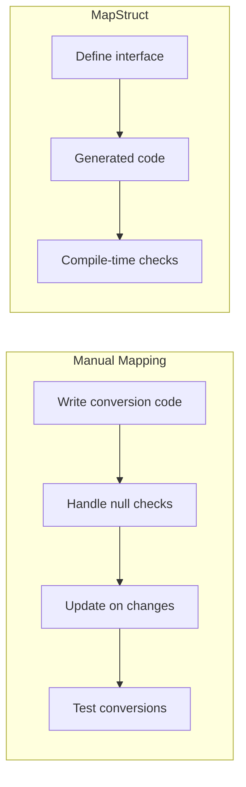
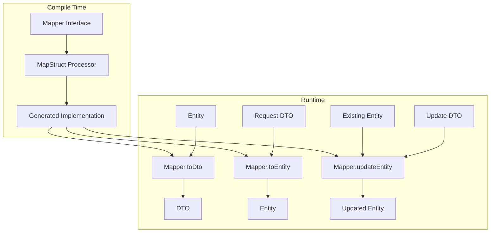

# How to Use MapStruct for Object Mapping

Author: [nawazdhandala](https://www.github.com/nawazdhandala)

Tags: Java, MapStruct, Object Mapping, Spring Boot, DTO, Performance

Description: A practical guide to using MapStruct for type-safe object mapping in Java. Learn how to map DTOs, handle nested objects, and integrate with Spring Boot applications.

---

> In modern Java applications, you constantly need to convert between different object representations - entities to DTOs, API responses to domain models, or request objects to service models. Writing this conversion code by hand is tedious, error-prone, and difficult to maintain. MapStruct solves this by generating type-safe mapping code at compile time.

MapStruct is a code generator that dramatically simplifies the implementation of mappings between Java bean types. Unlike reflection-based mappers, MapStruct generates plain method invocations at compile time, resulting in fast, type-safe, and easy-to-understand mapping code.

---

## Why MapStruct?

Before diving into code, let's understand why MapStruct stands out:



### Comparison with Other Mapping Libraries

| Feature | MapStruct | ModelMapper | Dozer | Manual |
|---------|-----------|-------------|-------|--------|
| Performance | Excellent | Good | Poor | Excellent |
| Type Safety | Compile-time | Runtime | Runtime | Compile-time |
| Boilerplate | Minimal | Minimal | Moderate | High |
| Learning Curve | Low | Low | Moderate | None |
| IDE Support | Excellent | Limited | Limited | Full |
| Debugging | Easy | Difficult | Difficult | Easy |

MapStruct generates plain Java code, so you get:
- **Zero runtime overhead** - No reflection, no proxy generation
- **Compile-time type safety** - Errors caught before runtime
- **Easy debugging** - Step through generated code
- **IDE support** - Full autocomplete and refactoring

---

## Getting Started

### Dependencies

Add MapStruct to your `pom.xml`:

```xml
<!-- pom.xml -->
<properties>
    <java.version>17</java.version>
    <mapstruct.version>1.5.5.Final</mapstruct.version>
    <lombok.version>1.18.30</lombok.version>
    <lombok-mapstruct-binding.version>0.2.0</lombok-mapstruct-binding.version>
</properties>

<dependencies>
    <!-- Spring Boot Starter -->
    <dependency>
        <groupId>org.springframework.boot</groupId>
        <artifactId>spring-boot-starter-web</artifactId>
    </dependency>
    
    <!-- MapStruct core library -->
    <dependency>
        <groupId>org.mapstruct</groupId>
        <artifactId>mapstruct</artifactId>
        <version>${mapstruct.version}</version>
    </dependency>
    
    <!-- Lombok for reducing boilerplate -->
    <dependency>
        <groupId>org.projectlombok</groupId>
        <artifactId>lombok</artifactId>
        <version>${lombok.version}</version>
        <optional>true</optional>
    </dependency>
    
    <!-- Test dependencies -->
    <dependency>
        <groupId>org.springframework.boot</groupId>
        <artifactId>spring-boot-starter-test</artifactId>
        <scope>test</scope>
    </dependency>
</dependencies>

<build>
    <plugins>
        <plugin>
            <groupId>org.apache.maven.plugins</groupId>
            <artifactId>maven-compiler-plugin</artifactId>
            <version>3.11.0</version>
            <configuration>
                <source>${java.version}</source>
                <target>${java.version}</target>
                <annotationProcessorPaths>
                    <!-- Lombok must come before MapStruct -->
                    <path>
                        <groupId>org.projectlombok</groupId>
                        <artifactId>lombok</artifactId>
                        <version>${lombok.version}</version>
                    </path>
                    <!-- Lombok-MapStruct binding -->
                    <path>
                        <groupId>org.projectlombok</groupId>
                        <artifactId>lombok-mapstruct-binding</artifactId>
                        <version>${lombok-mapstruct-binding.version}</version>
                    </path>
                    <!-- MapStruct processor -->
                    <path>
                        <groupId>org.mapstruct</groupId>
                        <artifactId>mapstruct-processor</artifactId>
                        <version>${mapstruct.version}</version>
                    </path>
                </annotationProcessorPaths>
                <compilerArgs>
                    <!-- Generate Spring components -->
                    <arg>-Amapstruct.defaultComponentModel=spring</arg>
                    <!-- Unmapped properties cause build error -->
                    <arg>-Amapstruct.unmappedTargetPolicy=ERROR</arg>
                </compilerArgs>
            </configuration>
        </plugin>
    </plugins>
</build>
```

For Gradle users:

```groovy
// build.gradle
plugins {
    id 'java'
    id 'org.springframework.boot' version '3.2.0'
    id 'io.spring.dependency-management' version '1.1.4'
}

ext {
    mapstructVersion = '1.5.5.Final'
    lombokVersion = '1.18.30'
}

dependencies {
    // Spring Boot
    implementation 'org.springframework.boot:spring-boot-starter-web'
    
    // MapStruct
    implementation "org.mapstruct:mapstruct:${mapstructVersion}"
    annotationProcessor "org.mapstruct:mapstruct-processor:${mapstructVersion}"
    
    // Lombok - must be before MapStruct in annotation processor order
    compileOnly "org.projectlombok:lombok:${lombokVersion}"
    annotationProcessor "org.projectlombok:lombok:${lombokVersion}"
    annotationProcessor "org.projectlombok:lombok-mapstruct-binding:0.2.0"
    
    // Test
    testImplementation 'org.springframework.boot:spring-boot-starter-test'
}

// Configure MapStruct compiler arguments
compileJava {
    options.compilerArgs += [
        '-Amapstruct.defaultComponentModel=spring',
        '-Amapstruct.unmappedTargetPolicy=ERROR'
    ]
}
```

---

## Basic Mapping

### Domain Models

Let's start with a typical entity and DTO structure:

```java
// entity/User.java
package com.example.mapping.entity;

import jakarta.persistence.*;
import lombok.*;
import java.time.LocalDateTime;
import java.util.Set;

@Entity
@Table(name = "users")
@Data
@Builder
@NoArgsConstructor
@AllArgsConstructor
public class User {
    
    @Id
    @GeneratedValue(strategy = GenerationType.IDENTITY)
    private Long id;
    
    @Column(nullable = false)
    private String firstName;
    
    @Column(nullable = false)
    private String lastName;
    
    @Column(nullable = false, unique = true)
    private String email;
    
    @Column(nullable = false)
    private String password;
    
    private String phoneNumber;
    
    @Enumerated(EnumType.STRING)
    private UserStatus status;
    
    @ManyToOne(fetch = FetchType.LAZY)
    @JoinColumn(name = "department_id")
    private Department department;
    
    @OneToMany(mappedBy = "user", cascade = CascadeType.ALL)
    private Set<Address> addresses;
    
    @Column(updatable = false)
    private LocalDateTime createdAt;
    
    private LocalDateTime updatedAt;
    
    @PrePersist
    protected void onCreate() {
        createdAt = LocalDateTime.now();
        updatedAt = LocalDateTime.now();
    }
    
    @PreUpdate
    protected void onUpdate() {
        updatedAt = LocalDateTime.now();
    }
    
    public enum UserStatus {
        ACTIVE, INACTIVE, PENDING, SUSPENDED
    }
}
```

```java
// entity/Department.java
package com.example.mapping.entity;

import jakarta.persistence.*;
import lombok.*;

@Entity
@Table(name = "departments")
@Data
@Builder
@NoArgsConstructor
@AllArgsConstructor
public class Department {
    
    @Id
    @GeneratedValue(strategy = GenerationType.IDENTITY)
    private Long id;
    
    @Column(nullable = false)
    private String name;
    
    private String code;
    
    private String description;
}
```

```java
// entity/Address.java
package com.example.mapping.entity;

import jakarta.persistence.*;
import lombok.*;

@Entity
@Table(name = "addresses")
@Data
@Builder
@NoArgsConstructor
@AllArgsConstructor
public class Address {
    
    @Id
    @GeneratedValue(strategy = GenerationType.IDENTITY)
    private Long id;
    
    private String street;
    private String city;
    private String state;
    private String zipCode;
    private String country;
    
    @Enumerated(EnumType.STRING)
    private AddressType type;
    
    @ManyToOne(fetch = FetchType.LAZY)
    @JoinColumn(name = "user_id")
    private User user;
    
    public enum AddressType {
        HOME, WORK, BILLING, SHIPPING
    }
}
```

### DTOs

Create DTOs that expose only what clients need:

```java
// dto/UserDto.java
package com.example.mapping.dto;

import lombok.*;
import java.time.LocalDateTime;
import java.util.List;

@Data
@Builder
@NoArgsConstructor
@AllArgsConstructor
public class UserDto {
    
    private Long id;
    
    // Combined name for display
    private String fullName;
    
    private String email;
    
    private String phoneNumber;
    
    private String status;
    
    // Flattened department info
    private String departmentName;
    private String departmentCode;
    
    // Nested addresses
    private List<AddressDto> addresses;
    
    private LocalDateTime createdAt;
}
```

```java
// dto/AddressDto.java
package com.example.mapping.dto;

import lombok.*;

@Data
@Builder
@NoArgsConstructor
@AllArgsConstructor
public class AddressDto {
    
    private Long id;
    private String street;
    private String city;
    private String state;
    private String zipCode;
    private String country;
    private String type;
    
    // Computed full address for display
    private String fullAddress;
}
```

```java
// dto/UserCreateRequest.java
package com.example.mapping.dto;

import jakarta.validation.constraints.*;
import lombok.*;

@Data
@Builder
@NoArgsConstructor
@AllArgsConstructor
public class UserCreateRequest {
    
    @NotBlank(message = "First name is required")
    private String firstName;
    
    @NotBlank(message = "Last name is required")
    private String lastName;
    
    @NotBlank(message = "Email is required")
    @Email(message = "Invalid email format")
    private String email;
    
    @NotBlank(message = "Password is required")
    @Size(min = 8, message = "Password must be at least 8 characters")
    private String password;
    
    private String phoneNumber;
    
    private Long departmentId;
}
```

```java
// dto/UserUpdateRequest.java
package com.example.mapping.dto;

import jakarta.validation.constraints.*;
import lombok.*;

@Data
@Builder
@NoArgsConstructor
@AllArgsConstructor
public class UserUpdateRequest {
    
    private String firstName;
    private String lastName;
    
    @Email(message = "Invalid email format")
    private String email;
    
    private String phoneNumber;
    private String status;
    private Long departmentId;
}
```

---

## Creating Mappers

### Basic Mapper Interface

Define a mapper interface with the `@Mapper` annotation:

```java
// mapper/UserMapper.java
package com.example.mapping.mapper;

import com.example.mapping.dto.*;
import com.example.mapping.entity.*;
import org.mapstruct.*;

import java.util.List;

// componentModel = "spring" makes this a Spring bean
@Mapper(
    componentModel = "spring",
    // Include nested mappers
    uses = {AddressMapper.class},
    // Ignore unmapped properties by default (can override per method)
    unmappedTargetPolicy = ReportingPolicy.IGNORE,
    // How to handle null values
    nullValuePropertyMappingStrategy = NullValuePropertyMappingStrategy.IGNORE
)
public interface UserMapper {
    
    // Map entity to DTO with custom field mappings
    @Mapping(target = "fullName", expression = "java(user.getFirstName() + \" \" + user.getLastName())")
    @Mapping(target = "departmentName", source = "department.name")
    @Mapping(target = "departmentCode", source = "department.code")
    @Mapping(target = "status", source = "status")
    UserDto toDto(User user);
    
    // Map list of entities
    List<UserDto> toDtoList(List<User> users);
    
    // Map create request to entity
    @Mapping(target = "id", ignore = true)
    @Mapping(target = "status", constant = "PENDING")
    @Mapping(target = "department", ignore = true)
    @Mapping(target = "addresses", ignore = true)
    @Mapping(target = "createdAt", ignore = true)
    @Mapping(target = "updatedAt", ignore = true)
    User toEntity(UserCreateRequest request);
    
    // Update existing entity from update request
    @Mapping(target = "id", ignore = true)
    @Mapping(target = "password", ignore = true)
    @Mapping(target = "department", ignore = true)
    @Mapping(target = "addresses", ignore = true)
    @Mapping(target = "createdAt", ignore = true)
    @Mapping(target = "updatedAt", ignore = true)
    @BeanMapping(nullValuePropertyMappingStrategy = NullValuePropertyMappingStrategy.IGNORE)
    void updateEntityFromDto(UserUpdateRequest request, @MappingTarget User user);
    
    // Custom mapping method for status enum
    default String mapStatus(User.UserStatus status) {
        return status != null ? status.name() : null;
    }
    
    // Custom mapping for status string to enum
    default User.UserStatus mapStatusString(String status) {
        return status != null ? User.UserStatus.valueOf(status) : null;
    }
}
```

```java
// mapper/AddressMapper.java
package com.example.mapping.mapper;

import com.example.mapping.dto.AddressDto;
import com.example.mapping.entity.Address;
import org.mapstruct.*;

import java.util.List;
import java.util.Set;

@Mapper(componentModel = "spring")
public interface AddressMapper {
    
    // Map entity to DTO with computed field
    @Mapping(target = "type", source = "type")
    @Mapping(target = "fullAddress", expression = "java(buildFullAddress(address))")
    AddressDto toDto(Address address);
    
    // Map collections
    List<AddressDto> toDtoList(Set<Address> addresses);
    
    // Map DTO to entity
    @Mapping(target = "id", ignore = true)
    @Mapping(target = "user", ignore = true)
    Address toEntity(AddressDto dto);
    
    // Custom method to build full address string
    default String buildFullAddress(Address address) {
        if (address == null) {
            return null;
        }
        StringBuilder sb = new StringBuilder();
        if (address.getStreet() != null) sb.append(address.getStreet());
        if (address.getCity() != null) sb.append(", ").append(address.getCity());
        if (address.getState() != null) sb.append(", ").append(address.getState());
        if (address.getZipCode() != null) sb.append(" ").append(address.getZipCode());
        if (address.getCountry() != null) sb.append(", ").append(address.getCountry());
        return sb.toString().trim();
    }
    
    // Map address type enum to string
    default String mapAddressType(Address.AddressType type) {
        return type != null ? type.name() : null;
    }
    
    // Map string to address type enum
    default Address.AddressType mapAddressTypeString(String type) {
        return type != null ? Address.AddressType.valueOf(type) : null;
    }
}
```

---

## Mapping Flow Visualization

Here's how MapStruct processes transformations:



---

## Advanced Mapping Techniques

### Nested Object Mapping

Handle complex nested structures:

```java
// dto/OrderDto.java
package com.example.mapping.dto;

import lombok.*;
import java.math.BigDecimal;
import java.time.LocalDateTime;
import java.util.List;

@Data
@Builder
@NoArgsConstructor
@AllArgsConstructor
public class OrderDto {
    private Long id;
    private String orderNumber;
    private String customerName;
    private String customerEmail;
    private String shippingAddress;
    private List<OrderItemDto> items;
    private BigDecimal subtotal;
    private BigDecimal tax;
    private BigDecimal total;
    private String status;
    private LocalDateTime orderDate;
}

@Data
@Builder
@NoArgsConstructor
@AllArgsConstructor
class OrderItemDto {
    private Long productId;
    private String productName;
    private String productSku;
    private int quantity;
    private BigDecimal unitPrice;
    private BigDecimal lineTotal;
}
```

```java
// entity/Order.java
package com.example.mapping.entity;

import jakarta.persistence.*;
import lombok.*;
import java.math.BigDecimal;
import java.time.LocalDateTime;
import java.util.List;

@Entity
@Table(name = "orders")
@Data
@Builder
@NoArgsConstructor
@AllArgsConstructor
public class Order {
    
    @Id
    @GeneratedValue(strategy = GenerationType.IDENTITY)
    private Long id;
    
    private String orderNumber;
    
    @ManyToOne(fetch = FetchType.LAZY)
    @JoinColumn(name = "customer_id")
    private Customer customer;
    
    @ManyToOne(fetch = FetchType.LAZY)
    @JoinColumn(name = "shipping_address_id")
    private Address shippingAddress;
    
    @OneToMany(mappedBy = "order", cascade = CascadeType.ALL, orphanRemoval = true)
    private List<OrderItem> items;
    
    private BigDecimal subtotal;
    private BigDecimal tax;
    private BigDecimal total;
    
    @Enumerated(EnumType.STRING)
    private OrderStatus status;
    
    private LocalDateTime orderDate;
    
    public enum OrderStatus {
        PENDING, CONFIRMED, PROCESSING, SHIPPED, DELIVERED, CANCELLED
    }
}
```

```java
// entity/OrderItem.java
package com.example.mapping.entity;

import jakarta.persistence.*;
import lombok.*;
import java.math.BigDecimal;

@Entity
@Table(name = "order_items")
@Data
@Builder
@NoArgsConstructor
@AllArgsConstructor
public class OrderItem {
    
    @Id
    @GeneratedValue(strategy = GenerationType.IDENTITY)
    private Long id;
    
    @ManyToOne(fetch = FetchType.LAZY)
    @JoinColumn(name = "order_id")
    private Order order;
    
    @ManyToOne(fetch = FetchType.LAZY)
    @JoinColumn(name = "product_id")
    private Product product;
    
    private int quantity;
    private BigDecimal unitPrice;
    private BigDecimal lineTotal;
}
```

```java
// mapper/OrderMapper.java
package com.example.mapping.mapper;

import com.example.mapping.dto.*;
import com.example.mapping.entity.*;
import org.mapstruct.*;

import java.util.List;

@Mapper(
    componentModel = "spring",
    uses = {OrderItemMapper.class}
)
public interface OrderMapper {
    
    // Complex nested mapping with multiple levels
    @Mapping(target = "customerName", expression = "java(order.getCustomer().getFirstName() + \" \" + order.getCustomer().getLastName())")
    @Mapping(target = "customerEmail", source = "customer.email")
    @Mapping(target = "shippingAddress", source = "shippingAddress", qualifiedByName = "addressToString")
    @Mapping(target = "status", source = "status")
    OrderDto toDto(Order order);
    
    List<OrderDto> toDtoList(List<Order> orders);
    
    // Named qualifier for custom mapping
    @Named("addressToString")
    default String addressToString(Address address) {
        if (address == null) return null;
        return String.format("%s, %s, %s %s", 
            address.getStreet(),
            address.getCity(),
            address.getState(),
            address.getZipCode()
        );
    }
    
    default String mapOrderStatus(Order.OrderStatus status) {
        return status != null ? status.name() : null;
    }
}
```

```java
// mapper/OrderItemMapper.java
package com.example.mapping.mapper;

import com.example.mapping.dto.OrderItemDto;
import com.example.mapping.entity.OrderItem;
import org.mapstruct.*;

import java.util.List;

@Mapper(componentModel = "spring")
public interface OrderItemMapper {
    
    // Map nested product details
    @Mapping(target = "productId", source = "product.id")
    @Mapping(target = "productName", source = "product.name")
    @Mapping(target = "productSku", source = "product.sku")
    OrderItemDto toDto(OrderItem item);
    
    List<OrderItemDto> toDtoList(List<OrderItem> items);
}
```

---

### Multiple Source Objects

Map from multiple source objects into one target:

```java
// mapper/InvoiceMapper.java
package com.example.mapping.mapper;

import com.example.mapping.dto.InvoiceDto;
import com.example.mapping.entity.*;
import org.mapstruct.*;

@Mapper(componentModel = "spring")
public interface InvoiceMapper {
    
    // Combine data from multiple sources
    @Mapping(target = "invoiceNumber", source = "order.orderNumber")
    @Mapping(target = "customerName", source = "customer.firstName")
    @Mapping(target = "customerEmail", source = "customer.email")
    @Mapping(target = "billingAddress", source = "billingAddress.street")
    @Mapping(target = "orderTotal", source = "order.total")
    @Mapping(target = "orderDate", source = "order.orderDate")
    InvoiceDto toInvoiceDto(Order order, Customer customer, Address billingAddress);
}
```

### Mapping with Decorators

Add custom logic to generated mappers:

```java
// mapper/UserMapperDecorator.java
package com.example.mapping.mapper;

import com.example.mapping.dto.UserDto;
import com.example.mapping.entity.User;
import org.springframework.beans.factory.annotation.Autowired;
import org.springframework.beans.factory.annotation.Qualifier;

public abstract class UserMapperDecorator implements UserMapper {
    
    @Autowired
    @Qualifier("delegate")
    private UserMapper delegate;
    
    @Override
    public UserDto toDto(User user) {
        // Call the generated mapper
        UserDto dto = delegate.toDto(user);
        
        // Add custom post-processing logic
        if (dto != null) {
            // Mask sensitive data
            if (dto.getPhoneNumber() != null) {
                dto.setPhoneNumber(maskPhoneNumber(dto.getPhoneNumber()));
            }
            
            // Add computed fields
            // dto.setProfileUrl(generateProfileUrl(user.getId()));
        }
        
        return dto;
    }
    
    private String maskPhoneNumber(String phone) {
        if (phone.length() <= 4) return phone;
        return "***-***-" + phone.substring(phone.length() - 4);
    }
}
```

Update the mapper to use the decorator:

```java
// mapper/UserMapper.java (updated)
@Mapper(componentModel = "spring")
@DecoratedWith(UserMapperDecorator.class)
public interface UserMapper {
    // ... existing mappings
}
```

---

### Mapping Collections and Maps

```java
// mapper/CollectionMapper.java
package com.example.mapping.mapper;

import com.example.mapping.dto.*;
import com.example.mapping.entity.*;
import org.mapstruct.*;

import java.util.*;

@Mapper(componentModel = "spring")
public interface CollectionMapper {
    
    // Set to List conversion
    List<AddressDto> setToList(Set<Address> addresses);
    
    // List to Set conversion
    Set<Address> listToSet(List<AddressDto> dtos);
    
    // Map keys and values
    @MapMapping(keyTargetType = String.class, valueTargetType = UserDto.class)
    Map<String, UserDto> mapUsers(Map<Long, User> users);
    
    // Convert Long key to String
    default String longToString(Long value) {
        return value != null ? value.toString() : null;
    }
    
    // Stream to List
    default List<UserDto> streamToList(java.util.stream.Stream<User> users) {
        return users.map(this::toDto).toList();
    }
    
    UserDto toDto(User user);
}
```

---

### Expression and Constant Mapping

```java
// mapper/ExpressionMapper.java
package com.example.mapping.mapper;

import com.example.mapping.dto.*;
import com.example.mapping.entity.*;
import org.mapstruct.*;

import java.time.LocalDateTime;
import java.time.format.DateTimeFormatter;

@Mapper(
    componentModel = "spring",
    imports = {LocalDateTime.class, DateTimeFormatter.class, java.util.UUID.class}
)
public interface ExpressionMapper {
    
    // Use Java expression for computed fields
    @Mapping(target = "fullName", expression = "java(entity.getFirstName() + \" \" + entity.getLastName())")
    @Mapping(target = "displayId", expression = "java(\"USR-\" + entity.getId())")
    @Mapping(target = "formattedDate", expression = "java(formatDate(entity.getCreatedAt()))")
    
    // Constant values
    @Mapping(target = "apiVersion", constant = "v2")
    @Mapping(target = "source", constant = "INTERNAL")
    
    // Default values when source is null
    @Mapping(target = "status", defaultValue = "UNKNOWN")
    @Mapping(target = "priority", defaultValue = "NORMAL")
    
    // Generate UUID
    @Mapping(target = "trackingId", expression = "java(UUID.randomUUID().toString())")
    
    UserResponseDto toResponse(User entity);
    
    // Helper method for date formatting
    default String formatDate(LocalDateTime dateTime) {
        if (dateTime == null) return null;
        return dateTime.format(DateTimeFormatter.ofPattern("yyyy-MM-dd HH:mm:ss"));
    }
}
```

---

### Conditional Mapping

```java
// mapper/ConditionalMapper.java
package com.example.mapping.mapper;

import com.example.mapping.dto.*;
import com.example.mapping.entity.*;
import org.mapstruct.*;

@Mapper(componentModel = "spring")
public interface ConditionalMapper {
    
    // Conditional mapping with @Condition
    @Mapping(target = "email", conditionExpression = "java(isEmailVerified(user))")
    @Mapping(target = "phoneNumber", conditionExpression = "java(isPhoneVerified(user))")
    UserPublicDto toPublicDto(User user);
    
    // Check if email should be included
    default boolean isEmailVerified(User user) {
        // Only include email if user has verified it
        return user != null && user.getStatus() == User.UserStatus.ACTIVE;
    }
    
    // Check if phone should be included
    default boolean isPhoneVerified(User user) {
        return user != null && user.getPhoneNumber() != null;
    }
    
    // Null value check mapping
    @Condition
    default boolean isNotEmpty(String value) {
        return value != null && !value.trim().isEmpty();
    }
}
```

---

## Using Mappers in Services

### Service Layer Integration

```java
// service/UserService.java
package com.example.mapping.service;

import com.example.mapping.dto.*;
import com.example.mapping.entity.*;
import com.example.mapping.mapper.UserMapper;
import com.example.mapping.repository.UserRepository;
import com.example.mapping.repository.DepartmentRepository;
import lombok.RequiredArgsConstructor;
import lombok.extern.slf4j.Slf4j;
import org.springframework.stereotype.Service;
import org.springframework.transaction.annotation.Transactional;

import java.util.List;

@Slf4j
@Service
@RequiredArgsConstructor
public class UserService {
    
    private final UserRepository userRepository;
    private final DepartmentRepository departmentRepository;
    private final UserMapper userMapper;
    
    // Get user by ID and map to DTO
    @Transactional(readOnly = true)
    public UserDto getUserById(Long id) {
        log.info("Fetching user with id: {}", id);
        
        User user = userRepository.findById(id)
            .orElseThrow(() -> new ResourceNotFoundException("User not found: " + id));
        
        // MapStruct handles the conversion
        return userMapper.toDto(user);
    }
    
    // Get all users
    @Transactional(readOnly = true)
    public List<UserDto> getAllUsers() {
        List<User> users = userRepository.findAll();
        return userMapper.toDtoList(users);
    }
    
    // Create new user from request
    @Transactional
    public UserDto createUser(UserCreateRequest request) {
        log.info("Creating user with email: {}", request.getEmail());
        
        // Check for existing email
        if (userRepository.existsByEmail(request.getEmail())) {
            throw new DuplicateResourceException("Email already exists: " + request.getEmail());
        }
        
        // Map request to entity
        User user = userMapper.toEntity(request);
        
        // Set department if provided
        if (request.getDepartmentId() != null) {
            Department department = departmentRepository.findById(request.getDepartmentId())
                .orElseThrow(() -> new ResourceNotFoundException(
                    "Department not found: " + request.getDepartmentId()));
            user.setDepartment(department);
        }
        
        // Hash password before saving
        user.setPassword(hashPassword(request.getPassword()));
        
        // Save and return DTO
        User savedUser = userRepository.save(user);
        log.info("User created with id: {}", savedUser.getId());
        
        return userMapper.toDto(savedUser);
    }
    
    // Update existing user
    @Transactional
    public UserDto updateUser(Long id, UserUpdateRequest request) {
        log.info("Updating user with id: {}", id);
        
        User user = userRepository.findById(id)
            .orElseThrow(() -> new ResourceNotFoundException("User not found: " + id));
        
        // Update only non-null fields
        userMapper.updateEntityFromDto(request, user);
        
        // Handle department update separately
        if (request.getDepartmentId() != null) {
            Department department = departmentRepository.findById(request.getDepartmentId())
                .orElseThrow(() -> new ResourceNotFoundException(
                    "Department not found: " + request.getDepartmentId()));
            user.setDepartment(department);
        }
        
        // Handle status update
        if (request.getStatus() != null) {
            user.setStatus(User.UserStatus.valueOf(request.getStatus()));
        }
        
        User updatedUser = userRepository.save(user);
        log.info("User updated: {}", updatedUser.getId());
        
        return userMapper.toDto(updatedUser);
    }
    
    // Delete user
    @Transactional
    public void deleteUser(Long id) {
        log.info("Deleting user with id: {}", id);
        
        if (!userRepository.existsById(id)) {
            throw new ResourceNotFoundException("User not found: " + id);
        }
        
        userRepository.deleteById(id);
        log.info("User deleted: {}", id);
    }
    
    private String hashPassword(String password) {
        // Use BCrypt or similar in production
        return password; // Placeholder
    }
}
```

### REST Controller

```java
// controller/UserController.java
package com.example.mapping.controller;

import com.example.mapping.dto.*;
import com.example.mapping.service.UserService;
import jakarta.validation.Valid;
import lombok.RequiredArgsConstructor;
import org.springframework.http.HttpStatus;
import org.springframework.http.ResponseEntity;
import org.springframework.web.bind.annotation.*;

import java.util.List;

@RestController
@RequestMapping("/api/v1/users")
@RequiredArgsConstructor
public class UserController {
    
    private final UserService userService;
    
    @GetMapping
    public ResponseEntity<List<UserDto>> getAllUsers() {
        return ResponseEntity.ok(userService.getAllUsers());
    }
    
    @GetMapping("/{id}")
    public ResponseEntity<UserDto> getUserById(@PathVariable Long id) {
        return ResponseEntity.ok(userService.getUserById(id));
    }
    
    @PostMapping
    public ResponseEntity<UserDto> createUser(@Valid @RequestBody UserCreateRequest request) {
        UserDto created = userService.createUser(request);
        return ResponseEntity.status(HttpStatus.CREATED).body(created);
    }
    
    @PutMapping("/{id}")
    public ResponseEntity<UserDto> updateUser(
            @PathVariable Long id,
            @Valid @RequestBody UserUpdateRequest request) {
        return ResponseEntity.ok(userService.updateUser(id, request));
    }
    
    @DeleteMapping("/{id}")
    public ResponseEntity<Void> deleteUser(@PathVariable Long id) {
        userService.deleteUser(id);
        return ResponseEntity.noContent().build();
    }
}
```

---

## Testing Mappers

### Unit Tests

```java
// test/mapper/UserMapperTest.java
package com.example.mapping.mapper;

import com.example.mapping.dto.*;
import com.example.mapping.entity.*;
import org.junit.jupiter.api.Test;
import org.mapstruct.factory.Mappers;

import java.time.LocalDateTime;
import java.util.List;
import java.util.Set;

import static org.assertj.core.api.Assertions.assertThat;

class UserMapperTest {
    
    // Get mapper instance without Spring context
    private final UserMapper mapper = Mappers.getMapper(UserMapper.class);
    private final AddressMapper addressMapper = Mappers.getMapper(AddressMapper.class);
    
    @Test
    void shouldMapUserToDto() {
        // Given
        Department department = Department.builder()
            .id(1L)
            .name("Engineering")
            .code("ENG")
            .build();
        
        User user = User.builder()
            .id(1L)
            .firstName("John")
            .lastName("Doe")
            .email("john.doe@example.com")
            .phoneNumber("555-123-4567")
            .status(User.UserStatus.ACTIVE)
            .department(department)
            .createdAt(LocalDateTime.now())
            .build();
        
        // When
        UserDto dto = mapper.toDto(user);
        
        // Then
        assertThat(dto).isNotNull();
        assertThat(dto.getId()).isEqualTo(1L);
        assertThat(dto.getFullName()).isEqualTo("John Doe");
        assertThat(dto.getEmail()).isEqualTo("john.doe@example.com");
        assertThat(dto.getDepartmentName()).isEqualTo("Engineering");
        assertThat(dto.getDepartmentCode()).isEqualTo("ENG");
        assertThat(dto.getStatus()).isEqualTo("ACTIVE");
    }
    
    @Test
    void shouldMapCreateRequestToEntity() {
        // Given
        UserCreateRequest request = UserCreateRequest.builder()
            .firstName("Jane")
            .lastName("Smith")
            .email("jane.smith@example.com")
            .password("securePassword123")
            .phoneNumber("555-987-6543")
            .build();
        
        // When
        User entity = mapper.toEntity(request);
        
        // Then
        assertThat(entity).isNotNull();
        assertThat(entity.getId()).isNull(); // ID should be ignored
        assertThat(entity.getFirstName()).isEqualTo("Jane");
        assertThat(entity.getLastName()).isEqualTo("Smith");
        assertThat(entity.getEmail()).isEqualTo("jane.smith@example.com");
        assertThat(entity.getStatus()).isEqualTo(User.UserStatus.PENDING);
    }
    
    @Test
    void shouldUpdateEntityFromDto() {
        // Given
        User existingUser = User.builder()
            .id(1L)
            .firstName("John")
            .lastName("Doe")
            .email("john.doe@example.com")
            .status(User.UserStatus.PENDING)
            .build();
        
        UserUpdateRequest updateRequest = UserUpdateRequest.builder()
            .firstName("Jonathan")
            .email("jonathan.doe@example.com")
            .build();
        
        // When
        mapper.updateEntityFromDto(updateRequest, existingUser);
        
        // Then
        assertThat(existingUser.getId()).isEqualTo(1L); // ID preserved
        assertThat(existingUser.getFirstName()).isEqualTo("Jonathan"); // Updated
        assertThat(existingUser.getLastName()).isEqualTo("Doe"); // Unchanged
        assertThat(existingUser.getEmail()).isEqualTo("jonathan.doe@example.com"); // Updated
    }
    
    @Test
    void shouldHandleNullSource() {
        // When
        UserDto dto = mapper.toDto(null);
        
        // Then
        assertThat(dto).isNull();
    }
    
    @Test
    void shouldMapUserList() {
        // Given
        List<User> users = List.of(
            User.builder().id(1L).firstName("John").lastName("Doe").build(),
            User.builder().id(2L).firstName("Jane").lastName("Smith").build()
        );
        
        // When
        List<UserDto> dtos = mapper.toDtoList(users);
        
        // Then
        assertThat(dtos).hasSize(2);
        assertThat(dtos.get(0).getFullName()).isEqualTo("John Doe");
        assertThat(dtos.get(1).getFullName()).isEqualTo("Jane Smith");
    }
    
    @Test
    void shouldMapAddressWithFullAddress() {
        // Given
        Address address = Address.builder()
            .id(1L)
            .street("123 Main St")
            .city("Springfield")
            .state("IL")
            .zipCode("62701")
            .country("USA")
            .type(Address.AddressType.HOME)
            .build();
        
        // When
        AddressDto dto = addressMapper.toDto(address);
        
        // Then
        assertThat(dto).isNotNull();
        assertThat(dto.getFullAddress()).isEqualTo("123 Main St, Springfield, IL 62701, USA");
        assertThat(dto.getType()).isEqualTo("HOME");
    }
}
```

### Integration Test with Spring Context

```java
// test/mapper/UserMapperIntegrationTest.java
package com.example.mapping.mapper;

import com.example.mapping.dto.*;
import com.example.mapping.entity.*;
import org.junit.jupiter.api.Test;
import org.springframework.beans.factory.annotation.Autowired;
import org.springframework.boot.test.context.SpringBootTest;

import java.util.Set;

import static org.assertj.core.api.Assertions.assertThat;

@SpringBootTest
class UserMapperIntegrationTest {
    
    @Autowired
    private UserMapper userMapper;
    
    @Test
    void shouldInjectMapperAsSpringBean() {
        assertThat(userMapper).isNotNull();
    }
    
    @Test
    void shouldMapUserWithAddresses() {
        // Given
        Address homeAddress = Address.builder()
            .id(1L)
            .street("123 Home St")
            .city("Hometown")
            .state("HT")
            .zipCode("12345")
            .type(Address.AddressType.HOME)
            .build();
        
        Address workAddress = Address.builder()
            .id(2L)
            .street("456 Work Ave")
            .city("Worktown")
            .state("WT")
            .zipCode("67890")
            .type(Address.AddressType.WORK)
            .build();
        
        User user = User.builder()
            .id(1L)
            .firstName("Test")
            .lastName("User")
            .email("test@example.com")
            .addresses(Set.of(homeAddress, workAddress))
            .status(User.UserStatus.ACTIVE)
            .build();
        
        // When
        UserDto dto = userMapper.toDto(user);
        
        // Then
        assertThat(dto).isNotNull();
        assertThat(dto.getAddresses()).hasSize(2);
    }
}
```

---

## Handling Special Cases

### Bi-Directional Relationships

```java
// mapper/BidirectionalMapper.java
package com.example.mapping.mapper;

import com.example.mapping.dto.*;
import com.example.mapping.entity.*;
import org.mapstruct.*;

@Mapper(componentModel = "spring")
public interface BidirectionalMapper {
    
    // Avoid infinite loops in bidirectional relationships
    @Mapping(target = "user", ignore = true) // Break the cycle
    AddressDto addressToDto(Address address);
    
    // Or use @Context for more complex scenarios
    @Mapping(target = "addresses", qualifiedByName = "mapAddressesWithoutUser")
    UserDto userToDto(User user, @Context CycleAvoidingMappingContext context);
    
    @Named("mapAddressesWithoutUser")
    default java.util.List<AddressDto> mapAddressesWithoutUser(
            java.util.Set<Address> addresses, 
            @Context CycleAvoidingMappingContext context) {
        if (addresses == null) return null;
        return addresses.stream()
            .map(this::addressToDto)
            .toList();
    }
}
```

```java
// mapper/CycleAvoidingMappingContext.java
package com.example.mapping.mapper;

import org.mapstruct.BeforeMapping;
import org.mapstruct.MappingTarget;
import org.mapstruct.TargetType;

import java.util.IdentityHashMap;
import java.util.Map;

public class CycleAvoidingMappingContext {
    
    private final Map<Object, Object> knownInstances = new IdentityHashMap<>();
    
    @BeforeMapping
    public <T> T getMappedInstance(Object source, @TargetType Class<T> targetType) {
        return targetType.cast(knownInstances.get(source));
    }
    
    @BeforeMapping
    public void storeMappedInstance(Object source, @MappingTarget Object target) {
        knownInstances.put(source, target);
    }
}
```

### Type Conversions

```java
// mapper/TypeConversionMapper.java
package com.example.mapping.mapper;

import org.mapstruct.*;
import java.time.*;
import java.time.format.DateTimeFormatter;
import java.math.BigDecimal;

@Mapper(componentModel = "spring")
public interface TypeConversionMapper {
    
    // String to LocalDate
    default LocalDate stringToLocalDate(String date) {
        return date != null ? LocalDate.parse(date) : null;
    }
    
    // LocalDate to String
    default String localDateToString(LocalDate date) {
        return date != null ? date.toString() : null;
    }
    
    // LocalDateTime to String with format
    default String localDateTimeToString(LocalDateTime dateTime) {
        return dateTime != null 
            ? dateTime.format(DateTimeFormatter.ISO_LOCAL_DATE_TIME) 
            : null;
    }
    
    // String to LocalDateTime
    default LocalDateTime stringToLocalDateTime(String dateTime) {
        return dateTime != null 
            ? LocalDateTime.parse(dateTime, DateTimeFormatter.ISO_LOCAL_DATE_TIME) 
            : null;
    }
    
    // BigDecimal to String
    default String bigDecimalToString(BigDecimal value) {
        return value != null ? value.toPlainString() : null;
    }
    
    // String to BigDecimal
    default BigDecimal stringToBigDecimal(String value) {
        return value != null ? new BigDecimal(value) : null;
    }
    
    // Instant to Long (epoch millis)
    default Long instantToLong(Instant instant) {
        return instant != null ? instant.toEpochMilli() : null;
    }
    
    // Long to Instant
    default Instant longToInstant(Long epochMilli) {
        return epochMilli != null ? Instant.ofEpochMilli(epochMilli) : null;
    }
}
```

### Enum Mapping

```java
// mapper/EnumMapper.java
package com.example.mapping.mapper;

import com.example.mapping.entity.User;
import org.mapstruct.*;

@Mapper(componentModel = "spring")
public interface EnumMapper {
    
    // Map enum by name (default behavior)
    String userStatusToString(User.UserStatus status);
    User.UserStatus stringToUserStatus(String status);
    
    // Custom enum mapping with @ValueMapping
    @ValueMappings({
        @ValueMapping(source = "ACTIVE", target = "ENABLED"),
        @ValueMapping(source = "INACTIVE", target = "DISABLED"),
        @ValueMapping(source = "PENDING", target = "PENDING_REVIEW"),
        @ValueMapping(source = "SUSPENDED", target = "BLOCKED"),
        @ValueMapping(source = MappingConstants.ANY_REMAINING, target = "UNKNOWN")
    })
    String mapStatusToExternal(User.UserStatus status);
    
    // Reverse mapping
    @InheritInverseConfiguration
    User.UserStatus mapExternalToStatus(String external);
}
```

---

## Configuration Options

### Global Configuration

Create a configuration class to share settings across mappers:

```java
// mapper/MapperConfig.java
package com.example.mapping.mapper;

import org.mapstruct.*;

// This configuration applies to all mappers that reference it
@MapperConfig(
    componentModel = "spring",
    unmappedTargetPolicy = ReportingPolicy.ERROR,
    unmappedSourcePolicy = ReportingPolicy.WARN,
    nullValueMappingStrategy = NullValueMappingStrategy.RETURN_NULL,
    nullValuePropertyMappingStrategy = NullValuePropertyMappingStrategy.IGNORE,
    nullValueCheckStrategy = NullValueCheckStrategy.ALWAYS,
    collectionMappingStrategy = CollectionMappingStrategy.ADDER_PREFERRED,
    builder = @Builder(disableBuilder = false)
)
public interface MapperConfig {
}
```

Apply configuration to mappers:

```java
// mapper/ConfiguredMapper.java
@Mapper(config = MapperConfig.class)
public interface ConfiguredMapper {
    // Uses all settings from MapperConfig
}
```

### Compiler Arguments

Common compiler arguments for build configuration:

```xml
<!-- In maven-compiler-plugin -->
<compilerArgs>
    <!-- Spring component model for dependency injection -->
    <arg>-Amapstruct.defaultComponentModel=spring</arg>
    
    <!-- Fail build on unmapped target properties -->
    <arg>-Amapstruct.unmappedTargetPolicy=ERROR</arg>
    
    <!-- Suppress warnings for unmapped source properties -->
    <arg>-Amapstruct.unmappedSourcePolicy=IGNORE</arg>
    
    <!-- Generate verbose output -->
    <arg>-Amapstruct.verbose=true</arg>
    
    <!-- Suppress timestamp in generated code -->
    <arg>-Amapstruct.suppressGeneratorTimestamp=true</arg>
    
    <!-- Suppress version comment in generated code -->
    <arg>-Amapstruct.suppressGeneratorVersionInfoComment=true</arg>
</compilerArgs>
```

---

## Performance Optimization

### Lazy Loading Considerations

When mapping JPA entities with lazy-loaded relationships:

```java
// mapper/LazyLoadingMapper.java
package com.example.mapping.mapper;

import com.example.mapping.dto.UserSummaryDto;
import com.example.mapping.entity.User;
import org.mapstruct.*;
import org.hibernate.Hibernate;

@Mapper(componentModel = "spring")
public interface LazyLoadingMapper {
    
    // Safe mapping that checks if lazy collections are initialized
    @Mapping(target = "addressCount", expression = "java(getAddressCount(user))")
    @Mapping(target = "departmentName", expression = "java(getDepartmentName(user))")
    UserSummaryDto toSummary(User user);
    
    // Safely get count without triggering lazy load
    default int getAddressCount(User user) {
        if (user.getAddresses() == null || !Hibernate.isInitialized(user.getAddresses())) {
            return 0;
        }
        return user.getAddresses().size();
    }
    
    // Safely get department name
    default String getDepartmentName(User user) {
        if (user.getDepartment() == null || !Hibernate.isInitialized(user.getDepartment())) {
            return null;
        }
        return user.getDepartment().getName();
    }
}
```

### Bulk Mapping

For large collections, consider streaming:

```java
// service/BulkMappingService.java
package com.example.mapping.service;

import com.example.mapping.dto.UserDto;
import com.example.mapping.entity.User;
import com.example.mapping.mapper.UserMapper;
import lombok.RequiredArgsConstructor;
import org.springframework.stereotype.Service;
import org.springframework.transaction.annotation.Transactional;

import java.util.List;
import java.util.stream.Stream;

@Service
@RequiredArgsConstructor
public class BulkMappingService {
    
    private final UserMapper userMapper;
    
    // Efficient bulk mapping with streams
    @Transactional(readOnly = true)
    public List<UserDto> mapLargeDataset(Stream<User> users) {
        return users
            .map(userMapper::toDto)
            .toList();
    }
    
    // Parallel mapping for CPU-bound transformations
    @Transactional(readOnly = true)
    public List<UserDto> mapInParallel(List<User> users) {
        return users.parallelStream()
            .map(userMapper::toDto)
            .toList();
    }
}
```

---

## Common Patterns and Best Practices

### 1. Separate Mappers by Domain

```
mapper/
  user/
    UserMapper.java
    UserCreateMapper.java
    UserResponseMapper.java
  order/
    OrderMapper.java
    OrderItemMapper.java
  common/
    AddressMapper.java
    DateTimeMapper.java
```

### 2. Use Consistent Naming

```java
// Follow consistent method naming
interface UserMapper {
    UserDto toDto(User entity);           // Entity to DTO
    User toEntity(UserCreateRequest dto); // DTO to Entity
    void updateEntity(UserUpdateRequest dto, @MappingTarget User entity); // Update
    List<UserDto> toDtoList(List<User> entities); // List mapping
}
```

### 3. Document Complex Mappings

```java
/**
 * Maps User entity to UserDto.
 * 
 * Mapping rules:
 * - fullName: Concatenates firstName and lastName
 * - departmentName: Extracted from nested Department entity
 * - status: Converted from enum to String
 * - password: Excluded from mapping (security)
 */
@Mapping(target = "fullName", expression = "java(user.getFirstName() + \" \" + user.getLastName())")
@Mapping(target = "departmentName", source = "department.name")
UserDto toDto(User user);
```

### 4. Handle Optional Fields

```java
@Mapper(componentModel = "spring")
public interface OptionalMapper {
    
    @Mapping(target = "email", source = "email", defaultValue = "no-email@example.com")
    @Mapping(target = "role", source = "role", defaultExpression = "java(getDefaultRole())")
    UserDto toDto(User user);
    
    default String getDefaultRole() {
        return "USER";
    }
}
```

### 5. Immutable DTOs with Builders

```java
// dto/ImmutableUserDto.java
@Value
@Builder
public class ImmutableUserDto {
    Long id;
    String name;
    String email;
}

// mapper/ImmutableMapper.java
@Mapper(
    componentModel = "spring",
    builder = @Builder(buildMethod = "build")
)
public interface ImmutableMapper {
    ImmutableUserDto toDto(User user);
}
```

---

## Troubleshooting

### Common Issues and Solutions

| Issue | Cause | Solution |
|-------|-------|----------|
| "Unmapped target property" | Missing field mapping | Add `@Mapping` or `ignore = true` |
| "No implementation generated" | Missing `@Mapper` annotation | Add annotation to interface |
| "Ambiguous mapping methods" | Multiple methods match | Use `@Named` qualifiers |
| Lombok fields not found | Incorrect processor order | Lombok must come before MapStruct |
| Null pointer in mapping | Null source handling | Use `nullValueMappingStrategy` |
| Lazy loading exception | Accessing uninitialized proxy | Check `Hibernate.isInitialized()` |

### Debugging Generated Code

The generated implementation is in:
```
target/generated-sources/annotations/
```

Example generated code:

```java
// Generated by MapStruct
@Generated
@Component
public class UserMapperImpl implements UserMapper {
    
    @Autowired
    private AddressMapper addressMapper;
    
    @Override
    public UserDto toDto(User user) {
        if (user == null) {
            return null;
        }
        
        UserDto.UserDtoBuilder userDto = UserDto.builder();
        
        userDto.departmentName(userDepartmentName(user));
        userDto.departmentCode(userDepartmentCode(user));
        userDto.id(user.getId());
        userDto.email(user.getEmail());
        userDto.phoneNumber(user.getPhoneNumber());
        userDto.createdAt(user.getCreatedAt());
        userDto.status(mapStatus(user.getStatus()));
        userDto.addresses(addressMapper.toDtoList(user.getAddresses()));
        userDto.fullName(user.getFirstName() + " " + user.getLastName());
        
        return userDto.build();
    }
    
    // ... more generated methods
}
```

---

## Summary

MapStruct transforms object mapping from a tedious, error-prone task into a simple, maintainable process. Key takeaways:

- **Compile-time code generation** catches errors early and eliminates runtime overhead
- **Type-safe mappings** prevent subtle bugs that reflection-based mappers miss
- **Spring integration** makes mappers injectable like any other bean
- **Flexible mapping** handles nested objects, collections, and complex transformations
- **Easy testing** with generated code that's debuggable and inspectable

The combination of MapStruct's annotation processing and Spring Boot's dependency injection creates a powerful, maintainable mapping layer for your applications.

---

## Quick Reference

```java
// Basic mapping
@Mapping(target = "targetField", source = "sourceField")

// Ignore field
@Mapping(target = "field", ignore = true)

// Nested source
@Mapping(target = "name", source = "nested.field.name")

// Expression
@Mapping(target = "fullName", expression = "java(first + \" \" + last)")

// Constant
@Mapping(target = "version", constant = "1.0")

// Default value
@Mapping(target = "status", defaultValue = "PENDING")

// Qualifier
@Mapping(target = "date", qualifiedByName = "customDateFormat")

// Collection to collection
List<TargetDto> toDtoList(List<SourceEntity> entities);

// Update existing object
void updateEntity(SourceDto dto, @MappingTarget TargetEntity entity);

// Multiple sources
TargetDto combine(Source1 s1, Source2 s2);
```

---

*Building observable Java applications? [OneUptime](https://oneuptime.com) provides comprehensive monitoring for Spring Boot applications with distributed tracing, metrics, and alerting out of the box.*
