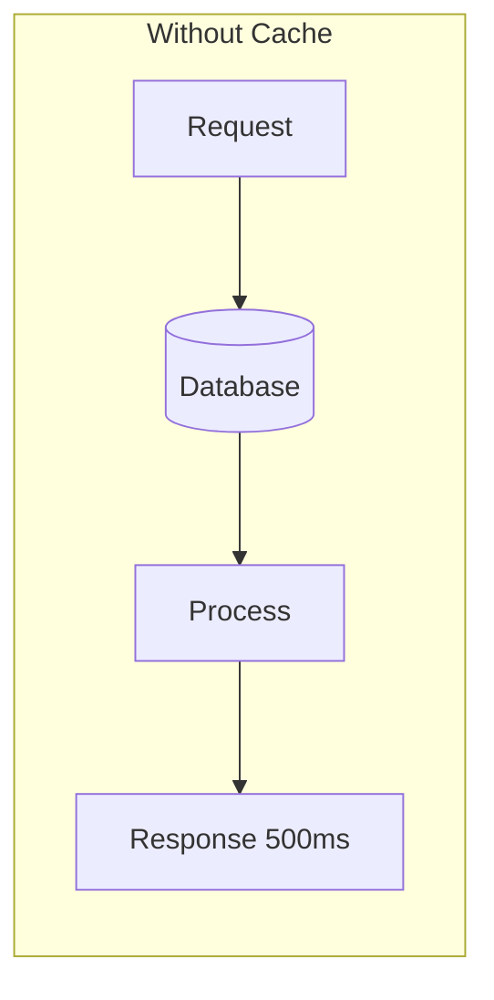
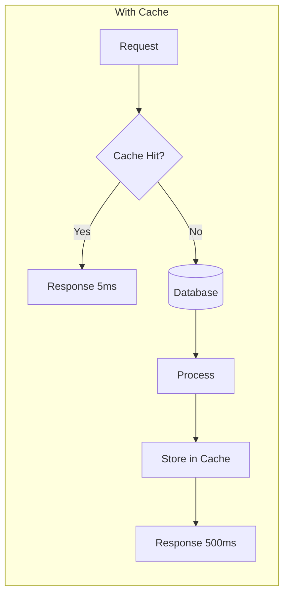
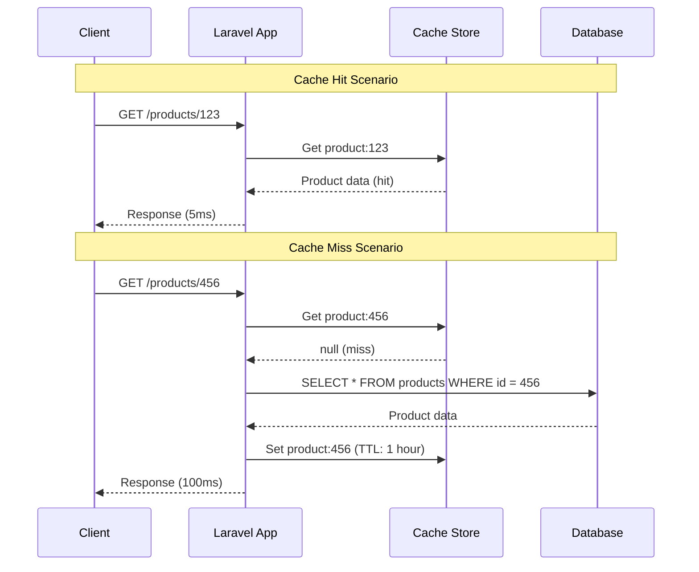
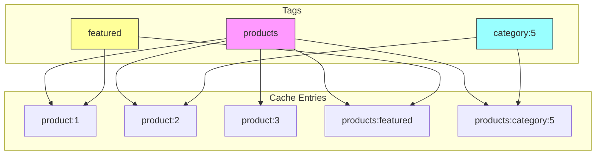
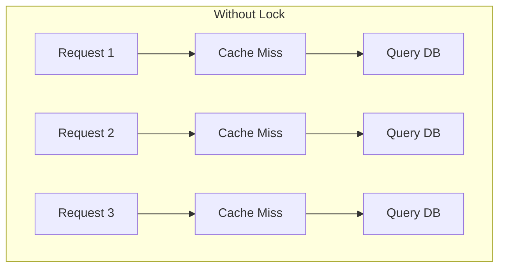
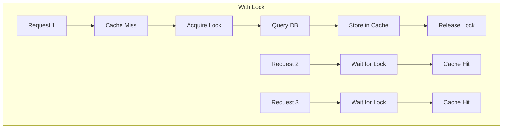
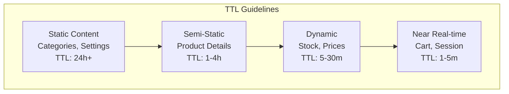

# How to Implement Caching Strategies in Laravel

Author: [nawazdhandala](https://www.github.com/nawazdhandala)

Tags: PHP, Laravel, Caching, Redis, Performance, Optimization

Description: Learn how to implement effective caching strategies in Laravel to dramatically improve application performance. This guide covers cache drivers, cache tags, model caching, query caching, and production best practices.

---

> Caching is the single most impactful performance optimization you can implement. A well-designed caching strategy can reduce database load by 90%, cut response times from seconds to milliseconds, and let your application handle 10x more traffic without scaling infrastructure.

Laravel provides a unified API for various caching backends, from simple file-based caching to distributed systems like Redis and Memcached. Understanding when and how to cache is critical for building performant applications.

---

## Understanding Caching in Laravel

Before diving into implementation, let's understand what caching solves and how Laravel's cache system works:





### Cache Hit vs Miss Flow



Key concepts:
- **Cache Hit**: Data found in cache, returned immediately
- **Cache Miss**: Data not in cache, fetched from source and stored
- **TTL (Time To Live)**: How long cached data remains valid
- **Cache Invalidation**: Removing stale data from cache

---

## Getting Started

### Cache Configuration

Laravel's cache configuration lives in `config/cache.php`:

```php
<?php
// config/cache.php

return [
    // Default cache store to use
    'default' => env('CACHE_DRIVER', 'file'),

    // Available cache stores
    'stores' => [
        // File-based caching (development)
        'file' => [
            'driver' => 'file',
            'path' => storage_path('framework/cache/data'),
            'lock_path' => storage_path('framework/cache/data'),
        ],

        // Redis caching (production recommended)
        'redis' => [
            'driver' => 'redis',
            'connection' => 'cache',
            'lock_connection' => 'default',
        ],

        // Memcached caching (alternative to Redis)
        'memcached' => [
            'driver' => 'memcached',
            'persistent_id' => env('MEMCACHED_PERSISTENT_ID'),
            'sasl' => [
                env('MEMCACHED_USERNAME'),
                env('MEMCACHED_PASSWORD'),
            ],
            'options' => [
                // Memcached::OPT_CONNECT_TIMEOUT => 2000,
            ],
            'servers' => [
                [
                    'host' => env('MEMCACHED_HOST', '127.0.0.1'),
                    'port' => env('MEMCACHED_PORT', 11211),
                    'weight' => 100,
                ],
            ],
        ],

        // Database caching (useful for shared hosting)
        'database' => [
            'driver' => 'database',
            'table' => 'cache',
            'connection' => null,
            'lock_connection' => null,
        ],

        // Array caching (testing only)
        'array' => [
            'driver' => 'array',
            'serialize' => false,
        ],
    ],

    // Cache key prefix to avoid collisions
    'prefix' => env('CACHE_PREFIX', 'laravel_cache'),
];
```

### Environment Configuration

```bash
# .env - Development
CACHE_DRIVER=file

# .env - Production
CACHE_DRIVER=redis
REDIS_HOST=redis.example.com
REDIS_PASSWORD=your-secure-password
REDIS_PORT=6379
REDIS_CLIENT=phpredis

# Cache prefix for multi-tenant or multi-app setups
CACHE_PREFIX=myapp_prod
```

### Installing Redis

For production caching, Redis is the recommended choice:

```bash
# Install PHP Redis extension
pecl install redis

# Or using apt (Ubuntu/Debian)
sudo apt-get install php-redis

# Install predis package (pure PHP alternative)
composer require predis/predis
```

---

## Basic Cache Operations

### Storing and Retrieving Data

```php
<?php
// app/Services/ProductService.php

namespace App\Services;

use App\Models\Product;
use Illuminate\Support\Facades\Cache;
use Illuminate\Support\Collection;

class ProductService
{
    /**
     * Get a product with caching.
     * 
     * This demonstrates the basic put/get pattern.
     */
    public function getProduct(int $id): ?Product
    {
        // Create a unique cache key
        $cacheKey = "product:{$id}";
        
        // Try to get from cache first
        $product = Cache::get($cacheKey);
        
        if ($product !== null) {
            // Cache hit - return immediately
            return $product;
        }
        
        // Cache miss - fetch from database
        $product = Product::with(['category', 'brand'])->find($id);
        
        if ($product) {
            // Store in cache for 1 hour (3600 seconds)
            Cache::put($cacheKey, $product, 3600);
        }
        
        return $product;
    }

    /**
     * Get product using remember() - cleaner syntax.
     * 
     * remember() combines get/put into one call.
     */
    public function getProductRemember(int $id): ?Product
    {
        return Cache::remember(
            "product:{$id}",         // Cache key
            now()->addHour(),        // TTL as Carbon instance
            function () use ($id) {  // Closure executed on cache miss
                return Product::with(['category', 'brand'])->find($id);
            }
        );
    }

    /**
     * Get featured products with cache.
     */
    public function getFeaturedProducts(): Collection
    {
        return Cache::remember('products:featured', now()->addMinutes(30), function () {
            return Product::where('is_featured', true)
                ->with(['category', 'images'])
                ->orderBy('sort_order')
                ->limit(12)
                ->get();
        });
    }

    /**
     * Cache forever - for rarely changing data.
     */
    public function getAllCategories(): Collection
    {
        return Cache::rememberForever('categories:all', function () {
            return \App\Models\Category::orderBy('name')->get();
        });
    }
}
```

### Cache Invalidation

```php
<?php
// app/Services/ProductService.php (continued)

namespace App\Services;

use App\Models\Product;
use Illuminate\Support\Facades\Cache;

class ProductService
{
    /**
     * Update a product and invalidate cache.
     */
    public function updateProduct(int $id, array $data): Product
    {
        $product = Product::findOrFail($id);
        $product->update($data);
        
        // Invalidate the specific product cache
        Cache::forget("product:{$id}");
        
        // Invalidate related caches
        Cache::forget('products:featured');
        Cache::forget("products:category:{$product->category_id}");
        
        return $product->fresh();
    }

    /**
     * Delete a product and clean up all related caches.
     */
    public function deleteProduct(int $id): void
    {
        $product = Product::findOrFail($id);
        $categoryId = $product->category_id;
        
        $product->delete();
        
        // Clean up all related caches
        $this->invalidateProductCaches($id, $categoryId);
    }

    /**
     * Centralized cache invalidation for products.
     */
    protected function invalidateProductCaches(int $productId, int $categoryId): void
    {
        // Individual product cache
        Cache::forget("product:{$productId}");
        
        // List caches that might include this product
        Cache::forget('products:featured');
        Cache::forget('products:latest');
        Cache::forget('products:bestsellers');
        Cache::forget("products:category:{$categoryId}");
        
        // Search result caches (if using search)
        // This might need a more sophisticated approach
        // See cache tags section below
    }
}
```

### Conditional Caching

```php
<?php
// app/Services/UserService.php

namespace App\Services;

use App\Models\User;
use Illuminate\Support\Facades\Cache;

class UserService
{
    /**
     * Add to cache only if key doesn't exist.
     */
    public function cacheUserIfMissing(int $userId): bool
    {
        $user = User::find($userId);
        
        if (!$user) {
            return false;
        }
        
        // Only adds if key doesn't exist
        // Returns true if added, false if already exists
        return Cache::add("user:{$userId}", $user, now()->addHour());
    }

    /**
     * Check if value exists in cache.
     */
    public function isUserCached(int $userId): bool
    {
        return Cache::has("user:{$userId}");
    }

    /**
     * Increment/decrement cached counters.
     */
    public function incrementPageViews(int $userId): int
    {
        $key = "user:{$userId}:page_views";
        
        // Initialize if doesn't exist
        if (!Cache::has($key)) {
            Cache::put($key, 0, now()->addDay());
        }
        
        // Atomic increment
        return Cache::increment($key);
    }

    /**
     * Get and delete in one operation.
     */
    public function consumeOneTimeToken(string $token): ?array
    {
        // pull() gets the value and removes it from cache
        return Cache::pull("token:{$token}");
    }
}
```

---

## Cache Tags

Cache tags allow you to group related cache entries and invalidate them together. This is essential for complex applications.

> Note: Cache tags are only supported by Redis and Memcached drivers.

### Cache Tag Architecture



### Implementing Cache Tags

```php
<?php
// app/Services/TaggedProductService.php

namespace App\Services;

use App\Models\Product;
use App\Models\Category;
use Illuminate\Support\Facades\Cache;
use Illuminate\Support\Collection;

class TaggedProductService
{
    /**
     * Cache a product with multiple tags.
     * 
     * Tags allow selective cache invalidation.
     */
    public function getProduct(int $id): ?Product
    {
        $product = Cache::tags(['products'])->remember(
            "product:{$id}",
            now()->addHour(),
            fn() => Product::with(['category', 'brand', 'images'])->find($id)
        );

        return $product;
    }

    /**
     * Cache products by category with tags.
     */
    public function getProductsByCategory(int $categoryId): Collection
    {
        return Cache::tags(['products', "category:{$categoryId}"])->remember(
            "products:category:{$categoryId}",
            now()->addMinutes(30),
            function () use ($categoryId) {
                return Product::where('category_id', $categoryId)
                    ->with(['images', 'brand'])
                    ->orderBy('name')
                    ->get();
            }
        );
    }

    /**
     * Cache featured products with dedicated tag.
     */
    public function getFeaturedProducts(): Collection
    {
        return Cache::tags(['products', 'featured'])->remember(
            'products:featured',
            now()->addMinutes(15),
            function () {
                return Product::where('is_featured', true)
                    ->with(['category', 'images'])
                    ->orderBy('sort_order')
                    ->limit(12)
                    ->get();
            }
        );
    }

    /**
     * Cache search results with tags.
     */
    public function searchProducts(string $query): Collection
    {
        // Create a deterministic cache key from the query
        $cacheKey = 'products:search:' . md5(strtolower(trim($query)));

        return Cache::tags(['products', 'search'])->remember(
            $cacheKey,
            now()->addMinutes(10),
            function () use ($query) {
                return Product::where('name', 'LIKE', "%{$query}%")
                    ->orWhere('description', 'LIKE', "%{$query}%")
                    ->with(['category'])
                    ->limit(50)
                    ->get();
            }
        );
    }

    /**
     * Invalidate all product caches.
     */
    public function flushAllProducts(): void
    {
        Cache::tags(['products'])->flush();
    }

    /**
     * Invalidate only category-specific caches.
     */
    public function flushCategoryProducts(int $categoryId): void
    {
        Cache::tags(["category:{$categoryId}"])->flush();
    }

    /**
     * Invalidate featured product caches.
     */
    public function flushFeaturedProducts(): void
    {
        Cache::tags(['featured'])->flush();
    }

    /**
     * Invalidate search result caches.
     */
    public function flushSearchResults(): void
    {
        Cache::tags(['search'])->flush();
    }
}
```

### Model Observer for Automatic Cache Invalidation

```php
<?php
// app/Observers/ProductObserver.php

namespace App\Observers;

use App\Models\Product;
use App\Services\TaggedProductService;
use Illuminate\Support\Facades\Cache;

class ProductObserver
{
    protected TaggedProductService $cacheService;

    public function __construct(TaggedProductService $cacheService)
    {
        $this->cacheService = $cacheService;
    }

    /**
     * Handle the Product "created" event.
     */
    public function created(Product $product): void
    {
        // Invalidate list caches that might need to include this product
        $this->invalidateListCaches($product);
    }

    /**
     * Handle the Product "updated" event.
     */
    public function updated(Product $product): void
    {
        // Invalidate specific product cache
        Cache::tags(['products'])->forget("product:{$product->id}");
        
        // If category changed, invalidate both old and new category caches
        if ($product->isDirty('category_id')) {
            $oldCategoryId = $product->getOriginal('category_id');
            $this->cacheService->flushCategoryProducts($oldCategoryId);
        }
        
        // Invalidate related list caches
        $this->invalidateListCaches($product);
    }

    /**
     * Handle the Product "deleted" event.
     */
    public function deleted(Product $product): void
    {
        // Clean up all related caches
        Cache::tags(['products'])->forget("product:{$product->id}");
        $this->invalidateListCaches($product);
    }

    /**
     * Invalidate list caches affected by product changes.
     */
    protected function invalidateListCaches(Product $product): void
    {
        // Category products
        $this->cacheService->flushCategoryProducts($product->category_id);
        
        // Featured products (if product is/was featured)
        if ($product->is_featured || $product->getOriginal('is_featured')) {
            $this->cacheService->flushFeaturedProducts();
        }
        
        // Search results (broad invalidation)
        $this->cacheService->flushSearchResults();
    }
}
```

Register the observer:

```php
<?php
// app/Providers/AppServiceProvider.php

namespace App\Providers;

use App\Models\Product;
use App\Observers\ProductObserver;
use Illuminate\Support\ServiceProvider;

class AppServiceProvider extends ServiceProvider
{
    public function boot(): void
    {
        // Register the observer
        Product::observe(ProductObserver::class);
    }
}
```

---

## Query Caching

### Caching Expensive Queries

```php
<?php
// app/Services/ReportService.php

namespace App\Services;

use App\Models\Order;
use Illuminate\Support\Facades\Cache;
use Illuminate\Support\Facades\DB;
use Carbon\Carbon;

class ReportService
{
    /**
     * Cache expensive aggregation query.
     */
    public function getSalesReport(Carbon $startDate, Carbon $endDate): array
    {
        $cacheKey = sprintf(
            'reports:sales:%s:%s',
            $startDate->format('Y-m-d'),
            $endDate->format('Y-m-d')
        );

        return Cache::remember($cacheKey, now()->addHours(4), function () use ($startDate, $endDate) {
            return DB::table('orders')
                ->select([
                    DB::raw('DATE(created_at) as date'),
                    DB::raw('COUNT(*) as total_orders'),
                    DB::raw('SUM(total) as total_revenue'),
                    DB::raw('AVG(total) as average_order_value'),
                ])
                ->whereBetween('created_at', [$startDate, $endDate])
                ->where('status', 'completed')
                ->groupBy(DB::raw('DATE(created_at)'))
                ->orderBy('date')
                ->get()
                ->toArray();
        });
    }

    /**
     * Cache dashboard statistics.
     */
    public function getDashboardStats(): array
    {
        return Cache::remember('dashboard:stats', now()->addMinutes(5), function () {
            return [
                'total_orders_today' => Order::whereDate('created_at', today())->count(),
                'revenue_today' => Order::whereDate('created_at', today())
                    ->where('status', 'completed')
                    ->sum('total'),
                'pending_orders' => Order::where('status', 'pending')->count(),
                'low_stock_products' => \App\Models\Product::where('stock', '<', 10)->count(),
            ];
        });
    }

    /**
     * Cache complex joins with custom TTL based on data freshness needs.
     */
    public function getTopSellingProducts(int $limit = 10): array
    {
        return Cache::remember("reports:top_selling:{$limit}", now()->addHour(), function () use ($limit) {
            return DB::table('order_items')
                ->select([
                    'products.id',
                    'products.name',
                    'products.price',
                    DB::raw('SUM(order_items.quantity) as total_sold'),
                    DB::raw('SUM(order_items.quantity * order_items.price) as total_revenue'),
                ])
                ->join('products', 'products.id', '=', 'order_items.product_id')
                ->join('orders', 'orders.id', '=', 'order_items.order_id')
                ->where('orders.status', 'completed')
                ->where('orders.created_at', '>=', now()->subDays(30))
                ->groupBy('products.id', 'products.name', 'products.price')
                ->orderByDesc('total_sold')
                ->limit($limit)
                ->get()
                ->toArray();
        });
    }
}
```

---

## Response Caching

### Caching Full HTTP Responses

```php
<?php
// app/Http/Middleware/CacheResponse.php

namespace App\Http\Middleware;

use Closure;
use Illuminate\Http\Request;
use Illuminate\Support\Facades\Cache;
use Symfony\Component\HttpFoundation\Response;

class CacheResponse
{
    /**
     * Handle an incoming request.
     * 
     * Caches GET request responses for anonymous users.
     */
    public function handle(Request $request, Closure $next, int $ttl = 60): Response
    {
        // Only cache GET requests
        if ($request->method() !== 'GET') {
            return $next($request);
        }

        // Don't cache authenticated users (personalized content)
        if ($request->user()) {
            return $next($request);
        }

        // Generate cache key from URL and query parameters
        $cacheKey = $this->generateCacheKey($request);

        // Check if we have a cached response
        $cachedResponse = Cache::get($cacheKey);

        if ($cachedResponse) {
            return response($cachedResponse['content'])
                ->withHeaders($cachedResponse['headers'])
                ->header('X-Cache', 'HIT');
        }

        // Get the response
        $response = $next($request);

        // Only cache successful responses
        if ($response->isSuccessful()) {
            Cache::put($cacheKey, [
                'content' => $response->getContent(),
                'headers' => $this->getCacheableHeaders($response),
            ], $ttl);
        }

        return $response->header('X-Cache', 'MISS');
    }

    /**
     * Generate a unique cache key for the request.
     */
    protected function generateCacheKey(Request $request): string
    {
        $url = $request->fullUrl();
        $acceptHeader = $request->header('Accept', 'text/html');
        
        return 'response:' . md5($url . '|' . $acceptHeader);
    }

    /**
     * Get headers that should be cached with the response.
     */
    protected function getCacheableHeaders(Response $response): array
    {
        $headers = [];
        $headerNames = ['Content-Type', 'Content-Language'];

        foreach ($headerNames as $name) {
            if ($response->headers->has($name)) {
                $headers[$name] = $response->headers->get($name);
            }
        }

        return $headers;
    }
}
```

Register the middleware:

```php
<?php
// bootstrap/app.php (Laravel 11+)

use App\Http\Middleware\CacheResponse;

->withMiddleware(function (Middleware $middleware) {
    $middleware->alias([
        'cache.response' => CacheResponse::class,
    ]);
})
```

Apply to routes:

```php
<?php
// routes/web.php

use Illuminate\Support\Facades\Route;

// Cache for 5 minutes
Route::get('/products', [ProductController::class, 'index'])
    ->middleware('cache.response:300');

// Cache for 1 hour
Route::get('/categories', [CategoryController::class, 'index'])
    ->middleware('cache.response:3600');

// No caching for dynamic content
Route::get('/cart', [CartController::class, 'show']);
```

---

## Model Caching

### Caching Eloquent Models

```php
<?php
// app/Traits/CachesModel.php

namespace App\Traits;

use Illuminate\Support\Facades\Cache;
use Illuminate\Database\Eloquent\Model;

trait CachesModel
{
    /**
     * Get the cache key for this model instance.
     */
    public function getCacheKey(): string
    {
        return sprintf(
            '%s:%s',
            $this->getTable(),
            $this->getKey()
        );
    }

    /**
     * Get the cache tags for this model.
     */
    public function getCacheTags(): array
    {
        return [$this->getTable()];
    }

    /**
     * Get the default cache TTL in seconds.
     */
    public function getCacheTTL(): int
    {
        return property_exists($this, 'cacheTTL') ? $this->cacheTTL : 3600;
    }

    /**
     * Find a model by ID with caching.
     */
    public static function findCached(int|string $id): ?static
    {
        $instance = new static;
        $cacheKey = "{$instance->getTable()}:{$id}";

        return Cache::tags($instance->getCacheTags())->remember(
            $cacheKey,
            $instance->getCacheTTL(),
            fn() => static::find($id)
        );
    }

    /**
     * Clear this model's cache.
     */
    public function clearCache(): void
    {
        Cache::tags($this->getCacheTags())->forget($this->getCacheKey());
    }

    /**
     * Clear all caches for this model type.
     */
    public static function clearAllCache(): void
    {
        $instance = new static;
        Cache::tags($instance->getCacheTags())->flush();
    }

    /**
     * Boot the trait.
     */
    protected static function bootCachesModel(): void
    {
        // Clear cache when model is saved
        static::saved(function (Model $model) {
            $model->clearCache();
        });

        // Clear cache when model is deleted
        static::deleted(function (Model $model) {
            $model->clearCache();
        });
    }
}
```

Use the trait:

```php
<?php
// app/Models/Product.php

namespace App\Models;

use App\Traits\CachesModel;
use Illuminate\Database\Eloquent\Model;
use Illuminate\Database\Eloquent\Relations\BelongsTo;
use Illuminate\Database\Eloquent\Relations\HasMany;

class Product extends Model
{
    use CachesModel;

    // Custom cache TTL (optional, default is 3600)
    protected int $cacheTTL = 1800; // 30 minutes

    protected $fillable = [
        'name',
        'slug',
        'description',
        'price',
        'stock',
        'category_id',
        'is_featured',
    ];

    protected $casts = [
        'price' => 'decimal:2',
        'is_featured' => 'boolean',
    ];

    public function category(): BelongsTo
    {
        return $this->belongsTo(Category::class);
    }

    public function images(): HasMany
    {
        return $this->hasMany(ProductImage::class);
    }
}
```

---

## Cache Warming

### Pre-populating the Cache

```php
<?php
// app/Console/Commands/WarmCache.php

namespace App\Console\Commands;

use App\Models\Product;
use App\Models\Category;
use App\Services\TaggedProductService;
use Illuminate\Console\Command;
use Illuminate\Support\Facades\Cache;

class WarmCache extends Command
{
    protected $signature = 'cache:warm 
                            {--products : Warm product caches}
                            {--categories : Warm category caches}
                            {--all : Warm all caches}';

    protected $description = 'Pre-populate the cache with frequently accessed data';

    protected TaggedProductService $productService;

    public function __construct(TaggedProductService $productService)
    {
        parent::__construct();
        $this->productService = $productService;
    }

    public function handle(): int
    {
        $startTime = microtime(true);
        $itemsCached = 0;

        $this->info('Starting cache warming...');

        if ($this->option('all') || $this->option('products')) {
            $itemsCached += $this->warmProductCaches();
        }

        if ($this->option('all') || $this->option('categories')) {
            $itemsCached += $this->warmCategoryCaches();
        }

        $duration = round(microtime(true) - $startTime, 2);
        $this->info("Cache warming complete! Cached {$itemsCached} items in {$duration}s");

        return Command::SUCCESS;
    }

    /**
     * Warm product caches.
     */
    protected function warmProductCaches(): int
    {
        $count = 0;

        // Cache featured products
        $this->info('Caching featured products...');
        $this->productService->getFeaturedProducts();
        $count++;

        // Cache individual products
        $this->info('Caching individual products...');
        $products = Product::select('id')->get();
        
        $bar = $this->output->createProgressBar($products->count());
        $bar->start();

        foreach ($products as $product) {
            $this->productService->getProduct($product->id);
            $bar->advance();
            $count++;
        }

        $bar->finish();
        $this->newLine();

        // Cache products by category
        $this->info('Caching products by category...');
        $categories = Category::select('id')->get();

        foreach ($categories as $category) {
            $this->productService->getProductsByCategory($category->id);
            $count++;
        }

        return $count;
    }

    /**
     * Warm category caches.
     */
    protected function warmCategoryCaches(): int
    {
        $this->info('Caching categories...');

        $categories = Category::with('products')->get();

        Cache::tags(['categories'])->put(
            'categories:all',
            $categories,
            now()->addDay()
        );

        return 1;
    }
}
```

Schedule cache warming:

```php
<?php
// app/Console/Kernel.php (Laravel 10) or routes/console.php (Laravel 11)

use Illuminate\Support\Facades\Schedule;

Schedule::command('cache:warm --all')
    ->dailyAt('03:00')
    ->withoutOverlapping()
    ->runInBackground();

// Warm specific caches more frequently
Schedule::command('cache:warm --products')
    ->hourly()
    ->withoutOverlapping();
```

---

## Cache Locking

### Preventing Cache Stampedes





```php
<?php
// app/Services/CacheService.php

namespace App\Services;

use Illuminate\Support\Facades\Cache;
use Closure;

class CacheService
{
    /**
     * Remember with atomic lock to prevent cache stampede.
     * 
     * When multiple requests hit an expired cache simultaneously,
     * only one will regenerate while others wait.
     */
    public function rememberWithLock(
        string $key,
        int $ttl,
        Closure $callback,
        int $lockTimeout = 10
    ): mixed {
        // Try to get from cache first
        $value = Cache::get($key);
        
        if ($value !== null) {
            return $value;
        }

        // Acquire lock before regenerating
        $lock = Cache::lock("lock:{$key}", $lockTimeout);

        try {
            // Wait up to lockTimeout seconds for lock
            if ($lock->block($lockTimeout)) {
                // Double-check cache after acquiring lock
                // Another process might have populated it
                $value = Cache::get($key);
                
                if ($value !== null) {
                    return $value;
                }

                // Generate and cache the value
                $value = $callback();
                Cache::put($key, $value, $ttl);
                
                return $value;
            }
        } finally {
            // Always release the lock
            $lock->release();
        }

        // If we couldn't acquire lock, fall back to direct generation
        // This prevents deadlocks but might cause duplicate work
        return $callback();
    }

    /**
     * Get expensive data with lock protection.
     */
    public function getExpensiveReport(string $reportId): array
    {
        return $this->rememberWithLock(
            "report:{$reportId}",
            3600,
            function () use ($reportId) {
                // Expensive operation
                return $this->generateReport($reportId);
            },
            30 // Wait up to 30 seconds for lock
        );
    }

    /**
     * Simulate expensive report generation.
     */
    protected function generateReport(string $reportId): array
    {
        // Simulating expensive operation
        sleep(5);
        
        return [
            'id' => $reportId,
            'generated_at' => now()->toIso8601String(),
            'data' => [],
        ];
    }
}
```

---

## Redis-Specific Features

### Using Redis Data Structures

```php
<?php
// app/Services/RedisService.php

namespace App\Services;

use Illuminate\Support\Facades\Redis;

class RedisService
{
    /**
     * Store and retrieve JSON data efficiently.
     */
    public function storeUserSession(int $userId, array $sessionData): void
    {
        $key = "session:{$userId}";
        
        // Store as JSON with 24 hour TTL
        Redis::setex($key, 86400, json_encode($sessionData));
    }

    public function getUserSession(int $userId): ?array
    {
        $data = Redis::get("session:{$userId}");
        
        return $data ? json_decode($data, true) : null;
    }

    /**
     * Use Redis hashes for structured data.
     */
    public function updateUserStats(int $userId, array $stats): void
    {
        $key = "user_stats:{$userId}";
        
        foreach ($stats as $field => $value) {
            Redis::hset($key, $field, $value);
        }
        
        // Set TTL on the entire hash
        Redis::expire($key, 3600);
    }

    public function getUserStats(int $userId): array
    {
        return Redis::hgetall("user_stats:{$userId}") ?: [];
    }

    public function incrementUserStat(int $userId, string $stat, int $by = 1): int
    {
        return Redis::hincrby("user_stats:{$userId}", $stat, $by);
    }

    /**
     * Use Redis sets for unique collections.
     */
    public function addToRecentlyViewed(int $userId, int $productId): void
    {
        $key = "recently_viewed:{$userId}";
        
        // Add to sorted set with current timestamp as score
        Redis::zadd($key, now()->timestamp, $productId);
        
        // Keep only last 20 items
        Redis::zremrangebyrank($key, 0, -21);
        
        // Set TTL
        Redis::expire($key, 86400 * 7); // 7 days
    }

    public function getRecentlyViewed(int $userId, int $limit = 10): array
    {
        // Get most recent items (highest scores)
        return Redis::zrevrange("recently_viewed:{$userId}", 0, $limit - 1);
    }

    /**
     * Use Redis lists for queues.
     */
    public function pushToNotificationQueue(array $notification): void
    {
        Redis::lpush('notifications:queue', json_encode($notification));
    }

    public function popFromNotificationQueue(): ?array
    {
        $data = Redis::rpop('notifications:queue');
        
        return $data ? json_decode($data, true) : null;
    }

    /**
     * Implement rate limiting with Redis.
     */
    public function checkRateLimit(string $key, int $maxAttempts, int $windowSeconds): bool
    {
        $current = Redis::incr($key);
        
        if ($current === 1) {
            Redis::expire($key, $windowSeconds);
        }
        
        return $current <= $maxAttempts;
    }
}
```

---

## Cache Monitoring

### Health Check Endpoint

```php
<?php
// app/Http/Controllers/HealthController.php

namespace App\Http\Controllers;

use Illuminate\Http\JsonResponse;
use Illuminate\Support\Facades\Cache;
use Illuminate\Support\Facades\Redis;

class HealthController extends Controller
{
    /**
     * Check cache health status.
     */
    public function cacheHealth(): JsonResponse
    {
        $health = [
            'status' => 'healthy',
            'driver' => config('cache.default'),
            'checks' => [],
        ];

        // Test write operation
        try {
            $testKey = 'health_check:' . uniqid();
            Cache::put($testKey, 'test', 10);
            $value = Cache::get($testKey);
            Cache::forget($testKey);

            $health['checks']['write_read'] = [
                'status' => $value === 'test' ? 'pass' : 'fail',
                'message' => $value === 'test' ? 'Write/Read working' : 'Data mismatch',
            ];
        } catch (\Exception $e) {
            $health['status'] = 'unhealthy';
            $health['checks']['write_read'] = [
                'status' => 'fail',
                'message' => $e->getMessage(),
            ];
        }

        // Check Redis connection if using Redis
        if (config('cache.default') === 'redis') {
            try {
                $pong = Redis::ping();
                $info = Redis::info();

                $health['checks']['redis'] = [
                    'status' => 'pass',
                    'message' => 'Redis connected',
                    'memory_used' => $info['used_memory_human'] ?? 'unknown',
                    'connected_clients' => $info['connected_clients'] ?? 'unknown',
                ];
            } catch (\Exception $e) {
                $health['status'] = 'unhealthy';
                $health['checks']['redis'] = [
                    'status' => 'fail',
                    'message' => $e->getMessage(),
                ];
            }
        }

        $statusCode = $health['status'] === 'healthy' ? 200 : 503;

        return response()->json($health, $statusCode);
    }
}
```

### Cache Metrics Service

```php
<?php
// app/Services/CacheMetricsService.php

namespace App\Services;

use Illuminate\Support\Facades\Cache;
use Illuminate\Support\Facades\Redis;
use Illuminate\Support\Facades\Log;

class CacheMetricsService
{
    protected int $hits = 0;
    protected int $misses = 0;

    /**
     * Get with metrics tracking.
     */
    public function getWithMetrics(string $key): mixed
    {
        $startTime = microtime(true);
        $value = Cache::get($key);
        $duration = (microtime(true) - $startTime) * 1000;

        if ($value !== null) {
            $this->hits++;
            $this->recordMetric('cache.hit', $key, $duration);
        } else {
            $this->misses++;
            $this->recordMetric('cache.miss', $key, $duration);
        }

        return $value;
    }

    /**
     * Remember with metrics tracking.
     */
    public function rememberWithMetrics(string $key, int $ttl, callable $callback): mixed
    {
        $existed = Cache::has($key);
        $startTime = microtime(true);
        
        $value = Cache::remember($key, $ttl, $callback);
        
        $duration = (microtime(true) - $startTime) * 1000;

        if ($existed) {
            $this->hits++;
            $this->recordMetric('cache.hit', $key, $duration);
        } else {
            $this->misses++;
            $this->recordMetric('cache.miss', $key, $duration);
        }

        return $value;
    }

    /**
     * Get cache statistics.
     */
    public function getStatistics(): array
    {
        $total = $this->hits + $this->misses;
        
        return [
            'hits' => $this->hits,
            'misses' => $this->misses,
            'total' => $total,
            'hit_rate' => $total > 0 ? round(($this->hits / $total) * 100, 2) : 0,
        ];
    }

    /**
     * Get Redis memory info.
     */
    public function getRedisInfo(): array
    {
        if (config('cache.default') !== 'redis') {
            return ['error' => 'Redis not configured'];
        }

        try {
            $info = Redis::info();

            return [
                'used_memory' => $info['used_memory_human'] ?? 'unknown',
                'peak_memory' => $info['used_memory_peak_human'] ?? 'unknown',
                'connected_clients' => $info['connected_clients'] ?? 0,
                'total_connections' => $info['total_connections_received'] ?? 0,
                'keyspace_hits' => $info['keyspace_hits'] ?? 0,
                'keyspace_misses' => $info['keyspace_misses'] ?? 0,
                'hit_rate' => $this->calculateRedisHitRate($info),
            ];
        } catch (\Exception $e) {
            return ['error' => $e->getMessage()];
        }
    }

    /**
     * Calculate Redis hit rate from info.
     */
    protected function calculateRedisHitRate(array $info): float
    {
        $hits = $info['keyspace_hits'] ?? 0;
        $misses = $info['keyspace_misses'] ?? 0;
        $total = $hits + $misses;

        return $total > 0 ? round(($hits / $total) * 100, 2) : 0;
    }

    /**
     * Record a cache metric.
     */
    protected function recordMetric(string $type, string $key, float $duration): void
    {
        // Log for debugging
        Log::debug("Cache {$type}", [
            'key' => $key,
            'duration_ms' => round($duration, 2),
        ]);

        // Here you could send to a metrics service like:
        // - Prometheus
        // - StatsD
        // - OneUptime
    }
}
```

---

## Production Best Practices

### Environment-Specific Configuration

```php
<?php
// config/cache.php

return [
    'default' => env('CACHE_DRIVER', 'file'),

    'stores' => [
        'redis' => [
            'driver' => 'redis',
            'connection' => env('REDIS_CACHE_CONNECTION', 'cache'),
            'lock_connection' => env('REDIS_CACHE_LOCK_CONNECTION', 'default'),
        ],
    ],

    // Different prefixes per environment
    'prefix' => env('CACHE_PREFIX', env('APP_NAME', 'laravel') . '_' . env('APP_ENV', 'production')),
];
```

```bash
# .env.production
CACHE_DRIVER=redis
REDIS_HOST=redis-cluster.internal.example.com
REDIS_PASSWORD="${REDIS_SECURE_PASSWORD}"
REDIS_PORT=6379
REDIS_CLIENT=phpredis
CACHE_PREFIX=myapp_prod

# Redis connection pool settings
REDIS_POOL_MIN_CONNECTIONS=10
REDIS_POOL_MAX_CONNECTIONS=100
```

### Cache TTL Strategy Guide



| Data Type | TTL | Invalidation Strategy |
|-----------|-----|----------------------|
| Static configuration | 24+ hours | Manual invalidation |
| Category listings | 4-12 hours | Event-based |
| Product details | 1-4 hours | Model observer |
| Search results | 10-30 minutes | Time-based |
| User sessions | 5-15 minutes | Activity-based |
| Real-time data | 1-5 minutes | Time-based |

### Graceful Degradation

```php
<?php
// app/Services/ResilientCacheService.php

namespace App\Services;

use Illuminate\Support\Facades\Cache;
use Illuminate\Support\Facades\Log;
use Throwable;

class ResilientCacheService
{
    /**
     * Get from cache with graceful fallback.
     * 
     * If cache fails, return stale data or fresh data.
     */
    public function getWithFallback(string $key, callable $fallback, int $ttl = 3600): mixed
    {
        try {
            // Try to get from cache
            $value = Cache::get($key);

            if ($value !== null) {
                return $value;
            }

            // Cache miss - generate fresh value
            $freshValue = $fallback();

            // Try to store in cache (non-blocking failure)
            $this->safelyStore($key, $freshValue, $ttl);

            return $freshValue;

        } catch (Throwable $e) {
            // Log the cache failure
            Log::warning('Cache operation failed', [
                'key' => $key,
                'error' => $e->getMessage(),
            ]);

            // Fall back to direct data fetch
            return $fallback();
        }
    }

    /**
     * Store in cache without throwing exceptions.
     */
    protected function safelyStore(string $key, mixed $value, int $ttl): void
    {
        try {
            Cache::put($key, $value, $ttl);
        } catch (Throwable $e) {
            Log::warning('Failed to store in cache', [
                'key' => $key,
                'error' => $e->getMessage(),
            ]);
        }
    }

    /**
     * Get with stale-while-revalidate pattern.
     * 
     * Returns stale data immediately while refreshing in background.
     */
    public function getStaleWhileRevalidate(
        string $key,
        callable $callback,
        int $freshTtl = 300,
        int $staleTtl = 3600
    ): mixed {
        $data = Cache::get($key);
        $metaKey = "{$key}:meta";
        $meta = Cache::get($metaKey);

        $now = time();
        $isFresh = $meta && ($meta['cached_at'] + $freshTtl) > $now;
        $isStale = $meta && ($meta['cached_at'] + $staleTtl) > $now;

        // Fresh data - return immediately
        if ($data !== null && $isFresh) {
            return $data;
        }

        // Stale data - return but trigger background refresh
        if ($data !== null && $isStale) {
            // Dispatch job to refresh cache in background
            dispatch(function () use ($key, $metaKey, $callback, $staleTtl) {
                $freshData = $callback();
                Cache::put($key, $freshData, $staleTtl);
                Cache::put($metaKey, ['cached_at' => time()], $staleTtl);
            })->afterResponse();

            return $data;
        }

        // No data or too stale - fetch synchronously
        $freshData = $callback();
        Cache::put($key, $freshData, $staleTtl);
        Cache::put($metaKey, ['cached_at' => time()], $staleTtl);

        return $freshData;
    }
}
```

---

## Common Pitfalls and Solutions

### 1. Caching Null Values

```php
<?php
// Problem: Cache miss on every request for non-existent items

// BAD - this caches null, but Cache::get returns null for misses too
$product = Cache::remember("product:{$id}", 3600, function () use ($id) {
    return Product::find($id);  // Returns null if not found
});

// GOOD - use a sentinel value or check explicitly
public function getProduct(int $id): ?Product
{
    $cacheKey = "product:{$id}";
    
    // Check if key exists (distinguishes null value from miss)
    if (Cache::has($cacheKey)) {
        $value = Cache::get($cacheKey);
        return $value === 'NOT_FOUND' ? null : $value;
    }
    
    $product = Product::find($id);
    
    // Cache the result, including null as a sentinel
    Cache::put(
        $cacheKey,
        $product ?? 'NOT_FOUND',
        $product ? 3600 : 300  // Shorter TTL for "not found"
    );
    
    return $product;
}
```

### 2. Cache Key Collisions

```php
<?php
// BAD - keys might collide across different queries
$products = Cache::remember('products', 3600, fn() => ...);

// GOOD - include all relevant parameters in the key
public function getProducts(array $filters): Collection
{
    // Create deterministic key from all parameters
    $filterHash = md5(serialize($filters));
    $cacheKey = "products:list:{$filterHash}";
    
    return Cache::remember($cacheKey, 1800, function () use ($filters) {
        return Product::query()
            ->when($filters['category'] ?? null, fn($q, $cat) => $q->where('category_id', $cat))
            ->when($filters['min_price'] ?? null, fn($q, $price) => $q->where('price', '>=', $price))
            ->when($filters['max_price'] ?? null, fn($q, $price) => $q->where('price', '<=', $price))
            ->orderBy($filters['sort'] ?? 'name')
            ->get();
    });
}
```

### 3. Serialization Issues

```php
<?php
// BAD - closures and resources cannot be serialized
Cache::put('bad', [
    'callback' => fn() => 'test',  // Will fail!
    'connection' => DB::connection(),  // Will fail!
]);

// GOOD - only cache serializable data
$data = [
    'products' => $products->toArray(),
    'generated_at' => now()->toIso8601String(),
    'total' => $products->count(),
];
Cache::put('products:data', $data, 3600);
```

---

## Summary

Effective caching in Laravel requires:

- **Choose the right driver**: Redis for production, file for development
- **Use cache tags**: Group related data for targeted invalidation
- **Implement observers**: Automatically invalidate cache when data changes
- **Prevent stampedes**: Use locks for expensive regeneration
- **Monitor hit rates**: Track cache effectiveness
- **Handle failures gracefully**: Never let cache failures crash your app
- **Set appropriate TTLs**: Balance freshness with performance

A well-implemented caching strategy can transform a sluggish application into a high-performance system while reducing infrastructure costs.

---

*Need to monitor your Laravel application's cache performance in production? [OneUptime](https://oneuptime.com) provides comprehensive observability for PHP applications, including Redis monitoring, custom metrics, and performance alerting.*
