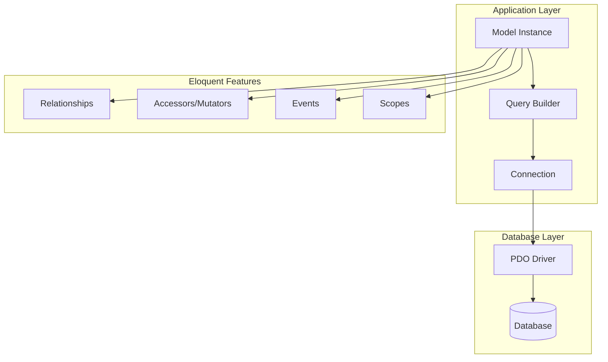
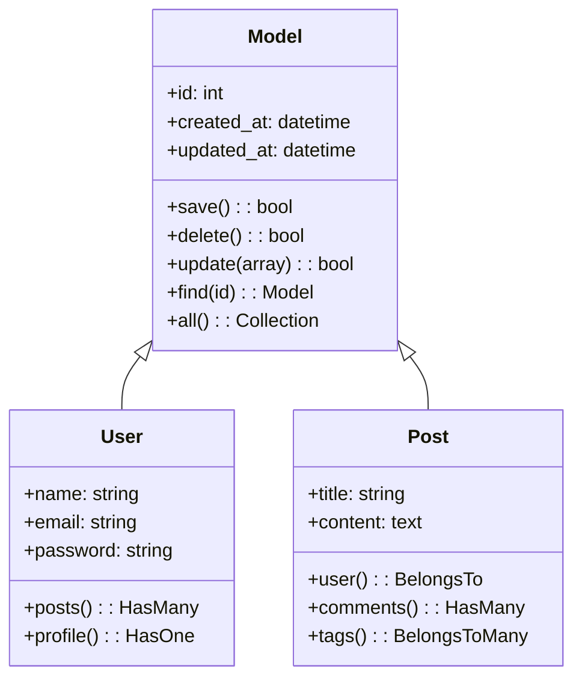
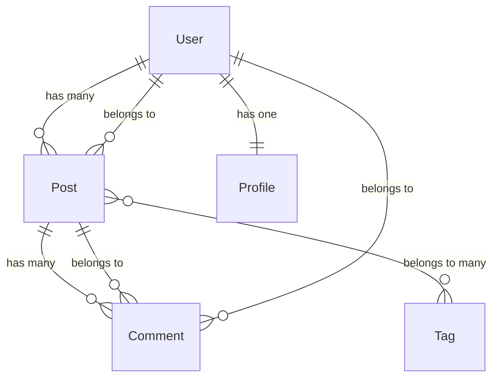
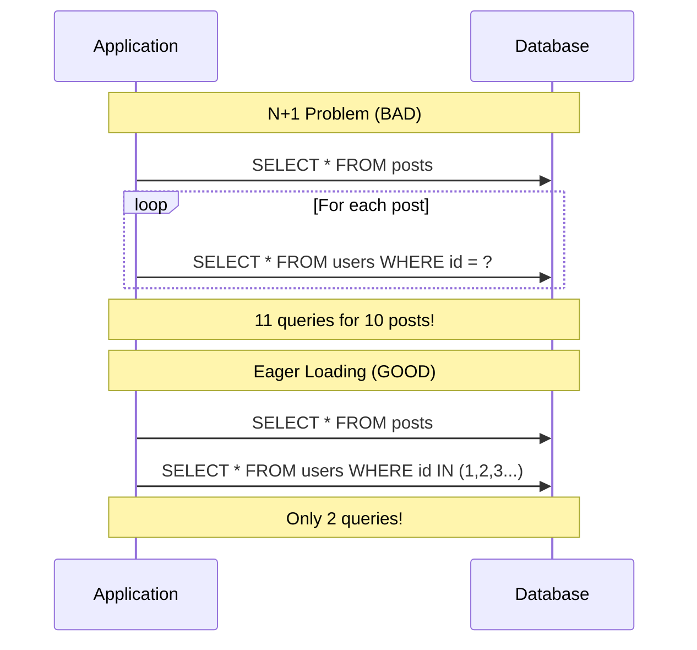
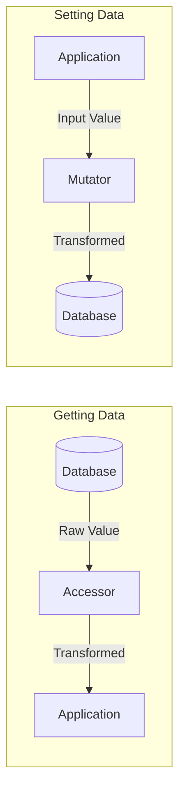
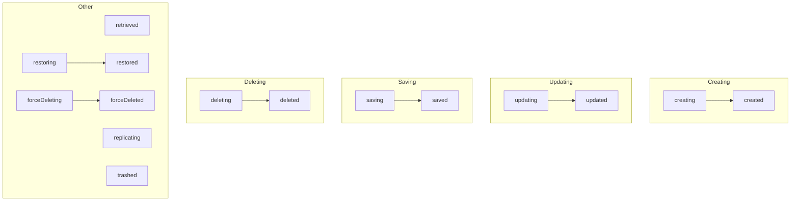

# How to Use Eloquent ORM Effectively in Laravel

Author: [nawazdhandala](https://www.github.com/nawazdhandala)

Tags: PHP, Laravel, Eloquent, ORM, Database, ActiveRecord

Description: A comprehensive guide to mastering Laravel's Eloquent ORM. Learn model relationships, query optimization, eager loading, accessors/mutators, and best practices for building performant database-driven applications.

---

> Eloquent is Laravel's elegant ActiveRecord implementation for working with databases. Each database table has a corresponding Model that allows you to interact with that table. Eloquent makes common database operations intuitive while providing the flexibility for complex queries.

Laravel's Eloquent ORM transforms database interactions from tedious SQL writing into expressive, object-oriented PHP code. Whether you're building a simple blog or a complex multi-tenant SaaS application, understanding Eloquent deeply will make you significantly more productive.

---

## Understanding Eloquent's Architecture

Before diving into code, let's understand how Eloquent works under the hood:



Eloquent follows the Active Record pattern where each model instance represents a single database row:



---

## Getting Started with Models

### Creating Your First Model

Generate a model with its migration:

```bash
# Create model with migration
php artisan make:model Post -m

# Create model with migration, factory, seeder, and controller
php artisan make:model Post -mfsc

# Create model with all options
php artisan make:model Post --all
```

### Basic Model Structure

```php
<?php
// app/Models/Post.php

namespace App\Models;

use Illuminate\Database\Eloquent\Factories\HasFactory;
use Illuminate\Database\Eloquent\Model;
use Illuminate\Database\Eloquent\SoftDeletes;

class Post extends Model
{
    // Enable factory support for testing
    use HasFactory;
    
    // Enable soft deletes (adds deleted_at column)
    use SoftDeletes;
    
    // The table associated with the model
    // By default, Laravel uses snake_case plural of the class name
    protected $table = 'posts';
    
    // The primary key for the model
    protected $primaryKey = 'id';
    
    // Indicates if the primary key is auto-incrementing
    public $incrementing = true;
    
    // The data type of the primary key
    protected $keyType = 'int';
    
    // Indicates if the model should be timestamped
    public $timestamps = true;
    
    // The attributes that are mass assignable
    // IMPORTANT: Always define fillable OR guarded, never both
    protected $fillable = [
        'title',
        'slug',
        'content',
        'excerpt',
        'published_at',
        'user_id',
    ];
    
    // The attributes that should be hidden for arrays/JSON
    protected $hidden = [
        'password_hash',
    ];
    
    // The attributes that should be cast to native types
    protected $casts = [
        'published_at' => 'datetime',
        'is_featured' => 'boolean',
        'metadata' => 'array',
        'view_count' => 'integer',
    ];
    
    // Default attribute values
    protected $attributes = [
        'is_featured' => false,
        'view_count' => 0,
    ];
}
```

### Creating the Migration

```php
<?php
// database/migrations/2025_07_02_create_posts_table.php

use Illuminate\Database\Migrations\Migration;
use Illuminate\Database\Schema\Blueprint;
use Illuminate\Support\Facades\Schema;

return new class extends Migration
{
    public function up(): void
    {
        Schema::create('posts', function (Blueprint $table) {
            // Primary key
            $table->id();
            
            // Foreign key to users table
            $table->foreignId('user_id')
                  ->constrained()
                  ->onDelete('cascade');
            
            // Post content fields
            $table->string('title', 255);
            $table->string('slug', 255)->unique();
            $table->text('content');
            $table->text('excerpt')->nullable();
            
            // Metadata and status
            $table->json('metadata')->nullable();
            $table->boolean('is_featured')->default(false);
            $table->unsignedInteger('view_count')->default(0);
            
            // Publishing
            $table->timestamp('published_at')->nullable();
            
            // Timestamps and soft deletes
            $table->timestamps();
            $table->softDeletes();
            
            // Indexes for common queries
            $table->index(['user_id', 'published_at']);
            $table->index('is_featured');
        });
    }

    public function down(): void
    {
        Schema::dropIfExists('posts');
    }
};
```

---

## CRUD Operations

### Creating Records

```php
<?php
// Multiple ways to create records

// Method 1: Create and save in one step
$post = Post::create([
    'title' => 'My First Post',
    'slug' => 'my-first-post',
    'content' => 'This is the content of my first post.',
    'user_id' => auth()->id(),
]);

// Method 2: Instantiate, set properties, then save
$post = new Post();
$post->title = 'My Second Post';
$post->slug = 'my-second-post';
$post->content = 'This is another post.';
$post->user_id = auth()->id();
$post->save();

// Method 3: Fill and save
$post = new Post();
$post->fill([
    'title' => 'My Third Post',
    'slug' => 'my-third-post',
    'content' => 'Content here.',
]);
$post->user_id = auth()->id();
$post->save();

// Method 4: firstOrCreate - find or create if not exists
$post = Post::firstOrCreate(
    ['slug' => 'unique-post'],           // Search criteria
    [                                      // Values if creating
        'title' => 'Unique Post',
        'content' => 'Created if not found.',
        'user_id' => auth()->id(),
    ]
);

// Method 5: updateOrCreate - update if exists, create if not
$post = Post::updateOrCreate(
    ['slug' => 'daily-update'],           // Search criteria
    [                                      // Values to set
        'title' => 'Daily Update',
        'content' => 'Updated content for today.',
        'user_id' => auth()->id(),
    ]
);
```

### Reading Records

```php
<?php
// Retrieve all posts
$posts = Post::all();

// Find by primary key
$post = Post::find(1);

// Find or throw 404 exception
$post = Post::findOrFail(1);

// Find multiple by primary keys
$posts = Post::find([1, 2, 3]);

// First matching record
$post = Post::where('slug', 'my-first-post')->first();

// First or throw exception
$post = Post::where('slug', 'my-first-post')->firstOrFail();

// Get specific columns only
$posts = Post::select('id', 'title', 'slug')->get();

// Query with conditions
$featuredPosts = Post::where('is_featured', true)
    ->whereNotNull('published_at')
    ->where('published_at', '<=', now())
    ->orderBy('published_at', 'desc')
    ->limit(10)
    ->get();

// Using when() for conditional queries
$posts = Post::query()
    ->when($request->has('featured'), function ($query) {
        $query->where('is_featured', true);
    })
    ->when($request->input('user_id'), function ($query, $userId) {
        $query->where('user_id', $userId);
    })
    ->get();
```

### Updating Records

```php
<?php
// Method 1: Find and update
$post = Post::find(1);
$post->title = 'Updated Title';
$post->save();

// Method 2: Update with array
$post = Post::find(1);
$post->update([
    'title' => 'Updated Title',
    'content' => 'Updated content.',
]);

// Method 3: Mass update (returns number of affected rows)
$affected = Post::where('user_id', 5)
    ->where('is_featured', false)
    ->update(['is_featured' => true]);

// Method 4: Increment/Decrement
Post::find(1)->increment('view_count');
Post::find(1)->increment('view_count', 5);
Post::find(1)->decrement('stock', 1);

// Method 5: Update with additional columns
Post::find(1)->increment('view_count', 1, [
    'last_viewed_at' => now(),
]);
```

### Deleting Records

```php
<?php
// Method 1: Delete a single record
$post = Post::find(1);
$post->delete();

// Method 2: Delete by primary key
Post::destroy(1);
Post::destroy([1, 2, 3]);

// Method 3: Delete with conditions
Post::where('user_id', 5)->delete();

// Soft deletes (requires SoftDeletes trait)
$post = Post::find(1);
$post->delete();  // Sets deleted_at timestamp

// Restore soft deleted record
$post = Post::withTrashed()->find(1);
$post->restore();

// Force delete (permanently remove soft deleted record)
$post = Post::withTrashed()->find(1);
$post->forceDelete();

// Query including soft deleted
$allPosts = Post::withTrashed()->get();

// Query only soft deleted
$trashedPosts = Post::onlyTrashed()->get();
```

---

## Model Relationships

Relationships are one of Eloquent's most powerful features. Understanding them is crucial for effective database design.



### One-to-One Relationship

```php
<?php
// app/Models/User.php

class User extends Model
{
    // A user has one profile
    public function profile(): HasOne
    {
        return $this->hasOne(Profile::class);
        
        // With custom foreign key
        // return $this->hasOne(Profile::class, 'author_id');
        
        // With custom local key
        // return $this->hasOne(Profile::class, 'user_id', 'id');
    }
}

// app/Models/Profile.php

class Profile extends Model
{
    // A profile belongs to a user
    public function user(): BelongsTo
    {
        return $this->belongsTo(User::class);
    }
}

// Usage
$user = User::find(1);
$profile = $user->profile;  // Access the profile

$profile = Profile::find(1);
$user = $profile->user;     // Access the user
```

### One-to-Many Relationship

```php
<?php
// app/Models/User.php

class User extends Model
{
    // A user has many posts
    public function posts(): HasMany
    {
        return $this->hasMany(Post::class);
    }
    
    // With additional constraints
    public function publishedPosts(): HasMany
    {
        return $this->hasMany(Post::class)
            ->whereNotNull('published_at')
            ->where('published_at', '<=', now());
    }
    
    // With ordering
    public function recentPosts(): HasMany
    {
        return $this->hasMany(Post::class)
            ->orderBy('created_at', 'desc')
            ->limit(5);
    }
}

// app/Models/Post.php

class Post extends Model
{
    // A post belongs to a user
    public function user(): BelongsTo
    {
        return $this->belongsTo(User::class);
    }
    
    // With default model if relationship is null
    public function author(): BelongsTo
    {
        return $this->belongsTo(User::class, 'user_id')
            ->withDefault([
                'name' => 'Guest Author',
            ]);
    }
}

// Usage
$user = User::find(1);
$posts = $user->posts;              // Collection of posts
$count = $user->posts()->count();   // Count without loading

$post = Post::find(1);
$author = $post->user;              // The post's author
```

### Many-to-Many Relationship

```php
<?php
// app/Models/Post.php

class Post extends Model
{
    // A post has many tags
    public function tags(): BelongsToMany
    {
        return $this->belongsToMany(Tag::class);
        
        // With custom pivot table name
        // return $this->belongsToMany(Tag::class, 'post_tag');
        
        // With custom foreign keys
        // return $this->belongsToMany(Tag::class, 'post_tag', 'post_id', 'tag_id');
        
        // With pivot timestamps
        // return $this->belongsToMany(Tag::class)->withTimestamps();
        
        // With additional pivot columns
        // return $this->belongsToMany(Tag::class)
        //     ->withPivot('order', 'is_primary')
        //     ->withTimestamps();
    }
}

// app/Models/Tag.php

class Tag extends Model
{
    // A tag has many posts
    public function posts(): BelongsToMany
    {
        return $this->belongsToMany(Post::class);
    }
}

// Migration for pivot table
Schema::create('post_tag', function (Blueprint $table) {
    $table->id();
    $table->foreignId('post_id')->constrained()->onDelete('cascade');
    $table->foreignId('tag_id')->constrained()->onDelete('cascade');
    $table->integer('order')->default(0);
    $table->boolean('is_primary')->default(false);
    $table->timestamps();
    
    // Prevent duplicate associations
    $table->unique(['post_id', 'tag_id']);
});

// Usage
$post = Post::find(1);
$tags = $post->tags;                  // Collection of tags

// Attach tags
$post->tags()->attach($tagId);
$post->tags()->attach([1, 2, 3]);
$post->tags()->attach([
    1 => ['order' => 1, 'is_primary' => true],
    2 => ['order' => 2],
]);

// Detach tags
$post->tags()->detach($tagId);
$post->tags()->detach([1, 2, 3]);
$post->tags()->detach();              // Detach all

// Sync tags (replace all existing)
$post->tags()->sync([1, 2, 3]);
$post->tags()->sync([
    1 => ['is_primary' => true],
    2,
    3,
]);

// Sync without detaching
$post->tags()->syncWithoutDetaching([4, 5]);

// Toggle tags
$post->tags()->toggle([1, 2, 3]);
```

### Has Many Through

```php
<?php
// app/Models/Country.php

class Country extends Model
{
    // A country has many posts through its users
    public function posts(): HasManyThrough
    {
        return $this->hasManyThrough(
            Post::class,      // Final model
            User::class,      // Intermediate model
            'country_id',     // Foreign key on users table
            'user_id',        // Foreign key on posts table
            'id',             // Local key on countries table
            'id'              // Local key on users table
        );
    }
}

// Usage
$country = Country::find(1);
$posts = $country->posts;  // All posts from all users in this country
```

### Polymorphic Relationships

```php
<?php
// Comments can belong to Posts, Videos, or any other commentable model

// app/Models/Comment.php

class Comment extends Model
{
    public function commentable(): MorphTo
    {
        return $this->morphTo();
    }
    
    public function user(): BelongsTo
    {
        return $this->belongsTo(User::class);
    }
}

// app/Models/Post.php

class Post extends Model
{
    public function comments(): MorphMany
    {
        return $this->morphMany(Comment::class, 'commentable');
    }
}

// app/Models/Video.php

class Video extends Model
{
    public function comments(): MorphMany
    {
        return $this->morphMany(Comment::class, 'commentable');
    }
}

// Migration
Schema::create('comments', function (Blueprint $table) {
    $table->id();
    $table->foreignId('user_id')->constrained();
    $table->text('content');
    $table->morphs('commentable');  // Creates commentable_id and commentable_type
    $table->timestamps();
});

// Usage
$post = Post::find(1);
$comments = $post->comments;

$comment = Comment::find(1);
$commentable = $comment->commentable;  // Returns Post or Video instance
```

---

## Query Optimization

### The N+1 Problem

The N+1 problem is one of the most common performance issues in Eloquent:



### Eager Loading

```php
<?php
// BAD: N+1 problem - 1 query for posts + N queries for users
$posts = Post::all();
foreach ($posts as $post) {
    echo $post->user->name;  // Each access triggers a new query
}

// GOOD: Eager loading - only 2 queries total
$posts = Post::with('user')->get();
foreach ($posts as $post) {
    echo $post->user->name;  // No additional query
}

// Multiple relationships
$posts = Post::with(['user', 'tags', 'comments'])->get();

// Nested relationships
$posts = Post::with('user.profile')->get();
$posts = Post::with(['comments.user', 'tags'])->get();

// Eager loading with constraints
$posts = Post::with(['comments' => function ($query) {
    $query->where('approved', true)
          ->orderBy('created_at', 'desc')
          ->limit(5);
}])->get();

// Selecting specific columns (include foreign keys!)
$posts = Post::with(['user' => function ($query) {
    $query->select('id', 'name', 'email');
}])->get();

// Conditional eager loading
$posts = Post::when($includeComments, function ($query) {
    $query->with('comments');
})->get();
```

### Lazy Eager Loading

```php
<?php
// Load relationships after initial query
$posts = Post::all();

// Based on condition
if ($shouldLoadComments) {
    $posts->load('comments');
}

// Load multiple relationships
$posts->load(['user', 'tags']);

// Load with constraints
$posts->load(['comments' => function ($query) {
    $query->where('approved', true);
}]);

// Load missing relationships only
$posts->loadMissing('user');
```

### Counting Related Models

```php
<?php
// Count without loading the entire relationship
$posts = Post::withCount('comments')->get();

foreach ($posts as $post) {
    echo $post->comments_count;  // No additional query
}

// Multiple counts
$posts = Post::withCount(['comments', 'tags'])->get();

// Conditional counts
$posts = Post::withCount([
    'comments',
    'comments as approved_comments_count' => function ($query) {
        $query->where('approved', true);
    },
])->get();

// Exists check (more efficient than count when you just need boolean)
$posts = Post::withExists('comments')->get();

foreach ($posts as $post) {
    if ($post->comments_exists) {
        echo 'Has comments';
    }
}
```

### Query Chunking for Large Datasets

```php
<?php
// Process large datasets without loading everything into memory

// Chunk by count
Post::chunk(100, function ($posts) {
    foreach ($posts as $post) {
        // Process each post
        $post->update(['processed_at' => now()]);
    }
});

// Chunk by ID (better for updates that might affect order)
Post::chunkById(100, function ($posts) {
    foreach ($posts as $post) {
        $post->update(['processed_at' => now()]);
    }
});

// Lazy collection (memory efficient iteration)
Post::lazy()->each(function ($post) {
    // Process each post
    $post->touch();
});

// Lazy by ID
Post::lazyById(100)->each(function ($post) {
    $post->touch();
});

// Cursor for read-only iteration (even more memory efficient)
foreach (Post::cursor() as $post) {
    echo $post->title;
}
```

---

## Accessors and Mutators

Accessors and mutators allow you to transform attribute values when getting or setting them.



### Modern Syntax (Laravel 9+)

```php
<?php
// app/Models/User.php

namespace App\Models;

use Illuminate\Database\Eloquent\Casts\Attribute;
use Illuminate\Database\Eloquent\Model;
use Illuminate\Support\Str;

class User extends Model
{
    // Accessor: Transform when getting
    protected function firstName(): Attribute
    {
        return Attribute::make(
            get: fn (string $value) => ucfirst($value),
        );
    }
    
    // Mutator: Transform when setting
    protected function lastName(): Attribute
    {
        return Attribute::make(
            set: fn (string $value) => strtolower($value),
        );
    }
    
    // Both accessor and mutator
    protected function email(): Attribute
    {
        return Attribute::make(
            get: fn (string $value) => strtolower($value),
            set: fn (string $value) => strtolower($value),
        );
    }
    
    // Virtual attribute (computed from other attributes)
    protected function fullName(): Attribute
    {
        return Attribute::make(
            get: fn () => "{$this->first_name} {$this->last_name}",
        );
    }
    
    // Cached accessor (only computed once)
    protected function expensiveCalculation(): Attribute
    {
        return Attribute::make(
            get: fn () => $this->performExpensiveCalculation(),
        )->shouldCache();
    }
    
    // Accessor with no caching
    protected function currentTime(): Attribute
    {
        return Attribute::make(
            get: fn () => now()->toDateTimeString(),
        )->withoutObjectCaching();
    }
}

// Usage
$user = User::find(1);
echo $user->first_name;      // Returns "John" (ucfirst applied)
echo $user->full_name;       // Returns "John Doe" (computed)

$user->last_name = 'SMITH';  // Stored as "smith"
$user->save();
```

### Adding Virtual Attributes to JSON/Arrays

```php
<?php
// app/Models/User.php

class User extends Model
{
    // Automatically append these virtual attributes
    protected $appends = [
        'full_name',
        'is_admin',
    ];
    
    protected function fullName(): Attribute
    {
        return Attribute::make(
            get: fn () => "{$this->first_name} {$this->last_name}",
        );
    }
    
    protected function isAdmin(): Attribute
    {
        return Attribute::make(
            get: fn () => $this->role === 'admin',
        );
    }
}

// Now when converting to array or JSON
$user->toArray();
// Includes 'full_name' and 'is_admin'

$user->toJson();
// Includes 'full_name' and 'is_admin'

// Conditionally append
$user->append('avatar_url')->toArray();

// Append to collection
$users = User::all()->append('full_name');
```

---

## Query Scopes

Scopes allow you to encapsulate commonly used query constraints:

```php
<?php
// app/Models/Post.php

class Post extends Model
{
    // Local scope - call as ->published()
    public function scopePublished(Builder $query): void
    {
        $query->whereNotNull('published_at')
              ->where('published_at', '<=', now());
    }
    
    // Scope with parameters
    public function scopeByAuthor(Builder $query, User $user): void
    {
        $query->where('user_id', $user->id);
    }
    
    // Scope with optional parameter
    public function scopeFeatured(Builder $query, bool $featured = true): void
    {
        $query->where('is_featured', $featured);
    }
    
    // Scope for date range
    public function scopeCreatedBetween(
        Builder $query, 
        Carbon $start, 
        Carbon $end
    ): void {
        $query->whereBetween('created_at', [$start, $end]);
    }
    
    // Scope with ordering
    public function scopePopular(Builder $query): void
    {
        $query->orderBy('view_count', 'desc');
    }
    
    // Dynamic scope
    public function scopeOfType(Builder $query, string $type): void
    {
        $query->where('type', $type);
    }
}

// Usage - scopes are chainable
$posts = Post::published()
    ->featured()
    ->popular()
    ->limit(10)
    ->get();

$authorPosts = Post::byAuthor($user)
    ->published()
    ->get();

$recentNews = Post::ofType('news')
    ->createdBetween(now()->subWeek(), now())
    ->get();
```

### Global Scopes

```php
<?php
// app/Scopes/ActiveScope.php

namespace App\Scopes;

use Illuminate\Database\Eloquent\Builder;
use Illuminate\Database\Eloquent\Model;
use Illuminate\Database\Eloquent\Scope;

class ActiveScope implements Scope
{
    public function apply(Builder $builder, Model $model): void
    {
        $builder->where('is_active', true);
    }
}

// app/Models/Post.php

class Post extends Model
{
    protected static function booted(): void
    {
        // Apply global scope
        static::addGlobalScope(new ActiveScope());
        
        // Or use a closure for simple scopes
        static::addGlobalScope('published', function (Builder $builder) {
            $builder->whereNotNull('published_at');
        });
    }
}

// Usage
$posts = Post::all();  // Only returns active, published posts

// Remove global scope for specific query
$allPosts = Post::withoutGlobalScope(ActiveScope::class)->get();
$allPosts = Post::withoutGlobalScope('published')->get();

// Remove all global scopes
$allPosts = Post::withoutGlobalScopes()->get();

// Remove specific scopes
$posts = Post::withoutGlobalScopes([
    ActiveScope::class,
    'published',
])->get();
```

---

## Model Events and Observers

Eloquent fires events at various points in a model's lifecycle:



### Using Closures in the Model

```php
<?php
// app/Models/Post.php

class Post extends Model
{
    protected static function booted(): void
    {
        // Before creating
        static::creating(function (Post $post) {
            $post->slug = Str::slug($post->title);
            $post->user_id = $post->user_id ?? auth()->id();
        });
        
        // After creating
        static::created(function (Post $post) {
            // Send notification, log activity, etc.
            Log::info("Post created: {$post->id}");
        });
        
        // Before updating
        static::updating(function (Post $post) {
            if ($post->isDirty('title')) {
                $post->slug = Str::slug($post->title);
            }
        });
        
        // Before deleting
        static::deleting(function (Post $post) {
            // Delete related media files
            $post->media->each->delete();
        });
        
        // Prevent deletion if conditions not met
        static::deleting(function (Post $post) {
            if ($post->comments()->count() > 0) {
                return false;  // Prevent deletion
            }
        });
    }
}
```

### Using Observers

For more complex event handling, use observers:

```bash
php artisan make:observer PostObserver --model=Post
```

```php
<?php
// app/Observers/PostObserver.php

namespace App\Observers;

use App\Models\Post;
use App\Services\SearchService;
use App\Notifications\PostPublished;
use Illuminate\Support\Str;

class PostObserver
{
    public function __construct(
        private SearchService $searchService
    ) {}
    
    // Before saving (create or update)
    public function saving(Post $post): void
    {
        // Auto-generate slug if not provided
        if (empty($post->slug)) {
            $post->slug = Str::slug($post->title);
        }
        
        // Generate excerpt from content
        if (empty($post->excerpt) && !empty($post->content)) {
            $post->excerpt = Str::limit(strip_tags($post->content), 150);
        }
    }
    
    // After creating
    public function created(Post $post): void
    {
        // Index in search engine
        $this->searchService->index($post);
        
        // Log creation
        activity()
            ->performedOn($post)
            ->causedBy(auth()->user())
            ->log('created');
    }
    
    // After updating
    public function updated(Post $post): void
    {
        // Re-index in search engine
        $this->searchService->update($post);
        
        // Check if just published
        if ($post->wasChanged('published_at') && $post->published_at !== null) {
            // Notify subscribers
            $post->user->notify(new PostPublished($post));
        }
    }
    
    // Before deleting
    public function deleting(Post $post): void
    {
        // Remove from search index
        $this->searchService->remove($post);
    }
    
    // After soft deleting
    public function trashed(Post $post): void
    {
        // Archive related data
        $post->comments()->update(['archived' => true]);
    }
    
    // After restoring soft delete
    public function restored(Post $post): void
    {
        // Restore related data
        $post->comments()->update(['archived' => false]);
        $this->searchService->index($post);
    }
    
    // Before force deleting
    public function forceDeleting(Post $post): void
    {
        // Permanently delete related media
        $post->media()->forceDelete();
    }
}
```

Register the observer:

```php
<?php
// app/Providers/AppServiceProvider.php

use App\Models\Post;
use App\Observers\PostObserver;

class AppServiceProvider extends ServiceProvider
{
    public function boot(): void
    {
        Post::observe(PostObserver::class);
    }
}
```

---

## Collections

Eloquent returns results as Collections, which provide powerful methods for working with data:

```php
<?php
// Basic collection operations
$posts = Post::all();

// Filter
$featured = $posts->filter(fn ($post) => $post->is_featured);

// Map/Transform
$titles = $posts->map(fn ($post) => $post->title);
$summaries = $posts->map(fn ($post) => [
    'id' => $post->id,
    'title' => $post->title,
    'author' => $post->user->name,
]);

// Pluck single column
$titles = $posts->pluck('title');
$titleById = $posts->pluck('title', 'id');

// Group by
$postsByAuthor = $posts->groupBy('user_id');
$postsByMonth = $posts->groupBy(fn ($post) => $post->created_at->format('Y-m'));

// Sort
$sorted = $posts->sortBy('title');
$sorted = $posts->sortByDesc('created_at');
$sorted = $posts->sortBy(fn ($post) => $post->user->name);

// Aggregate
$total = $posts->count();
$totalViews = $posts->sum('view_count');
$avgViews = $posts->avg('view_count');
$maxViews = $posts->max('view_count');

// First/Last matching condition
$featured = $posts->first(fn ($post) => $post->is_featured);
$lastPublished = $posts->last(fn ($post) => $post->published_at !== null);

// Check conditions
$hasFeatured = $posts->contains(fn ($post) => $post->is_featured);
$allPublished = $posts->every(fn ($post) => $post->published_at !== null);

// Unique values
$uniqueAuthors = $posts->unique('user_id');
$uniqueByCustom = $posts->unique(fn ($post) => $post->user->email);

// Chunk for processing
$posts->chunk(100)->each(function ($chunk) {
    // Process chunk of 100 posts
});

// Convert to array/JSON
$array = $posts->toArray();
$json = $posts->toJson();

// Key by attribute
$postsById = $posts->keyBy('id');
$postsBySlug = $posts->keyBy('slug');
```

---

## Advanced Query Techniques

### Raw Expressions

```php
<?php
use Illuminate\Support\Facades\DB;

// Raw select
$posts = Post::select([
    'posts.*',
    DB::raw('(SELECT COUNT(*) FROM comments WHERE comments.post_id = posts.id) as comments_count'),
])->get();

// Raw where
$posts = Post::whereRaw('LOWER(title) LIKE ?', ['%' . strtolower($search) . '%'])
    ->get();

// Raw order
$posts = Post::orderByRaw('FIELD(status, "draft", "review", "published")')
    ->get();

// Raw having
$authors = User::select('users.*', DB::raw('COUNT(posts.id) as posts_count'))
    ->join('posts', 'users.id', '=', 'posts.user_id')
    ->groupBy('users.id')
    ->havingRaw('COUNT(posts.id) > ?', [5])
    ->get();
```

### Subqueries

```php
<?php
// Subquery in select
$users = User::select([
    'users.*',
    'latest_post_date' => Post::select('created_at')
        ->whereColumn('user_id', 'users.id')
        ->orderByDesc('created_at')
        ->limit(1),
])->get();

// Subquery in where
$activeUsers = User::whereIn('id', function ($query) {
    $query->select('user_id')
        ->from('posts')
        ->where('created_at', '>=', now()->subMonth());
})->get();

// Using addSelect
$users = User::addSelect([
    'posts_count' => Post::selectRaw('COUNT(*)')
        ->whereColumn('user_id', 'users.id'),
])->get();
```

### Joins

```php
<?php
// Inner join
$posts = Post::join('users', 'posts.user_id', '=', 'users.id')
    ->select('posts.*', 'users.name as author_name')
    ->get();

// Left join
$users = User::leftJoin('posts', 'users.id', '=', 'posts.user_id')
    ->select('users.*', DB::raw('COUNT(posts.id) as posts_count'))
    ->groupBy('users.id')
    ->get();

// Join with multiple conditions
$posts = Post::join('users', function ($join) {
    $join->on('posts.user_id', '=', 'users.id')
         ->where('users.is_active', true);
})->get();
```

### Aggregates with Relationships

```php
<?php
// Count relationships efficiently
$posts = Post::withCount([
    'comments',
    'comments as approved_comments_count' => function ($query) {
        $query->where('approved', true);
    },
])->get();

// Sum related values
$users = User::withSum('posts', 'view_count')->get();
foreach ($users as $user) {
    echo $user->posts_sum_view_count;
}

// Average related values
$users = User::withAvg('posts', 'rating')->get();
foreach ($users as $user) {
    echo $user->posts_avg_rating;
}

// Min/Max related values
$users = User::withMin('posts', 'created_at')
    ->withMax('posts', 'created_at')
    ->get();
```

---

## Database Transactions

```php
<?php
use Illuminate\Support\Facades\DB;

// Automatic transaction with closure
DB::transaction(function () {
    $user = User::create([
        'name' => 'John Doe',
        'email' => 'john@example.com',
    ]);
    
    Profile::create([
        'user_id' => $user->id,
        'bio' => 'A new user',
    ]);
    
    // If any exception is thrown, entire transaction rolls back
});

// With retry attempts
DB::transaction(function () {
    // ... database operations
}, 5);  // Retry up to 5 times on deadlock

// Manual transaction control
DB::beginTransaction();

try {
    $user = User::create([...]);
    $post = Post::create(['user_id' => $user->id, ...]);
    
    // All successful
    DB::commit();
} catch (\Exception $e) {
    // Something went wrong
    DB::rollBack();
    throw $e;
}

// Nested transactions with savepoints
DB::transaction(function () {
    User::create([...]);
    
    DB::transaction(function () {
        // This creates a savepoint
        Post::create([...]);
    });
});
```

---

## Best Practices Summary

### Do's

```php
<?php
// DO: Use eager loading to prevent N+1
$posts = Post::with(['user', 'tags'])->get();

// DO: Use chunking for large datasets
Post::chunk(100, fn ($posts) => $posts->each->process());

// DO: Use query scopes for reusable logic
$posts = Post::published()->featured()->get();

// DO: Define fillable or guarded
protected $fillable = ['title', 'content'];

// DO: Use transactions for related operations
DB::transaction(function () {
    // multiple related database operations
});

// DO: Use appropriate indexes
$table->index(['user_id', 'published_at']);

// DO: Select only needed columns
$titles = Post::select('id', 'title')->get();

// DO: Use exists() instead of count() > 0
if (Post::where('user_id', $id)->exists()) { }

// DO: Use firstOrCreate/updateOrCreate for upserts
$post = Post::updateOrCreate(['slug' => $slug], $data);
```

### Don'ts

```php
<?php
// DON'T: Query in loops
foreach ($posts as $post) {
    echo $post->user->name;  // N+1 problem
}

// DON'T: Load all then filter in PHP
$featured = Post::all()->filter(fn ($p) => $p->is_featured);
// DO: Filter in query
$featured = Post::where('is_featured', true)->get();

// DON'T: Use raw user input in queries
Post::whereRaw("title = '$userInput'");  // SQL injection risk
// DO: Use bindings
Post::whereRaw('title = ?', [$userInput]);

// DON'T: Forget to index foreign keys
// Always add indexes for columns used in WHERE, JOIN, ORDER BY

// DON'T: Select all columns when you only need a few
$post = Post::find(1);  // Retrieves all columns
// DO: Select specific columns
$post = Post::select('id', 'title')->find(1);
```

---

## Summary

Eloquent ORM transforms database interactions into elegant, expressive PHP code. Key takeaways:

- **Models represent tables** and provide an intuitive interface for CRUD operations
- **Relationships** connect models and should be leveraged for clean data access
- **Eager loading** prevents N+1 query problems and dramatically improves performance
- **Query scopes** encapsulate common query logic for reusability
- **Accessors and mutators** transform data transparently
- **Events and observers** handle side effects and maintain separation of concerns
- **Collections** provide powerful methods for working with result sets

Master these concepts, and you'll build Laravel applications that are both performant and maintainable.

---

*Need to monitor your Laravel application in production? [OneUptime](https://oneuptime.com) provides comprehensive observability for PHP applications, including database query monitoring, exception tracking, and performance metrics.*