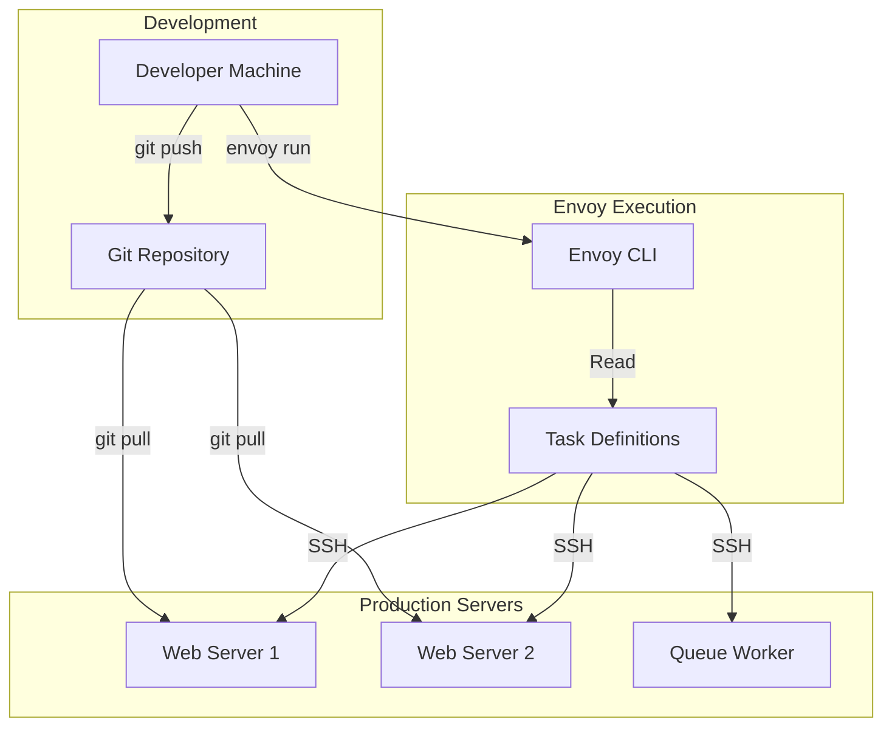
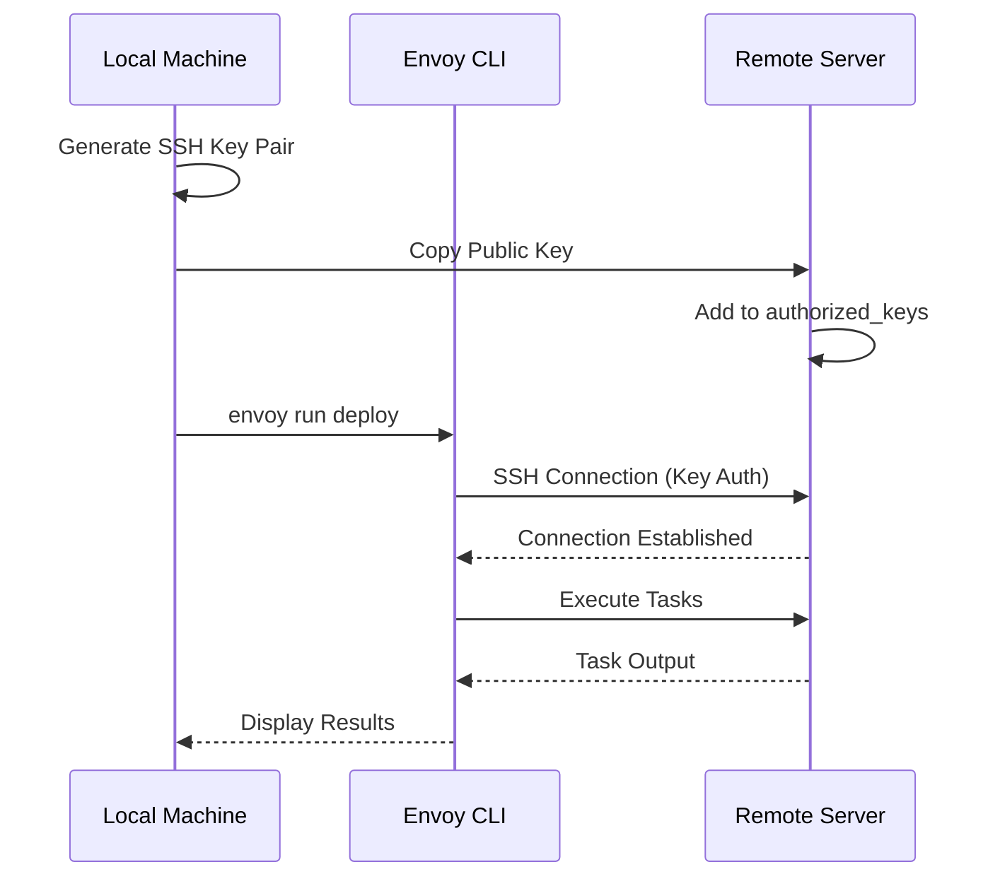
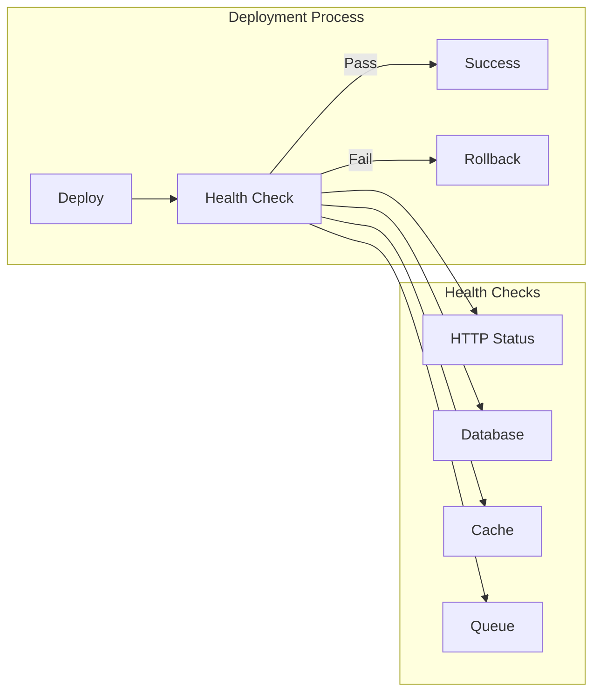
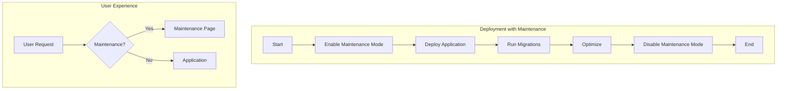
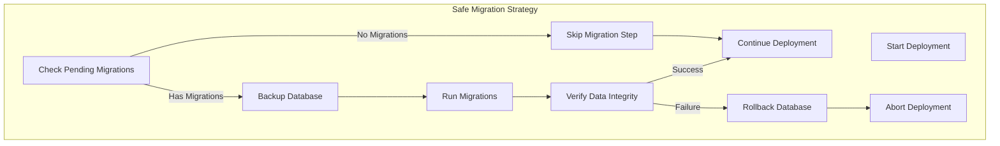
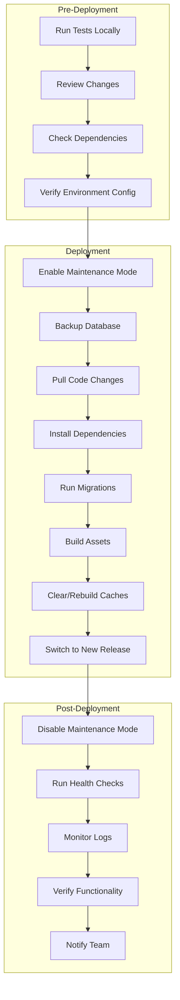

# How to Deploy Laravel Applications with Envoy

Author: [nawazdhandala](https://www.github.com/nawazdhandala)

Tags: PHP, Laravel, Envoy, Deployment, DevOps, SSH

Description: A comprehensive guide to deploying Laravel applications using Laravel Envoy. Learn SSH-based deployments, zero-downtime strategies, and automation workflows for reliable production releases.

---

> Laravel Envoy provides a clean, minimal syntax for defining common tasks you run on remote servers. Using Blade style syntax, you can easily set up tasks for deployment, Artisan commands, and more. Envoy is the simplest way to automate Laravel deployments without complex CI/CD pipelines.

Deploying Laravel applications reliably requires a consistent, repeatable process. While tools like GitHub Actions, GitLab CI, and Jenkins offer powerful CI/CD capabilities, sometimes you need a simpler solution that runs directly from your local machine or a deployment server. Laravel Envoy fills this gap perfectly, providing SSH-based task automation with a familiar Blade-like syntax.

---

## Understanding Envoy Deployment Architecture

Before diving into implementation, let's understand how Envoy fits into a deployment workflow:



### Why Choose Envoy?

| Feature | Envoy | Traditional Scripts | Full CI/CD |
|---------|-------|---------------------|------------|
| Setup Complexity | Low | Low | High |
| Learning Curve | Minimal | Minimal | Steep |
| Parallel Execution | Yes | Manual | Yes |
| Laravel Integration | Native | None | Varies |
| Local Execution | Yes | Yes | No |
| Zero-Downtime | Supported | Manual | Supported |

---

## Installing Laravel Envoy

### Global Installation

Install Envoy globally via Composer:

```bash
# Install Envoy globally
composer global require laravel/envoy

# Ensure global Composer bin is in PATH
# Add to ~/.bashrc or ~/.zshrc:
export PATH="$HOME/.composer/vendor/bin:$PATH"

# Verify installation
envoy --version
```

### Project-Level Installation

Alternatively, install Envoy as a dev dependency:

```bash
# Install in your Laravel project
composer require laravel/envoy --dev

# Run via vendor bin
./vendor/bin/envoy --version
```

---

## Creating Your First Envoy File

Create an `Envoy.blade.php` file in your Laravel project root:

```php
{{-- Envoy.blade.php --}}
{{-- Laravel Envoy deployment configuration --}}
{{-- This file defines all deployment tasks and server connections --}}

{{-- Define server connections --}}
{{-- @servers directive specifies SSH hosts Envoy can connect to --}}
@servers(['web' => 'deploy@your-server.com'])

{{-- Define reusable variables --}}
{{-- These can be overridden via command line: envoy run deploy --branch=develop --}}
@setup
    // Application name for display purposes
    $application = 'my-laravel-app';
    
    // Git repository URL
    $repository = 'git@github.com:yourname/your-repo.git';
    
    // Base deployment path on the server
    $baseDir = '/var/www/html';
    
    // Full application path
    $appDir = $baseDir . '/' . $application;
    
    // Releases directory for zero-downtime deployments
    $releasesDir = $appDir . '/releases';
    
    // Shared directory for persistent files
    $sharedDir = $appDir . '/shared';
    
    // Current release symlink
    $currentDir = $appDir . '/current';
    
    // Create unique release directory name
    $release = date('YmdHis');
    
    // New release path
    $newReleaseDir = $releasesDir . '/' . $release;
    
    // Branch to deploy (can be overridden)
    $branch = isset($branch) ? $branch : 'main';
    
    // Number of releases to keep
    $keepReleases = 5;
@endsetup

{{-- Simple deployment task --}}
{{-- Usage: envoy run deploy --}}
@task('deploy', ['on' => 'web'])
    echo "Starting deployment of {{ $application }}..."
    echo "Branch: {{ $branch }}"
    echo "Release: {{ $release }}"
    
    # Navigate to application directory
    cd {{ $appDir }}
    
    # Pull latest changes
    git pull origin {{ $branch }}
    
    # Install Composer dependencies
    composer install --no-dev --optimize-autoloader
    
    # Run database migrations
    php artisan migrate --force
    
    # Clear and rebuild caches
    php artisan config:cache
    php artisan route:cache
    php artisan view:cache
    
    # Restart queue workers
    php artisan queue:restart
    
    echo "Deployment completed successfully!"
@endtask
```

### Running Your First Deployment

```bash
# Run the deploy task
envoy run deploy

# Deploy a specific branch
envoy run deploy --branch=develop

# Run with verbose output
envoy run deploy -v
```

---

## Server Configuration

### Setting Up SSH Keys



Generate and configure SSH keys:

```bash
# Generate SSH key pair (if not exists)
ssh-keygen -t ed25519 -C "deploy@your-domain.com"

# Copy public key to server
ssh-copy-id deploy@your-server.com

# Test SSH connection
ssh deploy@your-server.com "echo 'Connection successful'"
```

### Server User Configuration

Create a dedicated deployment user on your server:

```bash
# On the server, create deploy user
sudo adduser deploy --disabled-password

# Add to www-data group for web server access
sudo usermod -aG www-data deploy

# Set up SSH directory
sudo mkdir -p /home/deploy/.ssh
sudo chmod 700 /home/deploy/.ssh

# Add your public key
sudo nano /home/deploy/.ssh/authorized_keys
# Paste your public key and save

# Set correct permissions
sudo chmod 600 /home/deploy/.ssh/authorized_keys
sudo chown -R deploy:deploy /home/deploy/.ssh
```

---

## Multiple Server Configuration

### Defining Multiple Servers

```php
{{-- Envoy.blade.php --}}
{{-- Multi-server deployment configuration --}}

{{-- Define all servers in your infrastructure --}}
@servers([
    'web1' => 'deploy@web1.your-domain.com',
    'web2' => 'deploy@web2.your-domain.com',
    'worker' => 'deploy@worker.your-domain.com',
    'staging' => 'deploy@staging.your-domain.com',
])

@setup
    $application = 'my-laravel-app';
    $repository = 'git@github.com:yourname/your-repo.git';
    $branch = $branch ?? 'main';
    
    // Environment-specific configuration
    $environments = [
        'production' => [
            'servers' => ['web1', 'web2'],
            'branch' => 'main',
            'path' => '/var/www/production',
        ],
        'staging' => [
            'servers' => ['staging'],
            'branch' => 'develop',
            'path' => '/var/www/staging',
        ],
    ];
    
    // Get current environment
    $env = $env ?? 'production';
    $config = $environments[$env];
@endsetup

{{-- Deploy to web servers --}}
@task('deploy:web', ['on' => ['web1', 'web2'], 'parallel' => true])
    echo "Deploying to web server..."
    cd {{ $config['path'] }}
    
    git fetch origin
    git checkout {{ $config['branch'] }}
    git pull origin {{ $config['branch'] }}
    
    composer install --no-dev --optimize-autoloader --no-interaction
    
    php artisan migrate --force
    php artisan config:cache
    php artisan route:cache
    php artisan view:cache
    
    # Reload PHP-FPM gracefully
    sudo systemctl reload php8.2-fpm
    
    echo "Web server deployment complete!"
@endtask

{{-- Deploy queue workers --}}
@task('deploy:worker', ['on' => 'worker'])
    echo "Deploying queue worker..."
    cd /var/www/worker
    
    git fetch origin
    git checkout {{ $branch }}
    git pull origin {{ $branch }}
    
    composer install --no-dev --optimize-autoloader --no-interaction
    
    php artisan migrate --force
    php artisan config:cache
    
    # Restart queue workers via Supervisor
    sudo supervisorctl restart laravel-worker:*
    
    echo "Worker deployment complete!"
@endtask

{{-- Deploy to staging --}}
@task('deploy:staging', ['on' => 'staging'])
    echo "Deploying to staging environment..."
    cd /var/www/staging
    
    git fetch origin
    git checkout develop
    git pull origin develop
    
    # Install including dev dependencies for staging
    composer install --optimize-autoloader --no-interaction
    
    php artisan migrate --force
    php artisan config:clear
    php artisan cache:clear
    
    echo "Staging deployment complete!"
@endtask
```

### Parallel Execution

```php
{{-- Envoy.blade.php --}}
{{-- Parallel deployment across multiple servers --}}

{{-- Deploy to all web servers simultaneously --}}
{{-- The 'parallel' option executes on all servers at once --}}
@task('deploy:parallel', ['on' => ['web1', 'web2'], 'parallel' => true])
    echo "Deploying on $(hostname)..."
    
    cd /var/www/html/my-app
    
    # Pull latest code
    git pull origin main
    
    # Install dependencies
    composer install --no-dev --optimize-autoloader
    
    # Run migrations (only on first server to avoid conflicts)
    if [ "$(hostname)" = "web1" ]; then
        php artisan migrate --force
    fi
    
    # Clear caches
    php artisan config:cache
    php artisan route:cache
    php artisan view:cache
    
    # Reload PHP-FPM
    sudo systemctl reload php8.2-fpm
    
    echo "Deployment complete on $(hostname)!"
@endtask
```

---

## Zero-Downtime Deployment Strategy

```mermaid
flowchart TB
    subgraph Directory Structure
        App[/var/www/app]
        Current[current -> releases/20240115120000]
        Releases[releases/]
        Shared[shared/]
    end
    
    subgraph Releases Directory
        R1[20240114100000]
        R2[20240115100000]
        R3[20240115120000 - Active]
    end
    
    subgraph Shared Directory
        Storage[storage/]
        Env[.env]
        Uploads[public/uploads/]
    end
    
    App --> Current
    App --> Releases
    App --> Shared
    Releases --> R1
    Releases --> R2
    Releases --> R3
    
    R3 --> |symlink| Storage
    R3 --> |symlink| Env
```

### Zero-Downtime Deployment Script

```php
{{-- Envoy.blade.php --}}
{{-- Zero-downtime deployment with atomic symlink switching --}}

@servers(['web' => 'deploy@your-server.com'])

@setup
    $application = 'my-laravel-app';
    $repository = 'git@github.com:yourname/your-repo.git';
    $branch = $branch ?? 'main';
    
    // Deployment paths
    $baseDir = '/var/www/html';
    $appDir = $baseDir . '/' . $application;
    $releasesDir = $appDir . '/releases';
    $sharedDir = $appDir . '/shared';
    $currentDir = $appDir . '/current';
    
    // Generate unique release name
    $release = date('YmdHis');
    $newReleaseDir = $releasesDir . '/' . $release;
    
    // Retention policy
    $keepReleases = 5;
    
    // Shared files and directories
    $sharedFiles = [
        '.env',
    ];
    
    $sharedDirs = [
        'storage',
        'public/uploads',
    ];
@endsetup

{{-- Initialize directory structure (run once) --}}
@task('deploy:init', ['on' => 'web'])
    echo "Initializing deployment structure..."
    
    # Create base directories
    mkdir -p {{ $releasesDir }}
    mkdir -p {{ $sharedDir }}
    mkdir -p {{ $sharedDir }}/storage/app/public
    mkdir -p {{ $sharedDir }}/storage/framework/cache
    mkdir -p {{ $sharedDir }}/storage/framework/sessions
    mkdir -p {{ $sharedDir }}/storage/framework/views
    mkdir -p {{ $sharedDir }}/storage/logs
    mkdir -p {{ $sharedDir }}/public/uploads
    
    # Set permissions
    chmod -R 775 {{ $sharedDir }}/storage
    
    echo "Directory structure initialized!"
    echo "Remember to create {{ $sharedDir }}/.env with your configuration"
@endtask

{{-- Clone repository for new release --}}
@task('deploy:clone', ['on' => 'web'])
    echo "Cloning repository into new release directory..."
    echo "Release: {{ $release }}"
    
    # Clone the repository
    git clone --depth 1 --branch {{ $branch }} {{ $repository }} {{ $newReleaseDir }}
    
    # Remove .git directory to save space
    rm -rf {{ $newReleaseDir }}/.git
    
    echo "Repository cloned successfully!"
@endtask

{{-- Create symlinks to shared resources --}}
@task('deploy:shared', ['on' => 'web'])
    echo "Linking shared files and directories..."
    
    # Link shared directories
    @foreach($sharedDirs as $dir)
        # Remove existing directory if it exists
        rm -rf {{ $newReleaseDir }}/{{ $dir }}
        
        # Create parent directory if needed
        mkdir -p $(dirname {{ $newReleaseDir }}/{{ $dir }})
        
        # Create symlink
        ln -nfs {{ $sharedDir }}/{{ $dir }} {{ $newReleaseDir }}/{{ $dir }}
        
        echo "Linked: {{ $dir }}"
    @endforeach
    
    # Link shared files
    @foreach($sharedFiles as $file)
        # Remove existing file if it exists
        rm -f {{ $newReleaseDir }}/{{ $file }}
        
        # Create symlink
        ln -nfs {{ $sharedDir }}/{{ $file }} {{ $newReleaseDir }}/{{ $file }}
        
        echo "Linked: {{ $file }}"
    @endforeach
    
    echo "Shared resources linked!"
@endtask

{{-- Install Composer dependencies --}}
@task('deploy:composer', ['on' => 'web'])
    echo "Installing Composer dependencies..."
    
    cd {{ $newReleaseDir }}
    
    # Install dependencies without dev packages
    composer install \
        --no-dev \
        --no-interaction \
        --prefer-dist \
        --optimize-autoloader
    
    echo "Composer dependencies installed!"
@endtask

{{-- Run database migrations --}}
@task('deploy:migrate', ['on' => 'web'])
    echo "Running database migrations..."
    
    cd {{ $newReleaseDir }}
    
    # Run migrations
    php artisan migrate --force
    
    echo "Migrations completed!"
@endtask

{{-- Build frontend assets --}}
@task('deploy:assets', ['on' => 'web'])
    echo "Building frontend assets..."
    
    cd {{ $newReleaseDir }}
    
    # Install npm dependencies and build
    npm ci --silent
    npm run build
    
    # Remove node_modules to save space
    rm -rf node_modules
    
    echo "Frontend assets built!"
@endtask

{{-- Optimize Laravel application --}}
@task('deploy:optimize', ['on' => 'web'])
    echo "Optimizing application..."
    
    cd {{ $newReleaseDir }}
    
    # Cache configuration
    php artisan config:cache
    
    # Cache routes
    php artisan route:cache
    
    # Cache views
    php artisan view:cache
    
    # Cache events (Laravel 11+)
    php artisan event:cache 2>/dev/null || true
    
    echo "Application optimized!"
@endtask

{{-- Switch symlink to new release (atomic operation) --}}
@task('deploy:symlink', ['on' => 'web'])
    echo "Activating new release..."
    
    # Create symlink atomically using ln with -n and -f flags
    # This is the key to zero-downtime deployment
    ln -nfs {{ $newReleaseDir }} {{ $currentDir }}
    
    echo "New release activated!"
    echo "Current release: {{ $release }}"
@endtask

{{-- Clean up old releases --}}
@task('deploy:cleanup', ['on' => 'web'])
    echo "Cleaning up old releases..."
    
    cd {{ $releasesDir }}
    
    # Keep only the last N releases
    # List directories, sort by name (date), remove header, skip last N, delete rest
    ls -dt */ | tail -n +{{ $keepReleases + 1 }} | xargs -r rm -rf
    
    echo "Cleanup complete! Keeping last {{ $keepReleases }} releases."
@endtask

{{-- Reload services --}}
@task('deploy:reload', ['on' => 'web'])
    echo "Reloading services..."
    
    # Reload PHP-FPM gracefully
    sudo systemctl reload php8.2-fpm
    
    # Restart queue workers
    php {{ $currentDir }}/artisan queue:restart
    
    # Clear OPcache
    sudo cachetool opcache:reset --fcgi=/var/run/php/php8.2-fpm.sock 2>/dev/null || true
    
    echo "Services reloaded!"
@endtask

{{-- Rollback to previous release --}}
@task('deploy:rollback', ['on' => 'web'])
    echo "Rolling back to previous release..."
    
    cd {{ $releasesDir }}
    
    # Get the previous release
    PREVIOUS=$(ls -dt */ | sed -n '2p' | tr -d '/')
    
    if [ -z "$PREVIOUS" ]; then
        echo "No previous release found!"
        exit 1
    fi
    
    echo "Rolling back to: $PREVIOUS"
    
    # Switch symlink to previous release
    ln -nfs {{ $releasesDir }}/$PREVIOUS {{ $currentDir }}
    
    # Reload services
    sudo systemctl reload php8.2-fpm
    php {{ $currentDir }}/artisan queue:restart
    
    echo "Rollback complete!"
@endtask

{{-- Full deployment story --}}
@story('deploy')
    deploy:clone
    deploy:shared
    deploy:composer
    deploy:migrate
    deploy:optimize
    deploy:symlink
    deploy:cleanup
    deploy:reload
@endstory

{{-- Deployment with frontend build --}}
@story('deploy:full')
    deploy:clone
    deploy:shared
    deploy:composer
    deploy:assets
    deploy:migrate
    deploy:optimize
    deploy:symlink
    deploy:cleanup
    deploy:reload
@endstory
```

---

## Health Checks and Monitoring



### Health Check Task

```php
{{-- Envoy.blade.php --}}
{{-- Health check and verification tasks --}}

@servers(['web' => 'deploy@your-server.com'])

@setup
    $appUrl = 'https://your-domain.com';
    $healthEndpoint = '/api/health';
    $currentDir = '/var/www/html/my-app/current';
@endsetup

{{-- Verify deployment health --}}
@task('deploy:health', ['on' => 'web'])
    echo "Running health checks..."
    
    cd {{ $currentDir }}
    
    # Check application HTTP response
    echo "Checking HTTP endpoint..."
    HTTP_STATUS=$(curl -s -o /dev/null -w "%{http_code}" {{ $appUrl }}{{ $healthEndpoint }})
    
    if [ "$HTTP_STATUS" != "200" ]; then
        echo "ERROR: Health check failed! HTTP Status: $HTTP_STATUS"
        exit 1
    fi
    echo "HTTP check passed (Status: $HTTP_STATUS)"
    
    # Check database connection
    echo "Checking database connection..."
    php artisan db:monitor --databases=mysql || {
        echo "ERROR: Database connection failed!"
        exit 1
    }
    echo "Database check passed"
    
    # Check cache connection
    echo "Checking cache connection..."
    php artisan cache:clear >/dev/null 2>&1 || {
        echo "ERROR: Cache connection failed!"
        exit 1
    }
    echo "Cache check passed"
    
    # Check queue connection
    echo "Checking queue connection..."
    php artisan queue:monitor redis:default --max=1000 || {
        echo "WARNING: Queue has high job count"
    }
    echo "Queue check passed"
    
    echo "All health checks passed!"
@endtask

{{-- Safe deployment with automatic rollback --}}
@task('deploy:safe', ['on' => 'web'])
    echo "Starting safe deployment with health checks..."
    
    # Store current release for potential rollback
    CURRENT_RELEASE=$(readlink {{ $currentDir }} | xargs basename)
    echo "Current release before deployment: $CURRENT_RELEASE"
    
    # Deploy
    envoy run deploy
    
    # Wait for services to stabilize
    echo "Waiting for services to stabilize..."
    sleep 5
    
    # Run health checks
    if ! envoy run deploy:health; then
        echo "Health checks failed! Rolling back..."
        envoy run deploy:rollback
        exit 1
    fi
    
    echo "Deployment completed successfully!"
@endtask
```

### Health Check Endpoint in Laravel

Create a health check endpoint in your Laravel application:

```php
<?php

// routes/api.php
// Health check endpoint for deployment verification

use Illuminate\Support\Facades\Route;
use Illuminate\Support\Facades\DB;
use Illuminate\Support\Facades\Cache;
use Illuminate\Support\Facades\Queue;

Route::get('/health', function () {
    // Initialize status tracking
    $status = 'healthy';
    $checks = [];
    
    // Check database connectivity
    try {
        // Execute a simple query to verify connection
        DB::connection()->getPdo();
        DB::select('SELECT 1');
        $checks['database'] = [
            'status' => 'ok',
            'connection' => config('database.default'),
        ];
    } catch (\Exception $e) {
        $status = 'unhealthy';
        $checks['database'] = [
            'status' => 'error',
            'message' => 'Database connection failed',
        ];
    }
    
    // Check cache connectivity
    try {
        // Write and read test value
        $testKey = 'health_check_' . time();
        Cache::put($testKey, 'test', 10);
        $value = Cache::get($testKey);
        Cache::forget($testKey);
        
        if ($value === 'test') {
            $checks['cache'] = [
                'status' => 'ok',
                'driver' => config('cache.default'),
            ];
        } else {
            throw new \Exception('Cache read/write mismatch');
        }
    } catch (\Exception $e) {
        $status = 'unhealthy';
        $checks['cache'] = [
            'status' => 'error',
            'message' => 'Cache connection failed',
        ];
    }
    
    // Check storage is writable
    try {
        $testFile = storage_path('app/health_check_test');
        file_put_contents($testFile, 'test');
        unlink($testFile);
        $checks['storage'] = ['status' => 'ok'];
    } catch (\Exception $e) {
        $status = 'unhealthy';
        $checks['storage'] = [
            'status' => 'error',
            'message' => 'Storage not writable',
        ];
    }
    
    // Application info
    $checks['app'] = [
        'status' => 'ok',
        'version' => config('app.version', '1.0.0'),
        'environment' => config('app.env'),
        'debug' => config('app.debug'),
    ];
    
    // Build response
    $response = [
        'status' => $status,
        'timestamp' => now()->toIso8601String(),
        'checks' => $checks,
    ];
    
    // Return appropriate status code
    $httpStatus = $status === 'healthy' ? 200 : 503;
    
    return response()->json($response, $httpStatus);
});
```

---

## Hooks and Notifications

### Slack Notifications

```php
{{-- Envoy.blade.php --}}
{{-- Deployment with Slack notifications --}}

@servers(['web' => 'deploy@your-server.com'])

@setup
    $application = 'My Laravel App';
    $slackWebhook = 'https://hooks.slack.com/services/YOUR/WEBHOOK/URL';
    $branch = $branch ?? 'main';
    $deployer = trim(shell_exec('git config user.name'));
@endsetup

{{-- Notify Slack about deployment start --}}
@task('notify:start', ['on' => 'web'])
    curl -s -X POST -H 'Content-type: application/json' \
        --data '{
            "blocks": [
                {
                    "type": "section",
                    "text": {
                        "type": "mrkdwn",
                        "text": ":rocket: *Deployment Started*\n*Application:* {{ $application }}\n*Branch:* {{ $branch }}\n*Deployer:* {{ $deployer }}"
                    }
                }
            ]
        }' \
        {{ $slackWebhook }}
@endtask

{{-- Notify Slack about deployment success --}}
@task('notify:success', ['on' => 'web'])
    curl -s -X POST -H 'Content-type: application/json' \
        --data '{
            "blocks": [
                {
                    "type": "section",
                    "text": {
                        "type": "mrkdwn",
                        "text": ":white_check_mark: *Deployment Successful*\n*Application:* {{ $application }}\n*Branch:* {{ $branch }}\n*Deployer:* {{ $deployer }}"
                    }
                }
            ]
        }' \
        {{ $slackWebhook }}
@endtask

{{-- Notify Slack about deployment failure --}}
@task('notify:failure', ['on' => 'web'])
    curl -s -X POST -H 'Content-type: application/json' \
        --data '{
            "blocks": [
                {
                    "type": "section",
                    "text": {
                        "type": "mrkdwn",
                        "text": ":x: *Deployment Failed*\n*Application:* {{ $application }}\n*Branch:* {{ $branch }}\n*Deployer:* {{ $deployer }}\n\n_Please check logs and consider rollback_"
                    }
                }
            ]
        }' \
        {{ $slackWebhook }}
@endtask

{{-- Deployment story with notifications --}}
@story('deploy:notify')
    notify:start
    deploy:clone
    deploy:shared
    deploy:composer
    deploy:migrate
    deploy:optimize
    deploy:symlink
    deploy:cleanup
    deploy:reload
    deploy:health
    notify:success
@endstory

{{-- Handle errors with @error directive --}}
@error
    # This runs if any task fails
    envoy run notify:failure
@enderror

{{-- Handle completion with @finished directive --}}
@finished
    # This runs after all tasks complete successfully
    echo "Deployment workflow finished at $(date)"
@endfinished
```

---

## Maintenance Mode Handling



### Maintenance Mode Tasks

```php
{{-- Envoy.blade.php --}}
{{-- Maintenance mode management during deployments --}}

@servers(['web' => 'deploy@your-server.com'])

@setup
    $currentDir = '/var/www/html/my-app/current';
    $maintenanceSecret = 'my-secret-token-12345';
@endsetup

{{-- Enable maintenance mode --}}
@task('maintenance:enable', ['on' => 'web'])
    echo "Enabling maintenance mode..."
    
    cd {{ $currentDir }}
    
    # Enable maintenance with secret bypass
    # Allows authorized users to access the site during maintenance
    php artisan down \
        --secret="{{ $maintenanceSecret }}" \
        --retry=60 \
        --render="errors::503"
    
    echo "Maintenance mode enabled"
    echo "Bypass URL: {your-domain}/{{ $maintenanceSecret }}"
@endtask

{{-- Disable maintenance mode --}}
@task('maintenance:disable', ['on' => 'web'])
    echo "Disabling maintenance mode..."
    
    cd {{ $currentDir }}
    
    php artisan up
    
    echo "Maintenance mode disabled - Site is live"
@endtask

{{-- Check maintenance status --}}
@task('maintenance:status', ['on' => 'web'])
    cd {{ $currentDir }}
    
    if [ -f "storage/framework/down" ]; then
        echo "Maintenance mode: ENABLED"
        cat storage/framework/down | python3 -m json.tool 2>/dev/null || cat storage/framework/down
    else
        echo "Maintenance mode: DISABLED"
    fi
@endtask

{{-- Deployment with maintenance window --}}
@story('deploy:maintenance')
    maintenance:enable
    deploy:clone
    deploy:shared
    deploy:composer
    deploy:migrate
    deploy:optimize
    deploy:symlink
    deploy:cleanup
    deploy:reload
    maintenance:disable
@endstory
```

---

## Environment-Specific Deployments

### Multi-Environment Configuration

```php
{{-- Envoy.blade.php --}}
{{-- Multi-environment deployment configuration --}}

@servers([
    'production-1' => 'deploy@prod1.your-domain.com',
    'production-2' => 'deploy@prod2.your-domain.com',
    'staging' => 'deploy@staging.your-domain.com',
    'development' => 'deploy@dev.your-domain.com',
])

@setup
    // Environment configuration map
    $environments = [
        'production' => [
            'servers' => ['production-1', 'production-2'],
            'branch' => 'main',
            'path' => '/var/www/production',
            'php' => 'php8.2',
            'migrate' => true,
            'npm_build' => true,
            'notify' => true,
        ],
        'staging' => [
            'servers' => ['staging'],
            'branch' => 'develop',
            'path' => '/var/www/staging',
            'php' => 'php8.2',
            'migrate' => true,
            'npm_build' => true,
            'notify' => false,
        ],
        'development' => [
            'servers' => ['development'],
            'branch' => 'feature',
            'path' => '/var/www/development',
            'php' => 'php8.2',
            'migrate' => true,
            'npm_build' => false,
            'notify' => false,
        ],
    ];
    
    // Get environment from command line or default to staging
    $env = $env ?? 'staging';
    
    if (!isset($environments[$env])) {
        throw new Exception("Unknown environment: $env");
    }
    
    $config = $environments[$env];
    $servers = $config['servers'];
    $branch = $branch ?? $config['branch'];
    $appPath = $config['path'];
    $phpVersion = $config['php'];
    $shouldMigrate = $config['migrate'];
    $shouldBuildAssets = $config['npm_build'];
    $shouldNotify = $config['notify'];
    
    // Release management
    $release = date('YmdHis');
    $releasesDir = $appPath . '/releases';
    $sharedDir = $appPath . '/shared';
    $currentDir = $appPath . '/current';
    $newReleaseDir = $releasesDir . '/' . $release;
@endsetup

{{-- Production deployment --}}
@task('deploy:production', ['on' => ['production-1', 'production-2'], 'parallel' => true])
    echo "Deploying to PRODUCTION on $(hostname)..."
    echo "Branch: {{ $branch }}"
    echo "Release: {{ $release }}"
    
    # Clone new release
    git clone --depth 1 --branch {{ $branch }} \
        git@github.com:yourname/repo.git {{ $newReleaseDir }}
    
    cd {{ $newReleaseDir }}
    
    # Link shared resources
    rm -rf storage && ln -nfs {{ $sharedDir }}/storage storage
    ln -nfs {{ $sharedDir }}/.env .env
    
    # Install dependencies
    composer install --no-dev --optimize-autoloader --no-interaction
    
    # Build assets
    npm ci && npm run build && rm -rf node_modules
    
    # Optimize
    php artisan config:cache
    php artisan route:cache
    php artisan view:cache
    
    # Run migrations only on first server
    if [ "$(hostname)" = "prod1" ]; then
        php artisan migrate --force
    fi
    
    # Switch to new release
    ln -nfs {{ $newReleaseDir }} {{ $currentDir }}
    
    # Reload services
    sudo systemctl reload php8.2-fpm
    
    echo "Production deployment complete on $(hostname)!"
@endtask

{{-- Staging deployment --}}
@task('deploy:staging', ['on' => 'staging'])
    echo "Deploying to STAGING..."
    echo "Branch: {{ $branch }}"
    
    cd {{ $appPath }}
    
    # Direct pull for staging (simpler approach)
    git fetch origin
    git checkout {{ $branch }}
    git pull origin {{ $branch }}
    
    # Install all dependencies including dev
    composer install --optimize-autoloader --no-interaction
    
    # Build assets
    npm ci && npm run build
    
    # Clear caches (no caching on staging for easier debugging)
    php artisan config:clear
    php artisan cache:clear
    php artisan view:clear
    
    # Run migrations
    php artisan migrate --force
    
    # Seed test data if needed
    # php artisan db:seed --class=StagingSeeder --force
    
    # Reload services
    sudo systemctl reload php8.2-fpm
    
    echo "Staging deployment complete!"
@endtask

{{-- Development deployment --}}
@task('deploy:dev', ['on' => 'development'])
    echo "Deploying to DEVELOPMENT..."
    
    cd {{ $appPath }}
    
    git fetch origin
    git checkout {{ $branch }}
    git pull origin {{ $branch }}
    
    composer install --no-interaction
    
    php artisan migrate --force
    php artisan config:clear
    php artisan cache:clear
    
    sudo systemctl reload php8.2-fpm
    
    echo "Development deployment complete!"
@endtask
```

### Environment-Specific Deployment Commands

```bash
# Deploy to staging (default)
envoy run deploy:staging

# Deploy to production
envoy run deploy:production

# Deploy specific branch to staging
envoy run deploy:staging --branch=feature/new-feature

# Deploy to development
envoy run deploy:dev --branch=feature/experimental
```

---

## Database Migration Strategies



### Migration Tasks

```php
{{-- Envoy.blade.php --}}
{{-- Safe database migration handling --}}

@servers(['web' => 'deploy@your-server.com'])

@setup
    $currentDir = '/var/www/html/my-app/current';
    $newReleaseDir = '/var/www/html/my-app/releases/' . date('YmdHis');
    $backupDir = '/var/backups/mysql';
    $database = 'my_app_production';
@endsetup

{{-- Check for pending migrations --}}
@task('migrate:check', ['on' => 'web'])
    echo "Checking for pending migrations..."
    
    cd {{ $newReleaseDir }}
    
    # Get migration status
    PENDING=$(php artisan migrate:status --pending 2>/dev/null | grep -c "Pending" || echo "0")
    
    if [ "$PENDING" -gt "0" ]; then
        echo "Found $PENDING pending migration(s)"
        php artisan migrate:status --pending
        exit 0
    else
        echo "No pending migrations"
        exit 0
    fi
@endtask

{{-- Backup database before migration --}}
@task('migrate:backup', ['on' => 'web'])
    echo "Creating database backup..."
    
    # Create backup directory
    mkdir -p {{ $backupDir }}
    
    # Generate backup filename with timestamp
    BACKUP_FILE="{{ $backupDir }}/{{ $database }}_$(date +%Y%m%d_%H%M%S).sql.gz"
    
    # Create compressed backup
    mysqldump \
        --single-transaction \
        --routines \
        --triggers \
        --quick \
        {{ $database }} | gzip > $BACKUP_FILE
    
    # Verify backup was created
    if [ -f "$BACKUP_FILE" ]; then
        BACKUP_SIZE=$(ls -lh "$BACKUP_FILE" | awk '{print $5}')
        echo "Backup created successfully: $BACKUP_FILE ($BACKUP_SIZE)"
    else
        echo "ERROR: Backup creation failed!"
        exit 1
    fi
    
    # Keep only last 10 backups
    cd {{ $backupDir }}
    ls -t *.sql.gz | tail -n +11 | xargs -r rm
    
    echo "Database backup complete!"
@endtask

{{-- Run migrations with transaction support --}}
@task('migrate:run', ['on' => 'web'])
    echo "Running database migrations..."
    
    cd {{ $newReleaseDir }}
    
    # Run migrations with force flag for production
    php artisan migrate --force
    
    # Check migration status
    if [ $? -eq 0 ]; then
        echo "Migrations completed successfully!"
    else
        echo "ERROR: Migration failed!"
        exit 1
    fi
@endtask

{{-- Rollback last migration batch --}}
@task('migrate:rollback', ['on' => 'web'])
    echo "Rolling back last migration batch..."
    
    cd {{ $currentDir }}
    
    php artisan migrate:rollback --force
    
    echo "Rollback complete!"
@endtask

{{-- Restore database from backup --}}
@task('migrate:restore', ['on' => 'web'])
    echo "Restoring database from latest backup..."
    
    # Find latest backup
    LATEST_BACKUP=$(ls -t {{ $backupDir }}/*.sql.gz | head -1)
    
    if [ -z "$LATEST_BACKUP" ]; then
        echo "ERROR: No backup found!"
        exit 1
    fi
    
    echo "Restoring from: $LATEST_BACKUP"
    
    # Restore backup
    gunzip < "$LATEST_BACKUP" | mysql {{ $database }}
    
    echo "Database restored successfully!"
@endtask

{{-- Safe migration workflow --}}
@story('migrate:safe')
    migrate:check
    migrate:backup
    migrate:run
@endstory
```

---

## Queue Worker Management

### Queue Deployment Tasks

```php
{{-- Envoy.blade.php --}}
{{-- Queue worker management during deployments --}}

@servers([
    'web' => 'deploy@web.your-domain.com',
    'worker' => 'deploy@worker.your-domain.com',
])

@setup
    $currentDir = '/var/www/html/my-app/current';
    $supervisorProgram = 'laravel-worker';
@endsetup

{{-- Gracefully restart queue workers --}}
@task('queue:restart', ['on' => 'worker'])
    echo "Restarting queue workers..."
    
    # Signal workers to finish current job and restart
    php {{ $currentDir }}/artisan queue:restart
    
    # Wait for workers to pick up restart signal
    sleep 5
    
    echo "Queue restart signal sent!"
@endtask

{{-- Stop all queue workers --}}
@task('queue:stop', ['on' => 'worker'])
    echo "Stopping queue workers..."
    
    # Stop Supervisor programs
    sudo supervisorctl stop {{ $supervisorProgram }}:*
    
    # Wait for workers to finish current jobs
    sleep 10
    
    echo "Queue workers stopped!"
@endtask

{{-- Start queue workers --}}
@task('queue:start', ['on' => 'worker'])
    echo "Starting queue workers..."
    
    sudo supervisorctl start {{ $supervisorProgram }}:*
    
    # Verify workers are running
    sleep 3
    sudo supervisorctl status {{ $supervisorProgram }}:*
    
    echo "Queue workers started!"
@endtask

{{-- Check queue status --}}
@task('queue:status', ['on' => 'worker'])
    echo "Queue worker status:"
    sudo supervisorctl status {{ $supervisorProgram }}:*
    
    echo ""
    echo "Queue stats:"
    php {{ $currentDir }}/artisan queue:monitor redis:default,redis:high,redis:low
@endtask

{{-- Clear all queued jobs --}}
@task('queue:clear', ['on' => 'worker'])
    echo "Clearing queued jobs..."
    
    php {{ $currentDir }}/artisan queue:clear redis
    
    echo "Queue cleared!"
@endtask

{{-- Retry failed jobs --}}
@task('queue:retry', ['on' => 'worker'])
    echo "Retrying failed jobs..."
    
    php {{ $currentDir }}/artisan queue:retry all
    
    echo "Failed jobs queued for retry!"
@endtask

{{-- Queue-safe deployment workflow --}}
@story('deploy:queue-safe')
    queue:stop
    deploy:clone
    deploy:shared
    deploy:composer
    deploy:migrate
    deploy:optimize
    deploy:symlink
    deploy:cleanup
    queue:start
    deploy:health
@endstory
```

### Supervisor Configuration

```ini
; /etc/supervisor/conf.d/laravel-worker.conf
; Supervisor configuration for Laravel queue workers

[program:laravel-worker]
process_name=%(program_name)s_%(process_num)02d
command=php /var/www/html/my-app/current/artisan queue:work redis --sleep=3 --tries=3 --max-time=3600
autostart=true
autorestart=true
stopasgroup=true
killasgroup=true
user=www-data
numprocs=4
redirect_stderr=true
stdout_logfile=/var/log/supervisor/laravel-worker.log
stopwaitsecs=3600
```

---

## Scheduled Task Management

### Scheduler Tasks

```php
{{-- Envoy.blade.php --}}
{{-- Cron and scheduler management --}}

@servers(['web' => 'deploy@your-server.com'])

@setup
    $currentDir = '/var/www/html/my-app/current';
    $cronUser = 'www-data';
@endsetup

{{-- Install Laravel scheduler cron --}}
@task('cron:install', ['on' => 'web'])
    echo "Installing Laravel scheduler cron job..."
    
    # Create cron entry
    CRON_LINE="* * * * * cd {{ $currentDir }} && php artisan schedule:run >> /dev/null 2>&1"
    
    # Check if cron already exists
    if sudo crontab -u {{ $cronUser }} -l 2>/dev/null | grep -q "artisan schedule:run"; then
        echo "Cron job already exists"
    else
        # Add cron job
        (sudo crontab -u {{ $cronUser }} -l 2>/dev/null; echo "$CRON_LINE") | sudo crontab -u {{ $cronUser }} -
        echo "Cron job installed!"
    fi
    
    # Display current crontab
    echo ""
    echo "Current crontab for {{ $cronUser }}:"
    sudo crontab -u {{ $cronUser }} -l
@endtask

{{-- Remove Laravel scheduler cron --}}
@task('cron:remove', ['on' => 'web'])
    echo "Removing Laravel scheduler cron job..."
    
    # Remove cron entry
    sudo crontab -u {{ $cronUser }} -l 2>/dev/null | grep -v "artisan schedule:run" | sudo crontab -u {{ $cronUser }} -
    
    echo "Cron job removed!"
@endtask

{{-- List scheduled tasks --}}
@task('schedule:list', ['on' => 'web'])
    echo "Scheduled tasks:"
    
    cd {{ $currentDir }}
    php artisan schedule:list
@endtask

{{-- Run scheduler manually --}}
@task('schedule:run', ['on' => 'web'])
    echo "Running scheduler manually..."
    
    cd {{ $currentDir }}
    php artisan schedule:run
@endtask
```

---

## Troubleshooting and Debugging

### Debug Tasks

```php
{{-- Envoy.blade.php --}}
{{-- Debugging and troubleshooting tasks --}}

@servers(['web' => 'deploy@your-server.com'])

@setup
    $currentDir = '/var/www/html/my-app/current';
    $logsDir = '/var/www/html/my-app/shared/storage/logs';
@endsetup

{{-- View recent application logs --}}
@task('logs:tail', ['on' => 'web'])
    echo "Tailing application logs (Ctrl+C to exit)..."
    
    tail -f {{ $logsDir }}/laravel.log
@endtask

{{-- View recent error logs --}}
@task('logs:errors', ['on' => 'web'])
    echo "Recent errors from logs:"
    
    grep -i "error\|exception\|fatal" {{ $logsDir }}/laravel.log | tail -50
@endtask

{{-- Clear application logs --}}
@task('logs:clear', ['on' => 'web'])
    echo "Clearing application logs..."
    
    # Truncate log file instead of deleting
    > {{ $logsDir }}/laravel.log
    
    echo "Logs cleared!"
@endtask

{{-- Check PHP-FPM status --}}
@task('debug:php', ['on' => 'web'])
    echo "PHP-FPM Status:"
    sudo systemctl status php8.2-fpm
    
    echo ""
    echo "PHP Version:"
    php -v
    
    echo ""
    echo "Loaded Extensions:"
    php -m | sort
@endtask

{{-- Check disk space --}}
@task('debug:disk', ['on' => 'web'])
    echo "Disk Space:"
    df -h
    
    echo ""
    echo "Application directory size:"
    du -sh /var/www/html/my-app/*
@endtask

{{-- Check server resources --}}
@task('debug:resources', ['on' => 'web'])
    echo "Memory Usage:"
    free -h
    
    echo ""
    echo "CPU Load:"
    uptime
    
    echo ""
    echo "Top Processes:"
    ps aux --sort=-%mem | head -10
@endtask

{{-- Laravel specific diagnostics --}}
@task('debug:laravel', ['on' => 'web'])
    cd {{ $currentDir }}
    
    echo "Laravel Version:"
    php artisan --version
    
    echo ""
    echo "Environment:"
    php artisan env
    
    echo ""
    echo "Cache Status:"
    ls -la bootstrap/cache/
    
    echo ""
    echo "Storage Permissions:"
    ls -la storage/
@endtask

{{-- Test database connection --}}
@task('debug:db', ['on' => 'web'])
    cd {{ $currentDir }}
    
    echo "Testing database connection..."
    php artisan db:monitor
    
    echo ""
    echo "Database tables:"
    php artisan db:table --counts 2>/dev/null || php artisan tinker --execute="print_r(Schema::getTableListing());"
@endtask

{{-- Full system diagnostic --}}
@story('debug:full')
    debug:resources
    debug:disk
    debug:php
    debug:laravel
    debug:db
@endstory
```

---

## Best Practices Summary

### Deployment Checklist



### Security Considerations

1. **SSH Key Management**: Use dedicated deployment keys with limited permissions
2. **Sudo Access**: Grant minimal sudo rights only for necessary commands
3. **Environment Files**: Never commit `.env` files; manage them separately
4. **Secrets**: Use environment variables or secret management tools
5. **Access Logs**: Monitor deployment access and activities

### Complete Production Envoy File

```php
{{-- Envoy.blade.php --}}
{{-- Complete production deployment configuration --}}
{{-- Laravel Envoy deployment script for zero-downtime deployments --}}

@servers([
    'web-1' => 'deploy@web1.your-domain.com',
    'web-2' => 'deploy@web2.your-domain.com',
    'worker' => 'deploy@worker.your-domain.com',
])

@setup
    // Application configuration
    $application = 'my-laravel-app';
    $repository = 'git@github.com:yourname/your-repo.git';
    
    // Deployment paths
    $baseDir = '/var/www/html';
    $appDir = $baseDir . '/' . $application;
    $releasesDir = $appDir . '/releases';
    $sharedDir = $appDir . '/shared';
    $currentDir = $appDir . '/current';
    $backupDir = '/var/backups/' . $application;
    
    // Release configuration
    $release = date('YmdHis');
    $newReleaseDir = $releasesDir . '/' . $release;
    $keepReleases = 5;
    
    // Branch configuration (can be overridden)
    $branch = $branch ?? 'main';
    
    // Shared resources
    $sharedDirs = ['storage'];
    $sharedFiles = ['.env'];
    
    // Notification configuration
    $slackWebhook = env('SLACK_WEBHOOK_URL');
    $deployer = trim(shell_exec('git config user.name') ?: 'Unknown');
@endsetup

{{-- Initialize deployment structure --}}
@task('init', ['on' => ['web-1', 'web-2'], 'parallel' => true])
    echo "Initializing deployment structure on $(hostname)..."
    
    mkdir -p {{ $releasesDir }}
    mkdir -p {{ $sharedDir }}/storage/app/public
    mkdir -p {{ $sharedDir }}/storage/framework/{cache,sessions,views}
    mkdir -p {{ $sharedDir }}/storage/logs
    mkdir -p {{ $backupDir }}
    
    chmod -R 775 {{ $sharedDir }}/storage
    
    echo "Initialization complete on $(hostname)!"
@endtask

{{-- Clone new release --}}
@task('clone', ['on' => ['web-1', 'web-2'], 'parallel' => true])
    echo "Cloning {{ $branch }} to {{ $newReleaseDir }} on $(hostname)..."
    
    git clone --depth 1 --branch {{ $branch }} {{ $repository }} {{ $newReleaseDir }}
    rm -rf {{ $newReleaseDir }}/.git
    
    echo "Clone complete on $(hostname)!"
@endtask

{{-- Link shared resources --}}
@task('shared', ['on' => ['web-1', 'web-2'], 'parallel' => true])
    @foreach($sharedDirs as $dir)
        rm -rf {{ $newReleaseDir }}/{{ $dir }}
        ln -nfs {{ $sharedDir }}/{{ $dir }} {{ $newReleaseDir }}/{{ $dir }}
    @endforeach
    
    @foreach($sharedFiles as $file)
        rm -f {{ $newReleaseDir }}/{{ $file }}
        ln -nfs {{ $sharedDir }}/{{ $file }} {{ $newReleaseDir }}/{{ $file }}
    @endforeach
@endtask

{{-- Install dependencies --}}
@task('composer', ['on' => ['web-1', 'web-2'], 'parallel' => true])
    cd {{ $newReleaseDir }}
    composer install --no-dev --optimize-autoloader --no-interaction
@endtask

{{-- Build frontend assets --}}
@task('assets', ['on' => 'web-1'])
    cd {{ $newReleaseDir }}
    npm ci --silent && npm run build
    rm -rf node_modules
@endtask

{{-- Copy built assets to other servers --}}
@task('assets:sync', ['on' => 'web-2'])
    rsync -avz --delete deploy@web1.your-domain.com:{{ $newReleaseDir }}/public/build/ {{ $newReleaseDir }}/public/build/
@endtask

{{-- Database migrations --}}
@task('migrate', ['on' => 'web-1'])
    cd {{ $newReleaseDir }}
    php artisan migrate --force
@endtask

{{-- Optimize application --}}
@task('optimize', ['on' => ['web-1', 'web-2'], 'parallel' => true])
    cd {{ $newReleaseDir }}
    php artisan config:cache
    php artisan route:cache
    php artisan view:cache
@endtask

{{-- Activate new release --}}
@task('symlink', ['on' => ['web-1', 'web-2'], 'parallel' => true])
    ln -nfs {{ $newReleaseDir }} {{ $currentDir }}
@endtask

{{-- Clean old releases --}}
@task('cleanup', ['on' => ['web-1', 'web-2'], 'parallel' => true])
    cd {{ $releasesDir }}
    ls -dt */ | tail -n +{{ $keepReleases + 1 }} | xargs -r rm -rf
@endtask

{{-- Reload services --}}
@task('reload', ['on' => ['web-1', 'web-2'], 'parallel' => true])
    sudo systemctl reload php8.2-fpm
    php {{ $currentDir }}/artisan queue:restart
@endtask

{{-- Health check --}}
@task('health', ['on' => 'web-1'])
    sleep 5
    HTTP_STATUS=$(curl -s -o /dev/null -w "%{http_code}" https://your-domain.com/api/health)
    if [ "$HTTP_STATUS" != "200" ]; then
        echo "Health check failed with status: $HTTP_STATUS"
        exit 1
    fi
    echo "Health check passed!"
@endtask

{{-- Rollback --}}
@task('rollback', ['on' => ['web-1', 'web-2'], 'parallel' => true])
    cd {{ $releasesDir }}
    PREVIOUS=$(ls -dt */ | sed -n '2p' | tr -d '/')
    [ -z "$PREVIOUS" ] && echo "No previous release!" && exit 1
    ln -nfs {{ $releasesDir }}/$PREVIOUS {{ $currentDir }}
    sudo systemctl reload php8.2-fpm
@endtask

{{-- Deploy worker --}}
@task('worker', ['on' => 'worker'])
    cd /var/www/worker
    git pull origin {{ $branch }}
    composer install --no-dev --optimize-autoloader --no-interaction
    php artisan config:cache
    sudo supervisorctl restart laravel-worker:*
@endtask

{{-- Full deployment story --}}
@story('deploy')
    clone
    shared
    composer
    assets
    assets:sync
    migrate
    optimize
    symlink
    cleanup
    reload
    health
    worker
@endstory

@error
    echo "Deployment failed! Consider running rollback."
@enderror

@finished
    echo "Deployment finished at $(date)"
@endfinished
```

---

## Summary

Laravel Envoy provides a powerful yet simple approach to deploying Laravel applications. Key takeaways:

- **SSH-Based Simplicity**: No complex CI/CD infrastructure required
- **Blade Syntax**: Familiar syntax for Laravel developers
- **Zero-Downtime**: Atomic symlink switching enables seamless deployments
- **Parallel Execution**: Deploy to multiple servers simultaneously
- **Rollback Support**: Easy recovery from failed deployments
- **Integration Friendly**: Works with any hosting environment with SSH access

Envoy is ideal for teams that want deployment automation without the overhead of managing CI/CD pipelines. For more complex workflows, consider combining Envoy with GitHub Actions or other CI systems.

---

*Need to monitor your Laravel deployments? [OneUptime](https://oneuptime.com) provides comprehensive uptime monitoring, deployment tracking, and incident management to keep your applications reliable.*
