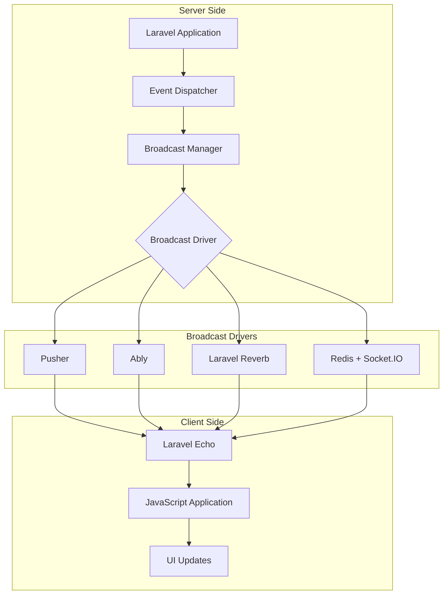
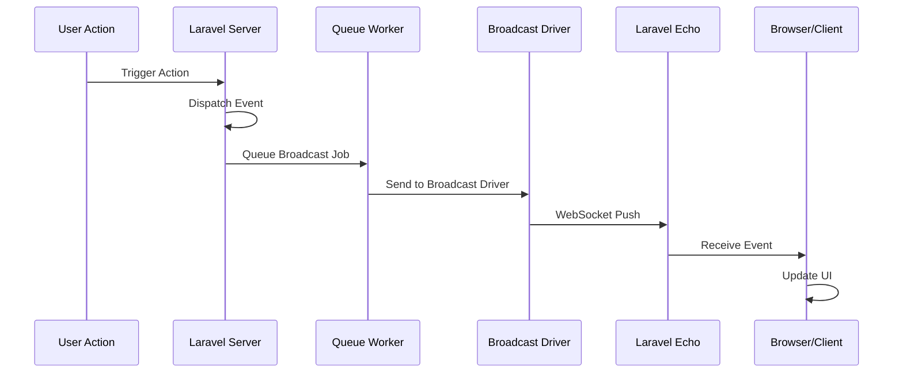
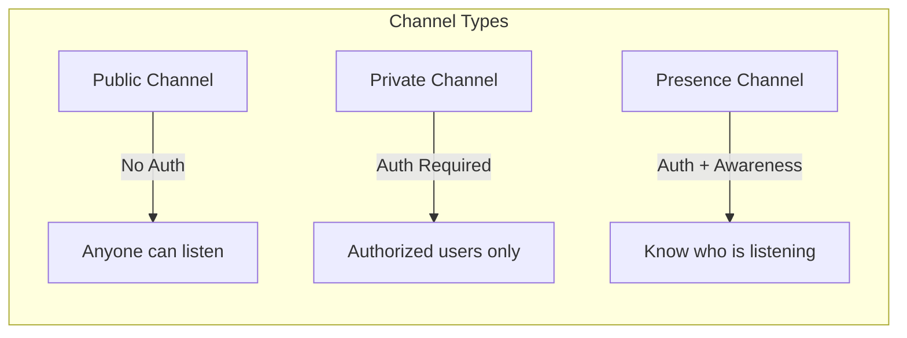
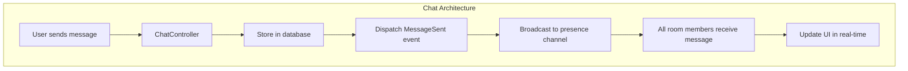
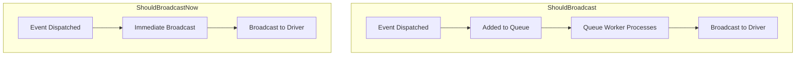
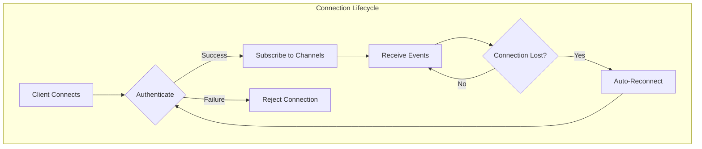

# How to Implement Event Broadcasting in Laravel

Author: [nawazdhandala](https://www.github.com/nawazdhandala)

Tags: PHP, Laravel, Events, Broadcasting, WebSocket, Pusher

Description: A comprehensive guide to implementing real-time event broadcasting in Laravel. Learn how to set up WebSocket connections, configure Pusher, create broadcastable events, and build interactive real-time applications.

---

> Event broadcasting allows you to share the same event names and data between your server-side Laravel application and your client-side JavaScript application. When events are broadcast on the server, you can listen for those events on the client to update your UI in real-time.

Laravel's event broadcasting provides a powerful way to build real-time applications. Whether you're building a chat application, live notifications system, real-time dashboard, or collaborative editing feature, broadcasting gives you the tools to push updates instantly to connected clients without polling.

---

## Understanding Event Broadcasting Architecture

Before diving into implementation, let's understand how broadcasting works in Laravel:



The broadcasting flow follows this sequence:



---

## Setting Up Broadcasting

### Installation and Configuration

First, install the required packages:

```bash
# Install Laravel Echo and Pusher client
npm install --save-dev laravel-echo pusher-js

# If using Laravel Reverb (Laravel's first-party WebSocket server)
composer require laravel/reverb

# If using Pusher
composer require pusher/pusher-php-server
```

### Configure Broadcasting Driver

Update your `.env` file:

```bash
# For Pusher
BROADCAST_DRIVER=pusher

PUSHER_APP_ID=your-app-id
PUSHER_APP_KEY=your-app-key
PUSHER_APP_SECRET=your-app-secret
PUSHER_HOST=
PUSHER_PORT=443
PUSHER_SCHEME=https
PUSHER_APP_CLUSTER=mt1

# For Laravel Reverb
BROADCAST_DRIVER=reverb

REVERB_APP_ID=your-app-id
REVERB_APP_KEY=your-app-key
REVERB_APP_SECRET=your-app-secret
REVERB_HOST="localhost"
REVERB_PORT=8080
REVERB_SCHEME=http
```

### Configure Broadcasting Service Provider

```php
<?php
// config/broadcasting.php

return [
    // Default broadcast connection
    'default' => env('BROADCAST_DRIVER', 'null'),

    // Available broadcast connections
    'connections' => [

        'pusher' => [
            'driver' => 'pusher',
            'key' => env('PUSHER_APP_KEY'),
            'secret' => env('PUSHER_APP_SECRET'),
            'app_id' => env('PUSHER_APP_ID'),
            'options' => [
                'cluster' => env('PUSHER_APP_CLUSTER'),
                'host' => env('PUSHER_HOST') ?: 'api-'.env('PUSHER_APP_CLUSTER', 'mt1').'.pusher.com',
                'port' => env('PUSHER_PORT', 443),
                'scheme' => env('PUSHER_SCHEME', 'https'),
                'encrypted' => true,
                'useTLS' => env('PUSHER_SCHEME', 'https') === 'https',
            ],
            // Enable client events if needed
            'client_options' => [
                // Guzzle client options
            ],
        ],

        'reverb' => [
            'driver' => 'reverb',
            'key' => env('REVERB_APP_KEY'),
            'secret' => env('REVERB_APP_SECRET'),
            'app_id' => env('REVERB_APP_ID'),
            'options' => [
                'host' => env('REVERB_HOST'),
                'port' => env('REVERB_PORT', 443),
                'scheme' => env('REVERB_SCHEME', 'https'),
                'useTLS' => env('REVERB_SCHEME', 'https') === 'https',
            ],
        ],

        'ably' => [
            'driver' => 'ably',
            'key' => env('ABLY_KEY'),
        ],

        'redis' => [
            'driver' => 'redis',
            'connection' => 'default',
        ],

        'log' => [
            'driver' => 'log',
        ],

        'null' => [
            'driver' => 'null',
        ],
    ],
];
```

### Enable Broadcasting Service Provider

```php
<?php
// bootstrap/providers.php (Laravel 11+)

return [
    App\Providers\AppServiceProvider::class,
    App\Providers\BroadcastServiceProvider::class, // Uncomment this
];
```

Or in Laravel 10 and earlier:

```php
<?php
// config/app.php

'providers' => [
    // ...
    App\Providers\BroadcastServiceProvider::class,
],
```

---

## Creating Broadcastable Events

### Basic Broadcast Event

```bash
php artisan make:event OrderShipped
```

```php
<?php
// app/Events/OrderShipped.php

namespace App\Events;

use App\Models\Order;
use Illuminate\Broadcasting\Channel;
use Illuminate\Broadcasting\InteractsWithSockets;
use Illuminate\Broadcasting\PresenceChannel;
use Illuminate\Broadcasting\PrivateChannel;
use Illuminate\Contracts\Broadcasting\ShouldBroadcast;
use Illuminate\Foundation\Events\Dispatchable;
use Illuminate\Queue\SerializesModels;

class OrderShipped implements ShouldBroadcast
{
    use Dispatchable, InteractsWithSockets, SerializesModels;

    // Public properties are automatically included in the broadcast payload
    public Order $order;
    
    public string $message;

    /**
     * Create a new event instance.
     */
    public function __construct(Order $order)
    {
        $this->order = $order;
        $this->message = "Order #{$order->id} has been shipped!";
    }

    /**
     * Get the channels the event should broadcast on.
     *
     * @return array<int, \Illuminate\Broadcasting\Channel>
     */
    public function broadcastOn(): array
    {
        return [
            new PrivateChannel('orders.' . $this->order->user_id),
        ];
    }

    /**
     * The event's broadcast name.
     * Default is the class name: OrderShipped
     */
    public function broadcastAs(): string
    {
        return 'order.shipped';
    }

    /**
     * Get the data to broadcast.
     * Override this to customize the payload.
     *
     * @return array<string, mixed>
     */
    public function broadcastWith(): array
    {
        return [
            'order_id' => $this->order->id,
            'tracking_number' => $this->order->tracking_number,
            'shipped_at' => $this->order->shipped_at->toIsoString(),
            'estimated_delivery' => $this->order->estimated_delivery->toIsoString(),
            'carrier' => $this->order->carrier,
            'message' => $this->message,
        ];
    }

    /**
     * Determine if this event should broadcast.
     */
    public function broadcastWhen(): bool
    {
        // Only broadcast if order has tracking number
        return !empty($this->order->tracking_number);
    }
}
```

### Dispatching Broadcast Events

```php
<?php
// app/Http/Controllers/OrderController.php

namespace App\Http\Controllers;

use App\Events\OrderShipped;
use App\Models\Order;
use Illuminate\Http\Request;

class OrderController extends Controller
{
    /**
     * Ship the given order.
     */
    public function ship(Order $order): void
    {
        // Update order status
        $order->update([
            'status' => 'shipped',
            'shipped_at' => now(),
            'tracking_number' => $this->generateTrackingNumber(),
        ]);

        // Dispatch the broadcast event
        // Method 1: Using event helper
        event(new OrderShipped($order));

        // Method 2: Using broadcast helper (more explicit)
        broadcast(new OrderShipped($order));

        // Method 3: Broadcast to others only (excludes current user)
        broadcast(new OrderShipped($order))->toOthers();
    }

    /**
     * Alternative: Using the event method on the model
     */
    public function shipWithModelEvent(Order $order): void
    {
        $order->update([
            'status' => 'shipped',
            'shipped_at' => now(),
        ]);

        // The model can dispatch its own events
        OrderShipped::dispatch($order);
    }
}
```

---

## Channel Types and Authorization

Laravel supports three types of channels:



### Public Channels

```php
<?php
// app/Events/NewsPublished.php

namespace App\Events;

use App\Models\Article;
use Illuminate\Broadcasting\Channel;
use Illuminate\Contracts\Broadcasting\ShouldBroadcast;

class NewsPublished implements ShouldBroadcast
{
    public Article $article;

    public function __construct(Article $article)
    {
        $this->article = $article;
    }

    /**
     * Public channel - anyone can subscribe
     */
    public function broadcastOn(): array
    {
        return [
            new Channel('news'),
        ];
    }

    public function broadcastAs(): string
    {
        return 'article.published';
    }

    public function broadcastWith(): array
    {
        return [
            'id' => $this->article->id,
            'title' => $this->article->title,
            'excerpt' => $this->article->excerpt,
            'url' => route('articles.show', $this->article),
            'published_at' => $this->article->published_at->toIsoString(),
        ];
    }
}
```

### Private Channels

```php
<?php
// app/Events/NotificationSent.php

namespace App\Events;

use App\Models\User;
use Illuminate\Broadcasting\PrivateChannel;
use Illuminate\Contracts\Broadcasting\ShouldBroadcast;

class NotificationSent implements ShouldBroadcast
{
    public User $user;
    public array $notification;

    public function __construct(User $user, array $notification)
    {
        $this->user = $user;
        $this->notification = $notification;
    }

    /**
     * Private channel - requires authorization
     */
    public function broadcastOn(): array
    {
        return [
            new PrivateChannel('user.' . $this->user->id),
        ];
    }

    public function broadcastAs(): string
    {
        return 'notification.received';
    }

    public function broadcastWith(): array
    {
        return [
            'id' => $this->notification['id'],
            'type' => $this->notification['type'],
            'title' => $this->notification['title'],
            'body' => $this->notification['body'],
            'action_url' => $this->notification['action_url'] ?? null,
            'created_at' => now()->toIsoString(),
        ];
    }
}
```

### Presence Channels

```php
<?php
// app/Events/UserJoinedRoom.php

namespace App\Events;

use App\Models\ChatRoom;
use App\Models\User;
use Illuminate\Broadcasting\PresenceChannel;
use Illuminate\Contracts\Broadcasting\ShouldBroadcast;

class UserJoinedRoom implements ShouldBroadcast
{
    public ChatRoom $room;
    public User $user;

    public function __construct(ChatRoom $room, User $user)
    {
        $this->room = $room;
        $this->user = $user;
    }

    /**
     * Presence channel - authorization + user awareness
     */
    public function broadcastOn(): array
    {
        return [
            new PresenceChannel('chat.' . $this->room->id),
        ];
    }

    public function broadcastAs(): string
    {
        return 'user.joined';
    }

    public function broadcastWith(): array
    {
        return [
            'user' => [
                'id' => $this->user->id,
                'name' => $this->user->name,
                'avatar' => $this->user->avatar_url,
            ],
            'joined_at' => now()->toIsoString(),
        ];
    }
}
```

### Channel Authorization

Define authorization rules in `routes/channels.php`:

```php
<?php
// routes/channels.php

use App\Models\ChatRoom;
use App\Models\Order;
use App\Models\User;
use Illuminate\Support\Facades\Broadcast;

/*
|--------------------------------------------------------------------------
| Broadcast Channels
|--------------------------------------------------------------------------
|
| Register all of the broadcast channels that your application supports.
| The given channel authorization callbacks are used to verify that an
| authenticated user can listen to the channel.
|
*/

/**
 * Private channel for user-specific notifications
 * Pattern: private-user.{id}
 */
Broadcast::channel('user.{id}', function (User $user, int $id) {
    // User can only listen to their own channel
    return $user->id === $id;
});

/**
 * Private channel for order updates
 * Pattern: private-orders.{userId}
 */
Broadcast::channel('orders.{userId}', function (User $user, int $userId) {
    return $user->id === $userId;
});

/**
 * Private channel for specific order
 * Pattern: private-order.{orderId}
 */
Broadcast::channel('order.{orderId}', function (User $user, int $orderId) {
    $order = Order::find($orderId);
    
    if (!$order) {
        return false;
    }
    
    // User owns the order or is an admin
    return $user->id === $order->user_id || $user->isAdmin();
});

/**
 * Presence channel for chat rooms
 * Pattern: presence-chat.{roomId}
 * Returns user data that will be shared with other users in the channel
 */
Broadcast::channel('chat.{roomId}', function (User $user, int $roomId) {
    $room = ChatRoom::find($roomId);
    
    if (!$room) {
        return false;
    }
    
    // Check if user is a member of this chat room
    if (!$room->members()->where('user_id', $user->id)->exists()) {
        return false;
    }
    
    // Return user data for presence awareness
    return [
        'id' => $user->id,
        'name' => $user->name,
        'avatar' => $user->avatar_url,
        'status' => $user->status ?? 'online',
    ];
});

/**
 * Presence channel for collaborative document editing
 */
Broadcast::channel('document.{documentId}', function (User $user, string $documentId) {
    $document = Document::findOrFail($documentId);
    
    if (!$document->canUserAccess($user)) {
        return false;
    }
    
    return [
        'id' => $user->id,
        'name' => $user->name,
        'color' => $user->getCollaboratorColor(),
        'cursor_position' => null,
    ];
});

/**
 * Private channel for team notifications
 */
Broadcast::channel('team.{teamId}', function (User $user, int $teamId) {
    return $user->teams()->where('teams.id', $teamId)->exists();
});

/**
 * Model binding in channel authorization
 */
Broadcast::channel('App.Models.Order.{order}', function (User $user, Order $order) {
    return $user->id === $order->user_id;
});
```

---

## Client-Side Setup with Laravel Echo

### Configure Laravel Echo

```javascript
// resources/js/bootstrap.js

import Echo from 'laravel-echo';
import Pusher from 'pusher-js';

window.Pusher = Pusher;

window.Echo = new Echo({
    broadcaster: 'pusher',
    key: import.meta.env.VITE_PUSHER_APP_KEY,
    cluster: import.meta.env.VITE_PUSHER_APP_CLUSTER,
    forceTLS: true,
    // Enable encryption for private channels
    encrypted: true,
    // Custom authorization endpoint
    authEndpoint: '/broadcasting/auth',
    // Include CSRF token in authorization requests
    auth: {
        headers: {
            'X-CSRF-TOKEN': document.querySelector('meta[name="csrf-token"]')?.content,
        },
    },
});

// For Laravel Reverb
// window.Echo = new Echo({
//     broadcaster: 'reverb',
//     key: import.meta.env.VITE_REVERB_APP_KEY,
//     wsHost: import.meta.env.VITE_REVERB_HOST,
//     wsPort: import.meta.env.VITE_REVERB_PORT ?? 80,
//     wssPort: import.meta.env.VITE_REVERB_PORT ?? 443,
//     forceTLS: (import.meta.env.VITE_REVERB_SCHEME ?? 'https') === 'https',
//     enabledTransports: ['ws', 'wss'],
// });
```

### Listening to Events

```javascript
// resources/js/app.js

// Import Echo from bootstrap
import './bootstrap';

// Public channel - anyone can listen
Echo.channel('news')
    .listen('.article.published', (event) => {
        console.log('New article published:', event);
        showNotification(`New Article: ${event.title}`);
        addArticleToFeed(event);
    });

// Private channel - authenticated users only
Echo.private(`user.${userId}`)
    .listen('.notification.received', (event) => {
        console.log('Notification received:', event);
        incrementNotificationBadge();
        showToast(event.title, event.body);
    })
    .listen('.order.shipped', (event) => {
        console.log('Order shipped:', event);
        updateOrderStatus(event.order_id, 'shipped');
    });

// Presence channel - know who's online
Echo.join(`chat.${roomId}`)
    // When you successfully join
    .here((users) => {
        console.log('Users currently in channel:', users);
        updateOnlineUsersList(users);
    })
    // When someone joins
    .joining((user) => {
        console.log('User joined:', user);
        addUserToOnlineList(user);
        showSystemMessage(`${user.name} joined the chat`);
    })
    // When someone leaves
    .leaving((user) => {
        console.log('User left:', user);
        removeUserFromOnlineList(user);
        showSystemMessage(`${user.name} left the chat`);
    })
    // Listen for custom events
    .listen('.message.sent', (event) => {
        console.log('New message:', event);
        addMessageToChat(event);
    })
    // Listen for whispers (client-to-client events)
    .listenForWhisper('typing', (event) => {
        console.log(`${event.name} is typing...`);
        showTypingIndicator(event.name);
    });
```

---

## Building a Real-Time Chat Application

Let's build a complete real-time chat feature:



### Models

```php
<?php
// app/Models/ChatRoom.php

namespace App\Models;

use Illuminate\Database\Eloquent\Model;
use Illuminate\Database\Eloquent\Relations\BelongsToMany;
use Illuminate\Database\Eloquent\Relations\HasMany;

class ChatRoom extends Model
{
    protected $fillable = [
        'name',
        'description',
        'is_private',
        'created_by',
    ];

    protected $casts = [
        'is_private' => 'boolean',
    ];

    /**
     * Get members of this chat room.
     */
    public function members(): BelongsToMany
    {
        return $this->belongsToMany(User::class, 'chat_room_members')
            ->withPivot('role', 'joined_at')
            ->withTimestamps();
    }

    /**
     * Get messages in this chat room.
     */
    public function messages(): HasMany
    {
        return $this->hasMany(ChatMessage::class);
    }

    /**
     * Check if a user is a member.
     */
    public function hasMember(User $user): bool
    {
        return $this->members()->where('user_id', $user->id)->exists();
    }

    /**
     * Get online members (those currently subscribed to the presence channel).
     */
    public function getChannelName(): string
    {
        return "chat.{$this->id}";
    }
}
```

```php
<?php
// app/Models/ChatMessage.php

namespace App\Models;

use Illuminate\Database\Eloquent\Model;
use Illuminate\Database\Eloquent\Relations\BelongsTo;
use Illuminate\Database\Eloquent\SoftDeletes;

class ChatMessage extends Model
{
    use SoftDeletes;

    protected $fillable = [
        'chat_room_id',
        'user_id',
        'content',
        'message_type',
        'metadata',
    ];

    protected $casts = [
        'metadata' => 'array',
    ];

    /**
     * Get the chat room this message belongs to.
     */
    public function room(): BelongsTo
    {
        return $this->belongsTo(ChatRoom::class, 'chat_room_id');
    }

    /**
     * Get the user who sent this message.
     */
    public function user(): BelongsTo
    {
        return $this->belongsTo(User::class);
    }

    /**
     * Get formatted data for broadcasting.
     */
    public function toBroadcastArray(): array
    {
        return [
            'id' => $this->id,
            'content' => $this->content,
            'message_type' => $this->message_type,
            'user' => [
                'id' => $this->user->id,
                'name' => $this->user->name,
                'avatar' => $this->user->avatar_url,
            ],
            'created_at' => $this->created_at->toIsoString(),
        ];
    }
}
```

### Events

```php
<?php
// app/Events/MessageSent.php

namespace App\Events;

use App\Models\ChatMessage;
use App\Models\ChatRoom;
use Illuminate\Broadcasting\InteractsWithSockets;
use Illuminate\Broadcasting\PresenceChannel;
use Illuminate\Contracts\Broadcasting\ShouldBroadcast;
use Illuminate\Foundation\Events\Dispatchable;
use Illuminate\Queue\SerializesModels;

class MessageSent implements ShouldBroadcast
{
    use Dispatchable, InteractsWithSockets, SerializesModels;

    public ChatMessage $message;
    public ChatRoom $room;

    public function __construct(ChatMessage $message)
    {
        $this->message = $message;
        $this->room = $message->room;
    }

    /**
     * Get the channels the event should broadcast on.
     */
    public function broadcastOn(): array
    {
        return [
            new PresenceChannel('chat.' . $this->room->id),
        ];
    }

    /**
     * The event's broadcast name.
     */
    public function broadcastAs(): string
    {
        return 'message.sent';
    }

    /**
     * Get the data to broadcast.
     */
    public function broadcastWith(): array
    {
        return $this->message->toBroadcastArray();
    }
}
```

```php
<?php
// app/Events/UserTyping.php

namespace App\Events;

use App\Models\ChatRoom;
use App\Models\User;
use Illuminate\Broadcasting\InteractsWithSockets;
use Illuminate\Broadcasting\PresenceChannel;
use Illuminate\Contracts\Broadcasting\ShouldBroadcastNow;
use Illuminate\Foundation\Events\Dispatchable;
use Illuminate\Queue\SerializesModels;

class UserTyping implements ShouldBroadcastNow
{
    use Dispatchable, InteractsWithSockets, SerializesModels;

    public User $user;
    public ChatRoom $room;
    public bool $isTyping;

    public function __construct(User $user, ChatRoom $room, bool $isTyping = true)
    {
        $this->user = $user;
        $this->room = $room;
        $this->isTyping = $isTyping;
    }

    public function broadcastOn(): array
    {
        return [
            new PresenceChannel('chat.' . $this->room->id),
        ];
    }

    public function broadcastAs(): string
    {
        return 'user.typing';
    }

    public function broadcastWith(): array
    {
        return [
            'user' => [
                'id' => $this->user->id,
                'name' => $this->user->name,
            ],
            'is_typing' => $this->isTyping,
        ];
    }

    /**
     * Exclude the sender from receiving this event.
     */
    public function broadcastToEveryone(): bool
    {
        return false;
    }
}
```

### Controller

```php
<?php
// app/Http/Controllers/ChatController.php

namespace App\Http\Controllers;

use App\Events\MessageSent;
use App\Events\UserTyping;
use App\Models\ChatMessage;
use App\Models\ChatRoom;
use Illuminate\Http\JsonResponse;
use Illuminate\Http\Request;

class ChatController extends Controller
{
    /**
     * Get chat room with recent messages.
     */
    public function show(ChatRoom $room): JsonResponse
    {
        $this->authorize('view', $room);

        $messages = $room->messages()
            ->with('user:id,name,avatar')
            ->latest()
            ->take(50)
            ->get()
            ->reverse()
            ->values();

        return response()->json([
            'room' => $room,
            'messages' => $messages,
            'channel' => $room->getChannelName(),
        ]);
    }

    /**
     * Send a message to the chat room.
     */
    public function sendMessage(Request $request, ChatRoom $room): JsonResponse
    {
        $this->authorize('sendMessage', $room);

        $validated = $request->validate([
            'content' => 'required|string|max:5000',
            'message_type' => 'nullable|in:text,image,file,system',
        ]);

        // Create the message
        $message = $room->messages()->create([
            'user_id' => auth()->id(),
            'content' => $validated['content'],
            'message_type' => $validated['message_type'] ?? 'text',
        ]);

        // Load the user relationship for broadcasting
        $message->load('user:id,name,avatar');

        // Broadcast the message to all room members
        broadcast(new MessageSent($message))->toOthers();

        return response()->json([
            'message' => $message->toBroadcastArray(),
        ], 201);
    }

    /**
     * Notify others that user is typing.
     */
    public function typing(Request $request, ChatRoom $room): JsonResponse
    {
        $this->authorize('sendMessage', $room);

        $isTyping = $request->boolean('is_typing', true);

        broadcast(new UserTyping(auth()->user(), $room, $isTyping))->toOthers();

        return response()->json(['status' => 'ok']);
    }

    /**
     * Load more messages (pagination).
     */
    public function loadMessages(Request $request, ChatRoom $room): JsonResponse
    {
        $this->authorize('view', $room);

        $validated = $request->validate([
            'before_id' => 'nullable|integer|exists:chat_messages,id',
            'limit' => 'nullable|integer|min:1|max:100',
        ]);

        $query = $room->messages()
            ->with('user:id,name,avatar')
            ->latest();

        if (isset($validated['before_id'])) {
            $query->where('id', '<', $validated['before_id']);
        }

        $messages = $query
            ->take($validated['limit'] ?? 50)
            ->get()
            ->reverse()
            ->values();

        return response()->json([
            'messages' => $messages,
            'has_more' => $messages->count() === ($validated['limit'] ?? 50),
        ]);
    }
}
```

### JavaScript Chat Component

```javascript
// resources/js/components/ChatRoom.js

class ChatRoom {
    constructor(roomId, userId) {
        this.roomId = roomId;
        this.userId = userId;
        this.channel = null;
        this.typingTimeout = null;
        this.usersTyping = new Set();
        
        this.initializeChannel();
        this.bindEvents();
    }

    /**
     * Initialize the presence channel.
     */
    initializeChannel() {
        this.channel = Echo.join(`chat.${this.roomId}`)
            // Initial list of users in the channel
            .here((users) => {
                console.log('Connected users:', users);
                this.updateOnlineUsers(users);
            })
            // When a user joins
            .joining((user) => {
                console.log('User joined:', user.name);
                this.addOnlineUser(user);
                this.showSystemMessage(`${user.name} joined the chat`);
            })
            // When a user leaves
            .leaving((user) => {
                console.log('User left:', user.name);
                this.removeOnlineUser(user);
                this.showSystemMessage(`${user.name} left the chat`);
            })
            // Listen for new messages
            .listen('.message.sent', (event) => {
                this.handleNewMessage(event);
            })
            // Listen for typing indicators
            .listen('.user.typing', (event) => {
                this.handleTypingIndicator(event);
            })
            // Handle connection errors
            .error((error) => {
                console.error('Channel subscription error:', error);
                this.showError('Failed to connect to chat. Please refresh.');
            });
    }

    /**
     * Bind DOM events.
     */
    bindEvents() {
        const messageInput = document.getElementById('message-input');
        const sendButton = document.getElementById('send-button');
        const messageForm = document.getElementById('message-form');

        // Handle form submission
        messageForm.addEventListener('submit', (e) => {
            e.preventDefault();
            this.sendMessage(messageInput.value);
            messageInput.value = '';
        });

        // Handle typing indicator
        messageInput.addEventListener('input', () => {
            this.sendTypingIndicator(true);
        });

        // Handle blur (stopped typing)
        messageInput.addEventListener('blur', () => {
            this.sendTypingIndicator(false);
        });
    }

    /**
     * Send a message to the server.
     */
    async sendMessage(content) {
        if (!content.trim()) return;

        try {
            const response = await fetch(`/chat/${this.roomId}/messages`, {
                method: 'POST',
                headers: {
                    'Content-Type': 'application/json',
                    'X-CSRF-TOKEN': document.querySelector('meta[name="csrf-token"]').content,
                },
                body: JSON.stringify({ content }),
            });

            if (!response.ok) {
                throw new Error('Failed to send message');
            }

            const data = await response.json();
            
            // Add message to UI immediately (optimistic update)
            this.appendMessage(data.message, true);
            
            // Stop typing indicator
            this.sendTypingIndicator(false);
            
        } catch (error) {
            console.error('Error sending message:', error);
            this.showError('Failed to send message. Please try again.');
        }
    }

    /**
     * Handle incoming message from broadcast.
     */
    handleNewMessage(event) {
        // Remove typing indicator for this user
        this.usersTyping.delete(event.user.id);
        this.updateTypingIndicator();
        
        // Append message to chat
        this.appendMessage(event, false);
        
        // Play notification sound if tab is not focused
        if (document.hidden) {
            this.playNotificationSound();
        }
    }

    /**
     * Append a message to the chat container.
     */
    appendMessage(message, isOwn) {
        const container = document.getElementById('messages-container');
        const messageEl = document.createElement('div');
        
        messageEl.className = `message ${isOwn ? 'message-own' : 'message-other'}`;
        messageEl.innerHTML = `
            <div class="message-avatar">
                
            </div>
            <div class="message-content">
                <div class="message-header">
                    <span class="message-author">${message.user.name}</span>
                    <span class="message-time">${this.formatTime(message.created_at)}</span>
                </div>
                <div class="message-body">${this.escapeHtml(message.content)}</div>
            </div>
        `;
        
        container.appendChild(messageEl);
        
        // Scroll to bottom
        container.scrollTop = container.scrollHeight;
    }

    /**
     * Send typing indicator to server.
     */
    sendTypingIndicator(isTyping) {
        // Debounce typing indicator
        if (this.typingTimeout) {
            clearTimeout(this.typingTimeout);
        }

        if (isTyping) {
            // Send typing indicator immediately
            fetch(`/chat/${this.roomId}/typing`, {
                method: 'POST',
                headers: {
                    'Content-Type': 'application/json',
                    'X-CSRF-TOKEN': document.querySelector('meta[name="csrf-token"]').content,
                },
                body: JSON.stringify({ is_typing: true }),
            });

            // Auto-clear typing after 3 seconds of no input
            this.typingTimeout = setTimeout(() => {
                this.sendTypingIndicator(false);
            }, 3000);
        } else {
            // Send stop typing
            fetch(`/chat/${this.roomId}/typing`, {
                method: 'POST',
                headers: {
                    'Content-Type': 'application/json',
                    'X-CSRF-TOKEN': document.querySelector('meta[name="csrf-token"]').content,
                },
                body: JSON.stringify({ is_typing: false }),
            });
        }
    }

    /**
     * Handle typing indicator from other users.
     */
    handleTypingIndicator(event) {
        if (event.is_typing) {
            this.usersTyping.add(event.user.name);
        } else {
            this.usersTyping.delete(event.user.name);
        }
        
        this.updateTypingIndicator();
    }

    /**
     * Update the typing indicator UI.
     */
    updateTypingIndicator() {
        const indicator = document.getElementById('typing-indicator');
        
        if (this.usersTyping.size === 0) {
            indicator.style.display = 'none';
            return;
        }
        
        const names = Array.from(this.usersTyping);
        let text;
        
        if (names.length === 1) {
            text = `${names[0]} is typing...`;
        } else if (names.length === 2) {
            text = `${names[0]} and ${names[1]} are typing...`;
        } else {
            text = `${names.length} people are typing...`;
        }
        
        indicator.textContent = text;
        indicator.style.display = 'block';
    }

    /**
     * Update online users list.
     */
    updateOnlineUsers(users) {
        const container = document.getElementById('online-users');
        container.innerHTML = users.map(user => `
            <div class="online-user" data-user-id="${user.id}">
                
                <span class="user-name">${user.name}</span>
                <span class="status-indicator online"></span>
            </div>
        `).join('');
        
        // Update count
        document.getElementById('online-count').textContent = users.length;
    }

    /**
     * Add a user to online list.
     */
    addOnlineUser(user) {
        const container = document.getElementById('online-users');
        const existing = container.querySelector(`[data-user-id="${user.id}"]`);
        
        if (!existing) {
            const userEl = document.createElement('div');
            userEl.className = 'online-user';
            userEl.dataset.userId = user.id;
            userEl.innerHTML = `
                
                <span class="user-name">${user.name}</span>
                <span class="status-indicator online"></span>
            `;
            container.appendChild(userEl);
        }
        
        // Update count
        const count = container.querySelectorAll('.online-user').length;
        document.getElementById('online-count').textContent = count;
    }

    /**
     * Remove a user from online list.
     */
    removeOnlineUser(user) {
        const container = document.getElementById('online-users');
        const userEl = container.querySelector(`[data-user-id="${user.id}"]`);
        
        if (userEl) {
            userEl.remove();
        }
        
        // Update count
        const count = container.querySelectorAll('.online-user').length;
        document.getElementById('online-count').textContent = count;
    }

    /**
     * Show system message.
     */
    showSystemMessage(text) {
        const container = document.getElementById('messages-container');
        const messageEl = document.createElement('div');
        messageEl.className = 'message message-system';
        messageEl.textContent = text;
        container.appendChild(messageEl);
        container.scrollTop = container.scrollHeight;
    }

    /**
     * Show error message.
     */
    showError(text) {
        // Implement your error notification UI
        console.error(text);
    }

    /**
     * Format timestamp.
     */
    formatTime(isoString) {
        const date = new Date(isoString);
        return date.toLocaleTimeString([], { hour: '2-digit', minute: '2-digit' });
    }

    /**
     * Escape HTML to prevent XSS.
     */
    escapeHtml(text) {
        const div = document.createElement('div');
        div.textContent = text;
        return div.innerHTML;
    }

    /**
     * Play notification sound.
     */
    playNotificationSound() {
        const audio = new Audio('/sounds/notification.mp3');
        audio.volume = 0.5;
        audio.play().catch(() => {
            // Audio play failed (browser restrictions)
        });
    }

    /**
     * Disconnect from channel.
     */
    disconnect() {
        if (this.channel) {
            Echo.leave(`chat.${this.roomId}`);
        }
    }
}

// Usage
const chatRoom = new ChatRoom(roomId, currentUserId);

// Clean up on page unload
window.addEventListener('beforeunload', () => {
    chatRoom.disconnect();
});
```

---

## Broadcasting to Multiple Channels

Sometimes you need to broadcast to multiple channels:

```php
<?php
// app/Events/OrderStatusChanged.php

namespace App\Events;

use App\Models\Order;
use Illuminate\Broadcasting\Channel;
use Illuminate\Broadcasting\PrivateChannel;
use Illuminate\Contracts\Broadcasting\ShouldBroadcast;

class OrderStatusChanged implements ShouldBroadcast
{
    public Order $order;
    public string $previousStatus;
    public string $newStatus;

    public function __construct(Order $order, string $previousStatus, string $newStatus)
    {
        $this->order = $order;
        $this->previousStatus = $previousStatus;
        $this->newStatus = $newStatus;
    }

    /**
     * Broadcast to multiple channels of different types.
     */
    public function broadcastOn(): array
    {
        return [
            // Private channel for the customer
            new PrivateChannel('user.' . $this->order->user_id),
            
            // Private channel for the assigned seller/merchant
            new PrivateChannel('merchant.' . $this->order->merchant_id),
            
            // Admin dashboard channel
            new PrivateChannel('admin.orders'),
            
            // Public channel for order tracking (limited data)
            new Channel('tracking.' . $this->order->tracking_number),
        ];
    }

    public function broadcastAs(): string
    {
        return 'order.status.changed';
    }

    /**
     * Customize payload per channel.
     */
    public function broadcastWith(): array
    {
        return [
            'order_id' => $this->order->id,
            'tracking_number' => $this->order->tracking_number,
            'previous_status' => $this->previousStatus,
            'new_status' => $this->newStatus,
            'updated_at' => now()->toIsoString(),
        ];
    }
}
```

---

## Queue Configuration for Broadcasting

For high-traffic applications, configure broadcasting to use queues:

```php
<?php
// app/Events/HighVolumeEvent.php

namespace App\Events;

use Illuminate\Contracts\Broadcasting\ShouldBroadcast;
use Illuminate\Contracts\Queue\ShouldQueue;

class HighVolumeEvent implements ShouldBroadcast, ShouldQueue
{
    /**
     * The name of the queue connection to use.
     */
    public string $connection = 'redis';

    /**
     * The name of the queue on which to place the broadcast job.
     */
    public string $queue = 'broadcasts';

    /**
     * The number of seconds before the job should be made available.
     */
    public int $delay = 0;

    /**
     * The number of times the job may be attempted.
     */
    public int $tries = 3;

    /**
     * The number of seconds to wait before retrying the job.
     */
    public int $backoff = 10;

    // ... rest of event implementation
}
```

Configure the queue worker for broadcasts:

```bash
# Run a dedicated queue worker for broadcasts
php artisan queue:work redis --queue=broadcasts --tries=3 --backoff=10
```

---

## Broadcasting Immediately vs Queued



```php
<?php
// Queued broadcast (better for high volume, non-critical updates)
class OrderShipped implements ShouldBroadcast
{
    // Will be processed by queue worker
}

// Immediate broadcast (for real-time critical updates)
class UserTyping implements ShouldBroadcastNow
{
    // Broadcast immediately, bypassing queue
}

// Hybrid approach: conditionally choose
class FlexibleEvent implements ShouldBroadcast
{
    public bool $immediate = false;

    public function __construct(bool $immediate = false)
    {
        $this->immediate = $immediate;
    }

    /**
     * Determine if this event should broadcast immediately.
     */
    public function shouldBroadcastNow(): bool
    {
        return $this->immediate;
    }
}
```

---

## Client Events (Whispers)

For peer-to-peer communication without server involvement:

```javascript
// Client event - goes directly to other clients
// Only works on private and presence channels

// Send a whisper (client event)
Echo.private(`chat.${roomId}`)
    .whisper('typing', {
        name: currentUserName,
        timestamp: Date.now(),
    });

// Listen for whispers
Echo.private(`chat.${roomId}`)
    .listenForWhisper('typing', (event) => {
        console.log(`${event.name} is typing...`);
    });
```

Enable client events in Pusher dashboard or configuration:

```php
<?php
// config/broadcasting.php

'pusher' => [
    'driver' => 'pusher',
    // ...
    'options' => [
        // Enable client events
        'encrypted' => true,
    ],
],
```

---

## Testing Broadcast Events

### Unit Testing

```php
<?php
// tests/Feature/BroadcastingTest.php

namespace Tests\Feature;

use App\Events\OrderShipped;
use App\Models\Order;
use App\Models\User;
use Illuminate\Foundation\Testing\RefreshDatabase;
use Illuminate\Support\Facades\Event;
use Tests\TestCase;

class BroadcastingTest extends TestCase
{
    use RefreshDatabase;

    /** @test */
    public function order_shipped_event_is_dispatched_when_order_ships(): void
    {
        Event::fake([OrderShipped::class]);

        $user = User::factory()->create();
        $order = Order::factory()->create(['user_id' => $user->id]);

        // Perform action that triggers the event
        $this->actingAs($user)
            ->post("/orders/{$order->id}/ship");

        Event::assertDispatched(OrderShipped::class, function ($event) use ($order) {
            return $event->order->id === $order->id;
        });
    }

    /** @test */
    public function order_shipped_broadcasts_on_correct_channel(): void
    {
        $user = User::factory()->create();
        $order = Order::factory()->create(['user_id' => $user->id]);

        $event = new OrderShipped($order);
        $channels = $event->broadcastOn();

        $this->assertCount(1, $channels);
        $this->assertEquals("private-orders.{$user->id}", $channels[0]->name);
    }

    /** @test */
    public function order_shipped_broadcasts_correct_data(): void
    {
        $order = Order::factory()->create([
            'tracking_number' => 'TRACK123',
        ]);

        $event = new OrderShipped($order);
        $data = $event->broadcastWith();

        $this->assertArrayHasKey('order_id', $data);
        $this->assertArrayHasKey('tracking_number', $data);
        $this->assertEquals('TRACK123', $data['tracking_number']);
    }

    /** @test */
    public function order_shipped_does_not_broadcast_without_tracking(): void
    {
        $order = Order::factory()->create([
            'tracking_number' => null,
        ]);

        $event = new OrderShipped($order);

        $this->assertFalse($event->broadcastWhen());
    }
}
```

### Testing Channel Authorization

```php
<?php
// tests/Feature/ChannelAuthorizationTest.php

namespace Tests\Feature;

use App\Models\ChatRoom;
use App\Models\User;
use Illuminate\Foundation\Testing\RefreshDatabase;
use Tests\TestCase;

class ChannelAuthorizationTest extends TestCase
{
    use RefreshDatabase;

    /** @test */
    public function user_can_join_their_own_private_channel(): void
    {
        $user = User::factory()->create();

        $response = $this->actingAs($user)
            ->post('/broadcasting/auth', [
                'channel_name' => "private-user.{$user->id}",
            ]);

        $response->assertOk();
    }

    /** @test */
    public function user_cannot_join_another_users_private_channel(): void
    {
        $user = User::factory()->create();
        $otherUser = User::factory()->create();

        $response = $this->actingAs($user)
            ->post('/broadcasting/auth', [
                'channel_name' => "private-user.{$otherUser->id}",
            ]);

        $response->assertForbidden();
    }

    /** @test */
    public function member_can_join_chat_room_presence_channel(): void
    {
        $user = User::factory()->create();
        $room = ChatRoom::factory()->create();
        $room->members()->attach($user);

        $response = $this->actingAs($user)
            ->post('/broadcasting/auth', [
                'channel_name' => "presence-chat.{$room->id}",
            ]);

        $response->assertOk();
        
        // Verify user data is included for presence
        $data = json_decode($response->getContent(), true);
        $channelData = json_decode($data['channel_data'], true);
        
        $this->assertEquals($user->id, $channelData['user_info']['id']);
        $this->assertEquals($user->name, $channelData['user_info']['name']);
    }

    /** @test */
    public function non_member_cannot_join_chat_room(): void
    {
        $user = User::factory()->create();
        $room = ChatRoom::factory()->create();
        // User is NOT a member

        $response = $this->actingAs($user)
            ->post('/broadcasting/auth', [
                'channel_name' => "presence-chat.{$room->id}",
            ]);

        $response->assertForbidden();
    }
}
```

### Using Broadcast Fakes

```php
<?php
// tests/Feature/BroadcastFakeTest.php

namespace Tests\Feature;

use App\Events\MessageSent;
use App\Models\ChatMessage;
use App\Models\ChatRoom;
use App\Models\User;
use Illuminate\Foundation\Testing\RefreshDatabase;
use Illuminate\Support\Facades\Broadcast;
use Tests\TestCase;

class BroadcastFakeTest extends TestCase
{
    use RefreshDatabase;

    /** @test */
    public function message_is_broadcast_when_sent(): void
    {
        Broadcast::fake();

        $user = User::factory()->create();
        $room = ChatRoom::factory()->create();
        $room->members()->attach($user);

        $this->actingAs($user)
            ->post("/chat/{$room->id}/messages", [
                'content' => 'Hello, world!',
            ]);

        Broadcast::assertDispatched(MessageSent::class);
    }

    /** @test */
    public function message_broadcast_contains_correct_data(): void
    {
        Broadcast::fake();

        $user = User::factory()->create();
        $room = ChatRoom::factory()->create();
        $room->members()->attach($user);

        $this->actingAs($user)
            ->post("/chat/{$room->id}/messages", [
                'content' => 'Test message content',
            ]);

        Broadcast::assertDispatched(MessageSent::class, function ($event) {
            return $event->message->content === 'Test message content';
        });
    }

    /** @test */
    public function nothing_broadcasted_when_validation_fails(): void
    {
        Broadcast::fake();

        $user = User::factory()->create();
        $room = ChatRoom::factory()->create();
        $room->members()->attach($user);

        $this->actingAs($user)
            ->post("/chat/{$room->id}/messages", [
                'content' => '', // Empty content - validation fails
            ]);

        Broadcast::assertNotDispatched(MessageSent::class);
    }
}
```

---

## Production Considerations

### Connection Management



### Error Handling

```javascript
// resources/js/bootstrap.js

window.Echo = new Echo({
    broadcaster: 'pusher',
    key: import.meta.env.VITE_PUSHER_APP_KEY,
    cluster: import.meta.env.VITE_PUSHER_APP_CLUSTER,
    forceTLS: true,
});

// Global connection error handling
Echo.connector.pusher.connection.bind('error', (error) => {
    console.error('WebSocket connection error:', error);
    
    if (error.error?.data?.code === 4004) {
        // App not found - check your credentials
        showConnectionError('Configuration error. Please contact support.');
    } else if (error.error?.data?.code === 4001) {
        // Over connection limit
        showConnectionError('Server is busy. Please try again later.');
    }
});

// Connection state changes
Echo.connector.pusher.connection.bind('state_change', (states) => {
    console.log('Connection state changed:', states.current);
    
    switch (states.current) {
        case 'connected':
            hideConnectionWarning();
            break;
        case 'connecting':
            showConnectionWarning('Connecting...');
            break;
        case 'disconnected':
            showConnectionWarning('Disconnected. Attempting to reconnect...');
            break;
        case 'unavailable':
            showConnectionError('Unable to connect. Please check your internet connection.');
            break;
    }
});
```

### Scaling with Redis

For high-volume applications, use Redis as a message broker:

```php
<?php
// config/broadcasting.php

'redis' => [
    'driver' => 'redis',
    'connection' => 'default',
],
```

Then use Laravel Echo Server or Socket.IO:

```bash
# Install Laravel Echo Server
npm install -g laravel-echo-server

# Initialize configuration
laravel-echo-server init

# Start the server
laravel-echo-server start
```

```json
// laravel-echo-server.json
{
    "authHost": "http://localhost",
    "authEndpoint": "/broadcasting/auth",
    "clients": [],
    "database": "redis",
    "databaseConfig": {
        "redis": {
            "host": "127.0.0.1",
            "port": "6379"
        }
    },
    "devMode": false,
    "host": null,
    "port": "6001",
    "protocol": "http",
    "socketio": {},
    "sslCertPath": "",
    "sslKeyPath": "",
    "sslCertChainPath": "",
    "sslPassphrase": ""
}
```

### Security Best Practices

```php
<?php
// routes/channels.php

use Illuminate\Support\Facades\Broadcast;
use Illuminate\Support\Facades\RateLimiter;

// Rate limit channel authorization
Broadcast::channel('chat.{roomId}', function ($user, $roomId) {
    // Rate limit: 60 channel subscriptions per minute per user
    $key = 'channel-auth:' . $user->id;
    
    if (RateLimiter::tooManyAttempts($key, 60)) {
        return false;
    }
    
    RateLimiter::hit($key, 60);
    
    // Normal authorization logic
    $room = ChatRoom::find($roomId);
    
    if (!$room || !$room->hasMember($user)) {
        return false;
    }
    
    return [
        'id' => $user->id,
        'name' => $user->name,
    ];
});
```

---

## Monitoring Broadcasting

Track broadcast metrics for observability:

```php
<?php
// app/Listeners/LogBroadcastEvent.php

namespace App\Listeners;

use Illuminate\Broadcasting\BroadcastEvent;
use Illuminate\Support\Facades\Log;

class LogBroadcastEvent
{
    public function handle(BroadcastEvent $event): void
    {
        Log::info('Event broadcasted', [
            'event_class' => get_class($event->event),
            'channels' => collect($event->event->broadcastOn())
                ->map(fn ($channel) => $channel->name)
                ->toArray(),
            'event_name' => method_exists($event->event, 'broadcastAs')
                ? $event->event->broadcastAs()
                : class_basename($event->event),
        ]);
    }
}
```

```php
<?php
// app/Providers/EventServiceProvider.php

use Illuminate\Broadcasting\BroadcastEvent;
use App\Listeners\LogBroadcastEvent;

protected $listen = [
    BroadcastEvent::class => [
        LogBroadcastEvent::class,
    ],
];
```

---

## Summary

Laravel's event broadcasting system provides a powerful foundation for building real-time applications. Key takeaways:

- **Choose the right driver**: Pusher for simplicity, Laravel Reverb for self-hosting, Redis + Socket.IO for scale
- **Understand channel types**: Public for open data, Private for authenticated access, Presence for user awareness
- **Implement proper authorization**: Always validate user access to private and presence channels
- **Use queues for high volume**: Queue broadcasts to prevent blocking your application
- **Handle connection states**: Implement reconnection logic and error handling on the client
- **Test thoroughly**: Use Event and Broadcast fakes to verify your events work correctly
- **Monitor in production**: Track broadcast metrics and errors for reliability

With these patterns, you can build responsive, real-time features that keep your users engaged and informed.

---

*Need to monitor your Laravel broadcasting infrastructure? [OneUptime](https://oneuptime.com) provides comprehensive observability for PHP applications, including WebSocket connection monitoring, event tracking, and real-time performance metrics.*
