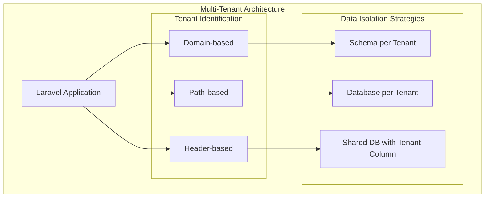
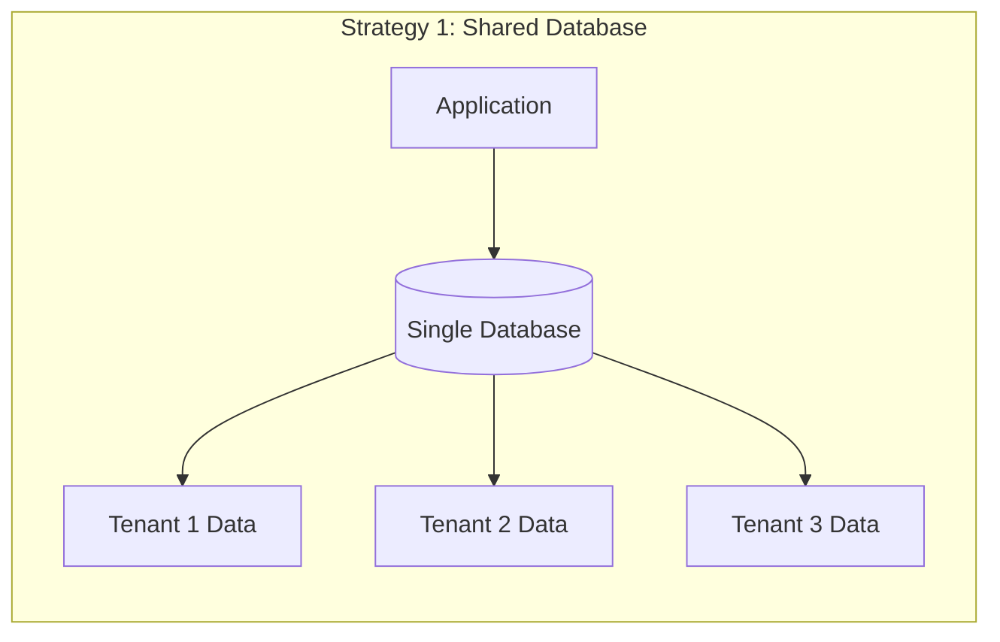
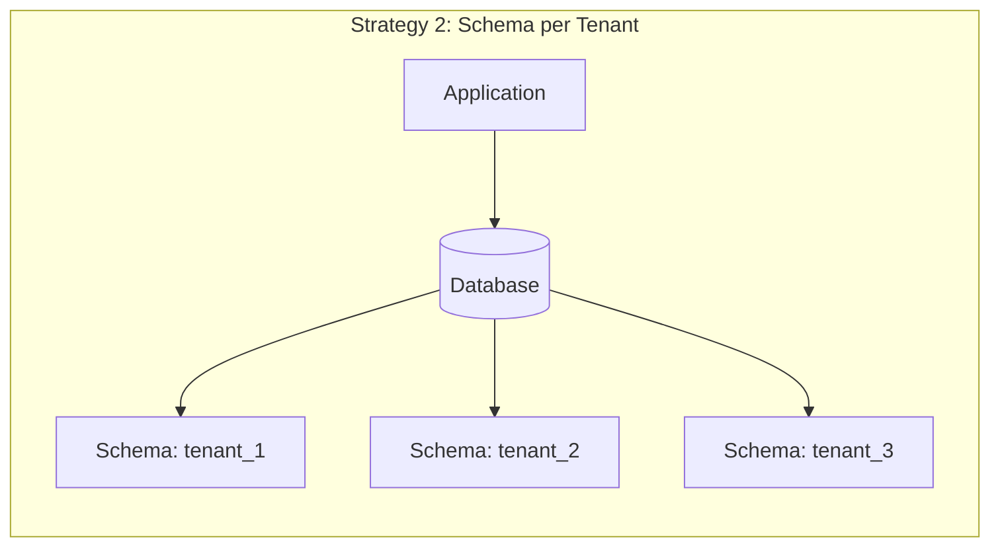
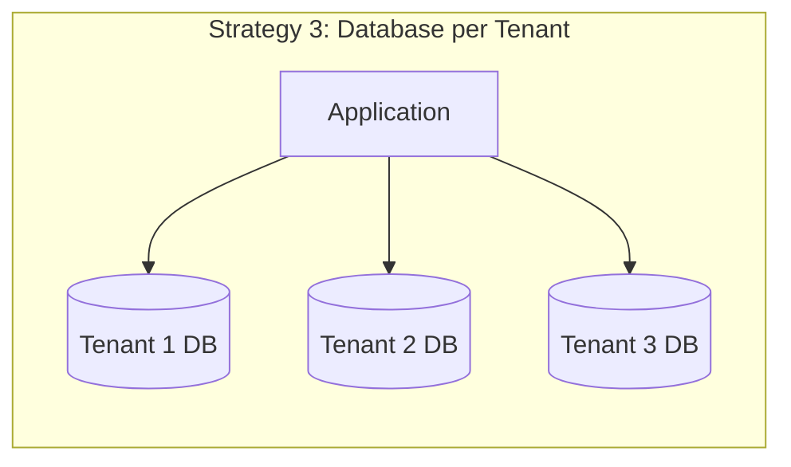
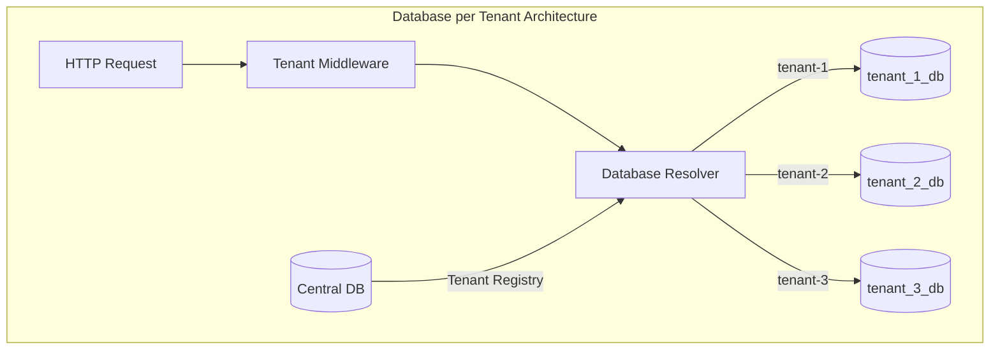
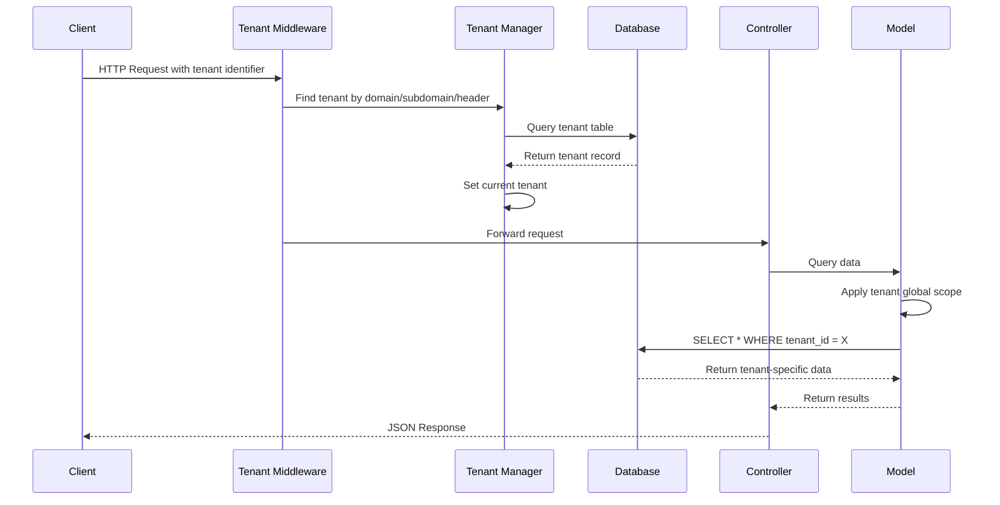

# How to Build Multi-Tenant Applications in Laravel

Author: [nawazdhandala](https://www.github.com/nawazdhandala)

Tags: PHP, Laravel, Multi-Tenant, SaaS, Database, Architecture

Description: A comprehensive guide to building multi-tenant SaaS applications in Laravel with different isolation strategies, tenant identification, and data scoping.

Building multi-tenant applications is a common requirement for SaaS platforms where multiple customers share the same application while keeping their data isolated. Laravel provides excellent tools and patterns for implementing multi-tenancy effectively. This guide covers different approaches to multi-tenancy, from database-per-tenant to shared database with tenant isolation.

## What is Multi-Tenancy?

Multi-tenancy is an architecture pattern where a single instance of an application serves multiple customers (tenants). Each tenant's data remains isolated from other tenants, ensuring privacy and security while maximizing resource efficiency.



## Multi-Tenancy Strategies Overview

There are three primary strategies for implementing multi-tenancy:







## Project Setup

Let's create a multi-tenant Laravel application from scratch:

```bash
# Create new Laravel project
composer create-project laravel/laravel multi-tenant-app

# Navigate to project directory
cd multi-tenant-app

# Install required packages
composer require stancl/tenancy
```

## Strategy 1: Shared Database with Tenant Column

This is the simplest approach where all tenants share the same database and tables. Each table has a `tenant_id` column to identify the owner of each record.

### Step 1: Create the Tenant Model and Migration

```php
<?php

// database/migrations/2025_07_02_000001_create_tenants_table.php

use Illuminate\Database\Migrations\Migration;
use Illuminate\Database\Schema\Blueprint;
use Illuminate\Support\Facades\Schema;

/**
 * Migration to create the tenants table.
 * This table stores information about each tenant in the system.
 */
return new class extends Migration
{
    /**
     * Run the migrations.
     * Creates the tenants table with essential fields for tenant management.
     */
    public function up(): void
    {
        Schema::create('tenants', function (Blueprint $table) {
            // Primary key for the tenant
            $table->id();
            
            // Unique identifier used in URLs and API calls
            $table->string('slug')->unique();
            
            // Human-readable name of the tenant/organization
            $table->string('name');
            
            // Optional custom domain for white-label support
            $table->string('domain')->nullable()->unique();
            
            // Subscription plan for feature gating
            $table->string('plan')->default('free');
            
            // JSON field for flexible settings storage
            $table->json('settings')->nullable();
            
            // Soft delete support for data retention
            $table->softDeletes();
            
            // Standard Laravel timestamps
            $table->timestamps();
            
            // Index for faster lookups by plan
            $table->index('plan');
        });
    }

    /**
     * Reverse the migrations.
     * Drops the tenants table if it exists.
     */
    public function down(): void
    {
        Schema::dropIfExists('tenants');
    }
};
```

### Step 2: Create the Tenant Model

```php
<?php

// app/Models/Tenant.php

namespace App\Models;

use Illuminate\Database\Eloquent\Model;
use Illuminate\Database\Eloquent\SoftDeletes;
use Illuminate\Database\Eloquent\Relations\HasMany;
use Illuminate\Database\Eloquent\Factories\HasFactory;

/**
 * Tenant Model
 * 
 * Represents an organization or customer in the multi-tenant system.
 * Each tenant has their own users, data, and settings.
 */
class Tenant extends Model
{
    use HasFactory, SoftDeletes;

    /**
     * The attributes that are mass assignable.
     * These fields can be set using create() or fill() methods.
     *
     * @var array<string>
     */
    protected $fillable = [
        'slug',
        'name', 
        'domain',
        'plan',
        'settings',
    ];

    /**
     * The attributes that should be cast.
     * Automatically converts JSON to array and vice versa.
     *
     * @var array<string, string>
     */
    protected $casts = [
        'settings' => 'array',
    ];

    /**
     * Get all users belonging to this tenant.
     * Defines the one-to-many relationship with User model.
     *
     * @return HasMany
     */
    public function users(): HasMany
    {
        return $this->hasMany(User::class);
    }

    /**
     * Get all projects belonging to this tenant.
     * Projects are scoped to tenant for data isolation.
     *
     * @return HasMany
     */
    public function projects(): HasMany
    {
        return $this->hasMany(Project::class);
    }

    /**
     * Check if tenant has access to a specific feature.
     * Used for plan-based feature gating.
     *
     * @param string $feature The feature name to check
     * @return bool True if tenant has access to the feature
     */
    public function hasFeature(string $feature): bool
    {
        // Define feature access by plan
        $planFeatures = [
            'free' => ['basic_reports', 'email_support'],
            'pro' => ['basic_reports', 'email_support', 'advanced_analytics', 'api_access'],
            'enterprise' => ['basic_reports', 'email_support', 'advanced_analytics', 'api_access', 'sso', 'audit_logs'],
        ];

        // Get features for current plan, defaulting to empty array
        $features = $planFeatures[$this->plan] ?? [];

        return in_array($feature, $features);
    }

    /**
     * Get a specific setting value with optional default.
     * Provides convenient access to nested settings.
     *
     * @param string $key The setting key (supports dot notation)
     * @param mixed $default Default value if setting not found
     * @return mixed The setting value or default
     */
    public function getSetting(string $key, mixed $default = null): mixed
    {
        return data_get($this->settings, $key, $default);
    }
}
```

### Step 3: Create Tenant-Aware Base Model

```php
<?php

// app/Models/Concerns/BelongsToTenant.php

namespace App\Models\Concerns;

use App\Models\Tenant;
use App\Services\TenantManager;
use Illuminate\Database\Eloquent\Builder;
use Illuminate\Database\Eloquent\Relations\BelongsTo;

/**
 * Trait BelongsToTenant
 * 
 * This trait provides automatic tenant scoping for Eloquent models.
 * Any model using this trait will automatically filter queries by tenant
 * and set the tenant_id when creating new records.
 */
trait BelongsToTenant
{
    /**
     * Boot the trait.
     * Registers model event listeners for tenant scoping.
     */
    protected static function bootBelongsToTenant(): void
    {
        // Automatically scope all queries to the current tenant
        static::addGlobalScope('tenant', function (Builder $builder) {
            // Get the current tenant from the tenant manager
            $tenant = app(TenantManager::class)->getTenant();
            
            if ($tenant) {
                // Filter results to only show records for current tenant
                $builder->where('tenant_id', $tenant->id);
            }
        });

        // Automatically set tenant_id when creating new records
        static::creating(function ($model) {
            // Get the current tenant
            $tenant = app(TenantManager::class)->getTenant();
            
            // Set tenant_id if not already set and tenant exists
            if ($tenant && ! $model->tenant_id) {
                $model->tenant_id = $tenant->id;
            }
        });
    }

    /**
     * Define the relationship to the Tenant model.
     * Allows accessing the tenant that owns this record.
     *
     * @return BelongsTo
     */
    public function tenant(): BelongsTo
    {
        return $this->belongsTo(Tenant::class);
    }

    /**
     * Scope query to a specific tenant.
     * Useful for admin operations across tenants.
     *
     * @param Builder $query
     * @param Tenant|int $tenant
     * @return Builder
     */
    public function scopeForTenant(Builder $query, Tenant|int $tenant): Builder
    {
        $tenantId = $tenant instanceof Tenant ? $tenant->id : $tenant;
        
        return $query->withoutGlobalScope('tenant')
                     ->where('tenant_id', $tenantId);
    }

    /**
     * Remove tenant scope from query.
     * Use with caution - only for admin/system operations.
     *
     * @param Builder $query
     * @return Builder
     */
    public function scopeWithoutTenantScope(Builder $query): Builder
    {
        return $query->withoutGlobalScope('tenant');
    }
}
```

### Step 4: Create the Tenant Manager Service

```php
<?php

// app/Services/TenantManager.php

namespace App\Services;

use App\Models\Tenant;
use Illuminate\Support\Facades\Cache;

/**
 * TenantManager Service
 * 
 * Manages the current tenant context throughout the application.
 * Provides methods for setting, getting, and switching tenants.
 */
class TenantManager
{
    /**
     * The currently active tenant instance.
     *
     * @var Tenant|null
     */
    protected ?Tenant $tenant = null;

    /**
     * Set the current tenant.
     * This will be used for all subsequent database queries.
     *
     * @param Tenant $tenant The tenant to set as current
     * @return void
     */
    public function setTenant(Tenant $tenant): void
    {
        $this->tenant = $tenant;
        
        // Store in session for web requests
        if (session()->isStarted()) {
            session(['current_tenant_id' => $tenant->id]);
        }
    }

    /**
     * Get the current tenant.
     *
     * @return Tenant|null The current tenant or null if not set
     */
    public function getTenant(): ?Tenant
    {
        return $this->tenant;
    }

    /**
     * Check if a tenant is currently set.
     *
     * @return bool True if a tenant is set
     */
    public function hasTenant(): bool
    {
        return $this->tenant !== null;
    }

    /**
     * Clear the current tenant context.
     * Useful for system-level operations.
     *
     * @return void
     */
    public function clearTenant(): void
    {
        $this->tenant = null;
        
        if (session()->isStarted()) {
            session()->forget('current_tenant_id');
        }
    }

    /**
     * Find tenant by domain with caching.
     * Used for domain-based tenant identification.
     *
     * @param string $domain The domain to look up
     * @return Tenant|null The tenant or null if not found
     */
    public function findByDomain(string $domain): ?Tenant
    {
        // Cache tenant lookups for performance
        return Cache::remember(
            "tenant:domain:{$domain}",
            now()->addHours(1),
            fn () => Tenant::where('domain', $domain)->first()
        );
    }

    /**
     * Find tenant by slug with caching.
     * Used for path-based tenant identification.
     *
     * @param string $slug The slug to look up
     * @return Tenant|null The tenant or null if not found
     */
    public function findBySlug(string $slug): ?Tenant
    {
        // Cache tenant lookups for performance
        return Cache::remember(
            "tenant:slug:{$slug}",
            now()->addHours(1),
            fn () => Tenant::where('slug', $slug)->first()
        );
    }

    /**
     * Execute a callback within the context of a specific tenant.
     * Useful for running operations as another tenant.
     *
     * @param Tenant $tenant The tenant context to use
     * @param callable $callback The callback to execute
     * @return mixed The result of the callback
     */
    public function runAsTenant(Tenant $tenant, callable $callback): mixed
    {
        // Store the current tenant
        $previousTenant = $this->tenant;
        
        try {
            // Switch to the specified tenant
            $this->setTenant($tenant);
            
            // Execute the callback
            return $callback($tenant);
        } finally {
            // Restore the previous tenant
            if ($previousTenant) {
                $this->setTenant($previousTenant);
            } else {
                $this->clearTenant();
            }
        }
    }
}
```

### Step 5: Create Tenant Identification Middleware

```php
<?php

// app/Http/Middleware/IdentifyTenant.php

namespace App\Http\Middleware;

use Closure;
use App\Models\Tenant;
use Illuminate\Http\Request;
use App\Services\TenantManager;
use Symfony\Component\HttpFoundation\Response;

/**
 * IdentifyTenant Middleware
 * 
 * Identifies the current tenant from the request and sets it in the TenantManager.
 * Supports multiple identification strategies: domain, subdomain, path, and header.
 */
class IdentifyTenant
{
    /**
     * Create a new middleware instance.
     *
     * @param TenantManager $tenantManager The tenant manager service
     */
    public function __construct(
        protected TenantManager $tenantManager
    ) {}

    /**
     * Handle an incoming request.
     * Attempts to identify the tenant using various strategies.
     *
     * @param Request $request The incoming HTTP request
     * @param Closure $next The next middleware in the pipeline
     * @param string|null $strategy Optional: force a specific identification strategy
     * @return Response
     */
    public function handle(Request $request, Closure $next, ?string $strategy = null): Response
    {
        // Try to identify tenant based on strategy
        $tenant = match ($strategy) {
            'domain' => $this->identifyByDomain($request),
            'subdomain' => $this->identifyBySubdomain($request),
            'path' => $this->identifyByPath($request),
            'header' => $this->identifyByHeader($request),
            default => $this->identifyAuto($request),
        };

        // If no tenant found, return 404 response
        if (! $tenant) {
            abort(404, 'Tenant not found');
        }

        // Set the tenant in the manager
        $this->tenantManager->setTenant($tenant);

        // Share tenant with all views
        view()->share('currentTenant', $tenant);

        return $next($request);
    }

    /**
     * Identify tenant by full domain.
     * Used for white-label setups with custom domains.
     *
     * @param Request $request
     * @return Tenant|null
     */
    protected function identifyByDomain(Request $request): ?Tenant
    {
        $domain = $request->getHost();
        
        return $this->tenantManager->findByDomain($domain);
    }

    /**
     * Identify tenant by subdomain.
     * Common pattern: tenant1.example.com, tenant2.example.com
     *
     * @param Request $request
     * @return Tenant|null
     */
    protected function identifyBySubdomain(Request $request): ?Tenant
    {
        $host = $request->getHost();
        $baseDomain = config('tenancy.base_domain', 'example.com');
        
        // Extract subdomain from host
        $subdomain = str_replace('.' . $baseDomain, '', $host);
        
        // Skip if no subdomain or it's www
        if (empty($subdomain) || $subdomain === 'www' || $subdomain === $host) {
            return null;
        }
        
        return $this->tenantManager->findBySlug($subdomain);
    }

    /**
     * Identify tenant by URL path segment.
     * Pattern: example.com/tenant-slug/resource
     *
     * @param Request $request
     * @return Tenant|null
     */
    protected function identifyByPath(Request $request): ?Tenant
    {
        // Get first path segment
        $segments = $request->segments();
        $slug = $segments[0] ?? null;
        
        if (! $slug) {
            return null;
        }
        
        return $this->tenantManager->findBySlug($slug);
    }

    /**
     * Identify tenant by HTTP header.
     * Useful for API requests from SPAs.
     *
     * @param Request $request
     * @return Tenant|null
     */
    protected function identifyByHeader(Request $request): ?Tenant
    {
        $tenantSlug = $request->header('X-Tenant-ID');
        
        if (! $tenantSlug) {
            return null;
        }
        
        return $this->tenantManager->findBySlug($tenantSlug);
    }

    /**
     * Auto-detect tenant using multiple strategies.
     * Tries each strategy in order until one succeeds.
     *
     * @param Request $request
     * @return Tenant|null
     */
    protected function identifyAuto(Request $request): ?Tenant
    {
        // Try header first (for API requests)
        $tenant = $this->identifyByHeader($request);
        if ($tenant) {
            return $tenant;
        }

        // Try subdomain
        $tenant = $this->identifyBySubdomain($request);
        if ($tenant) {
            return $tenant;
        }

        // Try custom domain
        $tenant = $this->identifyByDomain($request);
        if ($tenant) {
            return $tenant;
        }

        // Try path-based as last resort
        return $this->identifyByPath($request);
    }
}
```

### Step 6: Register the Service Provider

```php
<?php

// app/Providers/TenancyServiceProvider.php

namespace App\Providers;

use App\Services\TenantManager;
use Illuminate\Support\ServiceProvider;

/**
 * TenancyServiceProvider
 * 
 * Registers tenancy-related services and configurations.
 */
class TenancyServiceProvider extends ServiceProvider
{
    /**
     * Register any application services.
     * Binds the TenantManager as a singleton.
     *
     * @return void
     */
    public function register(): void
    {
        // Register TenantManager as singleton
        // This ensures the same instance is used throughout the request
        $this->app->singleton(TenantManager::class, function ($app) {
            return new TenantManager();
        });

        // Register alias for easier access
        $this->app->alias(TenantManager::class, 'tenant');
    }

    /**
     * Bootstrap any application services.
     *
     * @return void
     */
    public function boot(): void
    {
        // Register the middleware
        $this->app['router']->aliasMiddleware('tenant', \App\Http\Middleware\IdentifyTenant::class);
    }
}
```

## Strategy 2: Database per Tenant

For applications requiring stricter data isolation, the database-per-tenant approach creates a separate database for each tenant.



### Step 1: Update Tenant Model for Database Isolation

```php
<?php

// app/Models/Tenant.php (Database per Tenant version)

namespace App\Models;

use Illuminate\Database\Eloquent\Model;
use Illuminate\Database\Eloquent\SoftDeletes;
use Illuminate\Database\Eloquent\Factories\HasFactory;

/**
 * Tenant Model for Database-per-Tenant Strategy
 * 
 * Stores tenant metadata in a central database.
 * Each tenant has their own dedicated database.
 */
class Tenant extends Model
{
    use HasFactory, SoftDeletes;

    /**
     * The connection name for tenant metadata.
     * Always uses the central/landlord database.
     *
     * @var string
     */
    protected $connection = 'landlord';

    /**
     * The attributes that are mass assignable.
     *
     * @var array<string>
     */
    protected $fillable = [
        'slug',
        'name',
        'domain',
        'database_name',
        'database_host',
        'database_port',
        'plan',
        'settings',
    ];

    /**
     * The attributes that should be cast.
     *
     * @var array<string, string>
     */
    protected $casts = [
        'settings' => 'array',
    ];

    /**
     * The attributes that should be hidden for serialization.
     * Database credentials should never be exposed.
     *
     * @var array<string>
     */
    protected $hidden = [
        'database_name',
        'database_host',
        'database_port',
    ];

    /**
     * Get the database connection configuration for this tenant.
     * Used to dynamically configure the tenant database connection.
     *
     * @return array The database configuration array
     */
    public function getDatabaseConfig(): array
    {
        return [
            'driver' => 'mysql',
            'host' => $this->database_host ?? config('database.connections.mysql.host'),
            'port' => $this->database_port ?? config('database.connections.mysql.port'),
            'database' => $this->database_name,
            'username' => config('database.connections.mysql.username'),
            'password' => config('database.connections.mysql.password'),
            'charset' => 'utf8mb4',
            'collation' => 'utf8mb4_unicode_ci',
            'prefix' => '',
            'strict' => true,
            'engine' => null,
        ];
    }
}
```

### Step 2: Create Database Connection Manager

```php
<?php

// app/Services/TenantDatabaseManager.php

namespace App\Services;

use App\Models\Tenant;
use Illuminate\Support\Facades\DB;
use Illuminate\Support\Facades\Config;
use Illuminate\Support\Facades\Artisan;

/**
 * TenantDatabaseManager
 * 
 * Handles database operations for multi-tenant applications.
 * Creates, configures, and switches between tenant databases.
 */
class TenantDatabaseManager
{
    /**
     * The name of the tenant database connection.
     */
    protected const TENANT_CONNECTION = 'tenant';

    /**
     * Configure the database connection for a specific tenant.
     * Sets up the tenant connection with the tenant's database credentials.
     *
     * @param Tenant $tenant The tenant to configure connection for
     * @return void
     */
    public function configureTenantConnection(Tenant $tenant): void
    {
        // Get the tenant's database configuration
        $config = $tenant->getDatabaseConfig();
        
        // Set the configuration dynamically
        Config::set('database.connections.' . self::TENANT_CONNECTION, $config);
        
        // Purge the existing connection to force reconnection
        DB::purge(self::TENANT_CONNECTION);
        
        // Reconnect with new configuration
        DB::reconnect(self::TENANT_CONNECTION);
        
        // Set the tenant connection as default for models
        DB::setDefaultConnection(self::TENANT_CONNECTION);
    }

    /**
     * Create a new database for a tenant.
     * Used during tenant provisioning.
     *
     * @param Tenant $tenant The tenant to create database for
     * @return bool True if database was created successfully
     */
    public function createTenantDatabase(Tenant $tenant): bool
    {
        $databaseName = $this->generateDatabaseName($tenant);
        
        // Create the database using the landlord connection
        DB::connection('landlord')->statement(
            "CREATE DATABASE IF NOT EXISTS `{$databaseName}` CHARACTER SET utf8mb4 COLLATE utf8mb4_unicode_ci"
        );
        
        // Update tenant with the database name
        $tenant->update(['database_name' => $databaseName]);
        
        return true;
    }

    /**
     * Run migrations for a tenant's database.
     * Applies all tenant-specific migrations.
     *
     * @param Tenant $tenant The tenant to run migrations for
     * @return void
     */
    public function migrateTenantDatabase(Tenant $tenant): void
    {
        // Configure connection for this tenant
        $this->configureTenantConnection($tenant);
        
        // Run migrations for tenant tables
        Artisan::call('migrate', [
            '--database' => self::TENANT_CONNECTION,
            '--path' => 'database/migrations/tenant',
            '--force' => true,
        ]);
    }

    /**
     * Generate a unique database name for a tenant.
     * Uses a consistent naming convention.
     *
     * @param Tenant $tenant The tenant
     * @return string The generated database name
     */
    protected function generateDatabaseName(Tenant $tenant): string
    {
        $prefix = config('tenancy.database_prefix', 'tenant_');
        
        return $prefix . $tenant->slug;
    }

    /**
     * Delete a tenant's database.
     * Use with caution - this permanently destroys all tenant data.
     *
     * @param Tenant $tenant The tenant whose database to delete
     * @return bool True if database was deleted successfully
     */
    public function deleteTenantDatabase(Tenant $tenant): bool
    {
        if (! $tenant->database_name) {
            return false;
        }
        
        // Drop the database
        DB::connection('landlord')->statement(
            "DROP DATABASE IF EXISTS `{$tenant->database_name}`"
        );
        
        // Clear the database name from tenant record
        $tenant->update(['database_name' => null]);
        
        return true;
    }

    /**
     * Reset the database connection to the landlord/central database.
     * Used after tenant operations are complete.
     *
     * @return void
     */
    public function resetToLandlord(): void
    {
        DB::setDefaultConnection('landlord');
    }

    /**
     * Seed a tenant's database with initial data.
     * Called after migrations during tenant setup.
     *
     * @param Tenant $tenant The tenant to seed data for
     * @return void
     */
    public function seedTenantDatabase(Tenant $tenant): void
    {
        // Configure connection for this tenant
        $this->configureTenantConnection($tenant);
        
        // Run tenant seeders
        Artisan::call('db:seed', [
            '--class' => 'TenantDatabaseSeeder',
            '--database' => self::TENANT_CONNECTION,
            '--force' => true,
        ]);
    }
}
```

### Step 3: Update Middleware for Database Switching

```php
<?php

// app/Http/Middleware/ConfigureTenantDatabase.php

namespace App\Http\Middleware;

use Closure;
use Illuminate\Http\Request;
use App\Services\TenantManager;
use App\Services\TenantDatabaseManager;
use Symfony\Component\HttpFoundation\Response;

/**
 * ConfigureTenantDatabase Middleware
 * 
 * Configures the database connection for the current tenant.
 * Must be used after IdentifyTenant middleware.
 */
class ConfigureTenantDatabase
{
    /**
     * Create a new middleware instance.
     *
     * @param TenantManager $tenantManager
     * @param TenantDatabaseManager $databaseManager
     */
    public function __construct(
        protected TenantManager $tenantManager,
        protected TenantDatabaseManager $databaseManager
    ) {}

    /**
     * Handle an incoming request.
     * Switches the database connection to the tenant's database.
     *
     * @param Request $request
     * @param Closure $next
     * @return Response
     */
    public function handle(Request $request, Closure $next): Response
    {
        $tenant = $this->tenantManager->getTenant();
        
        if ($tenant && $tenant->database_name) {
            // Configure the database connection for this tenant
            $this->databaseManager->configureTenantConnection($tenant);
        }
        
        return $next($request);
    }

    /**
     * Perform any final actions after the response has been sent.
     * Resets the database connection to prevent connection leaks.
     *
     * @param Request $request
     * @param Response $response
     * @return void
     */
    public function terminate(Request $request, Response $response): void
    {
        // Reset to landlord connection after request
        $this->databaseManager->resetToLandlord();
    }
}
```

## Creating Tenant-Aware Models

Here's an example of a tenant-aware model:

```php
<?php

// app/Models/Project.php

namespace App\Models;

use Illuminate\Database\Eloquent\Model;
use App\Models\Concerns\BelongsToTenant;
use Illuminate\Database\Eloquent\SoftDeletes;
use Illuminate\Database\Eloquent\Relations\HasMany;
use Illuminate\Database\Eloquent\Relations\BelongsTo;
use Illuminate\Database\Eloquent\Factories\HasFactory;

/**
 * Project Model
 * 
 * Represents a project within a tenant's workspace.
 * Automatically scoped to the current tenant.
 */
class Project extends Model
{
    // Include tenant scoping trait
    use HasFactory, SoftDeletes, BelongsToTenant;

    /**
     * The attributes that are mass assignable.
     *
     * @var array<string>
     */
    protected $fillable = [
        'name',
        'description',
        'status',
        'settings',
        'owner_id',
    ];

    /**
     * The attributes that should be cast.
     *
     * @var array<string, string>
     */
    protected $casts = [
        'settings' => 'array',
    ];

    /**
     * Valid project statuses.
     */
    public const STATUS_ACTIVE = 'active';
    public const STATUS_ARCHIVED = 'archived';
    public const STATUS_COMPLETED = 'completed';

    /**
     * Get the owner of this project.
     *
     * @return BelongsTo
     */
    public function owner(): BelongsTo
    {
        return $this->belongsTo(User::class, 'owner_id');
    }

    /**
     * Get all tasks in this project.
     *
     * @return HasMany
     */
    public function tasks(): HasMany
    {
        return $this->hasMany(Task::class);
    }

    /**
     * Scope to only active projects.
     *
     * @param \Illuminate\Database\Eloquent\Builder $query
     * @return \Illuminate\Database\Eloquent\Builder
     */
    public function scopeActive($query)
    {
        return $query->where('status', self::STATUS_ACTIVE);
    }

    /**
     * Check if project is archived.
     *
     * @return bool
     */
    public function isArchived(): bool
    {
        return $this->status === self::STATUS_ARCHIVED;
    }
}
```

## Tenant-Aware Authentication

```php
<?php

// app/Models/User.php

namespace App\Models;

use Laravel\Sanctum\HasApiTokens;
use App\Models\Concerns\BelongsToTenant;
use Illuminate\Notifications\Notifiable;
use Illuminate\Database\Eloquent\SoftDeletes;
use Illuminate\Database\Eloquent\Relations\BelongsTo;
use Illuminate\Database\Eloquent\Factories\HasFactory;
use Illuminate\Foundation\Auth\User as Authenticatable;

/**
 * User Model
 * 
 * Represents a user within a tenant's organization.
 * Users are scoped to their tenant.
 */
class User extends Authenticatable
{
    use HasApiTokens, HasFactory, Notifiable, SoftDeletes, BelongsToTenant;

    /**
     * The attributes that are mass assignable.
     *
     * @var array<string>
     */
    protected $fillable = [
        'name',
        'email',
        'password',
        'role',
        'settings',
    ];

    /**
     * The attributes that should be hidden for serialization.
     *
     * @var array<string>
     */
    protected $hidden = [
        'password',
        'remember_token',
    ];

    /**
     * The attributes that should be cast.
     *
     * @var array<string, string>
     */
    protected $casts = [
        'email_verified_at' => 'datetime',
        'password' => 'hashed',
        'settings' => 'array',
    ];

    /**
     * Available user roles within a tenant.
     */
    public const ROLE_ADMIN = 'admin';
    public const ROLE_MEMBER = 'member';
    public const ROLE_VIEWER = 'viewer';

    /**
     * Check if user has a specific role.
     *
     * @param string|array $roles The role(s) to check
     * @return bool
     */
    public function hasRole(string|array $roles): bool
    {
        $roles = is_array($roles) ? $roles : [$roles];
        
        return in_array($this->role, $roles);
    }

    /**
     * Check if user is an admin within their tenant.
     *
     * @return bool
     */
    public function isAdmin(): bool
    {
        return $this->role === self::ROLE_ADMIN;
    }

    /**
     * Get projects owned by this user.
     *
     * @return \Illuminate\Database\Eloquent\Relations\HasMany
     */
    public function ownedProjects()
    {
        return $this->hasMany(Project::class, 'owner_id');
    }
}
```

## Tenant Provisioning Service

```php
<?php

// app/Services/TenantProvisioner.php

namespace App\Services;

use App\Models\User;
use App\Models\Tenant;
use Illuminate\Support\Str;
use Illuminate\Support\Facades\DB;
use Illuminate\Support\Facades\Hash;

/**
 * TenantProvisioner
 * 
 * Handles the complete setup process for new tenants.
 * Creates tenant record, database, initial user, and default data.
 */
class TenantProvisioner
{
    /**
     * Create a new provisioner instance.
     *
     * @param TenantDatabaseManager $databaseManager
     * @param TenantManager $tenantManager
     */
    public function __construct(
        protected TenantDatabaseManager $databaseManager,
        protected TenantManager $tenantManager
    ) {}

    /**
     * Provision a new tenant with all required resources.
     * This is the main entry point for tenant creation.
     *
     * @param array $tenantData Data for the tenant
     * @param array $adminData Data for the admin user
     * @return Tenant The created tenant
     */
    public function provision(array $tenantData, array $adminData): Tenant
    {
        return DB::transaction(function () use ($tenantData, $adminData) {
            // Step 1: Create the tenant record
            $tenant = $this->createTenant($tenantData);
            
            // Step 2: Create the tenant database
            $this->databaseManager->createTenantDatabase($tenant);
            
            // Step 3: Run migrations for the tenant
            $this->databaseManager->migrateTenantDatabase($tenant);
            
            // Step 4: Create the admin user
            $this->createAdminUser($tenant, $adminData);
            
            // Step 5: Seed default data
            $this->seedDefaultData($tenant);
            
            // Step 6: Reset connection to landlord
            $this->databaseManager->resetToLandlord();
            
            return $tenant->fresh();
        });
    }

    /**
     * Create the tenant record.
     *
     * @param array $data Tenant data
     * @return Tenant The created tenant
     */
    protected function createTenant(array $data): Tenant
    {
        return Tenant::create([
            'name' => $data['name'],
            'slug' => $data['slug'] ?? Str::slug($data['name']),
            'domain' => $data['domain'] ?? null,
            'plan' => $data['plan'] ?? 'free',
            'settings' => $data['settings'] ?? [],
        ]);
    }

    /**
     * Create the initial admin user for the tenant.
     *
     * @param Tenant $tenant The tenant
     * @param array $data Admin user data
     * @return User The created user
     */
    protected function createAdminUser(Tenant $tenant, array $data): User
    {
        // Configure database for tenant
        $this->databaseManager->configureTenantConnection($tenant);
        
        // Set tenant context
        $this->tenantManager->setTenant($tenant);
        
        return User::create([
            'name' => $data['name'],
            'email' => $data['email'],
            'password' => Hash::make($data['password']),
            'role' => User::ROLE_ADMIN,
            'email_verified_at' => now(),
        ]);
    }

    /**
     * Seed default data for a new tenant.
     * Creates sample projects, settings, etc.
     *
     * @param Tenant $tenant The tenant to seed data for
     * @return void
     */
    protected function seedDefaultData(Tenant $tenant): void
    {
        // The database seeder will handle default data creation
        $this->databaseManager->seedTenantDatabase($tenant);
    }

    /**
     * Deprovision a tenant and clean up all resources.
     * Use with extreme caution - this permanently deletes tenant data.
     *
     * @param Tenant $tenant The tenant to deprovision
     * @return bool True if deprovisioning was successful
     */
    public function deprovision(Tenant $tenant): bool
    {
        return DB::transaction(function () use ($tenant) {
            // Delete the tenant database
            $this->databaseManager->deleteTenantDatabase($tenant);
            
            // Delete the tenant record (soft delete)
            $tenant->delete();
            
            return true;
        });
    }
}
```

## API Controllers for Multi-Tenant Apps

```php
<?php

// app/Http/Controllers/Api/ProjectController.php

namespace App\Http\Controllers\Api;

use App\Models\Project;
use Illuminate\Http\Request;
use Illuminate\Http\JsonResponse;
use App\Http\Controllers\Controller;
use App\Http\Requests\StoreProjectRequest;
use App\Http\Requests\UpdateProjectRequest;
use Illuminate\Http\Resources\Json\AnonymousResourceCollection;

/**
 * ProjectController
 * 
 * Handles CRUD operations for projects.
 * All queries are automatically scoped to the current tenant.
 */
class ProjectController extends Controller
{
    /**
     * Display a listing of projects.
     * Automatically filtered to current tenant via BelongsToTenant trait.
     *
     * @param Request $request
     * @return AnonymousResourceCollection
     */
    public function index(Request $request): JsonResponse
    {
        // Query is automatically scoped to current tenant
        $projects = Project::query()
            ->with(['owner:id,name,email'])
            ->when($request->has('status'), function ($query) use ($request) {
                $query->where('status', $request->status);
            })
            ->when($request->has('search'), function ($query) use ($request) {
                $query->where('name', 'like', '%' . $request->search . '%');
            })
            ->orderBy('created_at', 'desc')
            ->paginate($request->per_page ?? 15);

        return response()->json([
            'success' => true,
            'data' => $projects,
        ]);
    }

    /**
     * Store a newly created project.
     * Tenant ID is automatically set via BelongsToTenant trait.
     *
     * @param StoreProjectRequest $request
     * @return JsonResponse
     */
    public function store(StoreProjectRequest $request): JsonResponse
    {
        // tenant_id is automatically set by BelongsToTenant trait
        $project = Project::create([
            'name' => $request->name,
            'description' => $request->description,
            'status' => Project::STATUS_ACTIVE,
            'owner_id' => $request->user()->id,
            'settings' => $request->settings ?? [],
        ]);

        return response()->json([
            'success' => true,
            'message' => 'Project created successfully',
            'data' => $project->load('owner:id,name,email'),
        ], 201);
    }

    /**
     * Display the specified project.
     * Route model binding automatically respects tenant scope.
     *
     * @param Project $project
     * @return JsonResponse
     */
    public function show(Project $project): JsonResponse
    {
        return response()->json([
            'success' => true,
            'data' => $project->load(['owner:id,name,email', 'tasks']),
        ]);
    }

    /**
     * Update the specified project.
     *
     * @param UpdateProjectRequest $request
     * @param Project $project
     * @return JsonResponse
     */
    public function update(UpdateProjectRequest $request, Project $project): JsonResponse
    {
        $project->update($request->validated());

        return response()->json([
            'success' => true,
            'message' => 'Project updated successfully',
            'data' => $project->fresh()->load('owner:id,name,email'),
        ]);
    }

    /**
     * Remove the specified project.
     * Uses soft delete to allow recovery.
     *
     * @param Project $project
     * @return JsonResponse
     */
    public function destroy(Project $project): JsonResponse
    {
        $project->delete();

        return response()->json([
            'success' => true,
            'message' => 'Project deleted successfully',
        ]);
    }
}
```

## Queue Jobs with Tenant Context

```php
<?php

// app/Jobs/ProcessTenantReport.php

namespace App\Jobs;

use App\Models\Tenant;
use App\Services\TenantManager;
use Illuminate\Bus\Queueable;
use Illuminate\Queue\SerializesModels;
use Illuminate\Queue\InteractsWithQueue;
use Illuminate\Contracts\Queue\ShouldQueue;
use Illuminate\Foundation\Bus\Dispatchable;
use App\Services\TenantDatabaseManager;

/**
 * ProcessTenantReport Job
 * 
 * Processes a report for a specific tenant.
 * Demonstrates how to maintain tenant context in queued jobs.
 */
class ProcessTenantReport implements ShouldQueue
{
    use Dispatchable, InteractsWithQueue, Queueable, SerializesModels;

    /**
     * The number of times the job may be attempted.
     *
     * @var int
     */
    public $tries = 3;

    /**
     * The number of seconds to wait before retrying.
     *
     * @var int
     */
    public $backoff = 60;

    /**
     * Create a new job instance.
     *
     * @param Tenant $tenant The tenant to process the report for
     * @param array $reportConfig Configuration for the report
     */
    public function __construct(
        public Tenant $tenant,
        public array $reportConfig
    ) {}

    /**
     * Execute the job.
     * Sets up tenant context before processing.
     *
     * @param TenantManager $tenantManager
     * @param TenantDatabaseManager $databaseManager
     * @return void
     */
    public function handle(
        TenantManager $tenantManager,
        TenantDatabaseManager $databaseManager
    ): void {
        // Set up tenant context for this job
        $tenantManager->setTenant($this->tenant);
        
        // Configure database connection if using database-per-tenant
        if ($this->tenant->database_name) {
            $databaseManager->configureTenantConnection($this->tenant);
        }

        try {
            // Process the report within tenant context
            $this->processReport();
        } finally {
            // Clean up: reset to landlord connection
            $databaseManager->resetToLandlord();
            $tenantManager->clearTenant();
        }
    }

    /**
     * Process the actual report logic.
     * All queries here are scoped to the current tenant.
     *
     * @return void
     */
    protected function processReport(): void
    {
        // Your report processing logic here
        // All queries will be scoped to the tenant
        
        $projectCount = \App\Models\Project::count();
        $userCount = \App\Models\User::count();
        
        // Generate and store the report
        // ...
    }

    /**
     * Handle a job failure.
     *
     * @param \Throwable $exception
     * @return void
     */
    public function failed(\Throwable $exception): void
    {
        // Log the failure with tenant context
        \Log::error('Tenant report processing failed', [
            'tenant_id' => $this->tenant->id,
            'tenant_slug' => $this->tenant->slug,
            'error' => $exception->getMessage(),
        ]);
    }
}
```

## Testing Multi-Tenant Applications

```php
<?php

// tests/Feature/MultiTenantTest.php

namespace Tests\Feature;

use Tests\TestCase;
use App\Models\User;
use App\Models\Tenant;
use App\Models\Project;
use App\Services\TenantManager;
use Illuminate\Foundation\Testing\RefreshDatabase;

/**
 * MultiTenantTest
 * 
 * Tests for multi-tenant functionality.
 * Ensures proper data isolation between tenants.
 */
class MultiTenantTest extends TestCase
{
    use RefreshDatabase;

    /**
     * The tenant manager instance.
     *
     * @var TenantManager
     */
    protected TenantManager $tenantManager;

    /**
     * Set up the test environment.
     */
    protected function setUp(): void
    {
        parent::setUp();
        
        $this->tenantManager = app(TenantManager::class);
    }

    /**
     * Test that projects are scoped to their tenant.
     */
    public function test_projects_are_scoped_to_tenant(): void
    {
        // Create two tenants
        $tenant1 = Tenant::factory()->create(['slug' => 'tenant-1']);
        $tenant2 = Tenant::factory()->create(['slug' => 'tenant-2']);

        // Create projects for each tenant
        $this->tenantManager->setTenant($tenant1);
        $project1 = Project::factory()->create(['name' => 'Tenant 1 Project']);

        $this->tenantManager->setTenant($tenant2);
        $project2 = Project::factory()->create(['name' => 'Tenant 2 Project']);

        // Verify tenant 1 only sees their project
        $this->tenantManager->setTenant($tenant1);
        $projects = Project::all();
        
        $this->assertCount(1, $projects);
        $this->assertEquals('Tenant 1 Project', $projects->first()->name);

        // Verify tenant 2 only sees their project
        $this->tenantManager->setTenant($tenant2);
        $projects = Project::all();
        
        $this->assertCount(1, $projects);
        $this->assertEquals('Tenant 2 Project', $projects->first()->name);
    }

    /**
     * Test that middleware correctly identifies tenant by subdomain.
     */
    public function test_subdomain_tenant_identification(): void
    {
        $tenant = Tenant::factory()->create(['slug' => 'acme']);
        $user = User::factory()->create(['tenant_id' => $tenant->id]);

        // Make request with subdomain
        $response = $this->withHeaders([
            'Host' => 'acme.example.com',
        ])->actingAs($user)->get('/api/projects');

        $response->assertOk();
    }

    /**
     * Test that tenant ID is automatically set on new records.
     */
    public function test_tenant_id_auto_assigned_on_create(): void
    {
        $tenant = Tenant::factory()->create();
        $this->tenantManager->setTenant($tenant);

        $project = Project::create([
            'name' => 'Test Project',
            'status' => 'active',
        ]);

        $this->assertEquals($tenant->id, $project->tenant_id);
    }

    /**
     * Test feature access based on tenant plan.
     */
    public function test_tenant_feature_access(): void
    {
        $freeTenant = Tenant::factory()->create(['plan' => 'free']);
        $proTenant = Tenant::factory()->create(['plan' => 'pro']);

        // Free tenant should not have API access
        $this->assertFalse($freeTenant->hasFeature('api_access'));

        // Pro tenant should have API access
        $this->assertTrue($proTenant->hasFeature('api_access'));
    }
}
```

## Tenant Request Flow



## Configuration File

```php
<?php

// config/tenancy.php

return [
    /*
    |--------------------------------------------------------------------------
    | Base Domain
    |--------------------------------------------------------------------------
    |
    | The base domain used for subdomain-based tenant identification.
    | Subdomains will be extracted from this domain.
    |
    */
    'base_domain' => env('TENANCY_BASE_DOMAIN', 'example.com'),

    /*
    |--------------------------------------------------------------------------
    | Database Prefix
    |--------------------------------------------------------------------------
    |
    | The prefix used when creating tenant databases.
    | Final database name will be: prefix + tenant_slug
    |
    */
    'database_prefix' => env('TENANCY_DATABASE_PREFIX', 'tenant_'),

    /*
    |--------------------------------------------------------------------------
    | Identification Strategy
    |--------------------------------------------------------------------------
    |
    | The default strategy for identifying tenants.
    | Options: 'subdomain', 'domain', 'path', 'header', 'auto'
    |
    */
    'identification_strategy' => env('TENANCY_IDENTIFICATION', 'subdomain'),

    /*
    |--------------------------------------------------------------------------
    | Central Domains
    |--------------------------------------------------------------------------
    |
    | Domains that should not be treated as tenant domains.
    | These are typically used for landing pages, admin panels, etc.
    |
    */
    'central_domains' => [
        'www.' . env('TENANCY_BASE_DOMAIN', 'example.com'),
        'admin.' . env('TENANCY_BASE_DOMAIN', 'example.com'),
    ],

    /*
    |--------------------------------------------------------------------------
    | Tenant Cache TTL
    |--------------------------------------------------------------------------
    |
    | How long to cache tenant lookups in seconds.
    | Set to 0 to disable caching.
    |
    */
    'cache_ttl' => env('TENANCY_CACHE_TTL', 3600),

    /*
    |--------------------------------------------------------------------------
    | Tenant Models
    |--------------------------------------------------------------------------
    |
    | Models that should be scoped to tenants.
    | These models should use the BelongsToTenant trait.
    |
    */
    'tenant_models' => [
        \App\Models\User::class,
        \App\Models\Project::class,
        \App\Models\Task::class,
    ],
];
```

## Routes Configuration

```php
<?php

// routes/api.php

use Illuminate\Support\Facades\Route;
use App\Http\Controllers\Api\AuthController;
use App\Http\Controllers\Api\ProjectController;
use App\Http\Controllers\Api\TenantController;

/*
|--------------------------------------------------------------------------
| Tenant-Scoped API Routes
|--------------------------------------------------------------------------
|
| These routes require tenant identification and authentication.
| The tenant middleware will identify the tenant from the request.
|
*/

Route::middleware(['tenant', 'auth:sanctum'])->group(function () {
    // Project routes - automatically scoped to current tenant
    Route::apiResource('projects', ProjectController::class);
    
    // User profile
    Route::get('/me', [AuthController::class, 'me']);
    Route::put('/me', [AuthController::class, 'updateProfile']);
    
    // Tenant settings (admin only)
    Route::middleware('can:manage-tenant')->group(function () {
        Route::get('/tenant', [TenantController::class, 'show']);
        Route::put('/tenant', [TenantController::class, 'update']);
        Route::get('/tenant/users', [TenantController::class, 'users']);
    });
});

/*
|--------------------------------------------------------------------------
| Public Routes
|--------------------------------------------------------------------------
|
| These routes do not require tenant identification.
| Used for authentication and tenant registration.
|
*/

Route::post('/auth/login', [AuthController::class, 'login']);
Route::post('/auth/register', [AuthController::class, 'register']);
Route::post('/tenants', [TenantController::class, 'store']);
```

## Conclusion

Building multi-tenant applications in Laravel requires careful consideration of data isolation, scalability, and security. The key takeaways from this guide include:

1. **Choose the Right Strategy**: Select between shared database, schema-per-tenant, or database-per-tenant based on your isolation and scalability requirements.

2. **Use Global Scopes**: Laravel's global scopes automatically filter queries by tenant, reducing the chance of data leakage.

3. **Maintain Tenant Context**: Use a centralized TenantManager service to track the current tenant throughout request lifecycle.

4. **Handle Queued Jobs**: Always pass tenant information to queue jobs and restore context before processing.

5. **Test Thoroughly**: Write tests that verify data isolation between tenants.

6. **Cache Wisely**: Cache tenant lookups to improve performance, but be careful with cache invalidation.

Multi-tenancy adds complexity to your application, but with proper architecture and Laravel's powerful features, you can build robust SaaS applications that serve multiple customers efficiently and securely.
