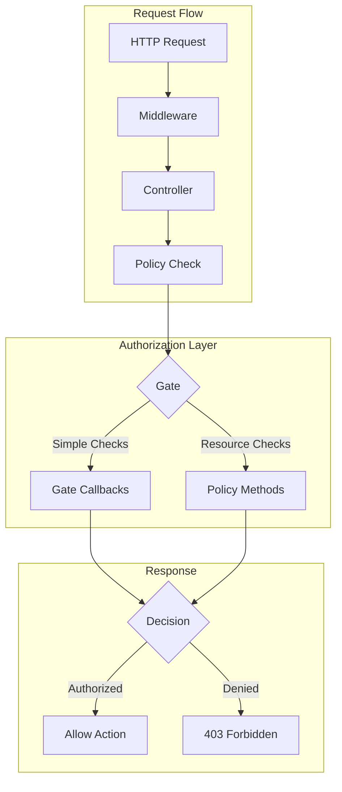
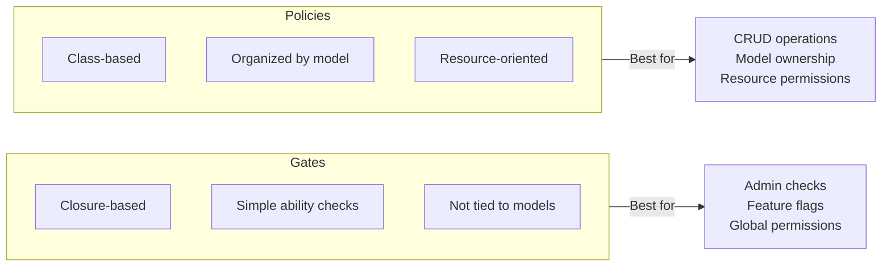
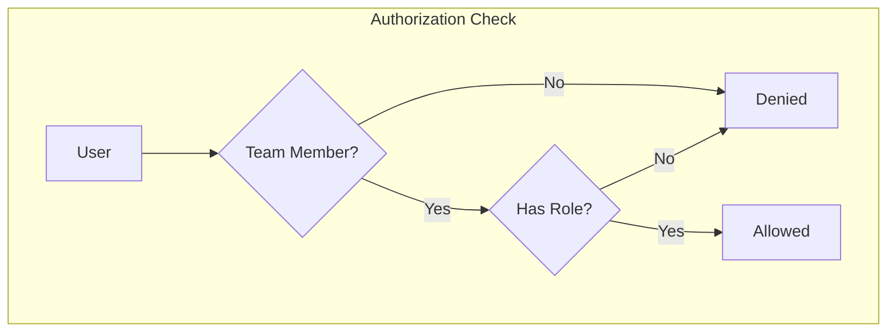
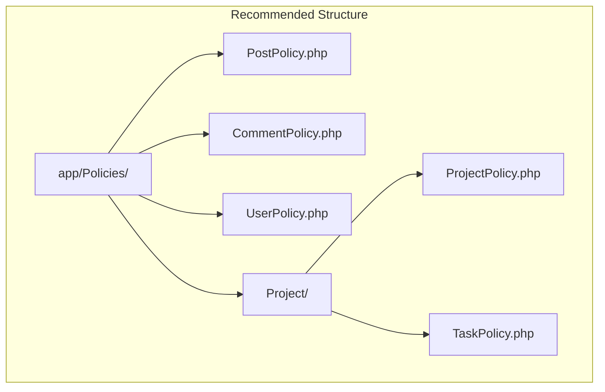
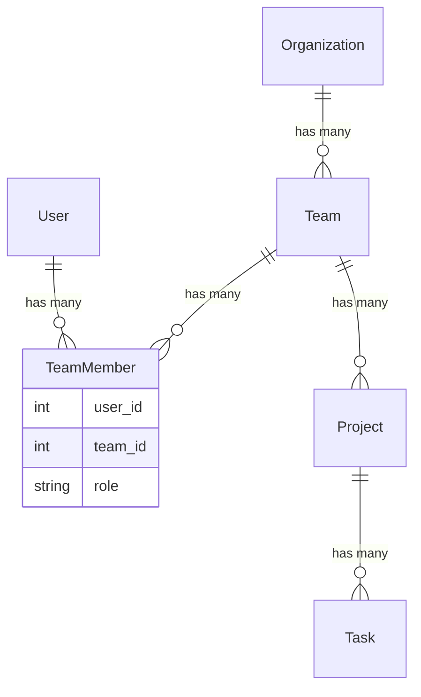

# How to Use Laravel Policies for Authorization

Author: [nawazdhandala](https://www.github.com/nawazdhandala)

Tags: PHP, Laravel, Authorization, Policies, Security, Gates

Description: A comprehensive guide to implementing authorization in Laravel using Policies and Gates. Learn how to protect resources, define permissions, and build secure applications with clean, maintainable authorization logic.

---

> Authorization determines whether a user can perform a specific action on a resource. Laravel provides an elegant, expressive authorization system through Gates and Policies that keeps your controllers thin and your authorization logic organized.

While authentication verifies who a user is, authorization determines what they can do. Laravel's authorization features make it simple to implement complex permission systems while maintaining clean, testable code.

---

## Understanding Laravel Authorization Architecture

Before diving into code, let's understand how Laravel's authorization system works:



Laravel provides two primary mechanisms for authorization:



---

## Getting Started with Gates

Gates are simple, closure-based authorization checks. They are perfect for actions not related to specific models.

### Defining Gates

```php
<?php
// app/Providers/AppServiceProvider.php

namespace App\Providers;

use App\Models\User;
use Illuminate\Support\Facades\Gate;
use Illuminate\Support\ServiceProvider;

class AppServiceProvider extends ServiceProvider
{
    public function boot(): void
    {
        // Simple gate that checks if user is admin
        Gate::define('access-admin-panel', function (User $user) {
            return $user->is_admin;
        });
        
        // Gate with additional parameter
        Gate::define('manage-team', function (User $user, string $teamId) {
            return $user->teams()
                ->where('team_id', $teamId)
                ->where('role', 'manager')
                ->exists();
        });
        
        // Gate that allows nullable user (for guest checks)
        Gate::define('view-public-content', function (?User $user) {
            // Guests can view public content
            return true;
        });
        
        // Gate with multiple conditions
        Gate::define('publish-content', function (User $user) {
            // Must be verified and have publisher role
            return $user->hasVerifiedEmail() 
                && $user->hasRole('publisher');
        });
        
        // Super admin bypass - runs before all other checks
        Gate::before(function (User $user, string $ability) {
            if ($user->isSuperAdmin()) {
                return true; // Allow everything
            }
            
            // Return null to fall through to normal checks
            return null;
        });
        
        // After hook for logging or additional checks
        Gate::after(function (User $user, string $ability, bool $result) {
            if (!$result) {
                // Log failed authorization attempts
                logger()->warning('Authorization denied', [
                    'user_id' => $user->id,
                    'ability' => $ability,
                ]);
            }
        });
    }
}
```

### Using Gates

```php
<?php
// In a controller

namespace App\Http\Controllers;

use Illuminate\Http\Request;
use Illuminate\Support\Facades\Gate;

class AdminController extends Controller
{
    public function dashboard()
    {
        // Method 1: Using Gate facade with allows()
        if (Gate::allows('access-admin-panel')) {
            return view('admin.dashboard');
        }
        
        abort(403, 'Unauthorized access to admin panel.');
    }
    
    public function settings()
    {
        // Method 2: Using Gate facade with denies()
        if (Gate::denies('access-admin-panel')) {
            abort(403);
        }
        
        return view('admin.settings');
    }
    
    public function manageTeam(string $teamId)
    {
        // Method 3: Using authorize() which throws exception
        Gate::authorize('manage-team', $teamId);
        
        // If we reach here, user is authorized
        return view('admin.team', compact('teamId'));
    }
    
    public function publishArticle(Request $request)
    {
        // Method 4: Using inspect() for detailed response
        $response = Gate::inspect('publish-content');
        
        if ($response->allowed()) {
            // Proceed with publishing
            return $this->handlePublish($request);
        }
        
        // Access the denial message
        return response()->json([
            'error' => $response->message(),
        ], 403);
    }
}
```

### Using Gates in Blade Templates

```php
<!-- Check if user can access admin panel -->
@can('access-admin-panel')
    <a href="{{ route('admin.dashboard') }}">Admin Panel</a>
@endcan

<!-- Check if user cannot perform action -->
@cannot('publish-content')
    <p>You do not have permission to publish content.</p>
@endcannot

<!-- Check with else condition -->
@can('manage-team', $teamId)
    <button>Edit Team Settings</button>
@else
    <p>Contact your team manager for changes.</p>
@endcan

<!-- Check any of multiple abilities -->
@canany(['access-admin-panel', 'manage-team'])
    <div class="management-tools">
        <!-- Show management interface -->
    </div>
@endcanany

<!-- Guest check - show login prompt -->
@guest
    <a href="{{ route('login') }}">Login to access features</a>
@else
    @can('publish-content')
        <button>Create New Post</button>
    @endcan
@endguest
```

---

## Creating and Using Policies

Policies are classes that organize authorization logic around a particular model. They are the recommended approach for model-based authorization.

### Generating a Policy

```bash
# Generate a policy for the Post model
php artisan make:policy PostPolicy --model=Post

# Generate a policy without model binding
php artisan make:policy AdminPolicy
```

### Policy Structure

```php
<?php
// app/Policies/PostPolicy.php

namespace App\Policies;

use App\Models\Post;
use App\Models\User;
use Illuminate\Auth\Access\HandlesAuthorization;
use Illuminate\Auth\Access\Response;

class PostPolicy
{
    use HandlesAuthorization;
    
    /**
     * Perform pre-authorization checks.
     * Runs before any other policy method.
     */
    public function before(User $user, string $ability): ?bool
    {
        // Admins can do anything with posts
        if ($user->isAdmin()) {
            return true;
        }
        
        // Banned users cannot do anything
        if ($user->isBanned()) {
            return false;
        }
        
        // Return null to proceed to specific method
        return null;
    }
    
    /**
     * Determine whether the user can view any posts.
     * Used for index pages and listing endpoints.
     */
    public function viewAny(User $user): bool
    {
        // All authenticated users can view the posts list
        return true;
    }
    
    /**
     * Determine whether the user can view a specific post.
     */
    public function view(User $user, Post $post): bool
    {
        // Published posts are viewable by anyone
        if ($post->isPublished()) {
            return true;
        }
        
        // Draft posts only viewable by author
        return $user->id === $post->user_id;
    }
    
    /**
     * Determine whether the user can create posts.
     */
    public function create(User $user): bool
    {
        // Users must have verified email to create posts
        return $user->hasVerifiedEmail();
    }
    
    /**
     * Determine whether the user can update the post.
     */
    public function update(User $user, Post $post): bool
    {
        // Only the author can update their post
        return $user->id === $post->user_id;
    }
    
    /**
     * Determine whether the user can delete the post.
     */
    public function delete(User $user, Post $post): bool
    {
        // Authors can delete their own posts
        // Posts with comments cannot be deleted
        return $user->id === $post->user_id 
            && $post->comments()->count() === 0;
    }
    
    /**
     * Determine whether the user can restore a soft-deleted post.
     */
    public function restore(User $user, Post $post): bool
    {
        return $user->id === $post->user_id;
    }
    
    /**
     * Determine whether the user can permanently delete the post.
     */
    public function forceDelete(User $user, Post $post): bool
    {
        // Only the author can permanently delete
        // And only if post is already soft-deleted
        return $user->id === $post->user_id && $post->trashed();
    }
    
    /**
     * Custom policy method for publishing posts.
     */
    public function publish(User $user, Post $post): bool
    {
        // Must be author and post must be in draft status
        return $user->id === $post->user_id 
            && $post->status === 'draft';
    }
    
    /**
     * Custom policy method with detailed response.
     */
    public function feature(User $user, Post $post): Response
    {
        if (!$user->hasRole('editor')) {
            return Response::deny('Only editors can feature posts.');
        }
        
        if (!$post->isPublished()) {
            return Response::deny('Only published posts can be featured.');
        }
        
        if ($post->is_featured) {
            return Response::deny('This post is already featured.');
        }
        
        return Response::allow();
    }
}
```

### Registering Policies

Laravel can auto-discover policies, but you can also register them manually:

```php
<?php
// app/Providers/AppServiceProvider.php

namespace App\Providers;

use App\Models\Post;
use App\Models\Comment;
use App\Policies\PostPolicy;
use App\Policies\CommentPolicy;
use Illuminate\Support\Facades\Gate;
use Illuminate\Support\ServiceProvider;

class AppServiceProvider extends ServiceProvider
{
    public function boot(): void
    {
        // Manual policy registration
        Gate::policy(Post::class, PostPolicy::class);
        Gate::policy(Comment::class, CommentPolicy::class);
    }
}
```

For auto-discovery, follow the naming convention:
- Model: `App\Models\Post`
- Policy: `App\Policies\PostPolicy`

---

## Using Policies in Controllers

### Method 1: Using authorize() Method

```php
<?php
// app/Http/Controllers/PostController.php

namespace App\Http\Controllers;

use App\Models\Post;
use App\Http\Requests\StorePostRequest;
use App\Http\Requests\UpdatePostRequest;
use Illuminate\Http\Request;

class PostController extends Controller
{
    /**
     * Display a listing of posts.
     */
    public function index()
    {
        // Authorize viewing any post
        $this->authorize('viewAny', Post::class);
        
        $posts = Post::published()->paginate(15);
        
        return view('posts.index', compact('posts'));
    }
    
    /**
     * Show the form for creating a new post.
     */
    public function create()
    {
        // Authorize creating posts
        $this->authorize('create', Post::class);
        
        return view('posts.create');
    }
    
    /**
     * Store a newly created post.
     */
    public function store(StorePostRequest $request)
    {
        $this->authorize('create', Post::class);
        
        $post = Post::create([
            'user_id' => auth()->id(),
            'title' => $request->title,
            'content' => $request->content,
            'status' => 'draft',
        ]);
        
        return redirect()
            ->route('posts.show', $post)
            ->with('success', 'Post created successfully.');
    }
    
    /**
     * Display the specified post.
     */
    public function show(Post $post)
    {
        // Authorize viewing this specific post
        $this->authorize('view', $post);
        
        return view('posts.show', compact('post'));
    }
    
    /**
     * Show the form for editing the post.
     */
    public function edit(Post $post)
    {
        $this->authorize('update', $post);
        
        return view('posts.edit', compact('post'));
    }
    
    /**
     * Update the specified post.
     */
    public function update(UpdatePostRequest $request, Post $post)
    {
        $this->authorize('update', $post);
        
        $post->update($request->validated());
        
        return redirect()
            ->route('posts.show', $post)
            ->with('success', 'Post updated successfully.');
    }
    
    /**
     * Remove the specified post.
     */
    public function destroy(Post $post)
    {
        $this->authorize('delete', $post);
        
        $post->delete();
        
        return redirect()
            ->route('posts.index')
            ->with('success', 'Post deleted successfully.');
    }
    
    /**
     * Publish a draft post.
     */
    public function publish(Post $post)
    {
        // Using custom policy method
        $this->authorize('publish', $post);
        
        $post->update([
            'status' => 'published',
            'published_at' => now(),
        ]);
        
        return redirect()
            ->route('posts.show', $post)
            ->with('success', 'Post published successfully.');
    }
}
```

### Method 2: Using authorizeResource() for RESTful Controllers

```php
<?php
// app/Http/Controllers/PostController.php

namespace App\Http\Controllers;

use App\Models\Post;
use Illuminate\Http\Request;

class PostController extends Controller
{
    public function __construct()
    {
        // Automatically maps policy methods to controller actions
        // viewAny -> index
        // view -> show
        // create -> create, store
        // update -> edit, update
        // delete -> destroy
        $this->authorizeResource(Post::class, 'post');
    }
    
    public function index()
    {
        // Authorization already handled by authorizeResource
        return view('posts.index', [
            'posts' => Post::published()->paginate(15),
        ]);
    }
    
    public function show(Post $post)
    {
        // Authorization already handled
        return view('posts.show', compact('post'));
    }
    
    // ... other methods
}
```

### Method 3: Using Gate Facade

```php
<?php
use Illuminate\Support\Facades\Gate;

class PostController extends Controller
{
    public function update(Request $request, Post $post)
    {
        // Check if authorized
        if (Gate::allows('update', $post)) {
            $post->update($request->validated());
            return redirect()->route('posts.show', $post);
        }
        
        abort(403);
    }
    
    public function publish(Post $post)
    {
        // Get detailed response
        $response = Gate::inspect('publish', $post);
        
        if ($response->denied()) {
            return back()->with('error', $response->message());
        }
        
        $post->publish();
        return redirect()->route('posts.show', $post);
    }
}
```

### Method 4: Using User Model Methods

```php
<?php
class PostController extends Controller
{
    public function edit(Post $post)
    {
        $user = auth()->user();
        
        // Using can() method on User model
        if ($user->can('update', $post)) {
            return view('posts.edit', compact('post'));
        }
        
        abort(403);
    }
    
    public function delete(Post $post)
    {
        $user = auth()->user();
        
        // Using cannot() method
        if ($user->cannot('delete', $post)) {
            return back()->with('error', 'You cannot delete this post.');
        }
        
        $post->delete();
        return redirect()->route('posts.index');
    }
}
```

---

## Using Policies in Blade Templates

```php
<!-- Check if user can update specific post -->
@can('update', $post)
    <a href="{{ route('posts.edit', $post) }}" class="btn btn-primary">
        Edit Post
    </a>
@endcan

<!-- Check if user can create posts (no model instance) -->
@can('create', App\Models\Post::class)
    <a href="{{ route('posts.create') }}" class="btn btn-success">
        Create New Post
    </a>
@endcan

<!-- Show different content based on permissions -->
@can('delete', $post)
    <form action="{{ route('posts.destroy', $post) }}" method="POST">
        @csrf
        @method('DELETE')
        <button type="submit" class="btn btn-danger">Delete</button>
    </form>
@else
    <p class="text-muted">Only the author can delete this post.</p>
@endcan

<!-- Check multiple permissions -->
@canany(['update', 'delete'], $post)
    <div class="post-actions">
        @can('update', $post)
            <a href="{{ route('posts.edit', $post) }}">Edit</a>
        @endcan
        @can('delete', $post)
            <form action="{{ route('posts.destroy', $post) }}" method="POST">
                @csrf
                @method('DELETE')
                <button type="submit">Delete</button>
            </form>
        @endcan
    </div>
@endcanany

<!-- Custom policy method -->
@can('publish', $post)
    <form action="{{ route('posts.publish', $post) }}" method="POST">
        @csrf
        <button type="submit" class="btn btn-success">
            Publish Post
        </button>
    </form>
@endcan

<!-- Using permission checks in loops -->
@foreach($posts as $post)
    <div class="post-card">
        <h3>{{ $post->title }}</h3>
        <p>{{ $post->excerpt }}</p>
        
        <div class="actions">
            @can('view', $post)
                <a href="{{ route('posts.show', $post) }}">Read More</a>
            @endcan
            
            @can('update', $post)
                <a href="{{ route('posts.edit', $post) }}">Edit</a>
            @endcan
        </div>
    </div>
@endforeach
```

---

## Middleware Authorization

### Using Authorize Middleware

```php
<?php
// routes/web.php

use App\Http\Controllers\PostController;
use App\Http\Controllers\AdminController;

// Protect single route with gate
Route::get('/admin', [AdminController::class, 'dashboard'])
    ->middleware('can:access-admin-panel');

// Protect route with policy
Route::get('/posts/{post}/edit', [PostController::class, 'edit'])
    ->middleware('can:update,post');

// Multiple middleware checks
Route::middleware(['auth', 'can:access-admin-panel'])->group(function () {
    Route::get('/admin/dashboard', [AdminController::class, 'dashboard']);
    Route::get('/admin/settings', [AdminController::class, 'settings']);
});

// Resource routes with authorization
Route::resource('posts', PostController::class)
    ->middleware('auth');
```

### Creating Custom Authorization Middleware

```php
<?php
// app/Http/Middleware/EnsureUserHasRole.php

namespace App\Http\Middleware;

use Closure;
use Illuminate\Http\Request;
use Symfony\Component\HttpFoundation\Response;

class EnsureUserHasRole
{
    /**
     * Handle an incoming request.
     *
     * @param  \Closure(\Illuminate\Http\Request): (\Symfony\Component\HttpFoundation\Response)  $next
     */
    public function handle(Request $request, Closure $next, string ...$roles): Response
    {
        $user = $request->user();
        
        if (!$user) {
            return redirect()->route('login');
        }
        
        // Check if user has any of the required roles
        foreach ($roles as $role) {
            if ($user->hasRole($role)) {
                return $next($request);
            }
        }
        
        abort(403, 'You do not have the required role to access this resource.');
    }
}

// Register in bootstrap/app.php (Laravel 11+)
// Or app/Http/Kernel.php (Laravel 10 and earlier)

// Usage in routes
Route::get('/editors', [EditorController::class, 'index'])
    ->middleware('role:editor,admin');
```

---

## Advanced Policy Patterns

### Policy with Team/Organization Context



```php
<?php
// app/Policies/ProjectPolicy.php

namespace App\Policies;

use App\Models\Project;
use App\Models\User;
use Illuminate\Auth\Access\Response;

class ProjectPolicy
{
    /**
     * Check if user belongs to the project's team.
     */
    private function belongsToTeam(User $user, Project $project): bool
    {
        return $project->team->users()->where('user_id', $user->id)->exists();
    }
    
    /**
     * Get user's role in the team.
     */
    private function getTeamRole(User $user, Project $project): ?string
    {
        $membership = $project->team
            ->users()
            ->where('user_id', $user->id)
            ->first();
            
        return $membership?->pivot?->role;
    }
    
    public function view(User $user, Project $project): bool
    {
        // Must be team member to view project
        return $this->belongsToTeam($user, $project);
    }
    
    public function update(User $user, Project $project): Response
    {
        if (!$this->belongsToTeam($user, $project)) {
            return Response::deny('You are not a member of this team.');
        }
        
        $role = $this->getTeamRole($user, $project);
        
        if (!in_array($role, ['admin', 'manager', 'editor'])) {
            return Response::deny('You do not have permission to edit projects.');
        }
        
        return Response::allow();
    }
    
    public function delete(User $user, Project $project): Response
    {
        if (!$this->belongsToTeam($user, $project)) {
            return Response::deny('You are not a member of this team.');
        }
        
        $role = $this->getTeamRole($user, $project);
        
        if ($role !== 'admin') {
            return Response::deny('Only team admins can delete projects.');
        }
        
        // Check if project has active tasks
        if ($project->tasks()->where('status', 'active')->exists()) {
            return Response::deny('Cannot delete project with active tasks.');
        }
        
        return Response::allow();
    }
    
    public function manageMembers(User $user, Project $project): bool
    {
        $role = $this->getTeamRole($user, $project);
        return in_array($role, ['admin', 'manager']);
    }
}
```

### Policy with Feature Flags

```php
<?php
// app/Policies/PostPolicy.php

namespace App\Policies;

use App\Models\Post;
use App\Models\User;
use App\Services\FeatureFlagService;

class PostPolicy
{
    public function __construct(
        private FeatureFlagService $features
    ) {}
    
    public function schedule(User $user, Post $post): bool
    {
        // Feature must be enabled
        if (!$this->features->isEnabled('post-scheduling', $user)) {
            return false;
        }
        
        // Must be post author
        return $user->id === $post->user_id;
    }
    
    public function useAiAssistant(User $user, Post $post): bool
    {
        // AI feature requires premium subscription
        if (!$this->features->isEnabled('ai-writing-assistant', $user)) {
            return false;
        }
        
        // Check user's AI usage quota
        $monthlyUsage = $user->aiUsageThisMonth();
        $limit = $user->subscription->ai_requests_limit;
        
        return $monthlyUsage < $limit;
    }
}
```

### Policy with Caching

```php
<?php
// app/Policies/PostPolicy.php

namespace App\Policies;

use App\Models\Post;
use App\Models\User;
use Illuminate\Support\Facades\Cache;

class PostPolicy
{
    /**
     * Cache the user's permissions for performance.
     * Useful when checking permissions frequently.
     */
    private function getUserPermissions(User $user): array
    {
        return Cache::remember(
            "user:{$user->id}:permissions",
            now()->addMinutes(5),
            function () use ($user) {
                return $user->getAllPermissions()->pluck('name')->toArray();
            }
        );
    }
    
    public function update(User $user, Post $post): bool
    {
        // Check cached permissions first
        $permissions = $this->getUserPermissions($user);
        
        if (in_array('posts.update.any', $permissions)) {
            return true;
        }
        
        if (in_array('posts.update.own', $permissions)) {
            return $user->id === $post->user_id;
        }
        
        return false;
    }
}
```

---

## Policy Responses with Custom Messages

```php
<?php
// app/Policies/PostPolicy.php

namespace App\Policies;

use App\Models\Post;
use App\Models\User;
use Illuminate\Auth\Access\Response;

class PostPolicy
{
    /**
     * Determine if user can delete post with detailed response.
     */
    public function delete(User $user, Post $post): Response
    {
        // Check ownership
        if ($user->id !== $post->user_id) {
            return Response::deny('You can only delete your own posts.');
        }
        
        // Check if post has comments
        if ($post->comments()->count() > 0) {
            return Response::deny(
                'Posts with comments cannot be deleted. ' .
                'Please remove all comments first.'
            );
        }
        
        // Check if post is published and older than 24 hours
        if ($post->isPublished() && $post->published_at->diffInHours(now()) > 24) {
            return Response::deny(
                'Published posts older than 24 hours cannot be deleted. ' .
                'Please contact an administrator.'
            );
        }
        
        return Response::allow();
    }
    
    /**
     * Using response with HTTP status code.
     */
    public function feature(User $user, Post $post): Response
    {
        if (!$user->hasRole('editor')) {
            return Response::denyWithStatus(403, 'Editors only.');
        }
        
        if ($post->isFeatured()) {
            return Response::denyAsNotFound();
        }
        
        return Response::allow();
    }
}
```

### Handling Policy Responses in Controllers

```php
<?php
use Illuminate\Support\Facades\Gate;

class PostController extends Controller
{
    public function destroy(Post $post)
    {
        $response = Gate::inspect('delete', $post);
        
        if ($response->denied()) {
            // Return JSON for API
            if (request()->expectsJson()) {
                return response()->json([
                    'success' => false,
                    'message' => $response->message(),
                ], 403);
            }
            
            // Redirect with error for web
            return back()
                ->with('error', $response->message())
                ->withInput();
        }
        
        $post->delete();
        
        return redirect()
            ->route('posts.index')
            ->with('success', 'Post deleted successfully.');
    }
}
```

---

## Testing Policies

### Unit Testing Policies

```php
<?php
// tests/Unit/Policies/PostPolicyTest.php

namespace Tests\Unit\Policies;

use App\Models\Post;
use App\Models\User;
use App\Policies\PostPolicy;
use Illuminate\Foundation\Testing\RefreshDatabase;
use Tests\TestCase;

class PostPolicyTest extends TestCase
{
    use RefreshDatabase;
    
    private PostPolicy $policy;
    
    protected function setUp(): void
    {
        parent::setUp();
        $this->policy = new PostPolicy();
    }
    
    /** @test */
    public function author_can_update_their_own_post(): void
    {
        $user = User::factory()->create();
        $post = Post::factory()->create(['user_id' => $user->id]);
        
        $result = $this->policy->update($user, $post);
        
        $this->assertTrue($result);
    }
    
    /** @test */
    public function user_cannot_update_others_post(): void
    {
        $author = User::factory()->create();
        $otherUser = User::factory()->create();
        $post = Post::factory()->create(['user_id' => $author->id]);
        
        $result = $this->policy->update($otherUser, $post);
        
        $this->assertFalse($result);
    }
    
    /** @test */
    public function admin_can_update_any_post(): void
    {
        $admin = User::factory()->admin()->create();
        $author = User::factory()->create();
        $post = Post::factory()->create(['user_id' => $author->id]);
        
        // The before() method should return true for admins
        $result = $this->policy->before($admin, 'update');
        
        $this->assertTrue($result);
    }
    
    /** @test */
    public function cannot_delete_post_with_comments(): void
    {
        $user = User::factory()->create();
        $post = Post::factory()
            ->hasComments(3)
            ->create(['user_id' => $user->id]);
        
        $response = $this->policy->delete($user, $post);
        
        $this->assertTrue($response->denied());
        $this->assertStringContainsString('comments', $response->message());
    }
    
    /** @test */
    public function published_post_viewable_by_anyone(): void
    {
        $viewer = User::factory()->create();
        $post = Post::factory()->published()->create();
        
        $result = $this->policy->view($viewer, $post);
        
        $this->assertTrue($result);
    }
    
    /** @test */
    public function draft_post_only_viewable_by_author(): void
    {
        $author = User::factory()->create();
        $viewer = User::factory()->create();
        $post = Post::factory()->draft()->create(['user_id' => $author->id]);
        
        $this->assertTrue($this->policy->view($author, $post));
        $this->assertFalse($this->policy->view($viewer, $post));
    }
}
```

### Feature Testing with Policies

```php
<?php
// tests/Feature/PostManagementTest.php

namespace Tests\Feature;

use App\Models\Post;
use App\Models\User;
use Illuminate\Foundation\Testing\RefreshDatabase;
use Tests\TestCase;

class PostManagementTest extends TestCase
{
    use RefreshDatabase;
    
    /** @test */
    public function authenticated_user_can_create_post(): void
    {
        $user = User::factory()->create(['email_verified_at' => now()]);
        
        $response = $this->actingAs($user)
            ->post(route('posts.store'), [
                'title' => 'Test Post',
                'content' => 'Test content for the post.',
            ]);
        
        $response->assertRedirect();
        $this->assertDatabaseHas('posts', ['title' => 'Test Post']);
    }
    
    /** @test */
    public function unverified_user_cannot_create_post(): void
    {
        $user = User::factory()->unverified()->create();
        
        $response = $this->actingAs($user)
            ->post(route('posts.store'), [
                'title' => 'Test Post',
                'content' => 'Test content.',
            ]);
        
        $response->assertForbidden();
    }
    
    /** @test */
    public function author_can_edit_own_post(): void
    {
        $user = User::factory()->create();
        $post = Post::factory()->create(['user_id' => $user->id]);
        
        $response = $this->actingAs($user)
            ->get(route('posts.edit', $post));
        
        $response->assertOk();
        $response->assertViewIs('posts.edit');
    }
    
    /** @test */
    public function user_cannot_edit_others_post(): void
    {
        $author = User::factory()->create();
        $otherUser = User::factory()->create();
        $post = Post::factory()->create(['user_id' => $author->id]);
        
        $response = $this->actingAs($otherUser)
            ->get(route('posts.edit', $post));
        
        $response->assertForbidden();
    }
    
    /** @test */
    public function admin_can_edit_any_post(): void
    {
        $admin = User::factory()->admin()->create();
        $author = User::factory()->create();
        $post = Post::factory()->create(['user_id' => $author->id]);
        
        $response = $this->actingAs($admin)
            ->get(route('posts.edit', $post));
        
        $response->assertOk();
    }
    
    /** @test */
    public function delete_returns_error_message_for_post_with_comments(): void
    {
        $user = User::factory()->create();
        $post = Post::factory()
            ->hasComments(3)
            ->create(['user_id' => $user->id]);
        
        $response = $this->actingAs($user)
            ->delete(route('posts.destroy', $post));
        
        $response->assertForbidden();
        $this->assertDatabaseHas('posts', ['id' => $post->id]);
    }
}
```

---

## Best Practices

### Policy Organization



### Do's and Don'ts

```php
<?php
// DO: Keep policy methods focused and single-purpose
public function update(User $user, Post $post): bool
{
    return $user->id === $post->user_id;
}

// DO: Use Response for complex authorization with messages
public function publish(User $user, Post $post): Response
{
    if (!$user->hasVerifiedEmail()) {
        return Response::deny('Please verify your email to publish posts.');
    }
    
    if ($post->status !== 'draft') {
        return Response::deny('Only draft posts can be published.');
    }
    
    return Response::allow();
}

// DO: Extract common checks to private methods
private function isTeamMember(User $user, Project $project): bool
{
    return $project->team->users->contains($user);
}

// DO: Use before() for super admin bypass
public function before(User $user, string $ability): ?bool
{
    return $user->isSuperAdmin() ? true : null;
}

// DON'T: Put business logic in policies
// BAD
public function update(User $user, Post $post): bool
{
    $post->touch(); // Side effect!
    return $user->id === $post->user_id;
}

// DON'T: Make policies too complex
// BAD - too many responsibilities
public function manage(User $user, Post $post): bool
{
    // Checking update, delete, publish all in one method
    return $user->id === $post->user_id 
        && $user->hasVerifiedEmail()
        && $post->comments()->count() === 0
        && $post->status === 'draft';
}

// GOOD - separate methods
public function update(User $user, Post $post): bool { /* ... */ }
public function delete(User $user, Post $post): bool { /* ... */ }
public function publish(User $user, Post $post): bool { /* ... */ }
```

### When to Use Gates vs Policies

```php
<?php
// Use Gates for:
// - Actions not related to a specific model
// - Global permissions (admin access, feature flags)
// - Simple yes/no checks

Gate::define('access-admin', fn (User $user) => $user->is_admin);
Gate::define('use-beta-features', fn (User $user) => $user->is_beta_tester);

// Use Policies for:
// - Model-specific authorization
// - CRUD operations
// - Complex authorization with multiple conditions

class PostPolicy
{
    public function update(User $user, Post $post): bool { /* ... */ }
    public function delete(User $user, Post $post): bool { /* ... */ }
}
```

---

## Complete Example: Multi-tenant Authorization

Here's a complete example showing authorization in a multi-tenant application:



```php
<?php
// app/Policies/TaskPolicy.php

namespace App\Policies;

use App\Models\Task;
use App\Models\User;
use Illuminate\Auth\Access\Response;

class TaskPolicy
{
    /**
     * Determine if user can view any tasks in the project.
     */
    public function viewAny(User $user, $project): bool
    {
        return $this->isProjectMember($user, $project);
    }
    
    /**
     * Determine if user can view a specific task.
     */
    public function view(User $user, Task $task): bool
    {
        return $this->isProjectMember($user, $task->project);
    }
    
    /**
     * Determine if user can create tasks in the project.
     */
    public function create(User $user, $project): Response
    {
        if (!$this->isProjectMember($user, $project)) {
            return Response::deny('You are not a member of this project.');
        }
        
        $role = $this->getProjectRole($user, $project);
        
        if (!in_array($role, ['admin', 'manager', 'developer'])) {
            return Response::deny('Only developers and above can create tasks.');
        }
        
        return Response::allow();
    }
    
    /**
     * Determine if user can update the task.
     */
    public function update(User $user, Task $task): Response
    {
        if (!$this->isProjectMember($user, $task->project)) {
            return Response::deny('You are not a member of this project.');
        }
        
        // Task assignee can update
        if ($task->assignee_id === $user->id) {
            return Response::allow();
        }
        
        // Task creator can update
        if ($task->creator_id === $user->id) {
            return Response::allow();
        }
        
        // Project admins and managers can update any task
        $role = $this->getProjectRole($user, $task->project);
        if (in_array($role, ['admin', 'manager'])) {
            return Response::allow();
        }
        
        return Response::deny('You can only update tasks assigned to you.');
    }
    
    /**
     * Determine if user can delete the task.
     */
    public function delete(User $user, Task $task): Response
    {
        if (!$this->isProjectMember($user, $task->project)) {
            return Response::deny('You are not a member of this project.');
        }
        
        // Only project admins and task creators can delete
        $role = $this->getProjectRole($user, $task->project);
        
        if ($role === 'admin') {
            return Response::allow();
        }
        
        if ($task->creator_id === $user->id) {
            // Creators can only delete if task is not started
            if ($task->status !== 'pending') {
                return Response::deny('Cannot delete tasks that are in progress.');
            }
            return Response::allow();
        }
        
        return Response::deny('Only admins and task creators can delete tasks.');
    }
    
    /**
     * Determine if user can assign the task.
     */
    public function assign(User $user, Task $task): bool
    {
        $role = $this->getProjectRole($user, $task->project);
        return in_array($role, ['admin', 'manager']);
    }
    
    /**
     * Helper: Check if user is a project member.
     */
    private function isProjectMember(User $user, $project): bool
    {
        return $project->team
            ->users()
            ->where('user_id', $user->id)
            ->exists();
    }
    
    /**
     * Helper: Get user's role in the project's team.
     */
    private function getProjectRole(User $user, $project): ?string
    {
        $member = $project->team
            ->users()
            ->where('user_id', $user->id)
            ->first();
            
        return $member?->pivot?->role;
    }
}
```

---

## Summary

Laravel's authorization system provides powerful, flexible tools for protecting your application:

- **Gates** handle simple, closure-based authorization for actions not tied to models
- **Policies** organize model-specific authorization logic in dedicated classes  
- **Policy methods** map to common actions (view, create, update, delete)
- **Response objects** provide detailed authorization feedback with custom messages
- **Middleware** enables route-level authorization checks
- **Blade directives** conditionally render UI based on permissions

Key principles to remember:

1. Keep policies focused on authorization, not business logic
2. Use `before()` sparingly for super admin bypasses
3. Return `Response` objects when you need custom denial messages
4. Test your policies thoroughly with both unit and feature tests
5. Choose Gates for global permissions, Policies for model-based authorization

Master these patterns and you'll build Laravel applications with clean, maintainable, and secure authorization logic.

---

*Need to monitor your Laravel application's security in production? [OneUptime](https://oneuptime.com) provides comprehensive observability for PHP applications, including request monitoring, exception tracking, and security alerting.*
