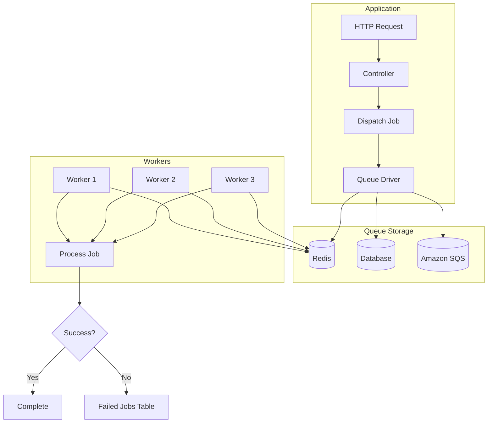
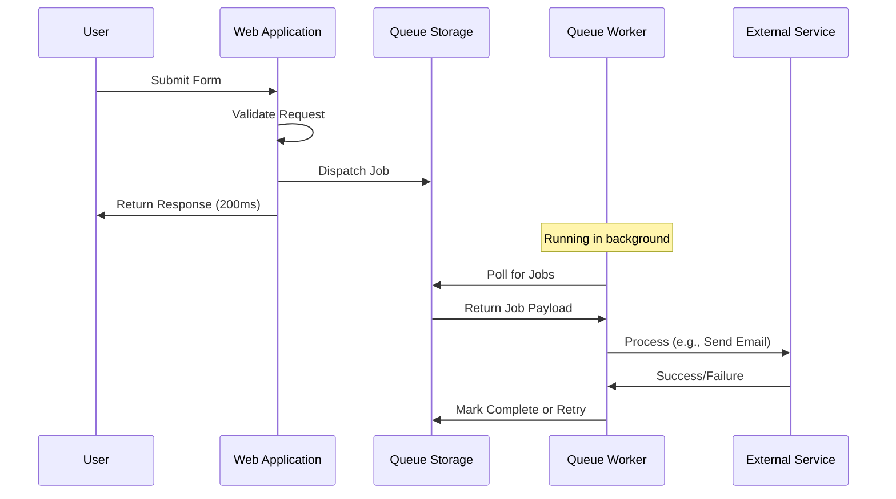
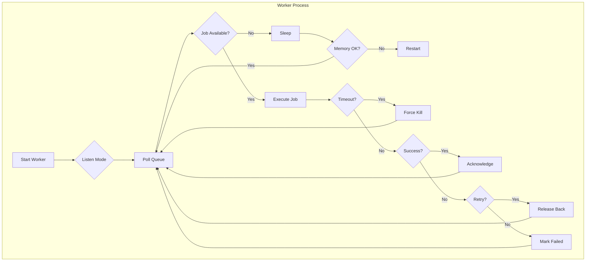

# How to Implement Queue Workers in Laravel

Author: [nawazdhandala](https://www.github.com/nawazdhandala)

Tags: PHP, Laravel, Queue, Workers, Jobs, Redis

Description: A comprehensive guide to implementing queue workers in Laravel. Learn job creation, queue drivers, worker configuration, retry strategies, and production best practices for reliable background processing.

---

> Queues allow you to defer time-consuming tasks, such as sending emails or processing uploads, to a later time. This drastically improves web request response times and creates a more responsive user experience.

Laravel's queue system provides a unified API across a variety of queue backends. Whether you are using Redis, Amazon SQS, or a database, the queue API remains consistent. This guide covers everything from basic job creation to production-grade worker management.

---

## Understanding Laravel Queues

Before diving into code, let's understand how Laravel's queue system works:



The queue workflow follows this pattern:



---

## Configuration

### Setting Up Queue Drivers

Configure your queue driver in the `.env` file:

```bash
# .env

# Choose your queue driver
QUEUE_CONNECTION=redis

# Redis configuration
REDIS_HOST=127.0.0.1
REDIS_PASSWORD=null
REDIS_PORT=6379
REDIS_QUEUE=default

# For database driver
# QUEUE_CONNECTION=database

# For Amazon SQS
# QUEUE_CONNECTION=sqs
# AWS_ACCESS_KEY_ID=your-key
# AWS_SECRET_ACCESS_KEY=your-secret
# SQS_PREFIX=https://sqs.us-east-1.amazonaws.com/your-account-id
# SQS_QUEUE=your-queue-name
# AWS_DEFAULT_REGION=us-east-1
```

### Queue Configuration File

Review and customize `config/queue.php`:

```php
<?php
// config/queue.php

return [
    // Default queue connection
    'default' => env('QUEUE_CONNECTION', 'sync'),

    'connections' => [
        // Synchronous driver - jobs run immediately (good for testing)
        'sync' => [
            'driver' => 'sync',
        ],

        // Database driver - stores jobs in a database table
        'database' => [
            'driver' => 'database',
            'table' => 'jobs',
            'queue' => 'default',
            'retry_after' => 90,  // Seconds before retrying a job
            'after_commit' => false,  // Dispatch after database commit
        ],

        // Redis driver - recommended for production
        'redis' => [
            'driver' => 'redis',
            'connection' => 'default',
            'queue' => env('REDIS_QUEUE', 'default'),
            'retry_after' => 90,
            'block_for' => null,  // Seconds to block waiting for jobs
            'after_commit' => false,
        ],

        // Amazon SQS driver
        'sqs' => [
            'driver' => 'sqs',
            'key' => env('AWS_ACCESS_KEY_ID'),
            'secret' => env('AWS_SECRET_ACCESS_KEY'),
            'prefix' => env('SQS_PREFIX', 'https://sqs.us-east-1.amazonaws.com/your-account-id'),
            'queue' => env('SQS_QUEUE', 'default'),
            'suffix' => env('SQS_SUFFIX'),
            'region' => env('AWS_DEFAULT_REGION', 'us-east-1'),
            'after_commit' => false,
        ],
    ],

    // Failed job storage
    'failed' => [
        'driver' => env('QUEUE_FAILED_DRIVER', 'database-uuids'),
        'database' => env('DB_CONNECTION', 'mysql'),
        'table' => 'failed_jobs',
    ],
];
```

### Database Setup for Queue Tables

If using the database driver, create the required tables:

```bash
# Create jobs table migration
php artisan queue:table

# Create failed_jobs table migration
php artisan queue:failed-table

# Create job_batches table for job batching
php artisan queue:batches-table

# Run migrations
php artisan migrate
```

The jobs table migration looks like this:

```php
<?php
// database/migrations/create_jobs_table.php

use Illuminate\Database\Migrations\Migration;
use Illuminate\Database\Schema\Blueprint;
use Illuminate\Support\Facades\Schema;

return new class extends Migration
{
    public function up(): void
    {
        Schema::create('jobs', function (Blueprint $table) {
            $table->bigIncrements('id');
            $table->string('queue')->index();
            $table->longText('payload');
            $table->unsignedTinyInteger('attempts');
            $table->unsignedInteger('reserved_at')->nullable();
            $table->unsignedInteger('available_at');
            $table->unsignedInteger('created_at');
        });
    }

    public function down(): void
    {
        Schema::dropIfExists('jobs');
    }
};
```

---

## Creating Jobs

### Basic Job Structure

Generate a job using Artisan:

```bash
php artisan make:job ProcessPodcastUpload
```

This creates a job class:

```php
<?php
// app/Jobs/ProcessPodcastUpload.php

namespace App\Jobs;

use App\Models\Podcast;
use App\Services\AudioProcessingService;
use Illuminate\Bus\Queueable;
use Illuminate\Contracts\Queue\ShouldQueue;
use Illuminate\Foundation\Bus\Dispatchable;
use Illuminate\Queue\InteractsWithQueue;
use Illuminate\Queue\SerializesModels;
use Illuminate\Support\Facades\Log;
use Illuminate\Support\Facades\Storage;

class ProcessPodcastUpload implements ShouldQueue
{
    // Traits that provide queue functionality
    use Dispatchable;       // Provides dispatch() method
    use InteractsWithQueue; // Provides delete(), release(), fail() methods
    use Queueable;          // Provides onQueue(), onConnection(), delay() methods
    use SerializesModels;   // Serializes Eloquent models properly

    // Public properties for job configuration
    public int $tries = 3;           // Maximum attempts
    public int $maxExceptions = 2;   // Max exceptions before failing
    public int $timeout = 120;       // Seconds before timeout
    public int $backoff = 60;        // Seconds between retries

    // Constructor - receives data needed for the job
    public function __construct(
        public Podcast $podcast,
        public string $originalFilePath
    ) {
        // Properties are automatically serialized
    }

    // The handle method contains your job logic
    public function handle(AudioProcessingService $audioService): void
    {
        Log::info("Processing podcast: {$this->podcast->id}");

        // Update status to processing
        $this->podcast->update(['status' => 'processing']);

        try {
            // Process the audio file
            $processedPath = $audioService->process(
                $this->originalFilePath,
                [
                    'normalize' => true,
                    'format' => 'mp3',
                    'bitrate' => '192k',
                ]
            );

            // Generate waveform data
            $waveformData = $audioService->generateWaveform($processedPath);

            // Get duration
            $duration = $audioService->getDuration($processedPath);

            // Update podcast with processed data
            $this->podcast->update([
                'status' => 'published',
                'processed_path' => $processedPath,
                'waveform_data' => $waveformData,
                'duration_seconds' => $duration,
            ]);

            // Clean up original file
            Storage::delete($this->originalFilePath);

            Log::info("Podcast processed successfully: {$this->podcast->id}");
        } catch (\Exception $e) {
            // Update status to failed
            $this->podcast->update(['status' => 'failed']);
            
            // Re-throw to trigger retry logic
            throw $e;
        }
    }

    // Called when job fails after all retry attempts
    public function failed(\Throwable $exception): void
    {
        Log::error("Podcast processing failed: {$this->podcast->id}", [
            'exception' => $exception->getMessage(),
            'trace' => $exception->getTraceAsString(),
        ]);

        // Notify admin or user about the failure
        $this->podcast->user->notify(
            new PodcastProcessingFailed($this->podcast, $exception)
        );
    }
}
```

### Job Configuration Options

```php
<?php
// app/Jobs/SendWelcomeEmail.php

namespace App\Jobs;

use App\Mail\WelcomeEmail;
use App\Models\User;
use Illuminate\Bus\Queueable;
use Illuminate\Contracts\Queue\ShouldBeUnique;
use Illuminate\Contracts\Queue\ShouldQueue;
use Illuminate\Foundation\Bus\Dispatchable;
use Illuminate\Queue\InteractsWithQueue;
use Illuminate\Queue\SerializesModels;
use Illuminate\Support\Facades\Mail;

class SendWelcomeEmail implements ShouldQueue, ShouldBeUnique
{
    use Dispatchable, InteractsWithQueue, Queueable, SerializesModels;

    // Retry configuration
    public int $tries = 5;              // Max attempts before failing
    public array $backoff = [30, 60, 120, 300, 600];  // Progressive backoff
    public int $timeout = 30;           // Job timeout in seconds
    public int $maxExceptions = 3;      // Max exceptions before failing

    // Unique job configuration
    public int $uniqueFor = 3600;       // Stay unique for 1 hour

    public function __construct(
        public User $user
    ) {}

    // Unique identifier for preventing duplicate jobs
    public function uniqueId(): string
    {
        return $this->user->id;
    }

    // Unique lock key (optional custom key)
    public function uniqueVia(): \Illuminate\Contracts\Cache\Repository
    {
        return \Illuminate\Support\Facades\Cache::driver('redis');
    }

    public function handle(): void
    {
        Mail::to($this->user->email)->send(new WelcomeEmail($this->user));
    }

    // Determine if job should be queued
    public function shouldQueue(): bool
    {
        // Only queue if user has verified email
        return $this->user->hasVerifiedEmail();
    }

    // Tags for monitoring and filtering
    public function tags(): array
    {
        return [
            'email',
            'welcome',
            'user:' . $this->user->id,
        ];
    }

    // Middleware to run before the job
    public function middleware(): array
    {
        return [
            new \Illuminate\Queue\Middleware\WithoutOverlapping($this->user->id),
            new \Illuminate\Queue\Middleware\ThrottlesExceptions(10, 5),
        ];
    }

    // Calculate retry delay based on attempt number
    public function retryUntil(): \DateTime
    {
        return now()->addHours(24);
    }

    public function failed(\Throwable $exception): void
    {
        // Log failure and notify
        \Log::error('Welcome email failed', [
            'user_id' => $this->user->id,
            'error' => $exception->getMessage(),
        ]);
    }
}
```

---

## Dispatching Jobs

### Basic Dispatching

```php
<?php
// app/Http/Controllers/PodcastController.php

namespace App\Http\Controllers;

use App\Jobs\ProcessPodcastUpload;
use App\Models\Podcast;
use Illuminate\Http\Request;
use Illuminate\Support\Facades\Storage;

class PodcastController extends Controller
{
    public function store(Request $request)
    {
        $request->validate([
            'title' => 'required|string|max:255',
            'audio' => 'required|file|mimes:mp3,wav,m4a|max:102400',
        ]);

        // Store the uploaded file
        $path = $request->file('audio')->store('podcasts/uploads');

        // Create the podcast record
        $podcast = Podcast::create([
            'title' => $request->title,
            'user_id' => auth()->id(),
            'original_path' => $path,
            'status' => 'pending',
        ]);

        // Dispatch the processing job
        ProcessPodcastUpload::dispatch($podcast, $path);

        return response()->json([
            'message' => 'Podcast uploaded and queued for processing',
            'podcast' => $podcast,
        ], 202);
    }
}
```

### Advanced Dispatching Options

```php
<?php
use App\Jobs\ProcessPodcastUpload;
use App\Jobs\SendWelcomeEmail;
use App\Jobs\GenerateReport;
use Illuminate\Support\Facades\Bus;

// Basic dispatch
ProcessPodcastUpload::dispatch($podcast, $path);

// Dispatch to specific queue
ProcessPodcastUpload::dispatch($podcast, $path)
    ->onQueue('audio-processing');

// Dispatch to specific connection
ProcessPodcastUpload::dispatch($podcast, $path)
    ->onConnection('sqs');

// Dispatch with delay
SendWelcomeEmail::dispatch($user)
    ->delay(now()->addMinutes(10));

// Dispatch after database commit (prevents race conditions)
ProcessPodcastUpload::dispatch($podcast, $path)
    ->afterCommit();

// Dispatch synchronously (bypass queue)
ProcessPodcastUpload::dispatchSync($podcast, $path);

// Dispatch if condition is true
ProcessPodcastUpload::dispatchIf(
    $podcast->needs_processing,
    $podcast,
    $path
);

// Dispatch unless condition is true
ProcessPodcastUpload::dispatchUnless(
    $podcast->is_processed,
    $podcast,
    $path
);

// Chain jobs - run in sequence
Bus::chain([
    new ProcessPodcastUpload($podcast, $path),
    new GenerateThumbnail($podcast),
    new NotifySubscribers($podcast),
])->onQueue('podcast-pipeline')->dispatch();

// Chain with closure
Bus::chain([
    new ProcessPodcastUpload($podcast, $path),
    function () use ($podcast) {
        $podcast->update(['fully_processed' => true]);
    },
])->dispatch();

// Chain with catch for failures
Bus::chain([
    new ProcessPodcastUpload($podcast, $path),
    new GenerateThumbnail($podcast),
])->catch(function (\Throwable $e) use ($podcast) {
    $podcast->update(['status' => 'failed']);
})->dispatch();
```

### Job Batching

Job batching allows you to dispatch a batch of jobs and perform actions when all jobs complete:

```php
<?php
// app/Http/Controllers/ReportController.php

namespace App\Http\Controllers;

use App\Jobs\GenerateUserReport;
use App\Models\User;
use Illuminate\Bus\Batch;
use Illuminate\Support\Facades\Bus;

class ReportController extends Controller
{
    public function generateAllUserReports()
    {
        $users = User::where('is_active', true)->get();

        // Create jobs for each user
        $jobs = $users->map(function (User $user) {
            return new GenerateUserReport($user);
        })->toArray();

        // Dispatch as a batch
        $batch = Bus::batch($jobs)
            ->then(function (Batch $batch) {
                // All jobs completed successfully
                \Log::info("Batch {$batch->id} completed successfully");
                
                // Send notification that all reports are ready
                \Notification::route('mail', 'admin@example.com')
                    ->notify(new AllReportsGenerated($batch));
            })
            ->catch(function (Batch $batch, \Throwable $e) {
                // First job failure
                \Log::error("Batch {$batch->id} failed", [
                    'error' => $e->getMessage(),
                ]);
            })
            ->finally(function (Batch $batch) {
                // Batch finished (success or failure)
                \Log::info("Batch {$batch->id} finished", [
                    'total' => $batch->totalJobs,
                    'pending' => $batch->pendingJobs,
                    'failed' => $batch->failedJobs,
                ]);
            })
            ->name('User Reports Generation')
            ->allowFailures()  // Continue even if some jobs fail
            ->onQueue('reports')
            ->dispatch();

        return response()->json([
            'message' => 'Report generation started',
            'batch_id' => $batch->id,
            'total_jobs' => $batch->totalJobs,
        ]);
    }

    public function getBatchStatus(string $batchId)
    {
        $batch = Bus::findBatch($batchId);

        if (!$batch) {
            return response()->json(['error' => 'Batch not found'], 404);
        }

        return response()->json([
            'id' => $batch->id,
            'name' => $batch->name,
            'total_jobs' => $batch->totalJobs,
            'pending_jobs' => $batch->pendingJobs,
            'failed_jobs' => $batch->failedJobs,
            'progress' => $batch->progress(),
            'finished' => $batch->finished(),
            'cancelled' => $batch->cancelled(),
        ]);
    }
}
```

The job must use the `Batchable` trait:

```php
<?php
// app/Jobs/GenerateUserReport.php

namespace App\Jobs;

use App\Models\User;
use Illuminate\Bus\Batchable;
use Illuminate\Bus\Queueable;
use Illuminate\Contracts\Queue\ShouldQueue;
use Illuminate\Foundation\Bus\Dispatchable;
use Illuminate\Queue\InteractsWithQueue;
use Illuminate\Queue\SerializesModels;

class GenerateUserReport implements ShouldQueue
{
    use Batchable, Dispatchable, InteractsWithQueue, Queueable, SerializesModels;

    public function __construct(
        public User $user
    ) {}

    public function handle(): void
    {
        // Check if batch was cancelled
        if ($this->batch()->cancelled()) {
            return;
        }

        // Generate the report
        $reportData = $this->generateReport();

        // Store the report
        \Storage::put(
            "reports/{$this->user->id}/report.pdf",
            $reportData
        );

        // Add more jobs to the batch if needed
        $this->batch()->add([
            new SendReportEmail($this->user),
        ]);
    }

    private function generateReport(): string
    {
        // Report generation logic
        return \PDF::loadView('reports.user', [
            'user' => $this->user,
            'data' => $this->user->getReportData(),
        ])->output();
    }
}
```

---

## Running Queue Workers

### Basic Worker Command

```bash
# Start a worker
php artisan queue:work

# Process jobs from specific queue
php artisan queue:work --queue=high,default,low

# Process jobs from specific connection
php artisan queue:work redis

# Process single job and exit
php artisan queue:work --once

# Process jobs until queue is empty
php artisan queue:work --stop-when-empty

# Set memory limit (MB)
php artisan queue:work --memory=512

# Set job timeout (seconds)
php artisan queue:work --timeout=60

# Set sleep duration when no jobs (seconds)
php artisan queue:work --sleep=3

# Number of attempts before failing
php artisan queue:work --tries=3

# Backoff time between retries (seconds)
php artisan queue:work --backoff=30

# Process jobs with verbose output
php artisan queue:work -v
```

### Worker Architecture



### Queue Listen vs Work

```bash
# queue:work - More efficient, keeps process running
# Recommended for production with process managers
php artisan queue:work

# queue:listen - Restarts after each job
# Useful for development, picks up code changes
php artisan queue:listen
```

---

## Production Deployment

### Using Supervisor

Supervisor ensures your workers stay running:

```ini
; /etc/supervisor/conf.d/laravel-worker.conf

[program:laravel-worker]
process_name=%(program_name)s_%(process_num)02d
command=php /var/www/html/artisan queue:work redis --sleep=3 --tries=3 --max-time=3600
autostart=true
autorestart=true
stopasgroup=true
killasgroup=true
user=www-data
numprocs=8
redirect_stderr=true
stdout_logfile=/var/www/html/storage/logs/worker.log
stopwaitsecs=3600
```

Supervisor commands:

```bash
# Read configuration
sudo supervisorctl reread

# Update with new configuration
sudo supervisorctl update

# Start workers
sudo supervisorctl start laravel-worker:*

# Stop workers
sudo supervisorctl stop laravel-worker:*

# Restart workers
sudo supervisorctl restart laravel-worker:*

# Check status
sudo supervisorctl status
```

### Multiple Queue Configuration

For different priority queues:

```ini
; /etc/supervisor/conf.d/laravel-workers.conf

; High priority queue - more processes
[program:laravel-worker-high]
process_name=%(program_name)s_%(process_num)02d
command=php /var/www/html/artisan queue:work redis --queue=high --sleep=1 --tries=3
autostart=true
autorestart=true
user=www-data
numprocs=4
redirect_stderr=true
stdout_logfile=/var/www/html/storage/logs/worker-high.log

; Default queue
[program:laravel-worker-default]
process_name=%(program_name)s_%(process_num)02d
command=php /var/www/html/artisan queue:work redis --queue=default --sleep=3 --tries=3
autostart=true
autorestart=true
user=www-data
numprocs=2
redirect_stderr=true
stdout_logfile=/var/www/html/storage/logs/worker-default.log

; Low priority queue - fewer processes
[program:laravel-worker-low]
process_name=%(program_name)s_%(process_num)02d
command=php /var/www/html/artisan queue:work redis --queue=low --sleep=5 --tries=3
autostart=true
autorestart=true
user=www-data
numprocs=1
redirect_stderr=true
stdout_logfile=/var/www/html/storage/logs/worker-low.log

; Group all workers
[group:laravel-workers]
programs=laravel-worker-high,laravel-worker-default,laravel-worker-low
```

### Using Systemd

Alternative to Supervisor using systemd:

```ini
; /etc/systemd/system/laravel-worker@.service

[Unit]
Description=Laravel Queue Worker %i
After=network.target

[Service]
User=www-data
Group=www-data
Restart=always
RestartSec=5
WorkingDirectory=/var/www/html
ExecStart=/usr/bin/php artisan queue:work redis --sleep=3 --tries=3 --max-time=3600

[Install]
WantedBy=multi-user.target
```

Manage with systemd:

```bash
# Enable and start 4 workers
for i in {1..4}; do
    sudo systemctl enable laravel-worker@$i
    sudo systemctl start laravel-worker@$i
done

# Check status
sudo systemctl status laravel-worker@*

# Restart all workers
sudo systemctl restart laravel-worker@*
```

### Docker Deployment

```dockerfile
# Dockerfile for queue worker

FROM php:8.2-cli

# Install extensions
RUN docker-php-ext-install pdo pdo_mysql pcntl

# Install Redis extension
RUN pecl install redis && docker-php-ext-enable redis

# Set working directory
WORKDIR /var/www/html

# Copy application
COPY . .

# Install composer dependencies
RUN composer install --no-dev --optimize-autoloader

# Run queue worker
CMD ["php", "artisan", "queue:work", "--sleep=3", "--tries=3", "--max-time=3600"]
```

Docker Compose configuration:

```yaml
# docker-compose.yml

version: '3.8'

services:
  app:
    build: .
    volumes:
      - .:/var/www/html
    depends_on:
      - redis
      - mysql

  queue-worker-high:
    build: .
    command: php artisan queue:work redis --queue=high --sleep=1 --tries=3
    volumes:
      - .:/var/www/html
    depends_on:
      - redis
      - mysql
    deploy:
      replicas: 4
    restart: unless-stopped

  queue-worker-default:
    build: .
    command: php artisan queue:work redis --queue=default --sleep=3 --tries=3
    volumes:
      - .:/var/www/html
    depends_on:
      - redis
      - mysql
    deploy:
      replicas: 2
    restart: unless-stopped

  queue-worker-low:
    build: .
    command: php artisan queue:work redis --queue=low --sleep=5 --tries=3
    volumes:
      - .:/var/www/html
    depends_on:
      - redis
      - mysql
    deploy:
      replicas: 1
    restart: unless-stopped

  redis:
    image: redis:7-alpine
    volumes:
      - redis-data:/data

  mysql:
    image: mysql:8
    environment:
      MYSQL_DATABASE: laravel
      MYSQL_ROOT_PASSWORD: secret
    volumes:
      - mysql-data:/var/lib/mysql

volumes:
  redis-data:
  mysql-data:
```

---

## Handling Failed Jobs

### Failed Job Configuration

```php
<?php
// app/Jobs/ProcessPayment.php

namespace App\Jobs;

use App\Models\Payment;
use App\Services\PaymentGateway;
use Illuminate\Bus\Queueable;
use Illuminate\Contracts\Queue\ShouldQueue;
use Illuminate\Foundation\Bus\Dispatchable;
use Illuminate\Queue\InteractsWithQueue;
use Illuminate\Queue\SerializesModels;

class ProcessPayment implements ShouldQueue
{
    use Dispatchable, InteractsWithQueue, Queueable, SerializesModels;

    // Retry configuration
    public int $tries = 5;
    public int $maxExceptions = 3;
    public array $backoff = [30, 60, 300, 900, 3600];  // Progressive backoff

    // Delete job if models are missing
    public bool $deleteWhenMissingModels = true;

    public function __construct(
        public Payment $payment
    ) {}

    public function handle(PaymentGateway $gateway): void
    {
        // Process the payment
        $result = $gateway->charge(
            $this->payment->amount,
            $this->payment->payment_method_id
        );

        if ($result->successful()) {
            $this->payment->update([
                'status' => 'completed',
                'transaction_id' => $result->transactionId,
            ]);
        } else {
            // Will trigger retry
            throw new PaymentFailedException($result->errorMessage);
        }
    }

    // Determine if should retry based on exception
    public function shouldRetry(\Throwable $exception): bool
    {
        // Don't retry for certain exceptions
        if ($exception instanceof CardDeclinedException) {
            return false;
        }

        if ($exception instanceof InvalidPaymentMethodException) {
            return false;
        }

        return true;
    }

    // Calculate retry delay dynamically
    public function retryAfter(): int
    {
        // Exponential backoff with jitter
        $attempt = $this->attempts();
        $baseDelay = min(pow(2, $attempt) * 30, 3600);
        $jitter = rand(0, $baseDelay / 4);
        
        return $baseDelay + $jitter;
    }

    // Called when all retries exhausted
    public function failed(\Throwable $exception): void
    {
        // Update payment status
        $this->payment->update([
            'status' => 'failed',
            'failure_reason' => $exception->getMessage(),
        ]);

        // Notify customer
        $this->payment->user->notify(
            new PaymentFailed($this->payment, $exception)
        );

        // Alert operations team for critical failures
        if ($this->payment->amount > 10000) {
            \Notification::route('slack', config('services.slack.alerts'))
                ->notify(new HighValuePaymentFailed($this->payment));
        }

        // Log for debugging
        \Log::error('Payment processing failed permanently', [
            'payment_id' => $this->payment->id,
            'amount' => $this->payment->amount,
            'user_id' => $this->payment->user_id,
            'attempts' => $this->attempts(),
            'exception' => $exception->getMessage(),
            'trace' => $exception->getTraceAsString(),
        ]);
    }
}
```

### Managing Failed Jobs

```bash
# List all failed jobs
php artisan queue:failed

# View specific failed job
php artisan queue:failed 5

# Retry a specific failed job
php artisan queue:retry 5

# Retry all failed jobs
php artisan queue:retry all

# Retry failed jobs from specific queue
php artisan queue:retry --queue=payments

# Delete a failed job
php artisan queue:forget 5

# Delete all failed jobs
php artisan queue:flush

# Prune old failed jobs (older than 24 hours)
php artisan queue:prune-failed --hours=24
```

### Custom Failed Job Handler

```php
<?php
// app/Providers/AppServiceProvider.php

namespace App\Providers;

use Illuminate\Queue\Events\JobFailed;
use Illuminate\Queue\Events\JobProcessed;
use Illuminate\Queue\Events\JobProcessing;
use Illuminate\Support\Facades\Queue;
use Illuminate\Support\ServiceProvider;

class AppServiceProvider extends ServiceProvider
{
    public function boot(): void
    {
        // Before job processes
        Queue::before(function (JobProcessing $event) {
            \Log::info('Job starting', [
                'job' => $event->job->resolveName(),
                'queue' => $event->job->getQueue(),
                'attempt' => $event->job->attempts(),
            ]);
        });

        // After job processes successfully
        Queue::after(function (JobProcessed $event) {
            \Log::info('Job completed', [
                'job' => $event->job->resolveName(),
                'queue' => $event->job->getQueue(),
            ]);
        });

        // When job fails
        Queue::failing(function (JobFailed $event) {
            \Log::error('Job failed', [
                'job' => $event->job->resolveName(),
                'queue' => $event->job->getQueue(),
                'exception' => $event->exception->getMessage(),
            ]);

            // Send to error tracking service
            \Sentry::captureException($event->exception, [
                'extra' => [
                    'job' => $event->job->resolveName(),
                    'payload' => $event->job->payload(),
                ],
            ]);
        });
    }
}
```

---

## Job Middleware

Job middleware allows you to wrap job execution with custom logic:

```php
<?php
// app/Jobs/Middleware/RateLimited.php

namespace App\Jobs\Middleware;

use Illuminate\Support\Facades\Redis;

class RateLimited
{
    public function __construct(
        public string $key = 'default',
        public int $maxAttempts = 10,
        public int $decaySeconds = 60
    ) {}

    public function handle(object $job, callable $next): void
    {
        Redis::throttle($this->key)
            ->block(0)  // Don't wait
            ->allow($this->maxAttempts)
            ->every($this->decaySeconds)
            ->then(
                function () use ($job, $next) {
                    // Lock obtained, process job
                    $next($job);
                },
                function () use ($job) {
                    // Could not obtain lock, release back to queue
                    $job->release($this->decaySeconds);
                }
            );
    }
}
```

```php
<?php
// app/Jobs/Middleware/EnsureActiveSubscription.php

namespace App\Jobs\Middleware;

class EnsureActiveSubscription
{
    public function handle(object $job, callable $next): void
    {
        // Check if user has active subscription
        if (!$job->user->hasActiveSubscription()) {
            \Log::warning('Job skipped - no active subscription', [
                'user_id' => $job->user->id,
                'job' => get_class($job),
            ]);
            return;  // Skip job silently
        }

        $next($job);
    }
}
```

Using middleware in jobs:

```php
<?php
// app/Jobs/SendBulkEmail.php

namespace App\Jobs;

use App\Jobs\Middleware\RateLimited;
use App\Jobs\Middleware\EnsureActiveSubscription;
use Illuminate\Bus\Queueable;
use Illuminate\Contracts\Queue\ShouldQueue;
use Illuminate\Foundation\Bus\Dispatchable;
use Illuminate\Queue\InteractsWithQueue;
use Illuminate\Queue\Middleware\WithoutOverlapping;
use Illuminate\Queue\Middleware\ThrottlesExceptions;
use Illuminate\Queue\SerializesModels;

class SendBulkEmail implements ShouldQueue
{
    use Dispatchable, InteractsWithQueue, Queueable, SerializesModels;

    public function __construct(
        public User $user,
        public Campaign $campaign
    ) {}

    // Define middleware for this job
    public function middleware(): array
    {
        return [
            // Prevent overlapping jobs for same user
            new WithoutOverlapping($this->user->id),
            
            // Rate limit to 100 emails per minute
            new RateLimited('email-sending', 100, 60),
            
            // Throttle exceptions - max 10 in 5 minutes
            new ThrottlesExceptions(10, 5),
            
            // Custom middleware
            new EnsureActiveSubscription(),
        ];
    }

    public function handle(): void
    {
        // Send the email
    }
}
```

---

## Monitoring and Observability

### Laravel Horizon (Redis only)

Laravel Horizon provides a beautiful dashboard for Redis queues:

```bash
# Install Horizon
composer require laravel/horizon

# Publish configuration
php artisan horizon:install

# Run Horizon
php artisan horizon
```

Configure Horizon:

```php
<?php
// config/horizon.php

return [
    'domain' => null,
    'path' => 'horizon',
    
    // Authentication middleware
    'middleware' => ['web', 'auth:admin'],

    'environments' => [
        'production' => [
            'supervisor-1' => [
                'connection' => 'redis',
                'queue' => ['high', 'default', 'low'],
                'balance' => 'auto',  // auto, simple, or false
                'autoScalingStrategy' => 'time',
                'minProcesses' => 1,
                'maxProcesses' => 10,
                'maxTime' => 0,  // Max seconds a worker should run
                'maxJobs' => 0,  // Max jobs before restart
                'memory' => 128,
                'tries' => 3,
                'timeout' => 60,
                'nice' => 0,  // Process priority
            ],
        ],
        
        'local' => [
            'supervisor-1' => [
                'connection' => 'redis',
                'queue' => ['default'],
                'balance' => 'simple',
                'processes' => 3,
                'tries' => 3,
            ],
        ],
    ],
];
```

### Custom Metrics and Logging

```php
<?php
// app/Jobs/Concerns/TracksMetrics.php

namespace App\Jobs\Concerns;

use Illuminate\Support\Facades\Log;
use Illuminate\Support\Facades\Redis;

trait TracksMetrics
{
    protected float $startTime;

    public function trackStart(): void
    {
        $this->startTime = microtime(true);
        
        // Increment job started counter
        Redis::incr("queue:metrics:{$this->getJobName()}:started");
    }

    public function trackComplete(): void
    {
        $duration = microtime(true) - $this->startTime;
        
        // Record completion
        Redis::incr("queue:metrics:{$this->getJobName()}:completed");
        
        // Record duration in histogram buckets
        $bucket = $this->getDurationBucket($duration);
        Redis::incr("queue:metrics:{$this->getJobName()}:duration:{$bucket}");
        
        // Log for debugging
        Log::info('Job completed', [
            'job' => $this->getJobName(),
            'duration_ms' => round($duration * 1000, 2),
            'attempt' => $this->attempts(),
        ]);
    }

    public function trackFailed(\Throwable $exception): void
    {
        $duration = microtime(true) - $this->startTime;
        
        Redis::incr("queue:metrics:{$this->getJobName()}:failed");
        
        Log::error('Job failed', [
            'job' => $this->getJobName(),
            'duration_ms' => round($duration * 1000, 2),
            'attempt' => $this->attempts(),
            'exception' => $exception->getMessage(),
        ]);
    }

    protected function getJobName(): string
    {
        return class_basename(static::class);
    }

    protected function getDurationBucket(float $duration): string
    {
        $ms = $duration * 1000;
        
        if ($ms < 100) return 'lt_100ms';
        if ($ms < 500) return '100_500ms';
        if ($ms < 1000) return '500_1000ms';
        if ($ms < 5000) return '1_5s';
        if ($ms < 30000) return '5_30s';
        return 'gt_30s';
    }
}
```

### Health Checks

```php
<?php
// app/Http/Controllers/HealthController.php

namespace App\Http\Controllers;

use Illuminate\Support\Facades\DB;
use Illuminate\Support\Facades\Queue;
use Illuminate\Support\Facades\Redis;

class HealthController extends Controller
{
    public function queueHealth()
    {
        $checks = [
            'redis_connection' => $this->checkRedisConnection(),
            'queue_size' => $this->checkQueueSize(),
            'oldest_job' => $this->checkOldestJob(),
            'failed_jobs' => $this->checkFailedJobs(),
            'workers' => $this->checkWorkers(),
        ];

        $healthy = collect($checks)->every(fn ($check) => $check['healthy']);

        return response()->json([
            'healthy' => $healthy,
            'checks' => $checks,
        ], $healthy ? 200 : 503);
    }

    private function checkRedisConnection(): array
    {
        try {
            Redis::ping();
            return ['healthy' => true, 'message' => 'Connected'];
        } catch (\Exception $e) {
            return ['healthy' => false, 'message' => $e->getMessage()];
        }
    }

    private function checkQueueSize(): array
    {
        $queues = ['high', 'default', 'low'];
        $sizes = [];
        $totalSize = 0;

        foreach ($queues as $queue) {
            $size = Redis::llen("queues:{$queue}");
            $sizes[$queue] = $size;
            $totalSize += $size;
        }

        // Alert if queue is backing up
        $healthy = $totalSize < 10000;

        return [
            'healthy' => $healthy,
            'queues' => $sizes,
            'total' => $totalSize,
        ];
    }

    private function checkOldestJob(): array
    {
        // Check for jobs stuck in queue
        $oldestJob = DB::table('jobs')
            ->orderBy('created_at', 'asc')
            ->first();

        if (!$oldestJob) {
            return ['healthy' => true, 'message' => 'No pending jobs'];
        }

        $age = now()->timestamp - $oldestJob->created_at;
        $healthy = $age < 300;  // Alert if job is older than 5 minutes

        return [
            'healthy' => $healthy,
            'oldest_job_age_seconds' => $age,
        ];
    }

    private function checkFailedJobs(): array
    {
        $recentFailures = DB::table('failed_jobs')
            ->where('failed_at', '>=', now()->subHour())
            ->count();

        $healthy = $recentFailures < 10;

        return [
            'healthy' => $healthy,
            'recent_failures' => $recentFailures,
        ];
    }

    private function checkWorkers(): array
    {
        // Check Horizon workers if available
        if (class_exists(\Laravel\Horizon\Horizon::class)) {
            $masters = Redis::smembers('horizon:masters');
            $supervisors = Redis::smembers('horizon:supervisors');

            return [
                'healthy' => count($masters) > 0,
                'masters' => count($masters),
                'supervisors' => count($supervisors),
            ];
        }

        return ['healthy' => true, 'message' => 'Horizon not installed'];
    }
}
```

---

## Queue Priorities and Routing

### Priority Queues

```php
<?php
// High priority - process first
SendPasswordReset::dispatch($user)->onQueue('high');

// Default priority
ProcessOrder::dispatch($order)->onQueue('default');

// Low priority - process when idle
GenerateReport::dispatch($report)->onQueue('low');

// Start worker with priority order
// php artisan queue:work --queue=high,default,low
```

### Dynamic Queue Routing

```php
<?php
// app/Jobs/ProcessOrder.php

class ProcessOrder implements ShouldQueue
{
    use Dispatchable, InteractsWithQueue, Queueable, SerializesModels;

    public function __construct(
        public Order $order
    ) {
        // Route to queue based on order value
        $this->onQueue($this->determineQueue());
    }

    private function determineQueue(): string
    {
        if ($this->order->total > 10000) {
            return 'high-value-orders';
        }

        if ($this->order->is_express) {
            return 'express-orders';
        }

        return 'default-orders';
    }
}
```

### Queue Events for Routing

```php
<?php
// app/Providers/QueueServiceProvider.php

namespace App\Providers;

use App\Jobs\Contracts\HighPriorityJob;
use Illuminate\Queue\Events\JobQueued;
use Illuminate\Support\Facades\Queue;
use Illuminate\Support\ServiceProvider;

class QueueServiceProvider extends ServiceProvider
{
    public function boot(): void
    {
        // Automatically route jobs based on interface
        Queue::createPayloadUsing(function (string $connection, string $queue, array $payload) {
            $job = unserialize($payload['data']['command']);

            if ($job instanceof HighPriorityJob) {
                $payload['queue'] = 'high';
            }

            return $payload;
        });
    }
}
```

---

## Testing Jobs

### Basic Job Testing

```php
<?php
// tests/Feature/Jobs/ProcessPodcastUploadTest.php

namespace Tests\Feature\Jobs;

use App\Jobs\ProcessPodcastUpload;
use App\Models\Podcast;
use App\Services\AudioProcessingService;
use Illuminate\Foundation\Testing\RefreshDatabase;
use Illuminate\Support\Facades\Queue;
use Illuminate\Support\Facades\Storage;
use Tests\TestCase;

class ProcessPodcastUploadTest extends TestCase
{
    use RefreshDatabase;

    public function test_job_is_dispatched_when_podcast_uploaded(): void
    {
        Queue::fake();

        $podcast = Podcast::factory()->create();

        ProcessPodcastUpload::dispatch($podcast, 'path/to/file.mp3');

        Queue::assertPushed(ProcessPodcastUpload::class, function ($job) use ($podcast) {
            return $job->podcast->id === $podcast->id;
        });
    }

    public function test_job_is_pushed_to_correct_queue(): void
    {
        Queue::fake();

        $podcast = Podcast::factory()->create();

        ProcessPodcastUpload::dispatch($podcast, 'path/to/file.mp3')
            ->onQueue('audio-processing');

        Queue::assertPushedOn('audio-processing', ProcessPodcastUpload::class);
    }

    public function test_job_processes_podcast_successfully(): void
    {
        Storage::fake('local');
        
        // Create a fake audio file
        Storage::put('podcasts/test.mp3', 'fake audio content');

        $podcast = Podcast::factory()->create([
            'status' => 'pending',
        ]);

        // Mock the audio processing service
        $this->mock(AudioProcessingService::class, function ($mock) {
            $mock->shouldReceive('process')
                ->once()
                ->andReturn('processed/podcast.mp3');
            
            $mock->shouldReceive('generateWaveform')
                ->once()
                ->andReturn(['peaks' => [0.1, 0.5, 0.3]]);
            
            $mock->shouldReceive('getDuration')
                ->once()
                ->andReturn(180);
        });

        // Execute job synchronously
        ProcessPodcastUpload::dispatchSync($podcast, 'podcasts/test.mp3');

        // Assert podcast was updated
        $podcast->refresh();
        $this->assertEquals('published', $podcast->status);
        $this->assertEquals('processed/podcast.mp3', $podcast->processed_path);
        $this->assertEquals(180, $podcast->duration_seconds);
    }

    public function test_job_handles_failure_correctly(): void
    {
        $podcast = Podcast::factory()->create([
            'status' => 'pending',
        ]);

        // Mock service to throw exception
        $this->mock(AudioProcessingService::class, function ($mock) {
            $mock->shouldReceive('process')
                ->andThrow(new \Exception('Processing failed'));
        });

        // Job should throw exception
        $this->expectException(\Exception::class);

        ProcessPodcastUpload::dispatchSync($podcast, 'path/to/file.mp3');
    }
}
```

### Testing Job Chains and Batches

```php
<?php
// tests/Feature/Jobs/OrderProcessingTest.php

namespace Tests\Feature\Jobs;

use App\Jobs\ProcessOrder;
use App\Jobs\SendOrderConfirmation;
use App\Jobs\UpdateInventory;
use App\Models\Order;
use Illuminate\Foundation\Testing\RefreshDatabase;
use Illuminate\Support\Facades\Bus;
use Illuminate\Support\Facades\Queue;
use Tests\TestCase;

class OrderProcessingTest extends TestCase
{
    use RefreshDatabase;

    public function test_order_processing_chain_is_dispatched(): void
    {
        Bus::fake();

        $order = Order::factory()->create();

        Bus::chain([
            new ProcessOrder($order),
            new UpdateInventory($order),
            new SendOrderConfirmation($order),
        ])->dispatch();

        Bus::assertChained([
            ProcessOrder::class,
            UpdateInventory::class,
            SendOrderConfirmation::class,
        ]);
    }

    public function test_batch_jobs_are_dispatched(): void
    {
        Bus::fake();

        $orders = Order::factory()->count(5)->create();

        $jobs = $orders->map(fn ($order) => new ProcessOrder($order));

        Bus::batch($jobs->toArray())->dispatch();

        Bus::assertBatched(function ($batch) {
            return $batch->jobs->count() === 5;
        });
    }

    public function test_no_jobs_dispatched_for_empty_order(): void
    {
        Queue::fake();

        $order = Order::factory()->create(['total' => 0]);

        ProcessOrder::dispatchIf($order->total > 0, $order);

        Queue::assertNotPushed(ProcessOrder::class);
    }
}
```

---

## Best Practices Summary

### Job Design

```php
<?php
// DO: Keep jobs small and focused
class SendWelcomeEmail implements ShouldQueue
{
    public function handle(): void
    {
        Mail::to($this->user)->send(new WelcomeEmail($this->user));
    }
}

// DO: Make jobs idempotent
class ProcessPayment implements ShouldQueue
{
    public function handle(): void
    {
        // Check if already processed
        if ($this->payment->status === 'completed') {
            return;
        }
        
        // Process payment
    }
}

// DO: Use database transactions
class CreateOrder implements ShouldQueue
{
    public function handle(): void
    {
        DB::transaction(function () {
            $order = Order::create([...]);
            $this->updateInventory($order);
            $this->chargePayment($order);
        });
    }
}

// DON'T: Store large data in job properties
// BAD
class ProcessData implements ShouldQueue
{
    public array $largeDataset;  // Will be serialized
}

// GOOD
class ProcessData implements ShouldQueue
{
    public int $datasetId;  // Store reference, fetch in handle()
    
    public function handle(): void
    {
        $dataset = Dataset::find($this->datasetId);
    }
}
```

### Configuration Best Practices

```php
<?php
// DO: Set reasonable timeouts
public int $timeout = 120;  // Based on expected job duration

// DO: Configure appropriate retry strategies
public array $backoff = [30, 60, 300];  // Progressive backoff

// DO: Use unique jobs to prevent duplicates
class SendNotification implements ShouldQueue, ShouldBeUnique
{
    public int $uniqueFor = 3600;
    
    public function uniqueId(): string
    {
        return $this->user->id . '-' . $this->notificationType;
    }
}

// DO: Add meaningful tags for monitoring
public function tags(): array
{
    return [
        'user:' . $this->user->id,
        'type:' . $this->type,
    ];
}
```

### Production Checklist

1. **Use Redis or SQS** for production instead of database driver
2. **Configure Supervisor or systemd** to keep workers running
3. **Set up monitoring** with Horizon or custom metrics
4. **Implement health checks** for queue depth and worker status
5. **Configure alerts** for failed jobs and queue backlog
6. **Use separate queues** for different priority levels
7. **Set appropriate timeouts** to prevent hung jobs
8. **Implement retry strategies** with exponential backoff
9. **Make jobs idempotent** to handle retries safely
10. **Test jobs thoroughly** including failure scenarios

---

## Summary

Laravel's queue system provides a robust foundation for background job processing:

- **Jobs encapsulate work** that can be deferred and processed asynchronously
- **Multiple drivers** support different backends (Redis, SQS, database)
- **Workers process jobs** with configurable retry and timeout behavior
- **Job batching** enables complex workflows with completion callbacks
- **Middleware** provides reusable cross-cutting concerns
- **Monitoring tools** like Horizon provide visibility into queue health

Master these concepts to build responsive Laravel applications that handle heavy workloads gracefully.

---

*Need to monitor your Laravel queue workers in production? [OneUptime](https://oneuptime.com) provides comprehensive observability for PHP applications, including queue monitoring, job failure tracking, and performance metrics.*
