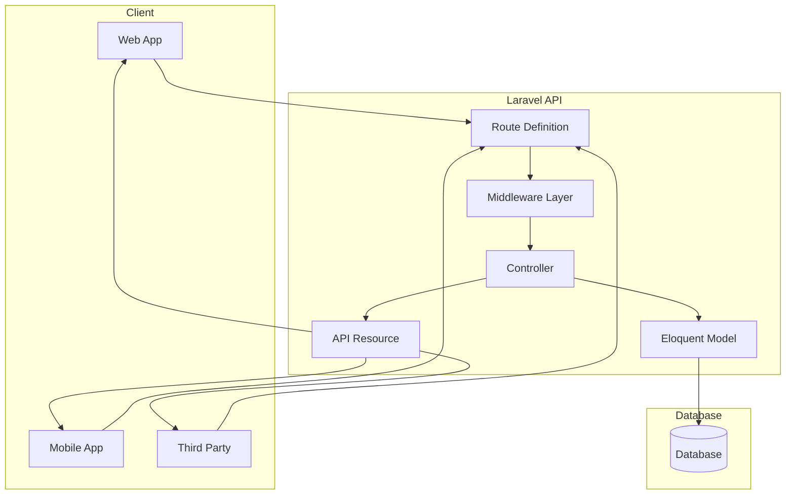
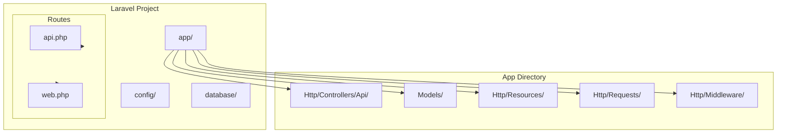
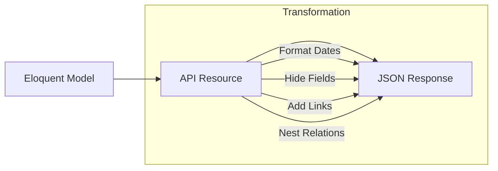
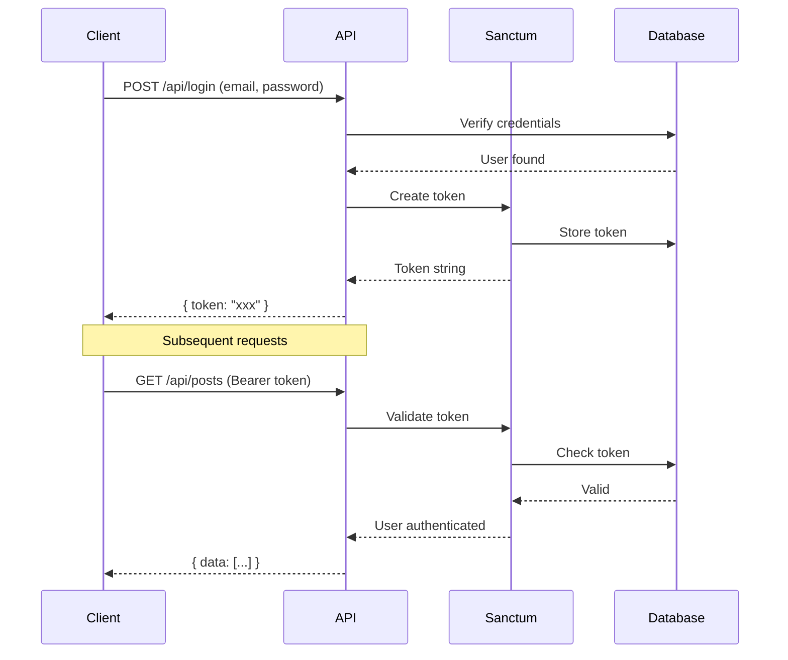
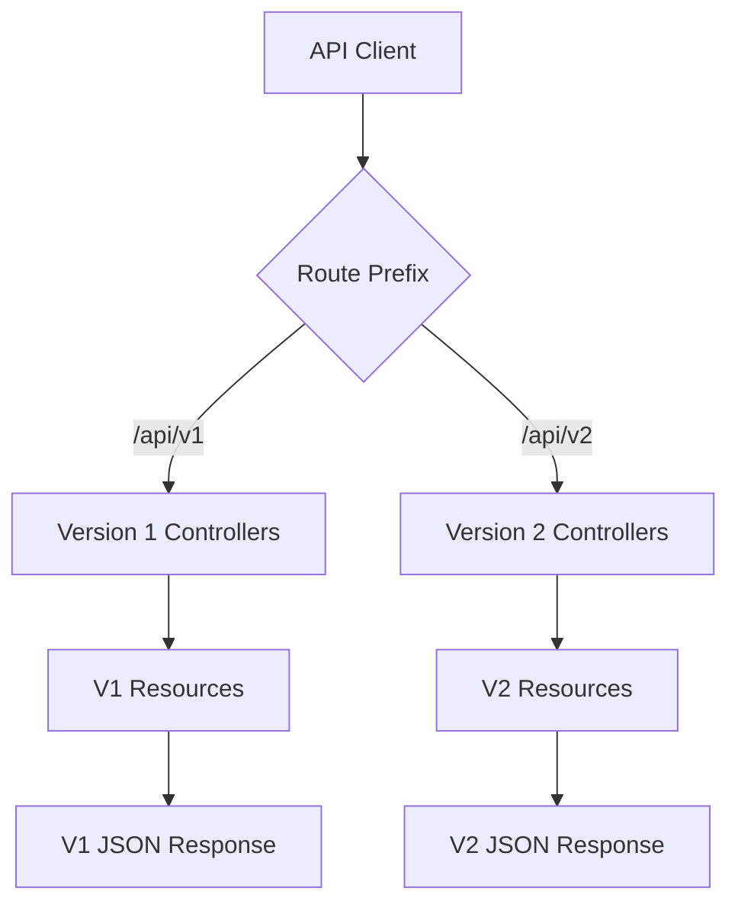
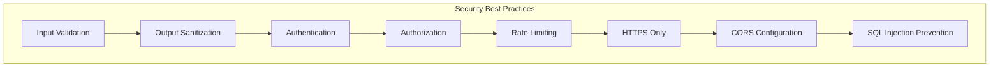

# How to Build RESTful APIs with Laravel

Author: [nawazdhandala](https://www.github.com/nawazdhandala)

Tags: PHP, Laravel, REST, API, JSON, HTTP

Description: A comprehensive guide to building production-ready RESTful APIs with Laravel. Learn resource controllers, API resources, authentication, validation, error handling, and best practices for creating scalable PHP APIs.

---

> Laravel provides an elegant, expressive syntax for building robust RESTful APIs. With features like API resources, form requests, and built-in authentication scaffolding, Laravel makes it straightforward to create APIs that are both powerful and maintainable.

Laravel is one of the most popular PHP frameworks for building web applications and APIs. Its expressive syntax, powerful ORM (Eloquent), and rich ecosystem make it an excellent choice for creating RESTful APIs that can serve mobile apps, single-page applications, and third-party integrations.

---

## Understanding RESTful API Architecture

Before diving into Laravel, let's understand the key principles of RESTful API design:



### HTTP Methods and Their Purposes

RESTful APIs use HTTP methods to indicate the type of operation:

| HTTP Method | Purpose | Example Route |
|-------------|---------|---------------|
| GET | Retrieve resources | GET /api/posts |
| POST | Create new resources | POST /api/posts |
| PUT | Update entire resource | PUT /api/posts/1 |
| PATCH | Partial update | PATCH /api/posts/1 |
| DELETE | Remove resource | DELETE /api/posts/1 |

---

## Setting Up a Laravel API Project

### Installation

Start by creating a new Laravel project:

```bash
# Create a new Laravel project
composer create-project laravel/laravel my-api

# Navigate to the project directory
cd my-api

# Install API scaffolding (Laravel 11+)
php artisan install:api
```

### Project Structure



---

## Creating Your First API Endpoint

### Defining Routes

Create API routes in `routes/api.php`:

```php
<?php

// routes/api.php
// Define API routes for your application
// Routes in this file are prefixed with /api automatically

use App\Http\Controllers\Api\PostController;
use App\Http\Controllers\Api\CommentController;
use Illuminate\Support\Facades\Route;

// Basic route returning JSON response
Route::get('/health', function () {
    return response()->json([
        'status' => 'healthy',
        'timestamp' => now()->toIso8601String(),
    ]);
});

// Resource routes automatically create all CRUD endpoints
// This creates: index, show, store, update, destroy
Route::apiResource('posts', PostController::class);

// Nested resource for comments belonging to posts
Route::apiResource('posts.comments', CommentController::class);

// Group routes that require authentication
Route::middleware('auth:sanctum')->group(function () {
    // Protected routes go here
    Route::get('/user', function (Request $request) {
        return $request->user();
    });
    
    // User-specific post management
    Route::get('/my-posts', [PostController::class, 'myPosts']);
});
```

### Creating the Model

Generate a model with migration:

```bash
php artisan make:model Post -m
```

Define the migration:

```php
<?php

// database/migrations/xxxx_xx_xx_create_posts_table.php
// Migration file to create the posts table structure

use Illuminate\Database\Migrations\Migration;
use Illuminate\Database\Schema\Blueprint;
use Illuminate\Support\Facades\Schema;

return new class extends Migration
{
    /**
     * Run the migrations.
     * Creates the posts table with all necessary columns.
     */
    public function up(): void
    {
        Schema::create('posts', function (Blueprint $table) {
            // Primary key
            $table->id();
            
            // Foreign key to users table
            $table->foreignId('user_id')
                  ->constrained()
                  ->onDelete('cascade');
            
            // Post content columns
            $table->string('title');
            $table->string('slug')->unique();
            $table->text('excerpt')->nullable();
            $table->longText('content');
            
            // Status and visibility
            $table->enum('status', ['draft', 'published', 'archived'])
                  ->default('draft');
            
            // SEO and metadata
            $table->string('meta_title')->nullable();
            $table->string('meta_description')->nullable();
            
            // Publication timestamp
            $table->timestamp('published_at')->nullable();
            
            // Standard timestamps (created_at, updated_at)
            $table->timestamps();
            
            // Soft deletes for recovery
            $table->softDeletes();
            
            // Indexes for performance
            $table->index(['status', 'published_at']);
            $table->index('user_id');
        });
    }

    /**
     * Reverse the migrations.
     */
    public function down(): void
    {
        Schema::dropIfExists('posts');
    }
};
```

Define the model:

```php
<?php

// app/Models/Post.php
// Eloquent model representing a blog post

namespace App\Models;

use Illuminate\Database\Eloquent\Factories\HasFactory;
use Illuminate\Database\Eloquent\Model;
use Illuminate\Database\Eloquent\Relations\BelongsTo;
use Illuminate\Database\Eloquent\Relations\HasMany;
use Illuminate\Database\Eloquent\SoftDeletes;
use Illuminate\Support\Str;

class Post extends Model
{
    // Enable factory support and soft deletes
    use HasFactory, SoftDeletes;

    /**
     * Mass assignable attributes.
     * Only these fields can be filled via create() or fill().
     */
    protected $fillable = [
        'user_id',
        'title',
        'slug',
        'excerpt',
        'content',
        'status',
        'meta_title',
        'meta_description',
        'published_at',
    ];

    /**
     * Attribute casting.
     * Automatically converts database values to PHP types.
     */
    protected $casts = [
        'published_at' => 'datetime',
        'created_at' => 'datetime',
        'updated_at' => 'datetime',
        'deleted_at' => 'datetime',
    ];

    /**
     * Boot the model.
     * Auto-generate slug from title when creating.
     */
    protected static function boot(): void
    {
        parent::boot();

        // Generate slug automatically before creating
        static::creating(function (Post $post) {
            if (empty($post->slug)) {
                $post->slug = Str::slug($post->title);
            }
        });
    }

    /**
     * Relationship: Post belongs to a User.
     * Each post has one author.
     */
    public function user(): BelongsTo
    {
        return $this->belongsTo(User::class);
    }

    /**
     * Alias for user relationship.
     * More readable when referring to the author.
     */
    public function author(): BelongsTo
    {
        return $this->belongsTo(User::class, 'user_id');
    }

    /**
     * Relationship: Post has many Comments.
     * One post can have multiple comments.
     */
    public function comments(): HasMany
    {
        return $this->hasMany(Comment::class);
    }

    /**
     * Scope: Only published posts.
     * Filters to posts with 'published' status.
     */
    public function scopePublished($query)
    {
        return $query->where('status', 'published')
                     ->whereNotNull('published_at')
                     ->where('published_at', '<=', now());
    }

    /**
     * Scope: Posts by status.
     * Filter posts by their current status.
     */
    public function scopeStatus($query, string $status)
    {
        return $query->where('status', $status);
    }

    /**
     * Check if post is published.
     */
    public function isPublished(): bool
    {
        return $this->status === 'published' 
            && $this->published_at 
            && $this->published_at->isPast();
    }

    /**
     * Publish the post.
     * Sets status to published and records timestamp.
     */
    public function publish(): bool
    {
        return $this->update([
            'status' => 'published',
            'published_at' => $this->published_at ?? now(),
        ]);
    }
}
```

---

## Building the Controller

### Resource Controller

Create an API resource controller:

```bash
php artisan make:controller Api/PostController --api
```

Implement the controller:

```php
<?php

// app/Http/Controllers/Api/PostController.php
// API Controller handling all post-related operations

namespace App\Http\Controllers\Api;

use App\Http\Controllers\Controller;
use App\Http\Requests\StorePostRequest;
use App\Http\Requests\UpdatePostRequest;
use App\Http\Resources\PostCollection;
use App\Http\Resources\PostResource;
use App\Models\Post;
use Illuminate\Http\JsonResponse;
use Illuminate\Http\Request;
use Illuminate\Http\Response;

class PostController extends Controller
{
    /**
     * Display a listing of posts.
     * GET /api/posts
     * 
     * Supports:
     * - Pagination via ?page=X
     * - Filtering via ?status=published
     * - Searching via ?search=keyword
     * - Sorting via ?sort=created_at&order=desc
     */
    public function index(Request $request): PostCollection
    {
        // Start building the query
        $query = Post::query();

        // Apply status filter if provided
        if ($request->has('status')) {
            $query->status($request->input('status'));
        }

        // Apply search filter if provided
        if ($request->filled('search')) {
            $search = $request->input('search');
            $query->where(function ($q) use ($search) {
                $q->where('title', 'like', "%{$search}%")
                  ->orWhere('content', 'like', "%{$search}%")
                  ->orWhere('excerpt', 'like', "%{$search}%");
            });
        }

        // Apply sorting
        $sortField = $request->input('sort', 'created_at');
        $sortOrder = $request->input('order', 'desc');
        
        // Whitelist allowed sort fields for security
        $allowedSorts = ['created_at', 'updated_at', 'title', 'published_at'];
        if (in_array($sortField, $allowedSorts)) {
            $query->orderBy($sortField, $sortOrder === 'asc' ? 'asc' : 'desc');
        }

        // Eager load relationships to prevent N+1 queries
        $query->with(['author:id,name,email']);

        // Paginate results (default 15 per page)
        $perPage = min($request->input('per_page', 15), 100);
        $posts = $query->paginate($perPage);

        // Return as API resource collection
        return new PostCollection($posts);
    }

    /**
     * Store a newly created post.
     * POST /api/posts
     * 
     * Request body should contain:
     * - title (required, string)
     * - content (required, string)
     * - excerpt (optional, string)
     * - status (optional, enum: draft, published, archived)
     */
    public function store(StorePostRequest $request): JsonResponse
    {
        // Get validated data from form request
        $validated = $request->validated();

        // Associate post with authenticated user
        $validated['user_id'] = $request->user()->id;

        // Create the post
        $post = Post::create($validated);

        // Load relationships for response
        $post->load('author:id,name,email');

        // Return created resource with 201 status
        return (new PostResource($post))
            ->response()
            ->setStatusCode(Response::HTTP_CREATED);
    }

    /**
     * Display the specified post.
     * GET /api/posts/{post}
     * 
     * Uses route model binding to automatically
     * fetch the post or return 404.
     */
    public function show(Post $post): PostResource
    {
        // Eager load relationships
        $post->load([
            'author:id,name,email',
            'comments' => function ($query) {
                $query->latest()->limit(10);
            },
            'comments.user:id,name',
        ]);

        // Optionally increment view count
        // $post->increment('views');

        return new PostResource($post);
    }

    /**
     * Update the specified post.
     * PUT/PATCH /api/posts/{post}
     * 
     * Supports partial updates with PATCH.
     */
    public function update(UpdatePostRequest $request, Post $post): PostResource
    {
        // Authorize the action (check if user owns the post)
        $this->authorize('update', $post);

        // Get validated data
        $validated = $request->validated();

        // Update the post
        $post->update($validated);

        // Reload the model and relationships
        $post->refresh();
        $post->load('author:id,name,email');

        return new PostResource($post);
    }

    /**
     * Remove the specified post.
     * DELETE /api/posts/{post}
     * 
     * Uses soft delete by default.
     */
    public function destroy(Post $post): JsonResponse
    {
        // Authorize the action
        $this->authorize('delete', $post);

        // Soft delete the post
        $post->delete();

        // Return 204 No Content
        return response()->json(null, Response::HTTP_NO_CONTENT);
    }

    /**
     * Get posts for authenticated user.
     * GET /api/my-posts
     */
    public function myPosts(Request $request): PostCollection
    {
        $posts = $request->user()
            ->posts()
            ->with('author:id,name,email')
            ->latest()
            ->paginate(15);

        return new PostCollection($posts);
    }
}
```

---

## API Resources for Response Transformation



### Creating API Resources

Generate resources:

```bash
php artisan make:resource PostResource
php artisan make:resource PostCollection
```

Implement the post resource:

```php
<?php

// app/Http/Resources/PostResource.php
// Transforms Post model into JSON response

namespace App\Http\Resources;

use Illuminate\Http\Request;
use Illuminate\Http\Resources\Json\JsonResource;

class PostResource extends JsonResource
{
    /**
     * Transform the resource into an array.
     * Defines the exact JSON structure returned.
     */
    public function toArray(Request $request): array
    {
        return [
            // Primary identifier
            'id' => $this->id,
            
            // Basic post information
            'title' => $this->title,
            'slug' => $this->slug,
            'excerpt' => $this->excerpt,
            
            // Only include full content for single post views
            'content' => $this->when(
                $request->routeIs('posts.show'),
                $this->content
            ),
            
            // Status information
            'status' => $this->status,
            'is_published' => $this->isPublished(),
            
            // SEO metadata (only when present)
            'meta' => $this->when($this->meta_title || $this->meta_description, [
                'title' => $this->meta_title,
                'description' => $this->meta_description,
            ]),
            
            // Timestamps formatted as ISO 8601
            'published_at' => $this->published_at?->toIso8601String(),
            'created_at' => $this->created_at->toIso8601String(),
            'updated_at' => $this->updated_at->toIso8601String(),
            
            // Related author (when loaded)
            'author' => $this->whenLoaded('author', function () {
                return [
                    'id' => $this->author->id,
                    'name' => $this->author->name,
                ];
            }),
            
            // Related comments (when loaded)
            'comments' => CommentResource::collection(
                $this->whenLoaded('comments')
            ),
            
            // Comments count (when counted)
            'comments_count' => $this->whenCounted('comments'),
            
            // HATEOAS links for discoverability
            'links' => [
                'self' => route('posts.show', $this->id),
                'comments' => route('posts.comments.index', $this->id),
            ],
        ];
    }

    /**
     * Add additional metadata to the response.
     */
    public function with(Request $request): array
    {
        return [
            'meta' => [
                'api_version' => 'v1',
            ],
        ];
    }
}
```

Implement the collection resource:

```php
<?php

// app/Http/Resources/PostCollection.php
// Transforms a collection of posts with pagination metadata

namespace App\Http\Resources;

use Illuminate\Http\Request;
use Illuminate\Http\Resources\Json\ResourceCollection;

class PostCollection extends ResourceCollection
{
    /**
     * The resource that this collection uses.
     */
    public $collects = PostResource::class;

    /**
     * Transform the resource collection into an array.
     */
    public function toArray(Request $request): array
    {
        return [
            // The actual data
            'data' => $this->collection,
        ];
    }

    /**
     * Add pagination metadata to the response.
     */
    public function with(Request $request): array
    {
        return [
            'meta' => [
                'api_version' => 'v1',
            ],
            'links' => [
                'posts' => route('posts.index'),
            ],
        ];
    }

    /**
     * Customize the pagination information.
     */
    public function paginationInformation($request, $paginated, $default): array
    {
        return [
            'pagination' => [
                'total' => $paginated['total'],
                'per_page' => $paginated['per_page'],
                'current_page' => $paginated['current_page'],
                'last_page' => $paginated['last_page'],
                'from' => $paginated['from'],
                'to' => $paginated['to'],
            ],
        ];
    }
}
```

---

## Request Validation

### Form Requests

Create form requests for validation:

```bash
php artisan make:request StorePostRequest
php artisan make:request UpdatePostRequest
```

Implement store request:

```php
<?php

// app/Http/Requests/StorePostRequest.php
// Handles validation for creating new posts

namespace App\Http\Requests;

use Illuminate\Foundation\Http\FormRequest;
use Illuminate\Validation\Rule;

class StorePostRequest extends FormRequest
{
    /**
     * Determine if the user is authorized.
     * Must be authenticated to create posts.
     */
    public function authorize(): bool
    {
        return $this->user() !== null;
    }

    /**
     * Get the validation rules that apply to the request.
     */
    public function rules(): array
    {
        return [
            // Title is required, must be string, max 255 characters
            'title' => [
                'required',
                'string',
                'min:3',
                'max:255',
            ],
            
            // Slug is optional but must be unique if provided
            'slug' => [
                'nullable',
                'string',
                'max:255',
                'unique:posts,slug',
                'regex:/^[a-z0-9]+(?:-[a-z0-9]+)*$/', // lowercase with hyphens
            ],
            
            // Excerpt is optional, limited length
            'excerpt' => [
                'nullable',
                'string',
                'max:500',
            ],
            
            // Content is required
            'content' => [
                'required',
                'string',
                'min:10',
            ],
            
            // Status must be one of allowed values
            'status' => [
                'sometimes',
                Rule::in(['draft', 'published', 'archived']),
            ],
            
            // SEO fields are optional
            'meta_title' => [
                'nullable',
                'string',
                'max:60',
            ],
            'meta_description' => [
                'nullable',
                'string',
                'max:160',
            ],
            
            // Published date must be valid datetime
            'published_at' => [
                'nullable',
                'date',
            ],
        ];
    }

    /**
     * Custom validation messages.
     */
    public function messages(): array
    {
        return [
            'title.required' => 'A post title is required.',
            'title.min' => 'The title must be at least :min characters.',
            'content.required' => 'Post content cannot be empty.',
            'content.min' => 'Post content must be at least :min characters.',
            'slug.regex' => 'Slug must contain only lowercase letters, numbers, and hyphens.',
            'status.in' => 'Invalid status. Must be: draft, published, or archived.',
        ];
    }

    /**
     * Customize attribute names for error messages.
     */
    public function attributes(): array
    {
        return [
            'meta_title' => 'SEO title',
            'meta_description' => 'SEO description',
            'published_at' => 'publication date',
        ];
    }

    /**
     * Prepare the data for validation.
     * Runs before validation rules are applied.
     */
    protected function prepareForValidation(): void
    {
        // Trim whitespace from string inputs
        $this->merge([
            'title' => trim($this->title ?? ''),
            'content' => trim($this->content ?? ''),
        ]);
    }
}
```

Implement update request:

```php
<?php

// app/Http/Requests/UpdatePostRequest.php
// Handles validation for updating existing posts

namespace App\Http\Requests;

use Illuminate\Foundation\Http\FormRequest;
use Illuminate\Validation\Rule;

class UpdatePostRequest extends FormRequest
{
    /**
     * Determine if the user is authorized.
     * User must own the post to update it.
     */
    public function authorize(): bool
    {
        $post = $this->route('post');
        
        return $this->user() && $this->user()->id === $post->user_id;
    }

    /**
     * Get the validation rules for updating.
     * Uses 'sometimes' to allow partial updates.
     */
    public function rules(): array
    {
        return [
            // Title is optional on update but validated if present
            'title' => [
                'sometimes',
                'required',
                'string',
                'min:3',
                'max:255',
            ],
            
            // Slug must be unique except for current post
            'slug' => [
                'sometimes',
                'nullable',
                'string',
                'max:255',
                Rule::unique('posts', 'slug')->ignore($this->route('post')),
                'regex:/^[a-z0-9]+(?:-[a-z0-9]+)*$/',
            ],
            
            'excerpt' => [
                'sometimes',
                'nullable',
                'string',
                'max:500',
            ],
            
            'content' => [
                'sometimes',
                'required',
                'string',
                'min:10',
            ],
            
            'status' => [
                'sometimes',
                Rule::in(['draft', 'published', 'archived']),
            ],
            
            'meta_title' => [
                'sometimes',
                'nullable',
                'string',
                'max:60',
            ],
            
            'meta_description' => [
                'sometimes',
                'nullable',
                'string',
                'max:160',
            ],
            
            'published_at' => [
                'sometimes',
                'nullable',
                'date',
            ],
        ];
    }

    /**
     * Custom error messages.
     */
    public function messages(): array
    {
        return [
            'title.min' => 'The title must be at least :min characters.',
            'content.min' => 'Post content must be at least :min characters.',
            'slug.unique' => 'This slug is already in use by another post.',
        ];
    }
}
```

---

## API Authentication with Sanctum



### Setting Up Sanctum

Install and configure Sanctum:

```php
<?php

// app/Http/Controllers/Api/AuthController.php
// Handles user authentication for the API

namespace App\Http\Controllers\Api;

use App\Http\Controllers\Controller;
use App\Http\Resources\UserResource;
use App\Models\User;
use Illuminate\Http\JsonResponse;
use Illuminate\Http\Request;
use Illuminate\Http\Response;
use Illuminate\Support\Facades\Hash;
use Illuminate\Validation\ValidationException;

class AuthController extends Controller
{
    /**
     * Register a new user.
     * POST /api/register
     */
    public function register(Request $request): JsonResponse
    {
        // Validate registration data
        $validated = $request->validate([
            'name' => ['required', 'string', 'max:255'],
            'email' => ['required', 'string', 'email', 'max:255', 'unique:users'],
            'password' => ['required', 'string', 'min:8', 'confirmed'],
        ]);

        // Create the user with hashed password
        $user = User::create([
            'name' => $validated['name'],
            'email' => $validated['email'],
            'password' => Hash::make($validated['password']),
        ]);

        // Create access token for immediate login
        $token = $user->createToken('api-token')->plainTextToken;

        return response()->json([
            'message' => 'Registration successful',
            'user' => new UserResource($user),
            'token' => $token,
            'token_type' => 'Bearer',
        ], Response::HTTP_CREATED);
    }

    /**
     * Authenticate user and return token.
     * POST /api/login
     */
    public function login(Request $request): JsonResponse
    {
        // Validate login credentials
        $validated = $request->validate([
            'email' => ['required', 'string', 'email'],
            'password' => ['required', 'string'],
            'device_name' => ['sometimes', 'string', 'max:255'],
        ]);

        // Find user by email
        $user = User::where('email', $validated['email'])->first();

        // Verify credentials
        if (!$user || !Hash::check($validated['password'], $user->password)) {
            throw ValidationException::withMessages([
                'email' => ['The provided credentials are incorrect.'],
            ]);
        }

        // Generate device name if not provided
        $deviceName = $validated['device_name'] ?? $request->userAgent() ?? 'api-client';

        // Create new token
        // You can specify abilities/scopes for fine-grained permissions
        $token = $user->createToken($deviceName, ['posts:read', 'posts:write'])->plainTextToken;

        return response()->json([
            'message' => 'Login successful',
            'user' => new UserResource($user),
            'token' => $token,
            'token_type' => 'Bearer',
        ]);
    }

    /**
     * Get authenticated user details.
     * GET /api/user
     */
    public function user(Request $request): UserResource
    {
        return new UserResource($request->user());
    }

    /**
     * Logout user and revoke current token.
     * POST /api/logout
     */
    public function logout(Request $request): JsonResponse
    {
        // Revoke the current access token
        $request->user()->currentAccessToken()->delete();

        return response()->json([
            'message' => 'Logged out successfully',
        ]);
    }

    /**
     * Logout from all devices.
     * POST /api/logout-all
     */
    public function logoutAll(Request $request): JsonResponse
    {
        // Revoke all tokens for the user
        $request->user()->tokens()->delete();

        return response()->json([
            'message' => 'Logged out from all devices',
        ]);
    }

    /**
     * Refresh the current token.
     * POST /api/refresh-token
     */
    public function refreshToken(Request $request): JsonResponse
    {
        $user = $request->user();
        $currentToken = $user->currentAccessToken();
        
        // Get the abilities from current token
        $abilities = $currentToken->abilities ?? ['*'];
        $tokenName = $currentToken->name ?? 'api-token';
        
        // Delete current token
        $currentToken->delete();
        
        // Create new token with same abilities
        $newToken = $user->createToken($tokenName, $abilities)->plainTextToken;

        return response()->json([
            'message' => 'Token refreshed',
            'token' => $newToken,
            'token_type' => 'Bearer',
        ]);
    }
}
```

### Auth Routes

```php
<?php

// routes/api.php (authentication routes section)

use App\Http\Controllers\Api\AuthController;

// Public authentication routes
Route::post('/register', [AuthController::class, 'register']);
Route::post('/login', [AuthController::class, 'login']);

// Protected authentication routes
Route::middleware('auth:sanctum')->group(function () {
    Route::get('/user', [AuthController::class, 'user']);
    Route::post('/logout', [AuthController::class, 'logout']);
    Route::post('/logout-all', [AuthController::class, 'logoutAll']);
    Route::post('/refresh-token', [AuthController::class, 'refreshToken']);
});
```

---

## Error Handling

### Custom Exception Handler

```php
<?php

// app/Exceptions/Handler.php
// Customize API error responses

namespace App\Exceptions;

use Illuminate\Auth\AuthenticationException;
use Illuminate\Database\Eloquent\ModelNotFoundException;
use Illuminate\Foundation\Exceptions\Handler as ExceptionHandler;
use Illuminate\Http\JsonResponse;
use Illuminate\Http\Request;
use Illuminate\Validation\ValidationException;
use Symfony\Component\HttpKernel\Exception\HttpException;
use Symfony\Component\HttpKernel\Exception\NotFoundHttpException;
use Throwable;

class Handler extends ExceptionHandler
{
    /**
     * Register the exception handling callbacks.
     */
    public function register(): void
    {
        // Handle model not found (404)
        $this->renderable(function (ModelNotFoundException $e, Request $request) {
            if ($request->wantsJson() || $request->is('api/*')) {
                return $this->apiErrorResponse(
                    'Resource not found',
                    404,
                    'NOT_FOUND'
                );
            }
        });

        // Handle route not found (404)
        $this->renderable(function (NotFoundHttpException $e, Request $request) {
            if ($request->wantsJson() || $request->is('api/*')) {
                return $this->apiErrorResponse(
                    'Endpoint not found',
                    404,
                    'ENDPOINT_NOT_FOUND'
                );
            }
        });

        // Handle authentication errors
        $this->renderable(function (AuthenticationException $e, Request $request) {
            if ($request->wantsJson() || $request->is('api/*')) {
                return $this->apiErrorResponse(
                    'Unauthenticated',
                    401,
                    'UNAUTHENTICATED'
                );
            }
        });

        // Handle generic HTTP exceptions
        $this->renderable(function (HttpException $e, Request $request) {
            if ($request->wantsJson() || $request->is('api/*')) {
                return $this->apiErrorResponse(
                    $e->getMessage() ?: 'An error occurred',
                    $e->getStatusCode(),
                    'HTTP_ERROR'
                );
            }
        });

        // Handle all other exceptions in production
        $this->renderable(function (Throwable $e, Request $request) {
            if ($request->wantsJson() || $request->is('api/*')) {
                // In production, hide internal details
                if (app()->environment('production')) {
                    return $this->apiErrorResponse(
                        'An unexpected error occurred',
                        500,
                        'INTERNAL_ERROR'
                    );
                }
                
                // In development, show details
                return $this->apiErrorResponse(
                    $e->getMessage(),
                    500,
                    'INTERNAL_ERROR',
                    [
                        'exception' => get_class($e),
                        'file' => $e->getFile(),
                        'line' => $e->getLine(),
                        'trace' => $e->getTrace(),
                    ]
                );
            }
        });
    }

    /**
     * Convert validation exception to JSON response.
     */
    protected function invalidJson($request, ValidationException $exception): JsonResponse
    {
        return response()->json([
            'message' => 'Validation failed',
            'code' => 'VALIDATION_ERROR',
            'errors' => $exception->errors(),
        ], $exception->status);
    }

    /**
     * Create a standardized API error response.
     */
    protected function apiErrorResponse(
        string $message,
        int $statusCode,
        string $code,
        array $debug = null
    ): JsonResponse {
        $response = [
            'message' => $message,
            'code' => $code,
            'status' => $statusCode,
        ];

        if ($debug && !app()->environment('production')) {
            $response['debug'] = $debug;
        }

        return response()->json($response, $statusCode);
    }
}
```

---

## Middleware for API

### Rate Limiting

```php
<?php

// app/Http/Middleware/ApiRateLimiter.php
// Custom rate limiting middleware for API endpoints

namespace App\Http\Middleware;

use Closure;
use Illuminate\Cache\RateLimiter;
use Illuminate\Http\Request;
use Symfony\Component\HttpFoundation\Response;

class ApiRateLimiter
{
    protected RateLimiter $limiter;

    public function __construct(RateLimiter $limiter)
    {
        $this->limiter = $limiter;
    }

    /**
     * Handle an incoming request.
     */
    public function handle(Request $request, Closure $next, string $limitName = 'api'): Response
    {
        // Determine the rate limit key
        $key = $this->resolveRequestKey($request);
        
        // Get limit configuration
        $limits = $this->getLimits($limitName, $request);
        
        // Check if rate limit exceeded
        if ($this->limiter->tooManyAttempts($key, $limits['max_attempts'])) {
            return $this->buildTooManyRequestsResponse($key, $limits);
        }
        
        // Increment the counter
        $this->limiter->hit($key, $limits['decay_seconds']);
        
        // Process the request
        $response = $next($request);
        
        // Add rate limit headers to response
        return $this->addRateLimitHeaders($response, $key, $limits);
    }

    /**
     * Generate a unique key for the request.
     */
    protected function resolveRequestKey(Request $request): string
    {
        // Use authenticated user ID or IP address
        if ($request->user()) {
            return 'api_rate_limit:user:' . $request->user()->id;
        }
        
        return 'api_rate_limit:ip:' . $request->ip();
    }

    /**
     * Get rate limits based on limit name and user status.
     */
    protected function getLimits(string $limitName, Request $request): array
    {
        // Different limits for authenticated vs guest users
        $isAuthenticated = $request->user() !== null;
        
        return match($limitName) {
            'api' => [
                'max_attempts' => $isAuthenticated ? 1000 : 60,
                'decay_seconds' => 60,
            ],
            'auth' => [
                'max_attempts' => 5,
                'decay_seconds' => 60,
            ],
            default => [
                'max_attempts' => 60,
                'decay_seconds' => 60,
            ],
        };
    }

    /**
     * Build response for rate limit exceeded.
     */
    protected function buildTooManyRequestsResponse(string $key, array $limits): Response
    {
        $retryAfter = $this->limiter->availableIn($key);
        
        return response()->json([
            'message' => 'Too many requests. Please try again later.',
            'code' => 'RATE_LIMIT_EXCEEDED',
            'retry_after' => $retryAfter,
        ], 429, [
            'Retry-After' => $retryAfter,
            'X-RateLimit-Limit' => $limits['max_attempts'],
            'X-RateLimit-Remaining' => 0,
        ]);
    }

    /**
     * Add rate limit headers to response.
     */
    protected function addRateLimitHeaders(Response $response, string $key, array $limits): Response
    {
        $remaining = $this->limiter->remaining($key, $limits['max_attempts']);
        
        $response->headers->set('X-RateLimit-Limit', $limits['max_attempts']);
        $response->headers->set('X-RateLimit-Remaining', max(0, $remaining));
        
        return $response;
    }
}
```

### Request Logging

```php
<?php

// app/Http/Middleware/LogApiRequests.php
// Logs API requests for debugging and monitoring

namespace App\Http\Middleware;

use Closure;
use Illuminate\Http\Request;
use Illuminate\Support\Facades\Log;
use Symfony\Component\HttpFoundation\Response;

class LogApiRequests
{
    /**
     * Handle an incoming request.
     */
    public function handle(Request $request, Closure $next): Response
    {
        // Record start time for duration calculation
        $startTime = microtime(true);
        
        // Process the request
        $response = $next($request);
        
        // Calculate duration
        $duration = round((microtime(true) - $startTime) * 1000, 2);
        
        // Build log context
        $context = [
            'method' => $request->method(),
            'url' => $request->fullUrl(),
            'ip' => $request->ip(),
            'user_agent' => $request->userAgent(),
            'user_id' => $request->user()?->id,
            'status' => $response->getStatusCode(),
            'duration_ms' => $duration,
        ];
        
        // Log based on status code
        if ($response->getStatusCode() >= 500) {
            Log::error('API Request Error', $context);
        } elseif ($response->getStatusCode() >= 400) {
            Log::warning('API Request Failed', $context);
        } else {
            Log::info('API Request', $context);
        }
        
        // Add timing header
        $response->headers->set('X-Response-Time', $duration . 'ms');
        
        return $response;
    }
}
```

---

## API Versioning



### URL-Based Versioning

```php
<?php

// routes/api.php
// API routes with versioning support

use Illuminate\Support\Facades\Route;

// Version 1 routes
Route::prefix('v1')->group(function () {
    Route::apiResource('posts', \App\Http\Controllers\Api\V1\PostController::class);
    Route::apiResource('users', \App\Http\Controllers\Api\V1\UserController::class);
});

// Version 2 routes with breaking changes
Route::prefix('v2')->group(function () {
    Route::apiResource('posts', \App\Http\Controllers\Api\V2\PostController::class);
    Route::apiResource('articles', \App\Http\Controllers\Api\V2\ArticleController::class);
});
```

### Version 2 Controller Example

```php
<?php

// app/Http/Controllers/Api/V2/PostController.php
// Version 2 of the Post API with breaking changes

namespace App\Http\Controllers\Api\V2;

use App\Http\Controllers\Controller;
use App\Http\Resources\V2\PostResource;
use App\Models\Post;
use Illuminate\Http\Request;

class PostController extends Controller
{
    /**
     * Index with cursor pagination (breaking change from v1).
     * Better for large datasets and real-time APIs.
     */
    public function index(Request $request)
    {
        $posts = Post::query()
            ->published()
            ->with(['author:id,name', 'tags:id,name'])
            ->orderBy('id', 'desc')
            ->cursorPaginate(20);

        return PostResource::collection($posts);
    }

    /**
     * Show with different response structure.
     */
    public function show(Post $post): PostResource
    {
        $post->load([
            'author:id,name,email,avatar',
            'tags:id,name,slug',
            'comments' => fn($q) => $q->latest()->limit(5),
        ]);

        return new PostResource($post);
    }
}
```

---

## Testing Your API

### Feature Tests

```php
<?php

// tests/Feature/Api/PostApiTest.php
// Feature tests for the Post API

namespace Tests\Feature\Api;

use App\Models\Post;
use App\Models\User;
use Illuminate\Foundation\Testing\RefreshDatabase;
use Laravel\Sanctum\Sanctum;
use Tests\TestCase;

class PostApiTest extends TestCase
{
    use RefreshDatabase;

    protected User $user;

    protected function setUp(): void
    {
        parent::setUp();
        
        // Create a test user
        $this->user = User::factory()->create();
    }

    /**
     * Test listing posts without authentication.
     */
    public function test_can_list_published_posts(): void
    {
        // Create some published posts
        Post::factory()
            ->count(5)
            ->published()
            ->create();

        // Make request
        $response = $this->getJson('/api/v1/posts');

        // Assert response
        $response->assertStatus(200)
            ->assertJsonStructure([
                'data' => [
                    '*' => [
                        'id',
                        'title',
                        'slug',
                        'excerpt',
                        'status',
                        'created_at',
                        'author',
                        'links',
                    ],
                ],
                'pagination' => [
                    'total',
                    'per_page',
                    'current_page',
                ],
            ]);
    }

    /**
     * Test creating a post requires authentication.
     */
    public function test_creating_post_requires_authentication(): void
    {
        $postData = [
            'title' => 'Test Post',
            'content' => 'This is test content for the post.',
        ];

        $response = $this->postJson('/api/v1/posts', $postData);

        $response->assertStatus(401)
            ->assertJson([
                'message' => 'Unauthenticated',
            ]);
    }

    /**
     * Test authenticated user can create post.
     */
    public function test_authenticated_user_can_create_post(): void
    {
        // Authenticate user
        Sanctum::actingAs($this->user);

        $postData = [
            'title' => 'My New Post',
            'content' => 'This is the content of my new post.',
            'excerpt' => 'A brief excerpt.',
            'status' => 'draft',
        ];

        $response = $this->postJson('/api/v1/posts', $postData);

        $response->assertStatus(201)
            ->assertJsonPath('data.title', 'My New Post')
            ->assertJsonPath('data.author.id', $this->user->id);

        // Verify database
        $this->assertDatabaseHas('posts', [
            'title' => 'My New Post',
            'user_id' => $this->user->id,
        ]);
    }

    /**
     * Test validation errors are returned correctly.
     */
    public function test_validation_errors_returned_correctly(): void
    {
        Sanctum::actingAs($this->user);

        // Missing required fields
        $response = $this->postJson('/api/v1/posts', []);

        $response->assertStatus(422)
            ->assertJsonValidationErrors(['title', 'content'])
            ->assertJson([
                'message' => 'Validation failed',
                'code' => 'VALIDATION_ERROR',
            ]);
    }

    /**
     * Test user can update their own post.
     */
    public function test_user_can_update_own_post(): void
    {
        Sanctum::actingAs($this->user);

        $post = Post::factory()->create([
            'user_id' => $this->user->id,
            'title' => 'Original Title',
        ]);

        $response = $this->patchJson("/api/v1/posts/{$post->id}", [
            'title' => 'Updated Title',
        ]);

        $response->assertStatus(200)
            ->assertJsonPath('data.title', 'Updated Title');

        $this->assertDatabaseHas('posts', [
            'id' => $post->id,
            'title' => 'Updated Title',
        ]);
    }

    /**
     * Test user cannot update another user's post.
     */
    public function test_user_cannot_update_others_post(): void
    {
        Sanctum::actingAs($this->user);

        $otherUser = User::factory()->create();
        $post = Post::factory()->create([
            'user_id' => $otherUser->id,
        ]);

        $response = $this->patchJson("/api/v1/posts/{$post->id}", [
            'title' => 'Hacked Title',
        ]);

        $response->assertStatus(403);
    }

    /**
     * Test user can delete their own post.
     */
    public function test_user_can_delete_own_post(): void
    {
        Sanctum::actingAs($this->user);

        $post = Post::factory()->create([
            'user_id' => $this->user->id,
        ]);

        $response = $this->deleteJson("/api/v1/posts/{$post->id}");

        $response->assertStatus(204);

        // Soft delete check
        $this->assertSoftDeleted('posts', ['id' => $post->id]);
    }

    /**
     * Test filtering posts by status.
     */
    public function test_can_filter_posts_by_status(): void
    {
        Post::factory()->count(3)->create(['status' => 'published']);
        Post::factory()->count(2)->create(['status' => 'draft']);

        $response = $this->getJson('/api/v1/posts?status=published');

        $response->assertStatus(200)
            ->assertJsonCount(3, 'data');
    }

    /**
     * Test searching posts.
     */
    public function test_can_search_posts(): void
    {
        Post::factory()->create(['title' => 'Laravel Tutorial']);
        Post::factory()->create(['title' => 'PHP Basics']);
        Post::factory()->create(['title' => 'JavaScript Guide']);

        $response = $this->getJson('/api/v1/posts?search=Laravel');

        $response->assertStatus(200)
            ->assertJsonCount(1, 'data')
            ->assertJsonPath('data.0.title', 'Laravel Tutorial');
    }

    /**
     * Test pagination works correctly.
     */
    public function test_pagination_works(): void
    {
        Post::factory()->count(25)->published()->create();

        $response = $this->getJson('/api/v1/posts?per_page=10');

        $response->assertStatus(200)
            ->assertJsonCount(10, 'data')
            ->assertJsonPath('pagination.total', 25)
            ->assertJsonPath('pagination.per_page', 10)
            ->assertJsonPath('pagination.last_page', 3);
    }
}
```

---

## Best Practices Summary

### Response Consistency

Always return consistent JSON structures:

```php
<?php

// app/Traits/ApiResponses.php
// Trait for consistent API responses

namespace App\Traits;

use Illuminate\Http\JsonResponse;

trait ApiResponses
{
    /**
     * Return a success response.
     */
    protected function success($data, string $message = null, int $code = 200): JsonResponse
    {
        return response()->json([
            'success' => true,
            'message' => $message,
            'data' => $data,
        ], $code);
    }

    /**
     * Return an error response.
     */
    protected function error(string $message, int $code = 400, array $errors = []): JsonResponse
    {
        return response()->json([
            'success' => false,
            'message' => $message,
            'errors' => $errors ?: null,
        ], $code);
    }

    /**
     * Return a created response.
     */
    protected function created($data, string $message = 'Resource created'): JsonResponse
    {
        return $this->success($data, $message, 201);
    }

    /**
     * Return a no content response.
     */
    protected function noContent(): JsonResponse
    {
        return response()->json(null, 204);
    }
}
```

### Security Checklist



Key security practices:

1. **Always validate input** - Use Form Requests
2. **Use prepared statements** - Eloquent handles this automatically
3. **Implement rate limiting** - Prevent abuse
4. **Use HTTPS** - Never transmit tokens over HTTP
5. **Configure CORS properly** - Only allow trusted origins
6. **Hide sensitive errors** - Use custom exception handling
7. **Use token abilities** - Implement least-privilege access

---

## Summary

Building RESTful APIs with Laravel provides a clean, maintainable approach to creating backend services. Key takeaways:

- **Use API Resources** to transform and control your JSON output
- **Implement Form Requests** for validation and authorization
- **Use Sanctum** for simple, secure API authentication
- **Handle errors consistently** with custom exception handling
- **Version your API** to manage breaking changes
- **Write tests** to ensure API reliability
- **Follow REST conventions** for predictable, intuitive endpoints

Laravel's elegant syntax and powerful features make it an excellent choice for building APIs of any scale, from simple microservices to complex enterprise applications.

---

*Need to monitor your Laravel API in production? [OneUptime](https://oneuptime.com) provides comprehensive API monitoring, uptime tracking, and incident management to keep your services reliable.*