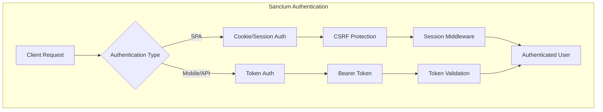
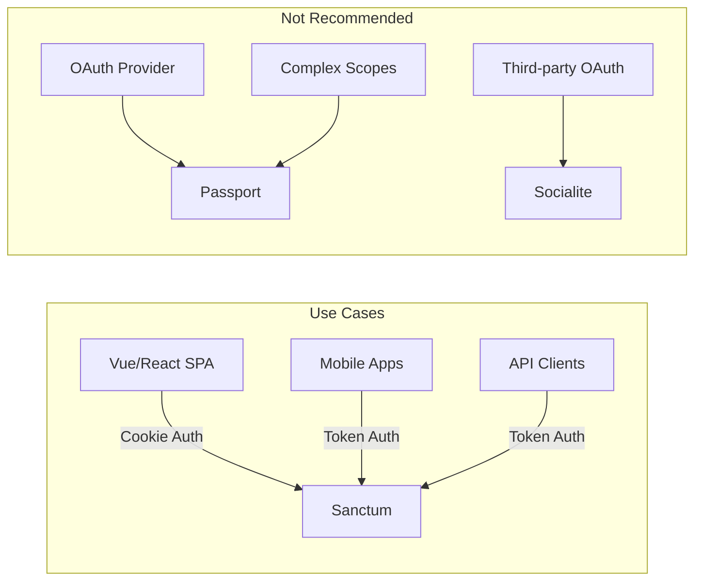
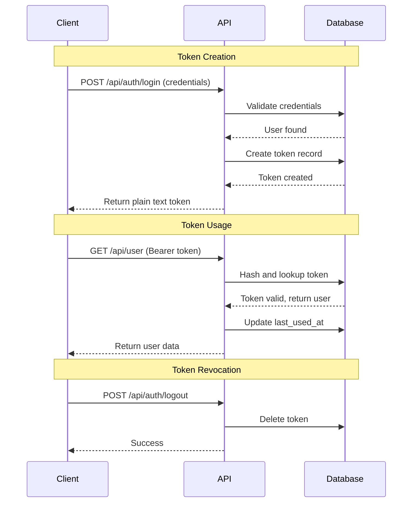
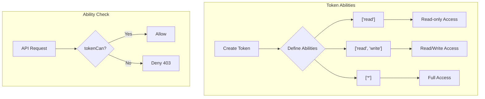
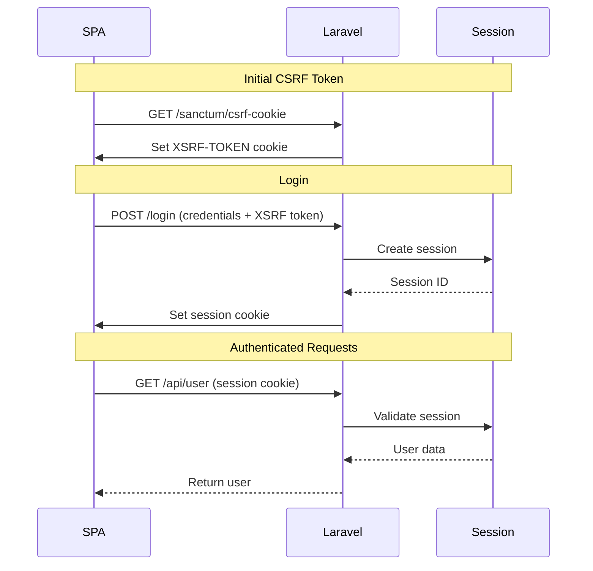
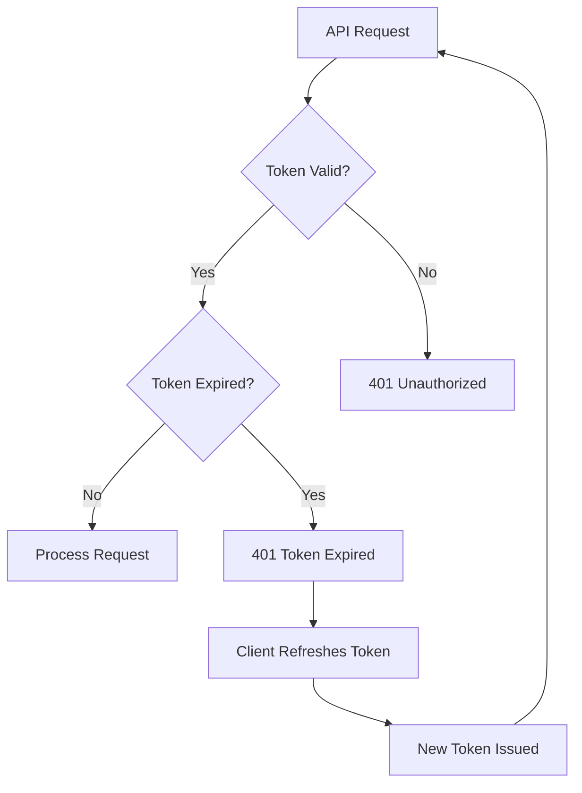
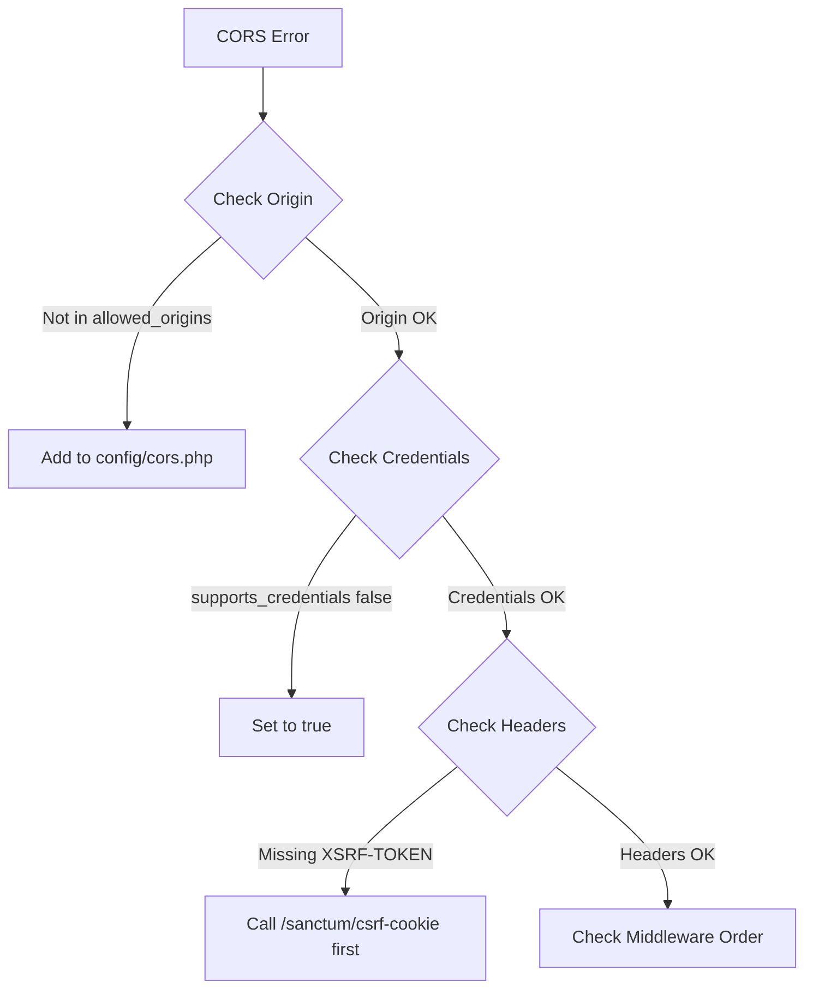

# How to Use Laravel Sanctum for API Authentication

Author: [nawazdhandala](https://www.github.com/nawazdhandala)

Tags: PHP, Laravel, Sanctum, API, Authentication, Token

Description: A comprehensive guide to implementing API authentication in Laravel using Sanctum. Learn token-based authentication, SPA authentication, mobile app tokens, and security best practices for building secure Laravel APIs.

---

> API authentication is the gatekeeper of your application. Laravel Sanctum provides a featherweight authentication system for SPAs, mobile applications, and simple token-based APIs. It handles the complexity of secure token management so you can focus on building features.

Laravel Sanctum offers two distinct authentication mechanisms: API token authentication for mobile apps and third-party integrations, and cookie-based session authentication for SPAs. This guide covers both approaches with production-ready examples.

---

## Understanding Laravel Sanctum

Before diving into implementation, let's understand what Sanctum offers and when to use it:



### When to Use Sanctum

Sanctum is ideal for:
- Single Page Applications (SPAs) built with Vue, React, or Angular
- Mobile applications (iOS, Android, React Native)
- Simple API token authentication
- First-party API consumers



---

## Installation and Setup

### Installing Sanctum

Install Sanctum via Composer:

```bash
# Install Sanctum package
composer require laravel/sanctum

# Publish the Sanctum configuration and migrations
php artisan vendor:publish --provider="Laravel\Sanctum\SanctumServiceProvider"

# Run migrations to create the personal_access_tokens table
php artisan migrate
```

### Understanding the Migration

Sanctum creates a `personal_access_tokens` table:

```php
<?php
// database/migrations/xxxx_xx_xx_create_personal_access_tokens_table.php

use Illuminate\Database\Migrations\Migration;
use Illuminate\Database\Schema\Blueprint;
use Illuminate\Support\Facades\Schema;

return new class extends Migration
{
    /**
     * Run the migrations.
     * Creates the personal_access_tokens table for API token storage.
     */
    public function up(): void
    {
        Schema::create('personal_access_tokens', function (Blueprint $table) {
            // Primary key
            $table->id();
            
            // Polymorphic relationship to tokenable model (usually User)
            $table->morphs('tokenable');
            
            // Human-readable token name (e.g., "Mobile App", "CLI Tool")
            $table->string('name');
            
            // Hashed token value - never store plain text tokens
            $table->string('token', 64)->unique();
            
            // Optional: Token abilities (permissions/scopes)
            $table->text('abilities')->nullable();
            
            // Track last usage for security auditing
            $table->timestamp('last_used_at')->nullable();
            
            // Optional: Token expiration
            $table->timestamp('expires_at')->nullable();
            
            $table->timestamps();
        });
    }

    /**
     * Reverse the migrations.
     */
    public function down(): void
    {
        Schema::dropIfExists('personal_access_tokens');
    }
};
```

### Configuration

Configure Sanctum in `config/sanctum.php`:

```php
<?php
// config/sanctum.php

return [
    /*
    |--------------------------------------------------------------------------
    | Stateful Domains
    |--------------------------------------------------------------------------
    |
    | Domains that should use cookie-based authentication (SPA mode).
    | Include your frontend domain(s) here.
    |
    */
    'stateful' => explode(',', env('SANCTUM_STATEFUL_DOMAINS', sprintf(
        '%s%s',
        'localhost,localhost:3000,127.0.0.1,127.0.0.1:8000,::1',
        Sanctum::currentApplicationUrlWithPort()
    ))),

    /*
    |--------------------------------------------------------------------------
    | Sanctum Guards
    |--------------------------------------------------------------------------
    |
    | Authentication guards that Sanctum uses for SPA authentication.
    | Typically 'web' for session-based authentication.
    |
    */
    'guard' => ['web'],

    /*
    |--------------------------------------------------------------------------
    | Expiration Minutes
    |--------------------------------------------------------------------------
    |
    | Token lifetime in minutes. Null means tokens never expire.
    | For security, consider setting an expiration time.
    |
    */
    'expiration' => env('SANCTUM_TOKEN_EXPIRATION', 60 * 24 * 7), // 7 days

    /*
    |--------------------------------------------------------------------------
    | Token Prefix
    |--------------------------------------------------------------------------
    |
    | Prefix added to generated tokens. Helps identify tokens quickly
    | and can be useful for log filtering.
    |
    */
    'token_prefix' => env('SANCTUM_TOKEN_PREFIX', ''),

    /*
    |--------------------------------------------------------------------------
    | Sanctum Middleware
    |--------------------------------------------------------------------------
    |
    | Middleware used by Sanctum for various authentication tasks.
    |
    */
    'middleware' => [
        'authenticate_session' => Laravel\Sanctum\Http\Middleware\AuthenticateSession::class,
        'encrypt_cookies' => Illuminate\Cookie\Middleware\EncryptCookies::class,
        'validate_csrf_token' => Illuminate\Foundation\Http\Middleware\ValidateCsrfToken::class,
    ],
];
```

### Environment Configuration

Set up your `.env` file:

```bash
# .env

# Stateful domains for SPA authentication
SANCTUM_STATEFUL_DOMAINS=localhost:3000,spa.example.com,app.example.com

# Token expiration in minutes (7 days)
SANCTUM_TOKEN_EXPIRATION=10080

# Optional: Token prefix for identification
SANCTUM_TOKEN_PREFIX=myapp_

# Session configuration for SPA
SESSION_DRIVER=database
SESSION_DOMAIN=.example.com
SESSION_SECURE_COOKIE=true
SESSION_SAME_SITE=lax
```

---

## Token-Based API Authentication

Token authentication is perfect for mobile apps, CLI tools, and third-party API consumers.

### Preparing the User Model

Add the `HasApiTokens` trait to your User model:

```php
<?php
// app/Models/User.php

namespace App\Models;

use Illuminate\Database\Eloquent\Factories\HasFactory;
use Illuminate\Foundation\Auth\User as Authenticatable;
use Illuminate\Notifications\Notifiable;
use Laravel\Sanctum\HasApiTokens;

class User extends Authenticatable
{
    // Add HasApiTokens trait for Sanctum token management
    use HasApiTokens, HasFactory, Notifiable;

    /**
     * The attributes that are mass assignable.
     *
     * @var array<int, string>
     */
    protected $fillable = [
        'name',
        'email',
        'password',
    ];

    /**
     * The attributes that should be hidden for serialization.
     *
     * @var array<int, string>
     */
    protected $hidden = [
        'password',
        'remember_token',
    ];

    /**
     * The attributes that should be cast.
     *
     * @var array<string, string>
     */
    protected $casts = [
        'email_verified_at' => 'datetime',
        'password' => 'hashed',
    ];
}
```

### Token Lifecycle Flow



### Authentication Controller

Create a comprehensive authentication controller:

```php
<?php
// app/Http/Controllers/Api/AuthController.php

namespace App\Http\Controllers\Api;

use App\Http\Controllers\Controller;
use App\Models\User;
use Illuminate\Http\JsonResponse;
use Illuminate\Http\Request;
use Illuminate\Support\Facades\Hash;
use Illuminate\Validation\ValidationException;

class AuthController extends Controller
{
    /**
     * Register a new user and issue an API token.
     *
     * @param Request $request
     * @return JsonResponse
     */
    public function register(Request $request): JsonResponse
    {
        // Validate registration data
        $validated = $request->validate([
            'name' => ['required', 'string', 'max:255'],
            'email' => ['required', 'string', 'email', 'max:255', 'unique:users'],
            'password' => ['required', 'string', 'min:8', 'confirmed'],
            'device_name' => ['required', 'string', 'max:255'],
        ]);

        // Create the user with hashed password
        $user = User::create([
            'name' => $validated['name'],
            'email' => $validated['email'],
            'password' => Hash::make($validated['password']),
        ]);

        // Create token with specific abilities
        $token = $user->createToken(
            $validated['device_name'],
            ['*'] // All abilities - customize as needed
        );

        return response()->json([
            'message' => 'Registration successful',
            'user' => $user,
            'token' => $token->plainTextToken,
            'token_type' => 'Bearer',
        ], 201);
    }

    /**
     * Authenticate user and issue an API token.
     *
     * @param Request $request
     * @return JsonResponse
     * @throws ValidationException
     */
    public function login(Request $request): JsonResponse
    {
        // Validate login credentials
        $validated = $request->validate([
            'email' => ['required', 'string', 'email'],
            'password' => ['required', 'string'],
            'device_name' => ['required', 'string', 'max:255'],
        ]);

        // Find user by email
        $user = User::where('email', $validated['email'])->first();

        // Verify credentials
        if (!$user || !Hash::check($validated['password'], $user->password)) {
            throw ValidationException::withMessages([
                'email' => ['The provided credentials are incorrect.'],
            ]);
        }

        // Optional: Revoke existing tokens for this device
        // This prevents token accumulation
        $user->tokens()
            ->where('name', $validated['device_name'])
            ->delete();

        // Create new token
        $token = $user->createToken($validated['device_name']);

        return response()->json([
            'message' => 'Login successful',
            'user' => $user,
            'token' => $token->plainTextToken,
            'token_type' => 'Bearer',
        ]);
    }

    /**
     * Get the authenticated user's profile.
     *
     * @param Request $request
     * @return JsonResponse
     */
    public function user(Request $request): JsonResponse
    {
        return response()->json([
            'user' => $request->user(),
            'token_abilities' => $request->user()->currentAccessToken()->abilities,
        ]);
    }

    /**
     * Revoke the current access token (logout).
     *
     * @param Request $request
     * @return JsonResponse
     */
    public function logout(Request $request): JsonResponse
    {
        // Delete only the current token
        $request->user()->currentAccessToken()->delete();

        return response()->json([
            'message' => 'Logged out successfully',
        ]);
    }

    /**
     * Revoke all tokens for the authenticated user.
     *
     * @param Request $request
     * @return JsonResponse
     */
    public function logoutAll(Request $request): JsonResponse
    {
        // Delete all tokens for this user
        $request->user()->tokens()->delete();

        return response()->json([
            'message' => 'All sessions terminated successfully',
        ]);
    }

    /**
     * List all active tokens for the authenticated user.
     *
     * @param Request $request
     * @return JsonResponse
     */
    public function tokens(Request $request): JsonResponse
    {
        $tokens = $request->user()->tokens()->get()->map(function ($token) use ($request) {
            return [
                'id' => $token->id,
                'name' => $token->name,
                'abilities' => $token->abilities,
                'last_used_at' => $token->last_used_at,
                'created_at' => $token->created_at,
                'is_current' => $token->id === $request->user()->currentAccessToken()->id,
            ];
        });

        return response()->json([
            'tokens' => $tokens,
        ]);
    }

    /**
     * Revoke a specific token by ID.
     *
     * @param Request $request
     * @param int $tokenId
     * @return JsonResponse
     */
    public function revokeToken(Request $request, int $tokenId): JsonResponse
    {
        // Find and delete the token (only if it belongs to the user)
        $deleted = $request->user()->tokens()->where('id', $tokenId)->delete();

        if (!$deleted) {
            return response()->json([
                'message' => 'Token not found',
            ], 404);
        }

        return response()->json([
            'message' => 'Token revoked successfully',
        ]);
    }
}
```

### API Routes

Define your API routes:

```php
<?php
// routes/api.php

use App\Http\Controllers\Api\AuthController;
use Illuminate\Support\Facades\Route;

/*
|--------------------------------------------------------------------------
| API Routes
|--------------------------------------------------------------------------
|
| Public routes (no authentication required)
|
*/
Route::prefix('auth')->group(function () {
    // User registration
    Route::post('/register', [AuthController::class, 'register'])
        ->name('api.auth.register');
    
    // User login
    Route::post('/login', [AuthController::class, 'login'])
        ->name('api.auth.login');
});

/*
|--------------------------------------------------------------------------
| Protected Routes (authentication required)
|--------------------------------------------------------------------------
*/
Route::middleware('auth:sanctum')->group(function () {
    // Authentication routes
    Route::prefix('auth')->group(function () {
        // Get current user
        Route::get('/user', [AuthController::class, 'user'])
            ->name('api.auth.user');
        
        // Logout (revoke current token)
        Route::post('/logout', [AuthController::class, 'logout'])
            ->name('api.auth.logout');
        
        // Logout all sessions
        Route::post('/logout-all', [AuthController::class, 'logoutAll'])
            ->name('api.auth.logout-all');
        
        // List all tokens
        Route::get('/tokens', [AuthController::class, 'tokens'])
            ->name('api.auth.tokens');
        
        // Revoke specific token
        Route::delete('/tokens/{tokenId}', [AuthController::class, 'revokeToken'])
            ->name('api.auth.revoke-token');
    });
    
    // Your protected API resources go here
    // Route::apiResource('posts', PostController::class);
    // Route::apiResource('comments', CommentController::class);
});
```

---

## Token Abilities (Scopes)

Token abilities allow fine-grained access control:



### Creating Tokens with Abilities

```php
<?php
// app/Http/Controllers/Api/TokenController.php

namespace App\Http\Controllers\Api;

use App\Http\Controllers\Controller;
use Illuminate\Http\JsonResponse;
use Illuminate\Http\Request;

class TokenController extends Controller
{
    /**
     * Available token abilities for the application.
     * Define all possible abilities here for documentation.
     */
    public const ABILITIES = [
        'read' => 'Read access to resources',
        'write' => 'Create and update resources',
        'delete' => 'Delete resources',
        'admin' => 'Administrative actions',
        'posts:read' => 'Read posts',
        'posts:write' => 'Create and update posts',
        'posts:delete' => 'Delete posts',
        'comments:read' => 'Read comments',
        'comments:write' => 'Create and update comments',
        'comments:delete' => 'Delete comments',
        'users:read' => 'View user profiles',
        'users:write' => 'Update user profiles',
    ];

    /**
     * Create a new token with specific abilities.
     *
     * @param Request $request
     * @return JsonResponse
     */
    public function createToken(Request $request): JsonResponse
    {
        // Validate token creation request
        $validated = $request->validate([
            'name' => ['required', 'string', 'max:255'],
            'abilities' => ['required', 'array'],
            'abilities.*' => ['string', 'in:' . implode(',', array_keys(self::ABILITIES))],
        ]);

        // Create token with specified abilities
        $token = $request->user()->createToken(
            $validated['name'],
            $validated['abilities']
        );

        return response()->json([
            'message' => 'Token created successfully',
            'token' => $token->plainTextToken,
            'abilities' => $validated['abilities'],
        ], 201);
    }

    /**
     * List available abilities.
     *
     * @return JsonResponse
     */
    public function abilities(): JsonResponse
    {
        return response()->json([
            'abilities' => self::ABILITIES,
        ]);
    }
}
```

### Checking Abilities in Controllers

```php
<?php
// app/Http/Controllers/Api/PostController.php

namespace App\Http\Controllers\Api;

use App\Http\Controllers\Controller;
use App\Models\Post;
use Illuminate\Http\JsonResponse;
use Illuminate\Http\Request;

class PostController extends Controller
{
    /**
     * List all posts.
     * Requires 'read' or 'posts:read' ability.
     *
     * @param Request $request
     * @return JsonResponse
     */
    public function index(Request $request): JsonResponse
    {
        // Check if token has required ability
        if (!$request->user()->tokenCan('read') && !$request->user()->tokenCan('posts:read')) {
            return response()->json([
                'message' => 'Insufficient permissions',
                'required_abilities' => ['read', 'posts:read'],
            ], 403);
        }

        $posts = Post::with('author')->paginate(15);

        return response()->json($posts);
    }

    /**
     * Create a new post.
     * Requires 'write' or 'posts:write' ability.
     *
     * @param Request $request
     * @return JsonResponse
     */
    public function store(Request $request): JsonResponse
    {
        // Check write permission
        if (!$request->user()->tokenCan('write') && !$request->user()->tokenCan('posts:write')) {
            return response()->json([
                'message' => 'Insufficient permissions',
                'required_abilities' => ['write', 'posts:write'],
            ], 403);
        }

        $validated = $request->validate([
            'title' => ['required', 'string', 'max:255'],
            'content' => ['required', 'string'],
        ]);

        $post = $request->user()->posts()->create($validated);

        return response()->json([
            'message' => 'Post created successfully',
            'post' => $post,
        ], 201);
    }

    /**
     * Delete a post.
     * Requires 'delete' or 'posts:delete' ability.
     *
     * @param Request $request
     * @param Post $post
     * @return JsonResponse
     */
    public function destroy(Request $request, Post $post): JsonResponse
    {
        // Check delete permission
        if (!$request->user()->tokenCan('delete') && !$request->user()->tokenCan('posts:delete')) {
            return response()->json([
                'message' => 'Insufficient permissions',
                'required_abilities' => ['delete', 'posts:delete'],
            ], 403);
        }

        // Ensure user owns the post
        if ($post->user_id !== $request->user()->id) {
            return response()->json([
                'message' => 'You do not own this post',
            ], 403);
        }

        $post->delete();

        return response()->json([
            'message' => 'Post deleted successfully',
        ]);
    }
}
```

### Middleware for Ability Checking

Create custom middleware for cleaner ability checks:

```php
<?php
// app/Http/Middleware/CheckTokenAbility.php

namespace App\Http\Middleware;

use Closure;
use Illuminate\Http\Request;
use Symfony\Component\HttpFoundation\Response;

class CheckTokenAbility
{
    /**
     * Handle an incoming request.
     *
     * Checks if the token has any of the required abilities.
     *
     * @param Request $request
     * @param Closure $next
     * @param string ...$abilities One or more abilities (OR logic)
     * @return Response
     */
    public function handle(Request $request, Closure $next, string ...$abilities): Response
    {
        // If no user or no token, deny access
        if (!$request->user() || !$request->user()->currentAccessToken()) {
            return response()->json([
                'message' => 'Unauthenticated',
            ], 401);
        }

        // Check if token has any of the required abilities
        foreach ($abilities as $ability) {
            if ($request->user()->tokenCan($ability)) {
                return $next($request);
            }
        }

        return response()->json([
            'message' => 'Insufficient permissions',
            'required_abilities' => $abilities,
            'token_abilities' => $request->user()->currentAccessToken()->abilities,
        ], 403);
    }
}
```

Register the middleware:

```php
<?php
// bootstrap/app.php (Laravel 11+) or app/Http/Kernel.php (Laravel 10)

// Laravel 11+
use App\Http\Middleware\CheckTokenAbility;

return Application::configure(basePath: dirname(__DIR__))
    ->withMiddleware(function (Middleware $middleware) {
        $middleware->alias([
            'ability' => CheckTokenAbility::class,
        ]);
    })
    ->create();
```

Use in routes:

```php
<?php
// routes/api.php

Route::middleware(['auth:sanctum', 'ability:read,posts:read'])->group(function () {
    Route::get('/posts', [PostController::class, 'index']);
});

Route::middleware(['auth:sanctum', 'ability:write,posts:write'])->group(function () {
    Route::post('/posts', [PostController::class, 'store']);
    Route::put('/posts/{post}', [PostController::class, 'update']);
});

Route::middleware(['auth:sanctum', 'ability:delete,posts:delete'])->group(function () {
    Route::delete('/posts/{post}', [PostController::class, 'destroy']);
});
```

---

## SPA Authentication

For Single Page Applications, Sanctum uses cookie-based session authentication:



### CORS Configuration

Configure CORS for your SPA:

```php
<?php
// config/cors.php

return [
    /*
    |--------------------------------------------------------------------------
    | Cross-Origin Resource Sharing (CORS) Configuration
    |--------------------------------------------------------------------------
    */
    
    // Paths that should have CORS headers
    'paths' => ['api/*', 'sanctum/csrf-cookie', 'login', 'logout', 'register'],

    // Allowed HTTP methods
    'allowed_methods' => ['*'],

    // Allowed origins - your SPA domains
    'allowed_origins' => [
        env('FRONTEND_URL', 'http://localhost:3000'),
    ],

    // Allowed origins as patterns (regex)
    'allowed_origins_patterns' => [],

    // Allowed headers
    'allowed_headers' => ['*'],

    // Exposed headers
    'exposed_headers' => [],

    // Max age for preflight cache (seconds)
    'max_age' => 0,

    // Allow credentials (cookies) - REQUIRED for Sanctum SPA auth
    'supports_credentials' => true,
];
```

### Session Configuration

Configure sessions for cross-domain authentication:

```php
<?php
// config/session.php

return [
    // Use database or redis for production
    'driver' => env('SESSION_DRIVER', 'database'),
    
    // Session lifetime in minutes
    'lifetime' => env('SESSION_LIFETIME', 120),
    
    // Expire session on browser close
    'expire_on_close' => false,
    
    // Encrypt session data
    'encrypt' => false,
    
    // Session cookie settings
    'cookie' => env('SESSION_COOKIE', 'laravel_session'),
    'path' => '/',
    'domain' => env('SESSION_DOMAIN', null), // Set to .example.com for subdomains
    'secure' => env('SESSION_SECURE_COOKIE', true), // Always true in production
    'http_only' => true,
    'same_site' => 'lax', // 'lax' for SPA on same domain, 'none' for cross-domain
];
```

### SPA Authentication Controller

```php
<?php
// app/Http/Controllers/Auth/SpaAuthController.php

namespace App\Http\Controllers\Auth;

use App\Http\Controllers\Controller;
use App\Models\User;
use Illuminate\Http\JsonResponse;
use Illuminate\Http\Request;
use Illuminate\Support\Facades\Auth;
use Illuminate\Support\Facades\Hash;
use Illuminate\Validation\ValidationException;

class SpaAuthController extends Controller
{
    /**
     * Authenticate a user for SPA.
     *
     * @param Request $request
     * @return JsonResponse
     * @throws ValidationException
     */
    public function login(Request $request): JsonResponse
    {
        $credentials = $request->validate([
            'email' => ['required', 'string', 'email'],
            'password' => ['required', 'string'],
        ]);

        // Attempt authentication
        if (!Auth::attempt($credentials, $request->boolean('remember'))) {
            throw ValidationException::withMessages([
                'email' => ['The provided credentials are incorrect.'],
            ]);
        }

        // Regenerate session to prevent fixation attacks
        $request->session()->regenerate();

        return response()->json([
            'message' => 'Login successful',
            'user' => Auth::user(),
        ]);
    }

    /**
     * Log out the authenticated user.
     *
     * @param Request $request
     * @return JsonResponse
     */
    public function logout(Request $request): JsonResponse
    {
        Auth::guard('web')->logout();

        // Invalidate the session
        $request->session()->invalidate();

        // Regenerate CSRF token
        $request->session()->regenerateToken();

        return response()->json([
            'message' => 'Logged out successfully',
        ]);
    }

    /**
     * Get the authenticated user.
     *
     * @param Request $request
     * @return JsonResponse
     */
    public function user(Request $request): JsonResponse
    {
        return response()->json([
            'user' => $request->user(),
        ]);
    }
}
```

### SPA Routes

```php
<?php
// routes/web.php

use App\Http\Controllers\Auth\SpaAuthController;
use Illuminate\Support\Facades\Route;

// SPA authentication routes (web middleware for session support)
Route::middleware('web')->group(function () {
    Route::post('/login', [SpaAuthController::class, 'login']);
    Route::post('/logout', [SpaAuthController::class, 'logout']);
});

// routes/api.php

// SPA authenticated routes
Route::middleware('auth:sanctum')->group(function () {
    Route::get('/user', [SpaAuthController::class, 'user']);
});
```

### Frontend Implementation (JavaScript)

Example SPA authentication with Axios:

```javascript
// api/client.js

import axios from 'axios';

// Create axios instance with default configuration
const apiClient = axios.create({
    baseURL: process.env.REACT_APP_API_URL || 'http://localhost:8000',
    withCredentials: true, // REQUIRED: Send cookies with requests
    headers: {
        'Content-Type': 'application/json',
        'Accept': 'application/json',
    },
});

// Add CSRF token to requests automatically
apiClient.interceptors.request.use((config) => {
    // Get XSRF token from cookie
    const token = getCookie('XSRF-TOKEN');
    if (token) {
        config.headers['X-XSRF-TOKEN'] = decodeURIComponent(token);
    }
    return config;
});

// Helper function to get cookie value
function getCookie(name) {
    const value = `; ${document.cookie}`;
    const parts = value.split(`; ${name}=`);
    if (parts.length === 2) {
        return parts.pop().split(';').shift();
    }
    return null;
}

export default apiClient;
```

```javascript
// services/auth.js

import apiClient from '../api/client';

/**
 * Initialize CSRF protection
 * Must be called before login/register
 */
export async function initializeCsrf() {
    await apiClient.get('/sanctum/csrf-cookie');
}

/**
 * Login user
 */
export async function login(email, password, remember = false) {
    // First, get CSRF token
    await initializeCsrf();
    
    // Then login
    const response = await apiClient.post('/login', {
        email,
        password,
        remember,
    });
    
    return response.data;
}

/**
 * Logout user
 */
export async function logout() {
    const response = await apiClient.post('/logout');
    return response.data;
}

/**
 * Get current user
 */
export async function getUser() {
    const response = await apiClient.get('/api/user');
    return response.data.user;
}

/**
 * Register new user
 */
export async function register(name, email, password, passwordConfirmation) {
    await initializeCsrf();
    
    const response = await apiClient.post('/register', {
        name,
        email,
        password,
        password_confirmation: passwordConfirmation,
    });
    
    return response.data;
}
```

---

## Token Expiration and Refresh

Implement token expiration and refresh for enhanced security:



### Token Expiration Configuration

```php
<?php
// config/sanctum.php

return [
    // Token expires after 7 days
    'expiration' => 60 * 24 * 7, // 10080 minutes
];
```

### Refresh Token Implementation

```php
<?php
// app/Http/Controllers/Api/TokenRefreshController.php

namespace App\Http\Controllers\Api;

use App\Http\Controllers\Controller;
use Carbon\Carbon;
use Illuminate\Http\JsonResponse;
use Illuminate\Http\Request;

class TokenRefreshController extends Controller
{
    /**
     * Refresh the current access token.
     *
     * Extends the token lifetime without requiring re-authentication.
     * Old token is invalidated and new token is issued.
     *
     * @param Request $request
     * @return JsonResponse
     */
    public function refresh(Request $request): JsonResponse
    {
        $user = $request->user();
        $currentToken = $user->currentAccessToken();

        // Get the current token's name and abilities
        $tokenName = $currentToken->name;
        $abilities = $currentToken->abilities;

        // Delete the current token
        $currentToken->delete();

        // Create a new token with the same abilities
        $newToken = $user->createToken($tokenName, $abilities);

        return response()->json([
            'message' => 'Token refreshed successfully',
            'token' => $newToken->plainTextToken,
            'token_type' => 'Bearer',
            'expires_at' => $this->getTokenExpiration(),
        ]);
    }

    /**
     * Get token expiration timestamp.
     *
     * @return string|null
     */
    private function getTokenExpiration(): ?string
    {
        $expiration = config('sanctum.expiration');
        
        if (!$expiration) {
            return null;
        }

        return Carbon::now()->addMinutes($expiration)->toIso8601String();
    }

    /**
     * Check if current token is about to expire.
     *
     * @param Request $request
     * @return JsonResponse
     */
    public function status(Request $request): JsonResponse
    {
        $token = $request->user()->currentAccessToken();
        $expiration = config('sanctum.expiration');

        if (!$expiration) {
            return response()->json([
                'expires' => false,
                'message' => 'Token does not expire',
            ]);
        }

        $expiresAt = $token->created_at->addMinutes($expiration);
        $minutesRemaining = Carbon::now()->diffInMinutes($expiresAt, false);

        return response()->json([
            'expires_at' => $expiresAt->toIso8601String(),
            'minutes_remaining' => max(0, $minutesRemaining),
            'should_refresh' => $minutesRemaining <= 60, // Refresh if less than 1 hour
            'is_expired' => $minutesRemaining <= 0,
        ]);
    }
}
```

### Automatic Token Cleanup

Create a scheduled command to clean expired tokens:

```php
<?php
// app/Console/Commands/PruneExpiredTokens.php

namespace App\Console\Commands;

use Carbon\Carbon;
use Illuminate\Console\Command;
use Laravel\Sanctum\PersonalAccessToken;

class PruneExpiredTokens extends Command
{
    /**
     * The name and signature of the console command.
     *
     * @var string
     */
    protected $signature = 'sanctum:prune-expired 
                            {--hours=0 : Also delete tokens unused for this many hours}';

    /**
     * The console command description.
     *
     * @var string
     */
    protected $description = 'Prune expired and unused Sanctum tokens';

    /**
     * Execute the console command.
     */
    public function handle(): int
    {
        $expiration = config('sanctum.expiration');
        $unusedHours = (int) $this->option('hours');

        $deleted = 0;

        // Delete expired tokens
        if ($expiration) {
            $expirationDate = Carbon::now()->subMinutes($expiration);
            
            $expiredCount = PersonalAccessToken::where('created_at', '<', $expirationDate)
                ->delete();
            
            $deleted += $expiredCount;
            $this->info("Deleted {$expiredCount} expired tokens.");
        }

        // Delete unused tokens
        if ($unusedHours > 0) {
            $unusedDate = Carbon::now()->subHours($unusedHours);
            
            $unusedCount = PersonalAccessToken::where(function ($query) use ($unusedDate) {
                $query->where('last_used_at', '<', $unusedDate)
                    ->orWhereNull('last_used_at');
            })->where('created_at', '<', $unusedDate)->delete();
            
            $deleted += $unusedCount;
            $this->info("Deleted {$unusedCount} unused tokens.");
        }

        $this->info("Total tokens pruned: {$deleted}");

        return Command::SUCCESS;
    }
}
```

Schedule the cleanup:

```php
<?php
// app/Console/Kernel.php or routes/console.php (Laravel 11+)

use Illuminate\Support\Facades\Schedule;

// Laravel 11+
Schedule::command('sanctum:prune-expired --hours=168')->daily();
```

---

## Security Best Practices

### Rate Limiting

Protect authentication endpoints with rate limiting:

```php
<?php
// routes/api.php

use Illuminate\Support\Facades\RateLimiter;
use Illuminate\Cache\RateLimiting\Limit;

// Configure rate limiters in AppServiceProvider or bootstrap
RateLimiter::for('auth', function ($request) {
    return [
        // 5 attempts per minute per IP for failed logins
        Limit::perMinute(5)->by($request->ip())->response(function () {
            return response()->json([
                'message' => 'Too many login attempts. Please try again later.',
            ], 429);
        }),
        // 100 requests per minute per IP for all auth endpoints
        Limit::perMinute(100)->by($request->ip()),
    ];
});

// Apply to routes
Route::middleware(['throttle:auth'])->prefix('auth')->group(function () {
    Route::post('/login', [AuthController::class, 'login']);
    Route::post('/register', [AuthController::class, 'register']);
});
```

### Token Security Middleware

Create middleware for additional token security checks:

```php
<?php
// app/Http/Middleware/ValidateTokenSecurity.php

namespace App\Http\Middleware;

use Closure;
use Illuminate\Http\Request;
use Symfony\Component\HttpFoundation\Response;

class ValidateTokenSecurity
{
    /**
     * Additional security checks for token authentication.
     *
     * @param Request $request
     * @param Closure $next
     * @return Response
     */
    public function handle(Request $request, Closure $next): Response
    {
        $user = $request->user();
        
        if (!$user) {
            return $next($request);
        }

        // Check if user account is active
        if (isset($user->is_active) && !$user->is_active) {
            // Revoke all tokens for inactive users
            $user->tokens()->delete();
            
            return response()->json([
                'message' => 'Account has been deactivated',
            ], 403);
        }

        // Check if password was changed after token was created
        if ($user->password_changed_at) {
            $token = $user->currentAccessToken();
            
            if ($token->created_at < $user->password_changed_at) {
                $token->delete();
                
                return response()->json([
                    'message' => 'Token invalidated due to password change',
                ], 401);
            }
        }

        // Check for suspicious activity (optional)
        // You could log unusual patterns here

        return $next($request);
    }
}
```

### IP Whitelisting for Tokens

```php
<?php
// app/Http/Middleware/ValidateTokenIp.php

namespace App\Http\Middleware;

use Closure;
use Illuminate\Http\Request;
use Laravel\Sanctum\PersonalAccessToken;
use Symfony\Component\HttpFoundation\Response;

class ValidateTokenIp
{
    /**
     * Validate that request IP matches token's allowed IPs.
     *
     * @param Request $request
     * @param Closure $next
     * @return Response
     */
    public function handle(Request $request, Closure $next): Response
    {
        $token = $request->user()?->currentAccessToken();
        
        if (!$token instanceof PersonalAccessToken) {
            return $next($request);
        }

        // Check if token has IP restrictions
        $allowedIps = $token->abilities['allowed_ips'] ?? null;
        
        if ($allowedIps && !in_array($request->ip(), $allowedIps)) {
            return response()->json([
                'message' => 'Request IP not allowed for this token',
            ], 403);
        }

        return $next($request);
    }
}
```

### Audit Logging

Log authentication events for security monitoring:

```php
<?php
// app/Listeners/LogAuthenticationEvents.php

namespace App\Listeners;

use Illuminate\Auth\Events\Login;
use Illuminate\Auth\Events\Logout;
use Illuminate\Auth\Events\Failed;
use Illuminate\Support\Facades\Log;

class LogAuthenticationEvents
{
    /**
     * Handle login events.
     */
    public function handleLogin(Login $event): void
    {
        Log::channel('auth')->info('User logged in', [
            'user_id' => $event->user->id,
            'email' => $event->user->email,
            'ip' => request()->ip(),
            'user_agent' => request()->userAgent(),
            'guard' => $event->guard,
        ]);
    }

    /**
     * Handle logout events.
     */
    public function handleLogout(Logout $event): void
    {
        Log::channel('auth')->info('User logged out', [
            'user_id' => $event->user?->id,
            'email' => $event->user?->email,
            'ip' => request()->ip(),
        ]);
    }

    /**
     * Handle failed login attempts.
     */
    public function handleFailed(Failed $event): void
    {
        Log::channel('auth')->warning('Failed login attempt', [
            'email' => $event->credentials['email'] ?? 'unknown',
            'ip' => request()->ip(),
            'user_agent' => request()->userAgent(),
        ]);
    }
}
```

Register event listeners:

```php
<?php
// app/Providers/EventServiceProvider.php

use App\Listeners\LogAuthenticationEvents;
use Illuminate\Auth\Events\Login;
use Illuminate\Auth\Events\Logout;
use Illuminate\Auth\Events\Failed;

protected $listen = [
    Login::class => [
        [LogAuthenticationEvents::class, 'handleLogin'],
    ],
    Logout::class => [
        [LogAuthenticationEvents::class, 'handleLogout'],
    ],
    Failed::class => [
        [LogAuthenticationEvents::class, 'handleFailed'],
    ],
];
```

---

## Testing Authentication

### Feature Tests for Token Authentication

```php
<?php
// tests/Feature/AuthenticationTest.php

namespace Tests\Feature;

use App\Models\User;
use Illuminate\Foundation\Testing\RefreshDatabase;
use Laravel\Sanctum\Sanctum;
use Tests\TestCase;

class AuthenticationTest extends TestCase
{
    use RefreshDatabase;

    /**
     * Test user registration endpoint.
     */
    public function test_user_can_register(): void
    {
        $response = $this->postJson('/api/auth/register', [
            'name' => 'Test User',
            'email' => 'test@example.com',
            'password' => 'password123',
            'password_confirmation' => 'password123',
            'device_name' => 'Test Device',
        ]);

        $response->assertStatus(201)
            ->assertJsonStructure([
                'message',
                'user' => ['id', 'name', 'email'],
                'token',
                'token_type',
            ]);

        $this->assertDatabaseHas('users', [
            'email' => 'test@example.com',
        ]);
    }

    /**
     * Test user login endpoint.
     */
    public function test_user_can_login(): void
    {
        $user = User::factory()->create([
            'email' => 'test@example.com',
            'password' => bcrypt('password123'),
        ]);

        $response = $this->postJson('/api/auth/login', [
            'email' => 'test@example.com',
            'password' => 'password123',
            'device_name' => 'Test Device',
        ]);

        $response->assertStatus(200)
            ->assertJsonStructure([
                'message',
                'user',
                'token',
                'token_type',
            ]);
    }

    /**
     * Test login fails with invalid credentials.
     */
    public function test_login_fails_with_invalid_credentials(): void
    {
        $user = User::factory()->create([
            'email' => 'test@example.com',
            'password' => bcrypt('password123'),
        ]);

        $response = $this->postJson('/api/auth/login', [
            'email' => 'test@example.com',
            'password' => 'wrong-password',
            'device_name' => 'Test Device',
        ]);

        $response->assertStatus(422)
            ->assertJsonValidationErrors(['email']);
    }

    /**
     * Test authenticated user can access protected routes.
     */
    public function test_authenticated_user_can_access_protected_routes(): void
    {
        $user = User::factory()->create();

        // Use Sanctum's actingAs helper for testing
        Sanctum::actingAs($user, ['*']);

        $response = $this->getJson('/api/auth/user');

        $response->assertStatus(200)
            ->assertJsonPath('user.id', $user->id);
    }

    /**
     * Test unauthenticated user cannot access protected routes.
     */
    public function test_unauthenticated_user_cannot_access_protected_routes(): void
    {
        $response = $this->getJson('/api/auth/user');

        $response->assertStatus(401);
    }

    /**
     * Test user can logout.
     */
    public function test_user_can_logout(): void
    {
        $user = User::factory()->create();
        Sanctum::actingAs($user);

        $response = $this->postJson('/api/auth/logout');

        $response->assertStatus(200)
            ->assertJson(['message' => 'Logged out successfully']);

        // Token should be deleted
        $this->assertCount(0, $user->fresh()->tokens);
    }

    /**
     * Test token abilities are enforced.
     */
    public function test_token_abilities_are_enforced(): void
    {
        $user = User::factory()->create();

        // Create token with only read ability
        Sanctum::actingAs($user, ['read']);

        // Should be able to read
        $response = $this->getJson('/api/posts');
        $response->assertStatus(200);

        // Should not be able to create (requires write ability)
        // Assuming your route checks for 'write' ability
        $response = $this->postJson('/api/posts', [
            'title' => 'Test Post',
            'content' => 'Test content',
        ]);
        $response->assertStatus(403);
    }
}
```

### Testing SPA Authentication

```php
<?php
// tests/Feature/SpaAuthenticationTest.php

namespace Tests\Feature;

use App\Models\User;
use Illuminate\Foundation\Testing\RefreshDatabase;
use Tests\TestCase;

class SpaAuthenticationTest extends TestCase
{
    use RefreshDatabase;

    /**
     * Test SPA can obtain CSRF cookie.
     */
    public function test_spa_can_get_csrf_cookie(): void
    {
        $response = $this->get('/sanctum/csrf-cookie');

        $response->assertStatus(204)
            ->assertCookie('XSRF-TOKEN');
    }

    /**
     * Test SPA login with session authentication.
     */
    public function test_spa_can_login(): void
    {
        $user = User::factory()->create([
            'email' => 'test@example.com',
            'password' => bcrypt('password123'),
        ]);

        // Get CSRF cookie first
        $this->get('/sanctum/csrf-cookie');

        // Login
        $response = $this->postJson('/login', [
            'email' => 'test@example.com',
            'password' => 'password123',
        ]);

        $response->assertStatus(200);
        $this->assertAuthenticatedAs($user);
    }

    /**
     * Test authenticated SPA can access API.
     */
    public function test_authenticated_spa_can_access_api(): void
    {
        $user = User::factory()->create();

        $this->actingAs($user);

        $response = $this->getJson('/api/user');

        $response->assertStatus(200)
            ->assertJsonPath('user.id', $user->id);
    }
}
```

---

## Mobile App Integration

### Mobile Token Generation

```php
<?php
// app/Http/Controllers/Api/MobileAuthController.php

namespace App\Http\Controllers\Api;

use App\Http\Controllers\Controller;
use App\Models\User;
use Illuminate\Http\JsonResponse;
use Illuminate\Http\Request;
use Illuminate\Support\Facades\Hash;
use Illuminate\Validation\ValidationException;

class MobileAuthController extends Controller
{
    /**
     * Default abilities for mobile app tokens.
     */
    private const MOBILE_ABILITIES = [
        'read',
        'write',
        'posts:read',
        'posts:write',
        'comments:read',
        'comments:write',
    ];

    /**
     * Authenticate mobile app user.
     *
     * @param Request $request
     * @return JsonResponse
     */
    public function login(Request $request): JsonResponse
    {
        $validated = $request->validate([
            'email' => ['required', 'string', 'email'],
            'password' => ['required', 'string'],
            'device_id' => ['required', 'string', 'max:255'],
            'device_name' => ['required', 'string', 'max:255'],
            'device_os' => ['required', 'string', 'in:ios,android'],
            'app_version' => ['required', 'string'],
            'push_token' => ['nullable', 'string'],
        ]);

        $user = User::where('email', $validated['email'])->first();

        if (!$user || !Hash::check($validated['password'], $user->password)) {
            throw ValidationException::withMessages([
                'email' => ['Invalid credentials.'],
            ]);
        }

        // Store device info (optional - for device management)
        $this->storeDeviceInfo($user, $validated);

        // Remove existing tokens for this device
        $user->tokens()
            ->where('name', 'mobile:' . $validated['device_id'])
            ->delete();

        // Create new token
        $token = $user->createToken(
            'mobile:' . $validated['device_id'],
            self::MOBILE_ABILITIES
        );

        return response()->json([
            'user' => $user,
            'token' => $token->plainTextToken,
            'token_type' => 'Bearer',
            'abilities' => self::MOBILE_ABILITIES,
        ]);
    }

    /**
     * Store device information for push notifications and management.
     *
     * @param User $user
     * @param array $deviceInfo
     * @return void
     */
    private function storeDeviceInfo(User $user, array $deviceInfo): void
    {
        // You might want to create a devices table for this
        $user->devices()->updateOrCreate(
            ['device_id' => $deviceInfo['device_id']],
            [
                'device_name' => $deviceInfo['device_name'],
                'device_os' => $deviceInfo['device_os'],
                'app_version' => $deviceInfo['app_version'],
                'push_token' => $deviceInfo['push_token'] ?? null,
                'last_active_at' => now(),
            ]
        );
    }
}
```

### Mobile API Client Examples

iOS Swift example:

```swift
// APIClient.swift

import Foundation

class APIClient {
    static let shared = APIClient()
    private let baseURL = "https://api.example.com"
    private var authToken: String?
    
    // Store token securely in Keychain
    func setAuthToken(_ token: String) {
        self.authToken = token
        // Store in Keychain for persistence
        KeychainHelper.save(key: "auth_token", value: token)
    }
    
    func login(email: String, password: String) async throws -> LoginResponse {
        let endpoint = "\(baseURL)/api/auth/login"
        
        let body: [String: Any] = [
            "email": email,
            "password": password,
            "device_id": UIDevice.current.identifierForVendor?.uuidString ?? "",
            "device_name": UIDevice.current.name,
            "device_os": "ios",
            "app_version": Bundle.main.infoDictionary?["CFBundleShortVersionString"] as? String ?? "1.0"
        ]
        
        var request = URLRequest(url: URL(string: endpoint)!)
        request.httpMethod = "POST"
        request.setValue("application/json", forHTTPHeaderField: "Content-Type")
        request.setValue("application/json", forHTTPHeaderField: "Accept")
        request.httpBody = try JSONSerialization.data(withJSONObject: body)
        
        let (data, _) = try await URLSession.shared.data(for: request)
        let response = try JSONDecoder().decode(LoginResponse.self, from: data)
        
        setAuthToken(response.token)
        
        return response
    }
    
    func authenticatedRequest(endpoint: String, method: String = "GET", body: Data? = nil) async throws -> Data {
        var request = URLRequest(url: URL(string: "\(baseURL)\(endpoint)")!)
        request.httpMethod = method
        request.setValue("application/json", forHTTPHeaderField: "Content-Type")
        request.setValue("application/json", forHTTPHeaderField: "Accept")
        
        if let token = authToken {
            request.setValue("Bearer \(token)", forHTTPHeaderField: "Authorization")
        }
        
        if let body = body {
            request.httpBody = body
        }
        
        let (data, response) = try await URLSession.shared.data(for: request)
        
        if let httpResponse = response as? HTTPURLResponse {
            if httpResponse.statusCode == 401 {
                // Token expired or invalid - handle re-authentication
                throw APIError.unauthorized
            }
        }
        
        return data
    }
}
```

Android Kotlin example:

```kotlin
// ApiClient.kt

import retrofit2.Retrofit
import retrofit2.converter.gson.GsonConverterFactory
import okhttp3.OkHttpClient
import okhttp3.Interceptor

class ApiClient private constructor() {
    companion object {
        private const val BASE_URL = "https://api.example.com/"
        
        @Volatile
        private var instance: ApiClient? = null
        private var authToken: String? = null
        
        fun getInstance(): ApiClient {
            return instance ?: synchronized(this) {
                instance ?: ApiClient().also { instance = it }
            }
        }
        
        fun setAuthToken(token: String) {
            authToken = token
            // Store securely using EncryptedSharedPreferences
            SecureStorage.saveToken(token)
        }
    }
    
    private val authInterceptor = Interceptor { chain ->
        val originalRequest = chain.request()
        
        val newRequest = if (authToken != null) {
            originalRequest.newBuilder()
                .header("Authorization", "Bearer $authToken")
                .header("Accept", "application/json")
                .build()
        } else {
            originalRequest
        }
        
        chain.proceed(newRequest)
    }
    
    private val okHttpClient = OkHttpClient.Builder()
        .addInterceptor(authInterceptor)
        .build()
    
    private val retrofit = Retrofit.Builder()
        .baseUrl(BASE_URL)
        .client(okHttpClient)
        .addConverterFactory(GsonConverterFactory.create())
        .build()
    
    val authService: AuthService = retrofit.create(AuthService::class.java)
    val apiService: ApiService = retrofit.create(ApiService::class.java)
}

// AuthService.kt
interface AuthService {
    @POST("api/auth/login")
    suspend fun login(@Body request: LoginRequest): LoginResponse
    
    @POST("api/auth/logout")
    suspend fun logout(): LogoutResponse
}
```

---

## Troubleshooting Common Issues

### CORS Issues



Common solutions:

```php
<?php
// config/cors.php

return [
    'paths' => ['api/*', 'sanctum/csrf-cookie'],
    'allowed_origins' => [
        'http://localhost:3000',
        'https://spa.example.com',
    ],
    'supports_credentials' => true, // CRITICAL for cookies
];
```

### Session Issues

```php
<?php
// Ensure API routes use the correct middleware
// bootstrap/app.php (Laravel 11+)

return Application::configure(basePath: dirname(__DIR__))
    ->withMiddleware(function (Middleware $middleware) {
        $middleware->statefulApi(); // Add stateful API middleware
    })
    ->create();
```

### Token Not Working

Checklist:
1. User model has `HasApiTokens` trait
2. Token is sent with `Bearer` prefix
3. Token has not expired
4. Token has required abilities

```php
<?php
// Debug token issues
Route::get('/debug-token', function (Request $request) {
    return response()->json([
        'authenticated' => Auth::check(),
        'user' => $request->user(),
        'token' => $request->bearerToken() ? 'Present' : 'Missing',
        'guard' => config('sanctum.guard'),
    ]);
})->middleware('auth:sanctum');
```

---

## Summary

Laravel Sanctum provides a powerful yet simple authentication system for modern applications. Key takeaways:

- **Token Authentication**: Perfect for mobile apps and API clients - simple bearer tokens with abilities
- **SPA Authentication**: Cookie-based sessions with CSRF protection for same-domain SPAs
- **Token Abilities**: Fine-grained access control with customizable permissions
- **Security**: Rate limiting, token expiration, and audit logging are essential
- **Testing**: Use `Sanctum::actingAs()` for easy authentication in tests

Sanctum handles the authentication complexity so you can focus on building features while maintaining security best practices.

---

*Need to monitor your Laravel API authentication in production? [OneUptime](https://oneuptime.com) provides comprehensive observability for PHP applications, including authentication metrics, error tracking, and security monitoring.*

