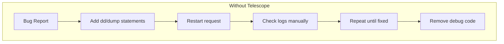
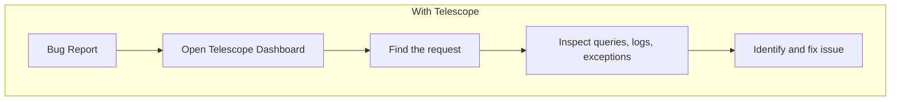
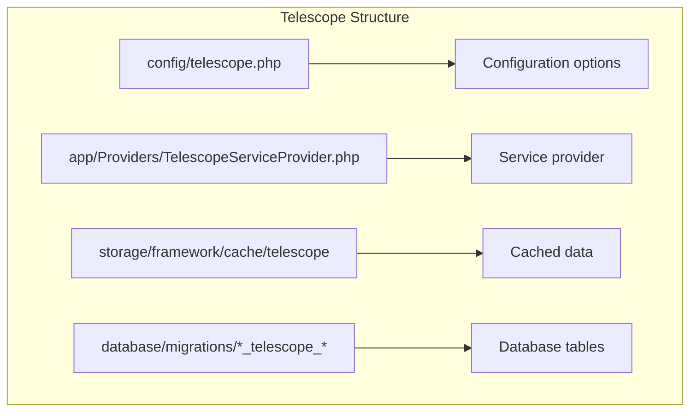
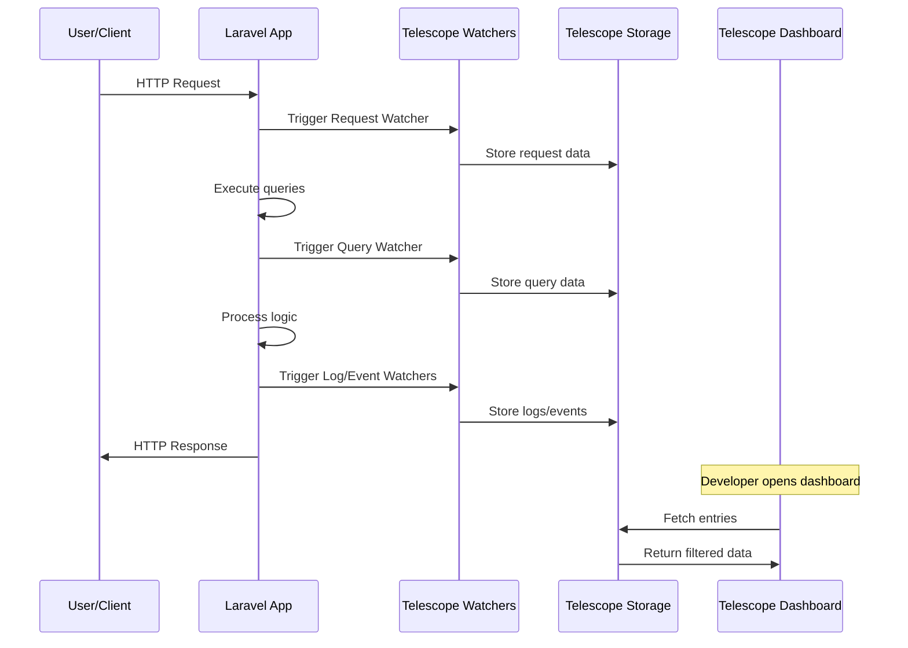
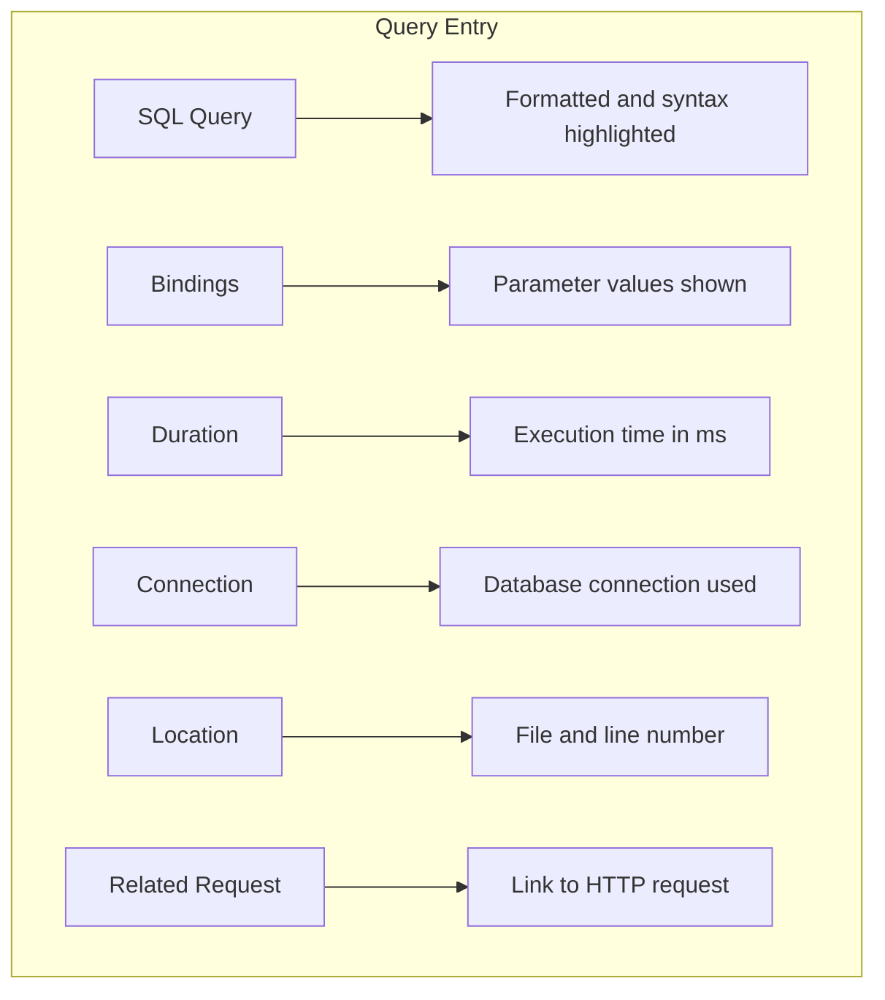
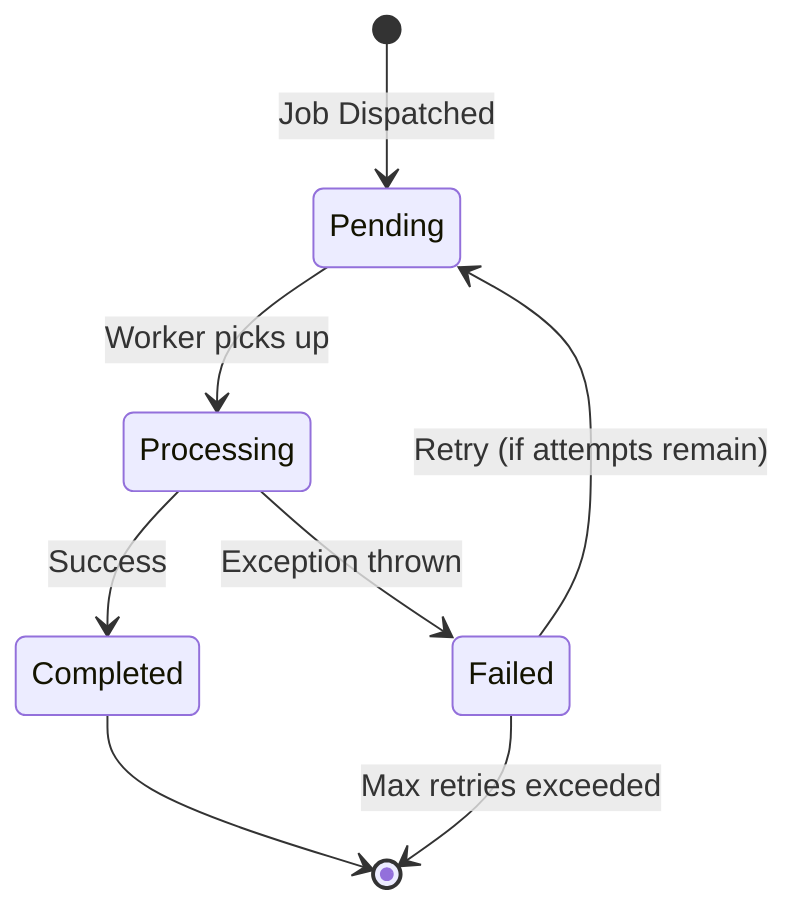
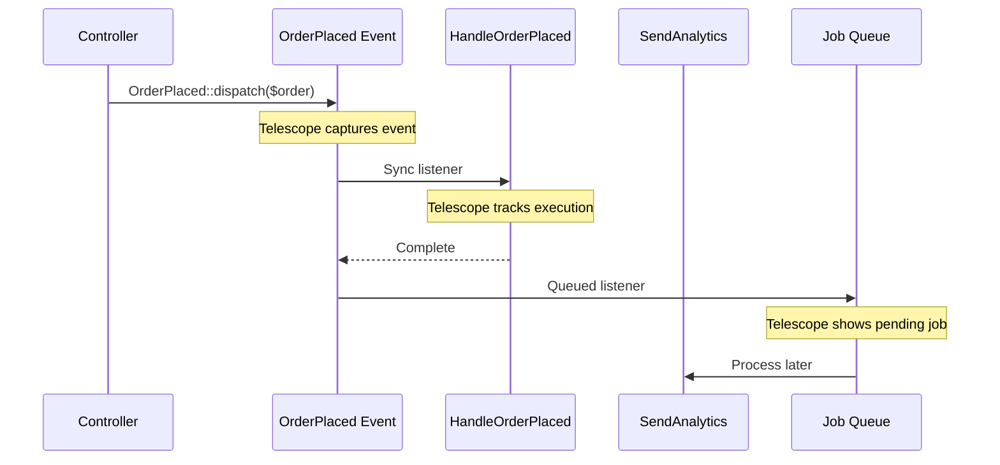
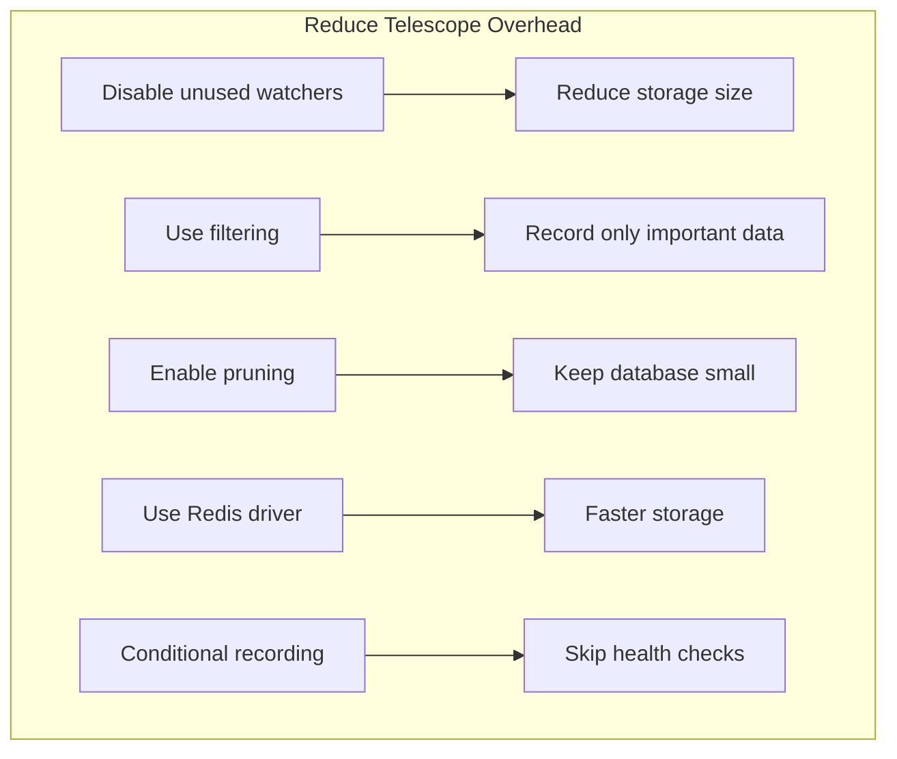

# How to Use Laravel Telescope for Debugging

Author: [nawazdhandala](https://www.github.com/nawazdhandala)

Tags: PHP, Laravel, Telescope, Debugging, Monitoring, Development

Description: A comprehensive guide to using Laravel Telescope for debugging and monitoring your Laravel applications. Learn how to install, configure, and use Telescope to inspect requests, exceptions, database queries, and more in development and production environments.

---

> Debugging Laravel applications becomes significantly easier when you can see exactly what is happening under the hood. Laravel Telescope provides an elegant dashboard that gives you insight into requests, exceptions, log entries, database queries, queued jobs, mail, notifications, cache operations, scheduled tasks, and more.

Laravel Telescope is a first-party debugging assistant for Laravel applications. It captures and stores information about what happens in your application, presenting it through a beautiful, searchable interface. Whether you are tracking down a slow database query or investigating why an email was not sent, Telescope gives you the tools to understand your application's behavior.

---

## Why Use Laravel Telescope?

Before diving into implementation, let us understand why Telescope is essential for Laravel development:





### Key Benefits

Telescope provides several advantages over traditional debugging:

- **Real-time Monitoring**: Watch requests, queries, and exceptions as they happen
- **Historical Data**: Browse past requests to understand patterns and issues
- **Query Analysis**: See exactly which database queries run and how long they take
- **Exception Tracking**: View full stack traces with context
- **Queue Monitoring**: Track job processing, failures, and retries
- **Mail Preview**: See what emails look like before and after sending
- **Cache Operations**: Monitor cache hits, misses, and updates

---

## Installation and Setup

### Installing Telescope

Install Telescope via Composer in your Laravel project:

```bash
# Install Telescope package
# This adds the debugging dashboard to your application
composer require laravel/telescope

# Publish Telescope assets and configuration
# Creates config/telescope.php and migrations
php artisan telescope:install

# Run migrations to create Telescope tables
# Stores debugging data in your database
php artisan migrate
```

### Directory Structure

After installation, Telescope creates the following structure:



### Basic Configuration

Open `config/telescope.php` to configure Telescope:

```php
<?php

// config/telescope.php
// Main configuration file for Laravel Telescope
// Controls what data is recorded and how long it is kept

return [
    /*
    |--------------------------------------------------------------------------
    | Telescope Domain
    |--------------------------------------------------------------------------
    |
    | This is the subdomain where Telescope will be accessible from.
    | Set to null to use the main application domain.
    |
    */
    'domain' => env('TELESCOPE_DOMAIN', null),

    /*
    |--------------------------------------------------------------------------
    | Telescope Path
    |--------------------------------------------------------------------------
    |
    | The URI path where Telescope will be accessible.
    | Default is /telescope but you can change it for security.
    |
    */
    'path' => env('TELESCOPE_PATH', 'telescope'),

    /*
    |--------------------------------------------------------------------------
    | Telescope Storage Driver
    |--------------------------------------------------------------------------
    |
    | Determines how Telescope stores data.
    | Default is 'database' which stores entries in your database.
    |
    */
    'driver' => env('TELESCOPE_DRIVER', 'database'),

    /*
    |--------------------------------------------------------------------------
    | Telescope Master Switch
    |--------------------------------------------------------------------------
    |
    | Enable or disable Telescope entirely.
    | Useful for toggling in different environments.
    |
    */
    'enabled' => env('TELESCOPE_ENABLED', true),

    /*
    |--------------------------------------------------------------------------
    | Telescope Data Pruning
    |--------------------------------------------------------------------------
    |
    | Configure how long to keep Telescope entries.
    | Entries older than this are deleted by the prune command.
    |
    */
    'pruning' => [
        'enabled' => env('TELESCOPE_PRUNING_ENABLED', true),
        'hours' => env('TELESCOPE_PRUNING_HOURS', 24),
    ],

    /*
    |--------------------------------------------------------------------------
    | Watchers Configuration
    |--------------------------------------------------------------------------
    |
    | Enable or disable specific watchers.
    | Each watcher tracks different types of application activity.
    |
    */
    'watchers' => [
        // Track incoming HTTP requests
        Watchers\RequestWatcher::class => [
            'enabled' => env('TELESCOPE_REQUEST_WATCHER', true),
            'size_limit' => env('TELESCOPE_RESPONSE_SIZE_LIMIT', 64),
        ],

        // Track database queries
        Watchers\QueryWatcher::class => [
            'enabled' => env('TELESCOPE_QUERY_WATCHER', true),
            'slow' => 100, // Log queries slower than 100ms
        ],

        // Track model events (created, updated, deleted)
        Watchers\ModelWatcher::class => [
            'enabled' => env('TELESCOPE_MODEL_WATCHER', true),
        ],

        // Track application events
        Watchers\EventWatcher::class => [
            'enabled' => env('TELESCOPE_EVENT_WATCHER', true),
        ],

        // Track exceptions and errors
        Watchers\ExceptionWatcher::class => [
            'enabled' => env('TELESCOPE_EXCEPTION_WATCHER', true),
        ],

        // Track log entries
        Watchers\LogWatcher::class => [
            'enabled' => env('TELESCOPE_LOG_WATCHER', true),
        ],

        // Track mail sent by the application
        Watchers\MailWatcher::class => [
            'enabled' => env('TELESCOPE_MAIL_WATCHER', true),
        ],

        // Track notifications
        Watchers\NotificationWatcher::class => [
            'enabled' => env('TELESCOPE_NOTIFICATION_WATCHER', true),
        ],

        // Track queued jobs
        Watchers\JobWatcher::class => [
            'enabled' => env('TELESCOPE_JOB_WATCHER', true),
        ],

        // Track cache operations
        Watchers\CacheWatcher::class => [
            'enabled' => env('TELESCOPE_CACHE_WATCHER', true),
        ],

        // Track Redis commands
        Watchers\RedisWatcher::class => [
            'enabled' => env('TELESCOPE_REDIS_WATCHER', true),
        ],

        // Track scheduled tasks
        Watchers\ScheduleWatcher::class => [
            'enabled' => env('TELESCOPE_SCHEDULE_WATCHER', true),
        ],

        // Track Artisan commands
        Watchers\CommandWatcher::class => [
            'enabled' => env('TELESCOPE_COMMAND_WATCHER', true),
        ],

        // Track HTTP client requests
        Watchers\ClientRequestWatcher::class => [
            'enabled' => env('TELESCOPE_CLIENT_REQUEST_WATCHER', true),
        ],

        // Track gate and policy checks
        Watchers\GateWatcher::class => [
            'enabled' => env('TELESCOPE_GATE_WATCHER', true),
        ],

        // Track view rendering
        Watchers\ViewWatcher::class => [
            'enabled' => env('TELESCOPE_VIEW_WATCHER', true),
        ],
    ],
];
```

---

## Service Provider Configuration

The `TelescopeServiceProvider` controls access and filtering:

```php
<?php

// app/Providers/TelescopeServiceProvider.php
// Configures Telescope authorization and filtering

namespace App\Providers;

use Illuminate\Support\Facades\Gate;
use Laravel\Telescope\IncomingEntry;
use Laravel\Telescope\Telescope;
use Laravel\Telescope\TelescopeApplicationServiceProvider;

class TelescopeServiceProvider extends TelescopeApplicationServiceProvider
{
    /**
     * Register any application services.
     * Called when the application boots.
     */
    public function register(): void
    {
        // Only enable Telescope in local environment by default
        // Remove this block to enable in all environments
        Telescope::night();

        $this->hideSensitiveRequestDetails();

        // Configure what entries Telescope should record
        // Return false from filter to skip recording
        Telescope::filter(function (IncomingEntry $entry) {
            // Always record in local environment
            if ($this->app->environment('local')) {
                return true;
            }

            // In other environments, only record important entries
            return $entry->isReportableException() ||
                   $entry->isFailedRequest() ||
                   $entry->isFailedJob() ||
                   $entry->isScheduledTask() ||
                   $entry->hasMonitoredTag();
        });
    }

    /**
     * Hide sensitive request data from Telescope.
     * Prevents passwords and tokens from being stored.
     */
    protected function hideSensitiveRequestDetails(): void
    {
        // Replace sensitive fields with asterisks
        // Add any custom fields that should be hidden
        if ($this->app->environment('local')) {
            return;
        }

        Telescope::hideRequestParameters([
            '_token',           // CSRF tokens
            'password',         // Password fields
            'password_confirmation',
            'current_password',
            'secret',           // API secrets
            'api_key',          // API keys
            'api_token',
            'credit_card',      // Payment data
            'card_number',
            'cvv',
        ]);

        Telescope::hideRequestHeaders([
            'cookie',           // Session cookies
            'x-csrf-token',     // CSRF headers
            'x-xsrf-token',
            'authorization',    // Auth headers
        ]);
    }

    /**
     * Register the Telescope gate.
     * Controls who can access the Telescope dashboard.
     */
    protected function gate(): void
    {
        // Define who can access Telescope in non-local environments
        Gate::define('viewTelescope', function ($user) {
            // Only allow specific users or admins
            return in_array($user->email, [
                'admin@example.com',
                'developer@example.com',
            ]) || $user->hasRole('admin');
        });
    }
}
```

---

## Data Flow Architecture

Understanding how Telescope captures data helps in optimizing its usage:



---

## Using the Telescope Dashboard

### Accessing the Dashboard

Navigate to `/telescope` in your browser to access the dashboard:

```php
<?php

// routes/web.php
// Telescope automatically registers its routes
// You can customize the path in config/telescope.php

// Default access: https://your-app.test/telescope

// To restrict access in production, ensure the gate is configured
// See TelescopeServiceProvider::gate()
```

### Dashboard Sections

The Telescope dashboard is organized into several sections:

```mermaid
flowchart LR
    subgraph Telescope Dashboard
        A[Requests] --> A1[HTTP request/response data]
        B[Commands] --> B1[Artisan command execution]
        C[Schedule] --> C1[Scheduled task runs]
        D[Jobs] --> D1[Queue job processing]
        E[Exceptions] --> E1[Application errors]
        F[Logs] --> F1[Log entries]
        G[Queries] --> G1[Database queries]
        H[Models] --> H1[Eloquent events]
        I[Events] --> I1[Application events]
        J[Mail] --> J1[Sent emails]
        K[Notifications] --> K1[Notification channels]
        L[Cache] --> L1[Cache operations]
        M[Redis] --> M1[Redis commands]
        N[Gates] --> N1[Authorization checks]
        O[HTTP Client] --> O1[Outgoing requests]
        P[Views] --> P1[View rendering]
    end
```



---

## Debugging Requests

### Inspecting HTTP Requests

The Requests section shows all incoming HTTP requests:

```php
<?php

// app/Http/Controllers/UserController.php
// Example controller to demonstrate request debugging

namespace App\Http\Controllers;

use App\Models\User;
use Illuminate\Http\Request;
use Illuminate\Support\Facades\Log;

class UserController extends Controller
{
    /**
     * Display a listing of users.
     * Telescope will capture this request automatically.
     */
    public function index(Request $request)
    {
        // This query will appear in Telescope's Queries section
        $users = User::query()
            ->when($request->search, function ($query, $search) {
                $query->where('name', 'like', "%{$search}%")
                      ->orWhere('email', 'like', "%{$search}%");
            })
            ->when($request->role, function ($query, $role) {
                $query->where('role', $role);
            })
            ->orderBy('created_at', 'desc')
            ->paginate(20);

        // This log entry will appear in Telescope's Logs section
        Log::info('User list accessed', [
            'user_id' => auth()->id(),
            'search' => $request->search,
            'filters' => $request->only(['role', 'status']),
            'count' => $users->total(),
        ]);

        return view('users.index', compact('users'));
    }

    /**
     * Store a newly created user.
     * Telescope tracks the model creation event.
     */
    public function store(Request $request)
    {
        // Validation errors will appear in request details
        $validated = $request->validate([
            'name' => 'required|string|max:255',
            'email' => 'required|email|unique:users',
            'password' => 'required|min:8|confirmed',
            'role' => 'required|in:user,admin,editor',
        ]);

        // Model creation appears in Models section
        $user = User::create([
            'name' => $validated['name'],
            'email' => $validated['email'],
            'password' => bcrypt($validated['password']),
            'role' => $validated['role'],
        ]);

        // Log the creation for audit trail
        Log::info('User created', [
            'user_id' => $user->id,
            'created_by' => auth()->id(),
        ]);

        return redirect()
            ->route('users.show', $user)
            ->with('success', 'User created successfully');
    }
}
```

### Request Details View

When you click on a request in Telescope, you see:

- **Request Method and URL**: GET /users?search=john
- **Response Status**: 200 OK
- **Duration**: How long the request took
- **Memory**: Peak memory usage
- **Headers**: All request headers
- **Payload**: Request body data
- **Response**: Response body (truncated for large responses)
- **Related Entries**: Linked queries, logs, and events

---

## Query Debugging

### Identifying Slow Queries

Telescope highlights slow queries based on your configuration:

```php
<?php

// app/Http/Controllers/ReportController.php
// Demonstrates query debugging with Telescope

namespace App\Http\Controllers;

use App\Models\Order;
use App\Models\Product;
use Illuminate\Support\Facades\DB;

class ReportController extends Controller
{
    /**
     * Generate sales report.
     * Complex queries will be captured by Telescope.
     */
    public function salesReport()
    {
        // This query appears in Telescope with execution time
        // Slow queries (>100ms by default) are highlighted
        $salesByMonth = Order::query()
            ->select(
                DB::raw('YEAR(created_at) as year'),
                DB::raw('MONTH(created_at) as month'),
                DB::raw('SUM(total) as revenue'),
                DB::raw('COUNT(*) as order_count')
            )
            ->where('status', 'completed')
            ->where('created_at', '>=', now()->subYear())
            ->groupBy('year', 'month')
            ->orderBy('year', 'desc')
            ->orderBy('month', 'desc')
            ->get();

        // This query uses eager loading to prevent N+1 problems
        // Telescope shows all related queries together
        $topProducts = Product::query()
            ->withCount(['orders' => function ($query) {
                $query->where('created_at', '>=', now()->subMonth());
            }])
            ->withSum(['orderItems' => function ($query) {
                $query->whereHas('order', function ($q) {
                    $q->where('created_at', '>=', now()->subMonth());
                });
            }], 'quantity')
            ->orderByDesc('orders_count')
            ->take(10)
            ->get();

        return view('reports.sales', compact('salesByMonth', 'topProducts'));
    }

    /**
     * Raw query example for complex reports.
     * Telescope captures raw queries as well.
     */
    public function inventoryReport()
    {
        // Raw query with bindings (displayed safely in Telescope)
        $lowStock = DB::select("
            SELECT 
                p.id,
                p.name,
                p.sku,
                p.stock_quantity,
                p.reorder_level,
                (p.reorder_level - p.stock_quantity) as shortage
            FROM products p
            WHERE p.stock_quantity < p.reorder_level
            AND p.active = ?
            ORDER BY shortage DESC
            LIMIT ?
        ", [true, 50]);

        return view('reports.inventory', compact('lowStock'));
    }
}
```

### Query Analysis in Dashboard

Telescope's query view provides:



---

## Exception Tracking

### Capturing and Viewing Exceptions

Telescope automatically captures all exceptions:

```php
<?php

// app/Services/PaymentService.php
// Exception handling example for Telescope debugging

namespace App\Services;

use App\Exceptions\PaymentFailedException;
use App\Exceptions\InsufficientFundsException;
use App\Models\Order;
use Illuminate\Support\Facades\Http;
use Illuminate\Support\Facades\Log;

class PaymentService
{
    /**
     * Process payment for an order.
     * Exceptions thrown here are captured by Telescope.
     */
    public function processPayment(Order $order, array $paymentDetails): bool
    {
        Log::info('Processing payment', [
            'order_id' => $order->id,
            'amount' => $order->total,
        ]);

        try {
            // This HTTP request appears in Telescope's HTTP Client section
            $response = Http::withHeaders([
                'Authorization' => 'Bearer ' . config('services.payment.secret'),
            ])->post(config('services.payment.url') . '/charge', [
                'amount' => $order->total * 100, // Convert to cents
                'currency' => 'usd',
                'source' => $paymentDetails['token'],
                'description' => "Order #{$order->id}",
                'metadata' => [
                    'order_id' => $order->id,
                    'customer_email' => $order->customer->email,
                ],
            ]);

            // Check for API errors
            if ($response->failed()) {
                // This exception will be captured with full context
                throw new PaymentFailedException(
                    "Payment gateway error: " . $response->json('error.message', 'Unknown error'),
                    $response->status()
                );
            }

            // Handle insufficient funds
            if ($response->json('status') === 'insufficient_funds') {
                throw new InsufficientFundsException(
                    'Customer has insufficient funds',
                    ['order_id' => $order->id]
                );
            }

            // Store the transaction ID
            $order->update([
                'payment_status' => 'completed',
                'transaction_id' => $response->json('id'),
                'paid_at' => now(),
            ]);

            Log::info('Payment successful', [
                'order_id' => $order->id,
                'transaction_id' => $response->json('id'),
            ]);

            return true;

        } catch (PaymentFailedException $e) {
            // Log the failure for debugging
            Log::error('Payment failed', [
                'order_id' => $order->id,
                'error' => $e->getMessage(),
                'code' => $e->getCode(),
            ]);

            // Re-throw to be captured by Telescope
            throw $e;

        } catch (\Exception $e) {
            // Catch unexpected errors
            Log::critical('Unexpected payment error', [
                'order_id' => $order->id,
                'exception' => get_class($e),
                'message' => $e->getMessage(),
            ]);

            throw new PaymentFailedException(
                'An unexpected error occurred while processing payment',
                500,
                $e
            );
        }
    }
}
```

### Custom Exception Reporting

Configure custom context for better debugging:

```php
<?php

// app/Exceptions/PaymentFailedException.php
// Custom exception with additional context

namespace App\Exceptions;

use Exception;
use Throwable;

class PaymentFailedException extends Exception
{
    /**
     * Additional context for debugging.
     * This data appears in Telescope's exception view.
     */
    protected array $context = [];

    public function __construct(
        string $message = 'Payment processing failed',
        int $code = 0,
        ?Throwable $previous = null,
        array $context = []
    ) {
        parent::__construct($message, $code, $previous);
        $this->context = $context;
    }

    /**
     * Get additional context for Telescope.
     * Called automatically when exception is captured.
     */
    public function context(): array
    {
        return array_merge($this->context, [
            'timestamp' => now()->toIso8601String(),
            'user_id' => auth()->id(),
        ]);
    }

    /**
     * Get the exception's severity level.
     * Helps categorize in Telescope dashboard.
     */
    public function getSeverity(): string
    {
        return 'error';
    }
}
```

---

## Job Queue Monitoring

### Debugging Queued Jobs

Telescope tracks all queued job activity:

```php
<?php

// app/Jobs/ProcessOrderJob.php
// Queued job example for Telescope monitoring

namespace App\Jobs;

use App\Models\Order;
use App\Services\InventoryService;
use App\Services\NotificationService;
use Illuminate\Bus\Queueable;
use Illuminate\Contracts\Queue\ShouldQueue;
use Illuminate\Foundation\Bus\Dispatchable;
use Illuminate\Queue\InteractsWithQueue;
use Illuminate\Queue\SerializesModels;
use Illuminate\Support\Facades\Log;
use Throwable;

class ProcessOrderJob implements ShouldQueue
{
    use Dispatchable, InteractsWithQueue, Queueable, SerializesModels;

    /**
     * Number of times the job may be attempted.
     * Telescope shows retry attempts.
     */
    public int $tries = 3;

    /**
     * Number of seconds to wait before retrying.
     * Telescope displays retry timing.
     */
    public array $backoff = [30, 60, 120];

    /**
     * Maximum seconds a job should run.
     * Telescope shows if job times out.
     */
    public int $timeout = 120;

    /**
     * Create a new job instance.
     * Telescope captures the job payload.
     */
    public function __construct(
        public Order $order,
        public bool $sendNotification = true
    ) {
        // Set the queue for this job
        $this->onQueue('orders');
    }

    /**
     * Execute the job.
     * All activity is tracked by Telescope.
     */
    public function handle(
        InventoryService $inventory,
        NotificationService $notifications
    ): void {
        Log::info('Processing order', ['order_id' => $this->order->id]);

        // Update inventory (queries tracked by Telescope)
        foreach ($this->order->items as $item) {
            $inventory->decrementStock($item->product_id, $item->quantity);
        }

        // Update order status (model event tracked)
        $this->order->update([
            'status' => 'processing',
            'processed_at' => now(),
        ]);

        // Send notification if requested
        if ($this->sendNotification) {
            // This notification appears in Telescope's Notifications section
            $notifications->sendOrderConfirmation($this->order);
        }

        Log::info('Order processed successfully', [
            'order_id' => $this->order->id,
        ]);
    }

    /**
     * Handle a job failure.
     * Telescope shows failure details and exception.
     */
    public function failed(?Throwable $exception): void
    {
        Log::error('Order processing failed', [
            'order_id' => $this->order->id,
            'exception' => $exception?->getMessage(),
            'attempt' => $this->attempts(),
        ]);

        // Update order status on failure
        $this->order->update([
            'status' => 'failed',
            'failure_reason' => $exception?->getMessage(),
        ]);
    }

    /**
     * Get tags for Telescope filtering.
     * Makes it easy to find related entries.
     */
    public function tags(): array
    {
        return [
            'order:' . $this->order->id,
            'customer:' . $this->order->customer_id,
        ];
    }
}
```

### Dispatching Jobs

```php
<?php

// app/Http/Controllers/OrderController.php
// Dispatching jobs that Telescope will track

namespace App\Http\Controllers;

use App\Jobs\ProcessOrderJob;
use App\Jobs\SendInvoiceJob;
use App\Models\Order;

class OrderController extends Controller
{
    /**
     * Process an order.
     * Dispatched jobs appear in Telescope's Jobs section.
     */
    public function process(Order $order)
    {
        // Dispatch immediately to queue
        // Telescope shows job in "pending" state
        ProcessOrderJob::dispatch($order);

        // Dispatch with delay
        // Telescope shows scheduled time
        SendInvoiceJob::dispatch($order)
            ->delay(now()->addMinutes(5))
            ->onQueue('emails');

        // Dispatch multiple jobs in a chain
        // Telescope shows the chain relationship
        ProcessOrderJob::withChain([
            new SendInvoiceJob($order),
            new UpdateAnalyticsJob($order),
        ])->dispatch($order);

        return back()->with('success', 'Order is being processed');
    }
}
```

### Job Status in Dashboard



---

## Mail and Notification Debugging

### Viewing Sent Emails

Telescope captures all mail sent by your application:

```php
<?php

// app/Mail/OrderConfirmation.php
// Mailable that Telescope will capture

namespace App\Mail;

use App\Models\Order;
use Illuminate\Bus\Queueable;
use Illuminate\Mail\Mailable;
use Illuminate\Mail\Mailables\Address;
use Illuminate\Mail\Mailables\Attachment;
use Illuminate\Mail\Mailables\Content;
use Illuminate\Mail\Mailables\Envelope;
use Illuminate\Queue\SerializesModels;

class OrderConfirmation extends Mailable
{
    use Queueable, SerializesModels;

    /**
     * Create a new message instance.
     * Telescope captures the mailable data.
     */
    public function __construct(
        public Order $order
    ) {}

    /**
     * Get the message envelope.
     * Telescope shows recipients and subject.
     */
    public function envelope(): Envelope
    {
        return new Envelope(
            from: new Address(
                config('mail.from.address'),
                config('mail.from.name')
            ),
            subject: "Order Confirmation - #{$this->order->id}",
            tags: ['order', 'confirmation'],
            metadata: [
                'order_id' => $this->order->id,
            ],
        );
    }

    /**
     * Get the message content definition.
     * Telescope shows the rendered HTML.
     */
    public function content(): Content
    {
        return new Content(
            view: 'emails.order-confirmation',
            with: [
                'order' => $this->order,
                'customer' => $this->order->customer,
                'items' => $this->order->items,
                'total' => $this->order->total,
            ],
        );
    }

    /**
     * Get the attachments for the message.
     * Telescope shows attachment metadata.
     */
    public function attachments(): array
    {
        return [
            Attachment::fromPath($this->order->invoice_path)
                ->as("invoice-{$this->order->id}.pdf")
                ->withMime('application/pdf'),
        ];
    }
}
```

### Sending and Previewing

```php
<?php

// app/Services/NotificationService.php
// Send notifications that Telescope tracks

namespace App\Services;

use App\Mail\OrderConfirmation;
use App\Models\Order;
use App\Notifications\OrderShipped;
use Illuminate\Support\Facades\Mail;

class NotificationService
{
    /**
     * Send order confirmation email.
     * Appears in Telescope's Mail section.
     */
    public function sendOrderConfirmation(Order $order): void
    {
        // Telescope shows: recipient, subject, HTML preview
        Mail::to($order->customer->email)
            ->cc($order->customer->secondary_email)
            ->send(new OrderConfirmation($order));
    }

    /**
     * Send shipping notification via multiple channels.
     * Appears in Telescope's Notifications section.
     */
    public function notifyOrderShipped(Order $order): void
    {
        // Telescope shows each notification channel
        $order->customer->notify(new OrderShipped($order));
    }
}
```

---

## Cache Operation Debugging

### Monitoring Cache Activity

Telescope tracks all cache operations:

```php
<?php

// app/Services/ProductService.php
// Cache operations monitored by Telescope

namespace App\Services;

use App\Models\Product;
use Illuminate\Support\Facades\Cache;
use Illuminate\Support\Facades\Log;

class ProductService
{
    /**
     * Get product catalog with caching.
     * Telescope shows cache hits and misses.
     */
    public function getCatalog(string $category = null): array
    {
        $cacheKey = "catalog:" . ($category ?? 'all');

        // Telescope shows: hit, miss, key, value, expiration
        return Cache::remember($cacheKey, now()->addHours(1), function () use ($category) {
            Log::info('Cache miss, fetching from database', [
                'category' => $category,
            ]);

            return Product::query()
                ->when($category, fn($q) => $q->where('category', $category))
                ->where('active', true)
                ->orderBy('name')
                ->get()
                ->toArray();
        });
    }

    /**
     * Update product and invalidate cache.
     * Telescope shows cache forget operations.
     */
    public function updateProduct(Product $product, array $data): Product
    {
        $product->update($data);

        // Telescope tracks these cache operations
        Cache::forget("catalog:{$product->category}");
        Cache::forget("catalog:all");
        Cache::forget("product:{$product->id}");

        // Cache tags (if using Redis)
        Cache::tags(['products', "category:{$product->category}"])->flush();

        Log::info('Product updated, cache invalidated', [
            'product_id' => $product->id,
        ]);

        return $product->fresh();
    }

    /**
     * Increment view count atomically.
     * Telescope shows cache increment operations.
     */
    public function incrementViewCount(Product $product): int
    {
        $key = "product_views:{$product->id}";

        // Telescope shows the increment operation
        $views = Cache::increment($key);

        // Persist to database periodically
        if ($views % 100 === 0) {
            $product->increment('views', 100);
            Cache::decrement($key, 100);
        }

        return Cache::get($key, 0);
    }
}
```

### Cache Dashboard View

Telescope's cache section shows:

- **Operation Type**: get, put, forget, increment, etc.
- **Cache Key**: The key being accessed
- **Value**: The cached value (truncated for large values)
- **Hit/Miss**: Whether the key existed
- **Duration**: Time taken for the operation
- **Store**: Which cache store was used (redis, file, etc.)

---

## Event Debugging

### Tracking Application Events

Telescope captures all dispatched events:

```php
<?php

// app/Events/OrderPlaced.php
// Event that Telescope will track

namespace App\Events;

use App\Models\Order;
use Illuminate\Broadcasting\InteractsWithSockets;
use Illuminate\Foundation\Events\Dispatchable;
use Illuminate\Queue\SerializesModels;

class OrderPlaced
{
    use Dispatchable, InteractsWithSockets, SerializesModels;

    /**
     * Create a new event instance.
     * Telescope captures the event payload.
     */
    public function __construct(
        public Order $order,
        public string $source = 'web'
    ) {}

    /**
     * Get the tags for Telescope filtering.
     */
    public function tags(): array
    {
        return [
            'order:' . $this->order->id,
            'source:' . $this->source,
        ];
    }
}
```

```php
<?php

// app/Listeners/HandleOrderPlaced.php
// Listener that processes events

namespace App\Listeners;

use App\Events\OrderPlaced;
use App\Services\InventoryService;
use App\Services\NotificationService;
use Illuminate\Support\Facades\Log;

class HandleOrderPlaced
{
    public function __construct(
        private InventoryService $inventory,
        private NotificationService $notifications
    ) {}

    /**
     * Handle the event.
     * Telescope shows listener execution.
     */
    public function handle(OrderPlaced $event): void
    {
        Log::info('Handling OrderPlaced event', [
            'order_id' => $event->order->id,
            'source' => $event->source,
        ]);

        // Reserve inventory
        $this->inventory->reserveItems($event->order);

        // Send confirmation
        $this->notifications->sendOrderConfirmation($event->order);
    }
}
```

### Event Flow Visualization



---

## Tagging for Better Organization

### Using Tags Effectively

Tags help you filter and group related entries:

```php
<?php

// app/Providers/TelescopeServiceProvider.php
// Configure global tags and filtering

namespace App\Providers;

use Laravel\Telescope\IncomingEntry;
use Laravel\Telescope\Telescope;
use Laravel\Telescope\TelescopeApplicationServiceProvider;

class TelescopeServiceProvider extends TelescopeApplicationServiceProvider
{
    public function register(): void
    {
        // Add global tags to all entries
        Telescope::tag(function (IncomingEntry $entry) {
            $tags = [];

            // Tag with authenticated user
            if (auth()->check()) {
                $tags[] = 'user:' . auth()->id();
            }

            // Tag with request ID for correlation
            if (request()->hasHeader('X-Request-ID')) {
                $tags[] = 'request:' . request()->header('X-Request-ID');
            }

            // Tag with tenant ID for multi-tenant apps
            if ($tenantId = request()->header('X-Tenant-ID')) {
                $tags[] = 'tenant:' . $tenantId;
            }

            // Tag requests by route
            if ($entry->type === 'request' && request()->route()) {
                $tags[] = 'route:' . request()->route()->getName();
            }

            return $tags;
        });
    }
}
```

### Custom Tags on Entries

```php
<?php

// app/Jobs/SyncExternalDataJob.php
// Job with custom tags for filtering

namespace App\Jobs;

use Illuminate\Bus\Queueable;
use Illuminate\Contracts\Queue\ShouldQueue;
use Illuminate\Foundation\Bus\Dispatchable;
use Illuminate\Queue\InteractsWithQueue;
use Illuminate\Queue\SerializesModels;

class SyncExternalDataJob implements ShouldQueue
{
    use Dispatchable, InteractsWithQueue, Queueable, SerializesModels;

    public function __construct(
        public string $provider,
        public string $resourceType,
        public int $resourceId
    ) {}

    public function handle(): void
    {
        // Job implementation
    }

    /**
     * Tags for Telescope filtering.
     * Find all jobs for a specific provider or resource.
     */
    public function tags(): array
    {
        return [
            'provider:' . $this->provider,
            'resource:' . $this->resourceType,
            "{$this->resourceType}:{$this->resourceId}",
            'sync-job',
        ];
    }
}
```

---

## Production Considerations

### Enabling Telescope in Production

Configure Telescope for production use carefully:

```php
<?php

// config/telescope.php
// Production-safe configuration

return [
    // Only enable in specific environments
    'enabled' => env('TELESCOPE_ENABLED', false),

    // Use Redis for better performance in production
    'driver' => env('TELESCOPE_DRIVER', 'database'),

    // More aggressive pruning in production
    'pruning' => [
        'enabled' => true,
        'hours' => env('TELESCOPE_PRUNING_HOURS', 6),
    ],

    // Disable verbose watchers in production
    'watchers' => [
        Watchers\RequestWatcher::class => [
            'enabled' => env('TELESCOPE_REQUEST_WATCHER', true),
            'size_limit' => env('TELESCOPE_RESPONSE_SIZE_LIMIT', 16),
        ],

        // Disable model watcher for high-traffic apps
        Watchers\ModelWatcher::class => [
            'enabled' => env('TELESCOPE_MODEL_WATCHER', false),
        ],

        // Only track slow queries in production
        Watchers\QueryWatcher::class => [
            'enabled' => env('TELESCOPE_QUERY_WATCHER', true),
            'slow' => 500, // Only queries over 500ms
        ],

        // Disable view watcher in production
        Watchers\ViewWatcher::class => [
            'enabled' => env('TELESCOPE_VIEW_WATCHER', false),
        ],

        // Always track exceptions
        Watchers\ExceptionWatcher::class => [
            'enabled' => true,
        ],

        // Track failed jobs
        Watchers\JobWatcher::class => [
            'enabled' => true,
        ],
    ],
];
```

### Filtering Production Data

```php
<?php

// app/Providers/TelescopeServiceProvider.php
// Production-optimized filtering

public function register(): void
{
    Telescope::filter(function (IncomingEntry $entry) {
        // In local, record everything
        if ($this->app->environment('local')) {
            return true;
        }

        // In production, be selective
        return $entry->isReportableException() ||
               $entry->isFailedJob() ||
               $entry->isScheduledTask() ||
               $entry->isSlowQuery() ||
               $entry->hasMonitoredTag();
    });

    // Add monitored tags in production
    // Only entries with these tags are recorded
    Telescope::monitoredTags([
        'important',
        'debug',
        'critical',
    ]);
}
```

### Environment Variables

```bash
# .env.production
# Minimal Telescope configuration for production

TELESCOPE_ENABLED=true
TELESCOPE_DRIVER=database
TELESCOPE_PRUNING_HOURS=6

# Disable verbose watchers
TELESCOPE_MODEL_WATCHER=false
TELESCOPE_VIEW_WATCHER=false
TELESCOPE_EVENT_WATCHER=false
TELESCOPE_CACHE_WATCHER=false

# Keep essential watchers
TELESCOPE_REQUEST_WATCHER=true
TELESCOPE_QUERY_WATCHER=true
TELESCOPE_EXCEPTION_WATCHER=true
TELESCOPE_JOB_WATCHER=true
TELESCOPE_LOG_WATCHER=true
```

---

## Data Pruning and Maintenance

### Automatic Pruning

Configure scheduled pruning to keep database size manageable:

```php
<?php

// app/Console/Kernel.php
// Schedule Telescope pruning

namespace App\Console;

use Illuminate\Console\Scheduling\Schedule;
use Illuminate\Foundation\Console\Kernel as ConsoleKernel;

class Kernel extends ConsoleKernel
{
    protected function schedule(Schedule $schedule): void
    {
        // Prune old Telescope entries every hour
        // Removes entries older than configured hours
        $schedule->command('telescope:prune')
            ->hourly()
            ->withoutOverlapping()
            ->runInBackground();

        // In production, prune more aggressively
        if ($this->app->environment('production')) {
            $schedule->command('telescope:prune --hours=6')
                ->everyThirtyMinutes()
                ->withoutOverlapping();
        }
    }
}
```

### Manual Pruning

```bash
# Prune entries older than 24 hours (default)
php artisan telescope:prune

# Prune entries older than 6 hours
php artisan telescope:prune --hours=6

# Clear all Telescope data
php artisan telescope:clear
```

### Database Optimization

```php
<?php

// database/migrations/xxxx_optimize_telescope_tables.php
// Add indexes for better query performance

use Illuminate\Database\Migrations\Migration;
use Illuminate\Database\Schema\Blueprint;
use Illuminate\Support\Facades\Schema;

class OptimizeTelescopeTables extends Migration
{
    public function up(): void
    {
        // Add index for faster tag lookups
        Schema::table('telescope_entries_tags', function (Blueprint $table) {
            $table->index(['tag', 'entry_uuid']);
        });

        // Add index for faster type filtering
        Schema::table('telescope_entries', function (Blueprint $table) {
            $table->index(['type', 'created_at']);
        });
    }
}
```

---

## Troubleshooting Common Issues

### Telescope Not Recording Data

```php
<?php

// Check if Telescope is enabled
// Run this in tinker or a route

use Laravel\Telescope\Telescope;

// Check if Telescope is recording
dump(Telescope::isRecording()); // Should return true

// Check enabled status
dump(config('telescope.enabled')); // Should be true

// Check if service provider is registered
dump(app()->getLoadedProviders());
// Should contain 'Laravel\Telescope\TelescopeServiceProvider'
```

### Common Issues

| Issue | Cause | Solution |
|-------|-------|----------|
| Dashboard shows 404 | Routes not registered | Run `php artisan telescope:install` |
| No entries recorded | Telescope disabled | Check `TELESCOPE_ENABLED=true` |
| Missing queries | Query watcher disabled | Enable in config |
| Dashboard white screen | Assets not published | Run `php artisan telescope:publish` |
| Permission denied | Gate not configured | Update `gate()` method |
| High memory usage | Too many entries | Enable pruning, reduce watchers |
| Slow dashboard | Large dataset | Add indexes, enable pruning |

### Debug Mode

```php
<?php

// routes/web.php
// Debug route to check Telescope status

use Illuminate\Support\Facades\Route;
use Laravel\Telescope\Telescope;

Route::get('/telescope-debug', function () {
    return [
        'enabled' => config('telescope.enabled'),
        'recording' => Telescope::isRecording(),
        'driver' => config('telescope.driver'),
        'watchers' => array_map(fn($w) => [
            'class' => $w,
            'enabled' => config("telescope.watchers.{$w}.enabled", true),
        ], array_keys(config('telescope.watchers', []))),
    ];
})->middleware('auth');
```

---

## Integration with External Tools

### Sending Telescope Data to External Services

```php
<?php

// app/Listeners/TelescopeWebhook.php
// Forward important Telescope entries to external services

namespace App\Listeners;

use Illuminate\Support\Facades\Http;
use Laravel\Telescope\IncomingEntry;

class TelescopeWebhook
{
    /**
     * Forward exceptions to Slack or webhook.
     */
    public function handleException(IncomingEntry $entry): void
    {
        if ($entry->type !== 'exception') {
            return;
        }

        // Send to Slack
        Http::post(config('services.slack.webhook_url'), [
            'text' => 'Exception in ' . config('app.name'),
            'attachments' => [
                [
                    'color' => 'danger',
                    'title' => $entry->content['class'] ?? 'Unknown Exception',
                    'text' => $entry->content['message'] ?? 'No message',
                    'fields' => [
                        [
                            'title' => 'File',
                            'value' => $entry->content['file'] ?? 'Unknown',
                            'short' => true,
                        ],
                        [
                            'title' => 'Line',
                            'value' => $entry->content['line'] ?? 'Unknown',
                            'short' => true,
                        ],
                    ],
                ],
            ],
        ]);
    }
}
```

---

## Performance Impact

### Measuring Overhead

Telescope adds some overhead to your application. Monitor it carefully:

```php
<?php

// Benchmark with and without Telescope

// Disable Telescope temporarily
Telescope::stopRecording();

$startWithout = microtime(true);
// Run your code
$timeWithout = microtime(true) - $startWithout;

// Enable Telescope
Telescope::startRecording();

$startWith = microtime(true);
// Run your code
$timeWith = microtime(true) - $startWith;

$overhead = ($timeWith - $timeWithout) / $timeWithout * 100;
dump("Telescope overhead: {$overhead}%");
```

### Minimizing Performance Impact



---

## Summary

Laravel Telescope transforms debugging from a frustrating exercise into an efficient process. Key takeaways:

- **Install and configure** Telescope early in development
- **Use watchers selectively** based on what you need to debug
- **Implement filtering** to reduce noise and storage
- **Add meaningful tags** for easier navigation
- **Configure production carefully** to balance insight with performance
- **Prune data regularly** to maintain database performance
- **Secure access** with proper gate configuration

Telescope provides visibility into every aspect of your Laravel application, making it an essential tool for both development and production debugging.

---

*Need comprehensive monitoring beyond local debugging? [OneUptime](https://oneuptime.com) provides production-grade observability for Laravel applications, including error tracking, performance monitoring, uptime checks, and incident management that complement Telescope's local debugging capabilities.*