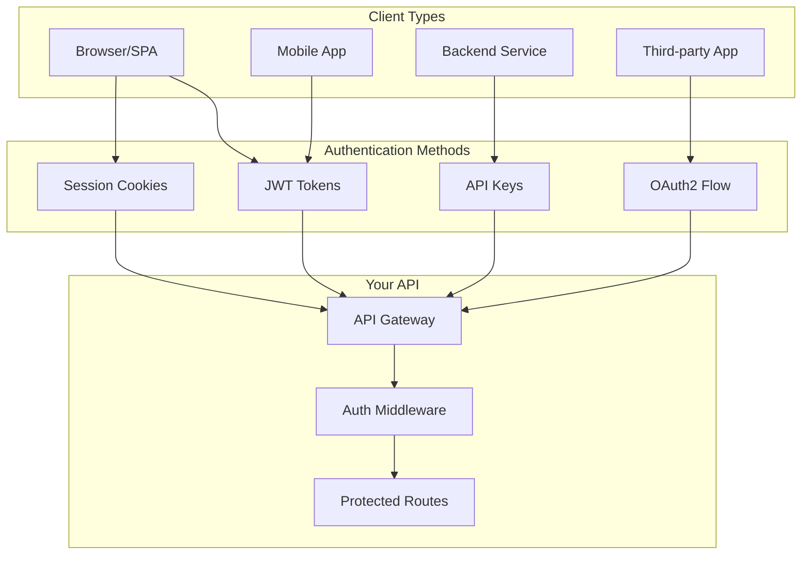
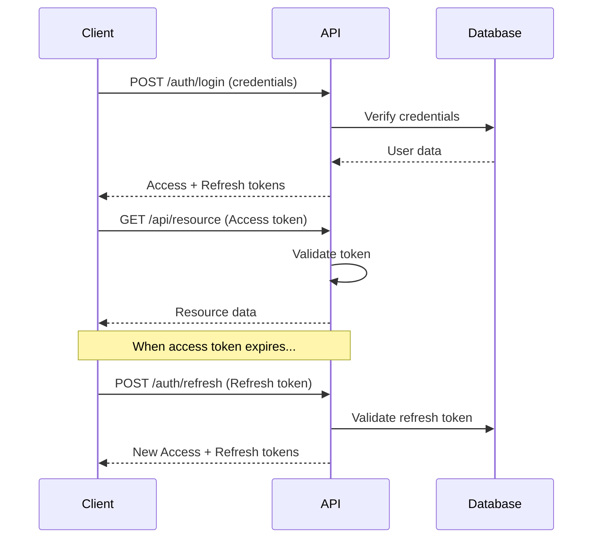
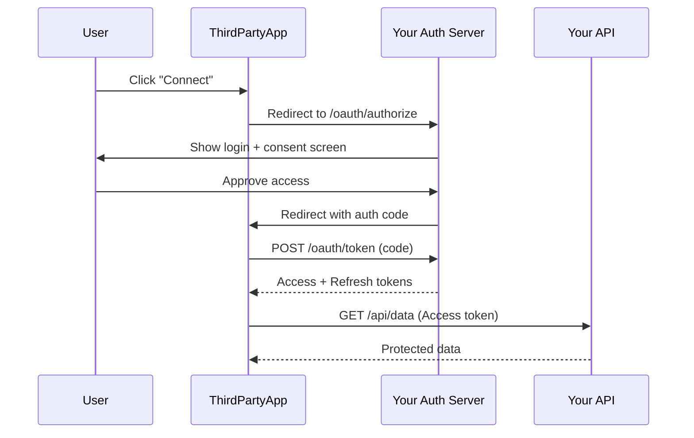
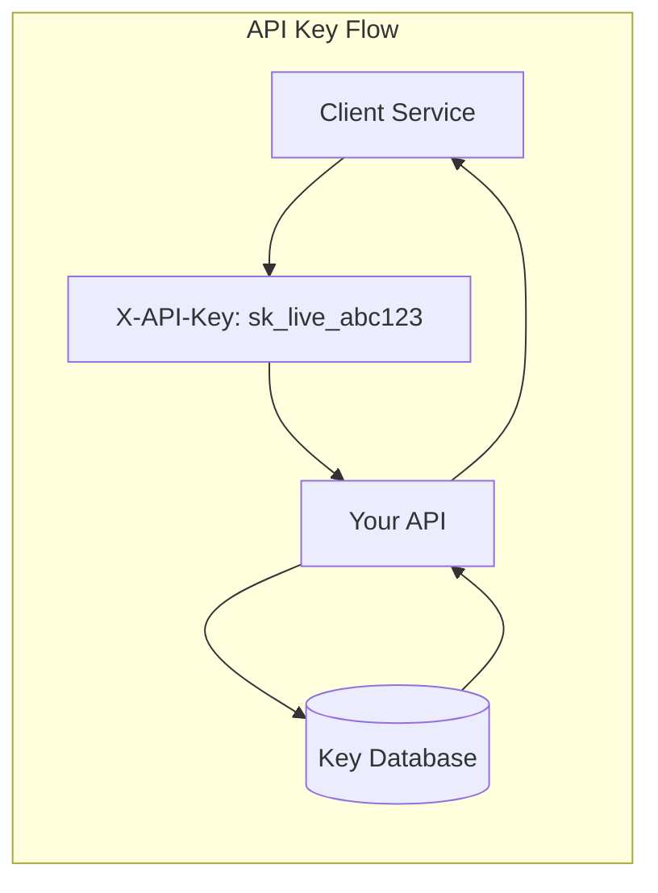

# How to Implement Authentication in Python APIs

Author: [nawazdhandala](https://www.github.com/nawazdhandala)

Tags: Python, Authentication, JWT, OAuth2, FastAPI, Security

Description: A comprehensive guide to implementing authentication in Python APIs. Learn JWT authentication, OAuth2 flows, API key management, and security best practices with FastAPI.

---

> Authentication is the gatekeeper of your API. Get it wrong, and you expose user data, enable unauthorized access, and create security vulnerabilities. This guide walks you through implementing robust authentication in Python APIs using JWT, OAuth2, and API keys with production-ready patterns.

Modern APIs need flexible authentication strategies. Some endpoints require user authentication, others need machine-to-machine communication, and some are public. This guide covers all these scenarios with practical code examples.

---

## Authentication Architecture Overview

Before diving into code, let's understand how different authentication methods work together in a typical API:



Each authentication method has specific use cases:

| Method | Best For | Token Lifetime | Storage |
|--------|----------|----------------|---------|
| JWT | User sessions, mobile apps | Short (15-30 min) | Memory/Secure storage |
| OAuth2 | Third-party integrations | Varies by grant type | Authorization server |
| API Keys | Server-to-server, CI/CD | Long-lived | Environment variables |
| Session Cookies | Web applications | Session duration | HTTP-only cookies |

---

## Project Setup

Let's set up a FastAPI project with all the dependencies needed for authentication:

```bash
# Create project directory and virtual environment
mkdir python-api-auth && cd python-api-auth
python -m venv venv
source venv/bin/activate  # On Windows: venv\Scripts\activate

# Install dependencies
pip install fastapi uvicorn python-jose[cryptography] passlib[bcrypt] \
    python-multipart httpx asyncpg slowapi pydantic-settings
```

### Project Structure

```
python-api-auth/
    app/
        __init__.py
        main.py              # FastAPI application
        config.py            # Configuration settings
        models.py            # Pydantic models
        auth/
            __init__.py
            jwt_handler.py   # JWT token operations
            oauth2.py        # OAuth2 implementation
            api_keys.py      # API key management
            dependencies.py  # FastAPI dependencies
        routes/
            __init__.py
            auth.py          # Authentication endpoints
            users.py         # User endpoints
        database/
            __init__.py
            connection.py    # Database connection
            models.py        # SQLAlchemy models
```

### Configuration

Create a centralized configuration that loads secrets from environment variables:

```python
# app/config.py
# Centralized configuration management using pydantic-settings
from pydantic_settings import BaseSettings
from typing import Optional

class Settings(BaseSettings):
    """Application settings loaded from environment variables

    Using pydantic-settings ensures type safety and validation
    for all configuration values.
    """

    # Database configuration
    database_url: str = "postgresql://localhost/auth_demo"

    # JWT configuration
    jwt_secret_key: str  # Required - no default for security
    jwt_algorithm: str = "HS256"
    access_token_expire_minutes: int = 15
    refresh_token_expire_days: int = 7

    # OAuth2 configuration
    oauth2_client_id: Optional[str] = None
    oauth2_client_secret: Optional[str] = None

    # API key configuration
    api_key_header_name: str = "X-API-Key"

    # Security settings
    cors_origins: list[str] = ["http://localhost:3000"]
    rate_limit_per_minute: int = 60

    class Config:
        # Load from .env file if present
        env_file = ".env"
        env_file_encoding = "utf-8"

# Create singleton settings instance
settings = Settings()
```

---

## JWT Authentication Implementation

JWT (JSON Web Token) authentication is the most common approach for user authentication in APIs. The flow involves issuing tokens at login and validating them on each request.



### JWT Token Handler

This module handles all JWT operations including creation, validation, and decoding:

```python
# app/auth/jwt_handler.py
# Core JWT token creation and validation utilities
from datetime import datetime, timedelta, timezone
from typing import Optional, Dict, Any, Tuple
from jose import jwt, JWTError
import secrets
from app.config import settings

class JWTHandler:
    """Handles JWT token creation and validation

    This class provides methods for creating access tokens (short-lived,
    for API authentication) and refresh tokens (longer-lived, for
    obtaining new access tokens without re-authentication).
    """

    def __init__(self):
        self.secret_key = settings.jwt_secret_key
        self.algorithm = settings.jwt_algorithm
        self.access_expire_minutes = settings.access_token_expire_minutes
        self.refresh_expire_days = settings.refresh_token_expire_days

    def create_access_token(
        self,
        subject: str,
        additional_claims: Optional[Dict[str, Any]] = None,
        expires_delta: Optional[timedelta] = None
    ) -> str:
        """Create a short-lived access token for API authentication

        Args:
            subject: The user identifier (typically user ID)
            additional_claims: Extra data to include in token payload
            expires_delta: Custom expiration time (defaults to config value)

        Returns:
            Encoded JWT string
        """
        # Start with base payload
        payload = {
            "sub": subject,                           # Subject (user ID)
            "type": "access",                         # Token type for validation
            "jti": secrets.token_urlsafe(16),        # Unique ID for revocation
            "iat": datetime.now(timezone.utc),       # Issued at time
        }

        # Add any additional claims (roles, permissions, etc.)
        if additional_claims:
            payload.update(additional_claims)

        # Calculate expiration time
        expire = datetime.now(timezone.utc) + (
            expires_delta or timedelta(minutes=self.access_expire_minutes)
        )
        payload["exp"] = expire

        # Sign and return the JWT
        return jwt.encode(payload, self.secret_key, algorithm=self.algorithm)

    def create_refresh_token(
        self,
        subject: str,
        token_family: Optional[str] = None,
        expires_delta: Optional[timedelta] = None
    ) -> Tuple[str, str]:
        """Create a longer-lived refresh token

        Refresh tokens are used to obtain new access tokens without
        requiring the user to re-authenticate. The token_family parameter
        links related refresh tokens for security (detecting token reuse).

        Args:
            subject: The user identifier
            token_family: Optional family ID for related tokens
            expires_delta: Custom expiration time

        Returns:
            Tuple of (encoded JWT string, token family ID)
        """
        # Generate or use provided family ID
        family_id = token_family or secrets.token_urlsafe(16)

        payload = {
            "sub": subject,
            "type": "refresh",
            "jti": secrets.token_urlsafe(16),
            "family": family_id,                      # For detecting token reuse
            "iat": datetime.now(timezone.utc),
        }

        expire = datetime.now(timezone.utc) + (
            expires_delta or timedelta(days=self.refresh_expire_days)
        )
        payload["exp"] = expire

        token = jwt.encode(payload, self.secret_key, algorithm=self.algorithm)
        return token, family_id

    def decode_token(self, token: str) -> Dict[str, Any]:
        """Decode and validate a JWT token

        This method verifies the signature, checks expiration,
        and returns the payload if valid.

        Args:
            token: The JWT string to decode

        Returns:
            The decoded payload dictionary

        Raises:
            ValueError: If token is invalid, expired, or tampered
        """
        try:
            # Decode with signature and expiration verification
            payload = jwt.decode(
                token,
                self.secret_key,
                algorithms=[self.algorithm]
            )
            return payload
        except jwt.ExpiredSignatureError:
            raise ValueError("Token has expired")
        except jwt.JWTClaimsError:
            raise ValueError("Invalid token claims")
        except JWTError as e:
            raise ValueError(f"Invalid token: {str(e)}")

    def validate_token_type(
        self,
        payload: Dict[str, Any],
        expected_type: str
    ) -> bool:
        """Verify that the token is of the expected type

        This prevents using refresh tokens as access tokens and vice versa.
        """
        return payload.get("type") == expected_type

# Create singleton instance
jwt_handler = JWTHandler()
```

### Token Storage and Revocation

To support logout and token revocation, we need to track refresh tokens:

```python
# app/auth/token_storage.py
# Database-backed token storage for revocation support
from datetime import datetime, timezone
from typing import Optional, List
import asyncpg
from app.config import settings

class TokenStorage:
    """Manages refresh token storage and revocation

    Refresh tokens are stored in the database to support:
    - Token revocation (logout)
    - Token rotation (security best practice)
    - Detecting token reuse (security measure)
    """

    def __init__(self, db_pool: asyncpg.Pool):
        self.db = db_pool

    async def store_refresh_token(
        self,
        jti: str,
        family_id: str,
        user_id: str,
        expires_at: datetime,
        device_info: Optional[str] = None
    ) -> None:
        """Store a new refresh token in the database

        Args:
            jti: Unique token identifier
            family_id: Family ID linking related tokens
            user_id: Owner of the token
            expires_at: When the token expires
            device_info: Optional user agent for session management
        """
        await self.db.execute("""
            INSERT INTO refresh_tokens (jti, family_id, user_id, expires_at, device_info)
            VALUES ($1, $2, $3, $4, $5)
        """, jti, family_id, user_id, expires_at, device_info)

    async def get_token(self, jti: str) -> Optional[dict]:
        """Retrieve token metadata by JTI"""
        row = await self.db.fetchrow("""
            SELECT jti, family_id, user_id, revoked, expires_at, device_info
            FROM refresh_tokens
            WHERE jti = $1
        """, jti)
        return dict(row) if row else None

    async def revoke_token(self, jti: str) -> None:
        """Revoke a specific token (used for single session logout)"""
        await self.db.execute("""
            UPDATE refresh_tokens SET revoked = true WHERE jti = $1
        """, jti)

    async def revoke_family(self, family_id: str) -> None:
        """Revoke all tokens in a family (used when reuse is detected)

        If an old refresh token is reused after rotation, it indicates
        possible token theft. Revoking the entire family protects the user.
        """
        await self.db.execute("""
            UPDATE refresh_tokens SET revoked = true WHERE family_id = $1
        """, family_id)

    async def revoke_user_tokens(self, user_id: str) -> None:
        """Revoke all tokens for a user (logout everywhere)"""
        await self.db.execute("""
            UPDATE refresh_tokens SET revoked = true WHERE user_id = $1
        """, user_id)

    async def get_user_sessions(self, user_id: str) -> List[dict]:
        """Get all active sessions for a user (for session management UI)"""
        rows = await self.db.fetch("""
            SELECT jti, device_info, created_at
            FROM refresh_tokens
            WHERE user_id = $1 AND revoked = false AND expires_at > NOW()
            ORDER BY created_at DESC
        """, user_id)
        return [dict(row) for row in rows]

    async def is_token_revoked(self, jti: str) -> bool:
        """Check if a token has been revoked"""
        row = await self.db.fetchrow("""
            SELECT revoked FROM refresh_tokens WHERE jti = $1
        """, jti)
        return row is None or row["revoked"]

    async def cleanup_expired_tokens(self) -> int:
        """Remove expired tokens from database (run periodically)

        Returns the number of tokens deleted.
        """
        result = await self.db.execute("""
            DELETE FROM refresh_tokens
            WHERE expires_at < NOW() - INTERVAL '7 days'
        """)
        return int(result.split()[-1])
```

### Database Schema for Tokens

```sql
-- migrations/001_create_auth_tables.sql
-- Create tables for authentication system

-- Users table
CREATE TABLE users (
    id UUID PRIMARY KEY DEFAULT gen_random_uuid(),
    email VARCHAR(255) UNIQUE NOT NULL,
    password_hash VARCHAR(255) NOT NULL,
    is_active BOOLEAN DEFAULT true,
    is_verified BOOLEAN DEFAULT false,
    created_at TIMESTAMP WITH TIME ZONE DEFAULT CURRENT_TIMESTAMP,
    updated_at TIMESTAMP WITH TIME ZONE DEFAULT CURRENT_TIMESTAMP
);

-- Refresh tokens table for revocation support
CREATE TABLE refresh_tokens (
    jti VARCHAR(255) PRIMARY KEY,
    family_id VARCHAR(255) NOT NULL,
    user_id UUID NOT NULL REFERENCES users(id) ON DELETE CASCADE,
    revoked BOOLEAN DEFAULT false,
    device_info VARCHAR(500),
    created_at TIMESTAMP WITH TIME ZONE DEFAULT CURRENT_TIMESTAMP,
    expires_at TIMESTAMP WITH TIME ZONE NOT NULL
);

-- Indexes for efficient queries
CREATE INDEX idx_refresh_tokens_user_id ON refresh_tokens(user_id);
CREATE INDEX idx_refresh_tokens_family_id ON refresh_tokens(family_id);
CREATE INDEX idx_refresh_tokens_expires ON refresh_tokens(expires_at);

-- API keys table for machine-to-machine auth
CREATE TABLE api_keys (
    id UUID PRIMARY KEY DEFAULT gen_random_uuid(),
    key_hash VARCHAR(255) NOT NULL,
    key_prefix VARCHAR(10) NOT NULL,  -- For identification (e.g., "sk_live_")
    name VARCHAR(255) NOT NULL,
    user_id UUID REFERENCES users(id) ON DELETE CASCADE,
    scopes TEXT[] DEFAULT '{}',
    rate_limit INTEGER DEFAULT 1000,
    last_used_at TIMESTAMP WITH TIME ZONE,
    expires_at TIMESTAMP WITH TIME ZONE,
    revoked BOOLEAN DEFAULT false,
    created_at TIMESTAMP WITH TIME ZONE DEFAULT CURRENT_TIMESTAMP
);

CREATE INDEX idx_api_keys_user_id ON api_keys(user_id);
CREATE INDEX idx_api_keys_prefix ON api_keys(key_prefix);
```

---

## OAuth2 Implementation

OAuth2 is essential for enabling third-party integrations with your API. Here's how the OAuth2 Authorization Code flow works:



### OAuth2 Client Registration

```python
# app/auth/oauth2.py
# OAuth2 implementation for third-party integrations
from datetime import datetime, timedelta, timezone
from typing import Optional, List
import secrets
import hashlib
from pydantic import BaseModel
import asyncpg

class OAuthClient(BaseModel):
    """Represents a registered OAuth2 client application"""
    client_id: str
    client_secret_hash: str
    name: str
    redirect_uris: List[str]
    allowed_scopes: List[str]
    is_confidential: bool  # True for server apps, False for SPAs/mobile

class OAuthManager:
    """Manages OAuth2 clients, authorization codes, and token grants"""

    def __init__(self, db_pool: asyncpg.Pool):
        self.db = db_pool
        # Authorization codes are short-lived (10 minutes max per RFC)
        self.code_expire_minutes = 10

    async def register_client(
        self,
        name: str,
        redirect_uris: List[str],
        allowed_scopes: List[str],
        is_confidential: bool = True
    ) -> tuple[str, str]:
        """Register a new OAuth2 client application

        Returns tuple of (client_id, client_secret).
        The client_secret is only returned once and should be stored securely.
        """
        # Generate credentials
        client_id = f"client_{secrets.token_urlsafe(16)}"
        client_secret = secrets.token_urlsafe(32)

        # Store hashed secret (never store plain text)
        secret_hash = hashlib.sha256(client_secret.encode()).hexdigest()

        await self.db.execute("""
            INSERT INTO oauth_clients
            (client_id, client_secret_hash, name, redirect_uris, allowed_scopes, is_confidential)
            VALUES ($1, $2, $3, $4, $5, $6)
        """, client_id, secret_hash, name, redirect_uris, allowed_scopes, is_confidential)

        return client_id, client_secret

    async def validate_client(
        self,
        client_id: str,
        client_secret: Optional[str] = None,
        redirect_uri: Optional[str] = None
    ) -> Optional[OAuthClient]:
        """Validate client credentials and redirect URI"""
        row = await self.db.fetchrow("""
            SELECT * FROM oauth_clients WHERE client_id = $1
        """, client_id)

        if not row:
            return None

        client = OAuthClient(**dict(row))

        # Verify client secret if provided (required for confidential clients)
        if client_secret:
            secret_hash = hashlib.sha256(client_secret.encode()).hexdigest()
            if secret_hash != client.client_secret_hash:
                return None

        # Verify redirect URI if provided
        if redirect_uri and redirect_uri not in client.redirect_uris:
            return None

        return client

    async def create_authorization_code(
        self,
        client_id: str,
        user_id: str,
        redirect_uri: str,
        scopes: List[str],
        code_challenge: Optional[str] = None,  # For PKCE
        code_challenge_method: Optional[str] = None
    ) -> str:
        """Create an authorization code for the code grant flow

        The code is single-use and short-lived. PKCE parameters are stored
        for verification during token exchange (required for public clients).
        """
        code = secrets.token_urlsafe(32)
        expires_at = datetime.now(timezone.utc) + timedelta(minutes=self.code_expire_minutes)

        await self.db.execute("""
            INSERT INTO authorization_codes
            (code, client_id, user_id, redirect_uri, scopes, expires_at,
             code_challenge, code_challenge_method)
            VALUES ($1, $2, $3, $4, $5, $6, $7, $8)
        """, code, client_id, user_id, redirect_uri, scopes, expires_at,
            code_challenge, code_challenge_method)

        return code

    async def exchange_code_for_tokens(
        self,
        code: str,
        client_id: str,
        redirect_uri: str,
        code_verifier: Optional[str] = None  # For PKCE
    ) -> Optional[dict]:
        """Exchange an authorization code for access/refresh tokens

        Validates the code, client, redirect URI, and PKCE challenge.
        The code is consumed (deleted) after successful exchange.
        """
        # Retrieve and validate the code
        row = await self.db.fetchrow("""
            SELECT * FROM authorization_codes
            WHERE code = $1 AND client_id = $2 AND redirect_uri = $3 AND used = false
        """, code, client_id, redirect_uri)

        if not row:
            return None

        # Check expiration
        if datetime.now(timezone.utc) > row["expires_at"]:
            return None

        # Verify PKCE if code challenge was provided
        if row["code_challenge"]:
            if not code_verifier:
                return None

            if row["code_challenge_method"] == "S256":
                # SHA256 hash of verifier should match challenge
                verifier_hash = hashlib.sha256(code_verifier.encode()).hexdigest()
                # Base64url encoding comparison
                import base64
                expected = base64.urlsafe_b64encode(
                    hashlib.sha256(code_verifier.encode()).digest()
                ).rstrip(b'=').decode()
                if expected != row["code_challenge"]:
                    return None
            elif row["code_challenge_method"] == "plain":
                if code_verifier != row["code_challenge"]:
                    return None

        # Mark code as used (prevent replay attacks)
        await self.db.execute("""
            UPDATE authorization_codes SET used = true WHERE code = $1
        """, code)

        # Generate tokens
        from app.auth.jwt_handler import jwt_handler

        access_token = jwt_handler.create_access_token(
            subject=row["user_id"],
            additional_claims={"scopes": row["scopes"], "client_id": client_id}
        )

        refresh_token, family_id = jwt_handler.create_refresh_token(
            subject=row["user_id"]
        )

        return {
            "access_token": access_token,
            "token_type": "bearer",
            "expires_in": settings.access_token_expire_minutes * 60,
            "refresh_token": refresh_token,
            "scope": " ".join(row["scopes"])
        }
```

### OAuth2 Routes

```python
# app/routes/oauth.py
# OAuth2 authorization endpoints
from fastapi import APIRouter, Depends, HTTPException, Query, Request, Form
from fastapi.responses import RedirectResponse, HTMLResponse
from typing import Optional, List
from app.auth.oauth2 import OAuthManager
from app.auth.dependencies import get_current_user

router = APIRouter(prefix="/oauth", tags=["OAuth2"])

@router.get("/authorize")
async def authorize(
    request: Request,
    client_id: str,
    redirect_uri: str,
    response_type: str,
    scope: str = "",
    state: Optional[str] = None,
    code_challenge: Optional[str] = None,
    code_challenge_method: Optional[str] = "S256",
    current_user = Depends(get_current_user)
):
    """OAuth2 Authorization Endpoint

    This endpoint handles the start of the authorization code flow.
    It validates the client and redirect URI, then shows a consent screen.
    """
    oauth = request.app.state.oauth_manager

    # Validate client and redirect URI
    client = await oauth.validate_client(
        client_id=client_id,
        redirect_uri=redirect_uri
    )

    if not client:
        raise HTTPException(status_code=400, detail="Invalid client or redirect URI")

    if response_type != "code":
        raise HTTPException(status_code=400, detail="Only 'code' response type supported")

    # Parse requested scopes and validate against client's allowed scopes
    requested_scopes = scope.split() if scope else []
    invalid_scopes = set(requested_scopes) - set(client.allowed_scopes)
    if invalid_scopes:
        raise HTTPException(
            status_code=400,
            detail=f"Invalid scopes: {', '.join(invalid_scopes)}"
        )

    # In production, render a consent page here
    # For this example, we auto-approve (DO NOT do this in production!)

    # Create authorization code
    code = await oauth.create_authorization_code(
        client_id=client_id,
        user_id=current_user.id,
        redirect_uri=redirect_uri,
        scopes=requested_scopes,
        code_challenge=code_challenge,
        code_challenge_method=code_challenge_method
    )

    # Redirect back to client with code
    redirect_url = f"{redirect_uri}?code={code}"
    if state:
        redirect_url += f"&state={state}"

    return RedirectResponse(url=redirect_url, status_code=302)

@router.post("/token")
async def token(
    request: Request,
    grant_type: str = Form(...),
    code: Optional[str] = Form(None),
    redirect_uri: Optional[str] = Form(None),
    client_id: Optional[str] = Form(None),
    client_secret: Optional[str] = Form(None),
    code_verifier: Optional[str] = Form(None),
    refresh_token: Optional[str] = Form(None)
):
    """OAuth2 Token Endpoint

    Handles multiple grant types:
    - authorization_code: Exchange auth code for tokens
    - refresh_token: Get new access token using refresh token
    - client_credentials: Machine-to-machine authentication
    """
    oauth = request.app.state.oauth_manager

    # Extract client credentials from Authorization header if not in body
    if not client_id:
        auth_header = request.headers.get("Authorization", "")
        if auth_header.startswith("Basic "):
            import base64
            decoded = base64.b64decode(auth_header[6:]).decode()
            client_id, client_secret = decoded.split(":", 1)

    if grant_type == "authorization_code":
        if not all([code, redirect_uri, client_id]):
            raise HTTPException(status_code=400, detail="Missing required parameters")

        # Validate client (secret required for confidential clients)
        client = await oauth.validate_client(client_id, client_secret)
        if not client:
            raise HTTPException(status_code=401, detail="Invalid client credentials")

        # Exchange code for tokens
        tokens = await oauth.exchange_code_for_tokens(
            code=code,
            client_id=client_id,
            redirect_uri=redirect_uri,
            code_verifier=code_verifier
        )

        if not tokens:
            raise HTTPException(status_code=400, detail="Invalid or expired code")

        return tokens

    elif grant_type == "refresh_token":
        if not refresh_token:
            raise HTTPException(status_code=400, detail="Missing refresh_token")

        # Handle refresh token grant (reuse JWT refresh logic)
        from app.auth.jwt_handler import jwt_handler
        try:
            payload = jwt_handler.decode_token(refresh_token)
            if payload.get("type") != "refresh":
                raise HTTPException(status_code=400, detail="Invalid token type")

            new_access = jwt_handler.create_access_token(subject=payload["sub"])
            new_refresh, _ = jwt_handler.create_refresh_token(
                subject=payload["sub"],
                token_family=payload.get("family")
            )

            return {
                "access_token": new_access,
                "token_type": "bearer",
                "expires_in": settings.access_token_expire_minutes * 60,
                "refresh_token": new_refresh
            }
        except ValueError as e:
            raise HTTPException(status_code=400, detail=str(e))

    elif grant_type == "client_credentials":
        # Machine-to-machine authentication
        if not all([client_id, client_secret]):
            raise HTTPException(status_code=401, detail="Client credentials required")

        client = await oauth.validate_client(client_id, client_secret)
        if not client or not client.is_confidential:
            raise HTTPException(status_code=401, detail="Invalid client")

        from app.auth.jwt_handler import jwt_handler
        access_token = jwt_handler.create_access_token(
            subject=client_id,
            additional_claims={
                "scopes": client.allowed_scopes,
                "grant_type": "client_credentials"
            }
        )

        return {
            "access_token": access_token,
            "token_type": "bearer",
            "expires_in": settings.access_token_expire_minutes * 60
        }

    else:
        raise HTTPException(status_code=400, detail=f"Unsupported grant type: {grant_type}")
```

---

## API Key Authentication

API keys are ideal for server-to-server communication, CI/CD pipelines, and integrations that don't involve user context.



### API Key Manager

```python
# app/auth/api_keys.py
# API key generation, validation, and management
import secrets
import hashlib
from datetime import datetime, timezone
from typing import Optional, List
from pydantic import BaseModel
import asyncpg

class APIKey(BaseModel):
    """Represents an API key with its metadata"""
    id: str
    name: str
    key_prefix: str
    scopes: List[str]
    rate_limit: int
    user_id: Optional[str]
    created_at: datetime
    last_used_at: Optional[datetime]
    expires_at: Optional[datetime]

class APIKeyManager:
    """Manages API key lifecycle: creation, validation, revocation"""

    # Prefixes help identify key types and environment
    KEY_PREFIXES = {
        "live": "sk_live_",    # Production keys
        "test": "sk_test_",    # Test/sandbox keys
        "admin": "sk_admin_",  # Admin keys with elevated permissions
    }

    def __init__(self, db_pool: asyncpg.Pool):
        self.db = db_pool

    def _generate_key(self, key_type: str = "live") -> tuple[str, str]:
        """Generate a new API key with appropriate prefix

        Returns tuple of (full_key, key_hash).
        The full_key is only shown once during creation.
        """
        prefix = self.KEY_PREFIXES.get(key_type, "sk_live_")
        # Generate 32 bytes of entropy, encode as base64
        random_part = secrets.token_urlsafe(32)
        full_key = f"{prefix}{random_part}"

        # Store SHA256 hash (never store plain key)
        key_hash = hashlib.sha256(full_key.encode()).hexdigest()

        return full_key, key_hash

    def _hash_key(self, key: str) -> str:
        """Hash an API key for comparison"""
        return hashlib.sha256(key.encode()).hexdigest()

    async def create_key(
        self,
        name: str,
        user_id: Optional[str] = None,
        scopes: Optional[List[str]] = None,
        key_type: str = "live",
        rate_limit: int = 1000,
        expires_in_days: Optional[int] = None
    ) -> tuple[str, APIKey]:
        """Create a new API key

        Args:
            name: Human-readable name for the key
            user_id: Optional owner of the key
            scopes: Permissions granted to this key
            key_type: 'live', 'test', or 'admin'
            rate_limit: Requests per minute allowed
            expires_in_days: Optional expiration

        Returns:
            Tuple of (full_key, key_metadata).
            IMPORTANT: The full_key is only returned once!
        """
        full_key, key_hash = self._generate_key(key_type)
        prefix = self.KEY_PREFIXES.get(key_type, "sk_live_")

        expires_at = None
        if expires_in_days:
            expires_at = datetime.now(timezone.utc) + timedelta(days=expires_in_days)

        # Insert into database
        row = await self.db.fetchrow("""
            INSERT INTO api_keys (key_hash, key_prefix, name, user_id, scopes, rate_limit, expires_at)
            VALUES ($1, $2, $3, $4, $5, $6, $7)
            RETURNING id, name, key_prefix, scopes, rate_limit, user_id, created_at, expires_at
        """, key_hash, prefix, name, user_id, scopes or [], rate_limit, expires_at)

        key_metadata = APIKey(**dict(row), last_used_at=None)

        return full_key, key_metadata

    async def validate_key(self, key: str) -> Optional[APIKey]:
        """Validate an API key and return its metadata

        Also updates last_used_at timestamp for tracking.
        Returns None if key is invalid, expired, or revoked.
        """
        key_hash = self._hash_key(key)

        row = await self.db.fetchrow("""
            SELECT id, name, key_prefix, scopes, rate_limit, user_id,
                   created_at, last_used_at, expires_at
            FROM api_keys
            WHERE key_hash = $1 AND revoked = false
        """, key_hash)

        if not row:
            return None

        # Check expiration
        if row["expires_at"] and datetime.now(timezone.utc) > row["expires_at"]:
            return None

        # Update last used timestamp (fire and forget)
        await self.db.execute("""
            UPDATE api_keys SET last_used_at = NOW() WHERE key_hash = $1
        """, key_hash)

        return APIKey(**dict(row))

    async def revoke_key(self, key_id: str, user_id: Optional[str] = None) -> bool:
        """Revoke an API key

        If user_id is provided, only revoke if the key belongs to that user.
        """
        if user_id:
            result = await self.db.execute("""
                UPDATE api_keys SET revoked = true
                WHERE id = $1 AND user_id = $2
            """, key_id, user_id)
        else:
            result = await self.db.execute("""
                UPDATE api_keys SET revoked = true WHERE id = $1
            """, key_id)

        return "UPDATE 1" in result

    async def list_user_keys(self, user_id: str) -> List[APIKey]:
        """List all API keys for a user (excludes revoked keys)"""
        rows = await self.db.fetch("""
            SELECT id, name, key_prefix, scopes, rate_limit, user_id,
                   created_at, last_used_at, expires_at
            FROM api_keys
            WHERE user_id = $1 AND revoked = false
            ORDER BY created_at DESC
        """, user_id)

        return [APIKey(**dict(row)) for row in rows]

    async def rotate_key(self, key_id: str, user_id: Optional[str] = None) -> tuple[str, APIKey]:
        """Rotate an API key (revoke old, create new with same settings)

        Returns the new key. The old key is immediately revoked.
        """
        # Get current key settings
        if user_id:
            row = await self.db.fetchrow("""
                SELECT name, scopes, rate_limit, expires_at
                FROM api_keys
                WHERE id = $1 AND user_id = $2 AND revoked = false
            """, key_id, user_id)
        else:
            row = await self.db.fetchrow("""
                SELECT name, user_id, scopes, rate_limit, expires_at
                FROM api_keys
                WHERE id = $1 AND revoked = false
            """, key_id)

        if not row:
            raise ValueError("Key not found or already revoked")

        # Revoke old key
        await self.revoke_key(key_id, user_id)

        # Create new key with same settings
        return await self.create_key(
            name=row["name"],
            user_id=row.get("user_id") or user_id,
            scopes=row["scopes"],
            rate_limit=row["rate_limit"]
        )
```

---

## FastAPI Dependencies for Authentication

Create reusable dependencies that validate authentication and can be composed:

```python
# app/auth/dependencies.py
# FastAPI dependencies for authentication
from fastapi import Depends, HTTPException, status, Request, Security
from fastapi.security import OAuth2PasswordBearer, APIKeyHeader
from typing import Optional, List
from app.auth.jwt_handler import jwt_handler
from app.auth.api_keys import APIKeyManager, APIKey
from app.models import User

# OAuth2 scheme for JWT tokens in Authorization header
oauth2_scheme = OAuth2PasswordBearer(tokenUrl="/auth/token", auto_error=False)

# API key header extraction
api_key_header = APIKeyHeader(name="X-API-Key", auto_error=False)

class AuthError(HTTPException):
    """Custom authentication error with consistent format"""
    def __init__(self, detail: str):
        super().__init__(
            status_code=status.HTTP_401_UNAUTHORIZED,
            detail=detail,
            headers={"WWW-Authenticate": "Bearer"}
        )

async def get_current_user(
    request: Request,
    token: Optional[str] = Depends(oauth2_scheme)
) -> User:
    """Dependency that extracts and validates JWT token

    Returns the authenticated user or raises 401.
    """
    if not token:
        raise AuthError("Authentication required")

    try:
        payload = jwt_handler.decode_token(token)

        # Verify this is an access token
        if payload.get("type") != "access":
            raise AuthError("Invalid token type")

        user_id = payload.get("sub")
        if not user_id:
            raise AuthError("Invalid token")

        # Fetch user from database
        user = await request.app.state.user_repo.get_by_id(user_id)
        if not user:
            raise AuthError("User not found")

        if not user.is_active:
            raise AuthError("User account is disabled")

        return user

    except ValueError as e:
        raise AuthError(str(e))

async def get_current_user_optional(
    request: Request,
    token: Optional[str] = Depends(oauth2_scheme)
) -> Optional[User]:
    """Like get_current_user but returns None instead of raising error

    Useful for endpoints that behave differently for authenticated users.
    """
    if not token:
        return None

    try:
        return await get_current_user(request, token)
    except HTTPException:
        return None

async def get_api_key(
    request: Request,
    api_key: Optional[str] = Security(api_key_header)
) -> APIKey:
    """Dependency that validates API key from header

    Returns the API key metadata or raises 401.
    """
    if not api_key:
        raise AuthError("API key required")

    key_manager: APIKeyManager = request.app.state.api_key_manager
    key_data = await key_manager.validate_key(api_key)

    if not key_data:
        raise AuthError("Invalid or expired API key")

    return key_data

async def get_auth_context(
    request: Request,
    token: Optional[str] = Depends(oauth2_scheme),
    api_key: Optional[str] = Security(api_key_header)
) -> dict:
    """Flexible dependency that accepts either JWT or API key

    Returns a context dict with the authentication method and identity.
    Useful for endpoints that accept multiple auth methods.
    """
    # Try JWT first
    if token:
        try:
            user = await get_current_user(request, token)
            return {
                "method": "jwt",
                "user": user,
                "scopes": jwt_handler.decode_token(token).get("scopes", [])
            }
        except HTTPException:
            pass  # Fall through to try API key

    # Try API key
    if api_key:
        try:
            key_data = await get_api_key(request, api_key)
            return {
                "method": "api_key",
                "key": key_data,
                "scopes": key_data.scopes
            }
        except HTTPException:
            pass

    raise AuthError("Authentication required (JWT token or API key)")

def require_scopes(required: List[str]):
    """Dependency factory that checks for required scopes

    Usage:
        @router.get("/admin/users", dependencies=[Depends(require_scopes(["admin:read"]))])
        async def list_users(): ...
    """
    async def check_scopes(auth: dict = Depends(get_auth_context)):
        user_scopes = set(auth.get("scopes", []))
        missing = set(required) - user_scopes

        if missing:
            raise HTTPException(
                status_code=status.HTTP_403_FORBIDDEN,
                detail=f"Missing required scopes: {', '.join(missing)}"
            )

        return auth

    return check_scopes

def require_verified_email(user: User = Depends(get_current_user)) -> User:
    """Dependency that ensures user has verified their email"""
    if not user.is_verified:
        raise HTTPException(
            status_code=status.HTTP_403_FORBIDDEN,
            detail="Email verification required"
        )
    return user
```

---

## Complete Authentication Routes

```python
# app/routes/auth.py
# Complete authentication endpoints
from fastapi import APIRouter, Depends, HTTPException, Request, Response
from fastapi.security import OAuth2PasswordRequestForm
from pydantic import BaseModel, EmailStr
from typing import Optional
from datetime import datetime, timedelta, timezone
from passlib.context import CryptContext
from app.auth.jwt_handler import jwt_handler
from app.auth.token_storage import TokenStorage
from app.auth.dependencies import get_current_user
from app.config import settings

router = APIRouter(prefix="/auth", tags=["Authentication"])

# Password hashing context
pwd_context = CryptContext(schemes=["bcrypt"], deprecated="auto")

# Request/Response models
class RegisterRequest(BaseModel):
    email: EmailStr
    password: str

class TokenResponse(BaseModel):
    access_token: str
    refresh_token: str
    token_type: str = "bearer"
    expires_in: int

class RefreshRequest(BaseModel):
    refresh_token: str

@router.post("/register", status_code=201)
async def register(
    request: Request,
    data: RegisterRequest
):
    """Register a new user account"""
    user_repo = request.app.state.user_repo

    # Check if email already exists
    existing = await user_repo.get_by_email(data.email)
    if existing:
        raise HTTPException(status_code=400, detail="Email already registered")

    # Hash password
    password_hash = pwd_context.hash(data.password)

    # Create user
    user = await user_repo.create(
        email=data.email,
        password_hash=password_hash
    )

    # TODO: Send verification email

    return {"message": "Registration successful", "user_id": user.id}

@router.post("/token", response_model=TokenResponse)
async def login(
    request: Request,
    form_data: OAuth2PasswordRequestForm = Depends()
):
    """Authenticate and receive access/refresh tokens"""
    user_repo = request.app.state.user_repo
    token_storage: TokenStorage = request.app.state.token_storage

    # Find user by email (username field contains email)
    user = await user_repo.get_by_email(form_data.username)
    if not user:
        raise HTTPException(status_code=401, detail="Invalid credentials")

    # Verify password
    if not pwd_context.verify(form_data.password, user.password_hash):
        raise HTTPException(status_code=401, detail="Invalid credentials")

    # Check if account is active
    if not user.is_active:
        raise HTTPException(status_code=401, detail="Account is disabled")

    # Create tokens
    access_token = jwt_handler.create_access_token(subject=str(user.id))
    refresh_token, family_id = jwt_handler.create_refresh_token(subject=str(user.id))

    # Store refresh token metadata
    refresh_payload = jwt_handler.decode_token(refresh_token)
    await token_storage.store_refresh_token(
        jti=refresh_payload["jti"],
        family_id=family_id,
        user_id=str(user.id),
        expires_at=datetime.fromtimestamp(refresh_payload["exp"], tz=timezone.utc),
        device_info=request.headers.get("User-Agent")
    )

    return TokenResponse(
        access_token=access_token,
        refresh_token=refresh_token,
        expires_in=settings.access_token_expire_minutes * 60
    )

@router.post("/refresh", response_model=TokenResponse)
async def refresh_tokens(
    request: Request,
    data: RefreshRequest
):
    """Exchange refresh token for new access/refresh token pair"""
    token_storage: TokenStorage = request.app.state.token_storage

    try:
        payload = jwt_handler.decode_token(data.refresh_token)
    except ValueError as e:
        raise HTTPException(status_code=401, detail=str(e))

    # Verify token type
    if payload.get("type") != "refresh":
        raise HTTPException(status_code=401, detail="Invalid token type")

    jti = payload["jti"]
    family_id = payload.get("family")
    user_id = payload["sub"]

    # Check if token is revoked
    if await token_storage.is_token_revoked(jti):
        # Token reuse detected - revoke entire family
        if family_id:
            await token_storage.revoke_family(family_id)
        raise HTTPException(
            status_code=401,
            detail="Token has been revoked"
        )

    # Revoke old refresh token (rotation)
    await token_storage.revoke_token(jti)

    # Create new token pair
    new_access = jwt_handler.create_access_token(subject=user_id)
    new_refresh, _ = jwt_handler.create_refresh_token(
        subject=user_id,
        token_family=family_id  # Maintain family for reuse detection
    )

    # Store new refresh token
    new_payload = jwt_handler.decode_token(new_refresh)
    await token_storage.store_refresh_token(
        jti=new_payload["jti"],
        family_id=family_id,
        user_id=user_id,
        expires_at=datetime.fromtimestamp(new_payload["exp"], tz=timezone.utc),
        device_info=request.headers.get("User-Agent")
    )

    return TokenResponse(
        access_token=new_access,
        refresh_token=new_refresh,
        expires_in=settings.access_token_expire_minutes * 60
    )

@router.post("/logout")
async def logout(
    request: Request,
    current_user = Depends(get_current_user)
):
    """Logout current session"""
    # Get the current token's JTI from request
    auth_header = request.headers.get("Authorization", "")
    if auth_header.startswith("Bearer "):
        token = auth_header[7:]
        payload = jwt_handler.decode_token(token)
        jti = payload.get("jti")
        if jti:
            token_storage: TokenStorage = request.app.state.token_storage
            await token_storage.revoke_token(jti)

    return {"message": "Logged out successfully"}

@router.post("/logout-all")
async def logout_all_sessions(
    request: Request,
    current_user = Depends(get_current_user)
):
    """Logout from all sessions (all devices)"""
    token_storage: TokenStorage = request.app.state.token_storage
    await token_storage.revoke_user_tokens(str(current_user.id))

    return {"message": "All sessions logged out"}

@router.get("/sessions")
async def list_sessions(
    request: Request,
    current_user = Depends(get_current_user)
):
    """List all active sessions for the current user"""
    token_storage: TokenStorage = request.app.state.token_storage
    sessions = await token_storage.get_user_sessions(str(current_user.id))

    return {"sessions": sessions}

@router.delete("/sessions/{session_id}")
async def revoke_session(
    session_id: str,
    request: Request,
    current_user = Depends(get_current_user)
):
    """Revoke a specific session"""
    token_storage: TokenStorage = request.app.state.token_storage

    # Verify the session belongs to the current user
    token = await token_storage.get_token(session_id)
    if not token or token["user_id"] != str(current_user.id):
        raise HTTPException(status_code=404, detail="Session not found")

    await token_storage.revoke_token(session_id)

    return {"message": "Session revoked"}
```

---

## Rate Limiting Authentication Endpoints

Protect authentication endpoints from brute force attacks:

```python
# app/middleware/rate_limit.py
# Rate limiting middleware for authentication endpoints
from slowapi import Limiter, _rate_limit_exceeded_handler
from slowapi.util import get_remote_address
from slowapi.errors import RateLimitExceeded
from fastapi import Request

# Create limiter with IP-based rate limiting
limiter = Limiter(key_func=get_remote_address)

def setup_rate_limiting(app):
    """Configure rate limiting for the FastAPI app"""
    app.state.limiter = limiter
    app.add_exception_handler(RateLimitExceeded, _rate_limit_exceeded_handler)

# Apply to routes
@router.post("/token")
@limiter.limit("5/minute")  # Max 5 login attempts per minute
async def login(request: Request, ...):
    pass

@router.post("/refresh")
@limiter.limit("10/minute")  # Max 10 refreshes per minute
async def refresh(request: Request, ...):
    pass

@router.post("/register")
@limiter.limit("3/minute")  # Max 3 registrations per minute per IP
async def register(request: Request, ...):
    pass
```

---

## Security Best Practices Checklist

### Token Security

- [ ] Use short-lived access tokens (15-30 minutes)
- [ ] Implement refresh token rotation
- [ ] Store refresh tokens in database for revocation
- [ ] Use cryptographically strong secrets (256+ bits)
- [ ] Never log tokens or include them in error messages

### Password Security

- [ ] Use bcrypt or argon2 for password hashing
- [ ] Enforce minimum password complexity
- [ ] Implement account lockout after failed attempts
- [ ] Support multi-factor authentication

### API Security

- [ ] Always use HTTPS in production
- [ ] Set secure cookie flags (HttpOnly, Secure, SameSite)
- [ ] Implement CORS with specific origins
- [ ] Rate limit authentication endpoints
- [ ] Validate all input data

### Infrastructure Security

- [ ] Rotate secrets regularly
- [ ] Use environment variables for configuration
- [ ] Monitor for suspicious authentication patterns
- [ ] Implement audit logging for auth events

---

## Testing Authentication

```python
# tests/test_auth.py
# Integration tests for authentication
import pytest
from httpx import AsyncClient
from app.main import app

@pytest.fixture
async def client():
    async with AsyncClient(app=app, base_url="http://test") as ac:
        yield ac

@pytest.mark.asyncio
async def test_register_and_login(client):
    # Register
    response = await client.post("/auth/register", json={
        "email": "test@example.com",
        "password": "SecurePass123!"
    })
    assert response.status_code == 201

    # Login
    response = await client.post("/auth/token", data={
        "username": "test@example.com",
        "password": "SecurePass123!"
    })
    assert response.status_code == 200
    tokens = response.json()
    assert "access_token" in tokens
    assert "refresh_token" in tokens

@pytest.mark.asyncio
async def test_invalid_credentials(client):
    response = await client.post("/auth/token", data={
        "username": "wrong@example.com",
        "password": "wrongpassword"
    })
    assert response.status_code == 401

@pytest.mark.asyncio
async def test_refresh_token(client):
    # Login first
    login_response = await client.post("/auth/token", data={
        "username": "test@example.com",
        "password": "SecurePass123!"
    })
    tokens = login_response.json()

    # Refresh
    response = await client.post("/auth/refresh", json={
        "refresh_token": tokens["refresh_token"]
    })
    assert response.status_code == 200
    new_tokens = response.json()
    assert new_tokens["access_token"] != tokens["access_token"]

@pytest.mark.asyncio
async def test_protected_endpoint_without_auth(client):
    response = await client.get("/api/protected")
    assert response.status_code == 401

@pytest.mark.asyncio
async def test_protected_endpoint_with_auth(client):
    # Login
    login_response = await client.post("/auth/token", data={
        "username": "test@example.com",
        "password": "SecurePass123!"
    })
    tokens = login_response.json()

    # Access protected endpoint
    response = await client.get(
        "/api/protected",
        headers={"Authorization": f"Bearer {tokens['access_token']}"}
    )
    assert response.status_code == 200
```

---

## Conclusion

Implementing authentication in Python APIs requires careful attention to security at every layer:

1. **JWT Tokens**: Use short-lived access tokens and rotate refresh tokens on every use
2. **OAuth2**: Implement proper authorization flows with PKCE for public clients
3. **API Keys**: Provide scoped, rate-limited keys for machine-to-machine communication
4. **Storage**: Use HTTP-only cookies for browsers, secure storage for mobile apps
5. **Monitoring**: Log authentication events and alert on suspicious patterns

The code in this guide provides production-ready patterns that you can adapt to your specific requirements. Start with the basics (JWT + API keys) and add OAuth2 when you need third-party integrations.

---

*Need to monitor authentication events and detect anomalies? [OneUptime](https://oneuptime.com) provides security logging, alerting, and dashboards for authentication metrics and suspicious activity patterns.*

**Related Reading:**
- [How to Handle JWT Authentication Securely in Python](https://oneuptime.com/blog/post/2025-01-06-python-jwt-authentication)
- [How to Secure FastAPI Applications Against OWASP Top 10](https://oneuptime.com/blog/post/2025-01-06-fastapi-owasp-security)
- [How to Implement Rate Limiting in FastAPI](https://oneuptime.com/blog/post/2025-01-06-fastapi-rate-limiting)
