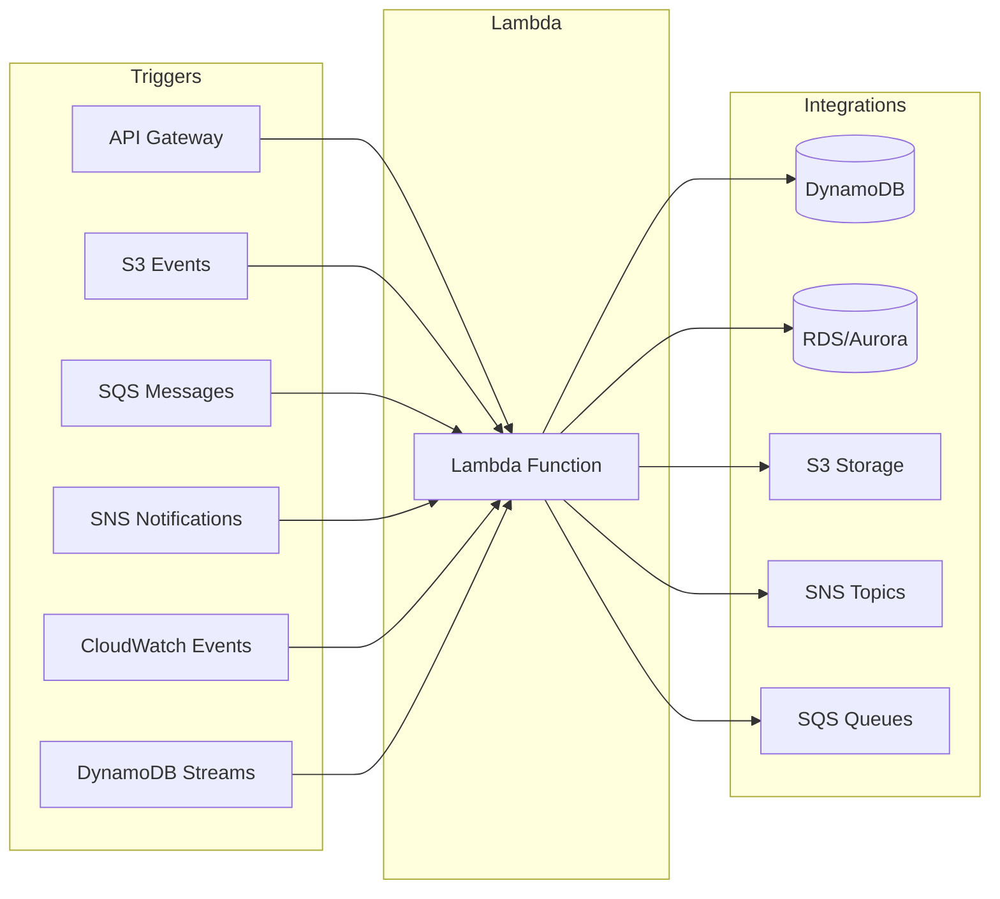
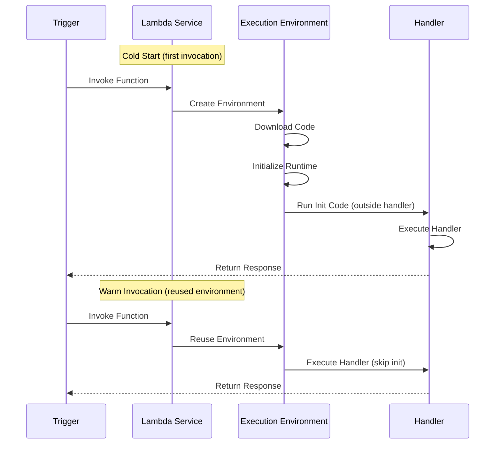

# How to Build Serverless Functions with Python on AWS Lambda

Author: [nawazdhandala](https://www.github.com/nawazdhandala)

Tags: Python, AWS Lambda, Serverless, Cloud, API Gateway, SAM

Description: Learn how to build and deploy serverless functions with Python on AWS Lambda. This guide covers handler patterns, API Gateway integration, environment management, and testing strategies.

---

> AWS Lambda lets you run code without provisioning servers. You pay only for the compute time you consume - there's no charge when your code is not running. This makes it perfect for event-driven workloads, APIs, and background processing.

AWS Lambda with Python is one of the most popular serverless combinations. Python's simplicity, rich ecosystem, and fast cold start times make it ideal for Lambda functions. This guide covers everything from basic handlers to production-ready deployments.

---

## Understanding Serverless Architecture

Before diving into code, let's understand how Lambda fits into the serverless ecosystem:



### Lambda Execution Lifecycle

Understanding the execution lifecycle helps you optimize performance:



Key points:
- **Cold Start**: New environment creation - includes downloading code and running initialization
- **Warm Start**: Reuses existing environment - only runs handler code
- **Init Code**: Code outside the handler runs once per cold start
- **Handler**: Runs on every invocation

---

## Project Setup

### Directory Structure

A well-organized Lambda project structure:

```
lambda-project/
├── src/
│   ├── handlers/
│   │   ├── __init__.py
│   │   ├── api_handler.py      # API Gateway handlers
│   │   ├── s3_handler.py       # S3 event handlers
│   │   └── sqs_handler.py      # SQS message handlers
│   ├── services/
│   │   ├── __init__.py
│   │   ├── user_service.py     # Business logic
│   │   └── notification.py     # Notification service
│   ├── models/
│   │   ├── __init__.py
│   │   └── user.py             # Data models
│   └── utils/
│       ├── __init__.py
│       ├── logger.py           # Logging configuration
│       └── validators.py       # Input validation
├── tests/
│   ├── unit/
│   │   └── test_handlers.py
│   ├── integration/
│   │   └── test_api.py
│   └── conftest.py
├── template.yaml               # SAM template
├── requirements.txt
├── requirements-dev.txt
└── samconfig.toml
```

### Requirements

```txt
# requirements.txt
boto3>=1.34.0
pydantic>=2.5.0
python-json-logger>=2.0.0
```

```txt
# requirements-dev.txt
-r requirements.txt
pytest>=7.4.0
pytest-cov>=4.1.0
moto>=4.2.0
pytest-env>=1.1.0
```

---

## Basic Handler Patterns

### Simple Handler

The most basic Lambda handler:

```python
# src/handlers/basic_handler.py
"""
Basic Lambda handler demonstrating core concepts.
"""
import json
import logging

# Configure logging - runs once during cold start
logger = logging.getLogger()
logger.setLevel(logging.INFO)


def handler(event: dict, context) -> dict:
    """
    Basic Lambda handler function.
    
    Args:
        event: The event data passed to the function
        context: Runtime information provided by Lambda
        
    Returns:
        Response dictionary with statusCode and body
    """
    # Log the incoming event for debugging
    logger.info(f"Received event: {json.dumps(event)}")
    
    # Access context information
    logger.info(f"Request ID: {context.aws_request_id}")
    logger.info(f"Function name: {context.function_name}")
    logger.info(f"Memory limit: {context.memory_limit_in_mb}MB")
    logger.info(f"Time remaining: {context.get_remaining_time_in_millis()}ms")
    
    # Process the event
    name = event.get("name", "World")
    
    # Return response
    return {
        "statusCode": 200,
        "headers": {
            "Content-Type": "application/json"
        },
        "body": json.dumps({
            "message": f"Hello, {name}!",
            "requestId": context.aws_request_id
        })
    }
```

### Handler with Initialization

Optimize cold starts by moving expensive operations outside the handler:

```python
# src/handlers/optimized_handler.py
"""
Optimized handler with initialization outside the handler function.
Objects created here persist across warm invocations.
"""
import json
import logging
import os
import boto3
from typing import Any

# Configure logging - runs once during cold start
logging.basicConfig(level=logging.INFO)
logger = logging.getLogger(__name__)

# Initialize AWS clients outside handler - reused across invocations
# This significantly reduces latency on warm starts
dynamodb = boto3.resource("dynamodb")
table_name = os.environ.get("TABLE_NAME", "users")
table = dynamodb.Table(table_name)

# Initialize other expensive resources
ssm = boto3.client("ssm")


def get_secret(parameter_name: str) -> str:
    """
    Retrieve a secret from SSM Parameter Store.
    Called during cold start to cache secrets.
    """
    response = ssm.get_parameter(
        Name=parameter_name,
        WithDecryption=True
    )
    return response["Parameter"]["Value"]


# Cache secrets during cold start
try:
    API_KEY = get_secret("/myapp/api-key")
    logger.info("Successfully loaded API key from SSM")
except Exception as e:
    logger.warning(f"Could not load API key: {e}")
    API_KEY = None


def handler(event: dict, context: Any) -> dict:
    """
    Optimized handler that reuses initialized resources.
    
    The DynamoDB table and SSM client are already initialized
    and will be reused on warm invocations.
    """
    logger.info(f"Processing request: {context.aws_request_id}")
    
    try:
        # Extract user ID from event
        user_id = event.get("pathParameters", {}).get("userId")
        
        if not user_id:
            return create_response(400, {"error": "userId is required"})
        
        # Query DynamoDB - uses pre-initialized table
        response = table.get_item(Key={"userId": user_id})
        
        if "Item" not in response:
            return create_response(404, {"error": "User not found"})
        
        return create_response(200, response["Item"])
        
    except Exception as e:
        logger.exception("Error processing request")
        return create_response(500, {"error": str(e)})


def create_response(status_code: int, body: dict) -> dict:
    """
    Create a standardized API Gateway response.
    """
    return {
        "statusCode": status_code,
        "headers": {
            "Content-Type": "application/json",
            "Access-Control-Allow-Origin": "*"
        },
        "body": json.dumps(body, default=str)
    }
```

---

## API Gateway Integration

### REST API Handler

Complete handler for API Gateway REST API:

```python
# src/handlers/api_handler.py
"""
API Gateway REST API handler with routing and validation.
"""
import json
import logging
import os
import re
from typing import Any, Callable
from functools import wraps
from dataclasses import dataclass

import boto3
from pydantic import BaseModel, ValidationError, EmailStr

# Configure structured logging
logger = logging.getLogger()
logger.setLevel(logging.INFO)

# Initialize DynamoDB
dynamodb = boto3.resource("dynamodb")
users_table = dynamodb.Table(os.environ.get("USERS_TABLE", "users"))


# Request/Response Models
class CreateUserRequest(BaseModel):
    """Pydantic model for user creation request validation."""
    email: EmailStr
    name: str
    age: int | None = None


class UpdateUserRequest(BaseModel):
    """Pydantic model for user update request validation."""
    name: str | None = None
    age: int | None = None


@dataclass
class APIContext:
    """Context object passed to route handlers."""
    event: dict
    lambda_context: Any
    path_params: dict
    query_params: dict
    body: dict | None
    user_id: str | None = None


# Decorator for exception handling
def handle_exceptions(func: Callable) -> Callable:
    """
    Decorator to handle exceptions and return proper API responses.
    """
    @wraps(func)
    def wrapper(*args, **kwargs):
        try:
            return func(*args, **kwargs)
        except ValidationError as e:
            logger.warning(f"Validation error: {e}")
            return create_response(400, {
                "error": "Validation error",
                "details": e.errors()
            })
        except KeyError as e:
            logger.warning(f"Missing required field: {e}")
            return create_response(400, {
                "error": f"Missing required field: {e}"
            })
        except Exception as e:
            logger.exception("Unexpected error")
            return create_response(500, {
                "error": "Internal server error"
            })
    return wrapper


def create_response(status_code: int, body: dict) -> dict:
    """Create standardized API Gateway response."""
    return {
        "statusCode": status_code,
        "headers": {
            "Content-Type": "application/json",
            "Access-Control-Allow-Origin": "*",
            "Access-Control-Allow-Headers": "Content-Type,Authorization",
            "Access-Control-Allow-Methods": "GET,POST,PUT,DELETE,OPTIONS"
        },
        "body": json.dumps(body, default=str)
    }


# Route handlers
@handle_exceptions
def get_user(ctx: APIContext) -> dict:
    """Get a user by ID."""
    user_id = ctx.path_params.get("userId")
    
    if not user_id:
        return create_response(400, {"error": "userId is required"})
    
    response = users_table.get_item(Key={"userId": user_id})
    
    if "Item" not in response:
        return create_response(404, {"error": "User not found"})
    
    return create_response(200, response["Item"])


@handle_exceptions
def list_users(ctx: APIContext) -> dict:
    """List all users with optional pagination."""
    # Get pagination parameters
    limit = int(ctx.query_params.get("limit", 20))
    last_key = ctx.query_params.get("lastKey")
    
    # Build scan parameters
    scan_params = {"Limit": min(limit, 100)}  # Cap at 100
    
    if last_key:
        scan_params["ExclusiveStartKey"] = {"userId": last_key}
    
    # Perform scan
    response = users_table.scan(**scan_params)
    
    result = {
        "users": response.get("Items", []),
        "count": len(response.get("Items", []))
    }
    
    # Include pagination token if more results exist
    if "LastEvaluatedKey" in response:
        result["nextKey"] = response["LastEvaluatedKey"]["userId"]
    
    return create_response(200, result)


@handle_exceptions
def create_user(ctx: APIContext) -> dict:
    """Create a new user."""
    # Validate request body
    user_data = CreateUserRequest(**ctx.body)
    
    # Generate user ID
    import uuid
    user_id = str(uuid.uuid4())
    
    # Create user item
    item = {
        "userId": user_id,
        "email": user_data.email,
        "name": user_data.name,
        "createdAt": _get_timestamp()
    }
    
    if user_data.age:
        item["age"] = user_data.age
    
    # Save to DynamoDB
    users_table.put_item(Item=item)
    
    logger.info(f"Created user: {user_id}")
    
    return create_response(201, item)


@handle_exceptions
def update_user(ctx: APIContext) -> dict:
    """Update an existing user."""
    user_id = ctx.path_params.get("userId")
    
    if not user_id:
        return create_response(400, {"error": "userId is required"})
    
    # Validate request body
    update_data = UpdateUserRequest(**ctx.body)
    
    # Build update expression
    update_parts = []
    expression_values = {}
    expression_names = {}
    
    if update_data.name:
        update_parts.append("#name = :name")
        expression_values[":name"] = update_data.name
        expression_names["#name"] = "name"
    
    if update_data.age:
        update_parts.append("age = :age")
        expression_values[":age"] = update_data.age
    
    update_parts.append("updatedAt = :updatedAt")
    expression_values[":updatedAt"] = _get_timestamp()
    
    # Perform update
    response = users_table.update_item(
        Key={"userId": user_id},
        UpdateExpression="SET " + ", ".join(update_parts),
        ExpressionAttributeValues=expression_values,
        ExpressionAttributeNames=expression_names if expression_names else None,
        ReturnValues="ALL_NEW",
        ConditionExpression="attribute_exists(userId)"
    )
    
    return create_response(200, response["Attributes"])


@handle_exceptions
def delete_user(ctx: APIContext) -> dict:
    """Delete a user."""
    user_id = ctx.path_params.get("userId")
    
    if not user_id:
        return create_response(400, {"error": "userId is required"})
    
    users_table.delete_item(
        Key={"userId": user_id},
        ConditionExpression="attribute_exists(userId)"
    )
    
    logger.info(f"Deleted user: {user_id}")
    
    return create_response(204, {})


def _get_timestamp() -> str:
    """Get current ISO timestamp."""
    from datetime import datetime, timezone
    return datetime.now(timezone.utc).isoformat()


# Route mapping
ROUTES = {
    ("GET", "/users"): list_users,
    ("GET", "/users/{userId}"): get_user,
    ("POST", "/users"): create_user,
    ("PUT", "/users/{userId}"): update_user,
    ("DELETE", "/users/{userId}"): delete_user,
}


def match_route(method: str, path: str) -> tuple[Callable | None, dict]:
    """
    Match incoming request to a route handler.
    Returns the handler function and extracted path parameters.
    """
    for (route_method, route_pattern), handler in ROUTES.items():
        if method != route_method:
            continue
        
        # Convert route pattern to regex
        # /users/{userId} becomes /users/(?P<userId>[^/]+)
        regex_pattern = re.sub(
            r"\{(\w+)\}",
            r"(?P<\1>[^/]+)",
            f"^{route_pattern}$"
        )
        
        match = re.match(regex_pattern, path)
        if match:
            return handler, match.groupdict()
    
    return None, {}


def handler(event: dict, context: Any) -> dict:
    """
    Main Lambda handler for API Gateway requests.
    Routes requests to appropriate handler functions.
    """
    # Log request
    logger.info(json.dumps({
        "requestId": context.aws_request_id,
        "method": event.get("httpMethod"),
        "path": event.get("path"),
        "sourceIp": event.get("requestContext", {}).get("identity", {}).get("sourceIp")
    }))
    
    # Handle CORS preflight
    if event.get("httpMethod") == "OPTIONS":
        return create_response(200, {})
    
    # Extract request details
    method = event.get("httpMethod", "GET")
    path = event.get("path", "/")
    
    # Match route
    route_handler, path_params = match_route(method, path)
    
    if not route_handler:
        return create_response(404, {"error": "Route not found"})
    
    # Build context
    body = None
    if event.get("body"):
        try:
            body = json.loads(event["body"])
        except json.JSONDecodeError:
            return create_response(400, {"error": "Invalid JSON body"})
    
    ctx = APIContext(
        event=event,
        lambda_context=context,
        path_params=path_params,
        query_params=event.get("queryStringParameters") or {},
        body=body
    )
    
    # Execute handler
    return route_handler(ctx)
```

---

## Event Source Handlers

### S3 Event Handler

Process S3 object events:

```python
# src/handlers/s3_handler.py
"""
Handler for S3 events - process uploaded files.
"""
import json
import logging
import os
import urllib.parse
from typing import Any

import boto3

# Configure logging
logger = logging.getLogger()
logger.setLevel(logging.INFO)

# Initialize clients
s3 = boto3.client("s3")
dynamodb = boto3.resource("dynamodb")
metadata_table = dynamodb.Table(os.environ.get("METADATA_TABLE", "file-metadata"))


def handler(event: dict, context: Any) -> dict:
    """
    Process S3 events for uploaded files.
    
    Triggered by:
    - s3:ObjectCreated:* events
    - s3:ObjectRemoved:* events
    """
    logger.info(f"Processing S3 event: {json.dumps(event)}")
    
    results = []
    
    for record in event.get("Records", []):
        try:
            result = process_s3_record(record)
            results.append(result)
        except Exception as e:
            logger.exception(f"Error processing record: {e}")
            results.append({
                "status": "error",
                "error": str(e)
            })
    
    return {
        "statusCode": 200,
        "body": json.dumps({
            "processed": len(results),
            "results": results
        })
    }


def process_s3_record(record: dict) -> dict:
    """
    Process a single S3 event record.
    """
    # Extract event details
    event_name = record.get("eventName", "")
    bucket = record["s3"]["bucket"]["name"]
    key = urllib.parse.unquote_plus(record["s3"]["object"]["key"])
    size = record["s3"]["object"].get("size", 0)
    
    logger.info(f"Processing: s3://{bucket}/{key} - Event: {event_name}")
    
    # Handle different event types
    if event_name.startswith("ObjectCreated"):
        return handle_object_created(bucket, key, size)
    elif event_name.startswith("ObjectRemoved"):
        return handle_object_removed(bucket, key)
    else:
        logger.warning(f"Unknown event type: {event_name}")
        return {"status": "skipped", "reason": f"Unknown event: {event_name}"}


def handle_object_created(bucket: str, key: str, size: int) -> dict:
    """
    Handle newly created S3 objects.
    """
    # Get object metadata
    response = s3.head_object(Bucket=bucket, Key=key)
    
    # Extract metadata
    content_type = response.get("ContentType", "application/octet-stream")
    last_modified = response.get("LastModified")
    
    # Store metadata in DynamoDB
    item = {
        "objectKey": f"s3://{bucket}/{key}",
        "bucket": bucket,
        "key": key,
        "size": size,
        "contentType": content_type,
        "lastModified": last_modified.isoformat() if last_modified else None,
        "processedAt": _get_timestamp()
    }
    
    metadata_table.put_item(Item=item)
    
    logger.info(f"Stored metadata for: {key}")
    
    # Process based on content type
    if content_type.startswith("image/"):
        # Trigger image processing
        return process_image(bucket, key)
    elif content_type == "application/json":
        # Process JSON data
        return process_json(bucket, key)
    
    return {"status": "success", "key": key}


def handle_object_removed(bucket: str, key: str) -> dict:
    """
    Handle deleted S3 objects.
    """
    # Remove metadata from DynamoDB
    metadata_table.delete_item(
        Key={"objectKey": f"s3://{bucket}/{key}"}
    )
    
    logger.info(f"Removed metadata for: {key}")
    
    return {"status": "success", "action": "deleted", "key": key}


def process_image(bucket: str, key: str) -> dict:
    """
    Process uploaded images - generate thumbnails, etc.
    """
    logger.info(f"Processing image: {key}")
    
    # In production, you would:
    # 1. Download the image
    # 2. Generate thumbnails
    # 3. Upload processed versions
    # 4. Update metadata
    
    return {
        "status": "success",
        "action": "image_processed",
        "key": key
    }


def process_json(bucket: str, key: str) -> dict:
    """
    Process uploaded JSON files.
    """
    logger.info(f"Processing JSON: {key}")
    
    # Download and parse JSON
    response = s3.get_object(Bucket=bucket, Key=key)
    content = response["Body"].read().decode("utf-8")
    data = json.loads(content)
    
    # Process the data
    record_count = len(data) if isinstance(data, list) else 1
    
    return {
        "status": "success",
        "action": "json_processed",
        "key": key,
        "recordCount": record_count
    }


def _get_timestamp() -> str:
    """Get current ISO timestamp."""
    from datetime import datetime, timezone
    return datetime.now(timezone.utc).isoformat()
```

### SQS Event Handler

Process messages from SQS queues:

```python
# src/handlers/sqs_handler.py
"""
Handler for SQS events - process queue messages.
"""
import json
import logging
import os
from typing import Any
from dataclasses import dataclass

import boto3

# Configure logging
logger = logging.getLogger()
logger.setLevel(logging.INFO)

# Initialize clients
dynamodb = boto3.resource("dynamodb")
sns = boto3.client("sns")

# Get configuration
orders_table = dynamodb.Table(os.environ.get("ORDERS_TABLE", "orders"))
notification_topic = os.environ.get("NOTIFICATION_TOPIC_ARN")


@dataclass
class SQSMessage:
    """Parsed SQS message."""
    message_id: str
    receipt_handle: str
    body: dict
    attributes: dict


def handler(event: dict, context: Any) -> dict:
    """
    Process SQS messages in batch.
    
    Lambda automatically handles:
    - Batch processing
    - Automatic retries for failed messages
    - Dead letter queue routing
    
    Note: Return partial batch failures for fine-grained control.
    """
    logger.info(f"Processing {len(event.get('Records', []))} messages")
    
    # Track failed messages for partial batch response
    failed_message_ids = []
    
    for record in event.get("Records", []):
        message = parse_sqs_record(record)
        
        try:
            process_message(message)
            logger.info(f"Successfully processed message: {message.message_id}")
            
        except Exception as e:
            logger.exception(f"Error processing message {message.message_id}: {e}")
            failed_message_ids.append(message.message_id)
    
    # Return partial batch failure response
    # This tells Lambda which messages failed so only those are retried
    if failed_message_ids:
        return {
            "batchItemFailures": [
                {"itemIdentifier": msg_id} for msg_id in failed_message_ids
            ]
        }
    
    return {"batchItemFailures": []}


def parse_sqs_record(record: dict) -> SQSMessage:
    """
    Parse an SQS record into a structured message.
    """
    body = record.get("body", "{}")
    
    # Handle SNS-wrapped messages
    try:
        parsed_body = json.loads(body)
        if "Message" in parsed_body and "TopicArn" in parsed_body:
            # This is an SNS notification - extract the actual message
            body = json.loads(parsed_body["Message"])
        else:
            body = parsed_body
    except json.JSONDecodeError:
        body = {"raw": body}
    
    return SQSMessage(
        message_id=record.get("messageId", ""),
        receipt_handle=record.get("receiptHandle", ""),
        body=body,
        attributes=record.get("messageAttributes", {})
    )


def process_message(message: SQSMessage) -> None:
    """
    Process a single SQS message.
    Raises exception on failure for retry handling.
    """
    message_type = message.body.get("type", "unknown")
    
    logger.info(f"Processing message type: {message_type}")
    
    # Route to appropriate handler
    if message_type == "order_created":
        handle_order_created(message.body)
    elif message_type == "order_updated":
        handle_order_updated(message.body)
    elif message_type == "order_cancelled":
        handle_order_cancelled(message.body)
    else:
        logger.warning(f"Unknown message type: {message_type}")


def handle_order_created(data: dict) -> None:
    """
    Handle new order creation messages.
    """
    order_id = data.get("orderId")
    customer_id = data.get("customerId")
    
    if not order_id or not customer_id:
        raise ValueError("Missing required fields: orderId, customerId")
    
    # Store order in DynamoDB
    item = {
        "orderId": order_id,
        "customerId": customer_id,
        "status": "pending",
        "items": data.get("items", []),
        "total": data.get("total", 0),
        "createdAt": _get_timestamp()
    }
    
    orders_table.put_item(Item=item)
    
    # Send notification
    if notification_topic:
        sns.publish(
            TopicArn=notification_topic,
            Subject="New Order Created",
            Message=json.dumps({
                "type": "order_notification",
                "orderId": order_id,
                "customerId": customer_id,
                "action": "created"
            })
        )
    
    logger.info(f"Created order: {order_id}")


def handle_order_updated(data: dict) -> None:
    """
    Handle order update messages.
    """
    order_id = data.get("orderId")
    updates = data.get("updates", {})
    
    if not order_id:
        raise ValueError("Missing required field: orderId")
    
    # Build update expression
    update_parts = ["updatedAt = :updatedAt"]
    expression_values = {":updatedAt": _get_timestamp()}
    
    for key, value in updates.items():
        update_parts.append(f"{key} = :{key}")
        expression_values[f":{key}"] = value
    
    orders_table.update_item(
        Key={"orderId": order_id},
        UpdateExpression="SET " + ", ".join(update_parts),
        ExpressionAttributeValues=expression_values
    )
    
    logger.info(f"Updated order: {order_id}")


def handle_order_cancelled(data: dict) -> None:
    """
    Handle order cancellation messages.
    """
    order_id = data.get("orderId")
    reason = data.get("reason", "No reason provided")
    
    if not order_id:
        raise ValueError("Missing required field: orderId")
    
    orders_table.update_item(
        Key={"orderId": order_id},
        UpdateExpression="SET #status = :status, cancelledAt = :cancelledAt, cancelReason = :reason",
        ExpressionAttributeNames={"#status": "status"},
        ExpressionAttributeValues={
            ":status": "cancelled",
            ":cancelledAt": _get_timestamp(),
            ":reason": reason
        }
    )
    
    logger.info(f"Cancelled order: {order_id}")


def _get_timestamp() -> str:
    """Get current ISO timestamp."""
    from datetime import datetime, timezone
    return datetime.now(timezone.utc).isoformat()
```

---

## Environment Management

### Configuration with Environment Variables

```python
# src/utils/config.py
"""
Configuration management for Lambda functions.
Loads settings from environment variables with validation.
"""
import os
from dataclasses import dataclass, field
from typing import Optional


@dataclass
class Config:
    """Application configuration loaded from environment variables."""
    
    # Required settings
    environment: str = field(default_factory=lambda: os.environ.get("ENVIRONMENT", "development"))
    
    # Database settings
    users_table: str = field(default_factory=lambda: os.environ.get("USERS_TABLE", "users"))
    orders_table: str = field(default_factory=lambda: os.environ.get("ORDERS_TABLE", "orders"))
    
    # Feature flags
    enable_notifications: bool = field(
        default_factory=lambda: os.environ.get("ENABLE_NOTIFICATIONS", "true").lower() == "true"
    )
    
    # External service URLs
    notification_topic_arn: Optional[str] = field(
        default_factory=lambda: os.environ.get("NOTIFICATION_TOPIC_ARN")
    )
    
    # Timeouts and limits
    connection_timeout: int = field(
        default_factory=lambda: int(os.environ.get("CONNECTION_TIMEOUT", "30"))
    )
    max_retries: int = field(
        default_factory=lambda: int(os.environ.get("MAX_RETRIES", "3"))
    )
    
    # Logging
    log_level: str = field(default_factory=lambda: os.environ.get("LOG_LEVEL", "INFO"))
    
    def __post_init__(self):
        """Validate configuration after initialization."""
        self._validate()
    
    def _validate(self):
        """Validate required configuration."""
        if not self.users_table:
            raise ValueError("USERS_TABLE environment variable is required")
        
        if self.enable_notifications and not self.notification_topic_arn:
            raise ValueError("NOTIFICATION_TOPIC_ARN required when notifications enabled")
    
    @property
    def is_production(self) -> bool:
        """Check if running in production environment."""
        return self.environment == "production"
    
    @property
    def is_development(self) -> bool:
        """Check if running in development environment."""
        return self.environment == "development"


# Create singleton config instance
# Loaded once during cold start
config = Config()
```

### Secrets Management with SSM

```python
# src/utils/secrets.py
"""
Secrets management using AWS SSM Parameter Store.
Caches secrets during cold start for efficiency.
"""
import logging
import os
from functools import lru_cache
from typing import Optional

import boto3
from botocore.exceptions import ClientError

logger = logging.getLogger(__name__)

# Initialize SSM client once
ssm = boto3.client("ssm")


@lru_cache(maxsize=100)
def get_secret(parameter_name: str, decrypt: bool = True) -> Optional[str]:
    """
    Retrieve a secret from SSM Parameter Store.
    
    Results are cached using lru_cache for efficiency.
    Cache persists across warm invocations.
    
    Args:
        parameter_name: The SSM parameter name (e.g., /myapp/api-key)
        decrypt: Whether to decrypt SecureString parameters
        
    Returns:
        The parameter value, or None if not found
    """
    try:
        response = ssm.get_parameter(
            Name=parameter_name,
            WithDecryption=decrypt
        )
        return response["Parameter"]["Value"]
        
    except ClientError as e:
        error_code = e.response.get("Error", {}).get("Code")
        
        if error_code == "ParameterNotFound":
            logger.warning(f"Parameter not found: {parameter_name}")
            return None
        
        logger.error(f"Error retrieving parameter {parameter_name}: {e}")
        raise


def get_database_credentials() -> dict:
    """
    Retrieve database credentials from SSM.
    
    Returns:
        Dictionary with username and password
    """
    prefix = os.environ.get("SSM_PREFIX", "/myapp")
    
    return {
        "username": get_secret(f"{prefix}/db/username"),
        "password": get_secret(f"{prefix}/db/password"),
        "host": get_secret(f"{prefix}/db/host"),
        "database": get_secret(f"{prefix}/db/name")
    }


def get_api_keys() -> dict:
    """
    Retrieve API keys for external services.
    
    Returns:
        Dictionary with API keys
    """
    prefix = os.environ.get("SSM_PREFIX", "/myapp")
    
    return {
        "stripe": get_secret(f"{prefix}/api-keys/stripe"),
        "sendgrid": get_secret(f"{prefix}/api-keys/sendgrid"),
        "twilio": get_secret(f"{prefix}/api-keys/twilio")
    }
```

---

## AWS SAM Deployment

### SAM Template

```yaml
# template.yaml
AWSTemplateFormatVersion: "2010-09-09"
Transform: AWS::Serverless-2016-10-31
Description: Serverless application with Python Lambda functions

# Global configuration
Globals:
  Function:
    Timeout: 30
    MemorySize: 256
    Runtime: python3.12
    Architectures:
      - arm64  # Use Graviton2 for better price/performance
    Environment:
      Variables:
        ENVIRONMENT: !Ref Environment
        LOG_LEVEL: !Ref LogLevel
        POWERTOOLS_SERVICE_NAME: myapp
        POWERTOOLS_METRICS_NAMESPACE: MyApp
    Tracing: Active  # Enable X-Ray tracing

# Parameters
Parameters:
  Environment:
    Type: String
    Default: development
    AllowedValues:
      - development
      - staging
      - production
    Description: Deployment environment

  LogLevel:
    Type: String
    Default: INFO
    AllowedValues:
      - DEBUG
      - INFO
      - WARNING
      - ERROR
    Description: Logging level

# Resources
Resources:
  # DynamoDB Tables
  UsersTable:
    Type: AWS::DynamoDB::Table
    Properties:
      TableName: !Sub "${Environment}-users"
      BillingMode: PAY_PER_REQUEST
      AttributeDefinitions:
        - AttributeName: userId
          AttributeType: S
      KeySchema:
        - AttributeName: userId
          KeyType: HASH
      PointInTimeRecoverySpecification:
        PointInTimeRecoveryEnabled: true
      Tags:
        - Key: Environment
          Value: !Ref Environment

  OrdersTable:
    Type: AWS::DynamoDB::Table
    Properties:
      TableName: !Sub "${Environment}-orders"
      BillingMode: PAY_PER_REQUEST
      AttributeDefinitions:
        - AttributeName: orderId
          AttributeType: S
      KeySchema:
        - AttributeName: orderId
          KeyType: HASH
      StreamSpecification:
        StreamViewType: NEW_AND_OLD_IMAGES
      Tags:
        - Key: Environment
          Value: !Ref Environment

  # API Gateway
  Api:
    Type: AWS::Serverless::Api
    Properties:
      StageName: !Ref Environment
      TracingEnabled: true
      Cors:
        AllowOrigin: "'*'"
        AllowMethods: "'GET,POST,PUT,DELETE,OPTIONS'"
        AllowHeaders: "'Content-Type,Authorization'"
      AccessLogSetting:
        DestinationArn: !GetAtt ApiAccessLogs.Arn
        Format: '{"requestId":"$context.requestId","ip":"$context.identity.sourceIp","method":"$context.httpMethod","path":"$context.path","status":"$context.status","latency":"$context.responseLatency"}'

  ApiAccessLogs:
    Type: AWS::Logs::LogGroup
    Properties:
      LogGroupName: !Sub "/aws/apigateway/${Environment}-api"
      RetentionInDays: 30

  # Lambda Functions
  ApiFunction:
    Type: AWS::Serverless::Function
    Properties:
      FunctionName: !Sub "${Environment}-api-handler"
      Handler: src.handlers.api_handler.handler
      CodeUri: .
      Description: API Gateway handler for REST endpoints
      Environment:
        Variables:
          USERS_TABLE: !Ref UsersTable
          ORDERS_TABLE: !Ref OrdersTable
      Policies:
        - DynamoDBCrudPolicy:
            TableName: !Ref UsersTable
        - DynamoDBCrudPolicy:
            TableName: !Ref OrdersTable
      Events:
        GetUsers:
          Type: Api
          Properties:
            RestApiId: !Ref Api
            Path: /users
            Method: GET
        GetUser:
          Type: Api
          Properties:
            RestApiId: !Ref Api
            Path: /users/{userId}
            Method: GET
        CreateUser:
          Type: Api
          Properties:
            RestApiId: !Ref Api
            Path: /users
            Method: POST
        UpdateUser:
          Type: Api
          Properties:
            RestApiId: !Ref Api
            Path: /users/{userId}
            Method: PUT
        DeleteUser:
          Type: Api
          Properties:
            RestApiId: !Ref Api
            Path: /users/{userId}
            Method: DELETE
    Metadata:
      BuildMethod: python3.12

  # SQS Queue for async processing
  OrderQueue:
    Type: AWS::SQS::Queue
    Properties:
      QueueName: !Sub "${Environment}-order-queue"
      VisibilityTimeout: 300
      RedrivePolicy:
        deadLetterTargetArn: !GetAtt OrderDLQ.Arn
        maxReceiveCount: 3

  OrderDLQ:
    Type: AWS::SQS::Queue
    Properties:
      QueueName: !Sub "${Environment}-order-dlq"
      MessageRetentionPeriod: 1209600  # 14 days

  SqsHandlerFunction:
    Type: AWS::Serverless::Function
    Properties:
      FunctionName: !Sub "${Environment}-sqs-handler"
      Handler: src.handlers.sqs_handler.handler
      CodeUri: .
      Description: Process SQS messages
      Environment:
        Variables:
          ORDERS_TABLE: !Ref OrdersTable
      Policies:
        - DynamoDBCrudPolicy:
            TableName: !Ref OrdersTable
      Events:
        SQSEvent:
          Type: SQS
          Properties:
            Queue: !GetAtt OrderQueue.Arn
            BatchSize: 10
            FunctionResponseTypes:
              - ReportBatchItemFailures
    Metadata:
      BuildMethod: python3.12

  # S3 Bucket and handler
  UploadsBucket:
    Type: AWS::S3::Bucket
    Properties:
      BucketName: !Sub "${Environment}-uploads-${AWS::AccountId}"
      CorsConfiguration:
        CorsRules:
          - AllowedMethods:
              - PUT
              - GET
            AllowedOrigins:
              - "*"
            AllowedHeaders:
              - "*"

  S3HandlerFunction:
    Type: AWS::Serverless::Function
    Properties:
      FunctionName: !Sub "${Environment}-s3-handler"
      Handler: src.handlers.s3_handler.handler
      CodeUri: .
      Description: Process S3 uploads
      Environment:
        Variables:
          METADATA_TABLE: !Sub "${Environment}-file-metadata"
      Policies:
        - S3ReadPolicy:
            BucketName: !Ref UploadsBucket
        - DynamoDBCrudPolicy:
            TableName: !Sub "${Environment}-file-metadata"
      Events:
        S3Upload:
          Type: S3
          Properties:
            Bucket: !Ref UploadsBucket
            Events: s3:ObjectCreated:*
    Metadata:
      BuildMethod: python3.12

# Outputs
Outputs:
  ApiEndpoint:
    Description: API Gateway endpoint URL
    Value: !Sub "https://${Api}.execute-api.${AWS::Region}.amazonaws.com/${Environment}"

  UsersTableName:
    Description: DynamoDB users table name
    Value: !Ref UsersTable

  OrderQueueUrl:
    Description: SQS queue URL for orders
    Value: !Ref OrderQueue

  UploadsBucketName:
    Description: S3 bucket for uploads
    Value: !Ref UploadsBucket
```

### SAM Configuration

```toml
# samconfig.toml
version = 0.1

[default]
[default.global.parameters]
stack_name = "myapp"

[default.build.parameters]
cached = true
parallel = true

[default.validate.parameters]
lint = true

[default.deploy.parameters]
capabilities = "CAPABILITY_IAM"
confirm_changeset = true
resolve_s3 = true

[development]
[development.deploy.parameters]
stack_name = "myapp-dev"
parameter_overrides = "Environment=development LogLevel=DEBUG"
confirm_changeset = false

[staging]
[staging.deploy.parameters]
stack_name = "myapp-staging"
parameter_overrides = "Environment=staging LogLevel=INFO"

[production]
[production.deploy.parameters]
stack_name = "myapp-prod"
parameter_overrides = "Environment=production LogLevel=WARNING"
confirm_changeset = true
```

### Deployment Commands

```bash
# Build the application
sam build

# Deploy to development
sam deploy --config-env development

# Deploy to production
sam deploy --config-env production

# Local testing with SAM
sam local invoke ApiFunction --event events/api-event.json

# Start local API Gateway
sam local start-api --port 3000

# View logs
sam logs -n ApiFunction --tail

# Delete stack
sam delete --stack-name myapp-dev
```

---

## Testing Strategies

### Unit Tests with Moto

```python
# tests/unit/test_handlers.py
"""
Unit tests for Lambda handlers using moto for AWS mocking.
"""
import json
import os
import pytest
from unittest.mock import MagicMock, patch

import boto3
from moto import mock_aws

# Set test environment variables before imports
os.environ["USERS_TABLE"] = "test-users"
os.environ["ORDERS_TABLE"] = "test-orders"
os.environ["AWS_DEFAULT_REGION"] = "us-east-1"


@pytest.fixture
def aws_credentials():
    """Mock AWS credentials for moto."""
    os.environ["AWS_ACCESS_KEY_ID"] = "testing"
    os.environ["AWS_SECRET_ACCESS_KEY"] = "testing"
    os.environ["AWS_SECURITY_TOKEN"] = "testing"
    os.environ["AWS_SESSION_TOKEN"] = "testing"


@pytest.fixture
def dynamodb_table(aws_credentials):
    """Create mock DynamoDB table."""
    with mock_aws():
        dynamodb = boto3.resource("dynamodb", region_name="us-east-1")
        
        # Create users table
        dynamodb.create_table(
            TableName="test-users",
            KeySchema=[{"AttributeName": "userId", "KeyType": "HASH"}],
            AttributeDefinitions=[{"AttributeName": "userId", "AttributeType": "S"}],
            BillingMode="PAY_PER_REQUEST"
        )
        
        # Create orders table
        dynamodb.create_table(
            TableName="test-orders",
            KeySchema=[{"AttributeName": "orderId", "KeyType": "HASH"}],
            AttributeDefinitions=[{"AttributeName": "orderId", "AttributeType": "S"}],
            BillingMode="PAY_PER_REQUEST"
        )
        
        yield dynamodb


@pytest.fixture
def lambda_context():
    """Create mock Lambda context."""
    context = MagicMock()
    context.aws_request_id = "test-request-id"
    context.function_name = "test-function"
    context.memory_limit_in_mb = 256
    context.get_remaining_time_in_millis.return_value = 30000
    return context


class TestApiHandler:
    """Tests for API handler functions."""
    
    def test_create_user_success(self, dynamodb_table, lambda_context):
        """Test successful user creation."""
        # Import after moto setup
        from src.handlers.api_handler import handler
        
        event = {
            "httpMethod": "POST",
            "path": "/users",
            "body": json.dumps({
                "email": "test@example.com",
                "name": "Test User"
            })
        }
        
        response = handler(event, lambda_context)
        
        assert response["statusCode"] == 201
        body = json.loads(response["body"])
        assert body["email"] == "test@example.com"
        assert body["name"] == "Test User"
        assert "userId" in body
    
    def test_create_user_invalid_email(self, dynamodb_table, lambda_context):
        """Test user creation with invalid email."""
        from src.handlers.api_handler import handler
        
        event = {
            "httpMethod": "POST",
            "path": "/users",
            "body": json.dumps({
                "email": "invalid-email",
                "name": "Test User"
            })
        }
        
        response = handler(event, lambda_context)
        
        assert response["statusCode"] == 400
        body = json.loads(response["body"])
        assert "error" in body
    
    def test_get_user_not_found(self, dynamodb_table, lambda_context):
        """Test getting non-existent user."""
        from src.handlers.api_handler import handler
        
        event = {
            "httpMethod": "GET",
            "path": "/users/nonexistent",
            "pathParameters": {"userId": "nonexistent"}
        }
        
        response = handler(event, lambda_context)
        
        assert response["statusCode"] == 404
    
    def test_list_users_empty(self, dynamodb_table, lambda_context):
        """Test listing users when table is empty."""
        from src.handlers.api_handler import handler
        
        event = {
            "httpMethod": "GET",
            "path": "/users",
            "queryStringParameters": None
        }
        
        response = handler(event, lambda_context)
        
        assert response["statusCode"] == 200
        body = json.loads(response["body"])
        assert body["users"] == []
        assert body["count"] == 0


class TestSqsHandler:
    """Tests for SQS handler functions."""
    
    def test_process_order_created(self, dynamodb_table, lambda_context):
        """Test processing order created message."""
        from src.handlers.sqs_handler import handler
        
        event = {
            "Records": [
                {
                    "messageId": "msg-1",
                    "receiptHandle": "receipt-1",
                    "body": json.dumps({
                        "type": "order_created",
                        "orderId": "order-123",
                        "customerId": "customer-456",
                        "items": [{"productId": "prod-1", "quantity": 2}],
                        "total": 99.99
                    })
                }
            ]
        }
        
        # Mock SNS to avoid actual calls
        with patch("src.handlers.sqs_handler.sns"):
            response = handler(event, lambda_context)
        
        assert response["batchItemFailures"] == []
        
        # Verify order was created in DynamoDB
        dynamodb = boto3.resource("dynamodb", region_name="us-east-1")
        table = dynamodb.Table("test-orders")
        result = table.get_item(Key={"orderId": "order-123"})
        
        assert "Item" in result
        assert result["Item"]["customerId"] == "customer-456"
        assert result["Item"]["status"] == "pending"
    
    def test_partial_batch_failure(self, dynamodb_table, lambda_context):
        """Test partial batch failure handling."""
        from src.handlers.sqs_handler import handler
        
        event = {
            "Records": [
                {
                    "messageId": "msg-1",
                    "receiptHandle": "receipt-1",
                    "body": json.dumps({
                        "type": "order_created",
                        "orderId": "order-1",
                        "customerId": "customer-1"
                    })
                },
                {
                    "messageId": "msg-2",
                    "receiptHandle": "receipt-2",
                    "body": json.dumps({
                        "type": "order_created"
                        # Missing required fields - will fail
                    })
                }
            ]
        }
        
        with patch("src.handlers.sqs_handler.sns"):
            response = handler(event, lambda_context)
        
        # Second message should be in failures
        assert len(response["batchItemFailures"]) == 1
        assert response["batchItemFailures"][0]["itemIdentifier"] == "msg-2"
```

### Integration Tests

```python
# tests/integration/test_api.py
"""
Integration tests that test against actual AWS resources.
Run with: pytest tests/integration/ --integration
"""
import json
import os
import pytest
import requests

# Skip if not running integration tests
pytestmark = pytest.mark.skipif(
    os.environ.get("RUN_INTEGRATION_TESTS") != "true",
    reason="Integration tests not enabled"
)


@pytest.fixture(scope="module")
def api_endpoint():
    """Get API endpoint from environment."""
    endpoint = os.environ.get("API_ENDPOINT")
    if not endpoint:
        pytest.skip("API_ENDPOINT not set")
    return endpoint


class TestApiIntegration:
    """Integration tests for API endpoints."""
    
    def test_full_user_lifecycle(self, api_endpoint):
        """Test creating, reading, updating, and deleting a user."""
        # Create user
        create_response = requests.post(
            f"{api_endpoint}/users",
            json={
                "email": "integration-test@example.com",
                "name": "Integration Test User"
            }
        )
        
        assert create_response.status_code == 201
        created_user = create_response.json()
        user_id = created_user["userId"]
        
        try:
            # Read user
            get_response = requests.get(f"{api_endpoint}/users/{user_id}")
            assert get_response.status_code == 200
            assert get_response.json()["email"] == "integration-test@example.com"
            
            # Update user
            update_response = requests.put(
                f"{api_endpoint}/users/{user_id}",
                json={"name": "Updated Name"}
            )
            assert update_response.status_code == 200
            assert update_response.json()["name"] == "Updated Name"
            
        finally:
            # Clean up - delete user
            delete_response = requests.delete(f"{api_endpoint}/users/{user_id}")
            assert delete_response.status_code in [200, 204]
    
    def test_list_users_pagination(self, api_endpoint):
        """Test user listing with pagination."""
        response = requests.get(
            f"{api_endpoint}/users",
            params={"limit": 10}
        )
        
        assert response.status_code == 200
        data = response.json()
        assert "users" in data
        assert "count" in data
```

---

## Performance Optimization

### Execution Flow Optimization

```mermaid
flowchart TB
    subgraph "Cold Start Optimization"
        A[Import Optimization] --> B[Lazy Loading]
        B --> C[Connection Reuse]
        C --> D[Provisioned Concurrency]
    end
    
    subgraph "Runtime Optimization"
        E[Async Operations] --> F[Batch Processing]
        F --> G[Response Streaming]
        G --> H[Memory Tuning]
    end
    
    subgraph "Cost Optimization"
        I[ARM64 Architecture] --> J[Right-size Memory]
        J --> K[Timeout Tuning]
        K --> L[Reserved Concurrency]
    end
```



### Memory and Timeout Configuration

```yaml
# template.yaml - Performance tuning
Globals:
  Function:
    # Memory affects both RAM and CPU allocation
    # More memory = more CPU = faster execution
    # Find the sweet spot for cost/performance
    MemorySize: 1024  # 1GB - good balance for most workloads
    
    # Timeout should be longer than p99 execution time
    # But not so long that runaway functions cost too much
    Timeout: 30

Resources:
  # CPU-intensive function - more memory
  ComputeIntensiveFunction:
    Type: AWS::Serverless::Function
    Properties:
      MemorySize: 3008  # Maximum for proportional CPU
      Timeout: 60

  # Quick API handler - less memory
  QuickApiFunction:
    Type: AWS::Serverless::Function
    Properties:
      MemorySize: 512
      Timeout: 10

  # Provisioned concurrency for consistent latency
  CriticalApiFunction:
    Type: AWS::Serverless::Function
    Properties:
      MemorySize: 1024
      ProvisionedConcurrencyConfig:
        ProvisionedConcurrentExecutions: 5
```

---

## Summary

Building serverless functions with Python on AWS Lambda enables scalable, cost-effective applications. Key takeaways:

- **Initialize outside the handler** to optimize cold starts and reuse connections
- **Use structured logging** with request IDs for debugging
- **Validate input** with Pydantic for type safety
- **Handle partial batch failures** in SQS handlers for reliable processing
- **Use SAM** for infrastructure as code and local testing
- **Write comprehensive tests** with moto for AWS mocking
- **Tune memory and timeouts** based on actual performance data
- **Consider ARM64** for better price-performance ratio

Lambda's pay-per-use model and automatic scaling make it ideal for event-driven architectures, APIs, and background processing. Combined with Python's simplicity, you can build production-ready serverless applications quickly.

---

*Need to monitor your Lambda functions in production? [OneUptime](https://oneuptime.com) provides comprehensive observability for serverless applications, including invocation metrics, error tracking, and performance monitoring.*
