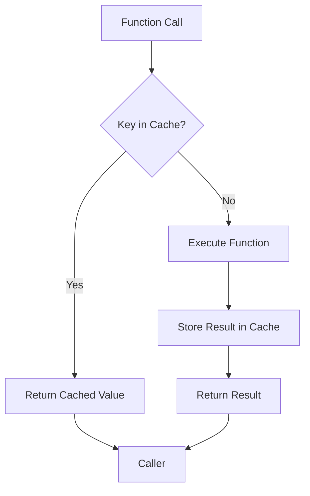
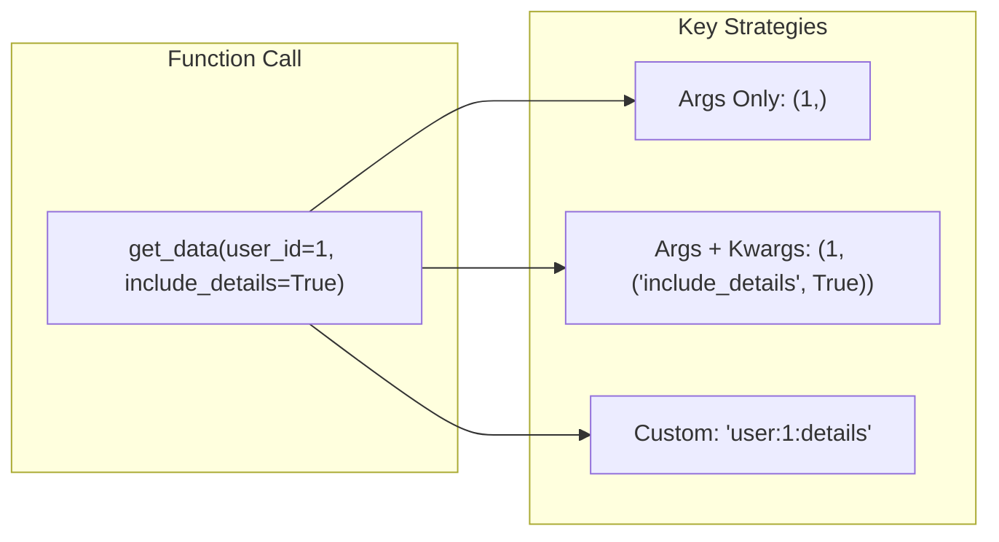
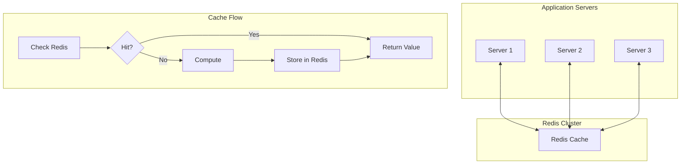
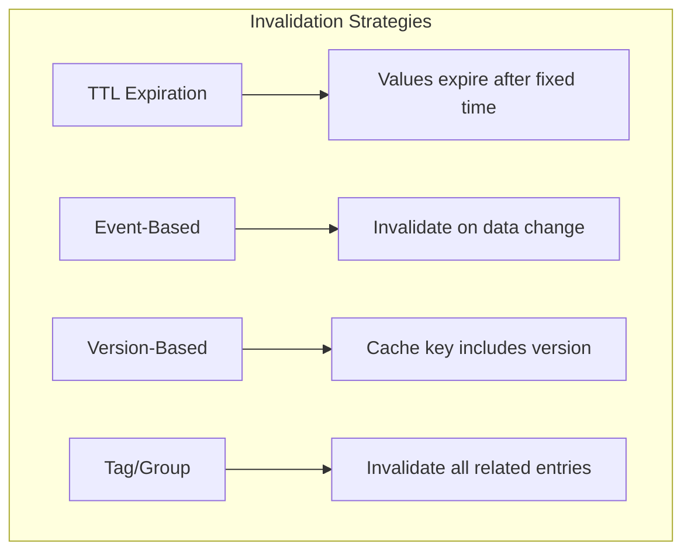

# How to Build Cache Decorators in Python

Author: [nawazdhandala](https://www.github.com/nawazdhandala)

Tags: Python, Caching, Decorators, Performance, Redis, functools

Description: Learn how to build effective cache decorators in Python for function memoization and performance optimization. This guide covers lru_cache, TTL caching, and distributed caching with Redis.

---

> Caching is one of the most effective ways to speed up your applications. Instead of recomputing expensive results, you store them and return the cached value on subsequent calls. Python decorators make caching elegant and reusable across your codebase.

This guide shows you how to build production-ready cache decorators, from simple in-memory memoization to distributed Redis caching with TTL and invalidation strategies.

---

## Why Cache Decorators?

Caching improves performance by storing computed results and returning them for identical inputs. Without caching:

```
Call 1: compute_expensive(x) -> 500ms
Call 2: compute_expensive(x) -> 500ms  
Call 3: compute_expensive(x) -> 500ms
Total: 1500ms
```

With caching:

```
Call 1: compute_expensive(x) -> 500ms (cache miss, compute)
Call 2: compute_expensive(x) -> 0.1ms (cache hit)
Call 3: compute_expensive(x) -> 0.1ms (cache hit)
Total: ~500ms
```

Decorators let you add caching without modifying the original function logic.

---

## How Cache Decorators Work

Here is how a cache decorator intercepts function calls:



The decorator wraps the original function, checks if the result exists in cache, and either returns the cached value or computes and stores a new one.

---

## Built-in Caching with functools

Python's `functools` module provides two built-in caching decorators that work for most use cases.

### Using lru_cache

The `lru_cache` decorator caches results using a Least Recently Used eviction policy. When the cache is full, the least recently accessed items are removed first.

```python
from functools import lru_cache
import time

# Simple memoization with unbounded cache
# All unique inputs are stored forever (until process restart)
@lru_cache(maxsize=None)
def fibonacci(n: int) -> int:
    """Calculate Fibonacci number recursively with memoization.
    
    Without caching, this would have O(2^n) time complexity.
    With caching, it becomes O(n) on first call, O(1) on subsequent calls.
    """
    if n < 2:
        return n
    return fibonacci(n - 1) + fibonacci(n - 2)

# Bounded cache - keeps only the 128 most recently used results
# Good for functions with many unique inputs where you only need recent results
@lru_cache(maxsize=128)
def expensive_computation(x: int, y: int) -> float:
    """Simulate an expensive computation like a complex calculation.
    
    The maxsize of 128 means only 128 unique (x, y) combinations
    are kept in cache. Least recently used entries are evicted.
    """
    time.sleep(0.5)  # Simulate slow computation
    return x ** y / (x + y)

# Usage demonstration
start = time.time()
result1 = expensive_computation(10, 5)  # Cache miss - takes 500ms
print(f"First call: {time.time() - start:.3f}s")

start = time.time()
result2 = expensive_computation(10, 5)  # Cache hit - instant
print(f"Second call: {time.time() - start:.3f}s")

# Check cache statistics
print(f"Cache info: {expensive_computation.cache_info()}")
# Output: CacheInfo(hits=1, misses=1, maxsize=128, currsize=1)
```

### Cache Statistics and Management

The `lru_cache` decorator provides helpful methods to inspect and manage the cache.

```python
from functools import lru_cache

@lru_cache(maxsize=256)
def fetch_user(user_id: int) -> dict:
    """Fetch user data from a slow data source.
    
    Cache stores results keyed by user_id.
    """
    # Simulate database or API call
    return {"id": user_id, "name": f"User {user_id}"}

# Populate cache with some calls
for i in range(10):
    fetch_user(i)

# Get cache statistics
info = fetch_user.cache_info()
print(f"Hits: {info.hits}")        # Number of cache hits
print(f"Misses: {info.misses}")    # Number of cache misses
print(f"Max size: {info.maxsize}") # Maximum cache size
print(f"Current size: {info.currsize}")  # Current number of cached items

# Clear entire cache - useful for testing or memory management
fetch_user.cache_clear()
print(f"After clear: {fetch_user.cache_info()}")

# Get the underlying unwrapped function (Python 3.8+)
# Useful for testing when you want to bypass cache
original_func = fetch_user.__wrapped__
```

### Using cache (Python 3.9+)

Python 3.9 introduced `cache` as a simpler alias for `lru_cache(maxsize=None)`.

```python
from functools import cache

# Equivalent to @lru_cache(maxsize=None)
# Stores all results without eviction - memory can grow unbounded
@cache
def factorial(n: int) -> int:
    """Calculate factorial with memoization.
    
    Uses @cache for cleaner syntax when you want unbounded caching.
    """
    if n <= 1:
        return 1
    return n * factorial(n - 1)

# Perfect for recursive functions with overlapping subproblems
print(factorial(100))  # First call computes all values 1-100
print(factorial(50))   # Returns cached value instantly
```

---

## Building a Custom Cache Decorator

While `lru_cache` works for simple cases, production applications often need more control over caching behavior, such as time-based expiration.

### Basic Time-Based Cache

This decorator adds TTL (Time To Live) expiration to cached values.

```python
import time
from functools import wraps
from typing import Any, Callable, Optional

def cache_with_ttl(ttl_seconds: int = 300):
    """Decorator that caches function results with time-based expiration.
    
    Args:
        ttl_seconds: How long cached values remain valid (default 5 minutes)
    
    Returns:
        Decorated function with TTL-based caching
    
    Example:
        @cache_with_ttl(ttl_seconds=60)
        def get_config():
            return load_config_from_file()
    """
    def decorator(func: Callable) -> Callable:
        # Storage for cached values and their expiration times
        cache = {}
        cache_times = {}
        
        @wraps(func)  # Preserves function metadata like __name__ and __doc__
        def wrapper(*args, **kwargs):
            # Create a hashable key from arguments
            # Convert kwargs to sorted tuple for consistent hashing
            key = (args, tuple(sorted(kwargs.items())))
            
            current_time = time.time()
            
            # Check if we have a valid cached value
            if key in cache:
                # Check if cache entry has expired
                if current_time - cache_times[key] < ttl_seconds:
                    return cache[key]  # Return cached value
                else:
                    # Entry expired - remove it
                    del cache[key]
                    del cache_times[key]
            
            # Cache miss or expired - compute new value
            result = func(*args, **kwargs)
            
            # Store result and current time
            cache[key] = result
            cache_times[key] = current_time
            
            return result
        
        # Expose cache management methods
        def clear_cache():
            """Clear all cached values"""
            cache.clear()
            cache_times.clear()
        
        def cache_info():
            """Return current cache state"""
            return {"size": len(cache), "keys": list(cache.keys())}
        
        wrapper.clear_cache = clear_cache
        wrapper.cache_info = cache_info
        
        return wrapper
    
    return decorator

# Usage example
@cache_with_ttl(ttl_seconds=60)
def fetch_weather(city: str) -> dict:
    """Fetch weather data that should be refreshed every minute.
    
    Weather data changes frequently, so a short TTL ensures
    we get reasonably fresh data without hammering the API.
    """
    print(f"Fetching weather for {city}...")  # Only prints on cache miss
    # Simulate API call
    time.sleep(1)
    return {"city": city, "temp": 72, "conditions": "sunny"}

# First call - cache miss
weather = fetch_weather("Seattle")  # Prints "Fetching weather..."

# Second call within TTL - cache hit
weather = fetch_weather("Seattle")  # No print, returns cached

# After TTL expires - cache miss again
time.sleep(61)
weather = fetch_weather("Seattle")  # Prints "Fetching weather..."
```

### Cache with Maximum Size and TTL

Combine size limits with TTL for more control over memory usage.

```python
import time
from collections import OrderedDict
from functools import wraps
from threading import Lock
from typing import Any, Callable, Optional

def bounded_ttl_cache(maxsize: int = 128, ttl_seconds: int = 300):
    """Thread-safe cache decorator with both size limit and TTL expiration.
    
    Uses OrderedDict for efficient LRU eviction when size limit is reached.
    Thread-safe for use in multi-threaded applications.
    
    Args:
        maxsize: Maximum number of entries to keep in cache
        ttl_seconds: Time in seconds before cached values expire
    
    Returns:
        Decorated function with bounded, TTL-based caching
    """
    def decorator(func: Callable) -> Callable:
        # OrderedDict maintains insertion order for LRU eviction
        cache = OrderedDict()
        cache_times = {}
        lock = Lock()  # Thread safety for concurrent access
        
        # Statistics tracking
        hits = 0
        misses = 0
        
        @wraps(func)
        def wrapper(*args, **kwargs):
            nonlocal hits, misses
            
            # Create cache key from arguments
            key = _make_key(args, kwargs)
            current_time = time.time()
            
            with lock:  # Thread-safe cache access
                # Check for valid cached value
                if key in cache:
                    cached_time = cache_times[key]
                    
                    if current_time - cached_time < ttl_seconds:
                        # Valid cache hit - move to end (most recently used)
                        cache.move_to_end(key)
                        hits += 1
                        return cache[key]
                    else:
                        # Expired - remove stale entry
                        del cache[key]
                        del cache_times[key]
            
            # Cache miss - compute value outside lock to avoid blocking
            result = func(*args, **kwargs)
            
            with lock:
                # Evict oldest entry if at capacity
                if len(cache) >= maxsize:
                    # Remove least recently used (first item)
                    oldest_key = next(iter(cache))
                    del cache[oldest_key]
                    del cache_times[oldest_key]
                
                # Store new result
                cache[key] = result
                cache_times[key] = current_time
                misses += 1
            
            return result
        
        def _make_key(args: tuple, kwargs: dict) -> tuple:
            """Create a hashable key from function arguments."""
            # Handle unhashable arguments by converting to string
            try:
                return (args, tuple(sorted(kwargs.items())))
            except TypeError:
                # Fall back to string representation for unhashable types
                return (str(args), str(sorted(kwargs.items())))
        
        def clear_cache():
            """Clear all cached entries."""
            with lock:
                cache.clear()
                cache_times.clear()
        
        def get_cache_info():
            """Return cache statistics."""
            with lock:
                return {
                    "hits": hits,
                    "misses": misses,
                    "size": len(cache),
                    "maxsize": maxsize,
                    "ttl_seconds": ttl_seconds
                }
        
        def invalidate(*args, **kwargs):
            """Invalidate a specific cache entry."""
            key = _make_key(args, kwargs)
            with lock:
                if key in cache:
                    del cache[key]
                    del cache_times[key]
                    return True
            return False
        
        wrapper.clear_cache = clear_cache
        wrapper.cache_info = get_cache_info
        wrapper.invalidate = invalidate
        
        return wrapper
    
    return decorator

# Usage example
@bounded_ttl_cache(maxsize=100, ttl_seconds=300)
def get_user_profile(user_id: int) -> dict:
    """Fetch user profile with caching.
    
    Maintains at most 100 profiles in cache, each valid for 5 minutes.
    Thread-safe for concurrent requests.
    """
    print(f"Loading profile for user {user_id}...")
    time.sleep(0.5)  # Simulate database query
    return {
        "id": user_id,
        "name": f"User {user_id}",
        "fetched_at": time.time()
    }

# Multiple calls - demonstrates caching behavior
profile1 = get_user_profile(123)  # Cache miss
profile2 = get_user_profile(123)  # Cache hit
profile3 = get_user_profile(456)  # Cache miss (different user)

# Check statistics
print(get_user_profile.cache_info())

# Invalidate specific entry (e.g., after user update)
get_user_profile.invalidate(123)
```

---

## Cache Key Strategies

Choosing the right cache key is critical for correct caching behavior. Here is how different key strategies affect cache behavior:



### Handling Complex Arguments

```python
import hashlib
import json
from functools import wraps
from typing import Any, Callable

def cache_with_key_function(key_func: Callable = None, ttl_seconds: int = 300):
    """Cache decorator with customizable key generation.
    
    Allows you to define how cache keys are generated, which is useful
    when default argument hashing is insufficient.
    
    Args:
        key_func: Optional function to generate cache key from arguments
        ttl_seconds: Time before cached values expire
    
    Example:
        @cache_with_key_function(key_func=lambda user_id, **kw: f"user:{user_id}")
        def get_user(user_id, include_details=False):
            ...
    """
    def decorator(func: Callable) -> Callable:
        cache = {}
        cache_times = {}
        
        @wraps(func)
        def wrapper(*args, **kwargs):
            # Use custom key function or default serialization
            if key_func:
                key = key_func(*args, **kwargs)
            else:
                key = _default_key(args, kwargs)
            
            current_time = __import__('time').time()
            
            # Check cache
            if key in cache:
                if current_time - cache_times[key] < ttl_seconds:
                    return cache[key]
                del cache[key]
                del cache_times[key]
            
            # Compute and cache
            result = func(*args, **kwargs)
            cache[key] = result
            cache_times[key] = current_time
            
            return result
        
        def _default_key(args: tuple, kwargs: dict) -> str:
            """Generate a stable cache key from arguments.
            
            Uses JSON serialization and MD5 hashing for complex objects.
            """
            try:
                # Try to create a hashable representation
                key_data = {
                    "args": args,
                    "kwargs": kwargs
                }
                # JSON encode with sorted keys for consistency
                json_str = json.dumps(key_data, sort_keys=True, default=str)
                # Hash for fixed-length key
                return hashlib.md5(json_str.encode()).hexdigest()
            except (TypeError, ValueError):
                # Fallback for non-serializable objects
                return str(hash((str(args), str(kwargs))))
        
        wrapper.cache = cache
        wrapper.clear_cache = lambda: (cache.clear(), cache_times.clear())
        
        return wrapper
    
    return decorator

# Example: Custom key that ignores certain parameters
@cache_with_key_function(
    key_func=lambda user_id, **kwargs: f"user:{user_id}",
    ttl_seconds=60
)
def get_user_data(user_id: int, request_id: str = None, trace_id: str = None):
    """Fetch user data, caching only by user_id.
    
    The request_id and trace_id are for logging/tracing and should not
    affect caching - same user_id should return cached data regardless
    of these parameters.
    """
    print(f"Fetching user {user_id}...")
    return {"id": user_id, "name": f"User {user_id}"}

# Both calls hit same cache entry despite different request_ids
data1 = get_user_data(123, request_id="req-001")  # Cache miss
data2 = get_user_data(123, request_id="req-002")  # Cache hit (same key)
```

### Handling Unhashable Arguments

```python
import time
import pickle
import hashlib
from functools import wraps
from typing import Callable

def robust_cache(ttl_seconds: int = 300):
    """Cache decorator that handles unhashable arguments like lists and dicts.
    
    Uses pickle serialization to create cache keys from any argument type,
    including mutable containers.
    """
    def decorator(func: Callable) -> Callable:
        cache = {}
        cache_times = {}
        
        @wraps(func)
        def wrapper(*args, **kwargs):
            # Serialize arguments to create stable cache key
            key = _serialize_key(args, kwargs)
            current_time = time.time()
            
            if key in cache and current_time - cache_times[key] < ttl_seconds:
                return cache[key]
            
            result = func(*args, **kwargs)
            cache[key] = result
            cache_times[key] = current_time
            
            return result
        
        def _serialize_key(args: tuple, kwargs: dict) -> str:
            """Create cache key by pickling and hashing arguments.
            
            This handles lists, dicts, custom objects - anything pickle can serialize.
            """
            try:
                # Pickle serializes Python objects to bytes
                pickled = pickle.dumps((args, kwargs))
                # Hash for consistent key length
                return hashlib.sha256(pickled).hexdigest()
            except (pickle.PicklingError, TypeError) as e:
                # Some objects cannot be pickled (lambdas, file handles)
                raise ValueError(f"Cannot cache function with unpicklable args: {e}")
        
        wrapper.clear_cache = lambda: (cache.clear(), cache_times.clear())
        
        return wrapper
    
    return decorator

# Now we can cache functions with list/dict arguments
@robust_cache(ttl_seconds=60)
def process_items(items: list, config: dict) -> dict:
    """Process a list of items with given configuration.
    
    Lists and dicts are unhashable, but robust_cache handles them
    by serializing with pickle.
    """
    print(f"Processing {len(items)} items...")
    time.sleep(1)
    return {"processed": len(items), "config": config}

# These work despite unhashable arguments
result1 = process_items([1, 2, 3], {"mode": "fast"})  # Cache miss
result2 = process_items([1, 2, 3], {"mode": "fast"})  # Cache hit
result3 = process_items([1, 2, 3], {"mode": "slow"})  # Cache miss (different config)
```

---

## Distributed Caching with Redis

For multi-process or multi-server applications, in-memory caching is not sufficient. Redis provides a shared cache that all instances can access.

### Redis Cache Architecture



### Basic Redis Cache Decorator

```python
import json
import time
from functools import wraps
from typing import Any, Callable, Optional
import redis

class RedisCacheDecorator:
    """Redis-backed cache decorator for distributed caching.
    
    Provides caching across multiple processes and servers using Redis
    as the shared cache store.
    
    Attributes:
        redis_client: Redis connection instance
        default_ttl: Default time-to-live for cached values
        key_prefix: Prefix added to all cache keys for namespacing
    """
    
    def __init__(
        self,
        redis_url: str = "redis://localhost:6379",
        default_ttl: int = 300,
        key_prefix: str = "cache"
    ):
        """Initialize Redis cache decorator.
        
        Args:
            redis_url: Redis connection URL
            default_ttl: Default expiration time in seconds
            key_prefix: Prefix for all cache keys (helps avoid collisions)
        """
        self.redis_client = redis.from_url(redis_url)
        self.default_ttl = default_ttl
        self.key_prefix = key_prefix
    
    def __call__(
        self,
        ttl: Optional[int] = None,
        key_builder: Optional[Callable] = None
    ):
        """Create a cache decorator with specified options.
        
        Args:
            ttl: Override default TTL for this function
            key_builder: Custom function to build cache key
        
        Returns:
            Decorator function
        """
        ttl = ttl or self.default_ttl
        
        def decorator(func: Callable) -> Callable:
            @wraps(func)
            def wrapper(*args, **kwargs):
                # Build cache key
                if key_builder:
                    cache_key = f"{self.key_prefix}:{key_builder(*args, **kwargs)}"
                else:
                    cache_key = self._build_key(func.__name__, args, kwargs)
                
                # Try to get from cache
                cached = self.redis_client.get(cache_key)
                if cached is not None:
                    return json.loads(cached)
                
                # Cache miss - compute value
                result = func(*args, **kwargs)
                
                # Store in Redis with TTL
                self.redis_client.setex(
                    cache_key,
                    ttl,
                    json.dumps(result)
                )
                
                return result
            
            # Add cache management methods
            wrapper.invalidate = lambda *a, **kw: self._invalidate(
                func.__name__, a, kw, key_builder
            )
            wrapper.get_key = lambda *a, **kw: self._build_key(
                func.__name__, a, kw
            ) if not key_builder else f"{self.key_prefix}:{key_builder(*a, **kw)}"
            
            return wrapper
        
        return decorator
    
    def _build_key(self, func_name: str, args: tuple, kwargs: dict) -> str:
        """Build a cache key from function name and arguments."""
        # Create deterministic string from args
        args_str = json.dumps({"args": args, "kwargs": kwargs}, sort_keys=True)
        # Use hash to keep key length manageable
        args_hash = hash(args_str) & 0xFFFFFFFF  # Ensure positive number
        return f"{self.key_prefix}:{func_name}:{args_hash}"
    
    def _invalidate(
        self,
        func_name: str,
        args: tuple,
        kwargs: dict,
        key_builder: Optional[Callable]
    ):
        """Invalidate a specific cache entry."""
        if key_builder:
            cache_key = f"{self.key_prefix}:{key_builder(*args, **kwargs)}"
        else:
            cache_key = self._build_key(func_name, args, kwargs)
        
        return self.redis_client.delete(cache_key)


# Initialize cache with Redis connection
redis_cache = RedisCacheDecorator(
    redis_url="redis://localhost:6379",
    default_ttl=300,
    key_prefix="myapp"
)

# Usage with default settings
@redis_cache()
def get_user(user_id: int) -> dict:
    """Fetch user from database with Redis caching.
    
    Cache key: myapp:get_user:<hash of args>
    TTL: 300 seconds (5 minutes)
    """
    print(f"Querying database for user {user_id}...")
    time.sleep(0.5)  # Simulate DB query
    return {"id": user_id, "name": f"User {user_id}"}

# Usage with custom TTL and key builder
@redis_cache(
    ttl=60,
    key_builder=lambda user_id: f"user:{user_id}"
)
def get_user_profile(user_id: int) -> dict:
    """Fetch user profile with custom cache key.
    
    Cache key: myapp:user:123 (more readable for debugging)
    TTL: 60 seconds
    """
    print(f"Loading profile for {user_id}...")
    return {"id": user_id, "profile": "data"}

# Test the caching
user = get_user(123)       # Cache miss - queries database
user = get_user(123)       # Cache hit - from Redis
get_user.invalidate(123)   # Remove from cache
user = get_user(123)       # Cache miss again
```

### Async Redis Cache

For async applications using asyncio, here is an async-compatible Redis cache decorator.

```python
import json
import asyncio
from functools import wraps
from typing import Any, Callable, Optional
import aioredis

class AsyncRedisCacheDecorator:
    """Async Redis cache decorator for asyncio applications.
    
    Works with aioredis for non-blocking Redis operations in async code.
    """
    
    def __init__(
        self,
        redis_url: str = "redis://localhost:6379",
        default_ttl: int = 300,
        key_prefix: str = "cache"
    ):
        self.redis_url = redis_url
        self.default_ttl = default_ttl
        self.key_prefix = key_prefix
        self._redis: Optional[aioredis.Redis] = None
    
    async def get_redis(self) -> aioredis.Redis:
        """Get or create Redis connection lazily."""
        if self._redis is None:
            self._redis = await aioredis.from_url(self.redis_url)
        return self._redis
    
    def __call__(
        self,
        ttl: Optional[int] = None,
        key_builder: Optional[Callable] = None
    ):
        """Create async cache decorator."""
        ttl = ttl or self.default_ttl
        
        def decorator(func: Callable) -> Callable:
            @wraps(func)
            async def wrapper(*args, **kwargs):
                redis = await self.get_redis()
                
                # Build cache key
                if key_builder:
                    cache_key = f"{self.key_prefix}:{key_builder(*args, **kwargs)}"
                else:
                    cache_key = self._build_key(func.__name__, args, kwargs)
                
                # Try to get from cache
                cached = await redis.get(cache_key)
                if cached is not None:
                    return json.loads(cached)
                
                # Cache miss - compute value
                result = await func(*args, **kwargs)
                
                # Store in Redis
                await redis.setex(
                    cache_key,
                    ttl,
                    json.dumps(result)
                )
                
                return result
            
            async def invalidate(*args, **kwargs):
                """Invalidate cache entry asynchronously."""
                redis = await self.get_redis()
                if key_builder:
                    cache_key = f"{self.key_prefix}:{key_builder(*args, **kwargs)}"
                else:
                    cache_key = self._build_key(func.__name__, args, kwargs)
                return await redis.delete(cache_key)
            
            wrapper.invalidate = invalidate
            return wrapper
        
        return decorator
    
    def _build_key(self, func_name: str, args: tuple, kwargs: dict) -> str:
        """Build cache key from function name and arguments."""
        args_str = json.dumps({"args": args, "kwargs": kwargs}, sort_keys=True)
        args_hash = hash(args_str) & 0xFFFFFFFF
        return f"{self.key_prefix}:{func_name}:{args_hash}"


# Initialize async cache
async_redis_cache = AsyncRedisCacheDecorator(
    redis_url="redis://localhost:6379",
    default_ttl=300,
    key_prefix="myapp"
)

@async_redis_cache(ttl=60)
async def fetch_data(item_id: str) -> dict:
    """Async function with Redis caching.
    
    Non-blocking cache checks work well with async HTTP clients
    and database drivers.
    """
    print(f"Fetching {item_id} from API...")
    await asyncio.sleep(0.5)  # Simulate async API call
    return {"id": item_id, "data": "value"}

# Usage in async context
async def main():
    data = await fetch_data("item-123")  # Cache miss
    data = await fetch_data("item-123")  # Cache hit
    await fetch_data.invalidate("item-123")  # Invalidate

asyncio.run(main())
```

---

## Cache Invalidation Strategies

Cache invalidation is famously one of the hardest problems in computer science. Here are common strategies:



### Event-Based Invalidation

Invalidate cache when underlying data changes.

```python
import time
from functools import wraps
from typing import Callable, Dict, List, Set

class EventDrivenCache:
    """Cache with event-based invalidation.
    
    Cache entries can be tagged with event names. When an event fires,
    all entries with that tag are invalidated.
    """
    
    def __init__(self, ttl_seconds: int = 300):
        self.ttl_seconds = ttl_seconds
        self.cache: Dict[str, any] = {}
        self.cache_times: Dict[str, float] = {}
        self.cache_tags: Dict[str, Set[str]] = {}  # key -> set of tags
        self.tag_keys: Dict[str, Set[str]] = {}    # tag -> set of keys
    
    def cached(self, tags: List[str] = None):
        """Decorator to cache function results with optional tags.
        
        Args:
            tags: List of event tags that will invalidate this entry
        """
        tags = tags or []
        
        def decorator(func: Callable) -> Callable:
            @wraps(func)
            def wrapper(*args, **kwargs):
                key = self._make_key(func.__name__, args, kwargs)
                current_time = time.time()
                
                # Check cache
                if key in self.cache:
                    if current_time - self.cache_times[key] < self.ttl_seconds:
                        return self.cache[key]
                    self._remove_key(key)
                
                # Compute and cache
                result = func(*args, **kwargs)
                self._store(key, result, tags)
                
                return result
            
            return wrapper
        
        return decorator
    
    def _make_key(self, func_name: str, args: tuple, kwargs: dict) -> str:
        """Generate cache key from function and arguments."""
        return f"{func_name}:{hash((args, tuple(sorted(kwargs.items()))))}"
    
    def _store(self, key: str, value: any, tags: List[str]):
        """Store value in cache with tags."""
        self.cache[key] = value
        self.cache_times[key] = time.time()
        self.cache_tags[key] = set(tags)
        
        # Register key with each tag
        for tag in tags:
            if tag not in self.tag_keys:
                self.tag_keys[tag] = set()
            self.tag_keys[tag].add(key)
    
    def _remove_key(self, key: str):
        """Remove a key from cache and all tag registrations."""
        if key in self.cache:
            del self.cache[key]
            del self.cache_times[key]
            
            # Remove from tag registrations
            if key in self.cache_tags:
                for tag in self.cache_tags[key]:
                    if tag in self.tag_keys:
                        self.tag_keys[tag].discard(key)
                del self.cache_tags[key]
    
    def invalidate_by_tag(self, tag: str) -> int:
        """Invalidate all cache entries with a specific tag.
        
        Args:
            tag: Event tag to invalidate
            
        Returns:
            Number of entries invalidated
        """
        if tag not in self.tag_keys:
            return 0
        
        keys_to_remove = list(self.tag_keys[tag])
        for key in keys_to_remove:
            self._remove_key(key)
        
        return len(keys_to_remove)
    
    def invalidate_all(self):
        """Clear entire cache."""
        self.cache.clear()
        self.cache_times.clear()
        self.cache_tags.clear()
        self.tag_keys.clear()


# Usage example
cache = EventDrivenCache(ttl_seconds=300)

@cache.cached(tags=["user:123", "users"])
def get_user(user_id: int) -> dict:
    """Cached user fetch.
    
    Tagged with specific user ID and general 'users' tag.
    """
    print(f"Fetching user {user_id}...")
    return {"id": user_id, "name": f"User {user_id}"}

@cache.cached(tags=["user:123"])
def get_user_orders(user_id: int) -> list:
    """Cached user orders.
    
    Tagged with user ID - invalidates when user data changes.
    """
    print(f"Fetching orders for user {user_id}...")
    return [{"order_id": 1}, {"order_id": 2}]

# Populate cache
user = get_user(123)          # Cache miss
orders = get_user_orders(123) # Cache miss
user = get_user(123)          # Cache hit

# User updates their profile - invalidate all their cached data
def update_user(user_id: int, data: dict):
    """Update user and invalidate related caches."""
    # Update in database
    print(f"Updating user {user_id}...")
    
    # Invalidate all caches tagged with this user
    invalidated = cache.invalidate_by_tag(f"user:{user_id}")
    print(f"Invalidated {invalidated} cache entries")

update_user(123, {"name": "New Name"})

# Next calls will miss cache (re-fetch fresh data)
user = get_user(123)          # Cache miss
orders = get_user_orders(123) # Cache miss
```

### Version-Based Invalidation

Include a version in the cache key so changing the version invalidates all entries.

```python
import time
from functools import wraps
from typing import Callable

class VersionedCache:
    """Cache that uses versions in keys for bulk invalidation.
    
    Incrementing the version effectively invalidates all cached data
    without needing to enumerate and delete individual keys.
    """
    
    def __init__(self, ttl_seconds: int = 300):
        self.ttl_seconds = ttl_seconds
        self.version = 1  # Global version number
        self.cache = {}
        self.cache_times = {}
    
    def cached(self, version_key: str = "global"):
        """Decorator with version-based cache keys.
        
        Args:
            version_key: Namespace for version (allows partial invalidation)
        """
        def decorator(func: Callable) -> Callable:
            @wraps(func)
            def wrapper(*args, **kwargs):
                # Include version in cache key
                base_key = f"{func.__name__}:{hash((args, tuple(sorted(kwargs.items()))))}"
                cache_key = f"v{self.version}:{version_key}:{base_key}"
                
                current_time = time.time()
                
                if cache_key in self.cache:
                    if current_time - self.cache_times[cache_key] < self.ttl_seconds:
                        return self.cache[cache_key]
                
                result = func(*args, **kwargs)
                self.cache[cache_key] = result
                self.cache_times[cache_key] = current_time
                
                return result
            
            return wrapper
        
        return decorator
    
    def increment_version(self):
        """Increment version to invalidate all cached data.
        
        Old entries become orphaned (different version in key)
        and will be garbage collected when TTL expires or cache fills.
        """
        self.version += 1
        print(f"Cache version incremented to {self.version}")
    
    def cleanup_old_versions(self):
        """Remove entries from old versions to free memory."""
        current_prefix = f"v{self.version}:"
        keys_to_remove = [
            k for k in self.cache.keys()
            if not k.startswith(current_prefix)
        ]
        for key in keys_to_remove:
            del self.cache[key]
            del self.cache_times[key]
        return len(keys_to_remove)


# Usage
versioned_cache = VersionedCache(ttl_seconds=300)

@versioned_cache.cached()
def get_config(key: str) -> str:
    """Get configuration value.
    
    When config is deployed, version increments and all
    cached config values are effectively invalidated.
    """
    print(f"Loading config {key}...")
    return f"value-for-{key}"

# Populate cache
config1 = get_config("database_url")  # Cache miss
config2 = get_config("api_key")       # Cache miss
config1 = get_config("database_url")  # Cache hit

# Deploy new configuration
def deploy_config():
    """Deploy new config and invalidate all cached config."""
    print("Deploying new configuration...")
    versioned_cache.increment_version()
    versioned_cache.cleanup_old_versions()

deploy_config()

# All config now re-fetched
config1 = get_config("database_url")  # Cache miss (new version)
```

---

## Monitoring and Observability

### Cache Metrics

Track cache performance to identify issues and optimize hit rates.

```python
import time
from functools import wraps
from typing import Callable, Dict
from dataclasses import dataclass, field
from collections import defaultdict

@dataclass
class CacheMetrics:
    """Metrics for cache performance monitoring."""
    hits: int = 0
    misses: int = 0
    errors: int = 0
    total_hit_time_ms: float = 0
    total_miss_time_ms: float = 0
    
    @property
    def hit_rate(self) -> float:
        """Calculate cache hit rate (0.0 to 1.0)."""
        total = self.hits + self.misses
        return self.hits / total if total > 0 else 0.0
    
    @property
    def avg_hit_time_ms(self) -> float:
        """Average time for cache hits."""
        return self.total_hit_time_ms / self.hits if self.hits > 0 else 0
    
    @property
    def avg_miss_time_ms(self) -> float:
        """Average time for cache misses (includes compute time)."""
        return self.total_miss_time_ms / self.misses if self.misses > 0 else 0

class MonitoredCache:
    """Cache with built-in metrics collection.
    
    Tracks hit/miss rates, timing, and errors for observability.
    """
    
    def __init__(self, ttl_seconds: int = 300):
        self.ttl_seconds = ttl_seconds
        self.cache: Dict[str, any] = {}
        self.cache_times: Dict[str, float] = {}
        self.metrics: Dict[str, CacheMetrics] = defaultdict(CacheMetrics)
    
    def cached(self, name: str = None):
        """Decorator with metrics collection.
        
        Args:
            name: Optional name for metrics grouping
        """
        def decorator(func: Callable) -> Callable:
            metrics_name = name or func.__name__
            
            @wraps(func)
            def wrapper(*args, **kwargs):
                start_time = time.time()
                key = f"{func.__name__}:{hash((args, tuple(sorted(kwargs.items()))))}"
                current_time = start_time
                metrics = self.metrics[metrics_name]
                
                try:
                    # Check cache
                    if key in self.cache:
                        if current_time - self.cache_times[key] < self.ttl_seconds:
                            # Cache hit
                            metrics.hits += 1
                            elapsed_ms = (time.time() - start_time) * 1000
                            metrics.total_hit_time_ms += elapsed_ms
                            return self.cache[key]
                    
                    # Cache miss - compute value
                    result = func(*args, **kwargs)
                    self.cache[key] = result
                    self.cache_times[key] = current_time
                    
                    metrics.misses += 1
                    elapsed_ms = (time.time() - start_time) * 1000
                    metrics.total_miss_time_ms += elapsed_ms
                    
                    return result
                
                except Exception as e:
                    metrics.errors += 1
                    raise
            
            return wrapper
        
        return decorator
    
    def get_metrics(self, name: str = None) -> Dict[str, CacheMetrics]:
        """Get metrics for all caches or a specific one."""
        if name:
            return {name: self.metrics[name]}
        return dict(self.metrics)
    
    def report_metrics(self):
        """Print metrics report for all cached functions."""
        print("\n=== Cache Metrics Report ===")
        for name, metrics in self.metrics.items():
            print(f"\n{name}:")
            print(f"  Hit Rate: {metrics.hit_rate:.1%}")
            print(f"  Hits: {metrics.hits}, Misses: {metrics.misses}")
            print(f"  Avg Hit Time: {metrics.avg_hit_time_ms:.2f}ms")
            print(f"  Avg Miss Time: {metrics.avg_miss_time_ms:.2f}ms")
            print(f"  Errors: {metrics.errors}")


# Usage
monitored_cache = MonitoredCache(ttl_seconds=300)

@monitored_cache.cached(name="user_data")
def get_user(user_id: int) -> dict:
    """Fetch user with metrics tracking."""
    time.sleep(0.1)  # Simulate slow operation
    return {"id": user_id}

@monitored_cache.cached(name="product_data")
def get_product(product_id: int) -> dict:
    """Fetch product with metrics tracking."""
    time.sleep(0.2)
    return {"id": product_id}

# Simulate traffic
for i in range(100):
    get_user(i % 10)      # 10 unique users, many repeats
    get_product(i % 50)   # 50 unique products, fewer repeats

# View metrics
monitored_cache.report_metrics()
```

### Prometheus Integration

Export cache metrics to Prometheus for monitoring dashboards.

```python
from prometheus_client import Counter, Histogram, Gauge
from functools import wraps
from typing import Callable
import time

# Define Prometheus metrics for cache monitoring
cache_hits = Counter(
    'cache_hits_total',
    'Total cache hits',
    ['cache_name', 'function']
)

cache_misses = Counter(
    'cache_misses_total',
    'Total cache misses',
    ['cache_name', 'function']
)

cache_latency = Histogram(
    'cache_operation_seconds',
    'Cache operation latency',
    ['cache_name', 'function', 'operation'],
    buckets=[.001, .005, .01, .025, .05, .1, .25, .5, 1.0]
)

cache_size = Gauge(
    'cache_entries',
    'Number of entries in cache',
    ['cache_name']
)

def prometheus_cached(
    cache_name: str,
    ttl_seconds: int = 300,
    cache_storage: dict = None
):
    """Cache decorator with Prometheus metrics.
    
    Args:
        cache_name: Name for metrics labels
        ttl_seconds: Cache TTL
        cache_storage: Optional shared cache dict (for size tracking)
    """
    if cache_storage is None:
        cache_storage = {}
    cache_times = {}
    
    def decorator(func: Callable) -> Callable:
        @wraps(func)
        def wrapper(*args, **kwargs):
            start_time = time.time()
            key = f"{func.__name__}:{hash((args, tuple(sorted(kwargs.items()))))}"
            labels = {'cache_name': cache_name, 'function': func.__name__}
            
            # Check cache
            if key in cache_storage:
                if time.time() - cache_times[key] < ttl_seconds:
                    # Record hit
                    cache_hits.labels(**labels).inc()
                    cache_latency.labels(
                        **labels, operation='hit'
                    ).observe(time.time() - start_time)
                    return cache_storage[key]
            
            # Cache miss - compute
            result = func(*args, **kwargs)
            
            # Store result
            cache_storage[key] = result
            cache_times[key] = time.time()
            
            # Record metrics
            cache_misses.labels(**labels).inc()
            cache_latency.labels(
                **labels, operation='miss'
            ).observe(time.time() - start_time)
            cache_size.labels(cache_name=cache_name).set(len(cache_storage))
            
            return result
        
        return wrapper
    
    return decorator

# Usage
user_cache = {}  # Shared storage for size tracking

@prometheus_cached(cache_name="users", cache_storage=user_cache)
def get_user(user_id: int) -> dict:
    """Fetch user with Prometheus metrics."""
    time.sleep(0.1)
    return {"id": user_id}

# Metrics automatically exported to Prometheus
# View with: http://localhost:9090/metrics
```

---

## Best Practices

### 1. Choose Appropriate TTL

Set TTL based on how often data changes and tolerance for staleness.

```python
# Short TTL for frequently changing data
@cache_with_ttl(ttl_seconds=60)
def get_stock_price(symbol: str):
    """Stock prices change frequently - short cache."""
    pass

# Long TTL for stable data
@cache_with_ttl(ttl_seconds=3600)
def get_country_list():
    """Country list rarely changes - cache for an hour."""
    pass
```

### 2. Use Appropriate Cache Keys

Ensure cache keys uniquely identify the data.

```python
# Include all parameters that affect the result
@cache_with_key_function(
    key_func=lambda user_id, include_orders=False: 
        f"user:{user_id}:orders={include_orders}"
)
def get_user(user_id: int, include_orders: bool = False):
    """Different cache entries for different options."""
    pass
```

### 3. Handle Cache Failures Gracefully

Cache should improve performance, not cause failures.

```python
def cache_with_fallback(ttl_seconds: int = 300):
    """Cache decorator that falls back to direct execution on cache errors."""
    def decorator(func: Callable) -> Callable:
        cache = {}
        cache_times = {}
        
        @wraps(func)
        def wrapper(*args, **kwargs):
            try:
                key = str((args, kwargs))
                current_time = time.time()
                
                if key in cache and current_time - cache_times[key] < ttl_seconds:
                    return cache[key]
                
                result = func(*args, **kwargs)
                cache[key] = result
                cache_times[key] = current_time
                return result
                
            except Exception as cache_error:
                # Log cache error but continue with direct execution
                print(f"Cache error (continuing without cache): {cache_error}")
                return func(*args, **kwargs)
        
        return wrapper
    return decorator
```

### 4. Avoid Caching Sensitive Data

Be careful about what gets cached, especially in distributed caches.

```python
# Never cache sensitive user data in shared caches
@redis_cache(ttl=60)
def get_user_preferences(user_id: int) -> dict:
    """Safe to cache - preferences are not sensitive."""
    pass

# Do NOT cache passwords, tokens, PII
def get_user_password_hash(user_id: int) -> str:
    """No caching - sensitive data."""
    pass
```

### 5. Monitor Cache Performance

Track hit rates to ensure caching is effective.

```python
# Target hit rates by use case:
# - User sessions: 90%+ hit rate expected
# - API responses: 70%+ hit rate acceptable
# - Search results: 40%+ hit rate may be good

# Alert if hit rate drops significantly
if metrics.hit_rate < 0.5:
    print(f"Warning: Low cache hit rate: {metrics.hit_rate:.1%}")
```

---

## Conclusion

Cache decorators are a powerful pattern for improving Python application performance. Key takeaways:

- **Start with functools.lru_cache** for simple in-memory caching
- **Add TTL** when data freshness matters
- **Use Redis** for distributed caching across processes or servers
- **Implement proper invalidation** - TTL, event-based, or version-based
- **Monitor cache metrics** to ensure effectiveness
- **Handle failures gracefully** - cache errors should not break functionality

Start with the simplest caching approach that meets your requirements and add complexity as needed.

---

*Need to monitor cache performance in your applications? [OneUptime](https://oneuptime.com) provides comprehensive metrics and dashboards to track cache hit rates, latency, and memory usage across your infrastructure.*

**Related Reading:**
- [How to Implement Decorators for Cross-Cutting Concerns](https://oneuptime.com/blog/post/2025-07-02-python-decorators-cross-cutting/view)
- [How to Implement Connection Pooling in Python for PostgreSQL](https://oneuptime.com/blog/post/2025-01-06-python-connection-pooling-postgresql/view)
- [SRE Best Practices](https://oneuptime.com/blog/post/2025-11-28-sre-best-practices/view)
