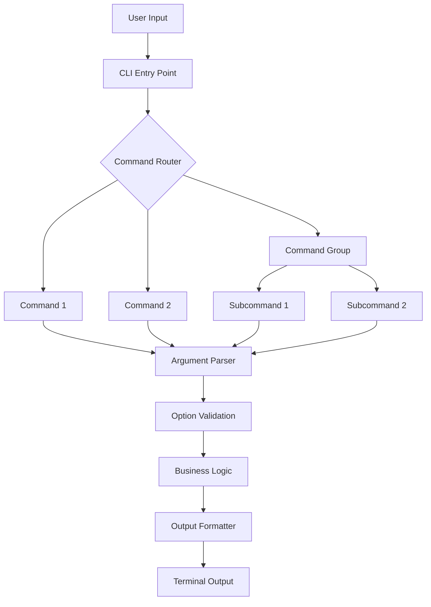
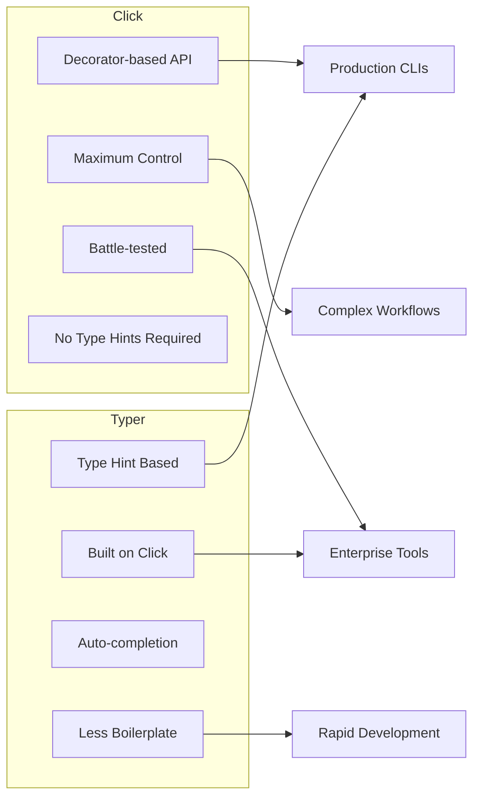
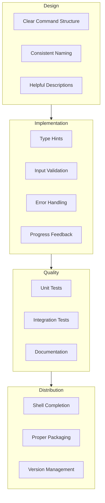

# How to Build CLI Applications with Click and Typer

Author: [nawazdhandala](https://www.github.com/nawazdhandala)

Tags: Python, CLI, Click, Typer, Command Line, Development Tools

Description: Learn how to build professional command-line applications in Python using Click and Typer. This guide covers argument parsing, subcommands, progress bars, and rich output formatting.

---

> Command-line interfaces remain one of the most powerful ways to interact with software. While Python's built-in `argparse` works for simple scripts, Click and Typer provide modern, developer-friendly approaches for building production-grade CLI applications with features like nested subcommands, automatic help generation, and rich terminal output.

Whether you're building deployment tools, data processing pipelines, or developer utilities, Click and Typer make CLI development a pleasure instead of a chore. This guide walks you through both libraries, showing when to use each and how to build professional CLIs.

---

## Prerequisites

Before we begin, ensure you have:
- Python 3.8 or higher
- pip or poetry for package management
- A terminal for testing your CLI applications
- Basic familiarity with Python functions and decorators

---

## Understanding CLI Architecture

Before diving into code, let's understand the typical structure of a CLI application:



This architecture shows how user input flows through a CLI: the entry point routes to commands, which parse arguments, validate options, execute business logic, and finally format output for the terminal.

---

## Click vs Typer: When to Use Each

Both Click and Typer are excellent choices, but they shine in different scenarios:



**Use Click when:**
- You need maximum control over CLI behavior
- You're working with legacy Python codebases
- You need advanced features like custom parameter types
- You prefer explicit decorator configuration

**Use Typer when:**
- You want minimal boilerplate code
- You're already using type hints extensively
- You want automatic shell completion
- You prefer convention over configuration

---

## Getting Started with Click

### Installation

```bash
# Install Click for CLI building
pip install click

# Optional: Add rich for better terminal output
pip install rich
```

### Your First Click Application

Click uses decorators to define commands and their parameters. This approach is explicit and gives you fine-grained control:

```python
#!/usr/bin/env python3
# hello_click.py
import click

# @click.command() turns this function into a CLI command
# The function name becomes the command name by default
@click.command()
# @click.option defines a flag or option the user can provide
# --count/-c is the option name, default=1 sets the fallback value
@click.option("--count", "-c", default=1, help="Number of greetings.")
# @click.option with is_flag=True creates a boolean flag
@click.option("--uppercase", "-u", is_flag=True, help="Print in uppercase.")
# @click.argument defines a positional argument (required by default)
@click.argument("name")
def hello(count, uppercase, name):
    """Simple program that greets NAME for COUNT times.

    This docstring becomes the command's help text automatically.
    Click parses it and displays it when users run --help.
    """
    # The business logic is clean - Click handles all parsing
    greeting = f"Hello, {name}!"
    if uppercase:
        greeting = greeting.upper()

    for _ in range(count):
        click.echo(greeting)

# Entry point for the script
if __name__ == "__main__":
    hello()
```

### Running Your Click Application

```bash
# Basic usage - NAME is required
python hello_click.py World
# Output: Hello, World!

# With options
python hello_click.py World --count 3 --uppercase
# Output:
# HELLO, WORLD!
# HELLO, WORLD!
# HELLO, WORLD!

# Using short options
python hello_click.py -c 2 -u Alice
# Output:
# HELLO, ALICE!
# HELLO, ALICE!

# Get help automatically
python hello_click.py --help
# Output:
# Usage: hello_click.py [OPTIONS] NAME
#
# Simple program that greets NAME for COUNT times.
#
# Options:
#   -c, --count INTEGER  Number of greetings.
#   -u, --uppercase      Print in uppercase.
#   --help               Show this message and exit.
```

---

## Building Command Groups with Click

Real-world CLIs often have multiple commands organized into groups. Think of tools like `git` or `docker` - they use subcommands extensively.

### Basic Command Group

```python
#!/usr/bin/env python3
# file_tool.py
import click
import os
from pathlib import Path

# @click.group() creates a command group that can contain multiple subcommands
# This is the entry point that routes to specific commands
@click.group()
@click.version_option(version="1.0.0", prog_name="file-tool")
def cli():
    """A file management CLI tool.

    Use this tool to perform common file operations
    from the command line with ease.
    """
    # Group functions typically don't have logic
    # They serve as containers for subcommands
    pass

# @cli.command() registers this function as a subcommand of 'cli'
# Users will call it as: file-tool list [OPTIONS] DIRECTORY
@cli.command()
@click.argument("directory", type=click.Path(exists=True))
# type=click.Path(exists=True) validates that the path exists
@click.option("--pattern", "-p", default="*", help="Glob pattern to match files.")
@click.option("--recursive", "-r", is_flag=True, help="Search recursively.")
def list(directory, pattern, recursive):
    """List files in a directory.

    DIRECTORY is the path to search for files.
    """
    path = Path(directory)

    # Use rglob for recursive, glob for single directory
    if recursive:
        files = list(path.rglob(pattern))
    else:
        files = list(path.glob(pattern))

    # click.echo is preferred over print() for CLI output
    # It handles encoding and can be captured in tests
    click.echo(f"Found {len(files)} files matching '{pattern}':")

    for f in sorted(files):
        # Use relative path for cleaner output
        relative = f.relative_to(path) if recursive else f.name
        # Style output with colors using click.style
        if f.is_dir():
            click.echo(click.style(f"  [DIR]  {relative}", fg="blue"))
        else:
            size = f.stat().st_size
            click.echo(f"  [FILE] {relative} ({size:,} bytes)")

@cli.command()
@click.argument("source", type=click.Path(exists=True))
@click.argument("destination", type=click.Path())
@click.option("--force", "-f", is_flag=True, help="Overwrite if destination exists.")
def copy(source, destination, force):
    """Copy a file from SOURCE to DESTINATION."""
    import shutil

    dest_path = Path(destination)

    # Check if destination exists and handle accordingly
    if dest_path.exists() and not force:
        # click.confirm prompts for yes/no confirmation
        if not click.confirm(f"'{destination}' exists. Overwrite?"):
            click.echo("Operation cancelled.")
            return

    try:
        shutil.copy2(source, destination)
        click.echo(click.style(f"Copied '{source}' to '{destination}'", fg="green"))
    except Exception as e:
        # click.ClickException displays errors consistently
        raise click.ClickException(f"Failed to copy: {e}")

@cli.command()
@click.argument("files", nargs=-1, type=click.Path(exists=True))
# nargs=-1 accepts any number of arguments (like rm file1 file2 file3)
@click.option("--dry-run", "-n", is_flag=True, help="Show what would be deleted.")
@click.confirmation_option(prompt="Are you sure you want to delete these files?")
# confirmation_option automatically prompts before execution
def delete(files, dry_run):
    """Delete one or more files.

    FILES are the paths to delete.
    """
    if not files:
        click.echo("No files specified.")
        return

    for file_path in files:
        if dry_run:
            click.echo(f"Would delete: {file_path}")
        else:
            try:
                Path(file_path).unlink()
                click.echo(click.style(f"Deleted: {file_path}", fg="yellow"))
            except Exception as e:
                click.echo(click.style(f"Error deleting {file_path}: {e}", fg="red"))

if __name__ == "__main__":
    cli()
```

### Usage Examples

```bash
# List files
python file_tool.py list /path/to/dir
python file_tool.py list -r -p "*.py" /path/to/dir

# Copy files
python file_tool.py copy source.txt dest.txt
python file_tool.py copy -f source.txt dest.txt

# Delete files (with confirmation)
python file_tool.py delete file1.txt file2.txt
python file_tool.py delete --dry-run *.log

# Get help
python file_tool.py --help
python file_tool.py list --help
```

---

## Nested Command Groups

For complex CLIs, you can nest command groups to create hierarchies like `git remote add`:

```python
#!/usr/bin/env python3
# project_cli.py
import click
import json
from pathlib import Path

@click.group()
@click.option("--config", "-c", type=click.Path(), default="config.json",
              help="Path to configuration file.")
@click.pass_context
def cli(ctx, config):
    """Project management CLI.

    A tool for managing projects, environments, and deployments.
    """
    # ctx.ensure_object creates a dict to share data between commands
    # This is Click's way of passing state through the command hierarchy
    ctx.ensure_object(dict)

    # Load config and store in context for subcommands to access
    config_path = Path(config)
    if config_path.exists():
        with open(config_path) as f:
            ctx.obj["config"] = json.load(f)
    else:
        ctx.obj["config"] = {}

    ctx.obj["config_path"] = config_path


# Create a nested command group for environment management
# This creates commands like: project-cli env create, project-cli env list
@cli.group()
@click.pass_context
def env(ctx):
    """Manage project environments.

    Create, list, and configure deployment environments.
    """
    # Initialize environments in config if not present
    if "environments" not in ctx.obj["config"]:
        ctx.obj["config"]["environments"] = {}


@env.command("create")
@click.argument("name")
@click.option("--type", "-t", "env_type",
              type=click.Choice(["development", "staging", "production"]),
              default="development", help="Environment type.")
@click.option("--region", "-r", default="us-east-1", help="Deployment region.")
@click.pass_context
def env_create(ctx, name, env_type, region):
    """Create a new environment.

    NAME is the unique identifier for this environment.
    """
    environments = ctx.obj["config"]["environments"]

    if name in environments:
        raise click.ClickException(f"Environment '{name}' already exists.")

    # Create the environment configuration
    environments[name] = {
        "type": env_type,
        "region": region,
        "created_at": click.get_current_context().info_name
    }

    # Save updated config
    save_config(ctx)
    click.echo(click.style(f"Created environment '{name}' ({env_type})", fg="green"))


@env.command("list")
@click.option("--format", "-f", "output_format",
              type=click.Choice(["table", "json"]), default="table",
              help="Output format.")
@click.pass_context
def env_list(ctx, output_format):
    """List all environments."""
    environments = ctx.obj["config"].get("environments", {})

    if not environments:
        click.echo("No environments configured.")
        return

    if output_format == "json":
        click.echo(json.dumps(environments, indent=2))
    else:
        # Table format output
        click.echo(f"{'Name':<20} {'Type':<15} {'Region':<15}")
        click.echo("-" * 50)
        for name, config in environments.items():
            click.echo(f"{name:<20} {config['type']:<15} {config['region']:<15}")


@env.command("delete")
@click.argument("name")
@click.option("--yes", "-y", is_flag=True, help="Skip confirmation.")
@click.pass_context
def env_delete(ctx, name, yes):
    """Delete an environment.

    NAME is the environment to delete.
    """
    environments = ctx.obj["config"].get("environments", {})

    if name not in environments:
        raise click.ClickException(f"Environment '{name}' not found.")

    # Confirm deletion unless --yes flag is provided
    if not yes:
        if not click.confirm(f"Delete environment '{name}'?"):
            click.echo("Cancelled.")
            return

    del environments[name]
    save_config(ctx)
    click.echo(click.style(f"Deleted environment '{name}'", fg="yellow"))


# Create another nested group for deployment commands
@cli.group()
def deploy():
    """Deployment management commands.

    Deploy, rollback, and monitor your applications.
    """
    pass


@deploy.command("start")
@click.argument("environment")
@click.option("--version", "-v", default="latest", help="Version to deploy.")
@click.option("--dry-run", "-n", is_flag=True, help="Show deployment plan only.")
@click.pass_context
def deploy_start(ctx, environment, version, dry_run):
    """Start a deployment to ENVIRONMENT."""
    environments = ctx.obj["config"].get("environments", {})

    if environment not in environments:
        raise click.ClickException(f"Environment '{environment}' not found.")

    env_config = environments[environment]

    if dry_run:
        click.echo("Deployment plan:")
        click.echo(f"  Environment: {environment}")
        click.echo(f"  Type: {env_config['type']}")
        click.echo(f"  Region: {env_config['region']}")
        click.echo(f"  Version: {version}")
        click.echo("\n  [DRY RUN] No changes made.")
    else:
        # Simulate deployment with progress bar
        with click.progressbar(range(100), label="Deploying") as bar:
            import time
            for _ in bar:
                time.sleep(0.02)

        click.echo(click.style(
            f"\nDeployed version '{version}' to '{environment}'", fg="green"
        ))


@deploy.command("rollback")
@click.argument("environment")
@click.option("--to-version", "-v", help="Version to roll back to.")
@click.pass_context
def deploy_rollback(ctx, environment, to_version):
    """Rollback a deployment in ENVIRONMENT."""
    click.echo(f"Rolling back '{environment}' to version '{to_version or 'previous'}'...")
    # Implementation would go here


def save_config(ctx):
    """Helper function to save configuration."""
    config_path = ctx.obj["config_path"]
    with open(config_path, "w") as f:
        json.dump(ctx.obj["config"], f, indent=2)


if __name__ == "__main__":
    cli()
```

---

## Introduction to Typer

Typer builds on Click but uses type hints to reduce boilerplate. The same functionality requires significantly less code.

### Installation

```bash
# Install Typer with all optional dependencies
pip install "typer[all]"

# Or minimal installation
pip install typer
```

### Your First Typer Application

Typer uses function parameters and type hints to define CLI arguments and options:

```python
#!/usr/bin/env python3
# hello_typer.py
import typer,

# Create a Typer app instance
# This is similar to Click's @click.group() but more flexible
app = typer.Typer(help="A friendly greeter CLI built with Typer.")

# Use the @app.command() decorator to register commands
# With Typer, parameter types and defaults define the CLI interface
@app.command()
def hello(
    # Positional argument - no default value means it's required
    name: str,
    # Option with type annotation - Typer infers it's an option from the default
    count: int = typer.Option(1, "--count", "-c", help="Number of greetings."),
    # Boolean options become flags automatically
    uppercase: bool = typer.Option(False, "--uppercase", "-u", help="Print in uppercase."),
):
    """
    Greet NAME the specified number of times.

    This docstring becomes the command help text.
    """
    greeting = f"Hello, {name}!"

    if uppercase:
        greeting = greeting.upper()

    for _ in range(count):
        # typer.echo is an alias for click.echo
        typer.echo(greeting)


# For simple single-command CLIs, you can run the function directly
if __name__ == "__main__":
    # Using app() runs the Typer application
    app()
```

### The Power of Typer: Type-Based Options

Typer shines when you use Python's type system. The type annotations automatically configure argument parsing:

```python
#!/usr/bin/env python3
# typed_cli.py
import typer
from typing import Optional, List
from pathlib import Path
from enum import Enum
from datetime import datetime

app = typer.Typer()

# Enums automatically become choices in the CLI
class OutputFormat(str, Enum):
    json = "json"
    csv = "csv"
    table = "table"

class LogLevel(str, Enum):
    debug = "debug"
    info = "info"
    warning = "warning"
    error = "error"

@app.command()
def process(
    # Path type enables path validation and completion
    input_file: Path = typer.Argument(..., help="Input file to process."),
    # Optional[Path] makes this argument optional
    output_file: Optional[Path] = typer.Argument(None, help="Output file (optional)."),
    # Enum type creates a choice option automatically
    format: OutputFormat = typer.Option(
        OutputFormat.table,
        "--format", "-f",
        help="Output format.",
        case_sensitive=False,  # Accept 'JSON', 'json', 'Json'
    ),
    # List type accepts multiple values
    columns: Optional[List[str]] = typer.Option(
        None,
        "--column", "-c",
        help="Columns to include (can be specified multiple times).",
    ),
    # int with min/max validation
    limit: int = typer.Option(
        100,
        "--limit", "-l",
        min=1,
        max=10000,
        help="Maximum rows to process.",
    ),
    # bool options become flags
    verbose: bool = typer.Option(False, "--verbose", "-v", help="Enable verbose output."),
    # Optional with None default
    log_level: Optional[LogLevel] = typer.Option(None, "--log-level", help="Logging level."),
):
    """
    Process a data file with various options.

    This command demonstrates Typer's type-based argument system.
    The type annotations automatically configure the CLI interface.
    """
    # Typer validates all inputs before this code runs
    # If input_file doesn't exist, Typer shows an error automatically

    if verbose:
        typer.echo(f"Processing: {input_file}")
        typer.echo(f"Output format: {format.value}")
        if columns:
            typer.echo(f"Columns: {', '.join(columns)}")
        typer.echo(f"Limit: {limit}")

    # Check if input file exists
    if not input_file.exists():
        typer.echo(typer.style(f"Error: '{input_file}' not found", fg=typer.colors.RED))
        raise typer.Exit(code=1)

    # Simulate processing
    typer.echo(f"Processing {input_file} with format {format.value}...")

    # Show output location if specified
    if output_file:
        typer.echo(f"Output will be written to: {output_file}")


@app.command()
def validate(
    # ... (typer.Argument(help=...)) makes it required with help text
    files: List[Path] = typer.Argument(..., help="Files to validate."),
    strict: bool = typer.Option(False, "--strict", "-s", help="Enable strict validation."),
):
    """Validate one or more files."""
    for file_path in files:
        if not file_path.exists():
            typer.echo(typer.style(f"MISSING: {file_path}", fg=typer.colors.RED))
        else:
            typer.echo(typer.style(f"OK: {file_path}", fg=typer.colors.GREEN))


if __name__ == "__main__":
    app()
```

---

## Building a Production CLI with Typer

Let's build a more complete CLI application that demonstrates best practices:

```python
#!/usr/bin/env python3
# task_cli.py
"""
A task management CLI demonstrating production Typer patterns.

This CLI manages tasks with priorities, due dates, and status tracking.
"""
import typer
import json
from typing import Optional, List
from pathlib import Path
from datetime import datetime, date
from enum import Enum
from rich.console import Console
from rich.table import Table
from rich.progress import track
from rich import print as rprint

# Initialize Typer app with metadata
# The rich_markup_mode enables Rich formatting in help text
app = typer.Typer(
    name="task",
    help="A task management CLI with priorities and due dates.",
    rich_markup_mode="rich",
    no_args_is_help=True,  # Show help when no command is provided
)

# Rich console for beautiful output
console = Console()

# Data storage path
TASKS_FILE = Path.home() / ".task_cli" / "tasks.json"


class Priority(str, Enum):
    """Task priority levels."""
    low = "low"
    medium = "medium"
    high = "high"
    critical = "critical"


class Status(str, Enum):
    """Task status options."""
    pending = "pending"
    in_progress = "in_progress"
    completed = "completed"
    cancelled = "cancelled"


def load_tasks() -> dict:
    """Load tasks from storage file."""
    if not TASKS_FILE.exists():
        TASKS_FILE.parent.mkdir(parents=True, exist_ok=True)
        return {"tasks": [], "next_id": 1}

    with open(TASKS_FILE) as f:
        return json.load(f)


def save_tasks(data: dict) -> None:
    """Save tasks to storage file."""
    TASKS_FILE.parent.mkdir(parents=True, exist_ok=True)
    with open(TASKS_FILE, "w") as f:
        json.dump(data, f, indent=2, default=str)


def get_priority_color(priority: str) -> str:
    """Return Rich color for priority level."""
    colors = {
        "low": "green",
        "medium": "yellow",
        "high": "orange1",
        "critical": "red bold",
    }
    return colors.get(priority, "white")


def get_status_color(status: str) -> str:
    """Return Rich color for status."""
    colors = {
        "pending": "yellow",
        "in_progress": "blue",
        "completed": "green",
        "cancelled": "dim",
    }
    return colors.get(status, "white")


# Callback runs before any command - useful for global setup
@app.callback()
def main(
    verbose: bool = typer.Option(False, "--verbose", "-v", help="Enable verbose output."),
):
    """
    [bold blue]Task CLI[/bold blue] - Manage your tasks from the command line.

    Use [green]task add[/green] to create tasks and [green]task list[/green] to view them.
    """
    # Store verbose flag in app state for other commands to access
    app.state = {"verbose": verbose}


@app.command()
def add(
    title: str = typer.Argument(..., help="Task title."),
    description: Optional[str] = typer.Option(None, "--desc", "-d", help="Task description."),
    priority: Priority = typer.Option(Priority.medium, "--priority", "-p", help="Task priority."),
    due: Optional[str] = typer.Option(None, "--due", help="Due date (YYYY-MM-DD format)."),
    tags: Optional[List[str]] = typer.Option(None, "--tag", "-t", help="Tags for the task."),
):
    """
    Add a new task.

    Example:
        task add "Review PR" --priority high --due 2024-12-31 --tag work --tag urgent
    """
    data = load_tasks()

    # Parse due date if provided
    due_date = None
    if due:
        try:
            due_date = datetime.strptime(due, "%Y-%m-%d").date().isoformat()
        except ValueError:
            console.print("[red]Invalid date format. Use YYYY-MM-DD.[/red]")
            raise typer.Exit(code=1)

    # Create new task
    task = {
        "id": data["next_id"],
        "title": title,
        "description": description,
        "priority": priority.value,
        "status": "pending",
        "tags": tags or [],
        "due_date": due_date,
        "created_at": datetime.now().isoformat(),
        "updated_at": datetime.now().isoformat(),
    }

    data["tasks"].append(task)
    data["next_id"] += 1
    save_tasks(data)

    console.print(f"[green]Created task #{task['id']}:[/green] {title}")


@app.command("list")
def list_tasks(
    status: Optional[Status] = typer.Option(None, "--status", "-s", help="Filter by status."),
    priority: Optional[Priority] = typer.Option(None, "--priority", "-p", help="Filter by priority."),
    tag: Optional[str] = typer.Option(None, "--tag", "-t", help="Filter by tag."),
    show_all: bool = typer.Option(False, "--all", "-a", help="Show completed and cancelled tasks."),
    output_format: str = typer.Option("table", "--format", "-f", help="Output format: table, json, or simple."),
):
    """
    List tasks with optional filters.

    By default, completed and cancelled tasks are hidden.
    Use --all to show everything.
    """
    data = load_tasks()
    tasks = data["tasks"]

    # Apply filters
    if not show_all:
        tasks = [t for t in tasks if t["status"] not in ["completed", "cancelled"]]

    if status:
        tasks = [t for t in tasks if t["status"] == status.value]

    if priority:
        tasks = [t for t in tasks if t["priority"] == priority.value]

    if tag:
        tasks = [t for t in tasks if tag in t.get("tags", [])]

    if not tasks:
        console.print("[yellow]No tasks found.[/yellow]")
        return

    if output_format == "json":
        console.print_json(json.dumps(tasks, indent=2))
        return

    if output_format == "simple":
        for task in tasks:
            console.print(f"#{task['id']} [{task['priority']}] {task['title']}")
        return

    # Table output using Rich
    table = Table(title="Tasks", show_header=True, header_style="bold magenta")
    table.add_column("ID", style="dim", width=6)
    table.add_column("Title", min_width=20)
    table.add_column("Priority", width=10)
    table.add_column("Status", width=12)
    table.add_column("Due", width=12)
    table.add_column("Tags", width=15)

    for task in tasks:
        priority_style = get_priority_color(task["priority"])
        status_style = get_status_color(task["status"])

        table.add_row(
            str(task["id"]),
            task["title"],
            f"[{priority_style}]{task['priority']}[/{priority_style}]",
            f"[{status_style}]{task['status']}[/{status_style}]",
            task.get("due_date") or "-",
            ", ".join(task.get("tags", [])) or "-",
        )

    console.print(table)
    console.print(f"\n[dim]Total: {len(tasks)} tasks[/dim]")


@app.command()
def show(
    task_id: int = typer.Argument(..., help="Task ID to show."),
):
    """Show details for a specific task."""
    data = load_tasks()

    task = next((t for t in data["tasks"] if t["id"] == task_id), None)

    if not task:
        console.print(f"[red]Task #{task_id} not found.[/red]")
        raise typer.Exit(code=1)

    console.print(f"\n[bold]Task #{task['id']}[/bold]")
    console.print(f"  Title: {task['title']}")
    console.print(f"  Description: {task.get('description') or '(none)'}")
    console.print(f"  Priority: [{get_priority_color(task['priority'])}]{task['priority']}[/]")
    console.print(f"  Status: [{get_status_color(task['status'])}]{task['status']}[/]")
    console.print(f"  Tags: {', '.join(task.get('tags', [])) or '(none)'}")
    console.print(f"  Due: {task.get('due_date') or '(not set)'}")
    console.print(f"  Created: {task['created_at']}")
    console.print(f"  Updated: {task['updated_at']}")


@app.command()
def done(
    task_ids: List[int] = typer.Argument(..., help="Task IDs to mark as done."),
):
    """Mark one or more tasks as completed."""
    data = load_tasks()
    completed = []

    for task_id in task_ids:
        task = next((t for t in data["tasks"] if t["id"] == task_id), None)

        if task:
            task["status"] = "completed"
            task["updated_at"] = datetime.now().isoformat()
            completed.append(task_id)

    if completed:
        save_tasks(data)
        console.print(f"[green]Completed tasks: {', '.join(f'#{id}' for id in completed)}[/green]")
    else:
        console.print("[yellow]No matching tasks found.[/yellow]")


@app.command()
def delete(
    task_ids: List[int] = typer.Argument(..., help="Task IDs to delete."),
    force: bool = typer.Option(False, "--force", "-f", help="Skip confirmation."),
):
    """Delete one or more tasks."""
    data = load_tasks()

    tasks_to_delete = [t for t in data["tasks"] if t["id"] in task_ids]

    if not tasks_to_delete:
        console.print("[yellow]No matching tasks found.[/yellow]")
        return

    if not force:
        console.print("Tasks to delete:")
        for task in tasks_to_delete:
            console.print(f"  #{task['id']}: {task['title']}")

        if not typer.confirm("Delete these tasks?"):
            console.print("Cancelled.")
            return

    data["tasks"] = [t for t in data["tasks"] if t["id"] not in task_ids]
    save_tasks(data)

    console.print(f"[yellow]Deleted {len(tasks_to_delete)} task(s).[/yellow]")


@app.command()
def update(
    task_id: int = typer.Argument(..., help="Task ID to update."),
    title: Optional[str] = typer.Option(None, "--title", help="New title."),
    description: Optional[str] = typer.Option(None, "--desc", "-d", help="New description."),
    priority: Optional[Priority] = typer.Option(None, "--priority", "-p", help="New priority."),
    status: Optional[Status] = typer.Option(None, "--status", "-s", help="New status."),
    due: Optional[str] = typer.Option(None, "--due", help="New due date (YYYY-MM-DD)."),
):
    """Update a task's properties."""
    data = load_tasks()
    task = next((t for t in data["tasks"] if t["id"] == task_id), None)

    if not task:
        console.print(f"[red]Task #{task_id} not found.[/red]")
        raise typer.Exit(code=1)

    # Track what was updated
    updates = []

    if title:
        task["title"] = title
        updates.append("title")

    if description:
        task["description"] = description
        updates.append("description")

    if priority:
        task["priority"] = priority.value
        updates.append("priority")

    if status:
        task["status"] = status.value
        updates.append("status")

    if due:
        try:
            task["due_date"] = datetime.strptime(due, "%Y-%m-%d").date().isoformat()
            updates.append("due_date")
        except ValueError:
            console.print("[red]Invalid date format. Use YYYY-MM-DD.[/red]")
            raise typer.Exit(code=1)

    if updates:
        task["updated_at"] = datetime.now().isoformat()
        save_tasks(data)
        console.print(f"[green]Updated task #{task_id}:[/green] {', '.join(updates)}")
    else:
        console.print("[yellow]No updates provided.[/yellow]")


@app.command()
def stats():
    """Show task statistics."""
    data = load_tasks()
    tasks = data["tasks"]

    if not tasks:
        console.print("[yellow]No tasks yet.[/yellow]")
        return

    # Calculate stats
    total = len(tasks)
    by_status = {}
    by_priority = {}

    for task in tasks:
        status = task["status"]
        priority = task["priority"]
        by_status[status] = by_status.get(status, 0) + 1
        by_priority[priority] = by_priority.get(priority, 0) + 1

    console.print("\n[bold]Task Statistics[/bold]\n")
    console.print(f"Total tasks: {total}")

    console.print("\nBy Status:")
    for status, count in sorted(by_status.items()):
        pct = (count / total) * 100
        console.print(f"  [{get_status_color(status)}]{status}[/]: {count} ({pct:.1f}%)")

    console.print("\nBy Priority:")
    for priority, count in sorted(by_priority.items()):
        pct = (count / total) * 100
        console.print(f"  [{get_priority_color(priority)}]{priority}[/]: {count} ({pct:.1f}%)")


if __name__ == "__main__":
    app()
```

---

## Progress Bars and Rich Output

Both Click and Typer support progress bars. Combined with Rich, you can create beautiful terminal interfaces:

```python
#!/usr/bin/env python3
# progress_demo.py
import typer
import time
from rich.console import Console
from rich.progress import Progress, SpinnerColumn, BarColumn, TextColumn, TimeElapsedColumn
from rich.table import Table
from rich.panel import Panel
from rich.live import Live
from rich.layout import Layout

app = typer.Typer()
console = Console()


@app.command()
def simple_progress():
    """Demonstrate simple progress bar."""
    # Click/Typer built-in progress bar
    with typer.progressbar(range(100), label="Processing") as progress:
        for item in progress:
            time.sleep(0.02)  # Simulate work

    typer.echo("Done!")


@app.command()
def rich_progress():
    """Demonstrate Rich progress with multiple bars."""
    # Rich provides more customization options
    with Progress(
        SpinnerColumn(),
        TextColumn("[progress.description]{task.description}"),
        BarColumn(),
        TextColumn("[progress.percentage]{task.percentage:>3.0f}%"),
        TimeElapsedColumn(),
        console=console,
    ) as progress:
        # Create multiple progress tasks
        download_task = progress.add_task("[cyan]Downloading...", total=100)
        process_task = progress.add_task("[green]Processing...", total=100)
        upload_task = progress.add_task("[yellow]Uploading...", total=100)

        while not progress.finished:
            # Simulate different speeds for each task
            progress.update(download_task, advance=3)
            progress.update(process_task, advance=2)
            progress.update(upload_task, advance=1)
            time.sleep(0.05)

    console.print("[bold green]All tasks completed![/bold green]")


@app.command()
def spinner():
    """Demonstrate spinner for indeterminate operations."""
    with console.status("[bold green]Working on something...") as status:
        # Simulate various operations
        operations = [
            "Connecting to server",
            "Authenticating",
            "Fetching data",
            "Processing results",
            "Cleaning up",
        ]

        for op in operations:
            status.update(f"[bold green]{op}...")
            time.sleep(0.5)

    console.print("[bold green]Complete![/bold green]")


@app.command()
def styled_output():
    """Demonstrate styled console output."""
    # Panel for important information
    console.print(Panel(
        "[bold]Welcome to the CLI Demo[/bold]\n\n"
        "This demonstrates various [cyan]Rich[/cyan] formatting options.",
        title="Info",
        border_style="blue",
    ))

    # Table with data
    table = Table(title="System Status", show_header=True)
    table.add_column("Component", style="cyan")
    table.add_column("Status", style="green")
    table.add_column("Latency", justify="right")

    table.add_row("API Server", "[green]Healthy[/green]", "12ms")
    table.add_row("Database", "[green]Healthy[/green]", "5ms")
    table.add_row("Cache", "[yellow]Degraded[/yellow]", "45ms")
    table.add_row("Queue", "[green]Healthy[/green]", "8ms")

    console.print(table)

    # Color coded messages
    console.print("\n[bold]Status Messages:[/bold]")
    console.print("[green]SUCCESS[/green]: Operation completed successfully")
    console.print("[yellow]WARNING[/yellow]: Proceeding with caution")
    console.print("[red]ERROR[/red]: Something went wrong")
    console.print("[blue]INFO[/blue]: Just some information")


@app.command()
def interactive():
    """Demonstrate interactive prompts."""
    # Simple prompt
    name = typer.prompt("What's your name?")

    # Prompt with default
    color = typer.prompt("Favorite color?", default="blue")

    # Confirmation
    if typer.confirm(f"Hello {name}, is {color} really your favorite?"):
        console.print(f"[green]Great! {color} is a nice color![/green]")
    else:
        console.print("[yellow]Hmm, you should make up your mind![/yellow]")

    # Password input (hidden)
    password = typer.prompt("Enter a password", hide_input=True)
    console.print(f"[dim]Password length: {len(password)} characters[/dim]")


if __name__ == "__main__":
    app()
```

---

## Testing CLI Applications

Testing is crucial for CLI applications. Both Click and Typer provide testing utilities:

```python
# test_cli.py
import pytest
from typer.testing import CliRunner
from click.testing import CliRunner as ClickRunner
from task_cli import app  # Your Typer app
import json
import tempfile
from pathlib import Path

# Create a test runner
runner = CliRunner()


class TestTaskCLI:
    """Tests for the task CLI application."""

    @pytest.fixture(autouse=True)
    def setup(self, monkeypatch, tmp_path):
        """Set up a temporary tasks file for each test."""
        # Use a temporary directory for tests
        tasks_file = tmp_path / "tasks.json"
        monkeypatch.setattr("task_cli.TASKS_FILE", tasks_file)

    def test_add_task(self):
        """Test adding a new task."""
        result = runner.invoke(app, ["add", "Test task"])

        assert result.exit_code == 0
        assert "Created task #1" in result.stdout

    def test_add_task_with_options(self):
        """Test adding a task with all options."""
        result = runner.invoke(
            app,
            [
                "add",
                "Important task",
                "--priority", "high",
                "--desc", "This is important",
                "--due", "2024-12-31",
                "--tag", "work",
                "--tag", "urgent",
            ],
        )

        assert result.exit_code == 0
        assert "Created task" in result.stdout

    def test_list_empty(self):
        """Test listing when no tasks exist."""
        result = runner.invoke(app, ["list"])

        assert result.exit_code == 0
        assert "No tasks found" in result.stdout

    def test_list_tasks(self):
        """Test listing tasks after adding some."""
        # Add tasks first
        runner.invoke(app, ["add", "Task 1"])
        runner.invoke(app, ["add", "Task 2"])

        result = runner.invoke(app, ["list"])

        assert result.exit_code == 0
        assert "Task 1" in result.stdout
        assert "Task 2" in result.stdout

    def test_list_json_format(self):
        """Test listing tasks in JSON format."""
        runner.invoke(app, ["add", "JSON test task"])

        result = runner.invoke(app, ["list", "--format", "json"])

        assert result.exit_code == 0
        # Should be valid JSON
        data = json.loads(result.stdout)
        assert len(data) == 1
        assert data[0]["title"] == "JSON test task"

    def test_complete_task(self):
        """Test marking a task as done."""
        runner.invoke(app, ["add", "Complete me"])

        result = runner.invoke(app, ["done", "1"])

        assert result.exit_code == 0
        assert "Completed tasks" in result.stdout

    def test_delete_task_with_force(self):
        """Test deleting a task with force flag."""
        runner.invoke(app, ["add", "Delete me"])

        result = runner.invoke(app, ["delete", "1", "--force"])

        assert result.exit_code == 0
        assert "Deleted" in result.stdout

    def test_invalid_date_format(self):
        """Test error handling for invalid date."""
        result = runner.invoke(
            app,
            ["add", "Bad date task", "--due", "not-a-date"],
        )

        assert result.exit_code == 1
        assert "Invalid date format" in result.stdout

    def test_task_not_found(self):
        """Test error when task doesn't exist."""
        result = runner.invoke(app, ["show", "999"])

        assert result.exit_code == 1
        assert "not found" in result.stdout


# For Click applications, the testing is similar
def test_click_application():
    """Example of testing a Click application."""
    from hello_click import hello

    click_runner = ClickRunner()

    result = click_runner.invoke(hello, ["World"])
    assert result.exit_code == 0
    assert "Hello, World!" in result.output

    result = click_runner.invoke(hello, ["Alice", "--count", "3", "--uppercase"])
    assert result.exit_code == 0
    assert result.output.count("HELLO, ALICE!") == 3


if __name__ == "__main__":
    pytest.main([__file__, "-v"])
```

---

## Shell Completion

Both Click and Typer support automatic shell completion:

### Typer Shell Completion

```bash
# Generate completion script for your shell
# Bash
task --install-completion bash

# Zsh
task --install-completion zsh

# Fish
task --install-completion fish

# PowerShell
task --install-completion powershell
```

### Click Shell Completion

```python
# In your Click application
import click

@click.group()
def cli():
    pass

# Enable completion for bash
# Users run: eval "$(_CLI_COMPLETE=bash_source cli)"
```

---

## Packaging Your CLI

To distribute your CLI as a proper package:

### pyproject.toml

```toml
[project]
name = "task-cli"
version = "1.0.0"
description = "A task management CLI"
requires-python = ">=3.8"
dependencies = [
    "typer[all]>=0.9.0",
    "rich>=13.0.0",
]

[project.scripts]
# This creates the 'task' command when installed
task = "task_cli:app"

[build-system]
requires = ["setuptools>=61.0"]
build-backend = "setuptools.build_meta"
```

### Installation

```bash
# Install in development mode
pip install -e .

# Now 'task' command is available globally
task --help
task add "My first task"
```

---

## Best Practices Summary



### Key Takeaways

1. **Choose the right tool**: Use Click for complex CLIs needing fine control, Typer for rapid development with type hints

2. **Structure commands logically**: Use groups and subcommands to organize related functionality

3. **Provide helpful output**: Use Rich for tables, progress bars, and styled text

4. **Validate input early**: Let Click/Typer handle validation through types and constraints

5. **Test thoroughly**: Use the provided test runners to ensure reliability

6. **Enable completion**: Shell completion dramatically improves user experience

7. **Package properly**: Use pyproject.toml and entry points for clean distribution

---

## Conclusion

Building CLI applications in Python has never been easier. Click provides battle-tested reliability and maximum control, while Typer offers a modern, type-hint-based approach that reduces boilerplate. Both integrate beautifully with Rich for stunning terminal output.

Key points to remember:
- Start with Typer for most projects - the type hints make code cleaner
- Use Click when you need advanced customization
- Add Rich for professional-looking output
- Test your CLIs just like any other code
- Enable shell completion for power users

Whether you're building a simple script or a complex DevOps tool, Click and Typer provide the foundation for professional command-line applications.

---

*Need to monitor your CLI tools in production? [OneUptime](https://oneuptime.com) provides comprehensive monitoring for your infrastructure and applications. Track command execution, monitor cron jobs, and get alerted when things go wrong.*

**Related Reading:**
- [How to Build a Job Queue in Python with Celery and Redis](https://oneuptime.com/blog/post/2025-01-06-python-celery-redis-job-queue/view)
- [How to Implement Retry Logic with Exponential Backoff in Python](https://oneuptime.com/blog/post/2025-01-06-python-retry-exponential-backoff/view)
- [How to Profile Python Applications with cProfile and py-spy](https://oneuptime.com/blog/post/2025-01-06-profile-python-cprofile-pyspy/view)
