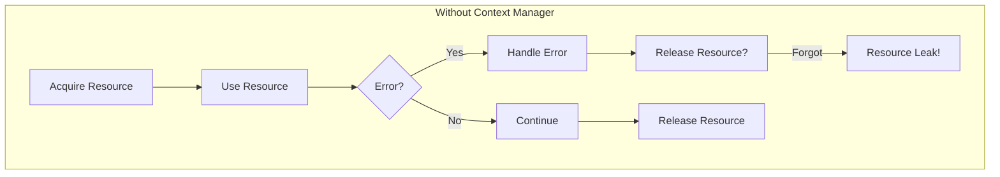
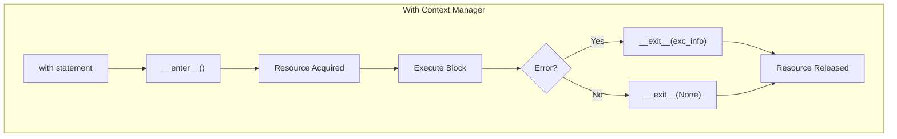
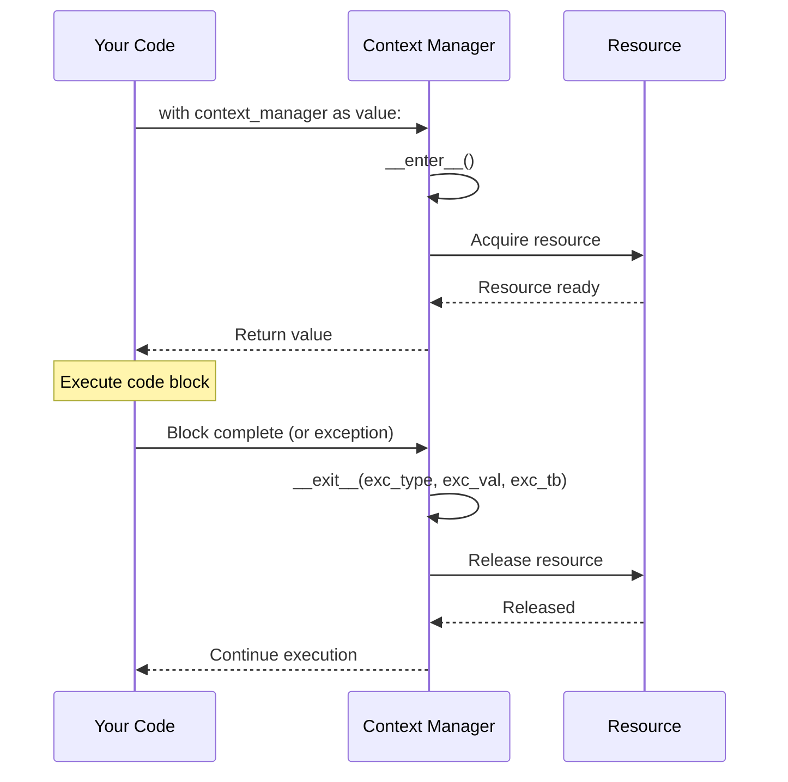
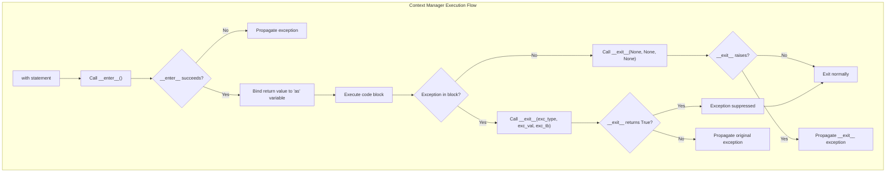

# How to Use Context Managers for Resource Management

Author: [nawazdhandala](https://www.github.com/nawazdhandala)

Tags: Python, Context Managers, Resource Management, with Statement, contextlib

Description: Learn how to build and use Python context managers for safe resource handling. This guide covers the with statement, contextlib utilities, and async context managers.

---

> Resources like files, network connections, database connections, and locks are expensive. They must be acquired, used, and released properly. Python's context managers provide a clean, reliable pattern for resource management that guarantees cleanup even when errors occur.

Context managers are one of Python's most powerful features for writing reliable, maintainable code. They encapsulate the setup and teardown logic for resources, ensuring proper cleanup regardless of how the code block exits.

---

## Understanding Context Managers

A context manager is any object that implements the `__enter__` and `__exit__` methods. The `with` statement uses these methods to set up and tear down resources automatically.

### The Problem Context Managers Solve

Without context managers, resource handling looks like this:

```python
# BAD: Manual resource management - error prone
file = open('data.txt', 'r')
try:
    content = file.read()
    process_data(content)
finally:
    file.close()  # Easy to forget, especially with multiple resources
```

With context managers:

```python
# GOOD: Context manager handles cleanup automatically
with open('data.txt', 'r') as file:
    content = file.read()
    process_data(content)
# File is automatically closed, even if process_data() raises an exception
```

### Resource Lifecycle with Context Managers





### How the with Statement Works



---

## Building Context Managers with Classes

The most explicit way to create a context manager is by implementing a class with `__enter__` and `__exit__` methods.

### Basic Class-Based Context Manager

```python
# context_managers/file_manager.py
"""
A simple context manager for file handling with logging.
"""

import logging

# Configure logging for demonstration
logging.basicConfig(level=logging.INFO)
logger = logging.getLogger(__name__)


class ManagedFile:
    """
    Context manager for file operations with automatic cleanup.
    
    This demonstrates the basic structure of a class-based context manager.
    """
    
    def __init__(self, filename: str, mode: str = 'r'):
        """
        Initialize the context manager with file parameters.
        
        Args:
            filename: Path to the file
            mode: File open mode ('r', 'w', 'a', etc.)
        """
        self.filename = filename
        self.mode = mode
        self.file = None
        logger.info(f"ManagedFile initialized for: {filename}")
    
    def __enter__(self):
        """
        Called when entering the 'with' block.
        
        Returns:
            The file object for use in the with block.
        """
        logger.info(f"Opening file: {self.filename}")
        self.file = open(self.filename, self.mode)
        return self.file  # This becomes the 'as' variable
    
    def __exit__(self, exc_type, exc_val, exc_tb):
        """
        Called when exiting the 'with' block.
        
        Args:
            exc_type: Exception type if an error occurred, None otherwise
            exc_val: Exception value if an error occurred, None otherwise
            exc_tb: Exception traceback if an error occurred, None otherwise
        
        Returns:
            False to propagate exceptions, True to suppress them
        """
        if self.file:
            logger.info(f"Closing file: {self.filename}")
            self.file.close()
        
        # Log any exceptions that occurred
        if exc_type is not None:
            logger.error(f"Exception in context: {exc_type.__name__}: {exc_val}")
        
        # Return False to propagate exceptions (do not suppress)
        return False


# Usage example
if __name__ == "__main__":
    # Basic usage
    with ManagedFile("example.txt", "w") as f:
        f.write("Hello, Context Managers!")
    
    # Reading the file
    with ManagedFile("example.txt", "r") as f:
        content = f.read()
        print(f"Content: {content}")
```

### Context Manager with State Management

```python
# context_managers/database_connection.py
"""
A context manager for database connections with transaction support.
"""

import logging
from typing import Optional, Any
from dataclasses import dataclass

logger = logging.getLogger(__name__)


@dataclass
class ConnectionConfig:
    """Database connection configuration."""
    host: str
    port: int
    database: str
    user: str
    password: str
    autocommit: bool = False


class DatabaseConnection:
    """
    Context manager for database connections with automatic transaction handling.
    
    Commits on successful exit, rolls back on exception.
    """
    
    def __init__(self, config: ConnectionConfig):
        """
        Initialize the database connection manager.
        
        Args:
            config: Database connection configuration
        """
        self.config = config
        self.connection = None
        self.cursor = None
        self._in_transaction = False
    
    def __enter__(self):
        """
        Establish database connection and begin transaction.
        
        Returns:
            Self for method chaining or cursor access
        """
        logger.info(f"Connecting to {self.config.host}:{self.config.port}")
        
        # Simulate database connection (replace with actual DB library)
        self.connection = self._create_connection()
        self.cursor = self.connection.cursor()
        
        if not self.config.autocommit:
            self._begin_transaction()
        
        return self
    
    def __exit__(self, exc_type, exc_val, exc_tb):
        """
        Close connection, committing or rolling back based on success.
        
        Args:
            exc_type: Exception type if error occurred
            exc_val: Exception value if error occurred
            exc_tb: Exception traceback if error occurred
        
        Returns:
            False to propagate exceptions
        """
        try:
            if exc_type is None and self._in_transaction:
                # No exception - commit the transaction
                logger.info("Committing transaction")
                self.connection.commit()
            elif self._in_transaction:
                # Exception occurred - rollback
                logger.warning(f"Rolling back due to: {exc_val}")
                self.connection.rollback()
        finally:
            # Always close cursor and connection
            if self.cursor:
                self.cursor.close()
            if self.connection:
                logger.info("Closing database connection")
                self.connection.close()
        
        # Do not suppress exceptions
        return False
    
    def _create_connection(self):
        """Create and return a database connection."""
        # This is a placeholder - replace with actual DB library
        # Example: psycopg2.connect(...) or mysql.connector.connect(...)
        class MockConnection:
            def cursor(self): return MockCursor()
            def commit(self): pass
            def rollback(self): pass
            def close(self): pass
        
        class MockCursor:
            def execute(self, query, params=None): pass
            def fetchall(self): return []
            def fetchone(self): return None
            def close(self): pass
        
        return MockConnection()
    
    def _begin_transaction(self):
        """Begin a new transaction."""
        self._in_transaction = True
        logger.info("Transaction started")
    
    def execute(self, query: str, params: Optional[tuple] = None) -> Any:
        """
        Execute a query within the transaction.
        
        Args:
            query: SQL query string
            params: Query parameters
        
        Returns:
            Query results
        """
        logger.debug(f"Executing: {query}")
        self.cursor.execute(query, params)
        return self.cursor
    
    def fetchall(self):
        """Fetch all results from the last query."""
        return self.cursor.fetchall()
    
    def fetchone(self):
        """Fetch one result from the last query."""
        return self.cursor.fetchone()


# Usage example
if __name__ == "__main__":
    config = ConnectionConfig(
        host="localhost",
        port=5432,
        database="myapp",
        user="postgres",
        password="secret"
    )
    
    # Transaction is automatically managed
    with DatabaseConnection(config) as db:
        db.execute("INSERT INTO users (name) VALUES (%s)", ("Alice",))
        db.execute("INSERT INTO users (name) VALUES (%s)", ("Bob",))
        # If no exception, commits automatically
    
    # If exception occurs, rolls back automatically
    try:
        with DatabaseConnection(config) as db:
            db.execute("INSERT INTO users (name) VALUES (%s)", ("Charlie",))
            raise ValueError("Something went wrong!")  # Triggers rollback
    except ValueError:
        print("Transaction was rolled back")
```

---

## Building Context Managers with contextlib

Python's `contextlib` module provides utilities that make creating context managers easier and more Pythonic.

### Using @contextmanager Decorator

The `@contextmanager` decorator transforms a generator function into a context manager:

```python
# context_managers/contextlib_examples.py
"""
Context managers using the contextlib module.
"""

import time
import logging
from contextlib import contextmanager
from typing import Generator, Optional

logger = logging.getLogger(__name__)


@contextmanager
def timer(name: str) -> Generator[None, None, None]:
    """
    Context manager that measures and logs execution time.
    
    Args:
        name: A descriptive name for the timed operation
    
    Yields:
        Nothing - this is a timing-only context manager
    
    Example:
        with timer("data processing"):
            process_large_dataset()
    """
    start_time = time.perf_counter()
    logger.info(f"Starting: {name}")
    
    try:
        yield  # Code block executes here
    finally:
        # This always runs, even if an exception occurred
        elapsed = time.perf_counter() - start_time
        logger.info(f"Completed: {name} in {elapsed:.4f} seconds")


@contextmanager
def temporary_attribute(obj: object, attr: str, value) -> Generator[None, None, None]:
    """
    Temporarily set an attribute on an object.
    
    Useful for testing or temporarily modifying configuration.
    
    Args:
        obj: The object to modify
        attr: The attribute name to set
        value: The temporary value
    
    Example:
        with temporary_attribute(config, 'debug', True):
            run_debug_operation()
        # config.debug is restored to original value
    """
    # Check if attribute exists
    has_attr = hasattr(obj, attr)
    original_value = getattr(obj, attr, None) if has_attr else None
    
    try:
        # Set temporary value
        setattr(obj, attr, value)
        yield
    finally:
        # Restore original state
        if has_attr:
            setattr(obj, attr, original_value)
        else:
            delattr(obj, attr)


@contextmanager
def suppress_logging(level: int = logging.CRITICAL) -> Generator[None, None, None]:
    """
    Temporarily suppress logging below the specified level.
    
    Args:
        level: Minimum logging level to show (default: CRITICAL only)
    
    Example:
        with suppress_logging():
            noisy_function()  # Logs are suppressed
    """
    root_logger = logging.getLogger()
    original_level = root_logger.level
    
    try:
        root_logger.setLevel(level)
        yield
    finally:
        root_logger.setLevel(original_level)


@contextmanager
def change_directory(path: str) -> Generator[str, None, None]:
    """
    Temporarily change the current working directory.
    
    Args:
        path: The directory to change to
    
    Yields:
        The original directory path
    
    Example:
        with change_directory('/tmp'):
            create_temp_files()
        # Back to original directory
    """
    import os
    
    original_dir = os.getcwd()
    
    try:
        os.chdir(path)
        logger.info(f"Changed directory to: {path}")
        yield original_dir
    finally:
        os.chdir(original_dir)
        logger.info(f"Restored directory to: {original_dir}")


@contextmanager
def error_handler(
    default_value=None,
    exceptions: tuple = (Exception,),
    log_errors: bool = True
) -> Generator:
    """
    Context manager that catches and handles exceptions gracefully.
    
    Args:
        default_value: Value to yield if an exception occurs
        exceptions: Tuple of exception types to catch
        log_errors: Whether to log caught exceptions
    
    Yields:
        A result holder that can be set in the context
    
    Example:
        with error_handler(default_value=[]) as result:
            result.value = risky_operation()
        # result.value is [] if exception occurred
    """
    class ResultHolder:
        def __init__(self):
            self.value = default_value
            self.exception = None
    
    holder = ResultHolder()
    
    try:
        yield holder
    except exceptions as e:
        holder.exception = e
        holder.value = default_value
        if log_errors:
            logger.error(f"Caught exception: {type(e).__name__}: {e}")


# Usage examples
if __name__ == "__main__":
    logging.basicConfig(level=logging.INFO)
    
    # Timer example
    with timer("sleep operation"):
        time.sleep(0.5)
    
    # Temporary attribute example
    class Config:
        debug = False
    
    config = Config()
    print(f"Before: debug = {config.debug}")
    
    with temporary_attribute(config, 'debug', True):
        print(f"Inside: debug = {config.debug}")
    
    print(f"After: debug = {config.debug}")
    
    # Error handler example
    with error_handler(default_value="fallback") as result:
        result.value = "success"
    print(f"Result: {result.value}")
    
    with error_handler(default_value="fallback") as result:
        raise ValueError("Test error")
    print(f"Result after error: {result.value}")
```

### Using contextlib Utilities

```python
# context_managers/contextlib_utilities.py
"""
Advanced contextlib utilities for complex scenarios.
"""

import logging
from contextlib import (
    contextmanager,
    ExitStack,
    closing,
    suppress,
    redirect_stdout,
    redirect_stderr,
    nullcontext
)
from io import StringIO
from typing import List, Any

logger = logging.getLogger(__name__)


class ResourcePool:
    """
    Manages a pool of resources using ExitStack.
    
    ExitStack allows you to manage a dynamic number of context managers.
    """
    
    def __init__(self):
        self.resources: List[Any] = []
        self._stack = None
    
    def __enter__(self):
        """Enter the resource pool context."""
        self._stack = ExitStack()
        self._stack.__enter__()
        return self
    
    def __exit__(self, *exc_info):
        """Exit and clean up all resources."""
        return self._stack.__exit__(*exc_info)
    
    def acquire(self, resource_cm):
        """
        Acquire a resource and add it to the pool.
        
        Args:
            resource_cm: A context manager for the resource
        
        Returns:
            The resource from the context manager
        """
        resource = self._stack.enter_context(resource_cm)
        self.resources.append(resource)
        return resource
    
    def callback(self, func, *args, **kwargs):
        """
        Register a cleanup callback.
        
        Args:
            func: Function to call on cleanup
            *args: Arguments for the function
            **kwargs: Keyword arguments for the function
        """
        self._stack.callback(func, *args, **kwargs)


def demonstrate_exitstack():
    """
    Demonstrate ExitStack for managing multiple context managers.
    """
    # ExitStack is useful when you don't know how many
    # resources you need to manage at compile time
    
    filenames = ['file1.txt', 'file2.txt', 'file3.txt']
    
    with ExitStack() as stack:
        # Dynamically enter multiple context managers
        files = [
            stack.enter_context(open(f, 'w'))
            for f in filenames
            if should_process(f)  # Dynamic decision
        ]
        
        # All files will be closed when leaving the with block
        for i, f in enumerate(files):
            f.write(f"Content for file {i}")


def should_process(filename: str) -> bool:
    """Check if a file should be processed."""
    return True  # Simplified example


def demonstrate_closing():
    """
    Demonstrate the closing() context manager.
    
    closing() wraps objects that have a close() method but
    don't implement the context manager protocol.
    """
    
    class LegacyResource:
        """A resource that has close() but no context manager support."""
        
        def __init__(self, name: str):
            self.name = name
            self.is_open = True
            print(f"Opened: {name}")
        
        def do_work(self):
            if not self.is_open:
                raise RuntimeError("Resource is closed!")
            print(f"Working with: {self.name}")
        
        def close(self):
            self.is_open = False
            print(f"Closed: {self.name}")
    
    # Without closing(), you need manual cleanup
    # resource = LegacyResource("manual")
    # try:
    #     resource.do_work()
    # finally:
    #     resource.close()
    
    # With closing(), cleanup is automatic
    with closing(LegacyResource("auto")) as resource:
        resource.do_work()
    # resource.close() called automatically


def demonstrate_suppress():
    """
    Demonstrate the suppress() context manager.
    
    suppress() silently ignores specified exceptions.
    """
    import os
    
    # Without suppress
    # try:
    #     os.remove("nonexistent_file.txt")
    # except FileNotFoundError:
    #     pass  # Ignore if file doesn't exist
    
    # With suppress - cleaner
    with suppress(FileNotFoundError):
        os.remove("nonexistent_file.txt")
    # No exception raised, even if file doesn't exist
    
    # You can suppress multiple exception types
    with suppress(FileNotFoundError, PermissionError):
        os.remove("protected_file.txt")


def demonstrate_redirect():
    """
    Demonstrate redirect_stdout and redirect_stderr.
    
    Useful for capturing output from functions you don't control.
    """
    
    def noisy_function():
        """A function that prints to stdout."""
        print("This is stdout output")
        print("More stdout output")
    
    # Capture stdout to a string
    captured = StringIO()
    
    with redirect_stdout(captured):
        noisy_function()
    
    output = captured.getvalue()
    print(f"Captured: {repr(output)}")
    
    # You can also redirect to a file
    with open("output.log", "w") as f:
        with redirect_stdout(f):
            noisy_function()
    # stdout output is now in output.log


def demonstrate_nullcontext():
    """
    Demonstrate nullcontext for optional context managers.
    
    nullcontext is useful when you need a context manager
    that does nothing, for conditional logic.
    """
    
    def process_data(data: str, use_lock: bool = False):
        """Process data with optional locking."""
        import threading
        
        lock = threading.Lock()
        
        # Use lock or nullcontext based on condition
        cm = lock if use_lock else nullcontext()
        
        with cm:
            # Process data
            return data.upper()
    
    # Works the same with or without lock
    result1 = process_data("hello", use_lock=True)
    result2 = process_data("world", use_lock=False)
    print(f"Results: {result1}, {result2}")


# Usage examples
if __name__ == "__main__":
    logging.basicConfig(level=logging.INFO)
    
    print("=== ExitStack Demo ===")
    # demonstrate_exitstack()  # Requires actual files
    
    print("\n=== Closing Demo ===")
    demonstrate_closing()
    
    print("\n=== Suppress Demo ===")
    demonstrate_suppress()
    
    print("\n=== Redirect Demo ===")
    demonstrate_redirect()
    
    print("\n=== Nullcontext Demo ===")
    demonstrate_nullcontext()
```

---

## Async Context Managers

Python 3.5+ supports async context managers for use with `async/await`.

### Basic Async Context Manager

```python
# context_managers/async_examples.py
"""
Async context managers for asynchronous resource management.
"""

import asyncio
import logging
from contextlib import asynccontextmanager
from typing import AsyncGenerator

logger = logging.getLogger(__name__)


class AsyncDatabaseConnection:
    """
    Async context manager for database connections.
    
    Uses __aenter__ and __aexit__ for async setup and teardown.
    """
    
    def __init__(self, connection_string: str):
        """
        Initialize the async database connection manager.
        
        Args:
            connection_string: Database connection URL
        """
        self.connection_string = connection_string
        self.connection = None
    
    async def __aenter__(self):
        """
        Async enter - establish connection.
        
        Returns:
            Self for query execution
        """
        logger.info(f"Connecting to: {self.connection_string}")
        
        # Simulate async connection (replace with real async DB library)
        await asyncio.sleep(0.1)  # Simulated connection time
        self.connection = {"connected": True, "url": self.connection_string}
        
        logger.info("Connection established")
        return self
    
    async def __aexit__(self, exc_type, exc_val, exc_tb):
        """
        Async exit - close connection.
        
        Args:
            exc_type: Exception type if error occurred
            exc_val: Exception value if error occurred
            exc_tb: Exception traceback if error occurred
        
        Returns:
            False to propagate exceptions
        """
        logger.info("Closing connection")
        
        # Simulate async cleanup
        await asyncio.sleep(0.05)
        self.connection = None
        
        if exc_type:
            logger.error(f"Connection closed due to error: {exc_val}")
        
        return False
    
    async def execute(self, query: str):
        """
        Execute an async query.
        
        Args:
            query: SQL query string
        
        Returns:
            Query results
        """
        if not self.connection:
            raise RuntimeError("Not connected")
        
        logger.info(f"Executing: {query}")
        await asyncio.sleep(0.05)  # Simulated query time
        return [{"id": 1, "name": "Result"}]


@asynccontextmanager
async def async_timer(name: str) -> AsyncGenerator[None, None]:
    """
    Async context manager for timing async operations.
    
    Args:
        name: Name for the timed operation
    
    Yields:
        Nothing
    """
    import time
    
    start = time.perf_counter()
    logger.info(f"Starting async: {name}")
    
    try:
        yield
    finally:
        elapsed = time.perf_counter() - start
        logger.info(f"Completed async: {name} in {elapsed:.4f}s")


@asynccontextmanager
async def async_semaphore_pool(max_concurrent: int) -> AsyncGenerator[asyncio.Semaphore, None]:
    """
    Async context manager for concurrency limiting.
    
    Args:
        max_concurrent: Maximum concurrent operations allowed
    
    Yields:
        A semaphore for limiting concurrency
    """
    semaphore = asyncio.Semaphore(max_concurrent)
    logger.info(f"Created semaphore pool with {max_concurrent} slots")
    
    try:
        yield semaphore
    finally:
        # Log final state
        logger.info("Semaphore pool released")


@asynccontextmanager
async def async_http_session():
    """
    Async context manager for HTTP session management.
    
    Creates and properly closes an aiohttp session.
    """
    # In real code, use: import aiohttp
    # session = aiohttp.ClientSession()
    
    # Simulated session for demonstration
    class MockSession:
        async def get(self, url):
            await asyncio.sleep(0.1)
            return {"status": 200, "url": url}
        
        async def close(self):
            await asyncio.sleep(0.05)
    
    session = MockSession()
    logger.info("HTTP session created")
    
    try:
        yield session
    finally:
        await session.close()
        logger.info("HTTP session closed")


async def main():
    """Demonstrate async context managers."""
    
    # Async database connection
    async with AsyncDatabaseConnection("postgresql://localhost/mydb") as db:
        results = await db.execute("SELECT * FROM users")
        print(f"Query results: {results}")
    
    # Async timer
    async with async_timer("async operation"):
        await asyncio.sleep(0.5)
    
    # Async HTTP session
    async with async_http_session() as session:
        response = await session.get("https://api.example.com/data")
        print(f"Response: {response}")
    
    # Concurrency limiting
    async with async_semaphore_pool(3) as semaphore:
        async def limited_task(task_id: int):
            async with semaphore:
                print(f"Task {task_id} starting")
                await asyncio.sleep(0.2)
                print(f"Task {task_id} complete")
        
        # Run multiple tasks with limited concurrency
        tasks = [limited_task(i) for i in range(10)]
        await asyncio.gather(*tasks)


if __name__ == "__main__":
    logging.basicConfig(level=logging.INFO)
    asyncio.run(main())
```

---

## Real-World Examples

### Connection Pool Manager

```python
# context_managers/connection_pool.py
"""
A thread-safe connection pool using context managers.
"""

import threading
import queue
import time
import logging
from contextlib import contextmanager
from typing import Any, Callable, Optional
from dataclasses import dataclass

logger = logging.getLogger(__name__)


@dataclass
class PoolConfig:
    """Connection pool configuration."""
    min_connections: int = 2
    max_connections: int = 10
    connection_timeout: float = 30.0
    idle_timeout: float = 300.0
    validation_interval: float = 60.0


class ConnectionPool:
    """
    Thread-safe connection pool with context manager support.
    
    Manages a pool of reusable connections, providing them to callers
    via a context manager interface.
    """
    
    def __init__(
        self,
        connection_factory: Callable[[], Any],
        config: Optional[PoolConfig] = None
    ):
        """
        Initialize the connection pool.
        
        Args:
            connection_factory: Callable that creates new connections
            config: Pool configuration options
        """
        self.connection_factory = connection_factory
        self.config = config or PoolConfig()
        
        self._pool: queue.Queue = queue.Queue(maxsize=self.config.max_connections)
        self._size = 0
        self._lock = threading.Lock()
        self._closed = False
        
        # Pre-populate pool with minimum connections
        self._initialize_pool()
    
    def _initialize_pool(self):
        """Create minimum number of connections."""
        for _ in range(self.config.min_connections):
            self._add_connection()
    
    def _add_connection(self) -> bool:
        """
        Add a new connection to the pool.
        
        Returns:
            True if connection was added, False if pool is full
        """
        with self._lock:
            if self._size >= self.config.max_connections:
                return False
            
            try:
                conn = self.connection_factory()
                wrapper = _ConnectionWrapper(conn, time.time())
                self._pool.put_nowait(wrapper)
                self._size += 1
                logger.info(f"Added connection. Pool size: {self._size}")
                return True
            except Exception as e:
                logger.error(f"Failed to create connection: {e}")
                return False
    
    @contextmanager
    def acquire(self):
        """
        Acquire a connection from the pool.
        
        Yields:
            A connection from the pool
        
        Raises:
            RuntimeError: If pool is closed
            queue.Empty: If no connection available within timeout
        """
        if self._closed:
            raise RuntimeError("Connection pool is closed")
        
        # Try to get existing connection
        try:
            wrapper = self._pool.get(timeout=self.config.connection_timeout)
        except queue.Empty:
            # Pool exhausted - try to create new connection
            if self._add_connection():
                wrapper = self._pool.get(timeout=1.0)
            else:
                raise queue.Empty("No connections available")
        
        logger.debug("Connection acquired from pool")
        
        try:
            # Validate connection if stale
            if self._is_stale(wrapper):
                wrapper.connection = self._refresh_connection(wrapper.connection)
                wrapper.last_used = time.time()
            
            yield wrapper.connection
            
        except Exception as e:
            # Connection might be bad - replace it
            logger.warning(f"Connection error: {e}")
            try:
                wrapper.connection = self.connection_factory()
            except Exception:
                self._size -= 1
                raise
        finally:
            # Return connection to pool
            if not self._closed:
                wrapper.last_used = time.time()
                try:
                    self._pool.put_nowait(wrapper)
                    logger.debug("Connection returned to pool")
                except queue.Full:
                    # Pool overflow - close extra connection
                    self._close_connection(wrapper.connection)
                    self._size -= 1
    
    def _is_stale(self, wrapper: '_ConnectionWrapper') -> bool:
        """Check if connection needs validation."""
        return (time.time() - wrapper.last_used) > self.config.validation_interval
    
    def _refresh_connection(self, conn: Any) -> Any:
        """Refresh a stale connection."""
        try:
            # Try to validate existing connection
            if hasattr(conn, 'ping'):
                conn.ping()
                return conn
            elif hasattr(conn, 'is_connected') and conn.is_connected():
                return conn
        except Exception:
            pass
        
        # Connection invalid - create new one
        self._close_connection(conn)
        return self.connection_factory()
    
    def _close_connection(self, conn: Any):
        """Safely close a connection."""
        try:
            if hasattr(conn, 'close'):
                conn.close()
        except Exception as e:
            logger.warning(f"Error closing connection: {e}")
    
    def close(self):
        """Close all connections in the pool."""
        self._closed = True
        
        while not self._pool.empty():
            try:
                wrapper = self._pool.get_nowait()
                self._close_connection(wrapper.connection)
            except queue.Empty:
                break
        
        self._size = 0
        logger.info("Connection pool closed")
    
    def __enter__(self):
        """Enter pool context."""
        return self
    
    def __exit__(self, *exc_info):
        """Exit pool context - close all connections."""
        self.close()
        return False
    
    @property
    def size(self) -> int:
        """Current number of connections in pool."""
        return self._size
    
    @property
    def available(self) -> int:
        """Number of available connections."""
        return self._pool.qsize()


class _ConnectionWrapper:
    """Wrapper to track connection metadata."""
    
    def __init__(self, connection: Any, last_used: float):
        self.connection = connection
        self.last_used = last_used


# Usage example
if __name__ == "__main__":
    logging.basicConfig(level=logging.DEBUG)
    
    # Mock connection factory
    def create_connection():
        return {"id": id({}), "connected": True}
    
    # Create pool with context manager
    with ConnectionPool(create_connection, PoolConfig(min_connections=2)) as pool:
        print(f"Pool size: {pool.size}")
        
        # Acquire connections using context manager
        with pool.acquire() as conn:
            print(f"Using connection: {conn['id']}")
        
        # Connection automatically returned to pool
        print(f"Available: {pool.available}")
```

### Lock Manager with Timeout

```python
# context_managers/lock_manager.py
"""
A distributed-lock-like context manager with timeout and retry support.
"""

import time
import threading
import logging
from contextlib import contextmanager
from typing import Optional
from dataclasses import dataclass

logger = logging.getLogger(__name__)


@dataclass
class LockConfig:
    """Lock configuration."""
    acquire_timeout: float = 10.0
    lock_timeout: float = 60.0
    retry_interval: float = 0.1


class TimeoutLock:
    """
    A lock with timeout support and automatic expiration.
    
    Useful for preventing deadlocks and implementing lease-based locking.
    """
    
    def __init__(self, name: str, config: Optional[LockConfig] = None):
        """
        Initialize the timeout lock.
        
        Args:
            name: Unique name for this lock
            config: Lock configuration
        """
        self.name = name
        self.config = config or LockConfig()
        
        self._lock = threading.Lock()
        self._owner: Optional[int] = None
        self._acquired_at: Optional[float] = None
        self._expires_at: Optional[float] = None
    
    def _is_expired(self) -> bool:
        """Check if current lock has expired."""
        if self._expires_at is None:
            return True
        return time.time() > self._expires_at
    
    def _try_acquire(self, timeout: float) -> bool:
        """
        Attempt to acquire the lock.
        
        Args:
            timeout: How long this lock should be held
        
        Returns:
            True if lock was acquired
        """
        current_thread = threading.current_thread().ident
        
        with self._lock:
            # Check if lock is available or expired
            if self._owner is None or self._is_expired():
                self._owner = current_thread
                self._acquired_at = time.time()
                self._expires_at = time.time() + timeout
                logger.info(f"Lock '{self.name}' acquired by thread {current_thread}")
                return True
            
            # Check for re-entrant acquisition
            if self._owner == current_thread:
                logger.warning(f"Lock '{self.name}' already held by this thread")
                return True
        
        return False
    
    def _release(self) -> bool:
        """
        Release the lock.
        
        Returns:
            True if lock was released
        """
        current_thread = threading.current_thread().ident
        
        with self._lock:
            if self._owner != current_thread:
                logger.warning(f"Thread {current_thread} cannot release lock owned by {self._owner}")
                return False
            
            self._owner = None
            self._acquired_at = None
            self._expires_at = None
            logger.info(f"Lock '{self.name}' released by thread {current_thread}")
            return True
    
    @contextmanager
    def acquire(self, lock_timeout: Optional[float] = None):
        """
        Acquire the lock with context manager support.
        
        Args:
            lock_timeout: How long the lock should be held (overrides config)
        
        Yields:
            Lock metadata including time remaining
        
        Raises:
            TimeoutError: If lock cannot be acquired within timeout
        """
        timeout = lock_timeout or self.config.lock_timeout
        deadline = time.time() + self.config.acquire_timeout
        acquired = False
        
        try:
            # Try to acquire with retries
            while time.time() < deadline:
                if self._try_acquire(timeout):
                    acquired = True
                    break
                time.sleep(self.config.retry_interval)
            
            if not acquired:
                raise TimeoutError(
                    f"Could not acquire lock '{self.name}' within "
                    f"{self.config.acquire_timeout}s"
                )
            
            # Provide lock metadata to caller
            yield LockContext(
                name=self.name,
                acquired_at=self._acquired_at,
                expires_at=self._expires_at
            )
            
        finally:
            if acquired:
                self._release()


@dataclass
class LockContext:
    """Metadata about the acquired lock."""
    name: str
    acquired_at: float
    expires_at: float
    
    @property
    def time_remaining(self) -> float:
        """Time remaining before lock expires."""
        return max(0, self.expires_at - time.time())
    
    @property
    def is_expired(self) -> bool:
        """Whether the lock has expired."""
        return time.time() > self.expires_at


# Usage example
if __name__ == "__main__":
    logging.basicConfig(level=logging.INFO)
    
    lock = TimeoutLock("resource-1", LockConfig(
        acquire_timeout=5.0,
        lock_timeout=30.0
    ))
    
    # Basic usage
    with lock.acquire() as ctx:
        print(f"Lock acquired: {ctx.name}")
        print(f"Time remaining: {ctx.time_remaining:.1f}s")
        
        # Do work...
        time.sleep(1)
        
        print(f"Time remaining: {ctx.time_remaining:.1f}s")
    
    # Lock is automatically released
    print("Lock released")
```

---

## Best Practices

### 1. Prefer try-with-resources Style

```python
# GOOD: Using with statement
with open('file.txt') as f:
    data = f.read()

# BAD: Manual cleanup (error prone)
f = open('file.txt')
try:
    data = f.read()
finally:
    f.close()
```

### 2. Use ExitStack for Dynamic Resources

```python
from contextlib import ExitStack

def process_files(filenames):
    """Process multiple files dynamically."""
    with ExitStack() as stack:
        files = [stack.enter_context(open(f)) for f in filenames]
        
        for f in files:
            process(f)
        # All files closed automatically
```

### 3. Don't Suppress Exceptions Unless Intentional

```python
# BAD: Silently suppressing all exceptions
class BadContextManager:
    def __exit__(self, *exc_info):
        return True  # Suppresses ALL exceptions!

# GOOD: Only handle specific cases
class GoodContextManager:
    def __exit__(self, exc_type, exc_val, exc_tb):
        if exc_type is None:
            return False  # No exception - normal exit
        
        if exc_type is SpecificError:
            log_and_handle(exc_val)
            return True  # Suppress only this error
        
        return False  # Propagate other exceptions
```

### 4. Document What __enter__ Returns

```python
@contextmanager
def get_resource():
    """
    Acquire and manage a resource.
    
    Yields:
        Resource: The acquired resource object
        
    Note:
        Resource is automatically released when exiting context.
    """
    resource = acquire_resource()
    try:
        yield resource
    finally:
        resource.release()
```

### 5. Handle Cleanup Errors Gracefully

```python
@contextmanager
def robust_resource():
    """Context manager with robust error handling."""
    resource = acquire()
    
    try:
        yield resource
    finally:
        try:
            resource.cleanup()
        except Exception as e:
            # Log but don't mask the original exception
            logger.exception("Cleanup failed")
```

---

## Context Manager Flow Diagram



---

## Summary

Context managers are essential for reliable resource management in Python. They ensure cleanup happens regardless of how code exits, preventing resource leaks and making code more readable.

Key takeaways:

- **Use the `with` statement** for any resource that needs cleanup
- **Class-based context managers** provide full control with `__enter__` and `__exit__`
- **`@contextmanager` decorator** creates simple context managers from generator functions
- **`ExitStack`** manages dynamic numbers of context managers
- **Async context managers** (`async with`) handle asynchronous resources
- **Never suppress exceptions** unless you have a specific reason
- **Test cleanup logic** to ensure resources are always released

The context manager protocol is one of Python's most elegant features. Use it liberally to write more robust, maintainable code.

---

*Building reliable Python applications? [OneUptime](https://oneuptime.com) helps you monitor resource utilization, track connection pool health, and alert on resource exhaustion before your users notice.*
