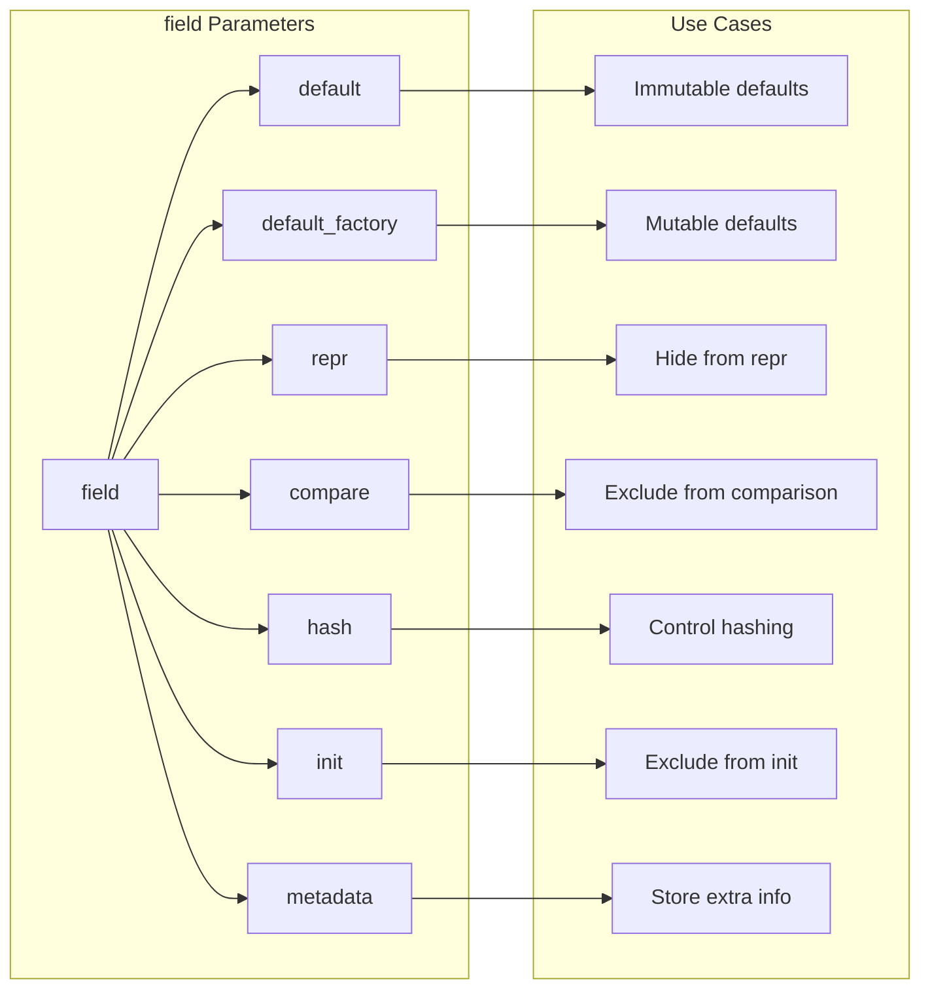
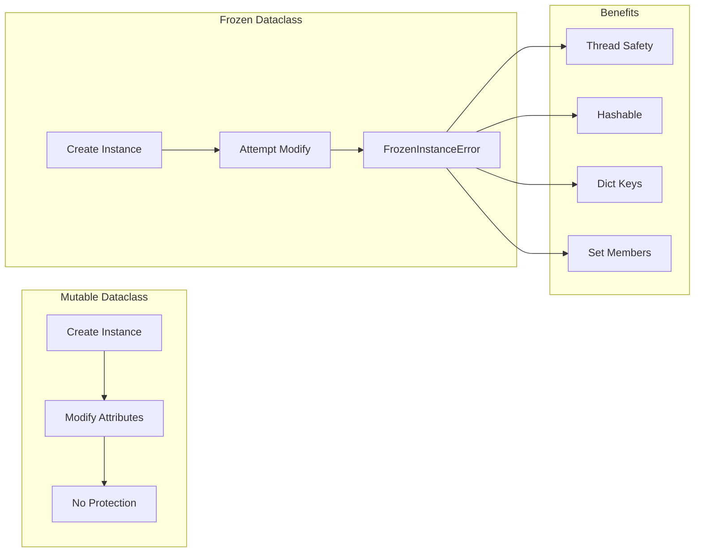
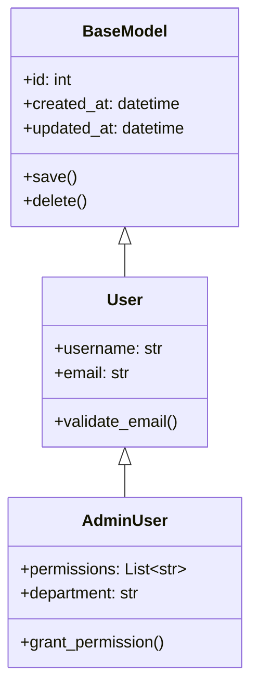
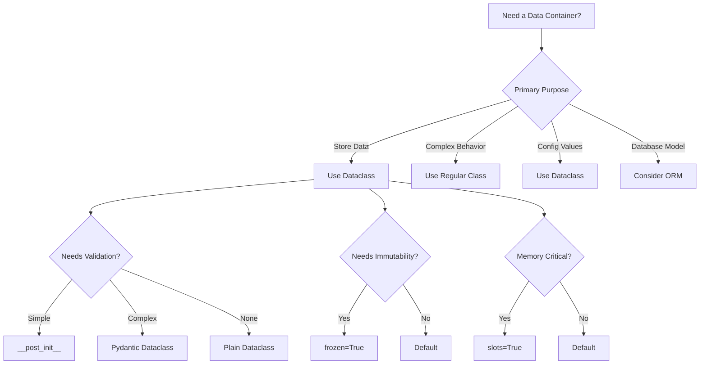

# How to Use Dataclasses for Clean Data Models

Author: [nawazdhandala](https://www.github.com/nawazdhandala)

Tags: Python, Dataclasses, Data Models, Type Hints, OOP, Clean Code

Description: Learn how to use Python dataclasses to create clean, maintainable data models. This guide covers dataclass basics, field customization, inheritance, immutability, and integration with validation libraries.

---

> Python dataclasses eliminate boilerplate code for data-centric classes. They automatically generate `__init__`, `__repr__`, `__eq__`, and other special methods, letting you focus on what your data represents rather than how to store it.

Introduced in Python 3.7 (PEP 557), dataclasses provide a decorator-based approach to defining classes that primarily store data. They bring the conciseness of named tuples with the flexibility of regular classes.

---

## Why Dataclasses Matter

Before dataclasses, creating a simple data container required writing repetitive code:

```python
# Traditional class - lots of boilerplate
class User:
    def __init__(self, name: str, email: str, age: int, active: bool = True):
        self.name = name
        self.email = email
        self.age = age
        self.active = active
    
    def __repr__(self):
        return f"User(name={self.name!r}, email={self.email!r}, age={self.age}, active={self.active})"
    
    def __eq__(self, other):
        if not isinstance(other, User):
            return NotImplemented
        return (self.name == other.name and 
                self.email == other.email and 
                self.age == other.age and 
                self.active == other.active)
    
    def __hash__(self):
        return hash((self.name, self.email, self.age, self.active))
```

With dataclasses, the same functionality requires just a few lines:

```python
# Dataclass - clean and concise
from dataclasses import dataclass

@dataclass
class User:
    name: str
    email: str
    age: int
    active: bool = True
```

The decorator automatically generates all the special methods, reducing code by 80% while maintaining full functionality.

---

## Understanding Dataclass Architecture

```mermaid
flowchart TB
    subgraph Decorator Processing
        A[Class Definition] --> B[@dataclass decorator]
        B --> C[Field Extraction]
        C --> D[Type Hint Analysis]
        D --> E[Default Value Processing]
    end
    
    subgraph Generated Methods
        E --> F[__init__]
        E --> G[__repr__]
        E --> H[__eq__]
        E --> I[Optional Methods]
        I --> I1[__hash__]
        I --> I2[__lt__, __gt__]
        I --> I3[__post_init__]
    end
    
    subgraph Final Class
        F --> J[Ready to Use]
        G --> J
        H --> J
        I --> J
    end
```

---

## Getting Started with Dataclasses

### Basic Dataclass Definition

Create your first dataclass with type annotations:

```python
# models/user.py
from dataclasses import dataclass
from datetime import datetime

@dataclass
class User:
    """
    User data model with automatic method generation.
    
    Attributes:
        id: Unique identifier for the user
        username: User's login name
        email: User's email address
        created_at: Timestamp when user was created
        is_verified: Whether user email is verified
    """
    id: int
    username: str
    email: str
    created_at: datetime
    is_verified: bool = False  # Default value


# Usage examples
user = User(
    id=1,
    username="johndoe",
    email="john@example.com",
    created_at=datetime.now()
)

# Automatic __repr__ output
print(user)
# Output: User(id=1, username='johndoe', email='john@example.com', 
#         created_at=datetime.datetime(...), is_verified=False)

# Automatic __eq__ comparison
user2 = User(
    id=1,
    username="johndoe",
    email="john@example.com",
    created_at=user.created_at
)
print(user == user2)  # True
```

### Understanding Field Order

Fields without defaults must come before fields with defaults:

```python
from dataclasses import dataclass
from typing import Optional
from datetime import datetime

@dataclass
class Product:
    """
    Product model demonstrating field ordering.
    
    Required fields (no defaults) come first,
    followed by optional fields (with defaults).
    """
    # Required fields - must be provided
    sku: str
    name: str
    price: float
    
    # Optional fields - have default values
    description: str = ""
    quantity: int = 0
    category: Optional[str] = None
    created_at: datetime = None  # Will be set in __post_init__
    
    def __post_init__(self):
        """
        Called after __init__ completes.
        Perfect for derived values or validation.
        """
        if self.created_at is None:
            self.created_at = datetime.now()


# Create with required fields only
product = Product(
    sku="PROD-001",
    name="Python Book",
    price=29.99
)

# Create with all fields
product_full = Product(
    sku="PROD-002",
    name="Data Science Kit",
    price=99.99,
    description="Complete learning kit",
    quantity=50,
    category="Education"
)
```

---

## Field Customization with field()

The `field()` function provides fine-grained control over individual fields:



### Using field() for Complex Defaults

```python
from dataclasses import dataclass, field
from typing import List, Dict, Optional
from datetime import datetime
import uuid

@dataclass
class Order:
    """
    Order model demonstrating field() usage.
    
    Uses field() for:
    - Mutable default values (lists, dicts)
    - Computed default values (UUID, timestamp)
    - Field visibility control
    """
    # Required fields
    customer_id: int
    
    # Auto-generated ID using default_factory
    id: str = field(default_factory=lambda: str(uuid.uuid4()))
    
    # Mutable default - must use default_factory
    items: List[Dict] = field(default_factory=list)
    
    # Auto-generated timestamp
    created_at: datetime = field(default_factory=datetime.now)
    
    # Internal field - excluded from repr
    _internal_notes: str = field(default="", repr=False)
    
    # Cached calculation - excluded from comparison
    _total_cache: Optional[float] = field(
        default=None, 
        repr=False, 
        compare=False
    )
    
    # Metadata for validation or serialization
    status: str = field(
        default="pending",
        metadata={
            "allowed_values": ["pending", "processing", "shipped", "delivered"],
            "description": "Current order status"
        }
    )
    
    def add_item(self, product_id: int, quantity: int, price: float):
        """Add an item to the order."""
        self.items.append({
            "product_id": product_id,
            "quantity": quantity,
            "price": price
        })
        self._total_cache = None  # Invalidate cache
    
    @property
    def total(self) -> float:
        """Calculate order total with caching."""
        if self._total_cache is None:
            self._total_cache = sum(
                item["quantity"] * item["price"] 
                for item in self.items
            )
        return self._total_cache


# Create order
order = Order(customer_id=123)
order.add_item(product_id=1, quantity=2, price=29.99)
order.add_item(product_id=2, quantity=1, price=49.99)

print(order)
# Output shows customer_id, id, items, created_at, status
# But NOT _internal_notes or _total_cache

print(f"Order total: ${order.total:.2f}")
# Output: Order total: $109.97
```

### Field Metadata for Validation

```python
from dataclasses import dataclass, field, fields
from typing import Any, Dict

@dataclass
class ConfigItem:
    """
    Configuration item with validation metadata.
    
    Metadata stores validation rules that can be
    processed by a separate validation layer.
    """
    name: str = field(
        metadata={
            "min_length": 1,
            "max_length": 100,
            "pattern": r"^[a-zA-Z_][a-zA-Z0-9_]*$"
        }
    )
    
    value: Any = field(
        metadata={
            "required": True
        }
    )
    
    priority: int = field(
        default=0,
        metadata={
            "min": 0,
            "max": 100,
            "description": "Priority level (0-100)"
        }
    )
    
    enabled: bool = field(
        default=True,
        metadata={
            "description": "Whether this config is active"
        }
    )


def validate_config(config: ConfigItem) -> Dict[str, str]:
    """
    Validate a ConfigItem using its field metadata.
    
    Returns dict of field_name -> error_message for any violations.
    """
    errors = {}
    
    for f in fields(config):
        value = getattr(config, f.name)
        metadata = f.metadata
        
        # Check min_length
        if "min_length" in metadata and len(str(value)) < metadata["min_length"]:
            errors[f.name] = f"Must be at least {metadata['min_length']} characters"
        
        # Check max_length
        if "max_length" in metadata and len(str(value)) > metadata["max_length"]:
            errors[f.name] = f"Must be at most {metadata['max_length']} characters"
        
        # Check min/max for numbers
        if "min" in metadata and value < metadata["min"]:
            errors[f.name] = f"Must be at least {metadata['min']}"
        
        if "max" in metadata and value > metadata["max"]:
            errors[f.name] = f"Must be at most {metadata['max']}"
    
    return errors


# Usage
config = ConfigItem(name="max_connections", value=100, priority=150)
errors = validate_config(config)
print(errors)  # {'priority': 'Must be at most 100'}
```

---

## Post-Initialization Processing

The `__post_init__` method runs after `__init__` completes, perfect for validation and derived values:

```python
from dataclasses import dataclass, field
from typing import Optional
import re
from datetime import date

@dataclass
class Employee:
    """
    Employee model with post-initialization validation.
    
    Uses __post_init__ to:
    - Validate email format
    - Calculate derived values
    - Normalize input data
    """
    first_name: str
    last_name: str
    email: str
    hire_date: date
    salary: float
    department: str = "General"
    
    # Derived fields - computed in __post_init__
    full_name: str = field(init=False)  # Not in __init__
    employee_id: str = field(init=False)
    
    def __post_init__(self):
        """
        Post-initialization processing.
        
        Runs after __init__ to validate and compute derived values.
        """
        # Normalize names
        self.first_name = self.first_name.strip().title()
        self.last_name = self.last_name.strip().title()
        
        # Validate email format
        email_pattern = r"^[a-zA-Z0-9._%+-]+@[a-zA-Z0-9.-]+\.[a-zA-Z]{2,}$"
        if not re.match(email_pattern, self.email):
            raise ValueError(f"Invalid email format: {self.email}")
        
        # Validate salary
        if self.salary < 0:
            raise ValueError(f"Salary cannot be negative: {self.salary}")
        
        # Compute derived values
        self.full_name = f"{self.first_name} {self.last_name}"
        
        # Generate employee ID from name and hire date
        initials = f"{self.first_name[0]}{self.last_name[0]}".upper()
        self.employee_id = f"EMP-{initials}-{self.hire_date.strftime('%Y%m%d')}"


# Valid employee
employee = Employee(
    first_name="  john  ",  # Will be normalized to "John"
    last_name="doe",        # Will be normalized to "Doe"
    email="john.doe@company.com",
    hire_date=date(2024, 1, 15),
    salary=75000
)

print(f"Full name: {employee.full_name}")      # John Doe
print(f"Employee ID: {employee.employee_id}")  # EMP-JD-20240115

# Invalid email - raises ValueError
try:
    bad_employee = Employee(
        first_name="Jane",
        last_name="Doe",
        email="invalid-email",
        hire_date=date.today(),
        salary=60000
    )
except ValueError as e:
    print(f"Validation error: {e}")
```

### InitVar for Initialization-Only Parameters

Use `InitVar` for parameters needed only during initialization:

```python
from dataclasses import dataclass, field, InitVar
from typing import Optional
import hashlib

@dataclass
class UserAccount:
    """
    User account with password hashing.
    
    Uses InitVar for password - it's used for hashing
    but not stored as a field.
    """
    username: str
    email: str
    
    # InitVar - passed to __init__ but not stored as field
    password: InitVar[str]
    
    # Stored fields - computed from InitVar
    password_hash: str = field(init=False)
    
    # Optional InitVar with default
    require_password_change: InitVar[bool] = False
    must_change_password: bool = field(init=False)
    
    def __post_init__(self, password: str, require_password_change: bool):
        """
        Process InitVar parameters.
        
        InitVar values are passed as arguments to __post_init__
        in the order they are defined.
        """
        # Hash the password - never store plain text
        self.password_hash = self._hash_password(password)
        
        # Store the flag
        self.must_change_password = require_password_change
    
    @staticmethod
    def _hash_password(password: str) -> str:
        """Hash password with salt for security."""
        # In production, use bcrypt or argon2
        salt = "secret_salt"  # Use proper salt generation
        return hashlib.sha256(f"{salt}{password}".encode()).hexdigest()
    
    def verify_password(self, password: str) -> bool:
        """Verify a password against stored hash."""
        return self.password_hash == self._hash_password(password)


# Create user - password is used but not stored
user = UserAccount(
    username="johndoe",
    email="john@example.com",
    password="secure_password_123",
    require_password_change=True
)

print(user)
# Shows: username, email, password_hash, must_change_password
# Does NOT show: password (it was only used for hashing)

print(user.verify_password("secure_password_123"))  # True
print(user.verify_password("wrong_password"))       # False
```

---

## Immutable Dataclasses with frozen=True

Create truly immutable data structures:



```python
from dataclasses import dataclass, field
from typing import Tuple, FrozenSet
from datetime import datetime

@dataclass(frozen=True)
class Coordinate:
    """
    Immutable coordinate point.
    
    frozen=True makes all attributes read-only.
    Also makes the class hashable by default.
    """
    x: float
    y: float
    z: float = 0.0
    
    @property
    def magnitude(self) -> float:
        """Calculate distance from origin."""
        return (self.x**2 + self.y**2 + self.z**2) ** 0.5
    
    def translate(self, dx: float, dy: float, dz: float = 0.0) -> "Coordinate":
        """
        Return a new translated coordinate.
        
        Since frozen, we must return a new instance
        instead of modifying self.
        """
        return Coordinate(
            x=self.x + dx,
            y=self.y + dy,
            z=self.z + dz
        )


# Create immutable coordinate
point = Coordinate(x=3.0, y=4.0)

# Try to modify - raises FrozenInstanceError
try:
    point.x = 5.0
except AttributeError as e:
    print(f"Cannot modify frozen instance: {e}")

# Create new translated point
new_point = point.translate(1.0, 1.0)
print(f"Original: {point}, New: {new_point}")

# Use as dictionary key and set member (hashable)
coordinates = {
    Coordinate(0, 0): "origin",
    Coordinate(1, 0): "unit_x",
    Coordinate(0, 1): "unit_y"
}
print(coordinates[Coordinate(0, 0)])  # "origin"

# Use in sets
unique_points = {Coordinate(1, 2), Coordinate(1, 2), Coordinate(3, 4)}
print(len(unique_points))  # 2 (duplicates removed)
```

### Immutable Nested Structures

```python
from dataclasses import dataclass
from typing import Tuple

@dataclass(frozen=True)
class Address:
    """Immutable address."""
    street: str
    city: str
    country: str
    postal_code: str


@dataclass(frozen=True)
class Person:
    """
    Immutable person with immutable nested address.
    
    For true immutability, nested objects must also be frozen/immutable.
    Uses tuple instead of list for immutable collections.
    """
    name: str
    email: str
    addresses: Tuple[Address, ...]  # Tuple is immutable
    
    def add_address(self, address: Address) -> "Person":
        """Return new Person with additional address."""
        return Person(
            name=self.name,
            email=self.email,
            addresses=self.addresses + (address,)
        )


# Create immutable person
home = Address("123 Main St", "Springfield", "USA", "12345")
work = Address("456 Office Blvd", "Business City", "USA", "67890")

person = Person(
    name="John Doe",
    email="john@example.com",
    addresses=(home,)
)

# Add address returns new instance
updated_person = person.add_address(work)

print(f"Original addresses: {len(person.addresses)}")   # 1
print(f"Updated addresses: {len(updated_person.addresses)}")  # 2
```

---

## Dataclass Inheritance

Dataclasses support inheritance with careful attention to field ordering:



```python
from dataclasses import dataclass, field
from typing import List, Optional
from datetime import datetime
from abc import ABC, abstractmethod

@dataclass
class BaseModel:
    """
    Base model with common fields for all entities.
    
    Provides automatic timestamp management and
    common utility methods.
    """
    id: Optional[int] = None
    created_at: datetime = field(default_factory=datetime.now)
    updated_at: datetime = field(default_factory=datetime.now)
    
    def touch(self):
        """Update the updated_at timestamp."""
        self.updated_at = datetime.now()
    
    def to_dict(self) -> dict:
        """Convert to dictionary for serialization."""
        from dataclasses import asdict
        return asdict(self)


@dataclass
class User(BaseModel):
    """
    User model extending BaseModel.
    
    Note: Fields with defaults in parent mean ALL child fields
    must also have defaults (or be marked as init=False).
    """
    username: str = ""  # Must have default due to parent defaults
    email: str = ""
    is_active: bool = True
    
    def __post_init__(self):
        """Validate user data."""
        if self.username and len(self.username) < 3:
            raise ValueError("Username must be at least 3 characters")


@dataclass
class AdminUser(User):
    """
    Admin user with additional permissions.
    
    Inherits all fields from User and BaseModel.
    """
    permissions: List[str] = field(default_factory=list)
    department: str = "IT"
    
    def grant_permission(self, permission: str):
        """Add a permission to this admin."""
        if permission not in self.permissions:
            self.permissions.append(permission)
            self.touch()
    
    def has_permission(self, permission: str) -> bool:
        """Check if admin has a specific permission."""
        return permission in self.permissions


# Create regular user
user = User(
    id=1,
    username="johndoe",
    email="john@example.com"
)

# Create admin user
admin = AdminUser(
    id=2,
    username="adminuser",
    email="admin@example.com",
    department="Security",
    permissions=["read", "write"]
)

admin.grant_permission("delete")
print(f"Admin permissions: {admin.permissions}")
print(f"Has delete: {admin.has_permission('delete')}")

# All inherited methods work
print(admin.to_dict())
```

### Mixin Pattern with Dataclasses

```python
from dataclasses import dataclass, field
from typing import Optional
from datetime import datetime
import json

# Mixin classes - provide functionality without fields
class SerializableMixin:
    """Mixin for JSON serialization capabilities."""
    
    def to_json(self) -> str:
        """Serialize to JSON string."""
        from dataclasses import asdict
        
        def serialize(obj):
            if isinstance(obj, datetime):
                return obj.isoformat()
            return obj
        
        data = asdict(self)
        return json.dumps(data, default=serialize, indent=2)
    
    @classmethod
    def from_json(cls, json_str: str):
        """Deserialize from JSON string."""
        data = json.loads(json_str)
        # Handle datetime fields if needed
        return cls(**data)


class ValidatableMixin:
    """Mixin for validation capabilities."""
    
    def validate(self) -> list:
        """
        Validate the instance.
        Override in subclasses for specific validation.
        """
        return []
    
    def is_valid(self) -> bool:
        """Check if instance is valid."""
        return len(self.validate()) == 0


@dataclass
class APIResponse(SerializableMixin, ValidatableMixin):
    """
    API response model with serialization and validation.
    
    Combines multiple mixins for reusable functionality.
    """
    status: str
    message: str
    data: Optional[dict] = None
    timestamp: datetime = field(default_factory=datetime.now)
    error_code: Optional[int] = None
    
    def validate(self) -> list:
        """Validate API response structure."""
        errors = []
        
        if self.status not in ["success", "error", "pending"]:
            errors.append(f"Invalid status: {self.status}")
        
        if self.status == "error" and self.error_code is None:
            errors.append("Error responses must include error_code")
        
        if not self.message:
            errors.append("Message is required")
        
        return errors


# Create and serialize response
response = APIResponse(
    status="success",
    message="User created successfully",
    data={"user_id": 123, "username": "newuser"}
)

# Serialize to JSON
json_output = response.to_json()
print(json_output)

# Validate
print(f"Is valid: {response.is_valid()}")

# Invalid response example
invalid_response = APIResponse(
    status="error",
    message="Something went wrong"
    # Missing error_code for error status
)
print(f"Validation errors: {invalid_response.validate()}")
```

---

## Comparison and Ordering

Enable comparison operators with `order=True`:

```python
from dataclasses import dataclass, field
from datetime import datetime, date
from typing import List

@dataclass(order=True)
class Version:
    """
    Semantic version with natural ordering.
    
    order=True generates __lt__, __le__, __gt__, __ge__
    based on field comparison in definition order.
    """
    # Sort key - computed for comparison
    sort_index: tuple = field(init=False, repr=False)
    
    major: int
    minor: int
    patch: int
    prerelease: str = ""
    
    def __post_init__(self):
        """Create sort key for proper comparison."""
        # Pre-release versions sort before release versions
        # Empty prerelease (release) should sort after any prerelease
        prerelease_key = (0, self.prerelease) if self.prerelease else (1, "")
        self.sort_index = (self.major, self.minor, self.patch, prerelease_key)
    
    def __str__(self) -> str:
        """Format as version string."""
        base = f"{self.major}.{self.minor}.{self.patch}"
        if self.prerelease:
            return f"{base}-{self.prerelease}"
        return base


# Create versions
v1_0_0 = Version(1, 0, 0)
v1_0_1 = Version(1, 0, 1)
v1_1_0 = Version(1, 1, 0)
v2_0_0_alpha = Version(2, 0, 0, "alpha")
v2_0_0_beta = Version(2, 0, 0, "beta")
v2_0_0 = Version(2, 0, 0)

# Comparison works naturally
print(f"{v1_0_0} < {v1_0_1}: {v1_0_0 < v1_0_1}")  # True
print(f"{v2_0_0_alpha} < {v2_0_0}: {v2_0_0_alpha < v2_0_0}")  # True

# Sorting works
versions = [v2_0_0, v1_0_1, v2_0_0_alpha, v1_0_0, v2_0_0_beta, v1_1_0]
sorted_versions = sorted(versions)
print("Sorted versions:")
for v in sorted_versions:
    print(f"  {v}")


@dataclass(order=True)
class Task:
    """
    Task with priority-based ordering.
    
    Uses sort_index to control comparison without
    affecting other fields.
    """
    # Sort key - higher priority (lower number) comes first
    sort_index: tuple = field(init=False, repr=False)
    
    title: str
    priority: int  # 1=highest, 5=lowest
    due_date: date
    completed: bool = False
    
    def __post_init__(self):
        """
        Create sort key.
        
        Order: completed (False first), priority (ascending), due_date (ascending)
        """
        self.sort_index = (self.completed, self.priority, self.due_date)


# Create tasks
tasks = [
    Task("Write docs", priority=2, due_date=date(2024, 3, 15)),
    Task("Fix bug", priority=1, due_date=date(2024, 3, 10)),
    Task("Code review", priority=3, due_date=date(2024, 3, 12)),
    Task("Deploy", priority=1, due_date=date(2024, 3, 20)),
]

print("\nTasks sorted by priority and due date:")
for task in sorted(tasks):
    print(f"  [{task.priority}] {task.title} - Due: {task.due_date}")
```

---

## Slots for Memory Efficiency

Use `slots=True` (Python 3.10+) for memory-efficient dataclasses:

```python
from dataclasses import dataclass
import sys

@dataclass
class RegularPoint:
    """Regular dataclass using __dict__ for attributes."""
    x: float
    y: float
    z: float


@dataclass(slots=True)
class SlotPoint:
    """
    Slot-based dataclass for memory efficiency.
    
    slots=True:
    - Reduces memory usage by 30-50%
    - Faster attribute access
    - Cannot add dynamic attributes
    """
    x: float
    y: float
    z: float


# Compare memory usage
regular = RegularPoint(1.0, 2.0, 3.0)
slot = SlotPoint(1.0, 2.0, 3.0)

# Check memory (approximate)
print(f"Regular point size: {sys.getsizeof(regular)} bytes")
print(f"Regular point __dict__: {sys.getsizeof(regular.__dict__)} bytes")
print(f"Slot point size: {sys.getsizeof(slot)} bytes")

# Regular allows dynamic attributes
regular.extra = "allowed"

# Slot does not allow dynamic attributes
try:
    slot.extra = "not allowed"
except AttributeError as e:
    print(f"Slot error: {e}")


# Memory comparison with many instances
regular_points = [RegularPoint(i, i, i) for i in range(10000)]
slot_points = [SlotPoint(i, i, i) for i in range(10000)]

print(f"\n10,000 instances comparison:")
print(f"Regular: ~{sum(sys.getsizeof(p) + sys.getsizeof(p.__dict__) for p in regular_points)} bytes")
print(f"Slot: ~{sum(sys.getsizeof(p) for p in slot_points)} bytes")
```

---

## Integration with Pydantic

Combine dataclasses with Pydantic for powerful validation:

```python
from dataclasses import dataclass, field
from typing import List, Optional
from pydantic import validator, ValidationError
from pydantic.dataclasses import dataclass as pydantic_dataclass
from datetime import datetime
import re

# Pydantic-enhanced dataclass
@pydantic_dataclass
class ValidatedUser:
    """
    User model with Pydantic validation.
    
    Pydantic dataclasses provide:
    - Type coercion
    - Validation via validators
    - Clear error messages
    - JSON schema generation
    """
    username: str
    email: str
    age: int
    tags: List[str] = field(default_factory=list)
    created_at: datetime = field(default_factory=datetime.now)
    
    @validator("username")
    def validate_username(cls, v):
        """Validate username format."""
        if len(v) < 3:
            raise ValueError("Username must be at least 3 characters")
        if len(v) > 50:
            raise ValueError("Username must be at most 50 characters")
        if not re.match(r"^[a-zA-Z0-9_]+$", v):
            raise ValueError("Username must contain only letters, numbers, and underscores")
        return v.lower()  # Normalize to lowercase
    
    @validator("email")
    def validate_email(cls, v):
        """Validate email format."""
        email_pattern = r"^[a-zA-Z0-9._%+-]+@[a-zA-Z0-9.-]+\.[a-zA-Z]{2,}$"
        if not re.match(email_pattern, v):
            raise ValueError("Invalid email format")
        return v.lower()
    
    @validator("age")
    def validate_age(cls, v):
        """Validate age range."""
        if v < 0 or v > 150:
            raise ValueError("Age must be between 0 and 150")
        return v
    
    @validator("tags")
    def validate_tags(cls, v):
        """Validate and normalize tags."""
        return [tag.lower().strip() for tag in v if tag.strip()]


# Valid user
try:
    user = ValidatedUser(
        username="JohnDoe123",
        email="John@Example.COM",
        age=25,
        tags=["Python", " Developer ", ""]
    )
    print(f"Valid user: {user}")
    print(f"Normalized username: {user.username}")  # johndoe123
    print(f"Normalized email: {user.email}")        # john@example.com
    print(f"Normalized tags: {user.tags}")          # ['python', 'developer']
except ValidationError as e:
    print(f"Validation error: {e}")

# Invalid user
try:
    invalid_user = ValidatedUser(
        username="ab",  # Too short
        email="invalid-email",  # Invalid format
        age=200  # Out of range
    )
except ValidationError as e:
    print(f"\nValidation errors:")
    for error in e.errors():
        print(f"  {error['loc'][0]}: {error['msg']}")
```

---

## Serialization and Deserialization

### Converting to/from Dictionaries

```python
from dataclasses import dataclass, field, asdict, astuple, fields
from typing import Dict, Any, List, Optional
from datetime import datetime, date
import json

@dataclass
class Event:
    """Event model with serialization support."""
    name: str
    location: str
    start_date: date
    end_date: date
    attendees: List[str] = field(default_factory=list)
    metadata: Dict[str, Any] = field(default_factory=dict)
    
    def to_dict(self, exclude_none: bool = False) -> Dict[str, Any]:
        """
        Convert to dictionary with custom handling.
        
        Args:
            exclude_none: If True, exclude fields with None values
        """
        def convert_value(obj):
            if isinstance(obj, (date, datetime)):
                return obj.isoformat()
            elif isinstance(obj, (list, tuple)):
                return [convert_value(item) for item in obj]
            elif isinstance(obj, dict):
                return {k: convert_value(v) for k, v in obj.items()}
            return obj
        
        result = {}
        for f in fields(self):
            value = getattr(self, f.name)
            if exclude_none and value is None:
                continue
            result[f.name] = convert_value(value)
        
        return result
    
    @classmethod
    def from_dict(cls, data: Dict[str, Any]) -> "Event":
        """
        Create Event from dictionary.
        
        Handles date string parsing.
        """
        # Parse date fields
        if isinstance(data.get("start_date"), str):
            data["start_date"] = date.fromisoformat(data["start_date"])
        if isinstance(data.get("end_date"), str):
            data["end_date"] = date.fromisoformat(data["end_date"])
        
        return cls(**data)
    
    def to_json(self) -> str:
        """Serialize to JSON string."""
        return json.dumps(self.to_dict(), indent=2)
    
    @classmethod
    def from_json(cls, json_str: str) -> "Event":
        """Deserialize from JSON string."""
        return cls.from_dict(json.loads(json_str))


# Create event
event = Event(
    name="Python Conference",
    location="San Francisco",
    start_date=date(2024, 6, 15),
    end_date=date(2024, 6, 17),
    attendees=["Alice", "Bob", "Charlie"],
    metadata={"capacity": 500, "virtual": True}
)

# Convert to dictionary
event_dict = event.to_dict()
print("As dictionary:")
print(json.dumps(event_dict, indent=2))

# Convert to JSON and back
json_str = event.to_json()
restored_event = Event.from_json(json_str)
print(f"\nRestored event: {restored_event.name}")

# Built-in asdict and astuple
print(f"\nasdict: {asdict(event)}")
print(f"astuple: {astuple(event)}")
```

---

## Factory Methods and Alternative Constructors

```python
from dataclasses import dataclass, field
from typing import Optional, Dict, Any
from datetime import datetime
import csv
import io

@dataclass
class LogEntry:
    """
    Log entry with multiple construction methods.
    
    Demonstrates factory methods for creating instances
    from various data sources.
    """
    timestamp: datetime
    level: str
    message: str
    source: str
    metadata: Dict[str, Any] = field(default_factory=dict)
    
    @classmethod
    def create(
        cls,
        level: str,
        message: str,
        source: str = "app",
        **metadata
    ) -> "LogEntry":
        """
        Convenient factory with auto-timestamp.
        
        Usage:
            log = LogEntry.create("INFO", "User logged in", user_id=123)
        """
        return cls(
            timestamp=datetime.now(),
            level=level.upper(),
            message=message,
            source=source,
            metadata=metadata
        )
    
    @classmethod
    def from_string(cls, log_line: str) -> "LogEntry":
        """
        Parse from common log format string.
        
        Expected format: "2024-01-15T10:30:00 [INFO] source: message"
        """
        # Parse timestamp
        timestamp_str, rest = log_line.split(" [", 1)
        timestamp = datetime.fromisoformat(timestamp_str)
        
        # Parse level
        level, rest = rest.split("] ", 1)
        
        # Parse source and message
        source, message = rest.split(": ", 1)
        
        return cls(
            timestamp=timestamp,
            level=level,
            message=message,
            source=source
        )
    
    @classmethod
    def from_dict(cls, data: Dict[str, Any]) -> "LogEntry":
        """Create from dictionary (e.g., JSON parsed data)."""
        # Handle timestamp string conversion
        if isinstance(data.get("timestamp"), str):
            data["timestamp"] = datetime.fromisoformat(data["timestamp"])
        
        return cls(**data)
    
    @classmethod
    def from_csv_row(cls, row: Dict[str, str]) -> "LogEntry":
        """Create from CSV row dictionary."""
        return cls(
            timestamp=datetime.fromisoformat(row["timestamp"]),
            level=row["level"],
            message=row["message"],
            source=row["source"],
            metadata={}  # CSV doesn't support nested data
        )
    
    @classmethod
    def batch_from_csv(cls, csv_content: str) -> list:
        """Parse multiple entries from CSV content."""
        reader = csv.DictReader(io.StringIO(csv_content))
        return [cls.from_csv_row(row) for row in reader]
    
    def format(self) -> str:
        """Format log entry for output."""
        return f"{self.timestamp.isoformat()} [{self.level}] {self.source}: {self.message}"


# Different ways to create LogEntry instances

# 1. Direct construction
log1 = LogEntry(
    timestamp=datetime.now(),
    level="ERROR",
    message="Connection failed",
    source="database"
)

# 2. Convenient factory
log2 = LogEntry.create("INFO", "User logged in", user_id=123, ip="192.168.1.1")

# 3. Parse from string
log_line = "2024-01-15T10:30:00 [WARN] auth: Invalid token"
log3 = LogEntry.from_string(log_line)

# 4. From dictionary (e.g., JSON data)
log4 = LogEntry.from_dict({
    "timestamp": "2024-01-15T11:00:00",
    "level": "DEBUG",
    "message": "Cache miss",
    "source": "cache",
    "metadata": {"key": "user:123"}
})

# 5. Batch from CSV
csv_data = """timestamp,level,message,source
2024-01-15T12:00:00,INFO,Request started,api
2024-01-15T12:00:01,INFO,Request completed,api"""

logs = LogEntry.batch_from_csv(csv_data)

print("Created logs:")
for log in [log1, log2, log3, log4] + logs:
    print(f"  {log.format()}")
```

---

## Best Practices Summary

### When to Use Dataclasses



### Dataclass Configuration Checklist

```python
from dataclasses import dataclass

# Full configuration example
@dataclass(
    init=True,        # Generate __init__ (default: True)
    repr=True,        # Generate __repr__ (default: True)
    eq=True,          # Generate __eq__ (default: True)
    order=False,      # Generate comparison methods (default: False)
    unsafe_hash=False,# Force __hash__ generation (default: False)
    frozen=False,     # Make immutable (default: False)
    match_args=True,  # Generate __match_args__ for pattern matching (3.10+)
    kw_only=False,    # All fields keyword-only (3.10+)
    slots=False,      # Use __slots__ for memory efficiency (3.10+)
)
class ConfiguredDataclass:
    """Example with all configuration options."""
    field: str
```

### Common Patterns

```python
from dataclasses import dataclass, field, replace
from typing import Optional, List
from datetime import datetime

@dataclass
class Entity:
    """
    Base pattern for domain entities.
    
    Demonstrates common dataclass patterns:
    - Auto-generated IDs
    - Timestamp tracking
    - Copy with modifications
    - Validation in __post_init__
    """
    id: Optional[int] = None
    created_at: datetime = field(default_factory=datetime.now)
    updated_at: datetime = field(default_factory=datetime.now)
    
    def copy(self, **changes):
        """
        Create a copy with specified changes.
        
        Uses dataclasses.replace() for safe copying.
        """
        return replace(self, **changes, updated_at=datetime.now())


@dataclass
class Product(Entity):
    """Product entity demonstrating inheritance pattern."""
    name: str = ""
    price: float = 0.0
    quantity: int = 0
    
    def __post_init__(self):
        """Validate product data."""
        if self.price < 0:
            raise ValueError("Price cannot be negative")
        if self.quantity < 0:
            raise ValueError("Quantity cannot be negative")


# Usage
product = Product(name="Python Book", price=29.99, quantity=100)

# Create modified copy
discounted = product.copy(price=24.99, quantity=50)

print(f"Original: {product.name} @ ${product.price}")
print(f"Discounted: {discounted.name} @ ${discounted.price}")
print(f"Times differ: {product.updated_at != discounted.updated_at}")
```

---

## Summary

Python dataclasses provide a powerful, declarative way to create data-centric classes:

- **Reduced Boilerplate**: Automatically generate `__init__`, `__repr__`, `__eq__`, and more
- **Type Safety**: Built on Python type hints for better IDE support and documentation
- **Flexible Configuration**: Use `field()` for fine-grained control over individual attributes
- **Immutability**: Create truly immutable objects with `frozen=True`
- **Memory Efficiency**: Use `slots=True` for reduced memory footprint
- **Inheritance**: Composable patterns with inheritance and mixins
- **Validation**: Integrate with `__post_init__` or Pydantic for data validation

Dataclasses strike the perfect balance between simplicity and power, making them ideal for DTOs, configuration objects, API responses, and domain models.

---

*Building observable Python applications? [OneUptime](https://oneuptime.com) provides comprehensive monitoring for Python services, including structured logging, distributed tracing, and performance metrics that work seamlessly with your dataclass-based models.*
