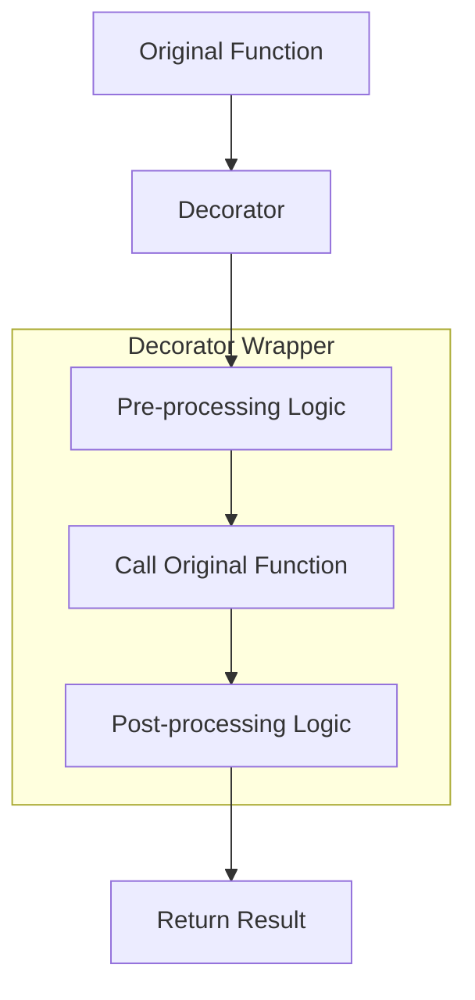
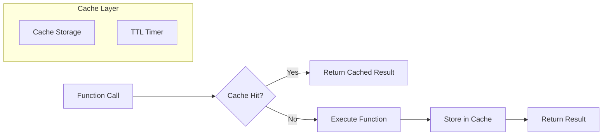
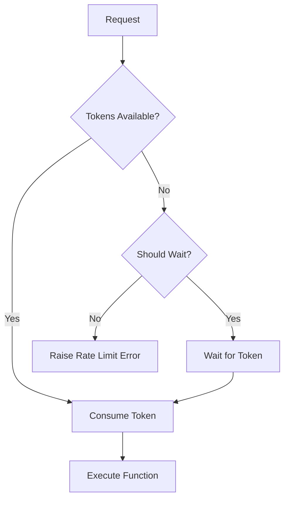
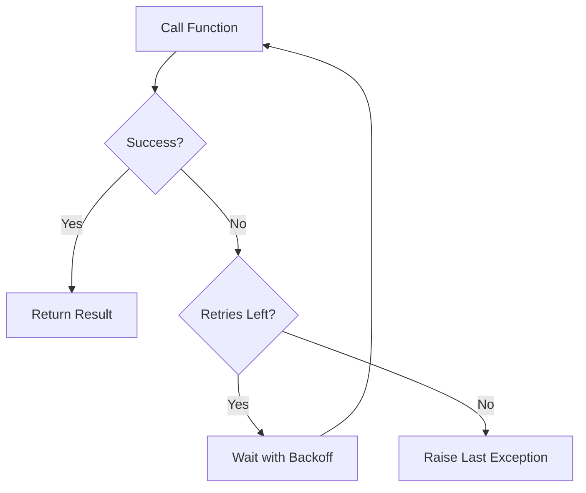
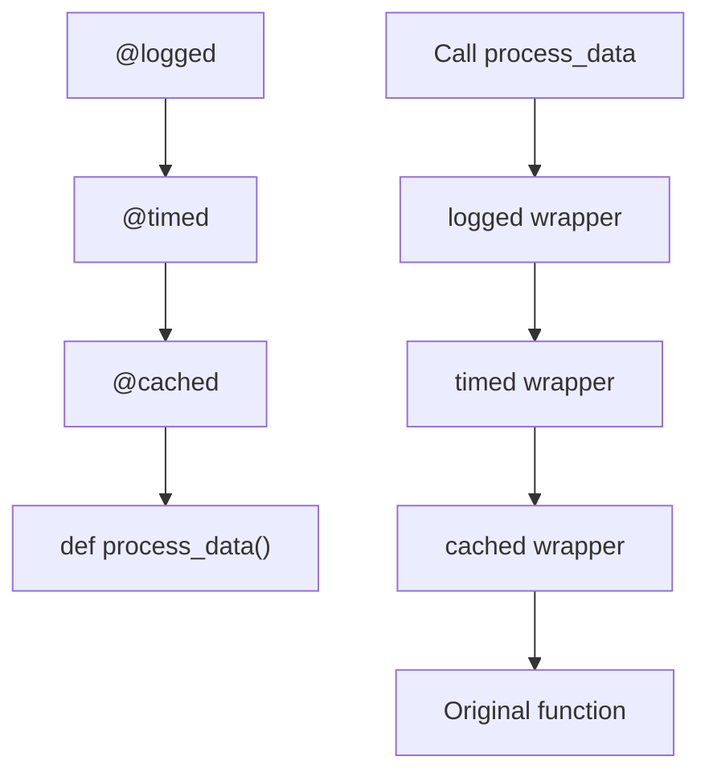

# How to Implement Decorators for Cross-Cutting Concerns

Author: [nawazdhandala](https://www.github.com/nawazdhandala)

Tags: Python, Decorators, Design Patterns, Logging, Caching, AOP

Description: Learn how to build powerful Python decorators for logging, caching, rate limiting, and validation. This guide covers function decorators, class decorators, and decorator factories.

---

> Cross-cutting concerns are aspects of a program that affect multiple modules without being part of their core functionality. Python decorators provide an elegant way to implement these concerns without cluttering your business logic.

Logging, caching, authentication, rate limiting, and validation all share a common trait: they need to wrap around many different functions throughout your codebase. Instead of repeating this logic everywhere, decorators let you define it once and apply it declaratively.

---

## What Are Cross-Cutting Concerns?

Cross-cutting concerns are functionalities that span multiple layers of an application. They include:

- **Logging**: Recording function calls, arguments, and results
- **Caching**: Storing and retrieving computed results
- **Authentication/Authorization**: Verifying user permissions
- **Rate Limiting**: Controlling request frequency
- **Validation**: Checking input parameters
- **Retry Logic**: Handling transient failures
- **Timing**: Measuring execution duration
- **Transaction Management**: Handling database commits and rollbacks

Without decorators, you would need to add this logic to every function that requires it, leading to code duplication and maintenance nightmares.

---

## Decorator Architecture



The diagram above shows how a decorator wraps the original function. The wrapper executes pre-processing logic, calls the original function, executes post-processing logic, and returns the result.

---

## Basic Decorator Pattern

### Simple Function Decorator

A decorator is a function that takes another function as input and returns a new function that wraps the original. The `@decorator` syntax is syntactic sugar for calling the decorator with the function as an argument.

```python
# basic_decorator.py
# Demonstrates the fundamental decorator pattern in Python
from functools import wraps
from typing import Callable, Any

def simple_decorator(func: Callable) -> Callable:
    """
    Basic decorator that prints before and after function execution.
    
    The @wraps decorator preserves the original function's metadata
    (name, docstring, annotations) which is essential for debugging
    and introspection.
    """
    @wraps(func)
    def wrapper(*args, **kwargs):
        # Pre-processing: code that runs before the original function
        print(f"Calling {func.__name__}")
        
        # Call the original function and capture its result
        result = func(*args, **kwargs)
        
        # Post-processing: code that runs after the original function
        print(f"Finished {func.__name__}")
        
        # Return the original result to maintain function behavior
        return result
    
    return wrapper


@simple_decorator
def greet(name: str) -> str:
    """Say hello to someone."""
    return f"Hello, {name}!"


# This is equivalent to: greet = simple_decorator(greet)
print(greet("World"))
# Output:
# Calling greet
# Finished greet
# Hello, World!
```

### Decorator with Arguments

When you need to configure a decorator's behavior, you create a decorator factory: a function that returns a decorator. This adds an extra layer of function nesting.

```python
# decorator_with_args.py
# Demonstrates decorators that accept configuration arguments
from functools import wraps
from typing import Callable, Any

def repeat(times: int):
    """
    Decorator factory that repeats function execution.
    
    This is a three-level nested function:
    1. repeat(times) - the factory that receives configuration
    2. decorator(func) - the actual decorator that wraps the function
    3. wrapper(*args, **kwargs) - the replacement function
    
    Args:
        times: Number of times to repeat the function call
    """
    def decorator(func: Callable) -> Callable:
        @wraps(func)
        def wrapper(*args, **kwargs):
            result = None
            # Execute the function 'times' number of times
            for i in range(times):
                print(f"Execution {i + 1} of {times}")
                result = func(*args, **kwargs)
            # Return only the last result
            return result
        return wrapper
    return decorator


@repeat(times=3)
def say_hello(name: str) -> str:
    """Say hello to someone."""
    message = f"Hello, {name}!"
    print(message)
    return message


# This is equivalent to: say_hello = repeat(times=3)(say_hello)
result = say_hello("World")
# Output:
# Execution 1 of 3
# Hello, World!
# Execution 2 of 3
# Hello, World!
# Execution 3 of 3
# Hello, World!
```

---

## Logging Decorator

### Comprehensive Logging Decorator

This decorator captures everything about a function call: arguments, return values, exceptions, and timing. It uses Python's logging module for proper log management.

```python
# logging_decorator.py
# Production-ready logging decorator with full context capture
import logging
import time
import traceback
from functools import wraps
from typing import Callable, Any, Optional
import json

# Configure logging format for structured output
logging.basicConfig(
    level=logging.INFO,
    format='%(asctime)s - %(name)s - %(levelname)s - %(message)s'
)

def logged(
    logger: Optional[logging.Logger] = None,
    level: int = logging.INFO,
    include_args: bool = True,
    include_result: bool = True,
    include_timing: bool = True,
    sensitive_args: Optional[list] = None
):
    """
    Comprehensive logging decorator for function calls.
    
    This decorator provides detailed logging of function execution,
    including arguments, results, timing, and exception handling.
    
    Args:
        logger: Logger instance to use. If None, creates one based on function module.
        level: Logging level for successful calls (DEBUG, INFO, etc.)
        include_args: Whether to log function arguments
        include_result: Whether to log the return value
        include_timing: Whether to log execution duration
        sensitive_args: List of argument names to redact from logs
    
    Returns:
        Decorator function that wraps the target function
    """
    # Default sensitive arguments that should never be logged
    sensitive_args = sensitive_args or ['password', 'token', 'secret', 'api_key']
    
    def decorator(func: Callable) -> Callable:
        # Get or create logger based on function's module
        nonlocal logger
        if logger is None:
            logger = logging.getLogger(func.__module__)
        
        @wraps(func)
        def wrapper(*args, **kwargs):
            # Create a unique identifier for this call (useful for correlation)
            func_name = f"{func.__module__}.{func.__name__}"
            
            # Build log context with safe argument representation
            log_context = {"function": func_name}
            
            if include_args:
                # Safely format arguments, redacting sensitive values
                safe_kwargs = {
                    k: "[REDACTED]" if k in sensitive_args else v
                    for k, v in kwargs.items()
                }
                log_context["args"] = _safe_repr(args)
                log_context["kwargs"] = safe_kwargs
            
            # Log function entry
            logger.log(level, f"Calling {func_name}", extra=log_context)
            
            # Track execution time
            start_time = time.perf_counter()
            
            try:
                # Execute the wrapped function
                result = func(*args, **kwargs)
                
                # Calculate duration
                duration_ms = (time.perf_counter() - start_time) * 1000
                
                # Build success log context
                success_context = {"function": func_name}
                
                if include_timing:
                    success_context["duration_ms"] = round(duration_ms, 2)
                
                if include_result:
                    success_context["result"] = _safe_repr(result)
                
                # Log successful completion
                logger.log(level, f"Completed {func_name}", extra=success_context)
                
                return result
                
            except Exception as e:
                # Calculate duration even for failures
                duration_ms = (time.perf_counter() - start_time) * 1000
                
                # Log exception with full context
                error_context = {
                    "function": func_name,
                    "error_type": type(e).__name__,
                    "error_message": str(e),
                    "duration_ms": round(duration_ms, 2),
                    "traceback": traceback.format_exc()
                }
                
                logger.error(f"Exception in {func_name}", extra=error_context)
                
                # Re-raise to preserve original behavior
                raise
        
        return wrapper
    return decorator


def _safe_repr(obj: Any, max_length: int = 200) -> str:
    """
    Create a safe string representation of an object for logging.
    
    Truncates long representations to prevent log bloat and handles
    objects that might raise exceptions during repr().
    """
    try:
        repr_str = repr(obj)
        if len(repr_str) > max_length:
            return repr_str[:max_length] + "..."
        return repr_str
    except Exception:
        return f"<{type(obj).__name__}: repr failed>"


# Usage example demonstrating the logging decorator
@logged(include_timing=True, sensitive_args=['password'])
def authenticate_user(username: str, password: str) -> dict:
    """
    Authenticate a user with username and password.
    
    The password argument will be redacted in logs due to
    the sensitive_args configuration.
    """
    # Simulated authentication logic
    if username == "admin" and password == "secret123":
        return {"user_id": 1, "username": username, "role": "admin"}
    raise ValueError("Invalid credentials")


# Test the decorator
try:
    user = authenticate_user("admin", "secret123")
    print(f"Authenticated: {user}")
except ValueError as e:
    print(f"Authentication failed: {e}")
```

### Structured Logging Decorator

For JSON-based logging systems like ELK or Splunk, this decorator outputs structured log data that can be easily parsed and queried.

```python
# structured_logging_decorator.py
# JSON-structured logging decorator for observability platforms
import json
import time
import logging
from functools import wraps
from typing import Callable, Any, Optional, Dict
from datetime import datetime

class StructuredLogFormatter(logging.Formatter):
    """
    Custom formatter that outputs JSON-structured logs.
    
    This formatter is designed for integration with log aggregation
    platforms like Elasticsearch, Splunk, or Datadog.
    """
    def format(self, record: logging.LogRecord) -> str:
        # Build base log structure
        log_data = {
            "timestamp": datetime.utcnow().isoformat() + "Z",
            "level": record.levelname.lower(),
            "logger": record.name,
            "message": record.getMessage(),
        }
        
        # Include any extra fields passed to the log call
        if hasattr(record, 'extra_fields'):
            log_data.update(record.extra_fields)
        
        return json.dumps(log_data)


def structured_log(
    service_name: str = "app",
    include_request_id: bool = True
):
    """
    Decorator that produces JSON-structured logs.
    
    Designed for microservices environments where logs need to be
    easily correlated across services and searchable in log platforms.
    
    Args:
        service_name: Identifier for the service in logs
        include_request_id: Whether to include a unique request ID
    """
    def decorator(func: Callable) -> Callable:
        @wraps(func)
        def wrapper(*args, **kwargs):
            import uuid
            
            # Generate unique request ID for correlation
            request_id = str(uuid.uuid4()) if include_request_id else None
            
            # Capture start time
            start_time = time.perf_counter()
            
            # Build structured log entry for function start
            entry_log = {
                "event": "function_start",
                "service": service_name,
                "function": func.__name__,
                "module": func.__module__,
            }
            
            if request_id:
                entry_log["request_id"] = request_id
            
            print(json.dumps(entry_log))
            
            try:
                # Execute the wrapped function
                result = func(*args, **kwargs)
                
                # Build structured log entry for success
                duration_ms = (time.perf_counter() - start_time) * 1000
                success_log = {
                    "event": "function_success",
                    "service": service_name,
                    "function": func.__name__,
                    "duration_ms": round(duration_ms, 2),
                }
                
                if request_id:
                    success_log["request_id"] = request_id
                
                print(json.dumps(success_log))
                
                return result
                
            except Exception as e:
                # Build structured log entry for failure
                duration_ms = (time.perf_counter() - start_time) * 1000
                error_log = {
                    "event": "function_error",
                    "service": service_name,
                    "function": func.__name__,
                    "duration_ms": round(duration_ms, 2),
                    "error_type": type(e).__name__,
                    "error_message": str(e),
                }
                
                if request_id:
                    error_log["request_id"] = request_id
                
                print(json.dumps(error_log))
                
                raise
        
        return wrapper
    return decorator


@structured_log(service_name="order-service")
def process_order(order_id: str, items: list) -> dict:
    """Process an order with the given items."""
    if not items:
        raise ValueError("Order must contain at least one item")
    
    return {
        "order_id": order_id,
        "status": "processed",
        "total_items": len(items)
    }
```

---

## Caching Decorator

### In-Memory Cache with TTL

This caching decorator stores function results in memory with automatic expiration. It uses the function arguments as the cache key, so identical calls return cached results.



```python
# caching_decorator.py
# In-memory caching decorator with TTL and size limits
import time
import hashlib
import json
from functools import wraps
from typing import Callable, Any, Optional, Dict
from collections import OrderedDict
from threading import Lock

class CacheEntry:
    """
    Represents a single cached value with its expiration time.
    
    Attributes:
        value: The cached result
        expires_at: Unix timestamp when this entry expires
    """
    def __init__(self, value: Any, ttl: int):
        self.value = value
        self.expires_at = time.time() + ttl if ttl > 0 else float('inf')
    
    def is_expired(self) -> bool:
        """Check if this cache entry has expired."""
        return time.time() > self.expires_at


class LRUCache:
    """
    Thread-safe LRU (Least Recently Used) cache with TTL support.
    
    This cache automatically evicts the least recently used entries
    when the maximum size is reached, and removes expired entries
    on access.
    """
    def __init__(self, max_size: int = 1000):
        self._cache: OrderedDict[str, CacheEntry] = OrderedDict()
        self._max_size = max_size
        self._lock = Lock()
        self._hits = 0
        self._misses = 0
    
    def get(self, key: str) -> Optional[Any]:
        """
        Retrieve a value from the cache.
        
        Returns None if the key doesn't exist or has expired.
        Moves accessed items to the end (most recently used).
        """
        with self._lock:
            if key not in self._cache:
                self._misses += 1
                return None
            
            entry = self._cache[key]
            
            # Check expiration
            if entry.is_expired():
                del self._cache[key]
                self._misses += 1
                return None
            
            # Move to end (mark as recently used)
            self._cache.move_to_end(key)
            self._hits += 1
            
            return entry.value
    
    def set(self, key: str, value: Any, ttl: int):
        """
        Store a value in the cache with the specified TTL.
        
        Evicts the least recently used entry if cache is full.
        """
        with self._lock:
            # Remove oldest if at capacity
            while len(self._cache) >= self._max_size:
                self._cache.popitem(last=False)
            
            self._cache[key] = CacheEntry(value, ttl)
    
    def clear(self):
        """Remove all entries from the cache."""
        with self._lock:
            self._cache.clear()
    
    def stats(self) -> Dict[str, Any]:
        """Return cache statistics for monitoring."""
        with self._lock:
            total = self._hits + self._misses
            hit_rate = (self._hits / total * 100) if total > 0 else 0
            return {
                "size": len(self._cache),
                "max_size": self._max_size,
                "hits": self._hits,
                "misses": self._misses,
                "hit_rate_percent": round(hit_rate, 2)
            }


# Global cache instance (can be replaced with Redis for distributed caching)
_default_cache = LRUCache(max_size=10000)


def cached(
    ttl: int = 300,
    cache: Optional[LRUCache] = None,
    key_prefix: str = "",
    include_args: bool = True,
    include_kwargs: bool = True
):
    """
    Caching decorator with configurable TTL and key generation.
    
    Caches function results based on arguments. Subsequent calls
    with identical arguments return the cached result instead of
    re-executing the function.
    
    Args:
        ttl: Time-to-live in seconds (0 = no expiration)
        cache: Cache instance to use (defaults to global cache)
        key_prefix: Prefix for cache keys (useful for namespacing)
        include_args: Include positional args in cache key
        include_kwargs: Include keyword args in cache key
    
    Example:
        @cached(ttl=60)
        def expensive_computation(x, y):
            # This will only run once per unique (x, y) combination
            # within the 60-second TTL window
            return x ** y
    """
    cache_instance = cache or _default_cache
    
    def decorator(func: Callable) -> Callable:
        @wraps(func)
        def wrapper(*args, **kwargs):
            # Generate cache key from function name and arguments
            key = _generate_cache_key(
                func, args, kwargs,
                key_prefix, include_args, include_kwargs
            )
            
            # Try to get from cache
            cached_result = cache_instance.get(key)
            if cached_result is not None:
                return cached_result
            
            # Cache miss, execute function
            result = func(*args, **kwargs)
            
            # Store result in cache
            cache_instance.set(key, result, ttl)
            
            return result
        
        # Attach cache management methods to the wrapper
        wrapper.cache_clear = lambda: cache_instance.clear()
        wrapper.cache_stats = lambda: cache_instance.stats()
        
        return wrapper
    return decorator


def _generate_cache_key(
    func: Callable,
    args: tuple,
    kwargs: dict,
    prefix: str,
    include_args: bool,
    include_kwargs: bool
) -> str:
    """
    Generate a unique cache key for the function call.
    
    Uses MD5 hash of the serialized arguments to create a fixed-length
    key that works well with most cache backends.
    """
    key_parts = [prefix, func.__module__, func.__name__]
    
    if include_args and args:
        # Serialize args, handling unhashable types
        try:
            key_parts.append(json.dumps(args, sort_keys=True, default=str))
        except (TypeError, ValueError):
            key_parts.append(str(args))
    
    if include_kwargs and kwargs:
        # Serialize kwargs, sorted for consistency
        try:
            key_parts.append(json.dumps(kwargs, sort_keys=True, default=str))
        except (TypeError, ValueError):
            key_parts.append(str(sorted(kwargs.items())))
    
    # Create hash for fixed-length key
    key_string = "|".join(key_parts)
    return hashlib.md5(key_string.encode()).hexdigest()


# Usage example
@cached(ttl=60)
def get_user_profile(user_id: str) -> dict:
    """
    Fetch user profile from database.
    
    This expensive database operation is cached for 60 seconds.
    Subsequent calls with the same user_id return the cached result.
    """
    print(f"Fetching profile for {user_id} from database...")
    # Simulated database query
    time.sleep(0.1)
    return {
        "user_id": user_id,
        "name": f"User {user_id}",
        "email": f"user{user_id}@example.com"
    }


# Demonstrate caching behavior
print(get_user_profile("123"))  # Cache miss - executes function
print(get_user_profile("123"))  # Cache hit - returns cached result
print(get_user_profile.cache_stats())  # View cache statistics
```

---

## Rate Limiting Decorator

### Token Bucket Rate Limiter

This decorator implements the token bucket algorithm, which allows bursts of requests while enforcing an average rate limit. Each function call consumes a token, and tokens are replenished at a fixed rate.



```python
# rate_limiting_decorator.py
# Token bucket rate limiter with configurable burst capacity
import time
from functools import wraps
from typing import Callable, Optional
from threading import Lock

class RateLimitExceeded(Exception):
    """
    Exception raised when rate limit is exceeded and blocking is disabled.
    
    Attributes:
        retry_after: Seconds until the next request can be made
    """
    def __init__(self, retry_after: float):
        self.retry_after = retry_after
        super().__init__(f"Rate limit exceeded. Retry after {retry_after:.2f} seconds")


class TokenBucket:
    """
    Thread-safe token bucket for rate limiting.
    
    The token bucket algorithm allows bursts up to the bucket capacity
    while maintaining a sustained average rate. Tokens are added at a
    fixed rate up to the maximum capacity.
    
    Example: capacity=10, refill_rate=5 allows 10 immediate requests,
    then 5 requests per second sustained.
    """
    def __init__(self, capacity: int, refill_rate: float):
        """
        Initialize the token bucket.
        
        Args:
            capacity: Maximum number of tokens (burst limit)
            refill_rate: Tokens added per second (sustained rate)
        """
        self.capacity = capacity
        self.refill_rate = refill_rate
        self.tokens = capacity
        self.last_refill = time.time()
        self._lock = Lock()
    
    def _refill(self):
        """Add tokens based on time elapsed since last refill."""
        now = time.time()
        elapsed = now - self.last_refill
        
        # Calculate tokens to add
        new_tokens = elapsed * self.refill_rate
        
        # Update tokens (cap at capacity)
        self.tokens = min(self.capacity, self.tokens + new_tokens)
        self.last_refill = now
    
    def consume(self, tokens: int = 1) -> bool:
        """
        Try to consume tokens from the bucket.
        
        Args:
            tokens: Number of tokens to consume
        
        Returns:
            True if tokens were consumed, False if insufficient tokens
        """
        with self._lock:
            self._refill()
            
            if self.tokens >= tokens:
                self.tokens -= tokens
                return True
            return False
    
    def time_until_available(self, tokens: int = 1) -> float:
        """Calculate seconds until tokens will be available."""
        with self._lock:
            self._refill()
            
            if self.tokens >= tokens:
                return 0.0
            
            # Calculate time needed to accumulate required tokens
            deficit = tokens - self.tokens
            return deficit / self.refill_rate


def rate_limit(
    calls_per_second: float = 10.0,
    burst: int = 10,
    block: bool = True,
    per_key: Optional[Callable] = None
):
    """
    Rate limiting decorator using token bucket algorithm.
    
    Limits how frequently a function can be called. Useful for
    protecting external APIs, database connections, or any
    resource with rate limits.
    
    Args:
        calls_per_second: Sustained rate limit (tokens per second)
        burst: Maximum burst size (bucket capacity)
        block: If True, wait for tokens. If False, raise exception.
        per_key: Optional function to extract rate limit key from args.
                 Enables per-user or per-resource rate limiting.
    
    Example:
        # Global rate limit: 10 requests per second, burst of 20
        @rate_limit(calls_per_second=10, burst=20)
        def call_api(data):
            return requests.post(api_url, json=data)
        
        # Per-user rate limit: 5 requests per second per user
        @rate_limit(calls_per_second=5, per_key=lambda user_id: user_id)
        def get_user_data(user_id):
            return fetch_from_db(user_id)
    """
    # Store for per-key buckets
    buckets: dict = {}
    default_bucket = TokenBucket(burst, calls_per_second)
    lock = Lock()
    
    def get_bucket(key: Optional[str]) -> TokenBucket:
        """Get or create a bucket for the given key."""
        if key is None:
            return default_bucket
        
        with lock:
            if key not in buckets:
                buckets[key] = TokenBucket(burst, calls_per_second)
            return buckets[key]
    
    def decorator(func: Callable) -> Callable:
        @wraps(func)
        def wrapper(*args, **kwargs):
            # Determine rate limit key
            key = None
            if per_key is not None:
                key = str(per_key(*args, **kwargs))
            
            bucket = get_bucket(key)
            
            # Try to consume a token
            if not bucket.consume():
                retry_after = bucket.time_until_available()
                
                if block:
                    # Wait for token to become available
                    time.sleep(retry_after)
                    bucket.consume()  # Now should succeed
                else:
                    # Raise exception immediately
                    raise RateLimitExceeded(retry_after)
            
            # Token consumed, execute function
            return func(*args, **kwargs)
        
        return wrapper
    return decorator


# Usage examples

# Global rate limit for API calls
@rate_limit(calls_per_second=5, burst=10, block=True)
def call_external_api(endpoint: str, data: dict) -> dict:
    """
    Make an API call with rate limiting.
    
    Limited to 5 calls/second sustained, with bursts up to 10.
    Automatically waits if rate limit is exceeded.
    """
    print(f"Calling {endpoint} at {time.time():.2f}")
    return {"status": "success", "endpoint": endpoint}


# Per-user rate limit
@rate_limit(
    calls_per_second=2,
    burst=5,
    block=False,
    per_key=lambda user_id, **kwargs: user_id
)
def get_user_messages(user_id: str, page: int = 1) -> list:
    """
    Fetch messages for a user with per-user rate limiting.
    
    Each user is limited to 2 requests/second with burst of 5.
    Raises RateLimitExceeded if limit exceeded (no blocking).
    """
    return [{"id": i, "user_id": user_id} for i in range(10)]


# Demonstrate rate limiting
print("Testing global rate limit:")
for i in range(15):
    call_external_api("/api/data", {"i": i})

print("\nTesting per-user rate limit:")
try:
    for i in range(10):
        get_user_messages("user_123")
except RateLimitExceeded as e:
    print(f"Rate limited: {e}")
```

---

## Validation Decorator

### Input Validation with Type Checking

This decorator validates function arguments against a schema before execution. It supports type checking, range validation, and custom validators.

```python
# validation_decorator.py
# Input validation decorator with comprehensive schema support
from functools import wraps
from typing import Callable, Any, Dict, List, Optional, Type, Union
import re

class ValidationError(Exception):
    """
    Exception raised when validation fails.
    
    Attributes:
        field: Name of the field that failed validation
        message: Description of the validation failure
    """
    def __init__(self, field: str, message: str):
        self.field = field
        self.message = message
        super().__init__(f"Validation error for '{field}': {message}")


class Validator:
    """
    Base class for validators.
    
    Subclass this to create custom validation rules.
    """
    def validate(self, value: Any, field_name: str) -> None:
        """Validate a value. Raise ValidationError if invalid."""
        raise NotImplementedError


class Required(Validator):
    """Ensures a value is not None or empty."""
    def validate(self, value: Any, field_name: str) -> None:
        if value is None or value == "" or value == []:
            raise ValidationError(field_name, "This field is required")


class TypeCheck(Validator):
    """Validates that a value is of the expected type."""
    def __init__(self, expected_type: Type):
        self.expected_type = expected_type
    
    def validate(self, value: Any, field_name: str) -> None:
        if value is not None and not isinstance(value, self.expected_type):
            raise ValidationError(
                field_name,
                f"Expected {self.expected_type.__name__}, got {type(value).__name__}"
            )


class Range(Validator):
    """Validates that a numeric value is within a range."""
    def __init__(self, min_val: Optional[float] = None, max_val: Optional[float] = None):
        self.min_val = min_val
        self.max_val = max_val
    
    def validate(self, value: Any, field_name: str) -> None:
        if value is None:
            return
        
        if self.min_val is not None and value < self.min_val:
            raise ValidationError(field_name, f"Value must be >= {self.min_val}")
        
        if self.max_val is not None and value > self.max_val:
            raise ValidationError(field_name, f"Value must be <= {self.max_val}")


class Length(Validator):
    """Validates string or list length."""
    def __init__(self, min_len: Optional[int] = None, max_len: Optional[int] = None):
        self.min_len = min_len
        self.max_len = max_len
    
    def validate(self, value: Any, field_name: str) -> None:
        if value is None:
            return
        
        length = len(value)
        
        if self.min_len is not None and length < self.min_len:
            raise ValidationError(
                field_name,
                f"Length must be >= {self.min_len}, got {length}"
            )
        
        if self.max_len is not None and length > self.max_len:
            raise ValidationError(
                field_name,
                f"Length must be <= {self.max_len}, got {length}"
            )


class Pattern(Validator):
    """Validates that a string matches a regex pattern."""
    def __init__(self, pattern: str, message: Optional[str] = None):
        self.pattern = re.compile(pattern)
        self.message = message or f"Must match pattern: {pattern}"
    
    def validate(self, value: Any, field_name: str) -> None:
        if value is None:
            return
        
        if not self.pattern.match(str(value)):
            raise ValidationError(field_name, self.message)


class Email(Validator):
    """Validates email format."""
    EMAIL_PATTERN = re.compile(
        r'^[a-zA-Z0-9._%+-]+@[a-zA-Z0-9.-]+\.[a-zA-Z]{2,}$'
    )
    
    def validate(self, value: Any, field_name: str) -> None:
        if value is None:
            return
        
        if not self.EMAIL_PATTERN.match(str(value)):
            raise ValidationError(field_name, "Invalid email format")


class OneOf(Validator):
    """Validates that a value is one of the allowed options."""
    def __init__(self, options: List[Any]):
        self.options = options
    
    def validate(self, value: Any, field_name: str) -> None:
        if value is None:
            return
        
        if value not in self.options:
            raise ValidationError(
                field_name,
                f"Must be one of: {', '.join(str(o) for o in self.options)}"
            )


def validate(
    schema: Dict[str, List[Validator]],
    raise_on_extra: bool = False
):
    """
    Validation decorator that checks function arguments against a schema.
    
    The schema is a dictionary mapping argument names to lists of validators.
    Each validator is applied in order, and all must pass.
    
    Args:
        schema: Dict mapping argument names to validator lists
        raise_on_extra: If True, raise error for arguments not in schema
    
    Example:
        @validate({
            "username": [Required(), Length(min_len=3, max_len=50)],
            "email": [Required(), Email()],
            "age": [TypeCheck(int), Range(min_val=0, max_val=150)]
        })
        def create_user(username, email, age=None):
            ...
    """
    def decorator(func: Callable) -> Callable:
        @wraps(func)
        def wrapper(*args, **kwargs):
            # Get function signature to map positional args to names
            import inspect
            sig = inspect.signature(func)
            params = list(sig.parameters.keys())
            
            # Build dict of all arguments
            all_args = {}
            for i, arg in enumerate(args):
                if i < len(params):
                    all_args[params[i]] = arg
            all_args.update(kwargs)
            
            # Check for extra arguments
            if raise_on_extra:
                for key in all_args:
                    if key not in schema and key not in sig.parameters:
                        raise ValidationError(key, "Unexpected argument")
            
            # Validate each field in schema
            errors = []
            for field_name, validators in schema.items():
                value = all_args.get(field_name)
                
                for validator in validators:
                    try:
                        validator.validate(value, field_name)
                    except ValidationError as e:
                        errors.append(e)
                        break  # Stop validating this field on first error
            
            # Raise all errors at once
            if errors:
                messages = [f"{e.field}: {e.message}" for e in errors]
                raise ValidationError("__all__", "; ".join(messages))
            
            return func(*args, **kwargs)
        
        return wrapper
    return decorator


# Usage example
@validate({
    "username": [Required(), TypeCheck(str), Length(min_len=3, max_len=50)],
    "email": [Required(), Email()],
    "age": [TypeCheck(int), Range(min_val=13, max_val=150)],
    "role": [OneOf(["user", "admin", "moderator"])]
})
def create_user(
    username: str,
    email: str,
    age: Optional[int] = None,
    role: str = "user"
) -> dict:
    """
    Create a new user with validated input.
    
    All arguments are validated before the function executes.
    """
    return {
        "username": username,
        "email": email,
        "age": age,
        "role": role,
        "status": "created"
    }


# Test validation
try:
    user = create_user("ab", "invalid-email", age=10)
except ValidationError as e:
    print(f"Validation failed: {e}")

# Valid call
user = create_user("johndoe", "john@example.com", age=25, role="admin")
print(f"User created: {user}")
```

---

## Retry Decorator

### Exponential Backoff Retry

This decorator automatically retries failed functions with exponential backoff, which is essential for handling transient failures in distributed systems.



```python
# retry_decorator.py
# Exponential backoff retry decorator with jitter
import time
import random
from functools import wraps
from typing import Callable, Tuple, Type, Optional
import logging

logger = logging.getLogger(__name__)


class RetryError(Exception):
    """
    Exception raised when all retry attempts are exhausted.
    
    Attributes:
        last_exception: The exception from the final attempt
        attempts: Number of attempts made
    """
    def __init__(self, last_exception: Exception, attempts: int):
        self.last_exception = last_exception
        self.attempts = attempts
        super().__init__(
            f"Failed after {attempts} attempts. "
            f"Last error: {type(last_exception).__name__}: {last_exception}"
        )


def retry(
    max_attempts: int = 3,
    exceptions: Tuple[Type[Exception], ...] = (Exception,),
    initial_delay: float = 1.0,
    max_delay: float = 60.0,
    exponential_base: float = 2.0,
    jitter: bool = True,
    on_retry: Optional[Callable[[Exception, int, float], None]] = None
):
    """
    Retry decorator with exponential backoff.
    
    Automatically retries a function when specific exceptions occur,
    using exponential backoff to avoid overwhelming failing services.
    
    Args:
        max_attempts: Maximum number of attempts (including first try)
        exceptions: Tuple of exception types to catch and retry
        initial_delay: Initial delay in seconds before first retry
        max_delay: Maximum delay between retries (caps exponential growth)
        exponential_base: Base for exponential backoff calculation
        jitter: Add random jitter to prevent thundering herd
        on_retry: Optional callback called before each retry
    
    Example:
        @retry(
            max_attempts=5,
            exceptions=(ConnectionError, TimeoutError),
            initial_delay=1.0
        )
        def fetch_data(url):
            return requests.get(url)
    """
    def decorator(func: Callable) -> Callable:
        @wraps(func)
        def wrapper(*args, **kwargs):
            last_exception = None
            
            for attempt in range(1, max_attempts + 1):
                try:
                    # Attempt to execute the function
                    return func(*args, **kwargs)
                
                except exceptions as e:
                    last_exception = e
                    
                    # Check if this was the last attempt
                    if attempt == max_attempts:
                        logger.error(
                            f"Function {func.__name__} failed after "
                            f"{max_attempts} attempts: {e}"
                        )
                        raise RetryError(e, attempt)
                    
                    # Calculate delay with exponential backoff
                    delay = min(
                        initial_delay * (exponential_base ** (attempt - 1)),
                        max_delay
                    )
                    
                    # Add jitter to prevent thundering herd
                    if jitter:
                        delay = delay * (0.5 + random.random())
                    
                    # Log retry attempt
                    logger.warning(
                        f"Attempt {attempt}/{max_attempts} for {func.__name__} "
                        f"failed with {type(e).__name__}: {e}. "
                        f"Retrying in {delay:.2f}s..."
                    )
                    
                    # Call optional callback
                    if on_retry:
                        on_retry(e, attempt, delay)
                    
                    # Wait before retry
                    time.sleep(delay)
            
            # Should not reach here, but raise if we do
            raise RetryError(last_exception, max_attempts)
        
        return wrapper
    return decorator


# Custom callback for retry events
def log_retry(exception: Exception, attempt: int, delay: float):
    """Callback to log retry events with additional context."""
    print(f"[RETRY] Attempt {attempt} failed, waiting {delay:.2f}s")


# Usage example
@retry(
    max_attempts=5,
    exceptions=(ConnectionError, TimeoutError),
    initial_delay=1.0,
    max_delay=30.0,
    jitter=True,
    on_retry=log_retry
)
def fetch_data_from_api(endpoint: str) -> dict:
    """
    Fetch data from an unreliable API.
    
    Automatically retries on connection errors with exponential backoff.
    """
    import random
    
    # Simulate unreliable service (fails 70% of the time)
    if random.random() < 0.7:
        raise ConnectionError("Service temporarily unavailable")
    
    return {"data": "success", "endpoint": endpoint}


# Test the retry decorator
try:
    result = fetch_data_from_api("/api/users")
    print(f"Success: {result}")
except RetryError as e:
    print(f"All retries failed: {e}")
```

---

## Timing Decorator

### Performance Timing with Statistics

This decorator tracks execution time across multiple calls and provides statistical analysis of function performance.

```python
# timing_decorator.py
# Performance timing decorator with statistical analysis
import time
from functools import wraps
from typing import Callable, Dict, List, Optional
import statistics
from threading import Lock
from dataclasses import dataclass, field


@dataclass
class TimingStats:
    """
    Statistics for function execution times.
    
    Maintains a rolling window of measurements and computes
    statistical aggregates on demand.
    """
    times: List[float] = field(default_factory=list)
    max_samples: int = 1000
    
    def add(self, duration: float):
        """Add a timing measurement."""
        self.times.append(duration)
        # Keep only the most recent samples
        if len(self.times) > self.max_samples:
            self.times = self.times[-self.max_samples:]
    
    @property
    def count(self) -> int:
        return len(self.times)
    
    @property
    def total(self) -> float:
        return sum(self.times)
    
    @property
    def mean(self) -> float:
        return statistics.mean(self.times) if self.times else 0
    
    @property
    def median(self) -> float:
        return statistics.median(self.times) if self.times else 0
    
    @property
    def min(self) -> float:
        return min(self.times) if self.times else 0
    
    @property
    def max(self) -> float:
        return max(self.times) if self.times else 0
    
    @property
    def stdev(self) -> float:
        return statistics.stdev(self.times) if len(self.times) > 1 else 0
    
    def percentile(self, p: float) -> float:
        """Calculate the p-th percentile (0-100)."""
        if not self.times:
            return 0
        sorted_times = sorted(self.times)
        k = (len(sorted_times) - 1) * (p / 100)
        f = int(k)
        c = f + 1
        if c >= len(sorted_times):
            return sorted_times[-1]
        return sorted_times[f] * (c - k) + sorted_times[c] * (k - f)
    
    def summary(self) -> Dict:
        """Return a dictionary of statistics."""
        return {
            "count": self.count,
            "total_ms": round(self.total * 1000, 2),
            "mean_ms": round(self.mean * 1000, 2),
            "median_ms": round(self.median * 1000, 2),
            "min_ms": round(self.min * 1000, 2),
            "max_ms": round(self.max * 1000, 2),
            "stdev_ms": round(self.stdev * 1000, 2),
            "p50_ms": round(self.percentile(50) * 1000, 2),
            "p95_ms": round(self.percentile(95) * 1000, 2),
            "p99_ms": round(self.percentile(99) * 1000, 2),
        }


# Global registry for timing statistics
_timing_registry: Dict[str, TimingStats] = {}
_registry_lock = Lock()


def timed(
    name: Optional[str] = None,
    log_each_call: bool = False,
    threshold_ms: Optional[float] = None
):
    """
    Timing decorator with statistical tracking.
    
    Records execution time for each call and maintains running
    statistics that can be queried later.
    
    Args:
        name: Custom name for the timer (defaults to function name)
        log_each_call: Log timing for every call (not just slow ones)
        threshold_ms: Log warning when execution exceeds this threshold
    
    Example:
        @timed(threshold_ms=100)
        def slow_operation():
            # Logs warning if takes > 100ms
            ...
        
        # Get statistics later
        print(slow_operation.timing_stats())
    """
    def decorator(func: Callable) -> Callable:
        # Determine timer name
        timer_name = name or f"{func.__module__}.{func.__name__}"
        
        # Initialize stats for this function
        with _registry_lock:
            if timer_name not in _timing_registry:
                _timing_registry[timer_name] = TimingStats()
        
        @wraps(func)
        def wrapper(*args, **kwargs):
            # Record start time
            start = time.perf_counter()
            
            try:
                result = func(*args, **kwargs)
                return result
            finally:
                # Calculate duration
                duration = time.perf_counter() - start
                duration_ms = duration * 1000
                
                # Record timing
                with _registry_lock:
                    _timing_registry[timer_name].add(duration)
                
                # Log if requested
                if log_each_call:
                    print(f"[TIMING] {timer_name}: {duration_ms:.2f}ms")
                
                # Log slow calls
                if threshold_ms and duration_ms > threshold_ms:
                    print(
                        f"[SLOW] {timer_name}: {duration_ms:.2f}ms "
                        f"(threshold: {threshold_ms}ms)"
                    )
        
        # Attach helper methods to wrapper
        def timing_stats() -> Dict:
            with _registry_lock:
                return _timing_registry[timer_name].summary()
        
        def reset_timing():
            with _registry_lock:
                _timing_registry[timer_name] = TimingStats()
        
        wrapper.timing_stats = timing_stats
        wrapper.reset_timing = reset_timing
        
        return wrapper
    return decorator


def get_all_timing_stats() -> Dict[str, Dict]:
    """Get timing statistics for all timed functions."""
    with _registry_lock:
        return {
            name: stats.summary()
            for name, stats in _timing_registry.items()
        }


# Usage example
@timed(threshold_ms=50, log_each_call=True)
def process_data(items: List[int]) -> int:
    """
    Process a list of items.
    
    Execution time is tracked with statistical analysis.
    """
    time.sleep(random.uniform(0.01, 0.1))  # Simulate variable work
    return sum(items)


# Run multiple times to gather statistics
import random
for _ in range(20):
    process_data(list(range(100)))

# View statistics
print("\nTiming Statistics:")
print(process_data.timing_stats())
```

---

## Class Decorators

### Singleton Pattern

A class decorator can modify or replace a class itself. This example implements the singleton pattern, ensuring only one instance of a class ever exists.

```python
# class_decorators.py
# Class decorators for design patterns and class modification
from functools import wraps
from typing import Any, Type, Dict
from threading import Lock


def singleton(cls: Type) -> Type:
    """
    Singleton class decorator.
    
    Ensures only one instance of the class ever exists.
    Subsequent calls to the constructor return the same instance.
    
    Thread-safe implementation using double-checked locking.
    
    Example:
        @singleton
        class DatabaseConnection:
            def __init__(self):
                self.connected = True
        
        conn1 = DatabaseConnection()
        conn2 = DatabaseConnection()
        assert conn1 is conn2  # Same instance
    """
    instances: Dict[Type, Any] = {}
    lock = Lock()
    
    @wraps(cls, updated=[])
    def get_instance(*args, **kwargs):
        # Double-checked locking for thread safety
        if cls not in instances:
            with lock:
                if cls not in instances:
                    instances[cls] = cls(*args, **kwargs)
        return instances[cls]
    
    return get_instance


@singleton
class ConfigManager:
    """
    Application configuration manager.
    
    Only one instance exists throughout the application.
    """
    def __init__(self):
        self.settings: Dict[str, Any] = {}
        print("ConfigManager initialized")
    
    def set(self, key: str, value: Any):
        self.settings[key] = value
    
    def get(self, key: str, default: Any = None) -> Any:
        return self.settings.get(key, default)


# Test singleton behavior
config1 = ConfigManager()
config1.set("debug", True)

config2 = ConfigManager()  # Returns same instance
print(f"Same instance: {config1 is config2}")  # True
print(f"Debug setting: {config2.get('debug')}")  # True (set by config1)


def auto_repr(cls: Type) -> Type:
    """
    Class decorator that generates __repr__ from __init__ parameters.
    
    Automatically creates a readable string representation
    based on the class name and its initialization arguments.
    """
    import inspect
    
    original_init = cls.__init__
    
    @wraps(original_init)
    def new_init(self, *args, **kwargs):
        # Get parameter names from __init__
        sig = inspect.signature(original_init)
        params = list(sig.parameters.keys())[1:]  # Skip 'self'
        
        # Store args for repr
        self._repr_args = {}
        for i, arg in enumerate(args):
            if i < len(params):
                self._repr_args[params[i]] = arg
        self._repr_args.update(kwargs)
        
        # Call original __init__
        original_init(self, *args, **kwargs)
    
    def auto_repr_method(self):
        args_str = ", ".join(
            f"{k}={v!r}" for k, v in self._repr_args.items()
        )
        return f"{cls.__name__}({args_str})"
    
    cls.__init__ = new_init
    cls.__repr__ = auto_repr_method
    
    return cls


@auto_repr
class Point:
    """A 2D point with automatic repr generation."""
    def __init__(self, x: float, y: float, label: str = ""):
        self.x = x
        self.y = y
        self.label = label


# Test auto_repr
point = Point(3.5, 4.2, label="A")
print(repr(point))  # Point(x=3.5, y=4.2, label='A')
```

---

## Combining Multiple Decorators

### Stacking Decorators

Multiple decorators can be applied to a single function. They are applied bottom-to-top and executed top-to-bottom.



```python
# combining_decorators.py
# Demonstrates how to stack multiple decorators effectively
from functools import wraps
import time

# Import our decorators (assuming they're defined above)
# from logging_decorator import logged
# from timing_decorator import timed
# from caching_decorator import cached

# Simplified versions for demonstration
def logged_simple(func):
    """Simple logging decorator."""
    @wraps(func)
    def wrapper(*args, **kwargs):
        print(f"[LOG] Calling {func.__name__}")
        result = func(*args, **kwargs)
        print(f"[LOG] {func.__name__} returned {result}")
        return result
    return wrapper


def timed_simple(func):
    """Simple timing decorator."""
    @wraps(func)
    def wrapper(*args, **kwargs):
        start = time.perf_counter()
        result = func(*args, **kwargs)
        duration = (time.perf_counter() - start) * 1000
        print(f"[TIME] {func.__name__} took {duration:.2f}ms")
        return result
    return wrapper


def cached_simple(func):
    """Simple caching decorator."""
    cache = {}
    
    @wraps(func)
    def wrapper(*args):
        if args in cache:
            print(f"[CACHE] Hit for {args}")
            return cache[args]
        print(f"[CACHE] Miss for {args}")
        result = func(*args)
        cache[args] = result
        return result
    
    wrapper.cache_clear = lambda: cache.clear()
    return wrapper


# Stack decorators: Applied bottom-to-top, executed top-to-bottom
@logged_simple      # 3rd applied, executes 1st
@timed_simple       # 2nd applied, executes 2nd
@cached_simple      # 1st applied, executes 3rd
def fibonacci(n: int) -> int:
    """
    Calculate the nth Fibonacci number.
    
    With stacked decorators:
    1. Logging captures input/output
    2. Timing measures execution duration
    3. Caching prevents redundant calculations
    """
    if n <= 1:
        return n
    return fibonacci(n - 1) + fibonacci(n - 2)


# Test stacked decorators
print("First call (cache miss):")
result = fibonacci(10)
print(f"Result: {result}\n")

print("Second call (cache hit):")
result = fibonacci(10)
print(f"Result: {result}")


# Order matters! This is equivalent to:
# fibonacci = logged_simple(timed_simple(cached_simple(fibonacci)))
```

---

## Best Practices Summary

1. **Always use `@functools.wraps`**: Preserves function metadata
2. **Handle exceptions properly**: Re-raise after logging/cleanup
3. **Be thread-safe**: Use locks for shared state
4. **Document decorator behavior**: Clear docstrings explaining side effects
5. **Make decorators configurable**: Use factory pattern for flexibility
6. **Avoid excessive nesting**: Combine related concerns when possible
7. **Test decorators thoroughly**: They can introduce subtle bugs
8. **Consider performance**: Decorators add overhead to every call

---

## Complete Cross-Cutting Concerns Library

Here is a complete, production-ready library that combines all the decorators covered in this guide:

```python
# cross_cutting.py
# Production-ready cross-cutting concerns library
"""
Cross-Cutting Concerns Library

A comprehensive collection of Python decorators for implementing
cross-cutting concerns like logging, caching, rate limiting,
validation, retry logic, and timing.

Example usage:
    from cross_cutting import logged, cached, rate_limit, retry, timed
    
    @logged()
    @cached(ttl=300)
    @rate_limit(calls_per_second=10)
    @retry(max_attempts=3)
    @timed(threshold_ms=100)
    def api_call(endpoint):
        return fetch_data(endpoint)
"""

__all__ = [
    'logged',
    'cached',
    'rate_limit',
    'retry',
    'timed',
    'validate',
    'singleton',
]

# Import all decorators from their respective modules
# from .logging_decorator import logged
# from .caching_decorator import cached
# from .rate_limiting_decorator import rate_limit
# from .retry_decorator import retry
# from .timing_decorator import timed
# from .validation_decorator import validate
# from .class_decorators import singleton

print("Cross-cutting concerns library loaded successfully!")
```

---

*Decorators are one of Python's most powerful features for clean, maintainable code. By implementing cross-cutting concerns as decorators, you keep your business logic pure while gaining powerful functionality like logging, caching, and retry logic.*

**Related Reading:**
- [Building Resilient Python Applications with Retry Logic](https://oneuptime.com/blog/post/2025-01-06-python-retry-exponential-backoff/view)
- [Structured Logging in Python with OpenTelemetry](https://oneuptime.com/blog/post/2025-01-06-python-structured-logging-opentelemetry/view)
- [Implementing Rate Limiting in FastAPI](https://oneuptime.com/blog/post/2025-01-06-fastapi-rate-limiting/view)
