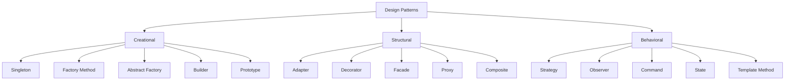
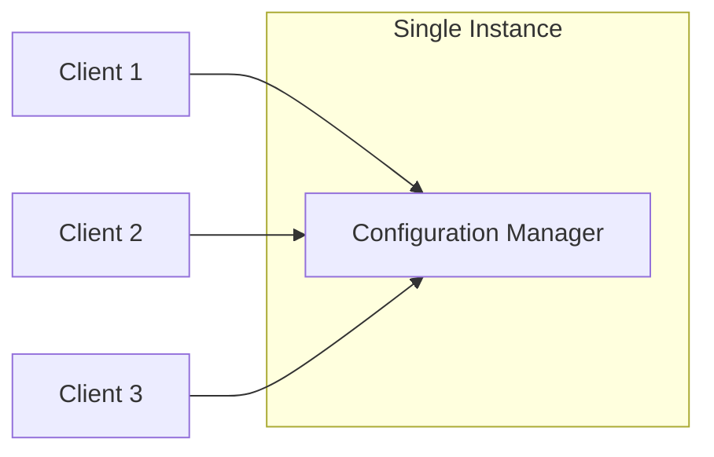
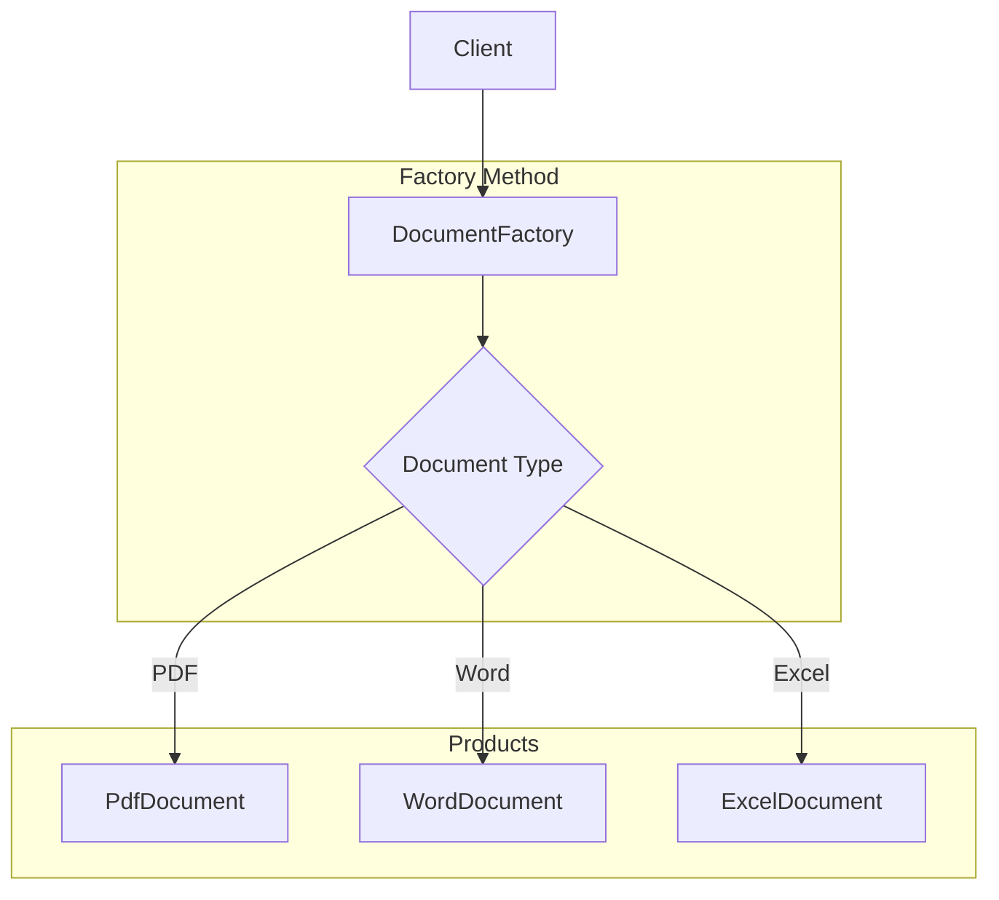
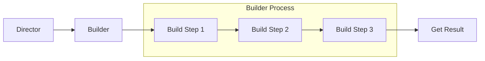
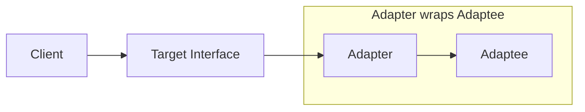
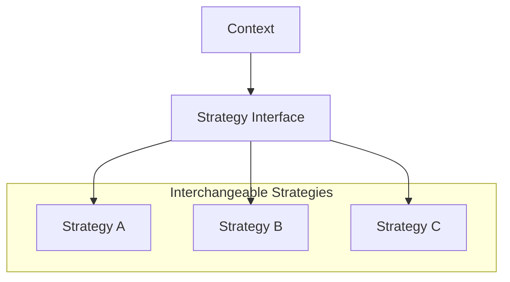
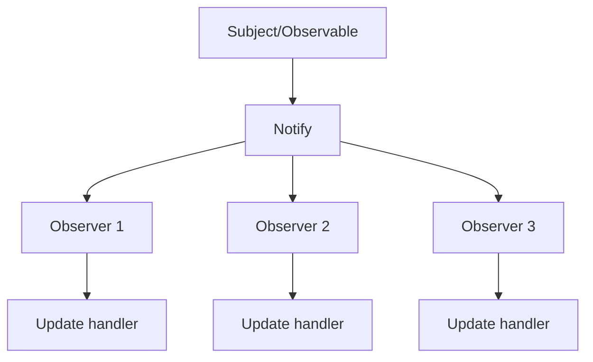

# How to Implement Design Patterns in Python

Author: [nawazdhandala](https://www.github.com/nawazdhandala)

Tags: Python, Design Patterns, OOP, Software Architecture, Factory, Singleton

Description: A practical guide to implementing classic design patterns in Python. Learn creational, structural, and behavioral patterns with idiomatic Python examples.

---

> Design patterns are proven solutions to recurring problems in software design. Python's flexible nature allows elegant implementations that differ from traditional object-oriented languages while maintaining the core benefits of each pattern.

This guide covers the most useful design patterns organized into three categories: creational patterns (object creation), structural patterns (object composition), and behavioral patterns (object communication). Each pattern includes practical Python code with detailed explanations.

---

## Why Design Patterns Matter

Design patterns provide:

- **Common vocabulary**: Team members can communicate complex ideas succinctly
- **Proven solutions**: Battle-tested approaches to common problems
- **Maintainability**: Code that is easier to understand and modify
- **Flexibility**: Systems that can evolve without major rewrites

Python's dynamic typing, first-class functions, and duck typing enable simpler implementations than static languages. Many patterns that require complex class hierarchies in Java or C++ become straightforward in Python.

---

## Pattern Categories Overview



---

## Creational Patterns

Creational patterns deal with object creation mechanisms, trying to create objects in a manner suitable to the situation.

---

### Singleton Pattern

The Singleton pattern ensures a class has only one instance and provides a global point of access to it. Python offers several ways to implement this pattern.



#### Using a Module (Pythonic Approach)

The simplest Singleton in Python is a module. Module-level variables are initialized once and shared across all imports.

```python
# config.py
# The most Pythonic singleton: a module with state
# Modules are imported once and cached by Python's import system

from typing import Any, Dict, Optional
import json
import os

class _Config:
    """
    Internal configuration class.
    
    This class is instantiated once at module load time.
    All code that imports this module shares the same instance.
    """
    
    def __init__(self):
        # Private storage for configuration values
        self._settings: Dict[str, Any] = {}
        self._loaded = False
    
    def load_from_file(self, filepath: str) -> None:
        """
        Load configuration from a JSON file.
        
        Args:
            filepath: Path to the JSON configuration file
        """
        if not os.path.exists(filepath):
            raise FileNotFoundError(f"Config file not found: {filepath}")
        
        with open(filepath, 'r') as f:
            self._settings = json.load(f)
        self._loaded = True
    
    def get(self, key: str, default: Any = None) -> Any:
        """
        Retrieve a configuration value.
        
        Args:
            key: The configuration key (supports dot notation for nested values)
            default: Value to return if key is not found
        
        Returns:
            The configuration value or default
        """
        # Support dot notation for nested values
        keys = key.split('.')
        value = self._settings
        
        for k in keys:
            if isinstance(value, dict) and k in value:
                value = value[k]
            else:
                return default
        
        return value
    
    def set(self, key: str, value: Any) -> None:
        """
        Set a configuration value.
        
        Args:
            key: The configuration key
            value: The value to store
        """
        self._settings[key] = value
    
    def is_loaded(self) -> bool:
        """Check if configuration has been loaded from file."""
        return self._loaded


# Module-level singleton instance
# This is created once when the module is first imported
config = _Config()


# Usage example in other files:
# from config import config
# config.load_from_file('settings.json')
# db_host = config.get('database.host', 'localhost')
```

#### Using __new__ Method

For cases where you need a traditional class-based singleton, override `__new__`:

```python
# singleton_new.py
# Class-based singleton using __new__ method
from typing import Any, Optional
from threading import Lock


class DatabaseConnection:
    """
    Database connection singleton using __new__.
    
    The __new__ method is called before __init__ and controls
    object creation. By storing and returning a cached instance,
    we ensure only one object ever exists.
    
    This implementation is thread-safe using double-checked locking.
    """
    
    # Class-level storage for the singleton instance
    _instance: Optional['DatabaseConnection'] = None
    _lock: Lock = Lock()
    
    def __new__(cls, *args, **kwargs) -> 'DatabaseConnection':
        """
        Control instance creation.
        
        This method is called before __init__. We check if an instance
        already exists and return it instead of creating a new one.
        """
        # First check without lock (fast path for common case)
        if cls._instance is None:
            # Acquire lock for thread-safe instance creation
            with cls._lock:
                # Double-check after acquiring lock
                # Another thread might have created instance while we waited
                if cls._instance is None:
                    cls._instance = super().__new__(cls)
                    # Initialize instance attributes here (not in __init__)
                    cls._instance._initialized = False
        
        return cls._instance
    
    def __init__(self, connection_string: str = "default"):
        """
        Initialize the database connection.
        
        This method may be called multiple times (once per instantiation
        attempt), so we use a flag to ensure actual initialization
        happens only once.
        """
        # Prevent re-initialization on subsequent instantiation attempts
        if self._initialized:
            return
        
        self.connection_string = connection_string
        self._connected = False
        self._initialized = True
        print(f"DatabaseConnection initialized with: {connection_string}")
    
    def connect(self) -> bool:
        """Establish database connection."""
        if not self._connected:
            print(f"Connecting to: {self.connection_string}")
            self._connected = True
        return self._connected
    
    def disconnect(self) -> None:
        """Close database connection."""
        if self._connected:
            print("Disconnecting from database")
            self._connected = False
    
    def is_connected(self) -> bool:
        """Check connection status."""
        return self._connected


# Demonstration of singleton behavior
db1 = DatabaseConnection("postgresql://localhost/mydb")
db2 = DatabaseConnection("mysql://other/db")  # This won't change settings

print(f"Same instance: {db1 is db2}")  # True
print(f"Connection string: {db2.connection_string}")  # postgresql://localhost/mydb
```

#### Using a Decorator

A decorator provides a reusable way to make any class a singleton:

```python
# singleton_decorator.py
# Reusable singleton decorator
from typing import Type, TypeVar, Dict, Any
from functools import wraps
from threading import Lock

T = TypeVar('T')


def singleton(cls: Type[T]) -> Type[T]:
    """
    Singleton decorator that can be applied to any class.
    
    The decorator wraps the class and intercepts instantiation.
    First call creates the instance, subsequent calls return it.
    
    Thread-safe implementation with proper metadata preservation.
    
    Example:
        @singleton
        class Logger:
            def __init__(self, name):
                self.name = name
        
        log1 = Logger("app")
        log2 = Logger("other")  # Returns same instance
        assert log1 is log2
    """
    instances: Dict[Type, Any] = {}
    lock = Lock()
    
    @wraps(cls, updated=[])
    def get_instance(*args, **kwargs) -> T:
        # Double-checked locking pattern
        if cls not in instances:
            with lock:
                if cls not in instances:
                    instances[cls] = cls(*args, **kwargs)
        return instances[cls]
    
    # Preserve class attributes for isinstance checks
    get_instance._original_class = cls
    
    return get_instance


@singleton
class ApplicationLogger:
    """
    Application-wide logger singleton.
    
    Demonstrates the singleton decorator usage.
    """
    
    def __init__(self, app_name: str = "MyApp"):
        self.app_name = app_name
        self.logs: list = []
        print(f"Logger created for: {app_name}")
    
    def log(self, message: str, level: str = "INFO") -> None:
        """Log a message with timestamp."""
        from datetime import datetime
        entry = {
            "timestamp": datetime.now().isoformat(),
            "level": level,
            "message": message,
            "app": self.app_name
        }
        self.logs.append(entry)
        print(f"[{level}] {self.app_name}: {message}")
    
    def get_logs(self) -> list:
        """Retrieve all logged messages."""
        return self.logs.copy()


# Usage demonstration
logger1 = ApplicationLogger("WebServer")
logger1.log("Server starting")

logger2 = ApplicationLogger("Different")  # Same instance returned
logger2.log("Another message")

print(f"\nAll logs from logger2 (same as logger1):")
for log in logger2.get_logs():
    print(f"  {log['message']}")
```

---

### Factory Method Pattern

The Factory Method pattern defines an interface for creating objects but lets subclasses decide which classes to instantiate. In Python, we often use factory functions or class methods.



```python
# factory_method.py
# Factory Method pattern implementation
from abc import ABC, abstractmethod
from typing import Dict, Type, Optional
from enum import Enum, auto


class DocumentType(Enum):
    """Enumeration of supported document types."""
    PDF = auto()
    WORD = auto()
    EXCEL = auto()
    HTML = auto()


class Document(ABC):
    """
    Abstract base class for documents.
    
    Defines the interface that all document types must implement.
    The factory method creates instances of these document types.
    """
    
    @abstractmethod
    def create(self) -> None:
        """Create a new document."""
        pass
    
    @abstractmethod
    def load(self, path: str) -> None:
        """Load document from a file."""
        pass
    
    @abstractmethod
    def save(self, path: str) -> None:
        """Save document to a file."""
        pass
    
    @abstractmethod
    def get_content(self) -> str:
        """Get document content as string."""
        pass


class PdfDocument(Document):
    """PDF document implementation."""
    
    def __init__(self):
        self.content = ""
        self.pages: list = []
    
    def create(self) -> None:
        """Create a new PDF document."""
        self.content = ""
        self.pages = [{"number": 1, "content": ""}]
        print("Created new PDF document")
    
    def load(self, path: str) -> None:
        """Load PDF from file path."""
        print(f"Loading PDF from: {path}")
        # Simulated PDF loading
        self.content = f"PDF content from {path}"
    
    def save(self, path: str) -> None:
        """Save PDF to file path."""
        print(f"Saving PDF to: {path}")
    
    def get_content(self) -> str:
        """Get PDF content."""
        return self.content
    
    def add_page(self) -> None:
        """Add a new page to the PDF."""
        new_page = {"number": len(self.pages) + 1, "content": ""}
        self.pages.append(new_page)


class WordDocument(Document):
    """Microsoft Word document implementation."""
    
    def __init__(self):
        self.content = ""
        self.styles: Dict[str, str] = {}
    
    def create(self) -> None:
        """Create a new Word document."""
        self.content = ""
        self.styles = {"default": "Normal"}
        print("Created new Word document")
    
    def load(self, path: str) -> None:
        """Load Word document from file path."""
        print(f"Loading Word document from: {path}")
        self.content = f"Word content from {path}"
    
    def save(self, path: str) -> None:
        """Save Word document to file path."""
        print(f"Saving Word document to: {path}")
    
    def get_content(self) -> str:
        """Get Word document content."""
        return self.content
    
    def apply_style(self, style_name: str) -> None:
        """Apply a style to the document."""
        self.styles["current"] = style_name


class ExcelDocument(Document):
    """Microsoft Excel spreadsheet implementation."""
    
    def __init__(self):
        self.sheets: Dict[str, list] = {}
        self.active_sheet: Optional[str] = None
    
    def create(self) -> None:
        """Create a new Excel workbook."""
        self.sheets = {"Sheet1": []}
        self.active_sheet = "Sheet1"
        print("Created new Excel workbook")
    
    def load(self, path: str) -> None:
        """Load Excel workbook from file path."""
        print(f"Loading Excel from: {path}")
        self.sheets = {"Data": [["Loaded", "from", path]]}
        self.active_sheet = "Data"
    
    def save(self, path: str) -> None:
        """Save Excel workbook to file path."""
        print(f"Saving Excel to: {path}")
    
    def get_content(self) -> str:
        """Get active sheet content as string."""
        if self.active_sheet and self.active_sheet in self.sheets:
            return str(self.sheets[self.active_sheet])
        return ""
    
    def add_sheet(self, name: str) -> None:
        """Add a new sheet to the workbook."""
        self.sheets[name] = []


class HtmlDocument(Document):
    """HTML document implementation."""
    
    def __init__(self):
        self.html = ""
        self.title = ""
    
    def create(self) -> None:
        """Create a new HTML document with basic structure."""
        self.title = "Untitled"
        self.html = "<!DOCTYPE html><html><head></head><body></body></html>"
        print("Created new HTML document")
    
    def load(self, path: str) -> None:
        """Load HTML from file path."""
        print(f"Loading HTML from: {path}")
        self.html = f"<html><body>Content from {path}</body></html>"
    
    def save(self, path: str) -> None:
        """Save HTML to file path."""
        print(f"Saving HTML to: {path}")
    
    def get_content(self) -> str:
        """Get HTML content."""
        return self.html


class DocumentFactory:
    """
    Factory for creating document instances.
    
    This factory uses a registry pattern to map document types
    to their implementing classes. New document types can be
    registered at runtime.
    """
    
    # Registry mapping document types to classes
    _registry: Dict[DocumentType, Type[Document]] = {
        DocumentType.PDF: PdfDocument,
        DocumentType.WORD: WordDocument,
        DocumentType.EXCEL: ExcelDocument,
        DocumentType.HTML: HtmlDocument,
    }
    
    @classmethod
    def create(cls, doc_type: DocumentType) -> Document:
        """
        Factory method to create a document of the specified type.
        
        Args:
            doc_type: The type of document to create
        
        Returns:
            A new document instance
        
        Raises:
            ValueError: If document type is not registered
        """
        if doc_type not in cls._registry:
            raise ValueError(f"Unknown document type: {doc_type}")
        
        # Create and return the appropriate document
        document_class = cls._registry[doc_type]
        document = document_class()
        document.create()
        return document
    
    @classmethod
    def create_from_file(cls, path: str) -> Document:
        """
        Create a document by inferring type from file extension.
        
        Args:
            path: File path to load
        
        Returns:
            Document instance loaded from file
        """
        # Map file extensions to document types
        extension_map = {
            '.pdf': DocumentType.PDF,
            '.docx': DocumentType.WORD,
            '.doc': DocumentType.WORD,
            '.xlsx': DocumentType.EXCEL,
            '.xls': DocumentType.EXCEL,
            '.html': DocumentType.HTML,
            '.htm': DocumentType.HTML,
        }
        
        # Extract extension from path
        import os
        _, ext = os.path.splitext(path.lower())
        
        if ext not in extension_map:
            raise ValueError(f"Unsupported file extension: {ext}")
        
        doc_type = extension_map[ext]
        document = cls._registry[doc_type]()
        document.load(path)
        return document
    
    @classmethod
    def register(cls, doc_type: DocumentType, document_class: Type[Document]) -> None:
        """
        Register a new document type with the factory.
        
        This allows extending the factory with custom document types
        without modifying the factory code.
        
        Args:
            doc_type: The document type enum value
            document_class: The class implementing Document interface
        """
        cls._registry[doc_type] = document_class


# Usage demonstration
print("Creating documents using factory:")
pdf = DocumentFactory.create(DocumentType.PDF)
word = DocumentFactory.create(DocumentType.WORD)
excel = DocumentFactory.create(DocumentType.EXCEL)

print("\nLoading document from file:")
doc = DocumentFactory.create_from_file("report.pdf")
print(f"Loaded content: {doc.get_content()}")
```

---

### Builder Pattern

The Builder pattern separates the construction of a complex object from its representation. It is particularly useful when creating objects with many optional parameters.



```python
# builder.py
# Builder pattern for constructing complex objects
from typing import Optional, List, Dict, Any
from dataclasses import dataclass, field
from enum import Enum, auto


class HttpMethod(Enum):
    """HTTP methods enumeration."""
    GET = auto()
    POST = auto()
    PUT = auto()
    DELETE = auto()
    PATCH = auto()


@dataclass
class HttpRequest:
    """
    HTTP Request data class.
    
    This is the complex object that the builder constructs.
    It has many optional fields that the builder helps manage.
    """
    method: HttpMethod
    url: str
    headers: Dict[str, str] = field(default_factory=dict)
    query_params: Dict[str, str] = field(default_factory=dict)
    body: Optional[Any] = None
    timeout: int = 30
    retry_count: int = 0
    follow_redirects: bool = True
    auth_token: Optional[str] = None
    
    def __str__(self) -> str:
        """String representation of the request."""
        return f"{self.method.name} {self.url}"


class HttpRequestBuilder:
    """
    Builder for constructing HttpRequest objects.
    
    The builder provides a fluent interface for setting optional
    parameters. Each method returns self, enabling method chaining.
    
    Example:
        request = (
            HttpRequestBuilder()
            .method(HttpMethod.POST)
            .url("https://api.example.com/users")
            .header("Content-Type", "application/json")
            .body({"name": "John"})
            .timeout(60)
            .build()
        )
    """
    
    def __init__(self):
        """Initialize the builder with default values."""
        self._method: HttpMethod = HttpMethod.GET
        self._url: str = ""
        self._headers: Dict[str, str] = {}
        self._query_params: Dict[str, str] = {}
        self._body: Optional[Any] = None
        self._timeout: int = 30
        self._retry_count: int = 0
        self._follow_redirects: bool = True
        self._auth_token: Optional[str] = None
    
    def method(self, method: HttpMethod) -> 'HttpRequestBuilder':
        """
        Set the HTTP method.
        
        Args:
            method: The HTTP method to use
        
        Returns:
            Self for method chaining
        """
        self._method = method
        return self
    
    def url(self, url: str) -> 'HttpRequestBuilder':
        """
        Set the request URL.
        
        Args:
            url: The target URL
        
        Returns:
            Self for method chaining
        """
        self._url = url
        return self
    
    def header(self, name: str, value: str) -> 'HttpRequestBuilder':
        """
        Add a header to the request.
        
        Args:
            name: Header name
            value: Header value
        
        Returns:
            Self for method chaining
        """
        self._headers[name] = value
        return self
    
    def headers(self, headers: Dict[str, str]) -> 'HttpRequestBuilder':
        """
        Add multiple headers at once.
        
        Args:
            headers: Dictionary of headers
        
        Returns:
            Self for method chaining
        """
        self._headers.update(headers)
        return self
    
    def query_param(self, name: str, value: str) -> 'HttpRequestBuilder':
        """
        Add a query parameter.
        
        Args:
            name: Parameter name
            value: Parameter value
        
        Returns:
            Self for method chaining
        """
        self._query_params[name] = value
        return self
    
    def body(self, body: Any) -> 'HttpRequestBuilder':
        """
        Set the request body.
        
        Args:
            body: The request body (will be serialized as JSON for dict/list)
        
        Returns:
            Self for method chaining
        """
        self._body = body
        # Automatically set content type for JSON bodies
        if isinstance(body, (dict, list)):
            self._headers.setdefault("Content-Type", "application/json")
        return self
    
    def timeout(self, seconds: int) -> 'HttpRequestBuilder':
        """
        Set the request timeout.
        
        Args:
            seconds: Timeout in seconds
        
        Returns:
            Self for method chaining
        """
        self._timeout = seconds
        return self
    
    def retry(self, count: int) -> 'HttpRequestBuilder':
        """
        Set the number of retry attempts.
        
        Args:
            count: Number of retries on failure
        
        Returns:
            Self for method chaining
        """
        self._retry_count = count
        return self
    
    def no_redirects(self) -> 'HttpRequestBuilder':
        """
        Disable following redirects.
        
        Returns:
            Self for method chaining
        """
        self._follow_redirects = False
        return self
    
    def auth(self, token: str) -> 'HttpRequestBuilder':
        """
        Set bearer token authentication.
        
        Args:
            token: The auth token (without 'Bearer ' prefix)
        
        Returns:
            Self for method chaining
        """
        self._auth_token = token
        self._headers["Authorization"] = f"Bearer {token}"
        return self
    
    def build(self) -> HttpRequest:
        """
        Build the HttpRequest object.
        
        Validates that required fields are set and returns
        the constructed request.
        
        Returns:
            The constructed HttpRequest
        
        Raises:
            ValueError: If required fields are missing
        """
        # Validate required fields
        if not self._url:
            raise ValueError("URL is required")
        
        # Construct and return the request
        return HttpRequest(
            method=self._method,
            url=self._url,
            headers=self._headers.copy(),
            query_params=self._query_params.copy(),
            body=self._body,
            timeout=self._timeout,
            retry_count=self._retry_count,
            follow_redirects=self._follow_redirects,
            auth_token=self._auth_token
        )


# Convenience factory methods
class Http:
    """
    Convenience class providing factory methods for common HTTP requests.
    
    Provides a cleaner API for creating simple requests while still
    allowing full customization through the builder.
    """
    
    @staticmethod
    def get(url: str) -> HttpRequestBuilder:
        """Start building a GET request."""
        return HttpRequestBuilder().method(HttpMethod.GET).url(url)
    
    @staticmethod
    def post(url: str) -> HttpRequestBuilder:
        """Start building a POST request."""
        return HttpRequestBuilder().method(HttpMethod.POST).url(url)
    
    @staticmethod
    def put(url: str) -> HttpRequestBuilder:
        """Start building a PUT request."""
        return HttpRequestBuilder().method(HttpMethod.PUT).url(url)
    
    @staticmethod
    def delete(url: str) -> HttpRequestBuilder:
        """Start building a DELETE request."""
        return HttpRequestBuilder().method(HttpMethod.DELETE).url(url)


# Usage demonstration
print("Building HTTP requests with the Builder pattern:\n")

# Simple GET request
get_request = Http.get("https://api.example.com/users").build()
print(f"Simple GET: {get_request}")

# Complex POST request with multiple options
post_request = (
    Http.post("https://api.example.com/users")
    .header("X-Request-ID", "12345")
    .body({"name": "John Doe", "email": "john@example.com"})
    .auth("my-secret-token")
    .timeout(60)
    .retry(3)
    .build()
)

print(f"Complex POST: {post_request}")
print(f"  Headers: {post_request.headers}")
print(f"  Body: {post_request.body}")
print(f"  Timeout: {post_request.timeout}s")
```

---

## Structural Patterns

Structural patterns explain how to assemble objects and classes into larger structures while keeping these structures flexible and efficient.

---

### Adapter Pattern

The Adapter pattern allows objects with incompatible interfaces to collaborate. It wraps an existing class with a new interface.



```python
# adapter.py
# Adapter pattern for integrating incompatible interfaces
from abc import ABC, abstractmethod
from typing import Dict, Any, List
import json


# Target interface that our application expects
class PaymentProcessor(ABC):
    """
    Abstract payment processor interface.
    
    This is the interface our application uses for all payments.
    Different payment providers must conform to this interface.
    """
    
    @abstractmethod
    def process_payment(
        self,
        amount: float,
        currency: str,
        card_number: str,
        expiry: str,
        cvv: str
    ) -> Dict[str, Any]:
        """
        Process a payment.
        
        Args:
            amount: Payment amount
            currency: Three-letter currency code
            card_number: Card number
            expiry: Card expiry (MM/YY)
            cvv: Card verification value
        
        Returns:
            Dict containing transaction_id, status, and message
        """
        pass
    
    @abstractmethod
    def refund(self, transaction_id: str, amount: float) -> Dict[str, Any]:
        """
        Refund a previous transaction.
        
        Args:
            transaction_id: Original transaction ID
            amount: Amount to refund
        
        Returns:
            Dict containing refund status
        """
        pass


# Legacy payment system with different interface
class LegacyPaymentGateway:
    """
    Legacy payment gateway with its own interface.
    
    This represents a third-party library or existing system
    that has a different interface than what we need.
    """
    
    def make_payment(self, payment_data: str) -> str:
        """
        Process payment using XML-style data.
        
        Args:
            payment_data: XML string with payment details
        
        Returns:
            XML string with result
        """
        # Simulate payment processing
        print(f"Legacy system processing: {payment_data[:50]}...")
        return "<result><status>SUCCESS</status><id>LEG-123456</id></result>"
    
    def reverse_transaction(self, txn_id: str, reversal_amount: int) -> str:
        """
        Reverse a transaction (amount in cents).
        
        Args:
            txn_id: Transaction ID to reverse
            reversal_amount: Amount in cents
        
        Returns:
            XML string with result
        """
        print(f"Legacy system reversing: {txn_id} for {reversal_amount} cents")
        return "<result><status>REVERSED</status></result>"


# Modern payment API with JSON interface
class ModernPaymentAPI:
    """
    Modern payment API with JSON-based interface.
    
    Another third-party system with its own interface conventions.
    """
    
    def create_charge(
        self,
        cents: int,
        currency_code: str,
        source_token: str
    ) -> Dict[str, Any]:
        """
        Create a charge using tokenized card.
        
        Args:
            cents: Amount in cents
            currency_code: Currency
            source_token: Tokenized payment source
        
        Returns:
            Dict with charge details
        """
        print(f"Modern API creating charge: {cents} {currency_code}")
        return {
            "charge_id": "ch_modernpay_789",
            "amount_cents": cents,
            "status": "succeeded"
        }
    
    def create_refund(self, charge_id: str, amount_cents: int) -> Dict[str, Any]:
        """
        Create a refund for a charge.
        
        Args:
            charge_id: The charge to refund
            amount_cents: Refund amount in cents
        
        Returns:
            Dict with refund details
        """
        print(f"Modern API refunding: {charge_id}")
        return {
            "refund_id": "rf_modernpay_456",
            "status": "succeeded"
        }


class LegacyPaymentAdapter(PaymentProcessor):
    """
    Adapter for the legacy payment gateway.
    
    Wraps the legacy system and translates calls from our
    standard PaymentProcessor interface to the legacy interface.
    """
    
    def __init__(self, legacy_gateway: LegacyPaymentGateway):
        """
        Initialize adapter with legacy gateway instance.
        
        Args:
            legacy_gateway: The legacy system to adapt
        """
        self._legacy = legacy_gateway
    
    def process_payment(
        self,
        amount: float,
        currency: str,
        card_number: str,
        expiry: str,
        cvv: str
    ) -> Dict[str, Any]:
        """
        Adapt process_payment to legacy make_payment.
        
        Converts our standard parameters to XML format expected
        by the legacy system and parses the XML response.
        """
        # Convert to legacy XML format
        xml_data = f"""
        <payment>
            <amount>{amount}</amount>
            <currency>{currency}</currency>
            <card>
                <number>{card_number}</number>
                <expiry>{expiry}</expiry>
                <cvv>{cvv}</cvv>
            </card>
        </payment>
        """
        
        # Call legacy system
        xml_result = self._legacy.make_payment(xml_data)
        
        # Parse XML result (simplified parsing)
        status = "success" if "SUCCESS" in xml_result else "failed"
        txn_id = "LEG-123456"  # Extracted from XML in real implementation
        
        # Return in our standard format
        return {
            "transaction_id": txn_id,
            "status": status,
            "message": "Payment processed via legacy gateway"
        }
    
    def refund(self, transaction_id: str, amount: float) -> Dict[str, Any]:
        """
        Adapt refund to legacy reverse_transaction.
        
        Converts amount from dollars to cents as required by legacy system.
        """
        # Legacy system expects cents
        amount_cents = int(amount * 100)
        
        # Call legacy system
        xml_result = self._legacy.reverse_transaction(transaction_id, amount_cents)
        
        # Parse and return in our format
        status = "success" if "REVERSED" in xml_result else "failed"
        return {
            "refund_id": f"REF-{transaction_id}",
            "status": status,
            "message": "Refund processed via legacy gateway"
        }


class ModernPaymentAdapter(PaymentProcessor):
    """
    Adapter for the modern payment API.
    
    Wraps the modern API and translates calls from our
    standard PaymentProcessor interface.
    """
    
    def __init__(self, modern_api: ModernPaymentAPI):
        """
        Initialize adapter with modern API instance.
        
        Args:
            modern_api: The modern API to adapt
        """
        self._api = modern_api
    
    def _tokenize_card(self, card_number: str, expiry: str, cvv: str) -> str:
        """
        Create a token from card details.
        
        In a real implementation, this would securely tokenize
        the card with the payment provider.
        """
        return f"tok_{card_number[-4:]}"
    
    def process_payment(
        self,
        amount: float,
        currency: str,
        card_number: str,
        expiry: str,
        cvv: str
    ) -> Dict[str, Any]:
        """
        Adapt process_payment to modern create_charge.
        
        Tokenizes the card and converts amount to cents.
        """
        # Modern API uses tokenized cards and cents
        token = self._tokenize_card(card_number, expiry, cvv)
        cents = int(amount * 100)
        
        # Call modern API
        result = self._api.create_charge(cents, currency, token)
        
        # Return in our standard format
        return {
            "transaction_id": result["charge_id"],
            "status": "success" if result["status"] == "succeeded" else "failed",
            "message": "Payment processed via modern API"
        }
    
    def refund(self, transaction_id: str, amount: float) -> Dict[str, Any]:
        """
        Adapt refund to modern create_refund.
        """
        cents = int(amount * 100)
        result = self._api.create_refund(transaction_id, cents)
        
        return {
            "refund_id": result["refund_id"],
            "status": "success" if result["status"] == "succeeded" else "failed",
            "message": "Refund processed via modern API"
        }


# Usage demonstration
def process_order_payment(processor: PaymentProcessor, amount: float):
    """
    Process a payment using any PaymentProcessor implementation.
    
    This function works with any adapter, demonstrating how
    the adapter pattern enables polymorphism.
    """
    result = processor.process_payment(
        amount=amount,
        currency="USD",
        card_number="4111111111111111",
        expiry="12/25",
        cvv="123"
    )
    print(f"Payment result: {result}\n")
    return result


print("Using different payment systems through adapters:\n")

# Using legacy system through adapter
legacy_gateway = LegacyPaymentGateway()
legacy_adapter = LegacyPaymentAdapter(legacy_gateway)
process_order_payment(legacy_adapter, 99.99)

# Using modern API through adapter
modern_api = ModernPaymentAPI()
modern_adapter = ModernPaymentAdapter(modern_api)
process_order_payment(modern_adapter, 149.99)
```

---

### Strategy Pattern

The Strategy pattern defines a family of algorithms, encapsulates each one, and makes them interchangeable. Python's first-class functions make this pattern particularly elegant.



```python
# strategy.py
# Strategy pattern using functions and classes
from abc import ABC, abstractmethod
from typing import Callable, List, Dict, Any
from dataclasses import dataclass


# Using Protocol/ABC for type hints and documentation
class ShippingStrategy(ABC):
    """
    Abstract base class for shipping cost calculation strategies.
    
    Each shipping strategy encapsulates a different algorithm
    for calculating shipping costs based on order details.
    """
    
    @abstractmethod
    def calculate(self, weight: float, distance: float) -> float:
        """
        Calculate shipping cost.
        
        Args:
            weight: Package weight in kg
            distance: Shipping distance in km
        
        Returns:
            Shipping cost in dollars
        """
        pass
    
    @property
    @abstractmethod
    def name(self) -> str:
        """Return the strategy name."""
        pass


class StandardShipping(ShippingStrategy):
    """Standard ground shipping - cheapest but slowest."""
    
    BASE_RATE = 5.00
    WEIGHT_RATE = 0.50  # Per kg
    DISTANCE_RATE = 0.01  # Per km
    
    def calculate(self, weight: float, distance: float) -> float:
        """Calculate standard shipping cost."""
        return (
            self.BASE_RATE +
            (weight * self.WEIGHT_RATE) +
            (distance * self.DISTANCE_RATE)
        )
    
    @property
    def name(self) -> str:
        return "Standard Shipping (5-7 days)"


class ExpressShipping(ShippingStrategy):
    """Express shipping - faster delivery."""
    
    BASE_RATE = 15.00
    WEIGHT_RATE = 1.00
    DISTANCE_RATE = 0.02
    
    def calculate(self, weight: float, distance: float) -> float:
        """Calculate express shipping cost."""
        return (
            self.BASE_RATE +
            (weight * self.WEIGHT_RATE) +
            (distance * self.DISTANCE_RATE)
        )
    
    @property
    def name(self) -> str:
        return "Express Shipping (2-3 days)"


class OvernightShipping(ShippingStrategy):
    """Overnight shipping - next day delivery."""
    
    BASE_RATE = 35.00
    WEIGHT_RATE = 2.00
    DISTANCE_RATE = 0.05
    
    def calculate(self, weight: float, distance: float) -> float:
        """Calculate overnight shipping cost."""
        return (
            self.BASE_RATE +
            (weight * self.WEIGHT_RATE) +
            (distance * self.DISTANCE_RATE)
        )
    
    @property
    def name(self) -> str:
        return "Overnight Shipping (Next Day)"


class FreeShipping(ShippingStrategy):
    """Free shipping for qualifying orders."""
    
    def calculate(self, weight: float, distance: float) -> float:
        """Free shipping always returns 0."""
        return 0.00
    
    @property
    def name(self) -> str:
        return "Free Shipping"


@dataclass
class Order:
    """
    Order class that uses shipping strategies.
    
    The order holds a reference to a shipping strategy and
    delegates cost calculation to it.
    """
    items: List[Dict[str, Any]]
    weight: float  # Total weight in kg
    distance: float  # Shipping distance in km
    shipping_strategy: ShippingStrategy
    
    @property
    def subtotal(self) -> float:
        """Calculate order subtotal."""
        return sum(item.get('price', 0) * item.get('quantity', 1) for item in self.items)
    
    @property
    def shipping_cost(self) -> float:
        """Calculate shipping using the current strategy."""
        return self.shipping_strategy.calculate(self.weight, self.distance)
    
    @property
    def total(self) -> float:
        """Calculate order total including shipping."""
        return self.subtotal + self.shipping_cost
    
    def set_shipping_strategy(self, strategy: ShippingStrategy) -> None:
        """
        Change the shipping strategy.
        
        This allows the shipping method to be changed at runtime,
        for example when the user selects a different option.
        """
        self.shipping_strategy = strategy
    
    def get_shipping_options(self) -> List[Dict[str, Any]]:
        """
        Get all available shipping options with costs.
        
        Returns a list of all strategies with calculated costs
        for the current order, allowing users to compare.
        """
        strategies = [
            StandardShipping(),
            ExpressShipping(),
            OvernightShipping(),
        ]
        
        # Add free shipping if order qualifies
        if self.subtotal >= 100:
            strategies.append(FreeShipping())
        
        return [
            {
                "name": s.name,
                "cost": s.calculate(self.weight, self.distance),
                "strategy": s
            }
            for s in strategies
        ]
    
    def summary(self) -> str:
        """Generate order summary."""
        return f"""
Order Summary
-------------
Items: {len(self.items)}
Subtotal: ${self.subtotal:.2f}
Shipping ({self.shipping_strategy.name}): ${self.shipping_cost:.2f}
Total: ${self.total:.2f}
        """.strip()


# Pythonic approach using functions as strategies
# This is simpler when strategies don't need state

ShippingCalculator = Callable[[float, float], float]

def standard_shipping(weight: float, distance: float) -> float:
    """Standard shipping calculation as a simple function."""
    return 5.00 + (weight * 0.50) + (distance * 0.01)

def express_shipping(weight: float, distance: float) -> float:
    """Express shipping calculation as a simple function."""
    return 15.00 + (weight * 1.00) + (distance * 0.02)

def create_discount_shipping(discount_percent: float) -> ShippingCalculator:
    """
    Factory function that creates a discounted shipping calculator.
    
    This demonstrates how closures can capture configuration,
    creating customized strategy instances.
    """
    def discounted(weight: float, distance: float) -> float:
        base_cost = standard_shipping(weight, distance)
        discount = base_cost * (discount_percent / 100)
        return base_cost - discount
    
    return discounted


def calculate_shipping(
    weight: float,
    distance: float,
    calculator: ShippingCalculator
) -> float:
    """
    Calculate shipping using a function strategy.
    
    This demonstrates the functional approach to the strategy pattern.
    """
    return calculator(weight, distance)


# Usage demonstration
print("Strategy Pattern - Class-based approach:\n")

# Create an order with standard shipping
order = Order(
    items=[
        {"name": "Widget", "price": 29.99, "quantity": 2},
        {"name": "Gadget", "price": 49.99, "quantity": 1},
    ],
    weight=2.5,  # kg
    distance=500,  # km
    shipping_strategy=StandardShipping()
)

print(order.summary())

print("\nAvailable shipping options:")
for option in order.get_shipping_options():
    print(f"  {option['name']}: ${option['cost']:.2f}")

# Change to express shipping
print("\nSwitching to express shipping:")
order.set_shipping_strategy(ExpressShipping())
print(order.summary())


print("\n\nStrategy Pattern - Function-based approach:\n")

# Using function strategies
weight, distance = 2.5, 500

standard_cost = calculate_shipping(weight, distance, standard_shipping)
express_cost = calculate_shipping(weight, distance, express_shipping)

print(f"Standard: ${standard_cost:.2f}")
print(f"Express: ${express_cost:.2f}")

# Using factory-created strategy with 20% discount
vip_shipping = create_discount_shipping(20)
vip_cost = calculate_shipping(weight, distance, vip_shipping)
print(f"VIP (20% off): ${vip_cost:.2f}")
```

---

### Observer Pattern

The Observer pattern defines a one-to-many dependency between objects so that when one object changes state, all its dependents are notified and updated automatically.



```python
# observer.py
# Observer pattern for event-driven systems
from abc import ABC, abstractmethod
from typing import List, Dict, Any, Callable, Set
from dataclasses import dataclass, field
from enum import Enum, auto
from datetime import datetime


class EventType(Enum):
    """Enumeration of event types."""
    ORDER_CREATED = auto()
    ORDER_SHIPPED = auto()
    ORDER_DELIVERED = auto()
    ORDER_CANCELLED = auto()
    INVENTORY_LOW = auto()
    PAYMENT_RECEIVED = auto()


@dataclass
class Event:
    """
    Event data class representing something that happened.
    
    Events carry information about what happened, including
    the type, timestamp, and any relevant data.
    """
    event_type: EventType
    data: Dict[str, Any]
    timestamp: datetime = field(default_factory=datetime.now)
    
    def __str__(self) -> str:
        return f"Event({self.event_type.name} at {self.timestamp.isoformat()})"


class Observer(ABC):
    """
    Abstract observer interface.
    
    Observers implement this interface to receive notifications
    about events they are interested in.
    """
    
    @abstractmethod
    def update(self, event: Event) -> None:
        """
        Handle an event notification.
        
        Args:
            event: The event that occurred
        """
        pass


class Observable:
    """
    Base class for observable subjects.
    
    Maintains a list of observers and notifies them when
    events occur. Supports filtering by event type.
    """
    
    def __init__(self):
        # Map of event types to sets of observers
        self._observers: Dict[EventType, Set[Observer]] = {}
        # Observers subscribed to all events
        self._global_observers: Set[Observer] = set()
    
    def subscribe(
        self,
        observer: Observer,
        event_types: List[EventType] = None
    ) -> None:
        """
        Subscribe an observer to events.
        
        Args:
            observer: The observer to add
            event_types: Specific event types to listen for.
                        If None, subscribes to all events.
        """
        if event_types is None:
            self._global_observers.add(observer)
        else:
            for event_type in event_types:
                if event_type not in self._observers:
                    self._observers[event_type] = set()
                self._observers[event_type].add(observer)
    
    def unsubscribe(
        self,
        observer: Observer,
        event_types: List[EventType] = None
    ) -> None:
        """
        Unsubscribe an observer from events.
        
        Args:
            observer: The observer to remove
            event_types: Specific event types to unsubscribe from.
                        If None, removes from all subscriptions.
        """
        if event_types is None:
            self._global_observers.discard(observer)
            for observers in self._observers.values():
                observers.discard(observer)
        else:
            for event_type in event_types:
                if event_type in self._observers:
                    self._observers[event_type].discard(observer)
    
    def notify(self, event: Event) -> None:
        """
        Notify all relevant observers of an event.
        
        Args:
            event: The event that occurred
        """
        # Notify global observers
        for observer in self._global_observers:
            observer.update(event)
        
        # Notify type-specific observers
        if event.event_type in self._observers:
            for observer in self._observers[event.event_type]:
                observer.update(event)


# Concrete observers
class EmailNotifier(Observer):
    """Observer that sends email notifications."""
    
    def __init__(self, email_address: str):
        self.email_address = email_address
    
    def update(self, event: Event) -> None:
        """Send email notification for the event."""
        print(f"[EMAIL to {self.email_address}] {event.event_type.name}")
        print(f"  Data: {event.data}")


class SmsNotifier(Observer):
    """Observer that sends SMS notifications."""
    
    def __init__(self, phone_number: str):
        self.phone_number = phone_number
    
    def update(self, event: Event) -> None:
        """Send SMS notification for the event."""
        print(f"[SMS to {self.phone_number}] {event.event_type.name}")


class InventoryManager(Observer):
    """Observer that manages inventory based on events."""
    
    def __init__(self):
        self.inventory: Dict[str, int] = {}
    
    def update(self, event: Event) -> None:
        """Update inventory based on order events."""
        if event.event_type == EventType.ORDER_CREATED:
            items = event.data.get('items', [])
            for item in items:
                product_id = item.get('product_id')
                quantity = item.get('quantity', 1)
                
                if product_id in self.inventory:
                    self.inventory[product_id] -= quantity
                    print(f"[INVENTORY] Reduced {product_id} by {quantity}")
        
        elif event.event_type == EventType.ORDER_CANCELLED:
            items = event.data.get('items', [])
            for item in items:
                product_id = item.get('product_id')
                quantity = item.get('quantity', 1)
                
                self.inventory[product_id] = self.inventory.get(product_id, 0) + quantity
                print(f"[INVENTORY] Restored {product_id} by {quantity}")


class AuditLogger(Observer):
    """Observer that logs all events for auditing."""
    
    def __init__(self):
        self.log: List[Event] = []
    
    def update(self, event: Event) -> None:
        """Log the event for audit purposes."""
        self.log.append(event)
        print(f"[AUDIT] Logged: {event}")


# The subject that generates events
class OrderService(Observable):
    """
    Order service that acts as an observable subject.
    
    When orders change state, the service notifies all
    subscribed observers about the changes.
    """
    
    def __init__(self):
        super().__init__()
        self.orders: Dict[str, Dict[str, Any]] = {}
    
    def create_order(self, order_id: str, items: List[Dict], customer_email: str) -> None:
        """
        Create a new order and notify observers.
        
        Args:
            order_id: Unique order identifier
            items: List of items in the order
            customer_email: Customer's email address
        """
        self.orders[order_id] = {
            "id": order_id,
            "items": items,
            "customer_email": customer_email,
            "status": "created"
        }
        
        # Notify observers about the new order
        self.notify(Event(
            event_type=EventType.ORDER_CREATED,
            data={
                "order_id": order_id,
                "items": items,
                "customer_email": customer_email
            }
        ))
    
    def ship_order(self, order_id: str, tracking_number: str) -> None:
        """
        Mark an order as shipped and notify observers.
        """
        if order_id in self.orders:
            self.orders[order_id]["status"] = "shipped"
            self.orders[order_id]["tracking_number"] = tracking_number
            
            self.notify(Event(
                event_type=EventType.ORDER_SHIPPED,
                data={
                    "order_id": order_id,
                    "tracking_number": tracking_number,
                    "customer_email": self.orders[order_id]["customer_email"]
                }
            ))
    
    def cancel_order(self, order_id: str, reason: str) -> None:
        """
        Cancel an order and notify observers.
        """
        if order_id in self.orders:
            self.orders[order_id]["status"] = "cancelled"
            
            self.notify(Event(
                event_type=EventType.ORDER_CANCELLED,
                data={
                    "order_id": order_id,
                    "items": self.orders[order_id]["items"],
                    "reason": reason
                }
            ))


# Function-based observer pattern (Pythonic alternative)
class EventEmitter:
    """
    Simple event emitter using callback functions.
    
    This is a more Pythonic approach that uses functions
    instead of observer objects.
    """
    
    def __init__(self):
        self._handlers: Dict[str, List[Callable]] = {}
    
    def on(self, event_name: str, handler: Callable) -> None:
        """
        Register a handler for an event.
        
        Args:
            event_name: Name of the event to handle
            handler: Callback function to invoke
        """
        if event_name not in self._handlers:
            self._handlers[event_name] = []
        self._handlers[event_name].append(handler)
    
    def off(self, event_name: str, handler: Callable) -> None:
        """Remove a handler from an event."""
        if event_name in self._handlers:
            self._handlers[event_name].remove(handler)
    
    def emit(self, event_name: str, *args, **kwargs) -> None:
        """
        Emit an event to all registered handlers.
        
        Args:
            event_name: Name of the event
            *args, **kwargs: Arguments passed to handlers
        """
        if event_name in self._handlers:
            for handler in self._handlers[event_name]:
                handler(*args, **kwargs)


# Usage demonstration
print("Observer Pattern - Class-based approach:\n")

# Create the observable service
order_service = OrderService()

# Create observers
email_notifier = EmailNotifier("customer@example.com")
sms_notifier = SmsNotifier("+1-555-0123")
inventory_manager = InventoryManager()
audit_logger = AuditLogger()

# Set up initial inventory
inventory_manager.inventory = {"WIDGET-001": 100, "GADGET-002": 50}

# Subscribe observers to specific events
order_service.subscribe(email_notifier, [EventType.ORDER_CREATED, EventType.ORDER_SHIPPED])
order_service.subscribe(sms_notifier, [EventType.ORDER_SHIPPED])
order_service.subscribe(inventory_manager, [EventType.ORDER_CREATED, EventType.ORDER_CANCELLED])
order_service.subscribe(audit_logger)  # Subscribe to all events

# Perform operations that generate events
print("Creating order...")
order_service.create_order(
    "ORD-001",
    [{"product_id": "WIDGET-001", "quantity": 2}],
    "customer@example.com"
)

print("\nShipping order...")
order_service.ship_order("ORD-001", "TRACK-12345")

print("\n\nFunction-based EventEmitter approach:\n")

# Using the simpler event emitter
emitter = EventEmitter()

# Register handlers as functions
emitter.on("user_login", lambda user: print(f"User logged in: {user}"))
emitter.on("user_login", lambda user: print(f"Sending welcome email to {user}"))

# Emit events
emitter.emit("user_login", "john@example.com")
```

---

## Summary

Design patterns in Python often look simpler than their counterparts in static languages. Key takeaways:

| Pattern | Python Implementation | Best For |
|---------|----------------------|----------|
| Singleton | Module or `__new__` | Global state, configuration |
| Factory Method | Class methods or functions | Object creation abstraction |
| Builder | Fluent interface with method chaining | Complex object construction |
| Adapter | Wrapper class | Integrating incompatible interfaces |
| Strategy | First-class functions or classes | Interchangeable algorithms |
| Observer | Callbacks or observer classes | Event-driven systems |

Python's flexibility means you often have multiple valid implementations. Choose the approach that best fits your codebase and team's style.

---

## Best Practices

1. **Prefer simplicity**: Python's dynamic nature often allows simpler implementations than traditional OOP languages
2. **Use duck typing**: Check behavior, not types, when possible
3. **Leverage first-class functions**: Many patterns become trivial with functions as values
4. **Consider dataclasses**: Reduce boilerplate for data-holding classes
5. **Document intent**: Patterns are about communication
6. **Do not over-engineer**: Apply patterns when they solve real problems

---

*Design patterns are tools, not rules. Understanding them helps you recognize common solutions and communicate effectively with other developers. In Python, the best implementation is often the simplest one that clearly expresses intent.*

**Related Reading:**
- [Implementing Decorators for Cross-Cutting Concerns](https://oneuptime.com/blog/post/2025-07-02-python-decorators-cross-cutting/view)
- [Building Microservices Architecture in Python](https://oneuptime.com/blog/post/2025-07-02-python-microservices-architecture/view)
- [Python Retry Logic with Exponential Backoff](https://oneuptime.com/blog/post/2025-01-06-python-retry-exponential-backoff/view)
