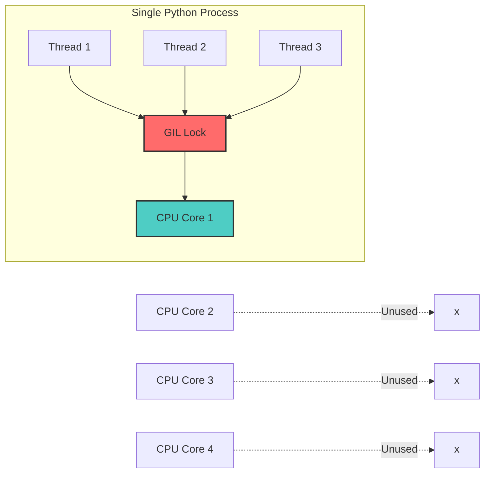
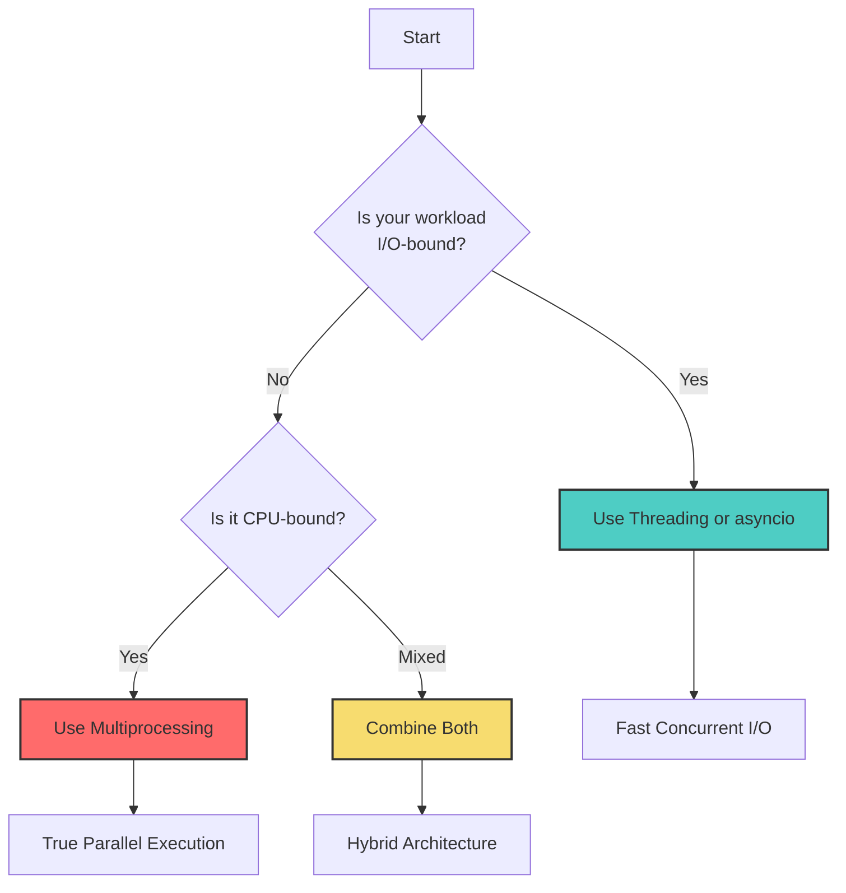
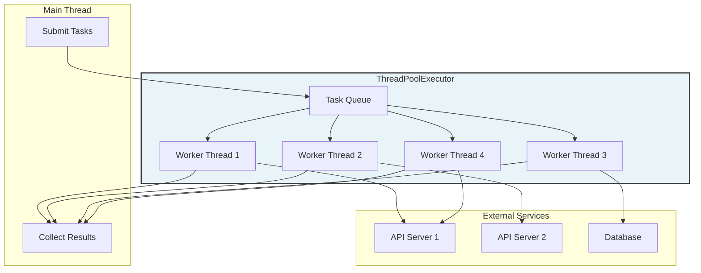
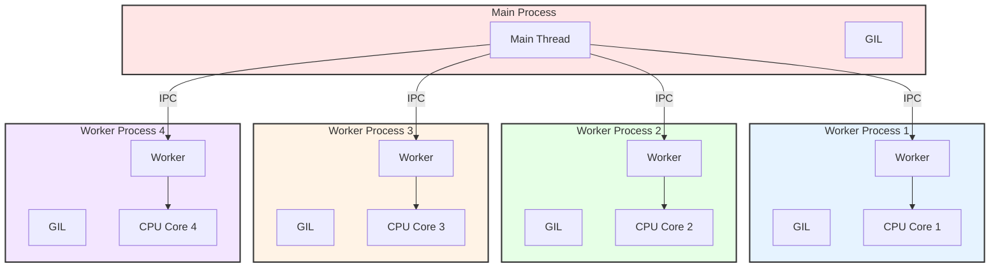
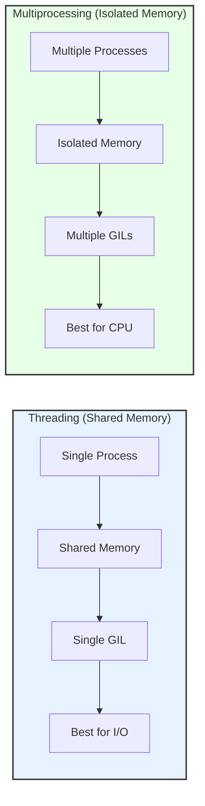
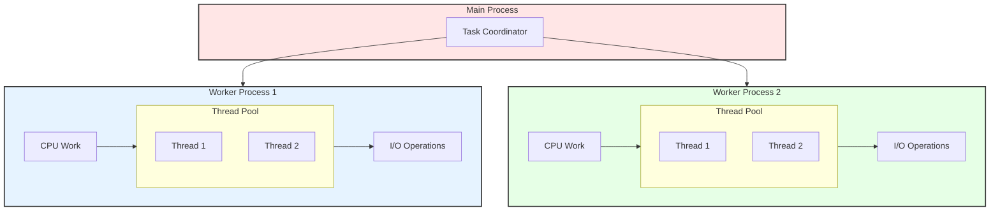
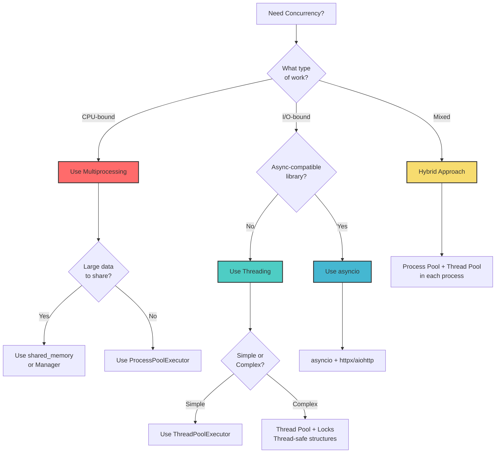

# How to Implement Multithreading vs Multiprocessing in Python

Author: [nawazdhandala](https://www.github.com/nawazdhandala)

Tags: Python, Multithreading, Multiprocessing, Concurrency, GIL, Performance

Description: Learn when to use multithreading vs multiprocessing in Python. This guide covers the GIL, thread pools, process pools, and choosing the right approach for your workload.

---

> Python offers two ways to run code in parallel: threading and multiprocessing. Choosing the right one depends on whether your workload is I/O-bound or CPU-bound. Understanding the Global Interpreter Lock (GIL) is key to making the right choice.

This guide covers both approaches in depth, with practical examples and diagrams to help you understand when to use each.

---

## Understanding the Global Interpreter Lock (GIL)

The GIL is a mutex that protects access to Python objects, preventing multiple threads from executing Python bytecode simultaneously. This means that even on multi-core machines, only one thread can execute Python code at a time within a single process.



### Why Does the GIL Exist?

The GIL exists because CPython (the standard Python implementation) uses reference counting for memory management. Without the GIL, multiple threads could corrupt object reference counts, leading to memory leaks or crashes.

```python
# gil_demo.py
# This demonstrates the GIL's impact on CPU-bound threading

import threading
import time

counter = 0

def increment_counter():
    """Increment counter many times - CPU bound work"""
    global counter
    for _ in range(1_000_000):
        counter += 1  # Not atomic! GIL saves us from race conditions

def run_threads(num_threads: int):
    """Run multiple threads incrementing the counter"""
    global counter
    counter = 0
    
    threads = []
    for _ in range(num_threads):
        t = threading.Thread(target=increment_counter)
        threads.append(t)
    
    start = time.time()
    for t in threads:
        t.start()
    for t in threads:
        t.join()
    elapsed = time.time() - start
    
    return elapsed, counter

if __name__ == '__main__':
    # Single thread
    elapsed_1, count_1 = run_threads(1)
    print(f"1 thread:  {elapsed_1:.3f}s, counter={count_1}")
    
    # Four threads - NOT faster due to GIL!
    elapsed_4, count_4 = run_threads(4)
    print(f"4 threads: {elapsed_4:.3f}s, counter={count_4}")
    
    # Notice: 4 threads often take LONGER than 1 due to GIL contention
```

---

## When to Use Threading vs Multiprocessing

The decision matrix is straightforward:

| Workload Type | Characteristic | Best Approach |
|--------------|----------------|---------------|
| I/O-bound | Waiting for network, disk, database | Threading or asyncio |
| CPU-bound | Number crunching, data processing | Multiprocessing |
| Mixed | Both I/O and CPU work | Combine both |



---

## Threading for I/O-Bound Work

When your code spends most of its time waiting for I/O operations (network requests, file reads, database queries), threading shines. The GIL is released during I/O operations, allowing other threads to run.

### Basic ThreadPoolExecutor

```python
# threading_basic.py
from concurrent.futures import ThreadPoolExecutor, as_completed
import requests
import time

def fetch_url(url: str) -> dict:
    """Fetch a URL and return status info
    
    This is I/O-bound - thread releases GIL while waiting for response
    """
    try:
        response = requests.get(url, timeout=10)
        return {
            "url": url,
            "status": response.status_code,
            "size": len(response.content)
        }
    except Exception as e:
        return {
            "url": url,
            "status": "error",
            "error": str(e)
        }

def fetch_all_sequential(urls: list) -> list:
    """Fetch URLs one at a time - slow!"""
    return [fetch_url(url) for url in urls]

def fetch_all_threaded(urls: list, max_workers: int = 10) -> list:
    """Fetch URLs concurrently using thread pool
    
    Each thread handles one URL at a time.
    While waiting for HTTP response, GIL is released.
    Other threads can execute their requests.
    """
    results = []
    
    # ThreadPoolExecutor manages a pool of worker threads
    with ThreadPoolExecutor(max_workers=max_workers) as executor:
        # Submit all tasks immediately - returns Future objects
        future_to_url = {
            executor.submit(fetch_url, url): url
            for url in urls
        }
        
        # Collect results as they complete (not in submission order)
        for future in as_completed(future_to_url):
            url = future_to_url[future]
            try:
                result = future.result()
                results.append(result)
            except Exception as e:
                results.append({"url": url, "status": "error", "error": str(e)})
    
    return results

if __name__ == '__main__':
    urls = [
        "https://httpbin.org/delay/1",
        "https://httpbin.org/delay/1",
        "https://httpbin.org/delay/1",
        "https://httpbin.org/delay/1",
        "https://httpbin.org/delay/1",
    ]
    
    # Sequential - takes ~5 seconds (1 second per URL)
    start = time.time()
    results_seq = fetch_all_sequential(urls)
    print(f"Sequential: {time.time() - start:.2f}s")
    
    # Threaded - takes ~1 second (all concurrent)
    start = time.time()
    results_threaded = fetch_all_threaded(urls, max_workers=5)
    print(f"Threaded: {time.time() - start:.2f}s")
```

### Thread Pool Architecture



### Thread-Safe Data Structures

When multiple threads access shared data, you need synchronization:

```python
# thread_safe.py
import threading
from queue import Queue
from concurrent.futures import ThreadPoolExecutor
from typing import List, Dict, Any
import time

class ThreadSafeCounter:
    """A counter that can be safely incremented from multiple threads"""
    
    def __init__(self):
        self._value = 0
        self._lock = threading.Lock()  # Mutex for thread safety
    
    def increment(self) -> int:
        """Atomically increment and return new value"""
        with self._lock:  # Acquire lock, release on exit
            self._value += 1
            return self._value
    
    @property
    def value(self) -> int:
        """Read current value (thread-safe)"""
        with self._lock:
            return self._value

class ThreadSafeCache:
    """A simple thread-safe cache using RLock
    
    RLock (reentrant lock) allows the same thread to acquire
    the lock multiple times without deadlocking.
    """
    
    def __init__(self, max_size: int = 1000):
        self._cache: Dict[str, Any] = {}
        self._lock = threading.RLock()
        self._max_size = max_size
    
    def get(self, key: str) -> Any:
        """Get value from cache, returns None if not found"""
        with self._lock:
            return self._cache.get(key)
    
    def set(self, key: str, value: Any) -> None:
        """Set a value in the cache"""
        with self._lock:
            if len(self._cache) >= self._max_size:
                # Simple eviction: remove oldest entry
                oldest_key = next(iter(self._cache))
                del self._cache[oldest_key]
            self._cache[key] = value
    
    def get_or_compute(self, key: str, compute_fn) -> Any:
        """Get from cache or compute and store
        
        This demonstrates why RLock is useful - compute_fn
        might call other methods that also need the lock.
        """
        with self._lock:
            if key in self._cache:
                return self._cache[key]
            
            value = compute_fn()
            self._cache[key] = value
            return value

def worker_with_cache(cache: ThreadSafeCache, item_id: int) -> dict:
    """Worker that uses thread-safe cache"""
    cache_key = f"item_{item_id}"
    
    # Try cache first
    result = cache.get(cache_key)
    if result is not None:
        return {"id": item_id, "cached": True, "result": result}
    
    # Expensive computation
    time.sleep(0.1)  # Simulate work
    result = item_id * 2
    
    # Store in cache
    cache.set(cache_key, result)
    return {"id": item_id, "cached": False, "result": result}

if __name__ == '__main__':
    cache = ThreadSafeCache()
    
    with ThreadPoolExecutor(max_workers=4) as executor:
        # First pass - all cache misses
        futures = [executor.submit(worker_with_cache, cache, i) for i in range(10)]
        results = [f.result() for f in futures]
        print("First pass:", sum(1 for r in results if r["cached"]), "cache hits")
        
        # Second pass - all cache hits
        futures = [executor.submit(worker_with_cache, cache, i) for i in range(10)]
        results = [f.result() for f in futures]
        print("Second pass:", sum(1 for r in results if r["cached"]), "cache hits")
```

---

## Multiprocessing for CPU-Bound Work

When your code is CPU-bound (performing calculations, processing data, etc.), multiprocessing bypasses the GIL by using separate Python interpreter processes, each with its own GIL.

### Multiprocessing Architecture



### Basic ProcessPoolExecutor

```python
# multiprocessing_basic.py
from concurrent.futures import ProcessPoolExecutor, as_completed
from multiprocessing import cpu_count
import time
import math

def compute_prime_factors(n: int) -> list:
    """Find all prime factors of n - CPU intensive
    
    This runs in a separate process with its own GIL.
    True parallel execution across multiple CPU cores.
    """
    factors = []
    d = 2
    while d * d <= n:
        while n % d == 0:
            factors.append(d)
            n //= d
        d += 1
    if n > 1:
        factors.append(n)
    return factors

def compute_heavy(n: int) -> dict:
    """Perform heavy computation - CPU bound
    
    Each call to this function will run in its own process.
    """
    # Simulate CPU-intensive work
    result = 0
    for i in range(n):
        result += math.sqrt(i) * math.sin(i)
    
    return {
        "n": n,
        "result": result,
        "factors": compute_prime_factors(n)
    }

def process_sequential(numbers: list) -> list:
    """Process numbers sequentially - uses one CPU core"""
    return [compute_heavy(n) for n in numbers]

def process_parallel(numbers: list, max_workers: int = None) -> list:
    """Process numbers in parallel across multiple CPU cores
    
    Each number is processed in a separate process.
    True parallelism - all CPU cores can be utilized.
    """
    max_workers = max_workers or cpu_count()
    results = []
    
    # ProcessPoolExecutor spawns separate Python processes
    with ProcessPoolExecutor(max_workers=max_workers) as executor:
        # Submit all tasks
        futures = {
            executor.submit(compute_heavy, n): n
            for n in numbers
        }
        
        # Collect results as they complete
        for future in as_completed(futures):
            n = futures[future]
            try:
                result = future.result()
                results.append(result)
            except Exception as e:
                print(f"Error processing {n}: {e}")
    
    return results

if __name__ == '__main__':
    # Large numbers for CPU-intensive processing
    numbers = [1_000_000 + i for i in range(8)]
    
    print(f"Processing {len(numbers)} numbers on {cpu_count()} CPU cores")
    
    # Sequential - uses one core
    start = time.time()
    results_seq = process_sequential(numbers)
    seq_time = time.time() - start
    print(f"Sequential: {seq_time:.2f}s")
    
    # Parallel - uses all cores
    start = time.time()
    results_par = process_parallel(numbers)
    par_time = time.time() - start
    print(f"Parallel: {par_time:.2f}s")
    
    print(f"Speedup: {seq_time / par_time:.2f}x")
```

### Using Pool.map for Ordered Results

```python
# pool_map.py
from multiprocessing import Pool, cpu_count
import numpy as np
import time

def process_chunk(data_chunk: np.ndarray) -> dict:
    """Process a chunk of numerical data
    
    This function runs in a worker process.
    Each process has its own memory space.
    """
    return {
        "mean": float(np.mean(data_chunk)),
        "std": float(np.std(data_chunk)),
        "min": float(np.min(data_chunk)),
        "max": float(np.max(data_chunk)),
        "sum": float(np.sum(data_chunk)),
        "size": len(data_chunk)
    }

def aggregate_results(results: list) -> dict:
    """Aggregate statistics from all chunks"""
    total_size = sum(r["size"] for r in results)
    
    return {
        "global_mean": sum(r["mean"] * r["size"] for r in results) / total_size,
        "global_min": min(r["min"] for r in results),
        "global_max": max(r["max"] for r in results),
        "global_sum": sum(r["sum"] for r in results),
        "total_size": total_size,
        "num_chunks": len(results)
    }

def process_large_array(data: np.ndarray, num_chunks: int = None) -> dict:
    """Process large array in parallel chunks
    
    Strategy:
    1. Split data into chunks
    2. Process each chunk in parallel
    3. Aggregate results
    """
    num_chunks = num_chunks or cpu_count()
    
    # Split array into roughly equal chunks
    chunks = np.array_split(data, num_chunks)
    
    # Process chunks in parallel using Pool.map
    # Results maintain order of input chunks
    with Pool(processes=num_chunks) as pool:
        results = pool.map(process_chunk, chunks)
    
    # Aggregate all chunk results
    return aggregate_results(results)

if __name__ == '__main__':
    # Create large dataset
    np.random.seed(42)
    large_data = np.random.randn(10_000_000)  # 10 million numbers
    
    print(f"Processing {len(large_data):,} numbers")
    
    # Sequential processing
    start = time.time()
    seq_result = process_chunk(large_data)
    print(f"Sequential: {time.time() - start:.2f}s")
    
    # Parallel processing
    start = time.time()
    par_result = process_large_array(large_data)
    print(f"Parallel: {time.time() - start:.2f}s")
    print(f"Result: mean={par_result['global_mean']:.4f}")
```

---

## Comparing Threading vs Multiprocessing

### Side-by-Side Comparison



### Benchmark Comparison

```python
# benchmark_comparison.py
from concurrent.futures import ThreadPoolExecutor, ProcessPoolExecutor
from multiprocessing import cpu_count
import time
import requests

# ============================================================
# I/O-BOUND TASK: Network requests
# ============================================================

def io_task(url: str) -> int:
    """I/O-bound task - makes HTTP request
    
    GIL is released during the network wait,
    allowing other threads to run.
    """
    response = requests.get(url, timeout=10)
    return response.status_code

def benchmark_io_threading(urls: list) -> float:
    """Benchmark threading for I/O tasks"""
    start = time.time()
    with ThreadPoolExecutor(max_workers=len(urls)) as executor:
        list(executor.map(io_task, urls))
    return time.time() - start

def benchmark_io_multiprocessing(urls: list) -> float:
    """Benchmark multiprocessing for I/O tasks"""
    start = time.time()
    with ProcessPoolExecutor(max_workers=len(urls)) as executor:
        list(executor.map(io_task, urls))
    return time.time() - start

# ============================================================
# CPU-BOUND TASK: Number crunching
# ============================================================

def cpu_task(n: int) -> float:
    """CPU-bound task - pure computation
    
    GIL is held throughout execution,
    preventing true parallelism in threads.
    """
    total = 0.0
    for i in range(n):
        total += (i ** 0.5) * (i ** 0.3)
    return total

def benchmark_cpu_threading(numbers: list) -> float:
    """Benchmark threading for CPU tasks"""
    start = time.time()
    with ThreadPoolExecutor(max_workers=len(numbers)) as executor:
        list(executor.map(cpu_task, numbers))
    return time.time() - start

def benchmark_cpu_multiprocessing(numbers: list) -> float:
    """Benchmark multiprocessing for CPU tasks"""
    start = time.time()
    with ProcessPoolExecutor(max_workers=len(numbers)) as executor:
        list(executor.map(cpu_task, numbers))
    return time.time() - start

if __name__ == '__main__':
    print("=" * 60)
    print("THREADING vs MULTIPROCESSING BENCHMARK")
    print("=" * 60)
    
    # I/O-bound benchmark
    print("\n--- I/O-Bound Tasks (Network Requests) ---")
    urls = ["https://httpbin.org/delay/1"] * 4
    
    io_thread_time = benchmark_io_threading(urls)
    print(f"Threading:      {io_thread_time:.2f}s")
    
    io_process_time = benchmark_io_multiprocessing(urls)
    print(f"Multiprocessing: {io_process_time:.2f}s")
    print(f"Winner: {'Threading' if io_thread_time < io_process_time else 'Multiprocessing'}")
    
    # CPU-bound benchmark
    print("\n--- CPU-Bound Tasks (Number Crunching) ---")
    numbers = [5_000_000] * cpu_count()
    
    cpu_thread_time = benchmark_cpu_threading(numbers)
    print(f"Threading:      {cpu_thread_time:.2f}s")
    
    cpu_process_time = benchmark_cpu_multiprocessing(numbers)
    print(f"Multiprocessing: {cpu_process_time:.2f}s")
    print(f"Winner: {'Threading' if cpu_thread_time < cpu_process_time else 'Multiprocessing'}")
    
    print("\n" + "=" * 60)
    print("CONCLUSION:")
    print("- Use Threading for I/O-bound tasks (network, file, database)")
    print("- Use Multiprocessing for CPU-bound tasks (computation, processing)")
    print("=" * 60)
```

---

## Hybrid Approach: Combining Both

Real-world applications often have both I/O and CPU components. Use multiprocessing for CPU-bound work and threading within each process for I/O.

### Hybrid Architecture



### Implementation

```python
# hybrid_approach.py
from concurrent.futures import ProcessPoolExecutor, ThreadPoolExecutor
from multiprocessing import cpu_count
import requests
import time
from typing import List, Dict, Any

def fetch_and_process(url: str) -> Dict[str, Any]:
    """Fetch data from URL and process it
    
    This function combines I/O (fetch) and CPU (process) work.
    It will run in a separate process.
    """
    # I/O-bound: fetch data
    response = requests.get(url, timeout=30)
    data = response.json()
    
    # CPU-bound: process data
    processed = heavy_data_processing(data)
    
    return {
        "url": url,
        "raw_size": len(response.content),
        "processed_size": len(str(processed)),
        "result": processed
    }

def heavy_data_processing(data: dict) -> dict:
    """CPU-intensive data processing"""
    # Simulate heavy processing
    result = {}
    for key, value in data.items():
        if isinstance(value, (int, float)):
            # Expensive computation
            result[key] = sum(i ** 0.5 for i in range(int(abs(value) * 1000)))
        else:
            result[key] = value
    return result

def parallel_fetch_in_process(urls: List[str]) -> List[Dict[str, Any]]:
    """Within a process, use threads for parallel fetching
    
    This function runs in a worker process and uses
    threads for concurrent I/O operations.
    """
    with ThreadPoolExecutor(max_workers=min(len(urls), 10)) as executor:
        results = list(executor.map(fetch_and_process, urls))
    return results

def hybrid_process_urls(url_batches: List[List[str]]) -> List[List[Dict[str, Any]]]:
    """Process URL batches using hybrid approach
    
    Strategy:
    1. Distribute batches across processes (multiprocessing)
    2. Within each process, use threads for I/O (threading)
    
    This maximizes both CPU utilization and I/O throughput.
    """
    with ProcessPoolExecutor(max_workers=cpu_count()) as executor:
        results = list(executor.map(parallel_fetch_in_process, url_batches))
    return results

if __name__ == '__main__':
    # Create URL batches - 4 batches of 5 URLs each
    base_url = "https://httpbin.org/json"
    url_batches = [[base_url for _ in range(5)] for _ in range(4)]
    
    print(f"Processing {sum(len(b) for b in url_batches)} URLs")
    print(f"Batches: {len(url_batches)}, URLs per batch: {len(url_batches[0])}")
    
    start = time.time()
    results = hybrid_process_urls(url_batches)
    elapsed = time.time() - start
    
    print(f"Total time: {elapsed:.2f}s")
    print(f"URLs processed: {sum(len(batch) for batch in results)}")
```

---

## FastAPI Integration

### Thread Pool for I/O Operations

```python
# fastapi_threading.py
from fastapi import FastAPI, HTTPException
from concurrent.futures import ThreadPoolExecutor
import asyncio
import httpx
from typing import List

app = FastAPI()

# Thread pool for blocking I/O operations
thread_executor = ThreadPoolExecutor(max_workers=20)

def blocking_database_call(query: str) -> dict:
    """Simulate a blocking database call
    
    This would use a non-async database driver
    that blocks the calling thread.
    """
    import time
    time.sleep(0.1)  # Simulate database latency
    return {"query": query, "result": "data from database"}

def blocking_external_api_call(url: str) -> dict:
    """Simulate a blocking HTTP call
    
    Using requests library which is blocking.
    For new code, prefer httpx with async.
    """
    import requests
    response = requests.get(url, timeout=10)
    return {"url": url, "status": response.status_code}

@app.get("/io-threaded")
async def io_threaded_endpoint(query: str):
    """Run blocking I/O in thread pool to avoid blocking event loop
    
    This pattern is essential when using blocking libraries
    in an async framework like FastAPI.
    """
    loop = asyncio.get_event_loop()
    
    # Run blocking function in thread pool
    result = await loop.run_in_executor(
        thread_executor,
        blocking_database_call,
        query
    )
    
    return result

@app.get("/batch-fetch-threaded")
async def batch_fetch_threaded(urls: List[str]):
    """Fetch multiple URLs concurrently using threads
    
    Each URL fetch runs in its own thread.
    Main event loop remains responsive.
    """
    loop = asyncio.get_event_loop()
    
    # Create tasks for all URLs
    tasks = [
        loop.run_in_executor(thread_executor, blocking_external_api_call, url)
        for url in urls
    ]
    
    # Wait for all tasks to complete
    results = await asyncio.gather(*tasks, return_exceptions=True)
    
    return {
        "total": len(urls),
        "successful": len([r for r in results if not isinstance(r, Exception)]),
        "results": results
    }

@app.on_event("shutdown")
def shutdown():
    """Clean up thread pool on shutdown"""
    thread_executor.shutdown(wait=True)
```

### Process Pool for CPU Operations

```python
# fastapi_multiprocessing.py
from fastapi import FastAPI
from concurrent.futures import ProcessPoolExecutor
from multiprocessing import cpu_count
import asyncio
from typing import List
import numpy as np

app = FastAPI()

# Process pool for CPU-intensive operations
# Created at module level, shared across requests
process_executor = ProcessPoolExecutor(max_workers=cpu_count())

def cpu_intensive_analysis(data: List[float]) -> dict:
    """Perform CPU-intensive data analysis
    
    This function runs in a separate process,
    utilizing a dedicated CPU core.
    """
    arr = np.array(data)
    
    # CPU-intensive operations
    result = {
        "mean": float(np.mean(arr)),
        "std": float(np.std(arr)),
        "median": float(np.median(arr)),
        "percentiles": {
            "p25": float(np.percentile(arr, 25)),
            "p50": float(np.percentile(arr, 50)),
            "p75": float(np.percentile(arr, 75)),
            "p95": float(np.percentile(arr, 95)),
            "p99": float(np.percentile(arr, 99)),
        },
        "histogram": np.histogram(arr, bins=10)[0].tolist()
    }
    
    return result

def process_image_batch(image_data: bytes) -> dict:
    """Process image data - CPU intensive
    
    Each image is processed in a separate process.
    """
    # Simulate image processing
    import hashlib
    import time
    
    time.sleep(0.5)  # Simulate processing time
    
    return {
        "size": len(image_data),
        "hash": hashlib.sha256(image_data).hexdigest()[:16],
        "processed": True
    }

@app.post("/analyze")
async def analyze_data(data: List[float]):
    """Analyze data using CPU-intensive algorithms
    
    Offloads computation to process pool to avoid
    blocking the async event loop.
    """
    loop = asyncio.get_event_loop()
    
    result = await loop.run_in_executor(
        process_executor,
        cpu_intensive_analysis,
        data
    )
    
    return result

@app.post("/process-images")
async def process_images(images: List[bytes]):
    """Process multiple images in parallel
    
    Each image is processed in a separate process,
    utilizing all available CPU cores.
    """
    loop = asyncio.get_event_loop()
    
    # Create tasks for all images
    tasks = [
        loop.run_in_executor(process_executor, process_image_batch, img)
        for img in images
    ]
    
    # Process all images in parallel
    results = await asyncio.gather(*tasks, return_exceptions=True)
    
    successful = [r for r in results if not isinstance(r, Exception)]
    failed = [str(r) for r in results if isinstance(r, Exception)]
    
    return {
        "total": len(images),
        "successful": len(successful),
        "failed": len(failed),
        "results": successful,
        "errors": failed
    }

@app.on_event("shutdown")
def shutdown():
    """Clean up process pool on shutdown
    
    Important: always clean up executor to prevent
    orphan processes and resource leaks.
    """
    process_executor.shutdown(wait=True)
```

---

## Common Pitfalls and Solutions

### Pitfall 1: Pickle Errors in Multiprocessing

```python
# pickle_issues.py
from concurrent.futures import ProcessPoolExecutor
from multiprocessing import cpu_count

# BAD: Lambda functions can't be pickled
# executor.submit(lambda x: x * 2, 5)  # Will fail!

# BAD: Local functions inside another function
def outer():
    def inner(x):  # Can't be pickled!
        return x * 2
    # executor.submit(inner, 5)  # Will fail!

# GOOD: Module-level function
def multiply_by_two(x):
    """Module-level function - can be pickled"""
    return x * 2

# GOOD: Use functools.partial for fixed arguments
from functools import partial

def multiply(x, factor):
    return x * factor

multiply_by_three = partial(multiply, factor=3)

# GOOD: Use class with __call__ method
class Processor:
    def __init__(self, factor):
        self.factor = factor
    
    def __call__(self, x):
        return x * self.factor

if __name__ == '__main__':
    processor = Processor(factor=5)
    
    with ProcessPoolExecutor(max_workers=2) as executor:
        # All these work
        result1 = executor.submit(multiply_by_two, 10).result()
        result2 = executor.submit(multiply_by_three, 10).result()
        result3 = executor.submit(processor, 10).result()
        
        print(f"Results: {result1}, {result2}, {result3}")
```

### Pitfall 2: Sharing State Between Processes

```python
# shared_state.py
from multiprocessing import Process, Value, Array, Manager
import ctypes

# Method 1: Value and Array for simple types
def worker_with_value(shared_counter, shared_array):
    """Worker that modifies shared memory"""
    
    # Atomic increment of shared value
    with shared_counter.get_lock():
        shared_counter.value += 1
    
    # Modify shared array
    for i in range(len(shared_array)):
        shared_array[i] *= 2

def demo_value_array():
    """Demonstrate Value and Array sharing"""
    # Shared integer (thread/process safe)
    counter = Value(ctypes.c_int, 0)
    
    # Shared array of doubles
    arr = Array(ctypes.c_double, [1.0, 2.0, 3.0, 4.0])
    
    processes = [
        Process(target=worker_with_value, args=(counter, arr))
        for _ in range(4)
    ]
    
    for p in processes:
        p.start()
    for p in processes:
        p.join()
    
    print(f"Counter: {counter.value}")  # 4
    print(f"Array: {list(arr)}")  # Modified by all workers

# Method 2: Manager for complex objects
def worker_with_manager(shared_dict, shared_list, worker_id):
    """Worker that uses Manager-provided objects"""
    
    # These operations are proxied to the manager process
    shared_dict[f"worker_{worker_id}"] = f"result_{worker_id}"
    shared_list.append(worker_id)

def demo_manager():
    """Demonstrate Manager for complex shared objects"""
    with Manager() as manager:
        # Create shared dict and list
        shared_dict = manager.dict()
        shared_list = manager.list()
        
        processes = [
            Process(target=worker_with_manager, args=(shared_dict, shared_list, i))
            for i in range(4)
        ]
        
        for p in processes:
            p.start()
        for p in processes:
            p.join()
        
        print(f"Dict: {dict(shared_dict)}")
        print(f"List: {list(shared_list)}")

if __name__ == '__main__':
    print("=== Value and Array ===")
    demo_value_array()
    
    print("\n=== Manager ===")
    demo_manager()
```

### Pitfall 3: Deadlocks in Threading

```python
# deadlock_prevention.py
import threading
import time

# BAD: Potential deadlock with multiple locks
class DeadlockRisk:
    def __init__(self):
        self.lock_a = threading.Lock()
        self.lock_b = threading.Lock()
    
    def method_1(self):
        with self.lock_a:
            time.sleep(0.1)
            with self.lock_b:  # Waiting for lock_b
                pass
    
    def method_2(self):
        with self.lock_b:
            time.sleep(0.1)
            with self.lock_a:  # Waiting for lock_a - DEADLOCK!
                pass

# GOOD: Always acquire locks in consistent order
class SafeMultiLock:
    def __init__(self):
        self.lock_a = threading.Lock()
        self.lock_b = threading.Lock()
        # Lock ordering: always acquire lock_a before lock_b
    
    def method_1(self):
        with self.lock_a:
            with self.lock_b:
                # Safe - consistent lock order
                pass
    
    def method_2(self):
        with self.lock_a:  # Same order as method_1
            with self.lock_b:
                pass

# BETTER: Use RLock for reentrant locking
class ReentrantSafe:
    def __init__(self):
        self.lock = threading.RLock()  # Reentrant lock
    
    def outer_method(self):
        with self.lock:
            # Can safely call inner_method
            self.inner_method()
    
    def inner_method(self):
        with self.lock:  # Same thread can reacquire
            pass

# BEST: Use context management and timeouts
class TimeoutSafe:
    def __init__(self):
        self.lock = threading.Lock()
    
    def safe_operation(self, timeout: float = 5.0) -> bool:
        """Attempt operation with timeout to prevent deadlock"""
        acquired = self.lock.acquire(timeout=timeout)
        if not acquired:
            return False  # Could not acquire lock in time
        
        try:
            # Do work here
            return True
        finally:
            self.lock.release()
```

---

## Performance Tuning

### Optimal Worker Count

```python
# worker_tuning.py
from concurrent.futures import ThreadPoolExecutor, ProcessPoolExecutor
from multiprocessing import cpu_count
import time
import statistics

def io_task():
    """Simulate I/O-bound task with 100ms latency"""
    import requests
    requests.get("https://httpbin.org/delay/0.1")
    return True

def cpu_task():
    """Simulate CPU-bound task"""
    total = 0
    for i in range(1_000_000):
        total += i ** 0.5
    return total

def benchmark_workers(task_fn, executor_class, worker_counts, num_tasks=20):
    """Benchmark different worker counts"""
    results = {}
    
    for workers in worker_counts:
        times = []
        
        for _ in range(3):  # Run 3 times for average
            start = time.time()
            with executor_class(max_workers=workers) as executor:
                list(executor.map(task_fn, range(num_tasks)))
            times.append(time.time() - start)
        
        results[workers] = {
            "mean": statistics.mean(times),
            "std": statistics.stdev(times) if len(times) > 1 else 0
        }
    
    return results

if __name__ == '__main__':
    num_cpus = cpu_count()
    print(f"CPU cores: {num_cpus}")
    
    # For I/O-bound: try 1x, 2x, 4x, 8x CPU count
    io_workers = [num_cpus, num_cpus * 2, num_cpus * 4, num_cpus * 8]
    
    print("\n--- I/O-Bound Task (Threading) ---")
    print("Rule of thumb: Start with 2x-4x CPU count for I/O-bound work")
    io_results = benchmark_workers(io_task, ThreadPoolExecutor, io_workers)
    for workers, stats in io_results.items():
        print(f"Workers: {workers:3d} | Time: {stats['mean']:.3f}s")
    
    # For CPU-bound: try 0.5x, 1x, 1.5x, 2x CPU count
    cpu_workers = [max(1, num_cpus // 2), num_cpus, int(num_cpus * 1.5), num_cpus * 2]
    
    print("\n--- CPU-Bound Task (Multiprocessing) ---")
    print("Rule of thumb: Use CPU count or CPU count - 1")
    cpu_results = benchmark_workers(cpu_task, ProcessPoolExecutor, cpu_workers)
    for workers, stats in cpu_results.items():
        print(f"Workers: {workers:3d} | Time: {stats['mean']:.3f}s")
```

### Chunking for Efficiency

```python
# chunking_strategy.py
from concurrent.futures import ProcessPoolExecutor
from multiprocessing import cpu_count
import time
from typing import List, Iterator, TypeVar

T = TypeVar('T')

def chunk_iterable(iterable: List[T], chunk_size: int) -> Iterator[List[T]]:
    """Split iterable into chunks of specified size"""
    for i in range(0, len(iterable), chunk_size):
        yield iterable[i:i + chunk_size]

def process_single(item: int) -> int:
    """Process a single item - has overhead per call"""
    return item ** 2

def process_chunk(chunk: List[int]) -> List[int]:
    """Process a chunk of items - reduces overhead"""
    return [item ** 2 for item in chunk]

def benchmark_chunking(items: List[int], chunk_sizes: List[int]) -> dict:
    """Benchmark different chunk sizes"""
    results = {}
    
    for chunk_size in chunk_sizes:
        if chunk_size == 1:
            # No chunking - one IPC call per item
            start = time.time()
            with ProcessPoolExecutor(max_workers=cpu_count()) as executor:
                list(executor.map(process_single, items))
            elapsed = time.time() - start
        else:
            # Chunked - fewer IPC calls
            chunks = list(chunk_iterable(items, chunk_size))
            start = time.time()
            with ProcessPoolExecutor(max_workers=cpu_count()) as executor:
                chunk_results = list(executor.map(process_chunk, chunks))
            elapsed = time.time() - start
        
        results[chunk_size] = elapsed
    
    return results

if __name__ == '__main__':
    # 10000 small tasks
    items = list(range(10000))
    
    print("Benchmarking chunk sizes for 10000 items:")
    print("(Smaller time = better)")
    print()
    
    chunk_sizes = [1, 10, 50, 100, 500, 1000]
    results = benchmark_chunking(items, chunk_sizes)
    
    for chunk_size, elapsed in results.items():
        label = "no chunking" if chunk_size == 1 else f"chunk_size={chunk_size}"
        print(f"{label:20s} | {elapsed:.3f}s")
    
    optimal = min(results, key=results.get)
    print(f"\nOptimal chunk size: {optimal}")
```

---

## Decision Flowchart



---

## Summary

| Aspect | Threading | Multiprocessing |
|--------|-----------|-----------------|
| GIL Impact | Limited by GIL for CPU work | Bypasses GIL completely |
| Memory | Shared memory space | Isolated memory per process |
| Overhead | Low (no process spawn) | Higher (process creation) |
| Communication | Direct access to shared data | IPC required (pickle) |
| Best For | I/O-bound tasks | CPU-bound tasks |
| Debugging | Easier (single process) | Harder (multiple processes) |
| Default Workers | I/O tasks * 2 to * 4 | Number of CPU cores |

### Quick Reference

```python
# I/O-bound: Use ThreadPoolExecutor
from concurrent.futures import ThreadPoolExecutor

with ThreadPoolExecutor(max_workers=20) as executor:
    results = executor.map(fetch_url, urls)

# CPU-bound: Use ProcessPoolExecutor
from concurrent.futures import ProcessPoolExecutor

with ProcessPoolExecutor() as executor:  # Defaults to cpu_count()
    results = executor.map(compute_heavy, data)

# Mixed: Combine both
# Main process uses ProcessPoolExecutor
# Each worker process can use ThreadPoolExecutor for I/O
```

---

*Need to monitor your concurrent Python applications? [OneUptime](https://oneuptime.com) provides application performance monitoring with distributed tracing to track threads and processes across your infrastructure.*
