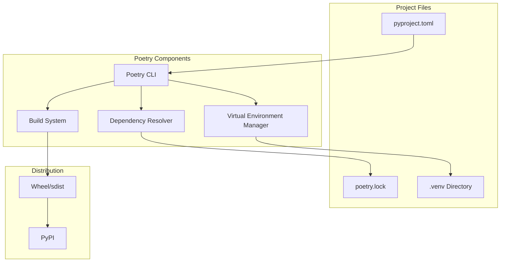
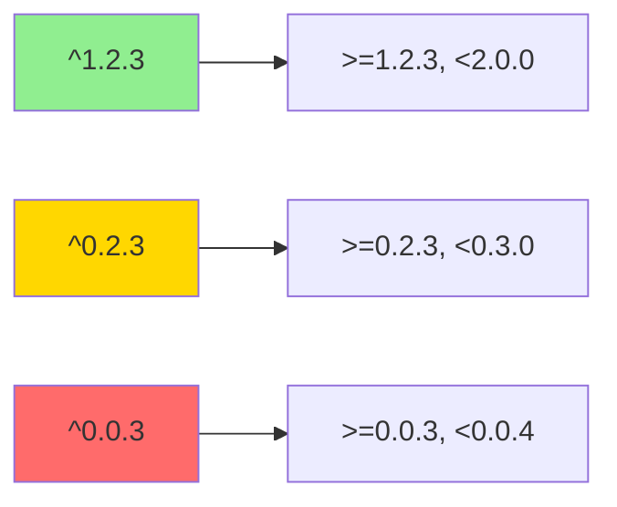
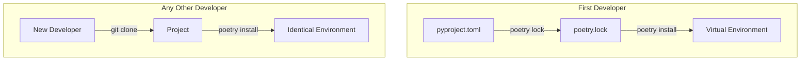
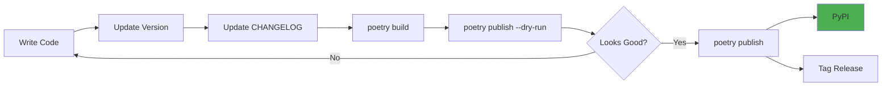

# How to Use Poetry for Dependency Management in Python

Author: [nawazdhandala](https://www.github.com/nawazdhandala)

Tags: Python, Poetry, Dependency Management, Packaging, pyproject.toml

Description: A comprehensive guide to managing Python dependencies with Poetry. Learn project setup, dependency groups, virtual environments, and publishing packages to PyPI.

---

> Python's packaging ecosystem has historically been fragmented between pip, setuptools, virtualenv, and requirements.txt files. Poetry provides a unified solution that handles dependency resolution, virtual environments, and package publishing with a single, intuitive tool. This guide walks you through everything you need to know to master Poetry.

Managing Python dependencies with pip and requirements.txt works for small projects, but quickly becomes unwieldy. Version conflicts, missing development dependencies, and reproducibility issues plague teams. Poetry solves these problems by providing deterministic builds, proper dependency resolution, and a modern workflow.

---

## Why Poetry Over pip and requirements.txt

Traditional Python dependency management has several pain points:

```text
# Traditional approach - multiple files, manual management
requirements.txt        # Production dependencies
requirements-dev.txt    # Development dependencies
setup.py                # Package configuration
setup.cfg               # More package configuration
MANIFEST.in             # File inclusion rules
```

Poetry consolidates everything into a single `pyproject.toml` file with deterministic locking via `poetry.lock`. This ensures every developer and deployment environment uses exactly the same dependency versions.

---

## Poetry Architecture Overview



Poetry handles three main concerns:
1. **Dependency Resolution** - Finds compatible versions for all packages
2. **Virtual Environment Management** - Isolates project dependencies
3. **Build and Publish** - Creates and uploads packages to PyPI

---

## Installing Poetry

### Recommended Installation Method

Poetry should be installed globally, separate from your project's virtual environment. The official installer is the recommended approach:

```bash
# Install Poetry using the official installer script
# This installs Poetry in an isolated environment
curl -sSL https://install.python-poetry.org | python3 -

# Add Poetry to your PATH (add to ~/.bashrc or ~/.zshrc)
export PATH="$HOME/.local/bin:$PATH"

# Verify installation was successful
poetry --version
```

### Alternative Installation with pipx

For those who prefer pipx for managing Python CLI tools:

```bash
# Install pipx if not already installed
python3 -m pip install --user pipx
python3 -m pipx ensurepath

# Install Poetry via pipx for isolated installation
pipx install poetry

# Verify installation
poetry --version
```

### Configuring Poetry

Configure Poetry settings for your workflow:

```bash
# Create virtual environments inside the project directory
# This makes IDE integration easier and keeps everything contained
poetry config virtualenvs.in-project true

# Set the preferred Python version for new projects
poetry config virtualenvs.prefer-active-python true

# View all current configuration
poetry config --list

# Configuration is stored in ~/.config/pypoetry/config.toml
```

---

## Creating a New Project

### Starting from Scratch

Use `poetry new` to scaffold a complete project structure:

```bash
# Create a new Python project with standard layout
poetry new my-awesome-project

# This creates the following structure:
# my-awesome-project/
# ├── README.md                 # Project documentation
# ├── my_awesome_project/       # Source package (underscores)
# │   └── __init__.py          # Package initialization
# ├── pyproject.toml           # Project configuration
# └── tests/                   # Test directory
#     └── __init__.py          # Test package initialization
```

### Initializing an Existing Project

For existing projects, use `poetry init` interactively:

```bash
# Navigate to your existing project
cd existing-project

# Initialize Poetry interactively
# Poetry will prompt for project metadata
poetry init

# Or skip prompts with defaults
poetry init --no-interaction
```

---

## Understanding pyproject.toml

The `pyproject.toml` file is the heart of your Poetry project. Here is a complete example with detailed explanations:

```toml
# pyproject.toml
# Poetry project configuration file following PEP 518 and PEP 621

[tool.poetry]
# Basic project metadata - required fields
name = "my-awesome-project"          # Package name on PyPI
version = "0.1.0"                    # Semantic version (MAJOR.MINOR.PATCH)
description = "A sample Python project using Poetry"
authors = ["Your Name <you@example.com>"]

# Optional metadata for PyPI and documentation
readme = "README.md"                 # Path to README file
license = "MIT"                      # SPDX license identifier
homepage = "https://github.com/you/my-awesome-project"
repository = "https://github.com/you/my-awesome-project"
documentation = "https://my-awesome-project.readthedocs.io"
keywords = ["python", "poetry", "example"]

# PyPI classifiers for categorization
classifiers = [
    "Development Status :: 4 - Beta",
    "Intended Audience :: Developers",
    "License :: OSI Approved :: MIT License",
    "Programming Language :: Python :: 3",
    "Programming Language :: Python :: 3.10",
    "Programming Language :: Python :: 3.11",
    "Programming Language :: Python :: 3.12",
]

# Packages to include in distribution
packages = [
    { include = "my_awesome_project", from = "src" }  # For src layout
]

# Files to include in the package (beyond Python files)
include = [
    "CHANGELOG.md",
    "py.typed",  # PEP 561 marker for typed packages
]

# Files to exclude from the package
exclude = [
    "tests/*",
    "docs/*",
]

[tool.poetry.dependencies]
# Production dependencies - required for your application to run
python = "^3.10"                     # Python version constraint
requests = "^2.31.0"                 # HTTP library
pydantic = "^2.5.0"                  # Data validation
sqlalchemy = "^2.0.23"               # Database ORM
redis = "^5.0.1"                     # Redis client

[tool.poetry.group.dev.dependencies]
# Development dependencies - only needed during development
pytest = "^7.4.3"                    # Testing framework
pytest-cov = "^4.1.0"                # Coverage reporting
pytest-asyncio = "^0.21.1"           # Async test support
black = "^23.12.0"                   # Code formatter
ruff = "^0.1.8"                      # Fast linter
mypy = "^1.7.1"                      # Static type checker

[tool.poetry.group.docs]
# Documentation dependencies - optional group
optional = true                      # Not installed by default

[tool.poetry.group.docs.dependencies]
mkdocs = "^1.5.3"                    # Documentation generator
mkdocs-material = "^9.5.2"           # Material theme

[tool.poetry.scripts]
# Console scripts - CLI entry points
my-cli = "my_awesome_project.cli:main"    # Creates 'my-cli' command
my-server = "my_awesome_project.server:run"  # Creates 'my-server' command

[tool.poetry.extras]
# Optional dependency groups that users can install
postgres = ["psycopg2-binary"]       # poetry install -E postgres
mysql = ["mysqlclient"]              # poetry install -E mysql
all = ["psycopg2-binary", "mysqlclient"]  # poetry install -E all

[build-system]
# PEP 517 build system specification
requires = ["poetry-core>=1.0.0"]
build-backend = "poetry.core.masonry.api"
```

---

## Managing Dependencies

### Adding Dependencies

Poetry provides granular control over dependency installation:

```bash
# Add a production dependency
# Poetry automatically resolves the best compatible version
poetry add requests

# Add a specific version
poetry add requests@2.31.0

# Add with version constraint
poetry add "requests>=2.31,<3.0"

# Add latest version within constraints
poetry add requests@latest

# Add from a Git repository
poetry add git+https://github.com/user/repo.git

# Add from a specific branch
poetry add git+https://github.com/user/repo.git#develop

# Add from a local path (useful for monorepos)
poetry add ../shared-lib/
```

### Adding Development Dependencies

Development dependencies are isolated from production:

```bash
# Add to the dev dependency group
poetry add --group dev pytest pytest-cov

# Shorthand for dev group
poetry add -D black ruff mypy

# Add to a custom group
poetry add --group docs mkdocs mkdocs-material

# Add optional dependency group
poetry add --group test --optional pytest-benchmark
```

### Removing Dependencies

```bash
# Remove a dependency
poetry remove requests

# Remove from a specific group
poetry remove --group dev pytest

# Remove multiple packages
poetry remove black ruff mypy
```

### Updating Dependencies

```bash
# Update all dependencies to latest compatible versions
poetry update

# Update specific packages
poetry update requests pydantic

# Update only within constraints (no major version bumps)
poetry update --no-dev

# Show outdated packages
poetry show --outdated

# Show dependency tree
poetry show --tree
```

---

## Dependency Version Constraints

Poetry uses a powerful version constraint syntax. Understanding these constraints ensures reproducible builds:

```toml
[tool.poetry.dependencies]
# Caret constraint (^) - recommended for most packages
# Allows changes that do not modify the leftmost non-zero digit
requests = "^2.31.0"     # >=2.31.0 <3.0.0
pydantic = "^2.0"        # >=2.0.0 <3.0.0
fastapi = "^0.104.0"     # >=0.104.0 <0.105.0 (see explanation below)

# Tilde constraint (~) - more restrictive
# Only allows patch-level changes
django = "~4.2"          # >=4.2.0 <4.3.0
flask = "~2.3.3"         # >=2.3.3 <2.4.0

# Exact version constraint (==)
# Use sparingly - prevents security updates
legacy-package = "==1.2.3"

# Wildcard constraint (*)
# Allows any version matching the pattern
numpy = "1.26.*"         # >=1.26.0 <1.27.0

# Inequality constraints
sqlalchemy = ">=2.0.0"   # Any version 2.0+
redis = ">5.0,<6.0"      # Between 5.0 and 6.0

# Complex constraints
celery = ">=5.3.0,<6.0.0,!=5.3.1"  # 5.3+ but not 5.3.1, below 6.0
```

### Understanding Caret Constraints for 0.x Versions

The caret constraint behaves differently for packages with major version 0:



This behavior exists because packages at version 0.x are considered unstable, so even minor version bumps might contain breaking changes.

---

## Virtual Environment Management

### Poetry's Virtual Environment Handling

Poetry automatically creates and manages virtual environments:

```bash
# Install dependencies and create virtual environment
# Poetry automatically detects or creates a venv
poetry install

# Install without dev dependencies (for production)
poetry install --no-dev

# Install with optional group
poetry install --with docs

# Install only specific groups
poetry install --only main

# Install extras
poetry install --extras "postgres mysql"
poetry install --all-extras
```

### Working with Virtual Environments

```bash
# Activate the virtual environment
poetry shell

# Run a command in the virtual environment without activating
poetry run python script.py
poetry run pytest tests/

# Get information about the environment
poetry env info

# Show the path to the virtual environment
poetry env info --path

# List all virtual environments for this project
poetry env list

# Use a specific Python version
poetry env use python3.11
poetry env use /usr/bin/python3.11

# Remove virtual environment
poetry env remove python3.10
```

### Virtual Environment Configuration

```bash
# Create virtual environments inside the project (.venv directory)
poetry config virtualenvs.in-project true

# Prefer the active Python version
poetry config virtualenvs.prefer-active-python true

# Specify where to store virtual environments globally
poetry config virtualenvs.path ~/.cache/pypoetry/virtualenvs
```

---

## The poetry.lock File

The lock file is crucial for reproducible builds. It records exact versions of all dependencies:



### Managing the Lock File

```bash
# Generate or update the lock file
poetry lock

# Update lock file without installing
poetry lock --no-update

# Check if lock file is consistent with pyproject.toml
poetry check

# Export to requirements.txt format (for compatibility)
poetry export -f requirements.txt --output requirements.txt

# Export without hashes
poetry export -f requirements.txt --without-hashes > requirements.txt

# Export only production dependencies
poetry export -f requirements.txt --without dev > requirements.txt
```

### Best Practices for poetry.lock

```text
# .gitignore for a library (do not commit lock file)
poetry.lock

# For applications, ALWAYS commit the lock file
# This ensures reproducible deployments
```

---

## Dependency Groups Deep Dive

Poetry's dependency groups allow fine-grained control over what gets installed:

```toml
# pyproject.toml - Complete dependency groups example

[tool.poetry.dependencies]
# Main dependencies - always installed
python = "^3.10"
fastapi = "^0.104.0"
uvicorn = "^0.24.0"
sqlalchemy = "^2.0.0"

[tool.poetry.group.dev.dependencies]
# Development tools - installed by default
pytest = "^7.4.0"
pytest-asyncio = "^0.21.0"
black = "^23.12.0"
ruff = "^0.1.8"
mypy = "^1.7.0"

[tool.poetry.group.test]
# Test dependencies - different from dev
optional = true

[tool.poetry.group.test.dependencies]
pytest-cov = "^4.1.0"
pytest-benchmark = "^4.0.0"
factory-boy = "^3.3.0"
faker = "^21.0.0"

[tool.poetry.group.docs]
# Documentation dependencies
optional = true

[tool.poetry.group.docs.dependencies]
mkdocs = "^1.5.0"
mkdocs-material = "^9.5.0"
mkdocstrings = {extras = ["python"], version = "^0.24.0"}

[tool.poetry.group.lint]
# Linting and code quality
optional = true

[tool.poetry.group.lint.dependencies]
pre-commit = "^3.6.0"
bandit = "^1.7.0"
safety = "^2.3.0"
```

### Installing Specific Groups

```bash
# Install main and dev (default behavior)
poetry install

# Install main only (no dev dependencies)
poetry install --only main

# Install with optional groups
poetry install --with test,docs

# Install without specific groups
poetry install --without test

# Install only specific groups
poetry install --only main,test

# Combination: main + dev + test, without docs
poetry install --with test --without docs
```

---

## Scripts and CLI Entry Points

Define command-line tools that get installed with your package:

```toml
# pyproject.toml

[tool.poetry.scripts]
# Format: command-name = "module.path:function"

# Simple CLI command
my-cli = "my_project.cli:main"

# Server startup command
my-server = "my_project.server:run"

# Database migration tool
db-migrate = "my_project.database:migrate"

# Multiple entry points for different purposes
my-worker = "my_project.worker:start_worker"
my-scheduler = "my_project.scheduler:start_scheduler"
```

### Implementing CLI Entry Points

```python
# my_project/cli.py
# CLI implementation with proper entry point

import argparse
import sys


def main():
    """
    Main entry point for the CLI command.
    This function is called when users run 'my-cli' from the command line.
    """
    # Set up argument parser for command-line arguments
    parser = argparse.ArgumentParser(
        prog="my-cli",
        description="My awesome CLI tool"
    )
    
    # Add subcommands for different operations
    subparsers = parser.add_subparsers(dest="command", help="Available commands")
    
    # 'init' subcommand
    init_parser = subparsers.add_parser("init", help="Initialize a new project")
    init_parser.add_argument("name", help="Project name")
    
    # 'run' subcommand
    run_parser = subparsers.add_parser("run", help="Run the application")
    run_parser.add_argument("--port", type=int, default=8000, help="Port number")
    
    # Parse arguments from command line
    args = parser.parse_args()
    
    # Route to appropriate handler based on command
    if args.command == "init":
        initialize_project(args.name)
    elif args.command == "run":
        run_application(args.port)
    else:
        # No command provided - show help
        parser.print_help()
        sys.exit(1)


def initialize_project(name: str) -> None:
    """Initialize a new project with the given name."""
    print(f"Initializing project: {name}")
    # Project initialization logic here


def run_application(port: int) -> None:
    """Run the application on the specified port."""
    print(f"Starting application on port {port}")
    # Application startup logic here


# Allow running directly with 'python -m my_project.cli'
if __name__ == "__main__":
    main()
```

---

## Building and Publishing Packages

### Building Your Package

```bash
# Build both wheel and source distribution
poetry build

# This creates files in the dist/ directory:
# dist/
# ├── my_awesome_project-0.1.0-py3-none-any.whl  # Wheel (fast to install)
# └── my_awesome_project-0.1.0.tar.gz            # Source distribution

# Build only wheel
poetry build --format wheel

# Build only source distribution
poetry build --format sdist
```

### Publishing to PyPI

```bash
# Configure PyPI credentials
poetry config pypi-token.pypi your-api-token

# Publish to PyPI (builds automatically if needed)
poetry publish

# Build and publish in one command
poetry publish --build

# Publish to TestPyPI for testing
poetry config repositories.testpypi https://test.pypi.org/legacy/
poetry publish --repository testpypi

# Dry run - show what would be published
poetry publish --dry-run
```

### Publishing Workflow



### Version Management

```bash
# Bump version automatically
poetry version patch   # 0.1.0 -> 0.1.1
poetry version minor   # 0.1.1 -> 0.2.0
poetry version major   # 0.2.0 -> 1.0.0

# Set specific version
poetry version 2.0.0

# Prerelease versions
poetry version prepatch  # 1.0.0 -> 1.0.1a0
poetry version preminor  # 1.0.0 -> 1.1.0a0
poetry version premajor  # 1.0.0 -> 2.0.0a0

# Show current version
poetry version --short
```

---

## Extras and Optional Dependencies

Extras allow users to install optional features:

```toml
# pyproject.toml

[tool.poetry.dependencies]
python = "^3.10"
fastapi = "^0.104.0"

# Optional dependencies (not installed by default)
psycopg2-binary = {version = "^2.9.0", optional = true}
aiomysql = {version = "^0.2.0", optional = true}
redis = {version = "^5.0.0", optional = true}
celery = {version = "^5.3.0", optional = true}

[tool.poetry.extras]
# Define extras that group optional dependencies
postgres = ["psycopg2-binary"]
mysql = ["aiomysql"]
redis = ["redis"]
celery = ["celery", "redis"]
all-databases = ["psycopg2-binary", "aiomysql", "redis"]
all = ["psycopg2-binary", "aiomysql", "redis", "celery"]
```

### Installing Extras

```bash
# Users install extras with pip or poetry
pip install my-package[postgres]
pip install my-package[postgres,redis]
pip install my-package[all]

# With poetry
poetry add my-package --extras "postgres redis"
poetry install --extras "postgres"
poetry install --all-extras
```

---

## Working with Monorepos

Poetry supports monorepo structures with local path dependencies:

```text
monorepo/
├── packages/
│   ├── core/
│   │   ├── pyproject.toml
│   │   └── core/
│   │       └── __init__.py
│   ├── api/
│   │   ├── pyproject.toml
│   │   └── api/
│   │       └── __init__.py
│   └── worker/
│       ├── pyproject.toml
│       └── worker/
│           └── __init__.py
└── pyproject.toml  # Root workspace (optional)
```

### Local Path Dependencies

```toml
# packages/api/pyproject.toml

[tool.poetry.dependencies]
python = "^3.10"
# Reference sibling package using relative path
core = {path = "../core", develop = true}
```

### Development Mode

```bash
# The develop = true flag installs in editable mode
# Changes to core/ are immediately available to api/

# Install with local dependencies
cd packages/api
poetry install

# This creates a symlink instead of copying the package
```

---

## CI/CD Integration

### GitHub Actions Example

```yaml
# .github/workflows/test.yml
name: Test

on:
  push:
    branches: [main]
  pull_request:
    branches: [main]

jobs:
  test:
    runs-on: ubuntu-latest
    strategy:
      matrix:
        python-version: ["3.10", "3.11", "3.12"]

    steps:
      # Check out the repository
      - uses: actions/checkout@v4

      # Set up Python with specified version
      - name: Set up Python ${{ matrix.python-version }}
        uses: actions/setup-python@v5
        with:
          python-version: ${{ matrix.python-version }}

      # Install Poetry using the official installer
      - name: Install Poetry
        uses: snok/install-poetry@v1
        with:
          version: 1.7.1
          virtualenvs-create: true
          virtualenvs-in-project: true

      # Cache the virtual environment for faster builds
      - name: Load cached venv
        id: cached-poetry-dependencies
        uses: actions/cache@v3
        with:
          path: .venv
          key: venv-${{ runner.os }}-${{ matrix.python-version }}-${{ hashFiles('**/poetry.lock') }}

      # Install dependencies only if cache miss
      - name: Install dependencies
        if: steps.cached-poetry-dependencies.outputs.cache-hit != 'true'
        run: poetry install --no-interaction --no-root

      # Install the project itself
      - name: Install project
        run: poetry install --no-interaction

      # Run the test suite
      - name: Run tests
        run: poetry run pytest tests/ --cov=my_project --cov-report=xml

      # Upload coverage to Codecov
      - name: Upload coverage
        uses: codecov/codecov-action@v3
        with:
          file: ./coverage.xml
```

### Docker Integration

```dockerfile
# Dockerfile
# Multi-stage build for Python application with Poetry

# Build stage - install dependencies
FROM python:3.11-slim as builder

# Install Poetry in isolated environment
ENV POETRY_HOME="/opt/poetry"
ENV POETRY_VIRTUALENVS_IN_PROJECT=true
ENV POETRY_NO_INTERACTION=1
RUN pip install poetry

# Set working directory
WORKDIR /app

# Copy dependency files first (for better layer caching)
COPY pyproject.toml poetry.lock ./

# Install dependencies (no dev dependencies for production)
RUN poetry install --no-dev --no-root

# Copy application code
COPY . .

# Install the project itself
RUN poetry install --no-dev


# Production stage - minimal runtime image
FROM python:3.11-slim as production

# Create non-root user for security
RUN useradd --create-home --shell /bin/bash app
USER app

# Set working directory
WORKDIR /app

# Copy virtual environment from builder
COPY --from=builder /app/.venv ./.venv

# Copy application code
COPY --from=builder /app .

# Add virtual environment to PATH
ENV PATH="/app/.venv/bin:$PATH"

# Run the application
CMD ["python", "-m", "my_project"]
```

---

## Integrating with Development Tools

### Black, Ruff, and MyPy Configuration

Poetry uses pyproject.toml for tool configuration:

```toml
# pyproject.toml - Tool configuration section

[tool.black]
# Black code formatter configuration
line-length = 100
target-version = ['py310', 'py311', 'py312']
include = '\.pyi?$'
exclude = '''
/(
    \.git
    | \.venv
    | build
    | dist
)/
'''

[tool.ruff]
# Ruff linter configuration
line-length = 100
target-version = "py310"

[tool.ruff.lint]
select = [
    "E",    # pycodestyle errors
    "W",    # pycodestyle warnings
    "F",    # Pyflakes
    "I",    # isort
    "B",    # flake8-bugbear
    "C4",   # flake8-comprehensions
    "UP",   # pyupgrade
]
ignore = [
    "E501",  # line too long (handled by formatter)
]

[tool.ruff.lint.isort]
known-first-party = ["my_project"]

[tool.mypy]
# MyPy type checker configuration
python_version = "3.10"
warn_return_any = true
warn_unused_ignores = true
disallow_untyped_defs = true
plugins = ["pydantic.mypy"]

[[tool.mypy.overrides]]
module = ["tests.*"]
disallow_untyped_defs = false

[tool.pytest.ini_options]
# Pytest configuration
testpaths = ["tests"]
asyncio_mode = "auto"
addopts = [
    "-v",
    "--tb=short",
    "--strict-markers",
]
markers = [
    "slow: marks tests as slow",
    "integration: marks tests as integration tests",
]

[tool.coverage.run]
# Coverage configuration
source = ["my_project"]
branch = true
omit = ["tests/*", "**/__init__.py"]

[tool.coverage.report]
exclude_lines = [
    "pragma: no cover",
    "if TYPE_CHECKING:",
    "raise NotImplementedError",
]
```

### Pre-commit Integration

```yaml
# .pre-commit-config.yaml
repos:
  - repo: local
    hooks:
      # Run Black formatter through Poetry
      - id: black
        name: black
        entry: poetry run black
        language: system
        types: [python]
        require_serial: true

      # Run Ruff linter through Poetry
      - id: ruff
        name: ruff
        entry: poetry run ruff check --fix
        language: system
        types: [python]
        require_serial: true

      # Run MyPy type checker through Poetry
      - id: mypy
        name: mypy
        entry: poetry run mypy
        language: system
        types: [python]
        require_serial: true
        pass_filenames: false
```

Install pre-commit hooks:

```bash
# Install pre-commit as a dev dependency
poetry add --group dev pre-commit

# Install the git hooks
poetry run pre-commit install

# Run against all files
poetry run pre-commit run --all-files
```

---

## Common Issues and Solutions

### Solving Dependency Conflicts

When Poetry cannot resolve dependencies:

```bash
# View why a package cannot be installed
poetry show --why package-name

# See the dependency tree
poetry show --tree

# Try updating the lock file
poetry lock --no-update

# Clear Poetry cache if issues persist
poetry cache clear . --all

# Force reinstall all packages
poetry install --remove-untracked
```

### Python Version Issues

```bash
# Check which Python Poetry is using
poetry env info

# List available Python versions
poetry env list

# Switch to a different Python version
poetry env use python3.11

# Remove an environment created with wrong Python
poetry env remove python3.10
```

### Lock File Out of Sync

```bash
# Check if lock file matches pyproject.toml
poetry check

# Update lock file to match pyproject.toml
poetry lock --no-update

# Full lock file regeneration
rm poetry.lock
poetry lock
```

---

## Migration from pip/requirements.txt

### Automated Migration

```bash
# Create a new Poetry project in existing directory
poetry init --no-interaction

# Import existing requirements.txt
# Poetry will try to parse and add each dependency
cat requirements.txt | xargs poetry add

# For dev requirements
cat requirements-dev.txt | xargs poetry add --group dev
```

### Manual Migration

```python
# migration_script.py
# Script to help migrate from requirements.txt to Poetry

import re
import subprocess

def parse_requirements(filename: str) -> list[tuple[str, str]]:
    """
    Parse a requirements.txt file and extract package names and versions.
    Returns a list of (package_name, version_constraint) tuples.
    """
    packages = []
    
    with open(filename, 'r') as f:
        for line in f:
            # Skip comments and empty lines
            line = line.strip()
            if not line or line.startswith('#'):
                continue
            
            # Skip editable installs and URLs
            if line.startswith('-e') or line.startswith('http'):
                print(f"Skipping: {line}")
                continue
            
            # Parse package name and version
            match = re.match(r'^([a-zA-Z0-9_-]+)(.*)$', line)
            if match:
                name = match.group(1)
                version = match.group(2) or ''
                packages.append((name, version))
    
    return packages


def migrate_to_poetry(
    requirements_file: str,
    group: str = None
) -> None:
    """
    Migrate packages from requirements.txt to Poetry.
    Optionally specify a dependency group for dev dependencies.
    """
    packages = parse_requirements(requirements_file)
    
    for name, version in packages:
        # Build the poetry add command
        cmd = ['poetry', 'add']
        
        # Add group flag if specified
        if group:
            cmd.extend(['--group', group])
        
        # Add version constraint if present
        if version:
            cmd.append(f'{name}{version}')
        else:
            cmd.append(name)
        
        print(f"Running: {' '.join(cmd)}")
        subprocess.run(cmd)


# Example usage
if __name__ == '__main__':
    # Migrate production dependencies
    migrate_to_poetry('requirements.txt')
    
    # Migrate development dependencies  
    migrate_to_poetry('requirements-dev.txt', group='dev')
```

---

## Best Practices Summary

### Project Structure

```text
my-project/
├── src/
│   └── my_project/           # Source code in src layout
│       ├── __init__.py
│       ├── main.py
│       └── py.typed          # PEP 561 typed marker
├── tests/
│   ├── __init__.py
│   ├── conftest.py           # Pytest fixtures
│   └── test_main.py
├── docs/
│   └── index.md
├── .github/
│   └── workflows/
│       └── test.yml
├── .pre-commit-config.yaml
├── pyproject.toml            # Single source of truth
├── poetry.lock               # Commit for applications
├── README.md
├── CHANGELOG.md
└── LICENSE
```

### Key Recommendations

1. **Always commit poetry.lock for applications** - ensures reproducible deployments
2. **Do not commit poetry.lock for libraries** - allows flexibility for consumers
3. **Use dependency groups** - separate dev, test, docs dependencies
4. **Configure virtualenvs.in-project** - keeps everything in one place
5. **Use the src layout** - prevents accidental imports of uninstalled code
6. **Pin Python version** - use `python = "^3.10"` not `python = ">=3.10"`
7. **Run poetry check in CI** - catch configuration issues early
8. **Export requirements.txt for compatibility** - some tools still need it

---

## Command Reference

```bash
# Project initialization
poetry new project-name         # Create new project
poetry init                     # Initialize in existing directory

# Dependency management
poetry add package              # Add production dependency
poetry add -D package           # Add dev dependency
poetry add --group test package # Add to custom group
poetry remove package           # Remove dependency
poetry update                   # Update all dependencies
poetry show                     # Show installed packages
poetry show --tree              # Show dependency tree

# Virtual environment
poetry shell                    # Activate environment
poetry run command              # Run command in environment
poetry env info                 # Show environment info
poetry env list                 # List environments
poetry env use python3.11       # Use specific Python

# Building and publishing
poetry build                    # Build package
poetry publish                  # Publish to PyPI
poetry version patch            # Bump version

# Maintenance
poetry lock                     # Update lock file
poetry check                    # Validate configuration
poetry export                   # Export to requirements.txt
poetry cache clear              # Clear cache
```

---

*Ready to streamline your Python dependency management? Poetry transforms the chaos of pip, virtualenv, and requirements.txt into a single, elegant workflow. Start with a new project today or migrate your existing codebase using the patterns in this guide.*

**Related Reading:**
- [How to Containerize Python Apps with Multi-Stage Dockerfiles](https://oneuptime.com/blog/post/2025-01-06-python-docker-multi-stage/view)
- [How to Build CLI Applications with Click and Typer](https://oneuptime.com/blog/post/2025-07-02-python-cli-click-typer/view)
- [How to Instrument Python Applications with OpenTelemetry](https://oneuptime.com/blog/post/2025-01-06-instrument-python-opentelemetry/view)
