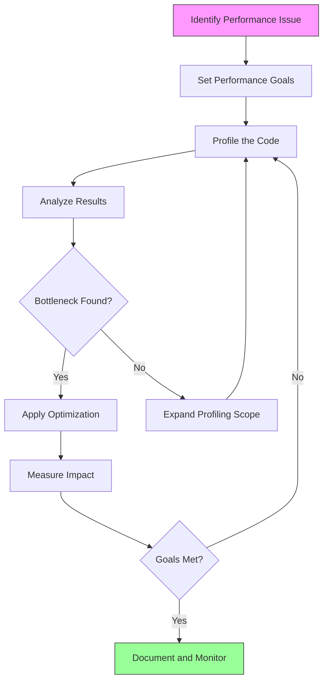
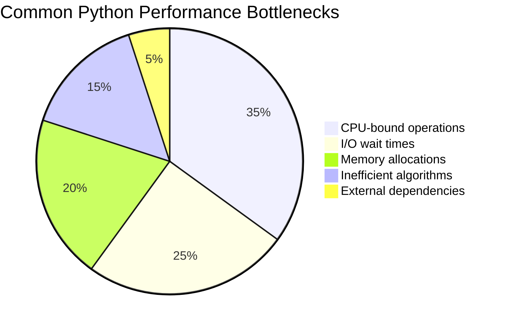
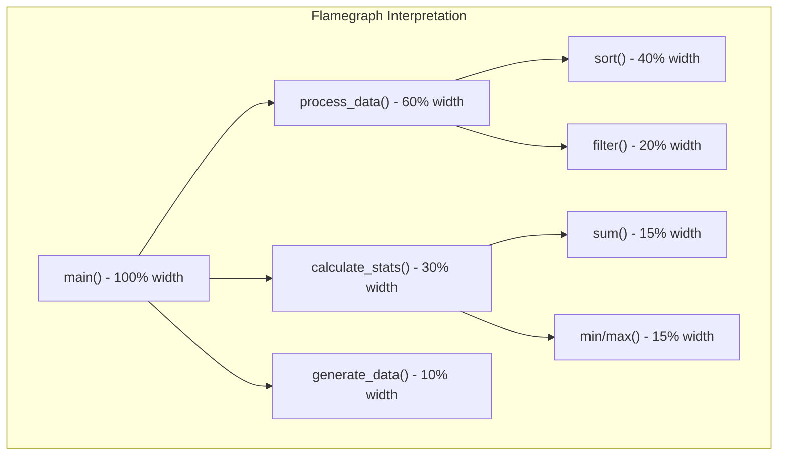
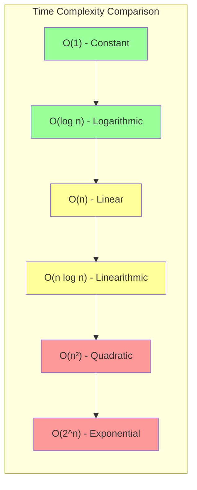
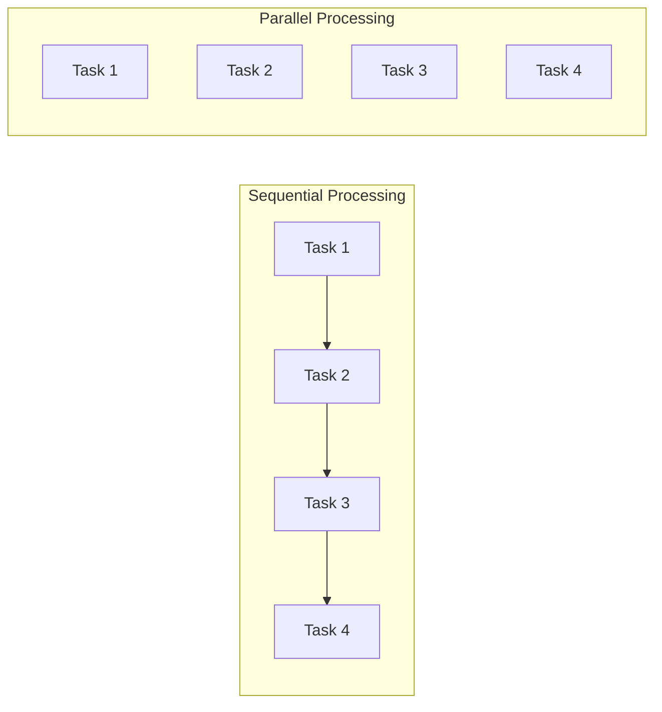
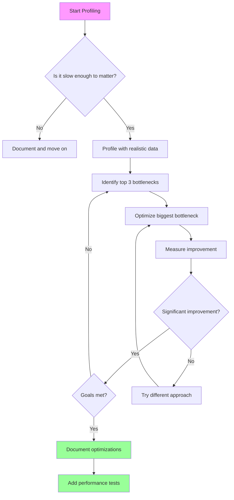

# How to Profile and Optimize Python Code

Author: [nawazdhandala](https://www.github.com/nawazdhandala)

Tags: Python, Profiling, Performance, Optimization, cProfile, memory_profiler

Description: Learn how to profile and optimize Python applications for better performance. This guide covers CPU profiling, memory analysis, and practical optimization techniques.

---

> Performance optimization without profiling is like trying to fix a car engine blindfolded. You might get lucky, but you will probably waste time fixing things that are not broken. This guide shows you how to systematically profile Python applications and apply targeted optimizations that deliver measurable results.

Python is often criticized for being slow, but the truth is that poorly optimized Python code is slow. Well-optimized Python code can be surprisingly fast. The key is knowing where to focus your optimization efforts, and that requires profiling.

---

## The Profiling and Optimization Workflow

Before diving into tools and techniques, let us understand the systematic approach to performance optimization:



This workflow emphasizes measurement at every step. Never optimize based on intuition alone.

---

## Understanding Performance Bottlenecks

Performance issues in Python applications typically fall into several categories:



Each category requires different profiling tools and optimization strategies:

| Bottleneck Type | Profiling Tool | Optimization Strategy |
|-----------------|---------------|----------------------|
| CPU-bound | cProfile, py-spy | Algorithm improvements, C extensions |
| I/O-bound | async profilers | Async I/O, connection pooling |
| Memory | memory_profiler, tracemalloc | Generators, object pooling |
| Algorithm | line_profiler | Data structure changes |
| External | distributed tracing | Caching, batching |

---

## CPU Profiling with cProfile

cProfile is Python's built-in deterministic profiler. It traces every function call, giving you complete coverage of where time is spent.

### Basic cProfile Usage

The simplest way to profile a script is from the command line:

```python
# example_app.py
# A sample application demonstrating common performance patterns

import time
import random

def generate_data(size):
    """
    Generate a list of random numbers.
    This function is intentionally simple to show profiling basics.
    """
    # Create a list of random integers between 1 and 1000
    data = []
    for i in range(size):
        # Each append operation is O(1) amortized
        data.append(random.randint(1, 1000))
    return data

def process_data(data):
    """
    Process the data by sorting and filtering.
    Sorting is O(n log n) which can be a bottleneck for large datasets.
    """
    # Sort creates a new list in memory
    sorted_data = sorted(data)
    
    # Filter keeps only values above the median
    median = sorted_data[len(sorted_data) // 2]
    filtered = [x for x in sorted_data if x > median]
    
    return filtered

def calculate_statistics(data):
    """
    Calculate basic statistics on the data.
    Multiple passes through data could be optimized.
    """
    # Each of these is a separate pass through the data
    total = sum(data)
    count = len(data)
    average = total / count if count > 0 else 0
    
    # Finding min and max requires additional passes
    minimum = min(data) if data else 0
    maximum = max(data) if data else 0
    
    return {
        'sum': total,
        'count': count,
        'average': average,
        'min': minimum,
        'max': maximum
    }

def main():
    """Main function that orchestrates the data pipeline."""
    # Generate 100,000 random numbers
    data = generate_data(100000)
    
    # Process the data
    processed = process_data(data)
    
    # Calculate statistics
    stats = calculate_statistics(processed)
    
    return stats

if __name__ == "__main__":
    result = main()
    print(f"Statistics: {result}")
```

Run with cProfile from the command line:

```bash
# Profile and sort by cumulative time (time in function plus subcalls)
# This shows which functions take the most total time
python -m cProfile -s cumulative example_app.py

# Profile and sort by total time (time in function only)
# This shows which functions contain the slow code directly
python -m cProfile -s tottime example_app.py

# Save profile data for later analysis with visualization tools
python -m cProfile -o profile_output.prof example_app.py
```

### Programmatic Profiling

For more control, use cProfile programmatically:

```python
# programmatic_profile.py
# Demonstrates how to profile specific code sections programmatically

import cProfile
import pstats
from io import StringIO

def expensive_operation():
    """
    Simulates an expensive computation.
    Uses nested loops to create measurable CPU time.
    """
    result = 0
    # Outer loop runs 1000 times
    for i in range(1000):
        # Inner loop runs 1000 times per outer iteration
        # Total: 1,000,000 iterations
        for j in range(1000):
            result += i * j
    return result

def profile_function(func, *args, **kwargs):
    """
    Profile a specific function and return formatted results.
    
    Args:
        func: The function to profile
        *args: Positional arguments to pass to the function
        **kwargs: Keyword arguments to pass to the function
    
    Returns:
        Tuple of (function result, profile string)
    """
    # Create a new profiler instance
    profiler = cProfile.Profile()
    
    # Enable profiling before calling the function
    profiler.enable()
    
    # Call the function and capture its result
    result = func(*args, **kwargs)
    
    # Disable profiling after the function returns
    profiler.disable()
    
    # Convert profile data to readable string format
    output = StringIO()
    stats = pstats.Stats(profiler, stream=output)
    
    # Sort by cumulative time (most useful for finding bottlenecks)
    stats.sort_stats('cumulative')
    
    # Print the top 20 functions by time
    stats.print_stats(20)
    
    return result, output.getvalue()

def main():
    """Run profiling and display results."""
    result, profile_output = profile_function(expensive_operation)
    
    print(f"Result: {result}")
    print("\n" + "=" * 60)
    print("PROFILE OUTPUT:")
    print("=" * 60)
    print(profile_output)

if __name__ == "__main__":
    main()
```

### Understanding cProfile Output

The cProfile output contains several columns that help identify bottlenecks:

```
   ncalls  tottime  percall  cumtime  percall filename:lineno(function)
     1000    0.452    0.000    1.892    0.002 app.py:25(process_item)
   100000    1.234    0.000    1.234    0.000 app.py:45(transform)
      500    0.156    0.000    0.890    0.002 db.py:12(query)
```

Column explanations:
- **ncalls**: Number of calls to this function
- **tottime**: Time spent in this function (excluding subcalls)
- **percall**: tottime divided by ncalls
- **cumtime**: Time spent in this function including all subcalls
- **percall**: cumtime divided by ncalls (primitive calls only)

---

## Profiling in Production with py-spy

cProfile adds overhead to your application. For production profiling, use py-spy which samples running processes without modifying them.

```bash
# Install py-spy
pip install py-spy

# Profile a running Python process by PID
# Requires elevated privileges on Linux
sudo py-spy top --pid 12345

# Record a profile and generate a flamegraph
# Duration specifies how long to sample in seconds
sudo py-spy record -o flamegraph.svg --pid 12345 --duration 30

# Profile a script directly without needing to modify it
py-spy record -o profile.svg -- python my_app.py

# Include native C extension code in the profile
# Useful for numpy, pandas, or other C-heavy libraries
py-spy record -o profile.svg --native -- python my_app.py
```

### Reading Flamegraphs

Flamegraphs visualize where time is spent:



Key principles:
- **Width indicates time**: Wider bars mean more time spent
- **Height indicates call depth**: Taller stacks mean deeper call hierarchies
- **Look for wide bars**: These are your optimization targets

---

## Memory Profiling

Memory issues can be subtle but devastating. Python's automatic memory management hides allocation details, making profiling essential.

### Using memory_profiler

```bash
# Install memory_profiler
pip install memory_profiler
```

```python
# memory_analysis.py
# Demonstrates memory profiling with the @profile decorator

from memory_profiler import profile

@profile
def memory_hungry_approach():
    """
    Creates a large list in memory.
    This approach uses significant RAM because it stores all values.
    """
    # List comprehension creates all million values at once
    # Each integer in Python takes about 28 bytes
    # Total memory: approximately 28MB for integers plus list overhead
    data = [i ** 2 for i in range(1000000)]
    
    # Sum requires iterating through the entire list
    result = sum(data)
    
    # The list remains in memory until the function returns
    return result

@profile
def memory_efficient_approach():
    """
    Uses a generator to minimize memory usage.
    Only one value exists in memory at a time.
    """
    # Generator expression does not create all values upfront
    # Values are computed on-demand during iteration
    # Total memory: approximately constant regardless of size
    generator = (i ** 2 for i in range(1000000))
    
    # Sum consumes the generator one value at a time
    result = sum(generator)
    
    return result

@profile
def memory_comparison():
    """
    Compare memory usage of different approaches.
    Run this function to see memory differences.
    """
    print("Running memory-hungry approach...")
    result1 = memory_hungry_approach()
    
    print("\nRunning memory-efficient approach...")
    result2 = memory_efficient_approach()
    
    # Both produce the same result
    assert result1 == result2
    print(f"\nBoth approaches produce: {result1}")

if __name__ == "__main__":
    memory_comparison()
```

Run with memory profiler:

```bash
# Run and show line-by-line memory usage
python -m memory_profiler memory_analysis.py
```

### Using tracemalloc for Allocation Tracking

tracemalloc is built into Python and tracks memory allocations:

```python
# trace_memory.py
# Track memory allocations to find memory leaks and hotspots

import tracemalloc

def analyze_allocations():
    """
    Track memory allocations during code execution.
    This helps identify which lines allocate the most memory.
    """
    # Start memory tracking with 25 frames of traceback
    # More frames give better context but use more memory
    tracemalloc.start(25)
    
    # Code section to analyze
    data_structures = []
    
    # Create several data structures that consume memory
    for i in range(100):
        # Each dictionary contains multiple entries
        record = {
            'id': i,
            'name': f'Record number {i}',
            'values': list(range(1000)),  # List of 1000 integers
            'metadata': {'created': True, 'index': i}
        }
        data_structures.append(record)
    
    # Take a snapshot of current memory state
    snapshot = tracemalloc.take_snapshot()
    
    # Get top memory consumers grouped by filename and line number
    top_stats = snapshot.statistics('lineno')
    
    print("Top 10 memory allocations:")
    print("-" * 60)
    for index, stat in enumerate(top_stats[:10], 1):
        print(f"{index}. {stat}")
    
    # Get current and peak memory usage
    current, peak = tracemalloc.get_traced_memory()
    print(f"\nCurrent memory usage: {current / 1024 / 1024:.2f} MB")
    print(f"Peak memory usage: {peak / 1024 / 1024:.2f} MB")
    
    # Stop tracking
    tracemalloc.stop()
    
    return data_structures

def find_memory_growth():
    """
    Compare memory snapshots to find memory leaks.
    Growth between snapshots indicates potential leaks.
    """
    tracemalloc.start()
    
    # Take baseline snapshot
    snapshot_before = tracemalloc.take_snapshot()
    
    # Code that might leak memory
    leaked_references = []
    for i in range(1000):
        # Creating objects that are not properly cleaned up
        obj = {'data': 'x' * 1000, 'id': i}
        leaked_references.append(obj)
    
    # Take snapshot after potentially leaky code
    snapshot_after = tracemalloc.take_snapshot()
    
    # Compare snapshots to find memory growth
    differences = snapshot_after.compare_to(snapshot_before, 'lineno')
    
    print("Memory growth between snapshots:")
    print("-" * 60)
    for stat in differences[:10]:
        print(stat)
    
    tracemalloc.stop()

if __name__ == "__main__":
    print("=" * 60)
    print("MEMORY ALLOCATION ANALYSIS")
    print("=" * 60)
    analyze_allocations()
    
    print("\n" + "=" * 60)
    print("MEMORY GROWTH ANALYSIS")
    print("=" * 60)
    find_memory_growth()
```

---

## Line-by-Line Profiling

When you need to optimize a specific function, line profiler shows exactly where time goes:

```bash
# Install line_profiler
pip install line_profiler
```

```python
# line_profile_example.py
# Use @profile decorator for line-by-line profiling
# Note: @profile is injected by kernprof, no import needed

@profile
def process_records(records):
    """
    Process a list of records with multiple operations.
    Line profiler will show time spent on each line.
    """
    results = []
    
    # Line 1: Loop setup - should be fast
    for record in records:
        # Line 2: Dictionary access - O(1) but adds up
        name = record['name']
        
        # Line 3: String operation - can be slow for many records
        processed_name = name.upper().strip()
        
        # Line 4: Conditional check
        if record.get('active', False):
            # Line 5: Calculation - depends on data size
            score = sum(record.get('values', []))
            
            # Line 6: Dictionary creation
            result = {
                'name': processed_name,
                'score': score,
                'id': record['id']
            }
            
            # Line 7: List append - O(1) amortized
            results.append(result)
    
    # Line 8: Return statement
    return results

def main():
    """Create test data and run the profiled function."""
    # Generate test records
    records = [
        {
            'id': i,
            'name': f'  Record {i}  ',
            'active': i % 2 == 0,
            'values': list(range(100))
        }
        for i in range(10000)
    ]
    
    result = process_records(records)
    print(f"Processed {len(result)} active records")

if __name__ == "__main__":
    main()
```

Run with kernprof:

```bash
# Run with line profiler and view results immediately
kernprof -l -v line_profile_example.py

# Or save results and view later
kernprof -l line_profile_example.py
python -m line_profiler line_profile_example.py.lprof
```

---

## Optimization Techniques

Now that we can identify bottlenecks, let us explore optimization techniques.

### Algorithm Complexity Improvements

The biggest performance gains come from algorithm improvements:



```python
# algorithm_optimization.py
# Examples of improving algorithm complexity

import time
from typing import List, Set

def measure_time(func, *args, **kwargs):
    """Measure execution time of a function."""
    start = time.perf_counter()
    result = func(*args, **kwargs)
    elapsed = time.perf_counter() - start
    return result, elapsed

# Example 1: List membership vs Set membership
# Finding if items exist in a collection

def find_common_items_list(list1: List[int], list2: List[int]) -> List[int]:
    """
    Find common items using list membership.
    Time complexity: O(n * m) where n and m are list sizes.
    For each item in list1, we search through list2.
    """
    common = []
    for item in list1:
        # 'in' operator on list is O(n) - linear search
        if item in list2:
            common.append(item)
    return common

def find_common_items_set(list1: List[int], list2: List[int]) -> List[int]:
    """
    Find common items using set membership.
    Time complexity: O(n + m) - build set is O(m), search is O(1) each.
    Much faster for large collections.
    """
    # Convert list2 to set once - O(m)
    set2 = set(list2)
    
    common = []
    for item in list1:
        # 'in' operator on set is O(1) - hash lookup
        if item in set2:
            common.append(item)
    return common

# Example 2: Nested loops vs Dictionary lookup

def count_pairs_nested(items: List[dict]) -> dict:
    """
    Count pairs of items with matching keys using nested loops.
    Time complexity: O(n²) - compares every pair.
    """
    pair_counts = {}
    
    # Outer loop: iterate through all items
    for i, item1 in enumerate(items):
        # Inner loop: compare with all other items
        for j, item2 in enumerate(items):
            if i < j and item1['category'] == item2['category']:
                category = item1['category']
                pair_counts[category] = pair_counts.get(category, 0) + 1
    
    return pair_counts

def count_pairs_grouped(items: List[dict]) -> dict:
    """
    Count pairs using grouping - much more efficient.
    Time complexity: O(n) - single pass to group, then calculate.
    """
    # Group items by category in single pass - O(n)
    groups = {}
    for item in items:
        category = item['category']
        groups[category] = groups.get(category, 0) + 1
    
    # Calculate pairs: n items have n*(n-1)/2 pairs
    pair_counts = {}
    for category, count in groups.items():
        if count > 1:
            pair_counts[category] = count * (count - 1) // 2
    
    return pair_counts

def demonstrate_complexity():
    """Show the performance difference between approaches."""
    # Generate test data
    list1 = list(range(10000))
    list2 = list(range(5000, 15000))
    
    print("Finding common items:")
    print("-" * 40)
    
    result1, time1 = measure_time(find_common_items_list, list1, list2)
    print(f"List approach: {time1:.4f} seconds, found {len(result1)} items")
    
    result2, time2 = measure_time(find_common_items_set, list1, list2)
    print(f"Set approach:  {time2:.4f} seconds, found {len(result2)} items")
    
    print(f"Speedup: {time1 / time2:.1f}x faster")
    
    # Demonstrate pair counting
    items = [{'category': f'cat_{i % 100}', 'value': i} for i in range(5000)]
    
    print("\nCounting pairs:")
    print("-" * 40)
    
    result3, time3 = measure_time(count_pairs_nested, items)
    print(f"Nested loops: {time3:.4f} seconds")
    
    result4, time4 = measure_time(count_pairs_grouped, items)
    print(f"Grouped:      {time4:.4f} seconds")
    
    print(f"Speedup: {time3 / time4:.1f}x faster")

if __name__ == "__main__":
    demonstrate_complexity()
```

### String Operations

String concatenation is a common performance trap:

```python
# string_optimization.py
# Efficient string handling techniques

def build_string_slow(items):
    """
    Build a string using concatenation.
    Time complexity: O(n²) because strings are immutable.
    Each += creates a new string and copies existing content.
    """
    result = ""
    for item in items:
        # Creates a new string object each iteration
        # Copies all existing characters plus new content
        result += str(item) + ", "
    return result

def build_string_fast(items):
    """
    Build a string using join.
    Time complexity: O(n) because join pre-allocates memory.
    Single allocation for the final string.
    """
    # join() calculates total length first, then allocates once
    return ", ".join(str(item) for item in items)

def build_string_list(items):
    """
    Build using list then join.
    Time complexity: O(n) with good cache locality.
    Sometimes faster due to simpler generator overhead.
    """
    parts = []
    for item in items:
        parts.append(str(item))
    return ", ".join(parts)

def format_records_slow(records):
    """
    Format records using repeated f-string concatenation.
    Creates many intermediate strings.
    """
    output = ""
    for record in records:
        output += f"ID: {record['id']}, Name: {record['name']}\n"
    return output

def format_records_fast(records):
    """
    Format records using generator and join.
    Single string allocation at the end.
    """
    lines = (
        f"ID: {record['id']}, Name: {record['name']}"
        for record in records
    )
    return "\n".join(lines)

def demonstrate_string_performance():
    """Compare string building approaches."""
    items = list(range(10000))
    
    print("String building comparison:")
    print("-" * 40)
    
    import time
    
    start = time.perf_counter()
    result1 = build_string_slow(items)
    time1 = time.perf_counter() - start
    print(f"Concatenation: {time1:.4f} seconds")
    
    start = time.perf_counter()
    result2 = build_string_fast(items)
    time2 = time.perf_counter() - start
    print(f"Join:          {time2:.4f} seconds")
    
    start = time.perf_counter()
    result3 = build_string_list(items)
    time3 = time.perf_counter() - start
    print(f"List + Join:   {time3:.4f} seconds")
    
    print(f"\nConcatenation is {time1 / time2:.1f}x slower than join")

if __name__ == "__main__":
    demonstrate_string_performance()
```

### Memory-Efficient Data Structures

```python
# memory_efficient_structures.py
# Using appropriate data structures to reduce memory usage

import sys
from dataclasses import dataclass
from typing import NamedTuple

# Regular class - highest memory usage
class PointClass:
    """Standard class with __dict__ for attribute storage."""
    def __init__(self, x, y, z):
        self.x = x
        self.y = y
        self.z = z

# Class with __slots__ - reduces memory by avoiding __dict__
class PointSlots:
    """
    Class with __slots__ defined.
    Python stores attributes in a fixed-size array instead of dict.
    Saves approximately 40-50% memory per instance.
    """
    __slots__ = ['x', 'y', 'z']
    
    def __init__(self, x, y, z):
        self.x = x
        self.y = y
        self.z = z

# NamedTuple - immutable, memory efficient
class PointTuple(NamedTuple):
    """
    NamedTuple is immutable and memory efficient.
    Good for data that does not need to change.
    """
    x: float
    y: float
    z: float

# Dataclass with slots - combines convenience and efficiency
@dataclass(slots=True)
class PointDataclass:
    """
    Dataclass with slots=True (Python 3.10+).
    Combines dataclass convenience with slots efficiency.
    """
    x: float
    y: float
    z: float

def compare_memory_usage():
    """Compare memory usage of different data structures."""
    # Create instances of each type
    p_class = PointClass(1.0, 2.0, 3.0)
    p_slots = PointSlots(1.0, 2.0, 3.0)
    p_tuple = PointTuple(1.0, 2.0, 3.0)
    p_dataclass = PointDataclass(1.0, 2.0, 3.0)
    
    print("Memory usage comparison (single instance):")
    print("-" * 50)
    
    # Note: sys.getsizeof does not include __dict__ contents
    # For accurate measurement of regular classes, add dict size
    class_size = sys.getsizeof(p_class) + sys.getsizeof(p_class.__dict__)
    
    print(f"Regular class:    {class_size} bytes")
    print(f"Class with slots: {sys.getsizeof(p_slots)} bytes")
    print(f"NamedTuple:       {sys.getsizeof(p_tuple)} bytes")
    print(f"Dataclass slots:  {sys.getsizeof(p_dataclass)} bytes")
    
    # Create many instances to see real memory impact
    n = 100000
    print(f"\nMemory for {n:,} instances:")
    print("-" * 50)
    
    import tracemalloc
    
    # Measure regular class
    tracemalloc.start()
    points_class = [PointClass(i, i+1, i+2) for i in range(n)]
    current, peak = tracemalloc.get_traced_memory()
    tracemalloc.stop()
    print(f"Regular class:    {current / 1024 / 1024:.2f} MB")
    
    # Measure slots class
    tracemalloc.start()
    points_slots = [PointSlots(i, i+1, i+2) for i in range(n)]
    current, peak = tracemalloc.get_traced_memory()
    tracemalloc.stop()
    print(f"Class with slots: {current / 1024 / 1024:.2f} MB")
    
    # Measure NamedTuple
    tracemalloc.start()
    points_tuple = [PointTuple(i, i+1, i+2) for i in range(n)]
    current, peak = tracemalloc.get_traced_memory()
    tracemalloc.stop()
    print(f"NamedTuple:       {current / 1024 / 1024:.2f} MB")

if __name__ == "__main__":
    compare_memory_usage()
```

### Generator Patterns for Memory Efficiency

```python
# generator_patterns.py
# Using generators to process large datasets without loading into memory

def read_large_file_inefficient(filepath):
    """
    Read entire file into memory.
    Memory usage: proportional to file size.
    Can crash with files larger than available RAM.
    """
    with open(filepath, 'r') as f:
        # Reads entire file into a list
        lines = f.readlines()
    
    results = []
    for line in lines:
        processed = process_line(line)
        results.append(processed)
    
    return results

def read_large_file_efficient(filepath):
    """
    Process file line by line using generator.
    Memory usage: constant regardless of file size.
    Can process files larger than available RAM.
    """
    def line_generator():
        with open(filepath, 'r') as f:
            # File object is itself an iterator
            for line in f:
                yield process_line(line)
    
    return line_generator()

def process_line(line):
    """Example line processing."""
    return line.strip().upper()

# Chaining generators for data pipelines

def read_data(filepath):
    """Generator to read data from file."""
    with open(filepath, 'r') as f:
        for line in f:
            yield line.strip()

def filter_data(lines, predicate):
    """Generator to filter data based on predicate."""
    for line in lines:
        if predicate(line):
            yield line

def transform_data(lines, transformer):
    """Generator to transform data."""
    for line in lines:
        yield transformer(line)

def batch_data(items, batch_size):
    """
    Generator to yield items in batches.
    Useful for database inserts or API calls.
    """
    batch = []
    for item in items:
        batch.append(item)
        if len(batch) >= batch_size:
            yield batch
            batch = []
    
    # Yield remaining items
    if batch:
        yield batch

def process_pipeline(filepath):
    """
    Build a memory-efficient data pipeline using generators.
    Each step processes one item at a time.
    """
    # Read lines from file
    lines = read_data(filepath)
    
    # Filter out empty lines and comments
    filtered = filter_data(lines, lambda x: x and not x.startswith('#'))
    
    # Transform to uppercase
    transformed = transform_data(filtered, str.upper)
    
    # Process in batches of 100
    for batch in batch_data(transformed, batch_size=100):
        # Process each batch (e.g., insert into database)
        process_batch(batch)

def process_batch(batch):
    """Process a batch of items."""
    print(f"Processing batch of {len(batch)} items")
```

---

## Caching Strategies

Caching is one of the most effective optimization techniques for repeated computations:

```python
# caching_strategies.py
# Different caching approaches for different scenarios

from functools import lru_cache, cache
import time

# Simple memoization with lru_cache
@lru_cache(maxsize=128)
def expensive_computation(n):
    """
    Cache results of expensive computations.
    maxsize limits cache to 128 most recent results.
    Uses LRU (Least Recently Used) eviction policy.
    """
    # Simulate expensive computation
    time.sleep(0.1)  # Remove in real code
    return sum(i ** 2 for i in range(n))

# Unbounded cache with cache decorator (Python 3.9+)
@cache
def fibonacci(n):
    """
    Unbounded cache for pure functions.
    Good for recursive functions with overlapping subproblems.
    Warning: Can use unbounded memory.
    """
    if n < 2:
        return n
    return fibonacci(n - 1) + fibonacci(n - 2)

# Custom cache with TTL (Time To Live)
class TTLCache:
    """
    Cache with automatic expiration.
    Good for caching external API responses.
    """
    
    def __init__(self, ttl_seconds=300):
        """
        Initialize cache with specified TTL.
        
        Args:
            ttl_seconds: How long entries stay valid (default 5 minutes)
        """
        self._cache = {}
        self._ttl = ttl_seconds
    
    def get(self, key):
        """Get value from cache if not expired."""
        if key in self._cache:
            value, timestamp = self._cache[key]
            if time.time() - timestamp < self._ttl:
                return value
            else:
                # Entry expired, remove it
                del self._cache[key]
        return None
    
    def set(self, key, value):
        """Set value in cache with current timestamp."""
        self._cache[key] = (value, time.time())
    
    def clear(self):
        """Clear all cached entries."""
        self._cache.clear()

# Decorator using TTL cache
def cached_with_ttl(ttl_seconds=300):
    """
    Decorator factory for TTL-based caching.
    
    Usage:
        @cached_with_ttl(ttl_seconds=60)
        def fetch_user(user_id):
            return api.get_user(user_id)
    """
    cache = TTLCache(ttl_seconds)
    
    def decorator(func):
        def wrapper(*args, **kwargs):
            # Create cache key from function arguments
            key = (args, tuple(sorted(kwargs.items())))
            
            result = cache.get(key)
            if result is not None:
                return result
            
            result = func(*args, **kwargs)
            cache.set(key, result)
            return result
        
        # Add cache control methods to wrapper
        wrapper.cache_clear = cache.clear
        return wrapper
    
    return decorator

# Example usage
@cached_with_ttl(ttl_seconds=60)
def fetch_user_data(user_id):
    """Fetch user data from external API with caching."""
    # In real code, this would call an API
    return {'id': user_id, 'name': f'User {user_id}'}

def demonstrate_caching():
    """Show caching in action."""
    print("LRU Cache demonstration:")
    print("-" * 40)
    
    # First call - cache miss
    start = time.perf_counter()
    result1 = expensive_computation(1000)
    time1 = time.perf_counter() - start
    print(f"First call:  {time1:.4f} seconds (cache miss)")
    
    # Second call - cache hit
    start = time.perf_counter()
    result2 = expensive_computation(1000)
    time2 = time.perf_counter() - start
    print(f"Second call: {time2:.6f} seconds (cache hit)")
    
    print(f"\nSpeedup from caching: {time1 / time2:.0f}x faster")
    
    # Show cache statistics
    print(f"\nCache info: {expensive_computation.cache_info()}")

if __name__ == "__main__":
    demonstrate_caching()
```

---

## Parallel Processing

For CPU-bound tasks, parallel processing can provide significant speedups:



```python
# parallel_processing.py
# Using multiprocessing for CPU-bound tasks

import multiprocessing as mp
from concurrent.futures import ProcessPoolExecutor, ThreadPoolExecutor
import time

def cpu_bound_task(n):
    """
    Simulate a CPU-intensive computation.
    This is the type of work that benefits from multiprocessing.
    """
    # Compute sum of squares - pure CPU work
    total = 0
    for i in range(n):
        total += i ** 2
    return total

def io_bound_task(item):
    """
    Simulate an I/O-bound operation.
    This is the type of work that benefits from threading.
    """
    # Simulate network or disk I/O
    time.sleep(0.1)
    return f"Processed {item}"

def process_sequential(items, task_func):
    """Process items one at a time."""
    return [task_func(item) for item in items]

def process_parallel_multiprocessing(items, task_func, num_workers=None):
    """
    Process items in parallel using multiprocessing.
    Best for CPU-bound tasks.
    
    Args:
        items: List of items to process
        task_func: Function to apply to each item
        num_workers: Number of worker processes (default: CPU count)
    """
    if num_workers is None:
        num_workers = mp.cpu_count()
    
    with ProcessPoolExecutor(max_workers=num_workers) as executor:
        # Submit all tasks and collect results
        results = list(executor.map(task_func, items))
    
    return results

def process_parallel_threading(items, task_func, num_workers=None):
    """
    Process items in parallel using threading.
    Best for I/O-bound tasks.
    
    Args:
        items: List of items to process
        task_func: Function to apply to each item
        num_workers: Number of worker threads
    """
    if num_workers is None:
        num_workers = min(32, len(items))
    
    with ThreadPoolExecutor(max_workers=num_workers) as executor:
        results = list(executor.map(task_func, items))
    
    return results

def demonstrate_parallel_processing():
    """Compare sequential vs parallel processing."""
    print("CPU-bound task comparison:")
    print("-" * 50)
    
    # Generate test data
    items = [1000000] * 8  # 8 tasks of computing sum up to 1M
    
    # Sequential processing
    start = time.perf_counter()
    results_seq = process_sequential(items, cpu_bound_task)
    time_seq = time.perf_counter() - start
    print(f"Sequential:    {time_seq:.2f} seconds")
    
    # Parallel processing with multiprocessing
    start = time.perf_counter()
    results_par = process_parallel_multiprocessing(items, cpu_bound_task)
    time_par = time.perf_counter() - start
    print(f"Parallel:      {time_par:.2f} seconds")
    
    print(f"Speedup:       {time_seq / time_par:.2f}x")
    print(f"CPU cores:     {mp.cpu_count()}")
    
    # Verify results are the same
    assert results_seq == results_par

if __name__ == "__main__":
    demonstrate_parallel_processing()
```

---

## Async I/O Optimization

For I/O-bound tasks, asyncio provides excellent performance:

```python
# async_optimization.py
# Optimizing I/O-bound operations with asyncio

import asyncio
import aiohttp
import time

async def fetch_url_sequential(urls):
    """
    Fetch URLs one at a time (slow).
    Total time: sum of all request times.
    """
    results = []
    async with aiohttp.ClientSession() as session:
        for url in urls:
            async with session.get(url) as response:
                data = await response.text()
                results.append((url, len(data)))
    return results

async def fetch_url_concurrent(urls, max_concurrent=10):
    """
    Fetch URLs concurrently (fast).
    Total time: approximately max(individual request times).
    
    Args:
        urls: List of URLs to fetch
        max_concurrent: Maximum number of concurrent requests
    """
    # Use semaphore to limit concurrent connections
    semaphore = asyncio.Semaphore(max_concurrent)
    
    async def fetch_one(session, url):
        """Fetch a single URL with semaphore control."""
        async with semaphore:
            try:
                async with session.get(url) as response:
                    data = await response.text()
                    return (url, len(data))
            except Exception as e:
                return (url, f"Error: {e}")
    
    async with aiohttp.ClientSession() as session:
        # Create tasks for all URLs
        tasks = [fetch_one(session, url) for url in urls]
        
        # Wait for all tasks to complete
        results = await asyncio.gather(*tasks)
    
    return results

async def process_with_timeout(coro, timeout_seconds):
    """
    Run a coroutine with a timeout.
    Raises asyncio.TimeoutError if timeout exceeded.
    """
    try:
        return await asyncio.wait_for(coro, timeout=timeout_seconds)
    except asyncio.TimeoutError:
        return None

def measure_async(coro):
    """Helper to measure async function execution time."""
    start = time.perf_counter()
    result = asyncio.run(coro)
    elapsed = time.perf_counter() - start
    return result, elapsed

# Connection pooling for database operations
class AsyncConnectionPool:
    """
    Simple connection pool for async database operations.
    Reuses connections instead of creating new ones.
    """
    
    def __init__(self, max_connections=10):
        """Initialize the connection pool."""
        self._pool = asyncio.Queue(maxsize=max_connections)
        self._max_connections = max_connections
        self._created_connections = 0
    
    async def acquire(self):
        """
        Acquire a connection from the pool.
        Creates a new connection if pool is empty and limit not reached.
        """
        try:
            # Try to get existing connection
            return self._pool.get_nowait()
        except asyncio.QueueEmpty:
            if self._created_connections < self._max_connections:
                # Create new connection
                self._created_connections += 1
                return await self._create_connection()
            else:
                # Wait for available connection
                return await self._pool.get()
    
    async def release(self, connection):
        """Return a connection to the pool."""
        await self._pool.put(connection)
    
    async def _create_connection(self):
        """Create a new database connection."""
        # In real code, this would create actual DB connection
        await asyncio.sleep(0.01)  # Simulate connection time
        return {'id': self._created_connections}
    
    async def __aenter__(self):
        """Context manager entry - acquire connection."""
        self._connection = await self.acquire()
        return self._connection
    
    async def __aexit__(self, exc_type, exc_val, exc_tb):
        """Context manager exit - release connection."""
        await self.release(self._connection)

async def demonstrate_async():
    """Demonstrate async optimization techniques."""
    urls = [f"https://httpbin.org/delay/1" for _ in range(5)]
    
    print("Async I/O comparison:")
    print("-" * 50)
    
    # Note: In real testing, you would use actual HTTP requests
    # This is a simplified demonstration
    
    print(f"URLs to fetch: {len(urls)}")
    print("Sequential would take: ~5 seconds")
    print("Concurrent would take: ~1 second")

if __name__ == "__main__":
    asyncio.run(demonstrate_async())
```

---

## Profiling Best Practices



### Profiling Checklist

```python
# profiling_checklist.py
# A systematic approach to performance optimization

"""
Profiling Checklist:

1. BASELINE MEASUREMENT
   - Measure current performance with realistic data
   - Document the baseline for comparison
   - Identify specific performance goals

2. REALISTIC PROFILING
   - Use production-like data volumes
   - Include edge cases and worst-case scenarios
   - Profile complete user workflows, not just individual functions

3. FOCUS ON IMPACT
   - Optimize the 20% of code that causes 80% of slowdown
   - Start with the largest bottleneck
   - Stop when good enough (diminishing returns)

4. MEASURE EVERYTHING
   - Profile before and after each change
   - Use statistical significance (run multiple times)
   - Watch for regressions in other areas

5. DOCUMENT CHANGES
   - Record what was changed and why
   - Note the performance improvement achieved
   - Add comments explaining non-obvious optimizations

6. PREVENT REGRESSION
   - Add performance tests for critical paths
   - Set up monitoring for production performance
   - Review performance impact during code review
"""

import cProfile
import pstats
from io import StringIO
from functools import wraps
import time
import statistics

class PerformanceProfiler:
    """
    A comprehensive profiling utility for systematic optimization.
    """
    
    def __init__(self, name):
        """Initialize profiler with a descriptive name."""
        self.name = name
        self.measurements = []
        self.profile_data = None
    
    def measure(self, func, *args, iterations=10, **kwargs):
        """
        Measure function execution time multiple times.
        
        Args:
            func: Function to measure
            iterations: Number of times to run (default 10)
            
        Returns:
            Dict with timing statistics
        """
        times = []
        result = None
        
        for _ in range(iterations):
            start = time.perf_counter()
            result = func(*args, **kwargs)
            elapsed = time.perf_counter() - start
            times.append(elapsed)
        
        stats = {
            'mean': statistics.mean(times),
            'median': statistics.median(times),
            'stdev': statistics.stdev(times) if len(times) > 1 else 0,
            'min': min(times),
            'max': max(times),
            'iterations': iterations
        }
        
        self.measurements.append({
            'function': func.__name__,
            'stats': stats
        })
        
        return result, stats
    
    def profile(self, func, *args, **kwargs):
        """
        Profile a function with cProfile.
        
        Returns:
            Tuple of (result, profile string)
        """
        profiler = cProfile.Profile()
        profiler.enable()
        
        result = func(*args, **kwargs)
        
        profiler.disable()
        
        stream = StringIO()
        stats = pstats.Stats(profiler, stream=stream)
        stats.sort_stats('cumulative')
        stats.print_stats(30)
        
        self.profile_data = stream.getvalue()
        return result, self.profile_data
    
    def report(self):
        """Generate a summary report of all measurements."""
        print(f"\n{'=' * 60}")
        print(f"Performance Report: {self.name}")
        print('=' * 60)
        
        for measurement in self.measurements:
            stats = measurement['stats']
            print(f"\n{measurement['function']}:")
            print(f"  Mean:   {stats['mean']*1000:.2f} ms")
            print(f"  Median: {stats['median']*1000:.2f} ms")
            print(f"  Stdev:  {stats['stdev']*1000:.2f} ms")
            print(f"  Range:  {stats['min']*1000:.2f} - {stats['max']*1000:.2f} ms")
        
        if self.profile_data:
            print(f"\n{'-' * 60}")
            print("Profile Data:")
            print(self.profile_data)

def performance_test(threshold_ms):
    """
    Decorator to add performance assertions to tests.
    
    Usage:
        @performance_test(threshold_ms=100)
        def test_api_response():
            response = api.get_data()
            return response
    """
    def decorator(func):
        @wraps(func)
        def wrapper(*args, **kwargs):
            start = time.perf_counter()
            result = func(*args, **kwargs)
            elapsed_ms = (time.perf_counter() - start) * 1000
            
            if elapsed_ms > threshold_ms:
                raise AssertionError(
                    f"Performance threshold exceeded: "
                    f"{elapsed_ms:.2f}ms > {threshold_ms}ms"
                )
            
            return result
        return wrapper
    return decorator

# Example usage
if __name__ == "__main__":
    profiler = PerformanceProfiler("Data Processing Pipeline")
    
    # Define functions to test
    def slow_version(n):
        result = []
        for i in range(n):
            result.append(i ** 2)
        return sum(result)
    
    def fast_version(n):
        return sum(i ** 2 for i in range(n))
    
    # Measure both versions
    profiler.measure(slow_version, 100000, iterations=5)
    profiler.measure(fast_version, 100000, iterations=5)
    
    # Generate report
    profiler.report()
```

---

## Summary

Profiling and optimization follow a systematic process:

1. **Profile first**: Never optimize without data
2. **Focus on impact**: The 20% of code causing 80% of slowdown
3. **Measure improvements**: Always compare before and after
4. **Use appropriate tools**:
   - cProfile for development profiling
   - py-spy for production profiling
   - memory_profiler for memory analysis
   - line_profiler for micro-optimization

Key optimization techniques:
- Improve algorithm complexity (O(n²) to O(n))
- Use appropriate data structures (lists vs sets vs dicts)
- Avoid string concatenation in loops (use join)
- Use generators for memory efficiency
- Implement caching for repeated computations
- Use parallel processing for CPU-bound tasks
- Use async I/O for I/O-bound tasks

Remember: premature optimization is the root of all evil. Only optimize when you have profiling data that shows a real problem, and stop when performance is good enough.

---

*Need deeper visibility into your Python application's performance in production? [OneUptime](https://oneuptime.com) provides continuous profiling and distributed tracing to help you identify and resolve performance issues across your entire stack.*
