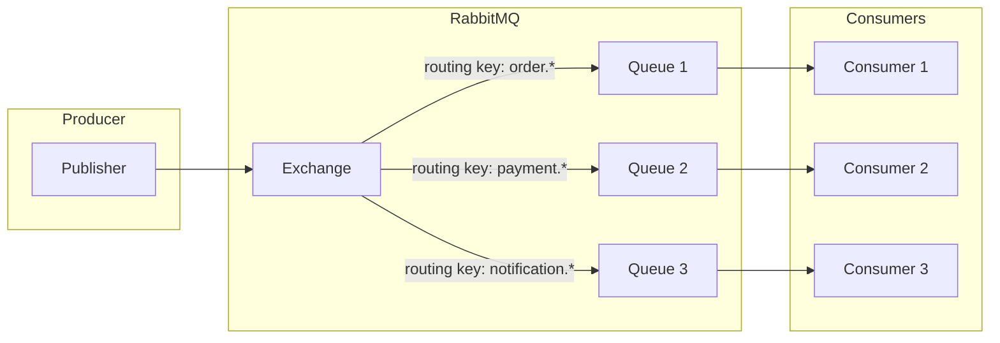
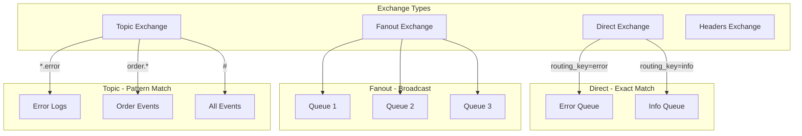
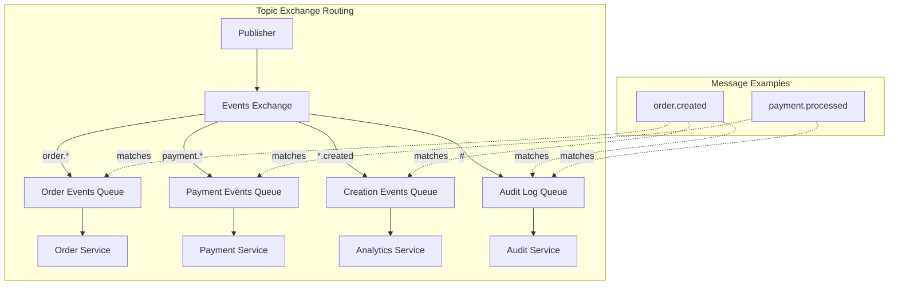
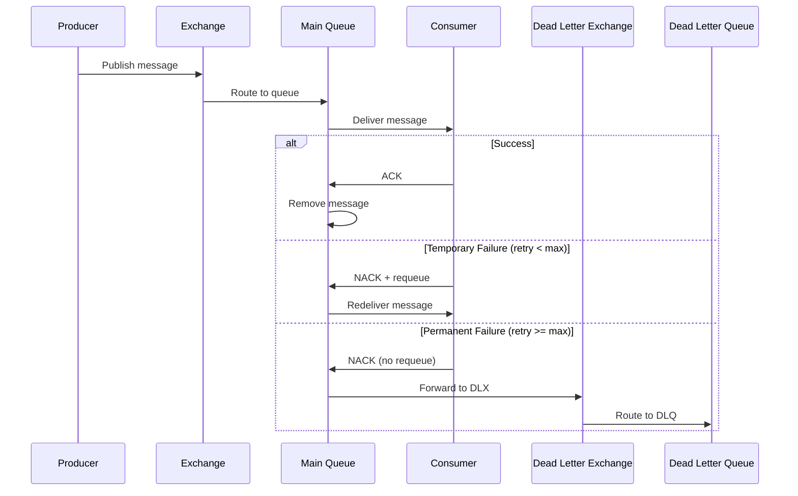
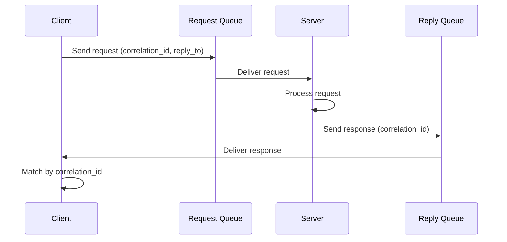

# How to Use RabbitMQ with Pika in Python

Author: [nawazdhandala](https://www.github.com/nawazdhandala)

Tags: Python, RabbitMQ, Pika, Messaging, AMQP, Event-Driven

Description: A comprehensive guide to building message-driven applications in Python using RabbitMQ and Pika. Learn exchanges, queues, routing patterns, and production best practices for reliable messaging.

---

> Message queues decouple components, enable asynchronous processing, and build resilient distributed systems. RabbitMQ is one of the most widely deployed message brokers, and Pika is the official Python client library that speaks AMQP fluently.

Whether you are building microservices, processing background jobs, or implementing event-driven architectures, understanding RabbitMQ with Pika will level up your Python messaging game.

---

## RabbitMQ Architecture Overview

Before diving into code, let us understand how RabbitMQ works:



**Key Components:**
- **Producer**: Application that sends messages
- **Exchange**: Routes messages to queues based on rules
- **Queue**: Buffer that stores messages
- **Consumer**: Application that receives and processes messages
- **Binding**: Rule that connects an exchange to a queue

---

## Getting Started

### Installation

```bash
# Install Pika - the official RabbitMQ Python client
pip install pika

# For async support
pip install aio-pika
```

### Running RabbitMQ with Docker

```bash
# Start RabbitMQ with management UI
docker run -d \
    --name rabbitmq \
    -p 5672:5672 \
    -p 15672:15672 \
    -e RABBITMQ_DEFAULT_USER=myuser \
    -e RABBITMQ_DEFAULT_PASS=mypassword \
    rabbitmq:3-management

# Management UI available at http://localhost:15672
```

---

## Basic Publisher and Consumer

### Simple Message Publishing

The most basic pattern sends messages directly to a queue:

```python
# publisher_basic.py
import pika
import json
from datetime import datetime


def create_connection():
    """
    Create a connection to RabbitMQ with credentials.
    
    ConnectionParameters holds all connection settings:
    - host: RabbitMQ server hostname
    - port: AMQP port (default 5672)
    - credentials: Username and password
    - heartbeat: Seconds between heartbeat checks (0 = disabled)
    - blocked_connection_timeout: Timeout when connection is blocked
    """
    credentials = pika.PlainCredentials(
        username='myuser',
        password='mypassword'
    )
    
    parameters = pika.ConnectionParameters(
        host='localhost',
        port=5672,
        credentials=credentials,
        heartbeat=600,                    # Send heartbeat every 10 minutes
        blocked_connection_timeout=300    # Timeout after 5 minutes if blocked
    )
    
    return pika.BlockingConnection(parameters)


def publish_message(queue_name: str, message: dict):
    """
    Publish a single message to a queue.
    
    This uses the default exchange (empty string) which routes
    messages directly to the queue matching the routing_key.
    """
    connection = create_connection()
    channel = connection.channel()
    
    # Declare the queue - creates it if it does not exist
    # durable=True means the queue survives broker restarts
    channel.queue_declare(
        queue=queue_name,
        durable=True  # Queue persists across RabbitMQ restarts
    )
    
    # Add timestamp and metadata to the message
    message['timestamp'] = datetime.utcnow().isoformat()
    message['producer'] = 'basic_publisher'
    
    # Publish the message
    # exchange='' uses the default exchange
    # routing_key is the queue name for direct routing
    channel.basic_publish(
        exchange='',                      # Default exchange
        routing_key=queue_name,           # Route to this queue
        body=json.dumps(message),         # Message body as JSON string
        properties=pika.BasicProperties(
            delivery_mode=2,              # Make message persistent
            content_type='application/json',
            headers={'source': 'python-app'}
        )
    )
    
    print(f" [x] Sent message to '{queue_name}': {message}")
    
    # Always close the connection when done
    connection.close()


if __name__ == '__main__':
    # Send a test message
    publish_message('task_queue', {
        'task_id': '12345',
        'action': 'process_order',
        'data': {'order_id': 'ORD-001', 'amount': 99.99}
    })
```

### Simple Message Consumer

```python
# consumer_basic.py
import pika
import json
import time


def create_connection():
    """Create connection to RabbitMQ"""
    credentials = pika.PlainCredentials('myuser', 'mypassword')
    parameters = pika.ConnectionParameters(
        host='localhost',
        port=5672,
        credentials=credentials,
        heartbeat=600
    )
    return pika.BlockingConnection(parameters)


def process_message(ch, method, properties, body):
    """
    Callback function that processes each message.
    
    Arguments:
    - ch: The channel object
    - method: Delivery metadata (routing_key, delivery_tag, etc.)
    - properties: Message properties (headers, content_type, etc.)
    - body: The message body as bytes
    """
    try:
        # Parse the JSON message
        message = json.loads(body.decode('utf-8'))
        print(f" [x] Received: {message}")
        
        # Simulate processing time
        processing_time = message.get('processing_time', 1)
        time.sleep(processing_time)
        
        print(f" [x] Processed: {message.get('task_id', 'unknown')}")
        
        # Acknowledge the message - tells RabbitMQ we are done
        # This removes the message from the queue
        ch.basic_ack(delivery_tag=method.delivery_tag)
        
    except json.JSONDecodeError as e:
        print(f" [!] Invalid JSON: {e}")
        # Reject the message without requeueing (bad format)
        ch.basic_nack(delivery_tag=method.delivery_tag, requeue=False)
        
    except Exception as e:
        print(f" [!] Processing error: {e}")
        # Reject and requeue for retry
        ch.basic_nack(delivery_tag=method.delivery_tag, requeue=True)


def start_consumer(queue_name: str):
    """
    Start consuming messages from a queue.
    
    This runs forever, processing messages as they arrive.
    """
    connection = create_connection()
    channel = connection.channel()
    
    # Declare the queue (idempotent - safe to call multiple times)
    channel.queue_declare(queue=queue_name, durable=True)
    
    # Set QoS - only deliver one message at a time
    # This prevents a fast consumer from hogging all messages
    channel.basic_qos(prefetch_count=1)
    
    # Register our callback function
    channel.basic_consume(
        queue=queue_name,
        on_message_callback=process_message,
        auto_ack=False  # We will acknowledge manually
    )
    
    print(f" [*] Waiting for messages in '{queue_name}'. Press CTRL+C to exit")
    
    try:
        # Start consuming - this blocks forever
        channel.start_consuming()
    except KeyboardInterrupt:
        print(" [*] Shutting down consumer...")
        channel.stop_consuming()
    finally:
        connection.close()


if __name__ == '__main__':
    start_consumer('task_queue')
```

---

## Exchange Types and Routing

RabbitMQ supports four exchange types, each with different routing behavior:



### Direct Exchange

Routes messages to queues where the routing key exactly matches the binding key:

```python
# direct_exchange.py
import pika
import json


class DirectExchangePublisher:
    """
    Publisher using direct exchange for exact routing key matching.
    
    Use case: Route messages to specific queues based on severity
    or message type. For example, route 'error' logs to the error
    queue and 'info' logs to the info queue.
    """
    
    def __init__(self, host='localhost', user='myuser', password='mypassword'):
        self.credentials = pika.PlainCredentials(user, password)
        self.parameters = pika.ConnectionParameters(
            host=host,
            credentials=self.credentials
        )
        self.exchange_name = 'logs_direct'
    
    def setup(self):
        """Set up the exchange and queues"""
        connection = pika.BlockingConnection(self.parameters)
        channel = connection.channel()
        
        # Declare a direct exchange
        # durable=True means the exchange survives broker restarts
        channel.exchange_declare(
            exchange=self.exchange_name,
            exchange_type='direct',
            durable=True
        )
        
        # Declare queues for different log levels
        severities = ['error', 'warning', 'info', 'debug']
        for severity in severities:
            queue_name = f'logs_{severity}'
            
            # Declare the queue
            channel.queue_declare(queue=queue_name, durable=True)
            
            # Bind queue to exchange with routing key
            # Messages with routing_key='error' go to logs_error queue
            channel.queue_bind(
                queue=queue_name,
                exchange=self.exchange_name,
                routing_key=severity
            )
        
        connection.close()
        print(f" [*] Exchange '{self.exchange_name}' and queues set up")
    
    def publish(self, severity: str, message: dict):
        """Publish a log message to the appropriate queue"""
        connection = pika.BlockingConnection(self.parameters)
        channel = connection.channel()
        
        channel.basic_publish(
            exchange=self.exchange_name,
            routing_key=severity,  # Routes to logs_{severity} queue
            body=json.dumps(message),
            properties=pika.BasicProperties(
                delivery_mode=2,
                content_type='application/json'
            )
        )
        
        print(f" [x] Sent {severity}: {message}")
        connection.close()


# Usage
publisher = DirectExchangePublisher()
publisher.setup()
publisher.publish('error', {'msg': 'Database connection failed'})
publisher.publish('info', {'msg': 'User logged in'})
publisher.publish('warning', {'msg': 'High memory usage'})
```

### Fanout Exchange

Broadcasts messages to all bound queues, ignoring routing keys:

```python
# fanout_exchange.py
import pika
import json


class FanoutExchangePublisher:
    """
    Publisher using fanout exchange for broadcasting.
    
    Use case: Send notifications to multiple services at once.
    All queues bound to this exchange receive every message,
    regardless of routing key.
    """
    
    def __init__(self, host='localhost', user='myuser', password='mypassword'):
        self.credentials = pika.PlainCredentials(user, password)
        self.parameters = pika.ConnectionParameters(
            host=host,
            credentials=self.credentials
        )
        self.exchange_name = 'notifications'
    
    def setup(self):
        """Set up fanout exchange and subscriber queues"""
        connection = pika.BlockingConnection(self.parameters)
        channel = connection.channel()
        
        # Declare a fanout exchange
        channel.exchange_declare(
            exchange=self.exchange_name,
            exchange_type='fanout',
            durable=True
        )
        
        # Different services that want to receive notifications
        services = ['email_service', 'sms_service', 'push_service', 'audit_service']
        
        for service in services:
            queue_name = f'{service}_queue'
            channel.queue_declare(queue=queue_name, durable=True)
            
            # Bind to fanout exchange - routing_key is ignored
            channel.queue_bind(
                queue=queue_name,
                exchange=self.exchange_name,
                routing_key=''  # Ignored for fanout exchanges
            )
        
        connection.close()
        print(f" [*] Fanout exchange '{self.exchange_name}' set up")
    
    def broadcast(self, message: dict):
        """Broadcast a message to all bound queues"""
        connection = pika.BlockingConnection(self.parameters)
        channel = connection.channel()
        
        channel.basic_publish(
            exchange=self.exchange_name,
            routing_key='',  # Ignored for fanout
            body=json.dumps(message),
            properties=pika.BasicProperties(
                delivery_mode=2,
                content_type='application/json'
            )
        )
        
        print(f" [x] Broadcast: {message}")
        connection.close()


# Usage - all services receive this notification
publisher = FanoutExchangePublisher()
publisher.setup()
publisher.broadcast({
    'event': 'user_registered',
    'user_id': 'usr_123',
    'email': 'user@example.com'
})
```

### Topic Exchange

Routes messages based on pattern matching with wildcards:

```python
# topic_exchange.py
import pika
import json


class TopicExchangePublisher:
    """
    Publisher using topic exchange for pattern-based routing.
    
    Routing key patterns:
    - * (star) matches exactly one word
    - # (hash) matches zero or more words
    
    Examples:
    - "order.created" matches "order.*" and "order.#" and "#"
    - "order.payment.completed" matches "order.#" and "#" but not "order.*"
    """
    
    def __init__(self, host='localhost', user='myuser', password='mypassword'):
        self.credentials = pika.PlainCredentials(user, password)
        self.parameters = pika.ConnectionParameters(
            host=host,
            credentials=self.credentials
        )
        self.exchange_name = 'events'
    
    def setup(self):
        """Set up topic exchange with pattern-based bindings"""
        connection = pika.BlockingConnection(self.parameters)
        channel = connection.channel()
        
        # Declare topic exchange
        channel.exchange_declare(
            exchange=self.exchange_name,
            exchange_type='topic',
            durable=True
        )
        
        # Define queues and their binding patterns
        bindings = {
            'order_events': ['order.*', 'order.#'],     # All order events
            'payment_events': ['payment.*'],             # Direct payment events
            'all_created': ['*.created'],                # All creation events
            'audit_log': ['#'],                          # Everything (audit trail)
            'critical_alerts': ['*.failed', '*.error']   # All failures and errors
        }
        
        for queue_name, patterns in bindings.items():
            # Declare the queue
            channel.queue_declare(queue=queue_name, durable=True)
            
            # Bind with each pattern
            for pattern in patterns:
                channel.queue_bind(
                    queue=queue_name,
                    exchange=self.exchange_name,
                    routing_key=pattern
                )
                print(f"   Bound '{queue_name}' to pattern '{pattern}'")
        
        connection.close()
        print(f" [*] Topic exchange '{self.exchange_name}' set up")
    
    def publish(self, routing_key: str, message: dict):
        """Publish an event with a specific routing key"""
        connection = pika.BlockingConnection(self.parameters)
        channel = connection.channel()
        
        message['routing_key'] = routing_key
        
        channel.basic_publish(
            exchange=self.exchange_name,
            routing_key=routing_key,
            body=json.dumps(message),
            properties=pika.BasicProperties(
                delivery_mode=2,
                content_type='application/json'
            )
        )
        
        print(f" [x] Published '{routing_key}': {message}")
        connection.close()


# Usage
publisher = TopicExchangePublisher()
publisher.setup()

# These messages route to different queues based on patterns:
publisher.publish('order.created', {'order_id': 'ORD-001'})
# -> order_events, all_created, audit_log

publisher.publish('order.payment.completed', {'order_id': 'ORD-001'})
# -> order_events, audit_log

publisher.publish('payment.failed', {'payment_id': 'PAY-001'})
# -> payment_events, critical_alerts, audit_log

publisher.publish('user.created', {'user_id': 'USR-001'})
# -> all_created, audit_log
```

---

## Routing Patterns Diagram



---

## Robust Consumer with Retry Logic

Production consumers need proper error handling and retry mechanisms:

```python
# consumer_robust.py
import pika
import json
import time
import logging
from datetime import datetime
from typing import Callable, Dict, Any

logging.basicConfig(level=logging.INFO)
logger = logging.getLogger(__name__)


class RobustConsumer:
    """
    Production-ready consumer with retry logic and dead letter handling.
    
    Features:
    - Automatic reconnection on connection loss
    - Configurable retry with exponential backoff
    - Dead letter queue for failed messages
    - Graceful shutdown handling
    """
    
    def __init__(
        self,
        host: str = 'localhost',
        user: str = 'myuser',
        password: str = 'mypassword',
        max_retries: int = 3,
        retry_delay: int = 5
    ):
        self.host = host
        self.credentials = pika.PlainCredentials(user, password)
        self.max_retries = max_retries
        self.retry_delay = retry_delay
        self.connection = None
        self.channel = None
        self.should_stop = False
    
    def connect(self):
        """Establish connection to RabbitMQ with retry logic"""
        retry_count = 0
        
        while not self.should_stop:
            try:
                parameters = pika.ConnectionParameters(
                    host=self.host,
                    credentials=self.credentials,
                    heartbeat=600,
                    blocked_connection_timeout=300,
                    connection_attempts=3,
                    retry_delay=5
                )
                
                self.connection = pika.BlockingConnection(parameters)
                self.channel = self.connection.channel()
                
                # Enable publisher confirms for reliability
                self.channel.confirm_delivery()
                
                logger.info("Connected to RabbitMQ")
                return True
                
            except pika.exceptions.AMQPConnectionError as e:
                retry_count += 1
                wait_time = min(self.retry_delay * (2 ** retry_count), 60)
                
                logger.warning(
                    f"Connection failed (attempt {retry_count}): {e}. "
                    f"Retrying in {wait_time}s..."
                )
                
                if retry_count >= self.max_retries:
                    logger.error("Max connection retries exceeded")
                    return False
                
                time.sleep(wait_time)
        
        return False
    
    def setup_dead_letter_queue(self, main_queue: str):
        """
        Set up a dead letter queue for messages that fail processing.
        
        Dead letter queues capture:
        - Messages rejected with requeue=False
        - Messages that exceed TTL
        - Messages dropped due to queue length limit
        """
        dlq_name = f'{main_queue}_dlq'
        dlx_name = f'{main_queue}_dlx'
        
        # Declare the dead letter exchange
        self.channel.exchange_declare(
            exchange=dlx_name,
            exchange_type='direct',
            durable=True
        )
        
        # Declare the dead letter queue
        self.channel.queue_declare(
            queue=dlq_name,
            durable=True,
            arguments={
                'x-message-ttl': 86400000  # Messages expire after 24 hours
            }
        )
        
        # Bind DLQ to DLX
        self.channel.queue_bind(
            queue=dlq_name,
            exchange=dlx_name,
            routing_key=main_queue
        )
        
        # Declare main queue with dead letter configuration
        self.channel.queue_declare(
            queue=main_queue,
            durable=True,
            arguments={
                'x-dead-letter-exchange': dlx_name,
                'x-dead-letter-routing-key': main_queue
            }
        )
        
        logger.info(f"Set up DLQ '{dlq_name}' for queue '{main_queue}'")
        
        return dlq_name
    
    def consume(
        self,
        queue_name: str,
        handler: Callable[[Dict[str, Any]], bool],
        prefetch_count: int = 1
    ):
        """
        Start consuming messages with automatic retry and dead letter handling.
        
        Args:
            queue_name: Name of the queue to consume from
            handler: Function that processes messages. Return True for success.
            prefetch_count: Number of messages to prefetch
        """
        if not self.connect():
            raise RuntimeError("Failed to connect to RabbitMQ")
        
        # Set up dead letter queue
        dlq_name = self.setup_dead_letter_queue(queue_name)
        
        # Set QoS
        self.channel.basic_qos(prefetch_count=prefetch_count)
        
        def on_message(ch, method, properties, body):
            """Internal callback that wraps the user's handler"""
            message = None
            
            try:
                message = json.loads(body.decode('utf-8'))
                
                # Get retry count from headers
                headers = properties.headers or {}
                retry_count = headers.get('x-retry-count', 0)
                
                logger.info(f"Processing message (retry {retry_count}): {message}")
                
                # Call the user's handler
                success = handler(message)
                
                if success:
                    # Acknowledge successful processing
                    ch.basic_ack(delivery_tag=method.delivery_tag)
                    logger.info("Message processed successfully")
                else:
                    # Handler returned False - retry or dead letter
                    self._handle_failure(
                        ch, method, properties, body,
                        retry_count, "Handler returned False"
                    )
                    
            except json.JSONDecodeError as e:
                logger.error(f"Invalid JSON: {e}")
                # Bad format - send directly to DLQ
                ch.basic_nack(delivery_tag=method.delivery_tag, requeue=False)
                
            except Exception as e:
                logger.exception(f"Processing error: {e}")
                headers = properties.headers or {}
                retry_count = headers.get('x-retry-count', 0)
                self._handle_failure(
                    ch, method, properties, body,
                    retry_count, str(e)
                )
        
        # Start consuming
        self.channel.basic_consume(
            queue=queue_name,
            on_message_callback=on_message,
            auto_ack=False
        )
        
        logger.info(f"Consuming from '{queue_name}' (DLQ: '{dlq_name}')")
        
        try:
            self.channel.start_consuming()
        except KeyboardInterrupt:
            logger.info("Shutting down consumer...")
            self.should_stop = True
            self.channel.stop_consuming()
        finally:
            if self.connection:
                self.connection.close()
    
    def _handle_failure(
        self,
        channel,
        method,
        properties,
        body,
        retry_count: int,
        error: str
    ):
        """Handle a failed message - retry or send to DLQ"""
        if retry_count < self.max_retries:
            # Retry with incremented count
            new_retry_count = retry_count + 1
            delay = self.retry_delay * (2 ** retry_count)  # Exponential backoff
            
            logger.warning(
                f"Retrying message (attempt {new_retry_count}/{self.max_retries}) "
                f"in {delay}s. Error: {error}"
            )
            
            # Build new headers with retry count
            headers = dict(properties.headers or {})
            headers['x-retry-count'] = new_retry_count
            headers['x-last-error'] = error
            headers['x-retry-timestamp'] = datetime.utcnow().isoformat()
            
            # Acknowledge original message
            channel.basic_ack(delivery_tag=method.delivery_tag)
            
            # Republish with delay (using a delayed message plugin or sleep)
            time.sleep(delay)
            
            channel.basic_publish(
                exchange='',
                routing_key=method.routing_key,
                body=body,
                properties=pika.BasicProperties(
                    delivery_mode=2,
                    headers=headers
                )
            )
        else:
            # Max retries exceeded - send to DLQ
            logger.error(
                f"Max retries exceeded. Sending to DLQ. Error: {error}"
            )
            channel.basic_nack(delivery_tag=method.delivery_tag, requeue=False)


# Usage example
def process_order(message: dict) -> bool:
    """
    Process an order message.
    Return True for success, False for retry.
    Raise exception for immediate failure.
    """
    order_id = message.get('order_id')
    
    if not order_id:
        raise ValueError("Missing order_id")
    
    # Simulate processing
    logger.info(f"Processing order: {order_id}")
    time.sleep(1)
    
    # Simulate occasional failures for testing
    import random
    if random.random() < 0.3:  # 30% failure rate
        return False
    
    return True


if __name__ == '__main__':
    consumer = RobustConsumer(max_retries=3, retry_delay=2)
    consumer.consume('orders', process_order)
```

---

## Message Flow with Dead Letter Queue



---

## Connection Management

### Connection Pool for High Throughput

```python
# connection_pool.py
import pika
from queue import Queue
from threading import Lock
from contextlib import contextmanager
from typing import Optional


class ConnectionPool:
    """
    Thread-safe connection pool for high-throughput applications.
    
    Pika connections are not thread-safe, so each thread needs its own
    connection. This pool manages multiple connections efficiently.
    """
    
    def __init__(
        self,
        host: str = 'localhost',
        user: str = 'myuser',
        password: str = 'mypassword',
        pool_size: int = 10
    ):
        self.host = host
        self.credentials = pika.PlainCredentials(user, password)
        self.pool_size = pool_size
        self.pool: Queue = Queue(maxsize=pool_size)
        self.lock = Lock()
        self._initialize_pool()
    
    def _initialize_pool(self):
        """Pre-create connections to fill the pool"""
        for _ in range(self.pool_size):
            connection = self._create_connection()
            if connection:
                self.pool.put(connection)
    
    def _create_connection(self) -> Optional[pika.BlockingConnection]:
        """Create a new connection"""
        try:
            parameters = pika.ConnectionParameters(
                host=self.host,
                credentials=self.credentials,
                heartbeat=600
            )
            return pika.BlockingConnection(parameters)
        except Exception as e:
            print(f"Failed to create connection: {e}")
            return None
    
    @contextmanager
    def get_connection(self):
        """
        Get a connection from the pool.
        
        Usage:
            with pool.get_connection() as connection:
                channel = connection.channel()
                # Use channel
        """
        connection = None
        
        try:
            # Get connection from pool (blocks if empty)
            connection = self.pool.get(timeout=30)
            
            # Check if connection is still valid
            if connection.is_closed:
                connection = self._create_connection()
            
            yield connection
            
        finally:
            if connection and not connection.is_closed:
                # Return connection to pool
                self.pool.put(connection)
            else:
                # Replace broken connection
                new_connection = self._create_connection()
                if new_connection:
                    self.pool.put(new_connection)
    
    def close_all(self):
        """Close all connections in the pool"""
        while not self.pool.empty():
            try:
                connection = self.pool.get_nowait()
                if connection and not connection.is_closed:
                    connection.close()
            except Exception:
                pass


# High-throughput publisher using connection pool
class PooledPublisher:
    """Publisher that uses connection pooling for efficiency"""
    
    def __init__(self, pool: ConnectionPool, exchange: str = ''):
        self.pool = pool
        self.exchange = exchange
    
    def publish(self, routing_key: str, message: dict):
        """Publish a message using a pooled connection"""
        import json
        
        with self.pool.get_connection() as connection:
            channel = connection.channel()
            
            channel.basic_publish(
                exchange=self.exchange,
                routing_key=routing_key,
                body=json.dumps(message),
                properties=pika.BasicProperties(
                    delivery_mode=2,
                    content_type='application/json'
                )
            )


# Usage
pool = ConnectionPool(pool_size=10)
publisher = PooledPublisher(pool)

# Publish many messages efficiently
for i in range(1000):
    publisher.publish('task_queue', {'task_id': i})

pool.close_all()
```

---

## Async Consumer with aio-pika

For async applications, use aio-pika:

```python
# async_consumer.py
import asyncio
import aio_pika
import json
from typing import Callable, Awaitable


class AsyncConsumer:
    """
    Async consumer using aio-pika for non-blocking message processing.
    
    This is ideal for asyncio-based applications like FastAPI or aiohttp.
    """
    
    def __init__(
        self,
        host: str = 'localhost',
        user: str = 'myuser',
        password: str = 'mypassword'
    ):
        self.url = f'amqp://{user}:{password}@{host}/'
        self.connection = None
        self.channel = None
    
    async def connect(self):
        """Establish async connection to RabbitMQ"""
        self.connection = await aio_pika.connect_robust(self.url)
        self.channel = await self.connection.channel()
        
        # Set QoS
        await self.channel.set_qos(prefetch_count=10)
        
        print("Connected to RabbitMQ (async)")
    
    async def consume(
        self,
        queue_name: str,
        handler: Callable[[dict], Awaitable[bool]]
    ):
        """
        Start consuming messages asynchronously.
        
        Args:
            queue_name: Queue to consume from
            handler: Async function that processes messages
        """
        if not self.connection:
            await self.connect()
        
        # Declare queue
        queue = await self.channel.declare_queue(
            queue_name,
            durable=True
        )
        
        async def process_message(message: aio_pika.IncomingMessage):
            """Process each message"""
            async with message.process():
                try:
                    body = json.loads(message.body.decode())
                    success = await handler(body)
                    
                    if not success:
                        # Requeue for retry
                        await message.reject(requeue=True)
                        
                except json.JSONDecodeError:
                    # Bad format - discard
                    await message.reject(requeue=False)
                    
                except Exception as e:
                    print(f"Processing error: {e}")
                    await message.reject(requeue=True)
        
        # Start consuming
        await queue.consume(process_message)
        
        print(f"Async consumer started on '{queue_name}'")
        
        # Keep running
        await asyncio.Future()
    
    async def close(self):
        """Close the connection"""
        if self.connection:
            await self.connection.close()


# Usage with FastAPI
async def handle_order(message: dict) -> bool:
    """Async message handler"""
    print(f"Processing order: {message}")
    await asyncio.sleep(0.1)  # Simulate async work
    return True


async def main():
    consumer = AsyncConsumer()
    await consumer.connect()
    await consumer.consume('orders', handle_order)


if __name__ == '__main__':
    asyncio.run(main())
```

---

## Publisher Confirms

Ensure messages are delivered reliably:

```python
# publisher_confirms.py
import pika
import json
from typing import Optional


class ReliablePublisher:
    """
    Publisher with delivery confirmations for guaranteed delivery.
    
    Publisher confirms ensure that RabbitMQ has received and persisted
    the message before returning. Without confirms, you cannot know if
    a message was actually delivered.
    """
    
    def __init__(self, host: str = 'localhost', user: str = 'myuser', password: str = 'mypassword'):
        self.credentials = pika.PlainCredentials(user, password)
        self.parameters = pika.ConnectionParameters(
            host=host,
            credentials=self.credentials
        )
    
    def publish_with_confirm(
        self,
        exchange: str,
        routing_key: str,
        message: dict,
        mandatory: bool = True
    ) -> bool:
        """
        Publish a message with delivery confirmation.
        
        Args:
            exchange: Exchange name
            routing_key: Routing key
            message: Message payload
            mandatory: If True, raise error if message cannot be routed
            
        Returns:
            True if message was confirmed, False otherwise
        """
        connection = pika.BlockingConnection(self.parameters)
        channel = connection.channel()
        
        # Enable publisher confirms on this channel
        channel.confirm_delivery()
        
        try:
            # Publish with mandatory flag
            # mandatory=True means the message MUST be routed to a queue
            # If it cannot be routed, RabbitMQ will return it
            channel.basic_publish(
                exchange=exchange,
                routing_key=routing_key,
                body=json.dumps(message),
                properties=pika.BasicProperties(
                    delivery_mode=2,  # Persistent
                    content_type='application/json'
                ),
                mandatory=mandatory
            )
            
            print(f" [x] Message confirmed: {routing_key}")
            return True
            
        except pika.exceptions.UnroutableError as e:
            # Message could not be routed to any queue
            print(f" [!] Message unroutable: {e}")
            return False
            
        except pika.exceptions.NackError as e:
            # Broker refused the message
            print(f" [!] Message nacked: {e}")
            return False
            
        finally:
            connection.close()
    
    def publish_batch_with_confirm(
        self,
        exchange: str,
        messages: list
    ) -> dict:
        """
        Publish multiple messages with batch confirmation.
        
        Returns dict with 'confirmed' and 'failed' counts.
        """
        connection = pika.BlockingConnection(self.parameters)
        channel = connection.channel()
        channel.confirm_delivery()
        
        confirmed = 0
        failed = 0
        
        for msg in messages:
            try:
                channel.basic_publish(
                    exchange=exchange,
                    routing_key=msg['routing_key'],
                    body=json.dumps(msg['body']),
                    properties=pika.BasicProperties(
                        delivery_mode=2,
                        content_type='application/json'
                    )
                )
                confirmed += 1
                
            except (pika.exceptions.UnroutableError, pika.exceptions.NackError):
                failed += 1
        
        connection.close()
        
        return {'confirmed': confirmed, 'failed': failed}


# Usage
publisher = ReliablePublisher()

# Single message with confirmation
success = publisher.publish_with_confirm(
    exchange='',
    routing_key='orders',
    message={'order_id': 'ORD-001'}
)
print(f"Delivery confirmed: {success}")

# Batch publish
messages = [
    {'routing_key': 'orders', 'body': {'order_id': f'ORD-{i}'}}
    for i in range(100)
]
results = publisher.publish_batch_with_confirm('', messages)
print(f"Batch results: {results}")
```

---

## Message Priority

```python
# priority_queue.py
import pika
import json


class PriorityPublisher:
    """
    Publisher for priority queues.
    
    RabbitMQ supports message priority from 0 (lowest) to 255 (highest).
    The queue must be declared with x-max-priority argument.
    """
    
    def __init__(self, host: str = 'localhost', user: str = 'myuser', password: str = 'mypassword'):
        self.credentials = pika.PlainCredentials(user, password)
        self.parameters = pika.ConnectionParameters(
            host=host,
            credentials=self.credentials
        )
    
    def setup_priority_queue(self, queue_name: str, max_priority: int = 10):
        """
        Create a queue that supports message priorities.
        
        Args:
            queue_name: Name of the queue
            max_priority: Maximum priority level (1-255, default 10)
        """
        connection = pika.BlockingConnection(self.parameters)
        channel = connection.channel()
        
        # Declare queue with priority support
        channel.queue_declare(
            queue=queue_name,
            durable=True,
            arguments={
                'x-max-priority': max_priority  # Enable priority 0-10
            }
        )
        
        connection.close()
        print(f"Priority queue '{queue_name}' created (max priority: {max_priority})")
    
    def publish(self, queue_name: str, message: dict, priority: int = 5):
        """
        Publish a message with a specific priority.
        
        Args:
            queue_name: Target queue
            message: Message payload
            priority: Priority level (0=lowest, queue's max=highest)
        """
        connection = pika.BlockingConnection(self.parameters)
        channel = connection.channel()
        
        channel.basic_publish(
            exchange='',
            routing_key=queue_name,
            body=json.dumps(message),
            properties=pika.BasicProperties(
                delivery_mode=2,
                content_type='application/json',
                priority=priority  # Message priority
            )
        )
        
        print(f" [x] Sent with priority {priority}: {message}")
        connection.close()


# Usage
publisher = PriorityPublisher()
publisher.setup_priority_queue('priority_tasks')

# High priority task (processed first)
publisher.publish('priority_tasks', {'task': 'urgent_alert', 'user': 'admin'}, priority=10)

# Normal priority
publisher.publish('priority_tasks', {'task': 'send_report', 'user': 'user1'}, priority=5)

# Low priority (processed last)
publisher.publish('priority_tasks', {'task': 'cleanup_logs'}, priority=1)
```

---

## Request-Reply Pattern (RPC)



```python
# rpc_client.py
import pika
import uuid
import json
from typing import Any, Optional
import threading


class RpcClient:
    """
    RPC client for request-reply pattern.
    
    This allows synchronous-style communication over RabbitMQ.
    The client sends a request and waits for a response.
    """
    
    def __init__(self, host: str = 'localhost', user: str = 'myuser', password: str = 'mypassword'):
        self.credentials = pika.PlainCredentials(user, password)
        self.parameters = pika.ConnectionParameters(
            host=host,
            credentials=self.credentials
        )
        self.connection = None
        self.channel = None
        self.callback_queue = None
        self.responses = {}
        self.lock = threading.Lock()
    
    def connect(self):
        """Set up connection and callback queue"""
        self.connection = pika.BlockingConnection(self.parameters)
        self.channel = self.connection.channel()
        
        # Create an exclusive callback queue for responses
        # exclusive=True means only this client can access it
        # auto_delete=True means it is deleted when client disconnects
        result = self.channel.queue_declare(
            queue='',
            exclusive=True,
            auto_delete=True
        )
        self.callback_queue = result.method.queue
        
        # Start consuming responses
        self.channel.basic_consume(
            queue=self.callback_queue,
            on_message_callback=self._on_response,
            auto_ack=True
        )
    
    def _on_response(self, ch, method, properties, body):
        """Handle response messages"""
        correlation_id = properties.correlation_id
        
        with self.lock:
            if correlation_id in self.responses:
                self.responses[correlation_id] = json.loads(body.decode())
    
    def call(self, queue: str, request: dict, timeout: float = 30.0) -> Optional[Any]:
        """
        Make an RPC call and wait for response.
        
        Args:
            queue: The RPC server queue
            request: Request payload
            timeout: Seconds to wait for response
            
        Returns:
            Response data or None if timeout
        """
        if not self.connection:
            self.connect()
        
        # Generate unique correlation ID for this request
        correlation_id = str(uuid.uuid4())
        
        # Initialize response slot
        with self.lock:
            self.responses[correlation_id] = None
        
        # Publish request with reply_to and correlation_id
        self.channel.basic_publish(
            exchange='',
            routing_key=queue,
            body=json.dumps(request),
            properties=pika.BasicProperties(
                reply_to=self.callback_queue,
                correlation_id=correlation_id,
                content_type='application/json'
            )
        )
        
        # Wait for response
        start_time = time.time()
        while True:
            # Process any pending messages
            self.connection.process_data_events(time_limit=0.1)
            
            with self.lock:
                response = self.responses.get(correlation_id)
                if response is not None:
                    del self.responses[correlation_id]
                    return response
            
            if time.time() - start_time > timeout:
                with self.lock:
                    self.responses.pop(correlation_id, None)
                return None
    
    def close(self):
        """Close the connection"""
        if self.connection:
            self.connection.close()


# rpc_server.py
import pika
import json
import time


class RpcServer:
    """
    RPC server that processes requests and sends responses.
    """
    
    def __init__(self, host: str = 'localhost', user: str = 'myuser', password: str = 'mypassword'):
        self.credentials = pika.PlainCredentials(user, password)
        self.parameters = pika.ConnectionParameters(
            host=host,
            credentials=self.credentials
        )
    
    def serve(self, queue: str, handler):
        """
        Start serving RPC requests.
        
        Args:
            queue: Queue to listen on
            handler: Function that processes requests and returns responses
        """
        connection = pika.BlockingConnection(self.parameters)
        channel = connection.channel()
        
        channel.queue_declare(queue=queue, durable=True)
        channel.basic_qos(prefetch_count=1)
        
        def on_request(ch, method, properties, body):
            """Handle incoming RPC request"""
            request = json.loads(body.decode())
            print(f" [x] Processing request: {request}")
            
            # Process the request
            response = handler(request)
            
            # Send response to the reply queue
            ch.basic_publish(
                exchange='',
                routing_key=properties.reply_to,
                body=json.dumps(response),
                properties=pika.BasicProperties(
                    correlation_id=properties.correlation_id,
                    content_type='application/json'
                )
            )
            
            ch.basic_ack(delivery_tag=method.delivery_tag)
            print(f" [x] Sent response: {response}")
        
        channel.basic_consume(queue=queue, on_message_callback=on_request)
        
        print(f" [*] RPC Server listening on '{queue}'")
        channel.start_consuming()


# Usage example
def calculate_handler(request: dict) -> dict:
    """Example RPC handler - performs calculation"""
    operation = request.get('operation')
    a = request.get('a', 0)
    b = request.get('b', 0)
    
    if operation == 'add':
        result = a + b
    elif operation == 'multiply':
        result = a * b
    else:
        result = None
    
    return {'result': result, 'operation': operation}


# Server (run in separate process)
# server = RpcServer()
# server.serve('calculator', calculate_handler)

# Client
import time
client = RpcClient()
client.connect()
response = client.call('calculator', {'operation': 'add', 'a': 10, 'b': 20})
print(f"Response: {response}")  # {'result': 30, 'operation': 'add'}
client.close()
```

---

## Health Checks and Monitoring

```python
# health_check.py
import pika
import json
from datetime import datetime


class RabbitMQHealthCheck:
    """
    Health check utilities for RabbitMQ.
    
    Use these in your application's health endpoints
    to verify RabbitMQ connectivity and queue health.
    """
    
    def __init__(self, host: str = 'localhost', user: str = 'myuser', password: str = 'mypassword'):
        self.credentials = pika.PlainCredentials(user, password)
        self.parameters = pika.ConnectionParameters(
            host=host,
            credentials=self.credentials,
            connection_attempts=1,
            retry_delay=1,
            socket_timeout=5
        )
    
    def check_connection(self) -> dict:
        """
        Check if RabbitMQ is reachable.
        
        Returns:
            dict with status and details
        """
        try:
            connection = pika.BlockingConnection(self.parameters)
            channel = connection.channel()
            
            # Get server properties
            server_properties = connection._impl.transport.params.host
            
            connection.close()
            
            return {
                'status': 'healthy',
                'host': server_properties,
                'timestamp': datetime.utcnow().isoformat()
            }
            
        except Exception as e:
            return {
                'status': 'unhealthy',
                'error': str(e),
                'timestamp': datetime.utcnow().isoformat()
            }
    
    def check_queue(self, queue_name: str) -> dict:
        """
        Check queue health and get message count.
        
        Returns:
            dict with queue statistics
        """
        try:
            connection = pika.BlockingConnection(self.parameters)
            channel = connection.channel()
            
            # Passive declare - does not create queue, just checks it exists
            result = channel.queue_declare(
                queue=queue_name,
                passive=True  # Check if exists without creating
            )
            
            message_count = result.method.message_count
            consumer_count = result.method.consumer_count
            
            connection.close()
            
            return {
                'status': 'healthy',
                'queue': queue_name,
                'message_count': message_count,
                'consumer_count': consumer_count,
                'timestamp': datetime.utcnow().isoformat()
            }
            
        except pika.exceptions.ChannelClosedByBroker:
            return {
                'status': 'unhealthy',
                'queue': queue_name,
                'error': 'Queue does not exist',
                'timestamp': datetime.utcnow().isoformat()
            }
            
        except Exception as e:
            return {
                'status': 'unhealthy',
                'queue': queue_name,
                'error': str(e),
                'timestamp': datetime.utcnow().isoformat()
            }
    
    def check_all(self, queues: list) -> dict:
        """
        Comprehensive health check.
        
        Args:
            queues: List of queue names to check
            
        Returns:
            Full health status report
        """
        connection_status = self.check_connection()
        
        queue_statuses = {}
        for queue in queues:
            queue_statuses[queue] = self.check_queue(queue)
        
        overall_healthy = (
            connection_status['status'] == 'healthy' and
            all(q['status'] == 'healthy' for q in queue_statuses.values())
        )
        
        return {
            'overall_status': 'healthy' if overall_healthy else 'unhealthy',
            'connection': connection_status,
            'queues': queue_statuses
        }


# FastAPI health endpoint example
from fastapi import FastAPI, HTTPException

app = FastAPI()
health_checker = RabbitMQHealthCheck()


@app.get('/health/rabbitmq')
def rabbitmq_health():
    """RabbitMQ health check endpoint"""
    result = health_checker.check_all(['orders', 'notifications', 'events'])
    
    if result['overall_status'] != 'healthy':
        raise HTTPException(status_code=503, detail=result)
    
    return result
```

---

## Production Configuration

```python
# config.py
import os
from dataclasses import dataclass


@dataclass
class RabbitMQConfig:
    """
    Production configuration for RabbitMQ.
    
    All values should come from environment variables in production.
    """
    
    # Connection settings
    host: str = os.getenv('RABBITMQ_HOST', 'localhost')
    port: int = int(os.getenv('RABBITMQ_PORT', 5672))
    user: str = os.getenv('RABBITMQ_USER', 'guest')
    password: str = os.getenv('RABBITMQ_PASSWORD', 'guest')
    vhost: str = os.getenv('RABBITMQ_VHOST', '/')
    
    # Connection pool settings
    pool_size: int = int(os.getenv('RABBITMQ_POOL_SIZE', 10))
    
    # Reliability settings
    heartbeat: int = int(os.getenv('RABBITMQ_HEARTBEAT', 600))
    connection_timeout: int = int(os.getenv('RABBITMQ_CONNECTION_TIMEOUT', 10))
    blocked_connection_timeout: int = int(os.getenv('RABBITMQ_BLOCKED_TIMEOUT', 300))
    
    # Retry settings
    connection_attempts: int = int(os.getenv('RABBITMQ_CONNECTION_ATTEMPTS', 3))
    retry_delay: int = int(os.getenv('RABBITMQ_RETRY_DELAY', 5))
    
    # Consumer settings
    prefetch_count: int = int(os.getenv('RABBITMQ_PREFETCH_COUNT', 10))
    
    # SSL settings (optional)
    ssl_enabled: bool = os.getenv('RABBITMQ_SSL_ENABLED', 'false').lower() == 'true'
    ssl_ca_cert: str = os.getenv('RABBITMQ_SSL_CA_CERT', '')
    
    def get_connection_parameters(self):
        """Build Pika connection parameters"""
        import pika
        import ssl
        
        credentials = pika.PlainCredentials(self.user, self.password)
        
        ssl_options = None
        if self.ssl_enabled and self.ssl_ca_cert:
            context = ssl.create_default_context(cafile=self.ssl_ca_cert)
            ssl_options = pika.SSLOptions(context)
        
        return pika.ConnectionParameters(
            host=self.host,
            port=self.port,
            virtual_host=self.vhost,
            credentials=credentials,
            heartbeat=self.heartbeat,
            blocked_connection_timeout=self.blocked_connection_timeout,
            connection_attempts=self.connection_attempts,
            retry_delay=self.retry_delay,
            ssl_options=ssl_options
        )
    
    def get_amqp_url(self) -> str:
        """Get AMQP URL for aio-pika"""
        protocol = 'amqps' if self.ssl_enabled else 'amqp'
        return f'{protocol}://{self.user}:{self.password}@{self.host}:{self.port}/{self.vhost}'


# Usage
config = RabbitMQConfig()
parameters = config.get_connection_parameters()
connection = pika.BlockingConnection(parameters)
```

---

## Best Practices Summary

1. **Always acknowledge messages** - Use manual acknowledgment with `auto_ack=False`

2. **Make messages persistent** - Set `delivery_mode=2` in message properties

3. **Use durable queues** - Set `durable=True` when declaring queues

4. **Implement dead letter queues** - Capture failed messages for analysis

5. **Set prefetch count** - Limit unacknowledged messages per consumer

6. **Use connection pooling** - Reuse connections in multi-threaded apps

7. **Enable publisher confirms** - Verify message delivery in critical paths

8. **Monitor queue depth** - Alert on growing backlogs

9. **Use appropriate exchange types** - Match routing needs to exchange type

10. **Handle connection failures** - Implement reconnection with backoff

---

## Conclusion

RabbitMQ with Pika provides a robust foundation for building message-driven applications in Python. Key takeaways:

- **Exchanges and routing** enable flexible message distribution patterns
- **Dead letter queues** capture permanently failed messages
- **Publisher confirms** guarantee message delivery
- **Connection pooling** improves throughput in concurrent applications
- **Health checks** ensure your messaging infrastructure stays reliable

Whether you are building microservices, background job processors, or event-driven architectures, these patterns will help you create reliable, scalable systems.

---

*Need comprehensive monitoring for your RabbitMQ infrastructure? [OneUptime](https://oneuptime.com) provides queue depth tracking, consumer lag monitoring, and alerting to keep your messaging systems healthy.*
