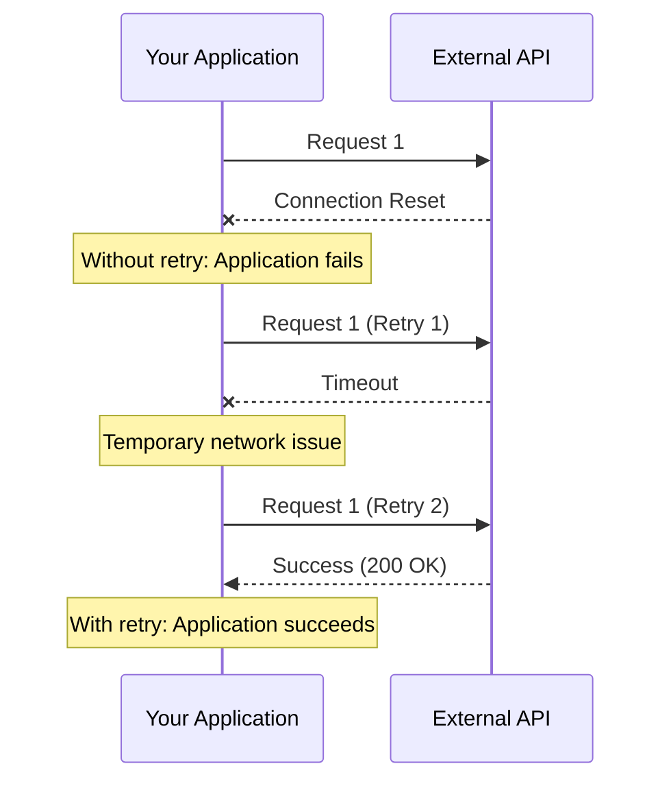
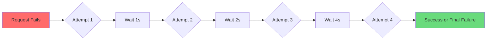
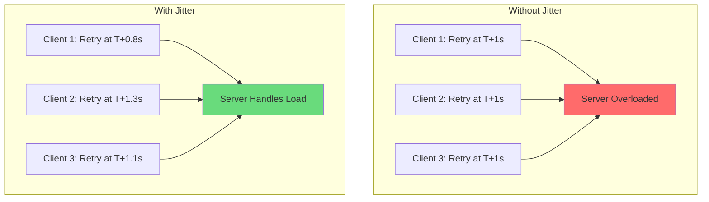
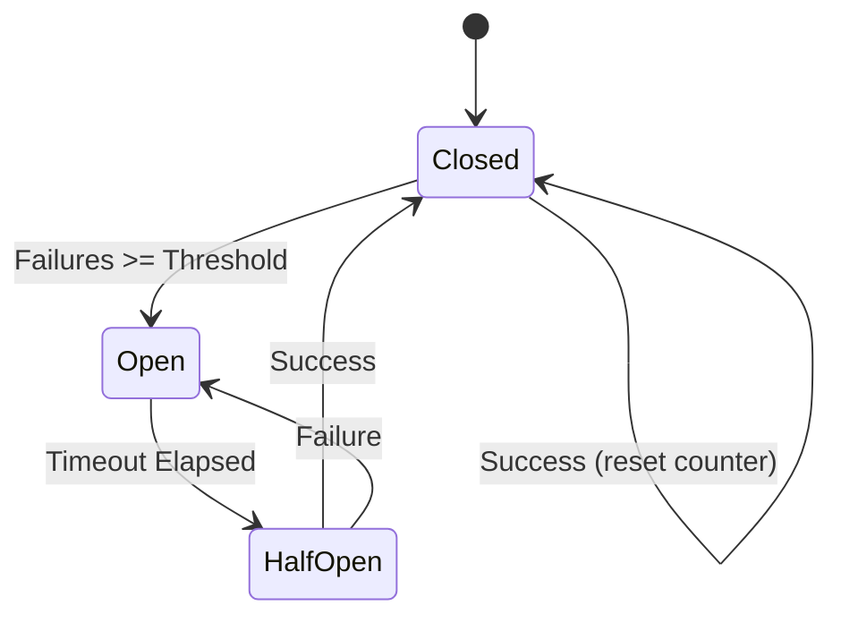

# How to Implement Retry Decorators for Flaky API Calls in Python

Author: [nawazdhandala](https://www.github.com/nawazdhandala)

Tags: Python, Retry, Decorators, API, Resilience, Error Handling

Description: Learn how to implement robust retry decorators for handling flaky API calls in Python. This guide covers custom decorator implementations, exponential backoff strategies, jitter, and production-ready patterns for building resilient applications.

---

> APIs fail. Networks hiccup. Services go down temporarily. The question is not whether your external calls will fail, but how your application handles those failures. Retry decorators provide elegant, reusable solutions for building resilient Python applications.

This guide teaches you how to build retry decorators from scratch and when to use established libraries. By the end, you will understand the internals of retry logic and be able to create custom solutions tailored to your specific needs.

---

## The Problem: Flaky API Calls

External API calls are inherently unreliable. Consider this typical scenario:



Without retry logic, a single transient failure crashes your application. With proper retry decorators, your application gracefully handles temporary failures and continues operating.

---

## Understanding Python Decorators

Before building retry decorators, let us review how Python decorators work. A decorator is a function that wraps another function to extend its behavior.

### Basic Decorator Structure

This example shows the fundamental decorator pattern. The wrapper function executes code before and after the original function, enabling us to add retry logic without modifying the original function.

```python
import functools
from typing import Callable, Any

def simple_decorator(func: Callable) -> Callable:
    """
    Basic decorator structure demonstrating the wrapper pattern.
    
    The @functools.wraps decorator preserves the original function's
    metadata (name, docstring, etc.) which is important for debugging.
    """
    @functools.wraps(func)
    def wrapper(*args, **kwargs) -> Any:
        # Code executed BEFORE the original function
        print(f"Calling {func.__name__}")
        
        # Call the original function
        result = func(*args, **kwargs)
        
        # Code executed AFTER the original function
        print(f"Finished {func.__name__}")
        
        return result
    
    return wrapper


# Usage example
@simple_decorator
def greet(name: str) -> str:
    """Return a greeting message."""
    return f"Hello, {name}!"


# When you call greet("World"), Python actually calls:
# simple_decorator(greet)("World")
message = greet("World")
print(message)
# Output:
# Calling greet
# Finished greet
# Hello, World!
```

### Decorator with Arguments

When we need configurable decorators (like specifying retry count), we add another layer of nesting. This pattern is essential for flexible retry decorators.

```python
import functools
from typing import Callable, Any

def decorator_with_args(prefix: str, suffix: str) -> Callable:
    """
    Decorator factory that accepts arguments.
    
    This creates a three-layer structure:
    1. Outer function receives decorator arguments
    2. Middle function receives the decorated function
    3. Inner function receives the function's arguments
    """
    def decorator(func: Callable) -> Callable:
        @functools.wraps(func)
        def wrapper(*args, **kwargs) -> Any:
            print(f"{prefix} - Starting {func.__name__}")
            result = func(*args, **kwargs)
            print(f"{suffix} - Completed {func.__name__}")
            return result
        return wrapper
    return decorator


# Usage with arguments
@decorator_with_args(prefix="[INFO]", suffix="[DONE]")
def process_data(data: list) -> int:
    """Process and return the count of items."""
    return len(data)


result = process_data([1, 2, 3])
# Output:
# [INFO] - Starting process_data
# [DONE] - Completed process_data
```

---

## Building a Basic Retry Decorator

Now let us build our first retry decorator. This simple version retries a function a fixed number of times with no delay between attempts.

```python
import functools
from typing import Callable, Any, Type, Tuple

def basic_retry(
    max_attempts: int = 3,
    exceptions: Tuple[Type[Exception], ...] = (Exception,)
) -> Callable:
    """
    Basic retry decorator that retries on specified exceptions.
    
    Args:
        max_attempts: Maximum number of attempts (including initial try)
        exceptions: Tuple of exception types to catch and retry on
    
    Returns:
        Decorator function that wraps the target function with retry logic
    
    Example:
        @basic_retry(max_attempts=3, exceptions=(ConnectionError, TimeoutError))
        def fetch_data():
            # ... API call logic
    """
    def decorator(func: Callable) -> Callable:
        @functools.wraps(func)
        def wrapper(*args, **kwargs) -> Any:
            last_exception = None
            
            # Attempt the function up to max_attempts times
            for attempt in range(1, max_attempts + 1):
                try:
                    # Try to execute the function
                    return func(*args, **kwargs)
                except exceptions as e:
                    # Store the exception for potential re-raise
                    last_exception = e
                    
                    # Log the failure (in production, use proper logging)
                    print(
                        f"Attempt {attempt}/{max_attempts} failed for "
                        f"{func.__name__}: {type(e).__name__}: {e}"
                    )
                    
                    # If this was the last attempt, raise the exception
                    if attempt == max_attempts:
                        raise
            
            # This should never be reached, but satisfies type checkers
            raise last_exception  # type: ignore
        
        return wrapper
    return decorator


# Usage example with a simulated flaky API
import random

@basic_retry(max_attempts=3, exceptions=(ConnectionError,))
def flaky_api_call() -> dict:
    """
    Simulates a flaky API that fails 70% of the time.
    In real code, this would be an actual HTTP request.
    """
    if random.random() < 0.7:
        raise ConnectionError("Connection reset by peer")
    return {"status": "success", "data": [1, 2, 3]}


# Test the retry behavior
try:
    result = flaky_api_call()
    print(f"Success: {result}")
except ConnectionError as e:
    print(f"Failed after all retries: {e}")
```

---

## Adding Exponential Backoff

The basic retry decorator hammers the API immediately on each failure. This can overwhelm an already struggling service. Exponential backoff adds increasing delays between retries.



Here is the improved decorator with exponential backoff:

```python
import functools
import time
from typing import Callable, Any, Type, Tuple, Optional

def retry_with_backoff(
    max_attempts: int = 3,
    base_delay: float = 1.0,
    max_delay: float = 60.0,
    exponential_base: float = 2.0,
    exceptions: Tuple[Type[Exception], ...] = (Exception,)
) -> Callable:
    """
    Retry decorator with exponential backoff.
    
    The delay between retries follows the formula:
    delay = min(base_delay * (exponential_base ** attempt), max_delay)
    
    For default values (base=1, exponential=2):
    - After attempt 1: wait 1 second
    - After attempt 2: wait 2 seconds
    - After attempt 3: wait 4 seconds
    - After attempt 4: wait 8 seconds
    - And so on, capped at max_delay
    
    Args:
        max_attempts: Maximum number of attempts
        base_delay: Initial delay in seconds
        max_delay: Maximum delay between retries
        exponential_base: Base for exponential calculation
        exceptions: Exception types to retry on
    
    Returns:
        Configured retry decorator
    """
    def decorator(func: Callable) -> Callable:
        @functools.wraps(func)
        def wrapper(*args, **kwargs) -> Any:
            last_exception: Optional[Exception] = None
            
            for attempt in range(1, max_attempts + 1):
                try:
                    return func(*args, **kwargs)
                    
                except exceptions as e:
                    last_exception = e
                    
                    # Calculate delay with exponential backoff
                    # Attempt 1 -> delay = base * (exp ^ 0) = base * 1
                    # Attempt 2 -> delay = base * (exp ^ 1) = base * 2
                    # Attempt 3 -> delay = base * (exp ^ 2) = base * 4
                    delay = min(
                        base_delay * (exponential_base ** (attempt - 1)),
                        max_delay
                    )
                    
                    print(
                        f"Attempt {attempt}/{max_attempts} failed: "
                        f"{type(e).__name__}: {e}"
                    )
                    
                    # Only sleep if we have more attempts remaining
                    if attempt < max_attempts:
                        print(f"Retrying in {delay:.2f} seconds...")
                        time.sleep(delay)
                    else:
                        print("All retry attempts exhausted")
                        raise
            
            # Should never reach here
            raise last_exception  # type: ignore
        
        return wrapper
    return decorator


# Usage example
import requests

@retry_with_backoff(
    max_attempts=4,
    base_delay=1.0,
    max_delay=30.0,
    exceptions=(requests.RequestException,)
)
def fetch_user_data(user_id: int) -> dict:
    """
    Fetch user data from external API with automatic retry.
    
    On failure, waits 1s, 2s, 4s between retries.
    """
    response = requests.get(
        f"https://api.example.com/users/{user_id}",
        timeout=10
    )
    response.raise_for_status()
    return response.json()
```

---

## Adding Jitter to Prevent Thundering Herd

When many clients retry at the same intervals, they create a "thundering herd" that can overwhelm the recovering service. Jitter adds randomness to spread out the retries.



Here is the decorator with jitter support:

```python
import functools
import time
import random
from typing import Callable, Any, Type, Tuple, Optional
from enum import Enum

class JitterStrategy(Enum):
    """
    Different jitter strategies for retry delays.
    
    NONE: No jitter, use exact calculated delay
    FULL: Random delay between 0 and calculated delay
    EQUAL: Half calculated delay plus random half
    DECORRELATED: Each delay is random between base and previous delay * 3
    """
    NONE = "none"
    FULL = "full"
    EQUAL = "equal"
    DECORRELATED = "decorrelated"


def calculate_delay_with_jitter(
    attempt: int,
    base_delay: float,
    max_delay: float,
    exponential_base: float,
    jitter: JitterStrategy,
    previous_delay: Optional[float] = None
) -> float:
    """
    Calculate retry delay with optional jitter.
    
    Args:
        attempt: Current attempt number (1-indexed)
        base_delay: Base delay in seconds
        max_delay: Maximum delay cap
        exponential_base: Exponential growth base
        jitter: Jitter strategy to apply
        previous_delay: Previous delay (for decorrelated jitter)
    
    Returns:
        Calculated delay in seconds with jitter applied
    """
    # Calculate base exponential delay
    calculated_delay = base_delay * (exponential_base ** (attempt - 1))
    calculated_delay = min(calculated_delay, max_delay)
    
    if jitter == JitterStrategy.NONE:
        # No jitter - return exact calculated value
        return calculated_delay
    
    elif jitter == JitterStrategy.FULL:
        # Full jitter: random value between 0 and calculated delay
        # Provides maximum spread but can result in very short delays
        return random.uniform(0, calculated_delay)
    
    elif jitter == JitterStrategy.EQUAL:
        # Equal jitter: half fixed + half random
        # Guarantees minimum delay of half the calculated value
        half = calculated_delay / 2
        return half + random.uniform(0, half)
    
    elif jitter == JitterStrategy.DECORRELATED:
        # Decorrelated jitter: random between base and 3x previous delay
        # Each delay independent of the exponential sequence
        if previous_delay is None:
            previous_delay = base_delay
        return min(
            max_delay,
            random.uniform(base_delay, previous_delay * 3)
        )
    
    return calculated_delay


def retry_with_jitter(
    max_attempts: int = 3,
    base_delay: float = 1.0,
    max_delay: float = 60.0,
    exponential_base: float = 2.0,
    jitter: JitterStrategy = JitterStrategy.FULL,
    exceptions: Tuple[Type[Exception], ...] = (Exception,)
) -> Callable:
    """
    Production-ready retry decorator with exponential backoff and jitter.
    
    Args:
        max_attempts: Maximum retry attempts
        base_delay: Starting delay in seconds
        max_delay: Maximum delay cap in seconds
        exponential_base: Multiplier for exponential growth
        jitter: Jitter strategy to prevent thundering herd
        exceptions: Exception types to retry on
    
    Returns:
        Configured retry decorator
    
    Example:
        @retry_with_jitter(
            max_attempts=5,
            base_delay=1.0,
            jitter=JitterStrategy.FULL,
            exceptions=(ConnectionError, TimeoutError)
        )
        def call_external_api():
            # ... implementation
    """
    def decorator(func: Callable) -> Callable:
        @functools.wraps(func)
        def wrapper(*args, **kwargs) -> Any:
            last_exception: Optional[Exception] = None
            previous_delay: Optional[float] = None
            
            for attempt in range(1, max_attempts + 1):
                try:
                    return func(*args, **kwargs)
                    
                except exceptions as e:
                    last_exception = e
                    
                    if attempt < max_attempts:
                        # Calculate delay with jitter
                        delay = calculate_delay_with_jitter(
                            attempt=attempt,
                            base_delay=base_delay,
                            max_delay=max_delay,
                            exponential_base=exponential_base,
                            jitter=jitter,
                            previous_delay=previous_delay
                        )
                        previous_delay = delay
                        
                        print(
                            f"Attempt {attempt}/{max_attempts} failed: {e}. "
                            f"Retrying in {delay:.2f}s with {jitter.value} jitter"
                        )
                        time.sleep(delay)
                    else:
                        print(f"All {max_attempts} attempts failed")
                        raise
            
            raise last_exception  # type: ignore
        
        return wrapper
    return decorator


# Example usage demonstrating different jitter strategies
@retry_with_jitter(
    max_attempts=5,
    base_delay=0.5,
    max_delay=30.0,
    jitter=JitterStrategy.FULL,
    exceptions=(ConnectionError, TimeoutError)
)
def fetch_with_full_jitter(url: str) -> dict:
    """Fetch data with full jitter - maximum randomization."""
    import requests
    response = requests.get(url, timeout=10)
    response.raise_for_status()
    return response.json()


@retry_with_jitter(
    max_attempts=5,
    base_delay=0.5,
    max_delay=30.0,
    jitter=JitterStrategy.EQUAL,
    exceptions=(ConnectionError, TimeoutError)
)
def fetch_with_equal_jitter(url: str) -> dict:
    """Fetch data with equal jitter - guaranteed minimum delay."""
    import requests
    response = requests.get(url, timeout=10)
    response.raise_for_status()
    return response.json()
```

---

## Retry Decorator with Callbacks

Production applications need visibility into retry behavior. Adding callbacks enables logging, metrics collection, and custom handling at each stage of the retry process.

```python
import functools
import time
import random
import logging
from typing import Callable, Any, Type, Tuple, Optional
from dataclasses import dataclass
from datetime import datetime

# Configure logging
logging.basicConfig(
    level=logging.INFO,
    format='%(asctime)s - %(levelname)s - %(message)s'
)
logger = logging.getLogger(__name__)


@dataclass
class RetryState:
    """
    Captures the state of a retry operation for callbacks.
    
    This provides all context needed for logging, metrics,
    or custom retry handling logic.
    """
    function_name: str         # Name of the decorated function
    attempt: int               # Current attempt number (1-indexed)
    max_attempts: int          # Maximum configured attempts
    exception: Optional[Exception]  # Exception that triggered retry
    elapsed_time: float        # Total time since first attempt
    next_delay: Optional[float]     # Delay before next attempt (None if final)
    args: tuple                # Positional arguments to function
    kwargs: dict               # Keyword arguments to function


# Type alias for callback functions
RetryCallback = Callable[[RetryState], None]


def default_before_retry(state: RetryState) -> None:
    """Default callback executed before each retry attempt."""
    logger.warning(
        f"Retry {state.attempt}/{state.max_attempts} for "
        f"{state.function_name} after {state.exception}"
    )


def default_after_failure(state: RetryState) -> None:
    """Default callback executed after all retries exhausted."""
    logger.error(
        f"All {state.max_attempts} attempts failed for "
        f"{state.function_name}. Total time: {state.elapsed_time:.2f}s"
    )


def retry_with_callbacks(
    max_attempts: int = 3,
    base_delay: float = 1.0,
    max_delay: float = 60.0,
    exceptions: Tuple[Type[Exception], ...] = (Exception,),
    before_retry: Optional[RetryCallback] = None,
    after_failure: Optional[RetryCallback] = None,
    on_success: Optional[Callable[[str, int], None]] = None
) -> Callable:
    """
    Retry decorator with comprehensive callback support.
    
    Callbacks enable:
    - Logging retry attempts with full context
    - Recording metrics (attempt counts, latencies)
    - Custom alerting on repeated failures
    - Circuit breaker integration
    
    Args:
        max_attempts: Maximum retry attempts
        base_delay: Initial backoff delay
        max_delay: Maximum backoff delay
        exceptions: Exception types to catch
        before_retry: Called before each retry (not initial attempt)
        after_failure: Called when all retries exhausted
        on_success: Called on success with function name and attempt count
    
    Returns:
        Configured retry decorator with callbacks
    """
    # Use defaults if callbacks not provided
    before_retry = before_retry or default_before_retry
    after_failure = after_failure or default_after_failure
    
    def decorator(func: Callable) -> Callable:
        @functools.wraps(func)
        def wrapper(*args, **kwargs) -> Any:
            start_time = datetime.now()
            last_exception: Optional[Exception] = None
            
            for attempt in range(1, max_attempts + 1):
                try:
                    result = func(*args, **kwargs)
                    
                    # Call success callback if provided
                    if on_success:
                        on_success(func.__name__, attempt)
                    
                    return result
                    
                except exceptions as e:
                    last_exception = e
                    elapsed = (datetime.now() - start_time).total_seconds()
                    
                    # Calculate next delay (None if this was final attempt)
                    next_delay: Optional[float] = None
                    if attempt < max_attempts:
                        calculated = base_delay * (2 ** (attempt - 1))
                        next_delay = min(calculated, max_delay)
                        # Add jitter
                        next_delay = random.uniform(0.5 * next_delay, next_delay)
                    
                    # Create state object for callbacks
                    state = RetryState(
                        function_name=func.__name__,
                        attempt=attempt,
                        max_attempts=max_attempts,
                        exception=e,
                        elapsed_time=elapsed,
                        next_delay=next_delay,
                        args=args,
                        kwargs=kwargs
                    )
                    
                    if attempt < max_attempts:
                        # Execute before_retry callback
                        before_retry(state)
                        # Wait before retrying
                        time.sleep(next_delay)  # type: ignore
                    else:
                        # Execute after_failure callback
                        after_failure(state)
                        raise
            
            raise last_exception  # type: ignore
        
        return wrapper
    return decorator


# Example: Custom callbacks for Prometheus metrics
from prometheus_client import Counter, Histogram

retry_counter = Counter(
    'api_retry_total',
    'Total API retry attempts',
    ['function', 'exception_type']
)

retry_duration = Histogram(
    'api_retry_duration_seconds',
    'Time spent in retry loop',
    ['function', 'success']
)


def prometheus_before_retry(state: RetryState) -> None:
    """Record retry metrics in Prometheus."""
    exception_type = type(state.exception).__name__ if state.exception else "unknown"
    retry_counter.labels(
        function=state.function_name,
        exception_type=exception_type
    ).inc()
    logger.info(
        f"Recorded retry metric for {state.function_name}: {exception_type}"
    )


def prometheus_on_success(function_name: str, attempts: int) -> None:
    """Record successful completion metrics."""
    logger.info(
        f"{function_name} succeeded after {attempts} attempt(s)"
    )


# Usage with metrics callbacks
@retry_with_callbacks(
    max_attempts=4,
    base_delay=1.0,
    exceptions=(ConnectionError, TimeoutError),
    before_retry=prometheus_before_retry,
    on_success=prometheus_on_success
)
def monitored_api_call(endpoint: str) -> dict:
    """API call with full metrics integration."""
    import requests
    response = requests.get(endpoint, timeout=5)
    response.raise_for_status()
    return response.json()
```

---

## Async Retry Decorator

Modern Python APIs often use async/await. Here is an async version of the retry decorator:

```python
import asyncio
import functools
import random
from typing import Callable, Any, Type, Tuple, Optional, TypeVar
from datetime import datetime

# Type variable for async function return type
T = TypeVar('T')


def async_retry(
    max_attempts: int = 3,
    base_delay: float = 1.0,
    max_delay: float = 60.0,
    exceptions: Tuple[Type[Exception], ...] = (Exception,),
    jitter: bool = True
) -> Callable:
    """
    Async retry decorator with exponential backoff.
    
    Works with async/await functions using asyncio.sleep
    instead of time.sleep for non-blocking delays.
    
    Args:
        max_attempts: Maximum retry attempts
        base_delay: Initial delay in seconds
        max_delay: Maximum delay cap
        exceptions: Exception types to retry on
        jitter: Whether to add randomness to delays
    
    Returns:
        Async retry decorator
    
    Example:
        @async_retry(max_attempts=3, exceptions=(aiohttp.ClientError,))
        async def fetch_data(url: str) -> dict:
            async with aiohttp.ClientSession() as session:
                async with session.get(url) as response:
                    return await response.json()
    """
    def decorator(func: Callable[..., Any]) -> Callable[..., Any]:
        @functools.wraps(func)
        async def wrapper(*args, **kwargs) -> Any:
            last_exception: Optional[Exception] = None
            start_time = datetime.now()
            
            for attempt in range(1, max_attempts + 1):
                try:
                    # Await the async function
                    return await func(*args, **kwargs)
                    
                except exceptions as e:
                    last_exception = e
                    elapsed = (datetime.now() - start_time).total_seconds()
                    
                    if attempt < max_attempts:
                        # Calculate exponential backoff
                        delay = min(
                            base_delay * (2 ** (attempt - 1)),
                            max_delay
                        )
                        
                        # Apply jitter if enabled
                        if jitter:
                            delay = random.uniform(0.5 * delay, delay)
                        
                        print(
                            f"Async attempt {attempt}/{max_attempts} failed: {e}. "
                            f"Elapsed: {elapsed:.2f}s. Retrying in {delay:.2f}s"
                        )
                        
                        # Non-blocking sleep
                        await asyncio.sleep(delay)
                    else:
                        print(
                            f"All async attempts exhausted after {elapsed:.2f}s"
                        )
                        raise
            
            raise last_exception  # type: ignore
        
        return wrapper
    return decorator


# Example usage with aiohttp
import aiohttp

@async_retry(
    max_attempts=3,
    base_delay=1.0,
    max_delay=30.0,
    exceptions=(aiohttp.ClientError, asyncio.TimeoutError)
)
async def fetch_user_async(user_id: int) -> dict:
    """
    Fetch user data asynchronously with automatic retry.
    
    Uses aiohttp for non-blocking HTTP requests and
    asyncio.sleep for non-blocking retry delays.
    """
    async with aiohttp.ClientSession() as session:
        async with session.get(
            f"https://api.example.com/users/{user_id}",
            timeout=aiohttp.ClientTimeout(total=10)
        ) as response:
            response.raise_for_status()
            return await response.json()


@async_retry(
    max_attempts=5,
    base_delay=0.5,
    exceptions=(aiohttp.ClientError,)
)
async def fetch_multiple_resources(resource_ids: list) -> list:
    """
    Fetch multiple resources concurrently with individual retry logic.
    
    Each resource fetch has its own retry handling, so one failure
    does not block the others.
    """
    async with aiohttp.ClientSession() as session:
        tasks = []
        for resource_id in resource_ids:
            task = session.get(f"https://api.example.com/resources/{resource_id}")
            tasks.append(task)
        
        responses = await asyncio.gather(*tasks, return_exceptions=True)
        
        results = []
        for response in responses:
            if isinstance(response, Exception):
                results.append({"error": str(response)})
            else:
                results.append(await response.json())
        
        return results


# Running async retry functions
async def main():
    """Example of using async retry decorators."""
    try:
        # Single user fetch with retry
        user = await fetch_user_async(123)
        print(f"Fetched user: {user}")
        
        # Multiple resource fetch
        resources = await fetch_multiple_resources([1, 2, 3, 4, 5])
        print(f"Fetched {len(resources)} resources")
        
    except Exception as e:
        print(f"Operation failed: {e}")


# Run the async examples
# asyncio.run(main())
```

---

## Conditional Retry Based on Response

Sometimes you need to retry based on the response content, not just exceptions. This pattern is useful for APIs that return error status in the response body.

```python
import functools
import time
import random
from typing import Callable, Any, Optional, TypeVar

T = TypeVar('T')


def retry_on_condition(
    max_attempts: int = 3,
    base_delay: float = 1.0,
    should_retry: Optional[Callable[[Any], bool]] = None,
    transform_result: Optional[Callable[[Any], Any]] = None
) -> Callable:
    """
    Retry based on a condition evaluated against the return value.
    
    This is useful for APIs that return errors in the response body
    rather than raising exceptions.
    
    Args:
        max_attempts: Maximum attempts
        base_delay: Base delay for backoff
        should_retry: Function that returns True if result should trigger retry
        transform_result: Optional function to transform the final result
    
    Returns:
        Configured retry decorator
    
    Example:
        def is_rate_limited(response):
            return response.get('error_code') == 'RATE_LIMITED'
        
        @retry_on_condition(should_retry=is_rate_limited)
        def api_call():
            return requests.get(url).json()
    """
    def decorator(func: Callable[..., T]) -> Callable[..., T]:
        @functools.wraps(func)
        def wrapper(*args, **kwargs) -> T:
            last_result = None
            
            for attempt in range(1, max_attempts + 1):
                result = func(*args, **kwargs)
                last_result = result
                
                # Check if we should retry based on the result
                if should_retry and should_retry(result):
                    if attempt < max_attempts:
                        delay = base_delay * (2 ** (attempt - 1))
                        delay = random.uniform(0.5 * delay, delay)
                        
                        print(
                            f"Condition triggered retry "
                            f"{attempt}/{max_attempts}. "
                            f"Waiting {delay:.2f}s"
                        )
                        time.sleep(delay)
                        continue
                    else:
                        print("Max attempts reached with retry condition still true")
                
                # Transform result if function provided
                if transform_result:
                    return transform_result(result)
                return result
            
            # Return last result if max attempts reached
            if transform_result and last_result is not None:
                return transform_result(last_result)
            return last_result  # type: ignore
        
        return wrapper
    return decorator


# Example: Retry on rate limiting response
def is_rate_limited(response: dict) -> bool:
    """Check if API response indicates rate limiting."""
    return (
        response.get('status') == 'error' and
        response.get('error_code') in ('RATE_LIMITED', 'TOO_MANY_REQUESTS')
    )


def extract_data(response: dict) -> list:
    """Extract data from successful response."""
    if response.get('status') == 'success':
        return response.get('data', [])
    raise ValueError(f"Unexpected response: {response}")


@retry_on_condition(
    max_attempts=5,
    base_delay=2.0,
    should_retry=is_rate_limited,
    transform_result=extract_data
)
def fetch_paginated_data(page: int) -> dict:
    """
    Fetch paginated data with rate limit handling.
    
    The API returns rate limit errors in the response body:
    {"status": "error", "error_code": "RATE_LIMITED"}
    
    On success:
    {"status": "success", "data": [...], "page": 1}
    """
    import requests
    response = requests.get(
        f"https://api.example.com/items?page={page}",
        timeout=10
    )
    return response.json()


# Example: Retry until data is ready (polling pattern)
def data_not_ready(response: dict) -> bool:
    """Check if data is still processing."""
    return response.get('status') == 'processing'


@retry_on_condition(
    max_attempts=10,
    base_delay=3.0,
    should_retry=data_not_ready
)
def poll_for_result(job_id: str) -> dict:
    """
    Poll an async job until completion.
    
    The API returns processing status until the job completes:
    {"status": "processing", "progress": 45}
    
    On completion:
    {"status": "complete", "result": {...}}
    """
    import requests
    response = requests.get(
        f"https://api.example.com/jobs/{job_id}",
        timeout=10
    )
    return response.json()
```

---

## Circuit Breaker Integration

For production systems, combine retry decorators with circuit breakers to prevent cascading failures:



Here is a retry decorator with built-in circuit breaker:

```python
import functools
import time
import random
from typing import Callable, Any, Type, Tuple, Optional
from threading import Lock
from datetime import datetime, timedelta
from enum import Enum
import logging

logger = logging.getLogger(__name__)


class CircuitState(Enum):
    """Circuit breaker states."""
    CLOSED = "closed"       # Normal operation
    OPEN = "open"           # Failing fast
    HALF_OPEN = "half_open" # Testing recovery


class CircuitBreaker:
    """
    Thread-safe circuit breaker implementation.
    
    The circuit breaker prevents an application from repeatedly
    trying an operation that is likely to fail, allowing it to
    continue without waiting for the fault to be fixed.
    """
    
    def __init__(
        self,
        failure_threshold: int = 5,
        recovery_timeout: float = 30.0,
        half_open_max_calls: int = 3
    ):
        """
        Initialize circuit breaker.
        
        Args:
            failure_threshold: Consecutive failures before opening circuit
            recovery_timeout: Seconds to wait before testing recovery
            half_open_max_calls: Successful calls needed to close circuit
        """
        self.failure_threshold = failure_threshold
        self.recovery_timeout = timedelta(seconds=recovery_timeout)
        self.half_open_max_calls = half_open_max_calls
        
        # State tracking with thread safety
        self._state = CircuitState.CLOSED
        self._failure_count = 0
        self._last_failure_time: Optional[datetime] = None
        self._half_open_successes = 0
        self._lock = Lock()
    
    @property
    def state(self) -> CircuitState:
        """Get current circuit state with automatic transition check."""
        with self._lock:
            if self._state == CircuitState.OPEN:
                # Check if recovery timeout has passed
                if self._last_failure_time:
                    elapsed = datetime.now() - self._last_failure_time
                    if elapsed >= self.recovery_timeout:
                        logger.info("Circuit transitioning to HALF_OPEN")
                        self._state = CircuitState.HALF_OPEN
                        self._half_open_successes = 0
            
            return self._state
    
    def record_success(self) -> None:
        """Record a successful call."""
        with self._lock:
            if self._state == CircuitState.HALF_OPEN:
                self._half_open_successes += 1
                if self._half_open_successes >= self.half_open_max_calls:
                    logger.info("Circuit closing after successful recovery")
                    self._state = CircuitState.CLOSED
                    self._failure_count = 0
            elif self._state == CircuitState.CLOSED:
                # Reset failure count on success
                self._failure_count = 0
    
    def record_failure(self) -> None:
        """Record a failed call."""
        with self._lock:
            self._failure_count += 1
            self._last_failure_time = datetime.now()
            
            if self._state == CircuitState.HALF_OPEN:
                logger.warning("Failure during recovery, circuit reopening")
                self._state = CircuitState.OPEN
            elif self._failure_count >= self.failure_threshold:
                logger.error(
                    f"Failure threshold ({self.failure_threshold}) reached, "
                    f"circuit opening"
                )
                self._state = CircuitState.OPEN
    
    def allow_request(self) -> bool:
        """Check if a request should be allowed through."""
        current_state = self.state  # This triggers state transition check
        
        if current_state == CircuitState.CLOSED:
            return True
        elif current_state == CircuitState.HALF_OPEN:
            return True  # Allow test requests
        else:  # OPEN
            return False


class CircuitOpenError(Exception):
    """Raised when circuit breaker is open."""
    pass


def retry_with_circuit_breaker(
    circuit: CircuitBreaker,
    max_attempts: int = 3,
    base_delay: float = 1.0,
    max_delay: float = 60.0,
    exceptions: Tuple[Type[Exception], ...] = (Exception,)
) -> Callable:
    """
    Retry decorator with integrated circuit breaker.
    
    Combines retry logic with circuit breaker pattern:
    1. Check circuit state before attempting call
    2. Apply retry logic for transient failures
    3. Update circuit state based on results
    
    Args:
        circuit: CircuitBreaker instance to use
        max_attempts: Maximum retry attempts per call
        base_delay: Initial backoff delay
        max_delay: Maximum backoff delay
        exceptions: Exception types to retry on
    
    Returns:
        Retry decorator with circuit breaker integration
    
    Example:
        payment_circuit = CircuitBreaker(failure_threshold=3)
        
        @retry_with_circuit_breaker(payment_circuit, max_attempts=2)
        def process_payment(amount):
            # ... payment logic
    """
    def decorator(func: Callable) -> Callable:
        @functools.wraps(func)
        def wrapper(*args, **kwargs) -> Any:
            # Check circuit breaker state first
            if not circuit.allow_request():
                raise CircuitOpenError(
                    f"Circuit breaker is {circuit.state.value} for "
                    f"{func.__name__}"
                )
            
            last_exception: Optional[Exception] = None
            
            for attempt in range(1, max_attempts + 1):
                try:
                    result = func(*args, **kwargs)
                    # Record success with circuit breaker
                    circuit.record_success()
                    return result
                    
                except exceptions as e:
                    last_exception = e
                    # Record failure with circuit breaker
                    circuit.record_failure()
                    
                    # Check if circuit opened during our retries
                    if not circuit.allow_request():
                        logger.warning(
                            f"Circuit opened during retry for {func.__name__}"
                        )
                        raise CircuitOpenError(
                            f"Circuit opened during retry: {e}"
                        ) from e
                    
                    if attempt < max_attempts:
                        delay = min(
                            base_delay * (2 ** (attempt - 1)),
                            max_delay
                        )
                        delay = random.uniform(0.5 * delay, delay)
                        
                        logger.info(
                            f"Retry {attempt}/{max_attempts} for "
                            f"{func.__name__}: {e}. "
                            f"Circuit state: {circuit.state.value}"
                        )
                        time.sleep(delay)
                    else:
                        raise
            
            raise last_exception  # type: ignore
        
        return wrapper
    return decorator


# Example usage with shared circuit breaker
payment_service_circuit = CircuitBreaker(
    failure_threshold=5,
    recovery_timeout=60,
    half_open_max_calls=3
)


@retry_with_circuit_breaker(
    circuit=payment_service_circuit,
    max_attempts=2,
    base_delay=0.5,
    exceptions=(ConnectionError, TimeoutError)
)
def process_payment(user_id: int, amount: float) -> dict:
    """
    Process payment with circuit breaker protection.
    
    When the payment service fails repeatedly, the circuit opens
    and subsequent calls fail immediately without hitting the
    struggling service.
    """
    import requests
    response = requests.post(
        "https://payment-api.example.com/charge",
        json={"user_id": user_id, "amount": amount},
        timeout=5
    )
    response.raise_for_status()
    return response.json()


@retry_with_circuit_breaker(
    circuit=payment_service_circuit,  # Same circuit for related operations
    max_attempts=2,
    exceptions=(ConnectionError, TimeoutError)
)
def check_payment_status(payment_id: str) -> dict:
    """Check payment status, sharing circuit with payment processing."""
    import requests
    response = requests.get(
        f"https://payment-api.example.com/payments/{payment_id}",
        timeout=5
    )
    response.raise_for_status()
    return response.json()
```

---

## Production-Ready Complete Implementation

Here is a complete, production-ready retry decorator that combines all the patterns:

```python
"""
Production-Ready Retry Decorator Module

This module provides a comprehensive retry decorator suitable for
production use with configurable backoff, jitter, callbacks,
and circuit breaker integration.
"""

import functools
import time
import random
import logging
from typing import (
    Callable, Any, Type, Tuple, Optional, TypeVar, Union
)
from dataclasses import dataclass, field
from datetime import datetime
from enum import Enum
from threading import Lock

# Configure module logger
logger = logging.getLogger(__name__)

T = TypeVar('T')


class BackoffStrategy(Enum):
    """Backoff calculation strategies."""
    CONSTANT = "constant"           # Same delay every time
    LINEAR = "linear"               # Delay increases linearly
    EXPONENTIAL = "exponential"     # Delay doubles each time
    FIBONACCI = "fibonacci"         # Delay follows Fibonacci sequence


class JitterType(Enum):
    """Jitter application methods."""
    NONE = "none"
    FULL = "full"
    EQUAL = "equal"


@dataclass
class RetryConfig:
    """
    Configuration for retry behavior.
    
    Using a dataclass makes it easy to create, modify, and share
    retry configurations across multiple decorated functions.
    """
    max_attempts: int = 3
    base_delay: float = 1.0
    max_delay: float = 60.0
    backoff_strategy: BackoffStrategy = BackoffStrategy.EXPONENTIAL
    jitter: JitterType = JitterType.FULL
    exceptions: Tuple[Type[Exception], ...] = field(
        default_factory=lambda: (Exception,)
    )
    
    # Optional callbacks
    on_retry: Optional[Callable[['RetryContext'], None]] = None
    on_success: Optional[Callable[['RetryContext'], None]] = None
    on_failure: Optional[Callable[['RetryContext'], None]] = None
    
    # Retry condition based on return value
    should_retry_result: Optional[Callable[[Any], bool]] = None


@dataclass
class RetryContext:
    """Context information for retry callbacks."""
    function_name: str
    attempt: int
    max_attempts: int
    exception: Optional[Exception]
    result: Optional[Any]
    elapsed_time: float
    next_delay: Optional[float]
    config: RetryConfig


def calculate_backoff_delay(
    attempt: int,
    config: RetryConfig
) -> float:
    """
    Calculate the delay based on backoff strategy and attempt number.
    
    Args:
        attempt: Current attempt number (1-indexed)
        config: Retry configuration
    
    Returns:
        Calculated delay in seconds (before jitter)
    """
    base = config.base_delay
    
    if config.backoff_strategy == BackoffStrategy.CONSTANT:
        # Always use base delay
        delay = base
        
    elif config.backoff_strategy == BackoffStrategy.LINEAR:
        # Delay = base * attempt (1x, 2x, 3x, ...)
        delay = base * attempt
        
    elif config.backoff_strategy == BackoffStrategy.EXPONENTIAL:
        # Delay = base * 2^(attempt-1) (1x, 2x, 4x, 8x, ...)
        delay = base * (2 ** (attempt - 1))
        
    elif config.backoff_strategy == BackoffStrategy.FIBONACCI:
        # Fibonacci sequence for delay multiplier
        def fib(n: int) -> int:
            if n <= 1:
                return 1
            a, b = 1, 1
            for _ in range(2, n + 1):
                a, b = b, a + b
            return b
        delay = base * fib(attempt)
    else:
        delay = base
    
    # Apply maximum cap
    return min(delay, config.max_delay)


def apply_jitter(delay: float, jitter_type: JitterType) -> float:
    """
    Apply jitter to the calculated delay.
    
    Args:
        delay: Base delay in seconds
        jitter_type: Type of jitter to apply
    
    Returns:
        Delay with jitter applied
    """
    if jitter_type == JitterType.NONE:
        return delay
    elif jitter_type == JitterType.FULL:
        # Random between 0 and delay
        return random.uniform(0, delay)
    elif jitter_type == JitterType.EQUAL:
        # Half fixed, half random
        half = delay / 2
        return half + random.uniform(0, half)
    return delay


def retry(config: Optional[RetryConfig] = None, **kwargs) -> Callable:
    """
    Production-ready retry decorator.
    
    Can be used with a RetryConfig object or keyword arguments:
    
    Usage with config:
        config = RetryConfig(max_attempts=5, base_delay=2.0)
        
        @retry(config)
        def my_function():
            ...
    
    Usage with kwargs:
        @retry(max_attempts=5, base_delay=2.0)
        def my_function():
            ...
    
    Args:
        config: Optional RetryConfig object
        **kwargs: Configuration options (used if config not provided)
    
    Returns:
        Configured retry decorator
    """
    # Build config from kwargs if not provided
    if config is None:
        config = RetryConfig(**kwargs)
    
    def decorator(func: Callable[..., T]) -> Callable[..., T]:
        @functools.wraps(func)
        def wrapper(*args, **func_kwargs) -> T:
            start_time = datetime.now()
            last_exception: Optional[Exception] = None
            last_result: Optional[T] = None
            
            for attempt in range(1, config.max_attempts + 1):
                try:
                    result = func(*args, **func_kwargs)
                    
                    # Check if we should retry based on result
                    if (config.should_retry_result and 
                        config.should_retry_result(result)):
                        
                        last_result = result
                        elapsed = (datetime.now() - start_time).total_seconds()
                        
                        if attempt < config.max_attempts:
                            delay = calculate_backoff_delay(attempt, config)
                            delay = apply_jitter(delay, config.jitter)
                            
                            context = RetryContext(
                                function_name=func.__name__,
                                attempt=attempt,
                                max_attempts=config.max_attempts,
                                exception=None,
                                result=result,
                                elapsed_time=elapsed,
                                next_delay=delay,
                                config=config
                            )
                            
                            if config.on_retry:
                                config.on_retry(context)
                            
                            logger.info(
                                f"Retry condition met for {func.__name__}, "
                                f"attempt {attempt}/{config.max_attempts}, "
                                f"waiting {delay:.2f}s"
                            )
                            time.sleep(delay)
                            continue
                    
                    # Success
                    elapsed = (datetime.now() - start_time).total_seconds()
                    context = RetryContext(
                        function_name=func.__name__,
                        attempt=attempt,
                        max_attempts=config.max_attempts,
                        exception=None,
                        result=result,
                        elapsed_time=elapsed,
                        next_delay=None,
                        config=config
                    )
                    
                    if config.on_success:
                        config.on_success(context)
                    
                    return result
                    
                except config.exceptions as e:
                    last_exception = e
                    elapsed = (datetime.now() - start_time).total_seconds()
                    
                    if attempt < config.max_attempts:
                        delay = calculate_backoff_delay(attempt, config)
                        delay = apply_jitter(delay, config.jitter)
                        
                        context = RetryContext(
                            function_name=func.__name__,
                            attempt=attempt,
                            max_attempts=config.max_attempts,
                            exception=e,
                            result=None,
                            elapsed_time=elapsed,
                            next_delay=delay,
                            config=config
                        )
                        
                        if config.on_retry:
                            config.on_retry(context)
                        
                        logger.warning(
                            f"Attempt {attempt}/{config.max_attempts} failed "
                            f"for {func.__name__}: {e}. "
                            f"Retrying in {delay:.2f}s"
                        )
                        time.sleep(delay)
                    else:
                        # Final failure
                        context = RetryContext(
                            function_name=func.__name__,
                            attempt=attempt,
                            max_attempts=config.max_attempts,
                            exception=e,
                            result=None,
                            elapsed_time=elapsed,
                            next_delay=None,
                            config=config
                        )
                        
                        if config.on_failure:
                            config.on_failure(context)
                        
                        logger.error(
                            f"All {config.max_attempts} attempts failed "
                            f"for {func.__name__} after {elapsed:.2f}s"
                        )
                        raise
            
            # Return last result if we exhausted retries on result condition
            if last_result is not None:
                return last_result
            
            raise last_exception  # type: ignore
        
        return wrapper
    return decorator


# Convenience decorators with preset configurations

def retry_api_call(
    max_attempts: int = 3,
    base_delay: float = 1.0
) -> Callable:
    """
    Retry decorator preconfigured for API calls.
    
    Retries on common HTTP client exceptions with
    exponential backoff and full jitter.
    """
    import requests
    
    config = RetryConfig(
        max_attempts=max_attempts,
        base_delay=base_delay,
        max_delay=30.0,
        backoff_strategy=BackoffStrategy.EXPONENTIAL,
        jitter=JitterType.FULL,
        exceptions=(
            requests.ConnectionError,
            requests.Timeout,
            requests.HTTPError
        )
    )
    return retry(config)


def retry_database_operation(
    max_attempts: int = 3,
    base_delay: float = 0.5
) -> Callable:
    """
    Retry decorator preconfigured for database operations.
    
    Uses shorter delays suitable for database transient errors
    with linear backoff.
    """
    config = RetryConfig(
        max_attempts=max_attempts,
        base_delay=base_delay,
        max_delay=10.0,
        backoff_strategy=BackoffStrategy.LINEAR,
        jitter=JitterType.EQUAL,
        exceptions=(Exception,)  # Replace with your DB exceptions
    )
    return retry(config)


# Example usage
if __name__ == "__main__":
    import requests
    
    # Custom callbacks for monitoring
    def log_retry(ctx: RetryContext) -> None:
        logger.info(
            f"RETRY: {ctx.function_name} attempt {ctx.attempt}, "
            f"waiting {ctx.next_delay:.2f}s after: {ctx.exception}"
        )
    
    def log_success(ctx: RetryContext) -> None:
        logger.info(
            f"SUCCESS: {ctx.function_name} completed in "
            f"{ctx.elapsed_time:.2f}s after {ctx.attempt} attempt(s)"
        )
    
    def log_failure(ctx: RetryContext) -> None:
        logger.error(
            f"FAILURE: {ctx.function_name} failed after "
            f"{ctx.attempt} attempts in {ctx.elapsed_time:.2f}s"
        )
    
    # Create configuration with callbacks
    api_config = RetryConfig(
        max_attempts=4,
        base_delay=1.0,
        max_delay=30.0,
        backoff_strategy=BackoffStrategy.EXPONENTIAL,
        jitter=JitterType.FULL,
        exceptions=(requests.RequestException,),
        on_retry=log_retry,
        on_success=log_success,
        on_failure=log_failure
    )
    
    @retry(api_config)
    def fetch_weather(city: str) -> dict:
        """Fetch weather data with retry protection."""
        response = requests.get(
            f"https://api.weather.example.com/v1/current",
            params={"city": city},
            timeout=10
        )
        response.raise_for_status()
        return response.json()
    
    # Also works with kwargs
    @retry(
        max_attempts=3,
        base_delay=2.0,
        exceptions=(ConnectionError,)
    )
    def simple_fetch(url: str) -> str:
        """Simple fetch with default settings."""
        response = requests.get(url, timeout=5)
        return response.text
```

---

## Best Practices Summary

### 1. Always Use Exponential Backoff

Linear or constant backoff can overwhelm recovering services. Exponential backoff gives services time to recover.

```python
# Good: Exponential with jitter
backoff_strategy=BackoffStrategy.EXPONENTIAL
jitter=JitterType.FULL

# Avoid: Constant retry hammering
backoff_strategy=BackoffStrategy.CONSTANT
```

### 2. Set Reasonable Limits

Never retry indefinitely. Set both attempt limits and maximum delay caps.

```python
# Good: Clear limits
max_attempts=5
max_delay=60.0

# Dangerous: Unlimited retries
max_attempts=float('inf')  # Never do this
```

### 3. Only Retry Transient Errors

Client errors (4xx) indicate problems with your request that will never succeed. Only retry server errors and network issues.

```python
# Good: Specific exceptions
exceptions=(ConnectionError, TimeoutError, HTTPError)

# Bad: Catch everything
exceptions=(Exception,)  # Retries validation errors, auth failures, etc.
```

### 4. Add Observability

Retry behavior should be visible in logs and metrics. Use callbacks to track retry patterns.

```python
# Good: Full visibility
on_retry=log_to_prometheus
on_failure=alert_oncall

# Bad: Silent retries
# No callbacks configured
```

### 5. Consider Circuit Breakers for Production

Retries alone can amplify outages. Circuit breakers prevent cascade failures.

```python
# Production pattern: Retry + Circuit Breaker
@retry_with_circuit_breaker(
    circuit=service_circuit,
    max_attempts=2
)
def critical_operation():
    ...
```

---

## Conclusion

Retry decorators are essential for building resilient Python applications. This guide covered:

- **Basic decorators** for simple retry needs
- **Exponential backoff** to avoid overwhelming services
- **Jitter** to prevent thundering herd problems
- **Callbacks** for monitoring and alerting
- **Async support** for modern Python applications
- **Circuit breakers** for cascade failure protection
- **Production patterns** combining all techniques

Start with simple retry logic and add complexity as your reliability requirements grow.

---

*Building resilient applications requires more than just retry logic. [OneUptime](https://oneuptime.com) provides complete observability with distributed tracing, metrics, and alerting to help you understand how your retry strategies perform in production.*

**Related Reading:**

- [Implement Retry Logic with Exponential Backoff](https://oneuptime.com/blog/post/2025-01-06-python-retry-exponential-backoff/view)
- [12 SRE Best Practices](https://oneuptime.com/blog/post/2025-11-28-sre-best-practices/view)
- [What is MTTR, MTTD, MTBF](https://oneuptime.com/blog/post/2025-09-04-what-is-mttr-mttd-mtbf-and-more/view)
