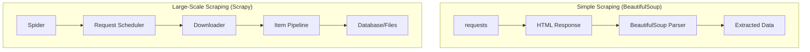
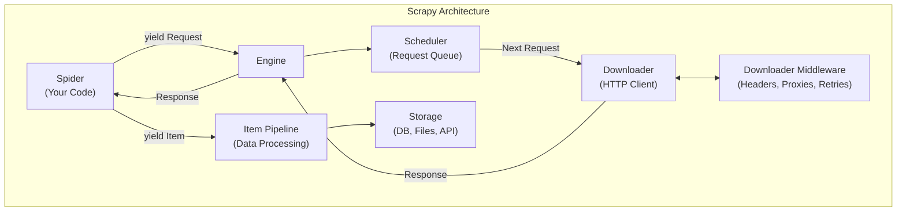
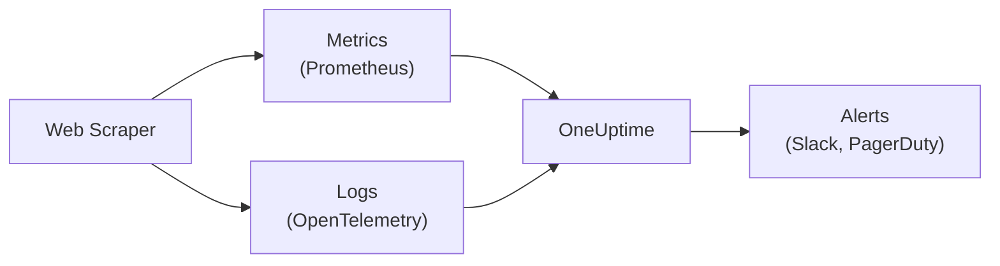

# How to Build Web Scrapers with BeautifulSoup and Scrapy

Author: [nawazdhandala](https://www.github.com/nawazdhandala)

Tags: Python, Web Scraping, BeautifulSoup, Scrapy, Data Extraction, Automation

Description: A practical guide to building web scrapers in Python. Learn BeautifulSoup for simple scraping and Scrapy for large-scale data extraction with rate limiting and error handling.

---

> Web scraping transforms unstructured web content into structured data. Python provides excellent tools for this task. BeautifulSoup handles simple pages elegantly. Scrapy manages complex, large-scale scraping projects. This guide teaches both.

The web contains vast amounts of data. APIs exist for some, but much valuable information remains accessible only through HTML pages. Web scraping bridges this gap.

---

## Overview

Web scraping involves fetching web pages and extracting structured data from HTML. Python offers two primary approaches:

- **BeautifulSoup**: Simple, intuitive parsing for small-scale scraping
- **Scrapy**: Full-featured framework for production-grade scraping



---

## When to Use Each Tool

| Scenario | Tool | Reason |
|----------|------|--------|
| Single page extraction | BeautifulSoup | Simple, fast setup |
| Few pages, no JS | BeautifulSoup | Minimal dependencies |
| Thousands of pages | Scrapy | Built-in concurrency |
| Requires rate limiting | Scrapy | Configurable throttling |
| Need data pipelines | Scrapy | Item processing built-in |
| JavaScript rendering | Both + Selenium/Playwright | Neither handles JS natively |

---

## Part 1: BeautifulSoup Fundamentals

BeautifulSoup provides an intuitive API for parsing HTML and XML documents. Combined with the `requests` library, it handles most simple scraping tasks.

### Installation

```bash
pip install beautifulsoup4 requests lxml
```

The `lxml` parser is faster than Python's built-in parser and handles malformed HTML better.

### Basic Page Fetching

This example demonstrates the fundamental pattern: fetch a page with requests, parse it with BeautifulSoup, and extract data using CSS selectors or element navigation.

```python
# basic_scraping.py
# Simple web scraping with BeautifulSoup
import requests
from bs4 import BeautifulSoup

def fetch_page(url: str) -> BeautifulSoup:
    """Fetch a web page and return a BeautifulSoup object

    Args:
        url: The URL to fetch

    Returns:
        BeautifulSoup object for parsing

    Raises:
        requests.RequestException: If the request fails
    """
    # Set a user agent to identify your scraper
    headers = {
        "User-Agent": "Mozilla/5.0 (compatible; MyScraper/1.0)"
    }

    # Make the HTTP request
    response = requests.get(url, headers=headers, timeout=30)

    # Raise an exception for HTTP errors (4xx, 5xx)
    response.raise_for_status()

    # Parse HTML with lxml for speed and reliability
    soup = BeautifulSoup(response.content, "lxml")

    return soup


def extract_links(soup: BeautifulSoup) -> list[dict]:
    """Extract all links from a page

    Args:
        soup: BeautifulSoup object of the page

    Returns:
        List of dictionaries containing link text and href
    """
    links = []

    # Find all anchor tags with href attributes
    for anchor in soup.find_all("a", href=True):
        links.append({
            "text": anchor.get_text(strip=True),
            "href": anchor["href"]
        })

    return links


# Example usage
if __name__ == "__main__":
    soup = fetch_page("https://example.com")

    # Get the page title
    title = soup.title.string if soup.title else "No title"
    print(f"Page title: {title}")

    # Extract all links
    links = extract_links(soup)
    for link in links[:5]:  # Print first 5 links
        print(f"  {link['text']}: {link['href']}")
```

---

### CSS Selectors

CSS selectors provide a powerful way to locate elements. They use the same syntax as web stylesheets, making them familiar to web developers.

```python
# css_selectors.py
# Using CSS selectors for precise element selection
from bs4 import BeautifulSoup

html = """
<html>
<body>
    <div class="product" data-id="123">
        <h2 class="title">Widget Pro</h2>
        <span class="price">$29.99</span>
        <div class="rating" data-stars="4.5">Excellent</div>
    </div>
    <div class="product" data-id="456">
        <h2 class="title">Gadget Plus</h2>
        <span class="price">$49.99</span>
        <div class="rating" data-stars="3.8">Good</div>
    </div>
</body>
</html>
"""

soup = BeautifulSoup(html, "lxml")

# Select by class name
# Returns all elements with class="product"
products = soup.select(".product")
print(f"Found {len(products)} products")

# Select by ID (if present)
# main_content = soup.select_one("#main-content")

# Select nested elements
# Finds h2 elements that are inside .product divs
titles = soup.select(".product h2.title")
for title in titles:
    print(f"Title: {title.get_text()}")

# Select by attribute
# Finds elements with specific data attributes
ratings = soup.select("div[data-stars]")
for rating in ratings:
    stars = rating.get("data-stars")
    print(f"Rating: {stars} stars")

# Select by attribute value
# Find products with specific data-id
specific_product = soup.select_one('div[data-id="123"]')
if specific_product:
    price = specific_product.select_one(".price")
    print(f"Product 123 price: {price.get_text()}")

# Combine selectors
# Select price spans inside product divs
prices = soup.select("div.product > span.price")
for price in prices:
    print(f"Price: {price.get_text()}")
```

---

### Navigating the DOM

Sometimes CSS selectors are not enough. BeautifulSoup provides methods to navigate the document tree, moving between parents, siblings, and children.

```python
# dom_navigation.py
# Navigating the HTML document tree
from bs4 import BeautifulSoup

html = """
<html>
<body>
    <table id="data-table">
        <thead>
            <tr>
                <th>Name</th>
                <th>Value</th>
            </tr>
        </thead>
        <tbody>
            <tr>
                <td>Alpha</td>
                <td>100</td>
            </tr>
            <tr>
                <td>Beta</td>
                <td>200</td>
            </tr>
            <tr>
                <td>Gamma</td>
                <td>300</td>
            </tr>
        </tbody>
    </table>
</body>
</html>
"""

soup = BeautifulSoup(html, "lxml")

# Find the table
table = soup.find("table", id="data-table")

# Navigate to children
# .children returns a generator of direct children
tbody = table.find("tbody")
rows = list(tbody.children)
# Note: .children includes whitespace text nodes
# Use .find_all or .select for cleaner results

# Get all table rows in tbody
data_rows = tbody.find_all("tr")
print(f"Found {len(data_rows)} data rows")

# Extract table data
for row in data_rows:
    cells = row.find_all("td")
    if len(cells) == 2:
        name = cells[0].get_text(strip=True)
        value = cells[1].get_text(strip=True)
        print(f"  {name}: {value}")

# Navigate to parent
first_cell = soup.find("td")
parent_row = first_cell.parent  # Gets the <tr> element
print(f"Parent tag: {parent_row.name}")

# Navigate to siblings
# .next_sibling and .previous_sibling move between elements
second_row = data_rows[0].find_next_sibling("tr")
if second_row:
    print(f"Second row: {second_row.get_text(strip=True)}")

# Find all following siblings
first_row = data_rows[0]
following_rows = first_row.find_next_siblings("tr")
print(f"Rows after first: {len(following_rows)}")
```

---

### Handling Different Content Types

Web pages contain various data types. This example shows how to extract text, attributes, and handle common patterns like lists and forms.

```python
# content_extraction.py
# Extracting different types of content from HTML
from bs4 import BeautifulSoup
import re

html = """
<html>
<body>
    <article>
        <h1>Article Title</h1>
        <p class="meta">
            By <a href="/author/john">John Doe</a> on
            <time datetime="2025-01-15">January 15, 2025</time>
        </p>
        <div class="content">
            <p>First paragraph with <strong>bold</strong> text.</p>
            <p>Second paragraph with a <a href="https://example.com">link</a>.</p>
            <ul>
                <li>Item one</li>
                <li>Item two</li>
                <li>Item three</li>
            </ul>
        </div>
        
    </article>
</body>
</html>
"""

soup = BeautifulSoup(html, "lxml")

# Extract text content
# get_text() returns all text, stripping tags
article = soup.find("article")
full_text = article.get_text(separator=" ", strip=True)
print(f"Full text length: {len(full_text)} characters")

# Extract specific text with context
title = soup.find("h1").get_text()
print(f"Title: {title}")

# Extract attributes
img = soup.find("img")
if img:
    src = img.get("src")  # Returns None if attribute missing
    alt = img.get("alt", "No alt text")  # Default value
    width = img.get("width")
    print(f"Image: {src} ({alt}), width={width}")

# Extract datetime from time element
time_elem = soup.find("time")
if time_elem:
    # The datetime attribute contains machine-readable date
    date_value = time_elem.get("datetime")
    # The text content is human-readable
    date_text = time_elem.get_text()
    print(f"Date: {date_value} ({date_text})")

# Extract list items
items = soup.select(".content ul li")
print("List items:")
for item in items:
    print(f"  - {item.get_text()}")

# Extract links with their context
links = soup.find_all("a")
for link in links:
    href = link.get("href")
    text = link.get_text()
    # Get surrounding text for context
    parent_text = link.parent.get_text(strip=True)
    print(f"Link: {text} -> {href}")

# Use regex to find elements
# Find all elements with class containing "meta"
meta_elements = soup.find_all(class_=re.compile(r"meta"))
print(f"Found {len(meta_elements)} meta elements")
```

---

### Building a Complete Scraper

This example demonstrates a complete scraper for extracting product data from an e-commerce style page. It includes error handling, data validation, and structured output.

```python
# product_scraper.py
# Complete scraper for extracting product information
import requests
from bs4 import BeautifulSoup
from dataclasses import dataclass
from typing import Optional
import re
import json

@dataclass
class Product:
    """Data class representing a scraped product"""
    name: str
    price: float
    currency: str
    description: str
    rating: Optional[float]
    review_count: int
    url: str
    image_url: Optional[str]
    in_stock: bool


def parse_price(price_text: str) -> tuple[float, str]:
    """Extract numeric price and currency from price text

    Args:
        price_text: Price string like "$29.99" or "EUR 49.99"

    Returns:
        Tuple of (price_float, currency_code)
    """
    # Remove whitespace
    price_text = price_text.strip()

    # Match currency symbols or codes
    currency_patterns = {
        "$": "USD",
        "EUR": "EUR",
        "GBP": "GBP",
        "USD": "USD"
    }

    currency = "USD"  # Default
    for symbol, code in currency_patterns.items():
        if symbol in price_text:
            currency = code
            break

    # Extract numeric value
    # Handles formats like $1,234.56 or 1.234,56
    numbers = re.findall(r"[\d.,]+", price_text)
    if numbers:
        # Take the longest match (most likely the full price)
        price_str = max(numbers, key=len)
        # Normalize: remove thousands separator, ensure decimal point
        # This handles both 1,234.56 and 1.234,56 formats
        if "," in price_str and "." in price_str:
            # Determine format by position
            if price_str.rfind(",") > price_str.rfind("."):
                # European format: 1.234,56
                price_str = price_str.replace(".", "").replace(",", ".")
            else:
                # US format: 1,234.56
                price_str = price_str.replace(",", "")
        elif "," in price_str:
            # Could be thousands (1,234) or decimal (12,34)
            # Assume thousands separator for US context
            price_str = price_str.replace(",", "")

        return float(price_str), currency

    return 0.0, currency


def scrape_product(soup: BeautifulSoup, base_url: str) -> Optional[Product]:
    """Extract product data from a product page

    Args:
        soup: BeautifulSoup object of the product page
        base_url: Base URL for resolving relative links

    Returns:
        Product object or None if extraction fails
    """
    try:
        # Extract product name from multiple possible locations
        name_elem = (
            soup.select_one("h1.product-title") or
            soup.select_one("h1[itemprop='name']") or
            soup.select_one(".product-name h1") or
            soup.find("h1")
        )
        if not name_elem:
            return None
        name = name_elem.get_text(strip=True)

        # Extract price
        price_elem = (
            soup.select_one(".price-current") or
            soup.select_one("[itemprop='price']") or
            soup.select_one(".product-price")
        )
        if price_elem:
            price, currency = parse_price(price_elem.get_text())
        else:
            price, currency = 0.0, "USD"

        # Extract description
        desc_elem = (
            soup.select_one(".product-description") or
            soup.select_one("[itemprop='description']") or
            soup.select_one("#description")
        )
        description = desc_elem.get_text(strip=True) if desc_elem else ""

        # Extract rating
        rating = None
        rating_elem = soup.select_one("[itemprop='ratingValue']")
        if rating_elem:
            try:
                rating = float(rating_elem.get("content", rating_elem.get_text()))
            except ValueError:
                pass

        # Extract review count
        review_count = 0
        review_elem = soup.select_one("[itemprop='reviewCount']")
        if review_elem:
            try:
                review_text = review_elem.get("content", review_elem.get_text())
                review_count = int(re.sub(r"\D", "", review_text))
            except ValueError:
                pass

        # Extract image URL
        image_url = None
        img_elem = (
            soup.select_one(".product-image img") or
            soup.select_one("[itemprop='image']")
        )
        if img_elem:
            image_url = img_elem.get("src") or img_elem.get("data-src")
            # Resolve relative URLs
            if image_url and not image_url.startswith("http"):
                image_url = base_url.rstrip("/") + "/" + image_url.lstrip("/")

        # Check stock status
        in_stock = True
        stock_elem = soup.select_one(".stock-status, .availability")
        if stock_elem:
            stock_text = stock_elem.get_text(strip=True).lower()
            in_stock = "out of stock" not in stock_text

        return Product(
            name=name,
            price=price,
            currency=currency,
            description=description[:500],  # Truncate long descriptions
            rating=rating,
            review_count=review_count,
            url=base_url,
            image_url=image_url,
            in_stock=in_stock
        )

    except Exception as e:
        print(f"Error parsing product: {e}")
        return None


def scrape_product_list(url: str) -> list[Product]:
    """Scrape a product listing page

    Args:
        url: URL of the product listing page

    Returns:
        List of Product objects
    """
    headers = {
        "User-Agent": "Mozilla/5.0 (compatible; ProductScraper/1.0)"
    }

    response = requests.get(url, headers=headers, timeout=30)
    response.raise_for_status()

    soup = BeautifulSoup(response.content, "lxml")
    products = []

    # Find product cards on the listing page
    product_cards = soup.select(".product-card, .product-item, [itemtype*='Product']")

    for card in product_cards:
        # Extract basic info from the card
        name_elem = card.select_one(".product-name, h2, h3")
        price_elem = card.select_one(".price, .product-price")
        link_elem = card.select_one("a[href]")

        if name_elem and price_elem:
            name = name_elem.get_text(strip=True)
            price, currency = parse_price(price_elem.get_text())

            # Get product URL
            product_url = ""
            if link_elem:
                href = link_elem.get("href", "")
                if href.startswith("http"):
                    product_url = href
                else:
                    product_url = url.rstrip("/") + "/" + href.lstrip("/")

            products.append(Product(
                name=name,
                price=price,
                currency=currency,
                description="",
                rating=None,
                review_count=0,
                url=product_url,
                image_url=None,
                in_stock=True
            ))

    return products


# Example usage
if __name__ == "__main__":
    # Example: scrape a single product page
    # product = scrape_product(soup, "https://example.com/product/123")

    # Example: scrape a product listing
    # products = scrape_product_list("https://example.com/products")

    # Export to JSON
    # with open("products.json", "w") as f:
    #     json.dump([p.__dict__ for p in products], f, indent=2)
    pass
```

---

## Part 2: Scrapy Framework

Scrapy is a complete web scraping framework. It handles concurrent requests, rate limiting, data pipelines, and much more. Use Scrapy for production scraping projects.



### Installation

```bash
pip install scrapy
```

### Creating a Scrapy Project

```bash
# Create a new Scrapy project
scrapy startproject myspider

# Project structure:
# myspider/
#   scrapy.cfg            # Project configuration
#   myspider/
#     __init__.py
#     items.py            # Data structures
#     middlewares.py      # Request/response processing
#     pipelines.py        # Item processing
#     settings.py         # Project settings
#     spiders/           # Your spiders go here
#       __init__.py
```

---

### Defining Items

Items are containers for scraped data. They provide validation and documentation for your data structures.

```python
# myspider/items.py
# Data structures for scraped items
import scrapy
from itemloaders.processors import TakeFirst, MapCompose, Join
from w3lib.html import remove_tags

def clean_price(value: str) -> float:
    """Convert price string to float"""
    # Remove currency symbols and whitespace
    cleaned = value.strip().replace("$", "").replace(",", "")
    try:
        return float(cleaned)
    except ValueError:
        return 0.0


def clean_text(value: str) -> str:
    """Clean text content"""
    return value.strip()


class ProductItem(scrapy.Item):
    """Item representing a product"""
    # Basic product info
    name = scrapy.Field(
        input_processor=MapCompose(remove_tags, clean_text),
        output_processor=TakeFirst()
    )
    price = scrapy.Field(
        input_processor=MapCompose(remove_tags, clean_price),
        output_processor=TakeFirst()
    )
    currency = scrapy.Field(output_processor=TakeFirst())
    description = scrapy.Field(
        input_processor=MapCompose(remove_tags, clean_text),
        output_processor=Join(" ")
    )

    # Product details
    sku = scrapy.Field(output_processor=TakeFirst())
    category = scrapy.Field(output_processor=TakeFirst())
    brand = scrapy.Field(output_processor=TakeFirst())

    # Rating and reviews
    rating = scrapy.Field(output_processor=TakeFirst())
    review_count = scrapy.Field(output_processor=TakeFirst())

    # URLs and images
    url = scrapy.Field(output_processor=TakeFirst())
    image_urls = scrapy.Field()  # List of image URLs

    # Metadata
    scraped_at = scrapy.Field(output_processor=TakeFirst())


class ArticleItem(scrapy.Item):
    """Item representing a blog article"""
    title = scrapy.Field(output_processor=TakeFirst())
    author = scrapy.Field(output_processor=TakeFirst())
    published_date = scrapy.Field(output_processor=TakeFirst())
    content = scrapy.Field(output_processor=Join("\n\n"))
    tags = scrapy.Field()  # List of tags
    url = scrapy.Field(output_processor=TakeFirst())
```

---

### Writing a Spider

Spiders define how to crawl a website. They contain the logic for making requests and extracting data from responses.

```python
# myspider/spiders/products.py
# Spider for scraping product pages
import scrapy
from scrapy.loader import ItemLoader
from myspider.items import ProductItem
from datetime import datetime

class ProductSpider(scrapy.Spider):
    """Spider for scraping product listings and details"""

    # Spider name - used to run the spider
    name = "products"

    # Domains this spider is allowed to crawl
    allowed_domains = ["example.com"]

    # Starting URLs - spider begins here
    start_urls = [
        "https://example.com/products/page/1",
    ]

    # Custom settings for this spider
    custom_settings = {
        "DOWNLOAD_DELAY": 1,  # 1 second between requests
        "CONCURRENT_REQUESTS_PER_DOMAIN": 2,
    }

    def parse(self, response):
        """Parse product listing page

        This method handles the initial response and listing pages.
        It yields requests for individual product pages.
        """
        self.logger.info(f"Parsing listing: {response.url}")

        # Extract product links from the listing
        product_links = response.css(".product-card a.product-link::attr(href)").getall()

        for link in product_links:
            # yield a request to scrape each product page
            yield response.follow(
                link,
                callback=self.parse_product,
                meta={"category": response.meta.get("category", "General")}
            )

        # Handle pagination
        # Look for "next page" link
        next_page = response.css("a.pagination-next::attr(href)").get()
        if next_page:
            yield response.follow(next_page, callback=self.parse)

    def parse_product(self, response):
        """Parse individual product page

        Extracts detailed product information and yields an item.
        """
        self.logger.info(f"Parsing product: {response.url}")

        # Use ItemLoader for cleaner extraction
        loader = ItemLoader(item=ProductItem(), response=response)

        # Basic product info
        loader.add_css("name", "h1.product-title::text")
        loader.add_css("price", ".price-current::text")
        loader.add_value("currency", "USD")
        loader.add_css("description", ".product-description p::text")

        # Product details
        loader.add_css("sku", ".product-sku::text")
        loader.add_value("category", response.meta.get("category"))
        loader.add_css("brand", ".product-brand::text")

        # Rating information
        loader.add_css("rating", "[itemprop='ratingValue']::attr(content)")
        loader.add_css("review_count", ".review-count::text")

        # URLs
        loader.add_value("url", response.url)
        loader.add_css("image_urls", ".product-images img::attr(src)")

        # Metadata
        loader.add_value("scraped_at", datetime.utcnow().isoformat())

        yield loader.load_item()

    def errback_httpbin(self, failure):
        """Handle request errors"""
        self.logger.error(f"Request failed: {failure.request.url}")
```

---

### Configuring Settings

Settings control Scrapy's behavior. Configure rate limiting, pipelines, and middleware here.

```python
# myspider/settings.py
# Scrapy settings for this project

# Bot name and identity
BOT_NAME = "myspider"
SPIDER_MODULES = ["myspider.spiders"]
NEWSPIDER_MODULE = "myspider.spiders"

# Crawl responsibly by identifying yourself
USER_AGENT = "MySpider/1.0 (+https://example.com/bot)"

# Obey robots.txt rules
ROBOTSTXT_OBEY = True

# Configure maximum concurrent requests
CONCURRENT_REQUESTS = 16

# Configure delay between requests to the same domain
# Prevents overwhelming servers
DOWNLOAD_DELAY = 0.5

# Additional delay randomization (0.5 to 1.5 * DOWNLOAD_DELAY)
RANDOMIZE_DOWNLOAD_DELAY = True

# Limit concurrent requests per domain
CONCURRENT_REQUESTS_PER_DOMAIN = 8

# Limit concurrent requests per IP
CONCURRENT_REQUESTS_PER_IP = 8

# Disable cookies (reduces request overhead)
COOKIES_ENABLED = False

# Enable Telnet console (for debugging)
TELNETCONSOLE_ENABLED = False

# Default request headers
DEFAULT_REQUEST_HEADERS = {
    "Accept": "text/html,application/xhtml+xml,application/xml;q=0.9",
    "Accept-Language": "en-US,en;q=0.9",
}

# Enable and configure spider middlewares
SPIDER_MIDDLEWARES = {
    "myspider.middlewares.MyspiderSpiderMiddleware": 543,
}

# Enable and configure downloader middlewares
DOWNLOADER_MIDDLEWARES = {
    "myspider.middlewares.MyspiderDownloaderMiddleware": 543,
}

# Configure item pipelines
ITEM_PIPELINES = {
    "myspider.pipelines.ValidationPipeline": 100,
    "myspider.pipelines.CleaningPipeline": 200,
    "myspider.pipelines.DatabasePipeline": 300,
    "myspider.pipelines.JsonExportPipeline": 400,
}

# Enable and configure AutoThrottle
# Automatically adjusts delay based on server response
AUTOTHROTTLE_ENABLED = True
AUTOTHROTTLE_START_DELAY = 1
AUTOTHROTTLE_MAX_DELAY = 10
AUTOTHROTTLE_TARGET_CONCURRENCY = 2.0

# Enable HTTP caching (speeds up development)
HTTPCACHE_ENABLED = True
HTTPCACHE_EXPIRATION_SECS = 86400  # 24 hours
HTTPCACHE_DIR = "httpcache"
HTTPCACHE_IGNORE_HTTP_CODES = [500, 502, 503, 504]

# Configure retry behavior
RETRY_ENABLED = True
RETRY_TIMES = 3
RETRY_HTTP_CODES = [500, 502, 503, 504, 408, 429]

# Configure logging
LOG_LEVEL = "INFO"
LOG_FORMAT = "%(asctime)s [%(name)s] %(levelname)s: %(message)s"

# Export settings
FEED_EXPORT_ENCODING = "utf-8"
```

---

### Item Pipelines

Pipelines process items after extraction. Use them for validation, cleaning, deduplication, and storage.

```python
# myspider/pipelines.py
# Item processing pipelines
from itemadapter import ItemAdapter
from scrapy.exceptions import DropItem
import json
import sqlite3
from datetime import datetime

class ValidationPipeline:
    """Validate items before processing

    Drops items that are missing required fields or have invalid data.
    """

    required_fields = ["name", "price", "url"]

    def process_item(self, item, spider):
        adapter = ItemAdapter(item)

        # Check required fields
        for field in self.required_fields:
            if not adapter.get(field):
                spider.logger.warning(f"Missing required field: {field}")
                raise DropItem(f"Missing required field: {field}")

        # Validate price
        price = adapter.get("price")
        if price is not None and price < 0:
            raise DropItem(f"Invalid price: {price}")

        return item


class CleaningPipeline:
    """Clean and normalize item data"""

    def process_item(self, item, spider):
        adapter = ItemAdapter(item)

        # Normalize text fields
        if adapter.get("name"):
            adapter["name"] = adapter["name"].strip()

        # Ensure price is a float
        if adapter.get("price"):
            try:
                adapter["price"] = float(adapter["price"])
            except (ValueError, TypeError):
                adapter["price"] = 0.0

        # Clean description
        if adapter.get("description"):
            desc = adapter["description"]
            # Remove excessive whitespace
            desc = " ".join(desc.split())
            # Truncate if too long
            if len(desc) > 5000:
                desc = desc[:5000] + "..."
            adapter["description"] = desc

        return item


class DuplicateFilterPipeline:
    """Filter duplicate items based on URL or SKU"""

    def __init__(self):
        self.seen_urls = set()
        self.seen_skus = set()

    def process_item(self, item, spider):
        adapter = ItemAdapter(item)

        # Check URL
        url = adapter.get("url")
        if url in self.seen_urls:
            raise DropItem(f"Duplicate URL: {url}")
        self.seen_urls.add(url)

        # Check SKU if available
        sku = adapter.get("sku")
        if sku:
            if sku in self.seen_skus:
                raise DropItem(f"Duplicate SKU: {sku}")
            self.seen_skus.add(sku)

        return item


class DatabasePipeline:
    """Store items in SQLite database"""

    def __init__(self, db_path):
        self.db_path = db_path
        self.connection = None
        self.cursor = None

    @classmethod
    def from_crawler(cls, crawler):
        """Create pipeline instance from crawler settings"""
        db_path = crawler.settings.get("DATABASE_PATH", "scraped_data.db")
        return cls(db_path)

    def open_spider(self, spider):
        """Called when spider opens"""
        self.connection = sqlite3.connect(self.db_path)
        self.cursor = self.connection.cursor()

        # Create table if not exists
        self.cursor.execute("""
            CREATE TABLE IF NOT EXISTS products (
                id INTEGER PRIMARY KEY AUTOINCREMENT,
                name TEXT NOT NULL,
                price REAL,
                currency TEXT,
                description TEXT,
                sku TEXT,
                category TEXT,
                brand TEXT,
                rating REAL,
                review_count INTEGER,
                url TEXT UNIQUE,
                image_urls TEXT,
                scraped_at TEXT
            )
        """)
        self.connection.commit()

    def close_spider(self, spider):
        """Called when spider closes"""
        if self.connection:
            self.connection.close()

    def process_item(self, item, spider):
        adapter = ItemAdapter(item)

        try:
            self.cursor.execute("""
                INSERT OR REPLACE INTO products
                (name, price, currency, description, sku, category, brand,
                 rating, review_count, url, image_urls, scraped_at)
                VALUES (?, ?, ?, ?, ?, ?, ?, ?, ?, ?, ?, ?)
            """, (
                adapter.get("name"),
                adapter.get("price"),
                adapter.get("currency"),
                adapter.get("description"),
                adapter.get("sku"),
                adapter.get("category"),
                adapter.get("brand"),
                adapter.get("rating"),
                adapter.get("review_count"),
                adapter.get("url"),
                json.dumps(adapter.get("image_urls", [])),
                adapter.get("scraped_at", datetime.utcnow().isoformat())
            ))
            self.connection.commit()
        except sqlite3.Error as e:
            spider.logger.error(f"Database error: {e}")

        return item


class JsonExportPipeline:
    """Export items to JSON Lines file"""

    def __init__(self, output_path):
        self.output_path = output_path
        self.file = None

    @classmethod
    def from_crawler(cls, crawler):
        output_path = crawler.settings.get("JSON_OUTPUT_PATH", "output.jsonl")
        return cls(output_path)

    def open_spider(self, spider):
        self.file = open(self.output_path, "w", encoding="utf-8")

    def close_spider(self, spider):
        if self.file:
            self.file.close()

    def process_item(self, item, spider):
        adapter = ItemAdapter(item)
        line = json.dumps(dict(adapter), ensure_ascii=False) + "\n"
        self.file.write(line)
        return item
```

---

### Downloader Middleware

Middleware processes requests before they are sent and responses before they reach spiders. Use them for rotating user agents, handling proxies, and retrying failed requests.

```python
# myspider/middlewares.py
# Custom middleware for request/response processing
from scrapy import signals
from scrapy.downloadermiddlewares.retry import RetryMiddleware
from scrapy.utils.response import response_status_message
import random
import logging

logger = logging.getLogger(__name__)

class RotateUserAgentMiddleware:
    """Rotate User-Agent header for each request

    Helps avoid detection by varying the browser fingerprint.
    """

    user_agents = [
        "Mozilla/5.0 (Windows NT 10.0; Win64; x64) AppleWebKit/537.36",
        "Mozilla/5.0 (Macintosh; Intel Mac OS X 10_15_7) AppleWebKit/537.36",
        "Mozilla/5.0 (X11; Linux x86_64) AppleWebKit/537.36",
        "Mozilla/5.0 (Windows NT 10.0; Win64; x64; rv:120.0) Gecko/20100101",
        "Mozilla/5.0 (Macintosh; Intel Mac OS X 10.15; rv:120.0) Gecko/20100101",
    ]

    def process_request(self, request, spider):
        """Add random User-Agent to each request"""
        user_agent = random.choice(self.user_agents)
        request.headers["User-Agent"] = user_agent


class ProxyMiddleware:
    """Rotate through a pool of proxy servers

    Configure proxies in settings: PROXY_LIST = ["http://proxy1:8080", ...]
    """

    def __init__(self, proxy_list):
        self.proxy_list = proxy_list

    @classmethod
    def from_crawler(cls, crawler):
        proxy_list = crawler.settings.getlist("PROXY_LIST", [])
        return cls(proxy_list)

    def process_request(self, request, spider):
        """Assign a random proxy to each request"""
        if self.proxy_list:
            proxy = random.choice(self.proxy_list)
            request.meta["proxy"] = proxy
            spider.logger.debug(f"Using proxy: {proxy}")


class CustomRetryMiddleware(RetryMiddleware):
    """Custom retry logic with exponential backoff"""

    def process_response(self, request, response, spider):
        # Retry on certain status codes
        if response.status in [429, 503]:
            reason = response_status_message(response.status)
            spider.logger.warning(f"Retrying {request.url}: {reason}")

            # Get retry count
            retry_count = request.meta.get("retry_times", 0)

            # Implement exponential backoff
            delay = min(2 ** retry_count, 60)  # Max 60 seconds
            request.meta["download_delay"] = delay

            return self._retry(request, reason, spider) or response

        return response


class ErrorHandlingMiddleware:
    """Log and handle various error conditions"""

    def process_response(self, request, response, spider):
        # Log error responses
        if response.status >= 400:
            spider.logger.error(
                f"HTTP {response.status} for {request.url}"
            )

        # Log blocked responses (common patterns)
        if response.status == 403:
            spider.logger.warning(f"Possibly blocked: {request.url}")

        # Check for CAPTCHA pages
        if b"captcha" in response.body.lower():
            spider.logger.error(f"CAPTCHA detected: {request.url}")

        return response

    def process_exception(self, request, exception, spider):
        """Handle request exceptions"""
        spider.logger.error(
            f"Request exception for {request.url}: {exception}"
        )
        return None  # Let other middleware handle it
```

---

### Running Scrapy

```bash
# Run a spider
scrapy crawl products

# Run with output file
scrapy crawl products -o products.json

# Run with different output formats
scrapy crawl products -o products.csv
scrapy crawl products -o products.jsonl  # JSON Lines

# Run with settings override
scrapy crawl products -s DOWNLOAD_DELAY=2

# Run with logging
scrapy crawl products -L DEBUG

# Run from Python script
```

### Running Scrapy Programmatically

```python
# run_spider.py
# Run Scrapy spider from Python script
from scrapy.crawler import CrawlerProcess
from scrapy.utils.project import get_project_settings
from myspider.spiders.products import ProductSpider

def run_spider():
    """Run spider with custom settings"""
    settings = get_project_settings()

    # Override settings programmatically
    settings.update({
        "DOWNLOAD_DELAY": 1,
        "LOG_LEVEL": "INFO",
        "FEED_URI": "output.json",
        "FEED_FORMAT": "json",
    })

    process = CrawlerProcess(settings)
    process.crawl(ProductSpider)
    process.start()  # Blocks until spider finishes


if __name__ == "__main__":
    run_spider()
```

---

## Part 3: Best Practices

### Rate Limiting and Politeness

Respect website resources. Aggressive scraping can cause problems for both you and the website.

```python
# rate_limiting.py
# Implementing polite scraping practices
import time
import random
from functools import wraps

def rate_limit(min_delay: float = 1.0, max_delay: float = 3.0):
    """Decorator to add random delay between calls

    Args:
        min_delay: Minimum delay in seconds
        max_delay: Maximum delay in seconds
    """
    def decorator(func):
        @wraps(func)
        def wrapper(*args, **kwargs):
            # Add random delay before the call
            delay = random.uniform(min_delay, max_delay)
            time.sleep(delay)
            return func(*args, **kwargs)
        return wrapper
    return decorator


@rate_limit(min_delay=1.0, max_delay=2.0)
def fetch_page(url: str):
    """Fetch a page with automatic rate limiting"""
    import requests
    response = requests.get(url, timeout=30)
    return response


class RateLimiter:
    """Token bucket rate limiter for request throttling"""

    def __init__(self, rate: float, burst: int = 1):
        """
        Args:
            rate: Requests per second
            burst: Maximum burst size
        """
        self.rate = rate
        self.burst = burst
        self.tokens = burst
        self.last_update = time.time()

    def acquire(self):
        """Wait until a request is allowed"""
        while True:
            now = time.time()
            elapsed = now - self.last_update
            self.last_update = now

            # Add tokens based on elapsed time
            self.tokens = min(self.burst, self.tokens + elapsed * self.rate)

            if self.tokens >= 1:
                self.tokens -= 1
                return

            # Wait for tokens to regenerate
            wait_time = (1 - self.tokens) / self.rate
            time.sleep(wait_time)


# Usage example
limiter = RateLimiter(rate=2, burst=5)  # 2 requests per second

def fetch_with_limiter(url: str):
    limiter.acquire()  # Wait for permission
    return fetch_page(url)
```

---

### Error Handling

Robust error handling keeps scrapers running despite network issues and website changes.

```python
# error_handling.py
# Comprehensive error handling for web scraping
import requests
from requests.exceptions import (
    RequestException,
    Timeout,
    ConnectionError,
    HTTPError
)
from bs4 import BeautifulSoup
import logging
import time
from typing import Optional

logger = logging.getLogger(__name__)

class ScrapingError(Exception):
    """Base exception for scraping errors"""
    pass

class PageNotFoundError(ScrapingError):
    """Page returned 404"""
    pass

class BlockedError(ScrapingError):
    """Request was blocked (403, CAPTCHA, etc.)"""
    pass

class RateLimitError(ScrapingError):
    """Rate limited (429)"""
    pass


def fetch_with_retry(
    url: str,
    max_retries: int = 3,
    backoff_factor: float = 2.0,
    timeout: int = 30
) -> Optional[BeautifulSoup]:
    """Fetch a URL with automatic retry on failure

    Args:
        url: URL to fetch
        max_retries: Maximum number of retry attempts
        backoff_factor: Multiplier for delay between retries
        timeout: Request timeout in seconds

    Returns:
        BeautifulSoup object or None if all retries fail

    Raises:
        PageNotFoundError: If page returns 404
        BlockedError: If request is blocked
    """
    headers = {
        "User-Agent": "Mozilla/5.0 (compatible; Scraper/1.0)"
    }

    last_exception = None

    for attempt in range(max_retries + 1):
        try:
            response = requests.get(url, headers=headers, timeout=timeout)

            # Handle specific status codes
            if response.status_code == 404:
                raise PageNotFoundError(f"Page not found: {url}")

            if response.status_code == 403:
                raise BlockedError(f"Access denied: {url}")

            if response.status_code == 429:
                # Rate limited - wait and retry
                retry_after = int(response.headers.get("Retry-After", 60))
                logger.warning(f"Rate limited, waiting {retry_after}s")
                time.sleep(retry_after)
                continue

            response.raise_for_status()

            return BeautifulSoup(response.content, "lxml")

        except (Timeout, ConnectionError) as e:
            last_exception = e
            if attempt < max_retries:
                delay = backoff_factor ** attempt
                logger.warning(
                    f"Attempt {attempt + 1} failed for {url}, "
                    f"retrying in {delay}s: {e}"
                )
                time.sleep(delay)
            else:
                logger.error(f"All retries failed for {url}: {e}")

        except HTTPError as e:
            last_exception = e
            logger.error(f"HTTP error for {url}: {e}")
            break

    return None


def safe_extract(soup: BeautifulSoup, selector: str, default: str = "") -> str:
    """Safely extract text from a selector

    Args:
        soup: BeautifulSoup object
        selector: CSS selector
        default: Default value if not found

    Returns:
        Extracted text or default value
    """
    try:
        element = soup.select_one(selector)
        if element:
            return element.get_text(strip=True)
    except Exception as e:
        logger.debug(f"Extraction failed for {selector}: {e}")

    return default


def safe_extract_attr(
    soup: BeautifulSoup,
    selector: str,
    attr: str,
    default: str = ""
) -> str:
    """Safely extract an attribute from a selector

    Args:
        soup: BeautifulSoup object
        selector: CSS selector
        attr: Attribute name
        default: Default value if not found

    Returns:
        Attribute value or default
    """
    try:
        element = soup.select_one(selector)
        if element:
            return element.get(attr, default)
    except Exception as e:
        logger.debug(f"Attribute extraction failed: {e}")

    return default
```

---

### Handling JavaScript-Rendered Pages

BeautifulSoup and Scrapy only see the initial HTML. For JavaScript-rendered content, use Playwright or Selenium.

```python
# javascript_scraping.py
# Scraping JavaScript-rendered pages with Playwright
from playwright.sync_api import sync_playwright
from bs4 import BeautifulSoup
import logging

logger = logging.getLogger(__name__)

def scrape_with_playwright(url: str, wait_selector: str = None) -> BeautifulSoup:
    """Scrape a JavaScript-rendered page

    Args:
        url: URL to scrape
        wait_selector: CSS selector to wait for before extracting

    Returns:
        BeautifulSoup object of the rendered page
    """
    with sync_playwright() as p:
        # Launch browser (headless by default)
        browser = p.chromium.launch(headless=True)
        page = browser.new_page()

        try:
            # Navigate to the page
            page.goto(url, wait_until="networkidle")

            # Wait for specific content to load
            if wait_selector:
                page.wait_for_selector(wait_selector, timeout=10000)

            # Get the rendered HTML
            html = page.content()

            return BeautifulSoup(html, "lxml")

        finally:
            browser.close()


def scrape_infinite_scroll(url: str, max_scrolls: int = 10) -> BeautifulSoup:
    """Scrape a page with infinite scroll

    Args:
        url: URL to scrape
        max_scrolls: Maximum number of scroll actions

    Returns:
        BeautifulSoup object with all loaded content
    """
    with sync_playwright() as p:
        browser = p.chromium.launch(headless=True)
        page = browser.new_page()

        try:
            page.goto(url, wait_until="networkidle")

            for i in range(max_scrolls):
                # Scroll to bottom
                page.evaluate("window.scrollTo(0, document.body.scrollHeight)")

                # Wait for new content to load
                page.wait_for_timeout(2000)

                # Check if we've reached the end
                # (implement logic based on page structure)

                logger.debug(f"Scroll {i + 1}/{max_scrolls} complete")

            html = page.content()
            return BeautifulSoup(html, "lxml")

        finally:
            browser.close()


# Scrapy-Playwright integration
# pip install scrapy-playwright
"""
# In settings.py:
DOWNLOAD_HANDLERS = {
    "http": "scrapy_playwright.handler.ScrapyPlaywrightDownloadHandler",
    "https": "scrapy_playwright.handler.ScrapyPlaywrightDownloadHandler",
}
TWISTED_REACTOR = "twisted.internet.asyncioreactor.AsyncioSelectorReactor"

# In spider:
yield scrapy.Request(
    url,
    meta={"playwright": True, "playwright_include_page": True},
    callback=self.parse
)
"""
```

---

### Data Export and Storage

Store scraped data in formats suitable for your use case.

```python
# data_export.py
# Export scraped data to various formats
import json
import csv
import sqlite3
from dataclasses import dataclass, asdict
from typing import List
import pandas as pd

@dataclass
class ScrapedItem:
    """Generic scraped item"""
    name: str
    value: str
    url: str


def export_to_json(items: List[dict], filepath: str):
    """Export items to JSON file"""
    with open(filepath, "w", encoding="utf-8") as f:
        json.dump(items, f, indent=2, ensure_ascii=False)


def export_to_jsonl(items: List[dict], filepath: str):
    """Export items to JSON Lines file (one JSON object per line)"""
    with open(filepath, "w", encoding="utf-8") as f:
        for item in items:
            f.write(json.dumps(item, ensure_ascii=False) + "\n")


def export_to_csv(items: List[dict], filepath: str):
    """Export items to CSV file"""
    if not items:
        return

    fieldnames = items[0].keys()

    with open(filepath, "w", newline="", encoding="utf-8") as f:
        writer = csv.DictWriter(f, fieldnames=fieldnames)
        writer.writeheader()
        writer.writerows(items)


def export_to_sqlite(items: List[dict], filepath: str, table_name: str):
    """Export items to SQLite database"""
    if not items:
        return

    conn = sqlite3.connect(filepath)

    # Use pandas for easy DataFrame to SQL conversion
    df = pd.DataFrame(items)
    df.to_sql(table_name, conn, if_exists="replace", index=False)

    conn.close()


def export_to_parquet(items: List[dict], filepath: str):
    """Export items to Parquet file (efficient for large datasets)"""
    df = pd.DataFrame(items)
    df.to_parquet(filepath, index=False)


# Example usage
if __name__ == "__main__":
    items = [
        {"name": "Product 1", "price": 29.99, "url": "https://example.com/1"},
        {"name": "Product 2", "price": 49.99, "url": "https://example.com/2"},
    ]

    export_to_json(items, "products.json")
    export_to_jsonl(items, "products.jsonl")
    export_to_csv(items, "products.csv")
    export_to_sqlite(items, "products.db", "products")
```

---

## Monitoring and Observability

Integrate web scraping with monitoring to track performance and detect issues.



```python
# monitoring.py
# Add observability to scrapers
import logging
from opentelemetry import trace
from opentelemetry.sdk.trace import TracerProvider
from opentelemetry.sdk.trace.export import BatchSpanProcessor
from opentelemetry.exporter.otlp.proto.http.trace_exporter import OTLPSpanExporter
from prometheus_client import Counter, Histogram, Gauge
import time

# Configure tracing
trace.set_tracer_provider(TracerProvider())
tracer = trace.get_tracer(__name__)

# Prometheus metrics
REQUESTS_TOTAL = Counter(
    "scraper_requests_total",
    "Total number of scraping requests",
    ["status", "domain"]
)

REQUEST_DURATION = Histogram(
    "scraper_request_duration_seconds",
    "Request duration in seconds",
    ["domain"]
)

ITEMS_SCRAPED = Counter(
    "scraper_items_total",
    "Total items scraped",
    ["item_type"]
)

ACTIVE_REQUESTS = Gauge(
    "scraper_active_requests",
    "Number of currently active requests"
)

logger = logging.getLogger(__name__)


def track_request(func):
    """Decorator to track request metrics and traces"""
    def wrapper(url: str, *args, **kwargs):
        domain = url.split("/")[2] if "/" in url else url

        ACTIVE_REQUESTS.inc()
        start_time = time.time()

        with tracer.start_as_current_span("scrape_request") as span:
            span.set_attribute("url", url)
            span.set_attribute("domain", domain)

            try:
                result = func(url, *args, **kwargs)

                # Track success
                REQUESTS_TOTAL.labels(status="success", domain=domain).inc()
                span.set_attribute("status", "success")

                return result

            except Exception as e:
                # Track failure
                REQUESTS_TOTAL.labels(status="error", domain=domain).inc()
                span.set_attribute("status", "error")
                span.set_attribute("error", str(e))
                logger.error(f"Request failed: {url} - {e}")
                raise

            finally:
                duration = time.time() - start_time
                REQUEST_DURATION.labels(domain=domain).observe(duration)
                ACTIVE_REQUESTS.dec()

    return wrapper


def track_item_scraped(item_type: str):
    """Track when an item is successfully scraped"""
    ITEMS_SCRAPED.labels(item_type=item_type).inc()
```

---

## Ethical Considerations

Web scraping comes with responsibilities. Always scrape ethically and legally.

### Check robots.txt

```python
# robots_check.py
# Respect robots.txt directives
from urllib.robotparser import RobotFileParser
from urllib.parse import urljoin

def can_fetch(url: str, user_agent: str = "*") -> bool:
    """Check if URL can be fetched according to robots.txt

    Args:
        url: URL to check
        user_agent: User agent to check for

    Returns:
        True if fetching is allowed
    """
    # Parse the base URL
    from urllib.parse import urlparse
    parsed = urlparse(url)
    robots_url = f"{parsed.scheme}://{parsed.netloc}/robots.txt"

    # Create parser and fetch robots.txt
    rp = RobotFileParser()
    rp.set_url(robots_url)

    try:
        rp.read()
        return rp.can_fetch(user_agent, url)
    except Exception:
        # If robots.txt is unavailable, assume allowed
        return True


# Check before scraping
url = "https://example.com/products"
if can_fetch(url, "MyScraper/1.0"):
    # Proceed with scraping
    pass
else:
    print(f"Scraping not allowed for: {url}")
```

### Ethical Guidelines

1. **Respect robots.txt** - Follow the directives in robots.txt
2. **Rate limit requests** - Do not overwhelm servers
3. **Identify your scraper** - Use a descriptive User-Agent
4. **Cache responses** - Avoid unnecessary repeated requests
5. **Check terms of service** - Some sites prohibit scraping
6. **Handle personal data carefully** - Comply with GDPR/privacy laws
7. **Give credit** - Attribute data sources when appropriate

---

## Conclusion

Web scraping is a powerful technique for extracting data from websites. The right tool depends on your needs:

- **BeautifulSoup**: Simple, quick scraping tasks
- **Scrapy**: Large-scale, production scraping projects
- **Playwright/Selenium**: JavaScript-rendered pages

Key takeaways:

1. Start simple with BeautifulSoup for learning
2. Graduate to Scrapy for complex projects
3. Always implement rate limiting and error handling
4. Monitor your scrapers with proper observability
5. Scrape ethically and respect website resources

---

*Need to monitor your scraping infrastructure? [OneUptime](https://oneuptime.com) provides unified monitoring for your data pipelines, from scraping jobs to downstream processing.*
