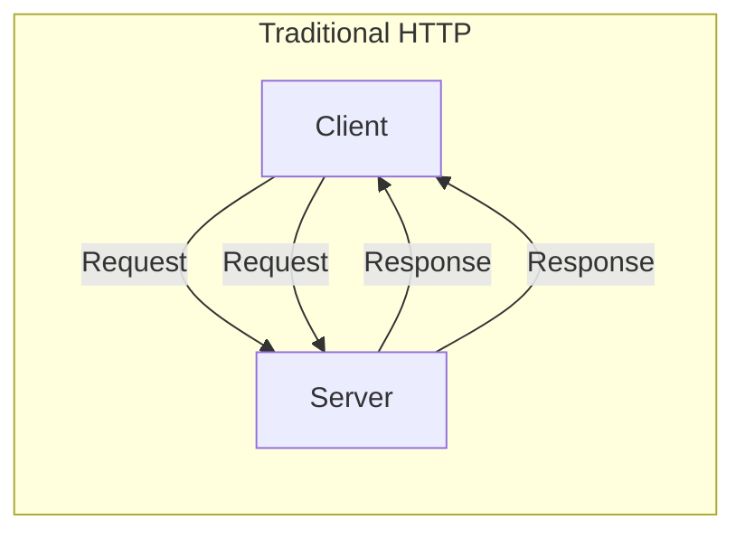
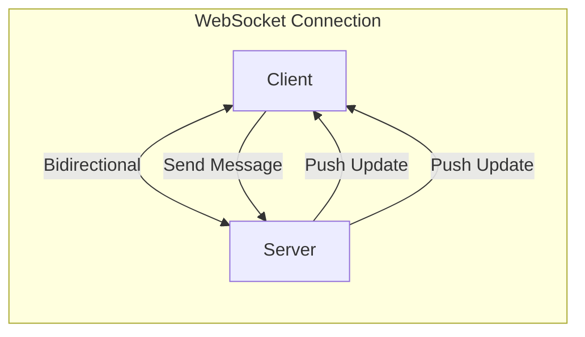
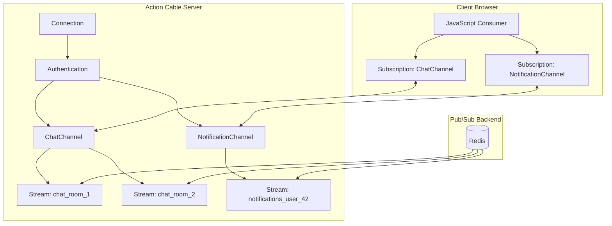
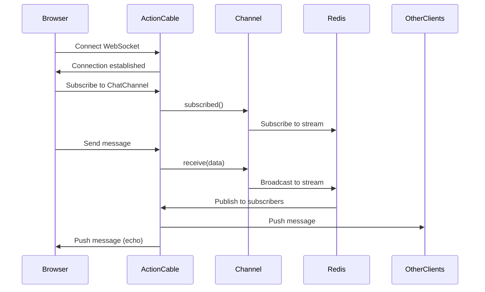
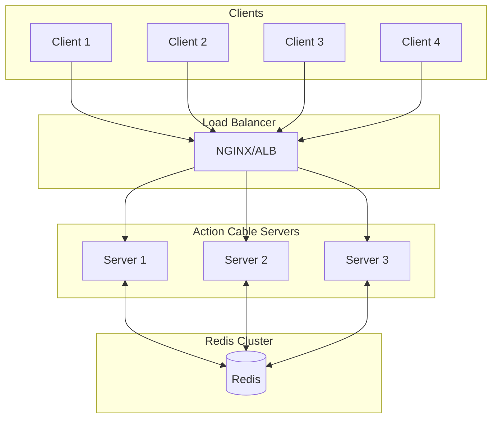

# How to Use Action Cable for WebSockets in Rails

Author: [nawazdhandala](https://www.github.com/nawazdhandala)

Tags: Ruby, Rails, Action Cable, WebSockets, Real-time, Pub/Sub

Description: Learn how to implement real-time features in Ruby on Rails using Action Cable. This guide covers WebSocket connections, channels, broadcasting, authentication, and production deployment best practices.

---

> Real-time features transform static web applications into living, breathing experiences. Whether you are building chat applications, live notifications, collaborative editing, or real-time dashboards, WebSockets provide the bidirectional communication that makes these features possible. Action Cable brings WebSocket support directly into Rails, integrating seamlessly with the rest of your application.

Action Cable was introduced in Rails 5 and has matured into a robust solution for real-time communication. It handles connection management, authentication, channel subscriptions, and message broadcasting while leveraging Rails conventions you already know.

---

## Understanding WebSockets and Action Cable

Before diving into implementation, let's understand how WebSockets differ from traditional HTTP and how Action Cable fits into the Rails ecosystem:





With HTTP, clients must poll the server for updates. With WebSockets, the server can push updates instantly to connected clients.

### Action Cable Architecture

Action Cable creates a framework around WebSocket connections with these key components:



Key concepts:
- **Connection**: The WebSocket connection between client and server, handling authentication
- **Channel**: A logical unit of work, similar to a controller for WebSocket communication
- **Stream**: A named broadcasting channel that clients subscribe to
- **Consumer**: The JavaScript client that maintains the WebSocket connection
- **Subscription**: A client's subscription to a specific channel

### Message Flow

Understanding how messages flow through Action Cable helps you design better real-time features:



---

## Getting Started

### Installation and Setup

Action Cable is included with Rails by default. First, ensure you have the necessary dependencies:

```ruby
# Gemfile

# Redis adapter for Action Cable pub/sub
gem 'redis', '~> 5.0'

# Optional: For Redis connection pooling
gem 'connection_pool', '~> 2.4'

# Optional: For JWT authentication in connections
gem 'jwt', '~> 2.7'
```

Install the gems:

```bash
bundle install
```

### Cable Configuration

Configure Action Cable in the environment files:

```ruby
# config/environments/development.rb

Rails.application.configure do
  # Mount Action Cable at /cable
  config.action_cable.url = 'ws://localhost:3000/cable'
  
  # Allow connections from localhost
  config.action_cable.allowed_request_origins = [
    'http://localhost:3000',
    'http://127.0.0.1:3000',
    %r{http://192\.168\.0\.\d+:3000}
  ]
  
  # Use async adapter for development (no Redis needed)
  config.action_cable.adapter = :async
  
  # Disable request forgery protection for WebSocket
  config.action_cable.disable_request_forgery_protection = true
end
```

```ruby
# config/environments/production.rb

Rails.application.configure do
  # Use secure WebSocket in production
  config.action_cable.url = 'wss://yourapp.com/cable'
  
  # Allow connections from your domain
  config.action_cable.allowed_request_origins = [
    'https://yourapp.com',
    'https://www.yourapp.com'
  ]
  
  # Use Redis adapter for production
  config.action_cable.adapter = :redis
  
  # Mount path
  config.action_cable.mount_path = '/cable'
end
```

### Redis Configuration

Configure the Redis connection for Action Cable:

```yaml
# config/cable.yml

development:
  adapter: async

test:
  adapter: test

production:
  adapter: redis
  url: <%= ENV.fetch('REDIS_URL', 'redis://localhost:6379/1') %>
  channel_prefix: myapp_production
  
staging:
  adapter: redis
  url: <%= ENV.fetch('REDIS_URL', 'redis://localhost:6379/2') %>
  channel_prefix: myapp_staging
```

For advanced Redis configuration with connection pooling:

```ruby
# config/initializers/action_cable.rb

if Rails.env.production? || Rails.env.staging?
  # Configure Redis with connection pool
  ActionCable.server.config.cable = {
    adapter: 'redis',
    url: ENV.fetch('REDIS_URL', 'redis://localhost:6379/1'),
    channel_prefix: "#{Rails.application.class.module_parent_name.underscore}_#{Rails.env}",
    # Connection pool options
    driver: :hiredis,
    pool: {
      size: ENV.fetch('RAILS_MAX_THREADS', 5).to_i,
      timeout: 5
    }
  }
end
```

---

## Creating the Connection

The `ApplicationCable::Connection` class authenticates incoming WebSocket connections:

```ruby
# app/channels/application_cable/connection.rb

module ApplicationCable
  class Connection < ActionCable::Connection::Base
    # Identified by helps Action Cable track which user is connected
    identified_by :current_user

    def connect
      # Authenticate the connection
      self.current_user = find_verified_user
      
      # Log successful connection
      logger.add_tags 'ActionCable', "User:#{current_user.id}"
    end

    def disconnect
      # Clean up when user disconnects
      logger.info "User #{current_user&.id} disconnected"
    end

    private

    # Find and verify the current user from the connection
    def find_verified_user
      # Option 1: Session-based authentication (most common)
      if (user = find_user_from_session)
        user
      # Option 2: Token-based authentication (for APIs)
      elsif (user = find_user_from_token)
        user
      else
        # Reject unauthorized connections
        reject_unauthorized_connection
      end
    end

    # Extract user from Rails session cookie
    def find_user_from_session
      # Access encrypted cookies
      if (user_id = cookies.encrypted[:user_id])
        User.find_by(id: user_id)
      elsif (session_data = request.session)
        # Devise stores user_id in session
        User.find_by(id: session_data['warden.user.user.key']&.first&.first)
      end
    end

    # Extract user from JWT token (for API/mobile clients)
    def find_user_from_token
      token = request.params[:token]
      return nil unless token.present?

      # Decode and verify JWT
      decoded = JWT.decode(
        token,
        Rails.application.credentials.secret_key_base,
        true,
        { algorithm: 'HS256' }
      )
      
      payload = decoded.first
      User.find_by(id: payload['user_id'])
    rescue JWT::DecodeError, JWT::ExpiredSignature
      nil
    end
  end
end
```

### Connection with Multiple Identifiers

For applications that need to track more than just the user:

```ruby
# app/channels/application_cable/connection.rb

module ApplicationCable
  class Connection < ActionCable::Connection::Base
    # Track user, account, and session
    identified_by :current_user, :current_account, :connection_id

    def connect
      self.current_user = find_verified_user
      self.current_account = current_user.account
      self.connection_id = SecureRandom.uuid
      
      # Store connection metadata
      ConnectionTracker.add(
        user_id: current_user.id,
        connection_id: connection_id,
        connected_at: Time.current
      )
      
      logger.add_tags 'ActionCable', 
                      "User:#{current_user.id}", 
                      "Account:#{current_account.id}"
    end

    def disconnect
      ConnectionTracker.remove(connection_id)
    end

    private

    def find_verified_user
      if (user_id = cookies.encrypted[:user_id])
        User.find_by(id: user_id)
      else
        reject_unauthorized_connection
      end
    end
  end
end
```

---

## Building Channels

Channels are the core abstraction in Action Cable. They handle subscriptions and message processing.

### Basic Channel Structure

```ruby
# app/channels/application_cable/channel.rb

module ApplicationCable
  class Channel < ActionCable::Channel::Base
    # Rescue from errors to prevent connection termination
    rescue_from StandardError, with: :handle_error

    private

    def handle_error(exception)
      Rails.logger.error("Channel error: #{exception.message}")
      Rails.logger.error(exception.backtrace.first(10).join("\n"))
      
      # Notify error tracking service
      Sentry.capture_exception(exception) if defined?(Sentry)
      
      # Optionally notify the client
      transmit(error: 'An error occurred processing your request')
    end
  end
end
```

### Chat Channel Implementation

Let's build a full-featured chat channel:

```ruby
# app/channels/chat_channel.rb

class ChatChannel < ApplicationCable::Channel
  # Called when client subscribes to the channel
  def subscribed
    # Validate room access before subscribing
    @room = find_room
    
    if @room && can_access_room?(@room)
      # Subscribe to the room's stream
      stream_from room_stream_name(@room)
      
      # Track user presence in the room
      track_presence(@room, :join)
      
      # Notify other users
      broadcast_user_joined(@room)
      
      Rails.logger.info("User #{current_user.id} joined room #{@room.id}")
    else
      # Reject invalid subscriptions
      reject
    end
  end

  # Called when client unsubscribes
  def unsubscribed
    return unless @room
    
    # Remove presence tracking
    track_presence(@room, :leave)
    
    # Notify other users
    broadcast_user_left(@room)
    
    Rails.logger.info("User #{current_user.id} left room #{@room.id}")
  end

  # Handle incoming messages from the client
  def send_message(data)
    return unless @room
    
    # Validate message content
    content = data['content']&.strip
    return if content.blank?
    
    # Enforce rate limiting
    return transmit(error: 'Rate limit exceeded') if rate_limited?
    
    # Create the message record
    message = @room.messages.create!(
      user: current_user,
      content: content,
      message_type: data['type'] || 'text'
    )
    
    # Broadcast to all subscribers
    ActionCable.server.broadcast(
      room_stream_name(@room),
      message_payload(message)
    )
  end

  # Handle typing indicator
  def typing(data)
    return unless @room
    
    is_typing = data['typing'] == true
    
    ActionCable.server.broadcast(
      room_stream_name(@room),
      {
        type: 'typing',
        user_id: current_user.id,
        user_name: current_user.name,
        typing: is_typing
      }
    )
  end

  # Handle message read receipts
  def mark_read(data)
    return unless @room
    
    message_ids = Array(data['message_ids'])
    return if message_ids.empty?
    
    # Mark messages as read
    @room.messages
         .where(id: message_ids)
         .where.not(user_id: current_user.id)
         .update_all(read_at: Time.current)
    
    # Broadcast read receipt
    ActionCable.server.broadcast(
      room_stream_name(@room),
      {
        type: 'read_receipt',
        user_id: current_user.id,
        message_ids: message_ids,
        read_at: Time.current.iso8601
      }
    )
  end

  private

  def find_room
    room_id = params[:room_id]
    return nil unless room_id
    
    ChatRoom.find_by(id: room_id)
  end

  def can_access_room?(room)
    # Check if user is a member of the room
    room.members.exists?(user_id: current_user.id)
  end

  def room_stream_name(room)
    "chat_room_#{room.id}"
  end

  def track_presence(room, action)
    key = "presence:room:#{room.id}"
    
    case action
    when :join
      $redis.sadd(key, current_user.id)
    when :leave
      $redis.srem(key, current_user.id)
    end
    
    # Expire presence data after 1 hour (cleanup for stale connections)
    $redis.expire(key, 1.hour.to_i)
  end

  def broadcast_user_joined(room)
    ActionCable.server.broadcast(
      room_stream_name(room),
      {
        type: 'presence',
        action: 'join',
        user_id: current_user.id,
        user_name: current_user.name,
        user_avatar: current_user.avatar_url,
        online_users: online_users(room)
      }
    )
  end

  def broadcast_user_left(room)
    ActionCable.server.broadcast(
      room_stream_name(room),
      {
        type: 'presence',
        action: 'leave',
        user_id: current_user.id,
        online_users: online_users(room)
      }
    )
  end

  def online_users(room)
    user_ids = $redis.smembers("presence:room:#{room.id}")
    User.where(id: user_ids).pluck(:id, :name, :avatar_url).map do |id, name, avatar|
      { id: id, name: name, avatar_url: avatar }
    end
  end

  def message_payload(message)
    {
      type: 'message',
      id: message.id,
      content: message.content,
      message_type: message.message_type,
      user_id: message.user_id,
      user_name: message.user.name,
      user_avatar: message.user.avatar_url,
      created_at: message.created_at.iso8601
    }
  end

  def rate_limited?
    key = "rate_limit:chat:#{current_user.id}"
    count = $redis.incr(key)
    $redis.expire(key, 60) if count == 1
    
    # Allow 30 messages per minute
    count > 30
  end
end
```

### Notification Channel

A channel for delivering real-time notifications:

```ruby
# app/channels/notification_channel.rb

class NotificationChannel < ApplicationCable::Channel
  def subscribed
    # Each user gets their own notification stream
    stream_from notification_stream_name
    
    # Send unread count on subscribe
    transmit(
      type: 'unread_count',
      count: current_user.notifications.unread.count
    )
  end

  def unsubscribed
    # Cleanup if needed
  end

  # Mark notification as read
  def mark_as_read(data)
    notification_id = data['notification_id']
    
    notification = current_user.notifications.find_by(id: notification_id)
    return unless notification
    
    notification.update!(read_at: Time.current)
    
    # Confirm the action
    transmit(
      type: 'marked_read',
      notification_id: notification_id,
      unread_count: current_user.notifications.unread.count
    )
  end

  # Mark all notifications as read
  def mark_all_read
    current_user.notifications.unread.update_all(read_at: Time.current)
    
    transmit(
      type: 'all_marked_read',
      unread_count: 0
    )
  end

  private

  def notification_stream_name
    "notifications_user_#{current_user.id}"
  end
end
```

### Presence Channel

A channel for tracking online status:

```ruby
# app/channels/presence_channel.rb

class PresenceChannel < ApplicationCable::Channel
  def subscribed
    # Subscribe to organization presence
    @organization = current_user.organization
    return reject unless @organization
    
    stream_from presence_stream_name
    
    # Mark user as online
    mark_online
    
    # Broadcast updated presence
    broadcast_presence_update(:online)
    
    # Send current presence list
    transmit(
      type: 'presence_list',
      users: presence_list
    )
  end

  def unsubscribed
    return unless @organization
    
    mark_offline
    broadcast_presence_update(:offline)
  end

  # Handle heartbeat to maintain presence
  def heartbeat
    return unless @organization
    
    # Refresh online status
    mark_online
  end

  # Update user status (away, busy, etc.)
  def update_status(data)
    return unless @organization
    
    status = data['status']
    return unless %w[online away busy dnd].include?(status)
    
    set_status(status)
    broadcast_presence_update(status.to_sym)
  end

  private

  def presence_stream_name
    "presence_org_#{@organization.id}"
  end

  def mark_online
    $redis.multi do |multi|
      multi.hset(presence_key, current_user.id, Time.current.to_i)
      multi.expire(presence_key, 5.minutes.to_i)
    end
  end

  def mark_offline
    $redis.hdel(presence_key, current_user.id)
  end

  def set_status(status)
    $redis.hset(status_key, current_user.id, status)
    $redis.expire(status_key, 5.minutes.to_i)
  end

  def presence_key
    "presence:org:#{@organization.id}"
  end

  def status_key
    "status:org:#{@organization.id}"
  end

  def presence_list
    online_times = $redis.hgetall(presence_key)
    statuses = $redis.hgetall(status_key)
    
    user_ids = online_times.keys.map(&:to_i)
    users = User.where(id: user_ids).index_by(&:id)
    
    online_times.map do |user_id, timestamp|
      user = users[user_id.to_i]
      next unless user
      
      {
        id: user.id,
        name: user.name,
        avatar_url: user.avatar_url,
        status: statuses[user_id] || 'online',
        last_seen: Time.at(timestamp.to_i).iso8601
      }
    end.compact
  end

  def broadcast_presence_update(status)
    ActionCable.server.broadcast(
      presence_stream_name,
      {
        type: 'presence_update',
        user_id: current_user.id,
        user_name: current_user.name,
        user_avatar: current_user.avatar_url,
        status: status,
        timestamp: Time.current.iso8601
      }
    )
  end
end
```

---

## Broadcasting Messages

Broadcasting sends messages to all subscribers of a stream. You can broadcast from anywhere in your application.

### Broadcasting from Models

```ruby
# app/models/message.rb

class Message < ApplicationRecord
  belongs_to :chat_room
  belongs_to :user
  
  after_create_commit :broadcast_message
  after_update_commit :broadcast_update
  after_destroy_commit :broadcast_deletion
  
  private
  
  def broadcast_message
    ActionCable.server.broadcast(
      "chat_room_#{chat_room_id}",
      {
        type: 'new_message',
        message: as_broadcast_json
      }
    )
  end
  
  def broadcast_update
    ActionCable.server.broadcast(
      "chat_room_#{chat_room_id}",
      {
        type: 'message_updated',
        message: as_broadcast_json
      }
    )
  end
  
  def broadcast_deletion
    ActionCable.server.broadcast(
      "chat_room_#{chat_room_id}",
      {
        type: 'message_deleted',
        message_id: id
      }
    )
  end
  
  def as_broadcast_json
    {
      id: id,
      content: content,
      user_id: user_id,
      user_name: user.name,
      created_at: created_at.iso8601,
      updated_at: updated_at.iso8601
    }
  end
end
```

### Broadcasting from Controllers

```ruby
# app/controllers/notifications_controller.rb

class NotificationsController < ApplicationController
  def create
    @notification = current_user.sent_notifications.build(notification_params)
    
    if @notification.save
      # Broadcast to the recipient
      broadcast_notification(@notification)
      
      render json: { success: true }
    else
      render json: { errors: @notification.errors }, status: :unprocessable_entity
    end
  end
  
  private
  
  def notification_params
    params.require(:notification).permit(:recipient_id, :title, :body, :notification_type)
  end
  
  def broadcast_notification(notification)
    ActionCable.server.broadcast(
      "notifications_user_#{notification.recipient_id}",
      {
        type: 'notification',
        notification: {
          id: notification.id,
          title: notification.title,
          body: notification.body,
          notification_type: notification.notification_type,
          sender_id: notification.sender_id,
          sender_name: notification.sender.name,
          created_at: notification.created_at.iso8601
        }
      }
    )
  end
end
```

### Broadcasting from Background Jobs

```ruby
# app/jobs/broadcast_update_job.rb

class BroadcastUpdateJob < ApplicationJob
  queue_as :realtime
  
  def perform(stream_name, message)
    ActionCable.server.broadcast(stream_name, message)
  end
end
```

```ruby
# Usage from anywhere
BroadcastUpdateJob.perform_later(
  "dashboard_user_#{user.id}",
  {
    type: 'stats_update',
    stats: {
      visitors: analytics.visitors_today,
      pageviews: analytics.pageviews_today,
      updated_at: Time.current.iso8601
    }
  }
)
```

### Batch Broadcasting

For efficiency when broadcasting to many streams:

```ruby
# app/services/broadcast_service.rb

class BroadcastService
  class << self
    # Broadcast to multiple streams efficiently
    def broadcast_to_many(stream_names, message)
      return if stream_names.empty?
      
      # Use Redis pipeline for efficiency
      ActionCable.server.pubsub.redis_connection_for_broadcasts.pipelined do |pipeline|
        stream_names.each do |stream_name|
          channel_with_prefix = ActionCable.server.pubsub.send(
            :channel_with_prefix,
            stream_name
          )
          pipeline.publish(channel_with_prefix, message.to_json)
        end
      end
    end
    
    # Broadcast to all users in an organization
    def broadcast_to_organization(organization, message)
      stream_names = organization.users.pluck(:id).map do |user_id|
        "notifications_user_#{user_id}"
      end
      
      broadcast_to_many(stream_names, message)
    end
    
    # Broadcast to all members of a chat room
    def broadcast_to_room(room, message)
      ActionCable.server.broadcast("chat_room_#{room.id}", message)
    end
  end
end
```

---

## Client-Side Implementation

### JavaScript Consumer Setup

```javascript
// app/javascript/channels/consumer.js

import { createConsumer } from "@rails/actioncable"

// Create the consumer with authentication
const getWebSocketURL = () => {
  const meta = document.querySelector('meta[name="action-cable-url"]')
  const baseUrl = meta ? meta.content : '/cable'
  
  // Add authentication token if using token auth
  const token = document.querySelector('meta[name="cable-token"]')?.content
  if (token) {
    return `${baseUrl}?token=${token}`
  }
  
  return baseUrl
}

// Create and export the consumer
export default createConsumer(getWebSocketURL())
```

### Chat Channel Subscription

```javascript
// app/javascript/channels/chat_channel.js

import consumer from "./consumer"

class ChatChannel {
  constructor(roomId, callbacks = {}) {
    this.roomId = roomId
    this.callbacks = callbacks
    this.subscription = null
    this.typingTimeout = null
  }

  // Connect to the chat room
  connect() {
    this.subscription = consumer.subscriptions.create(
      {
        channel: "ChatChannel",
        room_id: this.roomId
      },
      {
        // Called when connection is established
        connected: () => {
          console.log(`Connected to chat room ${this.roomId}`)
          this.callbacks.onConnected?.()
        },

        // Called when connection is closed
        disconnected: () => {
          console.log(`Disconnected from chat room ${this.roomId}`)
          this.callbacks.onDisconnected?.()
        },

        // Called when connection is rejected
        rejected: () => {
          console.error(`Connection rejected for room ${this.roomId}`)
          this.callbacks.onRejected?.()
        },

        // Called when a message is received
        received: (data) => {
          this.handleMessage(data)
        }
      }
    )
    
    return this
  }

  // Handle incoming messages by type
  handleMessage(data) {
    switch (data.type) {
      case 'message':
        this.callbacks.onMessage?.(data)
        break
      case 'typing':
        this.callbacks.onTyping?.(data)
        break
      case 'read_receipt':
        this.callbacks.onReadReceipt?.(data)
        break
      case 'presence':
        this.callbacks.onPresence?.(data)
        break
      case 'error':
        this.callbacks.onError?.(data)
        break
      default:
        console.warn('Unknown message type:', data.type)
    }
  }

  // Send a message to the room
  sendMessage(content, type = 'text') {
    if (!this.subscription) {
      console.error('Not connected to chat room')
      return false
    }
    
    this.subscription.perform('send_message', {
      content: content,
      type: type
    })
    
    return true
  }

  // Send typing indicator
  sendTyping(isTyping) {
    if (!this.subscription) return
    
    // Debounce typing indicator
    if (this.typingTimeout) {
      clearTimeout(this.typingTimeout)
    }
    
    this.subscription.perform('typing', { typing: isTyping })
    
    // Auto-stop typing after 3 seconds
    if (isTyping) {
      this.typingTimeout = setTimeout(() => {
        this.sendTyping(false)
      }, 3000)
    }
  }

  // Mark messages as read
  markAsRead(messageIds) {
    if (!this.subscription) return
    
    this.subscription.perform('mark_read', {
      message_ids: messageIds
    })
  }

  // Disconnect from the room
  disconnect() {
    if (this.subscription) {
      this.subscription.unsubscribe()
      this.subscription = null
    }
    
    if (this.typingTimeout) {
      clearTimeout(this.typingTimeout)
    }
  }
}

export default ChatChannel
```

### Usage in a React Component

```javascript
// app/javascript/components/ChatRoom.jsx

import React, { useState, useEffect, useRef } from 'react'
import ChatChannel from '../channels/chat_channel'

const ChatRoom = ({ roomId, currentUser }) => {
  const [messages, setMessages] = useState([])
  const [typingUsers, setTypingUsers] = useState([])
  const [onlineUsers, setOnlineUsers] = useState([])
  const [connected, setConnected] = useState(false)
  const [inputValue, setInputValue] = useState('')
  
  const channelRef = useRef(null)
  const messagesEndRef = useRef(null)

  // Connect to chat channel on mount
  useEffect(() => {
    const channel = new ChatChannel(roomId, {
      onConnected: () => {
        setConnected(true)
        loadInitialMessages()
      },
      
      onDisconnected: () => {
        setConnected(false)
      },
      
      onMessage: (data) => {
        setMessages(prev => [...prev, data])
        scrollToBottom()
      },
      
      onTyping: (data) => {
        if (data.user_id === currentUser.id) return
        
        setTypingUsers(prev => {
          if (data.typing) {
            // Add user to typing list
            if (!prev.find(u => u.id === data.user_id)) {
              return [...prev, { id: data.user_id, name: data.user_name }]
            }
          } else {
            // Remove user from typing list
            return prev.filter(u => u.id !== data.user_id)
          }
          return prev
        })
      },
      
      onPresence: (data) => {
        setOnlineUsers(data.online_users || [])
      },
      
      onError: (data) => {
        console.error('Chat error:', data.error)
      }
    })
    
    channel.connect()
    channelRef.current = channel
    
    // Cleanup on unmount
    return () => {
      channel.disconnect()
    }
  }, [roomId])

  // Load initial messages via API
  const loadInitialMessages = async () => {
    try {
      const response = await fetch(`/api/chat_rooms/${roomId}/messages`)
      const data = await response.json()
      setMessages(data.messages)
    } catch (error) {
      console.error('Failed to load messages:', error)
    }
  }

  // Scroll to bottom of messages
  const scrollToBottom = () => {
    messagesEndRef.current?.scrollIntoView({ behavior: 'smooth' })
  }

  // Handle sending a message
  const handleSend = (e) => {
    e.preventDefault()
    
    if (!inputValue.trim() || !channelRef.current) return
    
    channelRef.current.sendMessage(inputValue)
    setInputValue('')
    channelRef.current.sendTyping(false)
  }

  // Handle input change with typing indicator
  const handleInputChange = (e) => {
    setInputValue(e.target.value)
    channelRef.current?.sendTyping(true)
  }

  return (
    <div className="chat-room">
      {/* Connection status */}
      <div className={`status ${connected ? 'connected' : 'disconnected'}`}>
        {connected ? 'Connected' : 'Disconnected'}
      </div>
      
      {/* Online users */}
      <div className="online-users">
        {onlineUsers.map(user => (
          <span key={user.id} className="online-user">
            {user.name}
          </span>
        ))}
      </div>
      
      {/* Messages */}
      <div className="messages">
        {messages.map(message => (
          <div 
            key={message.id} 
            className={`message ${message.user_id === currentUser.id ? 'own' : ''}`}
          >
            <strong>{message.user_name}</strong>
            <p>{message.content}</p>
            <small>{new Date(message.created_at).toLocaleTimeString()}</small>
          </div>
        ))}
        <div ref={messagesEndRef} />
      </div>
      
      {/* Typing indicator */}
      {typingUsers.length > 0 && (
        <div className="typing-indicator">
          {typingUsers.map(u => u.name).join(', ')} 
          {typingUsers.length === 1 ? ' is' : ' are'} typing...
        </div>
      )}
      
      {/* Message input */}
      <form onSubmit={handleSend} className="message-form">
        <input
          type="text"
          value={inputValue}
          onChange={handleInputChange}
          placeholder="Type a message..."
          disabled={!connected}
        />
        <button type="submit" disabled={!connected || !inputValue.trim()}>
          Send
        </button>
      </form>
    </div>
  )
}

export default ChatRoom
```

### Notification Channel Subscription

```javascript
// app/javascript/channels/notification_channel.js

import consumer from "./consumer"

class NotificationChannel {
  constructor(callbacks = {}) {
    this.callbacks = callbacks
    this.subscription = null
  }

  connect() {
    this.subscription = consumer.subscriptions.create(
      { channel: "NotificationChannel" },
      {
        connected: () => {
          console.log('Connected to notifications')
          this.callbacks.onConnected?.()
        },

        disconnected: () => {
          console.log('Disconnected from notifications')
          this.callbacks.onDisconnected?.()
        },

        received: (data) => {
          this.handleMessage(data)
        }
      }
    )
    
    return this
  }

  handleMessage(data) {
    switch (data.type) {
      case 'notification':
        this.callbacks.onNotification?.(data.notification)
        break
      case 'unread_count':
        this.callbacks.onUnreadCount?.(data.count)
        break
      case 'marked_read':
        this.callbacks.onMarkedRead?.(data)
        break
      case 'all_marked_read':
        this.callbacks.onAllMarkedRead?.()
        break
    }
  }

  markAsRead(notificationId) {
    this.subscription?.perform('mark_as_read', {
      notification_id: notificationId
    })
  }

  markAllRead() {
    this.subscription?.perform('mark_all_read')
  }

  disconnect() {
    this.subscription?.unsubscribe()
    this.subscription = null
  }
}

export default NotificationChannel
```

---

## Testing Action Cable

### Channel Tests

```ruby
# spec/channels/chat_channel_spec.rb

require 'rails_helper'

RSpec.describe ChatChannel, type: :channel do
  let(:user) { create(:user) }
  let(:chat_room) { create(:chat_room) }
  
  before do
    # Add user as room member
    chat_room.members.create!(user: user)
    
    # Stub the connection with the current user
    stub_connection(current_user: user)
  end

  describe '#subscribed' do
    context 'when user has access to the room' do
      it 'successfully subscribes to the room stream' do
        subscribe(room_id: chat_room.id)
        
        expect(subscription).to be_confirmed
        expect(subscription).to have_stream_from("chat_room_#{chat_room.id}")
      end

      it 'broadcasts user joined message' do
        expect {
          subscribe(room_id: chat_room.id)
        }.to have_broadcasted_to("chat_room_#{chat_room.id}")
          .with(hash_including(type: 'presence', action: 'join'))
      end
    end

    context 'when user does not have access' do
      let(:other_room) { create(:chat_room) }
      
      it 'rejects the subscription' do
        subscribe(room_id: other_room.id)
        
        expect(subscription).to be_rejected
      end
    end

    context 'with invalid room id' do
      it 'rejects the subscription' do
        subscribe(room_id: 'invalid')
        
        expect(subscription).to be_rejected
      end
    end
  end

  describe '#send_message' do
    before do
      subscribe(room_id: chat_room.id)
    end

    it 'creates a message and broadcasts it' do
      expect {
        perform :send_message, content: 'Hello, world!', type: 'text'
      }.to change(Message, :count).by(1)
        .and have_broadcasted_to("chat_room_#{chat_room.id}")
        .with(hash_including(type: 'message'))
    end

    it 'ignores empty messages' do
      expect {
        perform :send_message, content: '   ', type: 'text'
      }.not_to change(Message, :count)
    end

    it 'respects rate limiting' do
      # Send 30 messages (the limit)
      30.times do |i|
        perform :send_message, content: "Message #{i}", type: 'text'
      end
      
      # The 31st should be rate limited
      expect {
        perform :send_message, content: 'One more', type: 'text'
      }.not_to change(Message, :count)
    end
  end

  describe '#typing' do
    before do
      subscribe(room_id: chat_room.id)
    end

    it 'broadcasts typing status' do
      expect {
        perform :typing, typing: true
      }.to have_broadcasted_to("chat_room_#{chat_room.id}")
        .with(hash_including(type: 'typing', typing: true, user_id: user.id))
    end
  end

  describe '#unsubscribed' do
    before do
      subscribe(room_id: chat_room.id)
    end

    it 'broadcasts user left message' do
      expect {
        subscription.unsubscribe_from_channel
      }.to have_broadcasted_to("chat_room_#{chat_room.id}")
        .with(hash_including(type: 'presence', action: 'leave'))
    end
  end
end
```

### Connection Tests

```ruby
# spec/channels/application_cable/connection_spec.rb

require 'rails_helper'

RSpec.describe ApplicationCable::Connection, type: :channel do
  let(:user) { create(:user) }

  describe '#connect' do
    context 'with valid session' do
      it 'successfully connects' do
        connect('/cable', cookies: { user_id: user.id })
        
        expect(connection.current_user).to eq(user)
      end
    end

    context 'with valid JWT token' do
      let(:token) do
        JWT.encode(
          { user_id: user.id, exp: 1.hour.from_now.to_i },
          Rails.application.credentials.secret_key_base,
          'HS256'
        )
      end

      it 'successfully connects' do
        connect("/cable?token=#{token}")
        
        expect(connection.current_user).to eq(user)
      end
    end

    context 'with expired token' do
      let(:token) do
        JWT.encode(
          { user_id: user.id, exp: 1.hour.ago.to_i },
          Rails.application.credentials.secret_key_base,
          'HS256'
        )
      end

      it 'rejects the connection' do
        expect {
          connect("/cable?token=#{token}")
        }.to have_rejected_connection
      end
    end

    context 'without authentication' do
      it 'rejects the connection' do
        expect {
          connect('/cable')
        }.to have_rejected_connection
      end
    end
  end
end
```

### Integration Tests with System Tests

```ruby
# spec/system/chat_spec.rb

require 'rails_helper'

RSpec.describe 'Chat', type: :system, js: true do
  let(:user1) { create(:user) }
  let(:user2) { create(:user) }
  let(:chat_room) { create(:chat_room) }

  before do
    chat_room.members.create!(user: user1)
    chat_room.members.create!(user: user2)
  end

  it 'allows users to send and receive messages in real-time' do
    # User 1 joins the chat
    using_session(:user1) do
      sign_in user1
      visit chat_room_path(chat_room)
      
      expect(page).to have_css('.status.connected')
    end

    # User 2 joins the chat
    using_session(:user2) do
      sign_in user2
      visit chat_room_path(chat_room)
      
      expect(page).to have_css('.status.connected')
    end

    # User 1 sends a message
    using_session(:user1) do
      fill_in 'message-input', with: 'Hello from User 1!'
      click_button 'Send'
      
      expect(page).to have_content('Hello from User 1!')
    end

    # User 2 receives the message
    using_session(:user2) do
      expect(page).to have_content('Hello from User 1!')
    end

    # User 2 responds
    using_session(:user2) do
      fill_in 'message-input', with: 'Hello back from User 2!'
      click_button 'Send'
    end

    # User 1 receives the response
    using_session(:user1) do
      expect(page).to have_content('Hello back from User 2!')
    end
  end
end
```

---

## Production Deployment

### Scaling Action Cable

Action Cable can be scaled horizontally using Redis as the pub/sub backend:



### NGINX Configuration

Configure NGINX as a reverse proxy for WebSocket connections:

```nginx
# /etc/nginx/conf.d/actioncable.conf

upstream actioncable {
    server 127.0.0.1:3001;
    server 127.0.0.1:3002;
    server 127.0.0.1:3003;
}

map $http_upgrade $connection_upgrade {
    default upgrade;
    ''      close;
}

server {
    listen 443 ssl http2;
    server_name yourapp.com;

    ssl_certificate /etc/ssl/certs/yourapp.crt;
    ssl_certificate_key /etc/ssl/private/yourapp.key;

    # WebSocket location
    location /cable {
        proxy_pass http://actioncable;
        proxy_http_version 1.1;
        
        # WebSocket upgrade headers
        proxy_set_header Upgrade $http_upgrade;
        proxy_set_header Connection $connection_upgrade;
        
        # Forward client info
        proxy_set_header Host $host;
        proxy_set_header X-Real-IP $remote_addr;
        proxy_set_header X-Forwarded-For $proxy_add_x_forwarded_for;
        proxy_set_header X-Forwarded-Proto $scheme;
        
        # Timeouts
        proxy_connect_timeout 7d;
        proxy_send_timeout 7d;
        proxy_read_timeout 7d;
        
        # Buffer settings
        proxy_buffering off;
        proxy_buffer_size 64k;
        proxy_buffers 8 64k;
    }

    # Regular HTTP requests
    location / {
        proxy_pass http://app;
        proxy_set_header Host $host;
        proxy_set_header X-Real-IP $remote_addr;
        proxy_set_header X-Forwarded-For $proxy_add_x_forwarded_for;
        proxy_set_header X-Forwarded-Proto $scheme;
    }
}
```

### Running Standalone Action Cable Server

For high-traffic applications, run Action Cable as a separate process:

```ruby
# cable/config.ru

require_relative '../config/environment'
Rails.application.eager_load!

run ActionCable.server
```

Start with Puma:

```bash
bundle exec puma -p 28080 cable/config.ru
```

Systemd service:

```ini
# /etc/systemd/system/actioncable.service

[Unit]
Description=Action Cable WebSocket Server
After=network.target redis.service

[Service]
Type=simple
User=deploy
Group=deploy
WorkingDirectory=/var/www/myapp/current

EnvironmentFile=/var/www/myapp/shared/.env
Environment=RAILS_ENV=production
Environment=PORT=28080

ExecStart=/usr/local/bin/bundle exec puma -p 28080 cable/config.ru
Restart=on-failure
RestartSec=5

[Install]
WantedBy=multi-user.target
```

### Health Monitoring

```ruby
# app/controllers/health/cable_controller.rb

module Health
  class CableController < ApplicationController
    skip_before_action :authenticate_user!

    def show
      status = ActionCableHealth.check
      
      if status[:healthy]
        render json: status, status: :ok
      else
        render json: status, status: :service_unavailable
      end
    end
  end
end
```

```ruby
# app/services/action_cable_health.rb

class ActionCableHealth
  class << self
    def check
      {
        healthy: healthy?,
        redis: redis_status,
        connections: connection_count,
        subscriptions: subscription_count,
        timestamp: Time.current.iso8601
      }
    end

    def healthy?
      redis_connected?
    end

    private

    def redis_connected?
      ActionCable.server.pubsub.redis_connection_for_subscriptions.ping == 'PONG'
    rescue StandardError
      false
    end

    def redis_status
      {
        connected: redis_connected?,
        url: sanitized_redis_url
      }
    rescue StandardError => e
      { connected: false, error: e.message }
    end

    def connection_count
      ActionCable.server.connections.size
    end

    def subscription_count
      ActionCable.server.connections.sum do |connection|
        connection.subscriptions.identifiers.size
      end
    end

    def sanitized_redis_url
      url = ActionCable.server.config.cable[:url]
      uri = URI.parse(url)
      uri.password = '[FILTERED]' if uri.password
      uri.to_s
    rescue StandardError
      '[UNKNOWN]'
    end
  end
end
```

### Prometheus Metrics

```ruby
# app/middleware/action_cable_metrics.rb

class ActionCableMetrics
  def initialize(app)
    @app = app
    @connection_gauge = Prometheus::Client.registry.gauge(
      :actioncable_connections,
      docstring: 'Number of active WebSocket connections'
    )
    @subscription_gauge = Prometheus::Client.registry.gauge(
      :actioncable_subscriptions,
      docstring: 'Number of active channel subscriptions'
    )
    @message_counter = Prometheus::Client.registry.counter(
      :actioncable_messages_total,
      docstring: 'Total number of WebSocket messages',
      labels: [:direction, :channel]
    )
  end

  def call(env)
    update_gauges
    @app.call(env)
  end

  private

  def update_gauges
    @connection_gauge.set(ActionCable.server.connections.size)
    
    subscriptions = ActionCable.server.connections.sum do |conn|
      conn.subscriptions.identifiers.size
    end
    @subscription_gauge.set(subscriptions)
  end
end
```

---

## Security Best Practices

### Authentication and Authorization

```ruby
# app/channels/application_cable/connection.rb

module ApplicationCable
  class Connection < ActionCable::Connection::Base
    identified_by :current_user

    def connect
      self.current_user = find_verified_user
    end

    private

    def find_verified_user
      user = authenticate_user
      
      # Verify user is active
      unless user&.active?
        reject_unauthorized_connection
      end
      
      # Verify user IP is not blocked
      if blocked_ip?(request.ip)
        reject_unauthorized_connection
      end
      
      user
    end

    def authenticate_user
      # Try multiple authentication methods
      find_user_from_session ||
        find_user_from_token ||
        reject_unauthorized_connection
    end

    def blocked_ip?(ip)
      BlockedIp.exists?(ip_address: ip)
    end
  end
end
```

### Rate Limiting

```ruby
# app/channels/concerns/rate_limitable.rb

module RateLimitable
  extend ActiveSupport::Concern

  class_methods do
    def rate_limit(action, limit:, period:)
      @rate_limits ||= {}
      @rate_limits[action] = { limit: limit, period: period }
    end

    def rate_limits
      @rate_limits || {}
    end
  end

  private

  def rate_limited?(action)
    config = self.class.rate_limits[action]
    return false unless config

    key = "rate_limit:#{channel_name}:#{action}:#{current_user.id}"
    count = $redis.incr(key)
    $redis.expire(key, config[:period]) if count == 1

    count > config[:limit]
  end

  def with_rate_limit(action)
    if rate_limited?(action)
      transmit(error: 'Rate limit exceeded', action: action)
      return
    end
    
    yield
  end
end
```

```ruby
# app/channels/chat_channel.rb

class ChatChannel < ApplicationCable::Channel
  include RateLimitable

  rate_limit :send_message, limit: 30, period: 60
  rate_limit :typing, limit: 10, period: 10

  def send_message(data)
    with_rate_limit(:send_message) do
      # Message handling
    end
  end

  def typing(data)
    with_rate_limit(:typing) do
      # Typing handling
    end
  end
end
```

### Input Validation

```ruby
# app/channels/concerns/validatable.rb

module Validatable
  extend ActiveSupport::Concern

  private

  def validate_params(data, schema)
    errors = []
    
    schema.each do |field, rules|
      value = data[field.to_s]
      
      if rules[:required] && value.blank?
        errors << "#{field} is required"
      end
      
      if rules[:type] && value.present?
        unless value.is_a?(rules[:type])
          errors << "#{field} must be a #{rules[:type]}"
        end
      end
      
      if rules[:max_length] && value.is_a?(String)
        if value.length > rules[:max_length]
          errors << "#{field} exceeds maximum length of #{rules[:max_length]}"
        end
      end
      
      if rules[:allowed_values] && value.present?
        unless rules[:allowed_values].include?(value)
          errors << "#{field} must be one of: #{rules[:allowed_values].join(', ')}"
        end
      end
    end
    
    if errors.any?
      transmit(error: errors.join('; '))
      return false
    end
    
    true
  end
end
```

```ruby
# app/channels/chat_channel.rb

class ChatChannel < ApplicationCable::Channel
  include Validatable

  MESSAGE_SCHEMA = {
    content: { required: true, type: String, max_length: 10_000 },
    type: { allowed_values: %w[text image file] }
  }.freeze

  def send_message(data)
    return unless validate_params(data, MESSAGE_SCHEMA)
    
    # Process validated message
  end
end
```

---

## Summary

Action Cable provides a powerful, Rails-integrated solution for real-time WebSocket communication. Key takeaways:

- **Connections authenticate users** and provide the security layer for WebSocket communication
- **Channels handle subscriptions and actions** similar to how controllers handle HTTP requests
- **Streams enable pub/sub messaging** allowing broadcasts to reach all relevant subscribers
- **Redis enables horizontal scaling** by providing shared pub/sub across multiple server instances
- **Testing is straightforward** using RSpec channel helpers and system tests
- **Production deployments** require proper NGINX configuration and health monitoring

Action Cable makes building real-time features in Rails applications natural and maintainable, leveraging the conventions and patterns you already know.

---

*Building real-time Rails applications? [OneUptime](https://oneuptime.com) provides comprehensive monitoring for Ruby applications, including WebSocket connection tracking, performance metrics, and error alerting.*
