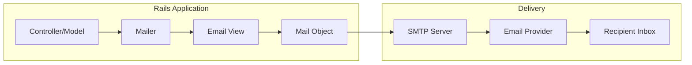
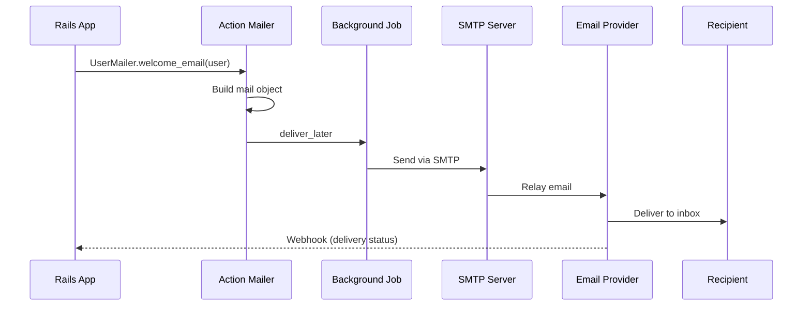
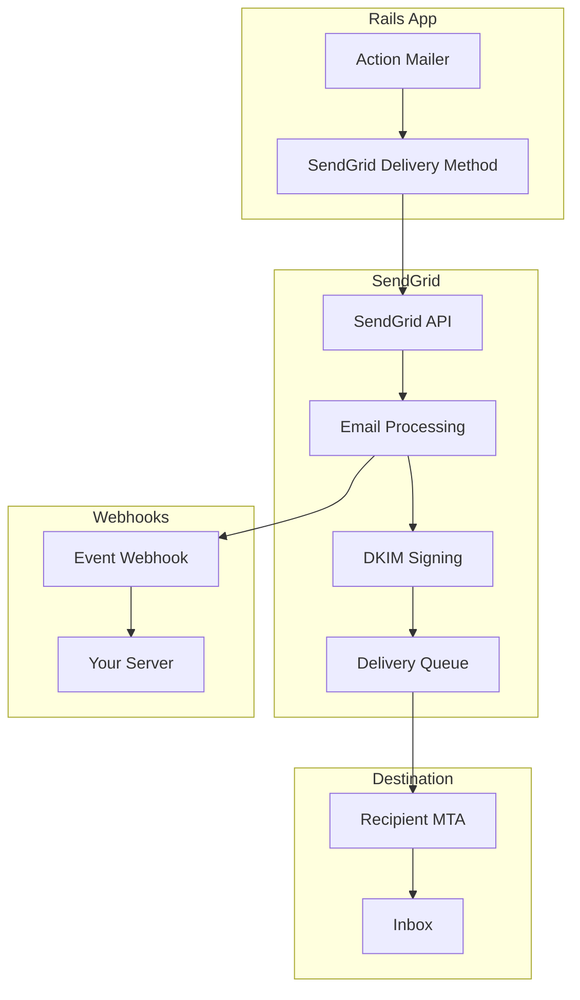
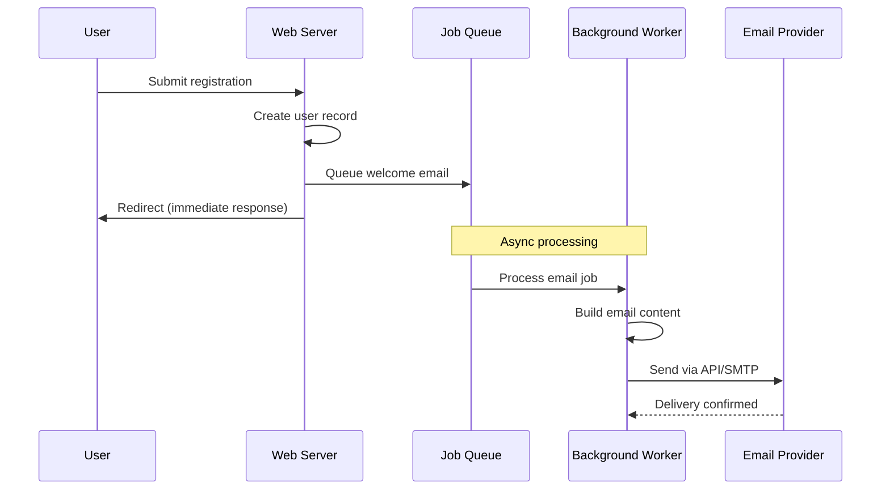
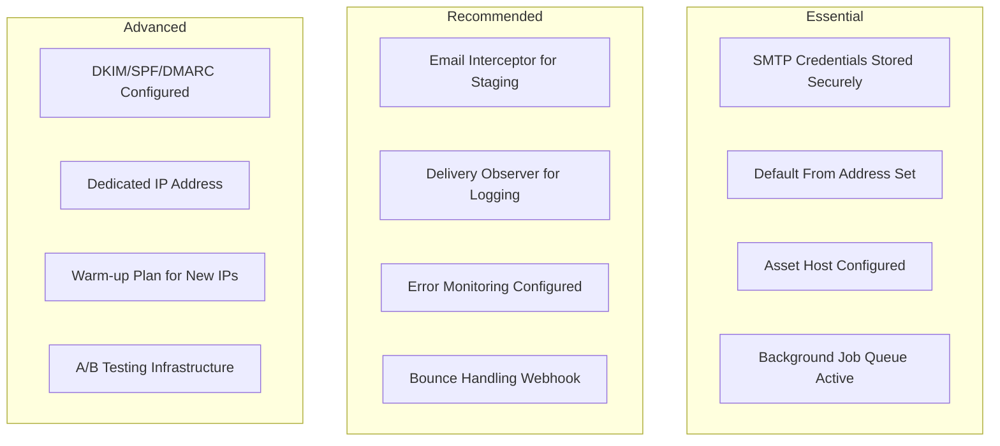

# How to Configure Action Mailer for Email in Rails

Author: [nawazdhandala](https://www.github.com/nawazdhandala)

Tags: Ruby, Rails, Action Mailer, Email, SMTP, SendGrid

Description: A comprehensive guide to configuring Action Mailer for email delivery in Ruby on Rails applications. Learn SMTP setup, SendGrid integration, background job processing, and production best practices.

---

> Email is a critical communication channel for modern applications. From user registration to password resets, order confirmations to marketing campaigns, reliable email delivery is essential. Action Mailer makes sending emails from Rails applications straightforward and flexible.

Action Mailer is the Rails framework for designing and sending emails. It follows the familiar MVC pattern, with mailers acting like controllers and views rendering email content. Combined with the right SMTP provider, you can build a robust email system that scales with your application.

---

## Understanding Email Architecture in Rails

Before configuring Action Mailer, let's understand how email flows through a Rails application:



### Email Delivery Flow

The email delivery process involves several steps:



Key components:
- **Mailer Classes**: Define email actions and logic
- **Email Views**: HTML and plain text templates
- **Delivery Methods**: SMTP, SendGrid API, Mailgun, etc.
- **Background Jobs**: Async delivery with Active Job

---

## Getting Started

### Basic Setup

Action Mailer comes bundled with Rails. Generate a new mailer:

```bash
# Generate a mailer for user-related emails
rails generate mailer UserMailer

# This creates:
# - app/mailers/user_mailer.rb
# - app/views/user_mailer/
# - test/mailers/user_mailer_test.rb
# - test/mailers/previews/user_mailer_preview.rb
```

### Application Mailer

Configure the base mailer class that all mailers inherit from:

```ruby
# app/mailers/application_mailer.rb
class ApplicationMailer < ActionMailer::Base
  # Default sender address for all emails
  default from: "notifications@example.com"
  
  # Default layout for email templates
  layout "mailer"
  
  # Helper methods available in all mailers
  helper :application
  
  # Add common headers to all emails
  default "X-Application-Name" => "MyApp",
          "X-Mailer" => "Rails Action Mailer"
end
```

### Creating Your First Mailer

Create a user mailer with common email actions:

```ruby
# app/mailers/user_mailer.rb
class UserMailer < ApplicationMailer
  # Send welcome email to new users
  # @param user [User] The newly registered user
  def welcome_email(user)
    # Store user for use in views
    @user = user
    
    # Generate a personalized greeting
    @greeting = "Welcome to MyApp, #{user.first_name}!"
    
    # Set the login URL for the email
    @login_url = login_url
    
    # Build and return the mail object
    mail(
      to: email_address_with_name(user.email, user.full_name),
      subject: "Welcome to MyApp - Let's Get Started!"
    )
  end
  
  # Send password reset instructions
  # @param user [User] The user requesting password reset
  # @param token [String] Password reset token
  def password_reset(user, token)
    @user = user
    @token = token
    @reset_url = password_reset_url(token: token)
    
    # Set a shorter expiration notice
    @expires_in = "2 hours"
    
    mail(
      to: user.email,
      subject: "Reset Your Password"
    )
  end
  
  # Send email verification link
  # @param user [User] User to verify
  def email_verification(user)
    @user = user
    @verification_url = verify_email_url(token: user.email_verification_token)
    
    mail(
      to: user.email,
      subject: "Please Verify Your Email Address"
    )
  end
  
  # Send account deactivation notice
  # @param user [User] User whose account was deactivated
  def account_deactivated(user)
    @user = user
    @support_email = "support@example.com"
    @reactivation_url = reactivate_account_url
    
    mail(
      to: user.email,
      subject: "Your Account Has Been Deactivated"
    )
  end
  
  private
  
  # Helper method to format email address with name
  def email_address_with_name(email, name)
    %("#{name}" <#{email}>)
  end
end
```

---

## Email Templates

### HTML Email Template

Create attractive HTML emails:

```erb
<%# app/views/user_mailer/welcome_email.html.erb %>
<!DOCTYPE html>
<html>
<head>
  <meta charset="utf-8">
  <meta name="viewport" content="width=device-width, initial-scale=1.0">
  <style>
    /* Inline styles for email client compatibility */
    body {
      font-family: -apple-system, BlinkMacSystemFont, 'Segoe UI', Roboto, sans-serif;
      line-height: 1.6;
      color: #333333;
      margin: 0;
      padding: 0;
      background-color: #f4f4f4;
    }
    .container {
      max-width: 600px;
      margin: 0 auto;
      padding: 20px;
    }
    .header {
      background-color: #4F46E5;
      color: white;
      padding: 30px;
      text-align: center;
      border-radius: 8px 8px 0 0;
    }
    .content {
      background-color: white;
      padding: 30px;
      border-radius: 0 0 8px 8px;
    }
    .button {
      display: inline-block;
      background-color: #4F46E5;
      color: white;
      padding: 12px 24px;
      text-decoration: none;
      border-radius: 6px;
      margin: 20px 0;
    }
    .footer {
      text-align: center;
      padding: 20px;
      color: #666666;
      font-size: 12px;
    }
  </style>
</head>
<body>
  <div class="container">
    <div class="header">
      <h1>Welcome to MyApp!</h1>
    </div>
    
    <div class="content">
      <p>Hi <%= @user.first_name %>,</p>
      
      <p><%= @greeting %></p>
      
      <p>
        We're thrilled to have you join our community. Here are a few things 
        you can do to get started:
      </p>
      
      <ul>
        <li>Complete your profile</li>
        <li>Explore our features</li>
        <li>Connect with other users</li>
      </ul>
      
      <p>
        <a href="<%= @login_url %>" class="button">
          Get Started
        </a>
      </p>
      
      <p>
        If you have any questions, our support team is here to help. Just 
        reply to this email or visit our help center.
      </p>
      
      <p>
        Best regards,<br>
        The MyApp Team
      </p>
    </div>
    
    <div class="footer">
      <p>
        You received this email because you signed up for MyApp.<br>
        <%= link_to "Unsubscribe", unsubscribe_url(token: @user.unsubscribe_token) %>
        |
        <%= link_to "Privacy Policy", privacy_url %>
      </p>
      <p>
        &copy; <%= Date.current.year %> MyApp, Inc. All rights reserved.<br>
        123 Main Street, San Francisco, CA 94105
      </p>
    </div>
  </div>
</body>
</html>
```

### Plain Text Email Template

Always include a plain text version for accessibility:

```erb
<%# app/views/user_mailer/welcome_email.text.erb %>
<%= @greeting %>

Hi <%= @user.first_name %>,

We're thrilled to have you join our community. Here are a few things you can 
do to get started:

* Complete your profile
* Explore our features
* Connect with other users

Get started here: <%= @login_url %>

If you have any questions, our support team is here to help. Just reply to 
this email or visit our help center.

Best regards,
The MyApp Team

---

You received this email because you signed up for MyApp.
Unsubscribe: <%= unsubscribe_url(token: @user.unsubscribe_token) %>
Privacy Policy: <%= privacy_url %>

(c) <%= Date.current.year %> MyApp, Inc. All rights reserved.
123 Main Street, San Francisco, CA 94105
```

### Email Layout

Create a consistent layout for all emails:

```erb
<%# app/views/layouts/mailer.html.erb %>
<!DOCTYPE html>
<html>
<head>
  <meta http-equiv="Content-Type" content="text/html; charset=utf-8">
  <meta name="viewport" content="width=device-width, initial-scale=1.0">
  <title><%= message.subject %></title>
  <style>
    /* Reset styles for email clients */
    body, table, td, p, a, li, blockquote {
      -webkit-text-size-adjust: 100%;
      -ms-text-size-adjust: 100%;
    }
    table, td {
      mso-table-lspace: 0pt;
      mso-table-rspace: 0pt;
    }
    img {
      -ms-interpolation-mode: bicubic;
      border: 0;
      height: auto;
      line-height: 100%;
      outline: none;
      text-decoration: none;
    }
    
    /* Base styles */
    body {
      margin: 0;
      padding: 0;
      width: 100%;
      background-color: #f4f4f4;
    }
  </style>
</head>
<body>
  <%= yield %>
</body>
</html>
```

```erb
<%# app/views/layouts/mailer.text.erb %>
<%= yield %>

---
Sent by MyApp
https://example.com
```

---

## SMTP Configuration

### Development Environment

Configure SMTP for development using a service like Mailcatcher or Letter Opener:

```ruby
# config/environments/development.rb
Rails.application.configure do
  # Use letter_opener to view emails in browser
  config.action_mailer.delivery_method = :letter_opener
  config.action_mailer.perform_deliveries = true
  
  # Set default URL options for links in emails
  config.action_mailer.default_url_options = { 
    host: "localhost", 
    port: 3000 
  }
  
  # Show errors during email delivery
  config.action_mailer.raise_delivery_errors = true
  
  # Enable email previews
  config.action_mailer.show_previews = true
end
```

Add Letter Opener to your Gemfile:

```ruby
# Gemfile
group :development do
  # Opens emails in browser instead of sending
  gem "letter_opener", "~> 1.8"
  gem "letter_opener_web", "~> 2.0"
end
```

### Production SMTP Configuration

Configure SMTP settings for production:

```ruby
# config/environments/production.rb
Rails.application.configure do
  # SMTP delivery method
  config.action_mailer.delivery_method = :smtp
  
  # Enable deliveries
  config.action_mailer.perform_deliveries = true
  
  # Don't suppress errors in production
  config.action_mailer.raise_delivery_errors = true
  
  # Default URL options
  config.action_mailer.default_url_options = { 
    host: ENV.fetch("APP_HOST", "example.com"),
    protocol: "https"
  }
  
  # SMTP settings
  config.action_mailer.smtp_settings = {
    address: ENV.fetch("SMTP_ADDRESS", "smtp.example.com"),
    port: ENV.fetch("SMTP_PORT", 587).to_i,
    domain: ENV.fetch("SMTP_DOMAIN", "example.com"),
    user_name: ENV.fetch("SMTP_USERNAME"),
    password: ENV.fetch("SMTP_PASSWORD"),
    authentication: :plain,
    enable_starttls_auto: true,
    open_timeout: 5,
    read_timeout: 5
  }
end
```

### Credentials Configuration

Store sensitive SMTP credentials securely:

```yaml
# config/credentials.yml.enc (edit with: rails credentials:edit)
smtp:
  address: smtp.sendgrid.net
  port: 587
  domain: example.com
  username: apikey
  password: SG.xxxxxxxxxxxxxxxxxxxx

# Access in config:
# Rails.application.credentials.smtp[:address]
```

Load credentials in configuration:

```ruby
# config/environments/production.rb
Rails.application.configure do
  smtp_creds = Rails.application.credentials.smtp
  
  config.action_mailer.smtp_settings = {
    address: smtp_creds[:address],
    port: smtp_creds[:port],
    domain: smtp_creds[:domain],
    user_name: smtp_creds[:username],
    password: smtp_creds[:password],
    authentication: :plain,
    enable_starttls_auto: true
  }
end
```

---

## SendGrid Integration

SendGrid is a popular email service provider with excellent deliverability. Here's how to integrate it:

### SendGrid SMTP Configuration

```ruby
# config/environments/production.rb
Rails.application.configure do
  config.action_mailer.delivery_method = :smtp
  
  config.action_mailer.smtp_settings = {
    address: "smtp.sendgrid.net",
    port: 587,
    domain: ENV.fetch("APP_DOMAIN", "example.com"),
    user_name: "apikey",  # Always use "apikey" as username
    password: ENV.fetch("SENDGRID_API_KEY"),
    authentication: :plain,
    enable_starttls_auto: true
  }
end
```

### SendGrid Web API (Recommended)

For better performance and features, use the SendGrid Web API:

```ruby
# Gemfile
gem "sendgrid-ruby", "~> 6.6"
```

Create a custom delivery method:

```ruby
# lib/sendgrid_delivery_method.rb
require "sendgrid-ruby"

class SendgridDeliveryMethod
  include SendGrid
  
  attr_accessor :settings
  
  def initialize(settings)
    @settings = settings
  end
  
  def deliver!(mail)
    # Build the SendGrid mail object
    sendgrid_mail = build_sendgrid_mail(mail)
    
    # Send via SendGrid API
    sg = SendGrid::API.new(api_key: settings[:api_key])
    response = sg.client.mail._("send").post(request_body: sendgrid_mail.to_json)
    
    # Check for errors
    unless response.status_code.to_i.between?(200, 299)
      raise "SendGrid API error: #{response.status_code} - #{response.body}"
    end
    
    response
  end
  
  private
  
  def build_sendgrid_mail(mail)
    sendgrid_mail = SendGrid::Mail.new
    
    # Set sender
    sendgrid_mail.from = SendGrid::Email.new(
      email: mail.from.first,
      name: mail[:from].display_names.first
    )
    
    # Set subject
    sendgrid_mail.subject = mail.subject
    
    # Add recipients
    personalization = SendGrid::Personalization.new
    
    mail.to.each do |email|
      personalization.add_to(SendGrid::Email.new(email: email))
    end
    
    mail.cc&.each do |email|
      personalization.add_cc(SendGrid::Email.new(email: email))
    end
    
    mail.bcc&.each do |email|
      personalization.add_bcc(SendGrid::Email.new(email: email))
    end
    
    sendgrid_mail.add_personalization(personalization)
    
    # Add content
    if mail.html_part
      sendgrid_mail.add_content(
        SendGrid::Content.new(
          type: "text/html",
          value: mail.html_part.body.to_s
        )
      )
    end
    
    if mail.text_part
      sendgrid_mail.add_content(
        SendGrid::Content.new(
          type: "text/plain",
          value: mail.text_part.body.to_s
        )
      )
    end
    
    # Add attachments
    mail.attachments.each do |attachment|
      sg_attachment = SendGrid::Attachment.new
      sg_attachment.content = Base64.strict_encode64(attachment.body.decoded)
      sg_attachment.type = attachment.content_type
      sg_attachment.filename = attachment.filename
      sg_attachment.disposition = "attachment"
      sendgrid_mail.add_attachment(sg_attachment)
    end
    
    # Add custom headers
    mail.header.fields.each do |field|
      if field.name.start_with?("X-")
        sendgrid_mail.add_header(
          SendGrid::Header.new(key: field.name, value: field.value)
        )
      end
    end
    
    sendgrid_mail
  end
end
```

Register the delivery method:

```ruby
# config/initializers/sendgrid.rb
require_relative "../../lib/sendgrid_delivery_method"

ActionMailer::Base.add_delivery_method(
  :sendgrid_api,
  SendgridDeliveryMethod,
  api_key: ENV.fetch("SENDGRID_API_KEY")
)
```

Configure in production:

```ruby
# config/environments/production.rb
Rails.application.configure do
  config.action_mailer.delivery_method = :sendgrid_api
end
```

### SendGrid Architecture



---

## Background Job Delivery

Always send emails asynchronously to avoid blocking web requests:

### Using Active Job

```ruby
# app/controllers/registrations_controller.rb
class RegistrationsController < ApplicationController
  def create
    @user = User.new(user_params)
    
    if @user.save
      # Send welcome email in background
      # This queues the email for async delivery
      UserMailer.welcome_email(@user).deliver_later
      
      redirect_to dashboard_path, notice: "Welcome! Check your email."
    else
      render :new
    end
  end
end
```

### Configuring Active Job

```ruby
# config/application.rb
module MyApp
  class Application < Rails::Application
    # Use Sidekiq for background jobs
    config.active_job.queue_adapter = :sidekiq
    
    # Default queue for mailers
    config.action_mailer.deliver_later_queue_name = "mailers"
  end
end
```

### Email Delivery Flow with Background Jobs



### Sidekiq Configuration for Mailers

```ruby
# config/sidekiq.yml
:concurrency: 10
:queues:
  - [critical, 3]
  - [mailers, 2]
  - [default, 1]

# Dedicated mailer queue ensures email delivery
# even when other queues are backed up
```

### Scheduling Emails

Send emails at specific times:

```ruby
# Send email in 1 hour
UserMailer.reminder_email(user).deliver_later(wait: 1.hour)

# Send email at a specific time
UserMailer.daily_digest(user).deliver_later(wait_until: Date.tomorrow.noon)

# Send email next Monday at 9 AM
next_monday = Date.current.next_occurring(:monday).to_datetime.change(hour: 9)
UserMailer.weekly_report(user).deliver_later(wait_until: next_monday)
```

---

## Email Previews

Preview emails in the browser during development:

### Creating Previews

```ruby
# test/mailers/previews/user_mailer_preview.rb
class UserMailerPreview < ActionMailer::Preview
  # Preview welcome email at:
  # http://localhost:3000/rails/mailers/user_mailer/welcome_email
  def welcome_email
    # Use a sample user for preview
    user = User.first || User.new(
      first_name: "John",
      last_name: "Doe",
      email: "john@example.com"
    )
    
    UserMailer.welcome_email(user)
  end
  
  # Preview password reset at:
  # http://localhost:3000/rails/mailers/user_mailer/password_reset
  def password_reset
    user = User.first || User.new(email: "john@example.com")
    token = SecureRandom.urlsafe_base64(32)
    
    UserMailer.password_reset(user, token)
  end
  
  # Preview with different scenarios
  def welcome_email_with_long_name
    user = User.new(
      first_name: "Alexandria",
      last_name: "Bartholomew-Richardson",
      email: "alex@example.com"
    )
    
    UserMailer.welcome_email(user)
  end
end
```

### Configuring Preview Path

```ruby
# config/environments/development.rb
Rails.application.configure do
  # Enable previews
  config.action_mailer.show_previews = true
  
  # Custom preview path (optional)
  config.action_mailer.preview_paths << "#{Rails.root}/lib/mailer_previews"
end
```

---

## Attachments

### Adding File Attachments

```ruby
# app/mailers/invoice_mailer.rb
class InvoiceMailer < ApplicationMailer
  # Send invoice with PDF attachment
  def invoice_email(invoice)
    @invoice = invoice
    @user = invoice.user
    
    # Generate PDF and attach it
    pdf_content = InvoicePdfGenerator.new(invoice).generate
    
    attachments["invoice-#{invoice.number}.pdf"] = {
      mime_type: "application/pdf",
      content: pdf_content
    }
    
    mail(
      to: @user.email,
      subject: "Invoice ##{invoice.number} from MyApp"
    )
  end
  
  # Attach multiple files
  def monthly_report(user, reports)
    @user = user
    @reports = reports
    
    # Attach each report
    reports.each do |report|
      attachments["#{report.name}.csv"] = {
        mime_type: "text/csv",
        content: report.to_csv
      }
    end
    
    mail(
      to: user.email,
      subject: "Your Monthly Reports"
    )
  end
end
```

### Inline Attachments (Images in Email)

```ruby
# app/mailers/marketing_mailer.rb
class MarketingMailer < ApplicationMailer
  def promotional_email(user)
    @user = user
    
    # Attach logo as inline image
    attachments.inline["logo.png"] = File.read(
      Rails.root.join("app/assets/images/logo.png")
    )
    
    # Attach hero image
    attachments.inline["hero.jpg"] = File.read(
      Rails.root.join("app/assets/images/promo-hero.jpg")
    )
    
    mail(to: user.email, subject: "Special Offer Just for You!")
  end
end
```

Reference inline attachments in the view:

```erb
<%# app/views/marketing_mailer/promotional_email.html.erb %>
<div class="header">
  <%= image_tag attachments['logo.png'].url, alt: "MyApp Logo" %>
</div>

<div class="hero">
  <%= image_tag attachments['hero.jpg'].url, alt: "Promotional Banner" %>
</div>
```

---

## Interceptors and Observers

### Email Interceptor

Modify emails before delivery (useful for staging environments):

```ruby
# lib/email_interceptors/staging_interceptor.rb
class StagingInterceptor
  # List of allowed email domains in staging
  ALLOWED_DOMAINS = %w[example.com mycompany.com].freeze
  
  def self.delivering_email(message)
    # Get original recipients
    original_to = message.to
    original_cc = message.cc
    original_bcc = message.bcc
    
    # Filter to allowed domains only
    message.to = filter_emails(original_to)
    message.cc = filter_emails(original_cc)
    message.bcc = filter_emails(original_bcc)
    
    # Add staging prefix to subject
    message.subject = "[STAGING] #{message.subject}"
    
    # Log filtered recipients
    if message.to.empty?
      Rails.logger.warn(
        "Email intercepted - no valid recipients. " \
        "Original: #{original_to.join(', ')}"
      )
      
      # Optionally redirect to a catch-all address
      message.to = ["staging-catchall@example.com"]
    end
  end
  
  def self.filter_emails(emails)
    return [] if emails.blank?
    
    emails.select do |email|
      domain = email.split("@").last
      ALLOWED_DOMAINS.include?(domain)
    end
  end
end
```

Register the interceptor:

```ruby
# config/initializers/email_interceptors.rb
if Rails.env.staging?
  require_relative "../../lib/email_interceptors/staging_interceptor"
  ActionMailer::Base.register_interceptor(StagingInterceptor)
end
```

### Email Observer

Track email deliveries for logging or analytics:

```ruby
# lib/email_observers/delivery_logger.rb
class DeliveryLogger
  def self.delivered_email(message)
    # Log successful delivery
    Rails.logger.info(
      "Email delivered: " \
      "to=#{message.to.join(',')} " \
      "subject=\"#{message.subject}\" " \
      "message_id=#{message.message_id}"
    )
    
    # Track in analytics
    Analytics.track(
      event: "email_sent",
      properties: {
        to: message.to,
        subject: message.subject,
        mailer: message.header["X-Mailer-Class"]&.value,
        action: message.header["X-Mailer-Action"]&.value
      }
    )
    
    # Store delivery record in database
    EmailDelivery.create!(
      message_id: message.message_id,
      recipients: message.to,
      subject: message.subject,
      delivered_at: Time.current
    )
  end
end
```

Register the observer:

```ruby
# config/initializers/email_observers.rb
require_relative "../../lib/email_observers/delivery_logger"
ActionMailer::Base.register_observer(DeliveryLogger)
```

---

## Error Handling

### Handling Delivery Failures

```ruby
# app/mailers/application_mailer.rb
class ApplicationMailer < ActionMailer::Base
  # Rescue from delivery errors
  rescue_from Net::SMTPAuthenticationError, with: :handle_smtp_auth_error
  rescue_from Net::SMTPServerBusy, with: :handle_smtp_busy
  rescue_from Net::SMTPFatalError, with: :handle_smtp_fatal_error
  
  private
  
  def handle_smtp_auth_error(exception)
    Rails.logger.error("SMTP Authentication failed: #{exception.message}")
    
    # Notify operations team
    Honeybadger.notify(exception, context: {
      mailer: self.class.name,
      action: action_name
    })
  end
  
  def handle_smtp_busy(exception)
    Rails.logger.warn("SMTP server busy: #{exception.message}")
    
    # The email will be retried by Active Job
    raise exception
  end
  
  def handle_smtp_fatal_error(exception)
    Rails.logger.error("SMTP fatal error: #{exception.message}")
    
    # Log and notify but don't retry
    Honeybadger.notify(exception)
  end
end
```

### Retry Configuration with Active Job

```ruby
# app/jobs/action_mailer/mail_delivery_job.rb
# Override the default mail delivery job for custom retry logic
class ActionMailer::MailDeliveryJob < ApplicationJob
  # Retry failed deliveries with exponential backoff
  retry_on Net::SMTPServerBusy, wait: :exponentially_longer, attempts: 5
  retry_on Net::OpenTimeout, wait: 30.seconds, attempts: 3
  retry_on Timeout::Error, wait: 30.seconds, attempts: 3
  
  # Don't retry authentication errors
  discard_on Net::SMTPAuthenticationError
  
  # Handle errors that exhaust retries
  after_discard do |job, exception|
    Rails.logger.error(
      "Email delivery permanently failed: " \
      "mailer=#{job.arguments[0]} " \
      "action=#{job.arguments[1]} " \
      "error=#{exception.message}"
    )
    
    # Store failed email for manual review
    FailedEmailDelivery.create!(
      mailer_class: job.arguments[0],
      mailer_action: job.arguments[1],
      arguments: job.arguments[2..].to_json,
      error_message: exception.message,
      failed_at: Time.current
    )
  end
end
```

---

## Email Validation

### Validating Email Addresses

```ruby
# app/validators/email_validator.rb
class EmailValidator < ActiveModel::EachValidator
  # RFC 5322 compliant email regex (simplified)
  EMAIL_REGEX = /\A[a-zA-Z0-9._%+-]+@[a-zA-Z0-9.-]+\.[a-zA-Z]{2,}\z/
  
  # Known disposable email domains
  DISPOSABLE_DOMAINS = %w[
    mailinator.com tempmail.com throwaway.email
    guerrillamail.com 10minutemail.com
  ].freeze
  
  def validate_each(record, attribute, value)
    return if value.blank?
    
    # Check format
    unless value.match?(EMAIL_REGEX)
      record.errors.add(attribute, options[:message] || "is not a valid email")
      return
    end
    
    # Check for disposable domains
    domain = value.split("@").last.downcase
    if DISPOSABLE_DOMAINS.include?(domain)
      record.errors.add(attribute, "cannot be a disposable email")
    end
    
    # Check MX records (optional, slower)
    if options[:check_mx]
      unless valid_mx_record?(domain)
        record.errors.add(attribute, "domain does not accept email")
      end
    end
  end
  
  private
  
  def valid_mx_record?(domain)
    Resolv::DNS.open do |dns|
      dns.getresources(domain, Resolv::DNS::Resource::IN::MX).any?
    end
  rescue Resolv::ResolvError
    false
  end
end
```

Use in models:

```ruby
# app/models/user.rb
class User < ApplicationRecord
  validates :email, presence: true, email: { check_mx: true }
end
```

---

## Testing Emails

### Unit Testing Mailers

```ruby
# test/mailers/user_mailer_test.rb
require "test_helper"

class UserMailerTest < ActionMailer::TestCase
  setup do
    @user = users(:john)
  end
  
  test "welcome email has correct attributes" do
    email = UserMailer.welcome_email(@user)
    
    # Test email attributes
    assert_equal ["notifications@example.com"], email.from
    assert_equal [@user.email], email.to
    assert_equal "Welcome to MyApp - Let's Get Started!", email.subject
  end
  
  test "welcome email renders correct content" do
    email = UserMailer.welcome_email(@user)
    
    # Test HTML content
    assert_match @user.first_name, email.html_part.body.to_s
    assert_match "Welcome to MyApp", email.html_part.body.to_s
    assert_match login_url, email.html_part.body.to_s
    
    # Test plain text content
    assert_match @user.first_name, email.text_part.body.to_s
  end
  
  test "password reset email includes reset link" do
    token = "test_reset_token_123"
    email = UserMailer.password_reset(@user, token)
    
    # Token should be in the email body
    assert_match token, email.html_part.body.to_s
    assert_match password_reset_url(token: token), email.html_part.body.to_s
  end
  
  test "welcome email is queued for delivery" do
    assert_emails 1 do
      UserMailer.welcome_email(@user).deliver_now
    end
  end
  
  test "welcome email is queued with deliver_later" do
    assert_enqueued_emails 1 do
      UserMailer.welcome_email(@user).deliver_later
    end
  end
end
```

### Integration Testing

```ruby
# test/integration/user_registration_test.rb
require "test_helper"

class UserRegistrationTest < ActionDispatch::IntegrationTest
  test "registration sends welcome email" do
    assert_emails 1 do
      post users_path, params: {
        user: {
          email: "newuser@example.com",
          password: "password123",
          first_name: "Jane",
          last_name: "Doe"
        }
      }
    end
    
    # Verify email content
    email = ActionMailer::Base.deliveries.last
    assert_equal ["newuser@example.com"], email.to
    assert_match "Welcome", email.subject
  end
  
  test "registration does not send email on validation failure" do
    assert_no_emails do
      post users_path, params: {
        user: {
          email: "invalid",
          password: "short"
        }
      }
    end
  end
end
```

### RSpec Testing

```ruby
# spec/mailers/user_mailer_spec.rb
require "rails_helper"

RSpec.describe UserMailer, type: :mailer do
  describe "#welcome_email" do
    let(:user) { create(:user, first_name: "Alice", email: "alice@example.com") }
    let(:mail) { described_class.welcome_email(user) }
    
    it "renders the headers" do
      expect(mail.subject).to eq("Welcome to MyApp - Let's Get Started!")
      expect(mail.to).to eq(["alice@example.com"])
      expect(mail.from).to eq(["notifications@example.com"])
    end
    
    it "renders the body with user name" do
      expect(mail.html_part.body.encoded).to include("Alice")
      expect(mail.text_part.body.encoded).to include("Alice")
    end
    
    it "includes login URL" do
      expect(mail.html_part.body.encoded).to include(login_url)
    end
    
    it "is queued for async delivery" do
      expect {
        described_class.welcome_email(user).deliver_later
      }.to have_enqueued_job.on_queue("mailers")
    end
  end
  
  describe "#password_reset" do
    let(:user) { create(:user) }
    let(:token) { SecureRandom.urlsafe_base64 }
    let(:mail) { described_class.password_reset(user, token) }
    
    it "includes reset token in body" do
      expect(mail.html_part.body.encoded).to include(token)
    end
    
    it "expires within 2 hours" do
      expect(mail.html_part.body.encoded).to include("2 hours")
    end
  end
end
```

---

## Production Best Practices

### Configuration Checklist



### Environment Configuration

```ruby
# config/environments/production.rb
Rails.application.configure do
  # Force HTTPS URLs in emails
  config.action_mailer.default_url_options = {
    host: ENV.fetch("APP_HOST"),
    protocol: "https"
  }
  
  # Asset host for images in emails
  config.action_mailer.asset_host = ENV.fetch("ASSET_HOST")
  
  # Use background jobs for all email delivery
  config.action_mailer.deliver_later_queue_name = "mailers"
  
  # SMTP configuration
  config.action_mailer.delivery_method = :smtp
  config.action_mailer.smtp_settings = {
    address: ENV.fetch("SMTP_ADDRESS"),
    port: ENV.fetch("SMTP_PORT", 587).to_i,
    domain: ENV.fetch("SMTP_DOMAIN"),
    user_name: ENV.fetch("SMTP_USERNAME"),
    password: ENV.fetch("SMTP_PASSWORD"),
    authentication: :plain,
    enable_starttls_auto: true,
    open_timeout: 5,
    read_timeout: 5
  }
  
  # Raise errors so they can be caught and logged
  config.action_mailer.raise_delivery_errors = true
  
  # Enable deliveries
  config.action_mailer.perform_deliveries = true
end
```

### Monitoring Email Delivery

```ruby
# app/services/email_monitor.rb
class EmailMonitor
  class << self
    # Track email metrics
    def track_sent(mailer_class, action)
      StatsD.increment("email.sent", tags: [
        "mailer:#{mailer_class}",
        "action:#{action}"
      ])
    end
    
    def track_failed(mailer_class, action, error)
      StatsD.increment("email.failed", tags: [
        "mailer:#{mailer_class}",
        "action:#{action}",
        "error:#{error.class.name}"
      ])
    end
    
    def track_bounced(email, bounce_type)
      StatsD.increment("email.bounced", tags: [
        "type:#{bounce_type}"
      ])
    end
    
    def track_opened(email)
      StatsD.increment("email.opened")
    end
    
    def track_clicked(email, url)
      StatsD.increment("email.clicked")
    end
  end
end
```

### Handling Bounces and Complaints

```ruby
# app/controllers/webhooks/email_events_controller.rb
module Webhooks
  class EmailEventsController < ApplicationController
    skip_before_action :verify_authenticity_token
    before_action :verify_webhook_signature
    
    # Handle SendGrid event webhook
    def create
      events = params.fetch(:_json, [])
      
      events.each do |event|
        case event["event"]
        when "bounce"
          handle_bounce(event)
        when "dropped"
          handle_dropped(event)
        when "spamreport"
          handle_spam_report(event)
        when "unsubscribe"
          handle_unsubscribe(event)
        when "open"
          handle_open(event)
        when "click"
          handle_click(event)
        end
      end
      
      head :ok
    end
    
    private
    
    def handle_bounce(event)
      email = event["email"]
      bounce_type = event["type"]  # "bounce" or "blocked"
      
      # Mark email as undeliverable
      user = User.find_by(email: email)
      user&.update!(email_status: "bounced", email_bounced_at: Time.current)
      
      # Log for review
      EmailBounce.create!(
        email: email,
        bounce_type: bounce_type,
        reason: event["reason"],
        occurred_at: Time.at(event["timestamp"])
      )
      
      EmailMonitor.track_bounced(email, bounce_type)
    end
    
    def handle_spam_report(event)
      email = event["email"]
      
      # Immediately unsubscribe to maintain sender reputation
      user = User.find_by(email: email)
      user&.update!(email_preferences: "none", unsubscribed_at: Time.current)
      
      # Alert the team
      Rails.logger.warn("Spam report received from: #{email}")
    end
    
    def handle_unsubscribe(event)
      email = event["email"]
      
      user = User.find_by(email: email)
      user&.update!(email_preferences: "none", unsubscribed_at: Time.current)
    end
    
    def handle_open(event)
      EmailMonitor.track_opened(event["email"])
    end
    
    def handle_click(event)
      EmailMonitor.track_clicked(event["email"], event["url"])
    end
    
    def verify_webhook_signature
      # Verify SendGrid webhook signature
      signature = request.headers["X-Twilio-Email-Event-Webhook-Signature"]
      timestamp = request.headers["X-Twilio-Email-Event-Webhook-Timestamp"]
      
      unless SendGridWebhookVerifier.verify(signature, timestamp, request.raw_post)
        head :unauthorized
      end
    end
  end
end
```

---

## Complete Configuration Reference

```ruby
# config/environments/production.rb
Rails.application.configure do
  # Action Mailer Configuration
  
  # Delivery method
  config.action_mailer.delivery_method = :smtp
  
  # Enable deliveries (set to false for silent/test modes)
  config.action_mailer.perform_deliveries = true
  
  # Raise errors during delivery
  config.action_mailer.raise_delivery_errors = true
  
  # Perform caching of compiled templates
  config.action_mailer.perform_caching = false
  
  # Default URL options for link generation
  config.action_mailer.default_url_options = {
    host: ENV.fetch("APP_HOST"),
    protocol: "https"
  }
  
  # Asset host for images in emails
  config.action_mailer.asset_host = ENV.fetch("ASSET_HOST")
  
  # Queue for async delivery
  config.action_mailer.deliver_later_queue_name = "mailers"
  
  # SMTP settings
  config.action_mailer.smtp_settings = {
    # SMTP server address
    address: ENV.fetch("SMTP_ADDRESS"),
    
    # SMTP port (587 for TLS, 465 for SSL, 25 for unencrypted)
    port: ENV.fetch("SMTP_PORT", 587).to_i,
    
    # HELO domain
    domain: ENV.fetch("SMTP_DOMAIN"),
    
    # Authentication credentials
    user_name: ENV.fetch("SMTP_USERNAME"),
    password: ENV.fetch("SMTP_PASSWORD"),
    
    # Authentication method (:plain, :login, :cram_md5)
    authentication: :plain,
    
    # Enable STARTTLS
    enable_starttls_auto: true,
    
    # Timeouts (in seconds)
    open_timeout: 5,
    read_timeout: 5
  }
  
  # Email previews (typically disabled in production)
  config.action_mailer.show_previews = false
end
```

---

## Summary

Action Mailer provides a robust foundation for email delivery in Rails applications. Key takeaways:

- **Use background jobs** with `deliver_later` for all email sending
- **Configure SMTP properly** with secure credentials and appropriate timeouts
- **Include both HTML and plain text** versions of every email
- **Set up previews** to test emails during development
- **Handle errors gracefully** with retries and logging
- **Monitor delivery metrics** to maintain sender reputation
- **Process webhooks** to handle bounces, complaints, and engagement

With proper configuration and best practices, your Rails application can reliably send thousands of emails while maintaining excellent deliverability.

---

*Need to monitor your email delivery and application health? [OneUptime](https://oneuptime.com) provides comprehensive monitoring for Rails applications, including background job tracking, error alerting, and performance metrics.*
