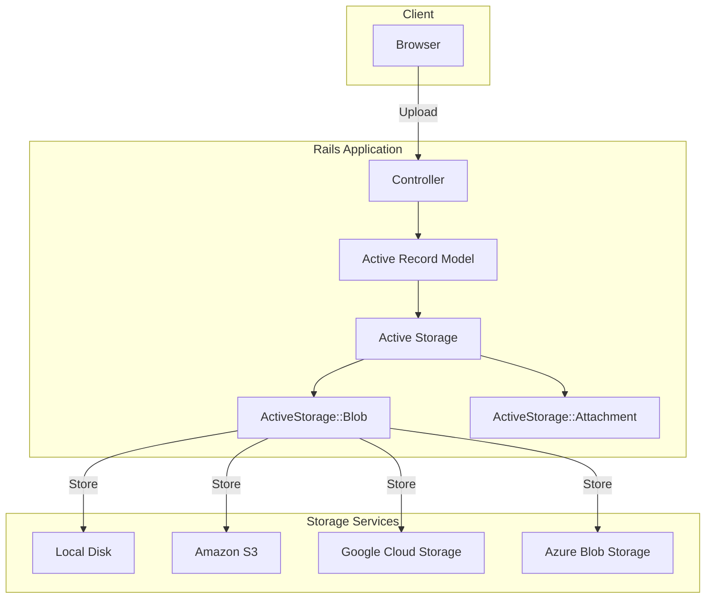
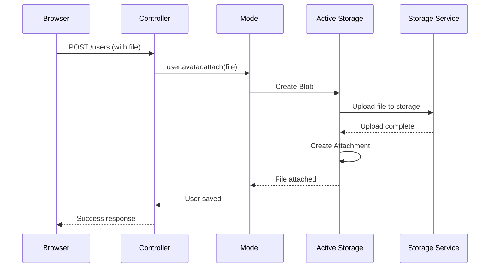
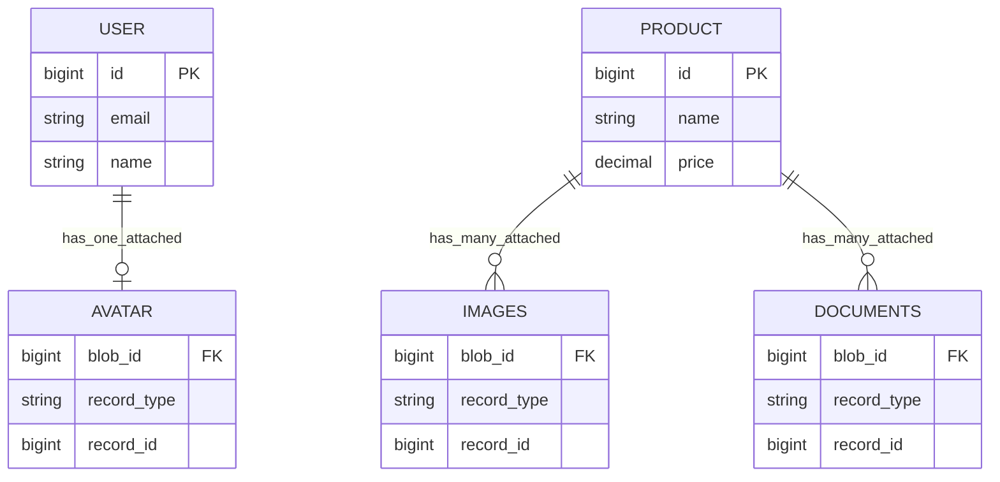
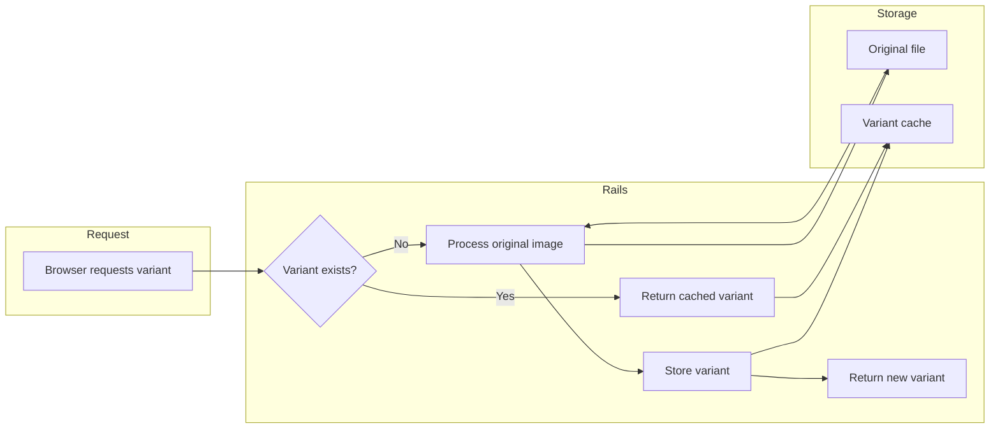
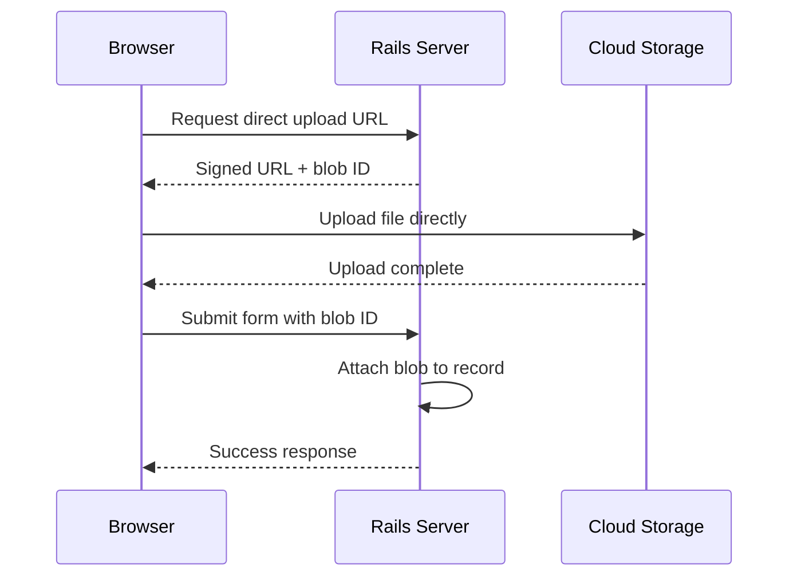
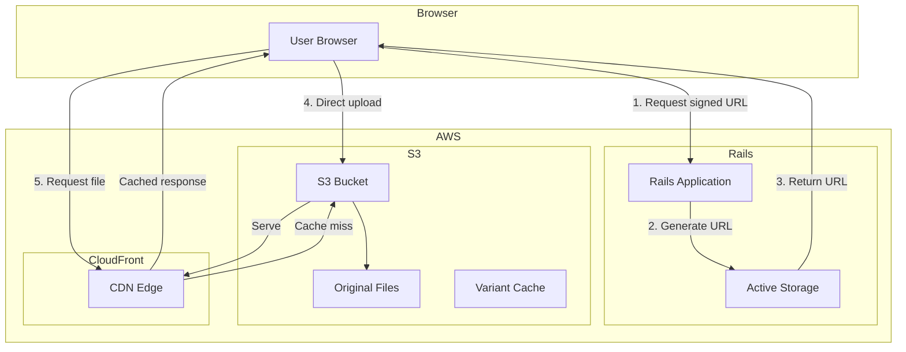

# How to Handle File Uploads with Active Storage

Author: [nawazdhandala](https://www.github.com/nawazdhandala)

Tags: Ruby, Rails, Active Storage, File Uploads, S3, Cloud Storage

Description: A comprehensive guide to handling file uploads in Ruby on Rails using Active Storage. Learn configuration, cloud storage integration, direct uploads, image processing, and production best practices.

---

> File uploads are a fundamental part of modern web applications. Active Storage provides a clean abstraction for attaching files to Active Record models, handling everything from local disk storage to cloud providers like Amazon S3, Google Cloud Storage, and Microsoft Azure.

Active Storage ships with Rails and requires minimal configuration to get started. It supports direct uploads from the browser, image variants with on-the-fly transformations, and seamless integration with multiple storage backends.

---

## Understanding Active Storage Architecture

Before diving into implementation, let's understand how Active Storage works:



Active Storage uses two main tables:
- **active_storage_blobs**: Stores metadata about files (filename, content type, size, checksum)
- **active_storage_attachments**: Polymorphic join table linking blobs to your models

### File Upload Flow



---

## Getting Started

### Installation

Active Storage comes with Rails. Generate the required migrations:

```bash
# Generate Active Storage tables
rails active_storage:install

# Run the migration
rails db:migrate
```

This creates the necessary database tables:

```ruby
# db/migrate/[timestamp]_create_active_storage_tables.active_storage.rb
class CreateActiveStorageTables < ActiveRecord::Migration[7.0]
  def change
    # Primary table for file metadata
    create_table :active_storage_blobs do |t|
      t.string   :key,          null: false
      t.string   :filename,     null: false
      t.string   :content_type
      t.text     :metadata
      t.string   :service_name, null: false
      t.bigint   :byte_size,    null: false
      t.string   :checksum

      t.datetime :created_at,   null: false

      t.index [:key], unique: true
    end

    # Join table for polymorphic attachments
    create_table :active_storage_attachments do |t|
      t.string     :name,     null: false
      t.references :record,   null: false, polymorphic: true, index: false
      t.references :blob,     null: false

      t.datetime :created_at, null: false

      t.index [:record_type, :record_id, :name, :blob_id],
              name: "index_active_storage_attachments_uniqueness",
              unique: true
      t.foreign_key :active_storage_blobs, column: :blob_id
    end

    # Variant records for processed images
    create_table :active_storage_variant_records do |t|
      t.belongs_to :blob, null: false,
                   index: false,
                   foreign_key: { to_table: :active_storage_blobs }
      t.string :variation_digest, null: false

      t.index [:blob_id, :variation_digest],
              name: "index_active_storage_variant_records_uniqueness",
              unique: true
    end
  end
end
```

### Basic Configuration

Configure storage services in `config/storage.yml`:

```yaml
# config/storage.yml

# Local disk storage for development
local:
  service: Disk
  root: <%= Rails.root.join("storage") %>

# Test storage (uses /tmp)
test:
  service: Disk
  root: <%= Rails.root.join("tmp/storage") %>

# Amazon S3 for production
amazon:
  service: S3
  access_key_id: <%= ENV['AWS_ACCESS_KEY_ID'] %>
  secret_access_key: <%= ENV['AWS_SECRET_ACCESS_KEY'] %>
  region: <%= ENV['AWS_REGION'] || 'us-east-1' %>
  bucket: <%= ENV['AWS_BUCKET'] %>

# Google Cloud Storage
google:
  service: GCS
  project: <%= ENV['GCS_PROJECT'] %>
  credentials: <%= ENV['GCS_CREDENTIALS'] %>
  bucket: <%= ENV['GCS_BUCKET'] %>

# Microsoft Azure Blob Storage
azure:
  service: AzureStorage
  storage_account_name: <%= ENV['AZURE_STORAGE_ACCOUNT'] %>
  storage_access_key: <%= ENV['AZURE_STORAGE_KEY'] %>
  container: <%= ENV['AZURE_CONTAINER'] %>
```

Set the active storage service per environment:

```ruby
# config/environments/development.rb
Rails.application.configure do
  # Use local disk storage in development
  config.active_storage.service = :local
end
```

```ruby
# config/environments/production.rb
Rails.application.configure do
  # Use Amazon S3 in production
  config.active_storage.service = :amazon
end
```

```ruby
# config/environments/test.rb
Rails.application.configure do
  # Use test storage
  config.active_storage.service = :test
end
```

---

## Attaching Files to Models

### Single File Attachment

Attach one file to a model using `has_one_attached`:

```ruby
# app/models/user.rb
class User < ApplicationRecord
  # Attach a single avatar image
  has_one_attached :avatar

  # Validations for the attachment
  validate :avatar_validation

  private

  def avatar_validation
    return unless avatar.attached?

    # Validate content type
    unless avatar.content_type.in?(%w[image/jpeg image/png image/gif image/webp])
      errors.add(:avatar, 'must be a JPEG, PNG, GIF, or WebP image')
    end

    # Validate file size (5MB max)
    if avatar.byte_size > 5.megabytes
      errors.add(:avatar, 'must be less than 5MB')
    end
  end
end
```

### Multiple File Attachments

Attach multiple files using `has_many_attached`:

```ruby
# app/models/product.rb
class Product < ApplicationRecord
  # Attach multiple images
  has_many_attached :images

  # Attach multiple documents
  has_many_attached :documents

  # Validations
  validate :images_validation
  validate :documents_validation

  private

  def images_validation
    return unless images.attached?

    images.each do |image|
      # Validate content type
      unless image.content_type.in?(%w[image/jpeg image/png image/webp])
        errors.add(:images, 'must be JPEG, PNG, or WebP images')
        break
      end

      # Validate file size (10MB max per image)
      if image.byte_size > 10.megabytes
        errors.add(:images, 'must each be less than 10MB')
        break
      end
    end

    # Limit number of images
    if images.count > 10
      errors.add(:images, 'cannot exceed 10 images')
    end
  end

  def documents_validation
    return unless documents.attached?

    documents.each do |doc|
      # Validate content type
      allowed = %w[
        application/pdf
        application/msword
        application/vnd.openxmlformats-officedocument.wordprocessingml.document
      ]
      unless doc.content_type.in?(allowed)
        errors.add(:documents, 'must be PDF or Word documents')
        break
      end

      # Validate file size (25MB max per document)
      if doc.byte_size > 25.megabytes
        errors.add(:documents, 'must each be less than 25MB')
        break
      end
    end
  end
end
```

### Attachment Relationship Diagram



---

## Controller Implementation

### Basic Upload Controller

```ruby
# app/controllers/users_controller.rb
class UsersController < ApplicationController
  before_action :set_user, only: [:show, :edit, :update, :destroy, :remove_avatar]

  def new
    @user = User.new
  end

  def create
    @user = User.new(user_params)

    if @user.save
      redirect_to @user, notice: 'User was successfully created.'
    else
      render :new, status: :unprocessable_entity
    end
  end

  def update
    if @user.update(user_params)
      redirect_to @user, notice: 'User was successfully updated.'
    else
      render :edit, status: :unprocessable_entity
    end
  end

  # Remove avatar attachment
  def remove_avatar
    @user.avatar.purge_later  # Async deletion
    redirect_to @user, notice: 'Avatar was removed.'
  end

  private

  def set_user
    @user = User.find(params[:id])
  end

  def user_params
    params.require(:user).permit(:name, :email, :avatar)
  end
end
```

### Multiple Files Controller

```ruby
# app/controllers/products_controller.rb
class ProductsController < ApplicationController
  before_action :set_product, only: [:show, :edit, :update, :destroy, :remove_image]

  def create
    @product = Product.new(product_params)

    if @product.save
      redirect_to @product, notice: 'Product was successfully created.'
    else
      render :new, status: :unprocessable_entity
    end
  end

  def update
    # Handle image additions without replacing existing ones
    if params[:product][:images].present?
      @product.images.attach(params[:product][:images])
    end

    if @product.update(product_params.except(:images))
      redirect_to @product, notice: 'Product was successfully updated.'
    else
      render :edit, status: :unprocessable_entity
    end
  end

  # Remove a specific image
  def remove_image
    image = @product.images.find(params[:image_id])
    image.purge_later
    redirect_to @product, notice: 'Image was removed.'
  end

  private

  def set_product
    @product = Product.find(params[:id])
  end

  def product_params
    params.require(:product).permit(:name, :price, :description, images: [], documents: [])
  end
end
```

---

## View Templates

### Form with File Upload

```erb
<%# app/views/users/_form.html.erb %>
<%= form_with model: @user, local: true do |form| %>
  <% if @user.errors.any? %>
    <div class="alert alert-danger">
      <h4><%= pluralize(@user.errors.count, "error") %> prevented this user from being saved:</h4>
      <ul>
        <% @user.errors.full_messages.each do |message| %>
          <li><%= message %></li>
        <% end %>
      </ul>
    </div>
  <% end %>

  <div class="form-group">
    <%= form.label :name %>
    <%= form.text_field :name, class: 'form-control' %>
  </div>

  <div class="form-group">
    <%= form.label :email %>
    <%= form.email_field :email, class: 'form-control' %>
  </div>

  <div class="form-group">
    <%= form.label :avatar %>
    
    <%# Show current avatar if present %>
    <% if @user.avatar.attached? %>
      <div class="current-avatar mb-2">
        <%= image_tag @user.avatar.variant(resize_to_limit: [100, 100]),
                      class: 'img-thumbnail' %>
        <p class="text-muted">
          Current file: <%= @user.avatar.filename %>
          (<%= number_to_human_size(@user.avatar.byte_size) %>)
        </p>
      </div>
    <% end %>

    <%= form.file_field :avatar,
                        accept: 'image/jpeg,image/png,image/gif,image/webp',
                        class: 'form-control' %>
    <small class="form-text text-muted">
      Accepted formats: JPEG, PNG, GIF, WebP. Maximum size: 5MB
    </small>
  </div>

  <div class="form-group">
    <%= form.submit class: 'btn btn-primary' %>
  </div>
<% end %>
```

### Multiple File Upload Form

```erb
<%# app/views/products/_form.html.erb %>
<%= form_with model: @product, local: true do |form| %>
  <div class="form-group">
    <%= form.label :name %>
    <%= form.text_field :name, class: 'form-control' %>
  </div>

  <div class="form-group">
    <%= form.label :price %>
    <%= form.number_field :price, step: 0.01, class: 'form-control' %>
  </div>

  <div class="form-group">
    <%= form.label :images, 'Product Images' %>
    
    <%# Show existing images with remove option %>
    <% if @product.images.attached? %>
      <div class="existing-images row mb-3">
        <% @product.images.each do |image| %>
          <div class="col-md-3 mb-2">
            <%= image_tag image.variant(resize_to_limit: [150, 150]),
                          class: 'img-thumbnail' %>
            <p class="text-muted small"><%= image.filename %></p>
            <%= link_to 'Remove',
                        remove_image_product_path(@product, image_id: image.id),
                        method: :delete,
                        data: { confirm: 'Are you sure?' },
                        class: 'btn btn-sm btn-outline-danger' %>
          </div>
        <% end %>
      </div>
    <% end %>

    <%= form.file_field :images,
                        multiple: true,
                        accept: 'image/jpeg,image/png,image/webp',
                        class: 'form-control' %>
    <small class="form-text text-muted">
      Upload up to 10 images. Maximum 10MB each.
    </small>
  </div>

  <div class="form-group">
    <%= form.submit class: 'btn btn-primary' %>
  </div>
<% end %>
```

### Displaying Attachments

```erb
<%# app/views/users/show.html.erb %>
<h1><%= @user.name %></h1>

<div class="user-avatar">
  <% if @user.avatar.attached? %>
    <%# Display with variant (resized on-the-fly) %>
    <%= image_tag @user.avatar.variant(resize_to_limit: [300, 300]),
                  alt: "#{@user.name}'s avatar",
                  class: 'img-fluid rounded-circle' %>
    
    <p class="mt-2">
      <strong>File:</strong> <%= @user.avatar.filename %><br>
      <strong>Size:</strong> <%= number_to_human_size(@user.avatar.byte_size) %><br>
      <strong>Type:</strong> <%= @user.avatar.content_type %>
    </p>
    
    <%# Link to remove avatar %>
    <%= link_to 'Remove Avatar',
                remove_avatar_user_path(@user),
                method: :delete,
                data: { confirm: 'Remove your avatar?' },
                class: 'btn btn-outline-danger btn-sm' %>
  <% else %>
    <div class="no-avatar">
      <p class="text-muted">No avatar uploaded</p>
    </div>
  <% end %>
</div>
```

---

## Image Processing and Variants

Active Storage supports on-the-fly image transformations using image processing libraries.

### Setup Image Processing

Add the image processing gem:

```ruby
# Gemfile
gem 'image_processing', '~> 1.12'
```

Install the dependencies:

```bash
bundle install
```

Ensure you have ImageMagick or libvips installed:

```bash
# macOS with Homebrew
brew install vips

# Ubuntu/Debian
sudo apt-get install libvips

# Or use ImageMagick
brew install imagemagick
```

Configure the variant processor:

```ruby
# config/application.rb
module MyApp
  class Application < Rails::Application
    # Use vips for better performance (recommended)
    config.active_storage.variant_processor = :vips
    
    # Or use mini_magick (ImageMagick)
    # config.active_storage.variant_processor = :mini_magick
  end
end
```

### Defining Variants

```ruby
# app/models/user.rb
class User < ApplicationRecord
  has_one_attached :avatar do |attachable|
    # Pre-define variants for consistent usage
    attachable.variant :thumb, resize_to_limit: [100, 100]
    attachable.variant :medium, resize_to_limit: [300, 300]
    attachable.variant :large, resize_to_limit: [800, 800]
  end

  # Custom method for avatar with fallback
  def avatar_url(variant = :medium)
    if avatar.attached?
      avatar.variant(variant)
    else
      'default_avatar.png'
    end
  end
end
```

### Using Variants in Views

```erb
<%# Different size variants %>
<%= image_tag @user.avatar.variant(:thumb), alt: 'Thumbnail' %>
<%= image_tag @user.avatar.variant(:medium), alt: 'Medium' %>
<%= image_tag @user.avatar.variant(:large), alt: 'Large' %>

<%# Custom inline transformations %>
<%= image_tag @user.avatar.variant(
  resize_to_fill: [200, 200],
  format: :webp,
  saver: { quality: 80 }
) %>

<%# Grayscale variant %>
<%= image_tag @user.avatar.variant(
  resize_to_limit: [300, 300],
  colourspace: 'b-w'
) %>
```

### Common Variant Transformations

```ruby
# app/models/product.rb
class Product < ApplicationRecord
  has_many_attached :images do |attachable|
    # Thumbnail for listings
    attachable.variant :thumb,
      resize_to_fill: [150, 150],
      format: :webp,
      saver: { quality: 80 }

    # Card image for product cards
    attachable.variant :card,
      resize_to_limit: [400, 400],
      format: :webp,
      saver: { quality: 85 }

    # Full size for product detail
    attachable.variant :detail,
      resize_to_limit: [1200, 1200],
      format: :webp,
      saver: { quality: 90 }

    # Square crop for grid layouts
    attachable.variant :square,
      resize_to_fill: [300, 300, { crop: :attention }]
  end
end
```

### Variant Processing Flow



---

## Direct Uploads

Direct uploads allow files to be uploaded directly from the browser to cloud storage, bypassing your Rails server.

### Enable Direct Uploads

Add the JavaScript library:

```javascript
// app/javascript/application.js
import * as ActiveStorage from "@rails/activestorage"
ActiveStorage.start()
```

Or with importmaps:

```ruby
# config/importmap.rb
pin "@rails/activestorage", to: "activestorage.esm.js"
```

### Direct Upload Form

```erb
<%# app/views/users/_form.html.erb %>
<%= form_with model: @user, local: true do |form| %>
  <div class="form-group">
    <%= form.label :avatar %>
    
    <%# Enable direct upload with data-direct-upload-url %>
    <%= form.file_field :avatar,
                        direct_upload: true,
                        class: 'form-control' %>
  </div>

  <div class="form-group">
    <%= form.submit class: 'btn btn-primary' %>
  </div>
<% end %>
```

### Direct Upload with Progress

```erb
<%# app/views/products/_form.html.erb %>
<%= form_with model: @product, local: true, data: { controller: 'upload' } do |form| %>
  <div class="form-group">
    <%= form.label :images %>
    <%= form.file_field :images,
                        multiple: true,
                        direct_upload: true,
                        data: { 
                          action: 'direct-upload:initialize->upload#initialize direct-upload:start->upload#start direct-upload:progress->upload#progress direct-upload:end->upload#end'
                        },
                        class: 'form-control' %>
    
    <%# Progress container %>
    <div id="upload-progress" class="mt-2"></div>
  </div>

  <div class="form-group">
    <%= form.submit class: 'btn btn-primary', data: { upload_target: 'submit' } %>
  </div>
<% end %>
```

### Stimulus Controller for Upload Progress

```javascript
// app/javascript/controllers/upload_controller.js
import { Controller } from "@hotwired/stimulus"

export default class extends Controller {
  static targets = ["submit"]

  initialize(event) {
    const { target, detail } = event
    const { id, file } = detail

    // Create progress element
    const progressContainer = document.getElementById('upload-progress')
    const progressHTML = `
      <div id="direct-upload-${id}" class="direct-upload mb-2">
        <div class="d-flex justify-content-between">
          <span class="filename">${file.name}</span>
          <span class="progress-text">0%</span>
        </div>
        <div class="progress">
          <div class="progress-bar" role="progressbar" style="width: 0%"></div>
        </div>
      </div>
    `
    progressContainer.insertAdjacentHTML('beforeend', progressHTML)
  }

  start(event) {
    const { id } = event.detail
    const element = document.getElementById(`direct-upload-${id}`)
    element.classList.add('uploading')
    
    // Disable submit button during upload
    if (this.hasSubmitTarget) {
      this.submitTarget.disabled = true
    }
  }

  progress(event) {
    const { id, progress } = event.detail
    const element = document.getElementById(`direct-upload-${id}`)
    const progressBar = element.querySelector('.progress-bar')
    const progressText = element.querySelector('.progress-text')
    
    progressBar.style.width = `${progress}%`
    progressText.textContent = `${Math.round(progress)}%`
  }

  end(event) {
    const { id } = event.detail
    const element = document.getElementById(`direct-upload-${id}`)
    element.classList.remove('uploading')
    element.classList.add('complete')
    
    // Re-enable submit button
    if (this.hasSubmitTarget) {
      this.submitTarget.disabled = false
    }
  }
}
```

### Direct Upload Flow



---

## Amazon S3 Configuration

### Required Gems

```ruby
# Gemfile
gem 'aws-sdk-s3', require: false
```

### S3 Service Configuration

```yaml
# config/storage.yml
amazon:
  service: S3
  access_key_id: <%= ENV['AWS_ACCESS_KEY_ID'] %>
  secret_access_key: <%= ENV['AWS_SECRET_ACCESS_KEY'] %>
  region: <%= ENV['AWS_REGION'] %>
  bucket: <%= ENV['AWS_BUCKET'] %>
  
  # Optional: Custom endpoint for S3-compatible services
  # endpoint: https://s3.example.com
  
  # Optional: Force path style URLs (for MinIO, etc.)
  # force_path_style: true

# S3 with CloudFront CDN
amazon_cdn:
  service: S3
  access_key_id: <%= ENV['AWS_ACCESS_KEY_ID'] %>
  secret_access_key: <%= ENV['AWS_SECRET_ACCESS_KEY'] %>
  region: <%= ENV['AWS_REGION'] %>
  bucket: <%= ENV['AWS_BUCKET'] %>
  
  # CloudFront distribution
  public: true
  
# S3 with custom upload options
amazon_private:
  service: S3
  access_key_id: <%= ENV['AWS_ACCESS_KEY_ID'] %>
  secret_access_key: <%= ENV['AWS_SECRET_ACCESS_KEY'] %>
  region: <%= ENV['AWS_REGION'] %>
  bucket: <%= ENV['AWS_PRIVATE_BUCKET'] %>
  
  upload:
    server_side_encryption: 'aws:kms'
    # Or use AES256
    # server_side_encryption: 'AES256'
```

### S3 Bucket Policy for Direct Uploads

```json
{
  "Version": "2012-10-17",
  "Statement": [
    {
      "Sid": "AllowActiveStorageAccess",
      "Effect": "Allow",
      "Principal": {
        "AWS": "arn:aws:iam::ACCOUNT_ID:user/rails-app-user"
      },
      "Action": [
        "s3:PutObject",
        "s3:GetObject",
        "s3:DeleteObject"
      ],
      "Resource": "arn:aws:s3:::your-bucket-name/*"
    }
  ]
}
```

### CORS Configuration for Direct Uploads

```json
[
  {
    "AllowedHeaders": ["*"],
    "AllowedMethods": ["PUT", "POST"],
    "AllowedOrigins": [
      "https://yourdomain.com",
      "http://localhost:3000"
    ],
    "ExposeHeaders": ["ETag"],
    "MaxAgeSeconds": 3600
  }
]
```

### S3 Architecture



---

## Validations and Security

### Custom Validator

```ruby
# app/validators/attachment_validator.rb
class AttachmentValidator < ActiveModel::EachValidator
  def validate_each(record, attribute, value)
    return unless value.attached?

    # Handle both single and multiple attachments
    attachments = value.is_a?(ActiveStorage::Attached::Many) ? value : [value]

    attachments.each do |attachment|
      validate_content_type(record, attribute, attachment)
      validate_size(record, attribute, attachment)
      validate_dimensions(record, attribute, attachment) if image?(attachment)
    end

    validate_count(record, attribute, attachments) if options[:max_count]
  end

  private

  def validate_content_type(record, attribute, attachment)
    return unless options[:content_type]
    
    allowed = Array(options[:content_type])
    unless allowed.include?(attachment.content_type)
      record.errors.add(attribute, :invalid_content_type, 
        allowed: allowed.join(', '))
    end
  end

  def validate_size(record, attribute, attachment)
    return unless options[:max_size]
    
    max_size = options[:max_size]
    if attachment.byte_size > max_size
      record.errors.add(attribute, :file_too_large,
        max_size: ActiveSupport::NumberHelper.number_to_human_size(max_size))
    end
  end

  def validate_dimensions(record, attribute, attachment)
    return unless options[:min_width] || options[:max_width] ||
                  options[:min_height] || options[:max_height]

    # Analyze the image to get dimensions
    metadata = attachment.blob.analyze if attachment.blob.analyzed? == false
    metadata ||= attachment.blob.metadata

    width = metadata[:width]
    height = metadata[:height]

    return unless width && height

    if options[:min_width] && width < options[:min_width]
      record.errors.add(attribute, :image_too_narrow, min_width: options[:min_width])
    end

    if options[:max_width] && width > options[:max_width]
      record.errors.add(attribute, :image_too_wide, max_width: options[:max_width])
    end

    if options[:min_height] && height < options[:min_height]
      record.errors.add(attribute, :image_too_short, min_height: options[:min_height])
    end

    if options[:max_height] && height > options[:max_height]
      record.errors.add(attribute, :image_too_tall, max_height: options[:max_height])
    end
  end

  def validate_count(record, attribute, attachments)
    max_count = options[:max_count]
    if attachments.count > max_count
      record.errors.add(attribute, :too_many_files, max_count: max_count)
    end
  end

  def image?(attachment)
    attachment.content_type.start_with?('image/')
  end
end
```

### Using the Validator

```ruby
# app/models/user.rb
class User < ApplicationRecord
  has_one_attached :avatar
  
  validates :avatar, attachment: {
    content_type: %w[image/jpeg image/png image/webp],
    max_size: 5.megabytes,
    min_width: 100,
    min_height: 100,
    max_width: 4000,
    max_height: 4000
  }
end
```

```ruby
# app/models/product.rb
class Product < ApplicationRecord
  has_many_attached :images
  
  validates :images, attachment: {
    content_type: %w[image/jpeg image/png image/webp],
    max_size: 10.megabytes,
    max_count: 10
  }
end
```

### Content Type Security

```ruby
# config/initializers/active_storage.rb

# Prevent executable uploads
Rails.application.config.active_storage.content_types_to_serve_as_binary = [
  'text/html',
  'text/javascript',
  'application/javascript',
  'text/xml',
  'application/xml'
]

# Force download for certain types
Rails.application.config.active_storage.content_types_allowed_inline = [
  'image/jpeg',
  'image/png',
  'image/gif',
  'image/webp',
  'application/pdf'
]
```

---

## Background Processing

### Purge Jobs

Active Storage provides built-in jobs for async operations:

```ruby
# Purge attachment asynchronously (recommended)
@user.avatar.purge_later

# Purge immediately (blocks)
@user.avatar.purge

# Purge multiple attachments
@product.images.each(&:purge_later)

# Or purge all at once
@product.images.purge_later
```

### Custom Processing Jobs

```ruby
# app/jobs/image_processing_job.rb
class ImageProcessingJob < ApplicationJob
  queue_as :default
  
  def perform(blob_id)
    blob = ActiveStorage::Blob.find_by(id: blob_id)
    return unless blob
    
    # Ensure blob is analyzed
    blob.analyze unless blob.analyzed?
    
    # Pre-generate common variants
    if blob.image?
      generate_variants(blob)
    end
  end
  
  private
  
  def generate_variants(blob)
    return unless blob.attached?
    
    # Get the attachment
    attachment = blob.attachments.first
    return unless attachment
    
    record = attachment.record
    name = attachment.name
    
    # Access through the model's association
    attached = record.send(name)
    
    # Pre-generate variants based on model type
    case record
    when User
      attached.variant(:thumb).processed
      attached.variant(:medium).processed
    when Product
      attached.variant(:thumb).processed
      attached.variant(:card).processed
      attached.variant(:detail).processed
    end
  rescue => e
    Rails.logger.error "Failed to process variants for blob #{blob_id}: #{e.message}"
  end
end
```

### Trigger Processing After Upload

```ruby
# app/models/concerns/attachable.rb
module Attachable
  extend ActiveSupport::Concern

  included do
    after_commit :process_attachments, on: [:create, :update]
  end

  private

  def process_attachments
    # Find all attached blobs and schedule processing
    self.class.reflect_on_all_attachments.each do |attachment|
      attached = send(attachment.name)
      next unless attached.attached?

      blobs = attached.is_a?(ActiveStorage::Attached::Many) ? 
              attached.blobs : 
              [attached.blob]

      blobs.each do |blob|
        ImageProcessingJob.perform_later(blob.id) if blob.image?
      end
    end
  end
end
```

```ruby
# app/models/user.rb
class User < ApplicationRecord
  include Attachable
  
  has_one_attached :avatar
end
```

---

## Testing Active Storage

### Test Configuration

```ruby
# config/environments/test.rb
Rails.application.configure do
  config.active_storage.service = :test
end
```

### Unit Tests

```ruby
# test/models/user_test.rb
require 'test_helper'

class UserTest < ActiveSupport::TestCase
  include ActiveStorage::FixtureSet

  def setup
    @user = users(:john)
  end

  test 'can attach an avatar' do
    @user.avatar.attach(
      io: File.open(Rails.root.join('test/fixtures/files/avatar.jpg')),
      filename: 'avatar.jpg',
      content_type: 'image/jpeg'
    )

    assert @user.avatar.attached?
    assert_equal 'avatar.jpg', @user.avatar.filename.to_s
  end

  test 'validates avatar content type' do
    @user.avatar.attach(
      io: File.open(Rails.root.join('test/fixtures/files/document.pdf')),
      filename: 'document.pdf',
      content_type: 'application/pdf'
    )

    assert_not @user.valid?
    assert_includes @user.errors[:avatar], 'must be a JPEG, PNG, GIF, or WebP image'
  end

  test 'validates avatar file size' do
    # Create a file larger than 5MB
    large_file = StringIO.new('x' * 6.megabytes)
    
    @user.avatar.attach(
      io: large_file,
      filename: 'large_image.jpg',
      content_type: 'image/jpeg'
    )

    assert_not @user.valid?
    assert_includes @user.errors[:avatar], 'must be less than 5MB'
  end
end
```

### Controller Tests

```ruby
# test/controllers/users_controller_test.rb
require 'test_helper'

class UsersControllerTest < ActionDispatch::IntegrationTest
  include ActiveStorage::FixtureSet

  def setup
    @user = users(:john)
  end

  test 'should create user with avatar' do
    avatar = fixture_file_upload('files/avatar.jpg', 'image/jpeg')

    assert_difference('User.count') do
      post users_url, params: {
        user: {
          name: 'Jane Doe',
          email: 'jane@example.com',
          avatar: avatar
        }
      }
    end

    user = User.last
    assert user.avatar.attached?
    assert_redirected_to user_url(user)
  end

  test 'should update user avatar' do
    new_avatar = fixture_file_upload('files/new_avatar.jpg', 'image/jpeg')

    patch user_url(@user), params: {
      user: { avatar: new_avatar }
    }

    @user.reload
    assert @user.avatar.attached?
    assert_equal 'new_avatar.jpg', @user.avatar.filename.to_s
    assert_redirected_to user_url(@user)
  end

  test 'should remove avatar' do
    # First attach an avatar
    @user.avatar.attach(
      io: File.open(Rails.root.join('test/fixtures/files/avatar.jpg')),
      filename: 'avatar.jpg',
      content_type: 'image/jpeg'
    )

    delete remove_avatar_user_url(@user)

    @user.reload
    assert_not @user.avatar.attached?
    assert_redirected_to user_url(@user)
  end
end
```

### RSpec Tests

```ruby
# spec/models/user_spec.rb
require 'rails_helper'

RSpec.describe User, type: :model do
  describe 'avatar attachment' do
    let(:user) { create(:user) }

    it 'can attach an avatar' do
      user.avatar.attach(
        io: File.open(Rails.root.join('spec/fixtures/files/avatar.jpg')),
        filename: 'avatar.jpg',
        content_type: 'image/jpeg'
      )

      expect(user.avatar).to be_attached
    end

    it 'validates content type' do
      user.avatar.attach(
        io: File.open(Rails.root.join('spec/fixtures/files/document.pdf')),
        filename: 'document.pdf',
        content_type: 'application/pdf'
      )

      expect(user).not_to be_valid
      expect(user.errors[:avatar]).to include('must be a JPEG, PNG, GIF, or WebP image')
    end

    it 'validates file size' do
      large_file = StringIO.new('x' * 6.megabytes)
      
      user.avatar.attach(
        io: large_file,
        filename: 'large.jpg',
        content_type: 'image/jpeg'
      )

      expect(user).not_to be_valid
      expect(user.errors[:avatar]).to include('must be less than 5MB')
    end

    it 'generates variants' do
      user.avatar.attach(
        io: File.open(Rails.root.join('spec/fixtures/files/avatar.jpg')),
        filename: 'avatar.jpg',
        content_type: 'image/jpeg'
      )

      thumb = user.avatar.variant(:thumb)
      expect(thumb).to be_present
    end
  end
end
```

### Test Fixtures

```yaml
# test/fixtures/active_storage/blobs.yml
john_avatar:
  key: avatar-john
  filename: john_avatar.jpg
  content_type: image/jpeg
  service_name: test
  byte_size: 12345
  checksum: abc123

# test/fixtures/active_storage/attachments.yml
john_avatar_attachment:
  name: avatar
  record: john (User)
  blob: john_avatar
```

---

## Production Best Practices

### URL Expiration and Security

```ruby
# config/initializers/active_storage.rb

# Set URL expiration time
Rails.application.config.active_storage.service_urls_expire_in = 5.minutes

# For public buckets, you might want longer expiration
# Rails.application.config.active_storage.service_urls_expire_in = 1.hour

# Resolve host for URLs
Rails.application.config.active_storage.resolve_model_to_route = :rails_storage_proxy
```

### CDN Integration

```ruby
# config/environments/production.rb
Rails.application.configure do
  # Use CDN for serving files
  config.active_storage.resolve_model_to_route = :rails_storage_redirect
  
  # Or proxy through Rails (useful for access control)
  # config.active_storage.resolve_model_to_route = :rails_storage_proxy
end
```

### Cleanup Unattached Blobs

```ruby
# lib/tasks/active_storage.rake
namespace :active_storage do
  desc 'Clean up unattached blobs older than 2 days'
  task cleanup_unattached: :environment do
    ActiveStorage::Blob
      .unattached
      .where('active_storage_blobs.created_at < ?', 2.days.ago)
      .find_each(&:purge_later)
    
    puts 'Cleanup job enqueued'
  end
end
```

Schedule the cleanup:

```ruby
# config/schedule.rb (with whenever gem)
every 1.day, at: '4:00 am' do
  rake 'active_storage:cleanup_unattached'
end
```

### Monitoring and Metrics

```ruby
# app/services/storage_metrics_service.rb
class StorageMetricsService
  def self.collect_metrics
    {
      total_blobs: ActiveStorage::Blob.count,
      total_size: ActiveStorage::Blob.sum(:byte_size),
      unattached_blobs: ActiveStorage::Blob.unattached.count,
      by_content_type: ActiveStorage::Blob.group(:content_type).count,
      average_size: ActiveStorage::Blob.average(:byte_size)
    }
  end
  
  def self.report
    metrics = collect_metrics
    
    Rails.logger.info "Storage Metrics:"
    Rails.logger.info "  Total blobs: #{metrics[:total_blobs]}"
    Rails.logger.info "  Total size: #{ActiveSupport::NumberHelper.number_to_human_size(metrics[:total_size])}"
    Rails.logger.info "  Unattached: #{metrics[:unattached_blobs]}"
    Rails.logger.info "  By type: #{metrics[:by_content_type]}"
    
    metrics
  end
end
```

---

## Summary

Active Storage provides a powerful, flexible system for handling file uploads in Rails applications. Key takeaways:

- **Start simple** with local disk storage, then migrate to cloud services
- **Use variants** for responsive images without storing multiple sizes
- **Enable direct uploads** to reduce server load and improve user experience
- **Validate thoroughly** to prevent security issues and bad data
- **Test attachments** like any other model attribute
- **Monitor storage** usage and clean up unattached blobs regularly

The combination of Active Storage with modern cloud providers and CDNs enables you to build scalable file upload systems that grow with your application.

---

*Need to monitor your Rails application's file uploads and storage performance? [OneUptime](https://oneuptime.com) provides comprehensive observability for Ruby on Rails applications, including request tracing, error tracking, and performance monitoring for your Active Storage operations.*
