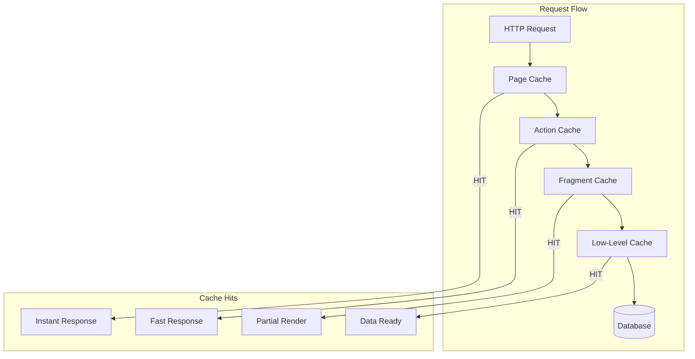
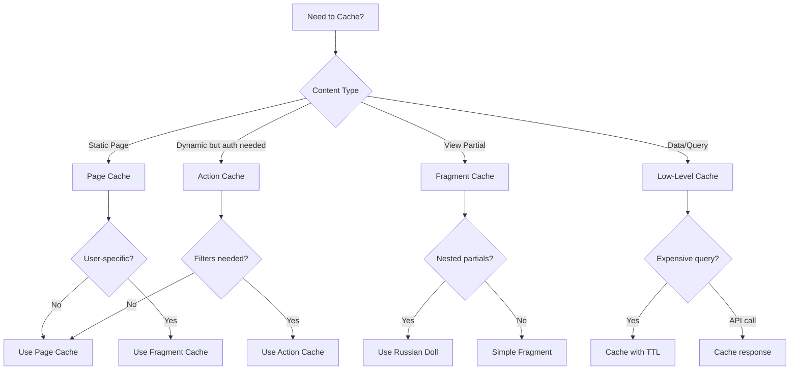
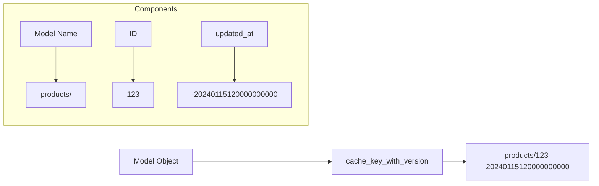
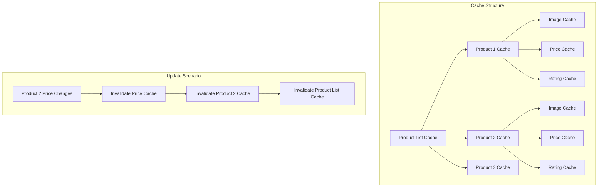
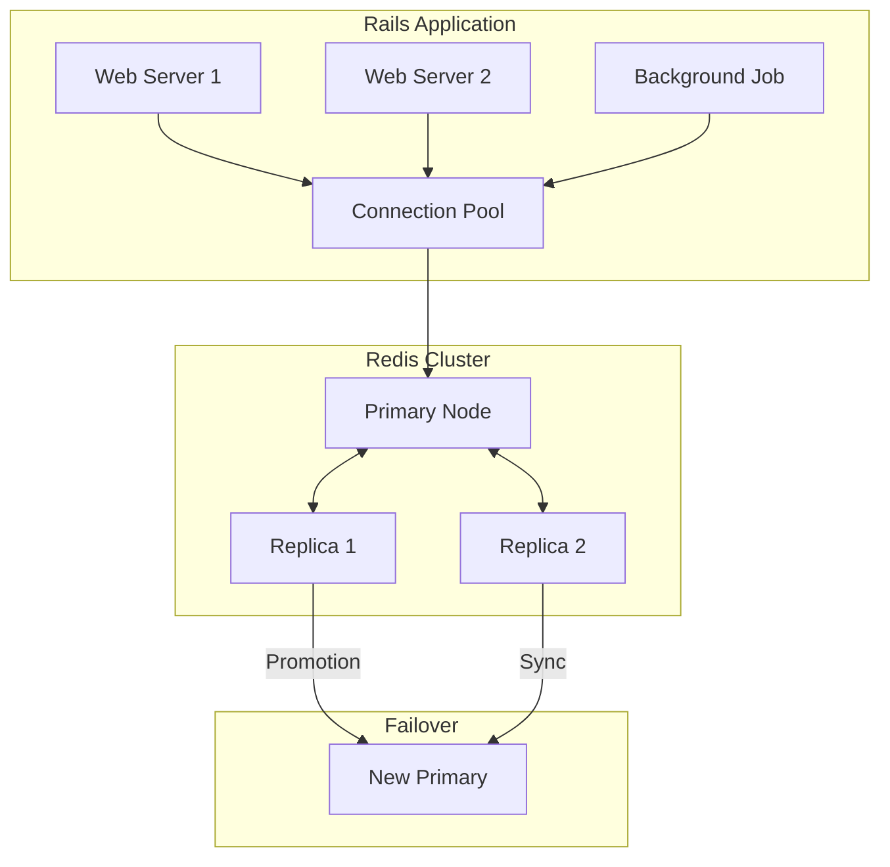
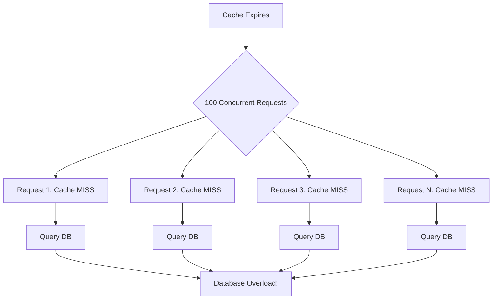

# How to Implement Caching Strategies in Rails

Author: [nawazdhandala](https://www.github.com/nawazdhandala)

Tags: Ruby, Rails, Caching, Redis, Performance, Fragment Caching

Description: Learn how to implement effective caching strategies in Ruby on Rails to dramatically improve application performance. This guide covers page caching, action caching, fragment caching, Russian doll caching, and low-level caching with Redis.

---

> Performance is not optional. In a world where users expect sub-second response times, caching is the difference between a snappy application and one that frustrates users into leaving. Rails provides a comprehensive caching toolkit that, when used correctly, can reduce response times by orders of magnitude.

Rails offers multiple caching layers, each suited for different scenarios. Understanding when and how to use each type is crucial for building high-performance applications that scale gracefully under load.

---

## Understanding Rails Caching Layers

Before diving into implementation, let's understand the different caching layers Rails provides:



Each layer serves a specific purpose:

- **Page Caching**: Stores the entire HTML response as a static file
- **Action Caching**: Caches controller action output after running filters
- **Fragment Caching**: Caches portions of views
- **Low-Level Caching**: Caches arbitrary data (queries, computations, API calls)

### Cache Decision Flow



---

## Configuring the Cache Store

Before implementing any caching strategy, you need to configure the cache store in your Rails application.

### Development Configuration

```ruby
# config/environments/development.rb
Rails.application.configure do
  # Enable caching in development for testing
  # Run: bin/rails dev:cache to toggle
  if Rails.root.join("tmp/caching-dev.txt").exist?
    config.action_controller.perform_caching = true
    config.action_controller.enable_fragment_cache_logging = true

    # Use memory store for development (simple, no setup required)
    config.cache_store = :memory_store, { 
      size: 64.megabytes 
    }

    # Enable verbose cache logging
    config.public_file_server.headers = {
      "Cache-Control" => "public, max-age=#{2.days.to_i}"
    }
  else
    config.action_controller.perform_caching = false
    config.cache_store = :null_store
  end
end
```

### Production Configuration with Redis

```ruby
# config/environments/production.rb
Rails.application.configure do
  # Always enable caching in production
  config.action_controller.perform_caching = true

  # Use Redis as the cache store for production
  config.cache_store = :redis_cache_store, {
    # Connection URL from environment variable
    url: ENV.fetch("REDIS_URL", "redis://localhost:6379/1"),
    
    # Namespace prevents key collisions with other apps
    namespace: "myapp:cache",
    
    # Connection pool settings for concurrent access
    pool: {
      size: ENV.fetch("RAILS_MAX_THREADS", 5).to_i,
      timeout: 5
    },
    
    # Reconnect on connection errors
    reconnect_attempts: 3,
    reconnect_delay: 0.2,
    reconnect_delay_max: 1.0,
    
    # Error handling - log errors but don't crash
    error_handler: ->(method:, returning:, exception:) {
      Rails.logger.error(
        "Redis cache error: #{exception.class} - #{exception.message}"
      )
      Sentry.capture_exception(exception) if defined?(Sentry)
    },
    
    # Compression for large values (saves memory and bandwidth)
    compress: true,
    compress_threshold: 1.kilobyte,
    
    # Default expiration (optional, can be overridden per-key)
    expires_in: 1.hour
  }
end
```

### Gemfile Dependencies

```ruby
# Gemfile

# Redis for caching and Active Job
gem "redis", "~> 5.0"

# Connection pooling for Redis
gem "connection_pool", "~> 2.4"

# Hiredis for faster Redis protocol parsing (optional but recommended)
gem "hiredis-client", "~> 0.18"
```

---

## Low-Level Caching with Rails.cache

Low-level caching gives you complete control over what gets cached and for how long. It is ideal for caching expensive database queries, API responses, and computed values.

### Basic Read and Write Operations

```ruby
# app/services/product_catalog_service.rb
class ProductCatalogService
  # Cache expensive aggregation query
  def self.featured_products
    # Rails.cache.fetch checks cache first, computes if missing
    Rails.cache.fetch("products:featured", expires_in: 15.minutes) do
      # This block only executes on cache miss
      Product
        .includes(:category, :images)
        .where(featured: true)
        .where("stock_count > ?", 0)
        .order(popularity_score: :desc)
        .limit(20)
        .to_a  # Convert to array to cache the actual records
    end
  end

  # Cache with dynamic key based on parameters
  def self.products_by_category(category_id, page: 1, per_page: 20)
    cache_key = "products:category:#{category_id}:page:#{page}:per:#{per_page}"
    
    Rails.cache.fetch(cache_key, expires_in: 30.minutes) do
      Product
        .where(category_id: category_id)
        .includes(:images)
        .page(page)
        .per(per_page)
        .to_a
    end
  end

  # Conditional caching based on data freshness
  def self.product_stats(product_id)
    product = Product.find(product_id)
    
    # Include updated_at in cache key for automatic invalidation
    cache_key = "products:#{product_id}:stats:#{product.updated_at.to_i}"
    
    Rails.cache.fetch(cache_key, expires_in: 1.hour) do
      {
        total_views: product.page_views.count,
        average_rating: product.reviews.average(:rating)&.round(2) || 0,
        review_count: product.reviews.count,
        purchase_count: product.order_items.sum(:quantity)
      }
    end
  end
end
```

### Caching External API Responses

```ruby
# app/services/weather_service.rb
class WeatherService
  include HTTParty
  base_uri "api.openweathermap.org"

  class << self
    # Cache weather data to reduce API calls
    def current_weather(city)
      cache_key = "weather:current:#{city.downcase.parameterize}"
      
      Rails.cache.fetch(cache_key, expires_in: 10.minutes) do
        response = get("/data/2.5/weather", query: {
          q: city,
          appid: ENV["OPENWEATHER_API_KEY"],
          units: "metric"
        })

        if response.success?
          parse_weather_response(response)
        else
          Rails.logger.warn("Weather API failed for #{city}: #{response.code}")
          nil
        end
      end
    end

    # Cache forecast with longer TTL (data changes less frequently)
    def forecast(city, days: 5)
      cache_key = "weather:forecast:#{city.downcase.parameterize}:#{days}"
      
      Rails.cache.fetch(cache_key, expires_in: 1.hour) do
        response = get("/data/2.5/forecast", query: {
          q: city,
          cnt: days * 8,  # 3-hour intervals
          appid: ENV["OPENWEATHER_API_KEY"],
          units: "metric"
        })

        response.success? ? parse_forecast_response(response) : []
      end
    end

    private

    def parse_weather_response(response)
      data = response.parsed_response
      {
        temperature: data.dig("main", "temp"),
        feels_like: data.dig("main", "feels_like"),
        humidity: data.dig("main", "humidity"),
        description: data.dig("weather", 0, "description"),
        icon: data.dig("weather", 0, "icon"),
        wind_speed: data.dig("wind", "speed")
      }
    end

    def parse_forecast_response(response)
      response.dig("list")&.map do |item|
        {
          time: Time.at(item["dt"]),
          temperature: item.dig("main", "temp"),
          description: item.dig("weather", 0, "description")
        }
      end || []
    end
  end
end
```

### Advanced Caching Patterns

```ruby
# app/models/concerns/cacheable.rb
module Cacheable
  extend ActiveSupport::Concern

  class_methods do
    # Memoize expensive queries with automatic cache key generation
    def cached_find(id, expires_in: 1.hour)
      Rails.cache.fetch(cache_key_for_record(id), expires_in: expires_in) do
        find_by(id: id)
      end
    end

    # Fetch multiple records efficiently
    def cached_find_multi(ids, expires_in: 1.hour)
      # Read all keys at once (single Redis round-trip)
      cache_keys = ids.map { |id| cache_key_for_record(id) }
      cached = Rails.cache.read_multi(*cache_keys)

      # Find which IDs are missing from cache
      missing_ids = ids.reject do |id|
        cached.key?(cache_key_for_record(id))
      end

      # Fetch missing records from database
      if missing_ids.any?
        records = where(id: missing_ids).index_by(&:id)
        
        # Write missing records to cache
        records.each do |id, record|
          key = cache_key_for_record(id)
          Rails.cache.write(key, record, expires_in: expires_in)
          cached[key] = record
        end
      end

      # Return records in original order
      ids.filter_map { |id| cached[cache_key_for_record(id)] }
    end

    def cache_key_for_record(id)
      "#{model_name.cache_key}/#{id}"
    end
  end

  # Instance method for cache invalidation
  def bust_cache!
    Rails.cache.delete(self.class.cache_key_for_record(id))
  end
end

# Usage in model
class Product < ApplicationRecord
  include Cacheable
end

# Usage in controller
products = Product.cached_find_multi([1, 2, 3, 4, 5])
```

---

## Fragment Caching in Views

Fragment caching stores rendered view partials, dramatically reducing render time for complex pages.

### Basic Fragment Caching

```erb
<%# app/views/products/show.html.erb %>

<div class="product-page">
  <%# Cache the product details section %>
  <% cache @product do %>
    <div class="product-details">
      <h1><%= @product.name %></h1>
      <%= image_tag @product.primary_image.variant(:large), class: "product-image" %>
      
      <div class="product-info">
        <p class="price"><%= number_to_currency(@product.price) %></p>
        <p class="description"><%= @product.description %></p>
        
        <div class="specifications">
          <% @product.specifications.each do |spec| %>
            <div class="spec-item">
              <strong><%= spec.name %>:</strong>
              <span><%= spec.value %></span>
            </div>
          <% end %>
        </div>
      </div>
    </div>
  <% end %>

  <%# Reviews section has its own cache (changes independently) %>
  <% cache [@product, "reviews", @product.reviews.maximum(:updated_at)] do %>
    <div class="reviews-section">
      <h2>Customer Reviews (<%= @product.reviews.count %>)</h2>
      <%= render @product.reviews.includes(:user).recent.limit(10) %>
    </div>
  <% end %>
</div>
```

### Cache Key Generation

Rails automatically generates smart cache keys based on the object's `cache_key_with_version`:



```ruby
# The cache key includes model name, ID, and updated_at timestamp
# When the record changes, updated_at changes, creating a new cache key
# The old cache entry naturally expires or gets evicted

product = Product.find(123)
product.cache_key_with_version
# => "products/123-20240115120000000000"

# You can customize cache key generation
class Product < ApplicationRecord
  def cache_version
    # Include additional dependencies in the cache version
    "#{updated_at.to_i}-#{variants_count}"
  end
end
```

### Conditional Fragment Caching

```erb
<%# app/views/products/index.html.erb %>

<div class="product-grid">
  <% @products.each do |product| %>
    <%# Only cache if product is cacheable (not being edited, etc.) %>
    <% cache_if product.published?, product do %>
      <div class="product-card">
        <%= render "product_card", product: product %>
      </div>
    <% end %>
  <% end %>
</div>

<%# Cache with explicit key for user-specific content %>
<% cache ["user_dashboard", current_user, Date.current] do %>
  <div class="personalized-recommendations">
    <%= render "recommendations", products: @recommended_products %>
  </div>
<% end %>

<%# Do not cache if user has special permissions %>
<% cache_unless current_user&.admin?, @announcement do %>
  <div class="announcement">
    <%= @announcement.content %>
  </div>
<% end %>
```

---

## Russian Doll Caching (Nested Fragment Caching)

Russian doll caching is a pattern where cached fragments contain other cached fragments. When an inner fragment changes, only that fragment needs to be regenerated, not the entire outer cache.



### Implementing Russian Doll Caching

```erb
<%# app/views/categories/show.html.erb %>

<%# Outer cache: entire category page %>
<% cache [@category, @category.products.maximum(:updated_at)] do %>
  <div class="category-page">
    <h1><%= @category.name %></h1>
    <p><%= @category.description %></p>

    <div class="product-grid">
      <%# Inner cache: each product card %>
      <% @category.products.includes(:images, :reviews).each do |product| %>
        <% cache product do %>
          <%= render "products/card", product: product %>
        <% end %>
      <% end %>
    </div>
  </div>
<% end %>
```

```erb
<%# app/views/products/_card.html.erb %>

<div class="product-card" data-product-id="<%= product.id %>">
  <%# Innermost cache: product image (rarely changes) %>
  <% cache [product, "image"] do %>
    <div class="product-image">
      <%= image_tag product.primary_image.variant(:thumbnail) %>
    </div>
  <% end %>

  <div class="product-info">
    <h3><%= link_to product.name, product %></h3>
    
    <%# Separate cache for pricing (may change during sales) %>
    <% cache [product, "pricing", product.current_sale&.id] do %>
      <div class="pricing">
        <% if product.on_sale? %>
          <span class="original-price"><%= number_to_currency(product.original_price) %></span>
          <span class="sale-price"><%= number_to_currency(product.price) %></span>
          <span class="discount"><%= product.discount_percentage %>% off</span>
        <% else %>
          <span class="price"><%= number_to_currency(product.price) %></span>
        <% end %>
      </div>
    <% end %>

    <%# Separate cache for reviews (updated independently) %>
    <% cache [product, "reviews", product.reviews.maximum(:updated_at)] do %>
      <div class="rating">
        <%= render "shared/star_rating", rating: product.average_rating %>
        <span>(<%= product.reviews_count %> reviews)</span>
      </div>
    <% end %>
  </div>
</div>
```

### Touch Associations for Automatic Invalidation

```ruby
# app/models/review.rb
class Review < ApplicationRecord
  belongs_to :product, touch: true  # Updates product.updated_at when review changes
  belongs_to :user
  
  # Custom touch with timestamp
  after_commit :update_product_review_timestamp

  private

  def update_product_review_timestamp
    product.update_column(:reviews_updated_at, Time.current)
  end
end

# app/models/product.rb
class Product < ApplicationRecord
  belongs_to :category, touch: true  # Propagates changes up the hierarchy
  has_many :reviews, dependent: :destroy
  has_many :images, dependent: :destroy
  has_many :variants, dependent: :destroy
  
  # Add a dedicated timestamp for review caching
  # Migration: add_column :products, :reviews_updated_at, :datetime
  
  def cache_key_with_version
    # Include reviews timestamp in cache key
    "#{super}-reviews:#{reviews_updated_at&.to_i || 0}"
  end
end

# app/models/category.rb
class Category < ApplicationRecord
  has_many :products, dependent: :destroy
  
  # Get the maximum updated_at from all products for cache key
  def products_cache_key
    "categories/#{id}/products/#{products.maximum(:updated_at)&.to_i || 0}"
  end
end
```

---

## Collection Caching

Rails provides optimized caching for rendering collections of objects.

### Basic Collection Caching

```erb
<%# app/views/products/index.html.erb %>

<%# Rails automatically caches each item in the collection %>
<%= render partial: "product", collection: @products, cached: true %>

<%# With explicit cache key %>
<%= render partial: "product", 
           collection: @products, 
           cached: ->(product) { [product, current_user.locale] } %>
```

```ruby
# app/controllers/products_controller.rb
class ProductsController < ApplicationController
  def index
    @products = Product
      .includes(:images, :category)
      .where(published: true)
      .order(created_at: :desc)
      .page(params[:page])
    
    # Warm the cache for all products in a single query
    # This prevents N+1 cache reads
    warm_collection_cache(@products)
  end

  private

  def warm_collection_cache(collection)
    # Read all cache keys at once
    cache_keys = collection.map { |item| item.cache_key_with_version }
    Rails.cache.read_multi(*cache_keys)
  end
end
```

### Multi-key Collection Reads

```ruby
# app/helpers/cache_helper.rb
module CacheHelper
  # Efficiently fetch multiple cached fragments
  def fetch_multi_fragment(*names, expires_in: nil, &block)
    keys = names.map { |name| fragment_cache_key(name) }
    
    Rails.cache.fetch_multi(*keys, expires_in: expires_in) do |key|
      # Find the original name for this key
      index = keys.index(key)
      name = names[index]
      
      # Render the fragment
      capture { yield(name) }
    end
  end
end
```

---

## Cache Expiration and Invalidation

Managing cache invalidation is one of the hardest problems in computer science. Rails provides several strategies.

### Time-Based Expiration

```ruby
# Simple TTL-based expiration
Rails.cache.fetch("trending_products", expires_in: 15.minutes) do
  Product.trending.limit(10).to_a
end

# Different TTLs for different data volatility
class CacheConfig
  TTL = {
    # Rarely changes
    site_settings: 24.hours,
    category_list: 6.hours,
    
    # Changes occasionally
    featured_products: 1.hour,
    product_details: 30.minutes,
    
    # Changes frequently
    inventory_count: 5.minutes,
    trending_now: 2.minutes,
    
    # Real-time data (short cache)
    live_prices: 30.seconds
  }.freeze

  def self.ttl_for(key_type)
    TTL.fetch(key_type, 1.hour)
  end
end

# Usage
Rails.cache.fetch(
  "featured_products",
  expires_in: CacheConfig.ttl_for(:featured_products)
) do
  Product.featured.to_a
end
```

### Key-Based Expiration (Recommended)

```ruby
# app/models/product.rb
class Product < ApplicationRecord
  # Version the cache key when data structure changes
  CACHE_VERSION = 3

  def cache_key_with_version
    "v#{CACHE_VERSION}/#{super}"
  end

  # Include dependencies in cache key
  def full_cache_key
    [
      cache_key_with_version,
      category.updated_at.to_i,
      images.maximum(:updated_at)&.to_i || 0,
      variants.maximum(:updated_at)&.to_i || 0
    ].join("/")
  end
end

# When product or any dependency changes, the key changes
# Old cache entries naturally expire through LRU eviction
```

### Manual Cache Invalidation

```ruby
# app/models/product.rb
class Product < ApplicationRecord
  after_commit :invalidate_caches, on: [:update, :destroy]

  private

  def invalidate_caches
    # Delete specific cache keys
    Rails.cache.delete("products:featured")
    Rails.cache.delete("products:category:#{category_id}")
    
    # Delete pattern-matched keys (requires Redis)
    invalidate_pattern("products:#{id}:*")
    
    # Notify related caches
    category.invalidate_products_cache if category.present?
  end

  def invalidate_pattern(pattern)
    # Only works with Redis cache store
    return unless Rails.cache.respond_to?(:redis)
    
    keys = Rails.cache.redis.keys("#{Rails.cache.options[:namespace]}:#{pattern}")
    Rails.cache.redis.del(*keys) if keys.any?
  end
end

# app/models/category.rb
class Category < ApplicationRecord
  def invalidate_products_cache
    Rails.cache.delete(products_cache_key)
    touch  # Also invalidates any fragment caches using this category
  end
end
```

### Cache Sweeper Pattern

```ruby
# app/services/cache_sweeper.rb
class CacheSweeper
  class << self
    # Sweep all product-related caches
    def sweep_products!
      Rails.logger.info("Sweeping all product caches")
      
      sweep_pattern("products:*")
      sweep_pattern("categories:*:products:*")
      sweep_view_fragments("products")
    end

    # Sweep caches for a specific product
    def sweep_product!(product)
      Rails.logger.info("Sweeping caches for product #{product.id}")
      
      # Low-level caches
      sweep_pattern("products:#{product.id}:*")
      sweep_pattern("products:category:#{product.category_id}:*")
      
      # Related caches
      Rails.cache.delete("products:featured")
      Rails.cache.delete("products:trending")
      
      # Touch the record to invalidate fragment caches
      product.touch
    end

    # Sweep by pattern (Redis only)
    def sweep_pattern(pattern)
      return unless redis_available?
      
      full_pattern = "#{cache_namespace}:#{pattern}"
      keys = redis_client.keys(full_pattern)
      
      if keys.any?
        Rails.logger.info("Deleting #{keys.size} keys matching #{pattern}")
        redis_client.del(*keys)
      end
    end

    # Sweep view fragment caches
    def sweep_view_fragments(prefix)
      sweep_pattern("views/#{prefix}/*")
    end

    private

    def redis_available?
      Rails.cache.respond_to?(:redis)
    end

    def redis_client
      Rails.cache.redis
    end

    def cache_namespace
      Rails.cache.options[:namespace] || "cache"
    end
  end
end

# Usage in admin controller
class Admin::ProductsController < Admin::BaseController
  def update
    if @product.update(product_params)
      CacheSweeper.sweep_product!(@product)
      redirect_to admin_product_path(@product), notice: "Product updated"
    else
      render :edit
    end
  end

  def clear_all_caches
    CacheSweeper.sweep_products!
    redirect_to admin_products_path, notice: "All product caches cleared"
  end
end
```

---

## HTTP Caching

HTTP caching reduces server load by allowing browsers and CDNs to cache responses.

### Conditional GET with ETags

```ruby
# app/controllers/products_controller.rb
class ProductsController < ApplicationController
  def show
    @product = Product.find(params[:id])
    
    # Generate ETag based on content
    # If client sends matching If-None-Match header, returns 304 Not Modified
    if stale?(
      etag: @product,
      last_modified: @product.updated_at.utc,
      public: true
    )
      respond_to do |format|
        format.html
        format.json { render json: @product }
      end
    end
  end

  def index
    @products = Product.published.includes(:images).order(created_at: :desc)
    
    # Use collection digest for ETag
    fresh_when(
      etag: @products,
      last_modified: @products.maximum(:updated_at),
      public: true
    )
  end
end
```

### Cache-Control Headers

```ruby
# app/controllers/api/v1/products_controller.rb
module Api
  module V1
    class ProductsController < BaseController
      def index
        @products = Product.published.limit(100)

        # Set cache headers
        expires_in 5.minutes, public: true, stale_while_revalidate: 1.hour

        render json: ProductSerializer.new(@products)
      end

      def show
        @product = Product.find(params[:id])

        # Private cache (user-specific data)
        expires_in 10.minutes, public: false

        # Or use Cache-Control directly
        response.headers["Cache-Control"] = "private, max-age=600, stale-if-error=3600"

        render json: ProductSerializer.new(@product)
      end

      # Static content can be cached longer
      def categories
        @categories = Category.all

        # Cache for 1 hour, allow serving stale for 1 day if origin is down
        expires_in 1.hour, public: true, stale_if_error: 1.day

        render json: CategorySerializer.new(@categories)
      end
    end
  end
end
```

### Vary Header for Content Negotiation

```ruby
# app/controllers/application_controller.rb
class ApplicationController < ActionController::Base
  before_action :set_vary_header

  private

  def set_vary_header
    # Tell caches that response varies based on these headers
    response.headers["Vary"] = "Accept, Accept-Language, Accept-Encoding"
  end
end
```

---

## Redis Cache Store Deep Dive

Redis is the recommended cache store for production Rails applications.

### Redis Configuration Options

```ruby
# config/initializers/redis.rb

# Shared Redis connection configuration
REDIS_CONFIG = {
  url: ENV.fetch("REDIS_URL", "redis://localhost:6379"),
  
  # SSL/TLS for secure connections
  ssl_params: {
    verify_mode: OpenSSL::SSL::VERIFY_PEER
  },
  
  # Connection timeouts
  connect_timeout: 5,
  read_timeout: 1,
  write_timeout: 1,
  
  # Reconnection settings
  reconnect_attempts: 3,
  reconnect_delay: 0.5,
  reconnect_delay_max: 2.0
}.freeze

# Redis connection pool for direct access (non-cache operations)
REDIS_POOL = ConnectionPool.new(size: ENV.fetch("REDIS_POOL_SIZE", 10).to_i) do
  Redis.new(REDIS_CONFIG)
end

# Helper method for using pooled connections
def with_redis(&block)
  REDIS_POOL.with(&block)
end
```

```ruby
# config/environments/production.rb
Rails.application.configure do
  config.cache_store = :redis_cache_store, {
    url: ENV.fetch("REDIS_URL"),
    namespace: "myapp:cache:#{Rails.env}",
    
    # Use connection pooling
    pool: {
      size: ENV.fetch("RAILS_MAX_THREADS", 5).to_i,
      timeout: 5
    },
    
    # Compression saves memory and bandwidth
    compress: true,
    compress_threshold: 256,  # Only compress values larger than 256 bytes
    
    # Race condition handling
    race_condition_ttl: 5.seconds,
    
    # Default expiration
    expires_in: 1.day,
    
    # Custom error handler
    error_handler: ->(method:, returning:, exception:) {
      Rails.logger.error(
        "[Redis Cache Error] method=#{method} " \
        "returning=#{returning} " \
        "error=#{exception.class}:#{exception.message}"
      )
      
      # Report to error tracking service
      Sentry.capture_exception(exception, extra: {
        cache_method: method,
        returning: returning
      }) if defined?(Sentry)
      
      # Increment error counter for monitoring
      StatsD.increment("cache.redis.error", tags: ["method:#{method}"])
    }
  }
end
```

### Redis Cache Architecture



### Cache Namespacing Strategy

```ruby
# config/initializers/cache_namespaces.rb

# Different namespaces for different concerns
module CacheNamespaces
  # Main application cache
  APP_CACHE = "app"
  
  # Session data (if using Redis for sessions)
  SESSIONS = "sessions"
  
  # Rate limiting data
  RATE_LIMITS = "rate_limits"
  
  # Feature flags cache
  FEATURES = "features"
  
  # Background job queues
  JOBS = "jobs"
end

# Helper for namespaced cache operations
module CacheHelpers
  def namespaced_cache(namespace)
    ActiveSupport::Cache::RedisCacheStore.new(
      url: ENV.fetch("REDIS_URL"),
      namespace: "myapp:#{namespace}:#{Rails.env}",
      expires_in: 1.hour
    )
  end
end
```

---

## Performance Monitoring

Monitor your cache to ensure it is working effectively.

### Cache Instrumentation

```ruby
# config/initializers/cache_instrumentation.rb

# Subscribe to cache events
ActiveSupport::Notifications.subscribe("cache_read.active_support") do |*args|
  event = ActiveSupport::Notifications::Event.new(*args)
  
  key = event.payload[:key]
  hit = event.payload[:hit]
  duration = event.duration
  
  # Log cache operations
  Rails.logger.debug(
    "[Cache] READ key=#{key} hit=#{hit} duration=#{duration.round(2)}ms"
  )
  
  # Track metrics
  StatsD.timing("cache.read", duration, tags: ["hit:#{hit}"])
  StatsD.increment("cache.read.#{hit ? 'hit' : 'miss'}")
end

ActiveSupport::Notifications.subscribe("cache_write.active_support") do |*args|
  event = ActiveSupport::Notifications::Event.new(*args)
  
  Rails.logger.debug(
    "[Cache] WRITE key=#{event.payload[:key]} duration=#{event.duration.round(2)}ms"
  )
  
  StatsD.timing("cache.write", event.duration)
end

ActiveSupport::Notifications.subscribe("cache_delete.active_support") do |*args|
  event = ActiveSupport::Notifications::Event.new(*args)
  
  Rails.logger.debug("[Cache] DELETE key=#{event.payload[:key]}")
  StatsD.increment("cache.delete")
end
```

### Cache Statistics Dashboard

```ruby
# app/services/cache_stats_service.rb
class CacheStatsService
  def self.stats
    return {} unless redis_available?

    info = redis_info
    
    {
      # Memory usage
      used_memory: info["used_memory_human"],
      used_memory_peak: info["used_memory_peak_human"],
      memory_fragmentation_ratio: info["mem_fragmentation_ratio"],
      
      # Key statistics
      total_keys: total_keys,
      keys_by_namespace: keys_by_namespace,
      
      # Hit rate
      hits: info["keyspace_hits"].to_i,
      misses: info["keyspace_misses"].to_i,
      hit_rate: calculate_hit_rate(info),
      
      # Connection info
      connected_clients: info["connected_clients"].to_i,
      
      # Eviction
      evicted_keys: info["evicted_keys"].to_i,
      
      # Persistence
      last_save_time: Time.at(info["rdb_last_save_time"].to_i)
    }
  end

  private

  def self.redis_available?
    Rails.cache.respond_to?(:redis)
  end

  def self.redis_info
    Rails.cache.redis.info
  end

  def self.total_keys
    Rails.cache.redis.dbsize
  end

  def self.keys_by_namespace
    # Sample approach - do not use in production with large key spaces
    namespaces = {}
    cursor = "0"
    
    loop do
      cursor, keys = Rails.cache.redis.scan(cursor, count: 1000)
      
      keys.each do |key|
        namespace = key.split(":").first
        namespaces[namespace] ||= 0
        namespaces[namespace] += 1
      end
      
      break if cursor == "0"
    end
    
    namespaces
  end

  def self.calculate_hit_rate(info)
    hits = info["keyspace_hits"].to_i
    misses = info["keyspace_misses"].to_i
    total = hits + misses
    
    return 0 if total.zero?
    
    ((hits.to_f / total) * 100).round(2)
  end
end
```

### Cache Health Endpoint

```ruby
# app/controllers/health_controller.rb
class HealthController < ApplicationController
  def cache
    cache_healthy = check_cache_health
    
    if cache_healthy[:healthy]
      render json: cache_healthy, status: :ok
    else
      render json: cache_healthy, status: :service_unavailable
    end
  end

  private

  def check_cache_health
    start_time = Process.clock_gettime(Process::CLOCK_MONOTONIC)
    
    # Test write
    test_key = "health:check:#{SecureRandom.hex(8)}"
    test_value = { timestamp: Time.current.iso8601, server: Socket.gethostname }
    
    Rails.cache.write(test_key, test_value, expires_in: 1.minute)
    
    # Test read
    read_value = Rails.cache.read(test_key)
    
    # Test delete
    Rails.cache.delete(test_key)
    
    duration = Process.clock_gettime(Process::CLOCK_MONOTONIC) - start_time
    
    {
      healthy: read_value == test_value,
      latency_ms: (duration * 1000).round(2),
      cache_store: Rails.cache.class.name,
      timestamp: Time.current.iso8601
    }
  rescue StandardError => e
    {
      healthy: false,
      error: e.message,
      cache_store: Rails.cache.class.name,
      timestamp: Time.current.iso8601
    }
  end
end
```

---

## Common Pitfalls and Solutions

### Cache Stampede Prevention



Solution: Use cache locks

```ruby
# app/services/cache_service.rb
class CacheService
  # Fetch with lock to prevent stampede
  def self.fetch_with_lock(key, expires_in: 1.hour, lock_timeout: 10.seconds)
    # Try to read from cache first
    cached_value = Rails.cache.read(key)
    return cached_value if cached_value.present?

    # Acquire lock before computing
    lock_key = "lock:#{key}"
    lock_acquired = Rails.cache.write(
      lock_key,
      Process.pid,
      unless_exist: true,
      expires_in: lock_timeout
    )

    if lock_acquired
      begin
        # Compute and cache the value
        value = yield
        Rails.cache.write(key, value, expires_in: expires_in)
        value
      ensure
        # Release the lock
        Rails.cache.delete(lock_key)
      end
    else
      # Wait for the other process to populate cache
      sleep(0.1)
      10.times do
        cached_value = Rails.cache.read(key)
        return cached_value if cached_value.present?
        sleep(0.1)
      end
      
      # Fallback: compute anyway if still missing
      yield
    end
  end
end

# Usage
products = CacheService.fetch_with_lock(
  "featured_products",
  expires_in: 15.minutes
) do
  Product.featured.includes(:images).limit(20).to_a
end
```

### Stale-While-Revalidate Pattern

```ruby
# app/services/smart_cache_service.rb
class SmartCacheService
  # Return stale data while refreshing in background
  def self.fetch_with_stale(key, expires_in: 1.hour, stale_ttl: 5.minutes)
    # Structure: { value: <data>, expires_at: <timestamp> }
    cached = Rails.cache.read(key)

    if cached.nil?
      # Cache miss - compute synchronously
      value = yield
      write_with_metadata(key, value, expires_in)
      return value
    end

    if Time.current < cached[:expires_at]
      # Fresh data
      cached[:value]
    elsif Time.current < cached[:expires_at] + stale_ttl
      # Stale but within grace period - return stale, refresh async
      refresh_async(key, expires_in) { yield }
      cached[:value]
    else
      # Too stale - compute synchronously
      value = yield
      write_with_metadata(key, value, expires_in)
      value
    end
  end

  private

  def self.write_with_metadata(key, value, expires_in)
    Rails.cache.write(
      key,
      { value: value, expires_at: Time.current + expires_in },
      expires_in: expires_in + 5.minutes  # Keep slightly longer for stale serving
    )
  end

  def self.refresh_async(key, expires_in, &block)
    # Use Active Job for background refresh
    CacheRefreshJob.perform_later(key, expires_in.to_i, block.source_location.to_s)
  end
end
```

### Avoiding Large Cache Values

```ruby
# BAD: Caching entire Active Record objects with associations
Rails.cache.fetch("user:#{id}:full") do
  User.includes(:orders, :addresses, :preferences).find(id)
end

# GOOD: Cache only the data you need
Rails.cache.fetch("user:#{id}:summary") do
  user = User.find(id)
  {
    id: user.id,
    name: user.name,
    email: user.email,
    orders_count: user.orders.count,
    member_since: user.created_at
  }
end

# GOOD: Use separate cache keys for different data
def user_orders_summary(user_id)
  Rails.cache.fetch("user:#{user_id}:orders:summary", expires_in: 30.minutes) do
    orders = Order.where(user_id: user_id).select(:id, :total, :status, :created_at)
    {
      total_orders: orders.count,
      total_spent: orders.sum(:total),
      recent_orders: orders.order(created_at: :desc).limit(5).map do |o|
        { id: o.id, total: o.total, status: o.status, date: o.created_at }
      end
    }
  end
end
```

---

## Summary

Effective caching in Rails requires understanding the different cache layers and when to use each:

| Layer | Use Case | TTL Strategy | Invalidation |
|-------|----------|--------------|--------------|
| Low-Level | DB queries, API calls, computations | Time-based or key-based | Manual or key versioning |
| Fragment | View partials, HTML snippets | Key-based with updated_at | Touch associations |
| Russian Doll | Nested view components | Hierarchical key-based | Cascade via touch |
| HTTP | API responses, static content | Cache-Control headers | ETags |

Key takeaways:

- **Start with low-level caching** for expensive database queries and external API calls
- **Use fragment caching** for view components that render the same data repeatedly
- **Implement Russian doll caching** when you have nested view components
- **Configure Redis** as your cache store for production applications
- **Monitor cache hit rates** and adjust TTLs based on data volatility
- **Prevent cache stampedes** with locking or stale-while-revalidate patterns
- **Keep cached values small** to maximize cache efficiency

---

*Need to monitor your Rails application's cache performance in production? [OneUptime](https://oneuptime.com) provides comprehensive observability for Ruby on Rails applications, including cache metrics, Redis health monitoring, and performance alerting.*
