# How to Use Concerns for Code Organization in Rails

Author: [nawazdhandala](https://www.github.com/nawazdhandala)

Tags: Ruby, Rails, Concerns, Code Organization, DRY, Modules

Description: Learn how to use Rails Concerns to organize your code effectively. This guide covers extracting shared behavior, creating reusable modules, and best practices for maintaining clean, DRY Rails applications.

---

> Clean code is not just about making things work. It's about making things work in a way that's easy to understand, maintain, and extend. Rails Concerns provide a powerful mechanism to extract shared behavior into reusable modules, keeping your models and controllers focused and readable.

Concerns in Rails are modules that encapsulate reusable code. They leverage Ruby's `ActiveSupport::Concern` to provide a clean syntax for including class methods, instance methods, callbacks, and validations in multiple classes. When used correctly, Concerns can transform a messy codebase into an organized, maintainable application.

---

## Understanding Rails Concerns

Before diving into implementation, let's understand what Concerns are and how they fit into Rails architecture:

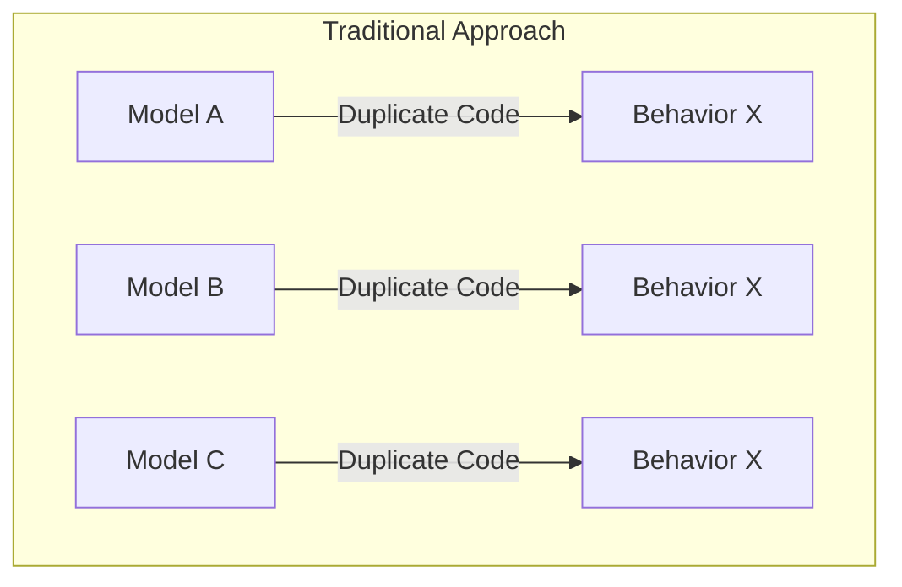

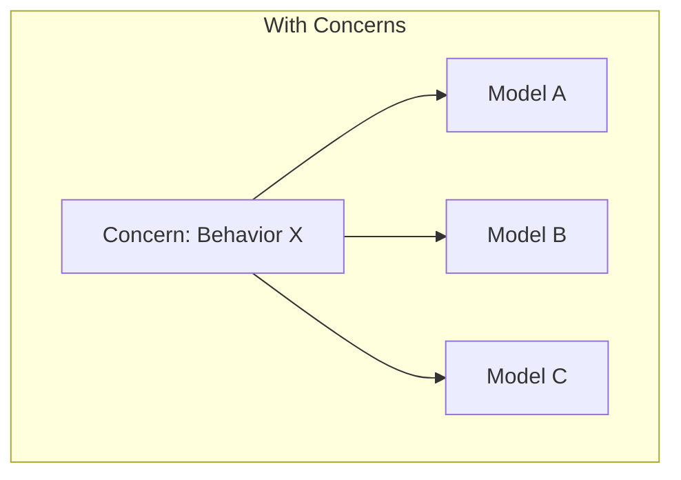

Without Concerns, shared behavior gets duplicated across models. With Concerns, you extract that behavior once and include it wherever needed.

### The Concern Lifecycle

Understanding how Concerns integrate into Rails classes:

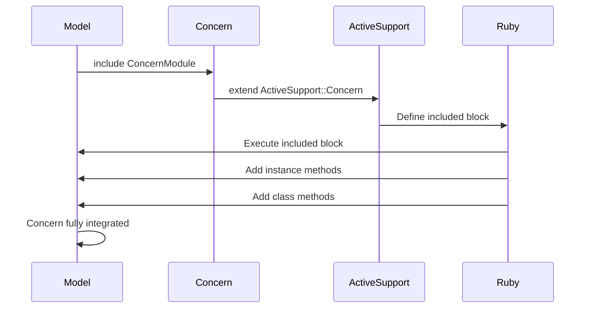

When you include a Concern in a model, Rails executes the `included` block in the context of the including class, adds instance methods, and makes class methods available through `ClassMethods` module.

---

## Getting Started

### Directory Structure

Rails provides conventional locations for Concerns:

```plaintext
app/
  models/
    concerns/           # Model concerns
      searchable.rb
      taggable.rb
      auditable.rb
    user.rb
    post.rb
    comment.rb
  controllers/
    concerns/           # Controller concerns
      authenticatable.rb
      paginatable.rb
      api_respondable.rb
    users_controller.rb
    posts_controller.rb
```

Rails automatically loads files from these directories, so you can use Concerns immediately after creating them.

### Basic Concern Structure

Here's the anatomy of a Rails Concern:

```ruby
# app/models/concerns/searchable.rb

# Concern for adding search functionality to models
# Include this module in any model that needs full-text search
module Searchable
  # Extend ActiveSupport::Concern for Rails integration
  extend ActiveSupport::Concern

  # Code in the included block runs when the module is included
  # Use this for validations, callbacks, scopes, and associations
  included do
    # Add a scope for searching by a specific field
    scope :search, ->(query) { where("name ILIKE ?", "%#{query}%") }
  end

  # Instance methods go directly in the module body
  # These methods are available on model instances

  # Check if the record matches a search query
  def matches_search?(query)
    name.downcase.include?(query.downcase)
  end

  # Class methods are defined in this special module
  # They become available as Model.method_name
  class_methods do
    # Perform a fuzzy search across multiple columns
    def fuzzy_search(query, columns: [:name])
      conditions = columns.map { |col| "#{col} ILIKE ?" }.join(" OR ")
      values = columns.map { "%#{query}%" }
      where(conditions, *values)
    end
  end
end
```

Include the Concern in your model:

```ruby
# app/models/user.rb

class User < ApplicationRecord
  # Include the Searchable concern
  include Searchable
  
  # Other model code
  validates :name, presence: true
  validates :email, presence: true, uniqueness: true
end
```

Now you can use the search functionality:

```ruby
# Search users by name
User.search("john")

# Use fuzzy search across multiple columns
User.fuzzy_search("john", columns: [:name, :email])

# Check if a user matches a search query
user.matches_search?("john")
```

---

## Common Model Concerns

Let's explore practical Concerns that solve real problems in Rails applications.

### Taggable Concern

Add tagging functionality to any model:

```ruby
# app/models/concerns/taggable.rb

# Concern for adding tagging functionality to models
# Supports polymorphic associations with a Tag model
module Taggable
  extend ActiveSupport::Concern

  # Set up associations and validations when included
  included do
    # Polymorphic association to taggings join table
    has_many :taggings, as: :taggable, dependent: :destroy
    
    # Access tags through the taggings association
    has_many :tags, through: :taggings
    
    # Scope to find records with specific tags
    scope :tagged_with, ->(tag_name) {
      joins(:tags).where(tags: { name: tag_name })
    }
    
    # Scope to find records with any of the given tags
    scope :tagged_with_any, ->(tag_names) {
      joins(:tags).where(tags: { name: tag_names }).distinct
    }
    
    # Scope to find records with all of the given tags
    scope :tagged_with_all, ->(tag_names) {
      tag_count = tag_names.size
      joins(:tags)
        .where(tags: { name: tag_names })
        .group("#{table_name}.id")
        .having("COUNT(DISTINCT tags.id) = ?", tag_count)
    }
  end

  # Get tag names as a comma-separated string
  def tag_list
    tags.pluck(:name).join(", ")
  end

  # Set tags from a comma-separated string
  def tag_list=(names)
    # Parse the comma-separated tag names
    tag_names = names.split(",").map(&:strip).reject(&:blank?)
    
    # Find or create each tag and assign them
    self.tags = tag_names.map do |name|
      Tag.find_or_create_by(name: name.downcase)
    end
  end

  # Add a single tag to the record
  def add_tag(name)
    tag = Tag.find_or_create_by(name: name.downcase)
    tags << tag unless tags.include?(tag)
  end

  # Remove a single tag from the record
  def remove_tag(name)
    tag = Tag.find_by(name: name.downcase)
    tags.delete(tag) if tag
  end

  # Check if the record has a specific tag
  def tagged_with?(name)
    tags.exists?(name: name.downcase)
  end

  class_methods do
    # Get all unique tags used by this model
    def all_tags
      Tag.joins(:taggings)
         .where(taggings: { taggable_type: name })
         .distinct
    end

    # Get tag counts for this model
    def tag_counts
      Tag.joins(:taggings)
         .where(taggings: { taggable_type: name })
         .group("tags.name")
         .count
    end

    # Find the most popular tags for this model
    def popular_tags(limit: 10)
      Tag.joins(:taggings)
         .where(taggings: { taggable_type: name })
         .group("tags.id", "tags.name")
         .order("COUNT(*) DESC")
         .limit(limit)
    end
  end
end
```

Supporting models for the Taggable concern:

```ruby
# app/models/tag.rb

class Tag < ApplicationRecord
  # Tags can be attached to multiple taggable records
  has_many :taggings, dependent: :destroy
  
  # Ensure tag names are unique and present
  validates :name, presence: true, uniqueness: { case_sensitive: false }
  
  # Normalize tag names before saving
  before_save :normalize_name
  
  private
  
  # Downcase and strip whitespace from tag names
  def normalize_name
    self.name = name.downcase.strip
  end
end
```

```ruby
# app/models/tagging.rb

class Tagging < ApplicationRecord
  # Belongs to a tag
  belongs_to :tag
  
  # Polymorphic association to any taggable model
  belongs_to :taggable, polymorphic: true
  
  # Ensure unique tag per taggable record
  validates :tag_id, uniqueness: { scope: [:taggable_type, :taggable_id] }
end
```

Use the Taggable concern in your models:

```ruby
# app/models/post.rb

class Post < ApplicationRecord
  # Add tagging functionality
  include Taggable
  
  belongs_to :author, class_name: "User"
  
  validates :title, presence: true
  validates :content, presence: true
end
```

```ruby
# app/models/article.rb

class Article < ApplicationRecord
  # Add tagging functionality
  include Taggable
  
  belongs_to :writer, class_name: "User"
  
  validates :headline, presence: true
  validates :body, presence: true
end
```

### Auditable Concern

Track changes to records with an audit trail:

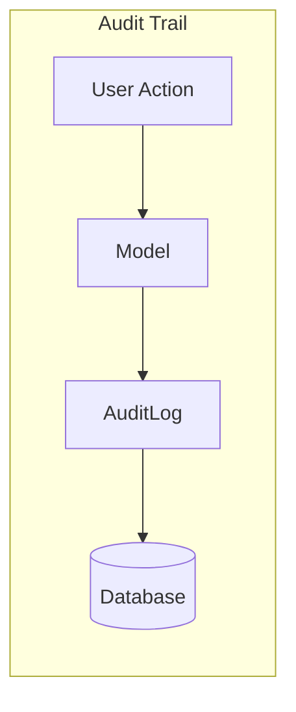

```ruby
# app/models/concerns/auditable.rb

# Concern for tracking changes to model records
# Creates an audit trail of all create, update, and delete operations
module Auditable
  extend ActiveSupport::Concern

  # Set up callbacks when included
  included do
    # Create audit log entry after record creation
    after_create :log_creation
    
    # Create audit log entry after record update
    after_update :log_update
    
    # Create audit log entry before record deletion
    before_destroy :log_deletion
    
    # Store the user who made changes (set via controller)
    attr_accessor :audit_user
  end

  # Log that a record was created
  def log_creation
    create_audit_log(
      action: "create",
      changes: attributes.except("id", "created_at", "updated_at")
    )
  end

  # Log what changed during an update
  def log_update
    # Only log if there were actual changes
    return if saved_changes.except("updated_at").empty?
    
    create_audit_log(
      action: "update",
      changes: format_changes(saved_changes)
    )
  end

  # Log that a record is being deleted
  def log_deletion
    create_audit_log(
      action: "delete",
      changes: attributes.except("created_at", "updated_at")
    )
  end

  # Get all audit logs for this record
  def audit_logs
    AuditLog.where(
      auditable_type: self.class.name,
      auditable_id: id
    ).order(created_at: :desc)
  end

  # Get the most recent audit log entry
  def last_audit
    audit_logs.first
  end

  # Check who last modified this record
  def last_modified_by
    last_audit&.user
  end

  private

  # Create an audit log entry
  def create_audit_log(action:, changes:)
    AuditLog.create!(
      auditable_type: self.class.name,
      auditable_id: id,
      action: action,
      changes: changes,
      user: audit_user || Current.user,
      ip_address: Current.ip_address,
      user_agent: Current.user_agent
    )
  end

  # Format the saved_changes hash for storage
  def format_changes(changes)
    changes.except("updated_at").transform_values do |values|
      { from: values[0], to: values[1] }
    end
  end

  class_methods do
    # Find all audit logs for this model type
    def audit_history
      AuditLog.where(auditable_type: name).order(created_at: :desc)
    end

    # Find records modified by a specific user
    def modified_by(user)
      joins("INNER JOIN audit_logs ON audit_logs.auditable_id = #{table_name}.id")
        .where(audit_logs: { auditable_type: name, user_id: user.id })
        .distinct
    end

    # Find records modified within a date range
    def modified_between(start_date, end_date)
      joins("INNER JOIN audit_logs ON audit_logs.auditable_id = #{table_name}.id")
        .where(audit_logs: { 
          auditable_type: name, 
          created_at: start_date..end_date 
        })
        .distinct
    end
  end
end
```

The AuditLog model:

```ruby
# app/models/audit_log.rb

class AuditLog < ApplicationRecord
  # Who made the change
  belongs_to :user, optional: true
  
  # What was changed (polymorphic)
  belongs_to :auditable, polymorphic: true, optional: true
  
  # Store changes as JSON
  serialize :changes, coder: JSON
  
  # Validate required fields
  validates :action, presence: true
  validates :auditable_type, presence: true
  
  # Scopes for filtering audit logs
  scope :creates, -> { where(action: "create") }
  scope :updates, -> { where(action: "update") }
  scope :deletes, -> { where(action: "delete") }
  scope :recent, -> { order(created_at: :desc).limit(100) }
  scope :by_user, ->(user) { where(user: user) }
  
  # Human-readable description of the change
  def description
    case action
    when "create"
      "Created #{auditable_type} ##{auditable_id}"
    when "update"
      changed_fields = changes.keys.join(", ")
      "Updated #{auditable_type} ##{auditable_id} (#{changed_fields})"
    when "delete"
      "Deleted #{auditable_type} ##{auditable_id}"
    else
      "Unknown action on #{auditable_type} ##{auditable_id}"
    end
  end
end
```

### Sluggable Concern

Generate URL-friendly slugs for records:

```ruby
# app/models/concerns/sluggable.rb

# Concern for generating URL-friendly slugs
# Automatically creates slugs from a specified attribute
module Sluggable
  extend ActiveSupport::Concern

  # Class-level configuration
  included do
    # Generate slug before validation
    before_validation :generate_slug, if: :should_generate_slug?
    
    # Validate slug uniqueness
    validates :slug, presence: true, uniqueness: true
    
    # Class attribute to store the source field for slugs
    class_attribute :slug_source, default: :name
    class_attribute :slug_scope, default: nil
  end

  # Override to_param to use slug in URLs
  def to_param
    slug
  end

  # Regenerate the slug (useful after title changes)
  def regenerate_slug!
    self.slug = nil
    generate_slug
    save!
  end

  private

  # Only generate slug if it's blank
  def should_generate_slug?
    slug.blank? && send(self.class.slug_source).present?
  end

  # Generate a unique, URL-friendly slug
  def generate_slug
    # Get the base slug from the source attribute
    base_slug = send(self.class.slug_source).to_s.parameterize
    
    # Ensure uniqueness by appending a number if needed
    self.slug = ensure_unique_slug(base_slug)
  end

  # Append a number to make the slug unique
  def ensure_unique_slug(base_slug)
    slug_candidate = base_slug
    counter = 1
    
    # Build the uniqueness scope
    scope = self.class.where.not(id: id)
    scope = scope.where(self.class.slug_scope => send(self.class.slug_scope)) if self.class.slug_scope
    
    # Keep incrementing until we find a unique slug
    while scope.exists?(slug: slug_candidate)
      slug_candidate = "#{base_slug}-#{counter}"
      counter += 1
    end
    
    slug_candidate
  end

  class_methods do
    # Configure the source attribute for slug generation
    def slugify(source_attribute, scope: nil)
      self.slug_source = source_attribute
      self.slug_scope = scope
    end

    # Find a record by its slug
    def find_by_slug!(slug)
      find_by!(slug: slug)
    end

    # Alias for ActiveRecord find_by
    def find_by_slug(slug)
      find_by(slug: slug)
    end
  end
end
```

Use it in your models:

```ruby
# app/models/post.rb

class Post < ApplicationRecord
  include Sluggable
  
  # Generate slugs from the title attribute
  slugify :title
  
  belongs_to :author, class_name: "User"
  validates :title, presence: true
end
```

```ruby
# app/models/category.rb

class Category < ApplicationRecord
  include Sluggable
  
  # Generate slugs from name, scoped to parent
  slugify :name, scope: :parent_id
  
  belongs_to :parent, class_name: "Category", optional: true
  has_many :children, class_name: "Category", foreign_key: :parent_id
  
  validates :name, presence: true
end
```

### Publishable Concern

Add publishing workflow to content models:

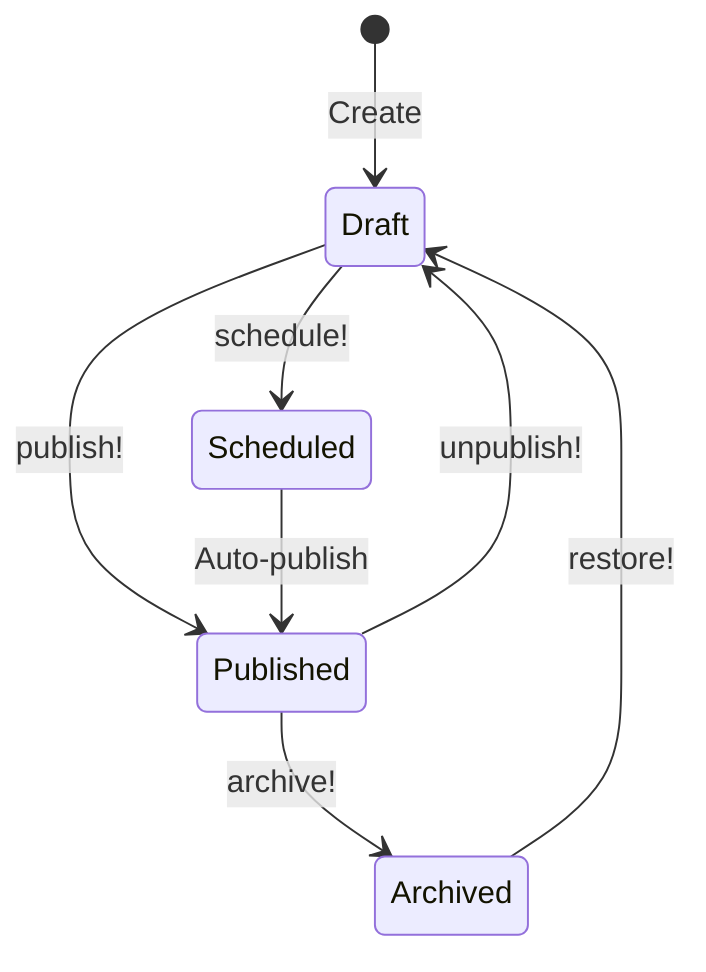

```ruby
# app/models/concerns/publishable.rb

# Concern for adding publishing workflow to models
# Supports draft, scheduled, published, and archived states
module Publishable
  extend ActiveSupport::Concern

  # Define valid states as a constant
  STATES = %w[draft scheduled published archived].freeze

  included do
    # Validate state is one of the allowed values
    validates :state, inclusion: { in: STATES }
    
    # Set default state for new records
    after_initialize :set_default_state, if: :new_record?
    
    # Scopes for filtering by state
    scope :drafts, -> { where(state: "draft") }
    scope :scheduled, -> { where(state: "scheduled") }
    scope :published, -> { where(state: "published") }
    scope :archived, -> { where(state: "archived") }
    
    # Scope for publicly visible content
    scope :visible, -> { 
      where(state: "published")
        .where("published_at <= ?", Time.current) 
    }
    
    # Scope for content ready to be auto-published
    scope :ready_to_publish, -> {
      where(state: "scheduled")
        .where("publish_at <= ?", Time.current)
    }
  end

  # Publish the record immediately
  def publish!
    update!(
      state: "published",
      published_at: Time.current,
      publish_at: nil
    )
  end

  # Revert to draft state
  def unpublish!
    update!(
      state: "draft",
      published_at: nil,
      publish_at: nil
    )
  end

  # Schedule for future publication
  def schedule!(publish_time)
    raise ArgumentError, "Publish time must be in the future" if publish_time <= Time.current
    
    update!(
      state: "scheduled",
      publish_at: publish_time,
      published_at: nil
    )
  end

  # Archive the record
  def archive!
    update!(
      state: "archived",
      archived_at: Time.current
    )
  end

  # Restore from archived state
  def restore!
    update!(
      state: "draft",
      archived_at: nil
    )
  end

  # State checking methods
  def draft?
    state == "draft"
  end

  def scheduled?
    state == "scheduled"
  end

  def published?
    state == "published"
  end

  def archived?
    state == "archived"
  end

  # Check if content is publicly visible
  def visible?
    published? && published_at.present? && published_at <= Time.current
  end

  # Check if ready for auto-publication
  def ready_to_publish?
    scheduled? && publish_at.present? && publish_at <= Time.current
  end

  private

  # Set the default state for new records
  def set_default_state
    self.state ||= "draft"
  end

  class_methods do
    # Auto-publish all scheduled content that's ready
    def auto_publish_scheduled!
      ready_to_publish.find_each do |record|
        record.publish!
        Rails.logger.info "Auto-published #{name} ##{record.id}"
      end
    end

    # Get content statistics
    def publishing_stats
      {
        draft: drafts.count,
        scheduled: scheduled.count,
        published: published.count,
        archived: archived.count,
        total: count
      }
    end
  end
end
```

---

## Controller Concerns

Controller Concerns help organize authentication, authorization, and response handling.

### Authenticatable Concern

Handle API authentication across controllers:

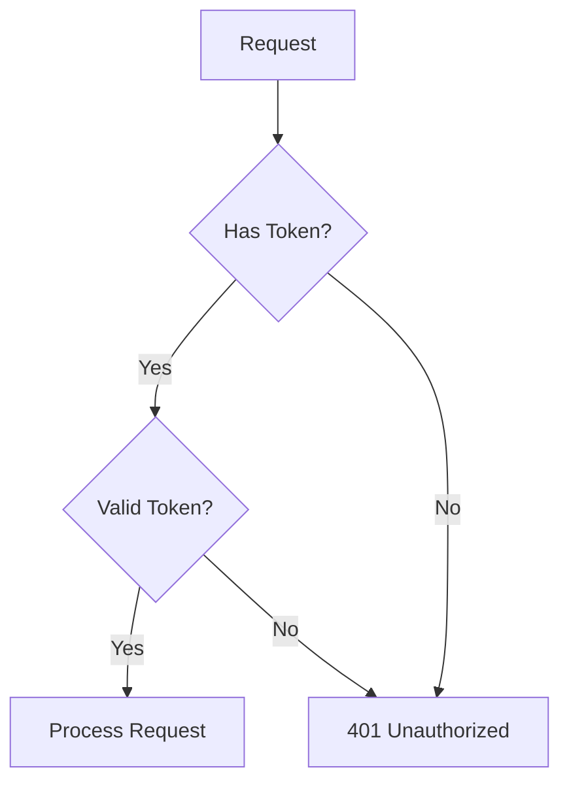

```ruby
# app/controllers/concerns/authenticatable.rb

# Concern for handling authentication in controllers
# Supports both session-based and token-based authentication
module Authenticatable
  extend ActiveSupport::Concern

  included do
    # Make current_user available to views
    helper_method :current_user, :user_signed_in?
    
    # Handle authentication errors
    rescue_from AuthenticationError, with: :handle_authentication_error
  end

  # Get the currently authenticated user
  def current_user
    @current_user ||= authenticate_user
  end

  # Check if a user is signed in
  def user_signed_in?
    current_user.present?
  end

  # Require authentication for the current action
  def authenticate_user!
    raise AuthenticationError, "Authentication required" unless user_signed_in?
  end

  private

  # Authenticate the user from session or token
  def authenticate_user
    authenticate_from_session || authenticate_from_token
  end

  # Try to authenticate from session (web requests)
  def authenticate_from_session
    return nil unless session[:user_id]
    
    User.find_by(id: session[:user_id])
  end

  # Try to authenticate from bearer token (API requests)
  def authenticate_from_token
    # Extract token from Authorization header
    token = extract_bearer_token
    return nil unless token
    
    # Find user by API token
    User.find_by(api_token: token)
  end

  # Extract bearer token from Authorization header
  def extract_bearer_token
    auth_header = request.headers["Authorization"]
    return nil unless auth_header&.start_with?("Bearer ")
    
    auth_header.split(" ").last
  end

  # Handle authentication errors
  def handle_authentication_error(exception)
    if request.format.json?
      render json: { error: exception.message }, status: :unauthorized
    else
      flash[:alert] = exception.message
      redirect_to login_path
    end
  end

  class_methods do
    # DSL for requiring authentication on specific actions
    def authenticate(*actions)
      before_action :authenticate_user!, only: actions
    end

    # DSL for skipping authentication on specific actions
    def skip_authentication(*actions)
      skip_before_action :authenticate_user!, only: actions
    end
  end
end
```

Custom exception class:

```ruby
# app/errors/authentication_error.rb

# Custom exception for authentication failures
class AuthenticationError < StandardError
  def initialize(message = "Authentication failed")
    super(message)
  end
end
```

### Paginatable Concern

Add pagination support to controllers:

```ruby
# app/controllers/concerns/paginatable.rb

# Concern for adding pagination to controller actions
# Works with Kaminari or Pagy pagination gems
module Paginatable
  extend ActiveSupport::Concern

  # Default pagination settings
  DEFAULT_PER_PAGE = 25
  MAX_PER_PAGE = 100

  included do
    # Make pagination helpers available to views
    helper_method :page_number, :per_page
  end

  # Get the current page number from params
  def page_number
    page = params[:page].to_i
    page.positive? ? page : 1
  end

  # Get items per page from params with limits
  def per_page
    requested = params[:per_page].to_i
    
    if requested.positive?
      [requested, MAX_PER_PAGE].min
    else
      DEFAULT_PER_PAGE
    end
  end

  # Paginate a collection (works with Kaminari)
  def paginate(collection)
    collection.page(page_number).per(per_page)
  end

  # Build pagination metadata for API responses
  def pagination_metadata(collection)
    {
      current_page: collection.current_page,
      total_pages: collection.total_pages,
      total_count: collection.total_count,
      per_page: collection.limit_value,
      next_page: collection.next_page,
      prev_page: collection.prev_page
    }
  end

  # Add pagination headers to response (API best practice)
  def set_pagination_headers(collection)
    response.headers["X-Page"] = collection.current_page.to_s
    response.headers["X-Per-Page"] = collection.limit_value.to_s
    response.headers["X-Total"] = collection.total_count.to_s
    response.headers["X-Total-Pages"] = collection.total_pages.to_s
    
    # Add Link header for navigation
    links = []
    links << link_header(collection.current_page - 1, "prev") if collection.prev_page
    links << link_header(collection.current_page + 1, "next") if collection.next_page
    links << link_header(1, "first")
    links << link_header(collection.total_pages, "last")
    
    response.headers["Link"] = links.join(", ")
  end

  private

  # Build a single Link header entry
  def link_header(page, rel)
    url = url_for(request.query_parameters.merge(page: page))
    "<#{url}>; rel=\"#{rel}\""
  end

  class_methods do
    # Configure pagination defaults for a controller
    def paginate_with(per_page: DEFAULT_PER_PAGE, max_per_page: MAX_PER_PAGE)
      define_method(:default_per_page) { per_page }
      define_method(:max_per_page) { max_per_page }
    end
  end
end
```

### API Respondable Concern

Standardize API responses:

```ruby
# app/controllers/concerns/api_respondable.rb

# Concern for standardizing API responses
# Provides consistent JSON structure across all API endpoints
module ApiRespondable
  extend ActiveSupport::Concern

  included do
    # Set default response format to JSON for API controllers
    respond_to :json
    
    # Handle common errors with standard responses
    rescue_from ActiveRecord::RecordNotFound, with: :render_not_found
    rescue_from ActiveRecord::RecordInvalid, with: :render_unprocessable
    rescue_from ActionController::ParameterMissing, with: :render_bad_request
  end

  # Render a successful response with data
  def render_success(data, status: :ok, meta: {})
    response_body = { success: true, data: data }
    response_body[:meta] = meta if meta.present?
    
    render json: response_body, status: status
  end

  # Render a created response
  def render_created(data, location: nil)
    response_body = { success: true, data: data }
    
    render json: response_body, status: :created, location: location
  end

  # Render an error response
  def render_error(message, status: :unprocessable_entity, errors: [])
    render json: {
      success: false,
      error: {
        message: message,
        details: errors
      }
    }, status: status
  end

  # Render validation errors
  def render_validation_errors(record)
    render json: {
      success: false,
      error: {
        message: "Validation failed",
        details: format_validation_errors(record)
      }
    }, status: :unprocessable_entity
  end

  # Render a paginated collection
  def render_collection(collection, serializer: nil, meta: {})
    # Apply pagination if the concern is included
    collection = paginate(collection) if respond_to?(:paginate)
    
    # Serialize the collection
    data = serializer ? collection.map { |r| serializer.new(r).as_json } : collection
    
    # Build metadata
    response_meta = meta.merge(pagination_metadata(collection)) if respond_to?(:pagination_metadata)
    
    render_success(data, meta: response_meta || meta)
  end

  private

  # Handle record not found errors
  def render_not_found(exception)
    render_error("Resource not found", status: :not_found)
  end

  # Handle validation errors
  def render_unprocessable(exception)
    render_validation_errors(exception.record)
  end

  # Handle missing parameters
  def render_bad_request(exception)
    render_error("Missing parameter: #{exception.param}", status: :bad_request)
  end

  # Format ActiveRecord validation errors
  def format_validation_errors(record)
    record.errors.map do |error|
      {
        field: error.attribute,
        message: error.message,
        full_message: error.full_message
      }
    end
  end

  class_methods do
    # No class methods needed for this concern
  end
end
```

---

## Advanced Concern Patterns

### Concern Dependencies

When one Concern depends on another:

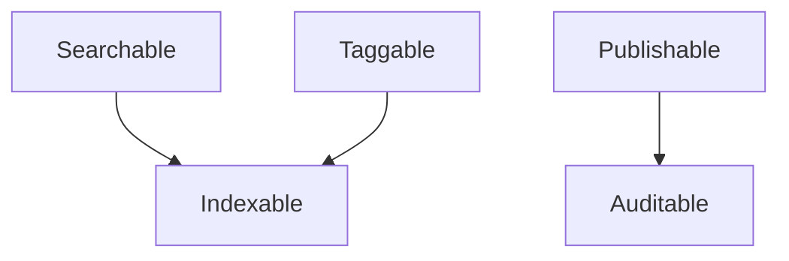

```ruby
# app/models/concerns/indexable.rb

# Base concern for models that need to be indexed
# Provides hooks for search indexing
module Indexable
  extend ActiveSupport::Concern

  included do
    # Reindex after save
    after_commit :schedule_reindex, on: [:create, :update]
    
    # Remove from index after destroy
    after_commit :remove_from_index, on: :destroy
  end

  # Queue a reindex job
  def schedule_reindex
    IndexRecordJob.perform_later(self.class.name, id)
  end

  # Remove this record from the search index
  def remove_from_index
    RemoveFromIndexJob.perform_later(self.class.name, id)
  end

  # Build the indexable document
  def to_indexable_document
    raise NotImplementedError, "Subclasses must implement to_indexable_document"
  end

  class_methods do
    # Reindex all records of this type
    def reindex_all!
      find_each(&:schedule_reindex)
    end
  end
end
```

```ruby
# app/models/concerns/searchable.rb

# Enhanced Searchable concern that depends on Indexable
module Searchable
  extend ActiveSupport::Concern

  # Include the dependency
  included do
    include Indexable
    
    # Additional searchable-specific setup
    scope :search, ->(query) {
      where("search_vector @@ plainto_tsquery(?)", query)
    }
  end

  # Implement the indexable document
  def to_indexable_document
    {
      id: id,
      type: self.class.name,
      content: searchable_content,
      updated_at: updated_at
    }
  end

  # Override in including class to specify searchable fields
  def searchable_content
    raise NotImplementedError, "Subclasses must implement searchable_content"
  end

  class_methods do
    # Configure searchable fields
    def searchable(*fields)
      define_method(:searchable_content) do
        fields.map { |f| send(f) }.compact.join(" ")
      end
    end
  end
end
```

Use it with field configuration:

```ruby
# app/models/article.rb

class Article < ApplicationRecord
  include Searchable
  
  # Configure which fields are searchable
  searchable :title, :body, :summary
  
  belongs_to :author, class_name: "User"
  
  validates :title, presence: true
  validates :body, presence: true
end
```

### Conditional Concerns

Apply Concerns based on conditions:

```ruby
# app/models/concerns/soft_deletable.rb

# Concern for soft deletion functionality
# Marks records as deleted without removing them from the database
module SoftDeletable
  extend ActiveSupport::Concern

  included do
    # Default scope excludes soft-deleted records
    default_scope { where(deleted_at: nil) }
    
    # Scope to include deleted records
    scope :with_deleted, -> { unscope(where: :deleted_at) }
    
    # Scope for only deleted records
    scope :only_deleted, -> { unscope(where: :deleted_at).where.not(deleted_at: nil) }
  end

  # Soft delete the record
  def soft_delete!
    update_columns(deleted_at: Time.current)
  end

  # Restore a soft-deleted record
  def restore!
    update_columns(deleted_at: nil)
  end

  # Check if record is soft-deleted
  def deleted?
    deleted_at.present?
  end

  # Override destroy to soft delete instead
  def destroy
    if self.class.soft_delete_enabled?
      soft_delete!
    else
      super
    end
  end

  class_methods do
    # Check if soft delete is enabled
    def soft_delete_enabled?
      @soft_delete_enabled != false
    end

    # Disable soft delete (use real delete)
    def disable_soft_delete!
      @soft_delete_enabled = false
    end

    # Enable soft delete
    def enable_soft_delete!
      @soft_delete_enabled = true
    end

    # Restore a record by ID
    def restore(id)
      with_deleted.find(id).restore!
    end

    # Permanently delete soft-deleted records older than given time
    def purge_deleted!(older_than: 30.days.ago)
      only_deleted
        .where("deleted_at < ?", older_than)
        .delete_all
    end
  end
end
```

### Configurable Concerns

Concerns with configuration options:

```ruby
# app/models/concerns/rateable.rb

# Concern for adding rating functionality to models
# Configurable for different rating scales and behaviors
module Rateable
  extend ActiveSupport::Concern

  # Default configuration
  DEFAULT_CONFIG = {
    min_rating: 1,
    max_rating: 5,
    allow_half_ratings: false,
    require_review: false
  }.freeze

  included do
    # Polymorphic association to ratings
    has_many :ratings, as: :rateable, dependent: :destroy
    
    # Class-level configuration storage
    class_attribute :rating_config, default: DEFAULT_CONFIG.dup
  end

  # Calculate average rating
  def average_rating
    return nil if ratings.empty?
    
    ratings.average(:value).to_f.round(2)
  end

  # Get rating distribution
  def rating_distribution
    ratings.group(:value).count
  end

  # Get total number of ratings
  def ratings_count
    ratings.count
  end

  # Rate this record
  def rate!(user:, value:, review: nil)
    # Validate rating value
    validate_rating_value!(value)
    
    # Check if review is required
    if rating_config[:require_review] && review.blank?
      raise ArgumentError, "Review is required"
    end
    
    # Find or initialize rating for this user
    rating = ratings.find_or_initialize_by(user: user)
    rating.value = value
    rating.review = review
    rating.save!
    rating
  end

  # Get a user's rating for this record
  def rating_by(user)
    ratings.find_by(user: user)
  end

  # Check if a user has rated this record
  def rated_by?(user)
    ratings.exists?(user: user)
  end

  private

  # Validate the rating value against configuration
  def validate_rating_value!(value)
    config = rating_config
    
    unless value.between?(config[:min_rating], config[:max_rating])
      raise ArgumentError, "Rating must be between #{config[:min_rating]} and #{config[:max_rating]}"
    end
    
    if !config[:allow_half_ratings] && value != value.to_i
      raise ArgumentError, "Half ratings are not allowed"
    end
  end

  class_methods do
    # Configure rating behavior
    def rateable_config(options = {})
      self.rating_config = DEFAULT_CONFIG.merge(options)
    end

    # Get top-rated records
    def top_rated(limit: 10, min_ratings: 5)
      joins(:ratings)
        .group("#{table_name}.id")
        .having("COUNT(ratings.id) >= ?", min_ratings)
        .order("AVG(ratings.value) DESC")
        .limit(limit)
    end

    # Get records with ratings in a range
    def rated_between(min, max)
      joins(:ratings)
        .group("#{table_name}.id")
        .having("AVG(ratings.value) BETWEEN ? AND ?", min, max)
    end
  end
end
```

Configure it per model:

```ruby
# app/models/product.rb

class Product < ApplicationRecord
  include Rateable
  
  # Configure 1-5 star ratings with half stars
  rateable_config(
    min_rating: 1,
    max_rating: 5,
    allow_half_ratings: true,
    require_review: false
  )
  
  validates :name, presence: true
  validates :price, presence: true, numericality: { greater_than: 0 }
end
```

```ruby
# app/models/course.rb

class Course < ApplicationRecord
  include Rateable
  
  # Configure 1-10 ratings with required reviews
  rateable_config(
    min_rating: 1,
    max_rating: 10,
    allow_half_ratings: false,
    require_review: true
  )
  
  belongs_to :instructor, class_name: "User"
  validates :title, presence: true
end
```

---

## Testing Concerns

Testing Concerns requires a thoughtful approach since they're modules, not classes.

### Shared Examples with RSpec

```ruby
# spec/support/concerns/taggable_spec.rb

# Shared examples for testing the Taggable concern
RSpec.shared_examples "taggable" do
  # Get the factory name from the described class
  let(:factory_name) { described_class.model_name.singular.to_sym }
  let(:taggable) { create(factory_name) }

  describe "associations" do
    it "has many taggings" do
      expect(described_class.reflect_on_association(:taggings).macro).to eq(:has_many)
    end

    it "has many tags through taggings" do
      association = described_class.reflect_on_association(:tags)
      expect(association.macro).to eq(:has_many)
      expect(association.options[:through]).to eq(:taggings)
    end
  end

  describe "#tag_list" do
    context "when record has no tags" do
      it "returns empty string" do
        expect(taggable.tag_list).to eq("")
      end
    end

    context "when record has tags" do
      before do
        taggable.add_tag("ruby")
        taggable.add_tag("rails")
      end

      it "returns comma-separated tag names" do
        expect(taggable.tag_list).to include("ruby")
        expect(taggable.tag_list).to include("rails")
      end
    end
  end

  describe "#tag_list=" do
    it "creates tags from comma-separated string" do
      taggable.tag_list = "ruby, rails, testing"
      taggable.save!
      
      expect(taggable.tags.count).to eq(3)
      expect(taggable.tags.pluck(:name)).to contain_exactly("ruby", "rails", "testing")
    end

    it "handles whitespace in tag names" do
      taggable.tag_list = "  ruby  ,  rails  "
      taggable.save!
      
      expect(taggable.tags.pluck(:name)).to contain_exactly("ruby", "rails")
    end

    it "ignores blank tags" do
      taggable.tag_list = "ruby,,rails,"
      taggable.save!
      
      expect(taggable.tags.count).to eq(2)
    end
  end

  describe "#add_tag" do
    it "adds a new tag" do
      taggable.add_tag("ruby")
      
      expect(taggable.tags.count).to eq(1)
      expect(taggable.tags.first.name).to eq("ruby")
    end

    it "does not duplicate tags" do
      taggable.add_tag("ruby")
      taggable.add_tag("ruby")
      
      expect(taggable.tags.count).to eq(1)
    end

    it "normalizes tag names to lowercase" do
      taggable.add_tag("RUBY")
      
      expect(taggable.tags.first.name).to eq("ruby")
    end
  end

  describe "#remove_tag" do
    before { taggable.add_tag("ruby") }

    it "removes an existing tag" do
      taggable.remove_tag("ruby")
      
      expect(taggable.tags.count).to eq(0)
    end

    it "handles non-existent tags gracefully" do
      expect { taggable.remove_tag("nonexistent") }.not_to raise_error
    end
  end

  describe "#tagged_with?" do
    before { taggable.add_tag("ruby") }

    it "returns true for existing tags" do
      expect(taggable.tagged_with?("ruby")).to be true
    end

    it "returns false for non-existent tags" do
      expect(taggable.tagged_with?("python")).to be false
    end

    it "is case-insensitive" do
      expect(taggable.tagged_with?("RUBY")).to be true
    end
  end

  describe ".tagged_with" do
    let!(:tagged_record) { create(factory_name).tap { |r| r.add_tag("ruby") } }
    let!(:untagged_record) { create(factory_name) }

    it "returns records with the specified tag" do
      results = described_class.tagged_with("ruby")
      
      expect(results).to include(tagged_record)
      expect(results).not_to include(untagged_record)
    end
  end

  describe ".tagged_with_any" do
    let!(:ruby_record) { create(factory_name).tap { |r| r.add_tag("ruby") } }
    let!(:python_record) { create(factory_name).tap { |r| r.add_tag("python") } }
    let!(:untagged_record) { create(factory_name) }

    it "returns records with any of the specified tags" do
      results = described_class.tagged_with_any(["ruby", "python"])
      
      expect(results).to include(ruby_record, python_record)
      expect(results).not_to include(untagged_record)
    end
  end

  describe ".tagged_with_all" do
    let!(:both_tags) do
      create(factory_name).tap do |r|
        r.add_tag("ruby")
        r.add_tag("rails")
      end
    end
    let!(:one_tag) { create(factory_name).tap { |r| r.add_tag("ruby") } }

    it "returns only records with all specified tags" do
      results = described_class.tagged_with_all(["ruby", "rails"])
      
      expect(results).to include(both_tags)
      expect(results).not_to include(one_tag)
    end
  end
end
```

Include shared examples in model specs:

```ruby
# spec/models/post_spec.rb

require "rails_helper"

RSpec.describe Post, type: :model do
  # Include shared taggable examples
  it_behaves_like "taggable"

  # Model-specific tests
  describe "validations" do
    it { should validate_presence_of(:title) }
    it { should validate_presence_of(:content) }
  end

  describe "associations" do
    it { should belong_to(:author).class_name("User") }
  end
end
```

```ruby
# spec/models/article_spec.rb

require "rails_helper"

RSpec.describe Article, type: :model do
  # Include shared taggable examples
  it_behaves_like "taggable"

  # Model-specific tests
  describe "validations" do
    it { should validate_presence_of(:headline) }
    it { should validate_presence_of(:body) }
  end
end
```

### Testing Concerns in Isolation

```ruby
# spec/models/concerns/sluggable_spec.rb

require "rails_helper"

RSpec.describe Sluggable do
  # Create a test class that includes the concern
  let(:test_class) do
    Class.new(ApplicationRecord) do
      self.table_name = "posts"  # Use existing table
      include Sluggable
      slugify :title
    end
  end

  # Create a test instance
  let(:instance) { test_class.new(title: "Hello World", content: "Test content") }

  describe "#generate_slug" do
    it "generates a slug from the configured source attribute" do
      instance.valid?
      
      expect(instance.slug).to eq("hello-world")
    end

    it "handles special characters" do
      instance.title = "Hello & Goodbye!"
      instance.valid?
      
      expect(instance.slug).to eq("hello-goodbye")
    end

    it "generates unique slugs" do
      # Create first record
      first = test_class.create!(title: "Hello World", content: "First")
      
      # Create second record with same title
      second = test_class.new(title: "Hello World", content: "Second")
      second.valid?
      
      expect(second.slug).to eq("hello-world-1")
    end
  end

  describe "#to_param" do
    it "returns the slug for URL generation" do
      instance.slug = "hello-world"
      
      expect(instance.to_param).to eq("hello-world")
    end
  end

  describe ".find_by_slug" do
    it "finds record by slug" do
      created = test_class.create!(title: "Hello World", content: "Test")
      found = test_class.find_by_slug("hello-world")
      
      expect(found).to eq(created)
    end

    it "returns nil for non-existent slug" do
      result = test_class.find_by_slug("nonexistent")
      
      expect(result).to be_nil
    end
  end

  describe ".find_by_slug!" do
    it "finds record by slug" do
      created = test_class.create!(title: "Hello World", content: "Test")
      found = test_class.find_by_slug!("hello-world")
      
      expect(found).to eq(created)
    end

    it "raises error for non-existent slug" do
      expect { test_class.find_by_slug!("nonexistent") }
        .to raise_error(ActiveRecord::RecordNotFound)
    end
  end
end
```

---

## Best Practices

### When to Use Concerns

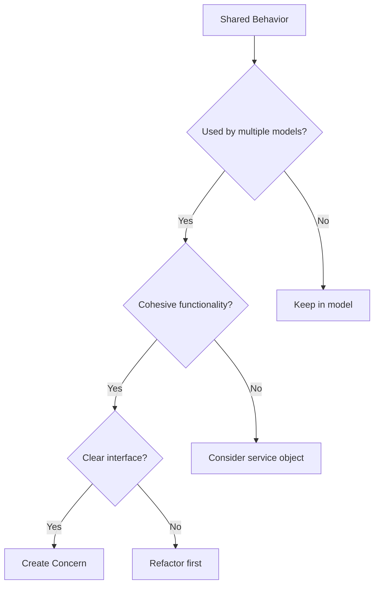

**Do use Concerns for:**
- Shared behavior across multiple models (tagging, slugs, auditing)
- Cross-cutting concerns (soft deletion, timestamps, state machines)
- Reusable authentication and authorization logic
- API response formatting patterns

**Avoid Concerns for:**
- Business logic that belongs in service objects
- Code that's only used in one place
- Dumping miscellaneous methods (Concern becomes a junk drawer)
- Replacing proper inheritance

### Naming Conventions

```ruby
# Good: Descriptive, action-oriented names
module Searchable      # Can be searched
module Taggable        # Can have tags
module Publishable     # Can be published
module Auditable       # Can be audited
module Authenticatable # Can authenticate

# Avoid: Vague or generic names
module Utilities       # Too vague
module CommonMethods   # Not descriptive
module Helpers         # Could mean anything
module Extensions      # Too generic
```

### Keep Concerns Focused

```ruby
# Good: Single responsibility
module Sluggable
  # Only handles slug generation
end

module Taggable
  # Only handles tagging
end

# Avoid: Multiple responsibilities
module ContentBehavior
  # Handles slugs AND tags AND publishing AND caching
  # This should be split into separate concerns
end
```

### Document Dependencies

```ruby
# app/models/concerns/searchable.rb

# Concern for adding search functionality
#
# Dependencies:
#   - Requires 'name' column in including model
#   - Works best with PostgreSQL for ILIKE queries
#
# Usage:
#   class Product < ApplicationRecord
#     include Searchable
#   end
#
module Searchable
  extend ActiveSupport::Concern
  
  # Implementation...
end
```

### Avoid Circular Dependencies

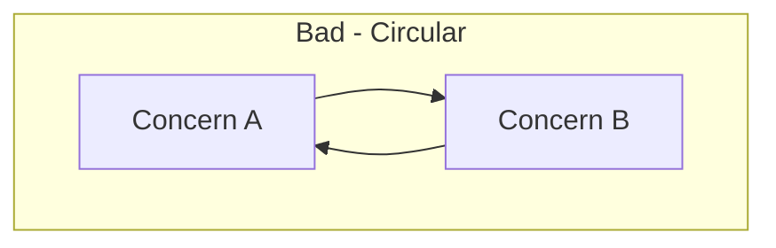

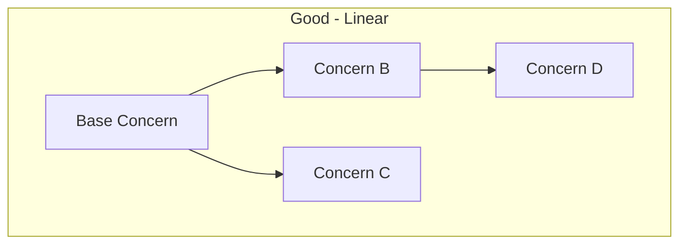

```ruby
# Bad: Circular dependency
module ConcernA
  extend ActiveSupport::Concern
  included do
    include ConcernB  # ConcernB includes ConcernA!
  end
end

# Good: Extract shared functionality
module SharedBehavior
  extend ActiveSupport::Concern
  # Shared code
end

module ConcernA
  extend ActiveSupport::Concern
  included do
    include SharedBehavior
  end
end

module ConcernB
  extend ActiveSupport::Concern
  included do
    include SharedBehavior
  end
end
```

---

## Common Anti-patterns

### The Junk Drawer Concern

```ruby
# Anti-pattern: Concern with unrelated methods
module ModelHelpers
  extend ActiveSupport::Concern

  def format_date(date)
    date.strftime("%Y-%m-%d")
  end

  def calculate_tax(amount)
    amount * 0.1
  end

  def send_notification(message)
    NotificationService.send(message)
  end

  # These methods have nothing in common!
end

# Better: Create focused concerns or service objects
module Dateable
  # Date formatting methods
end

class TaxCalculator
  # Tax calculation logic
end

class NotificationService
  # Notification logic
end
```

### Overusing Concerns

```ruby
# Anti-pattern: Too many concerns on one model
class Product < ApplicationRecord
  include Searchable
  include Taggable
  include Sluggable
  include Publishable
  include Auditable
  include Rateable
  include Commentable
  include Shareable
  include Followable
  include Notifiable
  include Cacheable
  include Exportable
  # 12+ concerns makes this hard to understand!
end

# Better: Group related concerns or reconsider architecture
class Product < ApplicationRecord
  include Searchable      # Core functionality
  include Taggable        # Core functionality
  include Auditable       # Required for compliance
  
  # Other functionality handled by associated objects
  has_one :publishing_info
  has_many :ratings
  has_many :comments
end
```

### Hiding Dependencies

```ruby
# Anti-pattern: Implicit dependency on another concern
module Publishable
  extend ActiveSupport::Concern

  included do
    # This assumes Auditable is included, but doesn't state it
    after_publish :create_audit_log
  end
end

# Better: Make dependencies explicit
module Publishable
  extend ActiveSupport::Concern

  included do
    # Explicit dependency
    unless included_modules.include?(Auditable)
      raise "Publishable requires Auditable to be included first"
    end
    
    after_publish :create_audit_log
  end
end

# Or include the dependency
module Publishable
  extend ActiveSupport::Concern

  included do
    include Auditable unless included_modules.include?(Auditable)
    
    after_publish :create_audit_log
  end
end
```

---

## Performance Considerations

### Eager Loading with Concerns

```ruby
# app/models/concerns/taggable.rb

module Taggable
  extend ActiveSupport::Concern

  class_methods do
    # Provide an eager loading scope
    def with_tags
      includes(:tags)
    end

    # Avoid N+1 when displaying tag lists
    def preload_for_display
      includes(:tags, :taggings)
    end
  end
end
```

Use efficient queries:

```ruby
# In controller
class PostsController < ApplicationController
  def index
    # Eager load tags to avoid N+1
    @posts = Post.with_tags.order(created_at: :desc)
  end
end
```

### Caching in Concerns

```ruby
# app/models/concerns/rateable.rb

module Rateable
  extend ActiveSupport::Concern

  included do
    # Cache the average rating
    after_save :clear_rating_cache, if: :ratings_changed?
  end

  # Use cached value for performance
  def average_rating
    Rails.cache.fetch(rating_cache_key, expires_in: 1.hour) do
      calculate_average_rating
    end
  end

  private

  def rating_cache_key
    "#{self.class.name.downcase}/#{id}/average_rating"
  end

  def calculate_average_rating
    ratings.average(:value).to_f.round(2)
  end

  def clear_rating_cache
    Rails.cache.delete(rating_cache_key)
  end

  def ratings_changed?
    # Logic to detect rating changes
  end
end
```

---

## Summary

Rails Concerns provide a powerful way to organize and share code across models and controllers. When used correctly, they lead to cleaner, more maintainable applications.

**Key Takeaways:**

1. **Use Concerns for shared behavior** - Extract common functionality into reusable modules
2. **Keep Concerns focused** - Each Concern should have a single, clear responsibility
3. **Name Concerns descriptively** - Use "-able" suffixes for capabilities (Searchable, Taggable)
4. **Test Concerns thoroughly** - Use shared examples for consistent testing
5. **Document dependencies** - Make it clear what a Concern requires
6. **Avoid anti-patterns** - Don't create junk drawer Concerns or hide dependencies

**Architecture Decision Flow:**

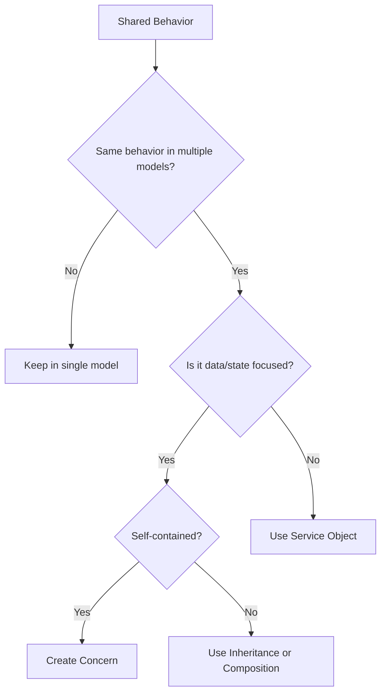

Concerns are one tool in the Rails developer's toolkit. Combined with service objects, decorators, and proper object-oriented design, they help create applications that are easy to understand, test, and extend.

---

## Further Reading

- [Rails ActiveSupport::Concern Documentation](https://api.rubyonrails.org/classes/ActiveSupport/Concern.html)
- [The Rails Doctrine](https://rubyonrails.org/doctrine)
- [Refactoring Rails Applications](https://www.refactoringrails.io/)
- [Practical Object-Oriented Design in Ruby](https://www.poodr.com/)
