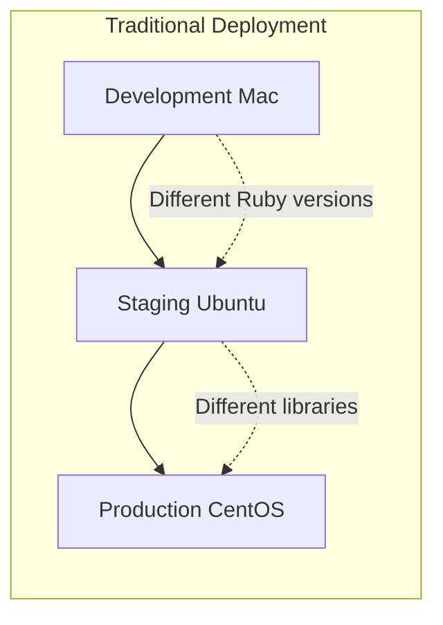
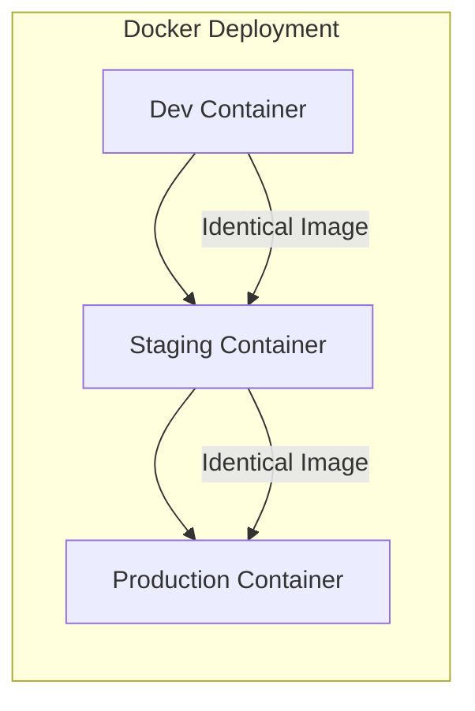
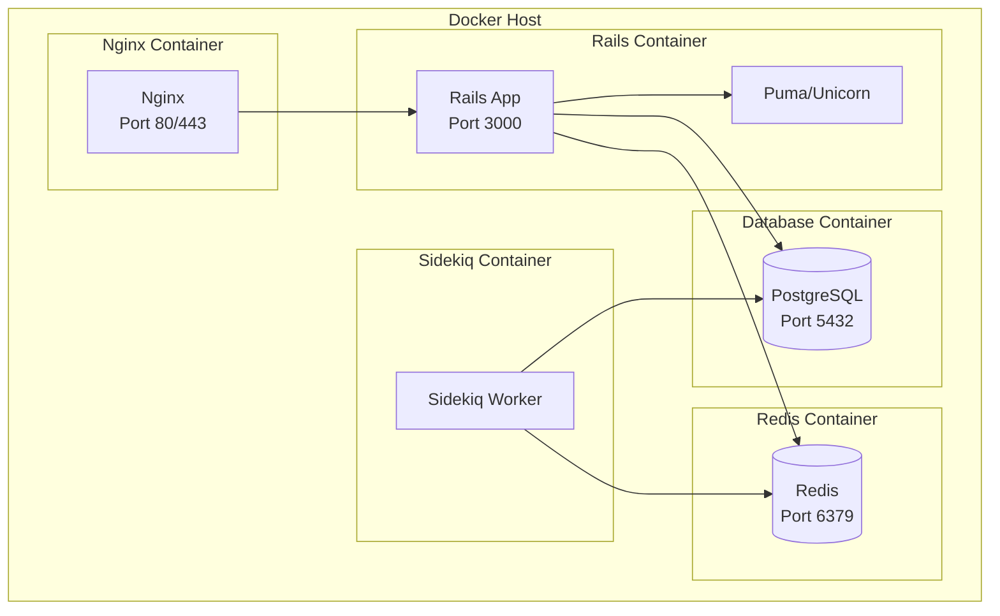
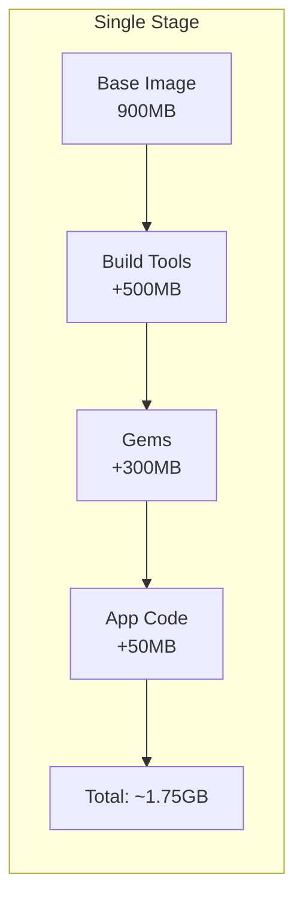
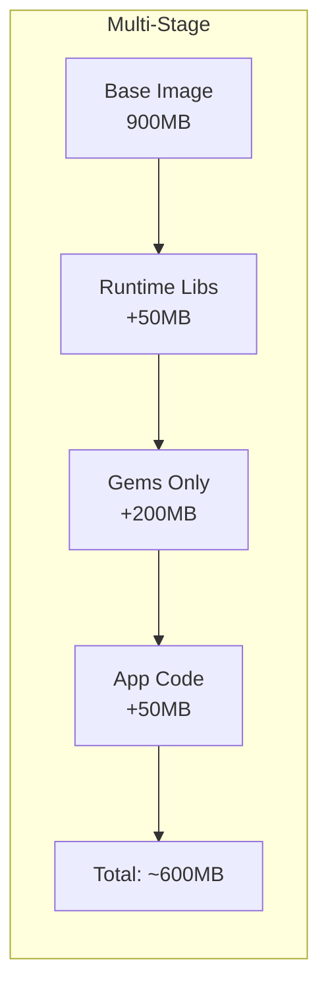
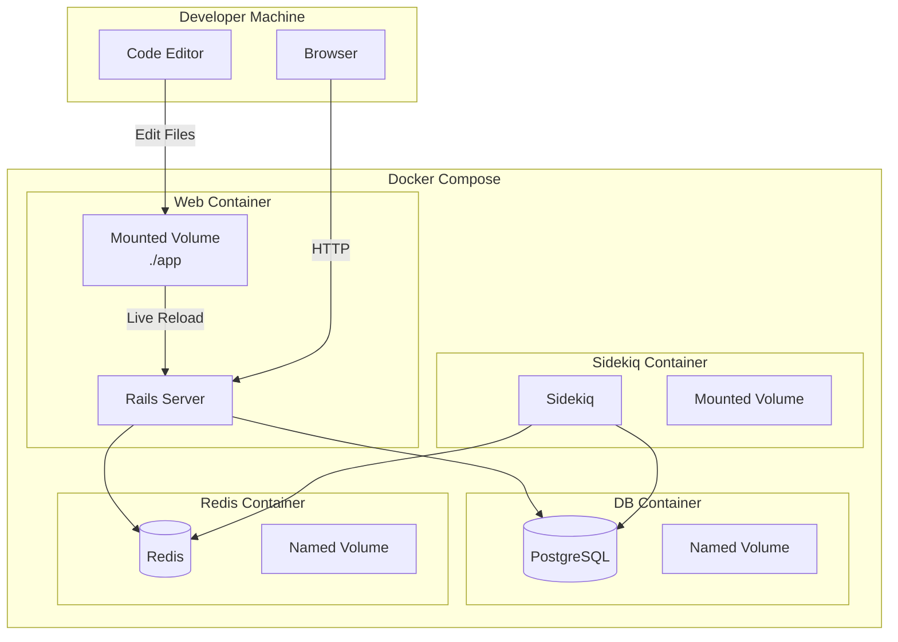
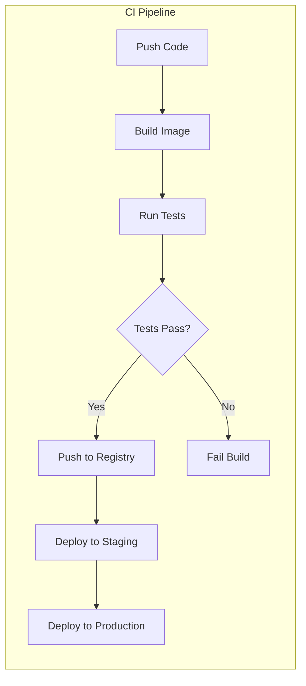
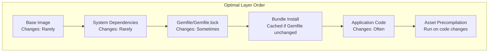
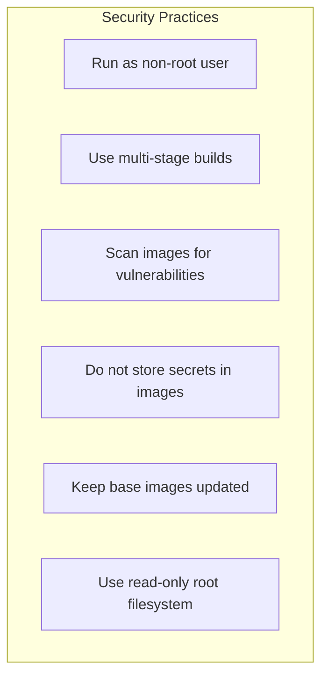

# How to Use Docker with Rails Applications

Author: [nawazdhandala](https://www.github.com/nawazdhandala)

Tags: Ruby, Rails, Docker, Containers, DevOps, Deployment

Description: A comprehensive guide to containerizing Ruby on Rails applications with Docker. Learn Dockerfile best practices, multi-stage builds, Docker Compose for development, production optimization, and deployment strategies.

---

> Containerizing Rails applications brings consistency across development, staging, and production environments. Docker eliminates the "works on my machine" problem by packaging your application with all its dependencies into a portable container that runs identically everywhere.

Docker has become the standard for deploying modern applications. For Rails developers, Docker offers reproducible builds, simplified dependency management, and seamless scaling in production. This guide covers everything from basic containerization to production-ready configurations.

---

## Why Docker for Rails?

Before diving into implementation, let's understand the benefits:





Key benefits include:

- **Consistency**: Same environment across all stages
- **Isolation**: Dependencies do not conflict with host system
- **Reproducibility**: Build once, run anywhere
- **Scalability**: Easy horizontal scaling with orchestrators
- **CI/CD Integration**: Simplifies deployment pipelines

---

## Docker Architecture for Rails

Understanding how Docker components interact with Rails:



---

## Getting Started

### Prerequisites

Install Docker and Docker Compose on your system:

```bash
# macOS (using Homebrew)
brew install --cask docker

# Ubuntu/Debian
sudo apt-get update
sudo apt-get install docker.io docker-compose-v2

# Verify installation
docker --version
docker compose version
```

### Project Structure

A typical Dockerized Rails project structure:

```
myapp/
  app/
  config/
  db/
  lib/
  public/
  Gemfile
  Gemfile.lock
  Dockerfile                 # Production Dockerfile
  Dockerfile.dev            # Development Dockerfile (optional)
  docker-compose.yml        # Development compose file
  docker-compose.prod.yml   # Production compose file
  .dockerignore             # Files to exclude from build
  bin/
    docker-entrypoint       # Container entrypoint script
```

---

## Creating the Dockerfile

### Basic Dockerfile

Start with a simple Dockerfile for Rails:

```dockerfile
# Dockerfile
# Use official Ruby image as base
# Alpine variant is smaller but may have compatibility issues
FROM ruby:3.3.0-slim

# Set environment variables
# RAILS_ENV determines which configuration Rails loads
ENV RAILS_ENV=production \
    RAILS_LOG_TO_STDOUT=true \
    BUNDLE_DEPLOYMENT=1 \
    BUNDLE_WITHOUT="development:test"

# Install system dependencies
# These are required for common Rails gems
RUN apt-get update -qq && \
    apt-get install --no-install-recommends -y \
    build-essential \
    libpq-dev \
    nodejs \
    npm \
    git \
    curl \
    && rm -rf /var/lib/apt/lists/* /tmp/* /var/tmp/*

# Create application directory
# Running as non-root user is a security best practice
RUN useradd -m -s /bin/bash rails
WORKDIR /app

# Copy dependency files first
# This layer is cached if Gemfile does not change
COPY Gemfile Gemfile.lock ./

# Install Ruby dependencies
RUN bundle install --jobs 4 --retry 3

# Copy application code
# This layer rebuilds when any file changes
COPY --chown=rails:rails . .

# Precompile assets for production
# Skip this in development
RUN bundle exec rails assets:precompile

# Switch to non-root user
USER rails

# Expose the Rails port
EXPOSE 3000

# Start the Rails server
CMD ["bundle", "exec", "rails", "server", "-b", "0.0.0.0"]
```

### Multi-Stage Dockerfile (Recommended)

Multi-stage builds create smaller, more secure production images:

```dockerfile
# Dockerfile
# syntax=docker/dockerfile:1

# ============================================
# Stage 1: Build stage
# Install dependencies and compile assets
# ============================================
FROM ruby:3.3.0-slim AS builder

# Install build dependencies
# These are only needed during build, not runtime
RUN apt-get update -qq && \
    apt-get install --no-install-recommends -y \
    build-essential \
    libpq-dev \
    git \
    curl \
    nodejs \
    npm \
    && rm -rf /var/lib/apt/lists/*

# Set working directory
WORKDIR /app

# Configure bundler for deployment
ENV BUNDLE_DEPLOYMENT=1 \
    BUNDLE_WITHOUT="development:test" \
    BUNDLE_PATH="/app/vendor/bundle"

# Copy Gemfile first for better caching
# Only re-runs bundle install if these files change
COPY Gemfile Gemfile.lock ./

# Install gems
# Using --jobs for parallel installation
RUN bundle install --jobs 4 --retry 3 && \
    rm -rf ~/.bundle/ "${BUNDLE_PATH}"/ruby/*/cache

# Copy application code
COPY . .

# Precompile assets
# SECRET_KEY_BASE is required but value does not matter for precompilation
RUN SECRET_KEY_BASE=placeholder bundle exec rails assets:precompile

# ============================================
# Stage 2: Runtime stage
# Minimal image with only runtime dependencies
# ============================================
FROM ruby:3.3.0-slim AS runtime

# Install runtime dependencies only
# Much smaller than build dependencies
RUN apt-get update -qq && \
    apt-get install --no-install-recommends -y \
    libpq5 \
    curl \
    && rm -rf /var/lib/apt/lists/* /tmp/* /var/tmp/*

# Create non-root user for security
# Running as root in containers is a security risk
RUN useradd -m -s /bin/bash -u 1000 rails

# Set working directory
WORKDIR /app

# Set environment variables
ENV RAILS_ENV=production \
    RAILS_LOG_TO_STDOUT=true \
    RAILS_SERVE_STATIC_FILES=true \
    BUNDLE_DEPLOYMENT=1 \
    BUNDLE_WITHOUT="development:test" \
    BUNDLE_PATH="/app/vendor/bundle"

# Copy gems from builder stage
COPY --from=builder --chown=rails:rails /app/vendor/bundle /app/vendor/bundle

# Copy application from builder stage
COPY --from=builder --chown=rails:rails /app /app

# Switch to non-root user
USER rails

# Expose port
EXPOSE 3000

# Health check
# Docker and orchestrators use this to verify container health
HEALTHCHECK --interval=30s --timeout=3s --start-period=5s --retries=3 \
    CMD curl -f http://localhost:3000/health || exit 1

# Default command
CMD ["bundle", "exec", "puma", "-C", "config/puma.rb"]
```

### Image Size Comparison





---

## Docker Ignore File

Create a `.dockerignore` file to exclude unnecessary files:

```plaintext
# .dockerignore
# Exclude files that should not be in the Docker image

# Git
.git
.gitignore

# Documentation
README.md
docs/

# Docker files themselves
Dockerfile*
docker-compose*

# CI/CD
.github/
.gitlab-ci.yml
.circleci/

# Development files
.env
.env.*
!.env.example

# Test files
spec/
test/
coverage/

# Logs
log/*
tmp/*

# Storage (use volumes instead)
storage/*

# Node modules (rebuild in container)
node_modules/

# IDE and editor files
.vscode/
.idea/
*.swp
*.swo

# OS files
.DS_Store
Thumbs.db

# Local bundle
vendor/bundle/
.bundle/
```

---

## Entrypoint Script

Create an entrypoint script for container initialization:

```bash
#!/bin/bash
# bin/docker-entrypoint
# This script runs when the container starts

set -e

# Function to wait for database
# Prevents Rails from starting before database is ready
wait_for_db() {
    echo "Waiting for database..."
    
    # Extract database host from DATABASE_URL or use default
    DB_HOST="${DATABASE_HOST:-db}"
    DB_PORT="${DATABASE_PORT:-5432}"
    
    # Wait up to 30 seconds for database
    for i in {1..30}; do
        if nc -z "$DB_HOST" "$DB_PORT" 2>/dev/null; then
            echo "Database is ready!"
            return 0
        fi
        echo "Waiting for database... ($i/30)"
        sleep 1
    done
    
    echo "ERROR: Database not available after 30 seconds"
    exit 1
}

# Function to prepare database
# Runs migrations and seeds if needed
prepare_db() {
    echo "Preparing database..."
    
    # Create database if it does not exist
    bundle exec rails db:prepare
    
    echo "Database ready!"
}

# Function to clear Rails cache
# Useful when restarting containers
clear_cache() {
    echo "Clearing Rails cache..."
    rm -rf tmp/cache/*
    rm -rf tmp/pids/*
}

# Main entrypoint logic
main() {
    # Remove stale PID file
    # This can happen if container was killed unexpectedly
    rm -f tmp/pids/server.pid
    
    # Only wait for DB if not running a non-server command
    if [ "$1" = "rails" ] && [ "$2" = "server" ]; then
        wait_for_db
        prepare_db
    fi
    
    # If running in development, also wait for DB for console
    if [ "$1" = "rails" ] && [ "$2" = "console" ]; then
        wait_for_db
    fi
    
    # Execute the main command
    exec "$@"
}

# Run main function with all arguments
main "$@"
```

Make the script executable:

```bash
chmod +x bin/docker-entrypoint
```

Update Dockerfile to use the entrypoint:

```dockerfile
# Add to Dockerfile before CMD
COPY --chown=rails:rails bin/docker-entrypoint /usr/bin/
RUN chmod +x /usr/bin/docker-entrypoint
ENTRYPOINT ["/usr/bin/docker-entrypoint"]
```

---

## Docker Compose for Development

Create a comprehensive development environment:

```yaml
# docker-compose.yml
# Development environment configuration

services:
  # Rails application
  web:
    build:
      context: .
      dockerfile: Dockerfile
      target: builder  # Use builder stage for development
    command: bundle exec rails server -b 0.0.0.0
    volumes:
      # Mount source code for live reloading
      - .:/app:cached
      # Exclude node_modules and bundle from mount
      - bundle:/app/vendor/bundle
      - node_modules:/app/node_modules
    ports:
      - "3000:3000"
    environment:
      - RAILS_ENV=development
      - DATABASE_URL=postgresql://postgres:password@db:5432/myapp_development
      - REDIS_URL=redis://redis:6379/0
      - WEBPACKER_DEV_SERVER_HOST=webpacker
    depends_on:
      db:
        condition: service_healthy
      redis:
        condition: service_started
    stdin_open: true
    tty: true

  # Background job processor
  sidekiq:
    build:
      context: .
      dockerfile: Dockerfile
      target: builder
    command: bundle exec sidekiq
    volumes:
      - .:/app:cached
      - bundle:/app/vendor/bundle
    environment:
      - RAILS_ENV=development
      - DATABASE_URL=postgresql://postgres:password@db:5432/myapp_development
      - REDIS_URL=redis://redis:6379/0
    depends_on:
      db:
        condition: service_healthy
      redis:
        condition: service_started

  # PostgreSQL database
  db:
    image: postgres:16-alpine
    volumes:
      - postgres_data:/var/lib/postgresql/data
    environment:
      - POSTGRES_USER=postgres
      - POSTGRES_PASSWORD=password
      - POSTGRES_DB=myapp_development
    ports:
      - "5432:5432"
    healthcheck:
      test: ["CMD-SHELL", "pg_isready -U postgres"]
      interval: 5s
      timeout: 5s
      retries: 5

  # Redis for caching and Sidekiq
  redis:
    image: redis:7-alpine
    volumes:
      - redis_data:/data
    ports:
      - "6379:6379"
    command: redis-server --appendonly yes

  # Webpacker dev server (if using Webpacker)
  webpacker:
    build:
      context: .
      dockerfile: Dockerfile
      target: builder
    command: bin/webpack-dev-server
    volumes:
      - .:/app:cached
      - bundle:/app/vendor/bundle
      - node_modules:/app/node_modules
    ports:
      - "3035:3035"
    environment:
      - RAILS_ENV=development
      - WEBPACKER_DEV_SERVER_HOST=0.0.0.0

# Named volumes for data persistence
volumes:
  postgres_data:
  redis_data:
  bundle:
  node_modules:
```

### Development Workflow



---

## Common Docker Commands

### Building and Running

```bash
# Build images
docker compose build

# Build without cache (clean build)
docker compose build --no-cache

# Start all services
docker compose up

# Start in detached mode
docker compose up -d

# View logs
docker compose logs -f

# View logs for specific service
docker compose logs -f web

# Stop all services
docker compose down

# Stop and remove volumes (reset data)
docker compose down -v
```

### Running Rails Commands

```bash
# Run Rails console
docker compose exec web rails console

# Run database migrations
docker compose exec web rails db:migrate

# Run database seeds
docker compose exec web rails db:seed

# Generate a new model
docker compose exec web rails generate model User name:string email:string

# Run tests
docker compose exec web rails test
# or for RSpec
docker compose exec web rspec

# Run a rake task
docker compose exec web rails my_custom_task

# Install new gems
docker compose exec web bundle install

# Access bash shell in container
docker compose exec web bash
```

### Debugging

```bash
# Check container status
docker compose ps

# View resource usage
docker stats

# Inspect a container
docker compose exec web cat /etc/os-release

# Check environment variables
docker compose exec web env

# View running processes
docker compose exec web ps aux
```

---

## Configuration for Different Environments

### Database Configuration

```yaml
# config/database.yml
# Docker-aware database configuration

default: &default
  adapter: postgresql
  encoding: unicode
  pool: <%= ENV.fetch("RAILS_MAX_THREADS") { 5 } %>
  # Use DATABASE_URL if set, otherwise use individual settings
  url: <%= ENV['DATABASE_URL'] %>

development:
  <<: *default
  database: myapp_development

test:
  <<: *default
  database: myapp_test

production:
  <<: *default
  # Production should always use DATABASE_URL
  url: <%= ENV['DATABASE_URL'] %>
```

### Puma Configuration

```ruby
# config/puma.rb
# Production-ready Puma configuration for Docker

# Number of worker processes
# Set based on available CPU cores
workers ENV.fetch("WEB_CONCURRENCY") { 2 }

# Threads per worker
# More threads = more concurrent requests
# But also more memory usage
min_threads = ENV.fetch("RAILS_MIN_THREADS") { 5 }
max_threads = ENV.fetch("RAILS_MAX_THREADS") { 5 }
threads min_threads, max_threads

# Port to listen on
port ENV.fetch("PORT") { 3000 }

# Environment
environment ENV.fetch("RAILS_ENV") { "development" }

# PID file location
pidfile ENV.fetch("PIDFILE") { "tmp/pids/server.pid" }

# Preload application for faster worker spawn
# Reduces memory through copy-on-write
preload_app!

# Restart workers that have memory bloat
# Useful for long-running processes
plugin :tmp_restart

# Worker boot hooks
on_worker_boot do
  # Reconnect to database in each worker
  ActiveRecord::Base.establish_connection if defined?(ActiveRecord)
end

# Before fork hooks
before_fork do
  # Close database connections before forking
  ActiveRecord::Base.connection_pool.disconnect! if defined?(ActiveRecord)
end
```

### Redis Configuration

```ruby
# config/initializers/redis.rb
# Redis connection configuration for Docker

# Use REDIS_URL from environment
# Docker Compose sets this to point to Redis container
REDIS_URL = ENV.fetch("REDIS_URL") { "redis://localhost:6379/0" }

# Configure Redis for Rails cache
Rails.application.config.cache_store = :redis_cache_store, {
  url: REDIS_URL,
  connect_timeout: 5,
  read_timeout: 1,
  write_timeout: 1,
  reconnect_attempts: 1
}

# Configure Action Cable
Rails.application.config.action_cable.url = "wss://#{ENV.fetch('HOST', 'localhost')}/cable"
```

### Sidekiq Configuration

```yaml
# config/sidekiq.yml
# Sidekiq configuration for Docker

# Number of concurrent job processors
:concurrency: <%= ENV.fetch("SIDEKIQ_CONCURRENCY") { 10 } %>

# Queue configuration
# Priority is determined by order
:queues:
  - critical
  - default
  - mailers
  - low

# Retry configuration
:max_retries: 5
```

```ruby
# config/initializers/sidekiq.rb
# Sidekiq Redis connection for Docker

Sidekiq.configure_server do |config|
  config.redis = { url: ENV.fetch("REDIS_URL") { "redis://localhost:6379/0" } }
end

Sidekiq.configure_client do |config|
  config.redis = { url: ENV.fetch("REDIS_URL") { "redis://localhost:6379/0" } }
end
```

---

## Production Docker Compose

Create a production-ready Docker Compose configuration:

```yaml
# docker-compose.prod.yml
# Production environment configuration

services:
  # Rails application
  web:
    image: myapp:latest
    command: bundle exec puma -C config/puma.rb
    environment:
      - RAILS_ENV=production
      - RAILS_LOG_TO_STDOUT=true
      - DATABASE_URL=${DATABASE_URL}
      - REDIS_URL=${REDIS_URL}
      - SECRET_KEY_BASE=${SECRET_KEY_BASE}
      - RAILS_SERVE_STATIC_FILES=true
    ports:
      - "3000:3000"
    depends_on:
      - db
      - redis
    deploy:
      replicas: 2
      resources:
        limits:
          cpus: '1'
          memory: 1G
        reservations:
          cpus: '0.5'
          memory: 512M
      restart_policy:
        condition: on-failure
        delay: 5s
        max_attempts: 3
    healthcheck:
      test: ["CMD", "curl", "-f", "http://localhost:3000/health"]
      interval: 30s
      timeout: 10s
      retries: 3
      start_period: 40s

  # Sidekiq workers
  sidekiq:
    image: myapp:latest
    command: bundle exec sidekiq -C config/sidekiq.yml
    environment:
      - RAILS_ENV=production
      - DATABASE_URL=${DATABASE_URL}
      - REDIS_URL=${REDIS_URL}
      - SECRET_KEY_BASE=${SECRET_KEY_BASE}
    depends_on:
      - db
      - redis
    deploy:
      replicas: 1
      resources:
        limits:
          cpus: '0.5'
          memory: 512M
      restart_policy:
        condition: on-failure

  # PostgreSQL database
  db:
    image: postgres:16-alpine
    volumes:
      - postgres_data:/var/lib/postgresql/data
    environment:
      - POSTGRES_USER=${POSTGRES_USER}
      - POSTGRES_PASSWORD=${POSTGRES_PASSWORD}
      - POSTGRES_DB=${POSTGRES_DB}
    deploy:
      resources:
        limits:
          cpus: '1'
          memory: 1G

  # Redis
  redis:
    image: redis:7-alpine
    volumes:
      - redis_data:/data
    command: redis-server --appendonly yes --maxmemory 256mb --maxmemory-policy allkeys-lru
    deploy:
      resources:
        limits:
          cpus: '0.25'
          memory: 256M

  # Nginx reverse proxy
  nginx:
    image: nginx:alpine
    volumes:
      - ./nginx.conf:/etc/nginx/nginx.conf:ro
      - static_files:/app/public:ro
    ports:
      - "80:80"
      - "443:443"
    depends_on:
      - web
    deploy:
      resources:
        limits:
          cpus: '0.25'
          memory: 128M

volumes:
  postgres_data:
  redis_data:
  static_files:
```

### Nginx Configuration

```nginx
# nginx.conf
# Production Nginx configuration for Rails

upstream rails_app {
    # Connect to Rails containers
    server web:3000;
}

server {
    listen 80;
    server_name _;
    
    # Redirect HTTP to HTTPS in production
    # Uncomment when SSL is configured
    # return 301 https://$host$request_uri;
    
    # Root directory for static files
    root /app/public;
    
    # Increase max body size for file uploads
    client_max_body_size 100M;
    
    # Gzip compression
    gzip on;
    gzip_vary on;
    gzip_min_length 1024;
    gzip_proxied any;
    gzip_types text/plain text/css application/json application/javascript text/xml application/xml;
    
    # Try to serve static files directly
    # Fall back to Rails if not found
    location / {
        try_files $uri @rails;
    }
    
    # Rails application
    location @rails {
        proxy_pass http://rails_app;
        proxy_set_header Host $host;
        proxy_set_header X-Real-IP $remote_addr;
        proxy_set_header X-Forwarded-For $proxy_add_x_forwarded_for;
        proxy_set_header X-Forwarded-Proto $scheme;
        
        # WebSocket support for Action Cable
        proxy_http_version 1.1;
        proxy_set_header Upgrade $http_upgrade;
        proxy_set_header Connection "upgrade";
        
        # Timeouts
        proxy_connect_timeout 60;
        proxy_send_timeout 60;
        proxy_read_timeout 60;
    }
    
    # Health check endpoint
    location /health {
        proxy_pass http://rails_app/health;
        proxy_set_header Host $host;
    }
    
    # Static assets with long cache
    location /assets {
        expires 1y;
        add_header Cache-Control "public, immutable";
        gzip_static on;
    }
    
    # Packs (Webpacker assets)
    location /packs {
        expires 1y;
        add_header Cache-Control "public, immutable";
        gzip_static on;
    }
}
```

---

## Health Check Endpoint

Create a health check endpoint for Docker and load balancers:

```ruby
# app/controllers/health_controller.rb
# Health check endpoint for container orchestration

class HealthController < ApplicationController
  # Skip authentication for health checks
  skip_before_action :authenticate_user!, if: -> { defined?(authenticate_user!) }
  
  # Basic health check
  # Returns 200 if application is running
  def show
    render json: { status: 'ok', timestamp: Time.current.iso8601 }
  end
  
  # Detailed health check
  # Verifies database and Redis connectivity
  def detailed
    checks = {
      database: check_database,
      redis: check_redis,
      sidekiq: check_sidekiq
    }
    
    status = checks.values.all? { |c| c[:status] == 'ok' } ? :ok : :service_unavailable
    
    render json: {
      status: status == :ok ? 'ok' : 'unhealthy',
      timestamp: Time.current.iso8601,
      checks: checks
    }, status: status
  end
  
  private
  
  def check_database
    ActiveRecord::Base.connection.execute('SELECT 1')
    { status: 'ok' }
  rescue StandardError => e
    { status: 'error', message: e.message }
  end
  
  def check_redis
    redis = Redis.new(url: ENV['REDIS_URL'])
    redis.ping
    { status: 'ok' }
  rescue StandardError => e
    { status: 'error', message: e.message }
  ensure
    redis&.close
  end
  
  def check_sidekiq
    processes = Sidekiq::ProcessSet.new
    { status: 'ok', processes: processes.size }
  rescue StandardError => e
    { status: 'error', message: e.message }
  end
end
```

```ruby
# config/routes.rb
# Add health check routes

Rails.application.routes.draw do
  # Health check endpoints
  get '/health', to: 'health#show'
  get '/health/detailed', to: 'health#detailed'
  
  # Other routes...
end
```

---

## CI/CD Integration

### GitHub Actions Workflow

```yaml
# .github/workflows/docker.yml
# Build and push Docker image

name: Docker Build

on:
  push:
    branches: [main]
    tags: ['v*']
  pull_request:
    branches: [main]

env:
  REGISTRY: ghcr.io
  IMAGE_NAME: ${{ github.repository }}

jobs:
  build:
    runs-on: ubuntu-latest
    
    steps:
      - name: Checkout code
        uses: actions/checkout@v4
      
      - name: Set up Docker Buildx
        uses: docker/setup-buildx-action@v3
      
      - name: Login to Container Registry
        if: github.event_name != 'pull_request'
        uses: docker/login-action@v3
        with:
          registry: ${{ env.REGISTRY }}
          username: ${{ github.actor }}
          password: ${{ secrets.GITHUB_TOKEN }}
      
      - name: Extract metadata
        id: meta
        uses: docker/metadata-action@v5
        with:
          images: ${{ env.REGISTRY }}/${{ env.IMAGE_NAME }}
          tags: |
            type=ref,event=branch
            type=ref,event=pr
            type=semver,pattern={{version}}
            type=sha
      
      - name: Build and push
        uses: docker/build-push-action@v5
        with:
          context: .
          push: ${{ github.event_name != 'pull_request' }}
          tags: ${{ steps.meta.outputs.tags }}
          labels: ${{ steps.meta.outputs.labels }}
          cache-from: type=gha
          cache-to: type=gha,mode=max
      
      - name: Run tests in container
        run: |
          docker compose -f docker-compose.test.yml up --abort-on-container-exit
```

### Build Pipeline Flow



---

## Optimizing Docker Builds

### Layer Caching Strategy



### BuildKit Features

Enable BuildKit for faster builds:

```bash
# Enable BuildKit
export DOCKER_BUILDKIT=1

# Or prefix command
DOCKER_BUILDKIT=1 docker build .
```

```dockerfile
# syntax=docker/dockerfile:1
# Enable BuildKit features

FROM ruby:3.3.0-slim AS builder

# Use mount cache for bundle
RUN --mount=type=cache,target=/root/.bundle \
    --mount=type=cache,target=/app/vendor/bundle \
    bundle install --jobs 4

# Use mount cache for npm
RUN --mount=type=cache,target=/root/.npm \
    npm install
```

### Minimize Image Size

```dockerfile
# Tips for smaller images

# 1. Use slim or alpine base images
FROM ruby:3.3.0-slim  # Instead of ruby:3.3.0

# 2. Combine RUN commands to reduce layers
RUN apt-get update -qq && \
    apt-get install --no-install-recommends -y \
    build-essential \
    libpq-dev && \
    rm -rf /var/lib/apt/lists/*

# 3. Remove unnecessary files after installation
RUN bundle install && \
    rm -rf ~/.bundle "${BUNDLE_PATH}"/ruby/*/cache

# 4. Use .dockerignore to exclude files
# See .dockerignore section above
```

---

## Troubleshooting Common Issues

### Container Startup Issues

```bash
# Check container logs
docker compose logs web

# Check if container is running
docker compose ps

# Access container shell for debugging
docker compose exec web bash

# Check environment variables
docker compose exec web env | grep RAILS
```

### Database Connection Issues

```ruby
# Test database connection in Rails console
docker compose exec web rails console
> ActiveRecord::Base.connection.execute("SELECT 1")
```

```bash
# Check if database is accessible from web container
docker compose exec web nc -zv db 5432

# Check database logs
docker compose logs db
```

### Permission Issues

```dockerfile
# Fix permission issues in Dockerfile
# Ensure files are owned by the correct user

COPY --chown=rails:rails . .

# Or fix in entrypoint script
chown -R rails:rails /app/tmp /app/log
```

### Memory Issues

```yaml
# docker-compose.yml
# Set memory limits and reservation

services:
  web:
    deploy:
      resources:
        limits:
          memory: 1G
        reservations:
          memory: 512M
```

```ruby
# Tune Puma for memory efficiency
# config/puma.rb

# Reduce workers if memory constrained
workers ENV.fetch("WEB_CONCURRENCY") { 1 }

# Use fewer threads
threads 2, 2
```

---

## Security Best Practices



### Security Checklist

```dockerfile
# Security best practices in Dockerfile

# 1. Run as non-root user
RUN useradd -m -s /bin/bash -u 1000 rails
USER rails

# 2. Set read-only root filesystem (when possible)
# Use volumes for writable directories

# 3. Do not expose unnecessary ports
EXPOSE 3000  # Only expose what is needed

# 4. Use specific image tags, not latest
FROM ruby:3.3.0-slim  # Not ruby:latest

# 5. Do not store secrets in image
# Use environment variables or secrets management
```

### Secrets Management

```yaml
# docker-compose.yml
# Use Docker secrets for sensitive data

services:
  web:
    secrets:
      - db_password
      - secret_key_base
    environment:
      - DATABASE_PASSWORD_FILE=/run/secrets/db_password
      - SECRET_KEY_BASE_FILE=/run/secrets/secret_key_base

secrets:
  db_password:
    file: ./secrets/db_password.txt
  secret_key_base:
    file: ./secrets/secret_key_base.txt
```

---

## Summary

Docker transforms Rails deployment by providing consistent, reproducible environments. Key takeaways:

- **Multi-stage builds** reduce image size and improve security
- **Docker Compose** simplifies development environment setup
- **Volume mounts** enable live code reloading in development
- **Health checks** help orchestrators manage container lifecycle
- **Layer caching** speeds up builds significantly
- **Security practices** protect your application in production

Start with the development setup, then gradually add production optimizations as your application grows.

---

*Running Rails in Docker and need comprehensive monitoring? [OneUptime](https://oneuptime.com) provides container-aware monitoring, log aggregation, and alerting to keep your Dockerized Rails applications running smoothly in production.*
