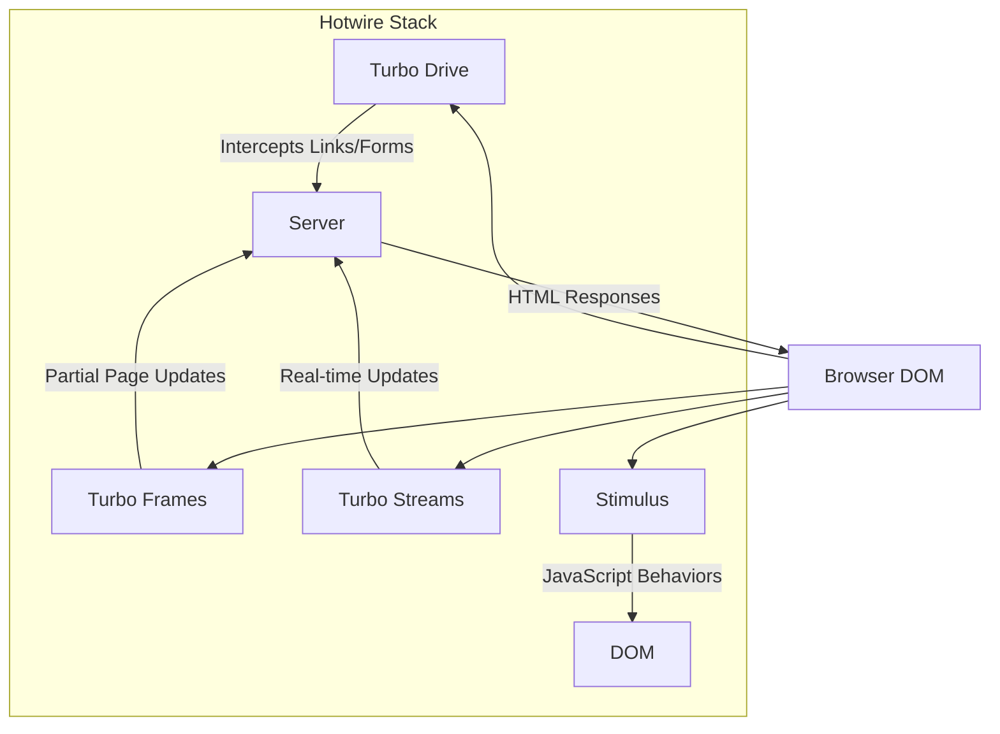
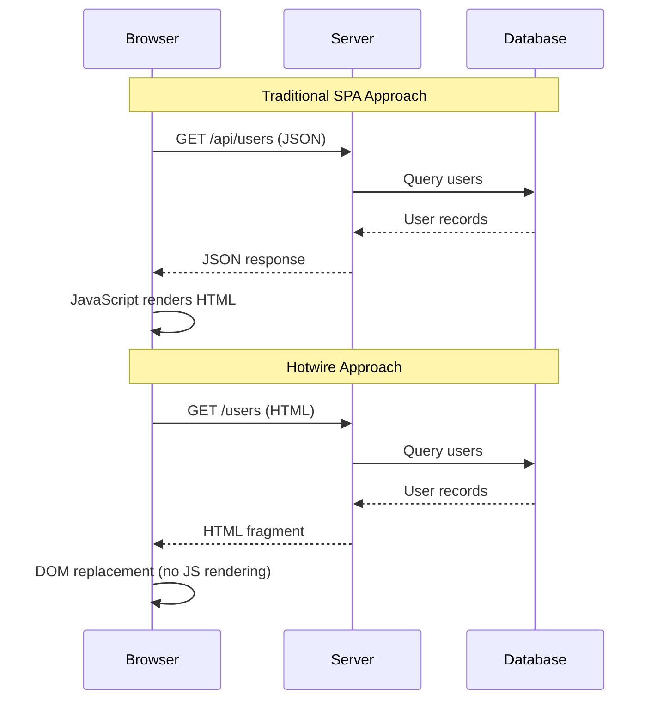
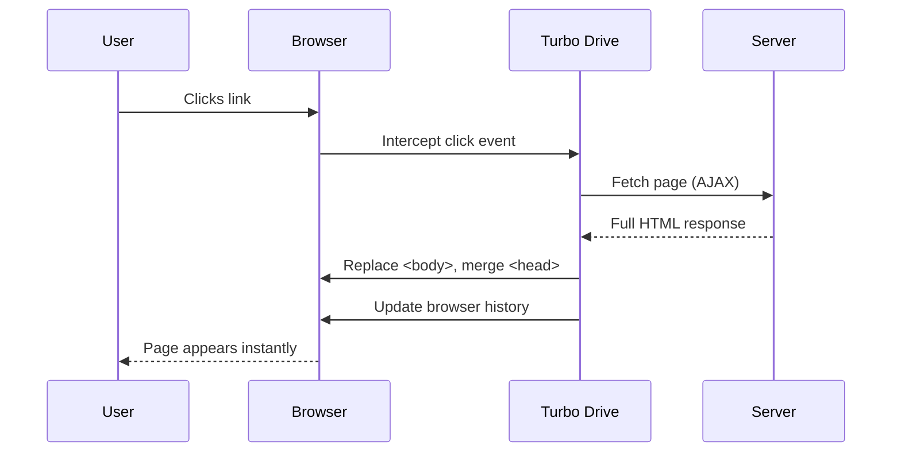
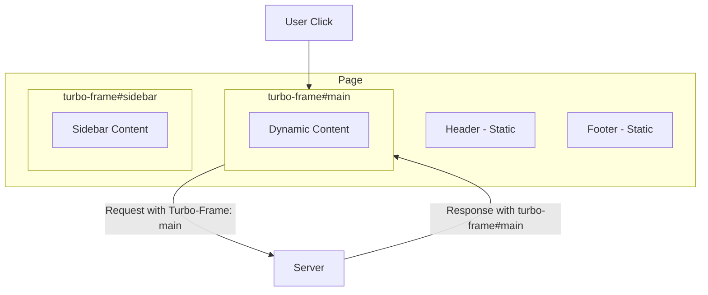
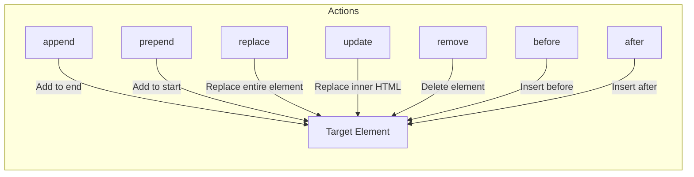

# How to Use Hotwire/Turbo for Modern Rails Apps

Author: [nawazdhandala](https://www.github.com/nawazdhandala)

Tags: Ruby, Rails, Hotwire, Turbo, Stimulus, Modern Web

Description: Learn how to build modern, reactive Rails applications using Hotwire (Turbo + Stimulus). This guide covers Turbo Drive, Turbo Frames, Turbo Streams, and Stimulus controllers with practical examples.

---

> Hotwire brings the speed and responsiveness of single-page applications to Rails without writing complex JavaScript. By sending HTML over the wire instead of JSON, you get fast, reactive interfaces while keeping your logic in Ruby.

Hotwire (HTML Over The Wire) represents a fundamental shift in how we build modern web applications. Instead of building JSON APIs and complex JavaScript frontends, Hotwire lets you write server-side Ruby code that updates specific parts of the page in real-time. It consists of three key technologies: Turbo Drive, Turbo Frames, Turbo Streams, and Stimulus for JavaScript sprinkles.

---

## Understanding Hotwire Architecture

Before diving into code, let's understand how Hotwire components work together:



### How Traditional SPAs vs Hotwire Work



Key differences:
- **Traditional SPAs**: Server sends JSON, client renders HTML with JavaScript
- **Hotwire**: Server sends HTML, client just inserts it into the DOM
- **Result**: Less JavaScript, faster perceived performance, simpler architecture

---

## Getting Started with Hotwire

### Installation

For Rails 7+, Hotwire is included by default. For older Rails versions:

```ruby
# Gemfile
gem 'turbo-rails'
gem 'stimulus-rails'
```

Install the packages:

```bash
# Install Turbo and Stimulus
bundle install
rails turbo:install
rails stimulus:install
```

### Verify Installation

Check your application layout includes Hotwire:

```erb
<%# app/views/layouts/application.html.erb %>
<!DOCTYPE html>
<html>
  <head>
    <title><%= content_for(:title) || "My App" %></title>
    <meta name="viewport" content="width=device-width,initial-scale=1">
    <%= csrf_meta_tags %>
    <%= csp_meta_tag %>
    
    <%# Hotwire is loaded via importmap or esbuild %>
    <%= stylesheet_link_tag "application", "data-turbo-track": "reload" %>
    <%= javascript_importmap_tags %>
  </head>

  <body>
    <%= yield %>
  </body>
</html>
```

Your `app/javascript/application.js` should include:

```javascript
// app/javascript/application.js
import "@hotwired/turbo-rails"
import "controllers"
```

---

## Turbo Drive: Accelerating Page Navigation

Turbo Drive automatically intercepts link clicks and form submissions, fetches pages via AJAX, and swaps the `<body>` content without full page reloads.

### How Turbo Drive Works



### Basic Navigation

Turbo Drive works automatically - no code changes needed:

```erb
<%# app/views/posts/index.html.erb %>
<h1>Blog Posts</h1>

<%= link_to "New Post", new_post_path %>

<% @posts.each do |post| %>
  <article>
    <h2><%= link_to post.title, post_path(post) %></h2>
    <p><%= truncate(post.body, length: 200) %></p>
  </article>
<% end %>
```

All links are automatically Turbo-enabled. The page transitions feel instant because:
- Browser history is preserved
- CSS and JavaScript assets are cached
- Only the `<body>` is replaced

### Disabling Turbo Drive

Sometimes you need to disable Turbo for specific links:

```erb
<%# Disable Turbo for external links %>
<%= link_to "External Site", "https://example.com", data: { turbo: false } %>

<%# Disable Turbo for file downloads %>
<%= link_to "Download PDF", report_path(format: :pdf), data: { turbo: false } %>

<%# Disable Turbo for entire sections %>
<div data-turbo="false">
  <%= link_to "Legacy Page", legacy_path %>
  <%= link_to "Another Legacy", another_legacy_path %>
</div>
```

### Progress Bar

Turbo Drive shows a progress bar for slow requests. Customize it:

```css
/* app/assets/stylesheets/application.css */

/* Style the Turbo progress bar */
.turbo-progress-bar {
  height: 3px;
  background-color: #3b82f6; /* Blue */
}
```

```javascript
// app/javascript/application.js
import "@hotwired/turbo-rails"

// Customize progress bar delay (default: 500ms)
Turbo.setProgressBarDelay(100)
```

---

## Turbo Frames: Partial Page Updates

Turbo Frames allow you to update specific portions of the page without refreshing the entire `<body>`. Think of them as independent regions that can be updated independently.

### Frame Architecture



### Basic Turbo Frame

Create a frame that updates independently:

```erb
<%# app/views/posts/index.html.erb %>
<h1>Blog Posts</h1>

<%# This frame updates independently %>
<%= turbo_frame_tag "posts" do %>
  <% @posts.each do |post| %>
    <article id="<%= dom_id(post) %>">
      <h2><%= link_to post.title, post_path(post) %></h2>
      <p><%= truncate(post.body, length: 200) %></p>
      <%= link_to "Edit", edit_post_path(post) %>
    </article>
  <% end %>
<% end %>
```

```erb
<%# app/views/posts/edit.html.erb %>
<%# Response must contain a matching turbo-frame %>
<%= turbo_frame_tag "posts" do %>
  <h2>Edit Post</h2>
  
  <%= form_with model: @post do |f| %>
    <div>
      <%= f.label :title %>
      <%= f.text_field :title %>
    </div>
    
    <div>
      <%= f.label :body %>
      <%= f.text_area :body, rows: 10 %>
    </div>
    
    <%= f.submit "Update Post" %>
    <%= link_to "Cancel", posts_path %>
  <% end %>
<% end %>
```

### Frame Targeting

Update a different frame than the one containing the link:

```erb
<%# app/views/posts/index.html.erb %>
<div class="layout">
  <%# Sidebar with navigation %>
  <aside>
    <nav>
      <% @categories.each do |category| %>
        <%# Links target the main content frame %>
        <%= link_to category.name, 
            category_posts_path(category),
            data: { turbo_frame: "posts_content" } %>
      <% end %>
    </nav>
  </aside>

  <%# Main content area %>
  <main>
    <%= turbo_frame_tag "posts_content" do %>
      <%= render @posts %>
    <% end %>
  </main>
</div>
```

### Breaking Out of Frames

Sometimes you need a link inside a frame to navigate the whole page:

```erb
<%= turbo_frame_tag "post_preview" do %>
  <h3><%= @post.title %></h3>
  <p><%= truncate(@post.body, length: 100) %></p>
  
  <%# This link breaks out of the frame %>
  <%= link_to "Read Full Post", post_path(@post), data: { turbo_frame: "_top" } %>
<% end %>
```

### Lazy Loading Frames

Load content only when needed:

```erb
<%# app/views/posts/show.html.erb %>
<article>
  <h1><%= @post.title %></h1>
  <p><%= @post.body %></p>
</article>

<%# Comments load after page renders %>
<%= turbo_frame_tag "comments", 
    src: post_comments_path(@post), 
    loading: :lazy do %>
  <p>Loading comments...</p>
<% end %>
```

```ruby
# app/controllers/comments_controller.rb
class CommentsController < ApplicationController
  def index
    @post = Post.find(params[:post_id])
    @comments = @post.comments.includes(:author).order(created_at: :desc)
    
    # Render just the frame content
    render partial: "comments/list", locals: { comments: @comments }
  end
end
```

```erb
<%# app/views/comments/_list.html.erb %>
<%= turbo_frame_tag "comments" do %>
  <h2>Comments (<%= comments.count %>)</h2>
  
  <% comments.each do |comment| %>
    <%= render comment %>
  <% end %>
  
  <%= render "comments/form", post: @post %>
<% end %>
```

---

## Turbo Streams: Real-time Updates

Turbo Streams allow you to perform DOM manipulations from the server. You can append, prepend, replace, update, remove, or insert content before/after elements.

### Stream Actions



### Responding with Turbo Streams

```ruby
# app/controllers/comments_controller.rb
class CommentsController < ApplicationController
  def create
    @post = Post.find(params[:post_id])
    @comment = @post.comments.build(comment_params)
    @comment.author = current_user

    if @comment.save
      respond_to do |format|
        # Return Turbo Stream response
        format.turbo_stream
        # Fallback for non-Turbo requests
        format.html { redirect_to @post, notice: "Comment added!" }
      end
    else
      render :new, status: :unprocessable_entity
    end
  end

  def destroy
    @comment = Comment.find(params[:id])
    @comment.destroy

    respond_to do |format|
      format.turbo_stream
      format.html { redirect_to @comment.post, notice: "Comment deleted." }
    end
  end

  private

  def comment_params
    params.require(:comment).permit(:body)
  end
end
```

Create Turbo Stream templates:

```erb
<%# app/views/comments/create.turbo_stream.erb %>

<%# Prepend the new comment to the list %>
<%= turbo_stream.prepend "comments_list" do %>
  <%= render @comment %>
<% end %>

<%# Update the comment count %>
<%= turbo_stream.update "comment_count" do %>
  <%= @post.comments.count %> comments
<% end %>

<%# Clear the form %>
<%= turbo_stream.replace "new_comment_form" do %>
  <%= render "comments/form", post: @post, comment: Comment.new %>
<% end %>
```

```erb
<%# app/views/comments/destroy.turbo_stream.erb %>

<%# Remove the deleted comment %>
<%= turbo_stream.remove @comment %>

<%# Update the count %>
<%= turbo_stream.update "comment_count" do %>
  <%= @comment.post.comments.count %> comments
<% end %>
```

### Inline Turbo Streams

For simple responses, use inline streams in the controller:

```ruby
# app/controllers/tasks_controller.rb
class TasksController < ApplicationController
  def toggle_complete
    @task = Task.find(params[:id])
    @task.toggle!(:completed)

    respond_to do |format|
      format.turbo_stream do
        render turbo_stream: turbo_stream.replace(@task, partial: "tasks/task", locals: { task: @task })
      end
      format.html { redirect_to tasks_path }
    end
  end
end
```

### Broadcasting with Action Cable

Turbo Streams can broadcast updates to multiple users in real-time:

```ruby
# app/models/message.rb
class Message < ApplicationRecord
  belongs_to :chat_room
  belongs_to :user

  # Broadcast to all subscribers when created
  after_create_commit do
    broadcast_append_to(
      chat_room,
      target: "messages",
      partial: "messages/message",
      locals: { message: self }
    )
  end

  # Broadcast removal when destroyed
  after_destroy_commit do
    broadcast_remove_to(chat_room)
  end
end
```

Subscribe to broadcasts in the view:

```erb
<%# app/views/chat_rooms/show.html.erb %>
<h1><%= @chat_room.name %></h1>

<%# Subscribe to real-time updates %>
<%= turbo_stream_from @chat_room %>

<div id="messages">
  <%= render @chat_room.messages %>
</div>

<%= form_with model: [@chat_room, Message.new] do |f| %>
  <%= f.text_field :body, placeholder: "Type a message..." %>
  <%= f.submit "Send" %>
<% end %>
```

### Broadcast Methods

```ruby
# app/models/notification.rb
class Notification < ApplicationRecord
  belongs_to :user

  # Different broadcast methods
  after_create_commit do
    # Append to a list
    broadcast_append_to(
      [user, :notifications],
      target: "notifications_list"
    )

    # Update a counter
    broadcast_update_to(
      [user, :notifications],
      target: "notification_badge",
      html: user.unread_notifications.count.to_s
    )
  end

  after_update_commit do
    # Replace the entire element
    broadcast_replace_to([user, :notifications])
  end

  after_destroy_commit do
    # Remove the element
    broadcast_remove_to([user, :notifications])
  end
end
```

---

## Stimulus: JavaScript Sprinkles

Stimulus is a modest JavaScript framework for adding behavior to your HTML. It connects JavaScript controllers to DOM elements via data attributes.

### Stimulus Architecture

```mermaid
flowchart TB
    subgraph HTML
        Element["&lt;div data-controller='dropdown'&gt;"]
        Button["&lt;button data-action='click->dropdown#toggle'&gt;"]
        Menu["&lt;ul data-dropdown-target='menu'&gt;"]
    end
    
    subgraph Controller["dropdown_controller.js"]
        Connect[connect()]
        Toggle[toggle()]
        Targets[this.menuTarget]
    end
    
    Element --> |"data-controller"| Controller
    Button --> |"data-action"| Toggle
    Menu --> |"data-target"| Targets
```

### Creating a Stimulus Controller

```javascript
// app/javascript/controllers/dropdown_controller.js
import { Controller } from "@hotwired/stimulus"

export default class extends Controller {
  // Define targets (elements we want to reference)
  static targets = ["menu", "button"]
  
  // Define values (data attributes with types)
  static values = {
    open: { type: Boolean, default: false }
  }

  // Called when controller connects to DOM
  connect() {
    console.log("Dropdown controller connected")
    // Close dropdown when clicking outside
    document.addEventListener("click", this.closeOnClickOutside.bind(this))
  }

  // Called when controller disconnects
  disconnect() {
    document.removeEventListener("click", this.closeOnClickOutside.bind(this))
  }

  // Toggle the dropdown
  toggle(event) {
    event.stopPropagation()
    this.openValue = !this.openValue
  }

  // Called automatically when openValue changes
  openValueChanged() {
    if (this.openValue) {
      this.menuTarget.classList.remove("hidden")
      this.buttonTarget.setAttribute("aria-expanded", "true")
    } else {
      this.menuTarget.classList.add("hidden")
      this.buttonTarget.setAttribute("aria-expanded", "false")
    }
  }

  // Close when clicking outside
  closeOnClickOutside(event) {
    if (!this.element.contains(event.target) && this.openValue) {
      this.openValue = false
    }
  }
}
```

Use the controller in HTML:

```erb
<%# app/views/shared/_dropdown.html.erb %>
<div data-controller="dropdown" class="relative">
  <button 
    data-dropdown-target="button"
    data-action="click->dropdown#toggle"
    aria-expanded="false"
    class="btn">
    Options
  </button>
  
  <ul 
    data-dropdown-target="menu" 
    class="hidden absolute bg-white shadow-lg rounded">
    <li><%= link_to "Edit", edit_path %></li>
    <li><%= link_to "Delete", delete_path, method: :delete %></li>
  </ul>
</div>
```

### Form Validation Controller

```javascript
// app/javascript/controllers/form_validation_controller.js
import { Controller } from "@hotwired/stimulus"

export default class extends Controller {
  static targets = ["input", "error", "submit"]
  
  static values = {
    minLength: { type: Number, default: 1 },
    pattern: String
  }

  // Connect and set up initial state
  connect() {
    this.validate()
  }

  // Validate on input
  validateField(event) {
    const input = event.target
    const errorElement = this.findErrorFor(input)
    
    // Clear previous errors
    this.clearError(input, errorElement)
    
    // Run validations
    if (input.required && !input.value.trim()) {
      this.showError(input, errorElement, "This field is required")
      return false
    }
    
    if (this.hasMinLengthValue && input.value.length < this.minLengthValue) {
      this.showError(input, errorElement, `Minimum ${this.minLengthValue} characters required`)
      return false
    }
    
    if (this.hasPatternValue && !new RegExp(this.patternValue).test(input.value)) {
      this.showError(input, errorElement, "Invalid format")
      return false
    }
    
    return true
  }

  // Validate all fields
  validate() {
    let valid = true
    
    this.inputTargets.forEach(input => {
      if (!this.validateField({ target: input })) {
        valid = false
      }
    })
    
    // Enable/disable submit button
    if (this.hasSubmitTarget) {
      this.submitTarget.disabled = !valid
    }
    
    return valid
  }

  // Prevent submission if invalid
  submit(event) {
    if (!this.validate()) {
      event.preventDefault()
    }
  }

  // Helper: Find error element for an input
  findErrorFor(input) {
    const name = input.name || input.id
    return this.errorTargets.find(el => el.dataset.for === name)
  }

  // Helper: Show error
  showError(input, errorElement, message) {
    input.classList.add("border-red-500")
    if (errorElement) {
      errorElement.textContent = message
      errorElement.classList.remove("hidden")
    }
  }

  // Helper: Clear error
  clearError(input, errorElement) {
    input.classList.remove("border-red-500")
    if (errorElement) {
      errorElement.textContent = ""
      errorElement.classList.add("hidden")
    }
  }
}
```

```erb
<%# Usage in a form %>
<%= form_with model: @user, 
    data: { 
      controller: "form-validation",
      form_validation_min_length_value: 3
    } do |f| %>
  
  <div>
    <%= f.label :email %>
    <%= f.email_field :email, 
        required: true,
        data: { 
          form_validation_target: "input",
          action: "input->form-validation#validateField"
        } %>
    <span data-form-validation-target="error" data-for="user[email]" class="hidden text-red-500"></span>
  </div>
  
  <div>
    <%= f.label :password %>
    <%= f.password_field :password,
        required: true,
        data: { 
          form_validation_target: "input",
          action: "input->form-validation#validateField"
        } %>
    <span data-form-validation-target="error" data-for="user[password]" class="hidden text-red-500"></span>
  </div>
  
  <%= f.submit "Sign Up", 
      data: { 
        form_validation_target: "submit",
        action: "click->form-validation#submit"
      } %>
<% end %>
```

### Auto-save Controller

```javascript
// app/javascript/controllers/auto_save_controller.js
import { Controller } from "@hotwired/stimulus"

export default class extends Controller {
  static targets = ["form", "status"]
  
  static values = {
    delay: { type: Number, default: 1000 },
    url: String
  }

  // Track timeout for debouncing
  timeout = null

  // Called on input changes
  save() {
    // Clear existing timeout
    if (this.timeout) {
      clearTimeout(this.timeout)
    }

    // Show saving indicator
    this.showStatus("Saving...")

    // Debounce: wait for user to stop typing
    this.timeout = setTimeout(() => {
      this.performSave()
    }, this.delayValue)
  }

  // Perform the actual save
  async performSave() {
    const form = this.formTarget
    const formData = new FormData(form)

    try {
      const response = await fetch(this.urlValue || form.action, {
        method: "PATCH",
        body: formData,
        headers: {
          "Accept": "application/json",
          "X-CSRF-Token": this.csrfToken
        }
      })

      if (response.ok) {
        this.showStatus("Saved!", "success")
      } else {
        this.showStatus("Save failed", "error")
      }
    } catch (error) {
      console.error("Auto-save error:", error)
      this.showStatus("Save failed", "error")
    }
  }

  // Update status indicator
  showStatus(message, type = "info") {
    if (this.hasStatusTarget) {
      this.statusTarget.textContent = message
      this.statusTarget.className = `status status-${type}`
      
      // Clear success/info messages after 2 seconds
      if (type === "success" || type === "info") {
        setTimeout(() => {
          this.statusTarget.textContent = ""
        }, 2000)
      }
    }
  }

  // Get CSRF token from meta tag
  get csrfToken() {
    return document.querySelector('meta[name="csrf-token"]')?.content
  }
}
```

---

## Building a Complete Feature: Task List

Let's build a complete task list feature using Hotwire:

### Model

```ruby
# app/models/task.rb
class Task < ApplicationRecord
  belongs_to :user
  
  validates :title, presence: true
  
  scope :ordered, -> { order(created_at: :desc) }
  scope :completed, -> { where(completed: true) }
  scope :pending, -> { where(completed: false) }

  # Broadcast updates to the user's task list
  after_create_commit do
    broadcast_prepend_to(
      [user, :tasks],
      target: "tasks_list",
      partial: "tasks/task",
      locals: { task: self }
    )
  end

  after_update_commit do
    broadcast_replace_to(
      [user, :tasks],
      partial: "tasks/task",
      locals: { task: self }
    )
  end

  after_destroy_commit do
    broadcast_remove_to([user, :tasks])
  end
end
```

### Controller

```ruby
# app/controllers/tasks_controller.rb
class TasksController < ApplicationController
  before_action :authenticate_user!
  before_action :set_task, only: [:edit, :update, :destroy, :toggle]

  def index
    @tasks = current_user.tasks.ordered
    @task = Task.new
  end

  def create
    @task = current_user.tasks.build(task_params)

    respond_to do |format|
      if @task.save
        format.turbo_stream do
          render turbo_stream: [
            # Prepend new task to list
            turbo_stream.prepend("tasks_list", partial: "tasks/task", locals: { task: @task }),
            # Reset the form
            turbo_stream.replace("new_task_form", partial: "tasks/form", locals: { task: Task.new }),
            # Update counter
            turbo_stream.update("tasks_count", current_user.tasks.count.to_s)
          ]
        end
        format.html { redirect_to tasks_path, notice: "Task created!" }
      else
        format.turbo_stream do
          render turbo_stream: turbo_stream.replace(
            "new_task_form",
            partial: "tasks/form",
            locals: { task: @task }
          )
        end
        format.html { render :index, status: :unprocessable_entity }
      end
    end
  end

  def edit
    respond_to do |format|
      format.turbo_stream do
        render turbo_stream: turbo_stream.replace(
          @task,
          partial: "tasks/edit_form",
          locals: { task: @task }
        )
      end
      format.html
    end
  end

  def update
    respond_to do |format|
      if @task.update(task_params)
        format.turbo_stream do
          render turbo_stream: turbo_stream.replace(@task, partial: "tasks/task", locals: { task: @task })
        end
        format.html { redirect_to tasks_path, notice: "Task updated!" }
      else
        format.turbo_stream do
          render turbo_stream: turbo_stream.replace(
            @task,
            partial: "tasks/edit_form",
            locals: { task: @task }
          )
        end
        format.html { render :edit, status: :unprocessable_entity }
      end
    end
  end

  def destroy
    @task.destroy

    respond_to do |format|
      format.turbo_stream do
        render turbo_stream: [
          turbo_stream.remove(@task),
          turbo_stream.update("tasks_count", current_user.tasks.count.to_s)
        ]
      end
      format.html { redirect_to tasks_path, notice: "Task deleted." }
    end
  end

  def toggle
    @task.toggle!(:completed)

    respond_to do |format|
      format.turbo_stream do
        render turbo_stream: turbo_stream.replace(@task, partial: "tasks/task", locals: { task: @task })
      end
      format.html { redirect_to tasks_path }
    end
  end

  private

  def set_task
    @task = current_user.tasks.find(params[:id])
  end

  def task_params
    params.require(:task).permit(:title, :description, :due_date)
  end
end
```

### Views

```erb
<%# app/views/tasks/index.html.erb %>
<div class="max-w-2xl mx-auto p-4">
  <header class="flex justify-between items-center mb-6">
    <h1 class="text-2xl font-bold">
      My Tasks 
      <span id="tasks_count" class="text-gray-500">(<%= @tasks.count %>)</span>
    </h1>
  </header>

  <%# New task form %>
  <div id="new_task_form">
    <%= render "tasks/form", task: @task %>
  </div>

  <%# Subscribe to real-time updates %>
  <%= turbo_stream_from current_user, :tasks %>

  <%# Task list %>
  <div id="tasks_list" class="space-y-2 mt-6">
    <%= render @tasks %>
  </div>
</div>
```

```erb
<%# app/views/tasks/_form.html.erb %>
<%= form_with model: task, 
    id: "new_task_form",
    class: "flex gap-2",
    data: { controller: "form-reset" } do |f| %>
  
  <div class="flex-grow">
    <%= f.text_field :title, 
        placeholder: "Add a new task...",
        required: true,
        class: "w-full px-4 py-2 border rounded-lg focus:ring-2 focus:ring-blue-500" %>
    
    <% if task.errors[:title].any? %>
      <p class="text-red-500 text-sm mt-1"><%= task.errors[:title].first %></p>
    <% end %>
  </div>
  
  <%= f.submit "Add Task", 
      class: "px-4 py-2 bg-blue-500 text-white rounded-lg hover:bg-blue-600" %>
<% end %>
```

```erb
<%# app/views/tasks/_task.html.erb %>
<%= turbo_frame_tag task do %>
  <div id="<%= dom_id(task) %>" 
       class="flex items-center gap-3 p-3 bg-white border rounded-lg shadow-sm <%= 'opacity-60' if task.completed? %>">
    
    <%# Toggle completion button %>
    <%= button_to toggle_task_path(task), 
        method: :patch,
        class: "shrink-0",
        data: { turbo_frame: "_self" } do %>
      <% if task.completed? %>
        <svg class="w-6 h-6 text-green-500" fill="currentColor" viewBox="0 0 20 20">
          <path fill-rule="evenodd" d="M10 18a8 8 0 100-16 8 8 0 000 16zm3.707-9.293a1 1 0 00-1.414-1.414L9 10.586 7.707 9.293a1 1 0 00-1.414 1.414l2 2a1 1 0 001.414 0l4-4z" clip-rule="evenodd" />
        </svg>
      <% else %>
        <svg class="w-6 h-6 text-gray-300" fill="none" stroke="currentColor" viewBox="0 0 24 24">
          <circle cx="12" cy="12" r="10" stroke-width="2" />
        </svg>
      <% end %>
    <% end %>
    
    <%# Task title %>
    <span class="flex-grow <%= 'line-through text-gray-500' if task.completed? %>">
      <%= task.title %>
    </span>
    
    <%# Actions %>
    <div class="flex gap-2">
      <%= link_to edit_task_path(task), 
          class: "text-gray-400 hover:text-blue-500",
          data: { turbo_frame: dom_id(task) } do %>
        <svg class="w-5 h-5" fill="none" stroke="currentColor" viewBox="0 0 24 24">
          <path stroke-linecap="round" stroke-linejoin="round" stroke-width="2" d="M11 5H6a2 2 0 00-2 2v11a2 2 0 002 2h11a2 2 0 002-2v-5m-1.414-9.414a2 2 0 112.828 2.828L11.828 15H9v-2.828l8.586-8.586z" />
        </svg>
      <% end %>
      
      <%= button_to task_path(task), 
          method: :delete,
          class: "text-gray-400 hover:text-red-500",
          data: { turbo_confirm: "Delete this task?" } do %>
        <svg class="w-5 h-5" fill="none" stroke="currentColor" viewBox="0 0 24 24">
          <path stroke-linecap="round" stroke-linejoin="round" stroke-width="2" d="M19 7l-.867 12.142A2 2 0 0116.138 21H7.862a2 2 0 01-1.995-1.858L5 7m5 4v6m4-6v6m1-10V4a1 1 0 00-1-1h-4a1 1 0 00-1 1v3M4 7h16" />
        </svg>
      <% end %>
    </div>
  </div>
<% end %>
```

```erb
<%# app/views/tasks/_edit_form.html.erb %>
<%= turbo_frame_tag task do %>
  <div class="p-3 bg-blue-50 border border-blue-200 rounded-lg">
    <%= form_with model: task, class: "space-y-3" do |f| %>
      <div>
        <%= f.text_field :title,
            class: "w-full px-3 py-2 border rounded-lg focus:ring-2 focus:ring-blue-500",
            autofocus: true %>
        
        <% if task.errors[:title].any? %>
          <p class="text-red-500 text-sm mt-1"><%= task.errors[:title].first %></p>
        <% end %>
      </div>
      
      <div class="flex gap-2">
        <%= f.submit "Save",
            class: "px-4 py-2 bg-blue-500 text-white rounded-lg hover:bg-blue-600" %>
        <%= link_to "Cancel", 
            task_path(task),
            data: { turbo_frame: dom_id(task) },
            class: "px-4 py-2 bg-gray-200 rounded-lg hover:bg-gray-300" %>
      </div>
    <% end %>
  </div>
<% end %>
```

### Routes

```ruby
# config/routes.rb
Rails.application.routes.draw do
  resources :tasks do
    member do
      patch :toggle
    end
  end
end
```

---

## Advanced Patterns

### Nested Turbo Frames

```erb
<%# app/views/projects/show.html.erb %>
<div class="project">
  <h1><%= @project.name %></h1>
  
  <%# Outer frame for project details %>
  <%= turbo_frame_tag "project_#{@project.id}" do %>
    <div class="project-details">
      <%= @project.description %>
      
      <%# Nested frame for project tasks %>
      <%= turbo_frame_tag "project_#{@project.id}_tasks" do %>
        <%= render @project.tasks %>
      <% end %>
    </div>
  <% end %>
</div>
```

### Morphing for Smooth Updates

Turbo 8 introduces morphing for smoother DOM updates:

```erb
<%# app/views/layouts/application.html.erb %>
<html>
<head>
  <%# Enable morphing for page refreshes %>
  <meta name="turbo-refresh-method" content="morph">
  <meta name="turbo-refresh-scroll" content="preserve">
</head>
<body>
  <%= yield %>
</body>
</html>
```

### Custom Turbo Stream Actions

Create custom stream actions for special behaviors:

```javascript
// app/javascript/custom_turbo_stream_actions.js
import { StreamActions } from "@hotwired/turbo"

// Custom action to show a notification
StreamActions.notify = function() {
  const message = this.getAttribute("message")
  const type = this.getAttribute("type") || "info"
  
  // Show notification (using your notification system)
  showNotification(message, type)
}

// Custom action to redirect
StreamActions.redirect = function() {
  const url = this.getAttribute("url")
  Turbo.visit(url)
}

// Custom action to scroll to element
StreamActions.scroll_to = function() {
  const targetId = this.getAttribute("target")
  const element = document.getElementById(targetId)
  
  if (element) {
    element.scrollIntoView({ behavior: "smooth" })
  }
}
```

Use custom actions in responses:

```erb
<%# In a Turbo Stream response %>
<turbo-stream action="notify" message="Task completed!" type="success"></turbo-stream>

<turbo-stream action="scroll_to" target="new_task_form"></turbo-stream>
```

### Turbo Stream Broadcasts with Channels

For more control over broadcasts:

```ruby
# app/models/task.rb
class Task < ApplicationRecord
  # Use a custom channel
  after_create_commit do
    Turbo::StreamsChannel.broadcast_prepend_to(
      "user_#{user_id}_tasks",
      target: "tasks_list",
      partial: "tasks/task",
      locals: { task: self }
    )
  end
end
```

```erb
<%# Subscribe with custom channel %>
<%= turbo_stream_from "user_#{current_user.id}_tasks" %>
```

---

## Testing Hotwire

### System Tests with Turbo

```ruby
# test/system/tasks_test.rb
require "application_system_test_case"

class TasksTest < ApplicationSystemTestCase
  setup do
    @user = users(:one)
    sign_in @user
  end

  test "creating a task with Turbo" do
    visit tasks_path
    
    # Fill in the form
    fill_in "Title", with: "New Turbo Task"
    click_button "Add Task"
    
    # Task appears without page reload
    assert_selector "#tasks_list", text: "New Turbo Task"
    
    # Counter is updated
    assert_selector "#tasks_count", text: "(1)"
    
    # Form is reset
    assert_field "Title", with: ""
  end

  test "inline editing a task" do
    task = @user.tasks.create!(title: "Original Title")
    visit tasks_path
    
    # Click edit
    within "##{dom_id(task)}" do
      click_link "Edit"
    end
    
    # Edit form appears in place
    assert_selector "input[value='Original Title']"
    
    # Update the task
    fill_in "Title", with: "Updated Title"
    click_button "Save"
    
    # Task is updated without page reload
    assert_selector "##{dom_id(task)}", text: "Updated Title"
    assert_no_selector "input[value='Updated Title']"  # Form is gone
  end

  test "toggling task completion" do
    task = @user.tasks.create!(title: "Toggle Me", completed: false)
    visit tasks_path
    
    # Toggle completion
    within "##{dom_id(task)}" do
      click_button type: "submit"  # The toggle button
    end
    
    # Task shows as completed
    assert_selector "##{dom_id(task)}.opacity-60"
    assert_selector "##{dom_id(task)} .line-through"
  end

  test "deleting a task" do
    task = @user.tasks.create!(title: "Delete Me")
    visit tasks_path
    
    # Accept the confirmation
    accept_confirm do
      within "##{dom_id(task)}" do
        click_button "Delete"
      end
    end
    
    # Task is removed
    assert_no_selector "##{dom_id(task)}"
  end
end
```

### Controller Tests for Turbo Streams

```ruby
# test/controllers/tasks_controller_test.rb
require "test_helper"

class TasksControllerTest < ActionDispatch::IntegrationTest
  setup do
    @user = users(:one)
    sign_in @user
  end

  test "create responds with turbo stream" do
    post tasks_path, 
      params: { task: { title: "New Task" } },
      headers: { "Accept" => "text/vnd.turbo-stream.html" }
    
    assert_response :success
    assert_equal "text/vnd.turbo-stream.html; charset=utf-8", response.content_type
    
    # Check for specific turbo stream actions
    assert_match /<turbo-stream action="prepend"/, response.body
    assert_match /<turbo-stream action="replace"/, response.body
    assert_match /<turbo-stream action="update"/, response.body
  end

  test "create with invalid params responds with replacement" do
    post tasks_path,
      params: { task: { title: "" } },  # Invalid - title required
      headers: { "Accept" => "text/vnd.turbo-stream.html" }
    
    assert_response :unprocessable_entity
    assert_match /<turbo-stream action="replace"/, response.body
    assert_match /can&#39;t be blank/, response.body
  end

  test "destroy removes task via turbo stream" do
    task = @user.tasks.create!(title: "Delete Me")
    
    delete task_path(task),
      headers: { "Accept" => "text/vnd.turbo-stream.html" }
    
    assert_response :success
    assert_match /<turbo-stream action="remove"/, response.body
    assert_match /target="task_#{task.id}"/, response.body
  end
end
```

### Stimulus Controller Tests

```javascript
// test/javascript/controllers/dropdown_controller.test.js
import { Application } from "@hotwired/stimulus"
import DropdownController from "controllers/dropdown_controller"

describe("DropdownController", () => {
  let application
  let element

  beforeEach(() => {
    // Set up Stimulus application
    application = Application.start()
    application.register("dropdown", DropdownController)

    // Create DOM structure
    document.body.innerHTML = `
      <div data-controller="dropdown">
        <button data-dropdown-target="button" data-action="click->dropdown#toggle">
          Toggle
        </button>
        <ul data-dropdown-target="menu" class="hidden">
          <li>Option 1</li>
          <li>Option 2</li>
        </ul>
      </div>
    `

    element = document.querySelector('[data-controller="dropdown"]')
  })

  afterEach(() => {
    application.stop()
    document.body.innerHTML = ""
  })

  test("menu is hidden by default", () => {
    const menu = element.querySelector('[data-dropdown-target="menu"]')
    expect(menu.classList.contains("hidden")).toBe(true)
  })

  test("clicking button shows menu", () => {
    const button = element.querySelector("button")
    const menu = element.querySelector('[data-dropdown-target="menu"]')

    button.click()

    expect(menu.classList.contains("hidden")).toBe(false)
  })

  test("clicking button again hides menu", () => {
    const button = element.querySelector("button")
    const menu = element.querySelector('[data-dropdown-target="menu"]')

    button.click()  // Open
    button.click()  // Close

    expect(menu.classList.contains("hidden")).toBe(true)
  })

  test("clicking outside closes menu", () => {
    const button = element.querySelector("button")
    const menu = element.querySelector('[data-dropdown-target="menu"]')

    button.click()  // Open
    document.body.click()  // Click outside

    expect(menu.classList.contains("hidden")).toBe(true)
  })
})
```

---

## Performance Tips

### Optimize Turbo Frame Loading

```erb
<%# Use loading="lazy" for below-the-fold content %>
<%= turbo_frame_tag "comments", 
    src: comments_path(@post),
    loading: :lazy do %>
  <p class="text-gray-500">Loading comments...</p>
<% end %>

<%# Use loading="eager" for critical content (default) %>
<%= turbo_frame_tag "critical_data",
    src: critical_data_path,
    loading: :eager do %>
  <p>Loading...</p>
<% end %>
```

### Prefetch Links

```erb
<%# Prefetch on hover for faster navigation %>
<%= link_to "Dashboard", dashboard_path, data: { turbo_prefetch: true } %>

<%# Disable prefetch for expensive pages %>
<%= link_to "Heavy Report", report_path, data: { turbo_prefetch: false } %>
```

### Batch Turbo Stream Updates

```ruby
# Instead of multiple separate broadcasts
def bulk_update_tasks(tasks)
  # Bad: Multiple broadcasts
  # tasks.each { |task| task.broadcast_replace }
  
  # Good: Single batched update
  Turbo::StreamsChannel.broadcast_replace_to(
    current_user,
    targets: tasks.map { |t| "##{dom_id(t)}" }.join(", "),
    content: render_to_string(partial: "tasks/task", collection: tasks)
  )
end
```

### Minimize DOM Changes

```javascript
// app/javascript/controllers/optimized_list_controller.js
import { Controller } from "@hotwired/stimulus"

export default class extends Controller {
  static targets = ["item"]
  
  // Use DocumentFragment for batch DOM updates
  addItems(items) {
    const fragment = document.createDocumentFragment()
    
    items.forEach(item => {
      const element = this.createItemElement(item)
      fragment.appendChild(element)
    })
    
    // Single DOM update instead of many
    this.element.appendChild(fragment)
  }
}
```

---

## Summary

Hotwire transforms how you build modern Rails applications:

- **Turbo Drive** accelerates navigation by replacing full page reloads with AJAX requests
- **Turbo Frames** enable partial page updates without JavaScript
- **Turbo Streams** provide real-time DOM manipulation over WebSockets or HTTP
- **Stimulus** adds minimal JavaScript behaviors via data attributes

Key benefits:
- Write 80% less JavaScript
- Keep business logic in Ruby
- Get SPA-like responsiveness
- Maintain progressive enhancement
- Reduce client-side complexity

The Hotwire approach lets you ship features faster while maintaining a simple, maintainable codebase. You get modern, reactive interfaces without the complexity of a full JavaScript framework.

---

*Want to monitor your Hotwire-powered Rails applications? [OneUptime](https://oneuptime.com) provides comprehensive observability including real-time performance monitoring, error tracking, and uptime alerts for your modern web applications.*
