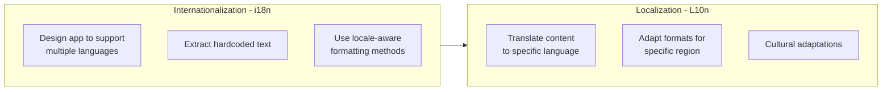
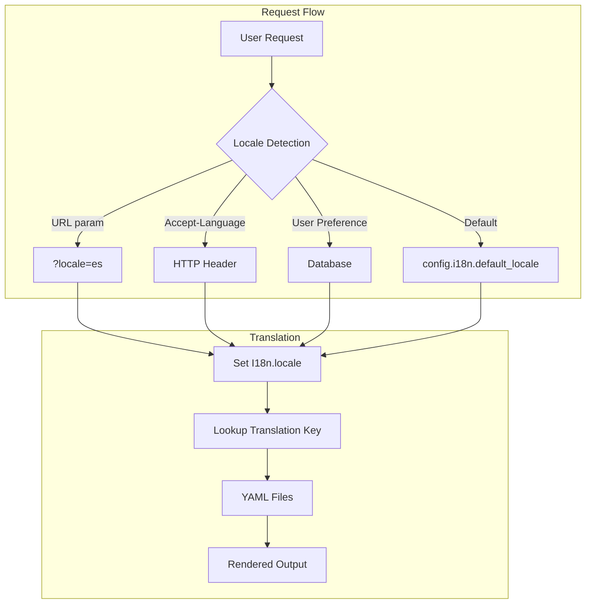
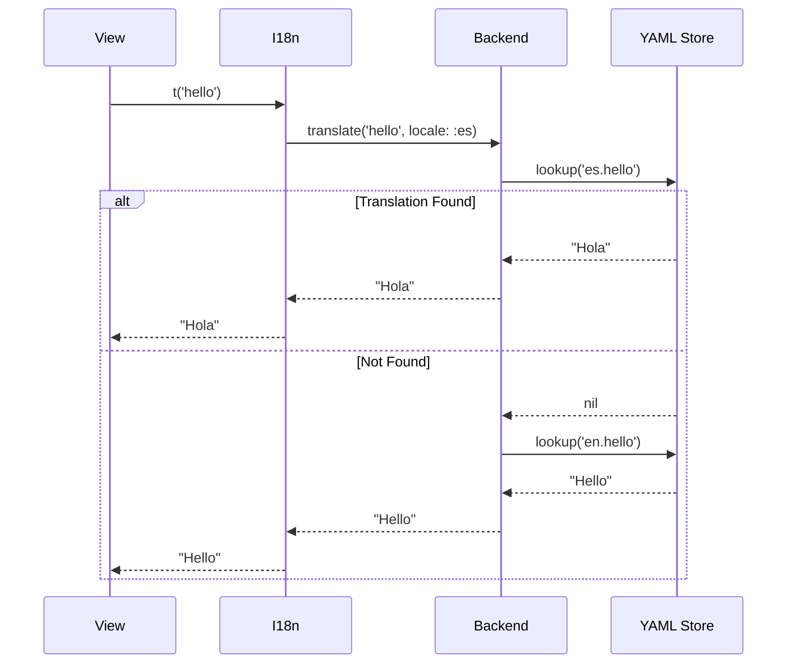
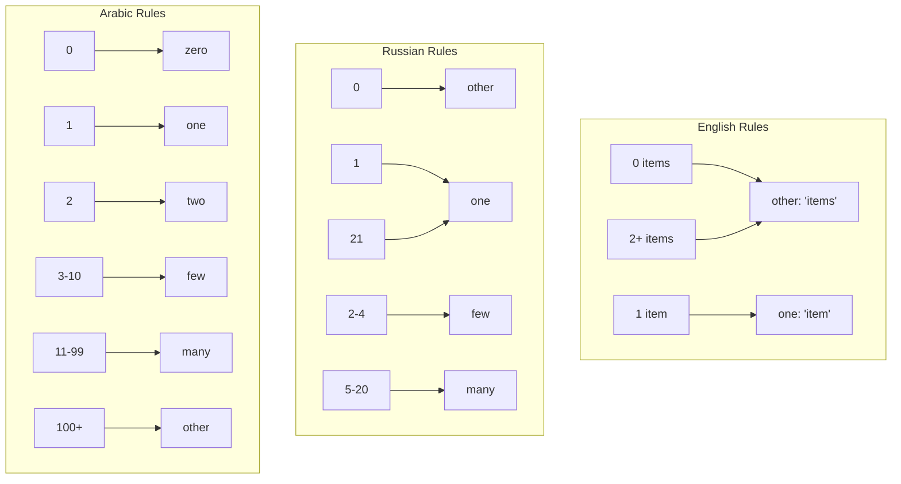
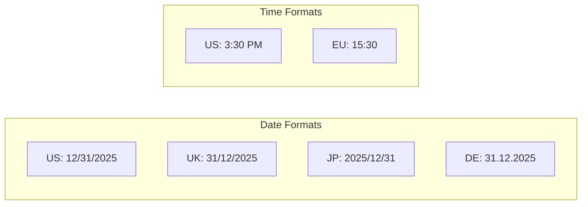
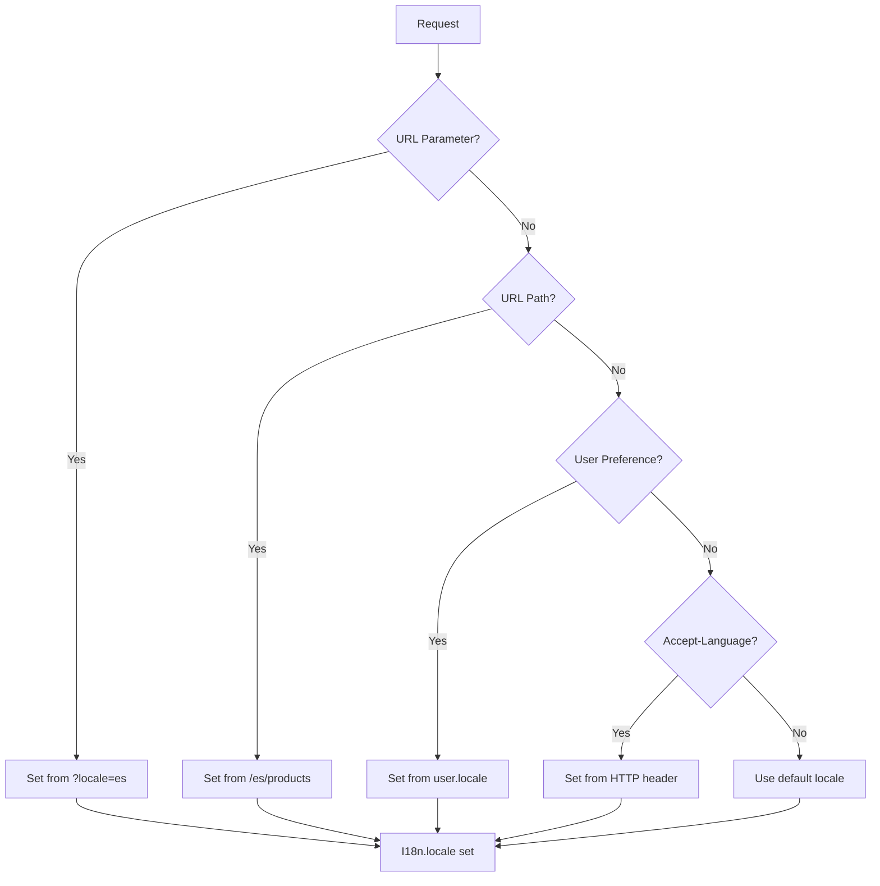
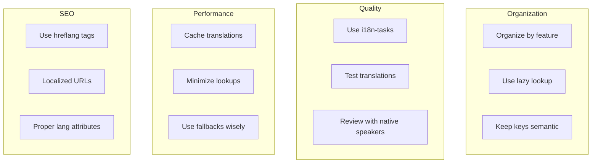

# How to Handle Internationalization (i18n) in Rails

Author: [nawazdhandala](https://www.github.com/nawazdhandala)

Tags: Ruby, Rails, i18n, Internationalization, Localization, Translation

Description: A comprehensive guide to implementing internationalization (i18n) in Ruby on Rails applications. Learn locale configuration, translation files, pluralization, date formatting, and best practices for building multilingual applications.

---

> Building applications for a global audience requires more than just translating text. Internationalization (i18n) encompasses language, date formats, currencies, pluralization rules, and cultural conventions. Rails provides a robust i18n framework that makes building multilingual applications straightforward.

Rails ships with the I18n gem built-in, providing a flexible foundation for translating your application into multiple languages while respecting locale-specific formatting rules. This guide covers everything from basic setup to advanced patterns for production applications.

---

## Understanding i18n vs L10n

Before diving into implementation, let's clarify the terminology:



- **Internationalization (i18n)**: Making your application capable of supporting multiple languages and regions
- **Localization (L10n)**: Adapting your application for a specific language or region

The numbers 18 and 10 represent the character count between the first and last letters of each word.

---

## How Rails i18n Works

Rails i18n follows a simple pattern: define translations in YAML files, reference them with keys in your code, and let Rails resolve the correct translation based on the current locale.



### Translation Lookup Process

When you call `I18n.t('greeting')`, Rails:

1. Checks the current locale (`I18n.locale`)
2. Looks for the translation in the corresponding YAML file
3. Falls back to the default locale if not found
4. Returns the key itself if no translation exists (in development)



---

## Getting Started

### Basic Configuration

Configure i18n in your Rails application:

```ruby
# config/application.rb
module MyApp
  class Application < Rails::Application
    # Set available locales for the application
    # This restricts which locales can be set
    config.i18n.available_locales = [:en, :es, :fr, :de, :ja, :zh]
    
    # Set the default locale
    # Used when no locale is explicitly set
    config.i18n.default_locale = :en
    
    # Enable locale fallbacks for missing translations
    # If a translation is missing, fall back to default locale
    config.i18n.fallbacks = true
    
    # Load translations from nested directories
    # Allows organizing locale files by feature
    config.i18n.load_path += Dir[
      Rails.root.join('config', 'locales', '**', '*.{rb,yml}')
    ]
  end
end
```

### Directory Structure for Locale Files

Organize your translation files for maintainability:

```
config/
  locales/
    en.yml              # English defaults (Rails provides this)
    es.yml              # Spanish
    fr.yml              # French
    models/
      en.yml            # Model translations (English)
      es.yml            # Model translations (Spanish)
    views/
      users/
        en.yml          # User views translations
        es.yml
      products/
        en.yml          # Product views translations
        es.yml
    mailers/
      en.yml            # Email translations
      es.yml
```

### Basic Translation Files

Create your translation files:

```yaml
# config/locales/en.yml
en:
  # Application name and common strings
  app_name: "MyApp"
  
  # Common actions
  actions:
    save: "Save"
    cancel: "Cancel"
    delete: "Delete"
    edit: "Edit"
    back: "Back"
    submit: "Submit"
    search: "Search"
    
  # Flash messages
  flash:
    create_success: "Successfully created."
    update_success: "Successfully updated."
    delete_success: "Successfully deleted."
    error: "An error occurred. Please try again."
    
  # Navigation
  nav:
    home: "Home"
    dashboard: "Dashboard"
    settings: "Settings"
    logout: "Log Out"
    
  # Common labels
  labels:
    email: "Email"
    password: "Password"
    name: "Name"
    created_at: "Created"
    updated_at: "Updated"
```

```yaml
# config/locales/es.yml
es:
  # Nombre de la aplicacion y cadenas comunes
  app_name: "MiApp"
  
  # Acciones comunes
  actions:
    save: "Guardar"
    cancel: "Cancelar"
    delete: "Eliminar"
    edit: "Editar"
    back: "Volver"
    submit: "Enviar"
    search: "Buscar"
    
  # Mensajes flash
  flash:
    create_success: "Creado con exito."
    update_success: "Actualizado con exito."
    delete_success: "Eliminado con exito."
    error: "Ocurrio un error. Por favor intente de nuevo."
    
  # Navegacion
  nav:
    home: "Inicio"
    dashboard: "Panel"
    settings: "Configuracion"
    logout: "Cerrar sesion"
    
  # Etiquetas comunes
  labels:
    email: "Correo electronico"
    password: "Contrasena"
    name: "Nombre"
    created_at: "Creado"
    updated_at: "Actualizado"
```

---

## Using Translations in Views

### Basic Translation Helper

The `t` helper (alias for `I18n.translate`) is the primary way to access translations:

```erb
<!-- app/views/layouts/application.html.erb -->
<!DOCTYPE html>
<html lang="<%= I18n.locale %>">
<head>
  <title><%= t('app_name') %></title>
</head>
<body>
  <!-- Navigation using translations -->
  <nav>
    <ul>
      <li><%= link_to t('nav.home'), root_path %></li>
      <li><%= link_to t('nav.dashboard'), dashboard_path %></li>
      <li><%= link_to t('nav.settings'), settings_path %></li>
      <li><%= link_to t('nav.logout'), logout_path %></li>
    </ul>
  </nav>
  
  <!-- Flash messages -->
  <% flash.each do |type, message| %>
    <div class="flash flash-<%= type %>">
      <%= message %>
    </div>
  <% end %>
  
  <%= yield %>
</body>
</html>
```

### Lazy Lookup

Rails provides lazy lookup based on the view path, reducing repetition:

```yaml
# config/locales/views/users/en.yml
en:
  users:
    index:
      title: "All Users"
      no_users: "No users found."
      
    show:
      title: "User Profile"
      member_since: "Member since %{date}"
      
    new:
      title: "Create New User"
      
    edit:
      title: "Edit User"
      
    form:
      email_placeholder: "Enter your email"
      password_placeholder: "Enter your password"
```

```erb
<!-- app/views/users/index.html.erb -->
<!-- Uses lazy lookup: .title resolves to users.index.title -->
<h1><%= t('.title') %></h1>

<% if @users.empty? %>
  <p><%= t('.no_users') %></p>
<% else %>
  <ul>
    <% @users.each do |user| %>
      <li><%= user.name %></li>
    <% end %>
  </ul>
<% end %>
```

```erb
<!-- app/views/users/show.html.erb -->
<h1><%= t('.title') %></h1>

<!-- Interpolation: Pass variables to translations -->
<p><%= t('.member_since', date: l(@user.created_at, format: :long)) %></p>
```

### Interpolation

Pass dynamic values into translations:

```yaml
# config/locales/en.yml
en:
  greeting: "Hello, %{name}!"
  welcome_back: "Welcome back, %{name}! You have %{count} new messages."
  
  users:
    greeting: "Hi %{first_name} %{last_name}!"
    points: "You have earned %{points} points."
```

```erb
<!-- Using interpolation -->
<p><%= t('greeting', name: @user.name) %></p>
<p><%= t('welcome_back', name: @user.name, count: @message_count) %></p>
<p><%= t('users.greeting', first_name: @user.first_name, last_name: @user.last_name) %></p>
```

---

## Pluralization

Different languages have different pluralization rules. Rails i18n handles this elegantly:



### Basic Pluralization

```yaml
# config/locales/en.yml
en:
  messages:
    inbox:
      zero: "No messages"
      one: "1 message"
      other: "%{count} messages"
      
  users:
    count:
      zero: "No users found"
      one: "1 user found"
      other: "%{count} users found"
      
  cart:
    items:
      zero: "Your cart is empty"
      one: "1 item in cart"
      other: "%{count} items in cart"
```

```yaml
# config/locales/es.yml
es:
  messages:
    inbox:
      zero: "No hay mensajes"
      one: "1 mensaje"
      other: "%{count} mensajes"
      
  users:
    count:
      zero: "No se encontraron usuarios"
      one: "1 usuario encontrado"
      other: "%{count} usuarios encontrados"
      
  cart:
    items:
      zero: "Tu carrito esta vacio"
      one: "1 articulo en el carrito"
      other: "%{count} articulos en el carrito"
```

```erb
<!-- Using pluralization -->
<p><%= t('messages.inbox', count: @messages.count) %></p>
<p><%= t('users.count', count: @users.count) %></p>
<p><%= t('cart.items', count: @cart.items.count) %></p>
```

### Complex Pluralization Rules

For languages with complex pluralization (like Russian, Arabic, or Polish), you may need custom pluralization rules:

```ruby
# config/initializers/pluralization.rb

# Russian pluralization rules
# 1 -> one
# 2-4 -> few
# 5-20 -> many
# 21 -> one
# 22-24 -> few
# etc.
{
  ru: {
    i18n: {
      plural: {
        keys: [:one, :few, :many, :other],
        rule: lambda { |n|
          if n % 10 == 1 && n % 100 != 11
            :one
          elsif [2, 3, 4].include?(n % 10) && ![12, 13, 14].include?(n % 100)
            :few
          elsif n % 10 == 0 || [5, 6, 7, 8, 9].include?(n % 10) || [11, 12, 13, 14].include?(n % 100)
            :many
          else
            :other
          end
        }
      }
    }
  }
}
```

```yaml
# config/locales/ru.yml
ru:
  comments:
    count:
      one: "%{count} комментарий"
      few: "%{count} комментария"
      many: "%{count} комментариев"
      other: "%{count} комментария"
```

---

## Date and Time Localization

Dates and times need to be formatted according to locale conventions:



### Configure Date and Time Formats

```yaml
# config/locales/en.yml
en:
  date:
    formats:
      default: "%Y-%m-%d"
      short: "%b %d"
      long: "%B %d, %Y"
      full: "%A, %B %d, %Y"
      
    day_names:
      - Sunday
      - Monday
      - Tuesday
      - Wednesday
      - Thursday
      - Friday
      - Saturday
      
    abbr_day_names:
      - Sun
      - Mon
      - Tue
      - Wed
      - Thu
      - Fri
      - Sat
      
    month_names:
      - ~
      - January
      - February
      - March
      - April
      - May
      - June
      - July
      - August
      - September
      - October
      - November
      - December
      
    abbr_month_names:
      - ~
      - Jan
      - Feb
      - Mar
      - Apr
      - May
      - Jun
      - Jul
      - Aug
      - Sep
      - Oct
      - Nov
      - Dec
      
  time:
    formats:
      default: "%Y-%m-%d %H:%M:%S"
      short: "%d %b %H:%M"
      long: "%B %d, %Y at %H:%M"
      time_only: "%H:%M"
      date_only: "%B %d, %Y"
      
    am: "AM"
    pm: "PM"
```

```yaml
# config/locales/es.yml
es:
  date:
    formats:
      default: "%d/%m/%Y"
      short: "%d %b"
      long: "%d de %B de %Y"
      full: "%A, %d de %B de %Y"
      
    day_names:
      - domingo
      - lunes
      - martes
      - miercoles
      - jueves
      - viernes
      - sabado
      
    abbr_day_names:
      - dom
      - lun
      - mar
      - mie
      - jue
      - vie
      - sab
      
    month_names:
      - ~
      - enero
      - febrero
      - marzo
      - abril
      - mayo
      - junio
      - julio
      - agosto
      - septiembre
      - octubre
      - noviembre
      - diciembre
      
    abbr_month_names:
      - ~
      - ene
      - feb
      - mar
      - abr
      - may
      - jun
      - jul
      - ago
      - sep
      - oct
      - nov
      - dic
      
  time:
    formats:
      default: "%d/%m/%Y %H:%M:%S"
      short: "%d %b %H:%M"
      long: "%d de %B de %Y a las %H:%M"
      time_only: "%H:%M"
      date_only: "%d de %B de %Y"
      
    am: "AM"
    pm: "PM"
```

### Using Localized Dates in Views

```erb
<!-- Using the localize helper (l) -->
<p>Created: <%= l(@post.created_at) %></p>
<p>Short: <%= l(@post.created_at, format: :short) %></p>
<p>Long: <%= l(@post.created_at, format: :long) %></p>

<!-- Date only -->
<p>Date: <%= l(@post.created_at.to_date) %></p>
<p>Date (long): <%= l(@post.created_at.to_date, format: :long) %></p>
```

### Relative Time Helpers

Create helpers for relative time display:

```ruby
# app/helpers/time_helper.rb
module TimeHelper
  # Display time relative to now
  # Examples: "2 hours ago", "in 3 days", "just now"
  def time_ago_in_words_with_locale(time)
    distance = time_ago_in_words(time)
    t('datetime.distance_in_words.ago', time: distance)
  end
end
```

```yaml
# config/locales/en.yml
en:
  datetime:
    distance_in_words:
      ago: "%{time} ago"
      
      about_x_hours:
        one: "about 1 hour"
        other: "about %{count} hours"
        
      about_x_months:
        one: "about 1 month"
        other: "about %{count} months"
        
      about_x_years:
        one: "about 1 year"
        other: "about %{count} years"
        
      almost_x_years:
        one: "almost 1 year"
        other: "almost %{count} years"
        
      half_a_minute: "half a minute"
      
      less_than_x_minutes:
        one: "less than a minute"
        other: "less than %{count} minutes"
        
      less_than_x_seconds:
        one: "less than 1 second"
        other: "less than %{count} seconds"
        
      over_x_years:
        one: "over 1 year"
        other: "over %{count} years"
        
      x_days:
        one: "1 day"
        other: "%{count} days"
        
      x_minutes:
        one: "1 minute"
        other: "%{count} minutes"
        
      x_months:
        one: "1 month"
        other: "%{count} months"
        
      x_seconds:
        one: "1 second"
        other: "%{count} seconds"
        
      x_years:
        one: "1 year"
        other: "%{count} years"
```

---

## Number and Currency Formatting

Numbers and currencies have different formatting conventions across locales:

```yaml
# config/locales/en.yml
en:
  number:
    format:
      separator: "."        # Decimal separator
      delimiter: ","        # Thousands separator
      precision: 2
      
    currency:
      format:
        unit: "$"
        format: "%u%n"      # $1,234.56
        separator: "."
        delimiter: ","
        precision: 2
        
    percentage:
      format:
        delimiter: ","
        format: "%n%"       # 50%
        
    human:
      format:
        delimiter: ","
        precision: 3
        
      storage_units:
        format: "%n %u"
        units:
          byte:
            one: "Byte"
            other: "Bytes"
          kb: "KB"
          mb: "MB"
          gb: "GB"
          tb: "TB"
          pb: "PB"
```

```yaml
# config/locales/de.yml
de:
  number:
    format:
      separator: ","        # Germans use comma for decimal
      delimiter: "."        # And period for thousands
      precision: 2
      
    currency:
      format:
        unit: "EUR"
        format: "%n %u"     # 1.234,56 EUR
        separator: ","
        delimiter: "."
        precision: 2
        
    percentage:
      format:
        delimiter: "."
        format: "%n %"      # 50 %
```

### Using Number Helpers

```erb
<!-- Number formatting -->
<p><%= number_with_delimiter(1234567.89) %></p>
<!-- en: 1,234,567.89 -->
<!-- de: 1.234.567,89 -->

<!-- Currency formatting -->
<p><%= number_to_currency(1234.56) %></p>
<!-- en: $1,234.56 -->
<!-- de: 1.234,56 EUR -->

<!-- Percentage formatting -->
<p><%= number_to_percentage(75.5) %></p>
<!-- en: 75.5% -->
<!-- de: 75,5 % -->

<!-- Human readable file size -->
<p><%= number_to_human_size(1234567890) %></p>
<!-- 1.15 GB -->
```

---

## Setting the Locale

There are multiple strategies for detecting and setting the locale:



### Using URL Parameters

```ruby
# app/controllers/application_controller.rb
class ApplicationController < ActionController::Base
  # Set locale before every action
  around_action :switch_locale
  
  private
  
  def switch_locale(&action)
    # Get locale from URL parameter, user preference, or default
    locale = extract_locale || I18n.default_locale
    
    # Ensure the locale is valid
    locale = I18n.default_locale unless I18n.available_locales.include?(locale.to_sym)
    
    # Set locale for this request
    I18n.with_locale(locale, &action)
  end
  
  def extract_locale
    # Priority: URL param > User preference > Accept-Language header
    params[:locale] ||
      current_user&.locale ||
      extract_locale_from_accept_language_header
  end
  
  def extract_locale_from_accept_language_header
    # Parse Accept-Language header
    # Example: "en-US,en;q=0.9,es;q=0.8"
    header = request.env['HTTP_ACCEPT_LANGUAGE']
    return nil unless header
    
    # Extract and return the first matching locale
    header.scan(/[a-z]{2}(?=-|;|,|$)/).find do |locale|
      I18n.available_locales.include?(locale.to_sym)
    end&.to_sym
  end
  
  # Include locale in all generated URLs
  def default_url_options
    { locale: I18n.locale }
  end
end
```

### Using URL Path Segments

For SEO-friendly URLs like `/es/products`:

```ruby
# config/routes.rb
Rails.application.routes.draw do
  # Scope all routes under optional locale
  scope "(:locale)", locale: /en|es|fr|de/ do
    resources :products
    resources :users
    root 'home#index'
  end
end
```

```ruby
# app/controllers/application_controller.rb
class ApplicationController < ActionController::Base
  around_action :switch_locale
  
  private
  
  def switch_locale(&action)
    locale = params[:locale] || I18n.default_locale
    I18n.with_locale(locale, &action)
  end
  
  def default_url_options
    { locale: I18n.locale == I18n.default_locale ? nil : I18n.locale }
  end
end
```

### Using Subdomains

For large applications, use subdomains like `es.example.com`:

```ruby
# app/controllers/application_controller.rb
class ApplicationController < ActionController::Base
  around_action :switch_locale
  
  private
  
  def switch_locale(&action)
    locale = extract_locale_from_subdomain || I18n.default_locale
    I18n.with_locale(locale, &action)
  end
  
  def extract_locale_from_subdomain
    # Parse subdomain (e.g., 'es' from 'es.example.com')
    subdomain = request.subdomain
    return nil if subdomain.blank? || subdomain == 'www'
    
    subdomain.to_sym if I18n.available_locales.include?(subdomain.to_sym)
  end
end
```

### Storing User Locale Preference

```ruby
# app/models/user.rb
class User < ApplicationRecord
  # Validate locale is in available locales
  validates :locale, inclusion: { 
    in: I18n.available_locales.map(&:to_s),
    allow_nil: true 
  }
  
  # Return locale as symbol
  def locale
    super&.to_sym
  end
end
```

```ruby
# db/migrate/20250702000000_add_locale_to_users.rb
class AddLocaleToUsers < ActiveRecord::Migration[7.0]
  def change
    add_column :users, :locale, :string, limit: 10
  end
end
```

```ruby
# app/controllers/users_controller.rb
class UsersController < ApplicationController
  def update_locale
    if current_user.update(locale: params[:locale])
      redirect_back fallback_location: root_path, 
                    notice: t('users.locale_updated')
    else
      redirect_back fallback_location: root_path, 
                    alert: t('users.locale_update_failed')
    end
  end
end
```

---

## Model Translations

Translate model attributes and error messages:

```yaml
# config/locales/models/en.yml
en:
  activerecord:
    models:
      user:
        one: "User"
        other: "Users"
      product:
        one: "Product"
        other: "Products"
      order:
        one: "Order"
        other: "Orders"
        
    attributes:
      user:
        email: "Email address"
        password: "Password"
        password_confirmation: "Confirm password"
        name: "Full name"
        created_at: "Joined"
        
      product:
        name: "Product name"
        description: "Description"
        price: "Price"
        sku: "SKU"
        quantity: "Quantity in stock"
        
    errors:
      models:
        user:
          attributes:
            email:
              blank: "is required"
              taken: "is already registered"
              invalid: "must be a valid email"
            password:
              blank: "is required"
              too_short: "must be at least %{count} characters"
              
      messages:
        blank: "cannot be blank"
        taken: "has already been taken"
        too_short: "is too short (minimum %{count} characters)"
        too_long: "is too long (maximum %{count} characters)"
        invalid: "is invalid"
        confirmation: "does not match"
        not_a_number: "must be a number"
        greater_than: "must be greater than %{count}"
        less_than: "must be less than %{count}"
```

```yaml
# config/locales/models/es.yml
es:
  activerecord:
    models:
      user:
        one: "Usuario"
        other: "Usuarios"
      product:
        one: "Producto"
        other: "Productos"
      order:
        one: "Pedido"
        other: "Pedidos"
        
    attributes:
      user:
        email: "Correo electronico"
        password: "Contrasena"
        password_confirmation: "Confirmar contrasena"
        name: "Nombre completo"
        created_at: "Registrado"
        
      product:
        name: "Nombre del producto"
        description: "Descripcion"
        price: "Precio"
        sku: "Codigo"
        quantity: "Cantidad en stock"
        
    errors:
      models:
        user:
          attributes:
            email:
              blank: "es requerido"
              taken: "ya esta registrado"
              invalid: "debe ser un correo valido"
            password:
              blank: "es requerida"
              too_short: "debe tener al menos %{count} caracteres"
              
      messages:
        blank: "no puede estar en blanco"
        taken: "ya ha sido tomado"
        too_short: "es demasiado corto (minimo %{count} caracteres)"
        too_long: "es demasiado largo (maximo %{count} caracteres)"
        invalid: "es invalido"
        confirmation: "no coincide"
        not_a_number: "debe ser un numero"
        greater_than: "debe ser mayor que %{count}"
        less_than: "debe ser menor que %{count}"
```

### Using Model Translations

```erb
<!-- Display model name -->
<h1><%= User.model_name.human(count: @users.count) %></h1>
<!-- Singular: "User", Plural: "Users" -->

<!-- Display attribute label -->
<%= f.label :email %>
<!-- Uses: activerecord.attributes.user.email -->

<!-- Display errors with translated messages -->
<% if @user.errors.any? %>
  <ul>
    <% @user.errors.full_messages.each do |message| %>
      <li><%= message %></li>
    <% end %>
  </ul>
<% end %>
```

---

## Translating Dynamic Content

For user-generated content or database records that need translation:

### Using Globalize Gem

```ruby
# Gemfile
gem 'globalize'
```

```ruby
# db/migrate/20250702000001_create_products.rb
class CreateProducts < ActiveRecord::Migration[7.0]
  def change
    create_table :products do |t|
      t.decimal :price, precision: 10, scale: 2
      t.string :sku
      t.timestamps
    end
  end
end
```

```ruby
# db/migrate/20250702000002_create_product_translations.rb
class CreateProductTranslations < ActiveRecord::Migration[7.0]
  def change
    # Globalize creates a separate table for translations
    create_table :product_translations do |t|
      t.references :product, null: false, foreign_key: true
      t.string :locale, null: false
      t.string :name
      t.text :description
      t.timestamps
    end
    
    add_index :product_translations, [:product_id, :locale], unique: true
  end
end
```

```ruby
# app/models/product.rb
class Product < ApplicationRecord
  # Declare which attributes are translated
  translates :name, :description
  
  # Eager load translations by default
  default_scope { includes(:translations) }
  
  # Validate presence of translated attributes
  validates :name, presence: true
end
```

```ruby
# app/controllers/products_controller.rb
class ProductsController < ApplicationController
  def create
    @product = Product.new(product_params)
    
    if @product.save
      redirect_to @product, notice: t('flash.create_success')
    else
      render :new
    end
  end
  
  def update
    if @product.update(product_params)
      redirect_to @product, notice: t('flash.update_success')
    else
      render :edit
    end
  end
  
  private
  
  def product_params
    # Permit translations for all locales
    params.require(:product).permit(
      :price, :sku,
      translations_attributes: [:id, :locale, :name, :description]
    )
  end
end
```

### Manual Translation Management

For simpler cases without a gem:

```ruby
# app/models/article.rb
class Article < ApplicationRecord
  # Store translations in a JSON column
  # { "en" => "Hello", "es" => "Hola" }
  serialize :title_translations, JSON
  serialize :body_translations, JSON
  
  # Get translated title
  def title
    title_translations&.dig(I18n.locale.to_s) || 
      title_translations&.dig(I18n.default_locale.to_s)
  end
  
  # Set translated title
  def title=(value)
    self.title_translations ||= {}
    self.title_translations[I18n.locale.to_s] = value
  end
  
  # Get translated body
  def body
    body_translations&.dig(I18n.locale.to_s) || 
      body_translations&.dig(I18n.default_locale.to_s)
  end
  
  # Set translated body
  def body=(value)
    self.body_translations ||= {}
    self.body_translations[I18n.locale.to_s] = value
  end
end
```

---

## Locale Switcher Component

Create a user-friendly locale switcher:

```ruby
# app/helpers/locale_helper.rb
module LocaleHelper
  # Language names in their native form
  LOCALE_NAMES = {
    en: 'English',
    es: 'Espanol',
    fr: 'Francais',
    de: 'Deutsch',
    ja: '日本語',
    zh: '中文'
  }.freeze
  
  # Return the native name for a locale
  def locale_name(locale)
    LOCALE_NAMES[locale.to_sym] || locale.to_s.upcase
  end
  
  # Build locale switcher links
  def locale_switcher_links
    I18n.available_locales.map do |locale|
      active = I18n.locale == locale
      
      link_to locale_name(locale), 
              url_for(locale: locale),
              class: "locale-link #{'active' if active}",
              hreflang: locale,
              lang: locale
    end
  end
end
```

```erb
<!-- app/views/shared/_locale_switcher.html.erb -->
<nav class="locale-switcher" aria-label="<%= t('nav.language_selector') %>">
  <% I18n.available_locales.each do |locale| %>
    <% if locale == I18n.locale %>
      <span class="locale-link active" aria-current="true">
        <%= locale_name(locale) %>
      </span>
    <% else %>
      <%= link_to locale_name(locale), 
                  url_for(locale: locale),
                  class: "locale-link",
                  hreflang: locale,
                  lang: locale %>
    <% end %>
  <% end %>
</nav>
```

### Dropdown Locale Switcher

```erb
<!-- app/views/shared/_locale_dropdown.html.erb -->
<div class="dropdown locale-dropdown">
  <button class="dropdown-toggle" aria-haspopup="true" aria-expanded="false">
    <%= locale_name(I18n.locale) %>
    <svg class="icon" aria-hidden="true"><!-- dropdown icon --></svg>
  </button>
  
  <ul class="dropdown-menu" role="menu">
    <% I18n.available_locales.each do |locale| %>
      <li role="menuitem">
        <%= link_to locale_name(locale),
                    url_for(locale: locale),
                    class: "dropdown-item #{'active' if locale == I18n.locale}",
                    hreflang: locale,
                    lang: locale %>
      </li>
    <% end %>
  </ul>
</div>
```

---

## Testing i18n

### Testing Translations Exist

```ruby
# spec/i18n_spec.rb
require 'rails_helper'
require 'i18n/tasks'

RSpec.describe 'I18n' do
  let(:i18n) { I18n::Tasks::BaseTask.new }
  
  it 'has no missing translations' do
    missing = i18n.missing_keys
    expect(missing).to be_empty,
      "Missing translations:\n#{missing.inspect}"
  end
  
  it 'has no unused translations' do
    unused = i18n.unused_keys
    expect(unused).to be_empty,
      "Unused translations:\n#{unused.inspect}"
  end
  
  it 'files are properly normalized' do
    non_normalized = i18n.non_normalized_paths
    expect(non_normalized).to be_empty,
      "Non-normalized files:\n#{non_normalized.join("\n")}"
  end
end
```

### Using i18n-tasks Gem

```ruby
# Gemfile
group :development, :test do
  gem 'i18n-tasks', '~> 1.0'
end
```

```yaml
# config/i18n-tasks.yml
base_locale: en

# Specify locales to check
locales: [en, es, fr, de]

# Patterns to ignore
ignore_unused:
  - 'activerecord.errors.*'
  - 'date.*'
  - 'time.*'
  - 'number.*'
  - 'datetime.*'
  - 'errors.*'
  
ignore_missing:
  - 'devise.*'  # Third-party gems
```

```bash
# Run i18n tasks
bundle exec i18n-tasks missing
bundle exec i18n-tasks unused
bundle exec i18n-tasks normalize
```

### Testing Controllers with Locales

```ruby
# spec/controllers/products_controller_spec.rb
require 'rails_helper'

RSpec.describe ProductsController, type: :controller do
  describe 'locale switching' do
    it 'uses the locale from URL parameter' do
      get :index, params: { locale: 'es' }
      expect(I18n.locale).to eq(:es)
    end
    
    it 'falls back to default locale for invalid locale' do
      get :index, params: { locale: 'invalid' }
      expect(I18n.locale).to eq(:en)
    end
    
    it 'includes locale in generated URLs' do
      get :index, params: { locale: 'fr' }
      expect(controller.url_for(action: :index)).to include('locale=fr')
    end
  end
end
```

### Testing Views with Translations

```ruby
# spec/views/products/index.html.erb_spec.rb
require 'rails_helper'

RSpec.describe 'products/index', type: :view do
  before do
    assign(:products, [])
  end
  
  it 'displays translated title in English' do
    I18n.with_locale(:en) do
      render
      expect(rendered).to have_css('h1', text: 'All Products')
    end
  end
  
  it 'displays translated title in Spanish' do
    I18n.with_locale(:es) do
      render
      expect(rendered).to have_css('h1', text: 'Todos los Productos')
    end
  end
end
```

---

## SEO Considerations

Proper i18n implementation is crucial for international SEO:

```mermaid
flowchart TB
    subgraph SEO Best Practices
        A[Use hreflang tags] --> B[Tell search engines<br/>about language versions]
        C[Localized URLs] --> D[/es/productos vs<br/>?locale=es]
        E[Proper lang attribute] --> F[html lang='es']
        G[Localized sitemap] --> H[Include all language<br/>versions]
    end
```

### Add hreflang Tags

```erb
<!-- app/views/layouts/application.html.erb -->
<!DOCTYPE html>
<html lang="<%= I18n.locale %>">
<head>
  <!-- Other head content -->
  
  <!-- hreflang tags for all language versions -->
  <% I18n.available_locales.each do |locale| %>
    <link rel="alternate" 
          hreflang="<%= locale %>" 
          href="<%= url_for(locale: locale, only_path: false) %>" />
  <% end %>
  
  <!-- x-default for automatic language selection -->
  <link rel="alternate" 
        hreflang="x-default" 
        href="<%= url_for(locale: nil, only_path: false) %>" />
</head>
```

### Localized Sitemap

```ruby
# app/controllers/sitemaps_controller.rb
class SitemapsController < ApplicationController
  def index
    @products = Product.published
    
    respond_to do |format|
      format.xml
    end
  end
end
```

```erb
<!-- app/views/sitemaps/index.xml.erb -->
<?xml version="1.0" encoding="UTF-8"?>
<urlset xmlns="http://www.sitemaps.org/schemas/sitemap/0.9"
        xmlns:xhtml="http://www.w3.org/1999/xhtml">
  <% @products.each do |product| %>
    <% I18n.available_locales.each do |locale| %>
      <url>
        <loc><%= product_url(product, locale: locale) %></loc>
        <lastmod><%= product.updated_at.strftime('%Y-%m-%d') %></lastmod>
        <% I18n.available_locales.each do |alt_locale| %>
          <xhtml:link 
            rel="alternate" 
            hreflang="<%= alt_locale %>" 
            href="<%= product_url(product, locale: alt_locale) %>" />
        <% end %>
      </url>
    <% end %>
  <% end %>
</urlset>
```

---

## Performance Optimization

### Caching Translations

Rails caches translations automatically, but you can optimize further:

```ruby
# config/environments/production.rb
Rails.application.configure do
  # Enable translation caching
  config.i18n.cache_translations = true
end
```

### Lazy Loading Translations

For large applications, load translations lazily:

```ruby
# config/initializers/i18n.rb

# Only load translations for the current locale
# Reduces memory usage in production
if Rails.env.production?
  I18n.backend = I18n::Backend::LazyLoadable.new
end
```

### Precompiling Translations

```ruby
# config/initializers/i18n.rb

# Precompile common translations at boot
Rails.application.config.after_initialize do
  I18n.backend.load_translations
end
```

---

## Best Practices Summary



### Key Takeaways

1. **Extract all user-facing text** into translation files
2. **Use semantic keys** that describe content, not location
3. **Organize translations** by feature or domain
4. **Use lazy lookup** (`.title`) to reduce repetition
5. **Handle pluralization** correctly for each language
6. **Localize dates and numbers** using locale-aware helpers
7. **Implement proper locale detection** (URL, user preference, headers)
8. **Add hreflang tags** for SEO
9. **Test translations** with i18n-tasks
10. **Review with native speakers** before launch

---

## Complete Configuration Example

```ruby
# config/application.rb
module MyApp
  class Application < Rails::Application
    # Available locales
    config.i18n.available_locales = [:en, :es, :fr, :de]
    
    # Default locale
    config.i18n.default_locale = :en
    
    # Enable fallbacks
    config.i18n.fallbacks = true
    
    # Load all locale files
    config.i18n.load_path += Dir[
      Rails.root.join('config', 'locales', '**', '*.{rb,yml}')
    ]
  end
end
```

```ruby
# app/controllers/application_controller.rb
class ApplicationController < ActionController::Base
  around_action :switch_locale
  
  private
  
  def switch_locale(&action)
    locale = extract_locale || I18n.default_locale
    I18n.with_locale(locale, &action)
  end
  
  def extract_locale
    locale = params[:locale] || 
             current_user&.locale || 
             extract_locale_from_header
    
    return locale.to_sym if valid_locale?(locale)
    nil
  end
  
  def extract_locale_from_header
    request.env['HTTP_ACCEPT_LANGUAGE']
      &.scan(/[a-z]{2}/)
      &.find { |l| valid_locale?(l) }
  end
  
  def valid_locale?(locale)
    I18n.available_locales.include?(locale&.to_sym)
  end
  
  def default_url_options
    { locale: I18n.locale }
  end
end
```

---

## Summary

Rails i18n provides a comprehensive framework for building multilingual applications. Key points:

- **I18n is built into Rails** and requires no additional gems for basic functionality
- **Translation files** are YAML-based and can be organized by feature
- **Interpolation and pluralization** handle dynamic content elegantly
- **Date and number formatting** respects locale conventions automatically
- **Model translations** integrate with Active Record validations
- **SEO optimization** requires hreflang tags and localized URLs
- **Testing** with i18n-tasks catches missing and unused translations

Start with the default locale, extract all hardcoded strings, and add locales incrementally as your audience grows.

---

*Building a multilingual Rails application that needs to be monitored? [OneUptime](https://oneuptime.com) provides comprehensive monitoring, status pages, and incident management with full internationalization support for your global audience.*
