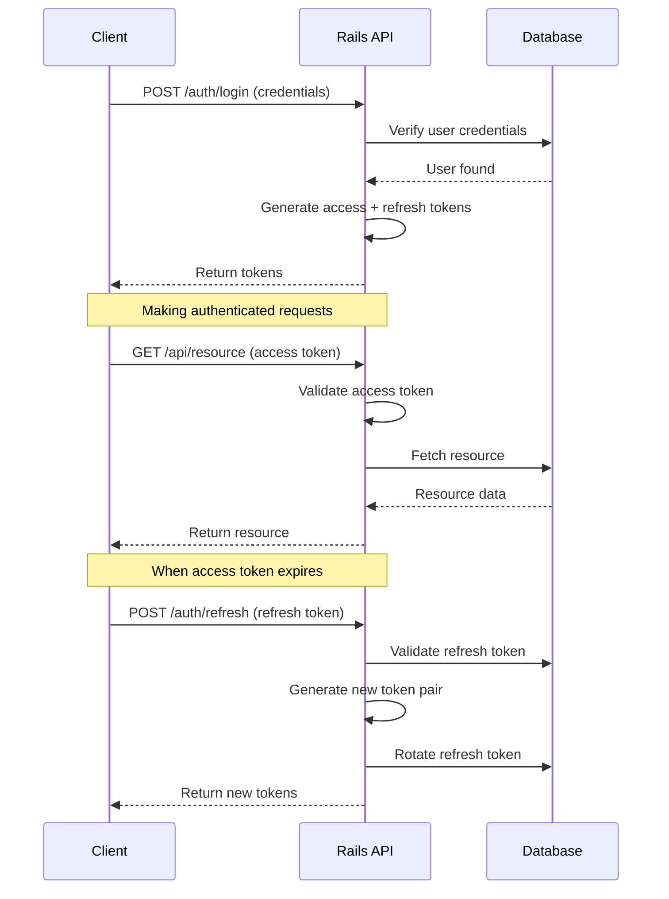
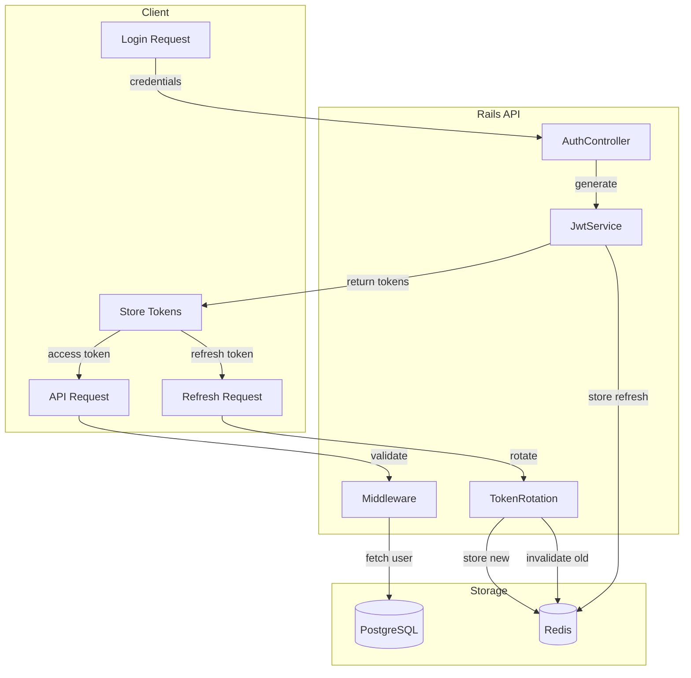
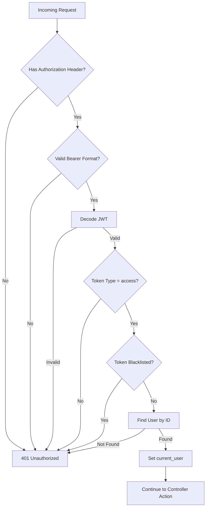

```markdown
# How to Implement API Authentication with JWT in Rails

Author: [nawazdhandala](https://www.github.com/nawazdhandala)

Tags: Ruby, Rails, JWT, Authentication, API, Security

Description: Learn how to implement secure JWT authentication in Ruby on Rails API applications. This guide covers token generation, refresh token rotation, middleware integration, and production best practices.

---

> JWT authentication is the backbone of modern API security. Getting it wrong leaves your users vulnerable to token theft and session hijacking. This guide walks you through implementing JWT authentication in Rails the right way - with short-lived tokens, refresh rotation, and proper revocation.

Building a secure API requires more than just generating tokens. You need a complete authentication system that handles token lifecycle, revocation, and security edge cases. Let us dive into implementing production-ready JWT authentication in Rails.

---

## Understanding JWT Authentication Flow

Before writing code, let us understand how JWT authentication works in a typical API application.



The key principles are:

1. **Access tokens** are short-lived (15-30 minutes)
2. **Refresh tokens** are longer-lived but rotated on use
3. **Every refresh** invalidates the old token
4. **Logout** revokes all user tokens

---

## Project Setup

### Required Gems

Add these gems to your Gemfile for JWT handling, secure password storage, and Redis for token storage:

```ruby
# Gemfile
# JWT encoding and decoding
gem 'jwt'

# Secure password hashing
gem 'bcrypt', '~> 3.1.7'

# Redis for token storage and blacklisting
gem 'redis', '~> 5.0'

# Environment variable management
gem 'dotenv-rails', groups: [:development, :test]
```

Install the dependencies:

```bash
bundle install
```

### Environment Configuration

Never hardcode secrets. Use environment variables for all sensitive configuration:

```bash
# .env (never commit this file!)

# Generate with: rails secret
JWT_SECRET_KEY=your_256_bit_secret_here

# Token expiration settings (in seconds)
JWT_ACCESS_TOKEN_EXPIRY=900       # 15 minutes
JWT_REFRESH_TOKEN_EXPIRY=604800   # 7 days

# Redis connection for token storage
REDIS_URL=redis://localhost:6379/0
```

Add the .env file to .gitignore:

```bash
echo ".env" >> .gitignore
```

---

## Token Architecture

Let us visualize how tokens flow through our system:



---

## JWT Service Implementation

The JWT service handles all token operations: encoding, decoding, and validation. This is the core of our authentication system.

```ruby
# app/services/jwt_service.rb
# Core JWT token handling service
# Manages token creation, validation, and payload extraction

class JwtService
  # Use HS256 for single-service apps
  # Use RS256 for microservices (asymmetric keys)
  ALGORITHM = 'HS256'.freeze

  class << self
    # Encode a payload into a JWT token
    # @param payload [Hash] the data to encode (user_id, type, etc.)
    # @param expiry [Integer] seconds until token expires
    # @return [String] the encoded JWT token
    def encode(payload, expiry = access_token_expiry)
      # Build the complete payload with standard JWT claims
      payload_with_claims = payload.merge(
        # Expiration time - token invalid after this
        exp: expiry.seconds.from_now.to_i,
        # Issued at time - when token was created
        iat: Time.current.to_i,
        # Unique token identifier for revocation tracking
        jti: SecureRandom.uuid
      )

      # Sign the token with our secret key
      JWT.encode(payload_with_claims, secret_key, ALGORITHM)
    end

    # Decode and validate a JWT token
    # @param token [String] the JWT token to decode
    # @return [HashWithIndifferentAccess] the decoded payload
    # @raise [JWT::DecodeError] if token is invalid or expired
    def decode(token)
      # JWT.decode returns [payload, header] - we only need payload
      decoded = JWT.decode(
        token,
        secret_key,
        true, # Verify signature
        {
          algorithm: ALGORITHM,
          verify_expiration: true # Auto-check expiration
        }
      )

      # Return payload with indifferent access for convenience
      decoded.first.with_indifferent_access
    rescue JWT::ExpiredSignature
      # Specific error for expired tokens (client should refresh)
      raise JWT::DecodeError, 'Token has expired'
    rescue JWT::DecodeError => e
      # Re-raise with consistent error type
      raise JWT::DecodeError, "Invalid token: #{e.message}"
    end

    # Create an access token for API authentication
    # Access tokens are short-lived and used for every API request
    # @param user_id [Integer] the user's database ID
    # @return [String] the encoded access token
    def create_access_token(user_id)
      encode(
        {
          sub: user_id.to_s,    # Subject - the user ID
          type: 'access'        # Token type for validation
        },
        access_token_expiry
      )
    end

    # Create a refresh token for obtaining new access tokens
    # Refresh tokens are longer-lived but rotated on each use
    # @param user_id [Integer] the user's database ID
    # @return [String] the encoded refresh token
    def create_refresh_token(user_id)
      encode(
        {
          sub: user_id.to_s,
          type: 'refresh'
        },
        refresh_token_expiry
      )
    end

    # Generate both tokens at once (for login and refresh)
    # @param user_id [Integer] the user's database ID
    # @return [Hash] containing access_token and refresh_token
    def create_token_pair(user_id)
      {
        access_token: create_access_token(user_id),
        refresh_token: create_refresh_token(user_id)
      }
    end

    private

    # Fetch secret key from environment
    # Raises error if not configured to prevent insecure defaults
    def secret_key
      key = ENV.fetch('JWT_SECRET_KEY') do
        raise 'JWT_SECRET_KEY environment variable is not set'
      end

      # Validate key length for security
      if key.length < 32
        raise 'JWT_SECRET_KEY must be at least 32 characters'
      end

      key
    end

    # Access token expiry in seconds (default: 15 minutes)
    def access_token_expiry
      ENV.fetch('JWT_ACCESS_TOKEN_EXPIRY', 900).to_i
    end

    # Refresh token expiry in seconds (default: 7 days)
    def refresh_token_expiry
      ENV.fetch('JWT_REFRESH_TOKEN_EXPIRY', 604800).to_i
    end
  end
end
```

---

## Refresh Token Storage and Rotation

Refresh tokens need to be stored server-side for rotation and revocation. We use Redis for fast lookups and automatic expiration.

```ruby
# app/services/refresh_token_service.rb
# Manages refresh token lifecycle: storage, rotation, and revocation
# Uses Redis for fast token lookups and automatic expiration

class RefreshTokenService
  # Redis key prefixes for organization
  TOKEN_PREFIX = 'refresh_token:'.freeze
  FAMILY_PREFIX = 'token_family:'.freeze
  USER_TOKENS_PREFIX = 'user_tokens:'.freeze

  class << self
    # Store a new refresh token and return its metadata
    # @param user_id [Integer] the user's database ID
    # @param device_info [String] user agent or device identifier
    # @return [Hash] containing the token and family_id
    def create(user_id, device_info = nil)
      # Generate the JWT refresh token
      token = JwtService.create_refresh_token(user_id)
      payload = JwtService.decode(token)

      # Token family groups related refresh tokens
      # Used for detecting token reuse attacks
      family_id = SecureRandom.uuid

      # Store token metadata in Redis
      store_token(
        jti: payload[:jti],
        user_id: user_id,
        family_id: family_id,
        device_info: device_info,
        expires_at: Time.at(payload[:exp])
      )

      # Track this token in the user's token set
      add_to_user_tokens(user_id, payload[:jti])

      { token: token, family_id: family_id, jti: payload[:jti] }
    end

    # Rotate a refresh token - invalidate old, create new
    # This is the security-critical operation that prevents token theft
    # @param old_token [String] the current refresh token
    # @return [Hash] containing new access_token and refresh_token
    # @raise [SecurityError] if token reuse is detected
    def rotate(old_token)
      # Decode and validate the token
      payload = JwtService.decode(old_token)

      # Ensure this is actually a refresh token
      unless payload[:type] == 'refresh'
        raise JWT::DecodeError, 'Not a refresh token'
      end

      # Look up stored token metadata
      token_data = get_token(payload[:jti])

      unless token_data
        raise JWT::DecodeError, 'Refresh token not found'
      end

      # SECURITY: Check for token reuse
      # If token is already revoked, someone is replaying an old token
      if token_data[:revoked]
        # Potential attack detected - revoke entire token family
        revoke_family(token_data[:family_id])

        # Log security event for monitoring
        Rails.logger.warn(
          "Token reuse detected for user #{token_data[:user_id]}, " \
          "family #{token_data[:family_id]}"
        )

        raise SecurityError, 'Token reuse detected - all sessions revoked'
      end

      user_id = token_data[:user_id].to_i
      family_id = token_data[:family_id]

      # Mark old token as revoked (but keep for reuse detection)
      revoke_token(payload[:jti])

      # Create new token pair
      new_access = JwtService.create_access_token(user_id)
      new_refresh = JwtService.create_refresh_token(user_id)
      new_payload = JwtService.decode(new_refresh)

      # Store new refresh token in same family
      store_token(
        jti: new_payload[:jti],
        user_id: user_id,
        family_id: family_id,
        device_info: token_data[:device_info],
        expires_at: Time.at(new_payload[:exp])
      )

      # Update user's token set
      remove_from_user_tokens(user_id, payload[:jti])
      add_to_user_tokens(user_id, new_payload[:jti])

      {
        access_token: new_access,
        refresh_token: new_refresh
      }
    end

    # Revoke a single token (logout current session)
    # @param jti [String] the token's unique identifier
    def revoke_token(jti)
      token_key = "#{TOKEN_PREFIX}#{jti}"

      redis.multi do |multi|
        multi.hset(token_key, 'revoked', 'true')
        # Keep revoked tokens for 24 hours for reuse detection
        multi.expire(token_key, 86400)
      end
    end

    # Revoke all tokens in a family (security incident response)
    # @param family_id [String] the token family identifier
    def revoke_family(family_id)
      pattern = "#{TOKEN_PREFIX}*"

      # Find all tokens in this family
      redis.scan_each(match: pattern) do |key|
        if redis.hget(key, 'family_id') == family_id
          redis.hset(key, 'revoked', 'true')
        end
      end
    end

    # Revoke all tokens for a user (logout everywhere)
    # @param user_id [Integer] the user's database ID
    def revoke_all_user_tokens(user_id)
      # Get all token JTIs for this user
      user_key = "#{USER_TOKENS_PREFIX}#{user_id}"
      token_jtis = redis.smembers(user_key)

      # Revoke each token
      token_jtis.each do |jti|
        revoke_token(jti)
      end

      # Clear the user's token set
      redis.del(user_key)
    end

    # Validate a refresh token without rotating
    # @param token [String] the refresh token to validate
    # @return [Hash, nil] token data if valid, nil otherwise
    def validate(token)
      payload = JwtService.decode(token)
      return nil unless payload[:type] == 'refresh'

      token_data = get_token(payload[:jti])
      return nil unless token_data
      return nil if token_data[:revoked]

      token_data
    rescue JWT::DecodeError
      nil
    end

    private

    # Store token metadata in Redis
    def store_token(jti:, user_id:, family_id:, device_info:, expires_at:)
      token_key = "#{TOKEN_PREFIX}#{jti}"
      ttl = (expires_at - Time.current).to_i

      redis.multi do |multi|
        multi.hset(
          token_key,
          'user_id', user_id.to_s,
          'family_id', family_id,
          'device_info', device_info.to_s,
          'revoked', 'false',
          'created_at', Time.current.iso8601
        )
        # Auto-expire after token expiry plus buffer for reuse detection
        multi.expire(token_key, ttl + 86400)
      end
    end

    # Retrieve token metadata from Redis
    def get_token(jti)
      token_key = "#{TOKEN_PREFIX}#{jti}"
      data = redis.hgetall(token_key)

      return nil if data.empty?

      {
        user_id: data['user_id'],
        family_id: data['family_id'],
        device_info: data['device_info'],
        revoked: data['revoked'] == 'true',
        created_at: data['created_at']
      }
    end

    # Add token to user's token set
    def add_to_user_tokens(user_id, jti)
      user_key = "#{USER_TOKENS_PREFIX}#{user_id}"
      redis.sadd(user_key, jti)
    end

    # Remove token from user's token set
    def remove_from_user_tokens(user_id, jti)
      user_key = "#{USER_TOKENS_PREFIX}#{user_id}"
      redis.srem(user_key, jti)
    end

    # Redis connection
    def redis
      @redis ||= Redis.new(url: ENV.fetch('REDIS_URL', 'redis://localhost:6379/0'))
    end
  end
end
```

---

## User Model Setup

The User model handles password storage and validation:

```ruby
# app/models/user.rb
# User model with secure password handling

class User < ApplicationRecord
  # bcrypt integration for secure password hashing
  has_secure_password

  # Validations
  validates :email, presence: true,
                    uniqueness: { case_sensitive: false },
                    format: { with: URI::MailTo::EMAIL_REGEXP }

  validates :password, length: { minimum: 8 },
                       if: -> { new_record? || password.present? }

  # Normalize email before saving
  before_save :downcase_email

  # Find user by email (case-insensitive)
  # @param email [String] the email to search for
  # @return [User, nil] the user if found
  def self.find_by_email(email)
    find_by('LOWER(email) = ?', email.downcase)
  end

  # Authenticate user with email and password
  # @param email [String] the user's email
  # @param password [String] the plain text password
  # @return [User, nil] the user if credentials are valid
  def self.authenticate(email, password)
    user = find_by_email(email)
    return nil unless user

    # authenticate is provided by has_secure_password
    user.authenticate(password) || nil
  end

  private

  def downcase_email
    self.email = email.downcase
  end
end
```

Database migration for the User model:

```ruby
# db/migrate/XXXXXXXXXXXXXX_create_users.rb
class CreateUsers < ActiveRecord::Migration[7.0]
  def change
    create_table :users do |t|
      t.string :email, null: false
      t.string :password_digest, null: false
      t.string :name

      t.timestamps
    end

    # Index for fast email lookups (used in authentication)
    add_index :users, :email, unique: true
  end
end
```

---

## Authentication Controller

The controller handles login, token refresh, and logout endpoints:

```ruby
# app/controllers/api/v1/auth_controller.rb
# Authentication endpoints for JWT-based API authentication

module Api
  module V1
    class AuthController < ApplicationController
      # Skip authentication for login and refresh endpoints
      skip_before_action :authenticate_request, only: [:login, :refresh]

      # Rate limiting to prevent brute force attacks
      before_action :check_rate_limit, only: [:login, :refresh]

      # POST /api/v1/auth/login
      # Authenticate user and return token pair
      def login
        # Validate required parameters
        unless params[:email].present? && params[:password].present?
          return render_error('Email and password are required', :bad_request)
        end

        # Attempt authentication
        user = User.authenticate(params[:email], params[:password])

        unless user
          # Generic error to prevent email enumeration
          return render_error('Invalid email or password', :unauthorized)
        end

        # Generate token pair
        tokens = JwtService.create_token_pair(user.id)

        # Store refresh token for rotation tracking
        refresh_data = RefreshTokenService.create(
          user.id,
          request.user_agent
        )

        # Also get the jti from the generated token for response
        render json: {
          access_token: tokens[:access_token],
          refresh_token: refresh_data[:token],
          token_type: 'Bearer',
          expires_in: ENV.fetch('JWT_ACCESS_TOKEN_EXPIRY', 900).to_i,
          user: user_response(user)
        }, status: :ok
      end

      # POST /api/v1/auth/refresh
      # Exchange refresh token for new token pair
      def refresh
        refresh_token = params[:refresh_token]

        unless refresh_token.present?
          return render_error('Refresh token is required', :bad_request)
        end

        begin
          # Rotate tokens (old one is invalidated)
          tokens = RefreshTokenService.rotate(refresh_token)

          render json: {
            access_token: tokens[:access_token],
            refresh_token: tokens[:refresh_token],
            token_type: 'Bearer',
            expires_in: ENV.fetch('JWT_ACCESS_TOKEN_EXPIRY', 900).to_i
          }, status: :ok

        rescue JWT::DecodeError => e
          render_error(e.message, :unauthorized)

        rescue SecurityError => e
          # Token reuse detected - serious security event
          render_error(e.message, :forbidden)
        end
      end

      # POST /api/v1/auth/logout
      # Revoke current session's refresh token
      def logout
        # Get the JTI from the current access token
        if @current_token_jti
          RefreshTokenService.revoke_token(@current_token_jti)
        end

        render json: { message: 'Logged out successfully' }, status: :ok
      end

      # POST /api/v1/auth/logout_all
      # Revoke all sessions for current user
      def logout_all
        RefreshTokenService.revoke_all_user_tokens(@current_user.id)

        render json: { message: 'All sessions logged out' }, status: :ok
      end

      # GET /api/v1/auth/sessions
      # List all active sessions for current user
      def sessions
        # This would require additional tracking in RefreshTokenService
        # Left as an exercise - store device info and last used time
        render json: { message: 'Not implemented' }, status: :not_implemented
      end

      private

      # Format user data for API response
      def user_response(user)
        {
          id: user.id,
          email: user.email,
          name: user.name
        }
      end

      # Render error response in consistent format
      def render_error(message, status)
        render json: { error: message }, status: status
      end

      # Simple rate limiting using Rails cache
      # In production, use Redis or a dedicated rate limiter
      def check_rate_limit
        key = "rate_limit:auth:#{request.remote_ip}"
        count = Rails.cache.read(key).to_i

        if count >= 10 # 10 attempts per minute
          render_error('Too many requests', :too_many_requests)
          return
        end

        Rails.cache.write(key, count + 1, expires_in: 1.minute)
      end
    end
  end
end
```

---

## Authentication Middleware

The middleware validates access tokens on every protected request:

```ruby
# app/controllers/concerns/authenticatable.rb
# Concern for JWT authentication in controllers

module Authenticatable
  extend ActiveSupport::Concern

  included do
    before_action :authenticate_request
    attr_reader :current_user
  end

  private

  # Validate access token and set current_user
  def authenticate_request
    # Extract token from Authorization header
    header = request.headers['Authorization']
    token = extract_token(header)

    unless token
      render_unauthorized('Missing authentication token')
      return
    end

    begin
      # Decode and validate the token
      payload = JwtService.decode(token)

      # Verify this is an access token, not a refresh token
      unless payload[:type] == 'access'
        render_unauthorized('Invalid token type')
        return
      end

      # Store JTI for potential logout
      @current_token_jti = payload[:jti]

      # Optional: Check blacklist for immediate revocation
      if access_token_blacklisted?(payload[:jti])
        render_unauthorized('Token has been revoked')
        return
      end

      # Look up the user
      @current_user = User.find_by(id: payload[:sub])

      unless @current_user
        render_unauthorized('User not found')
        return
      end

    rescue JWT::DecodeError => e
      render_unauthorized(e.message)
    end
  end

  # Extract Bearer token from Authorization header
  def extract_token(header)
    return nil unless header.present?
    return nil unless header.start_with?('Bearer ')

    header.split(' ').last
  end

  # Render 401 Unauthorized response
  def render_unauthorized(message = 'Unauthorized')
    render json: { error: message }, status: :unauthorized
  end

  # Check if access token is blacklisted
  # Used for immediate revocation (password change, security incident)
  def access_token_blacklisted?(jti)
    AccessTokenBlacklist.blacklisted?(jti)
  end
end
```

---

## Access Token Blacklist

For immediate access token revocation (password changes, security incidents):

```ruby
# app/services/access_token_blacklist.rb
# In-memory blacklist for revoked access tokens
# Access tokens are stateless, so we need a blacklist for immediate revocation

class AccessTokenBlacklist
  BLACKLIST_PREFIX = 'access_blacklist:'.freeze

  class << self
    # Add an access token to the blacklist
    # Token remains blacklisted until its original expiration
    # @param jti [String] the token's unique identifier
    # @param expires_at [Time] when the token would naturally expire
    def add(jti, expires_at)
      key = "#{BLACKLIST_PREFIX}#{jti}"
      ttl = (expires_at - Time.current).to_i

      # Only blacklist if token hasn't expired yet
      return if ttl <= 0

      # Store in Redis with auto-expiration
      redis.setex(key, ttl, 'revoked')
    end

    # Check if an access token is blacklisted
    # @param jti [String] the token's unique identifier
    # @return [Boolean] true if token is blacklisted
    def blacklisted?(jti)
      key = "#{BLACKLIST_PREFIX}#{jti}"
      redis.exists?(key)
    end

    # Revoke an access token by its JWT string
    # @param token [String] the JWT access token to revoke
    def revoke(token)
      payload = JwtService.decode(token)
      expires_at = Time.at(payload[:exp])
      add(payload[:jti], expires_at)
    rescue JWT::DecodeError
      # Token already invalid, nothing to revoke
      nil
    end

    private

    def redis
      @redis ||= Redis.new(url: ENV.fetch('REDIS_URL', 'redis://localhost:6379/0'))
    end
  end
end
```

---

## Application Controller

Set up the base controller with authentication:

```ruby
# app/controllers/application_controller.rb
# Base controller for all API controllers

class ApplicationController < ActionController::API
  include Authenticatable

  # Global error handling
  rescue_from StandardError, with: :handle_standard_error
  rescue_from ActiveRecord::RecordNotFound, with: :handle_not_found
  rescue_from ActionController::ParameterMissing, with: :handle_parameter_missing

  private

  def handle_standard_error(error)
    Rails.logger.error("Unhandled error: #{error.message}")
    Rails.logger.error(error.backtrace.join("\n"))

    render json: { error: 'Internal server error' }, status: :internal_server_error
  end

  def handle_not_found(error)
    render json: { error: 'Resource not found' }, status: :not_found
  end

  def handle_parameter_missing(error)
    render json: { error: error.message }, status: :bad_request
  end
end
```

---

## Token Validation Flow

Here is how the complete validation flow works:



---

## Routes Configuration

Set up your API routes for authentication:

```ruby
# config/routes.rb
# API routes with versioning

Rails.application.routes.draw do
  namespace :api do
    namespace :v1 do
      # Authentication routes
      namespace :auth do
        post 'login', to: 'auth#login'
        post 'refresh', to: 'auth#refresh'
        post 'logout', to: 'auth#logout'
        post 'logout_all', to: 'auth#logout_all'
        get 'sessions', to: 'auth#sessions'
      end

      # Protected resources
      resources :users, only: [:show, :update]
      # Add more protected routes here
    end
  end
end
```

---

## Security Headers Middleware

Add security headers to protect against common attacks:

```ruby
# app/middleware/security_headers.rb
# Middleware to add security headers to all API responses

class SecurityHeaders
  def initialize(app)
    @app = app
  end

  def call(env)
    status, headers, response = @app.call(env)

    # Prevent token leakage through referrer
    headers['Referrer-Policy'] = 'strict-origin-when-cross-origin'

    # Prevent caching of authenticated responses
    if env['HTTP_AUTHORIZATION'].present?
      headers['Cache-Control'] = 'no-store, no-cache, must-revalidate, private'
      headers['Pragma'] = 'no-cache'
    end

    # Content type options to prevent MIME sniffing
    headers['X-Content-Type-Options'] = 'nosniff'

    # XSS protection (for any HTML responses)
    headers['X-XSS-Protection'] = '1; mode=block'

    # Prevent clickjacking
    headers['X-Frame-Options'] = 'DENY'

    [status, headers, response]
  end
end
```

Register the middleware in your application:

```ruby
# config/application.rb
module YourApp
  class Application < Rails::Application
    # ... other config

    # Add security headers middleware
    config.middleware.use SecurityHeaders
  end
end
```

---

## Testing JWT Authentication

Comprehensive tests for your authentication system:

```ruby
# spec/services/jwt_service_spec.rb
# Tests for JWT token creation and validation

require 'rails_helper'

RSpec.describe JwtService do
  let(:user_id) { 123 }

  describe '.create_access_token' do
    it 'creates a valid access token' do
      token = described_class.create_access_token(user_id)

      expect(token).to be_a(String)
      expect(token.split('.').length).to eq(3) # JWT has 3 parts
    end

    it 'includes correct payload' do
      token = described_class.create_access_token(user_id)
      payload = described_class.decode(token)

      expect(payload[:sub]).to eq(user_id.to_s)
      expect(payload[:type]).to eq('access')
      expect(payload[:jti]).to be_present
      expect(payload[:exp]).to be_present
    end
  end

  describe '.create_refresh_token' do
    it 'creates a token with refresh type' do
      token = described_class.create_refresh_token(user_id)
      payload = described_class.decode(token)

      expect(payload[:type]).to eq('refresh')
    end

    it 'has longer expiry than access token' do
      access = described_class.create_access_token(user_id)
      refresh = described_class.create_refresh_token(user_id)

      access_payload = described_class.decode(access)
      refresh_payload = described_class.decode(refresh)

      expect(refresh_payload[:exp]).to be > access_payload[:exp]
    end
  end

  describe '.decode' do
    it 'decodes a valid token' do
      token = described_class.create_access_token(user_id)
      payload = described_class.decode(token)

      expect(payload[:sub]).to eq(user_id.to_s)
    end

    it 'raises error for invalid token' do
      expect {
        described_class.decode('invalid.token.here')
      }.to raise_error(JWT::DecodeError)
    end

    it 'raises error for expired token' do
      # Create a token that expires immediately
      token = described_class.encode({ sub: user_id }, -1)

      expect {
        described_class.decode(token)
      }.to raise_error(JWT::DecodeError, /expired/)
    end

    it 'raises error for tampered token' do
      token = described_class.create_access_token(user_id)
      # Tamper with the payload
      parts = token.split('.')
      parts[1] = Base64.urlsafe_encode64('{"sub":"999","type":"access"}')
      tampered = parts.join('.')

      expect {
        described_class.decode(tampered)
      }.to raise_error(JWT::DecodeError)
    end
  end
end
```

```ruby
# spec/requests/auth_spec.rb
# Integration tests for authentication endpoints

require 'rails_helper'

RSpec.describe 'Authentication', type: :request do
  let(:user) { create(:user, email: 'test@example.com', password: 'password123') }

  describe 'POST /api/v1/auth/login' do
    context 'with valid credentials' do
      it 'returns tokens' do
        post '/api/v1/auth/login', params: {
          email: user.email,
          password: 'password123'
        }

        expect(response).to have_http_status(:ok)

        json = JSON.parse(response.body)
        expect(json['access_token']).to be_present
        expect(json['refresh_token']).to be_present
        expect(json['token_type']).to eq('Bearer')
      end
    end

    context 'with invalid credentials' do
      it 'returns unauthorized' do
        post '/api/v1/auth/login', params: {
          email: user.email,
          password: 'wrong_password'
        }

        expect(response).to have_http_status(:unauthorized)
      end
    end

    context 'with missing parameters' do
      it 'returns bad request' do
        post '/api/v1/auth/login', params: { email: user.email }

        expect(response).to have_http_status(:bad_request)
      end
    end
  end

  describe 'POST /api/v1/auth/refresh' do
    let(:tokens) { JwtService.create_token_pair(user.id) }
    let!(:refresh_data) { RefreshTokenService.create(user.id) }

    context 'with valid refresh token' do
      it 'returns new token pair' do
        post '/api/v1/auth/refresh', params: {
          refresh_token: refresh_data[:token]
        }

        expect(response).to have_http_status(:ok)

        json = JSON.parse(response.body)
        expect(json['access_token']).to be_present
        expect(json['refresh_token']).to be_present
      end

      it 'invalidates old refresh token' do
        post '/api/v1/auth/refresh', params: {
          refresh_token: refresh_data[:token]
        }

        # Try to use old token again
        post '/api/v1/auth/refresh', params: {
          refresh_token: refresh_data[:token]
        }

        expect(response).to have_http_status(:forbidden)
      end
    end

    context 'with invalid refresh token' do
      it 'returns unauthorized' do
        post '/api/v1/auth/refresh', params: {
          refresh_token: 'invalid_token'
        }

        expect(response).to have_http_status(:unauthorized)
      end
    end
  end

  describe 'protected endpoints' do
    context 'with valid access token' do
      it 'allows access' do
        tokens = JwtService.create_token_pair(user.id)

        get '/api/v1/users/me', headers: {
          'Authorization' => "Bearer #{tokens[:access_token]}"
        }

        expect(response).to have_http_status(:ok)
      end
    end

    context 'without token' do
      it 'returns unauthorized' do
        get '/api/v1/users/me'

        expect(response).to have_http_status(:unauthorized)
      end
    end

    context 'with expired token' do
      it 'returns unauthorized' do
        # Create an expired token
        expired_token = JwtService.encode(
          { sub: user.id.to_s, type: 'access' },
          -1
        )

        get '/api/v1/users/me', headers: {
          'Authorization' => "Bearer #{expired_token}"
        }

        expect(response).to have_http_status(:unauthorized)
      end
    end
  end
end
```

---

## Password Reset with Token Invalidation

When users change their password, invalidate all their tokens:

```ruby
# app/controllers/api/v1/passwords_controller.rb
# Password change endpoint with token invalidation

module Api
  module V1
    class PasswordsController < ApplicationController
      # POST /api/v1/password/change
      def change
        unless params[:current_password].present? && params[:new_password].present?
          return render json: { error: 'Current and new password required' },
                        status: :bad_request
        end

        # Verify current password
        unless @current_user.authenticate(params[:current_password])
          return render json: { error: 'Current password is incorrect' },
                        status: :unauthorized
        end

        # Update password
        @current_user.password = params[:new_password]

        if @current_user.save
          # SECURITY: Revoke all tokens when password changes
          RefreshTokenService.revoke_all_user_tokens(@current_user.id)

          # Also blacklist the current access token
          AccessTokenBlacklist.add(
            @current_token_jti,
            30.minutes.from_now
          )

          render json: { message: 'Password changed. Please log in again.' }
        else
          render json: { errors: @current_user.errors.full_messages },
                 status: :unprocessable_entity
        end
      end
    end
  end
end
```

---

## Security Best Practices Summary

### 1. Token Lifetimes

```ruby
# Keep access tokens short (15-30 minutes)
ACCESS_TOKEN_EXPIRY = 15.minutes

# Refresh tokens can be longer but must be rotated
REFRESH_TOKEN_EXPIRY = 7.days
```

### 2. Always Rotate Refresh Tokens

```ruby
# Never reuse refresh tokens
# Always generate a new one on each refresh
new_tokens = RefreshTokenService.rotate(old_refresh_token)
```

### 3. Detect Token Reuse

```ruby
# If a revoked token is used, it is an attack
if token_data[:revoked]
  revoke_family(token_data[:family_id])
  raise SecurityError, 'Token reuse detected'
end
```

### 4. Use Strong Secrets

```bash
# Generate a 256-bit secret
rails secret
```

### 5. Rate Limit Authentication Endpoints

```ruby
before_action :check_rate_limit, only: [:login, :refresh]
```

### 6. Never Log Tokens

```ruby
# BAD
Rails.logger.info("User logged in with token: #{token}")

# GOOD
Rails.logger.info("User #{user.id} logged in")
```

---

## Conclusion

Implementing JWT authentication securely requires attention to detail:

- **Short-lived access tokens** reduce the window of vulnerability
- **Refresh token rotation** prevents token reuse attacks
- **Token families** enable detection of stolen tokens
- **Proper revocation** handles logout and password changes
- **Rate limiting** prevents brute force attacks

With these patterns in place, your Rails API will have production-ready authentication that protects your users.

---

*Need to monitor authentication events and API security? [OneUptime](https://oneuptime.com) provides comprehensive API monitoring, security logging, and alerting for authentication failures and suspicious activity.*

**Related Reading:**
- [How to Use Pundit for Authorization in Rails](https://oneuptime.com/blog/post/2025-07-02-rails-pundit-authorization/view)
- [How to Write Tests with RSpec in Rails](https://oneuptime.com/blog/post/2025-07-02-rails-rspec-testing/view)

```