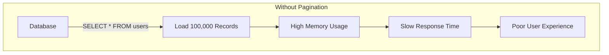
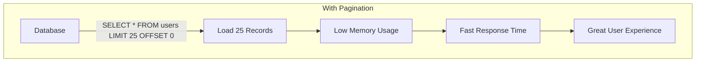
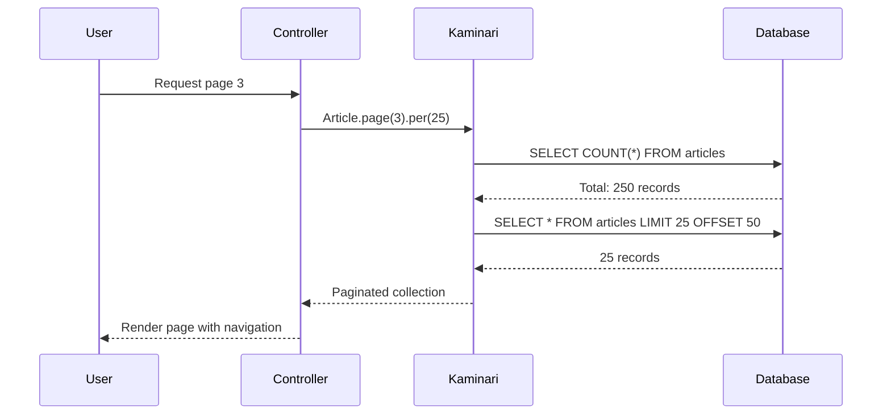
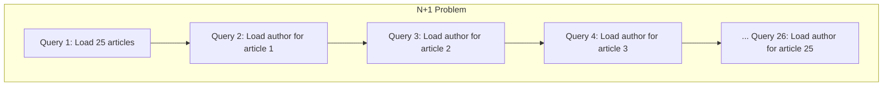
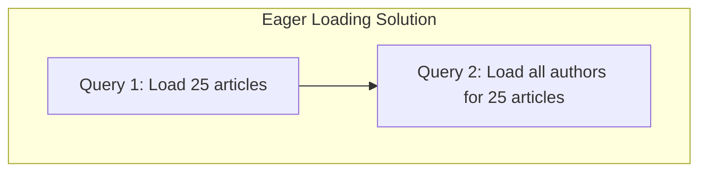
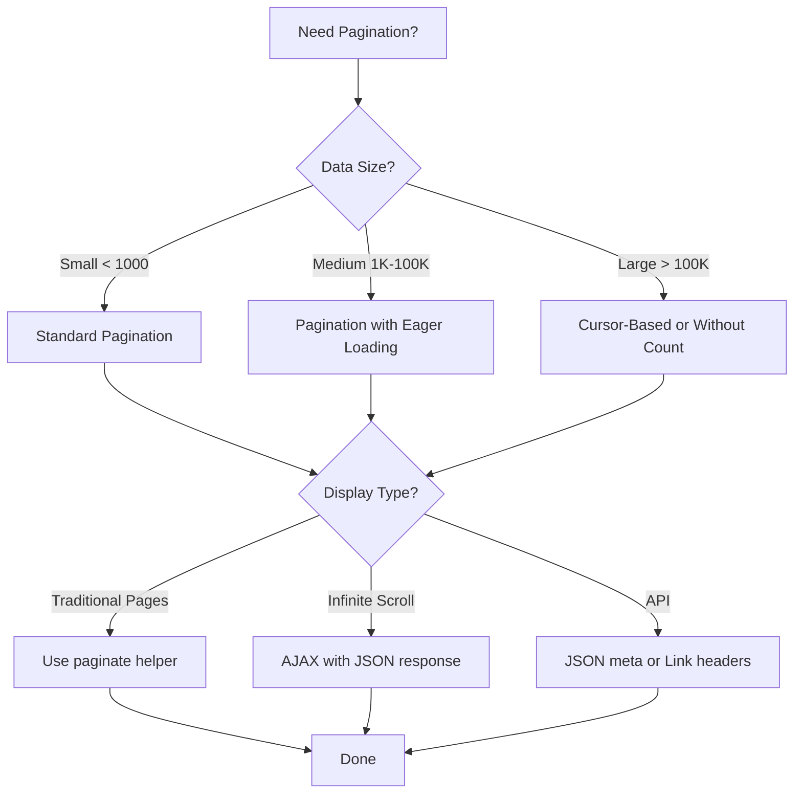

# How to Implement Pagination with Kaminari in Rails

Author: [nawazdhandala](https://www.github.com/nawazdhandala)

Tags: Ruby, Rails, Kaminari, Pagination, Performance, UI

Description: Learn how to implement efficient pagination in Ruby on Rails applications using Kaminari. This guide covers installation, configuration, custom scopes, AJAX pagination, API pagination, and performance optimization techniques.

---

> Pagination is essential for any application that displays large datasets. Loading thousands of records at once is slow, memory-intensive, and creates a poor user experience. Kaminari is the most popular pagination gem in the Rails ecosystem, providing a clean, flexible, and performant solution for paginating your ActiveRecord collections.

Kaminari, Japanese for "thunder," lives up to its name with lightning-fast pagination that integrates seamlessly with Rails conventions. Unlike older solutions, Kaminari uses scope-based pagination that works naturally with ActiveRecord's query interface.

---

## Understanding Pagination

Before implementing pagination, let's understand the concept and why it matters for application performance:





Pagination solves three critical problems:

1. **Memory Efficiency**: Load only the records needed for the current page
2. **Database Performance**: Reduced query execution time with LIMIT and OFFSET
3. **User Experience**: Manageable chunks of data that users can navigate

### How Pagination Works

Understanding the underlying mechanics helps you optimize your implementation:



Key concepts:
- **Page**: The current page number (1-indexed by default)
- **Per Page**: Number of records displayed per page
- **Offset**: Number of records to skip (calculated as `(page - 1) * per_page`)
- **Total Pages**: Total records divided by per page, rounded up

---

## Getting Started with Kaminari

### Installation

Add Kaminari to your Gemfile:

```ruby
# Gemfile

# Kaminari is the most popular pagination gem for Rails
# It provides a clean, scope-based API for paginating collections
gem 'kaminari'
```

Install the gem:

```bash
# Install the gem and update Gemfile.lock
bundle install
```

Generate the configuration file (optional but recommended):

```bash
# Generate Kaminari configuration file
# This creates config/initializers/kaminari_config.rb
rails generate kaminari:config
```

### Basic Configuration

Configure default pagination settings in the generated initializer:

```ruby
# config/initializers/kaminari_config.rb

# Kaminari configuration
# These settings apply globally to all paginated collections
Kaminari.configure do |config|
  # Default number of items per page
  # This can be overridden per-model or per-query
  config.default_per_page = 25

  # Maximum number of items per page
  # Prevents users from requesting too many records at once
  # This is important for preventing DoS attacks
  config.max_per_page = 100

  # Number of page links shown in the navigation
  # For example, with window = 4 and current page = 10:
  # << < ... 6 7 8 9 [10] 11 12 13 14 ... > >>
  config.window = 4

  # Number of page links shown at the beginning and end
  # Ensures first and last pages are always accessible
  config.outer_window = 0

  # Show first page link
  config.left = 0

  # Show last page link
  config.right = 0

  # Default page number when none is specified
  # Always start at page 1
  config.page_method_name = :page

  # Name of the parameter used for page number in URLs
  # Results in URLs like: /articles?page=3
  config.param_name = :page
end
```

---

## Basic Usage

### Paginating in Controllers

The most common use case is paginating a collection in a controller:

```ruby
# app/controllers/articles_controller.rb

class ArticlesController < ApplicationController
  # GET /articles
  # Displays a paginated list of all articles
  def index
    # The page method comes from Kaminari
    # It automatically reads the :page parameter from params
    # per() sets how many records to show per page
    @articles = Article.page(params[:page]).per(25)
  end

  # GET /articles/search
  # Search with pagination
  def search
    # Kaminari works seamlessly with ActiveRecord scopes
    # Chain any number of scopes before pagination
    @articles = Article
      .where('title LIKE ?', "%#{params[:q]}%")
      .order(created_at: :desc)
      .page(params[:page])
      .per(20)
  end

  # GET /articles/published
  # Filter and paginate
  def published
    # Scopes can be combined in any order
    # Just ensure page() is called on an ActiveRecord relation
    @articles = Article
      .published
      .includes(:author, :categories)
      .order(published_at: :desc)
      .page(params[:page])
      .per(15)
  end
end
```

### Displaying Paginated Results in Views

Kaminari provides a helper to render pagination navigation:

```erb
<!-- app/views/articles/index.html.erb -->

<h1>Articles</h1>

<!-- Display pagination info at the top -->
<div class="pagination-info">
  <p>
    Showing <%= @articles.offset_value + 1 %> to
    <%= [@articles.offset_value + @articles.limit_value, @articles.total_count].min %>
    of <%= @articles.total_count %> articles
  </p>
</div>

<!-- Article listing -->
<div class="articles-list">
  <% @articles.each do |article| %>
    <article class="article-card">
      <h2><%= link_to article.title, article %></h2>
      <p class="meta">
        By <%= article.author.name %> on <%= article.created_at.strftime('%B %d, %Y') %>
      </p>
      <p class="excerpt"><%= truncate(article.body, length: 200) %></p>
    </article>
  <% end %>
</div>

<!-- Render pagination navigation -->
<!-- This generates the full pagination UI with page links -->
<%= paginate @articles %>

<!-- Alternative: Render with custom options -->
<%= paginate @articles, window: 2, outer_window: 1 %>
```

### Pagination Helper Methods

Kaminari adds useful methods to your paginated collections:

```ruby
# app/controllers/articles_controller.rb

class ArticlesController < ApplicationController
  def index
    @articles = Article.page(params[:page]).per(25)

    # Respond with JSON including pagination metadata
    respond_to do |format|
      format.html
      format.json do
        render json: {
          articles: @articles,
          pagination: {
            # Current page number (1-indexed)
            current_page: @articles.current_page,

            # Total number of pages
            total_pages: @articles.total_pages,

            # Total number of records in the collection
            total_count: @articles.total_count,

            # Number of records per page
            limit_value: @articles.limit_value,

            # Number of records skipped (offset)
            offset_value: @articles.offset_value,

            # Is this the first page?
            first_page: @articles.first_page?,

            # Is this the last page?
            last_page: @articles.last_page?,

            # Is there a previous page?
            prev_page: @articles.prev_page,

            # Is there a next page?
            next_page: @articles.next_page,

            # Are there pages remaining after this one?
            out_of_range: @articles.out_of_range?
          }
        }
      end
    end
  end
end
```

---

## Customizing Kaminari Views

### Generating View Templates

Kaminari allows full customization of pagination views:

```bash
# Generate default view templates
# This copies Kaminari's default views to your application
rails generate kaminari:views default

# Generate Bootstrap 5 themed views
rails generate kaminari:views bootstrap5

# Generate Tailwind CSS themed views
rails generate kaminari:views tailwindcss

# Available themes: default, bootstrap4, bootstrap5,
# bulma, foundation, materialize, semantic_ui, tailwindcss
```

### Customizing Generated Views

After generating views, customize them to match your design:

```erb
<!-- app/views/kaminari/_paginator.html.erb -->

<!-- Main pagination wrapper -->
<!-- This is the container for all pagination elements -->
<%= paginator.render do %>
  <nav class="pagination" aria-label="Page navigation">
    <ul class="pagination-list">
      <!-- First page link -->
      <%= first_page_tag unless current_page.first? %>

      <!-- Previous page link -->
      <%= prev_page_tag unless current_page.first? %>

      <!-- Page number links -->
      <% each_page do |page| %>
        <% if page.left_outer? || page.right_outer? || page.inside_window? %>
          <%= page_tag page %>
        <% elsif !page.was_truncated? %>
          <%= gap_tag %>
        <% end %>
      <% end %>

      <!-- Next page link -->
      <%= next_page_tag unless current_page.last? %>

      <!-- Last page link -->
      <%= last_page_tag unless current_page.last? %>
    </ul>
  </nav>
<% end %>
```

```erb
<!-- app/views/kaminari/_page.html.erb -->

<!-- Individual page link -->
<!-- Renders each page number in the pagination -->
<% if page.current? %>
  <li class="pagination-item active">
    <span class="pagination-link current" aria-current="page">
      <%= page %>
    </span>
  </li>
<% else %>
  <li class="pagination-item">
    <%= link_to page, url, class: 'pagination-link', rel: page.rel %>
  </li>
<% end %>
```

```erb
<!-- app/views/kaminari/_prev_page.html.erb -->

<!-- Previous page link -->
<!-- Allows navigation to the previous page -->
<li class="pagination-item prev">
  <%= link_to_unless current_page.first?,
        raw('&laquo; Previous'),
        url,
        class: 'pagination-link prev-link',
        rel: 'prev' %>
</li>
```

```erb
<!-- app/views/kaminari/_next_page.html.erb -->

<!-- Next page link -->
<!-- Allows navigation to the next page -->
<li class="pagination-item next">
  <%= link_to_unless current_page.last?,
        raw('Next &raquo;'),
        url,
        class: 'pagination-link next-link',
        rel: 'next' %>
</li>
```

```erb
<!-- app/views/kaminari/_gap.html.erb -->

<!-- Truncation indicator -->
<!-- Shows when pages are skipped in the navigation -->
<li class="pagination-item disabled gap">
  <span class="pagination-link gap-marker">&hellip;</span>
</li>
```

### Custom CSS for Pagination

Style your pagination to match your application design:

```scss
/* app/assets/stylesheets/pagination.scss */

/* Main pagination container */
.pagination {
  display: flex;
  justify-content: center;
  margin: 2rem 0;
}

/* Pagination list */
.pagination-list {
  display: flex;
  list-style: none;
  padding: 0;
  margin: 0;
  gap: 0.25rem;
}

/* Individual pagination item */
.pagination-item {
  display: inline-block;
}

/* Pagination link styling */
.pagination-link {
  display: inline-flex;
  align-items: center;
  justify-content: center;
  min-width: 2.5rem;
  height: 2.5rem;
  padding: 0 0.75rem;
  font-size: 0.875rem;
  font-weight: 500;
  color: #374151;
  background-color: #ffffff;
  border: 1px solid #d1d5db;
  border-radius: 0.375rem;
  text-decoration: none;
  transition: all 0.15s ease-in-out;

  /* Hover state */
  &:hover {
    background-color: #f3f4f6;
    border-color: #9ca3af;
    color: #111827;
  }

  /* Active/current page */
  &.current {
    background-color: #3b82f6;
    border-color: #3b82f6;
    color: #ffffff;
    cursor: default;
    
    &:hover {
      background-color: #2563eb;
      border-color: #2563eb;
    }
  }
}

/* Disabled state for prev/next when at boundaries */
.pagination-item.disabled .pagination-link {
  color: #9ca3af;
  background-color: #f9fafb;
  cursor: not-allowed;
  pointer-events: none;
}

/* Gap indicator */
.gap-marker {
  color: #6b7280;
  cursor: default;
  border-color: transparent;
  background-color: transparent;
  
  &:hover {
    background-color: transparent;
    border-color: transparent;
  }
}

/* Responsive adjustments */
@media (max-width: 640px) {
  .pagination-link {
    min-width: 2rem;
    height: 2rem;
    padding: 0 0.5rem;
    font-size: 0.75rem;
  }
  
  /* Hide gap and some page numbers on mobile */
  .pagination-item.gap,
  .pagination-item:nth-child(n+5):nth-last-child(n+5) {
    display: none;
  }
}
```

---

## Model-Level Configuration

### Setting Per Page at the Model Level

Configure pagination defaults directly in your models:

```ruby
# app/models/article.rb

class Article < ApplicationRecord
  # Set default number of items per page for this model
  # This overrides the global Kaminari configuration
  paginates_per 20

  # Set maximum items per page for this model
  # Prevents requesting too many records
  max_paginates_per 50

  # Associations
  belongs_to :author
  belongs_to :category, optional: true
  has_many :comments, dependent: :destroy
  has_many :taggings, dependent: :destroy
  has_many :tags, through: :taggings

  # Scopes that work with pagination
  scope :published, -> { where(published: true) }
  scope :draft, -> { where(published: false) }
  scope :recent, -> { order(created_at: :desc) }
  scope :popular, -> { order(views_count: :desc) }

  # Combined scope for common use case
  scope :published_recent, -> { published.recent }
end
```

```ruby
# app/models/comment.rb

class Comment < ApplicationRecord
  # Comments might need different pagination settings
  # More comments per page since they are typically shorter
  paginates_per 50
  max_paginates_per 100

  # Associations
  belongs_to :article
  belongs_to :user

  # Order scopes
  scope :newest, -> { order(created_at: :desc) }
  scope :oldest, -> { order(created_at: :asc) }
  scope :approved, -> { where(approved: true) }
end
```

```ruby
# app/models/user.rb

class User < ApplicationRecord
  # Admin panels often show fewer records
  paginates_per 15
  max_paginates_per 25

  # Associations
  has_many :articles
  has_many :comments

  # Scopes
  scope :active, -> { where(active: true) }
  scope :admins, -> { where(admin: true) }
  scope :alphabetical, -> { order(:name) }
end
```

---

## Advanced Pagination Techniques

### Custom Page Parameter Names

Use different parameter names for multiple paginated collections:

```ruby
# app/controllers/dashboard_controller.rb

class DashboardController < ApplicationController
  def index
    # Multiple paginated collections on one page
    # Each uses a different parameter name to avoid conflicts

    # Recent articles with 'articles_page' parameter
    @articles = Article
      .published
      .recent
      .page(params[:articles_page])
      .per(5)

    # Recent comments with 'comments_page' parameter
    @comments = Comment
      .approved
      .newest
      .page(params[:comments_page])
      .per(10)

    # Active users with 'users_page' parameter
    @users = User
      .active
      .alphabetical
      .page(params[:users_page])
      .per(10)
  end
end
```

```erb
<!-- app/views/dashboard/index.html.erb -->

<div class="dashboard">
  <div class="dashboard-section">
    <h2>Recent Articles</h2>
    
    <div class="articles-list">
      <% @articles.each do |article| %>
        <div class="article-item">
          <%= link_to article.title, article %>
          <span class="date"><%= article.created_at.strftime('%b %d') %></span>
        </div>
      <% end %>
    </div>
    
    <!-- Use param_name to specify custom parameter -->
    <%= paginate @articles, param_name: :articles_page %>
  </div>

  <div class="dashboard-section">
    <h2>Recent Comments</h2>
    
    <div class="comments-list">
      <% @comments.each do |comment| %>
        <div class="comment-item">
          <%= truncate(comment.body, length: 100) %>
          <span class="author">by <%= comment.user.name %></span>
        </div>
      <% end %>
    </div>
    
    <%= paginate @comments, param_name: :comments_page %>
  </div>

  <div class="dashboard-section">
    <h2>Active Users</h2>
    
    <div class="users-list">
      <% @users.each do |user| %>
        <div class="user-item">
          <%= link_to user.name, user %>
          <span class="email"><%= user.email %></span>
        </div>
      <% end %>
    </div>
    
    <%= paginate @users, param_name: :users_page %>
  </div>
</div>
```

### Paginating Arrays

Kaminari can paginate any array, not just ActiveRecord collections:

```ruby
# app/controllers/search_controller.rb

class SearchController < ApplicationController
  def index
    # External API search that returns an array
    results = ExternalSearchService.search(params[:q])

    # Paginate the array using Kaminari's array extension
    # This is useful for API responses, cached data, or computed collections
    @results = Kaminari.paginate_array(results)
      .page(params[:page])
      .per(20)
  end

  def advanced
    # Paginate with known total count
    # Useful when you only have a subset of data but know the total
    partial_results = ExternalApi.fetch_page(
      params[:page],
      per_page: 25
    )

    # Create a paginated array with explicit total count
    @results = Kaminari.paginate_array(
      partial_results[:items],
      total_count: partial_results[:total_count]
    ).page(params[:page]).per(25)
  end
end
```

### AJAX Pagination

Implement seamless pagination without full page reloads:

```ruby
# app/controllers/articles_controller.rb

class ArticlesController < ApplicationController
  def index
    @articles = Article.published.recent.page(params[:page]).per(10)

    respond_to do |format|
      # Full page load
      format.html

      # AJAX request returns only the partial
      format.js
    end
  end
end
```

```erb
<!-- app/views/articles/index.html.erb -->

<h1>Articles</h1>

<!-- Container that will be updated via AJAX -->
<div id="articles-container">
  <%= render 'articles_list' %>
</div>

<script>
  // Handle pagination link clicks with AJAX
  document.addEventListener('turbo:load', function() {
    // Turbo handles AJAX automatically in Rails 7+
    // For older Rails versions, add custom JavaScript
  });
</script>
```

```erb
<!-- app/views/articles/_articles_list.html.erb -->

<div class="articles">
  <% @articles.each do |article| %>
    <article class="article-card">
      <h2><%= link_to article.title, article %></h2>
      <p><%= truncate(article.body, length: 200) %></p>
    </article>
  <% end %>
</div>

<!-- Pagination with remote: true for AJAX -->
<%= paginate @articles, remote: true %>
```

```erb
<!-- app/views/articles/index.js.erb -->

// Replace the articles container content
document.getElementById('articles-container').innerHTML = 
  '<%= j render "articles_list" %>';

// Update the browser URL without full page reload
window.history.pushState(
  { page: <%= @articles.current_page %> },
  '',
  '<%= articles_path(page: @articles.current_page) %>'
);

// Scroll to top of list
document.getElementById('articles-container').scrollIntoView({ 
  behavior: 'smooth' 
});
```

### Turbo Frame Pagination (Rails 7+)

Modern Rails applications can use Turbo Frames for seamless pagination:

```erb
<!-- app/views/articles/index.html.erb -->

<h1>Articles</h1>

<!-- Wrap paginated content in a Turbo Frame -->
<!-- Pagination links will automatically update only this frame -->
<%= turbo_frame_tag "articles" do %>
  <div class="articles-list">
    <% @articles.each do |article| %>
      <article class="article-card">
        <h2><%= link_to article.title, article %></h2>
        <p class="excerpt"><%= truncate(article.body, length: 200) %></p>
        <p class="meta">
          <%= article.author.name %> - <%= time_ago_in_words(article.created_at) %> ago
        </p>
      </article>
    <% end %>
  </div>

  <!-- Pagination links will target this frame automatically -->
  <div class="pagination-wrapper">
    <%= paginate @articles %>
  </div>
<% end %>
```

---

## API Pagination

### JSON API Pagination

Implement pagination for JSON APIs:

```ruby
# app/controllers/api/v1/articles_controller.rb

module Api
  module V1
    class ArticlesController < ApplicationController
      # Disable CSRF for API endpoints
      skip_before_action :verify_authenticity_token

      def index
        # Parse and validate page parameters
        page = (params[:page] || 1).to_i
        per_page = (params[:per_page] || 25).to_i

        # Enforce maximum per_page to prevent abuse
        per_page = [per_page, 100].min

        # Paginate the collection
        @articles = Article
          .published
          .includes(:author, :tags)
          .order(created_at: :desc)
          .page(page)
          .per(per_page)

        render json: {
          data: serialize_articles(@articles),
          meta: pagination_meta(@articles)
        }
      end

      private

      def serialize_articles(articles)
        articles.map do |article|
          {
            id: article.id,
            type: 'article',
            attributes: {
              title: article.title,
              body: article.body,
              published_at: article.published_at,
              views_count: article.views_count
            },
            relationships: {
              author: {
                id: article.author_id,
                name: article.author.name
              },
              tags: article.tags.map { |t| { id: t.id, name: t.name } }
            }
          }
        end
      end

      def pagination_meta(collection)
        {
          current_page: collection.current_page,
          next_page: collection.next_page,
          prev_page: collection.prev_page,
          total_pages: collection.total_pages,
          total_count: collection.total_count,
          per_page: collection.limit_value
        }
      end
    end
  end
end
```

### Link Header Pagination (GitHub Style)

Implement RFC 5988 Link header pagination:

```ruby
# app/controllers/concerns/pagination_headers.rb

module PaginationHeaders
  extend ActiveSupport::Concern

  private

  # Add Link header for paginated responses
  # Format follows RFC 5988 (Web Linking)
  def set_pagination_headers(collection)
    links = []

    # Build base URL without page parameter
    base_url = request.url.split('?').first
    base_params = request.query_parameters.except('page')

    # First page link
    links << build_link(base_url, base_params.merge(page: 1), 'first')

    # Previous page link
    if collection.prev_page
      links << build_link(base_url, base_params.merge(page: collection.prev_page), 'prev')
    end

    # Next page link
    if collection.next_page
      links << build_link(base_url, base_params.merge(page: collection.next_page), 'next')
    end

    # Last page link
    links << build_link(base_url, base_params.merge(page: collection.total_pages), 'last')

    # Set the Link header
    response.headers['Link'] = links.join(', ')

    # Additional pagination headers (non-standard but useful)
    response.headers['X-Total-Count'] = collection.total_count.to_s
    response.headers['X-Total-Pages'] = collection.total_pages.to_s
    response.headers['X-Current-Page'] = collection.current_page.to_s
    response.headers['X-Per-Page'] = collection.limit_value.to_s
  end

  def build_link(base_url, params, rel)
    url = "#{base_url}?#{params.to_query}"
    "<#{url}>; rel=\"#{rel}\""
  end
end
```

```ruby
# app/controllers/api/v1/articles_controller.rb

module Api
  module V1
    class ArticlesController < ApplicationController
      include PaginationHeaders

      def index
        @articles = Article.published.page(params[:page]).per(25)

        # Set Link header for pagination
        set_pagination_headers(@articles)

        render json: @articles
      end
    end
  end
end
```

---

## Performance Optimization

### Understanding the N+1 Problem with Pagination

Pagination can introduce N+1 queries if associations are not eager loaded:





### Optimizing Queries

Always eager load associations when paginating:

```ruby
# app/controllers/articles_controller.rb

class ArticlesController < ApplicationController
  def index
    # WRONG: N+1 queries will occur
    # Each article.author call triggers a separate query
    # @articles = Article.page(params[:page]).per(25)

    # CORRECT: Eager load associations
    # This generates only 2 queries regardless of page size
    @articles = Article
      .includes(:author, :category, :tags)
      .published
      .order(created_at: :desc)
      .page(params[:page])
      .per(25)
  end

  def show
    @article = Article.find(params[:id])

    # Paginate comments with eager loading
    @comments = @article.comments
      .includes(:user)
      .approved
      .newest
      .page(params[:page])
      .per(50)
  end
end
```

### Count Query Optimization

The total count query can be expensive for large tables:

```ruby
# app/controllers/articles_controller.rb

class ArticlesController < ApplicationController
  def index
    @articles = Article
      .published
      .order(created_at: :desc)
      .page(params[:page])
      .per(25)

    # Kaminari automatically runs COUNT(*) for total_pages
    # For large tables, this can be slow

    # Option 1: Use counter cache for filtered counts
    # Add a counter_cache column if you frequently filter

    # Option 2: Skip count for better performance
    # @articles = Article.page(params[:page]).per(25).without_count

    # Option 3: Use approximate count for huge tables
    # @approximate_count = Article.connection.execute(
    #   "SELECT reltuples FROM pg_class WHERE relname = 'articles'"
    # ).first['reltuples'].to_i
  end
end
```

### Without Count Pagination

For very large tables, skip the count query entirely:

```ruby
# app/controllers/articles_controller.rb

class ArticlesController < ApplicationController
  def index
    # without_count skips the COUNT query
    # This is much faster for large tables
    # Trade-off: total_pages and total_count are not available
    @articles = Article
      .published
      .order(created_at: :desc)
      .page(params[:page])
      .per(25)
      .without_count
  end
end
```

```erb
<!-- app/views/articles/index.html.erb -->

<h1>Articles</h1>

<div class="articles">
  <% @articles.each do |article| %>
    <article><%= article.title %></article>
  <% end %>
</div>

<!-- Simple prev/next navigation without page numbers -->
<nav class="pagination-simple">
  <% unless @articles.first_page? %>
    <%= link_to 'Previous', articles_path(page: @articles.prev_page) %>
  <% end %>
  
  <% unless @articles.last_page? %>
    <%= link_to 'Next', articles_path(page: @articles.next_page) %>
  <% end %>
</nav>
```

### Cursor-Based Pagination

For large datasets, cursor-based pagination is more efficient than offset:

```ruby
# app/models/article.rb

class Article < ApplicationRecord
  # Scope for cursor-based pagination
  # Uses the ID as a cursor for efficient pagination
  scope :after_cursor, ->(cursor_id) {
    where('id < ?', cursor_id) if cursor_id.present?
  }

  scope :before_cursor, ->(cursor_id) {
    where('id > ?', cursor_id) if cursor_id.present?
  }
end
```

```ruby
# app/controllers/api/v1/articles_controller.rb

module Api
  module V1
    class ArticlesController < ApplicationController
      def index
        per_page = 25

        # Cursor-based pagination
        # More efficient than OFFSET for large datasets
        @articles = Article
          .published
          .after_cursor(params[:cursor])
          .order(id: :desc)
          .limit(per_page + 1)  # Fetch one extra to check if more exist

        # Check if there are more results
        has_more = @articles.size > per_page
        @articles = @articles.first(per_page)

        render json: {
          data: @articles,
          meta: {
            has_more: has_more,
            next_cursor: has_more ? @articles.last.id : nil
          }
        }
      end
    end
  end
end
```

---

## Common Patterns and Recipes

### Infinite Scroll

Implement infinite scroll with Kaminari:

```ruby
# app/controllers/articles_controller.rb

class ArticlesController < ApplicationController
  def index
    @articles = Article.published.recent.page(params[:page]).per(20)

    respond_to do |format|
      format.html
      format.json do
        render json: {
          html: render_to_string(partial: 'article', collection: @articles),
          has_more: !@articles.last_page?,
          next_page: @articles.next_page
        }
      end
    end
  end
end
```

```erb
<!-- app/views/articles/index.html.erb -->

<h1>Articles</h1>

<div id="articles-feed" data-controller="infinite-scroll">
  <div class="articles-list" data-infinite-scroll-target="entries">
    <%= render @articles %>
  </div>
  
  <div data-infinite-scroll-target="loading" class="loading hidden">
    Loading more articles...
  </div>
  
  <% if @articles.next_page %>
    <%= link_to 'Load More',
          articles_path(page: @articles.next_page, format: :json),
          class: 'load-more-link',
          data: {
            infinite_scroll_target: 'link',
            page: @articles.next_page
          } %>
  <% end %>
</div>
```

```javascript
// app/javascript/controllers/infinite_scroll_controller.js

import { Controller } from "@hotwired/stimulus"

export default class extends Controller {
  static targets = ["entries", "link", "loading"]

  connect() {
    // Set up intersection observer for infinite scroll
    this.observer = new IntersectionObserver(
      this.handleIntersection.bind(this),
      { rootMargin: '200px' }
    )

    if (this.hasLinkTarget) {
      this.observer.observe(this.linkTarget)
    }
  }

  disconnect() {
    this.observer.disconnect()
  }

  handleIntersection(entries) {
    entries.forEach(entry => {
      if (entry.isIntersecting) {
        this.loadMore()
      }
    })
  }

  async loadMore() {
    if (!this.hasLinkTarget || this.loading) return

    this.loading = true
    this.loadingTarget.classList.remove('hidden')

    const url = this.linkTarget.href

    try {
      const response = await fetch(url, {
        headers: { 'Accept': 'application/json' }
      })

      const data = await response.json()

      // Append new content
      this.entriesTarget.insertAdjacentHTML('beforeend', data.html)

      // Update or remove load more link
      if (data.has_more) {
        this.linkTarget.href = this.linkTarget.href.replace(
          /page=\d+/,
          `page=${data.next_page}`
        )
      } else {
        this.linkTarget.remove()
      }
    } catch (error) {
      console.error('Failed to load more articles:', error)
    } finally {
      this.loading = false
      this.loadingTarget.classList.add('hidden')
    }
  }
}
```

### Search with Pagination

Combine search functionality with pagination:

```ruby
# app/controllers/articles_controller.rb

class ArticlesController < ApplicationController
  def index
    @articles = Article.published

    # Apply search filter if present
    if params[:q].present?
      @articles = @articles.where(
        'title ILIKE :q OR body ILIKE :q',
        q: "%#{params[:q]}%"
      )
    end

    # Apply category filter if present
    if params[:category_id].present?
      @articles = @articles.where(category_id: params[:category_id])
    end

    # Apply date range filter if present
    if params[:from_date].present?
      @articles = @articles.where('created_at >= ?', params[:from_date])
    end

    if params[:to_date].present?
      @articles = @articles.where('created_at <= ?', params[:to_date])
    end

    # Apply sorting
    sort_column = %w[title created_at views_count].include?(params[:sort]) ? params[:sort] : 'created_at'
    sort_direction = %w[asc desc].include?(params[:direction]) ? params[:direction] : 'desc'
    @articles = @articles.order("#{sort_column} #{sort_direction}")

    # Paginate the filtered results
    @articles = @articles.page(params[:page]).per(20)

    # Store the search params for pagination links
    @search_params = params.permit(:q, :category_id, :from_date, :to_date, :sort, :direction)
  end
end
```

```erb
<!-- app/views/articles/index.html.erb -->

<h1>Articles</h1>

<!-- Search and filter form -->
<%= form_with url: articles_path, method: :get, local: true, class: 'search-form' do |f| %>
  <div class="search-field">
    <%= f.text_field :q, value: params[:q], placeholder: 'Search articles...' %>
  </div>
  
  <div class="filter-field">
    <%= f.collection_select :category_id, Category.all, :id, :name,
          { include_blank: 'All Categories' },
          { selected: params[:category_id] } %>
  </div>
  
  <div class="date-filters">
    <%= f.date_field :from_date, value: params[:from_date], placeholder: 'From' %>
    <%= f.date_field :to_date, value: params[:to_date], placeholder: 'To' %>
  </div>
  
  <div class="sort-field">
    <%= f.select :sort, [['Date', 'created_at'], ['Title', 'title'], ['Views', 'views_count']],
          { selected: params[:sort] } %>
    <%= f.select :direction, [['Descending', 'desc'], ['Ascending', 'asc']],
          { selected: params[:direction] } %>
  </div>
  
  <%= f.submit 'Search' %>
<% end %>

<!-- Results count -->
<p class="results-info">
  Found <%= @articles.total_count %> articles
  <% if params[:q].present? %>
    matching "<%= params[:q] %>"
  <% end %>
</p>

<!-- Article listing -->
<div class="articles-list">
  <%= render @articles %>
</div>

<!-- Pagination with preserved search params -->
<%= paginate @articles, params: @search_params %>
```

### Scoped Pagination

Create reusable pagination scopes:

```ruby
# app/models/article.rb

class Article < ApplicationRecord
  paginates_per 20

  # Scopes with built-in pagination
  scope :paginated_published, ->(page) {
    published
      .includes(:author)
      .order(created_at: :desc)
      .page(page)
  }

  scope :paginated_by_author, ->(author, page) {
    where(author: author)
      .order(created_at: :desc)
      .page(page)
  }

  scope :paginated_by_category, ->(category, page) {
    where(category: category)
      .includes(:author)
      .order(created_at: :desc)
      .page(page)
  }

  scope :paginated_popular, ->(page, per = 10) {
    published
      .where('views_count > ?', 100)
      .order(views_count: :desc)
      .page(page)
      .per(per)
  }
end
```

```ruby
# app/controllers/articles_controller.rb

class ArticlesController < ApplicationController
  def index
    # Clean controller code using scoped pagination
    @articles = Article.paginated_published(params[:page])
  end

  def by_author
    @author = User.find(params[:author_id])
    @articles = Article.paginated_by_author(@author, params[:page])
  end

  def popular
    @articles = Article.paginated_popular(params[:page])
  end
end
```

---

## Testing Pagination

### RSpec Tests

Write comprehensive tests for paginated controllers:

```ruby
# spec/controllers/articles_controller_spec.rb

require 'rails_helper'

RSpec.describe ArticlesController, type: :controller do
  describe 'GET #index' do
    # Create test data
    let!(:articles) { create_list(:article, 50, published: true) }

    context 'with default pagination' do
      before { get :index }

      it 'returns a successful response' do
        expect(response).to be_successful
      end

      it 'assigns paginated articles' do
        expect(assigns(:articles)).to be_a(ActiveRecord::Relation)
        expect(assigns(:articles).count).to eq(25)  # Default per_page
      end

      it 'returns the first page by default' do
        expect(assigns(:articles).current_page).to eq(1)
      end
    end

    context 'with specific page' do
      before { get :index, params: { page: 2 } }

      it 'returns the requested page' do
        expect(assigns(:articles).current_page).to eq(2)
      end

      it 'calculates correct offset' do
        expect(assigns(:articles).offset_value).to eq(25)
      end
    end

    context 'with custom per_page' do
      before { get :index, params: { page: 1, per_page: 10 } }

      it 'respects the per_page parameter' do
        expect(assigns(:articles).count).to eq(10)
      end
    end

    context 'when requesting beyond last page' do
      before { get :index, params: { page: 100 } }

      it 'returns an empty collection' do
        expect(assigns(:articles)).to be_empty
      end

      it 'indicates out of range' do
        expect(assigns(:articles).out_of_range?).to be true
      end
    end

    context 'pagination metadata' do
      before { get :index }

      it 'calculates total pages correctly' do
        # 50 articles / 25 per page = 2 pages
        expect(assigns(:articles).total_pages).to eq(2)
      end

      it 'provides total count' do
        expect(assigns(:articles).total_count).to eq(50)
      end
    end
  end
end
```

```ruby
# spec/requests/api/v1/articles_spec.rb

require 'rails_helper'

RSpec.describe 'API V1 Articles', type: :request do
  describe 'GET /api/v1/articles' do
    let!(:articles) { create_list(:article, 30, published: true) }

    it 'returns paginated articles' do
      get '/api/v1/articles', params: { page: 1, per_page: 10 }

      expect(response).to have_http_status(:ok)

      json = JSON.parse(response.body)
      expect(json['data'].length).to eq(10)
    end

    it 'includes pagination metadata' do
      get '/api/v1/articles', params: { page: 1, per_page: 10 }

      json = JSON.parse(response.body)
      meta = json['meta']

      expect(meta['current_page']).to eq(1)
      expect(meta['total_pages']).to eq(3)
      expect(meta['total_count']).to eq(30)
      expect(meta['per_page']).to eq(10)
    end

    it 'includes Link headers' do
      get '/api/v1/articles', params: { page: 2, per_page: 10 }

      link_header = response.headers['Link']
      expect(link_header).to include('rel="first"')
      expect(link_header).to include('rel="prev"')
      expect(link_header).to include('rel="next"')
      expect(link_header).to include('rel="last"')
    end

    it 'enforces maximum per_page' do
      get '/api/v1/articles', params: { per_page: 500 }

      json = JSON.parse(response.body)
      expect(json['meta']['per_page']).to be <= 100
    end
  end
end
```

### View Tests

Test pagination helpers in views:

```ruby
# spec/views/articles/index.html.erb_spec.rb

require 'rails_helper'

RSpec.describe 'articles/index', type: :view do
  before do
    # Create paginated collection
    articles = create_list(:article, 30, published: true)
    @articles = Article.published.page(1).per(10)
  end

  it 'renders pagination controls' do
    render

    expect(rendered).to have_selector('nav.pagination')
    expect(rendered).to have_selector('.pagination-link', minimum: 3)
  end

  it 'marks current page as active' do
    render

    expect(rendered).to have_selector('.pagination-link.current', text: '1')
  end

  it 'includes next page link' do
    render

    expect(rendered).to have_link(href: /page=2/)
  end

  it 'displays correct number of articles' do
    render

    expect(rendered).to have_selector('.article-card', count: 10)
  end
end
```

---

## Integration with Other Gems

### Ransack Integration

Combine Kaminari with Ransack for search and pagination:

```ruby
# app/controllers/articles_controller.rb

class ArticlesController < ApplicationController
  def index
    # Ransack provides the search object
    @q = Article.published.ransack(params[:q])

    # Kaminari paginates the search results
    @articles = @q.result(distinct: true)
      .includes(:author, :tags)
      .page(params[:page])
      .per(20)
  end
end
```

```erb
<!-- app/views/articles/index.html.erb -->

<h1>Articles</h1>

<!-- Ransack search form -->
<%= search_form_for @q do |f| %>
  <div class="search-fields">
    <%= f.label :title_cont, 'Title contains' %>
    <%= f.text_field :title_cont %>
    
    <%= f.label :author_name_cont, 'Author' %>
    <%= f.text_field :author_name_cont %>
    
    <%= f.label :created_at_gteq, 'From' %>
    <%= f.date_field :created_at_gteq %>
    
    <%= f.label :created_at_lteq, 'To' %>
    <%= f.date_field :created_at_lteq %>
  </div>
  
  <div class="search-actions">
    <%= f.submit 'Search' %>
    <%= link_to 'Clear', articles_path %>
  </div>
<% end %>

<!-- Results -->
<div class="articles-list">
  <%= render @articles %>
</div>

<!-- Pagination preserves search params -->
<%= paginate @articles %>
```

### Elasticsearch Integration

Paginate Elasticsearch results with Kaminari:

```ruby
# app/models/article.rb

class Article < ApplicationRecord
  include Searchable

  # Elasticsearch integration
  def self.search_with_pagination(query, page:, per_page: 25)
    # Elasticsearch query
    search_results = __elasticsearch__.search(
      query: {
        multi_match: {
          query: query,
          fields: ['title^2', 'body', 'tags.name']
        }
      },
      from: (page - 1) * per_page,
      size: per_page
    )

    # Convert to Kaminari-compatible collection
    records = search_results.records.to_a
    total = search_results.results.total

    Kaminari.paginate_array(
      records,
      total_count: total
    ).page(page).per(per_page)
  end
end
```

---

## Troubleshooting Common Issues

### Issue: Pagination Not Working with Scopes

```ruby
# Problem: Calling page() before scope returns all records
# WRONG
@articles = Article.page(params[:page]).published

# Solution: Always call page() last in the chain
# CORRECT
@articles = Article.published.page(params[:page])
```

### Issue: Incorrect Total Count with Joins

```ruby
# Problem: Joins can cause incorrect counts
# WRONG - may count duplicates
@articles = Article.joins(:tags).where(tags: { name: 'Ruby' }).page(params[:page])

# Solution: Use distinct or group
# CORRECT
@articles = Article
  .joins(:tags)
  .where(tags: { name: 'Ruby' })
  .distinct
  .page(params[:page])
```

### Issue: N+1 Queries in Pagination Helper

```ruby
# Problem: Pagination helper may trigger N+1
# Make sure to include all needed associations
@articles = Article
  .includes(:author, :category)  # Add all associations used in view
  .page(params[:page])
```

### Issue: Page Parameter Injection

```ruby
# Problem: Malicious page parameters
# Solution: Validate and sanitize
def safe_page_param
  page = params[:page].to_i
  page = 1 if page < 1
  page = collection.total_pages if page > collection.total_pages
  page
end
```

---

## Summary

Kaminari provides a powerful, flexible, and performant solution for pagination in Rails applications. Key takeaways:

1. **Simple Integration**: Add the gem, call `.page()`, and render with `paginate`
2. **Customizable**: Configure per-model settings and customize views
3. **Performance**: Use eager loading and consider `without_count` for large tables
4. **API Support**: Easy JSON and Link header pagination for APIs
5. **Modern Rails**: Works seamlessly with Turbo Frames and Hotwire

The flowchart below summarizes the pagination decision process:



By following the patterns and best practices in this guide, you can implement efficient, user-friendly pagination in your Rails applications with confidence.
