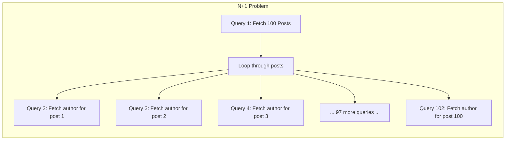
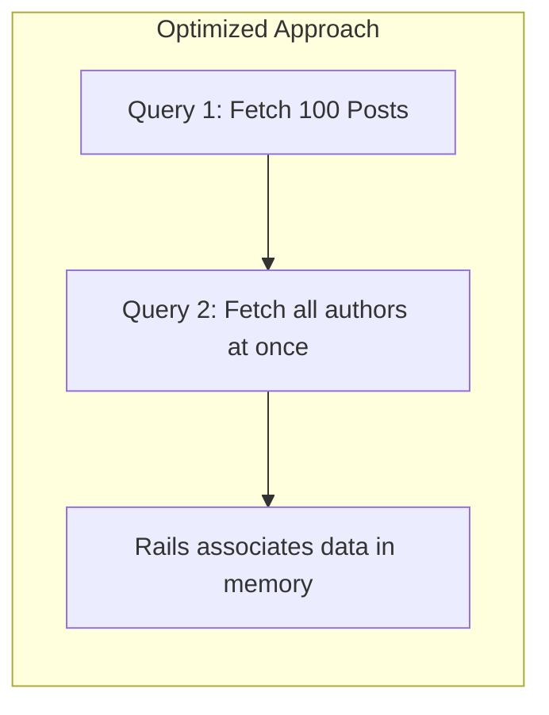
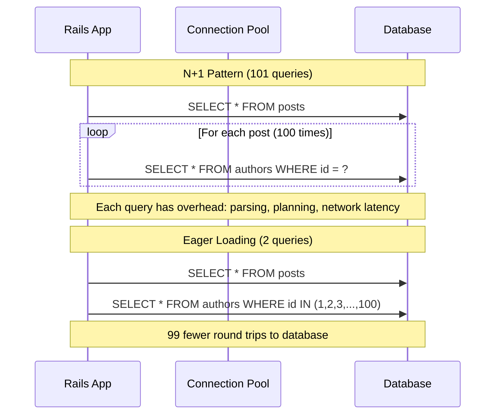
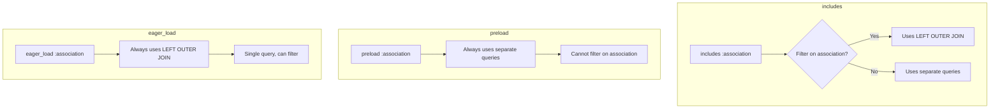
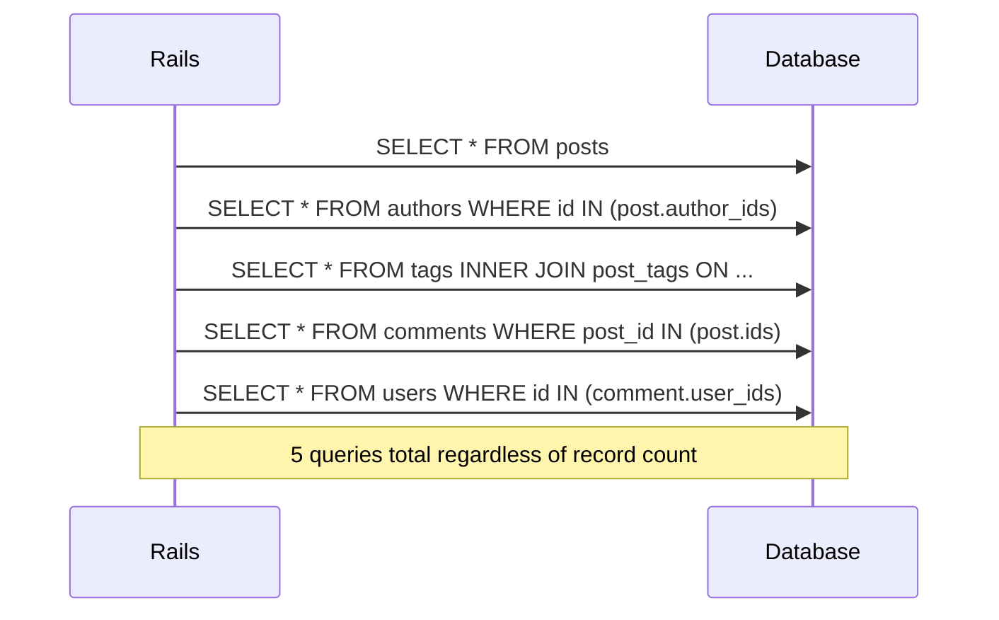
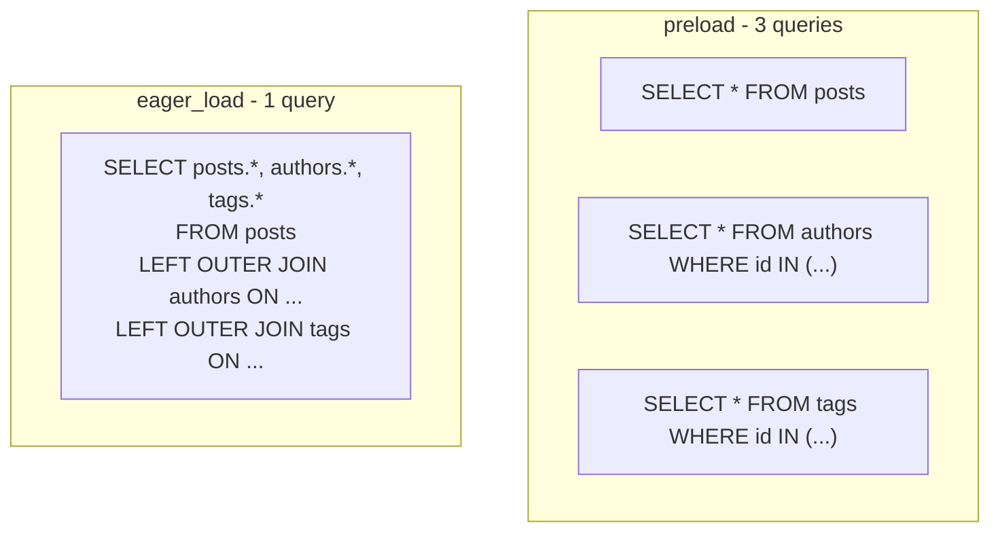
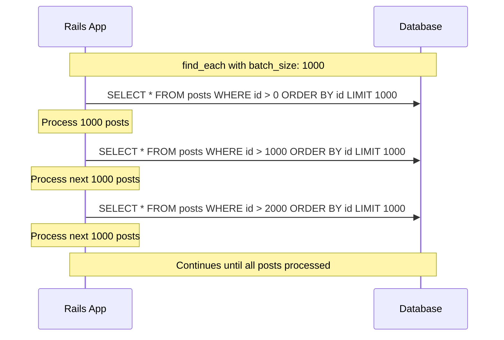

# How to Handle N+1 Queries in Rails

Author: [nawazdhandala](https://www.github.com/nawazdhandala)

Tags: Ruby, Rails, N+1, Performance, ActiveRecord, Database

Description: Learn how to identify, prevent, and fix N+1 query problems in Ruby on Rails applications. This guide covers eager loading strategies, query optimization techniques, and tools for detecting N+1 queries in development and production.

---

> The N+1 query problem is one of the most common performance issues in Rails applications. A single page request that should execute 2 queries ends up executing 102 queries, grinding your application to a halt. Understanding and fixing N+1 queries can dramatically improve response times and reduce database load.

N+1 queries occur when your code executes one query to fetch a collection of records, then executes an additional query for each record to fetch associated data. The "N" represents the number of records, and the "+1" is the initial query.

---

## Understanding the N+1 Problem

Before diving into solutions, let's understand why N+1 queries happen:





With the N+1 pattern, fetching 100 posts and their authors requires 101 queries. With eager loading, it only requires 2 queries.

### The Database Impact



---

## Identifying N+1 Queries

### The Bullet Gem

Bullet is the most popular gem for detecting N+1 queries in Rails:

```ruby
# Gemfile
group :development, :test do
  # Detect N+1 queries and unused eager loading
  gem 'bullet'
end
```

Configure Bullet in your environment:

```ruby
# config/environments/development.rb
Rails.application.configure do
  # Bullet configuration for N+1 detection
  config.after_initialize do
    Bullet.enable = true
    
    # Show alerts in browser
    Bullet.alert = true
    
    # Log to bullet.log
    Bullet.bullet_logger = true
    
    # Log to Rails logger
    Bullet.rails_logger = true
    
    # Add details to the footer of each page
    Bullet.add_footer = true
    
    # Raise an error (useful in test environment)
    # Bullet.raise = true
    
    # Detect unused eager loading
    Bullet.unused_eager_loading_enable = true
    
    # Detect N+1 queries
    Bullet.n_plus_one_query_enable = true
    
    # Detect counter cache opportunities
    Bullet.counter_cache_enable = true
  end
end
```

For testing environments, make Bullet raise errors:

```ruby
# config/environments/test.rb
Rails.application.configure do
  config.after_initialize do
    Bullet.enable = true
    
    # Raise exception when N+1 detected in tests
    Bullet.raise = true
    
    Bullet.n_plus_one_query_enable = true
    Bullet.unused_eager_loading_enable = true
  end
end
```

### Using Bullet in RSpec

```ruby
# spec/rails_helper.rb
RSpec.configure do |config|
  # Enable Bullet for each test
  if Bullet.enable?
    config.before(:each) do
      Bullet.start_request
    end

    config.after(:each) do
      Bullet.perform_out_of_channel_notifications if Bullet.notification?
      Bullet.end_request
    end
  end
end
```

### Manual Query Logging

Enable detailed query logging to spot N+1 patterns:

```ruby
# config/environments/development.rb
Rails.application.configure do
  # Log all SQL queries
  config.active_record.verbose_query_logs = true
  
  # Show query source location
  config.active_record.query_log_tags_enabled = true
  config.active_record.query_log_tags = [
    :application,
    :controller,
    :action,
    :job,
    {
      source_location: -> {
        ActiveSupport::BacktraceCleaner.new.tap { |cleaner|
          cleaner.add_silencer { |line| line.include?('active_record') }
          cleaner.add_silencer { |line| line.include?('rack') }
        }.clean(caller).first
      }
    }
  ]
end
```

---

## Understanding Eager Loading Methods

Rails provides three main methods for eager loading: `includes`, `preload`, and `eager_load`.

### Comparison Overview



### Method Comparison Table

| Method | Query Strategy | Can Filter on Association | Best For |
|--------|---------------|---------------------------|----------|
| `includes` | Smart (chooses best) | Yes (switches to JOIN) | General use |
| `preload` | Separate queries | No | Large datasets, no filtering |
| `eager_load` | LEFT OUTER JOIN | Yes | Filtering, sorting by association |

---

## Solving N+1 with includes

The `includes` method is the most commonly used solution for N+1 queries.

### Basic Usage

```ruby
# app/models/post.rb
class Post < ApplicationRecord
  # Define associations
  belongs_to :author
  has_many :comments
  has_many :tags, through: :post_tags
end

# app/models/author.rb
class Author < ApplicationRecord
  has_many :posts
end

# app/models/comment.rb
class Comment < ApplicationRecord
  belongs_to :post
  belongs_to :user
end
```

Without eager loading (N+1 problem):

```ruby
# app/controllers/posts_controller.rb
class PostsController < ApplicationController
  def index
    # BAD: This triggers N+1 queries
    @posts = Post.all
  end
end
```

```erb
<%# app/views/posts/index.html.erb %>
<%# Each iteration triggers a new query for author %>
<% @posts.each do |post| %>
  <div class="post">
    <h2><%= post.title %></h2>
    <%# This line causes N additional queries %>
    <p>By: <%= post.author.name %></p>
  </div>
<% end %>
```

With eager loading:

```ruby
# app/controllers/posts_controller.rb
class PostsController < ApplicationController
  def index
    # GOOD: Eager load authors to prevent N+1
    @posts = Post.includes(:author)
  end
end
```

### Nested Associations

Eager load multiple levels of associations:

```ruby
# app/controllers/posts_controller.rb
class PostsController < ApplicationController
  def show
    # Eager load nested associations
    # This loads: post -> comments -> user
    @post = Post.includes(comments: :user).find(params[:id])
  end

  def index
    # Eager load multiple associations at different levels
    @posts = Post.includes(:author, :tags, comments: :user)
  end
end
```

Query execution with nested includes:



### Conditional Eager Loading

Only eager load when needed:

```ruby
# app/controllers/posts_controller.rb
class PostsController < ApplicationController
  def index
    @posts = Post.all
    
    # Conditionally add includes based on request
    if params[:include_comments]
      @posts = @posts.includes(:comments)
    end
    
    if params[:include_author]
      @posts = @posts.includes(:author)
    end
  end
end
```

---

## Using preload for Separate Queries

The `preload` method always uses separate queries and is useful when JOIN performance is worse than multiple queries.

### When to Use preload

```ruby
# app/controllers/posts_controller.rb
class PostsController < ApplicationController
  def index
    # preload: Always uses separate SELECT statements
    # Better for large datasets where JOINs would be expensive
    @posts = Post.preload(:author, :comments)
    
    # This executes:
    # SELECT * FROM posts
    # SELECT * FROM authors WHERE id IN (1, 2, 3, ...)
    # SELECT * FROM comments WHERE post_id IN (1, 2, 3, ...)
  end
end
```

### preload vs includes Performance

```ruby
# app/services/post_loader.rb
class PostLoader
  # Use preload when:
  # - You have many records with few associations
  # - The association table is large
  # - You do not need to filter by association
  def load_with_preload
    Post.preload(:author, :comments).limit(1000)
  end

  # Use includes when:
  # - You need to filter or sort by association
  # - You have complex nested associations
  # - Rails should choose the best strategy
  def load_with_includes
    Post.includes(:author).where(authors: { active: true })
  end
end
```

---

## Using eager_load for JOIN Queries

The `eager_load` method always uses a LEFT OUTER JOIN, loading all data in a single query.

### When to Use eager_load

```ruby
# app/controllers/posts_controller.rb
class PostsController < ApplicationController
  def index
    # eager_load: Always uses LEFT OUTER JOIN
    # Required when filtering or sorting by association
    @posts = Post.eager_load(:author)
                 .where(authors: { verified: true })
                 .order('authors.name ASC')
    
    # This executes a single query:
    # SELECT posts.*, authors.*
    # FROM posts
    # LEFT OUTER JOIN authors ON authors.id = posts.author_id
    # WHERE authors.verified = true
    # ORDER BY authors.name ASC
  end
end
```

### Complex Filtering with eager_load

```ruby
# app/controllers/posts_controller.rb
class PostsController < ApplicationController
  def search
    @posts = Post.eager_load(:author, :tags)
                 .where(published: true)
                 .where(authors: { reputation: 50.. })  # Authors with 50+ reputation
                 .where(tags: { name: params[:tag] })
                 .order('authors.name, posts.created_at DESC')
  end
end
```

### Query Comparison



---

## Scopes for Reusable Eager Loading

Define scopes to make eager loading consistent across your application:

```ruby
# app/models/post.rb
class Post < ApplicationRecord
  belongs_to :author
  has_many :comments
  has_many :tags, through: :post_tags

  # Define scopes for common eager loading patterns
  
  # Scope for listing posts with basic associations
  scope :with_author, -> { includes(:author) }
  
  # Scope for detailed view with all associations
  scope :with_details, -> { 
    includes(:author, :tags, comments: :user) 
  }
  
  # Scope for API responses with controlled associations
  scope :for_api, -> { 
    includes(:author, :tags)
    .select('posts.id, posts.title, posts.excerpt, posts.published_at')
  }
  
  # Scope combining filtering and eager loading
  scope :published_with_author, -> { 
    published.includes(:author) 
  }
  
  # Scope for performance-critical listing
  scope :lightweight_list, -> {
    select(:id, :title, :author_id, :created_at)
    .includes(:author)
  }

  # Instance method to check if associations are loaded
  def author_loaded?
    association(:author).loaded?
  end
end
```

Using scopes in controllers:

```ruby
# app/controllers/posts_controller.rb
class PostsController < ApplicationController
  def index
    # Use predefined scope - consistent eager loading
    @posts = Post.published_with_author.page(params[:page])
  end

  def show
    # Use detailed scope for show page
    @post = Post.with_details.find(params[:id])
  end
end
```

---

## Handling Polymorphic Associations

Polymorphic associations require special handling for eager loading:

```ruby
# app/models/comment.rb
class Comment < ApplicationRecord
  # Polymorphic association - can belong to Post, Article, or Video
  belongs_to :commentable, polymorphic: true
  belongs_to :user
end

# app/models/post.rb
class Post < ApplicationRecord
  has_many :comments, as: :commentable
end

# app/models/article.rb
class Article < ApplicationRecord
  has_many :comments, as: :commentable
end
```

Eager loading polymorphic associations:

```ruby
# app/controllers/comments_controller.rb
class CommentsController < ApplicationController
  def index
    # Eager load the polymorphic association
    # Note: This loads ALL possible types
    @comments = Comment.includes(:commentable, :user)
    
    # This works but loads each type separately:
    # SELECT * FROM comments
    # SELECT * FROM posts WHERE id IN (...)
    # SELECT * FROM articles WHERE id IN (...)
    # SELECT * FROM users WHERE id IN (...)
  end
end
```

### Optimizing Polymorphic Loading

```ruby
# app/models/comment.rb
class Comment < ApplicationRecord
  belongs_to :commentable, polymorphic: true
  belongs_to :user

  # Scope to eager load specific polymorphic type
  scope :with_posts, -> {
    where(commentable_type: 'Post')
    .includes(:user)
  }

  # Scope to eager load with type-specific handling
  scope :with_commentable_details, -> {
    includes(:user).tap do |scope|
      # Group by type for efficient loading
      scope.group_by(&:commentable_type).each do |type, comments|
        type.constantize.where(id: comments.map(&:commentable_id)).load
      end
    end
  }
end

# Custom eager loader for polymorphic associations
class PolymorphicPreloader
  def self.preload_commentables(comments)
    # Group comments by commentable type
    grouped = comments.group_by(&:commentable_type)
    
    # Load each type's records efficiently
    grouped.each do |type, type_comments|
      klass = type.constantize
      ids = type_comments.map(&:commentable_id)
      records = klass.where(id: ids).index_by(&:id)
      
      # Associate the loaded records
      type_comments.each do |comment|
        comment.association(:commentable).target = records[comment.commentable_id]
      end
    end
    
    comments
  end
end
```

---

## Counter Caches for Count Queries

Counter caches prevent N+1 queries when counting associations:

```ruby
# Without counter cache (N+1 for count)
# Each post.comments.count triggers a COUNT query
<% @posts.each do |post| %>
  <p><%= post.title %> - <%= post.comments.count %> comments</p>
<% end %>
```

Setting up counter cache:

```ruby
# app/models/comment.rb
class Comment < ApplicationRecord
  # Add counter_cache option to update posts.comments_count
  belongs_to :post, counter_cache: true
end

# Migration to add counter cache column
class AddCommentsCountToPosts < ActiveRecord::Migration[7.0]
  def change
    # Add the counter cache column with default 0
    add_column :posts, :comments_count, :integer, default: 0, null: false
    
    # Populate existing counts
    reversible do |dir|
      dir.up do
        Post.find_each do |post|
          Post.reset_counters(post.id, :comments)
        end
      end
    end
    
    # Add index for sorting by comment count
    add_index :posts, :comments_count
  end
end
```

Using counter cache:

```ruby
# app/controllers/posts_controller.rb
class PostsController < ApplicationController
  def index
    # No additional queries for comment counts
    @posts = Post.includes(:author).order(comments_count: :desc)
  end
end
```

```erb
<%# app/views/posts/index.html.erb %>
<% @posts.each do |post| %>
  <div class="post">
    <h2><%= post.title %></h2>
    <p>By: <%= post.author.name %></p>
    <%# Uses cached count - no query %>
    <p><%= post.comments_count %> comments</p>
  </div>
<% end %>
```

### Custom Counter Cache Names

```ruby
# app/models/comment.rb
class Comment < ApplicationRecord
  # Use custom column name for counter cache
  belongs_to :post, counter_cache: :total_comments
  
  # Multiple counter caches
  belongs_to :user, counter_cache: :comments_count
end

# app/models/vote.rb
class Vote < ApplicationRecord
  belongs_to :post
  
  # Conditional counter caches
  after_create :increment_counter
  after_destroy :decrement_counter
  
  private
  
  def increment_counter
    if upvote?
      Post.increment_counter(:upvotes_count, post_id)
    else
      Post.increment_counter(:downvotes_count, post_id)
    end
  end
  
  def decrement_counter
    if upvote?
      Post.decrement_counter(:upvotes_count, post_id)
    else
      Post.decrement_counter(:downvotes_count, post_id)
    end
  end
end
```

---

## Batch Loading with find_each and find_in_batches

When processing large datasets, batch loading prevents memory issues:

```ruby
# app/services/post_processor.rb
class PostProcessor
  # BAD: Loads all posts into memory at once
  def process_all_bad
    Post.all.each do |post|
      process(post)
    end
  end

  # GOOD: Process in batches of 1000
  def process_all_good
    Post.includes(:author, :tags).find_each(batch_size: 1000) do |post|
      process(post)
    end
  end

  # Process batches as arrays
  def process_in_batches
    Post.includes(:author).find_in_batches(batch_size: 500) do |posts|
      # posts is an array of 500 posts
      bulk_process(posts)
    end
  end

  # With start and finish for parallel processing
  def process_range(start_id, end_id)
    Post.includes(:author)
        .find_each(start: start_id, finish: end_id, batch_size: 1000) do |post|
      process(post)
    end
  end

  private

  def process(post)
    # Processing logic here
  end

  def bulk_process(posts)
    # Bulk processing logic here
  end
end
```

### Batch Loading Flow



---

## Strict Loading Mode

Rails 6.1+ includes strict loading to catch N+1 queries at development time:

### Global Strict Loading

```ruby
# config/environments/development.rb
Rails.application.configure do
  # Raise error on lazy loading in development
  config.active_record.strict_loading_by_default = true
end
```

### Per-Model Strict Loading

```ruby
# app/models/post.rb
class Post < ApplicationRecord
  # Enable strict loading for this model
  self.strict_loading_by_default = true
  
  belongs_to :author
  has_many :comments
end
```

### Per-Query Strict Loading

```ruby
# app/controllers/posts_controller.rb
class PostsController < ApplicationController
  def index
    # Enable strict loading for this query
    @posts = Post.strict_loading.includes(:author)
    
    # OR disable strict loading when needed
    @posts = Post.includes(:author).strict_loading(false)
  end

  def show
    # Strict loading with specific associations
    @post = Post.includes(:author, :comments).strict_loading.find(params[:id])
  end
end
```

### Handling Strict Loading Errors

```ruby
# app/controllers/application_controller.rb
class ApplicationController < ActionController::Base
  # Rescue strict loading violations in development
  if Rails.env.development?
    rescue_from ActiveRecord::StrictLoadingViolationError do |error|
      Rails.logger.error "Strict Loading Violation: #{error.message}"
      Rails.logger.error error.backtrace.first(10).join("\n")
      
      # Re-raise to see the error
      raise error
    end
  end
end
```

---

## Database-Level Optimizations

### Indexing for Eager Loading

Ensure foreign keys are indexed for efficient eager loading:

```ruby
# db/migrate/20240101000000_add_indexes_for_associations.rb
class AddIndexesForAssociations < ActiveRecord::Migration[7.0]
  def change
    # Index foreign keys for belongs_to associations
    add_index :posts, :author_id, unless: index_exists?(:posts, :author_id)
    add_index :comments, :post_id, unless: index_exists?(:comments, :post_id)
    add_index :comments, :user_id, unless: index_exists?(:comments, :user_id)
    
    # Composite index for polymorphic associations
    add_index :comments, [:commentable_type, :commentable_id],
              name: 'index_comments_on_commentable'
    
    # Index for common queries with eager loading
    add_index :posts, [:published, :author_id]
    add_index :posts, [:author_id, :created_at]
  end
end
```

### Query Plan Analysis

```ruby
# app/services/query_analyzer.rb
class QueryAnalyzer
  def self.explain_query(relation)
    # Get the SQL that will be executed
    sql = relation.to_sql
    
    # Run EXPLAIN ANALYZE (PostgreSQL)
    result = ActiveRecord::Base.connection.execute("EXPLAIN ANALYZE #{sql}")
    
    result.each do |row|
      Rails.logger.info row['QUERY PLAN']
    end
    
    result
  end

  def self.analyze_includes(relation)
    # Enable query logging
    ActiveRecord::Base.logger = Logger.new(STDOUT)
    
    # Execute the query and count
    queries = []
    ActiveSupport::Notifications.subscribe('sql.active_record') do |*, payload|
      queries << payload[:sql] unless payload[:sql].include?('SCHEMA')
    end
    
    relation.to_a
    
    puts "Total queries: #{queries.size}"
    queries.each_with_index do |sql, i|
      puts "#{i + 1}. #{sql}"
    end
    
    ActiveSupport::Notifications.unsubscribe('sql.active_record')
  end
end
```

---

## API Serialization Patterns

When building APIs, careful serialization prevents N+1 queries:

### Using ActiveModelSerializers

```ruby
# app/serializers/post_serializer.rb
class PostSerializer < ActiveModel::Serializer
  attributes :id, :title, :content, :created_at
  
  # These can cause N+1 if not eager loaded
  belongs_to :author
  has_many :comments
  has_many :tags
  
  # Use preloaded association
  def author
    # Only access if preloaded
    object.association(:author).loaded? ? object.author : nil
  end
end
```

```ruby
# app/controllers/api/posts_controller.rb
module Api
  class PostsController < ApplicationController
    def index
      # Eager load associations used in serializer
      posts = Post.includes(:author, :comments, :tags)
                  .published
                  .page(params[:page])
      
      render json: posts
    end
  end
end
```

### Using Blueprinter

```ruby
# app/blueprints/post_blueprint.rb
class PostBlueprint < Blueprinter::Base
  identifier :id
  
  fields :title, :content, :created_at
  
  # Association that requires eager loading
  association :author, blueprint: AuthorBlueprint
  association :comments, blueprint: CommentBlueprint
  
  # Computed field using preloaded data
  field :comment_count do |post|
    post.comments_count || post.comments.size
  end
end
```

```ruby
# app/controllers/api/posts_controller.rb
module Api
  class PostsController < ApplicationController
    def index
      posts = Post.includes(:author, :comments).published
      render json: PostBlueprint.render(posts)
    end
  end
end
```

### Using Jbuilder

```ruby
# app/views/api/posts/index.json.jbuilder

# Ensure posts are loaded with includes in controller
json.posts @posts do |post|
  json.id post.id
  json.title post.title
  json.content post.content
  
  # These work efficiently with eager loading
  json.author do
    json.id post.author.id
    json.name post.author.name
  end
  
  json.tags post.tags do |tag|
    json.id tag.id
    json.name tag.name
  end
  
  json.comments_count post.comments_count
end

json.meta do
  json.total @posts.total_count
  json.page @posts.current_page
end
```

---

## Testing for N+1 Queries

### RSpec with Bullet

```ruby
# spec/requests/posts_spec.rb
require 'rails_helper'

RSpec.describe 'Posts', type: :request do
  describe 'GET /posts' do
    let!(:posts) { create_list(:post, 10, :with_author, :with_comments) }
    
    it 'does not have N+1 queries' do
      # Bullet will raise if N+1 detected
      get posts_path
      expect(response).to have_http_status(:success)
    end
  end
end
```

### Custom Query Counter

```ruby
# spec/support/query_counter.rb
module QueryCounter
  def self.count(&block)
    count = 0
    
    counter = lambda { |*_| count += 1 }
    ActiveSupport::Notifications.subscribed(counter, 'sql.active_record', &block)
    
    count
  end
end

# Custom matcher
RSpec::Matchers.define :perform_queries do |expected|
  supports_block_expectations
  
  match do |block|
    @actual = QueryCounter.count(&block)
    
    case expected
    when Range
      expected.include?(@actual)
    when Integer
      @actual == expected
    end
  end
  
  failure_message do
    "expected #{expected} queries, but got #{@actual}"
  end
end
```

```ruby
# spec/requests/posts_spec.rb
require 'rails_helper'

RSpec.describe 'Posts', type: :request do
  describe 'GET /posts' do
    let!(:posts) { create_list(:post, 50, :with_author) }
    
    it 'executes a constant number of queries regardless of post count' do
      # Should be around 2-4 queries (posts + authors + maybe count)
      expect {
        get posts_path
      }.to perform_queries(2..5)
    end
  end
  
  describe 'GET /posts/:id' do
    let!(:post) { create(:post, :with_author, :with_comments) }
    
    it 'loads post with associations efficiently' do
      expect {
        get post_path(post)
      }.to perform_queries(1..4)
    end
  end
end
```

### Database Cleaner Configuration

```ruby
# spec/support/database_cleaner.rb
RSpec.configure do |config|
  config.before(:suite) do
    DatabaseCleaner.strategy = :transaction
    DatabaseCleaner.clean_with(:truncation)
  end

  config.around(:each) do |example|
    DatabaseCleaner.cleaning do
      example.run
    end
  end
end
```

---

## Monitoring N+1 in Production

### Using Application Performance Monitoring

```ruby
# config/initializers/apm.rb

# Track slow queries and N+1 patterns
ActiveSupport::Notifications.subscribe('sql.active_record') do |name, start, finish, id, payload|
  duration = (finish - start) * 1000
  sql = payload[:sql]
  
  # Log slow queries
  if duration > 100 # 100ms threshold
    Rails.logger.warn "Slow query (#{duration.round(2)}ms): #{sql}"
  end
  
  # Track query patterns for analysis
  if defined?(OneUptime)
    OneUptime.track_event('database.query', {
      duration: duration,
      sql_fingerprint: sql.gsub(/\d+/, 'N').gsub(/'[^']*'/, '?'),
      cached: payload[:cached]
    })
  end
end
```

### Query Pattern Detection

```ruby
# app/middleware/query_pattern_detector.rb
class QueryPatternDetector
  def initialize(app)
    @app = app
  end

  def call(env)
    queries = []
    patterns = Hash.new(0)
    
    # Subscribe to SQL notifications for this request
    subscriber = ActiveSupport::Notifications.subscribe('sql.active_record') do |*, payload|
      next if payload[:cached] || payload[:sql].include?('SCHEMA')
      
      fingerprint = fingerprint_sql(payload[:sql])
      queries << fingerprint
      patterns[fingerprint] += 1
    end
    
    response = @app.call(env)
    
    # Unsubscribe
    ActiveSupport::Notifications.unsubscribe(subscriber)
    
    # Detect N+1 patterns (same query executed many times)
    n_plus_one = patterns.select { |_, count| count > 5 }
    
    if n_plus_one.any?
      Rails.logger.warn "[N+1 DETECTED] Request: #{env['PATH_INFO']}"
      n_plus_one.each do |pattern, count|
        Rails.logger.warn "  #{count}x: #{pattern}"
      end
    end
    
    response
  end

  private

  def fingerprint_sql(sql)
    sql.gsub(/\d+/, 'N')
       .gsub(/'[^']*'/, '?')
       .gsub(/\s+/, ' ')
       .strip
  end
end
```

---

## Common N+1 Scenarios and Solutions

### Scenario 1: Simple belongs_to

```ruby
# Problem
Post.all.each { |post| puts post.author.name }

# Solution
Post.includes(:author).each { |post| puts post.author.name }
```

### Scenario 2: Nested has_many

```ruby
# Problem
Post.all.each do |post|
  post.comments.each { |comment| puts comment.user.name }
end

# Solution
Post.includes(comments: :user).each do |post|
  post.comments.each { |comment| puts comment.user.name }
end
```

### Scenario 3: Conditional Loading

```ruby
# Problem - loads author even when not needed
def show_posts(include_author: false)
  Post.all.each do |post|
    puts post.title
    puts post.author.name if include_author
  end
end

# Solution
def show_posts(include_author: false)
  posts = Post.all
  posts = posts.includes(:author) if include_author
  
  posts.each do |post|
    puts post.title
    puts post.author.name if include_author
  end
end
```

### Scenario 4: Through Associations

```ruby
# Models
class Post < ApplicationRecord
  has_many :post_tags
  has_many :tags, through: :post_tags
end

# Problem
Post.all.each { |post| puts post.tags.map(&:name).join(', ') }

# Solution
Post.includes(:tags).each { |post| puts post.tags.map(&:name).join(', ') }
```

### Scenario 5: Scoped Associations

```ruby
# app/models/post.rb
class Post < ApplicationRecord
  has_many :comments
  has_many :approved_comments, -> { where(approved: true) }, class_name: 'Comment'
end

# Problem - scope prevents normal includes from working
Post.includes(:approved_comments).each { |p| p.approved_comments.each { |c| puts c } }

# Solution - preload works with scoped associations
Post.preload(:approved_comments).each { |p| p.approved_comments.each { |c| puts c } }
```

---

## Performance Comparison

### Benchmark Example

```ruby
# lib/tasks/benchmark_queries.rake
namespace :benchmark do
  desc 'Compare N+1 vs eager loading performance'
  task queries: :environment do
    require 'benchmark'
    
    # Setup: Create test data
    puts "Creating test data..."
    100.times do
      author = Author.create!(name: Faker::Name.name)
      5.times do
        post = author.posts.create!(title: Faker::Lorem.sentence)
        3.times { post.comments.create!(content: Faker::Lorem.paragraph) }
      end
    end
    
    puts "\nBenchmarking queries...\n"
    
    Benchmark.bm(20) do |x|
      x.report("N+1 (500 posts):") do
        Post.all.each { |p| p.author.name; p.comments.to_a }
      end
      
      x.report("includes:") do
        Post.includes(:author, :comments).each { |p| p.author.name; p.comments.to_a }
      end
      
      x.report("preload:") do
        Post.preload(:author, :comments).each { |p| p.author.name; p.comments.to_a }
      end
      
      x.report("eager_load:") do
        Post.eager_load(:author, :comments).each { |p| p.author.name; p.comments.to_a }
      end
    end
    
    # Cleanup
    Post.destroy_all
    Author.destroy_all
  end
end
```

Expected output:

```
                           user     system      total        real
N+1 (500 posts):       0.450000   0.120000   0.570000 (  2.340000)
includes:              0.080000   0.010000   0.090000 (  0.150000)
preload:               0.085000   0.010000   0.095000 (  0.155000)
eager_load:            0.090000   0.015000   0.105000 (  0.180000)
```

---

## Summary

N+1 queries are a common performance problem in Rails applications, but they are easy to fix once you understand the patterns:

- **Use `includes`** for most eager loading needs - Rails picks the best strategy
- **Use `preload`** when you need guaranteed separate queries
- **Use `eager_load`** when you need to filter or sort by associations
- **Add `counter_cache`** for count queries
- **Use Bullet gem** to detect N+1 queries in development
- **Enable strict loading** in development to catch lazy loading
- **Index foreign keys** for efficient eager loading
- **Test query counts** to prevent regressions

The key is to think about data access patterns when building features. Load what you need upfront, and your Rails application will be fast and efficient.

---

*Need to monitor your Rails application performance in production? [OneUptime](https://oneuptime.com) provides comprehensive observability for Ruby applications, including slow query detection, N+1 pattern identification, and performance alerting.*
