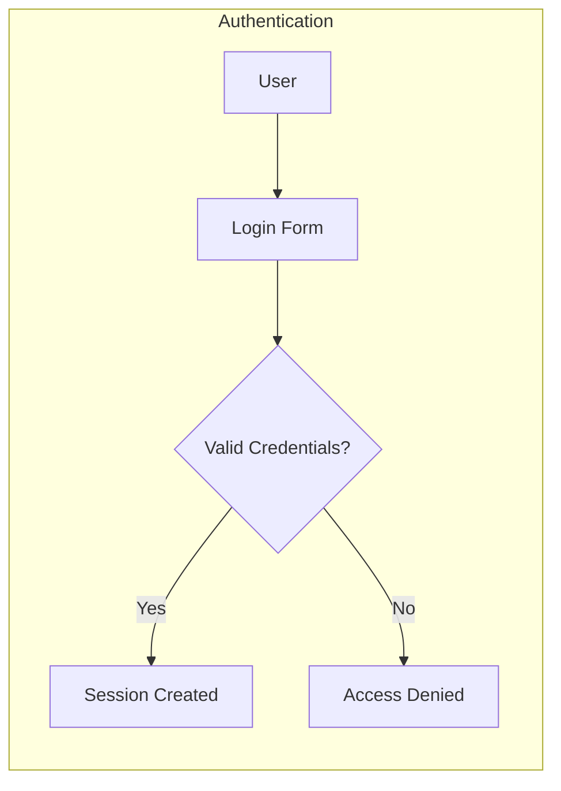
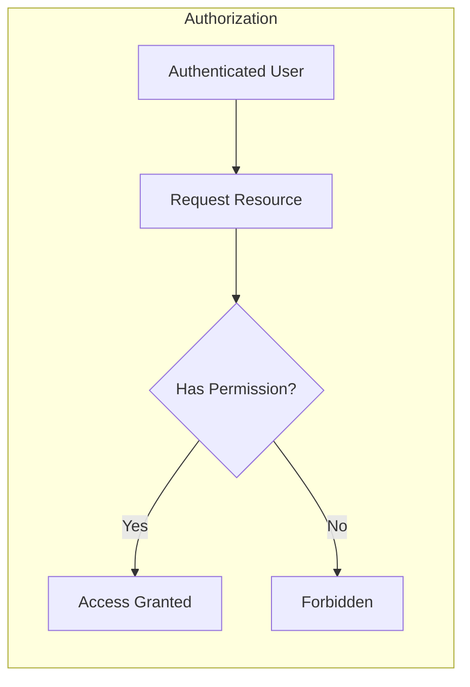
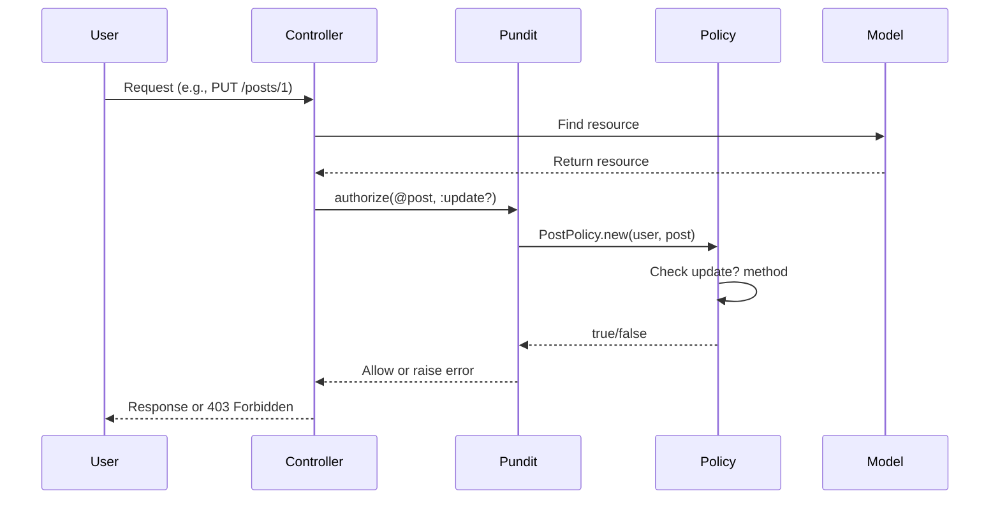
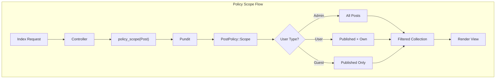
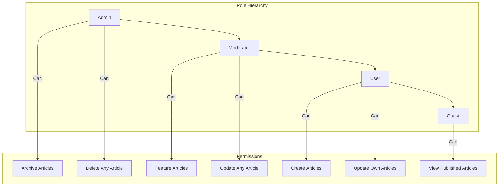
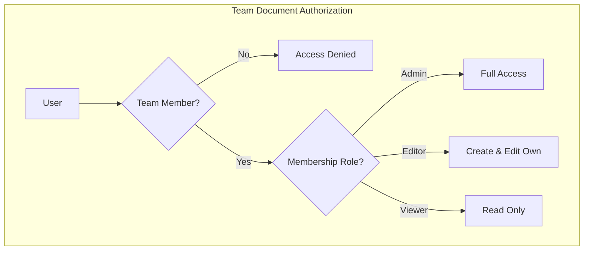

# How to Use Pundit for Authorization in Rails

Author: [nawazdhandala](https://www.github.com/nawazdhandala)

Tags: Ruby, Rails, Pundit, Authorization, Security, Policy Objects

Description: Learn how to implement authorization in Rails applications using Pundit. This guide covers policy objects, scopes, testing, and best practices for secure access control.

---

> Authorization determines what actions a user can perform and what resources they can access. While authentication answers "who are you?", authorization answers "what can you do?". Pundit provides an elegant, object-oriented approach to authorization in Rails applications.

Pundit is a minimal authorization library that leverages plain Ruby objects called policies. Unlike role-based gems that rely on DSLs and database tables, Pundit keeps authorization logic in simple, testable Ruby classes that live alongside your application code.

---

## Understanding Authorization vs Authentication

Before diving into Pundit, let's clarify the difference between authentication and authorization:





Authentication verifies identity. Authorization verifies permissions. Pundit handles the authorization layer, working seamlessly with authentication solutions like Devise.

### The Authorization Flow

Understanding how authorization fits into the request lifecycle:



---

## Getting Started

### Installation

Add Pundit to your Gemfile:

```ruby
# Gemfile

# Pundit for authorization
gem 'pundit'
```

Install the gem:

```bash
bundle install
```

Include Pundit in your ApplicationController:

```ruby
# app/controllers/application_controller.rb

class ApplicationController < ActionController::Base
  # Include Pundit for authorization
  include Pundit::Authorization
  
  # Rescue from authorization errors
  rescue_from Pundit::NotAuthorizedError, with: :user_not_authorized
  
  private
  
  # Handle unauthorized access attempts
  def user_not_authorized
    flash[:alert] = "You are not authorized to perform this action."
    redirect_back(fallback_location: root_path)
  end
end
```

Generate the base policy class:

```bash
rails generate pundit:install
```

This creates `app/policies/application_policy.rb`:

```ruby
# app/policies/application_policy.rb

# Base policy class that all policies inherit from
# Define default authorization rules here
class ApplicationPolicy
  # Store user and record for policy checks
  attr_reader :user, :record

  # Initialize policy with current user and resource
  def initialize(user, record)
    @user = user
    @record = record
  end

  # Default: deny access to index
  def index?
    false
  end

  # Default: deny access to show
  def show?
    false
  end

  # Default: deny access to create
  def create?
    false
  end

  # Default: deny access to new form
  def new?
    create?
  end

  # Default: deny access to update
  def update?
    false
  end

  # Default: deny access to edit form
  def edit?
    update?
  end

  # Default: deny access to destroy
  def destroy?
    false
  end

  # Base scope class for filtering collections
  class Scope
    # Store user and scope for filtering
    attr_reader :user, :scope

    # Initialize with current user and base scope
    def initialize(user, scope)
      @user = user
      @scope = scope
    end

    # Override in subclasses to filter records
    def resolve
      raise NotImplementedError, "You must define #resolve in #{self.class}"
    end
  end
end
```

---

## Creating Your First Policy

Policies are plain Ruby classes that determine what actions a user can perform on a resource. Each policy corresponds to a model.

### Generate a Policy

```bash
rails generate pundit:policy Post
```

This creates `app/policies/post_policy.rb`:

```ruby
# app/policies/post_policy.rb

# Policy for authorizing actions on Post resources
# Each method corresponds to a controller action
class PostPolicy < ApplicationPolicy
  # Determine if user can view all posts
  def index?
    true  # Anyone can view the posts list
  end

  # Determine if user can view a specific post
  def show?
    # Public posts are visible to everyone
    # Private posts are only visible to the owner
    record.published? || record.user == user
  end

  # Determine if user can create a new post
  def create?
    # Only authenticated users can create posts
    user.present?
  end

  # Determine if user can update a post
  def update?
    # Only the post owner or admins can update
    owner_or_admin?
  end

  # Determine if user can delete a post
  def destroy?
    # Only the post owner or admins can delete
    owner_or_admin?
  end

  # Determine if user can publish a post
  def publish?
    # Only admins or post owners with publishing privileges
    user.admin? || (record.user == user && user.can_publish?)
  end

  private

  # Helper method to check ownership or admin status
  def owner_or_admin?
    user.present? && (record.user == user || user.admin?)
  end
end
```

### Using Policies in Controllers

```ruby
# app/controllers/posts_controller.rb

class PostsController < ApplicationController
  # Ensure user is authenticated for write actions
  before_action :authenticate_user!, except: [:index, :show]
  
  # Load post before actions that need it
  before_action :set_post, only: [:show, :edit, :update, :destroy, :publish]

  # GET /posts
  def index
    # Use policy scope to filter posts user can see
    @posts = policy_scope(Post)
  end

  # GET /posts/:id
  def show
    # Check if user can view this specific post
    authorize @post
  end

  # GET /posts/new
  def new
    @post = Post.new
    # Check if user can create posts
    authorize @post
  end

  # POST /posts
  def create
    @post = current_user.posts.build(post_params)
    # Check if user can create this post
    authorize @post

    if @post.save
      redirect_to @post, notice: 'Post was successfully created.'
    else
      render :new, status: :unprocessable_entity
    end
  end

  # GET /posts/:id/edit
  def edit
    # Check if user can update this post
    authorize @post
  end

  # PATCH/PUT /posts/:id
  def update
    # Check if user can update this post
    authorize @post

    if @post.update(post_params)
      redirect_to @post, notice: 'Post was successfully updated.'
    else
      render :edit, status: :unprocessable_entity
    end
  end

  # DELETE /posts/:id
  def destroy
    # Check if user can destroy this post
    authorize @post
    
    @post.destroy
    redirect_to posts_url, notice: 'Post was successfully deleted.'
  end

  # POST /posts/:id/publish
  def publish
    # Check if user can publish this post
    authorize @post

    if @post.publish!
      redirect_to @post, notice: 'Post was successfully published.'
    else
      redirect_to @post, alert: 'Could not publish post.'
    end
  end

  private

  # Load post from database
  def set_post
    @post = Post.find(params[:id])
  end

  # Permitted parameters for post creation and updates
  def post_params
    params.require(:post).permit(:title, :body, :category_id)
  end
end
```

---

## Policy Scopes

Policy scopes filter collections to show only records the user can access. This is essential for index actions and associations.

### Defining Scopes

```ruby
# app/policies/post_policy.rb

class PostPolicy < ApplicationPolicy
  # Scope class filters which posts a user can see
  class Scope < Scope
    # Return only posts the user is allowed to view
    def resolve
      if user&.admin?
        # Admins see all posts
        scope.all
      elsif user.present?
        # Authenticated users see published posts and their own drafts
        scope.where(published: true)
             .or(scope.where(user: user))
      else
        # Anonymous users see only published posts
        scope.where(published: true)
      end
    end
  end

  # ... policy methods
end
```

### Using Scopes

```ruby
# app/controllers/posts_controller.rb

def index
  # Automatically uses PostPolicy::Scope
  @posts = policy_scope(Post)
end

# With additional filters
def index
  @posts = policy_scope(Post)
            .where(category: params[:category])
            .order(created_at: :desc)
            .page(params[:page])
end
```

### Scope Architecture



---

## Role-Based Authorization

Many applications need role-based access control. Here's how to implement it with Pundit:

### User Model with Roles

```ruby
# app/models/user.rb

class User < ApplicationRecord
  # Role constants for easy reference
  ROLES = %w[guest user moderator admin].freeze

  # Validate role is one of the allowed values
  validates :role, inclusion: { in: ROLES }

  # Default role for new users
  after_initialize :set_default_role, if: :new_record?

  # Role check methods for convenience
  def admin?
    role == 'admin'
  end

  def moderator?
    role == 'moderator'
  end

  def guest?
    role == 'guest'
  end

  # Check if user has at least the given role level
  def has_role?(check_role)
    ROLES.index(role) >= ROLES.index(check_role.to_s)
  end

  private

  def set_default_role
    self.role ||= 'user'
  end
end
```

### Role-Based Policy

```ruby
# app/policies/article_policy.rb

class ArticlePolicy < ApplicationPolicy
  # Anyone can view published articles
  def index?
    true
  end

  # Anyone can view a single published article
  # Unpublished only visible to authors and moderators
  def show?
    record.published? || author_or_moderator?
  end

  # Authenticated users can create articles
  def create?
    user.present? && !user.guest?
  end

  # Authors can update their own articles
  # Moderators can update any article
  def update?
    author? || moderator_or_above?
  end

  # Only authors can delete their own articles
  # Admins can delete any article
  def destroy?
    author? || user&.admin?
  end

  # Only moderators and admins can feature articles
  def feature?
    moderator_or_above?
  end

  # Only admins can archive articles
  def archive?
    user&.admin?
  end

  private

  # Check if user is the article author
  def author?
    user.present? && record.author == user
  end

  # Check if user is author or has moderator privileges
  def author_or_moderator?
    author? || moderator_or_above?
  end

  # Check if user has moderator role or higher
  def moderator_or_above?
    user.present? && user.has_role?(:moderator)
  end
end
```

### Role Hierarchy Diagram



---

## Headless Policies

Sometimes you need to authorize actions that don't involve a specific record, like viewing a dashboard or accessing admin pages.

### Dashboard Policy

```ruby
# app/policies/dashboard_policy.rb

class DashboardPolicy < ApplicationPolicy
  # Initialize with just the user since there's no specific record
  def initialize(user, _record = nil)
    @user = user
    @record = nil
  end

  # Anyone authenticated can view the dashboard
  def show?
    user.present?
  end

  # Only admins can view analytics
  def analytics?
    user&.admin?
  end

  # Moderators and above can view reports
  def reports?
    user.present? && user.has_role?(:moderator)
  end

  # Only admins can access settings
  def settings?
    user&.admin?
  end
end
```

### Using Headless Policies

```ruby
# app/controllers/dashboard_controller.rb

class DashboardController < ApplicationController
  before_action :authenticate_user!

  def show
    # Authorize without a record using :dashboard as the policy class hint
    authorize :dashboard, :show?
    @stats = DashboardStats.new(current_user)
  end

  def analytics
    authorize :dashboard, :analytics?
    @analytics = Analytics.for_period(params[:period])
  end

  def reports
    authorize :dashboard, :reports?
    @reports = Report.recent
  end
end
```

---

## Permitted Attributes

Pundit can also control which attributes users can modify, keeping your strong parameters DRY and centralized.

### Defining Permitted Attributes

```ruby
# app/policies/post_policy.rb

class PostPolicy < ApplicationPolicy
  # Basic attributes any author can modify
  def permitted_attributes
    base_attributes = [:title, :body, :category_id, :tags]
    
    if user&.admin?
      # Admins can set additional attributes
      base_attributes + [:author_id, :published, :featured, :pinned]
    elsif user&.moderator?
      # Moderators can publish and feature
      base_attributes + [:published, :featured]
    else
      # Regular users get base attributes only
      base_attributes
    end
  end

  # Different attributes allowed for creation vs update
  def permitted_attributes_for_create
    [:title, :body, :category_id, :tags, :draft]
  end

  def permitted_attributes_for_update
    attrs = [:title, :body, :category_id, :tags]
    attrs << :published if user&.admin? || user&.moderator?
    attrs
  end
end
```

### Using Permitted Attributes

```ruby
# app/controllers/posts_controller.rb

class PostsController < ApplicationController
  def create
    @post = current_user.posts.build(permitted_post_params)
    authorize @post
    # ... save logic
  end

  def update
    authorize @post
    if @post.update(permitted_post_params)
      # ... success logic
    end
  end

  private

  # Use policy to determine permitted attributes
  def permitted_post_params
    params.require(:post).permit(policy(@post || Post).permitted_attributes)
  end
  
  # Or use action-specific attributes
  def create_params
    params.require(:post).permit(
      policy(Post).permitted_attributes_for_create
    )
  end

  def update_params
    params.require(:post).permit(
      policy(@post).permitted_attributes_for_update
    )
  end
end
```

---

## View Helpers

Pundit provides helpers to conditionally show UI elements based on permissions.

### Using Policy in Views

```erb
<%# app/views/posts/show.html.erb %>

<article class="post">
  <h1><%= @post.title %></h1>
  <p class="meta">By <%= @post.author.name %></p>
  
  <div class="content">
    <%= @post.body %>
  </div>

  <div class="actions">
    <%# Only show edit button if user can update %>
    <% if policy(@post).update? %>
      <%= link_to 'Edit', edit_post_path(@post), class: 'btn btn-primary' %>
    <% end %>

    <%# Only show delete button if user can destroy %>
    <% if policy(@post).destroy? %>
      <%= button_to 'Delete', @post, 
          method: :delete, 
          data: { confirm: 'Are you sure?' },
          class: 'btn btn-danger' %>
    <% end %>

    <%# Only show publish button if applicable %>
    <% if !@post.published? && policy(@post).publish? %>
      <%= button_to 'Publish', publish_post_path(@post), 
          method: :post,
          class: 'btn btn-success' %>
    <% end %>
  </div>
</article>
```

### Policy Checks in Navigation

```erb
<%# app/views/layouts/_navigation.html.erb %>

<nav class="main-nav">
  <%= link_to 'Home', root_path %>
  <%= link_to 'Posts', posts_path %>
  
  <% if user_signed_in? %>
    <%# Show create button if user can create posts %>
    <% if policy(Post).create? %>
      <%= link_to 'New Post', new_post_path, class: 'btn' %>
    <% end %>

    <%# Admin-only navigation items %>
    <% if policy(:dashboard).analytics? %>
      <%= link_to 'Analytics', dashboard_analytics_path %>
    <% end %>

    <% if policy(:dashboard).settings? %>
      <%= link_to 'Settings', dashboard_settings_path %>
    <% end %>
  <% end %>
</nav>
```

### Creating a Helper Method

```ruby
# app/helpers/authorization_helper.rb

module AuthorizationHelper
  # Render content only if user has permission
  def authorized_content(record, action, &block)
    return unless policy(record).public_send(action)
    capture(&block)
  end

  # Render link only if user has permission
  def authorized_link_to(name, path, record, action, **options)
    return unless policy(record).public_send(action)
    link_to(name, path, **options)
  end
end
```

Usage in views:

```erb
<%= authorized_content(@post, :update?) do %>
  <div class="edit-section">
    <%= link_to 'Edit', edit_post_path(@post) %>
  </div>
<% end %>

<%= authorized_link_to 'Delete', @post, @post, :destroy?, 
    method: :delete, 
    class: 'btn-danger' %>
```

---

## Testing Policies

Pundit policies are plain Ruby classes, making them easy to test.

### RSpec Tests

```ruby
# spec/policies/post_policy_spec.rb

require 'rails_helper'

RSpec.describe PostPolicy, type: :policy do
  # Define test subjects
  let(:admin) { create(:user, role: 'admin') }
  let(:moderator) { create(:user, role: 'moderator') }
  let(:author) { create(:user) }
  let(:other_user) { create(:user) }
  let(:guest) { nil }  # Unauthenticated user

  # Create posts for testing
  let(:published_post) { create(:post, user: author, published: true) }
  let(:draft_post) { create(:post, user: author, published: false) }
  let(:other_post) { create(:post, user: other_user, published: true) }

  # Helper method to get policy instance
  subject { described_class }

  describe 'permissions' do
    # Test index action
    permissions :index? do
      it 'allows access to everyone' do
        expect(subject).to permit(guest, Post)
        expect(subject).to permit(author, Post)
        expect(subject).to permit(admin, Post)
      end
    end

    # Test show action
    permissions :show? do
      context 'for published posts' do
        it 'allows access to everyone' do
          expect(subject).to permit(guest, published_post)
          expect(subject).to permit(other_user, published_post)
        end
      end

      context 'for draft posts' do
        it 'denies access to guests' do
          expect(subject).not_to permit(guest, draft_post)
        end

        it 'denies access to other users' do
          expect(subject).not_to permit(other_user, draft_post)
        end

        it 'allows access to the author' do
          expect(subject).to permit(author, draft_post)
        end

        it 'allows access to admins' do
          expect(subject).to permit(admin, draft_post)
        end
      end
    end

    # Test create action
    permissions :create? do
      it 'denies access to guests' do
        expect(subject).not_to permit(guest, Post)
      end

      it 'allows access to authenticated users' do
        expect(subject).to permit(author, Post)
        expect(subject).to permit(other_user, Post)
      end
    end

    # Test update action
    permissions :update? do
      it 'denies access to guests' do
        expect(subject).not_to permit(guest, published_post)
      end

      it 'denies access to non-owners' do
        expect(subject).not_to permit(other_user, published_post)
      end

      it 'allows the owner to update' do
        expect(subject).to permit(author, published_post)
      end

      it 'allows admins to update any post' do
        expect(subject).to permit(admin, other_post)
      end

      it 'allows moderators to update any post' do
        expect(subject).to permit(moderator, other_post)
      end
    end

    # Test destroy action
    permissions :destroy? do
      it 'denies access to guests' do
        expect(subject).not_to permit(guest, published_post)
      end

      it 'denies access to non-owners' do
        expect(subject).not_to permit(other_user, published_post)
      end

      it 'denies access to moderators for others posts' do
        expect(subject).not_to permit(moderator, other_post)
      end

      it 'allows the owner to destroy' do
        expect(subject).to permit(author, published_post)
      end

      it 'allows admins to destroy any post' do
        expect(subject).to permit(admin, other_post)
      end
    end
  end

  # Test scope
  describe 'Scope' do
    let!(:user_published) { create(:post, user: author, published: true) }
    let!(:user_draft) { create(:post, user: author, published: false) }
    let!(:other_published) { create(:post, user: other_user, published: true) }
    let!(:other_draft) { create(:post, user: other_user, published: false) }

    subject { described_class::Scope.new(user, Post).resolve }

    context 'as a guest' do
      let(:user) { guest }

      it 'returns only published posts' do
        expect(subject).to include(user_published, other_published)
        expect(subject).not_to include(user_draft, other_draft)
      end
    end

    context 'as an authenticated user' do
      let(:user) { author }

      it 'returns published posts and own drafts' do
        expect(subject).to include(user_published, user_draft, other_published)
        expect(subject).not_to include(other_draft)
      end
    end

    context 'as an admin' do
      let(:user) { admin }

      it 'returns all posts' do
        expect(subject).to include(
          user_published, user_draft, other_published, other_draft
        )
      end
    end
  end
end
```

### Testing Controllers

```ruby
# spec/requests/posts_spec.rb

require 'rails_helper'

RSpec.describe 'Posts', type: :request do
  let(:user) { create(:user) }
  let(:admin) { create(:user, role: 'admin') }
  let(:post_record) { create(:post, user: user) }
  let(:other_post) { create(:post) }

  describe 'GET /posts/:id/edit' do
    context 'when not authenticated' do
      it 'redirects to login' do
        get edit_post_path(post_record)
        expect(response).to redirect_to(new_user_session_path)
      end
    end

    context 'when authenticated as owner' do
      before { sign_in user }

      it 'allows access' do
        get edit_post_path(post_record)
        expect(response).to have_http_status(:ok)
      end
    end

    context 'when authenticated as non-owner' do
      before { sign_in user }

      it 'denies access to others posts' do
        get edit_post_path(other_post)
        expect(response).to redirect_to(root_path)
        expect(flash[:alert]).to be_present
      end
    end

    context 'when authenticated as admin' do
      before { sign_in admin }

      it 'allows access to any post' do
        get edit_post_path(other_post)
        expect(response).to have_http_status(:ok)
      end
    end
  end

  describe 'DELETE /posts/:id' do
    context 'as the owner' do
      before { sign_in user }

      it 'deletes the post' do
        delete post_path(post_record)
        expect(response).to redirect_to(posts_path)
        expect(Post.exists?(post_record.id)).to be false
      end
    end

    context 'as another user' do
      let(:another_user) { create(:user) }
      before { sign_in another_user }

      it 'does not delete the post' do
        expect {
          delete post_path(post_record)
        }.not_to change(Post, :count)
        
        expect(response).to redirect_to(root_path)
      end
    end
  end
end
```

---

## Handling Complex Authorization

Sometimes authorization logic needs additional context beyond just user and record.

### Context-Aware Policies

```ruby
# app/policies/comment_policy.rb

class CommentPolicy < ApplicationPolicy
  # Comments can be viewed if the parent post is visible
  def show?
    Pundit.policy(user, record.post).show?
  end

  # Users can create comments on posts they can view
  def create?
    user.present? && Pundit.policy(user, record.post).show?
  end

  # Comment authors can update within 15 minutes
  # Moderators can always update
  def update?
    return false unless user.present?
    return true if user.admin? || user.moderator?
    
    author? && within_edit_window?
  end

  # Comment authors can delete within 15 minutes
  # Post authors can delete comments on their posts
  # Admins can always delete
  def destroy?
    return false unless user.present?
    return true if user.admin?
    return true if post_author?
    
    author? && within_edit_window?
  end

  private

  def author?
    record.user == user
  end

  def post_author?
    record.post.user == user
  end

  def within_edit_window?
    record.created_at > 15.minutes.ago
  end
end
```

### Policies with Additional Context

```ruby
# app/policies/team_document_policy.rb

class TeamDocumentPolicy < ApplicationPolicy
  # Store team membership for permission checks
  attr_reader :membership

  def initialize(user, record)
    super
    @membership = record.team.memberships.find_by(user: user)
  end

  def show?
    member? || record.public?
  end

  def create?
    member? && can_create_documents?
  end

  def update?
    owner? || team_admin?
  end

  def destroy?
    owner? || team_admin?
  end

  private

  def member?
    membership.present?
  end

  def owner?
    record.creator == user
  end

  def team_admin?
    membership&.admin?
  end

  def can_create_documents?
    membership.role.in?(%w[admin editor])
  end
end
```

### Organization Policy Flow



---

## Namespaced Policies

For APIs or admin panels, you might need different authorization rules.

### Admin Namespace Policies

```ruby
# app/policies/admin/user_policy.rb

module Admin
  class UserPolicy < ApplicationPolicy
    # Only admins can access user management
    def index?
      user&.admin?
    end

    def show?
      user&.admin?
    end

    def create?
      user&.admin?
    end

    def update?
      # Admins can update users but not themselves to prevent lockout
      user&.admin? && record != user
    end

    def destroy?
      # Cannot delete yourself
      user&.admin? && record != user
    end

    def impersonate?
      # Super admin feature only
      user&.super_admin? && record != user
    end

    class Scope < Scope
      def resolve
        user&.admin? ? scope.all : scope.none
      end
    end
  end
end
```

### Using Namespaced Policies

```ruby
# app/controllers/admin/users_controller.rb

module Admin
  class UsersController < AdminController
    def index
      @users = policy_scope([:admin, User])
    end

    def show
      @user = User.find(params[:id])
      authorize [:admin, @user]
    end

    def update
      @user = User.find(params[:id])
      authorize [:admin, @user]
      # ... update logic
    end
  end
end
```

---

## Error Handling

Customize how authorization failures are handled throughout your application.

### Custom Error Handling

```ruby
# app/controllers/application_controller.rb

class ApplicationController < ActionController::Base
  include Pundit::Authorization

  rescue_from Pundit::NotAuthorizedError, with: :handle_unauthorized

  private

  def handle_unauthorized(exception)
    # Log the authorization failure
    Rails.logger.warn(
      "Unauthorized access attempt: " \
      "user=#{current_user&.id} " \
      "policy=#{exception.policy.class} " \
      "action=#{exception.query} " \
      "record=#{exception.record}"
    )

    respond_to do |format|
      format.html { redirect_unauthorized_html(exception) }
      format.json { render_unauthorized_json(exception) }
      format.turbo_stream { render_unauthorized_turbo(exception) }
    end
  end

  def redirect_unauthorized_html(exception)
    flash[:alert] = authorization_error_message(exception)
    redirect_back(fallback_location: root_path)
  end

  def render_unauthorized_json(exception)
    render json: {
      error: 'unauthorized',
      message: authorization_error_message(exception)
    }, status: :forbidden
  end

  def render_unauthorized_turbo(exception)
    flash.now[:alert] = authorization_error_message(exception)
    render turbo_stream: turbo_stream.replace(
      'flash',
      partial: 'shared/flash'
    ), status: :forbidden
  end

  def authorization_error_message(exception)
    policy_name = exception.policy.class.to_s.underscore
    action = exception.query.to_s.chomp('?')
    
    I18n.t(
      "pundit.#{policy_name}.#{action}",
      default: I18n.t('pundit.default', default: 'Access denied')
    )
  end
end
```

### Internationalized Error Messages

```yaml
# config/locales/pundit.en.yml

en:
  pundit:
    default: "You are not authorized to perform this action."
    post_policy:
      create?: "You must be logged in to create posts."
      update?: "You can only edit your own posts."
      destroy?: "You can only delete your own posts."
      publish?: "You do not have permission to publish posts."
    comment_policy:
      create?: "You cannot comment on this post."
      update?: "Comments can only be edited within 15 minutes."
      destroy?: "You cannot delete this comment."
    admin/user_policy:
      index?: "Admin access required."
      impersonate?: "Super admin access required."
```

---

## Ensuring Authorization

Pundit can verify that authorization was performed in every controller action.

### Controller-Level Verification

```ruby
# app/controllers/application_controller.rb

class ApplicationController < ActionController::Base
  include Pundit::Authorization
  
  # Verify authorization was called after every action
  after_action :verify_authorized, except: :index
  after_action :verify_policy_scoped, only: :index

  rescue_from Pundit::AuthorizationNotPerformedError do
    # Log and alert in development/staging
    Rails.logger.error "Authorization was not performed!"
    
    if Rails.env.production?
      # Fail closed in production
      redirect_to root_path, alert: 'An error occurred.'
    else
      raise
    end
  end
end
```

### Skipping Verification

```ruby
# app/controllers/pages_controller.rb

class PagesController < ApplicationController
  # Skip verification for public pages
  skip_after_action :verify_authorized, only: [:home, :about, :contact]
  skip_after_action :verify_policy_scoped

  def home
    # No authorization needed for public home page
  end

  def about
    # No authorization needed
  end

  def contact
    # No authorization needed
  end
end
```

---

## Best Practices

### Policy Composition

```ruby
# app/policies/concerns/ownership_policy.rb

module OwnershipPolicy
  extend ActiveSupport::Concern

  private

  def owner?
    return false unless user.present?
    record.respond_to?(:user) && record.user == user
  end

  def owner_or_admin?
    owner? || user&.admin?
  end
end

# app/policies/post_policy.rb

class PostPolicy < ApplicationPolicy
  include OwnershipPolicy

  def update?
    owner_or_admin?
  end

  def destroy?
    owner_or_admin?
  end
end

# app/policies/comment_policy.rb

class CommentPolicy < ApplicationPolicy
  include OwnershipPolicy

  def update?
    owner_or_admin? && within_edit_window?
  end

  private

  def within_edit_window?
    record.created_at > 15.minutes.ago
  end
end
```

### Service Object Integration

```ruby
# app/services/post_publisher.rb

class PostPublisher
  include Pundit::Authorization

  def initialize(user, post)
    @user = user
    @post = post
  end

  def call
    # Check authorization within service
    authorize @post, :publish?
    
    Post.transaction do
      @post.update!(published: true, published_at: Time.current)
      notify_subscribers
      update_search_index
    end
    
    Result.success(@post)
  rescue Pundit::NotAuthorizedError => e
    Result.failure('Not authorized to publish this post')
  rescue ActiveRecord::RecordInvalid => e
    Result.failure(e.message)
  end

  private

  # Required by Pundit
  def pundit_user
    @user
  end

  def notify_subscribers
    # ... notification logic
  end

  def update_search_index
    # ... search indexing logic
  end
end
```

### Caching Policy Results

```ruby
# app/policies/application_policy.rb

class ApplicationPolicy
  attr_reader :user, :record

  def initialize(user, record)
    @user = user
    @record = record
    @cache = {}
  end

  private

  # Memoize expensive permission checks
  def cached_check(key, &block)
    return @cache[key] if @cache.key?(key)
    @cache[key] = block.call
  end

  def admin?
    cached_check(:admin?) { user&.admin? }
  end

  def owner?
    cached_check(:owner?) { user.present? && record.user_id == user.id }
  end
end
```

---

## Summary

Pundit provides a clean, object-oriented approach to authorization in Rails:

- **Policy Objects** - Plain Ruby classes that encapsulate authorization rules
- **Scopes** - Filter collections based on user permissions
- **View Helpers** - Conditionally render UI elements
- **Testing** - Easy to test with standard RSpec patterns
- **Flexibility** - Works with any authentication system

Key takeaways:

1. **Keep policies simple** - Each method should be easy to understand
2. **Use scopes** - Filter collections at the query level
3. **Test thoroughly** - Policies are easy to unit test
4. **Verify authorization** - Use `verify_authorized` to catch missing checks
5. **Handle errors gracefully** - Customize error messages per action

Pundit's minimal approach means you write plain Ruby code that's easy to understand, test, and maintain.

---

*Need to monitor your Rails application in production? [OneUptime](https://oneuptime.com) provides comprehensive observability for Ruby applications, including request tracing, error tracking, and performance monitoring.*
