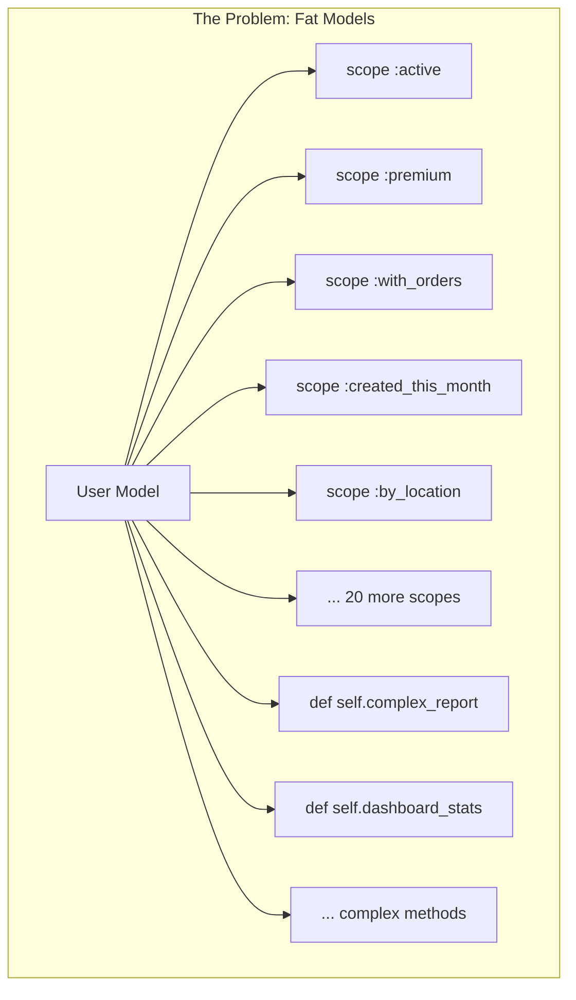
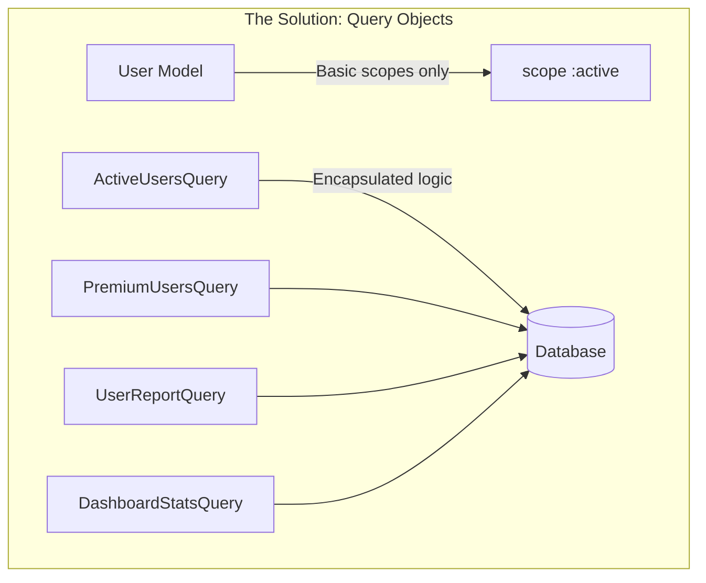
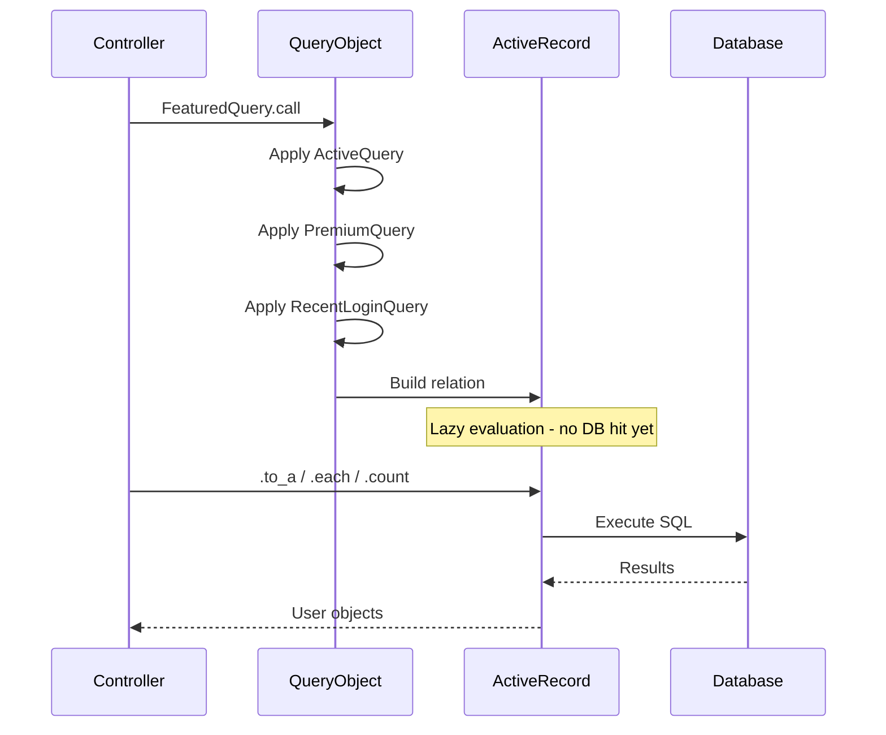
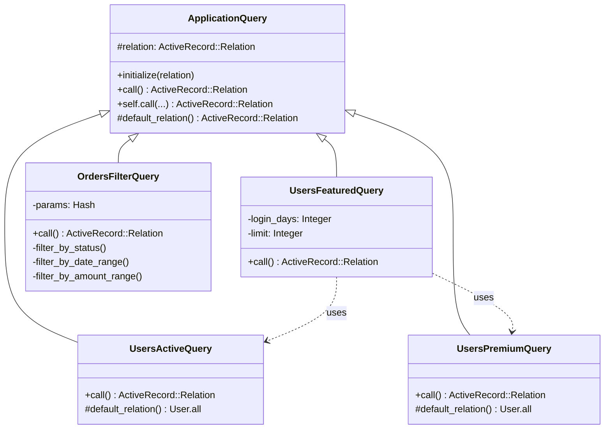
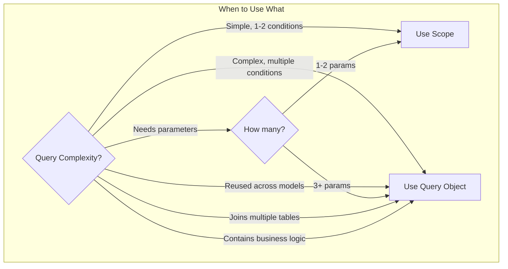

# How to Implement Query Objects Pattern in Rails

Author: [nawazdhandala](https://www.github.com/nawazdhandala)

Tags: Ruby, Rails, Query Objects, Design Patterns, ActiveRecord, Clean Code

Description: Learn how to implement the Query Objects pattern in Ruby on Rails to keep your models clean, improve testability, and build maintainable database queries. This guide covers basic to advanced patterns with practical examples.

---

> As Rails applications grow, ActiveRecord scopes and model methods accumulate into an unmanageable mess. Query Objects provide a structured way to encapsulate complex database logic, making your code more readable, testable, and maintainable.

The Query Objects pattern extracts database queries from models into dedicated classes. Each Query Object handles one specific query concern, following the Single Responsibility Principle and keeping your models focused on business logic rather than query construction.

---

## Why Query Objects?

Before diving into implementation, let's understand when and why to use Query Objects:





### Benefits of Query Objects

| Benefit | Description |
|---------|-------------|
| Single Responsibility | Each query class handles one specific concern |
| Testability | Query logic can be tested in isolation |
| Reusability | Queries can be composed and reused across the application |
| Readability | Complex queries are self-documenting with meaningful class names |
| Maintainability | Changes to query logic are isolated to one place |

---

## Basic Query Object Structure

### The Simplest Query Object

Start with a basic structure that wraps an ActiveRecord query:

```ruby
# app/queries/active_users_query.rb

# Query Object for fetching active users
# This encapsulates the logic for what makes a user "active"
class ActiveUsersQuery
  # Initialize with an optional base relation
  # This allows for query composition
  #
  # @param relation [ActiveRecord::Relation] base relation to query against
  def initialize(relation = User.all)
    @relation = relation
  end

  # Execute the query and return the result
  # Users are considered active if:
  # - Their status is 'active'
  # - They have logged in within the last 30 days
  #
  # @return [ActiveRecord::Relation] filtered users
  def call
    @relation
      .where(status: 'active')
      .where('last_login_at > ?', 30.days.ago)
  end

  # Class method shortcut for quick access
  # Allows: ActiveUsersQuery.call instead of ActiveUsersQuery.new.call
  #
  # @param relation [ActiveRecord::Relation] optional base relation
  # @return [ActiveRecord::Relation] filtered users
  def self.call(relation = User.all)
    new(relation).call
  end
end
```

### Using the Query Object

```ruby
# In a controller
class UsersController < ApplicationController
  def index
    # Simple usage
    @users = ActiveUsersQuery.call
    
    # With pagination
    @users = ActiveUsersQuery.call.page(params[:page])
    
    # Chaining with other scopes
    @users = ActiveUsersQuery.call(User.premium).order(:name)
  end
end

# In a service
class UserNotificationService
  def notify_active_users
    ActiveUsersQuery.call.find_each do |user|
      UserMailer.weekly_digest(user).deliver_later
    end
  end
end
```

---

## Query Object Patterns

### Pattern 1: Base Query Class

Create a base class that all Query Objects inherit from:

```ruby
# app/queries/application_query.rb

# Base class for all Query Objects
# Provides common interface and helper methods
class ApplicationQuery
  # Initialize with a base relation
  # Subclasses should define default_relation
  #
  # @param relation [ActiveRecord::Relation] base relation to query against
  def initialize(relation = nil)
    @relation = relation || default_relation
  end

  # Execute the query - must be implemented by subclasses
  #
  # @raise [NotImplementedError] if subclass does not implement
  # @return [ActiveRecord::Relation] query result
  def call
    raise NotImplementedError, "#{self.class} must implement #call"
  end

  # Class method shortcut
  #
  # @return [ActiveRecord::Relation] query result
  def self.call(...)
    new(...).call
  end

  private

  # Default relation to query against
  # Subclasses should override this
  #
  # @raise [NotImplementedError] if subclass does not implement
  # @return [ActiveRecord::Relation] default relation
  def default_relation
    raise NotImplementedError, "#{self.class} must implement #default_relation"
  end
end
```

### Pattern 2: Composable Queries

Build queries that can be easily composed together:

```ruby
# app/queries/users/active_query.rb

module Users
  # Query for users with active status
  class ActiveQuery < ApplicationQuery
    def call
      @relation.where(status: 'active')
    end

    private

    def default_relation
      User.all
    end
  end
end

# app/queries/users/premium_query.rb

module Users
  # Query for users with premium subscription
  class PremiumQuery < ApplicationQuery
    def call
      @relation.where(subscription_tier: 'premium')
    end

    private

    def default_relation
      User.all
    end
  end
end

# app/queries/users/recent_login_query.rb

module Users
  # Query for users who logged in recently
  class RecentLoginQuery < ApplicationQuery
    # @param days [Integer] number of days to look back
    def initialize(relation = nil, days: 30)
      super(relation)
      @days = days
    end

    def call
      @relation.where('last_login_at > ?', @days.days.ago)
    end

    private

    def default_relation
      User.all
    end
  end
end
```

### Composing Queries

```ruby
# Compose multiple queries together
class UserDashboardController < ApplicationController
  def index
    # Start with all users
    base_query = User.all
    
    # Apply filters progressively
    active_users = Users::ActiveQuery.call(base_query)
    premium_active = Users::PremiumQuery.call(active_users)
    recent_premium = Users::RecentLoginQuery.call(premium_active, days: 7)
    
    @featured_users = recent_premium.limit(10)
  end
end

# Or create a composite query
# app/queries/users/featured_query.rb

module Users
  # Composite query for featured users
  # Combines active, premium, and recent login criteria
  class FeaturedQuery < ApplicationQuery
    def initialize(relation = nil, login_days: 7, limit: 10)
      super(relation)
      @login_days = login_days
      @limit = limit
    end

    def call
      result = @relation
      result = ActiveQuery.call(result)
      result = PremiumQuery.call(result)
      result = RecentLoginQuery.call(result, days: @login_days)
      result.limit(@limit)
    end

    private

    def default_relation
      User.all
    end
  end
end
```

---

## Query Object Flow

Understanding how data flows through Query Objects:



---

## Advanced Query Objects

### Query Object with Parameters

Handle complex filtering with multiple parameters:

```ruby
# app/queries/orders/filter_query.rb

module Orders
  # Flexible query for filtering orders
  # Supports multiple filter criteria
  class FilterQuery < ApplicationQuery
    # Initialize with filter parameters
    #
    # @param relation [ActiveRecord::Relation] base relation
    # @param params [Hash] filter parameters
    # @option params [String] :status order status
    # @option params [Date] :from_date start date
    # @option params [Date] :to_date end date
    # @option params [Decimal] :min_amount minimum order amount
    # @option params [Decimal] :max_amount maximum order amount
    # @option params [Integer] :customer_id filter by customer
    def initialize(relation = nil, params = {})
      super(relation)
      @params = params.symbolize_keys
    end

    def call
      result = @relation

      # Apply each filter if parameter is present
      result = filter_by_status(result)
      result = filter_by_date_range(result)
      result = filter_by_amount_range(result)
      result = filter_by_customer(result)

      result
    end

    private

    def default_relation
      Order.all
    end

    # Filter by order status
    def filter_by_status(relation)
      return relation if @params[:status].blank?

      relation.where(status: @params[:status])
    end

    # Filter by date range
    def filter_by_date_range(relation)
      result = relation

      if @params[:from_date].present?
        result = result.where('created_at >= ?', @params[:from_date])
      end

      if @params[:to_date].present?
        result = result.where('created_at <= ?', @params[:to_date])
      end

      result
    end

    # Filter by amount range
    def filter_by_amount_range(relation)
      result = relation

      if @params[:min_amount].present?
        result = result.where('total_amount >= ?', @params[:min_amount])
      end

      if @params[:max_amount].present?
        result = result.where('total_amount <= ?', @params[:max_amount])
      end

      result
    end

    # Filter by customer
    def filter_by_customer(relation)
      return relation if @params[:customer_id].blank?

      relation.where(customer_id: @params[:customer_id])
    end
  end
end
```

### Using Parameter-based Queries

```ruby
# In a controller with search/filter functionality
class Admin::OrdersController < ApplicationController
  def index
    @orders = Orders::FilterQuery.call(
      Order.includes(:customer, :items),
      filter_params
    ).order(created_at: :desc)
     .page(params[:page])
  end

  private

  def filter_params
    params.permit(:status, :from_date, :to_date, :min_amount, :max_amount, :customer_id)
  end
end
```

---

## Query Objects with Joins and Aggregations

### Complex Join Query

```ruby
# app/queries/products/best_sellers_query.rb

module Products
  # Query for best-selling products within a time period
  # Joins with order_items to calculate sales volume
  class BestSellersQuery < ApplicationQuery
    # @param relation [ActiveRecord::Relation] base relation
    # @param since [Date] start date for sales calculation
    # @param limit [Integer] number of products to return
    def initialize(relation = nil, since: 30.days.ago, limit: 10)
      super(relation)
      @since = since
      @limit = limit
    end

    def call
      @relation
        .select(
          'products.*',
          'COALESCE(SUM(order_items.quantity), 0) AS total_sold',
          'COALESCE(SUM(order_items.quantity * order_items.unit_price), 0) AS total_revenue'
        )
        .left_joins(order_items: :order)
        .where(orders: { created_at: @since..Time.current })
        .or(@relation.where(orders: { id: nil }))
        .group('products.id')
        .order('total_sold DESC')
        .limit(@limit)
    end

    private

    def default_relation
      Product.all
    end
  end
end
```

### Aggregation Query

```ruby
# app/queries/analytics/sales_summary_query.rb

module Analytics
  # Query for sales summary statistics
  # Returns aggregated data grouped by time period
  class SalesSummaryQuery
    # @param start_date [Date] start of the period
    # @param end_date [Date] end of the period
    # @param group_by [Symbol] grouping level (:day, :week, :month)
    def initialize(start_date:, end_date:, group_by: :day)
      @start_date = start_date
      @end_date = end_date
      @group_by = group_by
    end

    # Execute the query
    # Returns array of hashes with aggregated data
    #
    # @return [Array<Hash>] sales summary data
    def call
      Order
        .where(status: 'completed')
        .where(created_at: @start_date..@end_date)
        .group(date_trunc_expression)
        .select(
          "#{date_trunc_expression} AS period",
          'COUNT(*) AS order_count',
          'SUM(total_amount) AS total_revenue',
          'AVG(total_amount) AS average_order_value',
          'COUNT(DISTINCT customer_id) AS unique_customers'
        )
        .order('period ASC')
    end

    def self.call(...)
      new(...).call
    end

    private

    # Generate the appropriate date truncation SQL
    def date_trunc_expression
      case @group_by
      when :day
        "DATE(created_at)"
      when :week
        "DATE_TRUNC('week', created_at)"
      when :month
        "DATE_TRUNC('month', created_at)"
      else
        "DATE(created_at)"
      end
    end
  end
end
```

---

## Query Object Architecture



---

## Testing Query Objects

Query Objects are easy to test in isolation:

### RSpec Tests

```ruby
# spec/queries/users/active_query_spec.rb

require 'rails_helper'

RSpec.describe Users::ActiveQuery do
  describe '.call' do
    # Create test data
    let!(:active_user) do
      create(:user, status: 'active', last_login_at: 1.day.ago)
    end

    let!(:inactive_user) do
      create(:user, status: 'inactive', last_login_at: 1.day.ago)
    end

    let!(:dormant_user) do
      create(:user, status: 'active', last_login_at: 60.days.ago)
    end

    it 'returns only active users' do
      result = described_class.call

      expect(result).to include(active_user)
      expect(result).not_to include(inactive_user)
      expect(result).not_to include(dormant_user)
    end

    it 'accepts a custom base relation' do
      # Create a premium active user
      premium_active = create(:user, status: 'active', subscription_tier: 'premium', last_login_at: 1.day.ago)
      
      # Start with premium users only
      base = User.where(subscription_tier: 'premium')
      result = described_class.call(base)

      expect(result).to include(premium_active)
      expect(result).not_to include(active_user)
    end

    it 'returns an ActiveRecord::Relation' do
      expect(described_class.call).to be_a(ActiveRecord::Relation)
    end

    it 'can be chained with other queries' do
      result = described_class.call.order(:name).limit(5)

      expect(result.to_sql).to include('ORDER BY')
      expect(result.to_sql).to include('LIMIT')
    end
  end
end
```

### Testing Complex Queries

```ruby
# spec/queries/orders/filter_query_spec.rb

require 'rails_helper'

RSpec.describe Orders::FilterQuery do
  describe '.call' do
    let!(:pending_order) { create(:order, status: 'pending', total_amount: 100) }
    let!(:completed_order) { create(:order, status: 'completed', total_amount: 500) }
    let!(:old_order) { create(:order, status: 'completed', created_at: 60.days.ago) }

    context 'with status filter' do
      it 'filters by status' do
        result = described_class.call(Order.all, status: 'completed')

        expect(result).to include(completed_order, old_order)
        expect(result).not_to include(pending_order)
      end
    end

    context 'with date range filter' do
      it 'filters by date range' do
        result = described_class.call(
          Order.all,
          from_date: 7.days.ago,
          to_date: Time.current
        )

        expect(result).to include(pending_order, completed_order)
        expect(result).not_to include(old_order)
      end
    end

    context 'with amount filter' do
      it 'filters by minimum amount' do
        result = described_class.call(Order.all, min_amount: 200)

        expect(result).to include(completed_order)
        expect(result).not_to include(pending_order)
      end

      it 'filters by amount range' do
        result = described_class.call(
          Order.all,
          min_amount: 50,
          max_amount: 200
        )

        expect(result).to include(pending_order)
        expect(result).not_to include(completed_order)
      end
    end

    context 'with multiple filters' do
      it 'combines all filters' do
        result = described_class.call(
          Order.all,
          status: 'completed',
          from_date: 7.days.ago,
          min_amount: 200
        )

        expect(result).to include(completed_order)
        expect(result).not_to include(pending_order, old_order)
      end
    end

    context 'with empty params' do
      it 'returns all records' do
        result = described_class.call(Order.all, {})

        expect(result.count).to eq(3)
      end
    end
  end
end
```

---

## Query Objects vs Scopes

When to use each approach:



### Keep Simple Scopes in Models

```ruby
# app/models/user.rb

class User < ApplicationRecord
  # Simple scopes stay in the model
  scope :active, -> { where(status: 'active') }
  scope :premium, -> { where(subscription_tier: 'premium') }
  scope :recent, -> { where('created_at > ?', 30.days.ago) }
  
  # Complex queries move to Query Objects
  # Instead of:
  # scope :with_recent_high_value_orders, -> (min_amount) {
  #   joins(:orders)
  #     .where('orders.created_at > ?', 30.days.ago)
  #     .where('orders.total_amount > ?', min_amount)
  #     .group('users.id')
  #     .having('COUNT(orders.id) > 3')
  # }
end
```

### Complex Logic in Query Objects

```ruby
# app/queries/users/high_value_customers_query.rb

module Users
  # Query for high-value customers based on order history
  # This logic is too complex for a simple scope
  class HighValueCustomersQuery < ApplicationQuery
    # @param relation [ActiveRecord::Relation] base relation
    # @param min_order_amount [Decimal] minimum order amount
    # @param min_order_count [Integer] minimum number of orders
    # @param since [Date] start date for order analysis
    def initialize(relation = nil, min_order_amount: 100, min_order_count: 3, since: 30.days.ago)
      super(relation)
      @min_order_amount = min_order_amount
      @min_order_count = min_order_count
      @since = since
    end

    def call
      @relation
        .joins(:orders)
        .where('orders.created_at > ?', @since)
        .where('orders.total_amount > ?', @min_order_amount)
        .group('users.id')
        .having('COUNT(orders.id) >= ?', @min_order_count)
        .select(
          'users.*',
          'COUNT(orders.id) AS order_count',
          'SUM(orders.total_amount) AS total_spent'
        )
    end

    private

    def default_relation
      User.all
    end
  end
end
```

---

## Real-World Examples

### Search Query with Full-Text Support

```ruby
# app/queries/products/search_query.rb

module Products
  # Full-text search query for products
  # Supports searching across multiple fields with relevance ranking
  class SearchQuery < ApplicationQuery
    # @param relation [ActiveRecord::Relation] base relation
    # @param query [String] search query
    # @param options [Hash] search options
    def initialize(relation = nil, query:, **options)
      super(relation)
      @query = query.to_s.strip
      @options = options
    end

    def call
      return @relation if @query.blank?

      if use_full_text_search?
        full_text_search
      else
        simple_search
      end
    end

    private

    def default_relation
      Product.all
    end

    # Check if full-text search should be used
    # Full-text is better for longer queries
    def use_full_text_search?
      @query.split.length >= 2
    end

    # Simple ILIKE search for short queries
    def simple_search
      search_term = "%#{sanitize_search_term}%"

      @relation.where(
        'name ILIKE :term OR description ILIKE :term OR sku ILIKE :term',
        term: search_term
      )
    end

    # PostgreSQL full-text search for complex queries
    def full_text_search
      @relation
        .select(
          'products.*',
          "ts_rank(to_tsvector('english', name || ' ' || COALESCE(description, '')), plainto_tsquery('english', :query)) AS rank",
        )
        .where(
          "to_tsvector('english', name || ' ' || COALESCE(description, '')) @@ plainto_tsquery('english', :query)",
          query: @query
        )
        .order('rank DESC')
    end

    # Sanitize search term for LIKE queries
    def sanitize_search_term
      @query.gsub(/[%_]/, '')
    end
  end
end
```

### Dashboard Statistics Query

```ruby
# app/queries/dashboard/overview_query.rb

module Dashboard
  # Query for dashboard overview statistics
  # Aggregates data from multiple models
  class OverviewQuery
    # @param organization_id [Integer] organization to get stats for
    # @param period [Range] date range for statistics
    def initialize(organization_id:, period: 30.days.ago..Time.current)
      @organization_id = organization_id
      @period = period
    end

    # Returns a hash with all dashboard statistics
    #
    # @return [Hash] dashboard data
    def call
      {
        orders: order_stats,
        customers: customer_stats,
        revenue: revenue_stats,
        products: product_stats
      }
    end

    def self.call(...)
      new(...).call
    end

    private

    # Order statistics
    def order_stats
      base_orders.select(
        'COUNT(*) AS total_count',
        'COUNT(CASE WHEN status = \'completed\' THEN 1 END) AS completed_count',
        'COUNT(CASE WHEN status = \'pending\' THEN 1 END) AS pending_count',
        'AVG(total_amount) AS average_value'
      ).take.attributes.symbolize_keys
    end

    # Customer statistics
    def customer_stats
      {
        total: Customer.where(organization_id: @organization_id).count,
        new_this_period: Customer.where(organization_id: @organization_id)
                                  .where(created_at: @period)
                                  .count,
        active: Customer.where(organization_id: @organization_id)
                        .joins(:orders)
                        .where(orders: { created_at: @period })
                        .distinct
                        .count
      }
    end

    # Revenue statistics
    def revenue_stats
      completed_orders = base_orders.where(status: 'completed')

      {
        total: completed_orders.sum(:total_amount),
        average_order: completed_orders.average(:total_amount) || 0,
        by_day: revenue_by_day
      }
    end

    # Daily revenue breakdown
    def revenue_by_day
      base_orders
        .where(status: 'completed')
        .group('DATE(created_at)')
        .select('DATE(created_at) AS day, SUM(total_amount) AS revenue')
        .order('day ASC')
        .map { |r| { day: r.day, revenue: r.revenue } }
    end

    # Product statistics
    def product_stats
      {
        total: Product.where(organization_id: @organization_id).count,
        low_stock: Product.where(organization_id: @organization_id)
                          .where('stock_quantity < ?', 10)
                          .count,
        top_sellers: top_selling_products
      }
    end

    # Top selling products in the period
    def top_selling_products
      Product
        .where(organization_id: @organization_id)
        .joins(order_items: :order)
        .where(orders: { created_at: @period, status: 'completed' })
        .group('products.id')
        .select('products.*, SUM(order_items.quantity) AS total_sold')
        .order('total_sold DESC')
        .limit(5)
    end

    # Base order query
    def base_orders
      Order
        .where(organization_id: @organization_id)
        .where(created_at: @period)
    end
  end
end
```

---

## Query Object Directory Structure

Organize Query Objects in a logical namespace:

```
app/
  queries/
    application_query.rb          # Base class
    users/
      active_query.rb
      premium_query.rb
      featured_query.rb
      high_value_customers_query.rb
      search_query.rb
    orders/
      filter_query.rb
      recent_query.rb
      by_customer_query.rb
    products/
      search_query.rb
      best_sellers_query.rb
      low_stock_query.rb
    analytics/
      sales_summary_query.rb
      customer_retention_query.rb
    dashboard/
      overview_query.rb
      metrics_query.rb
```

---

## Integration with Controllers

### Clean Controller Actions

```ruby
# app/controllers/admin/customers_controller.rb

module Admin
  class CustomersController < ApplicationController
    # GET /admin/customers
    def index
      @customers = build_customer_query
                     .page(params[:page])
                     .per(25)
    end

    # GET /admin/customers/high_value
    def high_value
      @customers = Users::HighValueCustomersQuery.call(
        min_order_amount: 200,
        min_order_count: 5,
        since: 90.days.ago
      ).page(params[:page])
    end

    # GET /admin/customers/export
    def export
      customers = build_customer_query
      
      respond_to do |format|
        format.csv { send_data CustomerExporter.to_csv(customers) }
        format.xlsx { send_data CustomerExporter.to_xlsx(customers) }
      end
    end

    private

    # Build the customer query based on filter params
    def build_customer_query
      base = User.customers.includes(:orders)
      
      # Apply active filter if requested
      base = Users::ActiveQuery.call(base) if params[:active].present?
      
      # Apply search if query present
      if params[:q].present?
        base = Users::SearchQuery.call(base, query: params[:q])
      end
      
      # Apply sorting
      base.order(sort_column => sort_direction)
    end

    def sort_column
      %w[name email created_at].include?(params[:sort]) ? params[:sort] : 'created_at'
    end

    def sort_direction
      %w[asc desc].include?(params[:direction]) ? params[:direction] : 'desc'
    end
  end
end
```

---

## Query Objects in Background Jobs

```ruby
# app/jobs/weekly_digest_job.rb

class WeeklyDigestJob < ApplicationJob
  queue_as :mailers

  def perform
    # Use Query Object to get target users
    Users::ActiveQuery.call
      .where(email_preferences: { weekly_digest: true })
      .find_each(batch_size: 100) do |user|
        UserMailer.weekly_digest(user).deliver_later
      end
  end
end

# app/jobs/low_stock_alert_job.rb

class LowStockAlertJob < ApplicationJob
  queue_as :alerts

  def perform
    # Query products that need restocking
    Products::LowStockQuery.call(threshold: 10).find_each do |product|
      InventoryMailer.low_stock_alert(product).deliver_later
    end
  end
end
```

---

## Performance Considerations

### Eager Loading

```ruby
# app/queries/users/with_order_stats_query.rb

module Users
  # Query for users with their order statistics
  # Includes eager loading to prevent N+1 queries
  class WithOrderStatsQuery < ApplicationQuery
    def call
      @relation
        .includes(:orders, :profile)
        .select(
          'users.*',
          '(SELECT COUNT(*) FROM orders WHERE orders.user_id = users.id) AS orders_count',
          '(SELECT SUM(total_amount) FROM orders WHERE orders.user_id = users.id) AS total_spent'
        )
    end

    private

    def default_relation
      User.all
    end
  end
end
```

### Query Caching

```ruby
# app/queries/analytics/cached_metrics_query.rb

module Analytics
  # Query for metrics with caching support
  class CachedMetricsQuery
    CACHE_TTL = 5.minutes

    def initialize(organization_id:, date: Date.current)
      @organization_id = organization_id
      @date = date
    end

    def call
      Rails.cache.fetch(cache_key, expires_in: CACHE_TTL) do
        fetch_metrics
      end
    end

    def self.call(...)
      new(...).call
    end

    private

    def cache_key
      "analytics:metrics:#{@organization_id}:#{@date}"
    end

    def fetch_metrics
      {
        orders_today: Order.where(organization_id: @organization_id)
                           .where('DATE(created_at) = ?', @date)
                           .count,
        revenue_today: Order.where(organization_id: @organization_id)
                            .where('DATE(created_at) = ?', @date)
                            .where(status: 'completed')
                            .sum(:total_amount),
        active_users: User.where(organization_id: @organization_id)
                          .where('last_login_at > ?', 24.hours.ago)
                          .count
      }
    end
  end
end
```

---

## Summary

Query Objects bring structure and clarity to your Rails application's database queries:

- **Single Responsibility**: Each Query Object handles one specific query concern
- **Composability**: Queries can be chained and combined for complex filtering
- **Testability**: Query logic can be tested in isolation without controllers
- **Readability**: Class names clearly communicate what the query does
- **Maintainability**: Changes to query logic are isolated to one file

### When to Use Query Objects

| Use Query Objects When | Keep Using Scopes When |
|------------------------|------------------------|
| Query has 3+ conditions | Query has 1-2 conditions |
| Query involves business logic | Query is a simple filter |
| Query is reused in multiple places | Query is model-specific |
| Query needs multiple parameters | Query has no parameters |
| Query joins multiple tables | Query operates on single table |

The Query Objects pattern is a powerful tool for managing database complexity in Rails applications. Start with a simple base class, organize your queries into logical namespaces, and gradually extract complex queries from your models.

---

*Building a Rails application that needs reliable monitoring? [OneUptime](https://oneuptime.com) provides comprehensive observability for Ruby on Rails applications, including query performance tracking, error monitoring, and uptime checks.*

