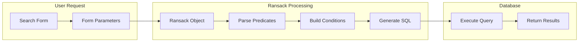
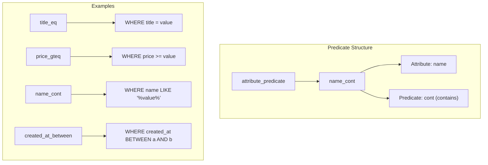
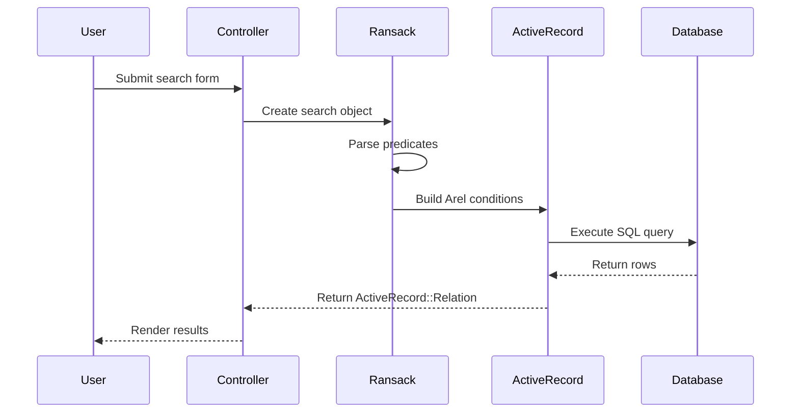
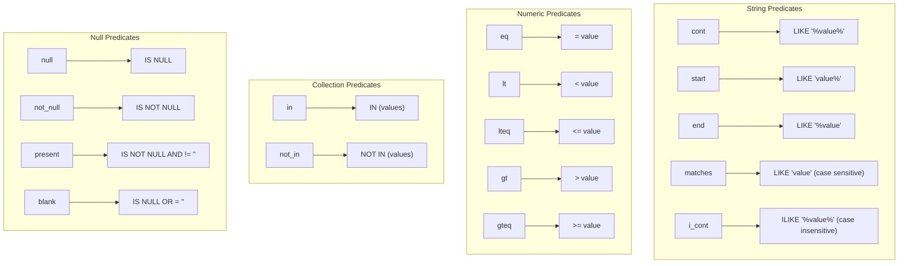

# How to Build Multi-Model Search with Ransack in Rails

Author: [nawazdhandala](https://www.github.com/nawazdhandala)

Tags: Ruby, Rails, Ransack, Search, ActiveRecord, Query

Description: Learn how to build powerful multi-model search functionality in Ruby on Rails using Ransack. This guide covers basic search, advanced predicates, cross-model searching, and production best practices.

---

> Search is one of the most critical features in any application. Users expect to find what they need quickly and intuitively. Ransack provides a powerful, flexible way to add sophisticated search capabilities to Rails applications without writing complex SQL.

Ransack is a Ruby gem that creates search forms and queries from simple objects. It generates ActiveRecord conditions from form parameters, making it easy to build advanced search interfaces with minimal code.

---

## Understanding Ransack Architecture

Before diving into implementation, let's understand how Ransack processes search queries:



Ransack uses a naming convention to understand what kind of search to perform:



### How Ransack Queries Flow

Understanding the query lifecycle helps you optimize searches:



---

## Getting Started

### Installation

Add Ransack to your Gemfile:

```ruby
# Gemfile

# Ransack - Object-based searching
gem 'ransack', '~> 4.1'

# Optional but recommended for pagination
gem 'kaminari', '~> 1.2'

# Optional for better sorting UI
gem 'font-awesome-rails'
```

Install the gem:

```bash
bundle install
```

### Basic Model Setup

Let's set up a sample application with multiple models:

```ruby
# app/models/product.rb

class Product < ApplicationRecord
  # Associations
  belongs_to :category
  belongs_to :vendor
  has_many :reviews, dependent: :destroy
  has_many :order_items
  has_many :orders, through: :order_items
  
  # Validations
  validates :name, presence: true
  validates :price, numericality: { greater_than_or_equal_to: 0 }
  validates :sku, uniqueness: true
  
  # Scopes for common filters
  scope :active, -> { where(active: true) }
  scope :in_stock, -> { where('inventory_count > 0') }
  scope :featured, -> { where(featured: true) }
  
  # Define which attributes can be searched
  # This is important for security
  def self.ransackable_attributes(auth_object = nil)
    %w[
      name
      description
      sku
      price
      inventory_count
      active
      featured
      created_at
      updated_at
      category_id
      vendor_id
    ]
  end
  
  # Define which associations can be searched
  def self.ransackable_associations(auth_object = nil)
    %w[category vendor reviews]
  end
  
  # Define custom ransackers for computed searches
  ransacker :price_in_dollars do
    Arel.sql('price / 100.0')
  end
  
  # Ransacker for searching by average rating
  ransacker :average_rating do
    Arel.sql(
      '(SELECT AVG(rating) FROM reviews WHERE reviews.product_id = products.id)'
    )
  end
end
```

```ruby
# app/models/category.rb

class Category < ApplicationRecord
  # Associations
  has_many :products, dependent: :nullify
  belongs_to :parent, class_name: 'Category', optional: true
  has_many :subcategories, class_name: 'Category', foreign_key: :parent_id
  
  # Validations
  validates :name, presence: true, uniqueness: { scope: :parent_id }
  
  # Scopes
  scope :root_categories, -> { where(parent_id: nil) }
  scope :active, -> { where(active: true) }
  
  # Ransack configuration
  def self.ransackable_attributes(auth_object = nil)
    %w[name description active parent_id created_at updated_at]
  end
  
  def self.ransackable_associations(auth_object = nil)
    %w[products parent subcategories]
  end
end
```

```ruby
# app/models/vendor.rb

class Vendor < ApplicationRecord
  # Associations
  has_many :products, dependent: :nullify
  
  # Validations
  validates :name, presence: true
  validates :email, presence: true, uniqueness: true
  
  # Scopes
  scope :verified, -> { where(verified: true) }
  scope :active, -> { where(active: true) }
  
  # Ransack configuration
  def self.ransackable_attributes(auth_object = nil)
    %w[name email phone city state country verified active created_at]
  end
  
  def self.ransackable_associations(auth_object = nil)
    %w[products]
  end
end
```

```ruby
# app/models/review.rb

class Review < ApplicationRecord
  # Associations
  belongs_to :product
  belongs_to :user
  
  # Validations
  validates :rating, presence: true, 
            inclusion: { in: 1..5, message: 'must be between 1 and 5' }
  validates :body, length: { minimum: 10, maximum: 5000 }
  
  # Scopes
  scope :positive, -> { where('rating >= 4') }
  scope :negative, -> { where('rating <= 2') }
  scope :recent, -> { where('created_at > ?', 30.days.ago) }
  
  # Ransack configuration
  def self.ransackable_attributes(auth_object = nil)
    %w[rating body product_id user_id created_at]
  end
  
  def self.ransackable_associations(auth_object = nil)
    %w[product user]
  end
end
```

---

## Basic Search Implementation

### Controller Setup

Create a search action in your controller:

```ruby
# app/controllers/products_controller.rb

class ProductsController < ApplicationController
  # GET /products
  # GET /products?q[name_cont]=laptop&q[price_gteq]=500
  def index
    # Create the Ransack search object from params
    # The @q object is used in views for form generation
    @q = Product.ransack(search_params)
    
    # Set default sort if none provided
    @q.sorts = 'created_at desc' if @q.sorts.empty?
    
    # Execute the search and paginate results
    @products = @q.result(distinct: true)
                  .includes(:category, :vendor, :reviews)
                  .page(params[:page])
                  .per(20)
  end
  
  # GET /products/search
  # Alternative endpoint for AJAX searches
  def search
    @q = Product.ransack(search_params)
    @products = @q.result(distinct: true)
                  .includes(:category, :vendor)
                  .limit(50)
    
    respond_to do |format|
      format.html { render :index }
      format.json { render json: @products }
      format.turbo_stream
    end
  end
  
  private
  
  # Strong parameters for search
  # Whitelist allowed search attributes
  def search_params
    params.fetch(:q, {}).permit(
      :name_cont,
      :description_cont,
      :sku_eq,
      :price_gteq,
      :price_lteq,
      :active_eq,
      :featured_eq,
      :category_id_eq,
      :vendor_id_eq,
      :created_at_gteq,
      :created_at_lteq,
      :s,  # Sort parameter
      category_id_in: [],
      vendor_id_in: []
    )
  end
end
```

### Basic Search Form

Create a search form in your view:

```erb
<!-- app/views/products/_search_form.html.erb -->

<%= search_form_for @q, url: products_path, method: :get, 
    html: { class: 'search-form', data: { turbo_frame: 'products' } } do |f| %>
  
  <div class="search-container">
    <!-- Text search for name and description -->
    <div class="form-group">
      <%= f.label :name_or_description_cont, 'Search Products' %>
      <%= f.search_field :name_or_description_cont, 
          class: 'form-control',
          placeholder: 'Enter product name or description...',
          autofocus: true %>
    </div>
    
    <!-- Price range filters -->
    <div class="form-row">
      <div class="form-group col-md-6">
        <%= f.label :price_gteq, 'Min Price' %>
        <%= f.number_field :price_gteq, 
            class: 'form-control',
            min: 0,
            step: 0.01,
            placeholder: '0.00' %>
      </div>
      
      <div class="form-group col-md-6">
        <%= f.label :price_lteq, 'Max Price' %>
        <%= f.number_field :price_lteq,
            class: 'form-control',
            min: 0,
            step: 0.01,
            placeholder: '1000.00' %>
      </div>
    </div>
    
    <!-- Category filter with dropdown -->
    <div class="form-group">
      <%= f.label :category_id_eq, 'Category' %>
      <%= f.collection_select :category_id_eq,
          Category.active.order(:name),
          :id, :name,
          { include_blank: 'All Categories' },
          { class: 'form-control' } %>
    </div>
    
    <!-- Vendor filter with dropdown -->
    <div class="form-group">
      <%= f.label :vendor_id_eq, 'Vendor' %>
      <%= f.collection_select :vendor_id_eq,
          Vendor.active.order(:name),
          :id, :name,
          { include_blank: 'All Vendors' },
          { class: 'form-control' } %>
    </div>
    
    <!-- Boolean filters using checkboxes -->
    <div class="form-check-group">
      <div class="form-check">
        <%= f.check_box :active_eq, 
            { class: 'form-check-input' }, 
            'true', nil %>
        <%= f.label :active_eq, 'Active Only', class: 'form-check-label' %>
      </div>
      
      <div class="form-check">
        <%= f.check_box :featured_eq,
            { class: 'form-check-input' },
            'true', nil %>
        <%= f.label :featured_eq, 'Featured Only', class: 'form-check-label' %>
      </div>
    </div>
    
    <!-- Date range filter -->
    <div class="form-row">
      <div class="form-group col-md-6">
        <%= f.label :created_at_gteq, 'From Date' %>
        <%= f.date_field :created_at_gteq, class: 'form-control' %>
      </div>
      
      <div class="form-group col-md-6">
        <%= f.label :created_at_lteq, 'To Date' %>
        <%= f.date_field :created_at_lteq, class: 'form-control' %>
      </div>
    </div>
    
    <!-- Submit and reset buttons -->
    <div class="form-actions">
      <%= f.submit 'Search', class: 'btn btn-primary' %>
      <%= link_to 'Reset', products_path, class: 'btn btn-secondary' %>
    </div>
  </div>
  
<% end %>
```

### Display Results with Sortable Headers

```erb
<!-- app/views/products/index.html.erb -->

<div class="products-page">
  <h1>Products</h1>
  
  <!-- Render the search form -->
  <%= render 'search_form' %>
  
  <!-- Results count -->
  <div class="results-info">
    <p>Found <%= @products.total_count %> products</p>
  </div>
  
  <!-- Products table with sortable headers -->
  <turbo-frame id="products">
    <table class="table table-striped">
      <thead>
        <tr>
          <th>
            <%= sort_link(@q, :name, 'Product Name', default_order: :asc) %>
          </th>
          <th>
            <%= sort_link(@q, :category_name, 'Category') %>
          </th>
          <th>
            <%= sort_link(@q, :price, 'Price', default_order: :asc) %>
          </th>
          <th>
            <%= sort_link(@q, :inventory_count, 'Stock') %>
          </th>
          <th>
            <%= sort_link(@q, :created_at, 'Added', default_order: :desc) %>
          </th>
          <th>Actions</th>
        </tr>
      </thead>
      <tbody>
        <% @products.each do |product| %>
          <tr>
            <td>
              <%= link_to product.name, product %>
              <% if product.featured? %>
                <span class="badge badge-primary">Featured</span>
              <% end %>
            </td>
            <td><%= product.category&.name %></td>
            <td><%= number_to_currency(product.price) %></td>
            <td>
              <% if product.inventory_count > 10 %>
                <span class="text-success"><%= product.inventory_count %></span>
              <% elsif product.inventory_count > 0 %>
                <span class="text-warning"><%= product.inventory_count %></span>
              <% else %>
                <span class="text-danger">Out of Stock</span>
              <% end %>
            </td>
            <td><%= product.created_at.strftime('%Y-%m-%d') %></td>
            <td>
              <%= link_to 'View', product, class: 'btn btn-sm btn-info' %>
              <%= link_to 'Edit', edit_product_path(product), 
                  class: 'btn btn-sm btn-secondary' %>
            </td>
          </tr>
        <% end %>
      </tbody>
    </table>
    
    <!-- Pagination -->
    <%= paginate @products %>
  </turbo-frame>
</div>
```

---

## Advanced Predicates

Ransack provides numerous predicates for different search conditions:



### Predicate Reference Table

| Predicate | Description | Example | SQL Output |
|-----------|-------------|---------|------------|
| `eq` | Equals | `name_eq='Phone'` | `WHERE name = 'Phone'` |
| `not_eq` | Not equals | `status_not_eq='archived'` | `WHERE status != 'archived'` |
| `lt` | Less than | `price_lt=100` | `WHERE price < 100` |
| `lteq` | Less than or equal | `price_lteq=100` | `WHERE price <= 100` |
| `gt` | Greater than | `price_gt=50` | `WHERE price > 50` |
| `gteq` | Greater than or equal | `price_gteq=50` | `WHERE price >= 50` |
| `cont` | Contains | `name_cont='phone'` | `WHERE name LIKE '%phone%'` |
| `not_cont` | Does not contain | `name_not_cont='test'` | `WHERE name NOT LIKE '%test%'` |
| `start` | Starts with | `sku_start='PRD'` | `WHERE sku LIKE 'PRD%'` |
| `end` | Ends with | `email_end='@gmail.com'` | `WHERE email LIKE '%@gmail.com'` |
| `in` | In array | `category_id_in=[1,2,3]` | `WHERE category_id IN (1,2,3)` |
| `not_in` | Not in array | `status_not_in=['draft']` | `WHERE status NOT IN ('draft')` |
| `null` | Is null | `deleted_at_null=true` | `WHERE deleted_at IS NULL` |
| `not_null` | Is not null | `verified_at_not_null=true` | `WHERE verified_at IS NOT NULL` |
| `present` | Present (not null/empty) | `description_present=true` | `WHERE description IS NOT NULL AND description != ''` |
| `blank` | Blank (null or empty) | `notes_blank=true` | `WHERE notes IS NULL OR notes = ''` |
| `true` | Boolean true | `active_true=1` | `WHERE active = true` |
| `false` | Boolean false | `archived_false=1` | `WHERE archived = false` |

### Using Multiple Predicates

```ruby
# app/controllers/products_controller.rb

class ProductsController < ApplicationController
  def index
    @q = Product.ransack(search_params)
    
    # You can chain additional conditions
    @products = @q.result(distinct: true)
                  .where(active: true)  # Always filter active
                  .includes(:category, :vendor)
                  .page(params[:page])
  end
  
  private
  
  def search_params
    params.fetch(:q, {}).permit(
      # Basic text searches
      :name_cont,
      :name_start,
      :description_cont,
      :sku_eq,
      :sku_start,
      
      # Numeric comparisons
      :price_eq,
      :price_lt,
      :price_lteq,
      :price_gt,
      :price_gteq,
      :inventory_count_gteq,
      :inventory_count_lteq,
      
      # Boolean fields
      :active_true,
      :active_false,
      :featured_true,
      
      # Null checks
      :deleted_at_null,
      :deleted_at_not_null,
      
      # Date ranges
      :created_at_gteq,
      :created_at_lteq,
      :updated_at_gteq,
      :updated_at_lteq,
      
      # Arrays for multi-select
      category_id_in: [],
      vendor_id_in: [],
      status_in: [],
      
      # Sorting
      :s
    )
  end
end
```

---

## Multi-Model Search

One of Ransack's most powerful features is searching across related models.

### Association Search Architecture

```mermaid
flowchart TB
    subgraph Search Query
        Q[Search: "electronics"]
    end
    
    subgraph Ransack Processing
        Q --> P1[product_name_cont]
        Q --> P2[category_name_cont]
        Q --> P3[vendor_name_cont]
    end
    
    subgraph SQL Generation
        P1 --> S1["products.name LIKE '%electronics%'"]
        P2 --> S2["categories.name LIKE '%electronics%'"]
        P3 --> S3["vendors.name LIKE '%electronics%'"]
    end
    
    subgraph Combined Query
        S1 --> OR
        S2 --> OR
        S3 --> OR["OR"]
        OR --> Result[Combined Results]
    end
```

### Searching Across Associations

```ruby
# app/models/product.rb

class Product < ApplicationRecord
  belongs_to :category
  belongs_to :vendor
  has_many :reviews
  
  # Allow searching through associations
  def self.ransackable_attributes(auth_object = nil)
    %w[name description sku price inventory_count active featured 
       category_id vendor_id created_at]
  end
  
  def self.ransackable_associations(auth_object = nil)
    %w[category vendor reviews]
  end
end
```

```erb
<!-- app/views/products/_advanced_search.html.erb -->

<%= search_form_for @q, url: products_path, method: :get do |f| %>
  <div class="advanced-search">
    <h3>Advanced Search</h3>
    
    <!-- Search product directly -->
    <div class="form-group">
      <%= f.label :name_cont, 'Product Name Contains' %>
      <%= f.text_field :name_cont, class: 'form-control' %>
    </div>
    
    <!-- Search by category name (association) -->
    <div class="form-group">
      <%= f.label :category_name_cont, 'Category Name Contains' %>
      <%= f.text_field :category_name_cont, class: 'form-control',
          placeholder: 'Search by category name...' %>
    </div>
    
    <!-- Search by vendor details (association) -->
    <div class="form-group">
      <%= f.label :vendor_name_cont, 'Vendor Name Contains' %>
      <%= f.text_field :vendor_name_cont, class: 'form-control',
          placeholder: 'Search by vendor name...' %>
    </div>
    
    <!-- Search by vendor location -->
    <div class="form-row">
      <div class="form-group col-md-6">
        <%= f.label :vendor_city_cont, 'Vendor City' %>
        <%= f.text_field :vendor_city_cont, class: 'form-control' %>
      </div>
      
      <div class="form-group col-md-6">
        <%= f.label :vendor_country_eq, 'Vendor Country' %>
        <%= f.select :vendor_country_eq,
            Vendor.distinct.pluck(:country).compact.sort,
            { include_blank: 'Any Country' },
            { class: 'form-control' } %>
      </div>
    </div>
    
    <!-- Search by review rating (nested association) -->
    <div class="form-group">
      <%= f.label :reviews_rating_gteq, 'Minimum Average Rating' %>
      <%= f.select :reviews_rating_gteq,
          [['Any', nil], ['1+', 1], ['2+', 2], ['3+', 3], ['4+', 4], ['5', 5]],
          {},
          { class: 'form-control' } %>
    </div>
    
    <!-- Combined search: name OR description OR category -->
    <div class="form-group">
      <%= f.label :name_or_description_or_category_name_cont, 
          'Search Everything' %>
      <%= f.text_field :name_or_description_or_category_name_cont,
          class: 'form-control',
          placeholder: 'Search products, descriptions, and categories...' %>
    </div>
    
    <%= f.submit 'Search', class: 'btn btn-primary' %>
  </div>
<% end %>
```

### Controller for Multi-Model Search

```ruby
# app/controllers/products_controller.rb

class ProductsController < ApplicationController
  def index
    @q = Product.ransack(search_params)
    
    # Use includes to avoid N+1 queries when searching associations
    @products = @q.result(distinct: true)
                  .includes(:category, :vendor, :reviews)
                  .page(params[:page])
                  .per(25)
  end
  
  private
  
  def search_params
    params.fetch(:q, {}).permit(
      # Direct product attributes
      :name_cont,
      :description_cont,
      :sku_eq,
      :price_gteq,
      :price_lteq,
      :active_eq,
      :featured_eq,
      
      # Category association (belongs_to)
      :category_id_eq,
      :category_name_cont,
      :category_active_eq,
      
      # Vendor association (belongs_to)
      :vendor_id_eq,
      :vendor_name_cont,
      :vendor_city_cont,
      :vendor_country_eq,
      :vendor_verified_eq,
      
      # Reviews association (has_many)
      :reviews_rating_gteq,
      :reviews_rating_lteq,
      :reviews_body_cont,
      
      # Combined searches using OR
      :name_or_description_cont,
      :name_or_description_or_category_name_cont,
      :name_or_sku_cont,
      
      # Arrays
      category_id_in: [],
      vendor_id_in: [],
      
      # Sorting
      :s
    )
  end
end
```

---

## Global Search Across All Models

Implement a unified search that queries multiple models simultaneously:

```ruby
# app/controllers/search_controller.rb

class SearchController < ApplicationController
  # GET /search?query=laptop
  def index
    @query = params[:query].to_s.strip
    
    return if @query.blank?
    
    # Search across multiple models
    @results = {
      products: search_products,
      categories: search_categories,
      vendors: search_vendors,
      orders: search_orders
    }
    
    # Calculate totals
    @total_results = @results.values.sum(&:count)
  end
  
  private
  
  def search_products
    Product.ransack(
      name_or_description_or_sku_cont: @query,
      active_eq: true
    ).result(distinct: true)
      .includes(:category, :vendor)
      .limit(20)
  end
  
  def search_categories
    Category.ransack(
      name_or_description_cont: @query,
      active_eq: true
    ).result(distinct: true)
      .limit(10)
  end
  
  def search_vendors
    Vendor.ransack(
      name_or_city_cont: @query,
      active_eq: true
    ).result(distinct: true)
      .limit(10)
  end
  
  def search_orders
    # Only search orders if user is authenticated
    return Order.none unless current_user
    
    current_user.orders.ransack(
      order_number_cont: @query
    ).result(distinct: true)
      .limit(10)
  end
end
```

```erb
<!-- app/views/search/index.html.erb -->

<div class="global-search-page">
  <h1>Search Results</h1>
  
  <!-- Search form -->
  <%= form_tag search_path, method: :get, class: 'search-form' do %>
    <div class="input-group">
      <%= text_field_tag :query, @query, 
          class: 'form-control form-control-lg',
          placeholder: 'Search products, categories, vendors...',
          autofocus: true %>
      <%= button_tag type: 'submit', class: 'btn btn-primary btn-lg' do %>
        Search
      <% end %>
    </div>
  <% end %>
  
  <% if @query.present? %>
    <p class="results-summary">
      Found <%= @total_results %> results for "<%= @query %>"
    </p>
    
    <!-- Products section -->
    <% if @results[:products].any? %>
      <section class="search-results-section">
        <h2>Products (<%= @results[:products].count %>)</h2>
        <div class="results-grid">
          <% @results[:products].each do |product| %>
            <div class="result-card">
              <h3><%= link_to product.name, product %></h3>
              <p class="category"><%= product.category&.name %></p>
              <p class="price"><%= number_to_currency(product.price) %></p>
              <p class="description">
                <%= truncate(product.description, length: 100) %>
              </p>
            </div>
          <% end %>
        </div>
        <%= link_to 'See all product results', 
            products_path(q: { name_or_description_cont: @query }),
            class: 'btn btn-link' %>
      </section>
    <% end %>
    
    <!-- Categories section -->
    <% if @results[:categories].any? %>
      <section class="search-results-section">
        <h2>Categories (<%= @results[:categories].count %>)</h2>
        <ul class="list-inline">
          <% @results[:categories].each do |category| %>
            <li class="list-inline-item">
              <%= link_to category.name, 
                  products_path(q: { category_id_eq: category.id }),
                  class: 'badge badge-secondary' %>
            </li>
          <% end %>
        </ul>
      </section>
    <% end %>
    
    <!-- Vendors section -->
    <% if @results[:vendors].any? %>
      <section class="search-results-section">
        <h2>Vendors (<%= @results[:vendors].count %>)</h2>
        <div class="results-grid">
          <% @results[:vendors].each do |vendor| %>
            <div class="result-card">
              <h3><%= link_to vendor.name, vendor %></h3>
              <p><%= vendor.city %>, <%= vendor.country %></p>
              <p><%= vendor.products.count %> products</p>
            </div>
          <% end %>
        </div>
      </section>
    <% end %>
    
    <!-- No results message -->
    <% if @total_results.zero? %>
      <div class="no-results">
        <p>No results found for "<%= @query %>"</p>
        <p>Try different keywords or check your spelling.</p>
      </div>
    <% end %>
  <% end %>
</div>
```

---

## Custom Ransackers

Create custom search logic with ransackers:

```ruby
# app/models/product.rb

class Product < ApplicationRecord
  belongs_to :category
  belongs_to :vendor
  has_many :reviews
  has_many :order_items
  
  # Custom ransacker: Search by full text (name + description + sku)
  ransacker :full_text do
    Arel.sql("CONCAT(products.name, ' ', products.description, ' ', products.sku)")
  end
  
  # Custom ransacker: Price in different currency
  ransacker :price_in_cents do
    Arel::Nodes::InfixOperation.new(
      '*',
      arel_table[:price],
      Arel::Nodes::SqlLiteral.new('100')
    )
  end
  
  # Custom ransacker: Calculate discounted price
  ransacker :discounted_price do
    Arel::Nodes::InfixOperation.new(
      '*',
      arel_table[:price],
      Arel::Nodes::SqlLiteral.new('0.9')  # 10% discount
    )
  end
  
  # Custom ransacker: Average review rating
  ransacker :avg_rating, type: :float do
    Arel.sql(
      '(SELECT COALESCE(AVG(reviews.rating), 0) 
        FROM reviews 
        WHERE reviews.product_id = products.id)'
    )
  end
  
  # Custom ransacker: Total sales count
  ransacker :total_sales, type: :integer do
    Arel.sql(
      '(SELECT COALESCE(SUM(order_items.quantity), 0) 
        FROM order_items 
        WHERE order_items.product_id = products.id)'
    )
  end
  
  # Custom ransacker: Days since creation
  ransacker :age_in_days, type: :integer do
    Arel.sql("EXTRACT(DAY FROM (CURRENT_DATE - products.created_at))")
  end
  
  # Custom ransacker: Stock status
  ransacker :in_stock, type: :boolean do
    Arel.sql('CASE WHEN products.inventory_count > 0 THEN true ELSE false END')
  end
  
  # Custom ransacker for searching by year
  ransacker :created_year, type: :integer do
    Arel.sql("EXTRACT(YEAR FROM products.created_at)")
  end
  
  # Custom ransacker for searching by month
  ransacker :created_month, type: :integer do
    Arel.sql("EXTRACT(MONTH FROM products.created_at)")
  end
end
```

### Using Custom Ransackers in Forms

```erb
<!-- app/views/products/_custom_search.html.erb -->

<%= search_form_for @q, url: products_path, method: :get do |f| %>
  <div class="custom-search">
    <!-- Full text search using custom ransacker -->
    <div class="form-group">
      <%= f.label :full_text_cont, 'Full Text Search' %>
      <%= f.text_field :full_text_cont, 
          class: 'form-control',
          placeholder: 'Search name, description, and SKU...' %>
    </div>
    
    <!-- Search by average rating -->
    <div class="form-group">
      <%= f.label :avg_rating_gteq, 'Minimum Rating' %>
      <%= f.select :avg_rating_gteq,
          [['Any', nil], ['4+', 4], ['3+', 3], ['2+', 2]],
          {},
          { class: 'form-control' } %>
    </div>
    
    <!-- Search by total sales -->
    <div class="form-row">
      <div class="form-group col-md-6">
        <%= f.label :total_sales_gteq, 'Min Sales' %>
        <%= f.number_field :total_sales_gteq, 
            class: 'form-control',
            min: 0 %>
      </div>
      
      <div class="form-group col-md-6">
        <%= f.label :total_sales_lteq, 'Max Sales' %>
        <%= f.number_field :total_sales_lteq,
            class: 'form-control',
            min: 0 %>
      </div>
    </div>
    
    <!-- Filter by stock status -->
    <div class="form-check">
      <%= f.check_box :in_stock_true, { class: 'form-check-input' } %>
      <%= f.label :in_stock_true, 'In Stock Only', class: 'form-check-label' %>
    </div>
    
    <!-- Search by creation year -->
    <div class="form-group">
      <%= f.label :created_year_eq, 'Created Year' %>
      <%= f.select :created_year_eq,
          (2020..Date.current.year).to_a.reverse,
          { include_blank: 'Any Year' },
          { class: 'form-control' } %>
    </div>
    
    <%= f.submit 'Apply Filters', class: 'btn btn-primary' %>
  </div>
<% end %>
```

---

## Scopes and Groupings

Combine Ransack with ActiveRecord scopes for powerful filtering:

```ruby
# app/models/product.rb

class Product < ApplicationRecord
  # Define scopes
  scope :active, -> { where(active: true) }
  scope :featured, -> { where(featured: true) }
  scope :in_stock, -> { where('inventory_count > 0') }
  scope :low_stock, -> { where('inventory_count > 0 AND inventory_count < 10') }
  scope :out_of_stock, -> { where(inventory_count: 0) }
  scope :recent, -> { where('created_at > ?', 30.days.ago) }
  scope :popular, -> { 
    joins(:order_items)
      .group('products.id')
      .order('SUM(order_items.quantity) DESC')
  }
  scope :top_rated, -> {
    joins(:reviews)
      .group('products.id')
      .having('AVG(reviews.rating) >= 4')
      .order('AVG(reviews.rating) DESC')
  }
  scope :by_price_range, ->(min, max) { 
    where(price: min..max) 
  }
  
  # Make scopes available to Ransack
  def self.ransackable_scopes(auth_object = nil)
    %i[active featured in_stock low_stock out_of_stock recent popular top_rated]
  end
end
```

### Using Scopes in Controller

```ruby
# app/controllers/products_controller.rb

class ProductsController < ApplicationController
  def index
    @q = base_scope.ransack(search_params)
    @products = @q.result(distinct: true)
                  .includes(:category, :vendor)
                  .page(params[:page])
  end
  
  private
  
  # Apply base scopes before Ransack
  def base_scope
    scope = Product.all
    
    # Apply scope filters from params
    scope = scope.active if params[:filter] == 'active'
    scope = scope.featured if params[:filter] == 'featured'
    scope = scope.in_stock if params[:filter] == 'in_stock'
    scope = scope.low_stock if params[:filter] == 'low_stock'
    scope = scope.recent if params[:filter] == 'recent'
    scope = scope.popular if params[:filter] == 'popular'
    scope = scope.top_rated if params[:filter] == 'top_rated'
    
    scope
  end
  
  def search_params
    params.fetch(:q, {}).permit(
      :name_cont,
      :price_gteq,
      :price_lteq,
      :category_id_eq,
      :s
    )
  end
end
```

```erb
<!-- app/views/products/_scope_filters.html.erb -->

<div class="scope-filters">
  <h4>Quick Filters</h4>
  <div class="btn-group" role="group">
    <%= link_to 'All', 
        products_path(q: params[:q]),
        class: "btn btn-outline-primary #{params[:filter].blank? ? 'active' : ''}" %>
    
    <%= link_to 'Active', 
        products_path(filter: 'active', q: params[:q]),
        class: "btn btn-outline-primary #{params[:filter] == 'active' ? 'active' : ''}" %>
    
    <%= link_to 'Featured', 
        products_path(filter: 'featured', q: params[:q]),
        class: "btn btn-outline-primary #{params[:filter] == 'featured' ? 'active' : ''}" %>
    
    <%= link_to 'In Stock', 
        products_path(filter: 'in_stock', q: params[:q]),
        class: "btn btn-outline-success #{params[:filter] == 'in_stock' ? 'active' : ''}" %>
    
    <%= link_to 'Low Stock', 
        products_path(filter: 'low_stock', q: params[:q]),
        class: "btn btn-outline-warning #{params[:filter] == 'low_stock' ? 'active' : ''}" %>
    
    <%= link_to 'Popular', 
        products_path(filter: 'popular', q: params[:q]),
        class: "btn btn-outline-info #{params[:filter] == 'popular' ? 'active' : ''}" %>
    
    <%= link_to 'Top Rated', 
        products_path(filter: 'top_rated', q: params[:q]),
        class: "btn btn-outline-info #{params[:filter] == 'top_rated' ? 'active' : ''}" %>
  </div>
</div>
```

---

## AJAX and Turbo Frame Search

Implement real-time search with Hotwire Turbo:

```ruby
# app/controllers/products_controller.rb

class ProductsController < ApplicationController
  def index
    @q = Product.ransack(search_params)
    @products = @q.result(distinct: true)
                  .includes(:category, :vendor)
                  .page(params[:page])
    
    respond_to do |format|
      format.html
      format.turbo_stream { render turbo_stream: turbo_stream_results }
    end
  end
  
  private
  
  def turbo_stream_results
    turbo_stream.replace(
      'product-results',
      partial: 'products/results',
      locals: { products: @products, q: @q }
    )
  end
end
```

```erb
<!-- app/views/products/index.html.erb -->

<div class="products-page">
  <h1>Products</h1>
  
  <!-- Live search form -->
  <%= search_form_for @q, url: products_path, method: :get,
      html: { 
        data: { 
          controller: 'search',
          turbo_frame: 'product-results',
          turbo_action: 'replace'
        }
      } do |f| %>
    
    <div class="search-input-wrapper">
      <%= f.search_field :name_or_description_cont,
          class: 'form-control',
          placeholder: 'Search products...',
          data: { 
            search_target: 'input',
            action: 'input->search#search'
          } %>
      <span class="search-spinner" data-search-target="spinner" hidden>
        Searching...
      </span>
    </div>
  <% end %>
  
  <!-- Results container -->
  <turbo-frame id="product-results">
    <%= render 'results', products: @products, q: @q %>
  </turbo-frame>
</div>
```

```erb
<!-- app/views/products/_results.html.erb -->

<div class="results-container">
  <div class="results-info">
    <span><%= @products.total_count %> products found</span>
  </div>
  
  <div class="products-grid">
    <% products.each do |product| %>
      <%= render 'product_card', product: product %>
    <% end %>
  </div>
  
  <% if products.empty? %>
    <div class="no-results">
      <p>No products found matching your search.</p>
      <p>Try adjusting your filters or search terms.</p>
    </div>
  <% end %>
  
  <%= paginate products %>
</div>
```

```javascript
// app/javascript/controllers/search_controller.js

import { Controller } from "@hotwired/stimulus"

export default class extends Controller {
  static targets = ["input", "spinner"]
  
  connect() {
    this.timeout = null
  }
  
  search() {
    // Clear previous timeout
    clearTimeout(this.timeout)
    
    // Show loading spinner
    this.spinnerTarget.hidden = false
    
    // Debounce: Wait 300ms after user stops typing
    this.timeout = setTimeout(() => {
      this.element.requestSubmit()
    }, 300)
  }
  
  // Hide spinner when Turbo finishes loading
  disconnect() {
    clearTimeout(this.timeout)
  }
}
```

---

## Security Considerations

Always whitelist searchable attributes to prevent unauthorized access:

```ruby
# app/models/product.rb

class Product < ApplicationRecord
  # Restrict searchable attributes based on user role
  def self.ransackable_attributes(auth_object = nil)
    # Base attributes available to everyone
    base_attrs = %w[name description price category_id active]
    
    # Admin gets additional attributes
    if auth_object&.admin?
      base_attrs + %w[sku cost_price margin vendor_id created_at updated_at]
    else
      base_attrs
    end
  end
  
  # Restrict searchable associations
  def self.ransackable_associations(auth_object = nil)
    if auth_object&.admin?
      %w[category vendor reviews order_items]
    else
      %w[category]
    end
  end
  
  # Restrict which scopes can be called via Ransack
  def self.ransackable_scopes(auth_object = nil)
    if auth_object&.admin?
      %i[active featured in_stock low_stock popular]
    else
      %i[active in_stock]
    end
  end
end
```

### Controller Integration with Authorization

```ruby
# app/controllers/products_controller.rb

class ProductsController < ApplicationController
  def index
    # Pass current user to Ransack for authorization
    @q = Product.ransack(search_params, auth_object: current_user)
    
    @products = @q.result(distinct: true)
                  .includes(:category)
                  .page(params[:page])
  end
  
  private
  
  def search_params
    # Only permit known parameters
    permitted = [:name_cont, :description_cont, :price_gteq, :price_lteq,
                 :category_id_eq, :active_eq, :s]
    
    # Admin gets more search options
    if current_user&.admin?
      permitted += [:sku_cont, :vendor_id_eq, :cost_price_gteq, 
                    :created_at_gteq, :created_at_lteq]
    end
    
    params.fetch(:q, {}).permit(permitted)
  end
end
```

---

## Performance Optimization

### Eager Loading Associations

```ruby
# app/controllers/products_controller.rb

class ProductsController < ApplicationController
  def index
    @q = Product.ransack(search_params)
    
    # Always eager load associations that will be displayed
    @products = @q.result(distinct: true)
                  .includes(:category, :vendor)
                  .includes(reviews: :user)  # Nested eager loading
                  .references(:category)      # Required for association conditions
                  .page(params[:page])
                  .per(25)
  end
end
```

### Index Optimization

```ruby
# db/migrate/20250702000000_add_search_indexes.rb

class AddSearchIndexes < ActiveRecord::Migration[7.1]
  def change
    # Index for text search
    add_index :products, :name
    add_index :products, :sku
    
    # Composite index for common filter combinations
    add_index :products, [:active, :category_id]
    add_index :products, [:active, :vendor_id]
    add_index :products, [:active, :price]
    add_index :products, [:active, :created_at]
    
    # Foreign key indexes (Rails usually creates these)
    add_index :products, :category_id unless index_exists?(:products, :category_id)
    add_index :products, :vendor_id unless index_exists?(:products, :vendor_id)
    
    # Full text index for PostgreSQL
    execute <<-SQL
      CREATE INDEX products_fulltext_idx ON products 
      USING gin(to_tsvector('english', name || ' ' || COALESCE(description, '')));
    SQL
  end
end
```

### Caching Search Results

```ruby
# app/controllers/products_controller.rb

class ProductsController < ApplicationController
  def index
    @q = Product.ransack(search_params)
    
    # Cache key based on search parameters
    cache_key = search_cache_key
    
    @products = Rails.cache.fetch(cache_key, expires_in: 5.minutes) do
      @q.result(distinct: true)
        .includes(:category, :vendor)
        .page(params[:page])
        .per(25)
        .to_a  # Convert to array for caching
    end
  end
  
  private
  
  def search_cache_key
    [
      'products_search',
      search_params.to_s,
      params[:page],
      Product.maximum(:updated_at)
    ].join('/')
  end
end
```

---

## Testing Ransack Searches

```ruby
# spec/models/product_spec.rb

require 'rails_helper'

RSpec.describe Product, type: :model do
  describe 'ransack configuration' do
    describe '.ransackable_attributes' do
      it 'returns expected attributes for regular users' do
        attrs = Product.ransackable_attributes(nil)
        
        expect(attrs).to include('name', 'description', 'price')
        expect(attrs).not_to include('cost_price', 'margin')
      end
      
      it 'returns additional attributes for admin users' do
        admin = build(:user, :admin)
        attrs = Product.ransackable_attributes(admin)
        
        expect(attrs).to include('cost_price', 'margin', 'sku')
      end
    end
    
    describe '.ransackable_associations' do
      it 'allows searching through category' do
        expect(Product.ransackable_associations).to include('category')
      end
    end
  end
  
  describe 'ransack searches' do
    let!(:laptop) { create(:product, name: 'Gaming Laptop', price: 1500) }
    let!(:phone) { create(:product, name: 'Smart Phone', price: 800) }
    let!(:tablet) { create(:product, name: 'Tablet Pro', price: 600) }
    
    describe 'text search' do
      it 'finds products by name containing text' do
        result = Product.ransack(name_cont: 'Laptop').result
        
        expect(result).to include(laptop)
        expect(result).not_to include(phone, tablet)
      end
      
      it 'is case insensitive' do
        result = Product.ransack(name_cont: 'laptop').result
        
        expect(result).to include(laptop)
      end
    end
    
    describe 'numeric search' do
      it 'finds products with price greater than or equal' do
        result = Product.ransack(price_gteq: 800).result
        
        expect(result).to include(laptop, phone)
        expect(result).not_to include(tablet)
      end
      
      it 'finds products with price less than' do
        result = Product.ransack(price_lt: 800).result
        
        expect(result).to include(tablet)
        expect(result).not_to include(laptop, phone)
      end
      
      it 'finds products within price range' do
        result = Product.ransack(price_gteq: 700, price_lteq: 1000).result
        
        expect(result).to include(phone)
        expect(result).not_to include(laptop, tablet)
      end
    end
    
    describe 'association search' do
      let(:electronics) { create(:category, name: 'Electronics') }
      let(:computers) { create(:category, name: 'Computers') }
      
      before do
        laptop.update(category: computers)
        phone.update(category: electronics)
        tablet.update(category: electronics)
      end
      
      it 'finds products by category name' do
        result = Product.ransack(category_name_cont: 'Electronics').result
        
        expect(result).to include(phone, tablet)
        expect(result).not_to include(laptop)
      end
    end
  end
end
```

```ruby
# spec/requests/products_spec.rb

require 'rails_helper'

RSpec.describe 'Products Search', type: :request do
  let!(:laptop) { create(:product, name: 'Gaming Laptop', price: 1500, active: true) }
  let!(:phone) { create(:product, name: 'Smart Phone', price: 800, active: true) }
  let!(:archived) { create(:product, name: 'Old Phone', price: 200, active: false) }
  
  describe 'GET /products' do
    it 'returns all active products without search params' do
      get products_path
      
      expect(response).to have_http_status(:success)
      expect(response.body).to include('Gaming Laptop')
      expect(response.body).to include('Smart Phone')
    end
    
    it 'filters products by name' do
      get products_path, params: { q: { name_cont: 'Laptop' } }
      
      expect(response).to have_http_status(:success)
      expect(response.body).to include('Gaming Laptop')
      expect(response.body).not_to include('Smart Phone')
    end
    
    it 'filters products by price range' do
      get products_path, params: { q: { price_gteq: 1000 } }
      
      expect(response).to have_http_status(:success)
      expect(response.body).to include('Gaming Laptop')
      expect(response.body).not_to include('Smart Phone')
    end
    
    it 'sorts products by price ascending' do
      get products_path, params: { q: { s: 'price asc' } }
      
      expect(response).to have_http_status(:success)
      expect(response.body.index('Smart Phone')).to be < response.body.index('Gaming Laptop')
    end
    
    it 'returns JSON for AJAX requests' do
      get products_path, params: { q: { name_cont: 'Laptop' } }, 
          headers: { 'Accept' => 'application/json' }
      
      expect(response).to have_http_status(:success)
      json = JSON.parse(response.body)
      expect(json.first['name']).to eq('Gaming Laptop')
    end
  end
end
```

---

## Summary

Ransack provides a powerful, flexible way to implement search in Rails applications:

- **Simple setup**: Add gem, configure models, create forms
- **Flexible predicates**: Support for equality, comparison, contains, and more
- **Association search**: Query across related models effortlessly
- **Custom ransackers**: Build computed search fields for complex queries
- **Security first**: Whitelist searchable attributes per user role
- **Performance ready**: Combine with eager loading, indexes, and caching

Key takeaways:

1. **Always whitelist** searchable attributes using `ransackable_attributes`
2. **Use `distinct: true`** when searching through has_many associations
3. **Eager load** associations that will be displayed in results
4. **Add database indexes** for commonly searched columns
5. **Test thoroughly** including edge cases and authorization

---

*Need to monitor your Rails application's search performance? [OneUptime](https://oneuptime.com) provides comprehensive observability for Ruby on Rails applications, including query performance tracking, error monitoring, and real-time alerting.*
