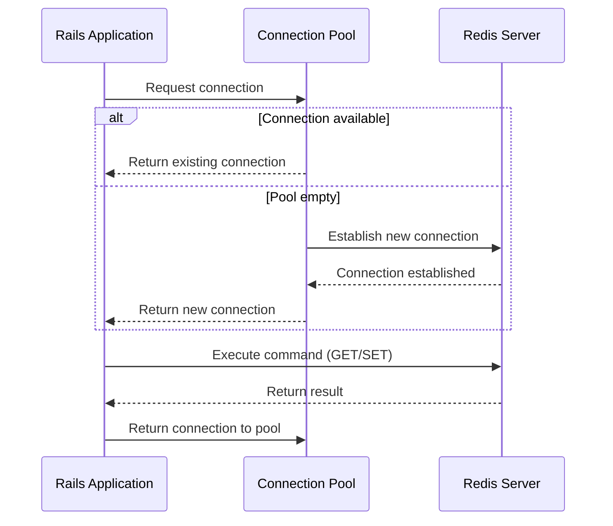
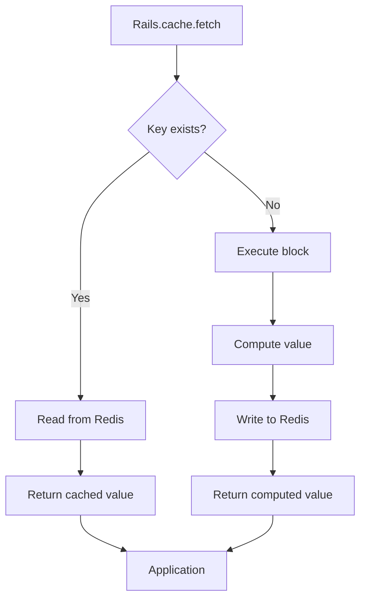
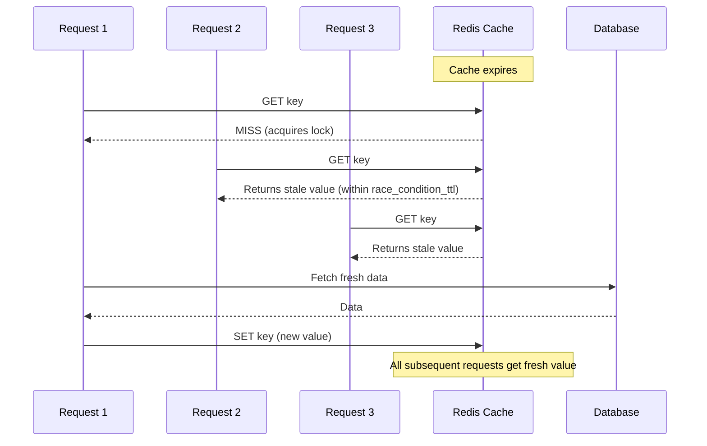
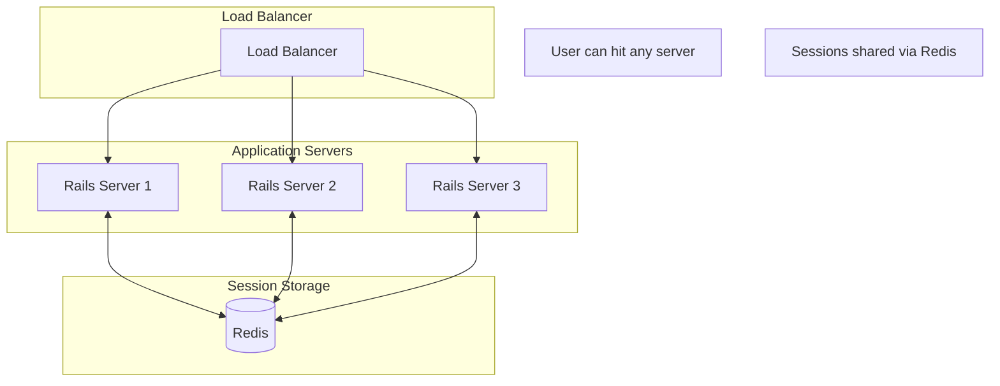
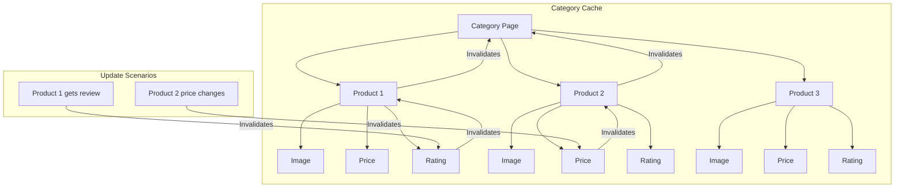
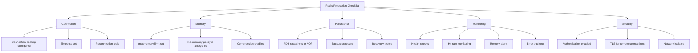
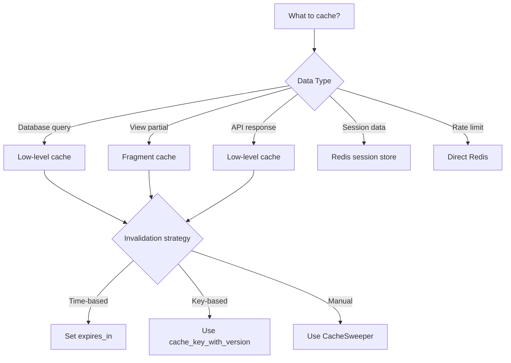

# How to Use Redis for Caching in Rails

Author: [nawazdhandala](https://www.github.com/nawazdhandala)

Tags: Ruby, Rails, Redis, Caching, Performance, Session Store

Description: A comprehensive guide to using Redis for caching in Ruby on Rails applications. Learn how to configure Redis as your cache store, implement various caching patterns, use Redis for session storage, and deploy production-ready caching solutions.

---

> Redis is more than a cache. It is a high-performance data structure server that can serve as the backbone of your Rails application's caching layer, session store, and real-time features. When configured correctly, Redis can reduce database load by orders of magnitude and deliver sub-millisecond response times.

Pairing Rails with Redis unlocks powerful patterns for caching database queries, storing sessions, managing rate limits, and coordinating background jobs. This guide walks through everything from basic setup to advanced production configurations.

---

## Why Redis for Rails Caching?

Redis offers several advantages over other caching solutions:

```mermaid
flowchart TB
    subgraph Redis Advantages
        A[In-Memory Speed] --> B[Sub-millisecond reads]
        C[Data Structures] --> D[Strings, Hashes, Lists, Sets]
        E[Persistence] --> F[RDB snapshots, AOF logs]
        G[Replication] --> H[High availability clusters]
        I[Pub/Sub] --> J[Real-time notifications]
    end
    
    subgraph Rails Integration
        K[Cache Store] --> L[Rails.cache API]
        M[Session Store] --> N[Encrypted sessions]
        O[Action Cable] --> P[WebSocket pub/sub]
        Q[Sidekiq] --> R[Background jobs]
    end
    
    Redis Advantages --> Rails Integration
```

### Redis vs Other Cache Stores

| Feature | Redis | Memcached | Memory Store |
|---------|-------|-----------|--------------|
| Data Structures | Rich (strings, hashes, lists, sets, sorted sets) | Simple (key-value) | Simple (key-value) |
| Persistence | Yes (RDB/AOF) | No | No |
| Replication | Yes | No | N/A |
| Pub/Sub | Yes | No | No |
| Distributed | Yes | Yes | No |
| Memory Efficiency | Good | Better | Best (but single process) |
| Use Case | Production, multi-server | Production, multi-server | Development only |

---

## Installing and Configuring Redis

### Installing Redis

```bash
# macOS with Homebrew
brew install redis
brew services start redis

# Ubuntu/Debian
sudo apt update
sudo apt install redis-server
sudo systemctl enable redis-server
sudo systemctl start redis-server

# Verify installation
redis-cli ping
# => PONG
```

### Adding Redis Gems to Rails

```ruby
# Gemfile

# Redis client library (required)
gem "redis", "~> 5.0"

# Connection pooling for thread safety
gem "connection_pool", "~> 2.4"

# Faster Redis protocol parsing (optional but recommended)
gem "hiredis-client", "~> 0.18"

# For session storage
gem "redis-session-store", "~> 0.11"
```

Run bundle install to fetch the dependencies:

```bash
bundle install
```

---

## Configuring Redis as the Cache Store

### Basic Development Configuration

```ruby
# config/environments/development.rb
Rails.application.configure do
  # Enable caching in development (toggle with bin/rails dev:cache)
  if Rails.root.join("tmp/caching-dev.txt").exist?
    config.action_controller.perform_caching = true
    config.action_controller.enable_fragment_cache_logging = true

    # Use Redis for development caching
    config.cache_store = :redis_cache_store, {
      url: ENV.fetch("REDIS_URL", "redis://localhost:6379/0"),
      namespace: "myapp:dev:cache",
      expires_in: 1.hour
    }
  else
    config.action_controller.perform_caching = false
    config.cache_store = :null_store
  end
end
```

### Production Configuration

```ruby
# config/environments/production.rb
Rails.application.configure do
  # Always enable caching in production
  config.action_controller.perform_caching = true

  # Configure Redis cache store with production settings
  config.cache_store = :redis_cache_store, {
    # Connection URL from environment variable
    url: ENV.fetch("REDIS_URL"),
    
    # Namespace prevents key collisions between applications
    namespace: "myapp:production:cache",
    
    # Connection pool for concurrent access
    pool: {
      size: ENV.fetch("RAILS_MAX_THREADS", 5).to_i,
      timeout: 5
    },
    
    # Connection settings
    connect_timeout: 5,
    read_timeout: 1,
    write_timeout: 1,
    
    # Reconnection behavior
    reconnect_attempts: 3,
    reconnect_delay: 0.2,
    reconnect_delay_max: 1.0,
    
    # Compression for large values
    compress: true,
    compress_threshold: 1.kilobyte,
    
    # Default TTL for cached values
    expires_in: 1.hour,
    
    # Handle transient failures gracefully
    error_handler: ->(method:, returning:, exception:) {
      # Log the error
      Rails.logger.error(
        "[Redis Cache Error] method=#{method} " \
        "returning=#{returning} " \
        "error=#{exception.class}: #{exception.message}"
      )
      
      # Report to error tracking service
      Sentry.capture_exception(exception, extra: {
        cache_method: method,
        returning: returning.inspect
      }) if defined?(Sentry)
    }
  }
end
```

### Redis Connection Flow



---

## Creating a Redis Initializer

### Shared Redis Configuration

```ruby
# config/initializers/redis.rb

# Shared Redis configuration for all connections
REDIS_CONFIG = {
  url: ENV.fetch("REDIS_URL", "redis://localhost:6379"),
  
  # Connection timeouts
  connect_timeout: 5,
  read_timeout: 1,
  write_timeout: 1,
  
  # Reconnection settings
  reconnect_attempts: 3,
  reconnect_delay: 0.2,
  reconnect_delay_max: 1.0,
  
  # SSL/TLS for secure connections (if needed)
  # ssl_params: { verify_mode: OpenSSL::SSL::VERIFY_PEER }
}.freeze

# Create a connection pool for direct Redis access
# Use this for operations outside of Rails.cache
REDIS_POOL = ConnectionPool.new(
  size: ENV.fetch("REDIS_POOL_SIZE", 10).to_i,
  timeout: 5
) do
  Redis.new(REDIS_CONFIG)
end

# Helper module for Redis operations
module RedisHelper
  # Execute a block with a pooled Redis connection
  def self.with_redis(&block)
    REDIS_POOL.with(&block)
  end
  
  # Check if Redis is available
  def self.available?
    with_redis { |redis| redis.ping == "PONG" }
  rescue StandardError
    false
  end
  
  # Get Redis server info
  def self.info
    with_redis { |redis| redis.info }
  end
end
```

### Health Check for Redis

```ruby
# config/initializers/redis.rb (continued)

# Verify Redis connection on boot (optional but recommended)
Rails.application.config.after_initialize do
  if RedisHelper.available?
    Rails.logger.info("[Redis] Connection established successfully")
  else
    Rails.logger.warn(
      "[Redis] Connection failed - caching may not work properly"
    )
  end
end
```

---

## Using Rails.cache with Redis

### Basic Cache Operations

```ruby
# app/services/product_service.rb
class ProductService
  class << self
    # Write to cache with expiration
    def cache_featured_products
      products = Product
        .where(featured: true)
        .includes(:images, :category)
        .limit(20)
        .to_a

      Rails.cache.write(
        "products:featured",
        products,
        expires_in: 15.minutes
      )
      
      products
    end

    # Read from cache
    def featured_products
      Rails.cache.read("products:featured")
    end

    # Fetch: read with automatic population on miss
    def get_featured_products
      Rails.cache.fetch("products:featured", expires_in: 15.minutes) do
        # This block executes only on cache miss
        Product
          .where(featured: true)
          .includes(:images, :category)
          .limit(20)
          .to_a
      end
    end

    # Delete from cache
    def invalidate_featured_products
      Rails.cache.delete("products:featured")
    end

    # Check if key exists
    def featured_products_cached?
      Rails.cache.exist?("products:featured")
    end
  end
end
```

### Cache Operation Flow



### Fetch Multi for Batch Operations

```ruby
# app/services/catalog_service.rb
class CatalogService
  class << self
    # Fetch multiple products efficiently
    def get_products(product_ids)
      cache_keys = product_ids.map { |id| "product:#{id}" }
      
      # Read all keys in one Redis command
      Rails.cache.fetch_multi(*cache_keys, expires_in: 1.hour) do |key|
        # Extract ID from cache key
        id = key.split(":").last.to_i
        
        # This block runs for each missing key
        Product.find_by(id: id)
      end
    end

    # Fetch multiple with custom keys
    def get_products_with_stats(product_ids)
      results = {}
      
      # Build cache keys for products and their stats
      product_ids.each do |id|
        results["product:#{id}"] = nil
        results["product:#{id}:stats"] = nil
      end
      
      # Fetch all in one call
      cached = Rails.cache.read_multi(*results.keys)
      
      # Populate missing entries
      missing_products = []
      missing_stats = []
      
      product_ids.each do |id|
        missing_products << id unless cached["product:#{id}"]
        missing_stats << id unless cached["product:#{id}:stats"]
      end
      
      # Batch load missing data
      load_missing_products(missing_products, cached)
      load_missing_stats(missing_stats, cached)
      
      cached
    end

    private

    def load_missing_products(ids, cached)
      return if ids.empty?
      
      Product.where(id: ids).find_each do |product|
        key = "product:#{product.id}"
        Rails.cache.write(key, product, expires_in: 1.hour)
        cached[key] = product
      end
    end

    def load_missing_stats(ids, cached)
      return if ids.empty?
      
      ids.each do |id|
        stats = compute_product_stats(id)
        key = "product:#{id}:stats"
        Rails.cache.write(key, stats, expires_in: 30.minutes)
        cached[key] = stats
      end
    end

    def compute_product_stats(product_id)
      {
        views: ProductView.where(product_id: product_id).count,
        purchases: OrderItem.where(product_id: product_id).sum(:quantity),
        rating: Review.where(product_id: product_id).average(:rating)&.round(2)
      }
    end
  end
end
```

---

## Advanced Caching Patterns

### Cache Key Versioning

```ruby
# app/models/product.rb
class Product < ApplicationRecord
  # Increment this when cache data structure changes
  CACHE_VERSION = 2
  
  # Override cache_key_with_version for automatic versioning
  def cache_key_with_version
    "v#{CACHE_VERSION}/#{cache_key}/#{updated_at.to_i}"
  end
  
  # Custom cache key with dependencies
  def full_cache_key
    [
      cache_key_with_version,
      images.maximum(:updated_at)&.to_i,
      variants.maximum(:updated_at)&.to_i,
      category&.updated_at&.to_i
    ].compact.join("-")
  end
end

# Usage in service
class ProductService
  def get_product_details(id)
    product = Product.find(id)
    
    Rails.cache.fetch(product.full_cache_key, expires_in: 1.hour) do
      {
        product: product.as_json(include: [:images, :variants]),
        category: product.category.as_json,
        related: Product.related_to(product).limit(4).as_json
      }
    end
  end
end
```

### Race Condition TTL

```ruby
# config/environments/production.rb
Rails.application.configure do
  config.cache_store = :redis_cache_store, {
    url: ENV.fetch("REDIS_URL"),
    namespace: "myapp:cache",
    
    # Race condition TTL prevents cache stampedes
    # When cache expires, the first request gets a lock
    # Other requests get stale data for this duration
    race_condition_ttl: 10.seconds,
    
    expires_in: 1.hour
  }
end
```

### Cache Stampede Prevention Flow



### Conditional Caching

```ruby
# app/services/content_service.rb
class ContentService
  # Cache only if certain conditions are met
  def get_personalized_content(user)
    # Do not cache for admin users (they see different content)
    return fetch_admin_content(user) if user.admin?
    
    # Do not cache during A/B tests
    return fetch_ab_content(user) if user.in_ab_test?
    
    # Cache for regular users
    Rails.cache.fetch(
      "content:personalized:#{user.segment}",
      expires_in: 30.minutes
    ) do
      fetch_segment_content(user.segment)
    end
  end

  # Cache with conditional TTL based on content type
  def get_content(content_type)
    ttl = case content_type
          when :static then 24.hours
          when :semi_dynamic then 1.hour
          when :dynamic then 5.minutes
          else 30.minutes
          end

    Rails.cache.fetch("content:#{content_type}", expires_in: ttl) do
      Content.where(content_type: content_type).published.to_a
    end
  end
end
```

---

## Redis for Session Storage

Using Redis for session storage enables session sharing across multiple application servers.

### Session Architecture



### Configuring Redis Session Store

```ruby
# Gemfile
gem "redis-session-store", "~> 0.11"
```

```ruby
# config/initializers/session_store.rb

Rails.application.config.session_store :redis_session_store,
  key: "_myapp_session",
  
  # Redis connection settings
  redis: {
    url: ENV.fetch("REDIS_URL", "redis://localhost:6379/1"),
    
    # Use a different database than cache
    # Redis databases 0-15 are available by default
    
    # Key prefix for session keys
    key_prefix: "myapp:session:",
    
    # Session expiration (also sets Redis TTL)
    expire_after: 1.day,
    
    # Connection pool settings
    pool_size: ENV.fetch("RAILS_MAX_THREADS", 5).to_i,
    pool_timeout: 5
  },
  
  # Serializer (Marshal is default, JSON is more portable)
  serializer: :json,
  
  # Raise errors in development, log in production
  on_redis_down: Rails.env.production? ? :log : :raise,
  
  # Session security settings
  secure: Rails.env.production?,
  same_site: :lax,
  http_only: true
```

### Alternative: Cookie Store with Redis Backup

```ruby
# config/initializers/session_store.rb

# For smaller sessions, use encrypted cookies
# Store large session data in Redis separately
Rails.application.config.session_store :cookie_store,
  key: "_myapp_session",
  secure: Rails.env.production?,
  same_site: :strict

# Helper for storing large session data in Redis
module SessionDataStore
  def self.store(session_id, key, value, expires_in: 1.day)
    cache_key = "session_data:#{session_id}:#{key}"
    Rails.cache.write(cache_key, value, expires_in: expires_in)
  end

  def self.retrieve(session_id, key)
    cache_key = "session_data:#{session_id}:#{key}"
    Rails.cache.read(cache_key)
  end

  def self.delete(session_id, key)
    cache_key = "session_data:#{session_id}:#{key}"
    Rails.cache.delete(cache_key)
  end
end
```

---

## Caching Database Queries

### Model-Level Caching

```ruby
# app/models/product.rb
class Product < ApplicationRecord
  belongs_to :category, touch: true
  has_many :variants, dependent: :destroy
  has_many :images, dependent: :destroy
  
  scope :featured, -> { where(featured: true) }
  scope :active, -> { where(status: :active) }
  
  # Class method for cached queries
  class << self
    def cached_featured(limit: 20)
      Rails.cache.fetch("products:featured:#{limit}", expires_in: 15.minutes) do
        featured.active.includes(:images).limit(limit).to_a
      end
    end
    
    def cached_by_category(category_id, page: 1, per_page: 20)
      cache_key = "products:category:#{category_id}:page:#{page}"
      
      Rails.cache.fetch(cache_key, expires_in: 30.minutes) do
        where(category_id: category_id)
          .active
          .includes(:images)
          .page(page)
          .per(per_page)
          .to_a
      end
    end
    
    def cached_count_by_status
      Rails.cache.fetch("products:counts_by_status", expires_in: 5.minutes) do
        group(:status).count
      end
    end
  end
  
  # Instance method for caching expensive calculations
  def cached_stats
    Rails.cache.fetch("product:#{id}:stats:#{updated_at.to_i}", expires_in: 1.hour) do
      {
        total_views: page_views.count,
        total_sales: order_items.sum(:quantity),
        average_rating: reviews.average(:rating)&.round(2) || 0,
        review_count: reviews.count,
        revenue: order_items.joins(:order).where(orders: { status: :completed }).sum("order_items.price * order_items.quantity")
      }
    end
  end
end
```

### Query Caching Service

```ruby
# app/services/query_cache_service.rb
class QueryCacheService
  # Cache any ActiveRecord relation
  def self.cached_query(key, expires_in: 1.hour, &block)
    Rails.cache.fetch(key, expires_in: expires_in) do
      result = block.call
      
      # Convert to array to avoid caching ActiveRecord::Relation
      # which cannot be properly serialized
      result.respond_to?(:to_a) ? result.to_a : result
    end
  end
  
  # Cache with automatic key generation based on query
  def self.cache_relation(relation, extra_key: nil, expires_in: 1.hour)
    # Generate cache key from SQL query
    sql_hash = Digest::MD5.hexdigest(relation.to_sql)
    table_name = relation.model.table_name
    
    key = "query:#{table_name}:#{sql_hash}"
    key += ":#{extra_key}" if extra_key
    
    Rails.cache.fetch(key, expires_in: expires_in) do
      relation.to_a
    end
  end
  
  # Invalidate all cached queries for a table
  def self.invalidate_table(table_name)
    pattern = "query:#{table_name}:*"
    delete_pattern(pattern)
  end
  
  private
  
  def self.delete_pattern(pattern)
    return unless Rails.cache.respond_to?(:redis)
    
    namespace = Rails.cache.options[:namespace]
    full_pattern = "#{namespace}:#{pattern}"
    
    keys = Rails.cache.redis.keys(full_pattern)
    Rails.cache.redis.del(*keys) if keys.any?
  end
end

# Usage
products = QueryCacheService.cached_query(
  "search:#{query}:page:#{page}"
) do
  Product.search(query).page(page)
end
```

---

## Fragment Caching with Redis

### Basic Fragment Caching

```erb
<%# app/views/products/show.html.erb %>

<div class="product-page">
  <%# Cache the entire product display %>
  <% cache @product do %>
    <div class="product-header">
      <h1><%= @product.name %></h1>
      <%= image_tag @product.primary_image.variant(:large) %>
    </div>
    
    <div class="product-details">
      <p class="price"><%= number_to_currency(@product.price) %></p>
      <div class="description">
        <%= simple_format(@product.description) %>
      </div>
    </div>
  <% end %>
  
  <%# Separate cache for reviews (updated independently) %>
  <% cache [@product, "reviews", @product.reviews.maximum(:updated_at)] do %>
    <div class="reviews-section">
      <h2>Reviews (<%= @product.reviews.count %>)</h2>
      <%= render @product.reviews.includes(:user).recent.limit(10) %>
    </div>
  <% end %>
</div>
```

### Russian Doll Caching

```erb
<%# app/views/categories/show.html.erb %>

<%# Outer cache: entire category listing %>
<% cache [@category, @category.products.maximum(:updated_at)] do %>
  <div class="category-page">
    <h1><%= @category.name %></h1>
    
    <div class="product-grid">
      <% @products.each do |product| %>
        <%# Inner cache: each product card %>
        <% cache product do %>
          <%= render "products/card", product: product %>
        <% end %>
      <% end %>
    </div>
  </div>
<% end %>
```

```erb
<%# app/views/products/_card.html.erb %>

<div class="product-card">
  <%# Deeply nested cache: product image %>
  <% cache [product, "image"] do %>
    <div class="card-image">
      <%= image_tag product.primary_image.variant(:thumbnail) %>
    </div>
  <% end %>
  
  <div class="card-body">
    <h3><%= link_to product.name, product %></h3>
    
    <%# Separate cache for price (changes during sales) %>
    <% cache [product, "price", product.current_sale&.id] do %>
      <div class="price">
        <% if product.on_sale? %>
          <span class="original"><%= number_to_currency(product.original_price) %></span>
          <span class="sale"><%= number_to_currency(product.price) %></span>
        <% else %>
          <span><%= number_to_currency(product.price) %></span>
        <% end %>
      </div>
    <% end %>
    
    <%# Separate cache for rating %>
    <% cache [product, "rating", product.reviews_updated_at] do %>
      <div class="rating">
        <%= render "shared/stars", rating: product.average_rating %>
        <span>(<%= product.reviews_count %>)</span>
      </div>
    <% end %>
  </div>
</div>
```

### Russian Doll Cache Structure



---

## Cache Invalidation Strategies

### Touch Associations

```ruby
# app/models/review.rb
class Review < ApplicationRecord
  belongs_to :product, touch: true
  belongs_to :user
  
  after_commit :update_product_stats

  private

  def update_product_stats
    # Update the product's review timestamp
    product.update_column(:reviews_updated_at, Time.current)
  end
end

# app/models/product.rb
class Product < ApplicationRecord
  belongs_to :category, touch: true
  has_many :reviews, dependent: :destroy
  has_many :images, dependent: :destroy
  
  after_commit :invalidate_caches, on: [:update, :destroy]
  
  private
  
  def invalidate_caches
    # Explicitly clear cached queries
    Rails.cache.delete("products:featured:20")
    Rails.cache.delete("products:category:#{category_id}:page:1")
    
    # Clear pattern-based caches
    CacheSweeper.sweep_product!(self)
  end
end
```

### Cache Sweeper Service

```ruby
# app/services/cache_sweeper.rb
class CacheSweeper
  class << self
    # Sweep all caches for a specific product
    def sweep_product!(product)
      Rails.logger.info("[CacheSweeper] Sweeping product #{product.id}")
      
      # Low-level caches
      sweep_pattern("product:#{product.id}:*")
      sweep_pattern("products:category:#{product.category_id}:*")
      
      # Aggregate caches
      Rails.cache.delete("products:featured:20")
      Rails.cache.delete("products:counts_by_status")
      
      # Touch the product to invalidate fragment caches
      product.touch unless product.destroyed?
    end
    
    # Sweep all product caches (use sparingly)
    def sweep_all_products!
      Rails.logger.info("[CacheSweeper] Sweeping all product caches")
      
      sweep_pattern("product:*")
      sweep_pattern("products:*")
      sweep_pattern("views/products/*")
      sweep_pattern("views/categories/*")
    end
    
    # Sweep caches for a category
    def sweep_category!(category)
      sweep_pattern("products:category:#{category.id}:*")
      sweep_pattern("views/categories/#{category.id}*")
      category.touch
    end
    
    # Sweep pattern-matched keys
    def sweep_pattern(pattern)
      return unless redis_available?
      
      namespace = Rails.cache.options[:namespace]
      full_pattern = "#{namespace}:#{pattern}"
      
      cursor = "0"
      deleted_count = 0
      
      loop do
        cursor, keys = redis_client.scan(cursor, match: full_pattern, count: 100)
        
        if keys.any?
          redis_client.del(*keys)
          deleted_count += keys.size
        end
        
        break if cursor == "0"
      end
      
      Rails.logger.info(
        "[CacheSweeper] Deleted #{deleted_count} keys matching #{pattern}"
      )
      
      deleted_count
    end
    
    private
    
    def redis_available?
      Rails.cache.respond_to?(:redis)
    end
    
    def redis_client
      Rails.cache.redis
    end
  end
end
```

### Background Cache Warming

```ruby
# app/jobs/cache_warmer_job.rb
class CacheWarmerJob < ApplicationJob
  queue_as :low_priority
  
  def perform(cache_type = :all)
    case cache_type.to_sym
    when :all
      warm_featured_products
      warm_categories
      warm_popular_products
    when :featured
      warm_featured_products
    when :categories
      warm_categories
    when :popular
      warm_popular_products
    end
  end
  
  private
  
  def warm_featured_products
    Rails.logger.info("[CacheWarmer] Warming featured products")
    Product.cached_featured(limit: 20)
  end
  
  def warm_categories
    Rails.logger.info("[CacheWarmer] Warming categories")
    
    Category.find_each do |category|
      Product.cached_by_category(category.id, page: 1)
    end
  end
  
  def warm_popular_products
    Rails.logger.info("[CacheWarmer] Warming popular products")
    
    product_ids = Order
      .completed
      .joins(:order_items)
      .group("order_items.product_id")
      .order("COUNT(*) DESC")
      .limit(100)
      .pluck("order_items.product_id")
    
    Product.where(id: product_ids).find_each do |product|
      product.cached_stats
    end
  end
end

# Schedule cache warming
# config/initializers/scheduler.rb (using whenever or sidekiq-scheduler)
# every 15.minutes do
#   CacheWarmerJob.perform_later(:featured)
# end
```

---

## Rate Limiting with Redis

Redis is excellent for implementing rate limiting.

### Token Bucket Rate Limiter

```ruby
# app/services/rate_limiter.rb
class RateLimiter
  # Implements token bucket algorithm
  def self.allow?(key, limit:, period:)
    redis_key = "rate_limit:#{key}"
    current_time = Time.current.to_i
    window_start = current_time - period.to_i
    
    RedisHelper.with_redis do |redis|
      # Use a sorted set with timestamps as scores
      redis.multi do |multi|
        # Remove old entries outside the window
        multi.zremrangebyscore(redis_key, 0, window_start)
        
        # Count current requests in window
        multi.zcard(redis_key)
        
        # Add current request
        multi.zadd(redis_key, current_time, "#{current_time}:#{SecureRandom.hex(4)}")
        
        # Set expiration on the key
        multi.expire(redis_key, period.to_i * 2)
      end => results
      
      current_count = results[1]
      current_count < limit
    end
  end
  
  # Get remaining requests
  def self.remaining(key, limit:, period:)
    redis_key = "rate_limit:#{key}"
    window_start = Time.current.to_i - period.to_i
    
    RedisHelper.with_redis do |redis|
      # Remove old entries and count
      redis.zremrangebyscore(redis_key, 0, window_start)
      current_count = redis.zcard(redis_key)
      
      [limit - current_count, 0].max
    end
  end
  
  # Reset rate limit for a key
  def self.reset!(key)
    redis_key = "rate_limit:#{key}"
    RedisHelper.with_redis { |redis| redis.del(redis_key) }
  end
end
```

### Rate Limiting Middleware

```ruby
# app/middleware/rate_limit_middleware.rb
class RateLimitMiddleware
  def initialize(app)
    @app = app
  end
  
  def call(env)
    request = ActionDispatch::Request.new(env)
    
    # Skip rate limiting for certain paths
    return @app.call(env) if skip_rate_limit?(request)
    
    # Determine rate limit key
    key = rate_limit_key(request)
    
    # Check rate limit
    if RateLimiter.allow?(key, limit: rate_limit, period: 1.minute)
      # Add rate limit headers to response
      status, headers, response = @app.call(env)
      
      remaining = RateLimiter.remaining(key, limit: rate_limit, period: 1.minute)
      headers["X-RateLimit-Limit"] = rate_limit.to_s
      headers["X-RateLimit-Remaining"] = remaining.to_s
      headers["X-RateLimit-Reset"] = (Time.current + 1.minute).to_i.to_s
      
      [status, headers, response]
    else
      # Rate limited
      [
        429,
        {
          "Content-Type" => "application/json",
          "Retry-After" => "60",
          "X-RateLimit-Limit" => rate_limit.to_s,
          "X-RateLimit-Remaining" => "0"
        },
        [{ error: "Too many requests" }.to_json]
      ]
    end
  end
  
  private
  
  def skip_rate_limit?(request)
    # Skip assets, health checks, etc.
    request.path.start_with?("/assets", "/health")
  end
  
  def rate_limit_key(request)
    # Use IP address as default, or user ID if authenticated
    if request.session[:user_id]
      "user:#{request.session[:user_id]}"
    else
      "ip:#{request.remote_ip}"
    end
  end
  
  def rate_limit
    ENV.fetch("RATE_LIMIT", 100).to_i
  end
end

# config/application.rb
config.middleware.use RateLimitMiddleware
```

---

## Monitoring Redis Cache Performance

### Cache Statistics Service

```ruby
# app/services/cache_stats_service.rb
class CacheStatsService
  class << self
    def stats
      return {} unless redis_available?
      
      info = redis_info
      
      {
        # Memory stats
        memory: {
          used: info["used_memory_human"],
          peak: info["used_memory_peak_human"],
          fragmentation_ratio: info["mem_fragmentation_ratio"].to_f.round(2)
        },
        
        # Key stats
        keys: {
          total: redis_dbsize,
          by_namespace: keys_by_namespace
        },
        
        # Hit rate
        performance: {
          hits: info["keyspace_hits"].to_i,
          misses: info["keyspace_misses"].to_i,
          hit_rate: calculate_hit_rate(info)
        },
        
        # Connection stats
        connections: {
          connected_clients: info["connected_clients"].to_i,
          blocked_clients: info["blocked_clients"].to_i
        },
        
        # Eviction stats
        eviction: {
          evicted_keys: info["evicted_keys"].to_i,
          maxmemory: info["maxmemory_human"],
          maxmemory_policy: info["maxmemory_policy"]
        }
      }
    end
    
    def health_check
      start_time = Process.clock_gettime(Process::CLOCK_MONOTONIC)
      
      # Test write
      test_key = "health:#{SecureRandom.hex(8)}"
      test_value = { timestamp: Time.current.iso8601 }
      
      Rails.cache.write(test_key, test_value, expires_in: 1.minute)
      read_value = Rails.cache.read(test_key)
      Rails.cache.delete(test_key)
      
      duration = Process.clock_gettime(Process::CLOCK_MONOTONIC) - start_time
      
      {
        healthy: read_value == test_value,
        latency_ms: (duration * 1000).round(2),
        timestamp: Time.current.iso8601
      }
    rescue StandardError => e
      {
        healthy: false,
        error: e.message,
        timestamp: Time.current.iso8601
      }
    end
    
    private
    
    def redis_available?
      Rails.cache.respond_to?(:redis)
    end
    
    def redis_info
      Rails.cache.redis.info
    end
    
    def redis_dbsize
      Rails.cache.redis.dbsize
    end
    
    def keys_by_namespace
      namespaces = Hash.new(0)
      prefix = Rails.cache.options[:namespace]
      
      cursor = "0"
      loop do
        cursor, keys = Rails.cache.redis.scan(cursor, match: "#{prefix}:*", count: 1000)
        
        keys.each do |key|
          # Extract namespace from key
          parts = key.delete_prefix("#{prefix}:").split(":")
          ns = parts.first
          namespaces[ns] += 1
        end
        
        break if cursor == "0"
      end
      
      namespaces
    end
    
    def calculate_hit_rate(info)
      hits = info["keyspace_hits"].to_i
      misses = info["keyspace_misses"].to_i
      total = hits + misses
      
      return 0.0 if total.zero?
      
      ((hits.to_f / total) * 100).round(2)
    end
  end
end
```

### Health Check Controller

```ruby
# app/controllers/health_controller.rb
class HealthController < ApplicationController
  skip_before_action :authenticate_user!
  
  def cache
    result = CacheStatsService.health_check
    
    if result[:healthy]
      render json: result, status: :ok
    else
      render json: result, status: :service_unavailable
    end
  end
  
  def cache_stats
    # Restrict to admin users in production
    return head :forbidden unless current_user&.admin?
    
    render json: CacheStatsService.stats
  end
end

# config/routes.rb
Rails.application.routes.draw do
  get "/health/cache", to: "health#cache"
  get "/health/cache/stats", to: "health#cache_stats"
end
```

### Cache Instrumentation

```ruby
# config/initializers/cache_instrumentation.rb

# Subscribe to cache events for monitoring
ActiveSupport::Notifications.subscribe(/cache/) do |name, start, finish, id, payload|
  duration = (finish - start) * 1000
  
  case name
  when "cache_read.active_support"
    Rails.logger.debug(
      "[Cache] READ key=#{payload[:key]} hit=#{payload[:hit]} duration=#{duration.round(2)}ms"
    )
    
    # Track metrics (if using StatsD or similar)
    # StatsD.timing("cache.read", duration)
    # StatsD.increment("cache.read.#{payload[:hit] ? 'hit' : 'miss'}")
    
  when "cache_write.active_support"
    Rails.logger.debug(
      "[Cache] WRITE key=#{payload[:key]} duration=#{duration.round(2)}ms"
    )
    
  when "cache_delete.active_support"
    Rails.logger.debug(
      "[Cache] DELETE key=#{payload[:key]}"
    )
  end
end
```

---

## Production Best Practices

### Redis Configuration for Production

```ruby
# config/environments/production.rb
Rails.application.configure do
  config.cache_store = :redis_cache_store, {
    url: ENV.fetch("REDIS_URL"),
    namespace: "myapp:#{Rails.env}:cache",
    
    # Connection pool sized for your workload
    pool: {
      size: ENV.fetch("REDIS_POOL_SIZE", 25).to_i,
      timeout: 5
    },
    
    # Aggressive compression for network efficiency
    compress: true,
    compress_threshold: 256,
    
    # Race condition protection
    race_condition_ttl: 10.seconds,
    
    # Default expiration prevents unbounded growth
    expires_in: 1.day,
    
    # Production error handling
    error_handler: ->(method:, returning:, exception:) {
      # Log with context
      Rails.logger.error(
        "[Redis Cache Error] " \
        "method=#{method} " \
        "returning=#{returning.inspect.truncate(100)} " \
        "error=#{exception.class}: #{exception.message}"
      )
      
      # Report to error tracking
      Sentry.capture_exception(exception, extra: {
        cache_method: method,
        returning: returning.inspect.truncate(100)
      }) if defined?(Sentry)
      
      # Track metric
      StatsD.increment("cache.error", tags: ["method:#{method}"]) if defined?(StatsD)
    }
  }
end
```

### Redis Sentinel for High Availability

```ruby
# config/environments/production.rb (with Sentinel)
Rails.application.configure do
  config.cache_store = :redis_cache_store, {
    # Sentinel configuration
    url: "redis://mymaster",
    sentinels: [
      { host: ENV["SENTINEL_HOST_1"], port: 26379 },
      { host: ENV["SENTINEL_HOST_2"], port: 26379 },
      { host: ENV["SENTINEL_HOST_3"], port: 26379 }
    ],
    role: :master,
    
    namespace: "myapp:production:cache",
    pool: { size: 25, timeout: 5 },
    compress: true,
    expires_in: 1.day
  }
end
```

### Memory Management

```ruby
# config/initializers/redis_memory.rb

# Configure Redis maxmemory policy for caching
# Run this once or use via redis.conf
#
# The allkeys-lru policy is ideal for caching:
# - Evicts least recently used keys when memory is full
# - Works across all keys, not just those with TTL

if Rails.env.production?
  Rails.application.config.after_initialize do
    begin
      RedisHelper.with_redis do |redis|
        # Check current settings
        info = redis.config("get", "maxmemory-policy")
        current_policy = info["maxmemory-policy"]
        
        unless current_policy == "allkeys-lru"
          Rails.logger.warn(
            "[Redis] maxmemory-policy is '#{current_policy}', " \
            "consider setting to 'allkeys-lru' for caching"
          )
        end
      end
    rescue StandardError => e
      Rails.logger.warn("[Redis] Could not check config: #{e.message}")
    end
  end
end
```

### Production Deployment Checklist



---

## Troubleshooting Common Issues

### Debugging Cache Misses

```ruby
# app/services/cache_debugger.rb
class CacheDebugger
  class << self
    # Check why a key might be missing
    def diagnose(key)
      full_key = "#{Rails.cache.options[:namespace]}:#{key}"
      
      diagnosis = {
        key: key,
        full_key: full_key,
        exists: false,
        ttl: nil,
        type: nil,
        size: nil
      }
      
      RedisHelper.with_redis do |redis|
        exists = redis.exists?(full_key)
        diagnosis[:exists] = exists == 1
        
        if diagnosis[:exists]
          diagnosis[:ttl] = redis.ttl(full_key)
          diagnosis[:type] = redis.type(full_key)
          diagnosis[:size] = redis.memory("usage", full_key)
        end
      end
      
      diagnosis
    end
    
    # Find keys matching a pattern
    def find_keys(pattern)
      full_pattern = "#{Rails.cache.options[:namespace]}:#{pattern}"
      
      keys = []
      cursor = "0"
      
      RedisHelper.with_redis do |redis|
        loop do
          cursor, batch = redis.scan(cursor, match: full_pattern, count: 100)
          keys.concat(batch)
          break if cursor == "0"
        end
      end
      
      keys.map { |k| k.delete_prefix("#{Rails.cache.options[:namespace]}:") }
    end
    
    # Get cache statistics for debugging
    def cache_stats
      CacheStatsService.stats
    end
  end
end

# Rails console usage:
# CacheDebugger.diagnose("products:featured:20")
# CacheDebugger.find_keys("products:*")
```

### Handling Connection Issues

```ruby
# app/services/resilient_cache.rb
class ResilientCache
  # Wrapper that falls back gracefully on Redis errors
  def self.fetch(key, expires_in: 1.hour, &block)
    Rails.cache.fetch(key, expires_in: expires_in, &block)
  rescue Redis::BaseError, ConnectionPool::TimeoutError => e
    Rails.logger.error("[Cache] Fetch failed for #{key}: #{e.message}")
    
    # Fall back to executing the block without caching
    block.call
  end
  
  def self.write(key, value, expires_in: 1.hour)
    Rails.cache.write(key, value, expires_in: expires_in)
  rescue Redis::BaseError, ConnectionPool::TimeoutError => e
    Rails.logger.error("[Cache] Write failed for #{key}: #{e.message}")
    false
  end
  
  def self.read(key)
    Rails.cache.read(key)
  rescue Redis::BaseError, ConnectionPool::TimeoutError => e
    Rails.logger.error("[Cache] Read failed for #{key}: #{e.message}")
    nil
  end
  
  def self.delete(key)
    Rails.cache.delete(key)
  rescue Redis::BaseError, ConnectionPool::TimeoutError => e
    Rails.logger.error("[Cache] Delete failed for #{key}: #{e.message}")
    false
  end
end

# Usage in application code
products = ResilientCache.fetch("products:featured") do
  Product.featured.limit(20).to_a
end
```

---

## Summary

Redis is an excellent choice for caching in Rails applications, offering speed, versatility, and reliability. Here are the key takeaways:

| Aspect | Recommendation |
|--------|----------------|
| Cache Store | Use `redis_cache_store` with connection pooling |
| Sessions | Use `redis-session-store` for multi-server deployments |
| Namespace | Always namespace keys to prevent collisions |
| Expiration | Set default TTL and use key-based versioning |
| Compression | Enable for values larger than 256 bytes |
| Error Handling | Log errors, report to tracking service, but do not crash |
| Monitoring | Track hit rate, memory usage, and connection health |
| Invalidation | Prefer key versioning over explicit deletion |

### Cache Layer Decision Flow



With proper Redis caching, your Rails application can handle significantly more traffic while reducing database load and improving response times.

---

*Need to monitor your Redis cache performance in production? [OneUptime](https://oneuptime.com) provides comprehensive observability for Ruby on Rails applications, including Redis health monitoring, cache hit rate tracking, and performance alerting.*
