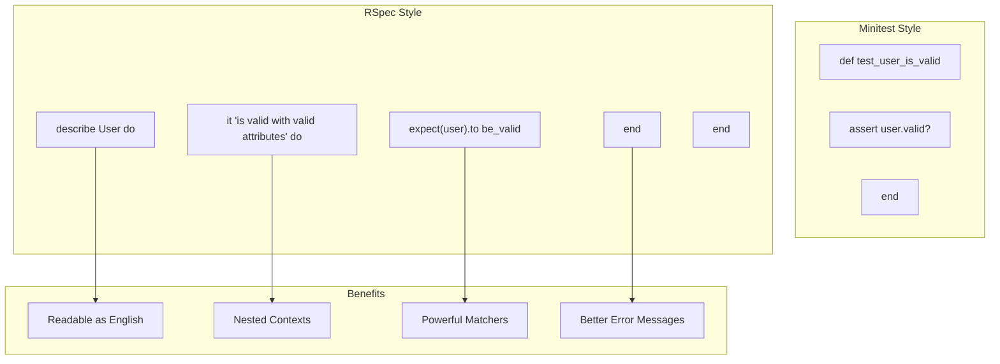
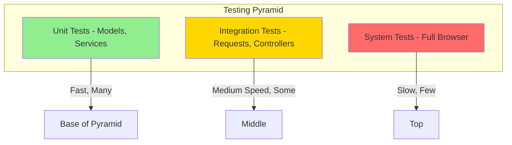
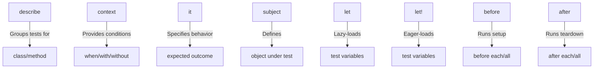
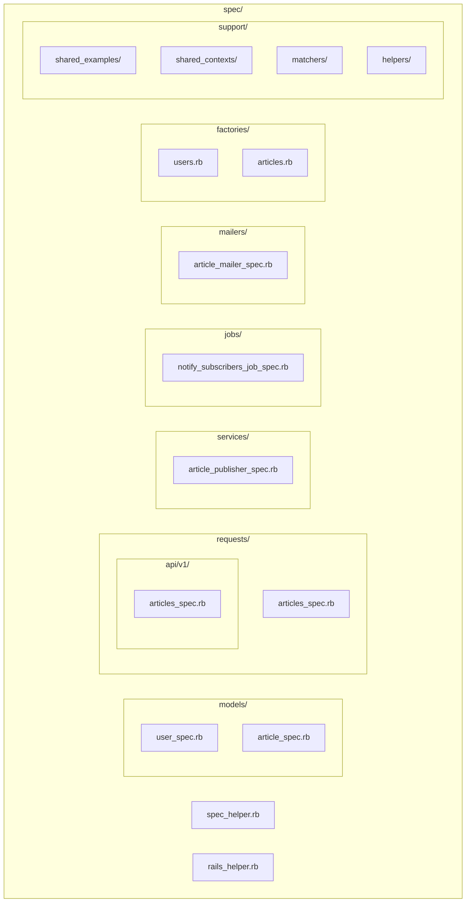

# How to Write Tests with RSpec in Rails

Author: [nawazdhandala](https://www.github.com/nawazdhandala)

Tags: Ruby, Rails, RSpec, Testing, TDD, Unit Tests

Description: A comprehensive guide to writing tests with RSpec in Ruby on Rails applications. Learn how to set up RSpec, write unit tests, integration tests, and request specs with best practices for test organization and maintainability.

---

> Testing is not about finding bugs. It is about building confidence that your code works as expected. RSpec provides a readable, expressive domain-specific language for writing tests that serve as living documentation for your Rails application.

RSpec is the most popular testing framework in the Ruby ecosystem. Its behavior-driven development (BDD) approach encourages you to describe the expected behavior of your code before implementing it, leading to better-designed and more maintainable applications.

---

## Why RSpec Over Minitest?

Rails ships with Minitest by default, but RSpec has become the community standard for several reasons:



RSpec tests read like specifications, making them valuable documentation that stays synchronized with your code.

---

## Setting Up RSpec

### Installation

Add RSpec and related gems to your Gemfile:

```ruby
# Gemfile

group :development, :test do
  # Core RSpec gems
  gem 'rspec-rails', '~> 6.1'
  
  # Factory-based test data generation
  gem 'factory_bot_rails', '~> 6.4'
  
  # Fake data generators
  gem 'faker', '~> 3.2'
  
  # Database cleaning between tests
  gem 'database_cleaner-active_record', '~> 2.1'
  
  # Code coverage reporting
  gem 'simplecov', '~> 0.22', require: false
  
  # Time manipulation for testing
  gem 'timecop', '~> 0.9'
  
  # HTTP request stubbing
  gem 'webmock', '~> 3.19'
  
  # VCR for recording HTTP interactions
  gem 'vcr', '~> 6.2'
end

group :test do
  # System testing with Capybara
  gem 'capybara', '~> 3.39'
  
  # JavaScript driver for system tests
  gem 'selenium-webdriver', '~> 4.16'
  
  # Additional matchers for testing
  gem 'shoulda-matchers', '~> 5.3'
  
  # Controller testing helpers
  gem 'rails-controller-testing', '~> 1.0'
end
```

Install the gems and initialize RSpec:

```bash
bundle install
rails generate rspec:install
```

This creates the following structure:

```
spec/
  spec_helper.rb      # RSpec configuration
  rails_helper.rb     # Rails-specific configuration
  .rspec              # Command-line options
```

### Basic Configuration

Configure RSpec with sensible defaults:

```ruby
# spec/spec_helper.rb

# Load SimpleCov before anything else
require 'simplecov'
SimpleCov.start 'rails' do
  add_filter '/spec/'
  add_filter '/config/'
  add_filter '/vendor/'
  
  add_group 'Models', 'app/models'
  add_group 'Controllers', 'app/controllers'
  add_group 'Services', 'app/services'
  add_group 'Jobs', 'app/jobs'
  add_group 'Mailers', 'app/mailers'
  
  minimum_coverage 80
  minimum_coverage_by_file 70
end

RSpec.configure do |config|
  # Enable flags like --only-failures and --next-failure
  config.example_status_persistence_file_path = 'spec/examples.txt'
  
  # Disable RSpec exposing methods globally on Module and main
  config.disable_monkey_patching!
  
  # Run specs in random order to surface order dependencies
  config.order = :random
  Kernel.srand config.seed
  
  # Limit the available expectation and mock syntax
  config.expect_with :rspec do |expectations|
    # This option makes the `description` and `failure_message` of custom
    # matchers include text for helper methods
    expectations.include_chain_clauses_in_custom_matcher_descriptions = true
  end
  
  config.mock_with :rspec do |mocks|
    # Prevents mocking or stubbing methods that do not exist
    mocks.verify_partial_doubles = true
  end
  
  # Shared context metadata behavior
  config.shared_context_metadata_behavior = :apply_to_host_groups
  
  # Filter lines from backtrace
  config.filter_rails_from_backtrace!
end
```

```ruby
# spec/rails_helper.rb

require 'spec_helper'

ENV['RAILS_ENV'] ||= 'test'
require_relative '../config/environment'

# Prevent database truncation if the environment is production
abort('The Rails environment is running in production mode!') if Rails.env.production?

require 'rspec/rails'

# Load support files
Dir[Rails.root.join('spec', 'support', '**', '*.rb')].sort.each { |f| require f }

# Maintain test database schema
begin
  ActiveRecord::Migration.maintain_test_schema!
rescue ActiveRecord::PendingMigrationError => e
  abort e.to_s.strip
end

RSpec.configure do |config|
  # Use FactoryBot methods without the FactoryBot prefix
  config.include FactoryBot::Syntax::Methods
  
  # Use transactional fixtures for faster tests
  config.use_transactional_fixtures = true
  
  # Infer the type of spec from file location
  # specs in spec/models will have type: :model
  config.infer_spec_type_from_file_location!
  
  # Filter lines from Rails gems in backtraces
  config.filter_rails_from_backtrace!
  
  # Run system specs with a real browser
  config.before(:each, type: :system) do
    driven_by :selenium, using: :headless_chrome, screen_size: [1400, 1400]
  end
  
  # Include Devise test helpers for authentication
  config.include Devise::Test::IntegrationHelpers, type: :request
  config.include Devise::Test::IntegrationHelpers, type: :system
end
```

### Shoulda Matchers Configuration

```ruby
# spec/support/shoulda_matchers.rb

Shoulda::Matchers.configure do |config|
  config.integrate do |with|
    with.test_framework :rspec
    with.library :rails
  end
end
```

### Database Cleaner Configuration

```ruby
# spec/support/database_cleaner.rb

RSpec.configure do |config|
  config.before(:suite) do
    # Clean once before the entire test suite
    DatabaseCleaner.clean_with(:truncation)
  end
  
  config.before(:each) do
    # Use transaction strategy by default (fast)
    DatabaseCleaner.strategy = :transaction
  end
  
  config.before(:each, js: true) do
    # Use truncation for JavaScript tests (required for browser tests)
    DatabaseCleaner.strategy = :truncation
  end
  
  config.before(:each) do
    DatabaseCleaner.start
  end
  
  config.after(:each) do
    DatabaseCleaner.clean
  end
end
```

---

## Understanding RSpec Structure

### The RSpec Testing Pyramid



Write many fast unit tests, fewer integration tests, and minimal slow system tests.

### Anatomy of an RSpec Test

```ruby
# spec/models/user_spec.rb

# RSpec.describe defines a test group for a class or concept
RSpec.describe User, type: :model do
  # describe groups related tests together
  describe 'validations' do
    # context provides additional context or conditions
    context 'when email is missing' do
      # it describes a specific behavior
      it 'is invalid without an email' do
        # Arrange: Set up test data
        user = build(:user, email: nil)
        
        # Act & Assert: Execute and verify
        expect(user).not_to be_valid
        expect(user.errors[:email]).to include("can't be blank")
      end
    end
    
    context 'when email format is invalid' do
      it 'is invalid with a malformed email' do
        user = build(:user, email: 'invalid-email')
        
        expect(user).not_to be_valid
        expect(user.errors[:email]).to include('is invalid')
      end
    end
  end
  
  # subject defines the object under test
  describe '#full_name' do
    subject(:user) { build(:user, first_name: 'John', last_name: 'Doe') }
    
    it 'returns the concatenated first and last name' do
      expect(user.full_name).to eq('John Doe')
    end
  end
end
```

### RSpec Keywords Explained



---

## Writing Model Specs

### Basic Model Validations

```ruby
# spec/models/article_spec.rb

RSpec.describe Article, type: :model do
  # Use Shoulda Matchers for concise validation tests
  describe 'validations' do
    # Presence validations
    it { is_expected.to validate_presence_of(:title) }
    it { is_expected.to validate_presence_of(:content) }
    it { is_expected.to validate_presence_of(:author) }
    
    # Length validations
    it { is_expected.to validate_length_of(:title).is_at_least(5).is_at_most(200) }
    it { is_expected.to validate_length_of(:content).is_at_least(50) }
    
    # Uniqueness validations
    it { is_expected.to validate_uniqueness_of(:slug).case_insensitive }
    
    # Inclusion validations
    it { is_expected.to validate_inclusion_of(:status).in_array(%w[draft published archived]) }
    
    # Numericality validations
    it { is_expected.to validate_numericality_of(:view_count).only_integer.is_greater_than_or_equal_to(0) }
  end
  
  # Association tests
  describe 'associations' do
    it { is_expected.to belong_to(:author).class_name('User') }
    it { is_expected.to belong_to(:category).optional }
    it { is_expected.to have_many(:comments).dependent(:destroy) }
    it { is_expected.to have_many(:taggings).dependent(:destroy) }
    it { is_expected.to have_many(:tags).through(:taggings) }
    it { is_expected.to have_one_attached(:featured_image) }
  end
  
  # Database column tests
  describe 'database columns' do
    it { is_expected.to have_db_column(:title).of_type(:string).with_options(null: false) }
    it { is_expected.to have_db_column(:content).of_type(:text) }
    it { is_expected.to have_db_column(:published_at).of_type(:datetime) }
    it { is_expected.to have_db_index(:slug).unique }
    it { is_expected.to have_db_index(:author_id) }
  end
end
```

### Testing Instance Methods

```ruby
# spec/models/user_spec.rb

RSpec.describe User, type: :model do
  describe '#full_name' do
    context 'when user has both first and last name' do
      let(:user) { build(:user, first_name: 'Jane', last_name: 'Smith') }
      
      it 'returns joined first and last name' do
        expect(user.full_name).to eq('Jane Smith')
      end
    end
    
    context 'when user has only first name' do
      let(:user) { build(:user, first_name: 'Jane', last_name: nil) }
      
      it 'returns only the first name' do
        expect(user.full_name).to eq('Jane')
      end
    end
    
    context 'when user has no name' do
      let(:user) { build(:user, first_name: nil, last_name: nil) }
      
      it 'returns an empty string' do
        expect(user.full_name).to eq('')
      end
    end
  end
  
  describe '#admin?' do
    context 'when user has admin role' do
      let(:user) { build(:user, role: 'admin') }
      
      it 'returns true' do
        expect(user.admin?).to be true
      end
    end
    
    context 'when user has regular role' do
      let(:user) { build(:user, role: 'member') }
      
      it 'returns false' do
        expect(user.admin?).to be false
      end
    end
  end
  
  describe '#can_edit?' do
    let(:author) { create(:user) }
    let(:admin) { create(:user, :admin) }
    let(:other_user) { create(:user) }
    let(:article) { create(:article, author: author) }
    
    it 'allows the author to edit their article' do
      expect(author.can_edit?(article)).to be true
    end
    
    it 'allows admins to edit any article' do
      expect(admin.can_edit?(article)).to be true
    end
    
    it 'prevents other users from editing' do
      expect(other_user.can_edit?(article)).to be false
    end
  end
end
```

### Testing Class Methods and Scopes

```ruby
# spec/models/article_spec.rb

RSpec.describe Article, type: :model do
  describe '.published' do
    let!(:published_article) { create(:article, status: 'published', published_at: 1.day.ago) }
    let!(:draft_article) { create(:article, status: 'draft') }
    let!(:future_article) { create(:article, status: 'published', published_at: 1.day.from_now) }
    
    it 'returns only published articles with past publication dates' do
      expect(Article.published).to contain_exactly(published_article)
    end
    
    it 'excludes draft articles' do
      expect(Article.published).not_to include(draft_article)
    end
    
    it 'excludes future articles' do
      expect(Article.published).not_to include(future_article)
    end
  end
  
  describe '.by_author' do
    let(:author) { create(:user) }
    let(:other_author) { create(:user) }
    let!(:author_articles) { create_list(:article, 3, author: author) }
    let!(:other_articles) { create_list(:article, 2, author: other_author) }
    
    it 'returns articles by the specified author' do
      expect(Article.by_author(author)).to match_array(author_articles)
    end
    
    it 'returns correct count' do
      expect(Article.by_author(author).count).to eq(3)
    end
  end
  
  describe '.search' do
    let!(:ruby_article) { create(:article, title: 'Ruby on Rails Guide') }
    let!(:python_article) { create(:article, title: 'Python Tutorial') }
    let!(:rails_content) { create(:article, title: 'Web Development', content: 'Learn Rails today') }
    
    it 'finds articles by title' do
      expect(Article.search('Ruby')).to include(ruby_article)
    end
    
    it 'finds articles by content' do
      expect(Article.search('Rails')).to include(ruby_article, rails_content)
    end
    
    it 'is case insensitive' do
      expect(Article.search('RUBY')).to include(ruby_article)
    end
    
    it 'returns empty relation for no matches' do
      expect(Article.search('JavaScript')).to be_empty
    end
  end
  
  describe '.most_viewed' do
    before do
      create(:article, view_count: 100)
      create(:article, view_count: 500)
      create(:article, view_count: 50)
      create(:article, view_count: 200)
      create(:article, view_count: 300)
    end
    
    it 'returns articles ordered by view count descending' do
      result = Article.most_viewed.pluck(:view_count)
      expect(result).to eq([500, 300, 200, 100, 50])
    end
    
    it 'accepts a limit parameter' do
      expect(Article.most_viewed(3).count).to eq(3)
    end
  end
end
```

### Testing Callbacks

```ruby
# spec/models/article_spec.rb

RSpec.describe Article, type: :model do
  describe 'callbacks' do
    describe 'before_validation' do
      describe '#generate_slug' do
        let(:article) { build(:article, title: 'My Awesome Article!', slug: nil) }
        
        it 'generates slug from title before validation' do
          article.valid?
          expect(article.slug).to eq('my-awesome-article')
        end
        
        it 'does not overwrite existing slug' do
          article.slug = 'custom-slug'
          article.valid?
          expect(article.slug).to eq('custom-slug')
        end
        
        it 'handles special characters' do
          article.title = "What's New in Ruby 3.0?"
          article.valid?
          expect(article.slug).to eq('whats-new-in-ruby-30')
        end
      end
    end
    
    describe 'after_create' do
      describe '#notify_subscribers' do
        let(:author) { create(:user) }
        let(:article) { build(:article, author: author, status: 'published') }
        
        it 'enqueues notification job for published articles' do
          expect {
            article.save
          }.to have_enqueued_job(NotifySubscribersJob).with(article)
        end
        
        it 'does not notify for draft articles' do
          article.status = 'draft'
          
          expect {
            article.save
          }.not_to have_enqueued_job(NotifySubscribersJob)
        end
      end
    end
    
    describe 'before_destroy' do
      describe '#archive_content' do
        let(:article) { create(:article, :published) }
        
        it 'creates an archive record before destruction' do
          expect {
            article.destroy
          }.to change(ArchivedArticle, :count).by(1)
        end
        
        it 'copies content to archive' do
          article.destroy
          
          archive = ArchivedArticle.last
          expect(archive.title).to eq(article.title)
          expect(archive.content).to eq(article.content)
        end
      end
    end
  end
end
```

---

## Writing Factory Bot Factories

### Basic Factory Structure

```ruby
# spec/factories/users.rb

FactoryBot.define do
  factory :user do
    # Use sequences for unique values
    sequence(:email) { |n| "user#{n}@example.com" }
    sequence(:username) { |n| "user#{n}" }
    
    # Use Faker for realistic data
    first_name { Faker::Name.first_name }
    last_name { Faker::Name.last_name }
    password { 'password123' }
    password_confirmation { 'password123' }
    role { 'member' }
    confirmed_at { Time.current }
    
    # Traits for variations
    trait :admin do
      role { 'admin' }
    end
    
    trait :unconfirmed do
      confirmed_at { nil }
    end
    
    trait :with_avatar do
      after(:build) do |user|
        user.avatar.attach(
          io: File.open(Rails.root.join('spec/fixtures/files/avatar.png')),
          filename: 'avatar.png',
          content_type: 'image/png'
        )
      end
    end
    
    trait :with_articles do
      transient do
        articles_count { 5 }
      end
      
      after(:create) do |user, evaluator|
        create_list(:article, evaluator.articles_count, author: user)
      end
    end
    
    # Named factories for common use cases
    factory :admin_user, traits: [:admin]
    factory :author, traits: [:with_articles]
  end
end
```

```ruby
# spec/factories/articles.rb

FactoryBot.define do
  factory :article do
    sequence(:title) { |n| "Article #{n}: #{Faker::Lorem.sentence(word_count: 5)}" }
    content { Faker::Lorem.paragraphs(number: 5).join("\n\n") }
    status { 'draft' }
    view_count { 0 }
    
    association :author, factory: :user
    
    trait :published do
      status { 'published' }
      published_at { Faker::Time.backward(days: 30) }
    end
    
    trait :archived do
      status { 'archived' }
    end
    
    trait :with_category do
      association :category
    end
    
    trait :with_tags do
      transient do
        tags_count { 3 }
      end
      
      after(:create) do |article, evaluator|
        tags = create_list(:tag, evaluator.tags_count)
        article.tags << tags
      end
    end
    
    trait :with_comments do
      transient do
        comments_count { 5 }
      end
      
      after(:create) do |article, evaluator|
        create_list(:comment, evaluator.comments_count, article: article)
      end
    end
    
    trait :popular do
      view_count { Faker::Number.between(from: 1000, to: 10000) }
      with_comments
    end
    
    factory :published_article, traits: [:published]
    factory :popular_article, traits: [:published, :popular]
  end
end
```

### Using Factories in Tests

```ruby
# spec/models/article_spec.rb

RSpec.describe Article, type: :model do
  describe 'factory' do
    # build creates an instance without saving to database
    it 'has a valid factory' do
      article = build(:article)
      expect(article).to be_valid
    end
    
    # create saves to database
    it 'can be persisted' do
      article = create(:article)
      expect(article).to be_persisted
    end
    
    # Using traits
    it 'can be published' do
      article = create(:article, :published)
      expect(article.status).to eq('published')
      expect(article.published_at).to be_present
    end
    
    # Overriding attributes
    it 'allows attribute overrides' do
      article = create(:article, title: 'Custom Title', view_count: 100)
      expect(article.title).to eq('Custom Title')
      expect(article.view_count).to eq(100)
    end
    
    # Using transient attributes
    it 'can create with specified number of comments' do
      article = create(:article, :with_comments, comments_count: 10)
      expect(article.comments.count).to eq(10)
    end
    
    # create_list for multiple records
    it 'can create multiple articles' do
      articles = create_list(:article, 5)
      expect(articles.length).to eq(5)
    end
    
    # build_stubbed for fast unit tests (no database)
    it 'can build stubbed articles' do
      article = build_stubbed(:article)
      expect(article.id).to be_present
      expect(article).not_to be_persisted
    end
  end
end
```

---

## Writing Request Specs

### Basic Request Specs

```ruby
# spec/requests/articles_spec.rb

RSpec.describe 'Articles', type: :request do
  describe 'GET /articles' do
    context 'when articles exist' do
      let!(:articles) { create_list(:article, 5, :published) }
      
      before { get articles_path }
      
      it 'returns http success' do
        expect(response).to have_http_status(:success)
      end
      
      it 'renders the index template' do
        expect(response).to render_template(:index)
      end
      
      it 'displays all published articles' do
        articles.each do |article|
          expect(response.body).to include(article.title)
        end
      end
    end
    
    context 'when no articles exist' do
      before { get articles_path }
      
      it 'returns http success' do
        expect(response).to have_http_status(:success)
      end
      
      it 'shows empty state message' do
        expect(response.body).to include('No articles found')
      end
    end
  end
  
  describe 'GET /articles/:id' do
    context 'with valid article' do
      let(:article) { create(:article, :published) }
      
      before { get article_path(article) }
      
      it 'returns http success' do
        expect(response).to have_http_status(:success)
      end
      
      it 'displays the article' do
        expect(response.body).to include(article.title)
        expect(response.body).to include(article.content)
      end
    end
    
    context 'with non-existent article' do
      it 'returns not found' do
        get article_path(id: 999999)
        expect(response).to have_http_status(:not_found)
      end
    end
    
    context 'with draft article' do
      let(:article) { create(:article, status: 'draft') }
      
      it 'returns not found for anonymous users' do
        get article_path(article)
        expect(response).to have_http_status(:not_found)
      end
    end
  end
end
```

### Authenticated Request Specs

```ruby
# spec/requests/articles_spec.rb

RSpec.describe 'Articles', type: :request do
  describe 'POST /articles' do
    let(:user) { create(:user) }
    let(:valid_params) do
      {
        article: {
          title: 'New Article Title',
          content: 'This is the article content with enough words to pass validation.',
          status: 'draft'
        }
      }
    end
    
    context 'when user is authenticated' do
      before { sign_in user }
      
      context 'with valid parameters' do
        it 'creates a new article' do
          expect {
            post articles_path, params: valid_params
          }.to change(Article, :count).by(1)
        end
        
        it 'redirects to the new article' do
          post articles_path, params: valid_params
          expect(response).to redirect_to(Article.last)
        end
        
        it 'sets flash success message' do
          post articles_path, params: valid_params
          expect(flash[:notice]).to eq('Article was successfully created.')
        end
        
        it 'associates article with current user' do
          post articles_path, params: valid_params
          expect(Article.last.author).to eq(user)
        end
      end
      
      context 'with invalid parameters' do
        let(:invalid_params) do
          { article: { title: '', content: '' } }
        end
        
        it 'does not create an article' do
          expect {
            post articles_path, params: invalid_params
          }.not_to change(Article, :count)
        end
        
        it 'renders the new template' do
          post articles_path, params: invalid_params
          expect(response).to render_template(:new)
        end
        
        it 'returns unprocessable entity status' do
          post articles_path, params: invalid_params
          expect(response).to have_http_status(:unprocessable_entity)
        end
      end
    end
    
    context 'when user is not authenticated' do
      it 'redirects to sign in' do
        post articles_path, params: valid_params
        expect(response).to redirect_to(new_user_session_path)
      end
      
      it 'does not create an article' do
        expect {
          post articles_path, params: valid_params
        }.not_to change(Article, :count)
      end
    end
  end
  
  describe 'PUT /articles/:id' do
    let(:author) { create(:user) }
    let(:article) { create(:article, author: author) }
    let(:update_params) do
      { article: { title: 'Updated Title' } }
    end
    
    context 'as the article author' do
      before { sign_in author }
      
      it 'updates the article' do
        put article_path(article), params: update_params
        expect(article.reload.title).to eq('Updated Title')
      end
      
      it 'redirects to the article' do
        put article_path(article), params: update_params
        expect(response).to redirect_to(article)
      end
    end
    
    context 'as a different user' do
      let(:other_user) { create(:user) }
      
      before { sign_in other_user }
      
      it 'returns forbidden status' do
        put article_path(article), params: update_params
        expect(response).to have_http_status(:forbidden)
      end
      
      it 'does not update the article' do
        put article_path(article), params: update_params
        expect(article.reload.title).not_to eq('Updated Title')
      end
    end
    
    context 'as an admin' do
      let(:admin) { create(:user, :admin) }
      
      before { sign_in admin }
      
      it 'can update any article' do
        put article_path(article), params: update_params
        expect(article.reload.title).to eq('Updated Title')
      end
    end
  end
  
  describe 'DELETE /articles/:id' do
    let(:author) { create(:user) }
    let!(:article) { create(:article, author: author) }
    
    context 'as the article author' do
      before { sign_in author }
      
      it 'deletes the article' do
        expect {
          delete article_path(article)
        }.to change(Article, :count).by(-1)
      end
      
      it 'redirects to articles index' do
        delete article_path(article)
        expect(response).to redirect_to(articles_path)
      end
    end
  end
end
```

### API Request Specs

```ruby
# spec/requests/api/v1/articles_spec.rb

RSpec.describe 'API V1 Articles', type: :request do
  let(:user) { create(:user) }
  let(:headers) do
    {
      'Accept' => 'application/json',
      'Content-Type' => 'application/json',
      'Authorization' => "Bearer #{user.generate_jwt_token}"
    }
  end
  
  describe 'GET /api/v1/articles' do
    let!(:articles) { create_list(:article, 10, :published) }
    
    it 'returns a list of articles' do
      get '/api/v1/articles', headers: headers
      
      expect(response).to have_http_status(:ok)
      
      json = JSON.parse(response.body)
      expect(json['data'].length).to eq(10)
    end
    
    it 'includes pagination metadata' do
      get '/api/v1/articles', headers: headers
      
      json = JSON.parse(response.body)
      expect(json['meta']).to include(
        'total_count' => 10,
        'page' => 1,
        'per_page' => 25
      )
    end
    
    it 'supports pagination parameters' do
      get '/api/v1/articles', params: { page: 2, per_page: 3 }, headers: headers
      
      json = JSON.parse(response.body)
      expect(json['data'].length).to eq(3)
      expect(json['meta']['page']).to eq(2)
    end
    
    it 'supports filtering by status' do
      create(:article, status: 'draft')
      
      get '/api/v1/articles', params: { status: 'published' }, headers: headers
      
      json = JSON.parse(response.body)
      statuses = json['data'].map { |a| a['attributes']['status'] }
      expect(statuses.uniq).to eq(['published'])
    end
  end
  
  describe 'POST /api/v1/articles' do
    let(:valid_payload) do
      {
        data: {
          type: 'articles',
          attributes: {
            title: 'API Created Article',
            content: 'This article was created via the API with sufficient content.'
          }
        }
      }.to_json
    end
    
    context 'with valid token' do
      it 'creates an article' do
        expect {
          post '/api/v1/articles', params: valid_payload, headers: headers
        }.to change(Article, :count).by(1)
        
        expect(response).to have_http_status(:created)
      end
      
      it 'returns the created article' do
        post '/api/v1/articles', params: valid_payload, headers: headers
        
        json = JSON.parse(response.body)
        expect(json['data']['attributes']['title']).to eq('API Created Article')
      end
    end
    
    context 'without token' do
      it 'returns unauthorized' do
        post '/api/v1/articles', params: valid_payload, headers: headers.except('Authorization')
        
        expect(response).to have_http_status(:unauthorized)
      end
    end
    
    context 'with invalid payload' do
      let(:invalid_payload) do
        {
          data: {
            type: 'articles',
            attributes: { title: '' }
          }
        }.to_json
      end
      
      it 'returns validation errors' do
        post '/api/v1/articles', params: invalid_payload, headers: headers
        
        expect(response).to have_http_status(:unprocessable_entity)
        
        json = JSON.parse(response.body)
        expect(json['errors']).to be_present
      end
    end
  end
end
```

---

## Writing Service Specs

### Testing Service Objects

```ruby
# spec/services/article_publisher_spec.rb

RSpec.describe ArticlePublisher do
  describe '#call' do
    let(:author) { create(:user) }
    let(:article) { create(:article, author: author, status: 'draft') }
    let(:service) { described_class.new(article) }
    
    context 'when article can be published' do
      it 'changes article status to published' do
        expect {
          service.call
        }.to change { article.reload.status }.from('draft').to('published')
      end
      
      it 'sets published_at timestamp' do
        freeze_time do
          service.call
          expect(article.reload.published_at).to eq(Time.current)
        end
      end
      
      it 'returns a successful result' do
        result = service.call
        
        expect(result).to be_success
        expect(result.article).to eq(article)
      end
      
      it 'notifies subscribers' do
        expect {
          service.call
        }.to have_enqueued_job(NotifySubscribersJob).with(article)
      end
      
      it 'sends email to author' do
        expect {
          service.call
        }.to have_enqueued_mail(ArticleMailer, :published_notification)
          .with(article)
      end
    end
    
    context 'when article is already published' do
      let(:article) { create(:article, :published) }
      
      it 'returns a failure result' do
        result = service.call
        
        expect(result).to be_failure
        expect(result.error).to eq('Article is already published')
      end
      
      it 'does not update the article' do
        original_published_at = article.published_at
        service.call
        expect(article.reload.published_at).to eq(original_published_at)
      end
    end
    
    context 'when article fails validation' do
      before do
        article.update_column(:title, '')  # Bypass validation
      end
      
      it 'returns a failure result with validation errors' do
        result = service.call
        
        expect(result).to be_failure
        expect(result.errors).to include("Title can't be blank")
      end
    end
    
    context 'when external service fails' do
      before do
        allow(NotificationService).to receive(:notify)
          .and_raise(NotificationService::ServiceUnavailable)
      end
      
      it 'still publishes the article' do
        service.call
        expect(article.reload).to be_published
      end
      
      it 'logs the notification failure' do
        expect(Rails.logger).to receive(:error)
          .with(/Failed to send notifications/)
        
        service.call
      end
    end
  end
end
```

### Testing Complex Service Objects

```ruby
# spec/services/order_processor_spec.rb

RSpec.describe OrderProcessor do
  describe '#call' do
    let(:user) { create(:user) }
    let(:product) { create(:product, price: 100, stock: 10) }
    let(:order) { create(:order, user: user, status: 'pending') }
    let!(:order_item) { create(:order_item, order: order, product: product, quantity: 2) }
    
    let(:payment_gateway) { instance_double(PaymentGateway) }
    let(:inventory_service) { instance_double(InventoryService) }
    let(:service) do
      described_class.new(
        order,
        payment_gateway: payment_gateway,
        inventory_service: inventory_service
      )
    end
    
    before do
      allow(payment_gateway).to receive(:charge).and_return(
        PaymentResult.new(success: true, transaction_id: 'tx_123')
      )
      allow(inventory_service).to receive(:reserve).and_return(true)
      allow(inventory_service).to receive(:release).and_return(true)
    end
    
    context 'successful order processing' do
      it 'processes the order successfully' do
        result = service.call
        
        expect(result).to be_success
        expect(order.reload.status).to eq('completed')
      end
      
      it 'charges the payment gateway' do
        expect(payment_gateway).to receive(:charge)
          .with(user.payment_method, 200)  # 100 * 2 quantity
        
        service.call
      end
      
      it 'reserves inventory' do
        expect(inventory_service).to receive(:reserve)
          .with(product, 2)
        
        service.call
      end
      
      it 'creates a transaction record' do
        expect {
          service.call
        }.to change(Transaction, :count).by(1)
      end
      
      it 'sends confirmation email' do
        expect {
          service.call
        }.to have_enqueued_mail(OrderMailer, :confirmation)
      end
    end
    
    context 'payment failure' do
      before do
        allow(payment_gateway).to receive(:charge).and_return(
          PaymentResult.new(success: false, error: 'Card declined')
        )
      end
      
      it 'returns failure result' do
        result = service.call
        
        expect(result).to be_failure
        expect(result.error).to eq('Payment failed: Card declined')
      end
      
      it 'does not complete the order' do
        service.call
        expect(order.reload.status).to eq('pending')
      end
      
      it 'does not reserve inventory' do
        expect(inventory_service).not_to receive(:reserve)
        service.call
      end
    end
    
    context 'inventory unavailable' do
      before do
        allow(inventory_service).to receive(:reserve).and_return(false)
      end
      
      it 'returns failure result' do
        result = service.call
        
        expect(result).to be_failure
        expect(result.error).to include('Insufficient inventory')
      end
      
      it 'refunds the payment' do
        expect(payment_gateway).to receive(:refund).with('tx_123')
        service.call
      end
    end
    
    context 'with database transaction rollback' do
      before do
        allow(order).to receive(:complete!).and_raise(ActiveRecord::RecordInvalid)
      end
      
      it 'rolls back all changes' do
        expect(inventory_service).to receive(:release)
        expect(payment_gateway).to receive(:refund)
        
        expect { service.call }.not_to change(Transaction, :count)
      end
    end
  end
end
```

---

## Writing Job Specs

### Testing Background Jobs

```ruby
# spec/jobs/notify_subscribers_job_spec.rb

RSpec.describe NotifySubscribersJob, type: :job do
  include ActiveJob::TestHelper
  
  describe '.perform_later' do
    let(:article) { create(:article, :published) }
    
    it 'enqueues the job' do
      expect {
        NotifySubscribersJob.perform_later(article)
      }.to have_enqueued_job(NotifySubscribersJob)
        .with(article)
        .on_queue('default')
    end
    
    it 'can be scheduled for later' do
      expect {
        NotifySubscribersJob.set(wait: 1.hour).perform_later(article)
      }.to have_enqueued_job(NotifySubscribersJob)
        .at(1.hour.from_now)
    end
  end
  
  describe '#perform' do
    let(:article) { create(:article, :published) }
    let(:subscribers) { create_list(:user, 5) }
    
    before do
      subscribers.each { |s| s.subscriptions.create!(author: article.author) }
    end
    
    it 'sends notifications to all subscribers' do
      expect {
        NotifySubscribersJob.perform_now(article)
      }.to have_enqueued_mail(SubscriptionMailer, :new_article)
        .exactly(5).times
    end
    
    it 'does not notify unsubscribed users' do
      subscribers.first.subscriptions.first.update!(active: false)
      
      expect {
        NotifySubscribersJob.perform_now(article)
      }.to have_enqueued_mail(SubscriptionMailer, :new_article)
        .exactly(4).times
    end
    
    it 'handles missing article gracefully' do
      article_id = article.id
      article.destroy
      
      expect {
        NotifySubscribersJob.perform_now(Article.new(id: article_id))
      }.not_to raise_error
    end
    
    it 'logs notification count' do
      expect(Rails.logger).to receive(:info)
        .with(/Notified 5 subscribers/)
      
      NotifySubscribersJob.perform_now(article)
    end
  end
  
  describe 'error handling' do
    let(:article) { create(:article, :published) }
    
    context 'when mailer raises error' do
      before do
        allow(SubscriptionMailer).to receive(:new_article)
          .and_raise(Net::SMTPError)
      end
      
      it 'retries the job' do
        expect {
          NotifySubscribersJob.perform_now(article)
        }.to raise_error(Net::SMTPError)
        
        # Job should be configured to retry
        expect(NotifySubscribersJob.new.retry_on).to include(Net::SMTPError)
      end
    end
  end
end
```

---

## Testing Mailers

```ruby
# spec/mailers/article_mailer_spec.rb

RSpec.describe ArticleMailer, type: :mailer do
  describe '#published_notification' do
    let(:author) { create(:user, email: 'author@example.com', first_name: 'John') }
    let(:article) { create(:article, :published, author: author, title: 'My Article') }
    let(:mail) { described_class.published_notification(article) }
    
    it 'renders the headers' do
      expect(mail.subject).to eq('Your article has been published!')
      expect(mail.to).to eq(['author@example.com'])
      expect(mail.from).to eq(['notifications@example.com'])
    end
    
    it 'renders the body' do
      expect(mail.body.encoded).to include('John')
      expect(mail.body.encoded).to include('My Article')
      expect(mail.body.encoded).to include(article_url(article))
    end
    
    it 'is deliverable' do
      expect {
        mail.deliver_now
      }.to change { ActionMailer::Base.deliveries.count }.by(1)
    end
  end
  
  describe '#weekly_digest' do
    let(:user) { create(:user) }
    let(:articles) { create_list(:article, 5, :published) }
    let(:mail) { described_class.weekly_digest(user, articles) }
    
    it 'includes all articles' do
      articles.each do |article|
        expect(mail.body.encoded).to include(article.title)
      end
    end
    
    it 'includes unsubscribe link' do
      expect(mail.body.encoded).to include('unsubscribe')
    end
  end
end
```

---

## Shared Examples and Shared Contexts

### Shared Examples

```ruby
# spec/support/shared_examples/api_responses.rb

RSpec.shared_examples 'a successful API response' do
  it 'returns success status' do
    expect(response).to have_http_status(:ok)
  end
  
  it 'returns JSON content type' do
    expect(response.content_type).to include('application/json')
  end
  
  it 'includes data key' do
    json = JSON.parse(response.body)
    expect(json).to have_key('data')
  end
end

RSpec.shared_examples 'a paginated API response' do
  it_behaves_like 'a successful API response'
  
  it 'includes pagination metadata' do
    json = JSON.parse(response.body)
    expect(json['meta']).to include('total_count', 'page', 'per_page')
  end
end

RSpec.shared_examples 'an unauthorized request' do
  it 'returns unauthorized status' do
    expect(response).to have_http_status(:unauthorized)
  end
  
  it 'returns error message' do
    json = JSON.parse(response.body)
    expect(json['error']).to be_present
  end
end
```

```ruby
# spec/support/shared_examples/models.rb

RSpec.shared_examples 'a timestamped model' do
  it { is_expected.to have_db_column(:created_at).of_type(:datetime) }
  it { is_expected.to have_db_column(:updated_at).of_type(:datetime) }
end

RSpec.shared_examples 'a soft deletable model' do
  describe 'soft delete' do
    let(:record) { create(described_class.model_name.singular) }
    
    it 'can be soft deleted' do
      record.destroy
      
      expect(record.deleted_at).to be_present
      expect(described_class.unscoped.find(record.id)).to be_present
    end
    
    it 'is excluded from default scope' do
      record.destroy
      
      expect(described_class.all).not_to include(record)
    end
    
    it 'can be restored' do
      record.destroy
      record.restore
      
      expect(record.deleted_at).to be_nil
      expect(described_class.all).to include(record)
    end
  end
end
```

### Using Shared Examples

```ruby
# spec/models/article_spec.rb

RSpec.describe Article, type: :model do
  it_behaves_like 'a timestamped model'
  it_behaves_like 'a soft deletable model'
end

# spec/requests/api/v1/articles_spec.rb

RSpec.describe 'API V1 Articles', type: :request do
  describe 'GET /api/v1/articles' do
    before { get '/api/v1/articles', headers: headers }
    
    it_behaves_like 'a paginated API response'
  end
  
  describe 'GET /api/v1/articles without token' do
    before { get '/api/v1/articles' }
    
    it_behaves_like 'an unauthorized request'
  end
end
```

### Shared Contexts

```ruby
# spec/support/shared_contexts/authenticated_user.rb

RSpec.shared_context 'with authenticated user' do
  let(:current_user) { create(:user) }
  
  before do
    sign_in current_user
  end
end

RSpec.shared_context 'with authenticated admin' do
  let(:current_user) { create(:user, :admin) }
  
  before do
    sign_in current_user
  end
end

RSpec.shared_context 'with API authentication' do
  let(:current_user) { create(:user) }
  let(:auth_headers) do
    {
      'Authorization' => "Bearer #{current_user.generate_jwt_token}",
      'Content-Type' => 'application/json'
    }
  end
end
```

```ruby
# Usage in specs

RSpec.describe 'Admin Articles', type: :request do
  include_context 'with authenticated admin'
  
  describe 'DELETE /admin/articles/:id' do
    let(:article) { create(:article) }
    
    it 'deletes the article' do
      expect {
        delete admin_article_path(article)
      }.to change(Article, :count).by(-1)
    end
  end
end
```

---

## Custom Matchers

```ruby
# spec/support/matchers/have_validation_error.rb

RSpec::Matchers.define :have_validation_error do |expected_message|
  match do |record|
    record.valid?
    record.errors[field].include?(expected_message)
  end
  
  chain :on do |field_name|
    @field = field_name
  end
  
  def field
    @field || :base
  end
  
  failure_message do |record|
    "expected #{record.class} to have validation error '#{expected_message}' " \
    "on #{field}, but got: #{record.errors[field].inspect}"
  end
  
  failure_message_when_negated do |record|
    "expected #{record.class} not to have validation error '#{expected_message}' on #{field}"
  end
end
```

```ruby
# spec/support/matchers/json_matchers.rb

RSpec::Matchers.define :include_json do |expected|
  match do |response|
    @actual = JSON.parse(response.body)
    @actual.deep_symbolize_keys.include?(expected.deep_symbolize_keys)
  rescue JSON::ParserError
    false
  end
  
  failure_message do
    "expected JSON response to include #{expected.inspect}, got #{@actual.inspect}"
  end
end

RSpec::Matchers.define :have_json_path do |path|
  match do |response|
    json = JSON.parse(response.body)
    path.split('.').reduce(json) { |obj, key| obj[key] }
    true
  rescue StandardError
    false
  end
  
  failure_message do
    "expected JSON response to have path '#{path}'"
  end
end
```

### Using Custom Matchers

```ruby
# spec/models/user_spec.rb

RSpec.describe User, type: :model do
  describe 'email validation' do
    it 'requires a unique email' do
      create(:user, email: 'taken@example.com')
      user = build(:user, email: 'taken@example.com')
      
      expect(user).to have_validation_error('has already been taken').on(:email)
    end
  end
end

# spec/requests/api/v1/users_spec.rb

RSpec.describe 'API V1 Users', type: :request do
  describe 'GET /api/v1/users/:id' do
    let(:user) { create(:user) }
    
    before { get "/api/v1/users/#{user.id}", headers: auth_headers }
    
    it 'returns user attributes' do
      expect(response).to have_json_path('data.attributes.email')
      expect(response).to include_json(data: { id: user.id.to_s })
    end
  end
end
```

---

## Test Organization Best Practices

### File Structure



### Naming Conventions

```ruby
# Good: Descriptive, follows conventions
describe '#publish' do                    # Instance method
  context 'when article is valid' do      # Condition
    it 'sets status to published' do      # Expected behavior
    end
  end
end

describe '.find_by_slug' do               # Class method
  context 'with existing slug' do
    it 'returns the article' do
    end
  end
end

# Bad: Vague, testing implementation
describe 'publish method' do
  it 'works' do
  end
  
  it 'calls update on the model' do       # Testing implementation
  end
end
```

### Test Isolation

```ruby
# Good: Each test is independent
describe Article do
  describe '#word_count' do
    it 'counts words in content' do
      article = build(:article, content: 'one two three')
      expect(article.word_count).to eq(3)
    end
  end
end

# Bad: Tests depend on each other
describe Article do
  before(:all) do
    @article = create(:article)  # Persisted across tests
  end
  
  it 'can be published' do
    @article.publish!
  end
  
  it 'is published' do  # Depends on previous test
    expect(@article).to be_published
  end
end
```

---

## Running Tests

### Command Line Options

```bash
# Run all specs
bundle exec rspec

# Run specific file
bundle exec rspec spec/models/user_spec.rb

# Run specific test by line number
bundle exec rspec spec/models/user_spec.rb:42

# Run tests matching description
bundle exec rspec -e "publishes article"

# Run only failing tests
bundle exec rspec --only-failures

# Run tests in random order with seed
bundle exec rspec --seed 12345

# Run with documentation format
bundle exec rspec --format documentation

# Run with progress format (dots)
bundle exec rspec --format progress

# Generate HTML report
bundle exec rspec --format html --out report.html

# Run tests in parallel (with parallel_tests gem)
bundle exec parallel_rspec spec/
```

### RSpec Configuration File

```ruby
# .rspec

--require spec_helper
--format documentation
--color
--order random
```

---

## Summary

RSpec provides a powerful, expressive framework for testing Rails applications. Key takeaways:

- **Use factories** with FactoryBot for flexible, maintainable test data
- **Write descriptive tests** that read like specifications
- **Organize tests** with describe, context, and it blocks
- **Use shared examples** to DRY up common test patterns
- **Test at multiple levels** with unit, request, and system specs
- **Isolate tests** to ensure they can run independently
- **Use proper matchers** for readable, intention-revealing assertions

Well-written tests serve as living documentation and give you confidence to refactor and extend your application safely.

---

*Need to monitor your Rails application in production? [OneUptime](https://oneuptime.com) provides comprehensive observability for Ruby applications, including performance monitoring, error tracking, and custom dashboards.*

