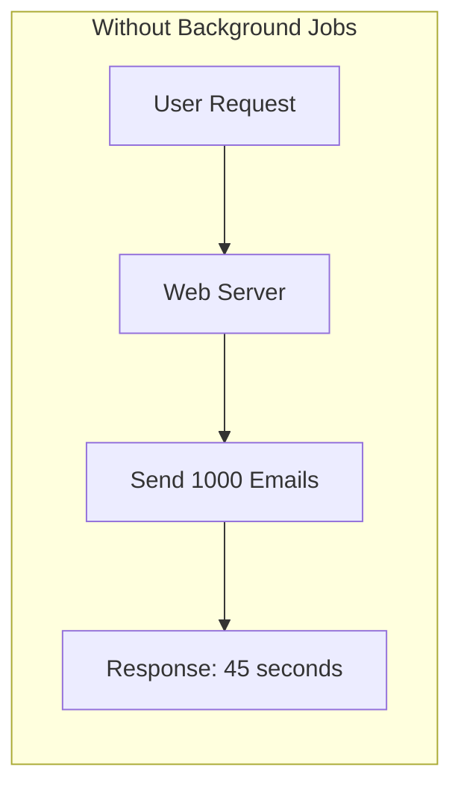
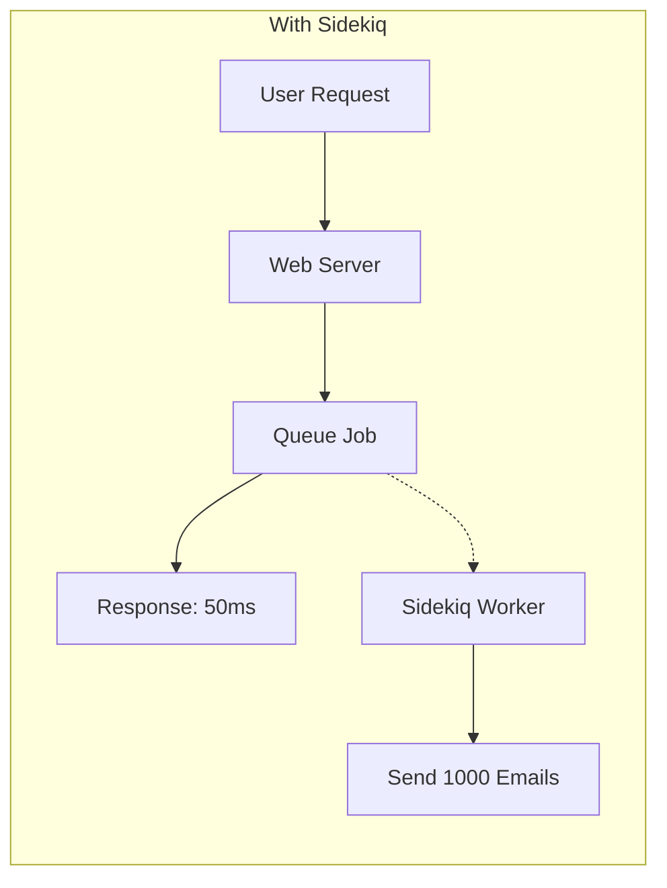
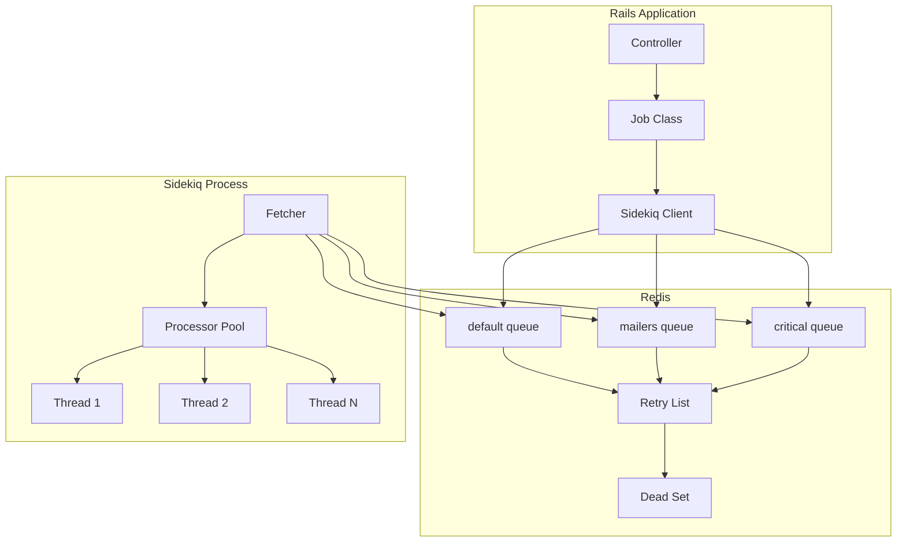
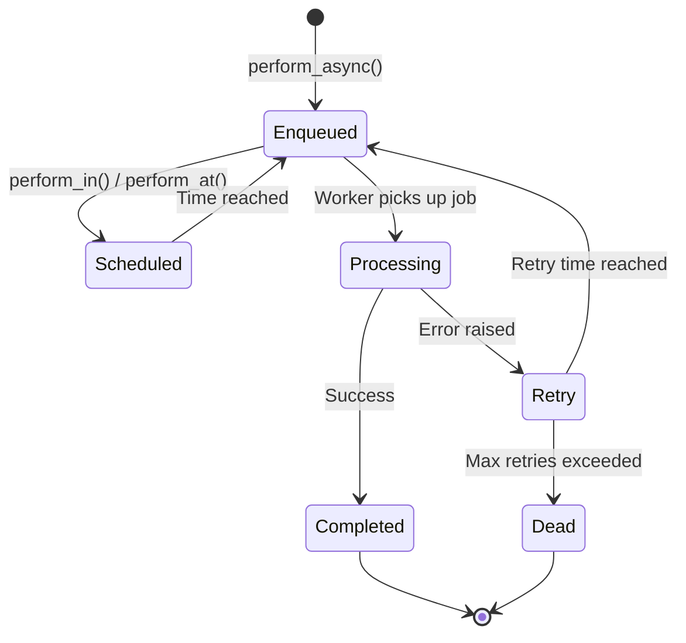
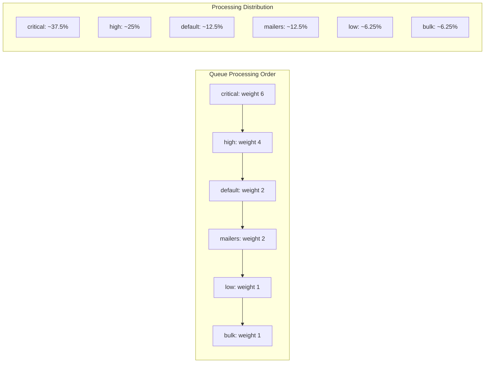
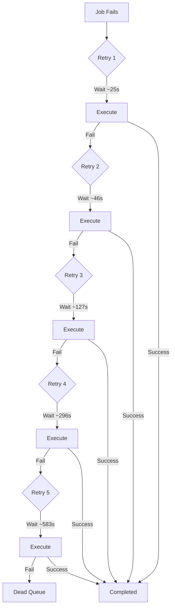

# How to Configure Background Jobs with Sidekiq

Author: [nawazdhandala](https://www.github.com/nawazdhandala)

Tags: Ruby, Rails, Sidekiq, Background Jobs, Redis, Async

Description: Learn how to configure and optimize Sidekiq for background job processing in Ruby on Rails applications. This guide covers job creation, queue management, retry strategies, and production best practices.

---

> Background jobs are essential for building responsive web applications. When users submit forms, upload files, or trigger complex operations, you should not make them wait. Sidekiq processes these tasks asynchronously, keeping your application fast while handling heavy lifting in the background.

Sidekiq is the most popular background job processor for Ruby applications. It uses Redis for job storage and threading for concurrent execution, making it significantly faster than alternatives like Delayed Job or Resque.

---

## Understanding Background Job Processing

Before diving into configuration, let's understand why background jobs matter and how Sidekiq works:





Without background jobs, users wait for every operation to complete. With Sidekiq, the web server queues work and responds immediately while workers process tasks asynchronously.

### Sidekiq Architecture

Understanding Sidekiq's components helps you configure it correctly:



Key components:
- **Client**: Pushes jobs to Redis queues from your Rails application
- **Redis**: Stores jobs, retry information, and dead jobs
- **Server**: Fetches and processes jobs using a thread pool
- **Queues**: Named lists that organize different job types
- **Retry List**: Failed jobs waiting for retry
- **Dead Set**: Jobs that have exhausted all retries

### Job Lifecycle

Every Sidekiq job goes through a predictable lifecycle:



---

## Getting Started

### Installation

Add Sidekiq to your Gemfile:

```ruby
# Gemfile

# Main Sidekiq gem
gem 'sidekiq', '~> 7.2'

# Optional: Web UI for monitoring (highly recommended)
gem 'sidekiq-web'

# Optional: Scheduler for recurring jobs
gem 'sidekiq-scheduler', '~> 5.0'

# Optional: Rate limiting and unique jobs
gem 'sidekiq-limit_fetch', '~> 4.4'
gem 'sidekiq-unique-jobs', '~> 8.0'

# Redis driver (Sidekiq 7+ uses redis-client)
gem 'redis-client', '~> 0.19'
```

Install the gems:

```bash
bundle install
```

### Redis Configuration

Sidekiq requires Redis. Configure the connection in an initializer:

```ruby
# config/initializers/sidekiq.rb

# Redis URL from environment variable
# Format: redis://[:password@]host:port[/db]
REDIS_URL = ENV.fetch('REDIS_URL', 'redis://localhost:6379/0')

# Configure Sidekiq server (the worker process)
Sidekiq.configure_server do |config|
  # Redis connection pool for server
  config.redis = {
    url: REDIS_URL,
    # Connection pool size should match concurrency
    # Sidekiq uses (concurrency + 5) connections by default
    pool_size: ENV.fetch('SIDEKIQ_CONCURRENCY', 10).to_i + 5,
    # Network timeout settings
    network_timeout: 5,
    # SSL settings for production Redis
    ssl_params: Rails.env.production? ? { verify_mode: OpenSSL::SSL::VERIFY_NONE } : nil
  }

  # Server middleware runs around job execution
  config.server_middleware do |chain|
    # Add custom middleware here
    # chain.add MyServerMiddleware
  end

  # Client middleware runs when jobs are pushed
  config.client_middleware do |chain|
    # chain.add MyClientMiddleware
  end

  # Death handler for jobs that exhaust retries
  config.death_handlers << ->(job, exception) do
    Rails.logger.error(
      "Job #{job['class']} with args #{job['args']} has died: #{exception.message}"
    )
    # Notify error tracking service
    Sentry.capture_exception(exception, extra: { job: job }) if defined?(Sentry)
  end
end

# Configure Sidekiq client (the Rails app pushing jobs)
Sidekiq.configure_client do |config|
  config.redis = {
    url: REDIS_URL,
    # Client needs fewer connections than server
    pool_size: 5,
    network_timeout: 5
  }
end

# Default job options applied to all jobs
Sidekiq.default_job_options = {
  'retry' => 5,                    # Number of retries before going to dead queue
  'backtrace' => true,             # Store backtrace in Redis for debugging
  'dead' => true,                  # Move to dead queue after max retries
  'lock' => :until_executed        # For sidekiq-unique-jobs (if used)
}

# Global Sidekiq configuration
Sidekiq.strict_args! # Enforce serializable job arguments (recommended)
```

### Active Job Configuration

Configure Rails Active Job to use Sidekiq:

```ruby
# config/application.rb

module MyApp
  class Application < Rails::Application
    # Set Sidekiq as the default queue adapter
    config.active_job.queue_adapter = :sidekiq

    # Default queue name for Active Job
    config.active_job.queue_name_prefix = Rails.env
    config.active_job.queue_name_delimiter = '_'
  end
end
```

---

## Creating Background Jobs

### Basic Job Structure

Sidekiq supports both native workers and Active Job. Here's the native approach for maximum performance:

```ruby
# app/sidekiq/hard_worker.rb
# (or app/workers/hard_worker.rb - either location works)

class HardWorker
  include Sidekiq::Job

  # Job-specific options
  sidekiq_options(
    queue: :default,        # Queue name
    retry: 5,               # Number of retries
    backtrace: true,        # Store full backtrace
    dead: true,             # Move to dead queue on failure
    tags: ['heavy', 'cpu']  # Tags for filtering in web UI
  )

  # The perform method receives the job arguments
  # Arguments must be simple JSON-serializable types:
  # String, Integer, Float, Boolean, Array, Hash, nil
  def perform(user_id, action, options = {})
    # Fetch the user (always re-fetch in jobs, never pass ActiveRecord objects)
    user = User.find_by(id: user_id)

    # Guard clause: handle missing records gracefully
    unless user
      Rails.logger.warn("HardWorker: User #{user_id} not found, skipping")
      return
    end

    # Perform the actual work
    case action
    when 'sync_external_data'
      sync_external_data(user, options)
    when 'generate_report'
      generate_report(user, options)
    else
      Rails.logger.error("HardWorker: Unknown action '#{action}'")
    end
  end

  private

  def sync_external_data(user, options)
    # Implementation here
    ExternalApiClient.new.sync_user_data(user.external_id)
    user.update!(last_synced_at: Time.current)
  end

  def generate_report(user, options)
    report_type = options.fetch('type', 'monthly')
    ReportGenerator.new(user).generate(report_type)
  end
end
```

### Active Job Style

If you prefer Active Job for portability across queue backends:

```ruby
# app/jobs/welcome_email_job.rb

class WelcomeEmailJob < ApplicationJob
  # Queue configuration
  queue_as :mailers

  # Retry configuration
  retry_on ActiveRecord::RecordNotFound, wait: 5.seconds, attempts: 3
  discard_on ActiveJob::DeserializationError

  # Sidekiq-specific options via Active Job
  sidekiq_options retry: 5, backtrace: 20

  # Before and after callbacks
  before_perform do |job|
    Rails.logger.info("Starting #{job.class.name} with args: #{job.arguments}")
  end

  after_perform do |job|
    Rails.logger.info("Completed #{job.class.name}")
  end

  def perform(user_id, template_name = 'default')
    user = User.find(user_id)

    # Send the welcome email
    UserMailer.welcome(user, template: template_name).deliver_now

    # Track the event
    Analytics.track(
      user_id: user.id,
      event: 'welcome_email_sent',
      properties: { template: template_name }
    )
  end
end
```

### Job with Batching Support

For jobs that process items in batches:

```ruby
# app/sidekiq/batch_processor.rb

class BatchProcessor
  include Sidekiq::Job

  sidekiq_options queue: :bulk, retry: 3

  # Process items in configurable batch sizes
  BATCH_SIZE = 100

  def perform(start_id, end_id)
    # Process records in batches to avoid memory issues
    User.where(id: start_id..end_id)
        .where(processed: false)
        .find_in_batches(batch_size: BATCH_SIZE) do |batch|
      process_batch(batch)
    end
  end

  private

  def process_batch(users)
    users.each do |user|
      process_single_user(user)
    rescue StandardError => e
      # Log individual failures but continue with batch
      Rails.logger.error("Failed to process user #{user.id}: #{e.message}")
      Sentry.capture_exception(e, extra: { user_id: user.id })
    end
  end

  def process_single_user(user)
    user.with_lock do
      return if user.processed?

      # Perform processing
      user.update!(
        processed: true,
        processed_at: Time.current
      )
    end
  end

  # Class method to enqueue work in parallel
  def self.enqueue_all(total_records:, batch_size: 1000)
    (0..(total_records / batch_size)).each do |i|
      start_id = i * batch_size + 1
      end_id = (i + 1) * batch_size
      perform_async(start_id, end_id)
    end
  end
end
```

---

## Enqueueing Jobs

### Basic Enqueueing

```ruby
# Immediate execution (as soon as a worker is available)
HardWorker.perform_async(user.id, 'sync_external_data', { force: true })

# Delayed execution (run after specified time)
HardWorker.perform_in(1.hour, user.id, 'generate_report')
HardWorker.perform_at(Date.tomorrow.noon, user.id, 'generate_report')

# Active Job style
WelcomeEmailJob.perform_later(user.id)
WelcomeEmailJob.set(wait: 1.hour).perform_later(user.id)
WelcomeEmailJob.set(wait_until: Date.tomorrow.noon).perform_later(user.id)

# Specify queue at enqueue time
WelcomeEmailJob.set(queue: :high_priority).perform_later(user.id)
```

### Bulk Enqueueing

For enqueueing many jobs efficiently:

```ruby
# Efficient bulk enqueueing with push_bulk
# This reduces Redis round trips significantly
class BulkEnqueuer
  def self.enqueue_user_sync(user_ids)
    # push_bulk accepts an array of argument arrays
    HardWorker.perform_bulk(
      user_ids.map { |id| [id, 'sync_external_data', {}] }
    )
  end

  def self.enqueue_with_delays(items)
    # For delayed bulk jobs, use Sidekiq client directly
    items.each_slice(1000) do |batch|
      jobs = batch.map do |item|
        {
          'class' => 'HardWorker',
          'args' => [item[:user_id], item[:action], item[:options]],
          'at' => item[:run_at].to_f,
          'queue' => determine_queue(item)
        }
      end
      Sidekiq::Client.push_bulk('class' => 'HardWorker', 'args' => jobs.map { |j| j['args'] })
    end
  end

  private

  def self.determine_queue(item)
    item[:priority] == 'high' ? 'critical' : 'default'
  end
end
```

### From Controllers

```ruby
# app/controllers/reports_controller.rb

class ReportsController < ApplicationController
  def create
    # Validate parameters first
    unless valid_report_params?
      render json: { error: 'Invalid parameters' }, status: :unprocessable_entity
      return
    end

    # Enqueue the job and return immediately
    job_id = ReportGeneratorJob.perform_async(
      current_user.id,
      report_params[:type],
      report_params[:options].to_h
    )

    # Return the job ID so frontend can poll for status
    render json: {
      message: 'Report generation started',
      job_id: job_id,
      status_url: job_status_path(job_id)
    }, status: :accepted
  end

  private

  def report_params
    params.require(:report).permit(:type, options: {})
  end

  def valid_report_params?
    %w[daily weekly monthly].include?(report_params[:type])
  end
end
```

---

## Queue Configuration

### Defining Queues

Configure queues and their priorities in the Sidekiq configuration file:

```yaml
# config/sidekiq.yml

# Development configuration
development:
  :concurrency: 5
  :timeout: 25
  :queues:
    - default

# Production configuration
production:
  :concurrency: <%= ENV.fetch('SIDEKIQ_CONCURRENCY', 25) %>
  :timeout: 25
  :verbose: false
  :logfile: ./log/sidekiq.log
  :pidfile: ./tmp/pids/sidekiq.pid

  # Queue definitions with weights (higher = more priority)
  # Format: [queue_name, weight]
  :queues:
    - [critical, 6]      # Processed 6x more than default
    - [high, 4]          # Processed 4x more than default
    - [default, 2]       # Standard priority
    - [mailers, 2]       # Email sending
    - [low, 1]           # Background tasks
    - [bulk, 1]          # Batch processing

# Testing configuration
test:
  :concurrency: 1
  :queues:
    - default
```

### Queue Priority Visualization



### Multiple Sidekiq Processes

For larger applications, run specialized processes:

```bash
# Process 1: Critical and high priority only
bundle exec sidekiq -q critical,6 -q high,4 -c 10

# Process 2: Default processing
bundle exec sidekiq -q default,2 -q mailers,2 -c 15

# Process 3: Low priority and bulk (can be scaled down)
bundle exec sidekiq -q low,1 -q bulk,1 -c 5
```

Systemd service configuration:

```ini
# /etc/systemd/system/sidekiq.service

[Unit]
Description=Sidekiq Background Workers
After=network.target redis.service

[Service]
Type=notify
WatchdogSec=10
User=deploy
Group=deploy
WorkingDirectory=/var/www/myapp/current

# Environment configuration
EnvironmentFile=/var/www/myapp/shared/.env
Environment=RAILS_ENV=production
Environment=MALLOC_ARENA_MAX=2

# Start command
ExecStart=/usr/local/bin/bundle exec sidekiq -e production -C config/sidekiq.yml

# Graceful shutdown: send TSTP, wait, then TERM
ExecReload=/bin/kill -TSTP $MAINPID
TimeoutStopSec=30
KillMode=mixed

# Restart policy
Restart=on-failure
RestartSec=5

# Resource limits
LimitNOFILE=65535
StandardOutput=append:/var/www/myapp/shared/log/sidekiq.log
StandardError=append:/var/www/myapp/shared/log/sidekiq.log

[Install]
WantedBy=multi-user.target
```

---

## Retry Configuration

### Understanding Retries

Sidekiq automatically retries failed jobs with exponential backoff:



The retry formula: `(retry_count ** 4) + 15 + (rand(10) * (retry_count + 1))` seconds

### Configuring Retries

```ruby
# app/sidekiq/important_worker.rb

class ImportantWorker
  include Sidekiq::Job

  # Retry configuration options
  sidekiq_options(
    retry: 10,           # Maximum retry attempts (default: 25)
    dead: true,          # Move to dead queue after max retries (default: true)
    backtrace: 20        # Number of backtrace lines to store (default: 0)
  )

  # Custom retry delay calculation
  sidekiq_retry_in do |retry_count, exception|
    case exception
    when RateLimitError
      # Back off longer for rate limits
      (retry_count ** 4) + 60 + (rand(30) * (retry_count + 1))
    when NetworkError
      # Quick retry for transient network issues
      [10, 30, 60, 120, 300][retry_count] || 600
    else
      # Default exponential backoff
      (retry_count ** 4) + 15 + (rand(10) * (retry_count + 1))
    end
  end

  # Handle specific exceptions before retry
  sidekiq_retries_exhausted do |job, exception|
    Rails.logger.error(
      "#{job['class']} has exhausted retries. " \
      "Job args: #{job['args']}, Error: #{exception.message}"
    )

    # Notify the user if applicable
    if (user_id = job['args'].first)
      UserNotificationService.notify_job_failure(user_id, job['class'])
    end

    # Send to error tracking
    Sentry.capture_exception(
      exception,
      extra: { job_class: job['class'], job_args: job['args'] }
    )
  end

  def perform(user_id, action)
    user = User.find(user_id)
    process_action(user, action)
  rescue ActiveRecord::RecordNotFound
    # Don't retry if user doesn't exist
    Rails.logger.warn("User #{user_id} not found, discarding job")
  rescue ExternalApi::RateLimitError => e
    # Re-raise to trigger retry with custom delay
    raise
  rescue StandardError => e
    # Log and re-raise for standard retry
    Rails.logger.error("ImportantWorker failed: #{e.message}")
    raise
  end

  private

  def process_action(user, action)
    # Implementation
  end
end
```

### Error Classes for Retry Control

```ruby
# app/errors/job_errors.rb

module JobErrors
  # Base error for job failures
  class JobError < StandardError; end

  # Errors that should not be retried
  class PermanentFailure < JobError; end
  class InvalidArgumentError < PermanentFailure; end
  class MissingRecordError < PermanentFailure; end

  # Errors that should be retried with custom logic
  class TransientFailure < JobError; end
  class RateLimitError < TransientFailure; end
  class NetworkError < TransientFailure; end
  class TemporaryUnavailableError < TransientFailure; end
end
```

```ruby
# app/sidekiq/robust_worker.rb

class RobustWorker
  include Sidekiq::Job
  include JobErrors

  sidekiq_options retry: 8

  # Skip retry for permanent failures
  sidekiq_retry_in do |retry_count, exception|
    case exception
    when PermanentFailure
      :discard  # Don't retry, don't add to dead queue
    when RateLimitError
      (retry_count + 1) * 60  # Linear backoff for rate limits
    else
      :default  # Use default exponential backoff
    end
  end

  def perform(record_id, operation)
    record = Record.find_by(id: record_id)
    raise MissingRecordError, "Record #{record_id} not found" unless record

    case operation
    when 'sync'
      sync_record(record)
    when 'delete'
      delete_record(record)
    else
      raise InvalidArgumentError, "Unknown operation: #{operation}"
    end
  end

  private

  def sync_record(record)
    response = ExternalApi.sync(record.external_id)

    case response.status
    when 200..299
      record.update!(synced_at: Time.current)
    when 429
      raise RateLimitError, 'API rate limit exceeded'
    when 500..599
      raise TemporaryUnavailableError, 'External service unavailable'
    else
      raise PermanentFailure, "Unexpected response: #{response.status}"
    end
  end

  def delete_record(record)
    record.destroy!
  end
end
```

---

## Middleware

### Server Middleware

Server middleware wraps job execution on the Sidekiq server:

```ruby
# app/middleware/sidekiq/logging_middleware.rb

module Sidekiq
  module Middleware
    class LoggingMiddleware
      def call(job_instance, job_payload, queue)
        job_class = job_payload['class']
        job_id = job_payload['jid']
        started_at = Time.current

        # Set up logging context
        Rails.logger.tagged(job_class, job_id) do
          Rails.logger.info("Starting job on queue '#{queue}'")

          begin
            # Yield to the next middleware or job execution
            yield

            duration = Time.current - started_at
            Rails.logger.info("Completed in #{duration.round(3)}s")
          rescue StandardError => e
            duration = Time.current - started_at
            Rails.logger.error("Failed after #{duration.round(3)}s: #{e.message}")
            raise
          end
        end
      end
    end
  end
end
```

```ruby
# app/middleware/sidekiq/request_id_middleware.rb

module Sidekiq
  module Middleware
    class RequestIdMiddleware
      def call(job_instance, job_payload, queue)
        # Restore request ID from job payload or generate new one
        request_id = job_payload['request_id'] || SecureRandom.uuid

        # Make request ID available during job execution
        Thread.current[:request_id] = request_id

        yield
      ensure
        Thread.current[:request_id] = nil
      end
    end
  end
end
```

### Client Middleware

Client middleware runs when jobs are pushed to Redis:

```ruby
# app/middleware/sidekiq/request_id_client_middleware.rb

module Sidekiq
  module Middleware
    class RequestIdClientMiddleware
      def call(job_class, job_payload, queue, redis_pool)
        # Add current request ID to job payload
        # This allows tracing jobs back to the original request
        job_payload['request_id'] = Thread.current[:request_id] ||
                                     RequestStore.store[:request_id] ||
                                     SecureRandom.uuid

        # Add timestamp for tracking job age
        job_payload['enqueued_at'] ||= Time.current.to_f

        yield
      end
    end
  end
end
```

### Registering Middleware

```ruby
# config/initializers/sidekiq.rb

Sidekiq.configure_server do |config|
  config.server_middleware do |chain|
    chain.add Sidekiq::Middleware::LoggingMiddleware
    chain.add Sidekiq::Middleware::RequestIdMiddleware
  end

  config.client_middleware do |chain|
    chain.add Sidekiq::Middleware::RequestIdClientMiddleware
  end
end

Sidekiq.configure_client do |config|
  config.client_middleware do |chain|
    chain.add Sidekiq::Middleware::RequestIdClientMiddleware
  end
end
```

---

## Web UI and Monitoring

### Setting Up the Web UI

```ruby
# config/routes.rb

require 'sidekiq/web'

Rails.application.routes.draw do
  # Protect Sidekiq web UI with authentication
  authenticate :user, ->(user) { user.admin? } do
    mount Sidekiq::Web => '/sidekiq'
  end

  # Or use HTTP Basic Auth for non-Devise apps
  Sidekiq::Web.use Rack::Auth::Basic do |username, password|
    ActiveSupport::SecurityUtils.secure_compare(
      ::Digest::SHA256.hexdigest(username),
      ::Digest::SHA256.hexdigest(ENV.fetch('SIDEKIQ_USERNAME', 'admin'))
    ) &
      ActiveSupport::SecurityUtils.secure_compare(
        ::Digest::SHA256.hexdigest(password),
        ::Digest::SHA256.hexdigest(ENV.fetch('SIDEKIQ_PASSWORD', 'password'))
      )
  end

  # Your other routes...
end
```

### Custom Web UI Pages

```ruby
# config/initializers/sidekiq_web.rb

require 'sidekiq/web'

# Add custom tabs to Sidekiq Web UI
Sidekiq::Web.tabs['Custom Stats'] = 'custom_stats'

# Register the custom page
Sidekiq::Web.register(
  Sidekiq::WebAction.new(
    :get,
    '/custom_stats',
    lambda do |env|
      stats = {
        processed_today: Sidekiq::Stats.new.processed,
        failed_today: Sidekiq::Stats.new.failed,
        workers: Sidekiq::ProcessSet.new.size,
        queues: Sidekiq::Queue.all.map { |q| [q.name, q.size] }.to_h
      }

      [
        200,
        { 'Content-Type' => 'application/json' },
        [stats.to_json]
      ]
    end
  )
)
```

### Prometheus Metrics

```ruby
# app/middleware/sidekiq/prometheus_middleware.rb

require 'prometheus_exporter/client'

module Sidekiq
  module Middleware
    class PrometheusMiddleware
      def initialize
        @client = PrometheusExporter::Client.default
      end

      def call(job_instance, job_payload, queue)
        job_class = job_payload['class']
        started_at = Process.clock_gettime(Process::CLOCK_MONOTONIC)

        begin
          yield

          duration = Process.clock_gettime(Process::CLOCK_MONOTONIC) - started_at

          @client.send_json(
            type: 'sidekiq',
            name: 'sidekiq_job_duration_seconds',
            value: duration,
            labels: { job_class: job_class, queue: queue, status: 'success' }
          )
        rescue StandardError => e
          duration = Process.clock_gettime(Process::CLOCK_MONOTONIC) - started_at

          @client.send_json(
            type: 'sidekiq',
            name: 'sidekiq_job_duration_seconds',
            value: duration,
            labels: { job_class: job_class, queue: queue, status: 'failure' }
          )

          @client.send_json(
            type: 'sidekiq',
            name: 'sidekiq_job_failures_total',
            value: 1,
            labels: { job_class: job_class, queue: queue, error: e.class.name }
          )

          raise
        end
      end
    end
  end
end
```

### API for Job Status

```ruby
# app/controllers/api/job_status_controller.rb

module Api
  class JobStatusController < ApplicationController
    def show
      job_id = params[:id]

      # Check if job is still in a queue
      Sidekiq::Queue.all.each do |queue|
        queue.each do |job|
          if job.jid == job_id
            render json: { status: 'pending', queue: queue.name }
            return
          end
        end
      end

      # Check if job is currently being processed
      Sidekiq::Workers.new.each do |_process_id, _thread_id, work|
        if work['payload']['jid'] == job_id
          render json: {
            status: 'processing',
            started_at: Time.at(work['run_at']).iso8601
          }
          return
        end
      end

      # Check retry set
      Sidekiq::RetrySet.new.each do |job|
        if job.jid == job_id
          render json: {
            status: 'retrying',
            retry_count: job['retry_count'],
            next_retry: Time.at(job.at).iso8601
          }
          return
        end
      end

      # Check dead set
      Sidekiq::DeadSet.new.each do |job|
        if job.jid == job_id
          render json: {
            status: 'dead',
            error: job['error_class'],
            message: job['error_message']
          }
          return
        end
      end

      # Job not found (probably completed)
      render json: { status: 'completed_or_unknown' }
    end
  end
end
```

---

## Scheduled Jobs

### Using sidekiq-scheduler

Configure recurring jobs with sidekiq-scheduler:

```yaml
# config/sidekiq_scheduler.yml

# Daily report generation
daily_report:
  cron: '0 6 * * *'              # Every day at 6 AM
  class: DailyReportWorker
  queue: reports
  args: ['summary']
  description: 'Generate daily summary report'

# Hourly cleanup
cleanup_old_sessions:
  every: '1h'                    # Every hour
  class: CleanupWorker
  queue: maintenance
  args: ['sessions', 7]          # Clean sessions older than 7 days
  description: 'Remove expired sessions'

# Weekly digest
weekly_digest:
  cron: '0 9 * * 1'              # Mondays at 9 AM
  class: WeeklyDigestWorker
  queue: mailers
  description: 'Send weekly digest emails'

# Every 5 minutes health check
health_check:
  every: '5m'
  class: HealthCheckWorker
  queue: critical
  description: 'External service health checks'

# First day of month billing
monthly_billing:
  cron: '0 0 1 * *'              # First day of month at midnight
  class: MonthlyBillingWorker
  queue: billing
  enabled: <%= Rails.env.production? %>
  description: 'Process monthly billing'
```

Initialize the scheduler:

```ruby
# config/initializers/sidekiq.rb

require 'sidekiq-scheduler'

Sidekiq.configure_server do |config|
  config.on(:startup) do
    schedule_file = Rails.root.join('config', 'sidekiq_scheduler.yml')

    if File.exist?(schedule_file)
      schedule = YAML.load_file(schedule_file)
      Sidekiq.schedule = schedule
      SidekiqScheduler::Scheduler.instance.reload_schedule!
    end
  end
end
```

### Manual Scheduling Patterns

```ruby
# app/sidekiq/scheduled_worker.rb

class ScheduledWorker
  include Sidekiq::Job

  sidekiq_options queue: :scheduled

  def perform(task_type)
    case task_type
    when 'daily_cleanup'
      perform_daily_cleanup
    when 'weekly_report'
      perform_weekly_report
    end
  end

  private

  def perform_daily_cleanup
    # Cleanup logic
    OldRecord.where('created_at < ?', 30.days.ago).delete_all

    # Schedule next run for tomorrow
    ScheduledWorker.perform_at(Date.tomorrow.beginning_of_day, 'daily_cleanup')
  end

  def perform_weekly_report
    # Report logic
    ReportGenerator.generate_weekly

    # Schedule next run for next week
    ScheduledWorker.perform_at(1.week.from_now.beginning_of_week, 'weekly_report')
  end
end
```

---

## Testing Sidekiq Jobs

### RSpec Configuration

```ruby
# spec/support/sidekiq.rb

require 'sidekiq/testing'

RSpec.configure do |config|
  config.before(:each) do
    # Clear all queued jobs before each test
    Sidekiq::Worker.clear_all
  end

  config.before(:each, sidekiq: :inline) do
    # Execute jobs immediately for integration tests
    Sidekiq::Testing.inline!
  end

  config.after(:each, sidekiq: :inline) do
    Sidekiq::Testing.fake!
  end

  config.before(:each, sidekiq: :disable) do
    Sidekiq::Testing.disable!
  end

  config.after(:each, sidekiq: :disable) do
    Sidekiq::Testing.fake!
  end
end
```

### Unit Testing Jobs

```ruby
# spec/sidekiq/hard_worker_spec.rb

require 'rails_helper'

RSpec.describe HardWorker, type: :job do
  describe '.perform_async' do
    it 'enqueues the job' do
      expect {
        HardWorker.perform_async(1, 'sync_external_data', {})
      }.to change(HardWorker.jobs, :size).by(1)
    end

    it 'enqueues with correct arguments' do
      HardWorker.perform_async(1, 'sync_external_data', { force: true })

      job = HardWorker.jobs.last
      expect(job['args']).to eq([1, 'sync_external_data', { 'force' => true }])
      expect(job['queue']).to eq('default')
    end
  end

  describe '#perform' do
    let(:user) { create(:user) }

    it 'processes the sync action' do
      expect(ExternalApiClient).to receive(:new).and_return(
        instance_double(ExternalApiClient, sync_user_data: true)
      )

      HardWorker.new.perform(user.id, 'sync_external_data', {})

      expect(user.reload.last_synced_at).to be_present
    end

    it 'handles missing user gracefully' do
      expect(Rails.logger).to receive(:warn).with(/User \d+ not found/)

      # Should not raise
      HardWorker.new.perform(999999, 'sync_external_data', {})
    end

    it 'retries on transient errors', sidekiq: :inline do
      allow(ExternalApiClient).to receive(:new).and_raise(
        NetworkError, 'Connection timeout'
      )

      expect {
        HardWorker.perform_async(user.id, 'sync_external_data', {})
      }.to raise_error(NetworkError)
    end
  end
end
```

### Integration Testing

```ruby
# spec/features/report_generation_spec.rb

require 'rails_helper'

RSpec.describe 'Report Generation', type: :request, sidekiq: :inline do
  let(:user) { create(:user, :admin) }

  before do
    sign_in user
  end

  it 'generates a report asynchronously' do
    post reports_path, params: {
      report: { type: 'monthly', options: { format: 'pdf' } }
    }

    expect(response).to have_http_status(:accepted)

    json = JSON.parse(response.body)
    expect(json['message']).to eq('Report generation started')
    expect(json['job_id']).to be_present

    # In sidekiq:inline mode, job has already executed
    expect(user.reports.count).to eq(1)
  end
end
```

### Testing Scheduled Jobs

```ruby
# spec/sidekiq/daily_report_worker_spec.rb

require 'rails_helper'

RSpec.describe DailyReportWorker, type: :job do
  describe 'schedule' do
    it 'is scheduled to run daily at 6 AM' do
      schedule = Sidekiq.get_schedule['daily_report']

      expect(schedule['cron']).to eq('0 6 * * *')
      expect(schedule['class']).to eq('DailyReportWorker')
    end
  end

  describe '#perform' do
    it 'generates the daily report' do
      expect(ReportService).to receive(:generate_daily).and_return(true)

      DailyReportWorker.new.perform('summary')
    end

    it 'sends notification on completion' do
      allow(ReportService).to receive(:generate_daily).and_return(true)

      expect {
        DailyReportWorker.new.perform('summary')
      }.to have_enqueued_job(NotificationJob)
    end
  end
end
```

---

## Production Best Practices

### Memory Management

```ruby
# config/initializers/sidekiq.rb

Sidekiq.configure_server do |config|
  # Memory limit per worker (requires sidekiq-limit_fetch)
  config[:max_memory] = 256  # MB

  config.on(:startup) do
    # Check memory periodically
    Thread.new do
      loop do
        sleep 60
        memory_mb = `ps -o rss= -p #{Process.pid}`.to_i / 1024

        if memory_mb > 512
          Rails.logger.warn("Sidekiq memory: #{memory_mb}MB, requesting quiet")
          Process.kill('TSTP', Process.pid)
        end
      end
    end
  end
end
```

### Graceful Shutdown

```ruby
# config/initializers/sidekiq.rb

Sidekiq.configure_server do |config|
  # Handle shutdown signals gracefully
  config[:timeout] = 25  # Seconds to wait for jobs to finish

  config.on(:shutdown) do
    Rails.logger.info('Sidekiq shutting down, completing in-flight jobs...')
  end
end
```

### Job Idempotency

```ruby
# app/sidekiq/idempotent_worker.rb

class IdempotentWorker
  include Sidekiq::Job

  # Use sidekiq-unique-jobs for deduplication
  sidekiq_options(
    lock: :until_executed,
    lock_timeout: 1.hour.to_i,
    on_conflict: :log
  )

  def perform(order_id)
    order = Order.find(order_id)

    # Idempotency check: skip if already processed
    return if order.processed?

    # Use database transaction for atomicity
    Order.transaction do
      # Lock the record to prevent concurrent processing
      order.lock!

      # Double-check after acquiring lock
      return if order.processed?

      # Process the order
      process_order(order)

      # Mark as processed
      order.update!(processed: true, processed_at: Time.current)
    end
  end

  private

  def process_order(order)
    # Processing logic
    PaymentGateway.charge(order.payment_method, order.total)
    InventoryService.reserve(order.items)
    ShippingService.create_label(order)
  end
end
```

### Health Monitoring

```ruby
# app/sidekiq/health_monitor.rb

class HealthMonitor
  class << self
    def check
      {
        status: healthy? ? 'ok' : 'degraded',
        redis: redis_status,
        workers: worker_status,
        queues: queue_status,
        latency: latency_status
      }
    end

    def healthy?
      redis_connected? && workers_running? && latency_acceptable?
    end

    private

    def redis_connected?
      Sidekiq.redis(&:ping) == 'PONG'
    rescue StandardError
      false
    end

    def redis_status
      {
        connected: redis_connected?,
        info: Sidekiq.redis { |r| r.info('memory')['used_memory_human'] }
      }
    rescue StandardError => e
      { connected: false, error: e.message }
    end

    def workers_running?
      Sidekiq::ProcessSet.new.size.positive?
    end

    def worker_status
      processes = Sidekiq::ProcessSet.new
      {
        count: processes.size,
        processes: processes.map do |process|
          {
            hostname: process['hostname'],
            pid: process['pid'],
            concurrency: process['concurrency'],
            busy: process['busy'],
            queues: process['queues']
          }
        end
      }
    end

    def queue_status
      Sidekiq::Queue.all.map do |queue|
        {
          name: queue.name,
          size: queue.size,
          latency: queue.latency.round(2)
        }
      end
    end

    def latency_acceptable?
      Sidekiq::Queue.all.all? { |q| q.latency < 60 }
    end

    def latency_status
      critical_queue = Sidekiq::Queue.new('critical')
      default_queue = Sidekiq::Queue.new('default')

      {
        critical: critical_queue.latency.round(2),
        default: default_queue.latency.round(2),
        acceptable: latency_acceptable?
      }
    end
  end
end
```

---

## Complete Configuration Reference

```yaml
# config/sidekiq.yml

# Global configuration
:concurrency: <%= ENV.fetch('SIDEKIQ_CONCURRENCY', 10) %>
:timeout: 25
:poll_interval_average: 2
:average_scheduled_poll_interval: 5

# Logging
:verbose: false
:logfile: <%= Rails.env.production? ? './log/sidekiq.log' : nil %>

# PID file
:pidfile: ./tmp/pids/sidekiq.pid

# Labels for identification
:labels:
  - <%= ENV.fetch('DYNO', 'worker') %>

# Queue configuration with weights
:queues:
  - [critical, 6]
  - [high, 4]
  - [default, 2]
  - [mailers, 2]
  - [low, 1]
  - [bulk, 1]

# Strict ordering (process queues in exact order, ignoring weights)
# :strict: true

# Queue limits (requires sidekiq-limit_fetch)
:limits:
  bulk: 3      # Max 3 concurrent bulk jobs
  mailers: 5   # Max 5 concurrent mailer jobs

# Environment-specific overrides
<% if Rails.env.development? %>
:concurrency: 5
:queues:
  - default
  - mailers
<% end %>

<% if Rails.env.test? %>
:concurrency: 1
:queues:
  - default
<% end %>
```

```ruby
# config/initializers/sidekiq.rb - Complete configuration

require 'sidekiq'
require 'sidekiq/web'
require 'sidekiq-scheduler' if defined?(SidekiqScheduler)

REDIS_URL = ENV.fetch('REDIS_URL', 'redis://localhost:6379/0')

Sidekiq.configure_server do |config|
  config.redis = {
    url: REDIS_URL,
    pool_size: ENV.fetch('SIDEKIQ_CONCURRENCY', 10).to_i + 5,
    network_timeout: 5
  }

  # Server middleware
  config.server_middleware do |chain|
    chain.add Sidekiq::Middleware::LoggingMiddleware
    chain.add Sidekiq::Middleware::RequestIdMiddleware
    chain.add Sidekiq::Middleware::PrometheusMiddleware if defined?(PrometheusExporter)
  end

  config.client_middleware do |chain|
    chain.add Sidekiq::Middleware::RequestIdClientMiddleware
  end

  # Death handlers
  config.death_handlers << ->(job, exception) do
    Rails.logger.error("[Sidekiq Death] #{job['class']}: #{exception.message}")
    Sentry.capture_exception(exception, extra: { job: job }) if defined?(Sentry)
  end

  # Scheduler setup
  config.on(:startup) do
    if File.exist?(Rails.root.join('config', 'sidekiq_scheduler.yml'))
      schedule = YAML.load_file(Rails.root.join('config', 'sidekiq_scheduler.yml'))
      Sidekiq.schedule = schedule
      SidekiqScheduler::Scheduler.instance.reload_schedule!
    end
  end

  config.on(:shutdown) do
    Rails.logger.info('Sidekiq shutting down')
  end
end

Sidekiq.configure_client do |config|
  config.redis = {
    url: REDIS_URL,
    pool_size: 5,
    network_timeout: 5
  }

  config.client_middleware do |chain|
    chain.add Sidekiq::Middleware::RequestIdClientMiddleware
  end
end

# Default job options
Sidekiq.default_job_options = {
  'retry' => 5,
  'backtrace' => true,
  'dead' => true
}

# Enforce serializable arguments
Sidekiq.strict_args!
```

---

## Summary

Sidekiq provides a robust foundation for background job processing in Ruby applications. Key takeaways:

- **Use Redis efficiently** with appropriate pool sizes and timeouts
- **Design jobs to be idempotent** so they can safely retry on failure
- **Configure queues strategically** with weights that match your priorities
- **Monitor queue latency** to detect backlogs before they impact users
- **Test jobs thoroughly** including failure scenarios and retries
- **Use middleware** for cross-cutting concerns like logging and metrics

Properly configured Sidekiq dramatically improves application responsiveness while ensuring reliable background processing.

---

*Need to monitor your Sidekiq workers in production? [OneUptime](https://oneuptime.com) provides comprehensive observability for Ruby applications, including job metrics, queue health monitoring, and failure alerting.*
