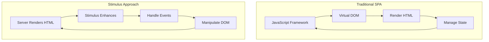
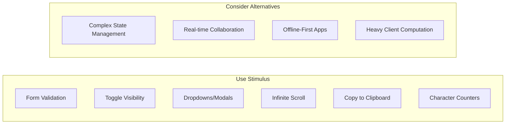
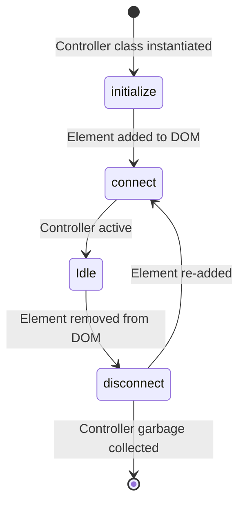
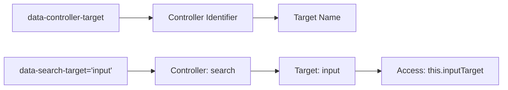
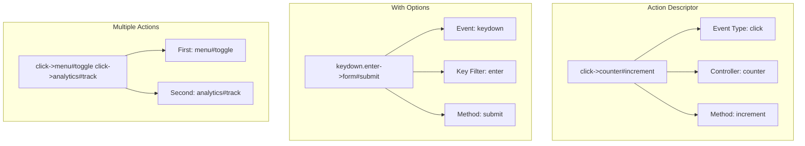
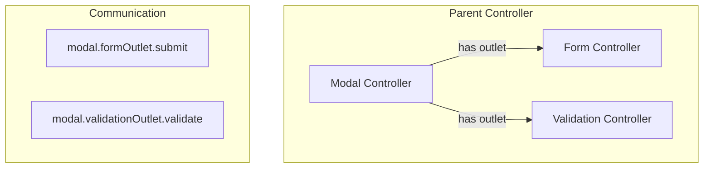
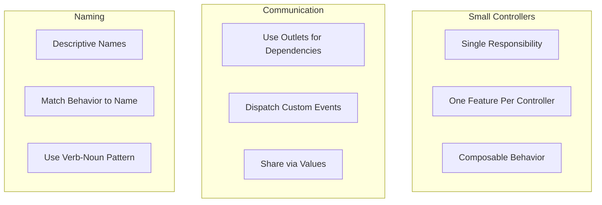

# How to Use Stimulus Controllers in Rails

Author: [nawazdhandala](https://www.github.com/nawazdhandala)

Tags: Ruby, Rails, Stimulus, JavaScript, Hotwire, Frontend

Description: Learn how to build interactive web applications with Stimulus controllers in Ruby on Rails. This guide covers controller basics, targets, actions, values, outlets, and best practices for modern Rails frontend development.

---

> Stimulus is a modest JavaScript framework that enhances your HTML with just enough behavior to make it shine. Unlike heavy JavaScript frameworks that take over your entire frontend, Stimulus works with the HTML you already have, adding interactivity through controllers that connect to DOM elements via simple data attributes.

Stimulus is part of the Hotwire stack (along with Turbo) and represents a paradigm shift in how Rails developers think about JavaScript. Instead of building SPAs that render everything client-side, you serve HTML from the server and sprinkle in just enough JavaScript to handle the interactive bits.

---

## Understanding the Stimulus Philosophy

Stimulus follows three core principles that make it different from frameworks like React or Vue:



Key principles:

- **HTML-First**: Your markup is the source of truth, not JavaScript state
- **Modest Ambition**: Stimulus handles interactivity, not rendering
- **Convention Over Configuration**: Predictable patterns reduce decision fatigue

### When to Use Stimulus



---

## Getting Started

### Installation

Stimulus comes pre-installed with Rails 7+ via importmaps. For older Rails versions or custom setups:

```bash
# Rails 7+ with importmaps (default)
# Already included, just verify in config/importmap.rb

# Rails 7+ with esbuild/webpack
./bin/rails javascript:install:esbuild
./bin/rails stimulus:install

# Manual installation with npm/yarn
npm install @hotwired/stimulus
# or
yarn add @hotwired/stimulus
```

Verify the setup in your `app/javascript/application.js`:

```javascript
// app/javascript/application.js
// Import the Stimulus application from the controllers directory
import { Application } from "@hotwired/stimulus"
import { eagerLoadControllersFrom } from "@hotwired/stimulus-loading"

// Create the Stimulus application instance
// This is the central hub that manages all controllers
const application = Application.start()

// Configure Stimulus development experience
// Enable debug mode in development for better error messages
application.debug = process.env.NODE_ENV === "development"

// Make the application available globally for debugging
window.Stimulus = application

// Automatically load all controllers from app/javascript/controllers
// This scans the directory and registers each controller
eagerLoadControllersFrom("controllers", application)

export { application }
```

### Controller Directory Structure

```
app/javascript/
├── application.js           # Main entry point
└── controllers/
    ├── index.js             # Controller registration
    ├── application.js       # Base controller (optional)
    ├── hello_controller.js  # Example controller
    ├── dropdown_controller.js
    ├── modal_controller.js
    └── form_validation_controller.js
```

---

## Your First Stimulus Controller

Let's create a simple "Hello World" controller to understand the basics:

```javascript
// app/javascript/controllers/hello_controller.js
import { Controller } from "@hotwired/stimulus"

// Controllers are JavaScript classes that extend Stimulus Controller
// The filename determines the controller identifier: hello_controller.js -> "hello"
export default class extends Controller {
  // The connect() lifecycle callback runs when the controller
  // is connected to the DOM (element with data-controller="hello" appears)
  connect() {
    console.log("Hello controller connected!")
    // 'this.element' refers to the DOM element with data-controller
    this.element.textContent = "Hello, Stimulus!"
  }

  // The disconnect() lifecycle callback runs when the controller
  // is disconnected from the DOM (element is removed)
  disconnect() {
    console.log("Hello controller disconnected!")
  }
}
```

Connect it to your HTML:

```erb
<%# app/views/pages/home.html.erb %>

<%# The data-controller attribute connects this div to HelloController %>
<%# Stimulus automatically finds and instantiates the controller %>
<div data-controller="hello">
  Loading...
</div>
```

### Controller Lifecycle



The lifecycle methods:

```javascript
// app/javascript/controllers/lifecycle_controller.js
import { Controller } from "@hotwired/stimulus"

export default class extends Controller {
  // Called once when the controller is instantiated
  // Use for one-time setup that does not depend on the DOM
  initialize() {
    console.log("1. Controller initialized")
    this.clickCount = 0
  }

  // Called each time the controller connects to the DOM
  // Use for DOM-dependent setup, event listeners, timers
  connect() {
    console.log("2. Controller connected to DOM")
    console.log("Element:", this.element)
  }

  // Called each time the controller disconnects from DOM
  // Use for cleanup: remove listeners, cancel timers, abort fetches
  disconnect() {
    console.log("3. Controller disconnected from DOM")
  }
}
```

---

## Targets: Referencing DOM Elements

Targets provide a clean way to reference important elements within your controller scope. Instead of querying the DOM with `querySelector`, you declare targets and Stimulus creates getter properties.

```javascript
// app/javascript/controllers/search_controller.js
import { Controller } from "@hotwired/stimulus"

export default class extends Controller {
  // Declare targets as a static array
  // Each name creates: this.[name]Target, this.[name]Targets, this.has[Name]Target
  static targets = ["input", "results", "count", "clearButton"]

  connect() {
    // this.inputTarget - returns the first matching target element
    // this.inputTargets - returns an array of all matching target elements
    // this.hasInputTarget - returns true if at least one target exists
    
    console.log("Input element:", this.inputTarget)
    console.log("Has clear button:", this.hasClearButtonTarget)
  }

  search() {
    // Access the input value through the target
    const query = this.inputTarget.value.trim()
    
    if (query.length === 0) {
      this.clearResults()
      return
    }

    // Perform search and update results target
    this.performSearch(query)
  }

  performSearch(query) {
    // Simulate search results
    const results = this.mockSearchResults(query)
    
    // Update the results target with search results
    this.resultsTarget.innerHTML = results
      .map(item => `<li>${item}</li>`)
      .join("")
    
    // Update count target to show number of results
    this.countTarget.textContent = `${results.length} results found`
    
    // Show clear button if we have a query
    if (this.hasClearButtonTarget) {
      this.clearButtonTarget.classList.remove("hidden")
    }
  }

  clearResults() {
    this.inputTarget.value = ""
    this.resultsTarget.innerHTML = ""
    this.countTarget.textContent = ""
    
    if (this.hasClearButtonTarget) {
      this.clearButtonTarget.classList.add("hidden")
    }
  }

  mockSearchResults(query) {
    // Simulate search - in real app, this would be an API call
    const items = ["Apple", "Banana", "Cherry", "Date", "Elderberry"]
    return items.filter(item => 
      item.toLowerCase().includes(query.toLowerCase())
    )
  }
}
```

Connect targets in your HTML:

```erb
<%# app/views/search/index.html.erb %>

<div data-controller="search" class="search-container">
  <div class="search-input-wrapper">
    <%# data-search-target="input" connects this input to inputTarget %>
    <input 
      type="text" 
      data-search-target="input"
      data-action="input->search#search"
      placeholder="Search fruits..."
      class="search-input"
    >
    
    <%# Target for the clear button %>
    <button 
      data-search-target="clearButton"
      data-action="click->search#clearResults"
      class="clear-button hidden"
    >
      Clear
    </button>
  </div>
  
  <%# Target for displaying result count %>
  <p data-search-target="count" class="result-count"></p>
  
  <%# Target for displaying search results %>
  <ul data-search-target="results" class="results-list"></ul>
</div>
```

### Target Naming Convention



---

## Actions: Handling Events

Actions connect DOM events to controller methods. The action descriptor format is `event->controller#method`.

```javascript
// app/javascript/controllers/counter_controller.js
import { Controller } from "@hotwired/stimulus"

export default class extends Controller {
  static targets = ["count", "message"]
  
  // Values provide reactive state that persists in the DOM
  // We'll cover these in detail in the next section
  static values = {
    count: { type: Number, default: 0 },
    max: { type: Number, default: 10 }
  }

  // Action methods are called when events fire
  // The first parameter is always the Event object
  increment(event) {
    // Prevent default form submission if inside a form
    event.preventDefault()
    
    if (this.countValue < this.maxValue) {
      this.countValue++
      this.updateDisplay()
    } else {
      this.showMessage("Maximum count reached!")
    }
  }

  decrement(event) {
    event.preventDefault()
    
    if (this.countValue > 0) {
      this.countValue--
      this.updateDisplay()
    } else {
      this.showMessage("Count cannot go below zero!")
    }
  }

  reset(event) {
    event.preventDefault()
    this.countValue = 0
    this.updateDisplay()
    this.clearMessage()
  }

  updateDisplay() {
    this.countTarget.textContent = this.countValue
    this.clearMessage()
  }

  showMessage(text) {
    if (this.hasMessageTarget) {
      this.messageTarget.textContent = text
      this.messageTarget.classList.add("visible")
    }
  }

  clearMessage() {
    if (this.hasMessageTarget) {
      this.messageTarget.textContent = ""
      this.messageTarget.classList.remove("visible")
    }
  }
}
```

```erb
<%# app/views/counters/show.html.erb %>

<div 
  data-controller="counter" 
  data-counter-max-value="20"
  class="counter-widget"
>
  <h2>Counter Demo</h2>
  
  <%# Action format: event->controller#method %>
  <div class="counter-controls">
    <button data-action="click->counter#decrement" class="btn btn-secondary">
      - Decrease
    </button>
    
    <span data-counter-target="count" class="count-display">
      0
    </span>
    
    <button data-action="click->counter#increment" class="btn btn-primary">
      + Increase
    </button>
  </div>
  
  <button data-action="click->counter#reset" class="btn btn-outline">
    Reset Counter
  </button>
  
  <p data-counter-target="message" class="message"></p>
</div>
```

### Action Descriptors in Detail



### Common Action Patterns

```erb
<%# Multiple actions on one element %>
<button data-action="click->dropdown#toggle mouseenter->tooltip#show mouseleave->tooltip#hide">
  Options
</button>

<%# Keyboard shortcuts %>
<input 
  type="text"
  data-action="keydown.enter->search#submit keydown.escape->search#clear"
>

<%# Form events %>
<form data-action="submit->form#handleSubmit">
  <input data-action="input->form#validate blur->form#validateField">
  <button type="submit">Submit</button>
</form>

<%# Window and document events (use @window or @document) %>
<div 
  data-controller="shortcuts"
  data-action="keydown.ctrl+s@window->shortcuts#save"
>
  Press Ctrl+S to save
</div>

<%# Turbo events %>
<div data-action="turbo:submit-end->form#handleResponse">
  <!-- Form content -->
</div>
```

---

## Values: Reactive State Management

Values provide a way to read and write data attributes as typed properties. When values change, Stimulus automatically calls corresponding callbacks.

```javascript
// app/javascript/controllers/tabs_controller.js
import { Controller } from "@hotwired/stimulus"

export default class extends Controller {
  static targets = ["tab", "panel"]
  
  // Define values with their types and optional defaults
  // Supported types: Array, Boolean, Number, Object, String
  static values = {
    index: { type: Number, default: 0 },      // Currently active tab index
    animation: { type: Boolean, default: true }, // Enable/disable animations
    history: { type: Boolean, default: false }   // Track in browser history
  }

  connect() {
    // Initialize the tabs display based on current value
    this.showTab(this.indexValue)
  }

  // Value changed callbacks follow the pattern: [name]ValueChanged
  // Called automatically whenever the value changes
  indexValueChanged(value, previousValue) {
    console.log(`Tab changed from ${previousValue} to ${value}`)
    this.showTab(value)
    
    // Update browser history if enabled
    if (this.historyValue && previousValue !== undefined) {
      this.updateHistory(value)
    }
  }

  // Action to select a specific tab
  select(event) {
    event.preventDefault()
    
    // Get the index from the clicked tab element
    const tab = event.currentTarget
    const index = this.tabTargets.indexOf(tab)
    
    if (index !== -1 && index !== this.indexValue) {
      this.indexValue = index
    }
  }

  // Navigate to next tab
  next() {
    const nextIndex = (this.indexValue + 1) % this.tabTargets.length
    this.indexValue = nextIndex
  }

  // Navigate to previous tab
  previous() {
    const prevIndex = this.indexValue === 0 
      ? this.tabTargets.length - 1 
      : this.indexValue - 1
    this.indexValue = prevIndex
  }

  showTab(index) {
    // Update tab active states
    this.tabTargets.forEach((tab, i) => {
      tab.classList.toggle("active", i === index)
      tab.setAttribute("aria-selected", i === index)
    })

    // Update panel visibility with optional animation
    this.panelTargets.forEach((panel, i) => {
      const isActive = i === index
      
      if (this.animationValue) {
        // Animate panel transitions
        if (isActive) {
          panel.classList.remove("hidden")
          panel.classList.add("fade-in")
        } else {
          panel.classList.add("hidden")
          panel.classList.remove("fade-in")
        }
      } else {
        // Simple show/hide without animation
        panel.classList.toggle("hidden", !isActive)
      }
      
      panel.setAttribute("aria-hidden", !isActive)
    })
  }

  updateHistory(index) {
    const url = new URL(window.location)
    url.searchParams.set("tab", index)
    history.pushState({ tab: index }, "", url)
  }
}
```

```erb
<%# app/views/products/show.html.erb %>

<div 
  data-controller="tabs"
  data-tabs-index-value="0"
  data-tabs-animation-value="true"
  data-tabs-history-value="true"
  class="tabs-container"
>
  <%# Tab navigation %>
  <nav class="tab-nav" role="tablist">
    <button 
      data-tabs-target="tab"
      data-action="click->tabs#select"
      class="tab-button active"
      role="tab"
      aria-selected="true"
    >
      Description
    </button>
    
    <button 
      data-tabs-target="tab"
      data-action="click->tabs#select"
      class="tab-button"
      role="tab"
      aria-selected="false"
    >
      Specifications
    </button>
    
    <button 
      data-tabs-target="tab"
      data-action="click->tabs#select"
      class="tab-button"
      role="tab"
      aria-selected="false"
    >
      Reviews
    </button>
  </nav>

  <%# Tab panels %>
  <div class="tab-panels">
    <div 
      data-tabs-target="panel" 
      role="tabpanel"
      aria-hidden="false"
    >
      <h3>Product Description</h3>
      <p>Detailed product description goes here...</p>
    </div>
    
    <div 
      data-tabs-target="panel" 
      class="hidden"
      role="tabpanel"
      aria-hidden="true"
    >
      <h3>Technical Specifications</h3>
      <table><!-- Specs table --></table>
    </div>
    
    <div 
      data-tabs-target="panel" 
      class="hidden"
      role="tabpanel"
      aria-hidden="true"
    >
      <h3>Customer Reviews</h3>
      <div><!-- Reviews list --></div>
    </div>
  </div>

  <%# Navigation buttons %>
  <div class="tab-navigation">
    <button data-action="click->tabs#previous" class="btn">
      Previous
    </button>
    <button data-action="click->tabs#next" class="btn">
      Next
    </button>
  </div>
</div>
```

### Value Type Reference

```javascript
// app/javascript/controllers/values_demo_controller.js
import { Controller } from "@hotwired/stimulus"

export default class extends Controller {
  static values = {
    // String - default type if not specified
    name: String,
    title: { type: String, default: "Untitled" },
    
    // Number - integers and floats
    count: Number,
    price: { type: Number, default: 0.0 },
    
    // Boolean - true/false
    active: Boolean,
    visible: { type: Boolean, default: true },
    
    // Array - JSON arrays in data attributes
    items: Array,
    tags: { type: Array, default: [] },
    
    // Object - JSON objects in data attributes
    config: Object,
    settings: { type: Object, default: {} }
  }

  connect() {
    // Access values as typed properties
    console.log("Name:", this.nameValue)           // string
    console.log("Count:", this.countValue)          // number
    console.log("Active:", this.activeValue)        // boolean
    console.log("Items:", this.itemsValue)          // array
    console.log("Config:", this.configValue)        // object
  }
}
```

```erb
<%# HTML with various value types %>
<div 
  data-controller="values-demo"
  data-values-demo-name-value="John Doe"
  data-values-demo-count-value="42"
  data-values-demo-active-value="true"
  data-values-demo-items-value='["apple", "banana", "cherry"]'
  data-values-demo-config-value='{"theme": "dark", "fontSize": 14}'
>
  <!-- Content -->
</div>
```

---

## Outlets: Controller Communication

Outlets allow one controller to reference and communicate with other controllers. This is useful for coordinating behavior between independent components.



```javascript
// app/javascript/controllers/modal_controller.js
import { Controller } from "@hotwired/stimulus"

export default class extends Controller {
  static targets = ["dialog", "backdrop"]
  
  // Define outlets to reference other controllers
  // Format: controllerIdentifier (kebab-case becomes camelCase property)
  static outlets = ["form", "notification"]
  
  static values = {
    open: { type: Boolean, default: false }
  }

  // Outlet connected callback - called when outlet element connects
  formOutletConnected(outlet, element) {
    console.log("Form outlet connected:", element)
  }

  // Outlet disconnected callback
  formOutletDisconnected(outlet, element) {
    console.log("Form outlet disconnected:", element)
  }

  open() {
    this.openValue = true
    this.dialogTarget.showModal()
    this.backdropTarget.classList.add("visible")
    document.body.classList.add("modal-open")
  }

  close() {
    // Before closing, check if form has unsaved changes
    if (this.hasFormOutlet && this.formOutlet.hasUnsavedChanges()) {
      if (!confirm("You have unsaved changes. Close anyway?")) {
        return
      }
    }
    
    this.openValue = false
    this.dialogTarget.close()
    this.backdropTarget.classList.remove("visible")
    document.body.classList.remove("modal-open")
  }

  // Submit the form through the outlet
  submitForm() {
    if (this.hasFormOutlet) {
      // Call methods on the outlet controller
      this.formOutlet.submit()
    }
  }

  // Show notification through outlet
  showSuccess(message) {
    if (this.hasNotificationOutlet) {
      this.notificationOutlet.show(message, "success")
    }
  }

  showError(message) {
    if (this.hasNotificationOutlet) {
      this.notificationOutlet.show(message, "error")
    }
  }

  // Handle backdrop click to close
  closeOnBackdrop(event) {
    if (event.target === this.backdropTarget) {
      this.close()
    }
  }

  // Handle escape key
  closeOnEscape(event) {
    if (event.key === "Escape" && this.openValue) {
      this.close()
    }
  }
}
```

```javascript
// app/javascript/controllers/form_controller.js
import { Controller } from "@hotwired/stimulus"

export default class extends Controller {
  static targets = ["field", "submitButton"]
  
  static values = {
    dirty: { type: Boolean, default: false },
    submitting: { type: Boolean, default: false }
  }

  connect() {
    this.originalData = this.getFormData()
  }

  // Mark form as dirty when fields change
  markDirty() {
    this.dirtyValue = true
  }

  // Check if form has unsaved changes (called by modal outlet)
  hasUnsavedChanges() {
    return this.dirtyValue
  }

  // Submit the form (can be called by modal outlet)
  async submit() {
    if (this.submittingValue) return
    
    this.submittingValue = true
    this.submitButtonTarget.disabled = true
    
    try {
      const response = await fetch(this.element.action, {
        method: this.element.method || "POST",
        body: new FormData(this.element),
        headers: {
          "Accept": "application/json"
        }
      })
      
      if (response.ok) {
        this.dirtyValue = false
        this.dispatch("success", { detail: await response.json() })
      } else {
        this.dispatch("error", { detail: await response.json() })
      }
    } catch (error) {
      this.dispatch("error", { detail: { message: error.message } })
    } finally {
      this.submittingValue = false
      this.submitButtonTarget.disabled = false
    }
  }

  getFormData() {
    return new FormData(this.element)
  }

  reset() {
    this.element.reset()
    this.dirtyValue = false
  }
}
```

```erb
<%# app/views/users/edit.html.erb %>

<%# Modal controller with outlets to form and notification %>
<div 
  data-controller="modal"
  data-modal-form-outlet="#user-form"
  data-modal-notification-outlet="#notification"
  data-action="keydown.escape@window->modal#closeOnEscape"
>
  <button data-action="click->modal#open" class="btn btn-primary">
    Edit Profile
  </button>
  
  <%# Backdrop for clicking outside to close %>
  <div 
    data-modal-target="backdrop" 
    data-action="click->modal#closeOnBackdrop"
    class="modal-backdrop"
  >
    <%# Dialog element %>
    <dialog data-modal-target="dialog" class="modal-dialog">
      <header class="modal-header">
        <h2>Edit Profile</h2>
        <button data-action="click->modal#close" class="close-button">
          &times;
        </button>
      </header>
      
      <%# Form with its own controller %>
      <%= form_with model: @user, 
                    id: "user-form",
                    data: { 
                      controller: "form",
                      action: "input->form#markDirty form:success->modal#showSuccess form:error->modal#showError"
                    } do |f| %>
        <div class="modal-body">
          <div class="form-group">
            <%= f.label :name %>
            <%= f.text_field :name, data: { form_target: "field" } %>
          </div>
          
          <div class="form-group">
            <%= f.label :email %>
            <%= f.email_field :email, data: { form_target: "field" } %>
          </div>
        </div>
        
        <footer class="modal-footer">
          <button type="button" data-action="click->modal#close" class="btn">
            Cancel
          </button>
          <%= f.submit "Save Changes", 
                       class: "btn btn-primary",
                       data: { form_target: "submitButton", action: "click->modal#submitForm" } %>
        </footer>
      <% end %>
    </dialog>
  </div>
</div>

<%# Notification component %>
<div id="notification" data-controller="notification">
  <!-- Notification content rendered by controller -->
</div>
```

---

## Building Practical Components

### Dropdown Menu

```javascript
// app/javascript/controllers/dropdown_controller.js
import { Controller } from "@hotwired/stimulus"

export default class extends Controller {
  static targets = ["menu", "button"]
  
  static values = {
    open: { type: Boolean, default: false },
    closeOnSelect: { type: Boolean, default: true }
  }

  connect() {
    // Close dropdown when clicking outside
    this.boundCloseOnClickOutside = this.closeOnClickOutside.bind(this)
    document.addEventListener("click", this.boundCloseOnClickOutside)
  }

  disconnect() {
    document.removeEventListener("click", this.boundCloseOnClickOutside)
  }

  toggle(event) {
    event.stopPropagation()
    this.openValue = !this.openValue
  }

  open() {
    this.openValue = true
  }

  close() {
    this.openValue = false
  }

  // Called automatically when openValue changes
  openValueChanged() {
    if (this.openValue) {
      this.menuTarget.classList.remove("hidden")
      this.menuTarget.classList.add("animate-fade-in")
      this.buttonTarget.setAttribute("aria-expanded", "true")
    } else {
      this.menuTarget.classList.add("hidden")
      this.menuTarget.classList.remove("animate-fade-in")
      this.buttonTarget.setAttribute("aria-expanded", "false")
    }
  }

  // Handle item selection
  select(event) {
    const item = event.currentTarget
    const value = item.dataset.value
    
    // Dispatch custom event for parent controllers to handle
    this.dispatch("selected", { 
      detail: { value, text: item.textContent.trim() }
    })
    
    if (this.closeOnSelectValue) {
      this.close()
    }
  }

  closeOnClickOutside(event) {
    if (this.openValue && !this.element.contains(event.target)) {
      this.close()
    }
  }

  // Keyboard navigation
  keydown(event) {
    switch (event.key) {
      case "Escape":
        this.close()
        this.buttonTarget.focus()
        break
      case "ArrowDown":
        event.preventDefault()
        this.focusNextItem()
        break
      case "ArrowUp":
        event.preventDefault()
        this.focusPreviousItem()
        break
    }
  }

  focusNextItem() {
    const items = this.menuTarget.querySelectorAll("[role='menuitem']")
    const currentIndex = Array.from(items).indexOf(document.activeElement)
    const nextIndex = (currentIndex + 1) % items.length
    items[nextIndex]?.focus()
  }

  focusPreviousItem() {
    const items = this.menuTarget.querySelectorAll("[role='menuitem']")
    const currentIndex = Array.from(items).indexOf(document.activeElement)
    const prevIndex = currentIndex <= 0 ? items.length - 1 : currentIndex - 1
    items[prevIndex]?.focus()
  }
}
```

```erb
<%# app/views/components/_dropdown.html.erb %>

<div 
  data-controller="dropdown"
  data-action="keydown->dropdown#keydown"
  class="dropdown"
>
  <button 
    data-dropdown-target="button"
    data-action="click->dropdown#toggle"
    aria-haspopup="true"
    aria-expanded="false"
    class="dropdown-button"
  >
    Select Option
    <svg class="dropdown-icon"><!-- Chevron icon --></svg>
  </button>
  
  <ul 
    data-dropdown-target="menu"
    role="menu"
    class="dropdown-menu hidden"
  >
    <li>
      <button 
        role="menuitem"
        data-action="click->dropdown#select"
        data-value="option1"
        class="dropdown-item"
      >
        Option 1
      </button>
    </li>
    <li>
      <button 
        role="menuitem"
        data-action="click->dropdown#select"
        data-value="option2"
        class="dropdown-item"
      >
        Option 2
      </button>
    </li>
    <li>
      <button 
        role="menuitem"
        data-action="click->dropdown#select"
        data-value="option3"
        class="dropdown-item"
      >
        Option 3
      </button>
    </li>
  </ul>
</div>
```

### Form Validation

```javascript
// app/javascript/controllers/form_validation_controller.js
import { Controller } from "@hotwired/stimulus"

export default class extends Controller {
  static targets = ["field", "submit", "error"]
  
  static values = {
    validateOnBlur: { type: Boolean, default: true },
    validateOnInput: { type: Boolean, default: false }
  }

  connect() {
    // Store original field states for comparison
    this.fieldStates = new Map()
    this.fieldTargets.forEach(field => {
      this.fieldStates.set(field, { valid: true, message: "" })
    })
  }

  // Validate single field on blur
  validateField(event) {
    if (!this.validateOnBlurValue) return
    
    const field = event.target
    this.validateSingleField(field)
    this.updateSubmitButton()
  }

  // Validate on input (more aggressive)
  validateOnInput(event) {
    if (!this.validateOnInputValue) return
    
    const field = event.target
    // Debounce input validation
    clearTimeout(this.inputTimeout)
    this.inputTimeout = setTimeout(() => {
      this.validateSingleField(field)
      this.updateSubmitButton()
    }, 300)
  }

  // Validate entire form before submission
  validateForm(event) {
    let isValid = true
    
    this.fieldTargets.forEach(field => {
      if (!this.validateSingleField(field)) {
        isValid = false
      }
    })
    
    if (!isValid) {
      event.preventDefault()
      // Focus first invalid field
      const firstInvalid = this.fieldTargets.find(
        field => !this.fieldStates.get(field).valid
      )
      firstInvalid?.focus()
    }
    
    return isValid
  }

  validateSingleField(field) {
    const validations = this.getValidations(field)
    let isValid = true
    let message = ""
    
    for (const validation of validations) {
      const result = validation(field.value, field)
      if (result !== true) {
        isValid = false
        message = result
        break
      }
    }
    
    this.fieldStates.set(field, { valid: isValid, message })
    this.showFieldState(field, isValid, message)
    
    return isValid
  }

  getValidations(field) {
    const validations = []
    
    // Required validation
    if (field.required || field.dataset.required === "true") {
      validations.push((value) => {
        return value.trim() !== "" || "This field is required"
      })
    }
    
    // Email validation
    if (field.type === "email" || field.dataset.validateEmail === "true") {
      validations.push((value) => {
        if (!value) return true // Let required handle empty
        const emailRegex = /^[^\s@]+@[^\s@]+\.[^\s@]+$/
        return emailRegex.test(value) || "Please enter a valid email address"
      })
    }
    
    // Minimum length
    const minLength = field.minLength || field.dataset.minLength
    if (minLength) {
      validations.push((value) => {
        if (!value) return true
        return value.length >= parseInt(minLength) || 
          `Must be at least ${minLength} characters`
      })
    }
    
    // Maximum length
    const maxLength = field.maxLength || field.dataset.maxLength
    if (maxLength) {
      validations.push((value) => {
        return value.length <= parseInt(maxLength) || 
          `Must be no more than ${maxLength} characters`
      })
    }
    
    // Pattern validation
    if (field.pattern || field.dataset.pattern) {
      const pattern = field.pattern || field.dataset.pattern
      const patternMessage = field.dataset.patternMessage || "Invalid format"
      validations.push((value) => {
        if (!value) return true
        return new RegExp(pattern).test(value) || patternMessage
      })
    }
    
    // Custom validation via data attribute
    if (field.dataset.customValidation) {
      const customFn = window[field.dataset.customValidation]
      if (typeof customFn === "function") {
        validations.push(customFn)
      }
    }
    
    return validations
  }

  showFieldState(field, isValid, message) {
    // Find error element for this field
    const errorElement = this.findErrorElement(field)
    
    if (isValid) {
      field.classList.remove("field-error")
      field.classList.add("field-valid")
      field.setAttribute("aria-invalid", "false")
      if (errorElement) {
        errorElement.textContent = ""
        errorElement.classList.add("hidden")
      }
    } else {
      field.classList.remove("field-valid")
      field.classList.add("field-error")
      field.setAttribute("aria-invalid", "true")
      if (errorElement) {
        errorElement.textContent = message
        errorElement.classList.remove("hidden")
      }
    }
  }

  findErrorElement(field) {
    // Look for error element by aria-describedby
    const describedBy = field.getAttribute("aria-describedby")
    if (describedBy) {
      return document.getElementById(describedBy)
    }
    
    // Look for sibling error element
    return field.parentElement.querySelector("[data-form-validation-target='error']")
  }

  updateSubmitButton() {
    if (!this.hasSubmitTarget) return
    
    const allValid = Array.from(this.fieldStates.values())
      .every(state => state.valid)
    
    this.submitTarget.disabled = !allValid
  }
}
```

```erb
<%# app/views/registrations/new.html.erb %>

<%= form_with url: registrations_path, 
              data: { 
                controller: "form-validation",
                action: "submit->form-validation#validateForm",
                form_validation_validate_on_blur_value: true
              } do |f| %>
  
  <div class="form-group">
    <%= f.label :name, "Full Name" %>
    <%= f.text_field :name, 
                     required: true,
                     data: { 
                       form_validation_target: "field",
                       action: "blur->form-validation#validateField",
                       min_length: 2
                     },
                     aria: { describedby: "name-error" } %>
    <span id="name-error" data-form-validation-target="error" class="error-message hidden"></span>
  </div>
  
  <div class="form-group">
    <%= f.label :email %>
    <%= f.email_field :email,
                      required: true,
                      data: {
                        form_validation_target: "field",
                        action: "blur->form-validation#validateField"
                      },
                      aria: { describedby: "email-error" } %>
    <span id="email-error" data-form-validation-target="error" class="error-message hidden"></span>
  </div>
  
  <div class="form-group">
    <%= f.label :password %>
    <%= f.password_field :password,
                         required: true,
                         data: {
                           form_validation_target: "field",
                           action: "blur->form-validation#validateField input->form-validation#validateOnInput",
                           min_length: 8,
                           pattern: "^(?=.*[a-z])(?=.*[A-Z])(?=.*\\d)",
                           pattern_message: "Password must contain uppercase, lowercase, and number"
                         },
                         aria: { describedby: "password-error" } %>
    <span id="password-error" data-form-validation-target="error" class="error-message hidden"></span>
  </div>
  
  <%= f.submit "Create Account", 
               class: "btn btn-primary",
               data: { form_validation_target: "submit" } %>
<% end %>
```

---

## Best Practices

### Controller Organization



### Do's and Don'ts

```javascript
// app/javascript/controllers/good_practices_controller.js
import { Controller } from "@hotwired/stimulus"

export default class extends Controller {
  static targets = ["output"]
  static values = { url: String }

  // DO: Use meaningful method names
  async fetchData() {
    try {
      const response = await fetch(this.urlValue)
      const data = await response.json()
      this.outputTarget.innerHTML = this.renderData(data)
    } catch (error) {
      this.handleError(error)
    }
  }

  // DO: Extract rendering logic
  renderData(data) {
    return data.items
      .map(item => `<li>${this.escapeHtml(item.name)}</li>`)
      .join("")
  }

  // DO: Always escape user content
  escapeHtml(text) {
    const div = document.createElement("div")
    div.textContent = text
    return div.innerHTML
  }

  // DO: Handle errors gracefully
  handleError(error) {
    console.error("Fetch error:", error)
    this.dispatch("error", { detail: { message: error.message } })
  }

  // DO: Clean up in disconnect
  disconnect() {
    // Cancel pending requests, timers, etc.
    if (this.abortController) {
      this.abortController.abort()
    }
  }
}

// DON'T: Global state
// Bad: window.myGlobalState = {}

// DON'T: Direct DOM queries outside targets
// Bad: document.querySelector(".some-class")

// DON'T: Inline event handlers
// Bad: <button onclick="doSomething()">

// DON'T: Heavy computation in connect()
// Bad: this.processLargeDataset() in connect()
```

### Testing Stimulus Controllers

```javascript
// test/javascript/controllers/counter_controller.test.js
import { Application } from "@hotwired/stimulus"
import CounterController from "controllers/counter_controller"

describe("CounterController", () => {
  let application
  
  beforeEach(() => {
    // Set up the DOM
    document.body.innerHTML = `
      <div data-controller="counter" data-counter-max-value="5">
        <span data-counter-target="count">0</span>
        <button data-action="click->counter#increment">+</button>
        <button data-action="click->counter#decrement">-</button>
      </div>
    `
    
    // Start Stimulus
    application = Application.start()
    application.register("counter", CounterController)
  })
  
  afterEach(() => {
    // Clean up
    application.stop()
    document.body.innerHTML = ""
  })
  
  test("increments count when clicking +", async () => {
    const button = document.querySelector("[data-action*='increment']")
    const count = document.querySelector("[data-counter-target='count']")
    
    button.click()
    
    // Wait for Stimulus to process
    await new Promise(resolve => setTimeout(resolve, 0))
    
    expect(count.textContent).toBe("1")
  })
  
  test("respects max value", async () => {
    const button = document.querySelector("[data-action*='increment']")
    const count = document.querySelector("[data-counter-target='count']")
    
    // Click 10 times, but max is 5
    for (let i = 0; i < 10; i++) {
      button.click()
    }
    
    await new Promise(resolve => setTimeout(resolve, 0))
    
    expect(count.textContent).toBe("5")
  })
})
```

---

## Integrating with Turbo

Stimulus works seamlessly with Turbo for a complete Hotwire experience:

```javascript
// app/javascript/controllers/infinite_scroll_controller.js
import { Controller } from "@hotwired/stimulus"

export default class extends Controller {
  static targets = ["entries", "pagination", "loading"]
  static values = { 
    url: String,
    page: { type: Number, default: 1 },
    loading: { type: Boolean, default: false }
  }

  connect() {
    // Set up Intersection Observer for infinite scroll
    this.observer = new IntersectionObserver(
      entries => this.handleIntersection(entries),
      { rootMargin: "100px" }
    )
    
    if (this.hasPaginationTarget) {
      this.observer.observe(this.paginationTarget)
    }
  }

  disconnect() {
    this.observer?.disconnect()
  }

  async handleIntersection(entries) {
    const entry = entries[0]
    
    if (entry.isIntersecting && !this.loadingValue) {
      await this.loadMore()
    }
  }

  async loadMore() {
    this.loadingValue = true
    this.showLoading()
    
    try {
      const url = new URL(this.urlValue, window.location.origin)
      url.searchParams.set("page", this.pageValue + 1)
      
      const response = await fetch(url, {
        headers: {
          "Accept": "text/vnd.turbo-stream.html"
        }
      })
      
      if (response.ok) {
        const html = await response.text()
        // Let Turbo handle the stream response
        Turbo.renderStreamMessage(html)
        this.pageValue++
      }
    } catch (error) {
      console.error("Failed to load more:", error)
    } finally {
      this.loadingValue = false
      this.hideLoading()
    }
  }

  showLoading() {
    if (this.hasLoadingTarget) {
      this.loadingTarget.classList.remove("hidden")
    }
  }

  hideLoading() {
    if (this.hasLoadingTarget) {
      this.loadingTarget.classList.add("hidden")
    }
  }
}
```

---

## Summary

Stimulus provides an elegant way to add interactivity to Rails applications:

- **Controllers** connect JavaScript behavior to DOM elements via data attributes
- **Targets** provide clean references to important elements
- **Actions** map DOM events to controller methods
- **Values** manage reactive state that persists in the DOM
- **Outlets** enable communication between controllers

Key benefits:

- Works with server-rendered HTML
- Small footprint (under 10KB)
- Simple mental model
- Perfect companion to Turbo
- Progressive enhancement friendly

Stimulus excels at handling the "last mile" of interactivity that server-rendered HTML cannot provide, without the complexity of full client-side frameworks.

---

*Building interactive Rails applications and need to monitor them in production? [OneUptime](https://oneuptime.com) provides comprehensive monitoring for Ruby on Rails applications, including performance metrics, error tracking, and real-time alerting for your Hotwire-powered interfaces.*