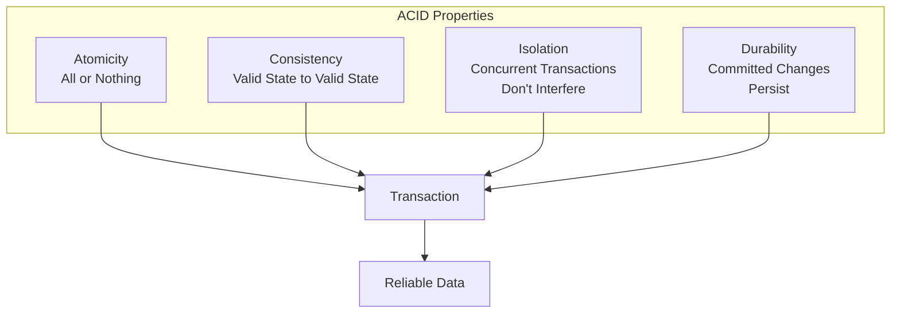
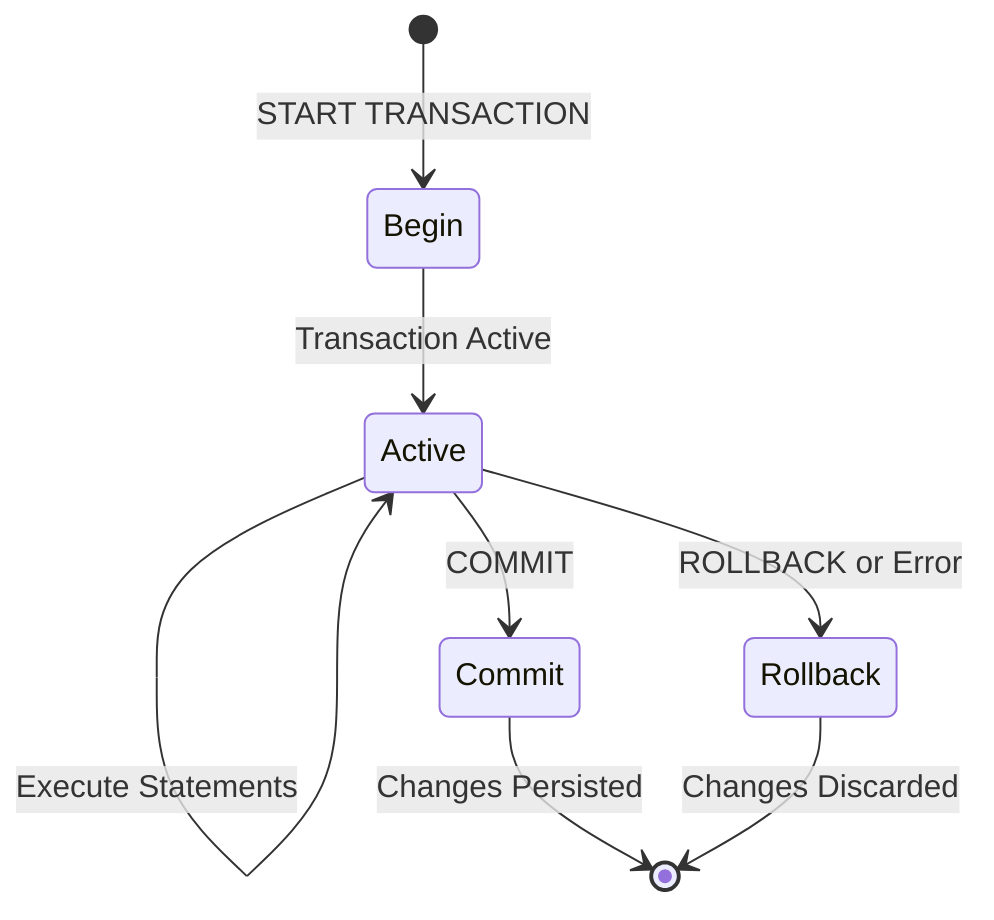
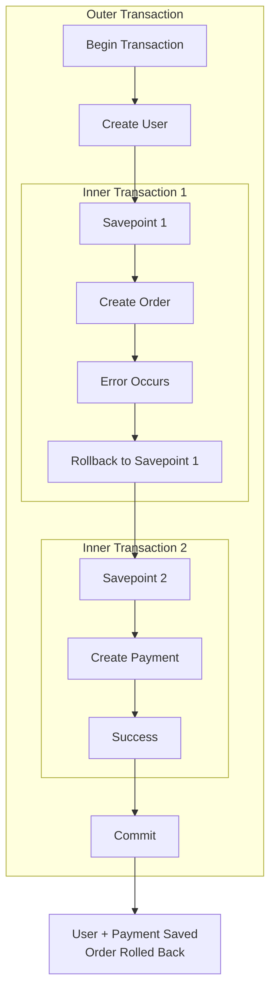
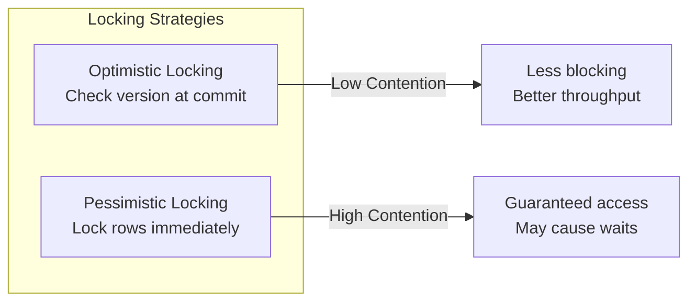
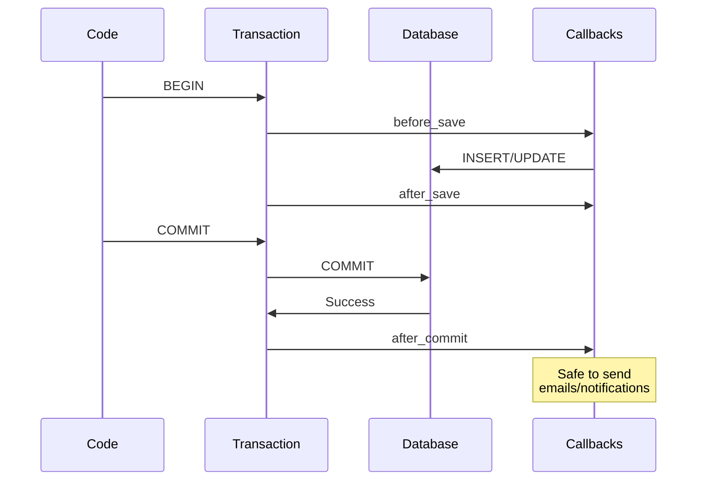
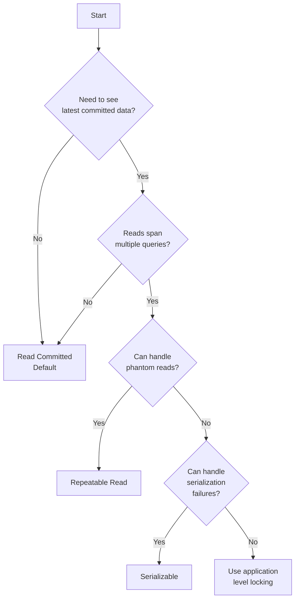

# How to Handle Transactions in Rails

Author: [nawazdhandala](https://www.github.com/nawazdhandala)

Tags: Ruby, Rails, Transactions, Database, ActiveRecord, ACID

Description: A comprehensive guide to handling database transactions in Ruby on Rails. Learn ACID properties, nested transactions, savepoints, locking strategies, and production best practices for data integrity.

---

> Database transactions are the backbone of data integrity in any application. When you need to ensure that multiple database operations succeed or fail together, transactions are your safety net. Rails provides elegant abstractions for working with transactions through ActiveRecord, making it easy to write reliable, consistent code.

Understanding transactions is crucial for building applications that handle money, inventory, user data, or any scenario where partial updates could leave your database in an inconsistent state. This guide covers everything from basic usage to advanced patterns you will encounter in production systems.

---

## Understanding Database Transactions

A transaction is a sequence of database operations that are treated as a single unit of work. Either all operations succeed, or none of them do. This all-or-nothing guarantee is what makes transactions essential for data integrity.

### The ACID Properties

Every database transaction guarantees four properties, commonly known as ACID:



Let's understand each property:

**Atomicity**: All operations within a transaction complete successfully, or none of them do. If any operation fails, the entire transaction rolls back.

**Consistency**: A transaction takes the database from one valid state to another valid state. Database constraints, foreign keys, and validations are enforced.

**Isolation**: Concurrent transactions do not interfere with each other. Each transaction sees a consistent snapshot of the database.

**Durability**: Once a transaction is committed, the changes persist even if the system crashes immediately after.

### Transaction Lifecycle

Understanding the lifecycle helps you reason about when data is actually committed:



---

## Basic Transaction Usage

### Simple Transactions

The most common way to use transactions in Rails is with a block:

```ruby
# app/services/order_service.rb

class OrderService
  def self.place_order(user, cart_items, payment_method)
    # Wrap all operations in a transaction
    # If any operation fails, everything rolls back
    ActiveRecord::Base.transaction do
      # Create the order record
      order = Order.create!(
        user: user,
        status: 'pending',
        total: calculate_total(cart_items)
      )
      
      # Create line items for each cart item
      cart_items.each do |item|
        OrderItem.create!(
          order: order,
          product: item.product,
          quantity: item.quantity,
          price: item.product.price
        )
        
        # Decrement inventory
        # This will raise an error if stock is insufficient
        item.product.decrement!(:stock_count, item.quantity)
      end
      
      # Process payment
      # If this fails, everything above gets rolled back
      payment = Payment.create!(
        order: order,
        amount: order.total,
        payment_method: payment_method,
        status: 'processing'
      )
      
      # Charge the payment (external service call)
      charge_result = PaymentGateway.charge(payment_method, order.total)
      
      unless charge_result.success?
        # Raise an error to trigger rollback
        raise PaymentFailedError, charge_result.error_message
      end
      
      # Update payment status
      payment.update!(
        status: 'completed',
        transaction_id: charge_result.transaction_id
      )
      
      # Update order status
      order.update!(status: 'confirmed')
      
      # Clear the user's cart
      user.cart_items.destroy_all
      
      # Return the completed order
      order
    end
  end
  
  private
  
  def self.calculate_total(cart_items)
    cart_items.sum { |item| item.product.price * item.quantity }
  end
end
```

### Model-Level Transactions

You can also call transactions on any model class:

```ruby
# Using the model class
User.transaction do
  user.update!(balance: user.balance - amount)
  recipient.update!(balance: recipient.balance + amount)
end

# Using an instance
user.transaction do
  user.update!(status: 'active')
  user.profile.update!(verified: true)
end

# All of these are equivalent - they use the same database connection
Order.transaction do
  # Same as ActiveRecord::Base.transaction
end
```

### Transaction Return Values

The transaction block returns the value of the last expression:

```ruby
# Return the created record
order = ActiveRecord::Base.transaction do
  order = Order.create!(user: user, status: 'pending')
  OrderItem.create!(order: order, product: product)
  order  # This is returned
end

puts order.id  # Works because order is returned

# Return a custom result
result = ActiveRecord::Base.transaction do
  order = Order.create!(user: user)
  payment = Payment.create!(order: order, amount: 100)
  
  { order: order, payment: payment, success: true }
end

puts result[:order].id
puts result[:payment].id
```

---

## Error Handling and Rollbacks

### Automatic Rollback on Exceptions

Any exception raised within a transaction block causes an automatic rollback:

```ruby
# app/services/transfer_service.rb

class TransferService
  # Custom error classes for different failure scenarios
  class InsufficientFundsError < StandardError; end
  class AccountFrozenError < StandardError; end
  class TransferLimitExceededError < StandardError; end
  
  def self.transfer(from_account, to_account, amount)
    ActiveRecord::Base.transaction do
      # Validate the transfer
      validate_transfer!(from_account, to_account, amount)
      
      # Debit the source account
      from_account.update!(
        balance: from_account.balance - amount,
        last_transaction_at: Time.current
      )
      
      # Credit the destination account
      to_account.update!(
        balance: to_account.balance + amount,
        last_transaction_at: Time.current
      )
      
      # Create transfer record
      Transfer.create!(
        from_account: from_account,
        to_account: to_account,
        amount: amount,
        status: 'completed'
      )
    end
  rescue InsufficientFundsError => e
    # Handle insufficient funds
    Rails.logger.warn("Transfer failed: #{e.message}")
    Transfer.create!(
      from_account: from_account,
      to_account: to_account,
      amount: amount,
      status: 'failed',
      failure_reason: 'insufficient_funds'
    )
    raise
  rescue AccountFrozenError => e
    # Handle frozen account
    Rails.logger.warn("Transfer failed: #{e.message}")
    raise
  end
  
  private
  
  def self.validate_transfer!(from_account, to_account, amount)
    if from_account.frozen?
      raise AccountFrozenError, "Source account #{from_account.id} is frozen"
    end
    
    if to_account.frozen?
      raise AccountFrozenError, "Destination account #{to_account.id} is frozen"
    end
    
    if from_account.balance < amount
      raise InsufficientFundsError, 
        "Account #{from_account.id} has insufficient funds"
    end
    
    if amount > from_account.daily_transfer_limit
      raise TransferLimitExceededError,
        "Amount exceeds daily transfer limit of #{from_account.daily_transfer_limit}"
    end
  end
end
```

### Manual Rollback with raise ActiveRecord::Rollback

Sometimes you want to rollback without raising an exception to the caller:

```ruby
# Manual rollback that does not propagate
result = ActiveRecord::Base.transaction do
  user = User.create!(name: 'John')
  
  if some_condition_fails?
    # Rollback the transaction but do not raise to caller
    raise ActiveRecord::Rollback
  end
  
  user
end

# result is nil if rollback was triggered
if result.nil?
  puts "Transaction was rolled back"
else
  puts "User created: #{result.id}"
end
```

### The requires_new Option for Nested Rollback Control

```ruby
# Outer transaction continues even if inner one rolls back
ActiveRecord::Base.transaction do
  User.create!(name: 'Alice')
  
  # This inner transaction can rollback independently
  ActiveRecord::Base.transaction(requires_new: true) do
    User.create!(name: 'Bob')
    raise ActiveRecord::Rollback  # Only rolls back Bob
  end
  
  User.create!(name: 'Charlie')
end

# Result: Alice and Charlie are created, Bob is not
```

---

## Nested Transactions and Savepoints

Rails supports nested transactions through savepoints. A savepoint is a marker within a transaction that you can roll back to without rolling back the entire transaction.

### How Nested Transactions Work



### Nested Transaction Example

```ruby
# app/services/batch_import_service.rb

class BatchImportService
  def self.import_users(user_data_list)
    imported = []
    failed = []
    
    ActiveRecord::Base.transaction do
      user_data_list.each do |user_data|
        # Each user import is wrapped in its own savepoint
        begin
          ActiveRecord::Base.transaction(requires_new: true) do
            user = User.create!(user_data[:attributes])
            
            # Create associated records
            user_data[:addresses]&.each do |address_data|
              user.addresses.create!(address_data)
            end
            
            user_data[:preferences]&.each do |pref_data|
              user.preferences.create!(pref_data)
            end
            
            imported << user
          end
        rescue ActiveRecord::RecordInvalid => e
          # Individual user import failed, but outer transaction continues
          failed << { data: user_data, error: e.message }
          Rails.logger.warn("Failed to import user: #{e.message}")
        end
      end
      
      # Check if we should abort the entire batch
      if failed.size > imported.size
        raise BatchImportError, "Too many failures: #{failed.size} failed, #{imported.size} succeeded"
      end
    end
    
    { imported: imported, failed: failed }
  end
end
```

### Savepoint Behavior

```ruby
# Understanding savepoint behavior
ActiveRecord::Base.transaction do
  puts "1. Outer transaction started"
  
  user = User.create!(name: 'Outer User')
  puts "2. Created outer user: #{user.id}"
  
  begin
    ActiveRecord::Base.transaction(requires_new: true) do
      puts "3. Inner transaction (savepoint) started"
      
      inner_user = User.create!(name: 'Inner User')
      puts "4. Created inner user: #{inner_user.id}"
      
      # This rolls back only to the savepoint
      raise ActiveRecord::Rollback
    end
  rescue => e
    puts "5. Caught exception: #{e.class}"
  end
  
  puts "6. After inner transaction"
  puts "7. Users in database: #{User.count}"
  
  another_user = User.create!(name: 'Another Outer User')
  puts "8. Created another user: #{another_user.id}"
end

puts "9. Final user count: #{User.count}"
# Output shows: Outer User and Another Outer User exist
# Inner User was rolled back
```

---

## Locking Strategies

When multiple processes access the same data, you need locking to prevent race conditions and ensure data integrity.

### Types of Locks



### Optimistic Locking

Optimistic locking assumes conflicts are rare. It uses a version column to detect concurrent modifications:

```ruby
# Migration to add lock_version column
class AddLockVersionToProducts < ActiveRecord::Migration[7.0]
  def change
    add_column :products, :lock_version, :integer, default: 0, null: false
  end
end
```

```ruby
# app/models/product.rb

class Product < ApplicationRecord
  # Optimistic locking is automatic when lock_version column exists
  
  # You can customize the column name if needed
  # self.locking_column = :version
end
```

```ruby
# Using optimistic locking
def update_product_stock(product_id, quantity_change)
  product = Product.find(product_id)
  product.stock_count += quantity_change
  product.save!
rescue ActiveRecord::StaleObjectError
  # Another process modified this record
  # Reload and retry
  retry_count ||= 0
  retry_count += 1
  
  if retry_count < 3
    product.reload
    retry
  else
    raise "Failed to update product after 3 attempts"
  end
end
```

```ruby
# A more robust optimistic locking pattern
class InventoryService
  MAX_RETRIES = 5
  
  def self.decrement_stock(product_id, quantity)
    retries = 0
    
    begin
      product = Product.find(product_id)
      
      if product.stock_count < quantity
        raise InsufficientStockError, "Only #{product.stock_count} items available"
      end
      
      product.stock_count -= quantity
      product.save!
      
      product
    rescue ActiveRecord::StaleObjectError => e
      retries += 1
      
      if retries < MAX_RETRIES
        Rails.logger.info("Retrying stock update for product #{product_id} (attempt #{retries})")
        sleep(0.1 * retries)  # Exponential backoff
        retry
      else
        Rails.logger.error("Failed to update stock after #{MAX_RETRIES} attempts")
        raise ConcurrencyError, "Unable to update stock due to high contention"
      end
    end
  end
end
```

### Pessimistic Locking

Pessimistic locking locks rows in the database, preventing other transactions from modifying them:

```ruby
# Basic pessimistic lock (SELECT ... FOR UPDATE)
def withdraw(account_id, amount)
  Account.transaction do
    # Lock the row - other transactions will wait here
    account = Account.lock.find(account_id)
    
    if account.balance < amount
      raise InsufficientFundsError, "Insufficient funds"
    end
    
    account.update!(balance: account.balance - amount)
    
    Withdrawal.create!(
      account: account,
      amount: amount,
      processed_at: Time.current
    )
  end
end
```

```ruby
# Different lock modes (PostgreSQL)
class AccountService
  def self.transfer(from_id, to_id, amount)
    Account.transaction do
      # Lock both accounts to prevent deadlocks
      # Always lock in consistent order (by ID) to prevent deadlocks
      account_ids = [from_id, to_id].sort
      
      accounts = Account
        .where(id: account_ids)
        .order(:id)
        .lock('FOR UPDATE')
        .to_a
      
      from_account = accounts.find { |a| a.id == from_id }
      to_account = accounts.find { |a| a.id == to_id }
      
      validate_transfer!(from_account, to_account, amount)
      
      from_account.update!(balance: from_account.balance - amount)
      to_account.update!(balance: to_account.balance + amount)
      
      Transfer.create!(
        from_account: from_account,
        to_account: to_account,
        amount: amount
      )
    end
  end
  
  private
  
  def self.validate_transfer!(from_account, to_account, amount)
    raise "Source account not found" unless from_account
    raise "Destination account not found" unless to_account
    raise InsufficientFundsError if from_account.balance < amount
  end
end
```

### Lock Modes in PostgreSQL

```ruby
# Different PostgreSQL lock modes available in Rails

# FOR UPDATE - Exclusive lock, blocks other FOR UPDATE and FOR SHARE
Account.lock('FOR UPDATE').find(id)

# FOR UPDATE NOWAIT - Fail immediately if lock cannot be acquired
Account.lock('FOR UPDATE NOWAIT').find(id)

# FOR UPDATE SKIP LOCKED - Skip rows that are already locked
Account.lock('FOR UPDATE SKIP LOCKED').where(status: 'pending').limit(10)

# FOR SHARE - Shared lock, allows other FOR SHARE but blocks FOR UPDATE
Account.lock('FOR SHARE').find(id)
```

```ruby
# Using SKIP LOCKED for job queue pattern
class JobProcessor
  def self.process_pending_jobs(batch_size: 10)
    loop do
      jobs = Job.transaction do
        # Get jobs that are not locked by other workers
        pending_jobs = Job
          .where(status: 'pending')
          .order(:created_at)
          .limit(batch_size)
          .lock('FOR UPDATE SKIP LOCKED')
          .to_a
        
        break [] if pending_jobs.empty?
        
        # Mark them as processing
        pending_jobs.each do |job|
          job.update!(status: 'processing', started_at: Time.current)
        end
        
        pending_jobs
      end
      
      break if jobs.empty?
      
      # Process jobs outside the transaction
      jobs.each do |job|
        process_job(job)
      end
    end
  end
  
  private
  
  def self.process_job(job)
    result = JobRunner.run(job)
    
    job.update!(
      status: result.success? ? 'completed' : 'failed',
      completed_at: Time.current,
      result: result.to_json
    )
  rescue => e
    job.update!(
      status: 'failed',
      error_message: e.message
    )
  end
end
```

### Row-Level Locking with with_lock

Rails provides a convenient `with_lock` method for pessimistic locking:

```ruby
# with_lock locks the record and wraps the block in a transaction
def process_payment(order_id, payment_details)
  order = Order.find(order_id)
  
  order.with_lock do
    # Order is locked for the duration of this block
    raise "Order already paid" if order.paid?
    
    payment = Payment.create!(
      order: order,
      amount: order.total,
      details: payment_details
    )
    
    result = PaymentGateway.charge(payment)
    
    if result.success?
      payment.update!(status: 'completed', transaction_id: result.id)
      order.update!(status: 'paid', paid_at: Time.current)
    else
      payment.update!(status: 'failed', error: result.error)
      raise PaymentFailedError, result.error
    end
  end
end
```

```ruby
# with_lock also accepts lock type (PostgreSQL)
order.with_lock('FOR UPDATE NOWAIT') do
  # Fails immediately if another transaction holds the lock
  process_order(order)
end
```

---

## Advanced Transaction Patterns

### Idempotent Transactions

Design transactions that can be safely retried:

```ruby
# app/services/idempotent_payment_service.rb

class IdempotentPaymentService
  def self.process_payment(idempotency_key:, order_id:, amount:)
    # Check if we have already processed this request
    existing = PaymentRecord.find_by(idempotency_key: idempotency_key)
    return existing if existing&.completed?
    
    ActiveRecord::Base.transaction do
      # Use advisory lock to prevent duplicate processing
      # This is a PostgreSQL-specific feature
      lock_key = Digest::MD5.hexdigest(idempotency_key).to_i(16) % (2**31)
      
      result = ActiveRecord::Base.connection.execute(
        "SELECT pg_try_advisory_xact_lock(#{lock_key})"
      )
      
      unless result.first['pg_try_advisory_xact_lock']
        raise ConcurrentRequestError, "Request already being processed"
      end
      
      # Double-check after acquiring lock
      existing = PaymentRecord.find_by(idempotency_key: idempotency_key)
      return existing if existing&.completed?
      
      # Create or update payment record
      payment = PaymentRecord.find_or_initialize_by(
        idempotency_key: idempotency_key
      )
      
      payment.assign_attributes(
        order_id: order_id,
        amount: amount,
        status: 'processing'
      )
      payment.save!
      
      # Process the actual payment
      result = PaymentGateway.charge(order_id, amount)
      
      if result.success?
        payment.update!(
          status: 'completed',
          transaction_id: result.transaction_id,
          completed_at: Time.current
        )
      else
        payment.update!(
          status: 'failed',
          error_message: result.error
        )
        raise PaymentFailedError, result.error
      end
      
      payment
    end
  end
end
```

### Distributed Transaction Patterns

When working with external services, you cannot rely on database transactions alone:

```ruby
# app/services/saga_order_service.rb

# Saga pattern for distributed transactions
class SagaOrderService
  def self.place_order(user_id, items, payment_method)
    order = nil
    payment = nil
    inventory_reserved = false
    
    begin
      # Step 1: Create the order
      order = Order.create!(
        user_id: user_id,
        status: 'pending',
        items_data: items.to_json
      )
      
      # Step 2: Reserve inventory (external service)
      inventory_reservation = InventoryService.reserve(items)
      inventory_reserved = true
      
      # Step 3: Process payment (external service)
      payment_result = PaymentService.charge(
        user_id: user_id,
        amount: calculate_total(items),
        payment_method: payment_method,
        order_id: order.id
      )
      
      # Step 4: Confirm the order
      ActiveRecord::Base.transaction do
        order.update!(
          status: 'confirmed',
          payment_id: payment_result.id,
          reservation_id: inventory_reservation.id
        )
      end
      
      order
    rescue InventoryService::InsufficientStockError => e
      # Compensation: Cancel the order
      order&.update!(status: 'cancelled', failure_reason: 'insufficient_stock')
      raise
    rescue PaymentService::PaymentFailedError => e
      # Compensation: Release inventory and cancel order
      InventoryService.release(inventory_reservation.id) if inventory_reserved
      order&.update!(status: 'cancelled', failure_reason: 'payment_failed')
      raise
    rescue => e
      # Compensation: Full rollback
      PaymentService.refund(payment_result.id) if payment_result&.success?
      InventoryService.release(inventory_reservation.id) if inventory_reserved
      order&.update!(status: 'cancelled', failure_reason: 'system_error')
      raise
    end
  end
  
  private
  
  def self.calculate_total(items)
    items.sum { |item| item[:price] * item[:quantity] }
  end
end
```

### Transactional Outbox Pattern

For reliable event publishing with database consistency:

```ruby
# Migration
class CreateOutboxEvents < ActiveRecord::Migration[7.0]
  def change
    create_table :outbox_events do |t|
      t.string :event_type, null: false
      t.string :aggregate_type, null: false
      t.bigint :aggregate_id, null: false
      t.jsonb :payload, null: false, default: {}
      t.datetime :processed_at
      t.timestamps
    end
    
    add_index :outbox_events, [:processed_at, :created_at]
  end
end
```

```ruby
# app/models/outbox_event.rb

class OutboxEvent < ApplicationRecord
  scope :pending, -> { where(processed_at: nil).order(:created_at) }
  
  def self.publish(event_type:, aggregate:, payload:)
    create!(
      event_type: event_type,
      aggregate_type: aggregate.class.name,
      aggregate_id: aggregate.id,
      payload: payload
    )
  end
  
  def mark_processed!
    update!(processed_at: Time.current)
  end
end
```

```ruby
# app/services/order_service_with_outbox.rb

class OrderServiceWithOutbox
  def self.confirm_order(order_id)
    ActiveRecord::Base.transaction do
      order = Order.lock.find(order_id)
      
      raise "Order already confirmed" if order.confirmed?
      
      order.update!(
        status: 'confirmed',
        confirmed_at: Time.current
      )
      
      # Publish event in the same transaction
      # This guarantees the event is created if and only if
      # the order is confirmed
      OutboxEvent.publish(
        event_type: 'order.confirmed',
        aggregate: order,
        payload: {
          order_id: order.id,
          user_id: order.user_id,
          total: order.total,
          confirmed_at: order.confirmed_at
        }
      )
      
      order
    end
  end
end
```

```ruby
# app/workers/outbox_processor.rb

class OutboxProcessor
  def self.process_pending_events(batch_size: 100)
    loop do
      events = OutboxEvent.transaction do
        pending = OutboxEvent
          .pending
          .limit(batch_size)
          .lock('FOR UPDATE SKIP LOCKED')
          .to_a
        
        break [] if pending.empty?
        
        pending
      end
      
      break if events.empty?
      
      events.each do |event|
        begin
          # Publish to message broker
          EventPublisher.publish(
            topic: event.event_type,
            payload: event.payload.merge(
              _metadata: {
                event_id: event.id,
                aggregate_type: event.aggregate_type,
                aggregate_id: event.aggregate_id,
                created_at: event.created_at
              }
            )
          )
          
          event.mark_processed!
        rescue => e
          Rails.logger.error("Failed to process outbox event #{event.id}: #{e.message}")
          # Event will be retried on next run
        end
      end
    end
  end
end
```

---

## Transaction Callbacks

Rails provides callbacks that run at specific points during a transaction:

```ruby
# app/models/order.rb

class Order < ApplicationRecord
  # Callbacks that run inside the transaction
  before_save :calculate_total
  after_save :update_inventory
  
  # Callbacks that run after the transaction commits
  after_commit :send_confirmation_email, on: :create
  after_commit :notify_warehouse, on: :update
  
  # Runs after commit OR after rollback
  after_rollback :log_failure
  
  private
  
  def calculate_total
    self.total = order_items.sum { |item| item.price * item.quantity }
  end
  
  def update_inventory
    # This runs inside the transaction
    # If this fails, the save is rolled back
    order_items.each do |item|
      item.product.decrement!(:stock_count, item.quantity)
    end
  end
  
  def send_confirmation_email
    # This runs AFTER the transaction commits
    # Safe to send emails here because we know the data is persisted
    OrderMailer.confirmation(self).deliver_later
  end
  
  def notify_warehouse
    # Only notify if status changed to 'confirmed'
    if previous_changes.key?('status') && status == 'confirmed'
      WarehouseNotificationJob.perform_later(id)
    end
  end
  
  def log_failure
    Rails.logger.error("Order #{id || 'new'} transaction rolled back")
  end
end
```

### Understanding Callback Timing



### Using after_commit Safely

```ruby
# app/models/user.rb

class User < ApplicationRecord
  # WRONG: Sending email in after_save can cause issues
  # If the transaction rolls back, email is already sent
  # after_save :send_welcome_email  # DON'T DO THIS
  
  # RIGHT: Send email after transaction commits
  after_commit :send_welcome_email, on: :create
  
  # Use after_commit for any side effects that should only
  # happen when data is definitely persisted
  after_commit :sync_to_crm, on: [:create, :update]
  after_commit :invalidate_cache, on: [:update, :destroy]
  after_commit :trigger_webhooks, on: :update
  
  private
  
  def send_welcome_email
    UserMailer.welcome(self).deliver_later
  end
  
  def sync_to_crm
    CrmSyncJob.perform_later(id)
  end
  
  def invalidate_cache
    Rails.cache.delete("user_#{id}")
    Rails.cache.delete("user_#{email}")
  end
  
  def trigger_webhooks
    WebhookDeliveryJob.perform_later(
      event: 'user.updated',
      payload: as_json(only: [:id, :email, :name, :updated_at])
    )
  end
end
```

---

## Multi-Database Transactions

Rails 6+ supports multiple databases. Transactions do not automatically span databases:

```ruby
# config/database.yml
production:
  primary:
    database: myapp_production
    # ...
  
  analytics:
    database: myapp_analytics
    # ...
```

```ruby
# Transactions are per-database
class Report < ApplicationRecord
  connects_to database: { writing: :analytics }
end

# This transaction only covers the primary database
ActiveRecord::Base.transaction do
  user = User.create!(name: 'John')  # Primary database
  
  # This is NOT in the same transaction!
  Report.create!(user_id: user.id)   # Analytics database
end
```

```ruby
# Coordinating transactions across databases
class CrossDatabaseService
  def self.create_user_with_analytics(attributes)
    user = nil
    
    # Outer transaction on primary
    ActiveRecord::Base.transaction do
      user = User.create!(attributes)
      
      # Inner transaction on analytics
      Report.transaction do
        Report.create!(
          user_id: user.id,
          event_type: 'user_created',
          data: attributes.to_json
        )
      end
    end
    
    user
  rescue => e
    # Note: If analytics transaction succeeds but primary fails,
    # we have inconsistency. Handle this case appropriately.
    Rails.logger.error("Cross-database transaction failed: #{e.message}")
    raise
  end
end
```

---

## Transaction Isolation Levels

PostgreSQL supports different isolation levels that control what data a transaction can see:

```ruby
# Setting isolation level for a transaction
ActiveRecord::Base.transaction(isolation: :serializable) do
  # Strongest isolation - prevents all anomalies
  # But may cause more failures due to serialization errors
end

# Available isolation levels (PostgreSQL):
# :read_uncommitted  - Weakest (treated as read_committed in PostgreSQL)
# :read_committed    - Default - sees only committed data
# :repeatable_read   - Snapshot at transaction start
# :serializable      - Strongest - transactions appear serial
```

```ruby
# Handling serialization failures
class CriticalService
  MAX_RETRIES = 5
  
  def self.process_critical_operation(data)
    retries = 0
    
    begin
      ActiveRecord::Base.transaction(isolation: :serializable) do
        # Critical operations here
        process_data(data)
      end
    rescue ActiveRecord::SerializationFailure => e
      retries += 1
      
      if retries < MAX_RETRIES
        sleep(0.1 * (2 ** retries))  # Exponential backoff
        retry
      else
        raise "Serialization failed after #{MAX_RETRIES} attempts"
      end
    end
  end
end
```

### Choosing Isolation Level



---

## Production Best Practices

### Keep Transactions Short

```ruby
# BAD: Long transaction that holds locks
ActiveRecord::Base.transaction do
  order = Order.create!(params)
  
  # External API call inside transaction - DON'T DO THIS
  result = SlowExternalService.call(order.id)  # Takes 5 seconds
  
  order.update!(external_id: result.id)
end

# GOOD: Minimize transaction scope
order = nil

# Transaction 1: Create order
ActiveRecord::Base.transaction do
  order = Order.create!(params.merge(status: 'pending'))
end

# External call outside transaction
result = SlowExternalService.call(order.id)

# Transaction 2: Update order
ActiveRecord::Base.transaction do
  order.update!(external_id: result.id, status: 'processing')
end
```

### Handle Deadlocks

```ruby
# Deadlock-aware transaction wrapper
module TransactionHelper
  MAX_DEADLOCK_RETRIES = 3
  
  def self.with_retry(&block)
    retries = 0
    
    begin
      ActiveRecord::Base.transaction(&block)
    rescue ActiveRecord::Deadlocked => e
      retries += 1
      
      if retries < MAX_DEADLOCK_RETRIES
        Rails.logger.warn("Deadlock detected, retrying (attempt #{retries})")
        sleep(0.1 * retries + rand * 0.1)  # Jittered backoff
        retry
      else
        Rails.logger.error("Deadlock persisted after #{MAX_DEADLOCK_RETRIES} attempts")
        raise
      end
    end
  end
end

# Usage
TransactionHelper.with_retry do
  # Your transactional code
end
```

### Monitor Transaction Performance

```ruby
# config/initializers/transaction_monitoring.rb

ActiveSupport::Notifications.subscribe('transaction.active_record') do |*args|
  event = ActiveSupport::Notifications::Event.new(*args)
  
  duration_ms = event.duration
  outcome = event.payload[:outcome]  # :commit or :rollback
  
  # Log slow transactions
  if duration_ms > 1000  # 1 second threshold
    Rails.logger.warn(
      "Slow transaction detected",
      duration_ms: duration_ms.round(2),
      outcome: outcome,
      connection: event.payload[:connection]&.class&.name
    )
  end
  
  # Track metrics
  StatsD.timing('database.transaction.duration', duration_ms, tags: [
    "outcome:#{outcome}"
  ])
  
  StatsD.increment('database.transaction.count', tags: [
    "outcome:#{outcome}"
  ])
end
```

### Connection Pool Considerations

```ruby
# config/database.yml
production:
  adapter: postgresql
  pool: <%= ENV.fetch("RAILS_MAX_THREADS", 5) %>
  checkout_timeout: 5
  # ...

# Ensure you have enough connections for your concurrency
# Each thread needs its own connection during a transaction
```

```ruby
# Monitor connection pool usage
module ConnectionPoolMonitor
  def self.log_stats
    pool = ActiveRecord::Base.connection_pool
    
    Rails.logger.info(
      "Connection Pool Stats",
      size: pool.size,
      connections: pool.connections.size,
      active: pool.connections.count(&:in_use?),
      idle: pool.connections.count { |c| !c.in_use? },
      waiting: pool.num_waiting_in_queue
    )
  end
end

# Log periodically
Thread.new do
  loop do
    sleep 60
    ConnectionPoolMonitor.log_stats
  end
end
```

---

## Common Mistakes and How to Avoid Them

### Mistake 1: External Calls Inside Transactions

```ruby
# BAD: API call inside transaction holds the lock
ActiveRecord::Base.transaction do
  order = Order.create!(params)
  PaymentGateway.charge(order.total)  # External API call
  order.update!(status: 'paid')
end

# GOOD: Move external calls outside transaction
order = Order.create!(params)

begin
  result = PaymentGateway.charge(order.total)
  order.update!(status: 'paid', payment_id: result.id)
rescue PaymentGateway::Error => e
  order.update!(status: 'payment_failed', error: e.message)
  raise
end
```

### Mistake 2: Not Handling Transaction Failures

```ruby
# BAD: No error handling
def process_order(order_id)
  ActiveRecord::Base.transaction do
    order = Order.find(order_id)
    order.process!
  end
end

# GOOD: Proper error handling
def process_order(order_id)
  ActiveRecord::Base.transaction do
    order = Order.find(order_id)
    order.process!
  end
rescue ActiveRecord::RecordNotFound => e
  Rails.logger.error("Order not found: #{order_id}")
  raise OrderNotFoundError, order_id
rescue ActiveRecord::RecordInvalid => e
  Rails.logger.error("Validation failed: #{e.message}")
  raise OrderProcessingError, e.message
rescue ActiveRecord::Deadlocked => e
  Rails.logger.error("Deadlock detected")
  raise RetryableError, "Please try again"
end
```

### Mistake 3: Assuming Nested Transactions Work Like You Expect

```ruby
# This does NOT create independent transactions by default
ActiveRecord::Base.transaction do
  User.create!(name: 'Alice')
  
  ActiveRecord::Base.transaction do  # This is a NO-OP
    User.create!(name: 'Bob')
    raise ActiveRecord::Rollback  # Rolls back ENTIRE outer transaction
  end
  
  User.create!(name: 'Charlie')  # This code is never reached
end

# Use requires_new: true for independent nested transactions
ActiveRecord::Base.transaction do
  User.create!(name: 'Alice')
  
  ActiveRecord::Base.transaction(requires_new: true) do
    User.create!(name: 'Bob')
    raise ActiveRecord::Rollback  # Only rolls back Bob
  end
  
  User.create!(name: 'Charlie')  # Alice and Charlie are saved
end
```

### Mistake 4: Forgetting About Partial Failures

```ruby
# BAD: Partial failure leaves inconsistent state
def transfer_all(transfers)
  transfers.each do |transfer|
    ActiveRecord::Base.transaction do
      process_transfer(transfer)
    end
  end
end
# If third transfer fails, first two are committed

# GOOD: All-or-nothing batch processing
def transfer_all(transfers)
  ActiveRecord::Base.transaction do
    transfers.each do |transfer|
      process_transfer(transfer)
    end
  end
end
# If any transfer fails, all are rolled back
```

---

## Summary

Database transactions are fundamental to building reliable Rails applications. Key takeaways:

- **Use transactions when multiple operations must succeed or fail together** - especially for financial operations, inventory management, and user data
- **Keep transactions short** to minimize lock contention and improve throughput
- **Never make external API calls inside transactions** - move them outside or use patterns like transactional outbox
- **Choose the right locking strategy** - optimistic for low contention, pessimistic for high contention scenarios
- **Use after_commit callbacks for side effects** like sending emails or publishing events
- **Handle transaction failures gracefully** with proper retry logic and error handling
- **Monitor transaction performance** to catch slow transactions before they become problems

By mastering transactions, you build applications that maintain data integrity even under high load and concurrent access.

---

*Building reliable Rails applications requires comprehensive observability. [OneUptime](https://oneuptime.com) provides deep monitoring for Ruby on Rails applications, including database query performance, transaction metrics, and real-time alerting for your production systems.*
