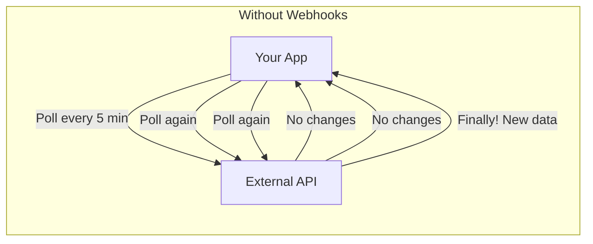
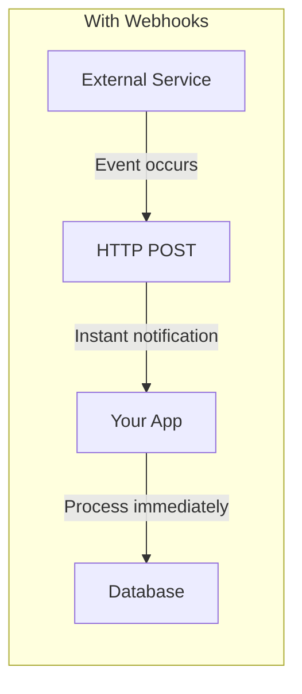
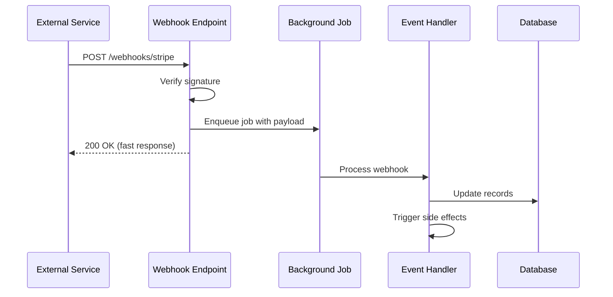
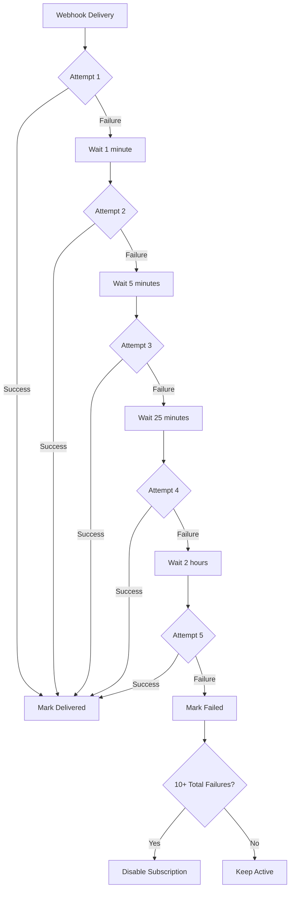
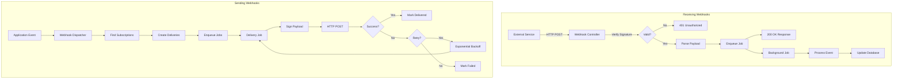

# How to Implement Webhooks in Rails Applications

Author: [nawazdhandala](https://www.github.com/nawazdhandala)

Tags: Ruby, Rails, Webhooks, API, Integration, Events

Description: Learn how to implement robust webhooks in Ruby on Rails applications. This guide covers receiving webhooks, sending webhooks, signature verification, retry logic, and production best practices.

---

> Webhooks are the backbone of modern application integrations. Instead of constantly polling an API for changes, webhooks push data to your application in real-time when events occur. Mastering webhooks is essential for building integrations with payment processors, CI/CD systems, and third-party services.

This guide covers both sides of webhooks: receiving webhooks from external services (like Stripe or GitHub) and sending webhooks to notify your users about events in your application.

---

## Understanding Webhooks

Webhooks are HTTP callbacks that deliver data to your application when specific events occur. They follow a push model rather than a pull model.





### Webhook Architecture Overview



Key principles:
- **Respond quickly**: Return 2xx status within seconds
- **Process asynchronously**: Use background jobs for heavy lifting
- **Verify signatures**: Always authenticate incoming webhooks
- **Handle idempotently**: Webhooks may be delivered multiple times
- **Log everything**: Debugging webhooks requires detailed logs

---

## Receiving Webhooks

Let's start by building a robust system to receive webhooks from external services.

### Basic Webhook Controller

Create a controller to handle incoming webhooks:

```ruby
# app/controllers/webhooks_controller.rb
class WebhooksController < ApplicationController
  # Skip CSRF protection for webhook endpoints
  # Webhooks come from external services without Rails CSRF tokens
  skip_before_action :verify_authenticity_token

  # POST /webhooks/stripe
  def stripe
    # Get the raw request body for signature verification
    payload = request.body.read

    # Verify the webhook signature
    unless verify_stripe_signature(payload, request.headers)
      Rails.logger.warn("Invalid Stripe webhook signature")
      head :unauthorized
      return
    end

    # Parse the event data
    event = JSON.parse(payload, symbolize_names: true)

    # Log the incoming webhook for debugging
    Rails.logger.info("Received Stripe webhook: #{event[:type]}")

    # Enqueue background job for processing
    # This allows us to respond quickly to Stripe
    StripeWebhookJob.perform_later(event)

    # Return success immediately
    # Stripe expects a 2xx response within 20 seconds
    head :ok
  rescue JSON::ParserError => e
    Rails.logger.error("Invalid JSON in Stripe webhook: #{e.message}")
    head :bad_request
  end

  # POST /webhooks/github
  def github
    payload = request.body.read

    unless verify_github_signature(payload, request.headers)
      Rails.logger.warn("Invalid GitHub webhook signature")
      head :unauthorized
      return
    end

    event_type = request.headers["X-GitHub-Event"]
    event = JSON.parse(payload, symbolize_names: true)

    Rails.logger.info("Received GitHub webhook: #{event_type}")

    GithubWebhookJob.perform_later(event_type, event)

    head :ok
  rescue JSON::ParserError => e
    Rails.logger.error("Invalid JSON in GitHub webhook: #{e.message}")
    head :bad_request
  end

  private

  # Verify Stripe webhook signature using HMAC-SHA256
  def verify_stripe_signature(payload, headers)
    signature = headers["Stripe-Signature"]
    return false unless signature.present?

    # Parse the signature header
    # Format: t=timestamp,v1=signature
    parts = signature.split(",").map { |part| part.split("=") }.to_h
    timestamp = parts["t"]
    expected_signature = parts["v1"]

    return false unless timestamp && expected_signature

    # Verify timestamp is recent (within 5 minutes)
    # This prevents replay attacks
    if Time.now.to_i - timestamp.to_i > 300
      Rails.logger.warn("Stripe webhook timestamp too old")
      return false
    end

    # Compute expected signature
    # Stripe uses: HMAC-SHA256(timestamp + "." + payload)
    signed_payload = "#{timestamp}.#{payload}"
    computed_signature = OpenSSL::HMAC.hexdigest(
      "SHA256",
      ENV.fetch("STRIPE_WEBHOOK_SECRET"),
      signed_payload
    )

    # Use secure comparison to prevent timing attacks
    ActiveSupport::SecurityUtils.secure_compare(
      computed_signature,
      expected_signature
    )
  end

  # Verify GitHub webhook signature using HMAC-SHA256
  def verify_github_signature(payload, headers)
    signature = headers["X-Hub-Signature-256"]
    return false unless signature.present?

    # GitHub sends: sha256=signature
    expected_signature = signature.sub("sha256=", "")

    computed_signature = OpenSSL::HMAC.hexdigest(
      "SHA256",
      ENV.fetch("GITHUB_WEBHOOK_SECRET"),
      payload
    )

    ActiveSupport::SecurityUtils.secure_compare(
      computed_signature,
      expected_signature
    )
  end
end
```

### Routes Configuration

```ruby
# config/routes.rb
Rails.application.routes.draw do
  # Webhook endpoints
  # Use a dedicated namespace for clarity
  namespace :webhooks do
    post "stripe", to: "/webhooks#stripe"
    post "github", to: "/webhooks#github"
    post "sendgrid", to: "/webhooks#sendgrid"
  end

  # Alternative: Generic webhook endpoint with provider param
  post "webhooks/:provider", to: "webhooks#receive"
end
```

---

## Signature Verification Service

Extract signature verification into a reusable service:

```ruby
# app/services/webhook_signature_verifier.rb
class WebhookSignatureVerifier
  class InvalidSignatureError < StandardError; end
  class ExpiredTimestampError < StandardError; end

  # Maximum age for webhook timestamps (5 minutes)
  TIMESTAMP_TOLERANCE = 300

  # Verify Stripe webhook signatures
  # Stripe uses a custom format with timestamp
  def self.verify_stripe!(payload:, signature_header:, secret:)
    return false unless signature_header.present?

    # Parse signature header: t=timestamp,v1=signature
    parts = parse_stripe_signature(signature_header)
    timestamp = parts["t"]&.to_i
    signature = parts["v1"]

    raise InvalidSignatureError, "Missing signature components" unless timestamp && signature

    # Check timestamp freshness
    if Time.now.to_i - timestamp > TIMESTAMP_TOLERANCE
      raise ExpiredTimestampError, "Webhook timestamp expired"
    end

    # Compute and compare signature
    signed_payload = "#{timestamp}.#{payload}"
    expected = compute_hmac_sha256(secret, signed_payload)

    unless secure_compare(expected, signature)
      raise InvalidSignatureError, "Signature mismatch"
    end

    true
  end

  # Verify GitHub webhook signatures
  # GitHub uses: X-Hub-Signature-256: sha256=signature
  def self.verify_github!(payload:, signature_header:, secret:)
    return false unless signature_header.present?

    # Extract signature from header
    signature = signature_header.sub("sha256=", "")
    expected = compute_hmac_sha256(secret, payload)

    unless secure_compare(expected, signature)
      raise InvalidSignatureError, "Signature mismatch"
    end

    true
  end

  # Verify generic HMAC-SHA256 signatures
  # Many services use this pattern
  def self.verify_hmac_sha256!(payload:, signature:, secret:)
    expected = compute_hmac_sha256(secret, payload)

    unless secure_compare(expected, signature)
      raise InvalidSignatureError, "Signature mismatch"
    end

    true
  end

  private

  def self.parse_stripe_signature(header)
    header.split(",").each_with_object({}) do |pair, hash|
      key, value = pair.split("=", 2)
      hash[key] = value
    end
  end

  def self.compute_hmac_sha256(secret, payload)
    OpenSSL::HMAC.hexdigest("SHA256", secret, payload)
  end

  def self.secure_compare(a, b)
    ActiveSupport::SecurityUtils.secure_compare(a, b)
  end
end
```

---

## Background Job Processing

Process webhooks asynchronously to respond quickly:

```ruby
# app/jobs/stripe_webhook_job.rb
class StripeWebhookJob < ApplicationJob
  # Use a dedicated queue for webhooks
  queue_as :webhooks

  # Retry with exponential backoff
  retry_on StandardError, wait: :exponentially_longer, attempts: 5

  # Don't retry on certain errors
  discard_on ActiveJob::DeserializationError

  def perform(event)
    # Extract event type and data
    event_type = event[:type]
    data = event[:data][:object]

    # Log processing start
    Rails.logger.info("Processing Stripe event: #{event_type}")

    # Route to appropriate handler based on event type
    case event_type
    when "checkout.session.completed"
      handle_checkout_completed(data)
    when "invoice.paid"
      handle_invoice_paid(data)
    when "invoice.payment_failed"
      handle_payment_failed(data)
    when "customer.subscription.updated"
      handle_subscription_updated(data)
    when "customer.subscription.deleted"
      handle_subscription_deleted(data)
    else
      Rails.logger.info("Unhandled Stripe event type: #{event_type}")
    end
  end

  private

  def handle_checkout_completed(session)
    # Find or create the customer
    customer = Customer.find_by(stripe_customer_id: session[:customer])
    return unless customer

    # Update subscription status
    customer.update!(
      subscription_status: "active",
      subscription_id: session[:subscription]
    )

    # Send welcome email
    CustomerMailer.subscription_welcome(customer).deliver_later

    Rails.logger.info("Checkout completed for customer #{customer.id}")
  end

  def handle_invoice_paid(invoice)
    customer = Customer.find_by(stripe_customer_id: invoice[:customer])
    return unless customer

    # Record the payment
    Payment.create!(
      customer: customer,
      stripe_invoice_id: invoice[:id],
      amount_cents: invoice[:amount_paid],
      currency: invoice[:currency],
      paid_at: Time.at(invoice[:status_transitions][:paid_at])
    )

    Rails.logger.info("Invoice paid for customer #{customer.id}")
  end

  def handle_payment_failed(invoice)
    customer = Customer.find_by(stripe_customer_id: invoice[:customer])
    return unless customer

    # Update customer status
    customer.update!(payment_status: "failed")

    # Notify customer about failed payment
    CustomerMailer.payment_failed(customer, invoice).deliver_later

    Rails.logger.info("Payment failed for customer #{customer.id}")
  end

  def handle_subscription_updated(subscription)
    customer = Customer.find_by(stripe_customer_id: subscription[:customer])
    return unless customer

    # Update subscription details
    customer.update!(
      subscription_status: subscription[:status],
      current_period_end: Time.at(subscription[:current_period_end])
    )

    Rails.logger.info("Subscription updated for customer #{customer.id}")
  end

  def handle_subscription_deleted(subscription)
    customer = Customer.find_by(stripe_customer_id: subscription[:customer])
    return unless customer

    # Mark subscription as canceled
    customer.update!(
      subscription_status: "canceled",
      subscription_id: nil
    )

    # Send cancellation email
    CustomerMailer.subscription_canceled(customer).deliver_later

    Rails.logger.info("Subscription canceled for customer #{customer.id}")
  end
end
```

---

## Idempotent Webhook Processing

Webhooks may be delivered multiple times. Use idempotency keys to prevent duplicate processing:

```ruby
# app/models/webhook_event.rb
class WebhookEvent < ApplicationRecord
  # Columns: id, provider, event_id, event_type, payload, 
  #          processed_at, created_at, updated_at

  validates :provider, presence: true
  validates :event_id, presence: true, uniqueness: { scope: :provider }

  scope :unprocessed, -> { where(processed_at: nil) }
  scope :processed, -> { where.not(processed_at: nil) }

  # Check if event was already processed
  def processed?
    processed_at.present?
  end

  # Mark event as processed
  def mark_processed!
    update!(processed_at: Time.current)
  end

  # Store and process webhook idempotently
  def self.process_idempotently(provider:, event_id:, event_type:, payload:)
    # Try to find existing event
    event = find_by(provider: provider, event_id: event_id)

    if event&.processed?
      Rails.logger.info("Skipping duplicate webhook: #{provider}/#{event_id}")
      return { status: :duplicate, event: event }
    end

    # Create or update event record
    event ||= new(provider: provider, event_id: event_id)
    event.event_type = event_type
    event.payload = payload
    event.save!

    # Yield to processing block
    yield(event)

    # Mark as processed
    event.mark_processed!

    { status: :processed, event: event }
  rescue ActiveRecord::RecordNotUnique
    # Handle race condition where two requests try to create same event
    Rails.logger.info("Race condition on webhook: #{provider}/#{event_id}")
    { status: :duplicate, event: find_by(provider: provider, event_id: event_id) }
  end
end
```

Update the job to use idempotent processing:

```ruby
# app/jobs/stripe_webhook_job.rb
class StripeWebhookJob < ApplicationJob
  queue_as :webhooks

  def perform(event)
    event_id = event[:id]
    event_type = event[:type]

    # Process idempotently to handle duplicate deliveries
    result = WebhookEvent.process_idempotently(
      provider: "stripe",
      event_id: event_id,
      event_type: event_type,
      payload: event.to_json
    ) do |webhook_event|
      # Process the event
      process_event(event_type, event[:data][:object])
    end

    Rails.logger.info("Webhook result: #{result[:status]} for #{event_id}")
  end

  private

  def process_event(event_type, data)
    case event_type
    when "checkout.session.completed"
      handle_checkout_completed(data)
    # ... other handlers
    end
  end
end
```

---

## Sending Webhooks

Now let's implement sending webhooks to notify external systems about events in your application.

### Webhook Subscription Model

```ruby
# app/models/webhook_subscription.rb
class WebhookSubscription < ApplicationRecord
  # Columns: id, user_id, url, events, secret, active,
  #          last_triggered_at, failure_count, created_at, updated_at

  belongs_to :user
  has_many :webhook_deliveries, dependent: :destroy

  # Store events as a JSON array
  serialize :events, coder: JSON

  validates :url, presence: true, format: { with: URI::DEFAULT_PARSER.make_regexp(%w[http https]) }
  validates :events, presence: true
  validates :secret, presence: true

  before_validation :generate_secret, on: :create

  scope :active, -> { where(active: true) }
  scope :for_event, ->(event) { where("events @> ?", [event].to_json) }

  # Maximum failures before auto-disabling
  MAX_FAILURES = 10

  # Check if subscription should receive this event
  def subscribed_to?(event_name)
    events.include?(event_name) || events.include?("*")
  end

  # Record successful delivery
  def record_success!
    update!(
      last_triggered_at: Time.current,
      failure_count: 0
    )
  end

  # Record failed delivery
  def record_failure!
    new_count = failure_count + 1
    update!(
      failure_count: new_count,
      active: new_count < MAX_FAILURES
    )

    # Notify user if subscription was disabled
    if new_count >= MAX_FAILURES
      WebhookMailer.subscription_disabled(self).deliver_later
    end
  end

  private

  def generate_secret
    self.secret ||= SecureRandom.hex(32)
  end
end
```

### Webhook Delivery Model

```ruby
# app/models/webhook_delivery.rb
class WebhookDelivery < ApplicationRecord
  # Columns: id, webhook_subscription_id, event_name, payload,
  #          response_code, response_body, delivered_at,
  #          attempts, last_attempt_at, created_at

  belongs_to :webhook_subscription

  validates :event_name, presence: true
  validates :payload, presence: true

  scope :pending, -> { where(delivered_at: nil) }
  scope :delivered, -> { where.not(delivered_at: nil) }
  scope :failed, -> { pending.where("attempts >= ?", 5) }

  # Maximum delivery attempts
  MAX_ATTEMPTS = 5

  def delivered?
    delivered_at.present?
  end

  def retryable?
    !delivered? && attempts < MAX_ATTEMPTS
  end

  def record_attempt!(response_code:, response_body:, success:)
    self.attempts += 1
    self.last_attempt_at = Time.current
    self.response_code = response_code
    self.response_body = response_body.to_s.truncate(10_000)

    if success
      self.delivered_at = Time.current
      webhook_subscription.record_success!
    elsif attempts >= MAX_ATTEMPTS
      webhook_subscription.record_failure!
    end

    save!
  end
end
```

### Webhook Sender Service

```ruby
# app/services/webhook_sender.rb
class WebhookSender
  include HTTParty

  # Timeout settings
  default_timeout 30

  class DeliveryError < StandardError; end

  def initialize(subscription, delivery)
    @subscription = subscription
    @delivery = delivery
  end

  def send!
    # Build the request payload
    payload = build_payload

    # Sign the payload
    signature = sign_payload(payload.to_json)

    # Send the webhook
    response = self.class.post(
      @subscription.url,
      body: payload.to_json,
      headers: build_headers(signature),
      timeout: 30
    )

    # Record the result
    success = response.success?
    @delivery.record_attempt!(
      response_code: response.code,
      response_body: response.body,
      success: success
    )

    unless success
      raise DeliveryError, "Webhook delivery failed: #{response.code}"
    end

    response
  rescue HTTParty::Error, Timeout::Error, SocketError => e
    @delivery.record_attempt!(
      response_code: 0,
      response_body: e.message,
      success: false
    )
    raise DeliveryError, "Webhook delivery error: #{e.message}"
  end

  private

  def build_payload
    {
      id: SecureRandom.uuid,
      event: @delivery.event_name,
      created_at: Time.current.iso8601,
      data: JSON.parse(@delivery.payload)
    }
  end

  def build_headers(signature)
    {
      "Content-Type" => "application/json",
      "User-Agent" => "MyApp-Webhooks/1.0",
      "X-Webhook-Signature" => signature,
      "X-Webhook-Event" => @delivery.event_name,
      "X-Webhook-Delivery" => @delivery.id.to_s,
      "X-Webhook-Timestamp" => Time.current.to_i.to_s
    }
  end

  def sign_payload(payload)
    timestamp = Time.current.to_i
    signed_payload = "#{timestamp}.#{payload}"
    signature = OpenSSL::HMAC.hexdigest(
      "SHA256",
      @subscription.secret,
      signed_payload
    )
    "t=#{timestamp},v1=#{signature}"
  end
end
```

### Webhook Delivery Job

```ruby
# app/jobs/webhook_delivery_job.rb
class WebhookDeliveryJob < ApplicationJob
  queue_as :webhooks

  # Retry with exponential backoff
  # Attempts at: immediately, 1min, 5min, 25min, 2hrs
  retry_on WebhookSender::DeliveryError,
           wait: ->(executions) { (executions ** 4) + 2 },
           attempts: 5

  def perform(delivery_id)
    delivery = WebhookDelivery.find(delivery_id)

    # Skip if already delivered
    return if delivery.delivered?

    # Skip if subscription is disabled
    return unless delivery.webhook_subscription.active?

    # Send the webhook
    sender = WebhookSender.new(
      delivery.webhook_subscription,
      delivery
    )
    sender.send!

    Rails.logger.info("Webhook delivered: #{delivery.id}")
  end
end
```

---

## Event Dispatching

Create a system to dispatch events to webhooks:

```ruby
# app/services/webhook_dispatcher.rb
class WebhookDispatcher
  def self.dispatch(event_name, payload, user: nil)
    new(event_name, payload, user).dispatch
  end

  def initialize(event_name, payload, user)
    @event_name = event_name
    @payload = payload
    @user = user
  end

  def dispatch
    subscriptions = find_subscriptions

    Rails.logger.info(
      "Dispatching webhook event '#{@event_name}' to #{subscriptions.count} subscribers"
    )

    subscriptions.each do |subscription|
      create_and_enqueue_delivery(subscription)
    end
  end

  private

  def find_subscriptions
    scope = WebhookSubscription.active

    # Filter by user if specified
    scope = scope.where(user: @user) if @user

    # Find subscriptions for this event
    scope.select { |sub| sub.subscribed_to?(@event_name) }
  end

  def create_and_enqueue_delivery(subscription)
    delivery = WebhookDelivery.create!(
      webhook_subscription: subscription,
      event_name: @event_name,
      payload: @payload.to_json
    )

    WebhookDeliveryJob.perform_later(delivery.id)
  end
end
```

### Using the Dispatcher in Models

```ruby
# app/models/order.rb
class Order < ApplicationRecord
  belongs_to :user

  after_create :dispatch_order_created_webhook
  after_update :dispatch_order_updated_webhook

  private

  def dispatch_order_created_webhook
    WebhookDispatcher.dispatch(
      "order.created",
      webhook_payload,
      user: user
    )
  end

  def dispatch_order_updated_webhook
    return unless saved_change_to_status?

    WebhookDispatcher.dispatch(
      "order.updated",
      webhook_payload,
      user: user
    )
  end

  def webhook_payload
    {
      id: id,
      status: status,
      total_cents: total_cents,
      currency: currency,
      items: order_items.map(&:webhook_payload),
      created_at: created_at.iso8601,
      updated_at: updated_at.iso8601
    }
  end
end
```

---

## Webhook Management API

Provide an API for users to manage their webhook subscriptions:

```ruby
# app/controllers/api/v1/webhook_subscriptions_controller.rb
module Api
  module V1
    class WebhookSubscriptionsController < ApplicationController
      before_action :authenticate_user!
      before_action :set_subscription, only: [:show, :update, :destroy, :test]

      # GET /api/v1/webhook_subscriptions
      def index
        subscriptions = current_user.webhook_subscriptions
          .order(created_at: :desc)
          .page(params[:page])
          .per(20)

        render json: {
          subscriptions: subscriptions.map { |s| serialize_subscription(s) },
          meta: pagination_meta(subscriptions)
        }
      end

      # GET /api/v1/webhook_subscriptions/:id
      def show
        render json: { subscription: serialize_subscription(@subscription) }
      end

      # POST /api/v1/webhook_subscriptions
      def create
        subscription = current_user.webhook_subscriptions.build(subscription_params)

        if subscription.save
          render json: {
            subscription: serialize_subscription(subscription)
          }, status: :created
        else
          render json: { errors: subscription.errors }, status: :unprocessable_entity
        end
      end

      # PATCH /api/v1/webhook_subscriptions/:id
      def update
        if @subscription.update(subscription_params)
          render json: { subscription: serialize_subscription(@subscription) }
        else
          render json: { errors: @subscription.errors }, status: :unprocessable_entity
        end
      end

      # DELETE /api/v1/webhook_subscriptions/:id
      def destroy
        @subscription.destroy
        head :no_content
      end

      # POST /api/v1/webhook_subscriptions/:id/test
      def test
        # Send a test webhook
        delivery = WebhookDelivery.create!(
          webhook_subscription: @subscription,
          event_name: "webhook.test",
          payload: {
            message: "This is a test webhook",
            timestamp: Time.current.iso8601
          }.to_json
        )

        WebhookDeliveryJob.perform_later(delivery.id)

        render json: {
          message: "Test webhook queued",
          delivery_id: delivery.id
        }
      end

      # GET /api/v1/webhook_subscriptions/:id/deliveries
      def deliveries
        set_subscription
        deliveries = @subscription.webhook_deliveries
          .order(created_at: :desc)
          .page(params[:page])
          .per(50)

        render json: {
          deliveries: deliveries.map { |d| serialize_delivery(d) },
          meta: pagination_meta(deliveries)
        }
      end

      private

      def set_subscription
        @subscription = current_user.webhook_subscriptions.find(params[:id])
      end

      def subscription_params
        params.require(:subscription).permit(:url, :active, events: [])
      end

      def serialize_subscription(subscription)
        {
          id: subscription.id,
          url: subscription.url,
          events: subscription.events,
          secret: subscription.secret,
          active: subscription.active,
          failure_count: subscription.failure_count,
          last_triggered_at: subscription.last_triggered_at&.iso8601,
          created_at: subscription.created_at.iso8601
        }
      end

      def serialize_delivery(delivery)
        {
          id: delivery.id,
          event_name: delivery.event_name,
          response_code: delivery.response_code,
          attempts: delivery.attempts,
          delivered: delivery.delivered?,
          delivered_at: delivery.delivered_at&.iso8601,
          created_at: delivery.created_at.iso8601
        }
      end

      def pagination_meta(collection)
        {
          current_page: collection.current_page,
          total_pages: collection.total_pages,
          total_count: collection.total_count
        }
      end
    end
  end
end
```

---

## Webhook Logging and Monitoring

```ruby
# app/models/concerns/webhook_logging.rb
module WebhookLogging
  extend ActiveSupport::Concern

  included do
    around_action :log_webhook_request, only: [:receive]
  end

  private

  def log_webhook_request
    request_id = request.request_id || SecureRandom.uuid
    start_time = Time.current

    # Log request details
    Rails.logger.tagged("webhook", request_id) do
      Rails.logger.info({
        event: "webhook_received",
        provider: params[:provider],
        method: request.method,
        path: request.path,
        content_length: request.content_length,
        user_agent: request.user_agent
      }.to_json)

      yield

      duration = ((Time.current - start_time) * 1000).round(2)

      Rails.logger.info({
        event: "webhook_processed",
        provider: params[:provider],
        status: response.status,
        duration_ms: duration
      }.to_json)
    end
  rescue StandardError => e
    Rails.logger.error({
      event: "webhook_error",
      provider: params[:provider],
      error_class: e.class.name,
      error_message: e.message
    }.to_json)
    raise
  end
end
```

### Webhook Metrics

```ruby
# app/services/webhook_metrics.rb
class WebhookMetrics
  class << self
    def record_received(provider:)
      increment("webhooks.received", tags: { provider: provider })
    end

    def record_processed(provider:, event_type:, duration:)
      timing("webhooks.processing_time", duration, tags: {
        provider: provider,
        event_type: event_type
      })
      increment("webhooks.processed", tags: {
        provider: provider,
        event_type: event_type
      })
    end

    def record_failed(provider:, event_type:, error:)
      increment("webhooks.failed", tags: {
        provider: provider,
        event_type: event_type,
        error: error.class.name
      })
    end

    def record_delivery_attempt(subscription_id:, success:)
      increment("webhooks.delivery_attempts", tags: {
        subscription_id: subscription_id,
        success: success
      })
    end

    private

    def increment(metric, tags: {})
      # Send to your metrics backend (StatsD, Prometheus, etc.)
      StatsD.increment(metric, tags: tags)
    end

    def timing(metric, value, tags: {})
      StatsD.timing(metric, value, tags: tags)
    end
  end
end
```

---

## Retry Strategy Diagram



---

## Testing Webhooks

### Controller Tests

```ruby
# spec/controllers/webhooks_controller_spec.rb
require "rails_helper"

RSpec.describe WebhooksController, type: :controller do
  describe "POST #stripe" do
    let(:payload) { { id: "evt_123", type: "checkout.session.completed" }.to_json }
    let(:timestamp) { Time.now.to_i }
    let(:secret) { "whsec_test123" }

    before do
      allow(ENV).to receive(:fetch).with("STRIPE_WEBHOOK_SECRET").and_return(secret)
    end

    context "with valid signature" do
      let(:signature) do
        signed_payload = "#{timestamp}.#{payload}"
        sig = OpenSSL::HMAC.hexdigest("SHA256", secret, signed_payload)
        "t=#{timestamp},v1=#{sig}"
      end

      it "returns success and enqueues job" do
        request.headers["Stripe-Signature"] = signature

        expect {
          post :stripe, body: payload
        }.to have_enqueued_job(StripeWebhookJob)

        expect(response).to have_http_status(:ok)
      end
    end

    context "with invalid signature" do
      it "returns unauthorized" do
        request.headers["Stripe-Signature"] = "invalid"

        post :stripe, body: payload

        expect(response).to have_http_status(:unauthorized)
      end
    end

    context "with expired timestamp" do
      let(:old_timestamp) { 10.minutes.ago.to_i }
      let(:signature) do
        signed_payload = "#{old_timestamp}.#{payload}"
        sig = OpenSSL::HMAC.hexdigest("SHA256", secret, signed_payload)
        "t=#{old_timestamp},v1=#{sig}"
      end

      it "returns unauthorized" do
        request.headers["Stripe-Signature"] = signature

        post :stripe, body: payload

        expect(response).to have_http_status(:unauthorized)
      end
    end
  end
end
```

### Service Tests

```ruby
# spec/services/webhook_sender_spec.rb
require "rails_helper"

RSpec.describe WebhookSender do
  let(:user) { create(:user) }
  let(:subscription) { create(:webhook_subscription, user: user, url: "https://example.com/webhooks") }
  let(:delivery) { create(:webhook_delivery, webhook_subscription: subscription) }

  describe "#send!" do
    context "when delivery succeeds" do
      before do
        stub_request(:post, subscription.url)
          .to_return(status: 200, body: "OK")
      end

      it "marks delivery as successful" do
        sender = described_class.new(subscription, delivery)
        sender.send!

        delivery.reload
        expect(delivery.delivered?).to be true
        expect(delivery.response_code).to eq(200)
      end
    end

    context "when delivery fails" do
      before do
        stub_request(:post, subscription.url)
          .to_return(status: 500, body: "Internal Server Error")
      end

      it "records failure and raises error" do
        sender = described_class.new(subscription, delivery)

        expect {
          sender.send!
        }.to raise_error(WebhookSender::DeliveryError)

        delivery.reload
        expect(delivery.delivered?).to be false
        expect(delivery.attempts).to eq(1)
        expect(delivery.response_code).to eq(500)
      end
    end

    context "when connection times out" do
      before do
        stub_request(:post, subscription.url).to_timeout
      end

      it "records failure with timeout error" do
        sender = described_class.new(subscription, delivery)

        expect {
          sender.send!
        }.to raise_error(WebhookSender::DeliveryError)

        delivery.reload
        expect(delivery.response_body).to include("timeout")
      end
    end
  end
end
```

---

## Database Migrations

```ruby
# db/migrate/XXXXXX_create_webhook_events.rb
class CreateWebhookEvents < ActiveRecord::Migration[7.0]
  def change
    create_table :webhook_events do |t|
      # Provider identification (stripe, github, etc.)
      t.string :provider, null: false

      # External event ID for idempotency
      t.string :event_id, null: false

      # Event type for routing
      t.string :event_type

      # Full payload stored as JSON
      t.jsonb :payload, default: {}

      # Processing status
      t.datetime :processed_at

      t.timestamps
    end

    # Ensure unique events per provider
    add_index :webhook_events, [:provider, :event_id], unique: true
    add_index :webhook_events, :processed_at
    add_index :webhook_events, :event_type
  end
end
```

```ruby
# db/migrate/XXXXXX_create_webhook_subscriptions.rb
class CreateWebhookSubscriptions < ActiveRecord::Migration[7.0]
  def change
    create_table :webhook_subscriptions do |t|
      t.references :user, null: false, foreign_key: true

      # Delivery URL
      t.string :url, null: false

      # Events to subscribe to (JSON array)
      t.jsonb :events, default: [], null: false

      # Signing secret
      t.string :secret, null: false

      # Subscription status
      t.boolean :active, default: true, null: false
      t.integer :failure_count, default: 0, null: false

      # Tracking
      t.datetime :last_triggered_at

      t.timestamps
    end

    add_index :webhook_subscriptions, :user_id
    add_index :webhook_subscriptions, :active
  end
end
```

```ruby
# db/migrate/XXXXXX_create_webhook_deliveries.rb
class CreateWebhookDeliveries < ActiveRecord::Migration[7.0]
  def change
    create_table :webhook_deliveries do |t|
      t.references :webhook_subscription, null: false, foreign_key: true

      # Event details
      t.string :event_name, null: false
      t.jsonb :payload, null: false

      # Delivery status
      t.integer :response_code
      t.text :response_body
      t.integer :attempts, default: 0, null: false
      t.datetime :last_attempt_at
      t.datetime :delivered_at

      t.timestamps
    end

    add_index :webhook_deliveries, :delivered_at
    add_index :webhook_deliveries, :event_name
    add_index :webhook_deliveries, [:webhook_subscription_id, :created_at]
  end
end
```

---

## Production Configuration

### Environment Variables

```ruby
# config/initializers/webhook_config.rb
Rails.application.configure do
  config.webhooks = ActiveSupport::OrderedOptions.new

  # Incoming webhook secrets (from external providers)
  config.webhooks.stripe_secret = ENV.fetch("STRIPE_WEBHOOK_SECRET", nil)
  config.webhooks.github_secret = ENV.fetch("GITHUB_WEBHOOK_SECRET", nil)
  config.webhooks.sendgrid_secret = ENV.fetch("SENDGRID_WEBHOOK_SECRET", nil)

  # Outgoing webhook settings
  config.webhooks.delivery_timeout = ENV.fetch("WEBHOOK_TIMEOUT", 30).to_i
  config.webhooks.max_retries = ENV.fetch("WEBHOOK_MAX_RETRIES", 5).to_i
  config.webhooks.max_failures = ENV.fetch("WEBHOOK_MAX_FAILURES", 10).to_i

  # Signature algorithm
  config.webhooks.signature_algorithm = "SHA256"
end
```

### Sidekiq Configuration

```yaml
# config/sidekiq.yml
:concurrency: 10
:queues:
  - [critical, 3]
  - [webhooks, 2]
  - [default, 1]
  - [low, 1]
```

---

## Webhook Data Flow



---

## Security Best Practices

### Signature Verification Checklist

1. **Always verify signatures** before processing webhooks
2. **Use timing-safe comparison** to prevent timing attacks
3. **Validate timestamps** to prevent replay attacks
4. **Store secrets securely** using environment variables
5. **Use HTTPS endpoints** for webhook URLs
6. **Rotate secrets periodically** when possible

### Rate Limiting Webhooks

```ruby
# app/controllers/concerns/webhook_rate_limiting.rb
module WebhookRateLimiting
  extend ActiveSupport::Concern

  included do
    before_action :check_rate_limit
  end

  private

  def check_rate_limit
    # Use IP-based rate limiting for webhooks
    key = "webhook_rate:#{request.remote_ip}"
    
    # Allow 100 requests per minute
    count = Rails.cache.increment(key, 1, expires_in: 1.minute)
    
    if count > 100
      Rails.logger.warn("Webhook rate limit exceeded: #{request.remote_ip}")
      head :too_many_requests
    end
  end
end
```

---

## Summary

Webhooks are essential for building real-time integrations. Key takeaways:

- **Verify signatures** using HMAC-SHA256 and timing-safe comparison
- **Process asynchronously** with background jobs for fast responses
- **Handle idempotently** using event IDs to prevent duplicate processing
- **Implement retries** with exponential backoff for failed deliveries
- **Log everything** for debugging webhook issues
- **Monitor delivery rates** and disable failing subscriptions automatically

Following these patterns ensures your webhook implementation is reliable, secure, and maintainable.

---

*Need to monitor your webhook deliveries and system health? [OneUptime](https://oneuptime.com) provides comprehensive observability for Rails applications, including webhook delivery tracking, failure alerting, and performance monitoring.*

